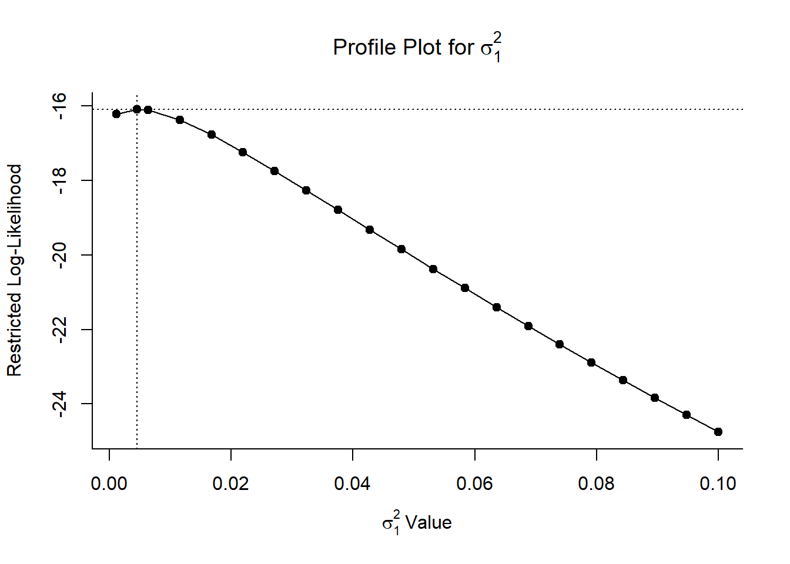
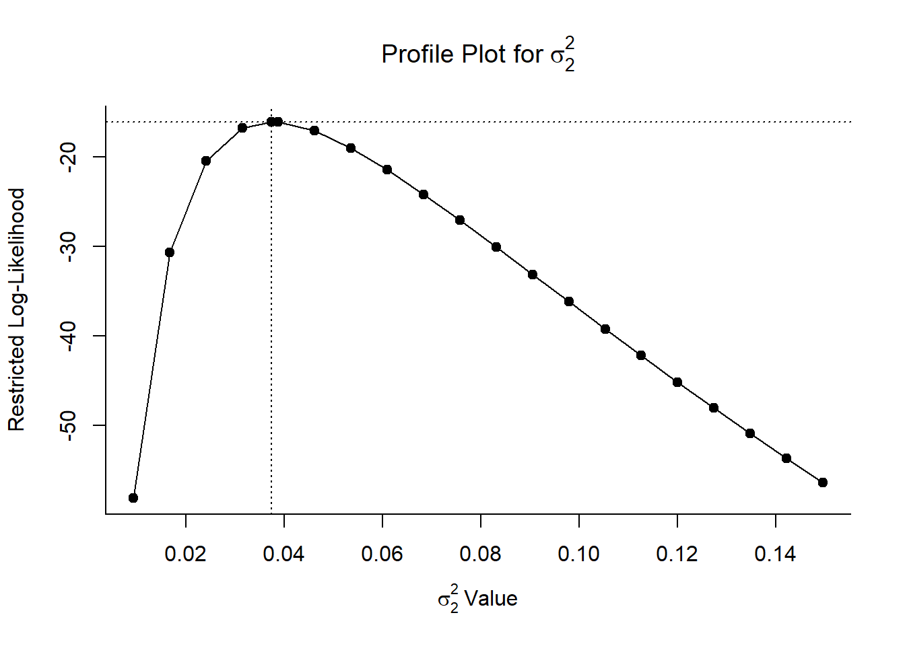
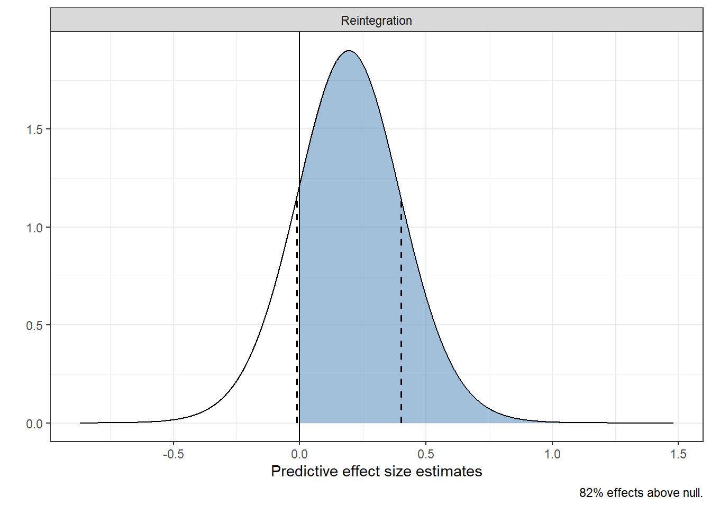
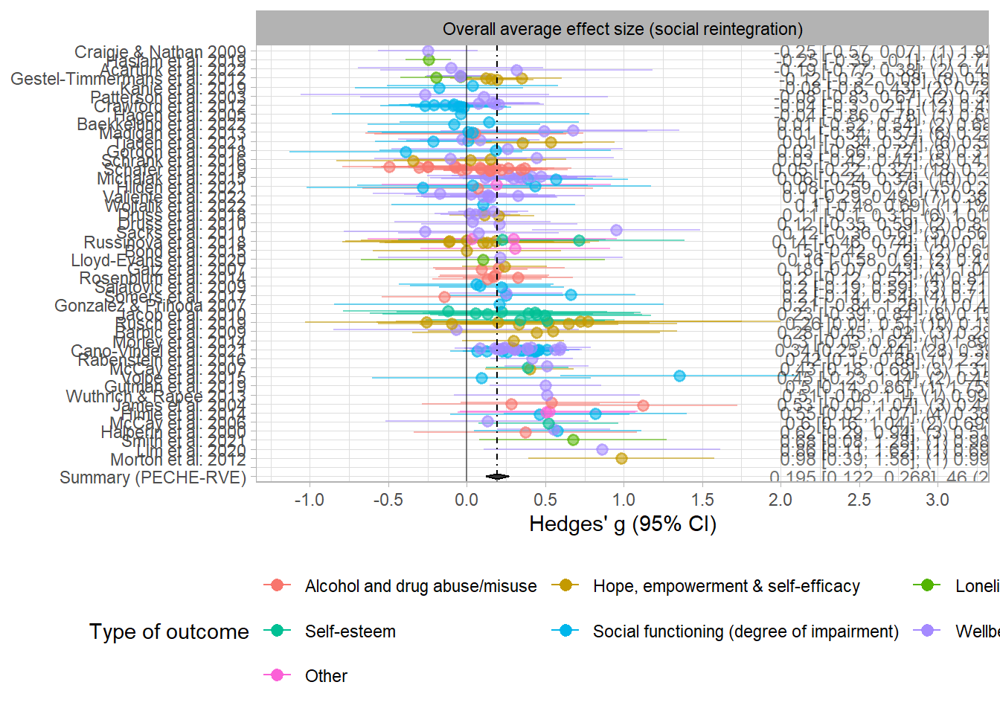
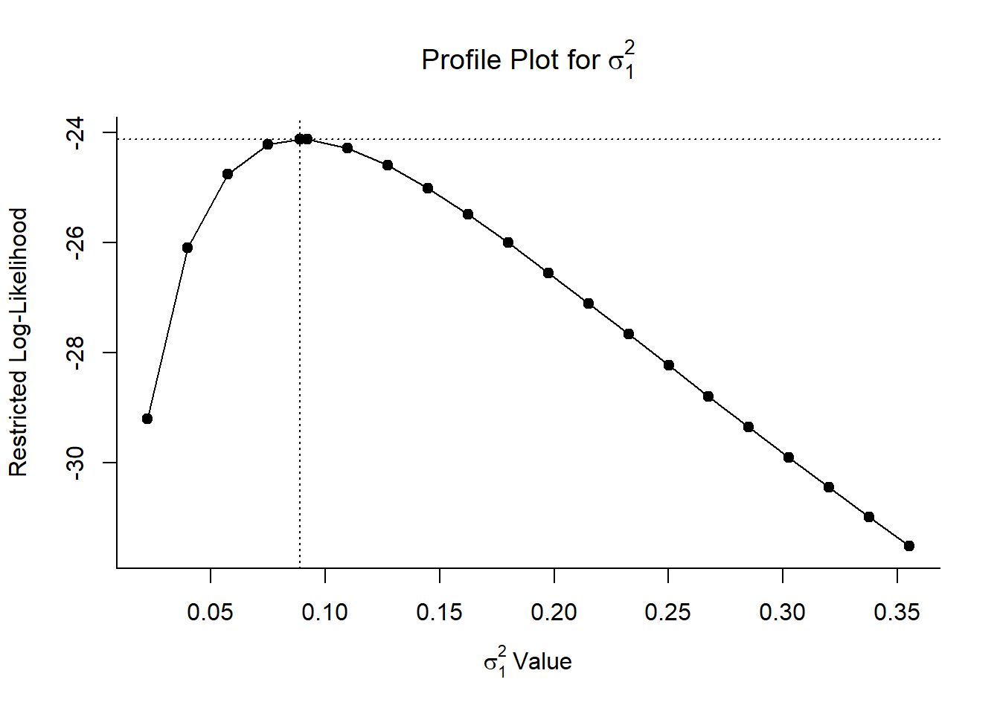
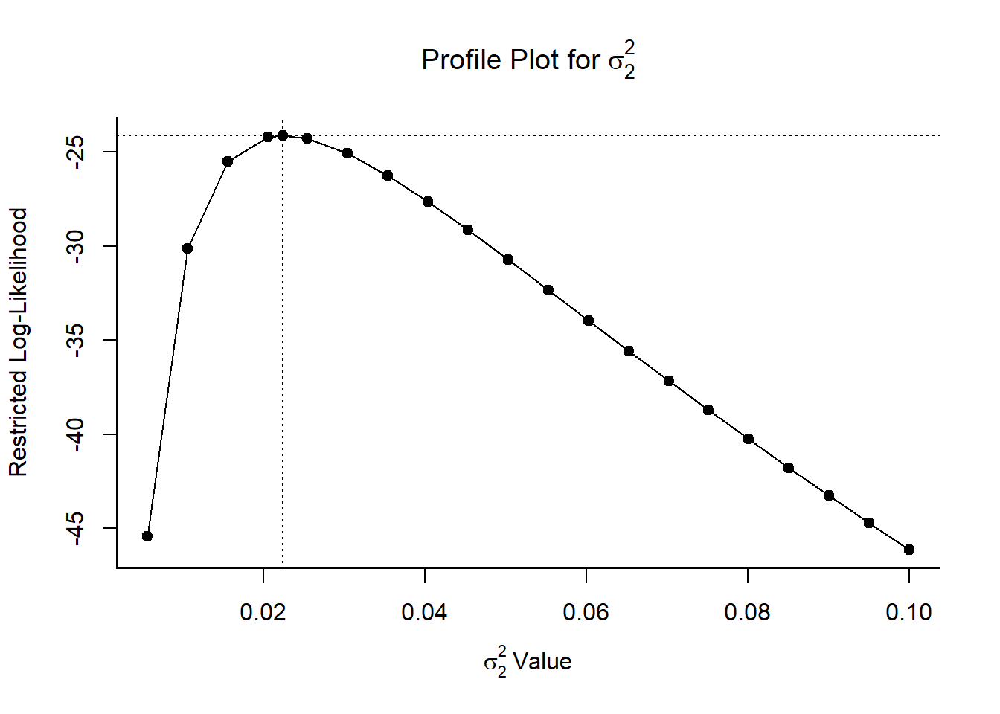
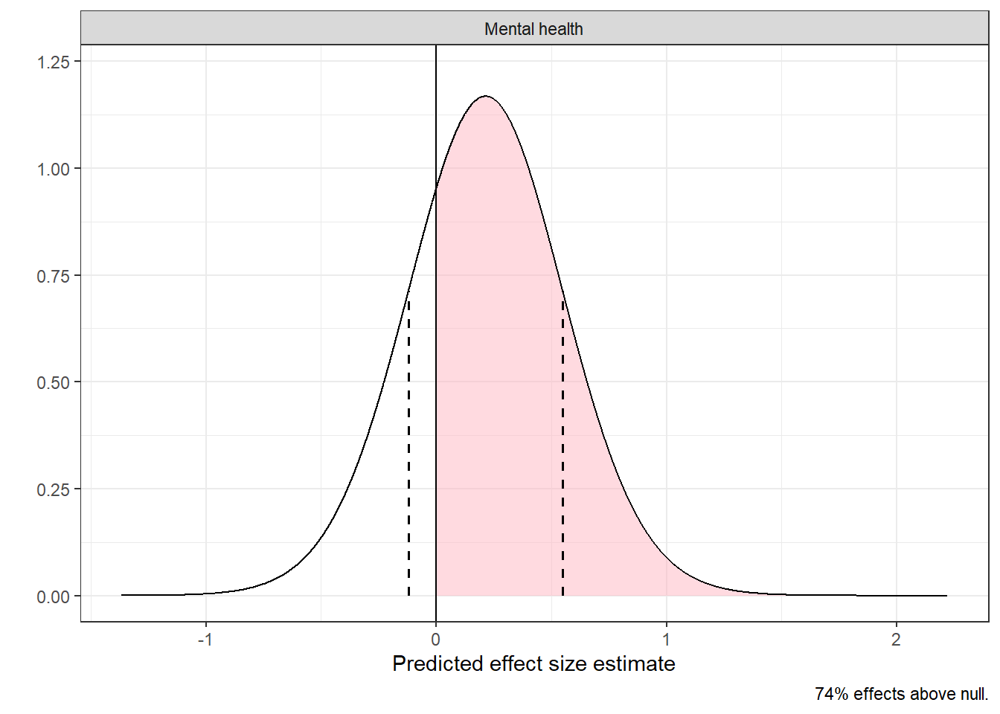
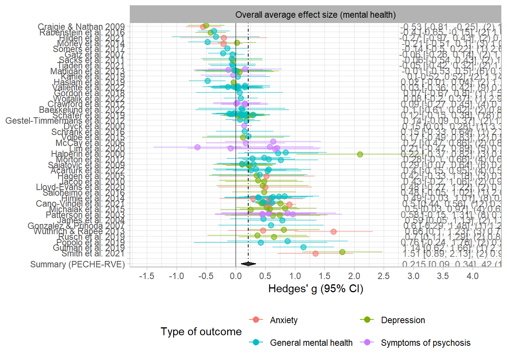

This is document contains the main analysis code for Dalgaard et al. [-@Dalgaard2026].

## Loading R packages and data

Below, we load the R package and data used for you main analyses. You can find the generated datasets and the corresponding variables in the PRIMED workflow document. 


::: {.cell}

````{.cell-code}
```{{r packages-and-source-file}}
RNGkind("L'Ecuyer-CMRG") # My naive try to steer seed across OS

library(dplyr)
library(tibble)
library(ggplot2)
library(stringr)
library(tidyr)
library(rempsyc)
library(purrr)
library(metafor)
library(clubSandwich)
library(knitr)
library(kableExtra)
library(forcats)
library(future)
library(furrr)
library(gt)
library(fastDummies)
library(rlang)
library(wildmeta)
library(tictoc)
library(patchwork)

source("Helpers.R")

reintegration_dat <- readRDS("reintegration_dat.rds")
mental_health_dat <- readRDS("mental_health_dat.rds")
gb_dat <- readRDS("Data/gb_dat.rds")
```
````
:::


# Moderators and control variables manipulation

## Reintegration
In this section, we manipulate all variables used in meta-regression analyses. 


::: {.cell}

````{.cell-code}
```{{r manipulate-data}}
# List all relevant moderator variables here: 
## Type of outcome: analysis_plan
## 

# Read: reint_ma_dat = reintegrational meta-analysis data
reint_ma_dat <- 
  reintegration_dat |> 
  mutate(
    outcome_time = paste(outcome, time, sep = "_"),
  ) |> 
  select(
    # Various types of effect size estimates 
    study, gt_pop, vgt_pop, Wgt_pop, gt, vgt, Wgt, g, vg, d, vd, gt_post, vgt_post,
    
    
    # Categorical moderators and control variables 
    analysis_plan, schizophrenia, CBT_intervention = CBT_int, prereg_chr, conventional, 
    test_type, analysis_strategy, QES_design, control, D1:D7, overall_rob, 
    
    # Continuous moderators and control variables
    age_mean, male_pct, total_number_of_sessions, sessions_per_week, duration_in_weeks,
    time_after_end_intervention_weeks, time_from_baseline_weeks,
    
    # For vcalc
    outcome, outcome_time, N_t, N_c, N_total, trt_name, trt_id, control, ctr_id,
    
    # For sensitivity analysis  
    ESS_t, ESS_c, ESS_total,
    
    # For interpretation
    m_diff_c, sd_pre_c, sd_post_c, b_emm_pre_c, b_emm_post_c, ppcor,
    
    # For exploration
    cnt, 
    
    # Miscellaneous 
    vary_id, varifier, time, rob_tool
    
  ) |> 
  mutate(
    esid = 1:n(),
    
    # Outcome variables
    outcome_type = case_match(
      analysis_plan, 
      c("Employment", "Physical health", "Psychiatric hospitalization") ~ "Other",
      .default = analysis_plan
    ),
    
    outcome_type = fct_relevel(outcome_type, sort),
    outcome_type = fct_relevel(outcome_type, "Other", after = Inf),
    
    prereg_c = conventional - mean(conventional),
    
    schizophrenia_in_sample = if_else(schizophrenia == "Schizophrenia", "Yes", "No"),
    schizophrenia_in_sample = factor(schizophrenia_in_sample, levels = c("Yes", "No")),
    
    schizo_in_sample = if_else(schizophrenia == "Schizophrenia", 1, 0),
    schizo_c = schizo_in_sample - mean(schizo_in_sample),
    
    cbt = if_else(CBT_intervention == "CBT", 1, 0),
    cbt_c = cbt - mean(cbt),
    
    test_type = if_else(test_type != "Clinician-rated measure", "Self reported/raw events", test_type),
    
    clin_measure = if_else(test_type == "Clinician-rated measure", 1, 0),
    clinical_c = clin_measure - mean(clin_measure),
    
    tot = if_else(analysis_strategy == "TOT", 1, 0),
    tot_c = tot - mean(tot),
    
    qes = if_else(QES_design == "QES", 1, 0),
    qes_c = qes - mean(qes),
    
    indi_treat_ctr = if_else(str_detect(control, "Ind"), "Individual treatment", "TAU and Waitlist"),
    
    control_modified = if_else(str_detect(control, "TAU"), "TAU with/without Waitlist", control),
    
    crt_grp = if_else(str_detect(control, "Ind"), 1, 0),
    crt_grp_c = crt_grp - mean(crt_grp),
    
    ctl_ind = if_else(str_detect(control, "Ind"), 1, 0),
    ctl_tau = if_else(str_detect(control, "TAU"), 1, 0),
    ctl_wait = if_else(control == "Waiting-list only", 1, 0),
    
    risk_of_bias = if_else(overall_rob == "Serious/High", "Serious/High", "Low/Some concerns/Moderate"),
    rob = if_else(str_detect(risk_of_bias, "Serious"), 1, 0),
    rob_c = rob - mean(rob),
    
    sessions_per_week = if_else(is.na(sessions_per_week), mean(sessions_per_week, na.rm = TRUE), sessions_per_week),
    male_pct = if_else(is.na(male_pct), mean(male_pct, na.rm = TRUE), male_pct),
    
    age_c = age_mean - 40,
    male_c = male_pct/100 - 0.5,
    sessions_c = sessions_per_week - 1,
    duration_c = duration_in_weeks - 12,
    fu_time_c = time_after_end_intervention_weeks - 1,
    
    country = recode_values(
      cnt, 
      c(
        "Turkey", "Norway", "Spain", "Netherlands", 
        "Finland", "Germany", "Austria", "Italy", "Ireland"
        ) ~ "Europe",
      
      "US" ~ "US",
      
      c("Canada", "Australia", "UK") ~ "Commonwealth",
      
      c( "Japan", "Corea" ) ~ "Asia"
    ),
    
    study = stringi::stri_trans_general(study, "Latin-ASCII"),
    study = fct_relevel(study, sort)
    
  ) |> 
  arrange(study) |> 
  mutate(
    study = as.character(study)
  )

reint_ma_dat <- 
  fastDummies::dummy_cols(reint_ma_dat, select_columns = "outcome_type", omit_colname_prefix = TRUE) |> 
  rename(
    alcohol = `Alcohol and drug abuse/misuse`, 
    hope = `Hope, empowerment & self-efficacy`, 
    lonely = Loneliness,
    self_est = `Self-esteem`,
    social_fun = `outcome_type_Social functioning (degree of impairment)`,
    wellbeing = `Wellbeing and quality of life`,
    other = Other
  ) |> 
  mutate(
    across(where(is.double), as.double),
    across(where(is.integer), as.integer),
    alcohol_c = alcohol - mean(alcohol),
    hope_c = hope - mean(hope),
    lonely_c = lonely - mean(lonely),
    self_est_c = self_est - mean(self_est),
    social_fun_c = social_fun - mean(social_fun),
    wellbeing_c = wellbeing - mean(wellbeing),
    other_c = other - mean(other)
  )

#reint_ma_dat <- 
#  reint_ma_dat |> 
#  metafor::escalc(
#    data = _, 
#    yi = gt_pop, 
#    vi = vgt_pop
#  )

attr(reint_ma_dat , "data_name") <- "reint_ma_dat"

#saveRDS(reint_ma_dat, "reint_ma_dat.rds")
```
````
:::


### For interpretation: average change between pre- and posttest for control group


::: {.cell}

````{.cell-code}
```{{r pre-post-es}}
prepost_smd_dat <- 
  reint_ma_dat |> 
  filter(!if_any(c(sd_post_c, sd_pre_c), is.na)) |>
  filter(str_detect(control_modified, "TAU")) |> 
  mutate(
    
    ppcor = if_else(is.na(ppcor), 0.5, ppcor),
    
    # Eq. 11.24 (recommended by Valentine & Aloe, 2019)
    sd_within = sqrt((sd_pre_c^2 + sd_post_c^2)/2),
    d_c = m_diff_c/sd_within,
    vd_c = (1/N_c + d_c^2/(2*N_c)) * (2 *(1-ppcor))
    
  )

V_mat_c <- 
  metafor::vcalc(
    data = prepost_smd_dat,
    vi = vd_c, 
    cluster = study,
    obs = esid, 
    rho = 0.8
  )

res_c <- 
  metafor::rma.mv(
    yi = d_c, 
    V = V_mat_c,
    random = ~ 1 | study / esid, 
    data = prepost_smd_dat
  ) |> 
  metafor::robust(cluster = study, clubSandwich = TRUE)

res_c

#pred_res_test <- metafor::predict.rma(res_c, level = 80)
```
````

::: {.cell-output .cell-output-stdout}

```

Multivariate Meta-Analysis Model (k = 173; method: REML)

Variance Components:

            estim    sqrt  nlvls  fixed      factor 
sigma^2.1  0.0238  0.1541     35     no       study 
sigma^2.2  0.0365  0.1910    173     no  study/esid 

Test for Heterogeneity:
Q(df = 172) = 2219.5582, p-val < .0001

Number of estimates:   173
Number of clusters:    35
Estimates per cluster: 1-28 (mean: 4.94, median: 3)

Model Results:

estimate      se¹    tval¹     df¹    pval¹    ci.lb¹   ci.ub¹    
  0.0832  0.0415   2.0061   28.04   0.0546   -0.0018   0.1681   . 

---
Signif. codes:  0 '***' 0.001 '**' 0.01 '*' 0.05 '.' 0.1 ' ' 1

1) results based on cluster-robust inference (var-cov estimator: CR2,
   approx t-test and confidence interval, df: Satterthwaite approx)
```


:::
:::


### Overall effect


::: {.cell}

````{.cell-code}
```{{r}}
main_res_reint <- .PECHE_RVE(data = reint_ma_dat, pred_int = 67)
main_res_reint

main_res_reint_95PI <- .PECHE_RVE(data = reint_ma_dat, pred_int = 95)
c(`95% PI lower (reint)` = main_res_reint_95PI$pi_lb_95, `95% PI upper (reint)` = main_res_reint_95PI$pi_ub_95)

main_res_reint$avg_effect
c(main_res_reint$LL, main_res_reint$UL)

paste0(
  "t(", round(main_res_reint$df_satt, 1), ") = ", 
  round(main_res_reint$tval, 2), ", p < .001"
)

#Heterogeneity measures
paste0("Q(", nrow(reint_ma_dat)-1, ") = ", round(main_res_reint$QE, 1))
main_res_reint$tau
main_res_reint$omega
main_res_reint$sd_total
main_res_reint$I2

# Confidence intervals of tau and omega plus likelihood profiles. 
metafor::confint.rma.mv(attr(main_res_reint, "rma.res"))
profile(attr(main_res_reint, "rma.res"), sigma2 = 1)   
profile(attr(main_res_reint, "rma.res"), sigma2 = 2)

#PI
c(main_res_reint$pi_lb_67, main_res_reint$pi_ub_67)

# For interpretation
es.com(
  d = main_res_reint$avg_effect, 
  se = main_res_reint$se, 
  df = main_res_reint$df_satt
)

# treatment effect vs. improvement in tau
main_res_reint$avg_effect/as.numeric(res_c$b[1,])

# Predivtive distribution 

mu <- main_res_reint$avg_effect 
tau2<- main_res_reint$tau2
omega2 <- main_res_reint$omega2
var_g <- main_res_reint$se^2

pred_sd <- sqrt(tau2 + omega2 + var_g)

m <- n_distinct(reint_ma_dat$study)                 
df <- main_res_reint$df_satt

# -----------------------------
# Generate predictive distribution 
# -----------------------------
# -----------------------------
# Generate predictive distribution 
# -----------------------------
set.seed(111025)
x_vals <- mu + pred_sd * rt(100000, df)
quantile(x_vals, probs = c(.1, .5, .9))

dens_df <- data.frame(
  x = x_vals,
  y = dt((x_vals - mu) / pred_sd, df = df) / pred_sd
)

# 67% t-based prediction interval
alpha <- 0.2
tcrit <- qt(1 - alpha/2, df)
pi_lb_man <- mu - tcrit * pred_sd
pi_ub_man <- mu + tcrit * pred_sd

c(pi_lb_man, pi_ub_man)

pi67_lb <- main_res_reint$pi_lb_67
pi67_ub <- main_res_reint$pi_ub_67

c(pi67_lb, pi67_ub)

# Heights of the curve at those bounds
y_pi <- approx(dens_df$x, dens_df$y, xout = c(pi67_lb, pi67_ub))$y

prop_above0 <- 1 - pt((0 - mu) / pred_sd, df = df)

# -----------------------------
# Plot
# -----------------------------
pi_plot_reint <- 
  dens_df |> 
  mutate(outcome = "Reintegration") |> 
  ggplot(aes(x, y)) +
  # Shade area above 0
  geom_area(data = subset(dens_df, x > 0), fill = "steelblue", alpha = 0.5) +
  geom_line() +
  annotate("segment",
           x = pi67_lb, xend = pi67_lb,
           y = 0, yend = y_pi[1],
           linetype = "dashed", linewidth = 0.6) +
  annotate("segment",
           x = pi67_ub, xend = pi67_ub,
           y = 0, yend = y_pi[2],
           linetype = "dashed", linewidth = 0.6) +
  geom_vline(xintercept = 0) +
  facet_grid(~outcome) + 
  theme(
    axis.title.y = element_blank(),
    axis.text.y = element_blank()
  ) +
  labs(
    x = "Predictive effect size estimates", y = ""
  ) +
  #coord_cartesian(ylim = c(0, max(dens_df$y) * 1.05)) +
  theme_bw() 

#png("Figures/predictive distribution reint.png", width = 8, height = 4, res = 300, unit = "in")
pi_plot_reint +  labs(caption = paste0(round(prop_above0, 2) * 100, "% effects above null."))
#dev.off()
```
````

::: {.cell-output .cell-output-stdout}

```
# A tibble: 1 × 19
    rho studies effects avg_effect     se    LL    UL pi_lb_67 pi_ub_67  tval    pval df_satt    tau
  <dbl>   <int>   <int>      <dbl>  <dbl> <dbl> <dbl>    <dbl>    <dbl> <dbl>   <dbl>   <dbl>  <dbl>
1   0.8      46     205      0.195 0.0353 0.122 0.268  -0.0118    0.401  5.51 1.02e-5    24.9 0.0674
# ℹ 6 more variables: omega <dbl>, sd_total <dbl>, QE <dbl>, I2 <dbl>, tau2 <dbl>, omega2 <dbl>
95% PI lower (reint) 95% PI upper (reint) 
          -0.2333695            0.6227890 
[1] 0.1947098
[1] 0.1219130 0.2675066
[1] "t(24.9) = 5.51, p < .001"
[1] "Q(204) = 1220.8"
[1] 0.06742439
[1] 0.1933677
[1] 0.2047856
[1] 88.86

          estimate  ci.lb  ci.ub 
sigma^2.1   0.0045 0.0000 0.0298 
sigma.1     0.0674 0.0000 0.1727 

          estimate  ci.lb  ci.ub 
sigma^2.2   0.0374 0.0280 0.0500 
sigma.2     0.1934 0.1673 0.2237 

[1] -0.01176104  0.40118058
[[1]]
  Effect Size Estimate 95% CI Lower 95% CI Upper
1           d     0.19         0.12         0.27
2           r      0.1         0.06         0.13
3         r^2     0.01            0         0.02
4          U1    14.39         9.27        19.23
5          U2    53.88        52.43        55.32
6          U3    57.72        54.85        60.55
7        CLES     0.55         0.53         0.58

[[2]]
          % Above the Median % %Below the Median
Treatment              54.84               45.16
Control                45.16               54.84

[1] 2.340873
        10%         50%         90% 
-0.07902811  0.19316762  0.46821347 
[1] -0.07887099  0.46829053
[1] -0.01176104  0.40118058
```


:::

::: {.cell-output-display}
{fig-pos='H' width=672}
:::

::: {.cell-output-display}
{fig-pos='H' width=672}
:::

::: {.cell-output-display}
{fig-pos='H' width=672}
:::
:::


### Forest plot


::: {.cell}

````{.cell-code}
```{{r forest-plot-reint}}
rho <- 0.8

studies <- n_distinct(reint_ma_dat$study)
n_es <- nrow(reint_ma_dat)

peche_res <- main_res_reint
outcome_group <- "Overall average effect size (social reintegration)"
tabel_label <- "Summary (PECHE-RVE)"

tau2 <- peche_res$tau2
omega2 <- peche_res$omega2
beta <- round(peche_res$avg_effect, 3)
cil <- round(peche_res$LL, 3)
ciu <- round(peche_res$UL, 3)

reframed_dat <-   
  escalc(yi = gt_pop, vi = vgt_pop, data = reint_ma_dat) |> 
  mutate(n = n(), .by = study) |> 
  aggregate(cluster = study, rho = rho) |> 
  reframe(
    yi = rep(yi, n),
    vi = rep(vi, n),
    .by = study
  ) |> 
  select(-study)


forest_dat <-
  reint_ma_dat |> 
  bind_cols(reframed_dat) |> 
  mutate(
    analysis_plan = "Overall average effect size (social reintegration)"
  ) |> 
  mutate(
    Est = gt_pop,
    SE = sqrt(vgt_pop),
    
    CI_L = Est - SE * qnorm(.975),
    CI_U = Est + SE * qnorm(.975),
    
    #rma_mean = as.numeric(rma(gt, vgt, data = pick(dplyr::everything()))$b)
    rma_mean = round(yi, 2),
    rma_cil = round(yi - sqrt(vi) * qnorm(.975), 2),
    rma_ciu = round(yi + sqrt(vi) * qnorm(.975), 2),
    
    kj = n(),
    
    sigma2j = mean(vgt_pop),
    
    es_weight = ((kj*tau2 + omega2 + ((kj-1)*rho)*sigma2j) + sigma2j )^-1,
    
    .by = study
    
  ) |> 
  arrange(rma_mean, study) |> 
  mutate(
    study = factor(study, levels = rev(unique(study))),
    weight_prop = round((es_weight/sum(es_weight)) * 100, 2),
  )

forest_dat2 <- 
  forest_dat |> 
  add_row(rma_mean = max(forest_dat$gt_pop) + 0.01) |> 
  add_row(study = tabel_label) |> 
  mutate(
    study = replace_na(study, ""),
    study = factor(study, levels = rev(unique(study))),
    analysis_plan = if_else(is.na(analysis_plan), outcome_group, analysis_plan)
  ) 

    
kj_label <- 
  forest_dat2 |> 
  summarise(
    Est = Est[1],
    CI_L = CI_L[1],
    CI_U = CI_U[1],
    
    mean_label = paste0(rma_mean[1], " [", rma_cil[1], ", ", rma_ciu[1], "], " ),
    
    label = paste0(mean_label, "(", kj[1], ") ", weight_prop[1], "%"),
    .by = c(analysis_plan, study)
  ) |> 
  mutate(
    label = case_when(
      study == "" ~ "",
      study == tabel_label ~ paste0(beta, " [", cil, ", ", ciu, "], ", studies, " (", n_es, ")"),
      .default = label
    )
  ) |> 
  arrange(study)

mean_label_dat <- 
  forest_dat2 |> 
  mutate(
    mean_es = round(peche_res$avg_effect, 3)
  )

max_ciu <- forest_dat2$CI_U |> max(na.rm = TRUE)

# Forest plot with all effect sizes
r_diam_x <- r_diam_y_post <- forest_dat2 |> nrow() - 4
sum.y <- c(1, 0.7, 1, 1.3, rep(NA, r_diam_y_post ))
sum.x <- c(cil, beta, ciu, beta, rep(NA, r_diam_x))

plot <- 
  forest_dat2 |>
  ggplot(
    aes(x = Est, y = study, xmin = CI_L, xmax = CI_U,
        color = outcome_type, alpha = 0.5)
  ) + 
  geom_pointrange(position = position_dodge2(width = 0.5, padding = 0.5)) +
  geom_vline(xintercept = 0, linetype = "solid", color = "black", alpha = 0.5) +
  facet_grid(~analysis_plan) +
  geom_text(data = kj_label, aes(x = max_ciu + 0.6, label = label), size=3.3, color = "black") +
  geom_vline(data = mean_label_dat, aes(xintercept = mean_es), color = "black", linetype = 4) +
  geom_blank(aes(max_ciu + 0.6 + 0.4)) +
  geom_polygon(aes(x=sum.x, y=sum.y), color = "black", alpha = 1) +
  theme_light() + 
  theme(
    legend.position = "bottom",
    strip.text = element_text(color = "black"),
    axis.title.y=element_blank(),
    plot.caption = element_text(hjust = 0)
  ) + 
  scale_x_continuous(breaks = seq(-3, 3, 0.5)) +
  labs(
    x = "Hedges' g (95% CI)",
    color = "Type of outcome"
  ) +
  guides(
    alpha = "none",
    color = guide_legend(nrow = 3, byrow = TRUE)
    ) +
  scale_color_discrete(na.translate = FALSE)


#png(filename = "Figures/forest plot reint.png", height = 11, width = 10, res = 600, units = "in")
suppressWarnings(plot)
#dev.off()
```
````

::: {.cell-output-display}
{fig-pos='H' width=672}
:::
:::


::: {.cell}

````{.cell-code}
```{{r outcome-test}}
rho <- 0.8

V_mat <- 
  metafor::vcalc(
    data = reint_ma_dat,
    vi = vgt_pop, 
    cluster = study,
    subgroup = outcome_type,
    type = outcome_time, 
    grp1 = trt_name,
    w1 = N_t, 
    grp2 = control,
    w2 = N_c, 
    rho = rho
  )

#V_mat2 <- 
#  metafor::vcalc(
#    data = reint_ma_dat,
#    vi = vgt_pop, 
#    cluster = study,
#    obs = esid, 
#    rho = rho
#  )


# Checking correct v_mat
#blsplit(V_mat, reint_ma_dat$study) |> 
#  lapply(cov2cor) |> 
#  map(~ round(.x, 2))

outcome_obj <- 
  metafor::rma.mv(
    yi = gt_pop ~ outcome_type - 1,
    V = V_mat, 
    random = list(~ outcome_type | study, ~ outcome_type | esid),
    struct = c("DIAG", "DIAG"),
    data = reint_ma_dat,
    sparse=TRUE
  )

#saveRDS(outcome_obj, file = "outcome_obj.rds")

outcome_obj_robu <- 
  outcome_obj |> 
  metafor::robust(cluster = study, clubSandwich = TRUE)

outcome_obj_robu

club_wald_test <- Wald_test(outcome_obj, constraints = constrain_equal(1:3), vcov = "CR2")
club_wald_test


#tic()
#plan(multisession, workers = parallel::detectCores()-1)
#
#cwb_test <- 
#  try(
#    Wald_test_cwb(
#      full_model = outcome_obj,
#      constraints = constrain_equal(1:7),
#      R = 19, 
#      seed = 26082025L
#    )
#  ); cwb_test
#
#plan(sequential)
#toc()

# Continuous model

age_obj <- 
  rma.mv(
    yi = gt_pop ~ age_c + prereg_chr - 1,
    V = V_mat, 
    random = ~ 1 | study / esid,
    data = reint_ma_dat,
    sparse = TRUE
  ) |> 
  metafor::robust(cluster = study, clubSandwich = TRUE)

age_obj

prereg_obj <- 
    rma.mv(
    yi = gt_pop ~ prereg_chr + male_c - 1,
    V = V_mat, 
    random = list(~ prereg_chr | study, ~ prereg_chr | esid),
    struct = c("DIAG", "DIAG"),
    data = reint_ma_dat,
    sparse=TRUE
  ) |> 
  metafor::robust(cluster = study, clubSandwich = TRUE)

prereg_obj

#y_test <- 
#  try(
#    Wald_test_cwb(
#      full_model = prereg_obj,
#      constraints = constrain_equal(1:2),
#      R = 19, 
#      adjust = "CR2",
#      seed = 12345
#    )
#  )
```
````

::: {.cell-output .cell-output-stdout}

```

Multivariate Meta-Analysis Model (k = 205; method: REML)

Variance Components:

outer factor: study        (nlvls = 46)
inner factor: outcome_type (nlvls = 7)

            estim    sqrt  k.lvl  fixed                                      level 
tau^2.1    0.0000  0.0000      8     no              Alcohol and drug abuse/misuse 
tau^2.2    0.0000  0.0000     12     no          Hope, empowerment & self-efficacy 
tau^2.3    0.0868  0.2947      4     no                                 Loneliness 
tau^2.4    0.0000  0.0000      5     no                                Self-esteem 
tau^2.5    0.0211  0.1452     17     no  Social functioning (degree of impairment) 
tau^2.6    0.0046  0.0678     25     no              Wellbeing and quality of life 
tau^2.7    0.0000  0.0000      4     no                                      Other 

outer factor: esid         (nlvls = 205)
inner factor: outcome_type (nlvls = 7)

              estim    sqrt  k.lvl  fixed                                      level 
gamma^2.1    0.0437  0.2090     32     no              Alcohol and drug abuse/misuse 
gamma^2.2    0.0245  0.1566     32     no          Hope, empowerment & self-efficacy 
gamma^2.3    0.0100  0.1002      5     no                                 Loneliness 
gamma^2.4    0.0216  0.1470     14     no                                Self-esteem 
gamma^2.5    0.0246  0.1567     48     no  Social functioning (degree of impairment) 
gamma^2.6    0.0274  0.1654     68     no              Wellbeing and quality of life 
gamma^2.7    0.0000  0.0000      6     no                                      Other 

Test for Residual Heterogeneity:
QE(df = 198) = 974.4306, p-val < .0001

Number of estimates:   205
Number of clusters:    46
Estimates per cluster: 1-28 (mean: 4.46, median: 3)

Test of Moderators (coefficients 1:7):¹
F(df1 = 7, df2 = 8.03) = 18.4387, p-val = 0.0002

Model Results:

                                                       estimate      se¹     tval¹     df¹    pval¹ 
outcome_typeAlcohol and drug abuse/misuse                0.1180  0.0669    1.7636    3.58   0.1610  
outcome_typeHope, empowerment & self-efficacy            0.2261  0.0508    4.4521    7.48   0.0025  
outcome_typeLoneliness                                   0.0157  0.1836    0.0853    2.57   0.9382  
outcome_typeSelf-esteem                                  0.4239  0.0397   10.6790    3.38   0.0010  
outcome_typeSocial functioning (degree of impairment)    0.1836  0.0720    2.5491   10.85   0.0273  
outcome_typeWellbeing and quality of life                0.2190  0.0462    4.7407   13.02   0.0004  
outcome_typeOther                                        0.3200  0.0921    3.4757    2.85   0.0436  
                                                         ci.lb¹   ci.ub¹      
outcome_typeAlcohol and drug abuse/misuse              -0.0768   0.3128       
outcome_typeHope, empowerment & self-efficacy           0.1075   0.3446    ** 
outcome_typeLoneliness                                 -0.6284   0.6597       
outcome_typeSelf-esteem                                 0.3053   0.5426    ** 
outcome_typeSocial functioning (degree of impairment)   0.0248   0.3424     * 
outcome_typeWellbeing and quality of life               0.1192   0.3187   *** 
outcome_typeOther                                       0.0178   0.6222     * 

---
Signif. codes:  0 '***' 0.001 '**' 0.01 '*' 0.05 '.' 0.1 ' ' 1

1) results based on cluster-robust inference (var-cov estimator: CR2,
   approx t/F-tests and confidence intervals, df: Satterthwaite approx)

 test Fstat df_num df_denom p_val sig
  HTZ  1.06      2      4.8 0.417    

Multivariate Meta-Analysis Model (k = 205; method: REML)

Variance Components:

            estim    sqrt  nlvls  fixed      factor 
sigma^2.1  0.0069  0.0828     46     no       study 
sigma^2.2  0.0291  0.1706    205     no  study/esid 

Test for Residual Heterogeneity:
QE(df = 202) = 997.7445, p-val < .0001

Number of estimates:   205
Number of clusters:    46
Estimates per cluster: 1-28 (mean: 4.46, median: 3)

Test of Moderators (coefficients 1:3):¹
F(df1 = 3, df2 = 17.21) = 17.9716, p-val < .0001

Model Results:

                             estimate      se¹    tval¹     df¹    pval¹    ci.lb¹   ci.ub¹      
age_c                          0.0071  0.0038   1.8649   13.27   0.0845   -0.0011   0.0153     . 
prereg_chrNot preregistered    0.3290  0.0508   6.4815   18.43   <.0001    0.2225   0.4354   *** 
prereg_chrPreregistered        0.1235  0.0406   3.0380    15.1   0.0083    0.0369   0.2100    ** 

---
Signif. codes:  0 '***' 0.001 '**' 0.01 '*' 0.05 '.' 0.1 ' ' 1

1) results based on cluster-robust inference (var-cov estimator: CR2,
   approx t/F-tests and confidence intervals, df: Satterthwaite approx)


Multivariate Meta-Analysis Model (k = 205; method: REML)

Variance Components:

outer factor: study      (nlvls = 46)
inner factor: prereg_chr (nlvls = 2)

            estim    sqrt  k.lvl  fixed              level 
tau^2.1    0.0000  0.0000     24     no  Not preregistered 
tau^2.2    0.0115  0.1073     22     no      Preregistered 

outer factor: esid       (nlvls = 205)
inner factor: prereg_chr (nlvls = 2)

              estim    sqrt  k.lvl  fixed              level 
gamma^2.1    0.0576  0.2401     65     no  Not preregistered 
gamma^2.2    0.0231  0.1519    140     no      Preregistered 

Test for Residual Heterogeneity:
QE(df = 202) = 1009.8498, p-val < .0001

Number of estimates:   205
Number of clusters:    46
Estimates per cluster: 1-28 (mean: 4.46, median: 3)

Test of Moderators (coefficients 1:3):¹
F(df1 = 3, df2 = 15.48) = 20.4972, p-val < .0001

Model Results:

                             estimate      se¹    tval¹     df¹    pval¹    ci.lb¹   ci.ub¹      
prereg_chrNot preregistered    0.3076  0.0425   7.2350    15.9   <.0001    0.2174   0.3978   *** 
prereg_chrPreregistered        0.1444  0.0413   3.4935   14.82   0.0033    0.0562   0.2325    ** 
male_c                         0.1052  0.1262   0.8332   13.09   0.4196   -0.1673   0.3777       

---
Signif. codes:  0 '***' 0.001 '**' 0.01 '*' 0.05 '.' 0.1 ' ' 1

1) results based on cluster-robust inference (var-cov estimator: CR2,
   approx t/F-tests and confidence intervals, df: Satterthwaite approx)
```


:::
:::


### Theory and methods tables

::: {.cell}

````{.cell-code}
```{{r reint-table-data}}
arg_tbl <- 
  tibble::tibble(
    yi = "gt_pop",
    vi = "vgt_pop",
    
    covars = rep(
      c(
        "outcome_type", 
        paste0(
          "outcome_type;schizo_c;cbt_c;prereg_c;clinical_c;tot_c;qes_c;crt_grp_c;rob_c;",
          "age_c;sessions_c;duration_c;fu_time_c"
        ),
        
        "schizophrenia_in_sample",
        paste0(
          "schizophrenia_in_sample;alcohol_c;hope_c;lonely_c;self_est_c;social_fun_c;wellbeing_c;other_c;",
          "cbt_c;prereg_c;clinical_c;tot_c;qes_c;crt_grp_c;rob_c;",
          "age_c;sessions_c;duration_c;fu_time_c"
        ),
        
        "CBT_intervention",
        paste0(
          "CBT_intervention;alcohol_c;hope_c;lonely_c;self_est_c;social_fun_c;wellbeing_c;other_c;",
          "schizo_c;prereg_c;clinical_c;tot_c;qes_c;crt_grp_c;rob_c;",
          "age_c;sessions_c;duration_c;fu_time_c"
        ),
        
        "prereg_chr", 
        paste0(
          "prereg_chr;alcohol_c;hope_c;lonely_c;self_est_c;social_fun_c;wellbeing_c;other_c;",
          "schizo_c;cbt_c;clinical_c;tot_c;qes_c;crt_grp_c;rob_c;", 
          "age_c;sessions_c;duration_c;fu_time_c"
        ),
        
        "test_type",
      paste0(
          "test_type;alcohol_c;hope_c;lonely_c;self_est_c;social_fun_c;wellbeing_c;other_c;",
          "schizo_c;cbt_c;prereg_c;tot_c;qes_c;crt_grp_c;rob_c;", 
          "age_c;sessions_c;duration_c;fu_time_c"
        ),
        
        "analysis_strategy",
        paste0(
          "analysis_strategy;alcohol_c;hope_c;lonely_c;self_est_c;social_fun_c;wellbeing_c;other_c;",
          "schizo_c;cbt_c;prereg_c;clinical_c;qes_c;crt_grp_c;rob_c;", 
          "age_c;sessions_c;duration_c;fu_time_c"
        ),
        
        "QES_design",
        paste0(
          "QES_design;alcohol_c;hope_c;lonely_c;self_est_c;social_fun_c;wellbeing_c;other_c;",
          "schizo_c;cbt_c;prereg_c;clinical_c;tot_c;crt_grp_c;rob_c;", 
          "age_c;sessions_c;duration_c;fu_time_c"
        ),
        
        "control_modified",
        paste0(
          "control_modified;alcohol_c;hope_c;lonely_c;self_est_c;social_fun_c;wellbeing_c;other_c;",
          "schizo_c;cbt_c;prereg_c;clinical_c;tot_c;qes_c;rob_c;", 
          "age_c;sessions_c;duration_c;fu_time_c"
        ),
        
        "risk_of_bias", 
        paste0(
          "risk_of_bias;alcohol_c;hope_c;lonely_c;self_est_c;social_fun_c;wellbeing_c;other_c;",
          "schizo_c;cbt_c;prereg_c;clinical_c;tot_c;qes_c;crt_grp_c;", 
          "age_c;sessions_c;duration_c;fu_time_c"
        )
        
      ),
      each = 5),
    
    model = "SCEp",
    
    r = rep(seq(0, 0.8, 0.2), 18),
    
    type = rep(c(rep("theory", 3), rep("methods", 6)), each = 10)
  )

es_names <- list("gt", "g", "d", "gt_post")
var_es_names <-  list("vgt", "vg", "vd", "vgt_post")

arg_tbl_alt_es <- 
  map2(es_names, var_es_names, ~ {
    arg_tbl |> 
      #filter(r == 0.8) |> 
      mutate(
        yi = .x,
        vi = .y
      )
  } ) |> 
  list_rbind()

arg_tbl_all <- 
  rbind(arg_tbl, arg_tbl_alt_es)


# For SCE models
arg_list_tbl <- 
  pmap(.l = arg_tbl_all, .f = .rma_arg_tbl, data = reint_ma_dat) |> 
  list_rbind() |> 
  mutate(
    R = 1999L,
    seed = 26082025L
  )


arg_list_tbl_rho08 <- arg_list_tbl |> filter(rho == 0.8 & var == "vgt_pop")

# MAIN RESULTS ARE MADE HERE - remove # to run
#tic()
#plan(multisession)
#reint_cwb_res <- 
#  pmap(
#    .l = arg_list_tbl_rho08, 
#    .f = .PESCE_RVE, 
#    return_rma_obj = FALSE,
#    CWB = TRUE
#  )
#plan(sequential)
#toc()

#reint_cwb_res
##
#saveRDS(reint_cwb_res, file = "Bootstrap results/reint_cwb_res.rds")

reint_cwb_res <- readRDS("Bootstrap results/reint_cwb_res.rds")

# Obtaining HTZ value for CBT intervention res
non_converged_wildmeta <- 
  pmap(
    .l = arg_list_tbl_rho08[c(12, 14),], 
    .f = .PESCE_RVE, 
    return_rma_obj = FALSE,
    CWB = FALSE
  )

reint_cwb_res[[12]] <- non_converged_wildmeta[[1]]
reint_cwb_res[[14]] <- non_converged_wildmeta[[2]]


## Country effects

arg_cnt <- 
  tibble(
    yi = "gt_pop",
    vi = "vgt_pop",
    covars = "country",
    model = "SCEp",
    r = 0.8, 
    type = "theory"
  ) 

arg_cnt_rma <- 
  pmap(.l = arg_cnt, .f = .rma_arg_tbl, data = reint_ma_dat) |> 
  list_rbind() |> 
  mutate(
    R = 19L,
    seed = 26082025L
  )

cnt_res_reint <- 
  pmap(
    .l = arg_cnt_rma, 
    .f = .PESCE_RVE, 
    return_rma_obj = FALSE,
    CWB = FALSE
  )
cnt_res_reint[[1]]
```
````

::: {.cell-output .cell-output-stdout}

```
# A tibble: 6 × 21
  Characteric Moderator    studies effects avg_effect_ci   pval df_satt SD_total   rho wald_compared
  <chr>       <chr>          <dbl>   <dbl> <chr>          <dbl>   <dbl>    <dbl> <dbl> <chr>        
1 country     Country           46     205 <NA>          NA        NA      NA      0.8 <NA>         
2 country     Asia               2       3 0.35 [-5.58,…  0.592     1       0.58   0.8 <NA>         
3 country     Commonwealth      16      46 0.25 [0.06, …  0.012    12.8     0.29   0.8 <NA>         
4 country     Europe            15     114 0.18 [0.05, …  0.013     7.3     0.2    0.8 <NA>         
5 country     US                13      42 0.19 [0.09, …  0.002     6.8     0.17   0.8 <NA>         
6 country     Wald test (…      NA      NA F(3, 3.25) =…  0.946    NA      NA      0.8 1,2,3,4      
# ℹ 11 more variables: controls <chr>, control_vars <chr>, optimizer <chr>, avg_effect <dbl>,
#   LL <dbl>, UL <dbl>, tau2 <dbl>, omega2 <dbl>, t_val <dbl>, table <chr>, effect_size <chr>
```


:::
:::


::: {.cell}

````{.cell-code}
```{{r tables-reint}}
#| eval: false 
wider_dat_theory_factors <- 
  reint_cwb_res |> 
  list_rbind() |> 
  filter(table == "theory") |> 
  select(Characteric:SD_total, controls) |> 
  pivot_wider(names_from = controls, values_from = c(avg_effect_ci:SD_total)) |> 
  relocate(contains("no",  ignore.case = TRUE), .after = effects) |>          
  relocate(contains("yes", ignore.case = TRUE), .after = last_col())


main_res_table <- 
  wider_dat_theory_factors |> 
  select(-1) |> 
  gt() |> 
  tab_spanner(label = "Subgroup analyses", columns = c("Moderator", "studies", "effects")) |> 
  tab_spanner(label = "Unadjusted effects", columns = contains("No")) |> 
  tab_spanner(label = "Covariate-adjusted effects", columns = contains("Yes")) |> 
  cols_label(
    studies = "Studes",
    effects = "Effects",
    avg_effect_ci_No  = html("Est [95% CI]<br>F stats"),
    pval_No = "Sig.",
    df_satt_No = "Satt. df",
    SD_total_No = "SD total",
    avg_effect_ci_Yes  = html("Est [95% CI]<br>F stats"),
    pval_Yes = "Sig.",
    df_satt_Yes = "Satt. df",
    SD_total_Yes = "SD total"
  ) |> 
    sub_missing(
    columns = everything(),   
    missing_text = ""         
  ); main_res_table

#main_res_table |> gtsave("Tables/main_res_table_reint.docx")

wider_dat_methods_factors <- 
  reint_cwb_res |> 
  list_rbind() |> 
  filter(table == "methods") |> 
  select(Characteric:SD_total, controls) |> 
  pivot_wider(names_from = controls, values_from = c(avg_effect_ci:SD_total)) |> 
  relocate(contains("no",  ignore.case = TRUE), .after = effects) |>          
  relocate(contains("yes", ignore.case = TRUE), .after = last_col())


methods_res_table <- 
  wider_dat_methods_factors |> 
  select(-1) |> 
  gt() |> 
  tab_spanner(label = "Subgroup analyses", columns = c("Moderator", "studies", "effects")) |> 
  tab_spanner(label = "Unadjusted effects", columns = contains("No")) |> 
  tab_spanner(label = "Covariate-adjusted effects", columns = contains("Yes")) |> 
  cols_label(
    studies = "Studes",
    effects = "Effects",
    avg_effect_ci_No  = html("Est [95% CI]<br>F stats"),
    pval_No = "Sig.",
    df_satt_No = "Satt. df",
    SD_total_No = "SD total",
    avg_effect_ci_Yes  = html("Est [95% CI]<br>F stats"),
    pval_Yes = "Sig.",
    df_satt_Yes = "Satt. df",
    SD_total_Yes = "SD total"
  ) |>
  sub_missing(
    columns = everything(),   
    missing_text = ""         
  ); methods_res_table

#methods_res_table |> gtsave("Tables/methods_res_table_reint.docx")
```
````
:::


### PECHE-RVE for meta-regression


::: {.cell}

````{.cell-code}
```{{r che-rve-meta-regression}}
cor_val <- 0L:10L/10L
cor_val <- cor_val[seq(1, 10L, 2L)]

arg_tbl_contin <- 
  tibble::tibble(
    yi = "gt_pop",
    vi = "vgt_pop",
    
    covars = rep(
      c(
        "age_c", 
        "male_c",
        "sessions_c",
        "duration_c",
        "fu_time_c",
        
        paste0(
          "age_c;male_c;sessions_c;duration_c;fu_time_c;",
          "alcohol_c;hope_c;lonely_c;self_est_c;social_fun_c;wellbeing_c;other_c;",
          "schizo_c;cbt_c;prereg_c;clinical_c;tot_c;qes_c;crt_grp_c"
        )
      ),
      each = 5),
    
    model = "CHE",
    
    r = rep(cor_val, 6),
    
    type = "Continuous"
  )

es_names <- list("gt", "g", "d", "gt_post")
var_es_names <-  list("vgt", "vg", "vd", "vgt_post")

arg_tbl_alt_es_contin <- 
  map2(es_names, var_es_names, ~ {
    arg_tbl_contin |> 
      filter(r == 0.8) |> 
      mutate(
        yi = .x,
        vi = .y
      )
  } ) |> 
  list_rbind()

arg_tbl_all_contin <- 
  rbind(arg_tbl_contin, arg_tbl_alt_es_contin)


# Model type to replicate with function

rho <- 0.8

V_mat <- 
  metafor::vcalc(
    data = reint_ma_dat,
    vi = vgt_pop, 
    cluster = study,
    type = outcome_time, 
    grp1 = trt_name,
    w1 = N_t, 
    grp2 = control,
    w2 = N_c, 
    rho = rho
  )

male_obj <- 
  metafor::rma.mv(
    gt_pop ~ male_c, 
    V = V_mat, 
    random = ~ 1 | study / esid,
    data = reint_ma_dat,
    sparse = TRUE
  ) |> 
  robust(
    cluster = study, 
    clubSandwich = TRUE
  )


arg_list_tbl_contin <- 
  pmap(.l = arg_tbl_contin, .f = .rma_arg_tbl, data = reint_ma_dat) |> 
  list_rbind() 


continuous_res_reint <- 
  purrr::pmap(
    #subset to main specification
    .l = arg_list_tbl_contin[arg_list_tbl_contin$rho == 0.8,], 
    .f = .PECHE_meta_reg, 
    return_rma_obj = FALSE
    
  ) |> 
  purrr::list_rbind(names_to = "Model") |> 
  dplyr::mutate(
    Model = paste("Model", Model)
  ) |> 
  tidyr::pivot_wider(
    names_from = Model,               
    values_from = Coef
  )  

continuous_res_reint

#rho <- 0.8
#
#V_mat <- 
#  metafor::vcalc(
#    vi = vgt_pop, 
#    cluster = study, 
#    obs = esid, 
#    data = reint_ma_dat, 
#    rho = rho
#  )
#
#all_in_one_obj <- 
#  metafor::rma.mv(
#    arg_list_tbl_contin$formula[26][[1]], 
#    V = V_mat, 
#    random = ~ 1 | study / esid,
#    data = reint_ma_dat,
#    sparse = TRUE
#  ) |> 
#  robust(
#    cluster = study, 
#    clubSandwich = TRUE
#  )
```
````

::: {.cell-output .cell-output-stdout}

```
# A tibble: 12 × 7
   Moderators        `Model 1`        `Model 2`        `Model 3`       `Model 4` `Model 5` `Model 6`
   <chr>             <chr>            <chr>            <chr>           <chr>     <chr>     <chr>    
 1 Age               0.003 (0.005)    <NA>             <NA>            <NA>      <NA>      0.003 (0…
 2 % Male            <NA>             0.133 (0.152)    <NA>            <NA>      <NA>      -0.006 (…
 3 Sessions          <NA>             <NA>             0.021 (0.012)L  <NA>      <NA>      -0.002 (…
 4 Duration          <NA>             <NA>             <NA>            -0.003 (… <NA>      0 (0.002)
 5 Follow-up timing  <NA>             <NA>             <NA>            <NA>      0 (0.001… 0 (0.001…
 6 <NA>              <NA>             <NA>             <NA>            <NA>      <NA>      <NA>     
 7 Intercept         0.191 (0.038)*** 0.204 (0.037)*** 0.19 (0.037)*** 0.213 (0… 0.197 (0… 0.204 (0…
 8 Study-level SD    0.072            0.079            0.074           0.056     0.067     0        
 9 Effect-level SD   0.193            0.193            0.193           0.194     0.194     0.182    
10 Total SD          0.206            0.208            0.207           0.202     0.205     0.182    
11 Number of effects 205              205              205             205       205       205      
12 Number of studies 46               46               46              46        46        46       
```


:::
:::


::: {.cell}

````{.cell-code}
```{{r making-gt-tables-contin}}
reint_contin_res_table <- 
  continuous_res_reint |> 
  gt() |> 
  sub_missing(
    columns = everything(),   
    missing_text = ""         
  ) |> 
  cols_align(align = "left", columns = gt::everything()) |> 
  tab_style(
    style = cell_text(weight = "bold", align = "left"),
    locations = cells_column_labels(columns = gt::everything())
  ) |> 
  tab_style(
    style = cell_borders(sides = "top", color = "black", weight = px(1)),
    locations = list(
      cells_stub(rows  = Moderators == "Study-level SD"),
      cells_body(rows  = Moderators == "Study-level SD")
    )
  )

reint_contin_res_table

#reint_contin_res_table |> gtsave("Tables/reint_contin_res_table.docx")
```
````

::: {.cell-output-display}

```{=html}
<div id="rxheztvjqi" style="padding-left:0px;padding-right:0px;padding-top:10px;padding-bottom:10px;overflow-x:auto;overflow-y:auto;width:auto;height:auto;">
<style>#rxheztvjqi table {
  font-family: system-ui, 'Segoe UI', Roboto, Helvetica, Arial, sans-serif, 'Apple Color Emoji', 'Segoe UI Emoji', 'Segoe UI Symbol', 'Noto Color Emoji';
  -webkit-font-smoothing: antialiased;
  -moz-osx-font-smoothing: grayscale;
}

#rxheztvjqi thead, #rxheztvjqi tbody, #rxheztvjqi tfoot, #rxheztvjqi tr, #rxheztvjqi td, #rxheztvjqi th {
  border-style: none;
}

#rxheztvjqi p {
  margin: 0;
  padding: 0;
}

#rxheztvjqi .gt_table {
  display: table;
  border-collapse: collapse;
  line-height: normal;
  margin-left: auto;
  margin-right: auto;
  color: #333333;
  font-size: 16px;
  font-weight: normal;
  font-style: normal;
  background-color: #FFFFFF;
  width: auto;
  border-top-style: solid;
  border-top-width: 2px;
  border-top-color: #A8A8A8;
  border-right-style: none;
  border-right-width: 2px;
  border-right-color: #D3D3D3;
  border-bottom-style: solid;
  border-bottom-width: 2px;
  border-bottom-color: #A8A8A8;
  border-left-style: none;
  border-left-width: 2px;
  border-left-color: #D3D3D3;
}

#rxheztvjqi .gt_caption {
  padding-top: 4px;
  padding-bottom: 4px;
}

#rxheztvjqi .gt_title {
  color: #333333;
  font-size: 125%;
  font-weight: initial;
  padding-top: 4px;
  padding-bottom: 4px;
  padding-left: 5px;
  padding-right: 5px;
  border-bottom-color: #FFFFFF;
  border-bottom-width: 0;
}

#rxheztvjqi .gt_subtitle {
  color: #333333;
  font-size: 85%;
  font-weight: initial;
  padding-top: 3px;
  padding-bottom: 5px;
  padding-left: 5px;
  padding-right: 5px;
  border-top-color: #FFFFFF;
  border-top-width: 0;
}

#rxheztvjqi .gt_heading {
  background-color: #FFFFFF;
  text-align: center;
  border-bottom-color: #FFFFFF;
  border-left-style: none;
  border-left-width: 1px;
  border-left-color: #D3D3D3;
  border-right-style: none;
  border-right-width: 1px;
  border-right-color: #D3D3D3;
}

#rxheztvjqi .gt_bottom_border {
  border-bottom-style: solid;
  border-bottom-width: 2px;
  border-bottom-color: #D3D3D3;
}

#rxheztvjqi .gt_col_headings {
  border-top-style: solid;
  border-top-width: 2px;
  border-top-color: #D3D3D3;
  border-bottom-style: solid;
  border-bottom-width: 2px;
  border-bottom-color: #D3D3D3;
  border-left-style: none;
  border-left-width: 1px;
  border-left-color: #D3D3D3;
  border-right-style: none;
  border-right-width: 1px;
  border-right-color: #D3D3D3;
}

#rxheztvjqi .gt_col_heading {
  color: #333333;
  background-color: #FFFFFF;
  font-size: 100%;
  font-weight: normal;
  text-transform: inherit;
  border-left-style: none;
  border-left-width: 1px;
  border-left-color: #D3D3D3;
  border-right-style: none;
  border-right-width: 1px;
  border-right-color: #D3D3D3;
  vertical-align: bottom;
  padding-top: 5px;
  padding-bottom: 6px;
  padding-left: 5px;
  padding-right: 5px;
  overflow-x: hidden;
}

#rxheztvjqi .gt_column_spanner_outer {
  color: #333333;
  background-color: #FFFFFF;
  font-size: 100%;
  font-weight: normal;
  text-transform: inherit;
  padding-top: 0;
  padding-bottom: 0;
  padding-left: 4px;
  padding-right: 4px;
}

#rxheztvjqi .gt_column_spanner_outer:first-child {
  padding-left: 0;
}

#rxheztvjqi .gt_column_spanner_outer:last-child {
  padding-right: 0;
}

#rxheztvjqi .gt_column_spanner {
  border-bottom-style: solid;
  border-bottom-width: 2px;
  border-bottom-color: #D3D3D3;
  vertical-align: bottom;
  padding-top: 5px;
  padding-bottom: 5px;
  overflow-x: hidden;
  display: inline-block;
  width: 100%;
}

#rxheztvjqi .gt_spanner_row {
  border-bottom-style: hidden;
}

#rxheztvjqi .gt_group_heading {
  padding-top: 8px;
  padding-bottom: 8px;
  padding-left: 5px;
  padding-right: 5px;
  color: #333333;
  background-color: #FFFFFF;
  font-size: 100%;
  font-weight: initial;
  text-transform: inherit;
  border-top-style: solid;
  border-top-width: 2px;
  border-top-color: #D3D3D3;
  border-bottom-style: solid;
  border-bottom-width: 2px;
  border-bottom-color: #D3D3D3;
  border-left-style: none;
  border-left-width: 1px;
  border-left-color: #D3D3D3;
  border-right-style: none;
  border-right-width: 1px;
  border-right-color: #D3D3D3;
  vertical-align: middle;
  text-align: left;
}

#rxheztvjqi .gt_empty_group_heading {
  padding: 0.5px;
  color: #333333;
  background-color: #FFFFFF;
  font-size: 100%;
  font-weight: initial;
  border-top-style: solid;
  border-top-width: 2px;
  border-top-color: #D3D3D3;
  border-bottom-style: solid;
  border-bottom-width: 2px;
  border-bottom-color: #D3D3D3;
  vertical-align: middle;
}

#rxheztvjqi .gt_from_md > :first-child {
  margin-top: 0;
}

#rxheztvjqi .gt_from_md > :last-child {
  margin-bottom: 0;
}

#rxheztvjqi .gt_row {
  padding-top: 8px;
  padding-bottom: 8px;
  padding-left: 5px;
  padding-right: 5px;
  margin: 10px;
  border-top-style: solid;
  border-top-width: 1px;
  border-top-color: #D3D3D3;
  border-left-style: none;
  border-left-width: 1px;
  border-left-color: #D3D3D3;
  border-right-style: none;
  border-right-width: 1px;
  border-right-color: #D3D3D3;
  vertical-align: middle;
  overflow-x: hidden;
}

#rxheztvjqi .gt_stub {
  color: #333333;
  background-color: #FFFFFF;
  font-size: 100%;
  font-weight: initial;
  text-transform: inherit;
  border-right-style: solid;
  border-right-width: 2px;
  border-right-color: #D3D3D3;
  padding-left: 5px;
  padding-right: 5px;
}

#rxheztvjqi .gt_stub_row_group {
  color: #333333;
  background-color: #FFFFFF;
  font-size: 100%;
  font-weight: initial;
  text-transform: inherit;
  border-right-style: solid;
  border-right-width: 2px;
  border-right-color: #D3D3D3;
  padding-left: 5px;
  padding-right: 5px;
  vertical-align: top;
}

#rxheztvjqi .gt_row_group_first td {
  border-top-width: 2px;
}

#rxheztvjqi .gt_row_group_first th {
  border-top-width: 2px;
}

#rxheztvjqi .gt_summary_row {
  color: #333333;
  background-color: #FFFFFF;
  text-transform: inherit;
  padding-top: 8px;
  padding-bottom: 8px;
  padding-left: 5px;
  padding-right: 5px;
}

#rxheztvjqi .gt_first_summary_row {
  border-top-style: solid;
  border-top-color: #D3D3D3;
}

#rxheztvjqi .gt_first_summary_row.thick {
  border-top-width: 2px;
}

#rxheztvjqi .gt_last_summary_row {
  padding-top: 8px;
  padding-bottom: 8px;
  padding-left: 5px;
  padding-right: 5px;
  border-bottom-style: solid;
  border-bottom-width: 2px;
  border-bottom-color: #D3D3D3;
}

#rxheztvjqi .gt_grand_summary_row {
  color: #333333;
  background-color: #FFFFFF;
  text-transform: inherit;
  padding-top: 8px;
  padding-bottom: 8px;
  padding-left: 5px;
  padding-right: 5px;
}

#rxheztvjqi .gt_first_grand_summary_row {
  padding-top: 8px;
  padding-bottom: 8px;
  padding-left: 5px;
  padding-right: 5px;
  border-top-style: double;
  border-top-width: 6px;
  border-top-color: #D3D3D3;
}

#rxheztvjqi .gt_last_grand_summary_row_top {
  padding-top: 8px;
  padding-bottom: 8px;
  padding-left: 5px;
  padding-right: 5px;
  border-bottom-style: double;
  border-bottom-width: 6px;
  border-bottom-color: #D3D3D3;
}

#rxheztvjqi .gt_striped {
  background-color: rgba(128, 128, 128, 0.05);
}

#rxheztvjqi .gt_table_body {
  border-top-style: solid;
  border-top-width: 2px;
  border-top-color: #D3D3D3;
  border-bottom-style: solid;
  border-bottom-width: 2px;
  border-bottom-color: #D3D3D3;
}

#rxheztvjqi .gt_footnotes {
  color: #333333;
  background-color: #FFFFFF;
  border-bottom-style: none;
  border-bottom-width: 2px;
  border-bottom-color: #D3D3D3;
  border-left-style: none;
  border-left-width: 2px;
  border-left-color: #D3D3D3;
  border-right-style: none;
  border-right-width: 2px;
  border-right-color: #D3D3D3;
}

#rxheztvjqi .gt_footnote {
  margin: 0px;
  font-size: 90%;
  padding-top: 4px;
  padding-bottom: 4px;
  padding-left: 5px;
  padding-right: 5px;
}

#rxheztvjqi .gt_sourcenotes {
  color: #333333;
  background-color: #FFFFFF;
  border-bottom-style: none;
  border-bottom-width: 2px;
  border-bottom-color: #D3D3D3;
  border-left-style: none;
  border-left-width: 2px;
  border-left-color: #D3D3D3;
  border-right-style: none;
  border-right-width: 2px;
  border-right-color: #D3D3D3;
}

#rxheztvjqi .gt_sourcenote {
  font-size: 90%;
  padding-top: 4px;
  padding-bottom: 4px;
  padding-left: 5px;
  padding-right: 5px;
}

#rxheztvjqi .gt_left {
  text-align: left;
}

#rxheztvjqi .gt_center {
  text-align: center;
}

#rxheztvjqi .gt_right {
  text-align: right;
  font-variant-numeric: tabular-nums;
}

#rxheztvjqi .gt_font_normal {
  font-weight: normal;
}

#rxheztvjqi .gt_font_bold {
  font-weight: bold;
}

#rxheztvjqi .gt_font_italic {
  font-style: italic;
}

#rxheztvjqi .gt_super {
  font-size: 65%;
}

#rxheztvjqi .gt_footnote_marks {
  font-size: 75%;
  vertical-align: 0.4em;
  position: initial;
}

#rxheztvjqi .gt_asterisk {
  font-size: 100%;
  vertical-align: 0;
}

#rxheztvjqi .gt_indent_1 {
  text-indent: 5px;
}

#rxheztvjqi .gt_indent_2 {
  text-indent: 10px;
}

#rxheztvjqi .gt_indent_3 {
  text-indent: 15px;
}

#rxheztvjqi .gt_indent_4 {
  text-indent: 20px;
}

#rxheztvjqi .gt_indent_5 {
  text-indent: 25px;
}

#rxheztvjqi .katex-display {
  display: inline-flex !important;
  margin-bottom: 0.75em !important;
}

#rxheztvjqi div.Reactable > div.rt-table > div.rt-thead > div.rt-tr.rt-tr-group-header > div.rt-th-group:after {
  height: 0px !important;
}
</style>
<table class="gt_table" data-quarto-disable-processing="false" data-quarto-bootstrap="false">
  <thead>
    <tr class="gt_col_headings">
      <th class="gt_col_heading gt_columns_bottom_border gt_left" rowspan="1" colspan="1" style="text-align: left; font-weight: bold;" scope="col" id="Moderators">Moderators</th>
      <th class="gt_col_heading gt_columns_bottom_border gt_left" rowspan="1" colspan="1" style="text-align: left; font-weight: bold;" scope="col" id="Model-1">Model 1</th>
      <th class="gt_col_heading gt_columns_bottom_border gt_left" rowspan="1" colspan="1" style="text-align: left; font-weight: bold;" scope="col" id="Model-2">Model 2</th>
      <th class="gt_col_heading gt_columns_bottom_border gt_left" rowspan="1" colspan="1" style="text-align: left; font-weight: bold;" scope="col" id="Model-3">Model 3</th>
      <th class="gt_col_heading gt_columns_bottom_border gt_left" rowspan="1" colspan="1" style="text-align: left; font-weight: bold;" scope="col" id="Model-4">Model 4</th>
      <th class="gt_col_heading gt_columns_bottom_border gt_left" rowspan="1" colspan="1" style="text-align: left; font-weight: bold;" scope="col" id="Model-5">Model 5</th>
      <th class="gt_col_heading gt_columns_bottom_border gt_left" rowspan="1" colspan="1" style="text-align: left; font-weight: bold;" scope="col" id="Model-6">Model 6</th>
    </tr>
  </thead>
  <tbody class="gt_table_body">
    <tr><td headers="Moderators" class="gt_row gt_left">Age</td>
<td headers="Model 1" class="gt_row gt_left">0.003 (0.005)</td>
<td headers="Model 2" class="gt_row gt_left"><br /></td>
<td headers="Model 3" class="gt_row gt_left"><br /></td>
<td headers="Model 4" class="gt_row gt_left"><br /></td>
<td headers="Model 5" class="gt_row gt_left"><br /></td>
<td headers="Model 6" class="gt_row gt_left">0.003 (0.005)</td></tr>
    <tr><td headers="Moderators" class="gt_row gt_left">% Male</td>
<td headers="Model 1" class="gt_row gt_left"><br /></td>
<td headers="Model 2" class="gt_row gt_left">0.133 (0.152)</td>
<td headers="Model 3" class="gt_row gt_left"><br /></td>
<td headers="Model 4" class="gt_row gt_left"><br /></td>
<td headers="Model 5" class="gt_row gt_left"><br /></td>
<td headers="Model 6" class="gt_row gt_left">-0.006 (0.185)</td></tr>
    <tr><td headers="Moderators" class="gt_row gt_left">Sessions</td>
<td headers="Model 1" class="gt_row gt_left"><br /></td>
<td headers="Model 2" class="gt_row gt_left"><br /></td>
<td headers="Model 3" class="gt_row gt_left">0.021 (0.012)L</td>
<td headers="Model 4" class="gt_row gt_left"><br /></td>
<td headers="Model 5" class="gt_row gt_left"><br /></td>
<td headers="Model 6" class="gt_row gt_left">-0.002 (0.015)L</td></tr>
    <tr><td headers="Moderators" class="gt_row gt_left">Duration</td>
<td headers="Model 1" class="gt_row gt_left"><br /></td>
<td headers="Model 2" class="gt_row gt_left"><br /></td>
<td headers="Model 3" class="gt_row gt_left"><br /></td>
<td headers="Model 4" class="gt_row gt_left">-0.003 (0.002)</td>
<td headers="Model 5" class="gt_row gt_left"><br /></td>
<td headers="Model 6" class="gt_row gt_left">0 (0.002)</td></tr>
    <tr><td headers="Moderators" class="gt_row gt_left">Follow-up timing</td>
<td headers="Model 1" class="gt_row gt_left"><br /></td>
<td headers="Model 2" class="gt_row gt_left"><br /></td>
<td headers="Model 3" class="gt_row gt_left"><br /></td>
<td headers="Model 4" class="gt_row gt_left"><br /></td>
<td headers="Model 5" class="gt_row gt_left">0 (0.001)L</td>
<td headers="Model 6" class="gt_row gt_left">0 (0.001)L</td></tr>
    <tr><td headers="Moderators" class="gt_row gt_left"><br /></td>
<td headers="Model 1" class="gt_row gt_left"><br /></td>
<td headers="Model 2" class="gt_row gt_left"><br /></td>
<td headers="Model 3" class="gt_row gt_left"><br /></td>
<td headers="Model 4" class="gt_row gt_left"><br /></td>
<td headers="Model 5" class="gt_row gt_left"><br /></td>
<td headers="Model 6" class="gt_row gt_left"><br /></td></tr>
    <tr><td headers="Moderators" class="gt_row gt_left">Intercept</td>
<td headers="Model 1" class="gt_row gt_left">0.191 (0.038)***</td>
<td headers="Model 2" class="gt_row gt_left">0.204 (0.037)***</td>
<td headers="Model 3" class="gt_row gt_left">0.19 (0.037)***</td>
<td headers="Model 4" class="gt_row gt_left">0.213 (0.039)***</td>
<td headers="Model 5" class="gt_row gt_left">0.197 (0.033)***</td>
<td headers="Model 6" class="gt_row gt_left">0.204 (0.035)***</td></tr>
    <tr><td headers="Moderators" class="gt_row gt_left" style="border-top-width: 1px; border-top-style: solid; border-top-color: black;">Study-level SD</td>
<td headers="Model 1" class="gt_row gt_left" style="border-top-width: 1px; border-top-style: solid; border-top-color: black;">0.072</td>
<td headers="Model 2" class="gt_row gt_left" style="border-top-width: 1px; border-top-style: solid; border-top-color: black;">0.079</td>
<td headers="Model 3" class="gt_row gt_left" style="border-top-width: 1px; border-top-style: solid; border-top-color: black;">0.074</td>
<td headers="Model 4" class="gt_row gt_left" style="border-top-width: 1px; border-top-style: solid; border-top-color: black;">0.056</td>
<td headers="Model 5" class="gt_row gt_left" style="border-top-width: 1px; border-top-style: solid; border-top-color: black;">0.067</td>
<td headers="Model 6" class="gt_row gt_left" style="border-top-width: 1px; border-top-style: solid; border-top-color: black;">0</td></tr>
    <tr><td headers="Moderators" class="gt_row gt_left">Effect-level SD</td>
<td headers="Model 1" class="gt_row gt_left">0.193</td>
<td headers="Model 2" class="gt_row gt_left">0.193</td>
<td headers="Model 3" class="gt_row gt_left">0.193</td>
<td headers="Model 4" class="gt_row gt_left">0.194</td>
<td headers="Model 5" class="gt_row gt_left">0.194</td>
<td headers="Model 6" class="gt_row gt_left">0.182</td></tr>
    <tr><td headers="Moderators" class="gt_row gt_left">Total SD</td>
<td headers="Model 1" class="gt_row gt_left">0.206</td>
<td headers="Model 2" class="gt_row gt_left">0.208</td>
<td headers="Model 3" class="gt_row gt_left">0.207</td>
<td headers="Model 4" class="gt_row gt_left">0.202</td>
<td headers="Model 5" class="gt_row gt_left">0.205</td>
<td headers="Model 6" class="gt_row gt_left">0.182</td></tr>
    <tr><td headers="Moderators" class="gt_row gt_left">Number of effects</td>
<td headers="Model 1" class="gt_row gt_left">205</td>
<td headers="Model 2" class="gt_row gt_left">205</td>
<td headers="Model 3" class="gt_row gt_left">205</td>
<td headers="Model 4" class="gt_row gt_left">205</td>
<td headers="Model 5" class="gt_row gt_left">205</td>
<td headers="Model 6" class="gt_row gt_left">205</td></tr>
    <tr><td headers="Moderators" class="gt_row gt_left">Number of studies</td>
<td headers="Model 1" class="gt_row gt_left">46</td>
<td headers="Model 2" class="gt_row gt_left">46</td>
<td headers="Model 3" class="gt_row gt_left">46</td>
<td headers="Model 4" class="gt_row gt_left">46</td>
<td headers="Model 5" class="gt_row gt_left">46</td>
<td headers="Model 6" class="gt_row gt_left">46</td></tr>
  </tbody>
  
</table>
</div>
```

:::
:::


## Mental health
In this section, we manipulate all variables used in meta-regression analyses based on mental health outcomes 


::: {.cell}

````{.cell-code}
```{{r manipulate-data-mental}}
# List all relevant moderator variables here: 
## Type of outcome: analysis_plan
## 

# Read: mental_ma_dat = mental healt meta-analysis data
mental_ma_dat <- 
  mental_health_dat |> 
  mutate(
    outcome_time = paste(outcome, time, sep = "_"),
  ) |> 
  select(
    # Various types of effect size estimates 
    study, gt_pop, vgt_pop, Wgt_pop, gt, vgt, Wgt, g, vg, d, vd, gt_post, vgt_post,
    
    
    # Categorical moderators and control variables 
    analysis_plan, schizophrenia, CBT_intervention = CBT_int, prereg_chr, conventional, 
    test_type, analysis_strategy, QES_design, control, D1:D7, overall_rob, 
    
    # Continuous moderators and control variables
    age_mean, male_pct, total_number_of_sessions, sessions_per_week, duration_in_weeks,
    time_after_end_intervention_weeks, time_from_baseline_weeks,
    
    # For vcalc
    outcome, outcome_time, N_t, N_c, N_total, trt_name, trt_id, control, ctr_id,
    
    # For sensitivity analysis  
    ESS_t, ESS_c, ESS_total,
    
    # For interpretation
    m_diff_c, sd_pre_c, sd_post_c, b_emm_pre_c, b_emm_post_c, ppcor,
    
    # For exploration
    cnt, 
    
    # Miscellaneous 
    vary_id, varifier, time, rob_tool
    
  ) |> 
  mutate(
    esid = 1:n(),
    
    # Outcome variables
    outcome_type = analysis_plan,
    
    prereg_c = conventional - mean(conventional),
    
    schizophrenia_in_sample = if_else(schizophrenia == "Schizophrenia", "Yes", "No"),
    schizophrenia_in_sample = factor(schizophrenia_in_sample, levels = c("Yes", "No")),
    
    schizo_in_sample = if_else(schizophrenia == "Schizophrenia", 1, 0),
    schizo_c = schizo_in_sample - mean(schizo_in_sample),
    
    cbt = if_else(CBT_intervention == "CBT", 1, 0),
    cbt_c = cbt - mean(cbt),
    
    test_type = if_else(test_type != "Clinician-rated measure", "Self reported/raw events", test_type),
    
    clin_measure = if_else(test_type == "Clinician-rated measure", 1, 0),
    clinical_c = clin_measure - mean(clin_measure),
    
    tot = if_else(analysis_strategy == "TOT", 1, 0),
    tot_c = tot - mean(tot),
    
    qes = if_else(QES_design == "QES", 1, 0),
    qes_c = qes - mean(qes),
    
    indi_treat_ctr = if_else(str_detect(control, "Ind"), "Individual treatment", "TAU and Waitlist"),
    
    control_modified = if_else(str_detect(control, "TAU"), "TAU with/without Waitlist", control),
    
    crt_grp = if_else(str_detect(control, "Ind"), 1, 0),
    crt_grp_c = crt_grp - mean(crt_grp),
    
    ctl_ind = if_else(str_detect(control, "Ind"), 1, 0),
    ctl_tau = if_else(str_detect(control, "TAU"), 1, 0),
    ctl_wait = if_else(control == "Waiting-list only", 1, 0),
    
    risk_of_bias = if_else(overall_rob == "Serious/High", "Serious/High", "Low/Some concerns/Moderate"),
    rob = if_else(str_detect(risk_of_bias, "Serious"), 1, 0),
    rob_c = rob - mean(rob),
    
    sessions_per_week = if_else(is.na(sessions_per_week), mean(sessions_per_week, na.rm = TRUE), sessions_per_week),
    male_pct = if_else(is.na(male_pct), mean(male_pct, na.rm = TRUE), male_pct),
    
    age_c = age_mean - 40,
    male_c = male_pct/100 - 0.5,
    sessions_c = sessions_per_week - 1,
    duration_c = duration_in_weeks - 12,
    fu_time_c = time_after_end_intervention_weeks - 1,
    
    country = case_match(
      cnt, 
      c(
        "Turkey", "Norway", "Spain", "Netherlands", 
        "Finland", "Germany", "Austria", "Italy", "Ireland"
      ) ~ "Europe",
      
      "US" ~ "US",
      
      c("Canada", "Australia", "UK") ~ "Commonwealth",
      
      c( "Japan", "Corea" ) ~ "Asia"
    ),
    
    study = stringi::stri_trans_general(study, "Latin-ASCII"),
    study = fct_relevel(study, sort)
    
  ) |> 
  arrange(study) |> 
  mutate(
    study = as.character(study)
  )

mental_ma_dat <- 
  fastDummies::dummy_cols(mental_ma_dat, select_columns = "outcome_type", omit_colname_prefix = TRUE) |> 
  rename(
    anxiety = Anxiety, 
    depression = Depression, 
    gen_mental = `General mental health`,
    symptoms = `Symptoms of psychosis`
  ) |> 
  mutate(
    across(where(is.double), as.double),
    across(where(is.integer), as.integer),

    # Centering
    anxiety_c = anxiety - mean(anxiety),
    depression_c = depression - mean(depression),
    gen_mental_c = gen_mental - mean(gen_mental),
    symptoms_c = symptoms - mean(symptoms)
  )


attr(mental_ma_dat, "data_name") <- "mental_ma_dat"

#saveRDS(mental_ma_dat, "mental_ma_dat.rds")
```
````
:::


### For interpretation: average change between pre- and posttest for control group


::: {.cell}

````{.cell-code}
```{{r pre-post-es-mental}}
prepost_smd_dat_mental <- 
  mental_ma_dat |> 
  filter(!if_any(c(sd_post_c, sd_pre_c), is.na)) |>
  filter(str_detect(control_modified, "TAU")) |> 
  mutate(
    
    ppcor = if_else(is.na(ppcor), 0.5, ppcor),
    
    # Eq. 11.24 (Valentine & Aloe, 2019)
    sd_within = sqrt((sd_pre_c^2 + sd_post_c^2)/2),
    d_c = m_diff_c/sd_within,
    vd_c = (1/N_c + d_c^2/(2*N_c)) * (2 *(1-ppcor))
    
  )

V_mat_c_mental <- 
  metafor::vcalc(
    data = prepost_smd_dat_mental,
    vi = vd_c, 
    cluster = study,
    obs = esid, 
    rho = 0.8
  )

res_c_mental <- 
  metafor::rma.mv(
    yi = d_c, 
    V = V_mat_c_mental,
    random = ~ 1 | study / esid, 
    data = prepost_smd_dat_mental
  ) |> 
  metafor::robust(cluster = study, clubSandwich = TRUE)

res_c_mental
```
````

::: {.cell-output .cell-output-stdout}

```

Multivariate Meta-Analysis Model (k = 131; method: REML)

Variance Components:

            estim    sqrt  nlvls  fixed      factor 
sigma^2.1  0.0639  0.2527     35     no       study 
sigma^2.2  0.0598  0.2445    131     no  study/esid 

Test for Heterogeneity:
Q(df = 130) = 1894.8824, p-val < .0001

Number of estimates:   131
Number of clusters:    35
Estimates per cluster: 1-18 (mean: 3.74, median: 2)

Model Results:

estimate      se¹    tval¹     df¹    pval¹   ci.lb¹   ci.ub¹    
  0.1568  0.0591   2.6540   31.25   0.0124   0.0363   0.2773   * 

---
Signif. codes:  0 '***' 0.001 '**' 0.01 '*' 0.05 '.' 0.1 ' ' 1

1) results based on cluster-robust inference (var-cov estimator: CR2,
   approx t-test and confidence interval, df: Satterthwaite approx)
```


:::
:::


### Overall effect


::: {.cell}

````{.cell-code}
```{{r}}
main_res_mental <- .PECHE_RVE(data = mental_ma_dat, pred_int = 67)
main_res_mental

main_res_mental_95PI <- .PECHE_RVE(data = mental_ma_dat, pred_int = 95)
c(`95% PI lower (mental)` = main_res_mental_95PI$pi_lb_95, `95% PI upper (mental)` = main_res_mental_95PI$pi_ub_95)

main_res_mental$avg_effect
c(main_res_mental$LL, main_res_mental$UL)

paste0(
  "t(", round(main_res_mental$df_satt, 1), ") = ", 
  round(main_res_mental$tval, 2), ", p = .001"
)

#Heterogeneity measures
paste0("Q(", nrow(mental_ma_dat)-1, ") = ", round(main_res_mental$QE, 1))
main_res_mental$tau
main_res_mental$omega
main_res_mental$sd_total
main_res_mental$I2

# Confidence intervals of tau and omega plus likelihood profiles. 
metafor::confint.rma.mv(attr(main_res_mental, "rma.res"))
profile(attr(main_res_mental, "rma.res"), sigma2 = 1)   
profile(attr(main_res_mental, "rma.res"), sigma2 = 2)


# For interpretation
es.com(
  d = main_res_mental$avg_effect, 
  se = main_res_mental$se, 
  df = main_res_mental$df_satt
)

#PI
c(main_res_mental$pi_lb_67, main_res_mental$pi_ub_67)


# treatment effect vs. improvement in tau
main_res_mental$avg_effect/as.numeric(res_c_mental$b[1,])


# Predivtive distribution 

mu <- main_res_mental$avg_effect 
tau2<- main_res_mental$tau2
omega2 <- main_res_mental$omega2
var_g <- main_res_mental$se^2

pred_sd <- sqrt(tau2 + omega2 + var_g)

m <- n_distinct(mental_ma_dat$study)                 
df <- main_res_mental$df_satt

# -----------------------------
# Generate predictive distribution 
# -----------------------------
set.seed(111025)
x_vals <- mu + pred_sd * rt(100000, df)
quantile(x_vals, probs = c(.1, .5, .9))

dens_df <- data.frame(
  x = x_vals,
  y = dt((x_vals - mu) / pred_sd, df = df) / pred_sd
)

# 67% t-based prediction interval
alpha <- 0.2
tcrit <- qt(1 - alpha/2, df)
pi_lb_man <- mu - tcrit * pred_sd
pi_ub_man <- mu + tcrit * pred_sd

c(pi_lb_man, pi_ub_man)
# 67% t-based prediction interval
#alpha <- 0.05
#tcrit <- qt(1 - alpha/2, df)
pi67_lb <- main_res_mental$pi_lb_67
pi67_ub <- main_res_mental$pi_ub_67

c(pi67_lb, pi67_ub)

# Heights of the curve at those bounds
y_pi <- approx(dens_df$x, dens_df$y, xout = c(pi67_lb, pi67_ub))$y

prop_above0 <- 1 - pnorm(0, mean = mu, sd = pred_sd) 

# -----------------------------
# Plot
# -----------------------------
pi_plot_mental <- 
  dens_df |> 
  mutate(outcome = "Mental health") |> 
  ggplot(aes(x, y)) +
  # Shade area above 0
  geom_area(data = subset(dens_df, x > 0), fill = "lightpink", alpha = 0.5) +
  geom_line() +
  annotate("segment",
           x = pi67_lb, xend = pi67_lb,
           y = 0, yend = y_pi[1],
           linetype = "dashed", linewidth = 0.6) +
  annotate("segment",
           x = pi67_ub, xend = pi67_ub,
           y = 0, yend = y_pi[2],
           linetype = "dashed", linewidth = 0.6) +
  geom_vline(xintercept = 0) +
  facet_grid(~outcome) + 
  theme(
    axis.title.y = element_blank(),
    axis.text.y = element_blank()
  ) +
  labs(
    x = "Predicted effect size estimate", y = ""
  ) +
  coord_cartesian(ylim = c(0, max(dens_df$y) * 1.05)) +
  theme_bw() 

#png("Figures/predictive distribution mental.png", width = 8, height = 4, res = 300, unit = "in")
pi_plot_mental + labs(caption = paste0(round(prop_above0, 2) * 100, "% effects above null."))
#dev.off()
```
````

::: {.cell-output .cell-output-stdout}

```
# A tibble: 1 × 19
    rho studies effects avg_effect     se     LL    UL pi_lb_67 pi_ub_67  tval    pval df_satt   tau
  <dbl>   <int>   <int>      <dbl>  <dbl>  <dbl> <dbl>    <dbl>    <dbl> <dbl>   <dbl>   <dbl> <dbl>
1   0.8      42     144      0.215 0.0617 0.0897 0.340   -0.120    0.549  3.48 0.00129    37.5 0.298
# ℹ 6 more variables: omega <dbl>, sd_total <dbl>, QE <dbl>, I2 <dbl>, tau2 <dbl>, omega2 <dbl>
95% PI lower (mental) 95% PI upper (mental) 
           -0.4723936             0.9015769 
[1] 0.2145916
[1] 0.08965937 0.33952387
[1] "t(37.5) = 3.48, p = .001"
[1] "Q(143) = 174072.2"
[1] 0.2980278
[1] 0.1497614
[1] 0.3335402
[1] 99.94

          estimate  ci.lb  ci.ub 
sigma^2.1   0.0888 0.0402 0.1810 
sigma.1     0.2980 0.2005 0.4255 

          estimate  ci.lb  ci.ub 
sigma^2.2   0.0224 0.0146 0.0346 
sigma.2     0.1498 0.1208 0.1860 

[[1]]
  Effect Size Estimate 95% CI Lower 95% CI Upper
1           d     0.21         0.09         0.34
2           r     0.11         0.04         0.17
3         r^2     0.01            0         0.03
4          U1    15.74          6.9        23.76
5          U2    54.27        51.79        56.74
6          U3     58.5        53.57        63.29
7        CLES     0.56         0.53         0.59

[[2]]
          % Above the Median % %Below the Median
Treatment              55.33               44.67
Control                44.67               55.33

[1] -0.1201763  0.5493596
[1] 1.368519
       10%        50%        90% 
-0.2280618  0.2121711  0.6562093 
[1] -0.2279089  0.6570921
[1] -0.1201763  0.5493596
```


:::

::: {.cell-output-display}
{fig-pos='H' width=672}
:::

::: {.cell-output-display}
{fig-pos='H' width=672}
:::

::: {.cell-output-display}
{fig-pos='H' width=672}
:::
:::


### Forest plot


::: {.cell}

````{.cell-code}
```{{r forest-plot-mental}}
rho <- 0.8

studies_mental <- n_distinct(mental_ma_dat$study)
n_es_mental <- nrow(mental_ma_dat)

peche_res_mental <- main_res_mental
outcome_group_mental <- "Overall average effect size (mental health)"
tabel_label_mental <- "Summary (PECHE-RVE)"

tau2_mental <- peche_res_mental$tau2
omega2_mental <- peche_res_mental$omega2
beta_mental <- round(peche_res_mental$avg_effect, 3)
cil_mental <- round(peche_res_mental$LL, 3)
ciu_mental <- round(peche_res_mental$UL, 3)

reframed_dat_mental <-   
  escalc(yi = gt_pop, vi = vgt_pop, data = mental_ma_dat) |> 
  mutate(n = n(), .by = study) |> 
  aggregate(cluster = study, rho = rho) |> 
  reframe(
    yi = rep(yi, n),
    vi = rep(vi, n),
    .by = study
  ) |> 
  select(-study)


forest_dat_mental <-
  mental_ma_dat |> 
  bind_cols(reframed_dat_mental) |> 
  mutate(
    analysis_plan = "Overall average effect size (mental health)"
  ) |> 
  mutate(
    Est = gt_pop,
    SE = sqrt(vgt_pop),
    
    CI_L = Est - SE * qnorm(.975),
    CI_U = Est + SE * qnorm(.975),
    
    #rma_mean = as.numeric(rma(gt, vgt, data = pick(dplyr::everything()))$b)
    rma_mean = round(yi, 2),
    rma_cil = round(yi - sqrt(vi) * qnorm(.975), 2),
    rma_ciu = round(yi + sqrt(vi) * qnorm(.975), 2),
    
    kj = n(),
    
    sigma2j = mean(vgt_pop),
    
    es_weight = ((kj*tau2 + omega2 + ((kj-1)*rho)*sigma2j) + sigma2j )^-1,
    
    .by = study
    
  ) |> 
  arrange(rma_mean, study) |> 
  mutate(
    study = factor(study, levels = rev(unique(study))),
    weight_prop = round((es_weight/sum(es_weight)) * 100, 2),
  )

forest_dat2_mental <- 
  forest_dat_mental |> 
  add_row(rma_mean = max(forest_dat_mental$gt_pop) + 0.01) |> 
  add_row(study = tabel_label) |> 
  mutate(
    study = replace_na(study, ""),
    study = factor(study, levels = rev(unique(study))),
    analysis_plan = if_else(is.na(analysis_plan), outcome_group_mental, analysis_plan)
  ) 

    
kj_label_mental <- 
  forest_dat2_mental |> 
  summarise(
    Est = Est[1],
    CI_L = CI_L[1],
    CI_U = CI_U[1],
    
    mean_label = paste0(rma_mean[1], " [", rma_cil[1], ", ", rma_ciu[1], "], " ),
    
    label = paste0(mean_label, "(", kj[1], ") ", weight_prop[1], "%"),
    .by = c(analysis_plan, study)
  ) |> 
  mutate(
    label = case_when(
      study == "" ~ "",
      study == tabel_label ~ paste0(beta_mental, " [", cil_mental, ", ", ciu_mental, "], ", studies_mental, " (", n_es_mental, ")"),
      .default = label
    )
  ) |> 
  arrange(study)

mean_label_dat_mental <- 
  forest_dat2_mental |> 
  mutate(
    mean_es = round(peche_res_mental$avg_effect, 2)
  )

max_ciu_mental <- forest_dat2_mental$CI_U |> max(na.rm = TRUE)

# Forest plot with all effect sizes
r_diam_x_mental <- r_diam_y_post_mental <- forest_dat2_mental |> nrow() - 4
sum.y_mental <- c(1, 0.7, 1, 1.3, rep(NA, r_diam_y_post_mental ))
sum.x_mental <- c(cil_mental, beta_mental, ciu_mental, beta_mental, rep(NA, r_diam_x_mental))

plot_mental <- 
  forest_dat2_mental |>
  ggplot(
    aes(x = Est, y = study, xmin = CI_L, xmax = CI_U,
        color = outcome_type, alpha = 0.5)
  ) + 
  geom_pointrange(position = position_dodge2(width = 0.5, padding = 0.5)) +
  geom_vline(xintercept = 0, linetype = "solid", color = "black", alpha = 0.5) +
  facet_grid(~analysis_plan) +
  geom_text(data = kj_label_mental, aes(x = max_ciu_mental + 0.6, label = label), size=3.3, color = "black") +
  geom_vline(data = mean_label_dat_mental, aes(xintercept = mean_es), color = "black", linetype = 4) +
  geom_blank(aes(max_ciu_mental + 0.6 + 0.4)) +
  geom_polygon(aes(x=sum.x_mental, y=sum.y_mental), color = "black", alpha = 1) +
  theme_light() + 
  theme(
    legend.position = "bottom",
    strip.text = element_text(color = "black"),
    axis.title.y=element_blank(),
    plot.caption = element_text(hjust = 0)
  ) + 
  scale_x_continuous(breaks = seq(-3, 5, 0.5), limits = c(-1.5, 4.2)) +
  labs(
    x = "Hedges' g (95% CI)",
    color = "Type of outcome"
  ) +
  guides(
    alpha = "none",
    color = guide_legend(nrow = 2, byrow = TRUE)
    ) +
  scale_color_discrete(na.translate = FALSE)


#png(filename = "Figures/forest plot mental.png", height = 11, width = 10, res = 600, units = "in")
suppressWarnings(plot_mental)
#dev.off()
```
````

::: {.cell-output-display}
{fig-pos='H' width=672}
:::
:::


::: {.cell}

````{.cell-code}
```{{r outcome-test-mental}}
rho <- 0.8

V_mat_mental <- 
  metafor::vcalc(
    data = mental_ma_dat,
    vi = vgt_pop, 
    cluster = study,
    subgroup = outcome_type,
    type = outcome_time, 
    grp1 = trt_name,
    w1 = N_t, 
    grp2 = control,
    w2 = N_c, 
    rho = rho
  )


# Checking correct v_mat
#blsplit(V_mat_mental, mental_ma_dat$study) |> 
#  lapply(cov2cor) |> 
#  map(~ round(.x, 2))

outcome_obj_mental <- 
  metafor::rma.mv(
    yi = gt_pop ~ outcome_type - 1,
    V = V_mat_mental, 
    random = list(~ outcome_type | study, ~ outcome_type | esid),
    struct = c("DIAG", "DIAG"),
    data = mental_ma_dat,
    sparse=TRUE
  )

#saveRDS(outcome_obj, file = "outcome_obj.rds")

outcome_obj_mental_robu <- 
  outcome_obj_mental |> 
  metafor::robust(cluster = study, clubSandwich = TRUE)

outcome_obj_mental_robu

club_wald_test <- Wald_test(outcome_obj_mental, constraints = constrain_equal(1:4), vcov = "CR2")
club_wald_test


#tic()
#plan(multisession, workers = parallel::detectCores()-1)
#
#cwb_test_mental <- 
#  try(
#    Wald_test_cwb(
#      full_model = outcome_obj_mental,
#      constraints = constrain_equal(1:4),
#      R = 19, 
#      seed = 26082025L
#    )
#  ); cwb_test_mental
#
#plan(sequential)
#toc()

# Continuous model

age_obj_mental <- 
  rma.mv(
    yi = gt_pop ~ age_c + prereg_chr - 1,
    V = V_mat_mental, 
    random = ~ 1 | study / esid,
    data = mental_ma_dat,
    sparse = TRUE
  ) |> 
  metafor::robust(cluster = study, clubSandwich = TRUE)

age_obj_mental

prereg_obj_mental <- 
    rma.mv(
    yi = gt_pop ~ prereg_chr + male_c - 1,
    V = V_mat_mental, 
    random = list(~ prereg_chr | study, ~ prereg_chr | esid),
    struct = c("DIAG", "DIAG"),
    data = mental_ma_dat,
    sparse=TRUE
  ) |> 
  metafor::robust(cluster = study, clubSandwich = TRUE)

prereg_obj_mental

#y_test <- 
#  try(
#    Wald_test_cwb(
#      full_model = prereg_obj_mental,
#      constraints = constrain_equal(1:2),
#      R = 19, 
#      adjust = "CR2",
#      seed = 12345
#    )
#  )
```
````

::: {.cell-output .cell-output-stdout}

```

Multivariate Meta-Analysis Model (k = 144; method: REML)

Variance Components:

outer factor: study        (nlvls = 42)
inner factor: outcome_type (nlvls = 4)

            estim    sqrt  k.lvl  fixed                  level 
tau^2.1    0.1648  0.4060      9     no                Anxiety 
tau^2.2    0.1968  0.4437     20     no             Depression 
tau^2.3    0.0862  0.2936     29     no  General mental health 
tau^2.4    0.0000  0.0000      7     no  Symptoms of psychosis 

outer factor: esid         (nlvls = 144)
inner factor: outcome_type (nlvls = 4)

              estim    sqrt  k.lvl  fixed                  level 
gamma^2.1    0.1536  0.3920     14     no                Anxiety 
gamma^2.2    0.0227  0.1507     37     no             Depression 
gamma^2.3    0.0052  0.0725     72     no  General mental health 
gamma^2.4    0.0761  0.2759     21     no  Symptoms of psychosis 

Test for Residual Heterogeneity:
QE(df = 140) = 155693.0356, p-val < .0001

Number of estimates:   144
Number of clusters:    42
Estimates per cluster: 1-18 (mean: 3.43, median: 2)

Test of Moderators (coefficients 1:4):¹
F(df1 = 4, df2 = 15.04) = 2.8882, p-val = 0.0587

Model Results:

                                   estimate      se¹    tval¹     df¹    pval¹    ci.lb¹   ci.ub¹ 
outcome_typeAnxiety                  0.3970  0.1974   2.0117    7.33   0.0823   -0.0654   0.8595  
outcome_typeDepression               0.3370  0.1191   2.8289    18.1   0.0111    0.0868   0.5872  
outcome_typeGeneral mental health    0.1331  0.0714   1.8644   25.42   0.0739   -0.0138   0.2800  
outcome_typeSymptoms of psychosis    0.1644  0.0643   2.5575    4.59   0.0551   -0.0054   0.3343  
                                     
outcome_typeAnxiety                . 
outcome_typeDepression             * 
outcome_typeGeneral mental health  . 
outcome_typeSymptoms of psychosis  . 

---
Signif. codes:  0 '***' 0.001 '**' 0.01 '*' 0.05 '.' 0.1 ' ' 1

1) results based on cluster-robust inference (var-cov estimator: CR2,
   approx t/F-tests and confidence intervals, df: Satterthwaite approx)

 test Fstat df_num df_denom p_val sig
  HTZ  1.02      3     14.3 0.411    

Multivariate Meta-Analysis Model (k = 144; method: REML)

Variance Components:

            estim    sqrt  nlvls  fixed      factor 
sigma^2.1  0.0763  0.2761     42     no       study 
sigma^2.2  0.0220  0.1483    144     no  study/esid 

Test for Residual Heterogeneity:
QE(df = 141) = 104011.2989, p-val < .0001

Number of estimates:   144
Number of clusters:    42
Estimates per cluster: 1-18 (mean: 3.43, median: 2)

Test of Moderators (coefficients 1:3):¹
F(df1 = 3, df2 = 14.89) = 12.2419, p-val = 0.0003

Model Results:

                             estimate      se¹    tval¹     df¹    pval¹   ci.lb¹   ci.ub¹     
age_c                          0.0271  0.0070   3.8958     6.7   0.0065   0.0105   0.0437   ** 
prereg_chrNot preregistered    0.2856  0.1049   2.7220   18.51   0.0137   0.0656   0.5056    * 
prereg_chrPreregistered        0.1887  0.0482   3.9116   17.46   0.0011   0.0871   0.2903   ** 

---
Signif. codes:  0 '***' 0.001 '**' 0.01 '*' 0.05 '.' 0.1 ' ' 1

1) results based on cluster-robust inference (var-cov estimator: CR2,
   approx t/F-tests and confidence intervals, df: Satterthwaite approx)


Multivariate Meta-Analysis Model (k = 144; method: REML)

Variance Components:

outer factor: study      (nlvls = 42)
inner factor: prereg_chr (nlvls = 2)

            estim    sqrt  k.lvl  fixed              level 
tau^2.1    0.1982  0.4452     22     no  Not preregistered 
tau^2.2    0.0608  0.2465     20     no      Preregistered 

outer factor: esid       (nlvls = 144)
inner factor: prereg_chr (nlvls = 2)

              estim    sqrt  k.lvl  fixed              level 
gamma^2.1    0.0349  0.1867     62     no  Not preregistered 
gamma^2.2    0.0189  0.1374     82     no      Preregistered 

Test for Residual Heterogeneity:
QE(df = 141) = 159939.5594, p-val < .0001

Number of estimates:   144
Number of clusters:    42
Estimates per cluster: 1-18 (mean: 3.43, median: 2)

Test of Moderators (coefficients 1:3):¹
F(df1 = 3, df2 = 18.2) = 4.8310, p-val = 0.0121

Model Results:

                             estimate      se¹    tval¹     df¹    pval¹    ci.lb¹   ci.ub¹     
prereg_chrNot preregistered    0.2997  0.1123   2.6675   20.36   0.0146    0.0656   0.5337    * 
prereg_chrPreregistered        0.2260  0.0743   3.0405   15.49   0.0080    0.0680   0.3840   ** 
male_c                         0.1605  0.2274   0.7060   14.05   0.4918   -0.3270   0.6481      

---
Signif. codes:  0 '***' 0.001 '**' 0.01 '*' 0.05 '.' 0.1 ' ' 1

1) results based on cluster-robust inference (var-cov estimator: CR2,
   approx t/F-tests and confidence intervals, df: Satterthwaite approx)
```


:::
:::

### Theory and methods tables

::: {.cell}

````{.cell-code}
```{{r mental-table-data}}
arg_tbl_mental <- 
  tibble::tibble(
    yi = "gt_pop",
    vi = "vgt_pop",
    
    covars = rep(
      c(
        "outcome_type", 
        paste0(
          "outcome_type;schizo_c;cbt_c;prereg_c;clinical_c;tot_c;qes_c;",
          "age_c;sessions_c;duration_c;fu_time_c"
        ),
        
        "schizophrenia_in_sample",
        paste0(
          "schizophrenia_in_sample;anxiety_c;depression_c;gen_mental_c;symptoms_c;",
          "cbt_c;prereg_c;clinical_c;tot_c;qes_c;",
          "age_c;sessions_c;duration_c;fu_time_c"
        ),
        
        "CBT_intervention",
        paste0(
          "CBT_intervention;anxiety_c;depression_c;gen_mental_c;symptoms_c;",
          "schizo_c;prereg_c;clinical_c;tot_c;qes_c;",
          "age_c;sessions_c;duration_c;fu_time_c"
        ),
        
        "prereg_chr", 
        paste0(
          "prereg_chr;anxiety_c;depression_c;gen_mental_c;symptoms_c;",
          "schizo_c;cbt_c;clinical_c;tot_c;qes_c;", 
          "age_c;sessions_c;duration_c;fu_time_c"
        ),
        
        "test_type",
        paste0(
          "test_type;anxiety_c;depression_c;gen_mental_c;symptoms_c;",
          "schizo_c;cbt_c;prereg_c;tot_c;qes_c;", 
          "age_c;sessions_c;duration_c;fu_time_c"
        ),
        
        "analysis_strategy",
        paste0(
          "analysis_strategy;anxiety_c;depression_c;gen_mental_c;symptoms_c;",
          "schizo_c;cbt_c;prereg_c;clinical_c;qes_c;", 
          "age_c;sessions_c;duration_c;fu_time_c"
        ),
        
        "QES_design",
        paste0(
          "QES_design;anxiety_c;depression_c;gen_mental_c;symptoms_c;",
          "schizo_c;cbt_c;prereg_c;clinical_c;tot_c;", 
          "age_c;sessions_c;duration_c;fu_time_c"
        ),
        
        "control_modified",
        paste0(
          "control_modified;anxiety_c;depression_c;gen_mental_c;symptoms_c;",
          "schizo_c;cbt_c;prereg_c;clinical_c;tot_c;qes_c;", 
          "age_c;sessions_c;duration_c;fu_time_c"
        ),
        
        "risk_of_bias", 
        paste0(
          "risk_of_bias;anxiety_c;depression_c;gen_mental_c;symptoms_c;",
          "schizo_c;cbt_c;prereg_c;clinical_c;tot_c;qes_c;", 
          "age_c;sessions_c;duration_c;fu_time_c"
        )
        
      ),
      each = 5),
    
    model = "SCEp",
    
    r = rep(seq(0, 0.8, 0.2), 18),
    
    type = rep(c(rep("theory", 3), rep("methods", 6)), each = 10)
  )

es_names <- list("gt", "g", "d", "gt_post")
var_es_names <-  list("vgt", "vg", "vd", "vgt_post")

arg_tbl_alt_es_mental <- 
  map2(es_names, var_es_names, ~ {
    arg_tbl_mental |> 
      #filter(r == 0.8) |> 
      mutate(
        yi = .x,
        vi = .y
      )
  } ) |> 
  list_rbind()

arg_tbl_all_mental <- 
  rbind(arg_tbl_mental, arg_tbl_alt_es_mental)


# For PESCE models
arg_list_tbl_mental <- 
  pmap(.l = arg_tbl_all_mental, .f = .rma_arg_tbl, data = mental_ma_dat) |> 
  list_rbind() |> 
  mutate(
    R = 1999L,
    seed = 11112025L
  )


arg_list_tbl_rho08_mental <- arg_list_tbl_mental |> filter(rho == 0.8 & var == "vgt_pop")

# MAIN MODERATOR RESULTS MADE HERE - REMOVE # to run
#tic()
#plan(multisession)
#mental_cwb_res <- 
#  pmap(
#    .l = arg_list_tbl_rho08_mental, 
#    .f = .PESCE_RVE, 
#    return_rma_obj = FALSE,
#    CWB = TRUE
#  ); mental_cwb_res
#plan(sequential)
#toc()
#
#saveRDS(mental_cwb_res, file = "Bootstrap results/mental_cwb_res.rds")

res_mental <- readRDS("Bootstrap results/mental_cwb_res.rds")


#opts <- furrr::furrr_options(
#  stdout = FALSE,        # don't forward cat/print output
#  conditions = NULL,      # don't forward messages/warnings
#  seed = TRUE
#)
#
#n_workers <- max(1L, future::availableCores() - 1L)
#
#
#future::plan(future::multisession, workers = n_workers)
#tic()
#main_res <- 
#  future_pmap(
#    .l = arg_list_tbl_rho08_mental[1:2,], 
#    .f = .PESCE_RVE, 
#    return_rma_obj = FALSE,
#    CWB = FALSE,
#    .options = opts,
#    .progress = TRUE
#  ); main_res
#toc()
#
#future::plan(future::sequential)
#future::plan()


#rho <- 0.8
#
#V_mat_mental <- 
#  metafor::vcalc(
#    data = mental_ma_dat,
#    vi = vgt_pop, 
#    cluster = study,
#    subgroup = outcome_type,
#    type = outcome_time, 
#    grp1 = trt_name,
#    w1 = N_t, 
#    grp2 = control,
#    w2 = N_c, 
#    rho = rho
#  )
#
#future::plan(future::multisession, workers = n_workers)
#wildmeta::Wald_test_cwb(
#  full_model = outcome_obj_mental,
#  constraints = wildmeta::constrain_equal(1:4),
#  R = 10,
#  seed = 26082025L
#)
#future::plan(future::sequential)
#future::plan()


arg_cnt_rma_mental <- 
  pmap(.l = arg_cnt, .f = .rma_arg_tbl, data = mental_ma_dat) |> 
  list_rbind() |> 
  mutate(
    R = 19L,
    seed = 26082025L
  )

cnt_res_mental <- 
  pmap(
    .l = arg_cnt_rma_mental, 
    .f = .PESCE_RVE, 
    return_rma_obj = FALSE,
    CWB = FALSE
  )
cnt_res_mental[[1]]
```
````

::: {.cell-output .cell-output-stdout}

```
# A tibble: 6 × 21
  Characteric Moderator    studies effects avg_effect_ci   pval df_satt SD_total   rho wald_compared
  <chr>       <chr>          <dbl>   <dbl> <chr>          <dbl>   <dbl>    <dbl> <dbl> <chr>        
1 country     Country           42     144 <NA>          NA        NA      NA      0.8 <NA>         
2 country     Asia               2       7 0.12 [-1.4, …  0.489     1       0.47   0.8 <NA>         
3 country     Commonwealth      14      32 0.27 [-0.05,…  0.096    12.6     0.52   0.8 <NA>         
4 country     Europe            17      75 0.2 [0.02, 0…  0.033    13.4     0.27   0.8 <NA>         
5 country     US                 9      30 0.28 [-0.02,…  0.062     7.2     0.31   0.8 <NA>         
6 country     Wald test (…      NA      NA F(3, 3.65) =…  0.888    NA      NA      0.8 1,2,3,4      
# ℹ 11 more variables: controls <chr>, control_vars <chr>, optimizer <chr>, avg_effect <dbl>,
#   LL <dbl>, UL <dbl>, tau2 <dbl>, omega2 <dbl>, t_val <dbl>, table <chr>, effect_size <chr>
```


:::
:::


::: {.cell}

````{.cell-code}
```{{r tables-mental}}
#| eval: false

wider_dat_theory_factors_mental <- 
  res_mental |> 
  list_rbind() |> 
  filter(table == "theory") |> 
  select(Characteric:SD_total, controls) |> 
  pivot_wider(names_from = controls, values_from = c(avg_effect_ci:SD_total)) |> 
  relocate(contains("no",  ignore.case = TRUE), .after = effects) |>          
  relocate(contains("yes", ignore.case = TRUE), .after = last_col())


main_res_table_mental <- 
  wider_dat_theory_factors_mental |> 
  select(-1) |> 
  gt() |> 
  tab_spanner(label = "Subgroup analyses", columns = c("Moderator", "studies", "effects")) |> 
  tab_spanner(label = "Unadjusted effects", columns = contains("No")) |> 
  tab_spanner(label = "Covariate-adjusted effects", columns = contains("Yes")) |> 
  cols_label(
    studies = "Studes",
    effects = "Effects",
    avg_effect_ci_No  = html("Est [95% CI]<br>F stats"),
    pval_No = "Sig.",
    df_satt_No = "Satt. df",
    SD_total_No = "SD total",
    avg_effect_ci_Yes  = html("Est [95% CI]<br>F stats"),
    pval_Yes = "Sig.",
    df_satt_Yes = "Satt. df",
    SD_total_Yes = "SD total"
  ) |> 
    sub_missing(
    columns = everything(),   
    missing_text = ""         
  ); main_res_table_mental

#out_file_main_mental <- "Tables/main_res_table_mental.docx"
#dir.create("Tables", showWarnings = FALSE, recursive = TRUE)
#
#tryCatch(
#  {
#    if (file.exists(out_file_main_mental)) unlink(out_file_main_mental)
#    main_res_table_mental |> gtsave(out_file_main_mental)
#  },
#  error = function(e) {
#    fallback_file <- file.path(
#      "Tables",
#      paste0("main_res_table_mental_", format(Sys.time(), "%Y%m%d_%H%M%S"), ".docx")
#    )
#    main_res_table_mental |> gtsave(fallback_file)
#    warning(paste0(
#      "Could not overwrite ", out_file_main_mental,
#      ". Saved table to ", fallback_file,
#      ". Close the target DOCX file if it is open and rerun to overwrite."
#    ))
#  }
#)

wider_dat_methods_factors_mental <- 
  res_mental |> 
  list_rbind() |> 
  filter(table == "methods") |> 
  select(Characteric:SD_total, controls) |> 
  pivot_wider(names_from = controls, values_from = c(avg_effect_ci:SD_total)) |> 
  relocate(contains("no",  ignore.case = TRUE), .after = effects) |>          
  relocate(contains("yes", ignore.case = TRUE), .after = last_col())


methods_res_table_mental <- 
  wider_dat_methods_factors_mental |> 
  select(-1) |> 
  gt() |> 
  tab_spanner(label = "Subgroup analyses", columns = c("Moderator", "studies", "effects")) |> 
  tab_spanner(label = "Unadjusted effects", columns = contains("No")) |> 
  tab_spanner(label = "Covariate-adjusted effects", columns = contains("Yes")) |> 
  cols_label(
    studies = "Studes",
    effects = "Effects",
    avg_effect_ci_No  = html("Est [95% CI]<br>F stats"),
    pval_No = "Sig.",
    df_satt_No = "Satt. df",
    SD_total_No = "SD total",
    avg_effect_ci_Yes  = html("Est [95% CI]<br>F stats"),
    pval_Yes = "Sig.",
    df_satt_Yes = "Satt. df",
    SD_total_Yes = "SD total"
  ) |>
  sub_missing(
    columns = everything(),   
    missing_text = ""         
  ); methods_res_table_mental

#methods_res_table_mental |> gtsave("Tables/methods_res_table_mental.docx")
```
````
:::


### PECHE-RVE for meta-regression


::: {.cell}

````{.cell-code}
```{{r}}
cor_val <- 0L:10L/10L
cor_val <- cor_val[seq(1, 10L, 2L)]

arg_tbl_contin_mental <- 
  tibble::tibble(
    yi = "gt_pop",
    vi = "vgt_pop",
    
    covars = rep(
      c(
        "age_c", 
        "male_c",
        "sessions_c",
        "duration_c",
        "fu_time_c",
        
        paste0(
          "age_c;male_c;sessions_c;duration_c;fu_time_c;",
          "anxiety_c;depression_c;gen_mental_c;symptoms_c;schizo_c;",
          "cbt_c;prereg_c;clinical_c;tot_c;qes_c"
        )
      ),
      each = 5),
    
    model = "CHE",
    
    r = rep(cor_val, 6),
    
    type = "Continuous"
  )

es_names <- list("gt", "g", "d", "gt_post")
var_es_names <-  list("vgt", "vg", "vd", "vgt_post")

arg_tbl_alt_es_contin_mental <- 
  map2(es_names, var_es_names, ~ {
    arg_tbl_contin_mental |> 
      filter(r == 0.8) |> 
      mutate(
        yi = .x,
        vi = .y
      )
  } ) |> 
  list_rbind()

arg_tbl_all_contin_mental <- 
  rbind(arg_tbl_contin_mental, arg_tbl_alt_es_contin_mental)

#Model type to replicate with function

rho <- 0.8

V_mat_mental <- 
  metafor::vcalc(
    data = mental_ma_dat,
    vi = vgt_pop, 
    cluster = study,
    type = outcome_time, 
    grp1 = trt_name,
    w1 = N_t, 
    grp2 = control,
    w2 = N_c, 
    rho = rho
  )

male_obj <- 
  metafor::rma.mv(
    gt_pop ~ male_c, 
    V = V_mat_mental, 
    random = ~ 1 | study / esid,
    data = mental_ma_dat,
    sparse = TRUE
  ) |> 
  robust(
    cluster = study, 
    clubSandwich = TRUE
  )


arg_list_tbl_contin_mental <- 
  pmap(.l = arg_tbl_contin_mental, .f = .rma_arg_tbl, data = mental_ma_dat) |> 
  list_rbind() 


continuous_res_mental <- 
  purrr::pmap(
    #subset to main specification
    .l = arg_list_tbl_contin_mental[arg_list_tbl_contin_mental$rho == 0.8,], 
    .f = .PECHE_meta_reg, 
    return_rma_obj = FALSE
    
  ) |> 
  purrr::list_rbind(names_to = "Model") |> 
  dplyr::mutate(
    Model = paste("Model", Model)
  ) |> 
  tidyr::pivot_wider(
    names_from = Model,               
    values_from = Coef
  )  

continuous_res_mental

#rho <- 0.8
#
#V_mat <- 
#  metafor::vcalc(
#    vi = vgt_pop, 
#    cluster = study, 
#    obs = esid, 
#    data = reint_ma_dat, 
#    rho = rho
#  )
#
#all_in_one_obj <- 
#  metafor::rma.mv(
#    arg_list_tbl_contin$formula[26][[1]], 
#    V = V_mat, 
#    random = ~ 1 | study / esid,
#    data = reint_ma_dat,
#    sparse = TRUE
#  ) |> 
#  robust(
#    cluster = study, 
#    clubSandwich = TRUE
#  )
```
````

::: {.cell-output .cell-output-stdout}

```
# A tibble: 12 × 7
   Moderators        `Model 1`        `Model 2`        `Model 3`       `Model 4` `Model 5` `Model 6`
   <chr>             <chr>            <chr>            <chr>           <chr>     <chr>     <chr>    
 1 Age               0.025 (0.007)**  <NA>             <NA>            <NA>      <NA>      0.023 (0…
 2 % Male            <NA>             0.262 (0.216)    <NA>            <NA>      <NA>      0.059 (0…
 3 Sessions          <NA>             <NA>             -0.061 (0.022)L <NA>      <NA>      -0.077 (…
 4 Duration          <NA>             <NA>             <NA>            -0.005 (… <NA>      0 (0.003)
 5 Follow-up timing  <NA>             <NA>             <NA>            <NA>      -0.001 (… -0.001 (…
 6 <NA>              <NA>             <NA>             <NA>            <NA>      <NA>      <NA>     
 7 Intercept         0.213 (0.054)*** 0.231 (0.063)*** 0.235 (0.062)*… 0.249 (0… 0.22 (0.… 0.257 (0…
 8 Study-level SD    0.231            0.301            0.283           0.295     0.299     0.213    
 9 Effect-level SD   0.151            0.15             0.15            0.15      0.15      0.152    
10 Total SD          0.275            0.337            0.32            0.331     0.335     0.261    
11 Number of effects 144              144              144             144       144       144      
12 Number of studies 42               42               42              42        42        42       
```


:::
:::


::: {.cell}

````{.cell-code}
```{{r making-gt-tables-contin-mental}}
mental_contin_res_table <- 
  continuous_res_mental |> 
  gt() |> 
  sub_missing(
    columns = everything(),   
    missing_text = ""         
  ) |> 
  cols_align(align = "left", columns = gt::everything()) |> 
  tab_style(
    style = cell_text(weight = "bold", align = "left"),
    locations = cells_column_labels(columns = gt::everything())
  ) |> 
  tab_style(
    style = cell_borders(sides = "top", color = "black", weight = px(1)),
    locations = list(
      cells_stub(rows  = Moderators == "Study-level SD"),
      cells_body(rows  = Moderators == "Study-level SD")
    )
  )

mental_contin_res_table

#mental_contin_res_table |> gtsave("Tables/mental_contin_res_table.docx")
```
````

::: {.cell-output-display}

```{=html}
<div id="sytffvyxck" style="padding-left:0px;padding-right:0px;padding-top:10px;padding-bottom:10px;overflow-x:auto;overflow-y:auto;width:auto;height:auto;">
<style>#sytffvyxck table {
  font-family: system-ui, 'Segoe UI', Roboto, Helvetica, Arial, sans-serif, 'Apple Color Emoji', 'Segoe UI Emoji', 'Segoe UI Symbol', 'Noto Color Emoji';
  -webkit-font-smoothing: antialiased;
  -moz-osx-font-smoothing: grayscale;
}

#sytffvyxck thead, #sytffvyxck tbody, #sytffvyxck tfoot, #sytffvyxck tr, #sytffvyxck td, #sytffvyxck th {
  border-style: none;
}

#sytffvyxck p {
  margin: 0;
  padding: 0;
}

#sytffvyxck .gt_table {
  display: table;
  border-collapse: collapse;
  line-height: normal;
  margin-left: auto;
  margin-right: auto;
  color: #333333;
  font-size: 16px;
  font-weight: normal;
  font-style: normal;
  background-color: #FFFFFF;
  width: auto;
  border-top-style: solid;
  border-top-width: 2px;
  border-top-color: #A8A8A8;
  border-right-style: none;
  border-right-width: 2px;
  border-right-color: #D3D3D3;
  border-bottom-style: solid;
  border-bottom-width: 2px;
  border-bottom-color: #A8A8A8;
  border-left-style: none;
  border-left-width: 2px;
  border-left-color: #D3D3D3;
}

#sytffvyxck .gt_caption {
  padding-top: 4px;
  padding-bottom: 4px;
}

#sytffvyxck .gt_title {
  color: #333333;
  font-size: 125%;
  font-weight: initial;
  padding-top: 4px;
  padding-bottom: 4px;
  padding-left: 5px;
  padding-right: 5px;
  border-bottom-color: #FFFFFF;
  border-bottom-width: 0;
}

#sytffvyxck .gt_subtitle {
  color: #333333;
  font-size: 85%;
  font-weight: initial;
  padding-top: 3px;
  padding-bottom: 5px;
  padding-left: 5px;
  padding-right: 5px;
  border-top-color: #FFFFFF;
  border-top-width: 0;
}

#sytffvyxck .gt_heading {
  background-color: #FFFFFF;
  text-align: center;
  border-bottom-color: #FFFFFF;
  border-left-style: none;
  border-left-width: 1px;
  border-left-color: #D3D3D3;
  border-right-style: none;
  border-right-width: 1px;
  border-right-color: #D3D3D3;
}

#sytffvyxck .gt_bottom_border {
  border-bottom-style: solid;
  border-bottom-width: 2px;
  border-bottom-color: #D3D3D3;
}

#sytffvyxck .gt_col_headings {
  border-top-style: solid;
  border-top-width: 2px;
  border-top-color: #D3D3D3;
  border-bottom-style: solid;
  border-bottom-width: 2px;
  border-bottom-color: #D3D3D3;
  border-left-style: none;
  border-left-width: 1px;
  border-left-color: #D3D3D3;
  border-right-style: none;
  border-right-width: 1px;
  border-right-color: #D3D3D3;
}

#sytffvyxck .gt_col_heading {
  color: #333333;
  background-color: #FFFFFF;
  font-size: 100%;
  font-weight: normal;
  text-transform: inherit;
  border-left-style: none;
  border-left-width: 1px;
  border-left-color: #D3D3D3;
  border-right-style: none;
  border-right-width: 1px;
  border-right-color: #D3D3D3;
  vertical-align: bottom;
  padding-top: 5px;
  padding-bottom: 6px;
  padding-left: 5px;
  padding-right: 5px;
  overflow-x: hidden;
}

#sytffvyxck .gt_column_spanner_outer {
  color: #333333;
  background-color: #FFFFFF;
  font-size: 100%;
  font-weight: normal;
  text-transform: inherit;
  padding-top: 0;
  padding-bottom: 0;
  padding-left: 4px;
  padding-right: 4px;
}

#sytffvyxck .gt_column_spanner_outer:first-child {
  padding-left: 0;
}

#sytffvyxck .gt_column_spanner_outer:last-child {
  padding-right: 0;
}

#sytffvyxck .gt_column_spanner {
  border-bottom-style: solid;
  border-bottom-width: 2px;
  border-bottom-color: #D3D3D3;
  vertical-align: bottom;
  padding-top: 5px;
  padding-bottom: 5px;
  overflow-x: hidden;
  display: inline-block;
  width: 100%;
}

#sytffvyxck .gt_spanner_row {
  border-bottom-style: hidden;
}

#sytffvyxck .gt_group_heading {
  padding-top: 8px;
  padding-bottom: 8px;
  padding-left: 5px;
  padding-right: 5px;
  color: #333333;
  background-color: #FFFFFF;
  font-size: 100%;
  font-weight: initial;
  text-transform: inherit;
  border-top-style: solid;
  border-top-width: 2px;
  border-top-color: #D3D3D3;
  border-bottom-style: solid;
  border-bottom-width: 2px;
  border-bottom-color: #D3D3D3;
  border-left-style: none;
  border-left-width: 1px;
  border-left-color: #D3D3D3;
  border-right-style: none;
  border-right-width: 1px;
  border-right-color: #D3D3D3;
  vertical-align: middle;
  text-align: left;
}

#sytffvyxck .gt_empty_group_heading {
  padding: 0.5px;
  color: #333333;
  background-color: #FFFFFF;
  font-size: 100%;
  font-weight: initial;
  border-top-style: solid;
  border-top-width: 2px;
  border-top-color: #D3D3D3;
  border-bottom-style: solid;
  border-bottom-width: 2px;
  border-bottom-color: #D3D3D3;
  vertical-align: middle;
}

#sytffvyxck .gt_from_md > :first-child {
  margin-top: 0;
}

#sytffvyxck .gt_from_md > :last-child {
  margin-bottom: 0;
}

#sytffvyxck .gt_row {
  padding-top: 8px;
  padding-bottom: 8px;
  padding-left: 5px;
  padding-right: 5px;
  margin: 10px;
  border-top-style: solid;
  border-top-width: 1px;
  border-top-color: #D3D3D3;
  border-left-style: none;
  border-left-width: 1px;
  border-left-color: #D3D3D3;
  border-right-style: none;
  border-right-width: 1px;
  border-right-color: #D3D3D3;
  vertical-align: middle;
  overflow-x: hidden;
}

#sytffvyxck .gt_stub {
  color: #333333;
  background-color: #FFFFFF;
  font-size: 100%;
  font-weight: initial;
  text-transform: inherit;
  border-right-style: solid;
  border-right-width: 2px;
  border-right-color: #D3D3D3;
  padding-left: 5px;
  padding-right: 5px;
}

#sytffvyxck .gt_stub_row_group {
  color: #333333;
  background-color: #FFFFFF;
  font-size: 100%;
  font-weight: initial;
  text-transform: inherit;
  border-right-style: solid;
  border-right-width: 2px;
  border-right-color: #D3D3D3;
  padding-left: 5px;
  padding-right: 5px;
  vertical-align: top;
}

#sytffvyxck .gt_row_group_first td {
  border-top-width: 2px;
}

#sytffvyxck .gt_row_group_first th {
  border-top-width: 2px;
}

#sytffvyxck .gt_summary_row {
  color: #333333;
  background-color: #FFFFFF;
  text-transform: inherit;
  padding-top: 8px;
  padding-bottom: 8px;
  padding-left: 5px;
  padding-right: 5px;
}

#sytffvyxck .gt_first_summary_row {
  border-top-style: solid;
  border-top-color: #D3D3D3;
}

#sytffvyxck .gt_first_summary_row.thick {
  border-top-width: 2px;
}

#sytffvyxck .gt_last_summary_row {
  padding-top: 8px;
  padding-bottom: 8px;
  padding-left: 5px;
  padding-right: 5px;
  border-bottom-style: solid;
  border-bottom-width: 2px;
  border-bottom-color: #D3D3D3;
}

#sytffvyxck .gt_grand_summary_row {
  color: #333333;
  background-color: #FFFFFF;
  text-transform: inherit;
  padding-top: 8px;
  padding-bottom: 8px;
  padding-left: 5px;
  padding-right: 5px;
}

#sytffvyxck .gt_first_grand_summary_row {
  padding-top: 8px;
  padding-bottom: 8px;
  padding-left: 5px;
  padding-right: 5px;
  border-top-style: double;
  border-top-width: 6px;
  border-top-color: #D3D3D3;
}

#sytffvyxck .gt_last_grand_summary_row_top {
  padding-top: 8px;
  padding-bottom: 8px;
  padding-left: 5px;
  padding-right: 5px;
  border-bottom-style: double;
  border-bottom-width: 6px;
  border-bottom-color: #D3D3D3;
}

#sytffvyxck .gt_striped {
  background-color: rgba(128, 128, 128, 0.05);
}

#sytffvyxck .gt_table_body {
  border-top-style: solid;
  border-top-width: 2px;
  border-top-color: #D3D3D3;
  border-bottom-style: solid;
  border-bottom-width: 2px;
  border-bottom-color: #D3D3D3;
}

#sytffvyxck .gt_footnotes {
  color: #333333;
  background-color: #FFFFFF;
  border-bottom-style: none;
  border-bottom-width: 2px;
  border-bottom-color: #D3D3D3;
  border-left-style: none;
  border-left-width: 2px;
  border-left-color: #D3D3D3;
  border-right-style: none;
  border-right-width: 2px;
  border-right-color: #D3D3D3;
}

#sytffvyxck .gt_footnote {
  margin: 0px;
  font-size: 90%;
  padding-top: 4px;
  padding-bottom: 4px;
  padding-left: 5px;
  padding-right: 5px;
}

#sytffvyxck .gt_sourcenotes {
  color: #333333;
  background-color: #FFFFFF;
  border-bottom-style: none;
  border-bottom-width: 2px;
  border-bottom-color: #D3D3D3;
  border-left-style: none;
  border-left-width: 2px;
  border-left-color: #D3D3D3;
  border-right-style: none;
  border-right-width: 2px;
  border-right-color: #D3D3D3;
}

#sytffvyxck .gt_sourcenote {
  font-size: 90%;
  padding-top: 4px;
  padding-bottom: 4px;
  padding-left: 5px;
  padding-right: 5px;
}

#sytffvyxck .gt_left {
  text-align: left;
}

#sytffvyxck .gt_center {
  text-align: center;
}

#sytffvyxck .gt_right {
  text-align: right;
  font-variant-numeric: tabular-nums;
}

#sytffvyxck .gt_font_normal {
  font-weight: normal;
}

#sytffvyxck .gt_font_bold {
  font-weight: bold;
}

#sytffvyxck .gt_font_italic {
  font-style: italic;
}

#sytffvyxck .gt_super {
  font-size: 65%;
}

#sytffvyxck .gt_footnote_marks {
  font-size: 75%;
  vertical-align: 0.4em;
  position: initial;
}

#sytffvyxck .gt_asterisk {
  font-size: 100%;
  vertical-align: 0;
}

#sytffvyxck .gt_indent_1 {
  text-indent: 5px;
}

#sytffvyxck .gt_indent_2 {
  text-indent: 10px;
}

#sytffvyxck .gt_indent_3 {
  text-indent: 15px;
}

#sytffvyxck .gt_indent_4 {
  text-indent: 20px;
}

#sytffvyxck .gt_indent_5 {
  text-indent: 25px;
}

#sytffvyxck .katex-display {
  display: inline-flex !important;
  margin-bottom: 0.75em !important;
}

#sytffvyxck div.Reactable > div.rt-table > div.rt-thead > div.rt-tr.rt-tr-group-header > div.rt-th-group:after {
  height: 0px !important;
}
</style>
<table class="gt_table" data-quarto-disable-processing="false" data-quarto-bootstrap="false">
  <thead>
    <tr class="gt_col_headings">
      <th class="gt_col_heading gt_columns_bottom_border gt_left" rowspan="1" colspan="1" style="text-align: left; font-weight: bold;" scope="col" id="Moderators">Moderators</th>
      <th class="gt_col_heading gt_columns_bottom_border gt_left" rowspan="1" colspan="1" style="text-align: left; font-weight: bold;" scope="col" id="Model-1">Model 1</th>
      <th class="gt_col_heading gt_columns_bottom_border gt_left" rowspan="1" colspan="1" style="text-align: left; font-weight: bold;" scope="col" id="Model-2">Model 2</th>
      <th class="gt_col_heading gt_columns_bottom_border gt_left" rowspan="1" colspan="1" style="text-align: left; font-weight: bold;" scope="col" id="Model-3">Model 3</th>
      <th class="gt_col_heading gt_columns_bottom_border gt_left" rowspan="1" colspan="1" style="text-align: left; font-weight: bold;" scope="col" id="Model-4">Model 4</th>
      <th class="gt_col_heading gt_columns_bottom_border gt_left" rowspan="1" colspan="1" style="text-align: left; font-weight: bold;" scope="col" id="Model-5">Model 5</th>
      <th class="gt_col_heading gt_columns_bottom_border gt_left" rowspan="1" colspan="1" style="text-align: left; font-weight: bold;" scope="col" id="Model-6">Model 6</th>
    </tr>
  </thead>
  <tbody class="gt_table_body">
    <tr><td headers="Moderators" class="gt_row gt_left">Age</td>
<td headers="Model 1" class="gt_row gt_left">0.025 (0.007)**</td>
<td headers="Model 2" class="gt_row gt_left"><br /></td>
<td headers="Model 3" class="gt_row gt_left"><br /></td>
<td headers="Model 4" class="gt_row gt_left"><br /></td>
<td headers="Model 5" class="gt_row gt_left"><br /></td>
<td headers="Model 6" class="gt_row gt_left">0.023 (0.008)*</td></tr>
    <tr><td headers="Moderators" class="gt_row gt_left">% Male</td>
<td headers="Model 1" class="gt_row gt_left"><br /></td>
<td headers="Model 2" class="gt_row gt_left">0.262 (0.216)</td>
<td headers="Model 3" class="gt_row gt_left"><br /></td>
<td headers="Model 4" class="gt_row gt_left"><br /></td>
<td headers="Model 5" class="gt_row gt_left"><br /></td>
<td headers="Model 6" class="gt_row gt_left">0.059 (0.243)</td></tr>
    <tr><td headers="Moderators" class="gt_row gt_left">Sessions</td>
<td headers="Model 1" class="gt_row gt_left"><br /></td>
<td headers="Model 2" class="gt_row gt_left"><br /></td>
<td headers="Model 3" class="gt_row gt_left">-0.061 (0.022)L</td>
<td headers="Model 4" class="gt_row gt_left"><br /></td>
<td headers="Model 5" class="gt_row gt_left"><br /></td>
<td headers="Model 6" class="gt_row gt_left">-0.077 (0.045)L</td></tr>
    <tr><td headers="Moderators" class="gt_row gt_left">Duration</td>
<td headers="Model 1" class="gt_row gt_left"><br /></td>
<td headers="Model 2" class="gt_row gt_left"><br /></td>
<td headers="Model 3" class="gt_row gt_left"><br /></td>
<td headers="Model 4" class="gt_row gt_left">-0.005 (0.003)</td>
<td headers="Model 5" class="gt_row gt_left"><br /></td>
<td headers="Model 6" class="gt_row gt_left">0 (0.003)</td></tr>
    <tr><td headers="Moderators" class="gt_row gt_left">Follow-up timing</td>
<td headers="Model 1" class="gt_row gt_left"><br /></td>
<td headers="Model 2" class="gt_row gt_left"><br /></td>
<td headers="Model 3" class="gt_row gt_left"><br /></td>
<td headers="Model 4" class="gt_row gt_left"><br /></td>
<td headers="Model 5" class="gt_row gt_left">-0.001 (0.001)L</td>
<td headers="Model 6" class="gt_row gt_left">-0.001 (0.001)</td></tr>
    <tr><td headers="Moderators" class="gt_row gt_left"><br /></td>
<td headers="Model 1" class="gt_row gt_left"><br /></td>
<td headers="Model 2" class="gt_row gt_left"><br /></td>
<td headers="Model 3" class="gt_row gt_left"><br /></td>
<td headers="Model 4" class="gt_row gt_left"><br /></td>
<td headers="Model 5" class="gt_row gt_left"><br /></td>
<td headers="Model 6" class="gt_row gt_left"><br /></td></tr>
    <tr><td headers="Moderators" class="gt_row gt_left">Intercept</td>
<td headers="Model 1" class="gt_row gt_left">0.213 (0.054)***</td>
<td headers="Model 2" class="gt_row gt_left">0.231 (0.063)***</td>
<td headers="Model 3" class="gt_row gt_left">0.235 (0.062)***</td>
<td headers="Model 4" class="gt_row gt_left">0.249 (0.073)**</td>
<td headers="Model 5" class="gt_row gt_left">0.22 (0.064)**</td>
<td headers="Model 6" class="gt_row gt_left">0.257 (0.078)**</td></tr>
    <tr><td headers="Moderators" class="gt_row gt_left" style="border-top-width: 1px; border-top-style: solid; border-top-color: black;">Study-level SD</td>
<td headers="Model 1" class="gt_row gt_left" style="border-top-width: 1px; border-top-style: solid; border-top-color: black;">0.231</td>
<td headers="Model 2" class="gt_row gt_left" style="border-top-width: 1px; border-top-style: solid; border-top-color: black;">0.301</td>
<td headers="Model 3" class="gt_row gt_left" style="border-top-width: 1px; border-top-style: solid; border-top-color: black;">0.283</td>
<td headers="Model 4" class="gt_row gt_left" style="border-top-width: 1px; border-top-style: solid; border-top-color: black;">0.295</td>
<td headers="Model 5" class="gt_row gt_left" style="border-top-width: 1px; border-top-style: solid; border-top-color: black;">0.299</td>
<td headers="Model 6" class="gt_row gt_left" style="border-top-width: 1px; border-top-style: solid; border-top-color: black;">0.213</td></tr>
    <tr><td headers="Moderators" class="gt_row gt_left">Effect-level SD</td>
<td headers="Model 1" class="gt_row gt_left">0.151</td>
<td headers="Model 2" class="gt_row gt_left">0.15</td>
<td headers="Model 3" class="gt_row gt_left">0.15</td>
<td headers="Model 4" class="gt_row gt_left">0.15</td>
<td headers="Model 5" class="gt_row gt_left">0.15</td>
<td headers="Model 6" class="gt_row gt_left">0.152</td></tr>
    <tr><td headers="Moderators" class="gt_row gt_left">Total SD</td>
<td headers="Model 1" class="gt_row gt_left">0.275</td>
<td headers="Model 2" class="gt_row gt_left">0.337</td>
<td headers="Model 3" class="gt_row gt_left">0.32</td>
<td headers="Model 4" class="gt_row gt_left">0.331</td>
<td headers="Model 5" class="gt_row gt_left">0.335</td>
<td headers="Model 6" class="gt_row gt_left">0.261</td></tr>
    <tr><td headers="Moderators" class="gt_row gt_left">Number of effects</td>
<td headers="Model 1" class="gt_row gt_left">144</td>
<td headers="Model 2" class="gt_row gt_left">144</td>
<td headers="Model 3" class="gt_row gt_left">144</td>
<td headers="Model 4" class="gt_row gt_left">144</td>
<td headers="Model 5" class="gt_row gt_left">144</td>
<td headers="Model 6" class="gt_row gt_left">144</td></tr>
    <tr><td headers="Moderators" class="gt_row gt_left">Number of studies</td>
<td headers="Model 1" class="gt_row gt_left">42</td>
<td headers="Model 2" class="gt_row gt_left">42</td>
<td headers="Model 3" class="gt_row gt_left">42</td>
<td headers="Model 4" class="gt_row gt_left">42</td>
<td headers="Model 5" class="gt_row gt_left">42</td>
<td headers="Model 6" class="gt_row gt_left">42</td></tr>
  </tbody>
  
</table>
</div>
```

:::
:::


# Miscancellous

## PECMVE 


::: {.cell}

````{.cell-code}
```{{r cmve-modeling}}
dat_all <- 
  gb_dat |>
  arrange(study) |> 
  mutate(
    outcome_time = paste(outcome, time, sep = "_"),
    studyid = as.integer(factor(study))
  )

rho <- 0.8

V_mat_cmve <- 
  metafor::vcalc(
    data = dat_all,
    vi = vgt_pop, 
    cluster = study,
    subgroup = outcome_construct,
    type = outcome_time, 
    grp1 = trt_name,
    w1 = N_t, 
    grp2 = control,
    w2 = N_c, 
    rho = rho
  )

#blsplit(V_mat_cmve, gb_dat$study) |> 
#  lapply(cov2cor) |> 
#  map(~ round(.x, 2))


pecmve_res <- 
  rma.mv(
    gt_pop ~ 0 + outcome_construct,
    V = V_mat_cmve, 
    random = list(~ outcome_construct | study, ~ outcome_construct | esid),
    struct = c("UN", "DIAG"),
    data = dat_all
  ) 

clubSandwich::coef_test(pecmve_res, vcov = "CR2")
clubSandwich::conf_int(pecmve_res, vcov = "CR2")
# Could be bootstrapped but as these estimates a closely similar, we did not conduct this test
clubSandwich::Wald_test(
  pecmve_res,
  constraints = clubSandwich::constrain_equal(1:2),
  vcov = "CR2"
)

pecmve_res

# Covariance between reintegrational and mental health outcomes
pecmve_res$G
```
````

::: {.cell-output .cell-output-stdout}

```
Alternative hypothesis: two-sided 
                                    Coef. Estimate     SE Null value t-stat d.f. (Satt)
   outcome_constructMental health outcome    0.224 0.0598          0   3.75        38.6
 outcome_constructReintegrational outcome    0.196 0.0322          0   6.09        26.7
 p-val (Satt) Sig.
       <0.001  ***
       <0.001  ***
                                    Coef. Estimate     SE d.f. Lower 95% CI Upper 95% CI
   outcome_constructMental health outcome    0.224 0.0598 38.6        0.103        0.345
 outcome_constructReintegrational outcome    0.196 0.0322 26.7        0.130        0.262
 test Fstat df_num df_denom p_val sig
  HTZ 0.317      1     25.4 0.578    

Multivariate Meta-Analysis Model (k = 349; method: REML)

Variance Components:

outer factor: study             (nlvls = 49)
inner factor: outcome_construct (nlvls = 2)

            estim    sqrt  k.lvl  fixed                    level 
tau^2.1    0.0899  0.2999     42     no    Mental health outcome 
tau^2.2    0.0140  0.1182     46     no  Reintegrational outcome 

                         rho.Mnho  rho.Rnto    Mnho  Rnto 
Mental health outcome           1                 -    39 
Reintegrational outcome    1.0000         1      no     - 

outer factor: esid              (nlvls = 349)
inner factor: outcome_construct (nlvls = 2)

              estim    sqrt  k.lvl  fixed                    level 
gamma^2.1    0.0228  0.1509    144     no    Mental health outcome 
gamma^2.2    0.0363  0.1905    205     no  Reintegrational outcome 

Test for Residual Heterogeneity:
QE(df = 347) = 175293.0167, p-val < .0001

Test of Moderators (coefficients 1:2):
QM(df = 2) = 30.7370, p-val < .0001

Model Results:

                                          estimate      se    zval    pval   ci.lb   ci.ub      
outcome_constructMental health outcome      0.2241  0.0607  3.6952  0.0002  0.1052  0.3430  *** 
outcome_constructReintegrational outcome    0.1962  0.0375  5.2336  <.0001  0.1227  0.2697  *** 

---
Signif. codes:  0 '***' 0.001 '**' 0.01 '*' 0.05 '.' 0.1 ' ' 1

                        Mental health outcome Reintegrational outcome
Mental health outcome              0.08991508              0.03543050
Reintegrational outcome            0.03543050              0.01396118
```


:::
:::


## Mutilplicity test as described in Polanin (2013)


::: {.cell}

````{.cell-code}
```{{r}}
# Multiplicity test for reintegration outcomes
x <- map(1:18, ~ reint_cwb_res[[.x]]$pval |> last())  |> list_c() |> sort(decreasing = TRUE)

map2(
  1:length(x),
  sort(1:length(x), decreasing = TRUE),
  ~ .y / length(x) * 0.05 < x[.x]
)

# ALL TRUE = No rejection of null hypotheses after multiplicity adjustment
```
````

::: {.cell-output .cell-output-stdout}

```
[[1]]
[1] TRUE

[[2]]
[1] TRUE

[[3]]
[1] TRUE

[[4]]
[1] TRUE

[[5]]
[1] TRUE

[[6]]
[1] TRUE

[[7]]
[1] TRUE

[[8]]
[1] TRUE

[[9]]
[1] TRUE

[[10]]
[1] TRUE

[[11]]
[1] TRUE

[[12]]
[1] TRUE

[[13]]
[1] TRUE

[[14]]
[1] TRUE

[[15]]
[1] TRUE

[[16]]
[1] TRUE

[[17]]
[1] TRUE

[[18]]
[1] TRUE
```


:::
:::


::: {.cell}

````{.cell-code}
```{{r}}
# Predictive distribution plot
#
#xlab <- "Predictive effect size estimates"
#
#pi_plot_reint$labels$x <- pi_plot_mental$labels$x <- "" 
#
#png("plots/predictive distributions.png", width = 8, height = 4, res = 300, unit = "in")
#pi_plot_reint + pi_plot_mental
#grid::grid.draw(grid::textGrob(xlab, y = 0.025, x = 0.52, rot = 0))
#dev.off()
#
#
#
#
```
````
:::


