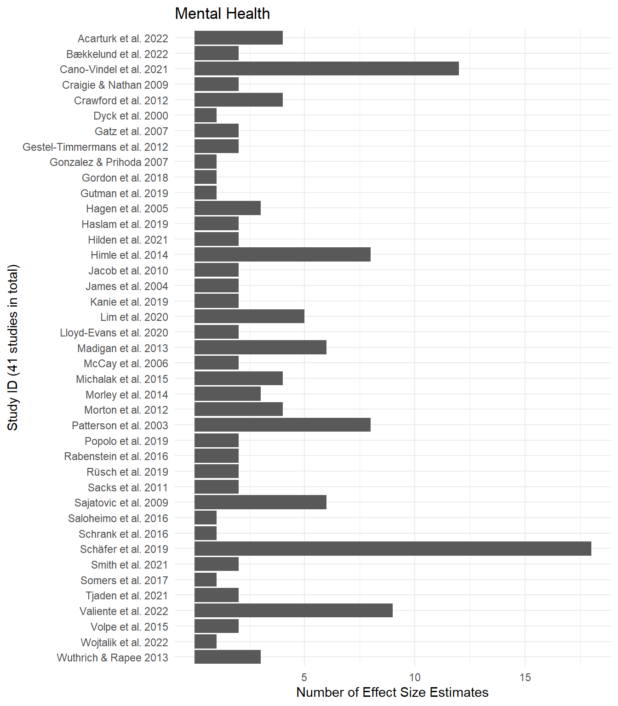

# Introduction 

This document contains all preliminary data analysis for the meta-analyses with dependent effects (PRIMED) in [@Dalgaard2022a]. Below one can inspect the R packages we use for this analysis as well as the data set behind our analyses. 

# Data manipulation

In the following section, we construct all the main variables that are used in the main analysis of the review. 

## R packages
For the exact R package version, see colophon at the bottom of this document. 


::: {.cell}

````{.cell-code  code-fold="false"}
```{{r set-up}}
#| cache: false
#| code-fold: false

# Load packages -----------------------------------------------------------
library(knitr)
library(kableExtra)
library(skimr)
library(janitor)
library(tidyverse)
library(metafor)
library(clubSandwich)
library(fastDummies)  
library(ggrepel)
library(ggExtra)
library(ggridges)
library(MetBrewer)
library(GGally)
```
````
:::


::: {.panel-tabset}
## Reintegration data


::: {.cell}

````{.cell-code}
```{{r load-reint-data}}
reintergation_dat <- 
  readRDS("reintergation_dat.rds") |> 
  mutate(esid = 1:n()) |> 
  select(
    study, eppi_id, esid, N_t, N_c, N_total, inv_sample_size, gt, vgt, Wgt, Wse, 
    prereg_chr, conventional, analysis_plan, Overall, D5, D7, timing
  )

reintergation_dat |> 
  mutate(
    p_val = 2 * ( 1 - pnorm( abs(gt) / sqrt(Wgt) ) )
  ) |> 
  select(
    `Authors (year)` = study, N_t, N_c,
    `Outcome construct` = analysis_plan, gt, vgt, Wgt, Wse, p_val, 
    `No protocol` = conventional, `Overall RoB` = Overall
  ) |> 
  kable(digits=3)  |> 
  kable_styling(
    bootstrap_options = c("striped", "hover"),
    font_size = 10
  ) |> 
  scroll_box(width = "100%", height = "300px", fixed_thead = TRUE)
```
````

::: {.cell-output-display}

`````{=html}
<div style="border: 1px solid #ddd; padding: 0px; overflow-y: scroll; height:300px; overflow-x: scroll; width:100%; "><table class="table table-striped table-hover" style="font-size: 10px; margin-left: auto; margin-right: auto;">
 <thead>
  <tr>
   <th style="text-align:left;position: sticky; top:0; background-color: #FFFFFF;"> Authors (year) </th>
   <th style="text-align:right;position: sticky; top:0; background-color: #FFFFFF;"> N_t </th>
   <th style="text-align:right;position: sticky; top:0; background-color: #FFFFFF;"> N_c </th>
   <th style="text-align:left;position: sticky; top:0; background-color: #FFFFFF;"> Outcome construct </th>
   <th style="text-align:right;position: sticky; top:0; background-color: #FFFFFF;"> gt </th>
   <th style="text-align:right;position: sticky; top:0; background-color: #FFFFFF;"> vgt </th>
   <th style="text-align:right;position: sticky; top:0; background-color: #FFFFFF;"> Wgt </th>
   <th style="text-align:right;position: sticky; top:0; background-color: #FFFFFF;"> Wse </th>
   <th style="text-align:right;position: sticky; top:0; background-color: #FFFFFF;"> p_val </th>
   <th style="text-align:right;position: sticky; top:0; background-color: #FFFFFF;"> No protocol </th>
   <th style="text-align:left;position: sticky; top:0; background-color: #FFFFFF;"> Overall RoB </th>
  </tr>
 </thead>
<tbody>
  <tr>
   <td style="text-align:left;"> Acarturk et al. 2022 </td>
   <td style="text-align:right;"> 24 </td>
   <td style="text-align:right;"> 22 </td>
   <td style="text-align:left;"> Wellbeing and quality of life </td>
   <td style="text-align:right;"> 0.314 </td>
   <td style="text-align:right;"> 0.196 </td>
   <td style="text-align:right;"> 0.195 </td>
   <td style="text-align:right;"> 0.442 </td>
   <td style="text-align:right;"> 0.477 </td>
   <td style="text-align:right;"> 0 </td>
   <td style="text-align:left;"> Some concerns </td>
  </tr>
  <tr>
   <td style="text-align:left;"> Acarturk et al. 2022 </td>
   <td style="text-align:right;"> 24 </td>
   <td style="text-align:right;"> 22 </td>
   <td style="text-align:left;"> Wellbeing and quality of life </td>
   <td style="text-align:right;"> -0.103 </td>
   <td style="text-align:right;"> 0.091 </td>
   <td style="text-align:right;"> 0.091 </td>
   <td style="text-align:right;"> 0.301 </td>
   <td style="text-align:right;"> 0.733 </td>
   <td style="text-align:right;"> 0 </td>
   <td style="text-align:left;"> High </td>
  </tr>
  <tr>
   <td style="text-align:left;"> Barbic et al. 2009 </td>
   <td style="text-align:right;"> 16 </td>
   <td style="text-align:right;"> 17 </td>
   <td style="text-align:left;"> Hope, empowerment &amp; self-efficacy </td>
   <td style="text-align:right;"> 0.443 </td>
   <td style="text-align:right;"> 0.162 </td>
   <td style="text-align:right;"> 0.159 </td>
   <td style="text-align:right;"> 0.399 </td>
   <td style="text-align:right;"> 0.267 </td>
   <td style="text-align:right;"> 1 </td>
   <td style="text-align:left;"> Some concerns </td>
  </tr>
  <tr>
   <td style="text-align:left;"> Barbic et al. 2009 </td>
   <td style="text-align:right;"> 16 </td>
   <td style="text-align:right;"> 17 </td>
   <td style="text-align:left;"> Wellbeing and quality of life </td>
   <td style="text-align:right;"> -0.069 </td>
   <td style="text-align:right;"> 0.159 </td>
   <td style="text-align:right;"> 0.159 </td>
   <td style="text-align:right;"> 0.399 </td>
   <td style="text-align:right;"> 0.863 </td>
   <td style="text-align:right;"> 1 </td>
   <td style="text-align:left;"> Some concerns </td>
  </tr>
  <tr>
   <td style="text-align:left;"> Barbic et al. 2009 </td>
   <td style="text-align:right;"> 16 </td>
   <td style="text-align:right;"> 17 </td>
   <td style="text-align:left;"> Hope, empowerment &amp; self-efficacy </td>
   <td style="text-align:right;"> 0.548 </td>
   <td style="text-align:right;"> 0.164 </td>
   <td style="text-align:right;"> 0.159 </td>
   <td style="text-align:right;"> 0.399 </td>
   <td style="text-align:right;"> 0.170 </td>
   <td style="text-align:right;"> 1 </td>
   <td style="text-align:left;"> Some concerns </td>
  </tr>
  <tr>
   <td style="text-align:left;"> Bond et al. 2015 </td>
   <td style="text-align:right;"> 43 </td>
   <td style="text-align:right;"> 42 </td>
   <td style="text-align:left;"> Hope, empowerment &amp; self-efficacy </td>
   <td style="text-align:right;"> 0.000 </td>
   <td style="text-align:right;"> 0.094 </td>
   <td style="text-align:right;"> 0.094 </td>
   <td style="text-align:right;"> 0.306 </td>
   <td style="text-align:right;"> 1.000 </td>
   <td style="text-align:right;"> 1 </td>
   <td style="text-align:left;"> Some concerns </td>
  </tr>
  <tr>
   <td style="text-align:left;"> Bækkelund et al. 2022 </td>
   <td style="text-align:right;"> 29 </td>
   <td style="text-align:right;"> 30 </td>
   <td style="text-align:left;"> Social functioning (degree of impairment) </td>
   <td style="text-align:right;"> -0.138 </td>
   <td style="text-align:right;"> 0.082 </td>
   <td style="text-align:right;"> 0.082 </td>
   <td style="text-align:right;"> 0.286 </td>
   <td style="text-align:right;"> 0.631 </td>
   <td style="text-align:right;"> 0 </td>
   <td style="text-align:left;"> Low </td>
  </tr>
  <tr>
   <td style="text-align:left;"> Bækkelund et al. 2022 </td>
   <td style="text-align:right;"> 29 </td>
   <td style="text-align:right;"> 30 </td>
   <td style="text-align:left;"> Social functioning (degree of impairment) </td>
   <td style="text-align:right;"> 0.340 </td>
   <td style="text-align:right;"> 0.089 </td>
   <td style="text-align:right;"> 0.088 </td>
   <td style="text-align:right;"> 0.297 </td>
   <td style="text-align:right;"> 0.253 </td>
   <td style="text-align:right;"> 0 </td>
   <td style="text-align:left;"> Low </td>
  </tr>
  <tr>
   <td style="text-align:left;"> Cano-Vindel et al. 2021 </td>
   <td style="text-align:right;"> 315 </td>
   <td style="text-align:right;"> 316 </td>
   <td style="text-align:left;"> Social functioning (degree of impairment) </td>
   <td style="text-align:right;"> 0.259 </td>
   <td style="text-align:right;"> 0.006 </td>
   <td style="text-align:right;"> 0.006 </td>
   <td style="text-align:right;"> 0.080 </td>
   <td style="text-align:right;"> 0.001 </td>
   <td style="text-align:right;"> 0 </td>
   <td style="text-align:left;"> Low </td>
  </tr>
  <tr>
   <td style="text-align:left;"> Cano-Vindel et al. 2021 </td>
   <td style="text-align:right;"> 315 </td>
   <td style="text-align:right;"> 316 </td>
   <td style="text-align:left;"> Social functioning (degree of impairment) </td>
   <td style="text-align:right;"> 0.428 </td>
   <td style="text-align:right;"> 0.005 </td>
   <td style="text-align:right;"> 0.005 </td>
   <td style="text-align:right;"> 0.072 </td>
   <td style="text-align:right;"> 0.000 </td>
   <td style="text-align:right;"> 0 </td>
   <td style="text-align:left;"> Low </td>
  </tr>
  <tr>
   <td style="text-align:left;"> Cano-Vindel et al. 2021 </td>
   <td style="text-align:right;"> 315 </td>
   <td style="text-align:right;"> 316 </td>
   <td style="text-align:left;"> Social functioning (degree of impairment) </td>
   <td style="text-align:right;"> 0.439 </td>
   <td style="text-align:right;"> 0.007 </td>
   <td style="text-align:right;"> 0.007 </td>
   <td style="text-align:right;"> 0.082 </td>
   <td style="text-align:right;"> 0.000 </td>
   <td style="text-align:right;"> 0 </td>
   <td style="text-align:left;"> Low </td>
  </tr>
  <tr>
   <td style="text-align:left;"> Cano-Vindel et al. 2021 </td>
   <td style="text-align:right;"> 315 </td>
   <td style="text-align:right;"> 316 </td>
   <td style="text-align:left;"> Wellbeing and quality of life </td>
   <td style="text-align:right;"> 0.565 </td>
   <td style="text-align:right;"> 0.006 </td>
   <td style="text-align:right;"> 0.006 </td>
   <td style="text-align:right;"> 0.076 </td>
   <td style="text-align:right;"> 0.000 </td>
   <td style="text-align:right;"> 0 </td>
   <td style="text-align:left;"> Low </td>
  </tr>
  <tr>
   <td style="text-align:left;"> Cano-Vindel et al. 2021 </td>
   <td style="text-align:right;"> 315 </td>
   <td style="text-align:right;"> 316 </td>
   <td style="text-align:left;"> Wellbeing and quality of life </td>
   <td style="text-align:right;"> 0.593 </td>
   <td style="text-align:right;"> 0.005 </td>
   <td style="text-align:right;"> 0.005 </td>
   <td style="text-align:right;"> 0.069 </td>
   <td style="text-align:right;"> 0.000 </td>
   <td style="text-align:right;"> 0 </td>
   <td style="text-align:left;"> Low </td>
  </tr>
  <tr>
   <td style="text-align:left;"> Cano-Vindel et al. 2021 </td>
   <td style="text-align:right;"> 315 </td>
   <td style="text-align:right;"> 316 </td>
   <td style="text-align:left;"> Wellbeing and quality of life </td>
   <td style="text-align:right;"> 0.305 </td>
   <td style="text-align:right;"> 0.005 </td>
   <td style="text-align:right;"> 0.005 </td>
   <td style="text-align:right;"> 0.069 </td>
   <td style="text-align:right;"> 0.000 </td>
   <td style="text-align:right;"> 0 </td>
   <td style="text-align:left;"> Low </td>
  </tr>
  <tr>
   <td style="text-align:left;"> Cano-Vindel et al. 2021 </td>
   <td style="text-align:right;"> 315 </td>
   <td style="text-align:right;"> 316 </td>
   <td style="text-align:left;"> Wellbeing and quality of life </td>
   <td style="text-align:right;"> 0.389 </td>
   <td style="text-align:right;"> 0.007 </td>
   <td style="text-align:right;"> 0.007 </td>
   <td style="text-align:right;"> 0.083 </td>
   <td style="text-align:right;"> 0.000 </td>
   <td style="text-align:right;"> 0 </td>
   <td style="text-align:left;"> Low </td>
  </tr>
  <tr>
   <td style="text-align:left;"> Cano-Vindel et al. 2021 </td>
   <td style="text-align:right;"> 273 </td>
   <td style="text-align:right;"> 238 </td>
   <td style="text-align:left;"> Social functioning (degree of impairment) </td>
   <td style="text-align:right;"> 0.066 </td>
   <td style="text-align:right;"> 0.008 </td>
   <td style="text-align:right;"> 0.008 </td>
   <td style="text-align:right;"> 0.088 </td>
   <td style="text-align:right;"> 0.450 </td>
   <td style="text-align:right;"> 0 </td>
   <td style="text-align:left;"> Low </td>
  </tr>
  <tr>
   <td style="text-align:left;"> Cano-Vindel et al. 2021 </td>
   <td style="text-align:right;"> 273 </td>
   <td style="text-align:right;"> 238 </td>
   <td style="text-align:left;"> Social functioning (degree of impairment) </td>
   <td style="text-align:right;"> 0.128 </td>
   <td style="text-align:right;"> 0.006 </td>
   <td style="text-align:right;"> 0.006 </td>
   <td style="text-align:right;"> 0.079 </td>
   <td style="text-align:right;"> 0.104 </td>
   <td style="text-align:right;"> 0 </td>
   <td style="text-align:left;"> Low </td>
  </tr>
  <tr>
   <td style="text-align:left;"> Cano-Vindel et al. 2021 </td>
   <td style="text-align:right;"> 273 </td>
   <td style="text-align:right;"> 238 </td>
   <td style="text-align:left;"> Social functioning (degree of impairment) </td>
   <td style="text-align:right;"> 0.224 </td>
   <td style="text-align:right;"> 0.008 </td>
   <td style="text-align:right;"> 0.008 </td>
   <td style="text-align:right;"> 0.090 </td>
   <td style="text-align:right;"> 0.013 </td>
   <td style="text-align:right;"> 0 </td>
   <td style="text-align:left;"> Low </td>
  </tr>
  <tr>
   <td style="text-align:left;"> Cano-Vindel et al. 2021 </td>
   <td style="text-align:right;"> 273 </td>
   <td style="text-align:right;"> 238 </td>
   <td style="text-align:left;"> Wellbeing and quality of life </td>
   <td style="text-align:right;"> 0.301 </td>
   <td style="text-align:right;"> 0.007 </td>
   <td style="text-align:right;"> 0.007 </td>
   <td style="text-align:right;"> 0.083 </td>
   <td style="text-align:right;"> 0.000 </td>
   <td style="text-align:right;"> 0 </td>
   <td style="text-align:left;"> Low </td>
  </tr>
  <tr>
   <td style="text-align:left;"> Cano-Vindel et al. 2021 </td>
   <td style="text-align:right;"> 273 </td>
   <td style="text-align:right;"> 238 </td>
   <td style="text-align:left;"> Wellbeing and quality of life </td>
   <td style="text-align:right;"> 0.308 </td>
   <td style="text-align:right;"> 0.006 </td>
   <td style="text-align:right;"> 0.006 </td>
   <td style="text-align:right;"> 0.076 </td>
   <td style="text-align:right;"> 0.000 </td>
   <td style="text-align:right;"> 0 </td>
   <td style="text-align:left;"> Low </td>
  </tr>
  <tr>
   <td style="text-align:left;"> Cano-Vindel et al. 2021 </td>
   <td style="text-align:right;"> 273 </td>
   <td style="text-align:right;"> 238 </td>
   <td style="text-align:left;"> Wellbeing and quality of life </td>
   <td style="text-align:right;"> 0.211 </td>
   <td style="text-align:right;"> 0.006 </td>
   <td style="text-align:right;"> 0.006 </td>
   <td style="text-align:right;"> 0.076 </td>
   <td style="text-align:right;"> 0.005 </td>
   <td style="text-align:right;"> 0 </td>
   <td style="text-align:left;"> Low </td>
  </tr>
  <tr>
   <td style="text-align:left;"> Cano-Vindel et al. 2021 </td>
   <td style="text-align:right;"> 273 </td>
   <td style="text-align:right;"> 238 </td>
   <td style="text-align:left;"> Wellbeing and quality of life </td>
   <td style="text-align:right;"> 0.194 </td>
   <td style="text-align:right;"> 0.008 </td>
   <td style="text-align:right;"> 0.008 </td>
   <td style="text-align:right;"> 0.091 </td>
   <td style="text-align:right;"> 0.033 </td>
   <td style="text-align:right;"> 0 </td>
   <td style="text-align:left;"> Low </td>
  </tr>
  <tr>
   <td style="text-align:left;"> Cano-Vindel et al. 2021 </td>
   <td style="text-align:right;"> 229 </td>
   <td style="text-align:right;"> 204 </td>
   <td style="text-align:left;"> Social functioning (degree of impairment) </td>
   <td style="text-align:right;"> 0.342 </td>
   <td style="text-align:right;"> 0.009 </td>
   <td style="text-align:right;"> 0.009 </td>
   <td style="text-align:right;"> 0.095 </td>
   <td style="text-align:right;"> 0.000 </td>
   <td style="text-align:right;"> 0 </td>
   <td style="text-align:left;"> Low </td>
  </tr>
  <tr>
   <td style="text-align:left;"> Cano-Vindel et al. 2021 </td>
   <td style="text-align:right;"> 229 </td>
   <td style="text-align:right;"> 204 </td>
   <td style="text-align:left;"> Social functioning (degree of impairment) </td>
   <td style="text-align:right;"> 0.357 </td>
   <td style="text-align:right;"> 0.008 </td>
   <td style="text-align:right;"> 0.007 </td>
   <td style="text-align:right;"> 0.086 </td>
   <td style="text-align:right;"> 0.000 </td>
   <td style="text-align:right;"> 0 </td>
   <td style="text-align:left;"> Low </td>
  </tr>
  <tr>
   <td style="text-align:left;"> Cano-Vindel et al. 2021 </td>
   <td style="text-align:right;"> 229 </td>
   <td style="text-align:right;"> 204 </td>
   <td style="text-align:left;"> Social functioning (degree of impairment) </td>
   <td style="text-align:right;"> 0.403 </td>
   <td style="text-align:right;"> 0.010 </td>
   <td style="text-align:right;"> 0.010 </td>
   <td style="text-align:right;"> 0.098 </td>
   <td style="text-align:right;"> 0.000 </td>
   <td style="text-align:right;"> 0 </td>
   <td style="text-align:left;"> Low </td>
  </tr>
  <tr>
   <td style="text-align:left;"> Cano-Vindel et al. 2021 </td>
   <td style="text-align:right;"> 229 </td>
   <td style="text-align:right;"> 204 </td>
   <td style="text-align:left;"> Wellbeing and quality of life </td>
   <td style="text-align:right;"> 0.381 </td>
   <td style="text-align:right;"> 0.008 </td>
   <td style="text-align:right;"> 0.008 </td>
   <td style="text-align:right;"> 0.091 </td>
   <td style="text-align:right;"> 0.000 </td>
   <td style="text-align:right;"> 0 </td>
   <td style="text-align:left;"> Low </td>
  </tr>
  <tr>
   <td style="text-align:left;"> Cano-Vindel et al. 2021 </td>
   <td style="text-align:right;"> 229 </td>
   <td style="text-align:right;"> 204 </td>
   <td style="text-align:left;"> Wellbeing and quality of life </td>
   <td style="text-align:right;"> 0.232 </td>
   <td style="text-align:right;"> 0.007 </td>
   <td style="text-align:right;"> 0.007 </td>
   <td style="text-align:right;"> 0.082 </td>
   <td style="text-align:right;"> 0.005 </td>
   <td style="text-align:right;"> 0 </td>
   <td style="text-align:left;"> Low </td>
  </tr>
  <tr>
   <td style="text-align:left;"> Cano-Vindel et al. 2021 </td>
   <td style="text-align:right;"> 229 </td>
   <td style="text-align:right;"> 204 </td>
   <td style="text-align:left;"> Wellbeing and quality of life </td>
   <td style="text-align:right;"> 0.083 </td>
   <td style="text-align:right;"> 0.007 </td>
   <td style="text-align:right;"> 0.007 </td>
   <td style="text-align:right;"> 0.082 </td>
   <td style="text-align:right;"> 0.313 </td>
   <td style="text-align:right;"> 0 </td>
   <td style="text-align:left;"> Low </td>
  </tr>
  <tr>
   <td style="text-align:left;"> Cano-Vindel et al. 2021 </td>
   <td style="text-align:right;"> 229 </td>
   <td style="text-align:right;"> 204 </td>
   <td style="text-align:left;"> Wellbeing and quality of life </td>
   <td style="text-align:right;"> 0.179 </td>
   <td style="text-align:right;"> 0.010 </td>
   <td style="text-align:right;"> 0.010 </td>
   <td style="text-align:right;"> 0.099 </td>
   <td style="text-align:right;"> 0.072 </td>
   <td style="text-align:right;"> 0 </td>
   <td style="text-align:left;"> Low </td>
  </tr>
  <tr>
   <td style="text-align:left;"> Cano-Vindel et al. 2021 </td>
   <td style="text-align:right;"> 208 </td>
   <td style="text-align:right;"> 180 </td>
   <td style="text-align:left;"> Social functioning (degree of impairment) </td>
   <td style="text-align:right;"> 0.455 </td>
   <td style="text-align:right;"> 0.010 </td>
   <td style="text-align:right;"> 0.010 </td>
   <td style="text-align:right;"> 0.101 </td>
   <td style="text-align:right;"> 0.000 </td>
   <td style="text-align:right;"> 0 </td>
   <td style="text-align:left;"> Low </td>
  </tr>
  <tr>
   <td style="text-align:left;"> Cano-Vindel et al. 2021 </td>
   <td style="text-align:right;"> 208 </td>
   <td style="text-align:right;"> 180 </td>
   <td style="text-align:left;"> Social functioning (degree of impairment) </td>
   <td style="text-align:right;"> 0.457 </td>
   <td style="text-align:right;"> 0.008 </td>
   <td style="text-align:right;"> 0.008 </td>
   <td style="text-align:right;"> 0.091 </td>
   <td style="text-align:right;"> 0.000 </td>
   <td style="text-align:right;"> 0 </td>
   <td style="text-align:left;"> Low </td>
  </tr>
  <tr>
   <td style="text-align:left;"> Cano-Vindel et al. 2021 </td>
   <td style="text-align:right;"> 208 </td>
   <td style="text-align:right;"> 180 </td>
   <td style="text-align:left;"> Social functioning (degree of impairment) </td>
   <td style="text-align:right;"> 0.512 </td>
   <td style="text-align:right;"> 0.011 </td>
   <td style="text-align:right;"> 0.011 </td>
   <td style="text-align:right;"> 0.103 </td>
   <td style="text-align:right;"> 0.000 </td>
   <td style="text-align:right;"> 0 </td>
   <td style="text-align:left;"> Low </td>
  </tr>
  <tr>
   <td style="text-align:left;"> Cano-Vindel et al. 2021 </td>
   <td style="text-align:right;"> 208 </td>
   <td style="text-align:right;"> 180 </td>
   <td style="text-align:left;"> Wellbeing and quality of life </td>
   <td style="text-align:right;"> 0.598 </td>
   <td style="text-align:right;"> 0.010 </td>
   <td style="text-align:right;"> 0.009 </td>
   <td style="text-align:right;"> 0.096 </td>
   <td style="text-align:right;"> 0.000 </td>
   <td style="text-align:right;"> 0 </td>
   <td style="text-align:left;"> Low </td>
  </tr>
  <tr>
   <td style="text-align:left;"> Cano-Vindel et al. 2021 </td>
   <td style="text-align:right;"> 208 </td>
   <td style="text-align:right;"> 180 </td>
   <td style="text-align:left;"> Wellbeing and quality of life </td>
   <td style="text-align:right;"> 0.410 </td>
   <td style="text-align:right;"> 0.008 </td>
   <td style="text-align:right;"> 0.008 </td>
   <td style="text-align:right;"> 0.087 </td>
   <td style="text-align:right;"> 0.000 </td>
   <td style="text-align:right;"> 0 </td>
   <td style="text-align:left;"> Low </td>
  </tr>
  <tr>
   <td style="text-align:left;"> Cano-Vindel et al. 2021 </td>
   <td style="text-align:right;"> 208 </td>
   <td style="text-align:right;"> 180 </td>
   <td style="text-align:left;"> Wellbeing and quality of life </td>
   <td style="text-align:right;"> 0.281 </td>
   <td style="text-align:right;"> 0.008 </td>
   <td style="text-align:right;"> 0.008 </td>
   <td style="text-align:right;"> 0.087 </td>
   <td style="text-align:right;"> 0.001 </td>
   <td style="text-align:right;"> 0 </td>
   <td style="text-align:left;"> Low </td>
  </tr>
  <tr>
   <td style="text-align:left;"> Cano-Vindel et al. 2021 </td>
   <td style="text-align:right;"> 208 </td>
   <td style="text-align:right;"> 180 </td>
   <td style="text-align:left;"> Wellbeing and quality of life </td>
   <td style="text-align:right;"> 0.245 </td>
   <td style="text-align:right;"> 0.011 </td>
   <td style="text-align:right;"> 0.011 </td>
   <td style="text-align:right;"> 0.105 </td>
   <td style="text-align:right;"> 0.019 </td>
   <td style="text-align:right;"> 0 </td>
   <td style="text-align:left;"> Low </td>
  </tr>
  <tr>
   <td style="text-align:left;"> Craigie &amp; Nathan 2009 </td>
   <td style="text-align:right;"> 157 </td>
   <td style="text-align:right;"> 77 </td>
   <td style="text-align:left;"> Wellbeing and quality of life </td>
   <td style="text-align:right;"> -0.247 </td>
   <td style="text-align:right;"> 0.026 </td>
   <td style="text-align:right;"> 0.026 </td>
   <td style="text-align:right;"> 0.162 </td>
   <td style="text-align:right;"> 0.128 </td>
   <td style="text-align:right;"> 1 </td>
   <td style="text-align:left;"> Serious </td>
  </tr>
  <tr>
   <td style="text-align:left;"> Crawford et al. 2012 </td>
   <td style="text-align:right;"> 121 </td>
   <td style="text-align:right;"> 121 </td>
   <td style="text-align:left;"> Social functioning (degree of impairment) </td>
   <td style="text-align:right;"> -0.020 </td>
   <td style="text-align:right;"> 0.025 </td>
   <td style="text-align:right;"> 0.025 </td>
   <td style="text-align:right;"> 0.159 </td>
   <td style="text-align:right;"> 0.900 </td>
   <td style="text-align:right;"> 0 </td>
   <td style="text-align:left;"> Low </td>
  </tr>
  <tr>
   <td style="text-align:left;"> Crawford et al. 2012 </td>
   <td style="text-align:right;"> 119 </td>
   <td style="text-align:right;"> 121 </td>
   <td style="text-align:left;"> Social functioning (degree of impairment) </td>
   <td style="text-align:right;"> -0.046 </td>
   <td style="text-align:right;"> 0.026 </td>
   <td style="text-align:right;"> 0.026 </td>
   <td style="text-align:right;"> 0.160 </td>
   <td style="text-align:right;"> 0.774 </td>
   <td style="text-align:right;"> 0 </td>
   <td style="text-align:left;"> Low </td>
  </tr>
  <tr>
   <td style="text-align:left;"> Crawford et al. 2012 </td>
   <td style="text-align:right;"> 121 </td>
   <td style="text-align:right;"> 117 </td>
   <td style="text-align:left;"> Social functioning (degree of impairment) </td>
   <td style="text-align:right;"> -0.037 </td>
   <td style="text-align:right;"> 0.020 </td>
   <td style="text-align:right;"> 0.020 </td>
   <td style="text-align:right;"> 0.141 </td>
   <td style="text-align:right;"> 0.792 </td>
   <td style="text-align:right;"> 0 </td>
   <td style="text-align:left;"> Low </td>
  </tr>
  <tr>
   <td style="text-align:left;"> Crawford et al. 2012 </td>
   <td style="text-align:right;"> 117 </td>
   <td style="text-align:right;"> 117 </td>
   <td style="text-align:left;"> Social functioning (degree of impairment) </td>
   <td style="text-align:right;"> -0.083 </td>
   <td style="text-align:right;"> 0.020 </td>
   <td style="text-align:right;"> 0.020 </td>
   <td style="text-align:right;"> 0.142 </td>
   <td style="text-align:right;"> 0.558 </td>
   <td style="text-align:right;"> 0 </td>
   <td style="text-align:left;"> Low </td>
  </tr>
  <tr>
   <td style="text-align:left;"> Crawford et al. 2012 </td>
   <td style="text-align:right;"> 121 </td>
   <td style="text-align:right;"> 121 </td>
   <td style="text-align:left;"> Social functioning (degree of impairment) </td>
   <td style="text-align:right;"> -0.265 </td>
   <td style="text-align:right;"> 0.022 </td>
   <td style="text-align:right;"> 0.021 </td>
   <td style="text-align:right;"> 0.147 </td>
   <td style="text-align:right;"> 0.070 </td>
   <td style="text-align:right;"> 0 </td>
   <td style="text-align:left;"> Low </td>
  </tr>
  <tr>
   <td style="text-align:left;"> Crawford et al. 2012 </td>
   <td style="text-align:right;"> 119 </td>
   <td style="text-align:right;"> 121 </td>
   <td style="text-align:left;"> Social functioning (degree of impairment) </td>
   <td style="text-align:right;"> -0.137 </td>
   <td style="text-align:right;"> 0.022 </td>
   <td style="text-align:right;"> 0.022 </td>
   <td style="text-align:right;"> 0.147 </td>
   <td style="text-align:right;"> 0.352 </td>
   <td style="text-align:right;"> 0 </td>
   <td style="text-align:left;"> Low </td>
  </tr>
  <tr>
   <td style="text-align:left;"> Crawford et al. 2012 </td>
   <td style="text-align:right;"> 121 </td>
   <td style="text-align:right;"> 117 </td>
   <td style="text-align:left;"> Social functioning (degree of impairment) </td>
   <td style="text-align:right;"> -0.209 </td>
   <td style="text-align:right;"> 0.022 </td>
   <td style="text-align:right;"> 0.022 </td>
   <td style="text-align:right;"> 0.147 </td>
   <td style="text-align:right;"> 0.157 </td>
   <td style="text-align:right;"> 0 </td>
   <td style="text-align:left;"> Low </td>
  </tr>
  <tr>
   <td style="text-align:left;"> Crawford et al. 2012 </td>
   <td style="text-align:right;"> 117 </td>
   <td style="text-align:right;"> 117 </td>
   <td style="text-align:left;"> Social functioning (degree of impairment) </td>
   <td style="text-align:right;"> -0.081 </td>
   <td style="text-align:right;"> 0.022 </td>
   <td style="text-align:right;"> 0.022 </td>
   <td style="text-align:right;"> 0.149 </td>
   <td style="text-align:right;"> 0.588 </td>
   <td style="text-align:right;"> 0 </td>
   <td style="text-align:left;"> Low </td>
  </tr>
  <tr>
   <td style="text-align:left;"> Crawford et al. 2012 </td>
   <td style="text-align:right;"> 121 </td>
   <td style="text-align:right;"> 121 </td>
   <td style="text-align:left;"> Wellbeing and quality of life </td>
   <td style="text-align:right;"> 0.203 </td>
   <td style="text-align:right;"> 0.022 </td>
   <td style="text-align:right;"> 0.021 </td>
   <td style="text-align:right;"> 0.147 </td>
   <td style="text-align:right;"> 0.167 </td>
   <td style="text-align:right;"> 0 </td>
   <td style="text-align:left;"> Low </td>
  </tr>
  <tr>
   <td style="text-align:left;"> Crawford et al. 2012 </td>
   <td style="text-align:right;"> 119 </td>
   <td style="text-align:right;"> 121 </td>
   <td style="text-align:left;"> Wellbeing and quality of life </td>
   <td style="text-align:right;"> 0.074 </td>
   <td style="text-align:right;"> 0.022 </td>
   <td style="text-align:right;"> 0.022 </td>
   <td style="text-align:right;"> 0.147 </td>
   <td style="text-align:right;"> 0.616 </td>
   <td style="text-align:right;"> 0 </td>
   <td style="text-align:left;"> Low </td>
  </tr>
  <tr>
   <td style="text-align:left;"> Crawford et al. 2012 </td>
   <td style="text-align:right;"> 121 </td>
   <td style="text-align:right;"> 117 </td>
   <td style="text-align:left;"> Wellbeing and quality of life </td>
   <td style="text-align:right;"> 0.177 </td>
   <td style="text-align:right;"> 0.022 </td>
   <td style="text-align:right;"> 0.022 </td>
   <td style="text-align:right;"> 0.147 </td>
   <td style="text-align:right;"> 0.229 </td>
   <td style="text-align:right;"> 0 </td>
   <td style="text-align:left;"> Low </td>
  </tr>
  <tr>
   <td style="text-align:left;"> Crawford et al. 2012 </td>
   <td style="text-align:right;"> 117 </td>
   <td style="text-align:right;"> 117 </td>
   <td style="text-align:left;"> Wellbeing and quality of life </td>
   <td style="text-align:right;"> 0.166 </td>
   <td style="text-align:right;"> 0.022 </td>
   <td style="text-align:right;"> 0.022 </td>
   <td style="text-align:right;"> 0.149 </td>
   <td style="text-align:right;"> 0.266 </td>
   <td style="text-align:right;"> 0 </td>
   <td style="text-align:left;"> Low </td>
  </tr>
  <tr>
   <td style="text-align:left;"> Druss et al. 2010 </td>
   <td style="text-align:right;"> 41 </td>
   <td style="text-align:right;"> 39 </td>
   <td style="text-align:left;"> Wellbeing and quality of life </td>
   <td style="text-align:right;"> 0.207 </td>
   <td style="text-align:right;"> 0.065 </td>
   <td style="text-align:right;"> 0.065 </td>
   <td style="text-align:right;"> 0.254 </td>
   <td style="text-align:right;"> 0.416 </td>
   <td style="text-align:right;"> 0 </td>
   <td style="text-align:left;"> High </td>
  </tr>
  <tr>
   <td style="text-align:left;"> Druss et al. 2010 </td>
   <td style="text-align:right;"> 41 </td>
   <td style="text-align:right;"> 39 </td>
   <td style="text-align:left;"> Wellbeing and quality of life </td>
   <td style="text-align:right;"> 0.035 </td>
   <td style="text-align:right;"> 0.065 </td>
   <td style="text-align:right;"> 0.065 </td>
   <td style="text-align:right;"> 0.254 </td>
   <td style="text-align:right;"> 0.890 </td>
   <td style="text-align:right;"> 0 </td>
   <td style="text-align:left;"> High </td>
  </tr>
  <tr>
   <td style="text-align:left;"> Druss et al. 2018 </td>
   <td style="text-align:right;"> 198 </td>
   <td style="text-align:right;"> 202 </td>
   <td style="text-align:left;"> Hope, empowerment &amp; self-efficacy </td>
   <td style="text-align:right;"> 0.204 </td>
   <td style="text-align:right;"> 0.013 </td>
   <td style="text-align:right;"> 0.013 </td>
   <td style="text-align:right;"> 0.114 </td>
   <td style="text-align:right;"> 0.074 </td>
   <td style="text-align:right;"> 0 </td>
   <td style="text-align:left;"> Some concerns </td>
  </tr>
  <tr>
   <td style="text-align:left;"> Druss et al. 2018 </td>
   <td style="text-align:right;"> 198 </td>
   <td style="text-align:right;"> 202 </td>
   <td style="text-align:left;"> Wellbeing and quality of life </td>
   <td style="text-align:right;"> 0.055 </td>
   <td style="text-align:right;"> 0.013 </td>
   <td style="text-align:right;"> 0.013 </td>
   <td style="text-align:right;"> 0.114 </td>
   <td style="text-align:right;"> 0.630 </td>
   <td style="text-align:right;"> 0 </td>
   <td style="text-align:left;"> Some concerns </td>
  </tr>
  <tr>
   <td style="text-align:left;"> Druss et al. 2018 </td>
   <td style="text-align:right;"> 198 </td>
   <td style="text-align:right;"> 202 </td>
   <td style="text-align:left;"> Wellbeing and quality of life </td>
   <td style="text-align:right;"> 0.019 </td>
   <td style="text-align:right;"> 0.013 </td>
   <td style="text-align:right;"> 0.013 </td>
   <td style="text-align:right;"> 0.114 </td>
   <td style="text-align:right;"> 0.866 </td>
   <td style="text-align:right;"> 0 </td>
   <td style="text-align:left;"> Some concerns </td>
  </tr>
  <tr>
   <td style="text-align:left;"> Druss et al. 2018 </td>
   <td style="text-align:right;"> 198 </td>
   <td style="text-align:right;"> 202 </td>
   <td style="text-align:left;"> Hope, empowerment &amp; self-efficacy </td>
   <td style="text-align:right;"> 0.113 </td>
   <td style="text-align:right;"> 0.013 </td>
   <td style="text-align:right;"> 0.013 </td>
   <td style="text-align:right;"> 0.114 </td>
   <td style="text-align:right;"> 0.321 </td>
   <td style="text-align:right;"> 0 </td>
   <td style="text-align:left;"> Some concerns </td>
  </tr>
  <tr>
   <td style="text-align:left;"> Druss et al. 2018 </td>
   <td style="text-align:right;"> 198 </td>
   <td style="text-align:right;"> 202 </td>
   <td style="text-align:left;"> Wellbeing and quality of life </td>
   <td style="text-align:right;"> 0.102 </td>
   <td style="text-align:right;"> 0.013 </td>
   <td style="text-align:right;"> 0.013 </td>
   <td style="text-align:right;"> 0.114 </td>
   <td style="text-align:right;"> 0.373 </td>
   <td style="text-align:right;"> 0 </td>
   <td style="text-align:left;"> Some concerns </td>
  </tr>
  <tr>
   <td style="text-align:left;"> Druss et al. 2018 </td>
   <td style="text-align:right;"> 198 </td>
   <td style="text-align:right;"> 202 </td>
   <td style="text-align:left;"> Wellbeing and quality of life </td>
   <td style="text-align:right;"> 0.169 </td>
   <td style="text-align:right;"> 0.013 </td>
   <td style="text-align:right;"> 0.013 </td>
   <td style="text-align:right;"> 0.114 </td>
   <td style="text-align:right;"> 0.140 </td>
   <td style="text-align:right;"> 0 </td>
   <td style="text-align:left;"> Some concerns </td>
  </tr>
  <tr>
   <td style="text-align:left;"> Gestel-Timmermans et al. 2012 </td>
   <td style="text-align:right;"> 136 </td>
   <td style="text-align:right;"> 117 </td>
   <td style="text-align:left;"> Hope, empowerment &amp; self-efficacy </td>
   <td style="text-align:right;"> 0.193 </td>
   <td style="text-align:right;"> 0.014 </td>
   <td style="text-align:right;"> 0.014 </td>
   <td style="text-align:right;"> 0.118 </td>
   <td style="text-align:right;"> 0.102 </td>
   <td style="text-align:right;"> 0 </td>
   <td style="text-align:left;"> High </td>
  </tr>
  <tr>
   <td style="text-align:left;"> Gestel-Timmermans et al. 2012 </td>
   <td style="text-align:right;"> 121 </td>
   <td style="text-align:right;"> 99 </td>
   <td style="text-align:left;"> Hope, empowerment &amp; self-efficacy </td>
   <td style="text-align:right;"> 0.156 </td>
   <td style="text-align:right;"> 0.014 </td>
   <td style="text-align:right;"> 0.014 </td>
   <td style="text-align:right;"> 0.120 </td>
   <td style="text-align:right;"> 0.191 </td>
   <td style="text-align:right;"> 0 </td>
   <td style="text-align:left;"> High </td>
  </tr>
  <tr>
   <td style="text-align:left;"> Gestel-Timmermans et al. 2012 </td>
   <td style="text-align:right;"> 132 </td>
   <td style="text-align:right;"> 118 </td>
   <td style="text-align:left;"> Hope, empowerment &amp; self-efficacy </td>
   <td style="text-align:right;"> 0.122 </td>
   <td style="text-align:right;"> 0.014 </td>
   <td style="text-align:right;"> 0.014 </td>
   <td style="text-align:right;"> 0.117 </td>
   <td style="text-align:right;"> 0.298 </td>
   <td style="text-align:right;"> 0 </td>
   <td style="text-align:left;"> High </td>
  </tr>
  <tr>
   <td style="text-align:left;"> Gestel-Timmermans et al. 2012 </td>
   <td style="text-align:right;"> 120 </td>
   <td style="text-align:right;"> 97 </td>
   <td style="text-align:left;"> Hope, empowerment &amp; self-efficacy </td>
   <td style="text-align:right;"> 0.348 </td>
   <td style="text-align:right;"> 0.017 </td>
   <td style="text-align:right;"> 0.017 </td>
   <td style="text-align:right;"> 0.129 </td>
   <td style="text-align:right;"> 0.007 </td>
   <td style="text-align:right;"> 0 </td>
   <td style="text-align:left;"> High </td>
  </tr>
  <tr>
   <td style="text-align:left;"> Gestel-Timmermans et al. 2012 </td>
   <td style="text-align:right;"> 124 </td>
   <td style="text-align:right;"> 114 </td>
   <td style="text-align:left;"> Wellbeing and quality of life </td>
   <td style="text-align:right;"> -0.045 </td>
   <td style="text-align:right;"> 0.011 </td>
   <td style="text-align:right;"> 0.011 </td>
   <td style="text-align:right;"> 0.106 </td>
   <td style="text-align:right;"> 0.675 </td>
   <td style="text-align:right;"> 0 </td>
   <td style="text-align:left;"> High </td>
  </tr>
  <tr>
   <td style="text-align:left;"> Gestel-Timmermans et al. 2012 </td>
   <td style="text-align:right;"> 111 </td>
   <td style="text-align:right;"> 97 </td>
   <td style="text-align:left;"> Wellbeing and quality of life </td>
   <td style="text-align:right;"> -0.039 </td>
   <td style="text-align:right;"> 0.012 </td>
   <td style="text-align:right;"> 0.012 </td>
   <td style="text-align:right;"> 0.111 </td>
   <td style="text-align:right;"> 0.727 </td>
   <td style="text-align:right;"> 0 </td>
   <td style="text-align:left;"> High </td>
  </tr>
  <tr>
   <td style="text-align:left;"> Gatz et al. 2007 </td>
   <td style="text-align:right;"> 136 </td>
   <td style="text-align:right;"> 177 </td>
   <td style="text-align:left;"> Alcohol and drug abuse/misuse </td>
   <td style="text-align:right;"> 0.094 </td>
   <td style="text-align:right;"> 0.023 </td>
   <td style="text-align:right;"> 0.022 </td>
   <td style="text-align:right;"> 0.150 </td>
   <td style="text-align:right;"> 0.531 </td>
   <td style="text-align:right;"> 1 </td>
   <td style="text-align:left;"> Serious </td>
  </tr>
  <tr>
   <td style="text-align:left;"> Gatz et al. 2007 </td>
   <td style="text-align:right;"> 135 </td>
   <td style="text-align:right;"> 176 </td>
   <td style="text-align:left;"> Alcohol and drug abuse/misuse </td>
   <td style="text-align:right;"> 0.204 </td>
   <td style="text-align:right;"> 0.046 </td>
   <td style="text-align:right;"> 0.046 </td>
   <td style="text-align:right;"> 0.214 </td>
   <td style="text-align:right;"> 0.340 </td>
   <td style="text-align:right;"> 1 </td>
   <td style="text-align:left;"> Serious </td>
  </tr>
  <tr>
   <td style="text-align:left;"> Gatz et al. 2007 </td>
   <td style="text-align:right;"> 134 </td>
   <td style="text-align:right;"> 173 </td>
   <td style="text-align:left;"> Hope, empowerment &amp; self-efficacy </td>
   <td style="text-align:right;"> 0.241 </td>
   <td style="text-align:right;"> 0.019 </td>
   <td style="text-align:right;"> 0.019 </td>
   <td style="text-align:right;"> 0.138 </td>
   <td style="text-align:right;"> 0.081 </td>
   <td style="text-align:right;"> 1 </td>
   <td style="text-align:left;"> Serious </td>
  </tr>
  <tr>
   <td style="text-align:left;"> Gonzalez &amp; Prihoda 2007 </td>
   <td style="text-align:right;"> 8 </td>
   <td style="text-align:right;"> 9 </td>
   <td style="text-align:left;"> Social functioning (degree of impairment) </td>
   <td style="text-align:right;"> 0.181 </td>
   <td style="text-align:right;"> 0.190 </td>
   <td style="text-align:right;"> 0.189 </td>
   <td style="text-align:right;"> 0.434 </td>
   <td style="text-align:right;"> 0.677 </td>
   <td style="text-align:right;"> 1 </td>
   <td style="text-align:left;"> Serious </td>
  </tr>
  <tr>
   <td style="text-align:left;"> Gordon et al. 2018 </td>
   <td style="text-align:right;"> 21 </td>
   <td style="text-align:right;"> 15 </td>
   <td style="text-align:left;"> Wellbeing and quality of life </td>
   <td style="text-align:right;"> 0.258 </td>
   <td style="text-align:right;"> 0.142 </td>
   <td style="text-align:right;"> 0.141 </td>
   <td style="text-align:right;"> 0.375 </td>
   <td style="text-align:right;"> 0.492 </td>
   <td style="text-align:right;"> 1 </td>
   <td style="text-align:left;"> Some concerns </td>
  </tr>
  <tr>
   <td style="text-align:left;"> Gordon et al. 2018 </td>
   <td style="text-align:right;"> 21 </td>
   <td style="text-align:right;"> 15 </td>
   <td style="text-align:left;"> Social functioning (degree of impairment) </td>
   <td style="text-align:right;"> -0.388 </td>
   <td style="text-align:right;"> 0.143 </td>
   <td style="text-align:right;"> 0.141 </td>
   <td style="text-align:right;"> 0.375 </td>
   <td style="text-align:right;"> 0.301 </td>
   <td style="text-align:right;"> 1 </td>
   <td style="text-align:left;"> Some concerns </td>
  </tr>
  <tr>
   <td style="text-align:left;"> Gordon et al. 2018 </td>
   <td style="text-align:right;"> 21 </td>
   <td style="text-align:right;"> 15 </td>
   <td style="text-align:left;"> Social functioning (degree of impairment) </td>
   <td style="text-align:right;"> 0.183 </td>
   <td style="text-align:right;"> 0.141 </td>
   <td style="text-align:right;"> 0.141 </td>
   <td style="text-align:right;"> 0.375 </td>
   <td style="text-align:right;"> 0.627 </td>
   <td style="text-align:right;"> 1 </td>
   <td style="text-align:left;"> Some concerns </td>
  </tr>
  <tr>
   <td style="text-align:left;"> Gutman et al. 2019 </td>
   <td style="text-align:right;"> 10 </td>
   <td style="text-align:right;"> 10 </td>
   <td style="text-align:left;"> Wellbeing and quality of life </td>
   <td style="text-align:right;"> 0.501 </td>
   <td style="text-align:right;"> 0.033 </td>
   <td style="text-align:right;"> 0.026 </td>
   <td style="text-align:right;"> 0.162 </td>
   <td style="text-align:right;"> 0.002 </td>
   <td style="text-align:right;"> 1 </td>
   <td style="text-align:left;"> Serious </td>
  </tr>
  <tr>
   <td style="text-align:left;"> Hagen et al. 2005 </td>
   <td style="text-align:right;"> 14 </td>
   <td style="text-align:right;"> 17 </td>
   <td style="text-align:left;"> Social functioning (degree of impairment) </td>
   <td style="text-align:right;"> -0.039 </td>
   <td style="text-align:right;"> 0.174 </td>
   <td style="text-align:right;"> 0.174 </td>
   <td style="text-align:right;"> 0.418 </td>
   <td style="text-align:right;"> 0.925 </td>
   <td style="text-align:right;"> 1 </td>
   <td style="text-align:left;"> High </td>
  </tr>
  <tr>
   <td style="text-align:left;"> Hilden et al. 2021 </td>
   <td style="text-align:right;"> 23 </td>
   <td style="text-align:right;"> 12 </td>
   <td style="text-align:left;"> Alcohol and drug abuse/misuse </td>
   <td style="text-align:right;"> 0.070 </td>
   <td style="text-align:right;"> 0.140 </td>
   <td style="text-align:right;"> 0.140 </td>
   <td style="text-align:right;"> 0.375 </td>
   <td style="text-align:right;"> 0.852 </td>
   <td style="text-align:right;"> 0 </td>
   <td style="text-align:left;"> High </td>
  </tr>
  <tr>
   <td style="text-align:left;"> Hilden et al. 2021 </td>
   <td style="text-align:right;"> 23 </td>
   <td style="text-align:right;"> 12 </td>
   <td style="text-align:left;"> Social functioning (degree of impairment) </td>
   <td style="text-align:right;"> -0.283 </td>
   <td style="text-align:right;"> 0.142 </td>
   <td style="text-align:right;"> 0.140 </td>
   <td style="text-align:right;"> 0.375 </td>
   <td style="text-align:right;"> 0.450 </td>
   <td style="text-align:right;"> 0 </td>
   <td style="text-align:left;"> High </td>
  </tr>
  <tr>
   <td style="text-align:left;"> Hilden et al. 2021 </td>
   <td style="text-align:right;"> 23 </td>
   <td style="text-align:right;"> 12 </td>
   <td style="text-align:left;"> Social functioning (degree of impairment) </td>
   <td style="text-align:right;"> 0.434 </td>
   <td style="text-align:right;"> 0.143 </td>
   <td style="text-align:right;"> 0.140 </td>
   <td style="text-align:right;"> 0.375 </td>
   <td style="text-align:right;"> 0.247 </td>
   <td style="text-align:right;"> 0 </td>
   <td style="text-align:left;"> High </td>
  </tr>
  <tr>
   <td style="text-align:left;"> Hilden et al. 2021 </td>
   <td style="text-align:right;"> 23 </td>
   <td style="text-align:right;"> 12 </td>
   <td style="text-align:left;"> Social functioning (degree of impairment) </td>
   <td style="text-align:right;"> 0.036 </td>
   <td style="text-align:right;"> 0.140 </td>
   <td style="text-align:right;"> 0.140 </td>
   <td style="text-align:right;"> 0.375 </td>
   <td style="text-align:right;"> 0.924 </td>
   <td style="text-align:right;"> 0 </td>
   <td style="text-align:left;"> High </td>
  </tr>
  <tr>
   <td style="text-align:left;"> Himle et al. 2014 </td>
   <td style="text-align:right;"> 29 </td>
   <td style="text-align:right;"> 29 </td>
   <td style="text-align:left;"> Social functioning (degree of impairment) </td>
   <td style="text-align:right;"> 0.464 </td>
   <td style="text-align:right;"> 0.085 </td>
   <td style="text-align:right;"> 0.083 </td>
   <td style="text-align:right;"> 0.288 </td>
   <td style="text-align:right;"> 0.107 </td>
   <td style="text-align:right;"> 0 </td>
   <td style="text-align:left;"> Some concerns </td>
  </tr>
  <tr>
   <td style="text-align:left;"> Himle et al. 2014 </td>
   <td style="text-align:right;"> 29 </td>
   <td style="text-align:right;"> 29 </td>
   <td style="text-align:left;"> Social functioning (degree of impairment) </td>
   <td style="text-align:right;"> 0.819 </td>
   <td style="text-align:right;"> 0.089 </td>
   <td style="text-align:right;"> 0.083 </td>
   <td style="text-align:right;"> 0.288 </td>
   <td style="text-align:right;"> 0.004 </td>
   <td style="text-align:right;"> 0 </td>
   <td style="text-align:left;"> Some concerns </td>
  </tr>
  <tr>
   <td style="text-align:left;"> James et al. 2004 </td>
   <td style="text-align:right;"> 29 </td>
   <td style="text-align:right;"> 29 </td>
   <td style="text-align:left;"> Alcohol and drug abuse/misuse </td>
   <td style="text-align:right;"> 1.120 </td>
   <td style="text-align:right;"> 0.094 </td>
   <td style="text-align:right;"> 0.083 </td>
   <td style="text-align:right;"> 0.288 </td>
   <td style="text-align:right;"> 0.000 </td>
   <td style="text-align:right;"> 1 </td>
   <td style="text-align:left;"> Some concerns </td>
  </tr>
  <tr>
   <td style="text-align:left;"> James et al. 2004 </td>
   <td style="text-align:right;"> 29 </td>
   <td style="text-align:right;"> 29 </td>
   <td style="text-align:left;"> Alcohol and drug abuse/misuse </td>
   <td style="text-align:right;"> 0.281 </td>
   <td style="text-align:right;"> 0.083 </td>
   <td style="text-align:right;"> 0.083 </td>
   <td style="text-align:right;"> 0.288 </td>
   <td style="text-align:right;"> 0.329 </td>
   <td style="text-align:right;"> 1 </td>
   <td style="text-align:left;"> Some concerns </td>
  </tr>
  <tr>
   <td style="text-align:left;"> James et al. 2004 </td>
   <td style="text-align:right;"> 28 </td>
   <td style="text-align:right;"> 29 </td>
   <td style="text-align:left;"> Alcohol and drug abuse/misuse </td>
   <td style="text-align:right;"> 0.538 </td>
   <td style="text-align:right;"> 0.087 </td>
   <td style="text-align:right;"> 0.085 </td>
   <td style="text-align:right;"> 0.291 </td>
   <td style="text-align:right;"> 0.064 </td>
   <td style="text-align:right;"> 1 </td>
   <td style="text-align:left;"> Some concerns </td>
  </tr>
  <tr>
   <td style="text-align:left;"> Kanie et al. 2019 </td>
   <td style="text-align:right;"> 32 </td>
   <td style="text-align:right;"> 29 </td>
   <td style="text-align:left;"> Social functioning (degree of impairment) </td>
   <td style="text-align:right;"> -0.151 </td>
   <td style="text-align:right;"> 0.078 </td>
   <td style="text-align:right;"> 0.078 </td>
   <td style="text-align:right;"> 0.279 </td>
   <td style="text-align:right;"> 0.589 </td>
   <td style="text-align:right;"> 0 </td>
   <td style="text-align:left;"> Low </td>
  </tr>
  <tr>
   <td style="text-align:left;"> Kanie et al. 2019 </td>
   <td style="text-align:right;"> 32 </td>
   <td style="text-align:right;"> 29 </td>
   <td style="text-align:left;"> Social functioning (degree of impairment) </td>
   <td style="text-align:right;"> 0.037 </td>
   <td style="text-align:right;"> 0.078 </td>
   <td style="text-align:right;"> 0.078 </td>
   <td style="text-align:right;"> 0.279 </td>
   <td style="text-align:right;"> 0.896 </td>
   <td style="text-align:right;"> 0 </td>
   <td style="text-align:left;"> Low </td>
  </tr>
  <tr>
   <td style="text-align:left;"> Lim et al. 2020 </td>
   <td style="text-align:right;"> 18 </td>
   <td style="text-align:right;"> 21 </td>
   <td style="text-align:left;"> Wellbeing and quality of life </td>
   <td style="text-align:right;"> 0.862 </td>
   <td style="text-align:right;"> 0.148 </td>
   <td style="text-align:right;"> 0.137 </td>
   <td style="text-align:right;"> 0.371 </td>
   <td style="text-align:right;"> 0.020 </td>
   <td style="text-align:right;"> 1 </td>
   <td style="text-align:left;"> Serious </td>
  </tr>
  <tr>
   <td style="text-align:left;"> Lloyd-Evans et al. 2020 </td>
   <td style="text-align:right;"> 25 </td>
   <td style="text-align:right;"> 10 </td>
   <td style="text-align:left;"> Wellbeing and quality of life </td>
   <td style="text-align:right;"> 0.214 </td>
   <td style="text-align:right;"> 0.159 </td>
   <td style="text-align:right;"> 0.158 </td>
   <td style="text-align:right;"> 0.398 </td>
   <td style="text-align:right;"> 0.590 </td>
   <td style="text-align:right;"> 0 </td>
   <td style="text-align:left;"> Low </td>
  </tr>
  <tr>
   <td style="text-align:left;"> Madigan et al. 2013 </td>
   <td style="text-align:right;"> 36 </td>
   <td style="text-align:right;"> 18 </td>
   <td style="text-align:left;"> Alcohol and drug abuse/misuse </td>
   <td style="text-align:right;"> 0.024 </td>
   <td style="text-align:right;"> 0.097 </td>
   <td style="text-align:right;"> 0.097 </td>
   <td style="text-align:right;"> 0.312 </td>
   <td style="text-align:right;"> 0.940 </td>
   <td style="text-align:right;"> 1 </td>
   <td style="text-align:left;"> Some concerns </td>
  </tr>
  <tr>
   <td style="text-align:left;"> Madigan et al. 2013 </td>
   <td style="text-align:right;"> 39 </td>
   <td style="text-align:right;"> 19 </td>
   <td style="text-align:left;"> Social functioning (degree of impairment) </td>
   <td style="text-align:right;"> 0.056 </td>
   <td style="text-align:right;"> 0.091 </td>
   <td style="text-align:right;"> 0.091 </td>
   <td style="text-align:right;"> 0.302 </td>
   <td style="text-align:right;"> 0.852 </td>
   <td style="text-align:right;"> 1 </td>
   <td style="text-align:left;"> Some concerns </td>
  </tr>
  <tr>
   <td style="text-align:left;"> Madigan et al. 2013 </td>
   <td style="text-align:right;"> 34 </td>
   <td style="text-align:right;"> 15 </td>
   <td style="text-align:left;"> Wellbeing and quality of life </td>
   <td style="text-align:right;"> 0.490 </td>
   <td style="text-align:right;"> 0.113 </td>
   <td style="text-align:right;"> 0.110 </td>
   <td style="text-align:right;"> 0.332 </td>
   <td style="text-align:right;"> 0.139 </td>
   <td style="text-align:right;"> 1 </td>
   <td style="text-align:left;"> Some concerns </td>
  </tr>
  <tr>
   <td style="text-align:left;"> Madigan et al. 2013 </td>
   <td style="text-align:right;"> 28 </td>
   <td style="text-align:right;"> 14 </td>
   <td style="text-align:left;"> Alcohol and drug abuse/misuse </td>
   <td style="text-align:right;"> 0.049 </td>
   <td style="text-align:right;"> 0.125 </td>
   <td style="text-align:right;"> 0.125 </td>
   <td style="text-align:right;"> 0.354 </td>
   <td style="text-align:right;"> 0.891 </td>
   <td style="text-align:right;"> 1 </td>
   <td style="text-align:left;"> Some concerns </td>
  </tr>
  <tr>
   <td style="text-align:left;"> Madigan et al. 2013 </td>
   <td style="text-align:right;"> 31 </td>
   <td style="text-align:right;"> 16 </td>
   <td style="text-align:left;"> Social functioning (degree of impairment) </td>
   <td style="text-align:right;"> 0.010 </td>
   <td style="text-align:right;"> 0.111 </td>
   <td style="text-align:right;"> 0.111 </td>
   <td style="text-align:right;"> 0.333 </td>
   <td style="text-align:right;"> 0.976 </td>
   <td style="text-align:right;"> 1 </td>
   <td style="text-align:left;"> Some concerns </td>
  </tr>
  <tr>
   <td style="text-align:left;"> Madigan et al. 2013 </td>
   <td style="text-align:right;"> 34 </td>
   <td style="text-align:right;"> 14 </td>
   <td style="text-align:left;"> Wellbeing and quality of life </td>
   <td style="text-align:right;"> 0.677 </td>
   <td style="text-align:right;"> 0.119 </td>
   <td style="text-align:right;"> 0.114 </td>
   <td style="text-align:right;"> 0.338 </td>
   <td style="text-align:right;"> 0.045 </td>
   <td style="text-align:right;"> 1 </td>
   <td style="text-align:left;"> Some concerns </td>
  </tr>
  <tr>
   <td style="text-align:left;"> McCay et al. 2006 </td>
   <td style="text-align:right;"> 26 </td>
   <td style="text-align:right;"> 14 </td>
   <td style="text-align:left;"> Wellbeing and quality of life </td>
   <td style="text-align:right;"> 0.129 </td>
   <td style="text-align:right;"> 0.109 </td>
   <td style="text-align:right;"> 0.108 </td>
   <td style="text-align:right;"> 0.329 </td>
   <td style="text-align:right;"> 0.694 </td>
   <td style="text-align:right;"> 1 </td>
   <td style="text-align:left;"> Serious </td>
  </tr>
  <tr>
   <td style="text-align:left;"> McCay et al. 2007 </td>
   <td style="text-align:right;"> 29 </td>
   <td style="text-align:right;"> 18 </td>
   <td style="text-align:left;"> Wellbeing and quality of life </td>
   <td style="text-align:right;"> 0.509 </td>
   <td style="text-align:right;"> 0.019 </td>
   <td style="text-align:right;"> 0.016 </td>
   <td style="text-align:right;"> 0.126 </td>
   <td style="text-align:right;"> 0.000 </td>
   <td style="text-align:right;"> 1 </td>
   <td style="text-align:left;"> High </td>
  </tr>
  <tr>
   <td style="text-align:left;"> McCay et al. 2007 </td>
   <td style="text-align:right;"> 29 </td>
   <td style="text-align:right;"> 18 </td>
   <td style="text-align:left;"> Hope, empowerment &amp; self-efficacy </td>
   <td style="text-align:right;"> 0.400 </td>
   <td style="text-align:right;"> 0.021 </td>
   <td style="text-align:right;"> 0.019 </td>
   <td style="text-align:right;"> 0.137 </td>
   <td style="text-align:right;"> 0.004 </td>
   <td style="text-align:right;"> 1 </td>
   <td style="text-align:left;"> High </td>
  </tr>
  <tr>
   <td style="text-align:left;"> Michalak et al. 2015 </td>
   <td style="text-align:right;"> 36 </td>
   <td style="text-align:right;"> 35 </td>
   <td style="text-align:left;"> Wellbeing and quality of life </td>
   <td style="text-align:right;"> 0.299 </td>
   <td style="text-align:right;"> 0.055 </td>
   <td style="text-align:right;"> 0.054 </td>
   <td style="text-align:right;"> 0.233 </td>
   <td style="text-align:right;"> 0.200 </td>
   <td style="text-align:right;"> 0 </td>
   <td style="text-align:left;"> Some concerns </td>
  </tr>
  <tr>
   <td style="text-align:left;"> Michalak et al. 2015 </td>
   <td style="text-align:right;"> 35 </td>
   <td style="text-align:right;"> 35 </td>
   <td style="text-align:left;"> Wellbeing and quality of life </td>
   <td style="text-align:right;"> 0.349 </td>
   <td style="text-align:right;"> 0.033 </td>
   <td style="text-align:right;"> 0.032 </td>
   <td style="text-align:right;"> 0.180 </td>
   <td style="text-align:right;"> 0.052 </td>
   <td style="text-align:right;"> 0 </td>
   <td style="text-align:left;"> Some concerns </td>
  </tr>
  <tr>
   <td style="text-align:left;"> Michalak et al. 2015 </td>
   <td style="text-align:right;"> 36 </td>
   <td style="text-align:right;"> 35 </td>
   <td style="text-align:left;"> Wellbeing and quality of life </td>
   <td style="text-align:right;"> 0.115 </td>
   <td style="text-align:right;"> 0.032 </td>
   <td style="text-align:right;"> 0.031 </td>
   <td style="text-align:right;"> 0.177 </td>
   <td style="text-align:right;"> 0.518 </td>
   <td style="text-align:right;"> 0 </td>
   <td style="text-align:left;"> Some concerns </td>
  </tr>
  <tr>
   <td style="text-align:left;"> Michalak et al. 2015 </td>
   <td style="text-align:right;"> 35 </td>
   <td style="text-align:right;"> 35 </td>
   <td style="text-align:left;"> Wellbeing and quality of life </td>
   <td style="text-align:right;"> 0.329 </td>
   <td style="text-align:right;"> 0.037 </td>
   <td style="text-align:right;"> 0.036 </td>
   <td style="text-align:right;"> 0.190 </td>
   <td style="text-align:right;"> 0.083 </td>
   <td style="text-align:right;"> 0 </td>
   <td style="text-align:left;"> Some concerns </td>
  </tr>
  <tr>
   <td style="text-align:left;"> Michalak et al. 2015 </td>
   <td style="text-align:right;"> 36 </td>
   <td style="text-align:right;"> 35 </td>
   <td style="text-align:left;"> Wellbeing and quality of life </td>
   <td style="text-align:right;"> 0.472 </td>
   <td style="text-align:right;"> 0.054 </td>
   <td style="text-align:right;"> 0.052 </td>
   <td style="text-align:right;"> 0.229 </td>
   <td style="text-align:right;"> 0.039 </td>
   <td style="text-align:right;"> 0 </td>
   <td style="text-align:left;"> Some concerns </td>
  </tr>
  <tr>
   <td style="text-align:left;"> Michalak et al. 2015 </td>
   <td style="text-align:right;"> 35 </td>
   <td style="text-align:right;"> 35 </td>
   <td style="text-align:left;"> Wellbeing and quality of life </td>
   <td style="text-align:right;"> 0.410 </td>
   <td style="text-align:right;"> 0.044 </td>
   <td style="text-align:right;"> 0.043 </td>
   <td style="text-align:right;"> 0.207 </td>
   <td style="text-align:right;"> 0.048 </td>
   <td style="text-align:right;"> 0 </td>
   <td style="text-align:left;"> Some concerns </td>
  </tr>
  <tr>
   <td style="text-align:left;"> Michalak et al. 2015 </td>
   <td style="text-align:right;"> 36 </td>
   <td style="text-align:right;"> 35 </td>
   <td style="text-align:left;"> Wellbeing and quality of life </td>
   <td style="text-align:right;"> 0.134 </td>
   <td style="text-align:right;"> 0.039 </td>
   <td style="text-align:right;"> 0.038 </td>
   <td style="text-align:right;"> 0.196 </td>
   <td style="text-align:right;"> 0.495 </td>
   <td style="text-align:right;"> 0 </td>
   <td style="text-align:left;"> Some concerns </td>
  </tr>
  <tr>
   <td style="text-align:left;"> Michalak et al. 2015 </td>
   <td style="text-align:right;"> 35 </td>
   <td style="text-align:right;"> 35 </td>
   <td style="text-align:left;"> Wellbeing and quality of life </td>
   <td style="text-align:right;"> 0.270 </td>
   <td style="text-align:right;"> 0.035 </td>
   <td style="text-align:right;"> 0.035 </td>
   <td style="text-align:right;"> 0.186 </td>
   <td style="text-align:right;"> 0.148 </td>
   <td style="text-align:right;"> 0 </td>
   <td style="text-align:left;"> Some concerns </td>
  </tr>
  <tr>
   <td style="text-align:left;"> Michalak et al. 2015 </td>
   <td style="text-align:right;"> 36 </td>
   <td style="text-align:right;"> 35 </td>
   <td style="text-align:left;"> Social functioning (degree of impairment) </td>
   <td style="text-align:right;"> 0.567 </td>
   <td style="text-align:right;"> 0.055 </td>
   <td style="text-align:right;"> 0.052 </td>
   <td style="text-align:right;"> 0.229 </td>
   <td style="text-align:right;"> 0.013 </td>
   <td style="text-align:right;"> 0 </td>
   <td style="text-align:left;"> Some concerns </td>
  </tr>
  <tr>
   <td style="text-align:left;"> Michalak et al. 2015 </td>
   <td style="text-align:right;"> 35 </td>
   <td style="text-align:right;"> 35 </td>
   <td style="text-align:left;"> Social functioning (degree of impairment) </td>
   <td style="text-align:right;"> 0.389 </td>
   <td style="text-align:right;"> 0.045 </td>
   <td style="text-align:right;"> 0.044 </td>
   <td style="text-align:right;"> 0.209 </td>
   <td style="text-align:right;"> 0.063 </td>
   <td style="text-align:right;"> 0 </td>
   <td style="text-align:left;"> Some concerns </td>
  </tr>
  <tr>
   <td style="text-align:left;"> Morley et al. 2014 </td>
   <td style="text-align:right;"> 122 </td>
   <td style="text-align:right;"> 63 </td>
   <td style="text-align:left;"> Hope, empowerment &amp; self-efficacy </td>
   <td style="text-align:right;"> 0.296 </td>
   <td style="text-align:right;"> 0.028 </td>
   <td style="text-align:right;"> 0.027 </td>
   <td style="text-align:right;"> 0.166 </td>
   <td style="text-align:right;"> 0.074 </td>
   <td style="text-align:right;"> 1 </td>
   <td style="text-align:left;"> Some concerns </td>
  </tr>
  <tr>
   <td style="text-align:left;"> Morton et al. 2012 </td>
   <td style="text-align:right;"> 21 </td>
   <td style="text-align:right;"> 20 </td>
   <td style="text-align:left;"> Hope, empowerment &amp; self-efficacy </td>
   <td style="text-align:right;"> 0.985 </td>
   <td style="text-align:right;"> 0.091 </td>
   <td style="text-align:right;"> 0.078 </td>
   <td style="text-align:right;"> 0.279 </td>
   <td style="text-align:right;"> 0.000 </td>
   <td style="text-align:right;"> 1 </td>
   <td style="text-align:left;"> Some concerns </td>
  </tr>
  <tr>
   <td style="text-align:left;"> Patterson et al. 2003 </td>
   <td style="text-align:right;"> 16 </td>
   <td style="text-align:right;"> 16 </td>
   <td style="text-align:left;"> Wellbeing and quality of life </td>
   <td style="text-align:right;"> 0.109 </td>
   <td style="text-align:right;"> 0.163 </td>
   <td style="text-align:right;"> 0.162 </td>
   <td style="text-align:right;"> 0.403 </td>
   <td style="text-align:right;"> 0.787 </td>
   <td style="text-align:right;"> 1 </td>
   <td style="text-align:left;"> Some concerns </td>
  </tr>
  <tr>
   <td style="text-align:left;"> Patterson et al. 2003 </td>
   <td style="text-align:right;"> 16 </td>
   <td style="text-align:right;"> 16 </td>
   <td style="text-align:left;"> Wellbeing and quality of life </td>
   <td style="text-align:right;"> -0.268 </td>
   <td style="text-align:right;"> 0.164 </td>
   <td style="text-align:right;"> 0.162 </td>
   <td style="text-align:right;"> 0.403 </td>
   <td style="text-align:right;"> 0.506 </td>
   <td style="text-align:right;"> 1 </td>
   <td style="text-align:left;"> Some concerns </td>
  </tr>
  <tr>
   <td style="text-align:left;"> Rabenstein et al. 2016 </td>
   <td style="text-align:right;"> 153 </td>
   <td style="text-align:right;"> 148 </td>
   <td style="text-align:left;"> Wellbeing and quality of life </td>
   <td style="text-align:right;"> 0.415 </td>
   <td style="text-align:right;"> 0.018 </td>
   <td style="text-align:right;"> 0.018 </td>
   <td style="text-align:right;"> 0.133 </td>
   <td style="text-align:right;"> 0.002 </td>
   <td style="text-align:right;"> 1 </td>
   <td style="text-align:left;"> Moderate </td>
  </tr>
  <tr>
   <td style="text-align:left;"> Rosenblum et al. 2014 </td>
   <td style="text-align:right;"> 91 </td>
   <td style="text-align:right;"> 70 </td>
   <td style="text-align:left;"> Alcohol and drug abuse/misuse </td>
   <td style="text-align:right;"> 0.129 </td>
   <td style="text-align:right;"> 0.032 </td>
   <td style="text-align:right;"> 0.032 </td>
   <td style="text-align:right;"> 0.178 </td>
   <td style="text-align:right;"> 0.468 </td>
   <td style="text-align:right;"> 0 </td>
   <td style="text-align:left;"> Some concerns </td>
  </tr>
  <tr>
   <td style="text-align:left;"> Rosenblum et al. 2014 </td>
   <td style="text-align:right;"> 91 </td>
   <td style="text-align:right;"> 70 </td>
   <td style="text-align:left;"> Alcohol and drug abuse/misuse </td>
   <td style="text-align:right;"> 0.325 </td>
   <td style="text-align:right;"> 0.032 </td>
   <td style="text-align:right;"> 0.032 </td>
   <td style="text-align:right;"> 0.178 </td>
   <td style="text-align:right;"> 0.067 </td>
   <td style="text-align:right;"> 0 </td>
   <td style="text-align:left;"> Some concerns </td>
  </tr>
  <tr>
   <td style="text-align:left;"> Rosenblum et al. 2014 </td>
   <td style="text-align:right;"> 91 </td>
   <td style="text-align:right;"> 70 </td>
   <td style="text-align:left;"> Alcohol and drug abuse/misuse </td>
   <td style="text-align:right;"> 0.168 </td>
   <td style="text-align:right;"> 0.032 </td>
   <td style="text-align:right;"> 0.032 </td>
   <td style="text-align:right;"> 0.178 </td>
   <td style="text-align:right;"> 0.344 </td>
   <td style="text-align:right;"> 0 </td>
   <td style="text-align:left;"> Some concerns </td>
  </tr>
  <tr>
   <td style="text-align:left;"> Rosenblum et al. 2014 </td>
   <td style="text-align:right;"> 91 </td>
   <td style="text-align:right;"> 70 </td>
   <td style="text-align:left;"> Alcohol and drug abuse/misuse </td>
   <td style="text-align:right;"> 0.178 </td>
   <td style="text-align:right;"> 0.032 </td>
   <td style="text-align:right;"> 0.032 </td>
   <td style="text-align:right;"> 0.178 </td>
   <td style="text-align:right;"> 0.317 </td>
   <td style="text-align:right;"> 0 </td>
   <td style="text-align:left;"> Some concerns </td>
  </tr>
  <tr>
   <td style="text-align:left;"> Russinova et al. 2018 </td>
   <td style="text-align:right;"> 22 </td>
   <td style="text-align:right;"> 26 </td>
   <td style="text-align:left;"> Hope, empowerment &amp; self-efficacy </td>
   <td style="text-align:right;"> 0.131 </td>
   <td style="text-align:right;"> 0.112 </td>
   <td style="text-align:right;"> 0.112 </td>
   <td style="text-align:right;"> 0.334 </td>
   <td style="text-align:right;"> 0.696 </td>
   <td style="text-align:right;"> 1 </td>
   <td style="text-align:left;"> Some concerns </td>
  </tr>
  <tr>
   <td style="text-align:left;"> Russinova et al. 2018 </td>
   <td style="text-align:right;"> 22 </td>
   <td style="text-align:right;"> 26 </td>
   <td style="text-align:left;"> Hope, empowerment &amp; self-efficacy </td>
   <td style="text-align:right;"> 0.101 </td>
   <td style="text-align:right;"> 0.112 </td>
   <td style="text-align:right;"> 0.112 </td>
   <td style="text-align:right;"> 0.334 </td>
   <td style="text-align:right;"> 0.762 </td>
   <td style="text-align:right;"> 1 </td>
   <td style="text-align:left;"> Some concerns </td>
  </tr>
  <tr>
   <td style="text-align:left;"> Russinova et al. 2018 </td>
   <td style="text-align:right;"> 21 </td>
   <td style="text-align:right;"> 24 </td>
   <td style="text-align:left;"> Hope, empowerment &amp; self-efficacy </td>
   <td style="text-align:right;"> -0.117 </td>
   <td style="text-align:right;"> 0.119 </td>
   <td style="text-align:right;"> 0.118 </td>
   <td style="text-align:right;"> 0.344 </td>
   <td style="text-align:right;"> 0.733 </td>
   <td style="text-align:right;"> 1 </td>
   <td style="text-align:left;"> Some concerns </td>
  </tr>
  <tr>
   <td style="text-align:left;"> Russinova et al. 2018 </td>
   <td style="text-align:right;"> 22 </td>
   <td style="text-align:right;"> 25 </td>
   <td style="text-align:left;"> Hope, empowerment &amp; self-efficacy </td>
   <td style="text-align:right;"> 0.181 </td>
   <td style="text-align:right;"> 0.114 </td>
   <td style="text-align:right;"> 0.113 </td>
   <td style="text-align:right;"> 0.337 </td>
   <td style="text-align:right;"> 0.591 </td>
   <td style="text-align:right;"> 1 </td>
   <td style="text-align:left;"> Some concerns </td>
  </tr>
  <tr>
   <td style="text-align:left;"> Russinova et al. 2018 </td>
   <td style="text-align:right;"> 22 </td>
   <td style="text-align:right;"> 25 </td>
   <td style="text-align:left;"> Hope, empowerment &amp; self-efficacy </td>
   <td style="text-align:right;"> -0.113 </td>
   <td style="text-align:right;"> 0.113 </td>
   <td style="text-align:right;"> 0.113 </td>
   <td style="text-align:right;"> 0.337 </td>
   <td style="text-align:right;"> 0.737 </td>
   <td style="text-align:right;"> 1 </td>
   <td style="text-align:left;"> Some concerns </td>
  </tr>
  <tr>
   <td style="text-align:left;"> Russinova et al. 2018 </td>
   <td style="text-align:right;"> 21 </td>
   <td style="text-align:right;"> 24 </td>
   <td style="text-align:left;"> Hope, empowerment &amp; self-efficacy </td>
   <td style="text-align:right;"> 0.000 </td>
   <td style="text-align:right;"> 0.118 </td>
   <td style="text-align:right;"> 0.118 </td>
   <td style="text-align:right;"> 0.344 </td>
   <td style="text-align:right;"> 1.000 </td>
   <td style="text-align:right;"> 1 </td>
   <td style="text-align:left;"> Some concerns </td>
  </tr>
  <tr>
   <td style="text-align:left;"> Rüsch et al. 2019 </td>
   <td style="text-align:right;"> 18 </td>
   <td style="text-align:right;"> 17 </td>
   <td style="text-align:left;"> Hope, empowerment &amp; self-efficacy </td>
   <td style="text-align:right;"> 0.333 </td>
   <td style="text-align:right;"> 0.104 </td>
   <td style="text-align:right;"> 0.102 </td>
   <td style="text-align:right;"> 0.319 </td>
   <td style="text-align:right;"> 0.297 </td>
   <td style="text-align:right;"> 0 </td>
   <td style="text-align:left;"> Some concerns </td>
  </tr>
  <tr>
   <td style="text-align:left;"> Rüsch et al. 2019 </td>
   <td style="text-align:right;"> 18 </td>
   <td style="text-align:right;"> 17 </td>
   <td style="text-align:left;"> Hope, empowerment &amp; self-efficacy </td>
   <td style="text-align:right;"> -0.094 </td>
   <td style="text-align:right;"> 0.057 </td>
   <td style="text-align:right;"> 0.057 </td>
   <td style="text-align:right;"> 0.239 </td>
   <td style="text-align:right;"> 0.694 </td>
   <td style="text-align:right;"> 0 </td>
   <td style="text-align:left;"> Some concerns </td>
  </tr>
  <tr>
   <td style="text-align:left;"> Rüsch et al. 2019 </td>
   <td style="text-align:right;"> 18 </td>
   <td style="text-align:right;"> 17 </td>
   <td style="text-align:left;"> Hope, empowerment &amp; self-efficacy </td>
   <td style="text-align:right;"> 0.650 </td>
   <td style="text-align:right;"> 0.125 </td>
   <td style="text-align:right;"> 0.118 </td>
   <td style="text-align:right;"> 0.344 </td>
   <td style="text-align:right;"> 0.059 </td>
   <td style="text-align:right;"> 0 </td>
   <td style="text-align:left;"> Some concerns </td>
  </tr>
  <tr>
   <td style="text-align:left;"> Rüsch et al. 2019 </td>
   <td style="text-align:right;"> 18 </td>
   <td style="text-align:right;"> 17 </td>
   <td style="text-align:left;"> Hope, empowerment &amp; self-efficacy </td>
   <td style="text-align:right;"> 0.522 </td>
   <td style="text-align:right;"> 0.107 </td>
   <td style="text-align:right;"> 0.103 </td>
   <td style="text-align:right;"> 0.321 </td>
   <td style="text-align:right;"> 0.104 </td>
   <td style="text-align:right;"> 0 </td>
   <td style="text-align:left;"> Some concerns </td>
  </tr>
  <tr>
   <td style="text-align:left;"> Rüsch et al. 2019 </td>
   <td style="text-align:right;"> 20 </td>
   <td style="text-align:right;"> 13 </td>
   <td style="text-align:left;"> Hope, empowerment &amp; self-efficacy </td>
   <td style="text-align:right;"> 0.196 </td>
   <td style="text-align:right;"> 0.155 </td>
   <td style="text-align:right;"> 0.154 </td>
   <td style="text-align:right;"> 0.393 </td>
   <td style="text-align:right;"> 0.617 </td>
   <td style="text-align:right;"> 0 </td>
   <td style="text-align:left;"> Some concerns </td>
  </tr>
  <tr>
   <td style="text-align:left;"> Rüsch et al. 2019 </td>
   <td style="text-align:right;"> 20 </td>
   <td style="text-align:right;"> 13 </td>
   <td style="text-align:left;"> Hope, empowerment &amp; self-efficacy </td>
   <td style="text-align:right;"> -0.258 </td>
   <td style="text-align:right;"> 0.155 </td>
   <td style="text-align:right;"> 0.154 </td>
   <td style="text-align:right;"> 0.393 </td>
   <td style="text-align:right;"> 0.510 </td>
   <td style="text-align:right;"> 0 </td>
   <td style="text-align:left;"> Some concerns </td>
  </tr>
  <tr>
   <td style="text-align:left;"> Rüsch et al. 2019 </td>
   <td style="text-align:right;"> 20 </td>
   <td style="text-align:right;"> 13 </td>
   <td style="text-align:left;"> Hope, empowerment &amp; self-efficacy </td>
   <td style="text-align:right;"> 0.772 </td>
   <td style="text-align:right;"> 0.391 </td>
   <td style="text-align:right;"> 0.381 </td>
   <td style="text-align:right;"> 0.617 </td>
   <td style="text-align:right;"> 0.211 </td>
   <td style="text-align:right;"> 0 </td>
   <td style="text-align:left;"> Some concerns </td>
  </tr>
  <tr>
   <td style="text-align:left;"> Rüsch et al. 2019 </td>
   <td style="text-align:right;"> 20 </td>
   <td style="text-align:right;"> 13 </td>
   <td style="text-align:left;"> Hope, empowerment &amp; self-efficacy </td>
   <td style="text-align:right;"> 0.724 </td>
   <td style="text-align:right;"> 0.274 </td>
   <td style="text-align:right;"> 0.266 </td>
   <td style="text-align:right;"> 0.515 </td>
   <td style="text-align:right;"> 0.160 </td>
   <td style="text-align:right;"> 0 </td>
   <td style="text-align:left;"> Some concerns </td>
  </tr>
  <tr>
   <td style="text-align:left;"> Sacks et al. 2011 </td>
   <td style="text-align:right;"> 38 </td>
   <td style="text-align:right;"> 38 </td>
   <td style="text-align:left;"> Wellbeing and quality of life </td>
   <td style="text-align:right;"> 0.074 </td>
   <td style="text-align:right;"> 0.068 </td>
   <td style="text-align:right;"> 0.068 </td>
   <td style="text-align:right;"> 0.262 </td>
   <td style="text-align:right;"> 0.779 </td>
   <td style="text-align:right;"> 1 </td>
   <td style="text-align:left;"> Some concerns </td>
  </tr>
  <tr>
   <td style="text-align:left;"> Sacks et al. 2011 </td>
   <td style="text-align:right;"> 38 </td>
   <td style="text-align:right;"> 38 </td>
   <td style="text-align:left;"> Wellbeing and quality of life </td>
   <td style="text-align:right;"> -0.269 </td>
   <td style="text-align:right;"> 0.069 </td>
   <td style="text-align:right;"> 0.068 </td>
   <td style="text-align:right;"> 0.262 </td>
   <td style="text-align:right;"> 0.303 </td>
   <td style="text-align:right;"> 1 </td>
   <td style="text-align:left;"> Some concerns </td>
  </tr>
  <tr>
   <td style="text-align:left;"> Sacks et al. 2011 </td>
   <td style="text-align:right;"> 38 </td>
   <td style="text-align:right;"> 38 </td>
   <td style="text-align:left;"> Wellbeing and quality of life </td>
   <td style="text-align:right;"> 0.953 </td>
   <td style="text-align:right;"> 0.075 </td>
   <td style="text-align:right;"> 0.068 </td>
   <td style="text-align:right;"> 0.262 </td>
   <td style="text-align:right;"> 0.000 </td>
   <td style="text-align:right;"> 1 </td>
   <td style="text-align:left;"> Some concerns </td>
  </tr>
  <tr>
   <td style="text-align:left;"> Sajatovic et al. 2009 </td>
   <td style="text-align:right;"> 61 </td>
   <td style="text-align:right;"> 61 </td>
   <td style="text-align:left;"> Social functioning (degree of impairment) </td>
   <td style="text-align:right;"> 0.220 </td>
   <td style="text-align:right;"> 0.041 </td>
   <td style="text-align:right;"> 0.041 </td>
   <td style="text-align:right;"> 0.202 </td>
   <td style="text-align:right;"> 0.278 </td>
   <td style="text-align:right;"> 1 </td>
   <td style="text-align:left;"> Some concerns </td>
  </tr>
  <tr>
   <td style="text-align:left;"> Sajatovic et al. 2009 </td>
   <td style="text-align:right;"> 46 </td>
   <td style="text-align:right;"> 53 </td>
   <td style="text-align:left;"> Social functioning (degree of impairment) </td>
   <td style="text-align:right;"> 0.086 </td>
   <td style="text-align:right;"> 0.052 </td>
   <td style="text-align:right;"> 0.052 </td>
   <td style="text-align:right;"> 0.228 </td>
   <td style="text-align:right;"> 0.706 </td>
   <td style="text-align:right;"> 1 </td>
   <td style="text-align:left;"> Some concerns </td>
  </tr>
  <tr>
   <td style="text-align:left;"> Sajatovic et al. 2009 </td>
   <td style="text-align:right;"> 40 </td>
   <td style="text-align:right;"> 39 </td>
   <td style="text-align:left;"> Social functioning (degree of impairment) </td>
   <td style="text-align:right;"> 0.059 </td>
   <td style="text-align:right;"> 0.063 </td>
   <td style="text-align:right;"> 0.063 </td>
   <td style="text-align:right;"> 0.251 </td>
   <td style="text-align:right;"> 0.814 </td>
   <td style="text-align:right;"> 1 </td>
   <td style="text-align:left;"> Some concerns </td>
  </tr>
  <tr>
   <td style="text-align:left;"> Schrank et al. 2016 </td>
   <td style="text-align:right;"> 43 </td>
   <td style="text-align:right;"> 41 </td>
   <td style="text-align:left;"> Wellbeing and quality of life </td>
   <td style="text-align:right;"> -0.104 </td>
   <td style="text-align:right;"> 0.062 </td>
   <td style="text-align:right;"> 0.061 </td>
   <td style="text-align:right;"> 0.248 </td>
   <td style="text-align:right;"> 0.675 </td>
   <td style="text-align:right;"> 0 </td>
   <td style="text-align:left;"> Low </td>
  </tr>
  <tr>
   <td style="text-align:left;"> Schrank et al. 2016 </td>
   <td style="text-align:right;"> 43 </td>
   <td style="text-align:right;"> 41 </td>
   <td style="text-align:left;"> Wellbeing and quality of life </td>
   <td style="text-align:right;"> 0.445 </td>
   <td style="text-align:right;"> 0.063 </td>
   <td style="text-align:right;"> 0.061 </td>
   <td style="text-align:right;"> 0.248 </td>
   <td style="text-align:right;"> 0.073 </td>
   <td style="text-align:right;"> 0 </td>
   <td style="text-align:left;"> Low </td>
  </tr>
  <tr>
   <td style="text-align:left;"> Schrank et al. 2016 </td>
   <td style="text-align:right;"> 43 </td>
   <td style="text-align:right;"> 41 </td>
   <td style="text-align:left;"> Hope, empowerment &amp; self-efficacy </td>
   <td style="text-align:right;"> -0.341 </td>
   <td style="text-align:right;"> 0.062 </td>
   <td style="text-align:right;"> 0.061 </td>
   <td style="text-align:right;"> 0.248 </td>
   <td style="text-align:right;"> 0.169 </td>
   <td style="text-align:right;"> 0 </td>
   <td style="text-align:left;"> Low </td>
  </tr>
  <tr>
   <td style="text-align:left;"> Schrank et al. 2016 </td>
   <td style="text-align:right;"> 43 </td>
   <td style="text-align:right;"> 41 </td>
   <td style="text-align:left;"> Hope, empowerment &amp; self-efficacy </td>
   <td style="text-align:right;"> 0.021 </td>
   <td style="text-align:right;"> 0.061 </td>
   <td style="text-align:right;"> 0.061 </td>
   <td style="text-align:right;"> 0.248 </td>
   <td style="text-align:right;"> 0.932 </td>
   <td style="text-align:right;"> 0 </td>
   <td style="text-align:left;"> Low </td>
  </tr>
  <tr>
   <td style="text-align:left;"> Schrank et al. 2016 </td>
   <td style="text-align:right;"> 43 </td>
   <td style="text-align:right;"> 41 </td>
   <td style="text-align:left;"> Hope, empowerment &amp; self-efficacy </td>
   <td style="text-align:right;"> 0.148 </td>
   <td style="text-align:right;"> 0.062 </td>
   <td style="text-align:right;"> 0.061 </td>
   <td style="text-align:right;"> 0.248 </td>
   <td style="text-align:right;"> 0.550 </td>
   <td style="text-align:right;"> 0 </td>
   <td style="text-align:left;"> Low </td>
  </tr>
  <tr>
   <td style="text-align:left;"> Schäfer et al. 2019 </td>
   <td style="text-align:right;"> 115 </td>
   <td style="text-align:right;"> 117 </td>
   <td style="text-align:left;"> Alcohol and drug abuse/misuse </td>
   <td style="text-align:right;"> 0.144 </td>
   <td style="text-align:right;"> 0.023 </td>
   <td style="text-align:right;"> 0.022 </td>
   <td style="text-align:right;"> 0.150 </td>
   <td style="text-align:right;"> 0.338 </td>
   <td style="text-align:right;"> 0 </td>
   <td style="text-align:left;"> Some concerns </td>
  </tr>
  <tr>
   <td style="text-align:left;"> Schäfer et al. 2019 </td>
   <td style="text-align:right;"> 111 </td>
   <td style="text-align:right;"> 117 </td>
   <td style="text-align:left;"> Alcohol and drug abuse/misuse </td>
   <td style="text-align:right;"> 0.151 </td>
   <td style="text-align:right;"> 0.023 </td>
   <td style="text-align:right;"> 0.023 </td>
   <td style="text-align:right;"> 0.152 </td>
   <td style="text-align:right;"> 0.320 </td>
   <td style="text-align:right;"> 0 </td>
   <td style="text-align:left;"> Some concerns </td>
  </tr>
  <tr>
   <td style="text-align:left;"> Schäfer et al. 2019 </td>
   <td style="text-align:right;"> 115 </td>
   <td style="text-align:right;"> 117 </td>
   <td style="text-align:left;"> Alcohol and drug abuse/misuse </td>
   <td style="text-align:right;"> 0.346 </td>
   <td style="text-align:right;"> 0.023 </td>
   <td style="text-align:right;"> 0.022 </td>
   <td style="text-align:right;"> 0.150 </td>
   <td style="text-align:right;"> 0.021 </td>
   <td style="text-align:right;"> 0 </td>
   <td style="text-align:left;"> Some concerns </td>
  </tr>
  <tr>
   <td style="text-align:left;"> Schäfer et al. 2019 </td>
   <td style="text-align:right;"> 111 </td>
   <td style="text-align:right;"> 117 </td>
   <td style="text-align:left;"> Alcohol and drug abuse/misuse </td>
   <td style="text-align:right;"> -0.036 </td>
   <td style="text-align:right;"> 0.023 </td>
   <td style="text-align:right;"> 0.023 </td>
   <td style="text-align:right;"> 0.152 </td>
   <td style="text-align:right;"> 0.813 </td>
   <td style="text-align:right;"> 0 </td>
   <td style="text-align:left;"> Some concerns </td>
  </tr>
  <tr>
   <td style="text-align:left;"> Schäfer et al. 2019 </td>
   <td style="text-align:right;"> 115 </td>
   <td style="text-align:right;"> 117 </td>
   <td style="text-align:left;"> Alcohol and drug abuse/misuse </td>
   <td style="text-align:right;"> 0.223 </td>
   <td style="text-align:right;"> 0.023 </td>
   <td style="text-align:right;"> 0.022 </td>
   <td style="text-align:right;"> 0.150 </td>
   <td style="text-align:right;"> 0.137 </td>
   <td style="text-align:right;"> 0 </td>
   <td style="text-align:left;"> Some concerns </td>
  </tr>
  <tr>
   <td style="text-align:left;"> Schäfer et al. 2019 </td>
   <td style="text-align:right;"> 111 </td>
   <td style="text-align:right;"> 117 </td>
   <td style="text-align:left;"> Alcohol and drug abuse/misuse </td>
   <td style="text-align:right;"> 0.148 </td>
   <td style="text-align:right;"> 0.023 </td>
   <td style="text-align:right;"> 0.023 </td>
   <td style="text-align:right;"> 0.152 </td>
   <td style="text-align:right;"> 0.328 </td>
   <td style="text-align:right;"> 0 </td>
   <td style="text-align:left;"> Some concerns </td>
  </tr>
  <tr>
   <td style="text-align:left;"> Schäfer et al. 2019 </td>
   <td style="text-align:right;"> 115 </td>
   <td style="text-align:right;"> 117 </td>
   <td style="text-align:left;"> Alcohol and drug abuse/misuse </td>
   <td style="text-align:right;"> 0.088 </td>
   <td style="text-align:right;"> 0.022 </td>
   <td style="text-align:right;"> 0.022 </td>
   <td style="text-align:right;"> 0.150 </td>
   <td style="text-align:right;"> 0.558 </td>
   <td style="text-align:right;"> 0 </td>
   <td style="text-align:left;"> Some concerns </td>
  </tr>
  <tr>
   <td style="text-align:left;"> Schäfer et al. 2019 </td>
   <td style="text-align:right;"> 111 </td>
   <td style="text-align:right;"> 117 </td>
   <td style="text-align:left;"> Alcohol and drug abuse/misuse </td>
   <td style="text-align:right;"> 0.000 </td>
   <td style="text-align:right;"> 0.023 </td>
   <td style="text-align:right;"> 0.023 </td>
   <td style="text-align:right;"> 0.152 </td>
   <td style="text-align:right;"> 1.000 </td>
   <td style="text-align:right;"> 0 </td>
   <td style="text-align:left;"> Some concerns </td>
  </tr>
  <tr>
   <td style="text-align:left;"> Schäfer et al. 2019 </td>
   <td style="text-align:right;"> 115 </td>
   <td style="text-align:right;"> 117 </td>
   <td style="text-align:left;"> Alcohol and drug abuse/misuse </td>
   <td style="text-align:right;"> 0.369 </td>
   <td style="text-align:right;"> 0.023 </td>
   <td style="text-align:right;"> 0.022 </td>
   <td style="text-align:right;"> 0.150 </td>
   <td style="text-align:right;"> 0.014 </td>
   <td style="text-align:right;"> 0 </td>
   <td style="text-align:left;"> Some concerns </td>
  </tr>
  <tr>
   <td style="text-align:left;"> Schäfer et al. 2019 </td>
   <td style="text-align:right;"> 111 </td>
   <td style="text-align:right;"> 117 </td>
   <td style="text-align:left;"> Alcohol and drug abuse/misuse </td>
   <td style="text-align:right;"> 0.184 </td>
   <td style="text-align:right;"> 0.023 </td>
   <td style="text-align:right;"> 0.023 </td>
   <td style="text-align:right;"> 0.152 </td>
   <td style="text-align:right;"> 0.225 </td>
   <td style="text-align:right;"> 0 </td>
   <td style="text-align:left;"> Some concerns </td>
  </tr>
  <tr>
   <td style="text-align:left;"> Schäfer et al. 2019 </td>
   <td style="text-align:right;"> 115 </td>
   <td style="text-align:right;"> 117 </td>
   <td style="text-align:left;"> Alcohol and drug abuse/misuse </td>
   <td style="text-align:right;"> 0.264 </td>
   <td style="text-align:right;"> 0.023 </td>
   <td style="text-align:right;"> 0.022 </td>
   <td style="text-align:right;"> 0.150 </td>
   <td style="text-align:right;"> 0.078 </td>
   <td style="text-align:right;"> 0 </td>
   <td style="text-align:left;"> Some concerns </td>
  </tr>
  <tr>
   <td style="text-align:left;"> Schäfer et al. 2019 </td>
   <td style="text-align:right;"> 111 </td>
   <td style="text-align:right;"> 117 </td>
   <td style="text-align:left;"> Alcohol and drug abuse/misuse </td>
   <td style="text-align:right;"> 0.084 </td>
   <td style="text-align:right;"> 0.023 </td>
   <td style="text-align:right;"> 0.023 </td>
   <td style="text-align:right;"> 0.152 </td>
   <td style="text-align:right;"> 0.579 </td>
   <td style="text-align:right;"> 0 </td>
   <td style="text-align:left;"> Some concerns </td>
  </tr>
  <tr>
   <td style="text-align:left;"> Schäfer et al. 2019 </td>
   <td style="text-align:right;"> 115 </td>
   <td style="text-align:right;"> 117 </td>
   <td style="text-align:left;"> Alcohol and drug abuse/misuse </td>
   <td style="text-align:right;"> -0.306 </td>
   <td style="text-align:right;"> 0.023 </td>
   <td style="text-align:right;"> 0.022 </td>
   <td style="text-align:right;"> 0.150 </td>
   <td style="text-align:right;"> 0.041 </td>
   <td style="text-align:right;"> 0 </td>
   <td style="text-align:left;"> Some concerns </td>
  </tr>
  <tr>
   <td style="text-align:left;"> Schäfer et al. 2019 </td>
   <td style="text-align:right;"> 111 </td>
   <td style="text-align:right;"> 117 </td>
   <td style="text-align:left;"> Alcohol and drug abuse/misuse </td>
   <td style="text-align:right;"> -0.074 </td>
   <td style="text-align:right;"> 0.023 </td>
   <td style="text-align:right;"> 0.023 </td>
   <td style="text-align:right;"> 0.152 </td>
   <td style="text-align:right;"> 0.625 </td>
   <td style="text-align:right;"> 0 </td>
   <td style="text-align:left;"> Some concerns </td>
  </tr>
  <tr>
   <td style="text-align:left;"> Schäfer et al. 2019 </td>
   <td style="text-align:right;"> 115 </td>
   <td style="text-align:right;"> 117 </td>
   <td style="text-align:left;"> Alcohol and drug abuse/misuse </td>
   <td style="text-align:right;"> -0.495 </td>
   <td style="text-align:right;"> 0.023 </td>
   <td style="text-align:right;"> 0.022 </td>
   <td style="text-align:right;"> 0.150 </td>
   <td style="text-align:right;"> 0.001 </td>
   <td style="text-align:right;"> 0 </td>
   <td style="text-align:left;"> Some concerns </td>
  </tr>
  <tr>
   <td style="text-align:left;"> Schäfer et al. 2019 </td>
   <td style="text-align:right;"> 111 </td>
   <td style="text-align:right;"> 117 </td>
   <td style="text-align:left;"> Alcohol and drug abuse/misuse </td>
   <td style="text-align:right;"> -0.249 </td>
   <td style="text-align:right;"> 0.023 </td>
   <td style="text-align:right;"> 0.023 </td>
   <td style="text-align:right;"> 0.152 </td>
   <td style="text-align:right;"> 0.100 </td>
   <td style="text-align:right;"> 0 </td>
   <td style="text-align:left;"> Some concerns </td>
  </tr>
  <tr>
   <td style="text-align:left;"> Schäfer et al. 2019 </td>
   <td style="text-align:right;"> 115 </td>
   <td style="text-align:right;"> 117 </td>
   <td style="text-align:left;"> Alcohol and drug abuse/misuse </td>
   <td style="text-align:right;"> -0.249 </td>
   <td style="text-align:right;"> 0.023 </td>
   <td style="text-align:right;"> 0.022 </td>
   <td style="text-align:right;"> 0.150 </td>
   <td style="text-align:right;"> 0.096 </td>
   <td style="text-align:right;"> 0 </td>
   <td style="text-align:left;"> Some concerns </td>
  </tr>
  <tr>
   <td style="text-align:left;"> Schäfer et al. 2019 </td>
   <td style="text-align:right;"> 111 </td>
   <td style="text-align:right;"> 117 </td>
   <td style="text-align:left;"> Alcohol and drug abuse/misuse </td>
   <td style="text-align:right;"> -0.080 </td>
   <td style="text-align:right;"> 0.023 </td>
   <td style="text-align:right;"> 0.023 </td>
   <td style="text-align:right;"> 0.152 </td>
   <td style="text-align:right;"> 0.600 </td>
   <td style="text-align:right;"> 0 </td>
   <td style="text-align:left;"> Some concerns </td>
  </tr>
  <tr>
   <td style="text-align:left;"> Somers et al. 2017 </td>
   <td style="text-align:right;"> 90 </td>
   <td style="text-align:right;"> 100 </td>
   <td style="text-align:left;"> Social functioning (degree of impairment) </td>
   <td style="text-align:right;"> 0.252 </td>
   <td style="text-align:right;"> 0.034 </td>
   <td style="text-align:right;"> 0.034 </td>
   <td style="text-align:right;"> 0.184 </td>
   <td style="text-align:right;"> 0.171 </td>
   <td style="text-align:right;"> 0 </td>
   <td style="text-align:left;"> Low </td>
  </tr>
  <tr>
   <td style="text-align:left;"> Somers et al. 2017 </td>
   <td style="text-align:right;"> 90 </td>
   <td style="text-align:right;"> 100 </td>
   <td style="text-align:left;"> Social functioning (degree of impairment) </td>
   <td style="text-align:right;"> 0.661 </td>
   <td style="text-align:right;"> 0.044 </td>
   <td style="text-align:right;"> 0.043 </td>
   <td style="text-align:right;"> 0.208 </td>
   <td style="text-align:right;"> 0.001 </td>
   <td style="text-align:right;"> 0 </td>
   <td style="text-align:left;"> Low </td>
  </tr>
  <tr>
   <td style="text-align:left;"> Somers et al. 2017 </td>
   <td style="text-align:right;"> 90 </td>
   <td style="text-align:right;"> 100 </td>
   <td style="text-align:left;"> Alcohol and drug abuse/misuse </td>
   <td style="text-align:right;"> -0.143 </td>
   <td style="text-align:right;"> 0.041 </td>
   <td style="text-align:right;"> 0.041 </td>
   <td style="text-align:right;"> 0.203 </td>
   <td style="text-align:right;"> 0.480 </td>
   <td style="text-align:right;"> 0 </td>
   <td style="text-align:left;"> Low </td>
  </tr>
  <tr>
   <td style="text-align:left;"> Somers et al. 2017 </td>
   <td style="text-align:right;"> 90 </td>
   <td style="text-align:right;"> 100 </td>
   <td style="text-align:left;"> Wellbeing and quality of life </td>
   <td style="text-align:right;"> 0.250 </td>
   <td style="text-align:right;"> 0.034 </td>
   <td style="text-align:right;"> 0.033 </td>
   <td style="text-align:right;"> 0.183 </td>
   <td style="text-align:right;"> 0.171 </td>
   <td style="text-align:right;"> 0 </td>
   <td style="text-align:left;"> Low </td>
  </tr>
  <tr>
   <td style="text-align:left;"> Tjaden et al. 2021 </td>
   <td style="text-align:right;"> 70 </td>
   <td style="text-align:right;"> 67 </td>
   <td style="text-align:left;"> Hope, empowerment &amp; self-efficacy </td>
   <td style="text-align:right;"> 0.353 </td>
   <td style="text-align:right;"> 0.038 </td>
   <td style="text-align:right;"> 0.038 </td>
   <td style="text-align:right;"> 0.194 </td>
   <td style="text-align:right;"> 0.069 </td>
   <td style="text-align:right;"> 0 </td>
   <td style="text-align:left;"> Low </td>
  </tr>
  <tr>
   <td style="text-align:left;"> Tjaden et al. 2021 </td>
   <td style="text-align:right;"> 70 </td>
   <td style="text-align:right;"> 67 </td>
   <td style="text-align:left;"> Wellbeing and quality of life </td>
   <td style="text-align:right;"> 0.082 </td>
   <td style="text-align:right;"> 0.038 </td>
   <td style="text-align:right;"> 0.038 </td>
   <td style="text-align:right;"> 0.194 </td>
   <td style="text-align:right;"> 0.671 </td>
   <td style="text-align:right;"> 0 </td>
   <td style="text-align:left;"> Low </td>
  </tr>
  <tr>
   <td style="text-align:left;"> Tjaden et al. 2021 </td>
   <td style="text-align:right;"> 70 </td>
   <td style="text-align:right;"> 67 </td>
   <td style="text-align:left;"> Social functioning (degree of impairment) </td>
   <td style="text-align:right;"> -0.254 </td>
   <td style="text-align:right;"> 0.038 </td>
   <td style="text-align:right;"> 0.038 </td>
   <td style="text-align:right;"> 0.194 </td>
   <td style="text-align:right;"> 0.191 </td>
   <td style="text-align:right;"> 0 </td>
   <td style="text-align:left;"> Low </td>
  </tr>
  <tr>
   <td style="text-align:left;"> Tjaden et al. 2021 </td>
   <td style="text-align:right;"> 63 </td>
   <td style="text-align:right;"> 58 </td>
   <td style="text-align:left;"> Hope, empowerment &amp; self-efficacy </td>
   <td style="text-align:right;"> 0.532 </td>
   <td style="text-align:right;"> 0.044 </td>
   <td style="text-align:right;"> 0.042 </td>
   <td style="text-align:right;"> 0.206 </td>
   <td style="text-align:right;"> 0.010 </td>
   <td style="text-align:right;"> 0 </td>
   <td style="text-align:left;"> Low </td>
  </tr>
  <tr>
   <td style="text-align:left;"> Tjaden et al. 2021 </td>
   <td style="text-align:right;"> 63 </td>
   <td style="text-align:right;"> 58 </td>
   <td style="text-align:left;"> Wellbeing and quality of life </td>
   <td style="text-align:right;"> -0.032 </td>
   <td style="text-align:right;"> 0.042 </td>
   <td style="text-align:right;"> 0.042 </td>
   <td style="text-align:right;"> 0.206 </td>
   <td style="text-align:right;"> 0.875 </td>
   <td style="text-align:right;"> 0 </td>
   <td style="text-align:left;"> Low </td>
  </tr>
  <tr>
   <td style="text-align:left;"> Tjaden et al. 2021 </td>
   <td style="text-align:right;"> 63 </td>
   <td style="text-align:right;"> 58 </td>
   <td style="text-align:left;"> Social functioning (degree of impairment) </td>
   <td style="text-align:right;"> 0.008 </td>
   <td style="text-align:right;"> 0.042 </td>
   <td style="text-align:right;"> 0.042 </td>
   <td style="text-align:right;"> 0.206 </td>
   <td style="text-align:right;"> 0.970 </td>
   <td style="text-align:right;"> 0 </td>
   <td style="text-align:left;"> Low </td>
  </tr>
  <tr>
   <td style="text-align:left;"> Valiente et al. 2022 </td>
   <td style="text-align:right;"> 52 </td>
   <td style="text-align:right;"> 61 </td>
   <td style="text-align:left;"> Wellbeing and quality of life </td>
   <td style="text-align:right;"> 0.150 </td>
   <td style="text-align:right;"> 0.048 </td>
   <td style="text-align:right;"> 0.047 </td>
   <td style="text-align:right;"> 0.218 </td>
   <td style="text-align:right;"> 0.492 </td>
   <td style="text-align:right;"> 0 </td>
   <td style="text-align:left;"> Low </td>
  </tr>
  <tr>
   <td style="text-align:left;"> Valiente et al. 2022 </td>
   <td style="text-align:right;"> 52 </td>
   <td style="text-align:right;"> 61 </td>
   <td style="text-align:left;"> Wellbeing and quality of life </td>
   <td style="text-align:right;"> 0.104 </td>
   <td style="text-align:right;"> 0.048 </td>
   <td style="text-align:right;"> 0.047 </td>
   <td style="text-align:right;"> 0.218 </td>
   <td style="text-align:right;"> 0.632 </td>
   <td style="text-align:right;"> 0 </td>
   <td style="text-align:left;"> Low </td>
  </tr>
  <tr>
   <td style="text-align:left;"> Valiente et al. 2022 </td>
   <td style="text-align:right;"> 52 </td>
   <td style="text-align:right;"> 61 </td>
   <td style="text-align:left;"> Wellbeing and quality of life </td>
   <td style="text-align:right;"> 0.138 </td>
   <td style="text-align:right;"> 0.048 </td>
   <td style="text-align:right;"> 0.047 </td>
   <td style="text-align:right;"> 0.218 </td>
   <td style="text-align:right;"> 0.526 </td>
   <td style="text-align:right;"> 0 </td>
   <td style="text-align:left;"> Low </td>
  </tr>
  <tr>
   <td style="text-align:left;"> Valiente et al. 2022 </td>
   <td style="text-align:right;"> 52 </td>
   <td style="text-align:right;"> 61 </td>
   <td style="text-align:left;"> Wellbeing and quality of life </td>
   <td style="text-align:right;"> 0.325 </td>
   <td style="text-align:right;"> 0.048 </td>
   <td style="text-align:right;"> 0.047 </td>
   <td style="text-align:right;"> 0.218 </td>
   <td style="text-align:right;"> 0.135 </td>
   <td style="text-align:right;"> 0 </td>
   <td style="text-align:left;"> Low </td>
  </tr>
  <tr>
   <td style="text-align:left;"> Valiente et al. 2022 </td>
   <td style="text-align:right;"> 52 </td>
   <td style="text-align:right;"> 61 </td>
   <td style="text-align:left;"> Wellbeing and quality of life </td>
   <td style="text-align:right;"> 0.136 </td>
   <td style="text-align:right;"> 0.048 </td>
   <td style="text-align:right;"> 0.047 </td>
   <td style="text-align:right;"> 0.218 </td>
   <td style="text-align:right;"> 0.533 </td>
   <td style="text-align:right;"> 0 </td>
   <td style="text-align:left;"> Low </td>
  </tr>
  <tr>
   <td style="text-align:left;"> Valiente et al. 2022 </td>
   <td style="text-align:right;"> 52 </td>
   <td style="text-align:right;"> 61 </td>
   <td style="text-align:left;"> Wellbeing and quality of life </td>
   <td style="text-align:right;"> 0.028 </td>
   <td style="text-align:right;"> 0.047 </td>
   <td style="text-align:right;"> 0.047 </td>
   <td style="text-align:right;"> 0.218 </td>
   <td style="text-align:right;"> 0.897 </td>
   <td style="text-align:right;"> 0 </td>
   <td style="text-align:left;"> Low </td>
  </tr>
  <tr>
   <td style="text-align:left;"> Valiente et al. 2022 </td>
   <td style="text-align:right;"> 52 </td>
   <td style="text-align:right;"> 61 </td>
   <td style="text-align:left;"> Wellbeing and quality of life </td>
   <td style="text-align:right;"> -0.172 </td>
   <td style="text-align:right;"> 0.048 </td>
   <td style="text-align:right;"> 0.047 </td>
   <td style="text-align:right;"> 0.218 </td>
   <td style="text-align:right;"> 0.429 </td>
   <td style="text-align:right;"> 0 </td>
   <td style="text-align:left;"> Low </td>
  </tr>
  <tr>
   <td style="text-align:left;"> Volpe et al. 2015 </td>
   <td style="text-align:right;"> 21 </td>
   <td style="text-align:right;"> 20 </td>
   <td style="text-align:left;"> Social functioning (degree of impairment) </td>
   <td style="text-align:right;"> 0.092 </td>
   <td style="text-align:right;"> 0.126 </td>
   <td style="text-align:right;"> 0.126 </td>
   <td style="text-align:right;"> 0.355 </td>
   <td style="text-align:right;"> 0.795 </td>
   <td style="text-align:right;"> 1 </td>
   <td style="text-align:left;"> Some concerns </td>
  </tr>
  <tr>
   <td style="text-align:left;"> Volpe et al. 2015 </td>
   <td style="text-align:right;"> 21 </td>
   <td style="text-align:right;"> 20 </td>
   <td style="text-align:left;"> Social functioning (degree of impairment) </td>
   <td style="text-align:right;"> 1.355 </td>
   <td style="text-align:right;"> 0.150 </td>
   <td style="text-align:right;"> 0.126 </td>
   <td style="text-align:right;"> 0.355 </td>
   <td style="text-align:right;"> 0.000 </td>
   <td style="text-align:right;"> 1 </td>
   <td style="text-align:left;"> Some concerns </td>
  </tr>
  <tr>
   <td style="text-align:left;"> Wojtalik et al. 2022 </td>
   <td style="text-align:right;"> 26 </td>
   <td style="text-align:right;"> 23 </td>
   <td style="text-align:left;"> Social functioning (degree of impairment) </td>
   <td style="text-align:right;"> 0.105 </td>
   <td style="text-align:right;"> 0.089 </td>
   <td style="text-align:right;"> 0.089 </td>
   <td style="text-align:right;"> 0.299 </td>
   <td style="text-align:right;"> 0.725 </td>
   <td style="text-align:right;"> 0 </td>
   <td style="text-align:left;"> Low </td>
  </tr>
  <tr>
   <td style="text-align:left;"> Wuthrich &amp; Rapee 2013 </td>
   <td style="text-align:right;"> 27 </td>
   <td style="text-align:right;"> 35 </td>
   <td style="text-align:left;"> Wellbeing and quality of life </td>
   <td style="text-align:right;"> 0.511 </td>
   <td style="text-align:right;"> 0.091 </td>
   <td style="text-align:right;"> 0.089 </td>
   <td style="text-align:right;"> 0.298 </td>
   <td style="text-align:right;"> 0.086 </td>
   <td style="text-align:right;"> 0 </td>
   <td style="text-align:left;"> Some concerns </td>
  </tr>
</tbody>
</table></div>

`````

:::
:::


## Mental health data


::: {.cell}

````{.cell-code}
```{{r}}
mental_health_dat <- 
  readRDS("mental_health_dat.rds") |> 
  mutate(esid = 1:n()) |> 
  select(
    study, eppi_id, esid, N_t, N_c, N_total, inv_sample_size, gt, vgt, Wgt, Wse, 
    prereg_chr, conventional, analysis_plan, Overall, D5, D7, timing
  )

mental_health_dat |> 
  mutate(
    p_val = 2 * ( 1 - pnorm( abs(gt) / sqrt(Wgt) ) )
  ) |> 
  select(
    `Authors (year)` = study, N_t, N_c,
    `Outcome construct` = analysis_plan, gt, vgt, Wgt, Wse, p_val, 
    `No protocol` = conventional, `Overall RoB` = Overall
  ) |> 
  kable(digits=3)  |> 
  kable_styling(
    bootstrap_options = c("striped", "hover"),
    font_size = 10
  ) |> 
  scroll_box(width = "100%", height = "300px", fixed_thead = TRUE)
```
````

::: {.cell-output-display}

`````{=html}
<div style="border: 1px solid #ddd; padding: 0px; overflow-y: scroll; height:300px; overflow-x: scroll; width:100%; "><table class="table table-striped table-hover" style="font-size: 10px; margin-left: auto; margin-right: auto;">
 <thead>
  <tr>
   <th style="text-align:left;position: sticky; top:0; background-color: #FFFFFF;"> Authors (year) </th>
   <th style="text-align:right;position: sticky; top:0; background-color: #FFFFFF;"> N_t </th>
   <th style="text-align:right;position: sticky; top:0; background-color: #FFFFFF;"> N_c </th>
   <th style="text-align:left;position: sticky; top:0; background-color: #FFFFFF;"> Outcome construct </th>
   <th style="text-align:right;position: sticky; top:0; background-color: #FFFFFF;"> gt </th>
   <th style="text-align:right;position: sticky; top:0; background-color: #FFFFFF;"> vgt </th>
   <th style="text-align:right;position: sticky; top:0; background-color: #FFFFFF;"> Wgt </th>
   <th style="text-align:right;position: sticky; top:0; background-color: #FFFFFF;"> Wse </th>
   <th style="text-align:right;position: sticky; top:0; background-color: #FFFFFF;"> p_val </th>
   <th style="text-align:right;position: sticky; top:0; background-color: #FFFFFF;"> No protocol </th>
   <th style="text-align:left;position: sticky; top:0; background-color: #FFFFFF;"> Overall RoB </th>
  </tr>
 </thead>
<tbody>
  <tr>
   <td style="text-align:left;"> Acarturk et al. 2022 </td>
   <td style="text-align:right;"> 24 </td>
   <td style="text-align:right;"> 22 </td>
   <td style="text-align:left;"> General mental health </td>
   <td style="text-align:right;"> 0.534 </td>
   <td style="text-align:right;"> 0.087 </td>
   <td style="text-align:right;"> 0.084 </td>
   <td style="text-align:right;"> 0.289 </td>
   <td style="text-align:right;"> 0.065 </td>
   <td style="text-align:right;"> 0 </td>
   <td style="text-align:left;"> Some concerns </td>
  </tr>
  <tr>
   <td style="text-align:left;"> Acarturk et al. 2022 </td>
   <td style="text-align:right;"> 24 </td>
   <td style="text-align:right;"> 22 </td>
   <td style="text-align:left;"> General mental health </td>
   <td style="text-align:right;"> 0.257 </td>
   <td style="text-align:right;"> 0.093 </td>
   <td style="text-align:right;"> 0.092 </td>
   <td style="text-align:right;"> 0.303 </td>
   <td style="text-align:right;"> 0.396 </td>
   <td style="text-align:right;"> 0 </td>
   <td style="text-align:left;"> High </td>
  </tr>
  <tr>
   <td style="text-align:left;"> Acarturk et al. 2022 </td>
   <td style="text-align:right;"> 24 </td>
   <td style="text-align:right;"> 22 </td>
   <td style="text-align:left;"> General mental health </td>
   <td style="text-align:right;"> 0.559 </td>
   <td style="text-align:right;"> 0.135 </td>
   <td style="text-align:right;"> 0.131 </td>
   <td style="text-align:right;"> 0.362 </td>
   <td style="text-align:right;"> 0.123 </td>
   <td style="text-align:right;"> 0 </td>
   <td style="text-align:left;"> Some concerns </td>
  </tr>
  <tr>
   <td style="text-align:left;"> Acarturk et al. 2022 </td>
   <td style="text-align:right;"> 24 </td>
   <td style="text-align:right;"> 22 </td>
   <td style="text-align:left;"> General mental health </td>
   <td style="text-align:right;"> 0.339 </td>
   <td style="text-align:right;"> 0.134 </td>
   <td style="text-align:right;"> 0.133 </td>
   <td style="text-align:right;"> 0.364 </td>
   <td style="text-align:right;"> 0.351 </td>
   <td style="text-align:right;"> 0 </td>
   <td style="text-align:left;"> High </td>
  </tr>
  <tr>
   <td style="text-align:left;"> Bækkelund et al. 2022 </td>
   <td style="text-align:right;"> 29 </td>
   <td style="text-align:right;"> 30 </td>
   <td style="text-align:left;"> General mental health </td>
   <td style="text-align:right;"> 0.112 </td>
   <td style="text-align:right;"> 0.163 </td>
   <td style="text-align:right;"> 0.163 </td>
   <td style="text-align:right;"> 0.403 </td>
   <td style="text-align:right;"> 0.782 </td>
   <td style="text-align:right;"> 0 </td>
   <td style="text-align:left;"> Low </td>
  </tr>
  <tr>
   <td style="text-align:left;"> Bækkelund et al. 2022 </td>
   <td style="text-align:right;"> 29 </td>
   <td style="text-align:right;"> 30 </td>
   <td style="text-align:left;"> General mental health </td>
   <td style="text-align:right;"> 0.100 </td>
   <td style="text-align:right;"> 0.140 </td>
   <td style="text-align:right;"> 0.140 </td>
   <td style="text-align:right;"> 0.375 </td>
   <td style="text-align:right;"> 0.789 </td>
   <td style="text-align:right;"> 0 </td>
   <td style="text-align:left;"> Low </td>
  </tr>
  <tr>
   <td style="text-align:left;"> Cano-Vindel et al. 2021 </td>
   <td style="text-align:right;"> 315 </td>
   <td style="text-align:right;"> 316 </td>
   <td style="text-align:left;"> Anxiety </td>
   <td style="text-align:right;"> 0.906 </td>
   <td style="text-align:right;"> 0.004 </td>
   <td style="text-align:right;"> 0.003 </td>
   <td style="text-align:right;"> 0.054 </td>
   <td style="text-align:right;"> 0.000 </td>
   <td style="text-align:right;"> 0 </td>
   <td style="text-align:left;"> Low </td>
  </tr>
  <tr>
   <td style="text-align:left;"> Cano-Vindel et al. 2021 </td>
   <td style="text-align:right;"> 315 </td>
   <td style="text-align:right;"> 316 </td>
   <td style="text-align:left;"> Depression </td>
   <td style="text-align:right;"> 0.769 </td>
   <td style="text-align:right;"> 0.002 </td>
   <td style="text-align:right;"> 0.001 </td>
   <td style="text-align:right;"> 0.032 </td>
   <td style="text-align:right;"> 0.000 </td>
   <td style="text-align:right;"> 0 </td>
   <td style="text-align:left;"> Low </td>
  </tr>
  <tr>
   <td style="text-align:left;"> Cano-Vindel et al. 2021 </td>
   <td style="text-align:right;"> 315 </td>
   <td style="text-align:right;"> 316 </td>
   <td style="text-align:left;"> General mental health </td>
   <td style="text-align:right;"> 0.611 </td>
   <td style="text-align:right;"> 0.007 </td>
   <td style="text-align:right;"> 0.007 </td>
   <td style="text-align:right;"> 0.083 </td>
   <td style="text-align:right;"> 0.000 </td>
   <td style="text-align:right;"> 0 </td>
   <td style="text-align:left;"> Low </td>
  </tr>
  <tr>
   <td style="text-align:left;"> Cano-Vindel et al. 2021 </td>
   <td style="text-align:right;"> 273 </td>
   <td style="text-align:right;"> 238 </td>
   <td style="text-align:left;"> Anxiety </td>
   <td style="text-align:right;"> 0.493 </td>
   <td style="text-align:right;"> 0.004 </td>
   <td style="text-align:right;"> 0.004 </td>
   <td style="text-align:right;"> 0.059 </td>
   <td style="text-align:right;"> 0.000 </td>
   <td style="text-align:right;"> 0 </td>
   <td style="text-align:left;"> Low </td>
  </tr>
  <tr>
   <td style="text-align:left;"> Cano-Vindel et al. 2021 </td>
   <td style="text-align:right;"> 273 </td>
   <td style="text-align:right;"> 238 </td>
   <td style="text-align:left;"> Depression </td>
   <td style="text-align:right;"> 0.422 </td>
   <td style="text-align:right;"> 0.001 </td>
   <td style="text-align:right;"> 0.001 </td>
   <td style="text-align:right;"> 0.035 </td>
   <td style="text-align:right;"> 0.000 </td>
   <td style="text-align:right;"> 0 </td>
   <td style="text-align:left;"> Low </td>
  </tr>
  <tr>
   <td style="text-align:left;"> Cano-Vindel et al. 2021 </td>
   <td style="text-align:right;"> 273 </td>
   <td style="text-align:right;"> 238 </td>
   <td style="text-align:left;"> General mental health </td>
   <td style="text-align:right;"> 0.467 </td>
   <td style="text-align:right;"> 0.009 </td>
   <td style="text-align:right;"> 0.008 </td>
   <td style="text-align:right;"> 0.091 </td>
   <td style="text-align:right;"> 0.000 </td>
   <td style="text-align:right;"> 0 </td>
   <td style="text-align:left;"> Low </td>
  </tr>
  <tr>
   <td style="text-align:left;"> Cano-Vindel et al. 2021 </td>
   <td style="text-align:right;"> 229 </td>
   <td style="text-align:right;"> 204 </td>
   <td style="text-align:left;"> Anxiety </td>
   <td style="text-align:right;"> 0.552 </td>
   <td style="text-align:right;"> 0.005 </td>
   <td style="text-align:right;"> 0.004 </td>
   <td style="text-align:right;"> 0.065 </td>
   <td style="text-align:right;"> 0.000 </td>
   <td style="text-align:right;"> 0 </td>
   <td style="text-align:left;"> Low </td>
  </tr>
  <tr>
   <td style="text-align:left;"> Cano-Vindel et al. 2021 </td>
   <td style="text-align:right;"> 229 </td>
   <td style="text-align:right;"> 204 </td>
   <td style="text-align:left;"> Depression </td>
   <td style="text-align:right;"> 0.445 </td>
   <td style="text-align:right;"> 0.002 </td>
   <td style="text-align:right;"> 0.001 </td>
   <td style="text-align:right;"> 0.038 </td>
   <td style="text-align:right;"> 0.000 </td>
   <td style="text-align:right;"> 0 </td>
   <td style="text-align:left;"> Low </td>
  </tr>
  <tr>
   <td style="text-align:left;"> Cano-Vindel et al. 2021 </td>
   <td style="text-align:right;"> 229 </td>
   <td style="text-align:right;"> 204 </td>
   <td style="text-align:left;"> General mental health </td>
   <td style="text-align:right;"> 0.459 </td>
   <td style="text-align:right;"> 0.010 </td>
   <td style="text-align:right;"> 0.010 </td>
   <td style="text-align:right;"> 0.099 </td>
   <td style="text-align:right;"> 0.000 </td>
   <td style="text-align:right;"> 0 </td>
   <td style="text-align:left;"> Low </td>
  </tr>
  <tr>
   <td style="text-align:left;"> Cano-Vindel et al. 2021 </td>
   <td style="text-align:right;"> 208 </td>
   <td style="text-align:right;"> 180 </td>
   <td style="text-align:left;"> Anxiety </td>
   <td style="text-align:right;"> 0.580 </td>
   <td style="text-align:right;"> 0.005 </td>
   <td style="text-align:right;"> 0.005 </td>
   <td style="text-align:right;"> 0.068 </td>
   <td style="text-align:right;"> 0.000 </td>
   <td style="text-align:right;"> 0 </td>
   <td style="text-align:left;"> Low </td>
  </tr>
  <tr>
   <td style="text-align:left;"> Cano-Vindel et al. 2021 </td>
   <td style="text-align:right;"> 208 </td>
   <td style="text-align:right;"> 180 </td>
   <td style="text-align:left;"> Depression </td>
   <td style="text-align:right;"> 0.430 </td>
   <td style="text-align:right;"> 0.002 </td>
   <td style="text-align:right;"> 0.002 </td>
   <td style="text-align:right;"> 0.040 </td>
   <td style="text-align:right;"> 0.000 </td>
   <td style="text-align:right;"> 0 </td>
   <td style="text-align:left;"> Low </td>
  </tr>
  <tr>
   <td style="text-align:left;"> Cano-Vindel et al. 2021 </td>
   <td style="text-align:right;"> 208 </td>
   <td style="text-align:right;"> 180 </td>
   <td style="text-align:left;"> General mental health </td>
   <td style="text-align:right;"> 0.551 </td>
   <td style="text-align:right;"> 0.011 </td>
   <td style="text-align:right;"> 0.011 </td>
   <td style="text-align:right;"> 0.105 </td>
   <td style="text-align:right;"> 0.000 </td>
   <td style="text-align:right;"> 0 </td>
   <td style="text-align:left;"> Low </td>
  </tr>
  <tr>
   <td style="text-align:left;"> Craigie &amp; Nathan 2009 </td>
   <td style="text-align:right;"> 157 </td>
   <td style="text-align:right;"> 77 </td>
   <td style="text-align:left;"> Depression </td>
   <td style="text-align:right;"> -0.513 </td>
   <td style="text-align:right;"> 0.023 </td>
   <td style="text-align:right;"> 0.022 </td>
   <td style="text-align:right;"> 0.150 </td>
   <td style="text-align:right;"> 0.001 </td>
   <td style="text-align:right;"> 1 </td>
   <td style="text-align:left;"> Serious </td>
  </tr>
  <tr>
   <td style="text-align:left;"> Craigie &amp; Nathan 2009 </td>
   <td style="text-align:right;"> 157 </td>
   <td style="text-align:right;"> 77 </td>
   <td style="text-align:left;"> Anxiety </td>
   <td style="text-align:right;"> -0.549 </td>
   <td style="text-align:right;"> 0.022 </td>
   <td style="text-align:right;"> 0.021 </td>
   <td style="text-align:right;"> 0.145 </td>
   <td style="text-align:right;"> 0.000 </td>
   <td style="text-align:right;"> 1 </td>
   <td style="text-align:left;"> Serious </td>
  </tr>
  <tr>
   <td style="text-align:left;"> Crawford et al. 2012 </td>
   <td style="text-align:right;"> 121 </td>
   <td style="text-align:right;"> 121 </td>
   <td style="text-align:left;"> Symptoms of psychosis </td>
   <td style="text-align:right;"> 0.155 </td>
   <td style="text-align:right;"> 0.040 </td>
   <td style="text-align:right;"> 0.040 </td>
   <td style="text-align:right;"> 0.200 </td>
   <td style="text-align:right;"> 0.438 </td>
   <td style="text-align:right;"> 0 </td>
   <td style="text-align:left;"> Low </td>
  </tr>
  <tr>
   <td style="text-align:left;"> Crawford et al. 2012 </td>
   <td style="text-align:right;"> 119 </td>
   <td style="text-align:right;"> 121 </td>
   <td style="text-align:left;"> Symptoms of psychosis </td>
   <td style="text-align:right;"> 0.007 </td>
   <td style="text-align:right;"> 0.040 </td>
   <td style="text-align:right;"> 0.040 </td>
   <td style="text-align:right;"> 0.201 </td>
   <td style="text-align:right;"> 0.974 </td>
   <td style="text-align:right;"> 0 </td>
   <td style="text-align:left;"> Low </td>
  </tr>
  <tr>
   <td style="text-align:left;"> Crawford et al. 2012 </td>
   <td style="text-align:right;"> 121 </td>
   <td style="text-align:right;"> 117 </td>
   <td style="text-align:left;"> Symptoms of psychosis </td>
   <td style="text-align:right;"> 0.152 </td>
   <td style="text-align:right;"> 0.040 </td>
   <td style="text-align:right;"> 0.040 </td>
   <td style="text-align:right;"> 0.200 </td>
   <td style="text-align:right;"> 0.446 </td>
   <td style="text-align:right;"> 0 </td>
   <td style="text-align:left;"> Low </td>
  </tr>
  <tr>
   <td style="text-align:left;"> Crawford et al. 2012 </td>
   <td style="text-align:right;"> 117 </td>
   <td style="text-align:right;"> 117 </td>
   <td style="text-align:left;"> Symptoms of psychosis </td>
   <td style="text-align:right;"> 0.024 </td>
   <td style="text-align:right;"> 0.041 </td>
   <td style="text-align:right;"> 0.041 </td>
   <td style="text-align:right;"> 0.203 </td>
   <td style="text-align:right;"> 0.905 </td>
   <td style="text-align:right;"> 0 </td>
   <td style="text-align:left;"> Low </td>
  </tr>
  <tr>
   <td style="text-align:left;"> Dyck et al. 2000 </td>
   <td style="text-align:right;"> 21 </td>
   <td style="text-align:right;"> 21 </td>
   <td style="text-align:left;"> Symptoms of psychosis </td>
   <td style="text-align:right;"> 0.145 </td>
   <td style="text-align:right;"> 0.005 </td>
   <td style="text-align:right;"> 0.004 </td>
   <td style="text-align:right;"> 0.066 </td>
   <td style="text-align:right;"> 0.027 </td>
   <td style="text-align:right;"> 1 </td>
   <td style="text-align:left;"> Some concerns </td>
  </tr>
  <tr>
   <td style="text-align:left;"> Gestel-Timmermans et al. 2012 </td>
   <td style="text-align:right;"> 134 </td>
   <td style="text-align:right;"> 116 </td>
   <td style="text-align:left;"> General mental health </td>
   <td style="text-align:right;"> 0.184 </td>
   <td style="text-align:right;"> 0.014 </td>
   <td style="text-align:right;"> 0.014 </td>
   <td style="text-align:right;"> 0.120 </td>
   <td style="text-align:right;"> 0.126 </td>
   <td style="text-align:right;"> 0 </td>
   <td style="text-align:left;"> High </td>
  </tr>
  <tr>
   <td style="text-align:left;"> Gestel-Timmermans et al. 2012 </td>
   <td style="text-align:right;"> 121 </td>
   <td style="text-align:right;"> 100 </td>
   <td style="text-align:left;"> General mental health </td>
   <td style="text-align:right;"> 0.076 </td>
   <td style="text-align:right;"> 0.016 </td>
   <td style="text-align:right;"> 0.016 </td>
   <td style="text-align:right;"> 0.125 </td>
   <td style="text-align:right;"> 0.545 </td>
   <td style="text-align:right;"> 0 </td>
   <td style="text-align:left;"> High </td>
  </tr>
  <tr>
   <td style="text-align:left;"> Gatz et al. 2007 </td>
   <td style="text-align:right;"> 136 </td>
   <td style="text-align:right;"> 177 </td>
   <td style="text-align:left;"> General mental health </td>
   <td style="text-align:right;"> -0.052 </td>
   <td style="text-align:right;"> 0.011 </td>
   <td style="text-align:right;"> 0.011 </td>
   <td style="text-align:right;"> 0.103 </td>
   <td style="text-align:right;"> 0.616 </td>
   <td style="text-align:right;"> 1 </td>
   <td style="text-align:left;"> Serious </td>
  </tr>
  <tr>
   <td style="text-align:left;"> Gatz et al. 2007 </td>
   <td style="text-align:right;"> 136 </td>
   <td style="text-align:right;"> 177 </td>
   <td style="text-align:left;"> General mental health </td>
   <td style="text-align:right;"> -0.216 </td>
   <td style="text-align:right;"> 0.016 </td>
   <td style="text-align:right;"> 0.016 </td>
   <td style="text-align:right;"> 0.126 </td>
   <td style="text-align:right;"> 0.086 </td>
   <td style="text-align:right;"> 1 </td>
   <td style="text-align:left;"> Serious </td>
  </tr>
  <tr>
   <td style="text-align:left;"> Gonzalez &amp; Prihoda 2007 </td>
   <td style="text-align:right;"> 8 </td>
   <td style="text-align:right;"> 9 </td>
   <td style="text-align:left;"> General mental health </td>
   <td style="text-align:right;"> 0.596 </td>
   <td style="text-align:right;"> 0.205 </td>
   <td style="text-align:right;"> 0.193 </td>
   <td style="text-align:right;"> 0.439 </td>
   <td style="text-align:right;"> 0.175 </td>
   <td style="text-align:right;"> 1 </td>
   <td style="text-align:left;"> Serious </td>
  </tr>
  <tr>
   <td style="text-align:left;"> Gordon et al. 2018 </td>
   <td style="text-align:right;"> 21 </td>
   <td style="text-align:right;"> 15 </td>
   <td style="text-align:left;"> General mental health </td>
   <td style="text-align:right;"> 0.066 </td>
   <td style="text-align:right;"> 0.141 </td>
   <td style="text-align:right;"> 0.141 </td>
   <td style="text-align:right;"> 0.375 </td>
   <td style="text-align:right;"> 0.861 </td>
   <td style="text-align:right;"> 1 </td>
   <td style="text-align:left;"> Some concerns </td>
  </tr>
  <tr>
   <td style="text-align:left;"> Gutman et al. 2019 </td>
   <td style="text-align:right;"> 10 </td>
   <td style="text-align:right;"> 10 </td>
   <td style="text-align:left;"> General mental health </td>
   <td style="text-align:right;"> 1.140 </td>
   <td style="text-align:right;"> 0.070 </td>
   <td style="text-align:right;"> 0.034 </td>
   <td style="text-align:right;"> 0.184 </td>
   <td style="text-align:right;"> 0.000 </td>
   <td style="text-align:right;"> 1 </td>
   <td style="text-align:left;"> Serious </td>
  </tr>
  <tr>
   <td style="text-align:left;"> Hagen et al. 2005 </td>
   <td style="text-align:right;"> 15 </td>
   <td style="text-align:right;"> 17 </td>
   <td style="text-align:left;"> General mental health </td>
   <td style="text-align:right;"> 0.407 </td>
   <td style="text-align:right;"> 0.169 </td>
   <td style="text-align:right;"> 0.166 </td>
   <td style="text-align:right;"> 0.408 </td>
   <td style="text-align:right;"> 0.319 </td>
   <td style="text-align:right;"> 1 </td>
   <td style="text-align:left;"> High </td>
  </tr>
  <tr>
   <td style="text-align:left;"> Hagen et al. 2005 </td>
   <td style="text-align:right;"> 15 </td>
   <td style="text-align:right;"> 17 </td>
   <td style="text-align:left;"> Anxiety </td>
   <td style="text-align:right;"> 0.521 </td>
   <td style="text-align:right;"> 0.171 </td>
   <td style="text-align:right;"> 0.166 </td>
   <td style="text-align:right;"> 0.408 </td>
   <td style="text-align:right;"> 0.202 </td>
   <td style="text-align:right;"> 1 </td>
   <td style="text-align:left;"> High </td>
  </tr>
  <tr>
   <td style="text-align:left;"> Hagen et al. 2005 </td>
   <td style="text-align:right;"> 15 </td>
   <td style="text-align:right;"> 15 </td>
   <td style="text-align:left;"> Depression </td>
   <td style="text-align:right;"> 0.490 </td>
   <td style="text-align:right;"> 0.178 </td>
   <td style="text-align:right;"> 0.173 </td>
   <td style="text-align:right;"> 0.416 </td>
   <td style="text-align:right;"> 0.239 </td>
   <td style="text-align:right;"> 1 </td>
   <td style="text-align:left;"> High </td>
  </tr>
  <tr>
   <td style="text-align:left;"> Haslam et al. 2019 </td>
   <td style="text-align:right;"> 66 </td>
   <td style="text-align:right;"> 54 </td>
   <td style="text-align:left;"> Depression </td>
   <td style="text-align:right;"> -0.033 </td>
   <td style="text-align:right;"> 0.000 </td>
   <td style="text-align:right;"> 0.000 </td>
   <td style="text-align:right;"> 0.021 </td>
   <td style="text-align:right;"> 0.107 </td>
   <td style="text-align:right;"> 0 </td>
   <td style="text-align:left;"> High </td>
  </tr>
  <tr>
   <td style="text-align:left;"> Haslam et al. 2019 </td>
   <td style="text-align:right;"> 66 </td>
   <td style="text-align:right;"> 54 </td>
   <td style="text-align:left;"> General mental health </td>
   <td style="text-align:right;"> -0.478 </td>
   <td style="text-align:right;"> 0.025 </td>
   <td style="text-align:right;"> 0.024 </td>
   <td style="text-align:right;"> 0.155 </td>
   <td style="text-align:right;"> 0.002 </td>
   <td style="text-align:right;"> 0 </td>
   <td style="text-align:left;"> High </td>
  </tr>
  <tr>
   <td style="text-align:left;"> Hilden et al. 2021 </td>
   <td style="text-align:right;"> 23 </td>
   <td style="text-align:right;"> 12 </td>
   <td style="text-align:left;"> General mental health </td>
   <td style="text-align:right;"> -0.337 </td>
   <td style="text-align:right;"> 0.142 </td>
   <td style="text-align:right;"> 0.140 </td>
   <td style="text-align:right;"> 0.375 </td>
   <td style="text-align:right;"> 0.368 </td>
   <td style="text-align:right;"> 0 </td>
   <td style="text-align:left;"> High </td>
  </tr>
  <tr>
   <td style="text-align:left;"> Hilden et al. 2021 </td>
   <td style="text-align:right;"> 23 </td>
   <td style="text-align:right;"> 12 </td>
   <td style="text-align:left;"> Anxiety </td>
   <td style="text-align:right;"> -0.202 </td>
   <td style="text-align:right;"> 0.141 </td>
   <td style="text-align:right;"> 0.140 </td>
   <td style="text-align:right;"> 0.375 </td>
   <td style="text-align:right;"> 0.590 </td>
   <td style="text-align:right;"> 0 </td>
   <td style="text-align:left;"> High </td>
  </tr>
  <tr>
   <td style="text-align:left;"> Himle et al. 2014 </td>
   <td style="text-align:right;"> 29 </td>
   <td style="text-align:right;"> 29 </td>
   <td style="text-align:left;"> General mental health </td>
   <td style="text-align:right;"> 0.597 </td>
   <td style="text-align:right;"> 0.086 </td>
   <td style="text-align:right;"> 0.083 </td>
   <td style="text-align:right;"> 0.288 </td>
   <td style="text-align:right;"> 0.038 </td>
   <td style="text-align:right;"> 0 </td>
   <td style="text-align:left;"> Some concerns </td>
  </tr>
  <tr>
   <td style="text-align:left;"> Himle et al. 2014 </td>
   <td style="text-align:right;"> 29 </td>
   <td style="text-align:right;"> 29 </td>
   <td style="text-align:left;"> General mental health </td>
   <td style="text-align:right;"> 0.385 </td>
   <td style="text-align:right;"> 0.084 </td>
   <td style="text-align:right;"> 0.083 </td>
   <td style="text-align:right;"> 0.288 </td>
   <td style="text-align:right;"> 0.181 </td>
   <td style="text-align:right;"> 0 </td>
   <td style="text-align:left;"> Some concerns </td>
  </tr>
  <tr>
   <td style="text-align:left;"> Himle et al. 2014 </td>
   <td style="text-align:right;"> 29 </td>
   <td style="text-align:right;"> 29 </td>
   <td style="text-align:left;"> General mental health </td>
   <td style="text-align:right;"> 0.379 </td>
   <td style="text-align:right;"> 0.084 </td>
   <td style="text-align:right;"> 0.083 </td>
   <td style="text-align:right;"> 0.288 </td>
   <td style="text-align:right;"> 0.187 </td>
   <td style="text-align:right;"> 0 </td>
   <td style="text-align:left;"> Some concerns </td>
  </tr>
  <tr>
   <td style="text-align:left;"> Himle et al. 2014 </td>
   <td style="text-align:right;"> 29 </td>
   <td style="text-align:right;"> 29 </td>
   <td style="text-align:left;"> Anxiety </td>
   <td style="text-align:right;"> 0.564 </td>
   <td style="text-align:right;"> 0.086 </td>
   <td style="text-align:right;"> 0.083 </td>
   <td style="text-align:right;"> 0.288 </td>
   <td style="text-align:right;"> 0.050 </td>
   <td style="text-align:right;"> 0 </td>
   <td style="text-align:left;"> Some concerns </td>
  </tr>
  <tr>
   <td style="text-align:left;"> Himle et al. 2014 </td>
   <td style="text-align:right;"> 29 </td>
   <td style="text-align:right;"> 29 </td>
   <td style="text-align:left;"> General mental health </td>
   <td style="text-align:right;"> 0.628 </td>
   <td style="text-align:right;"> 0.086 </td>
   <td style="text-align:right;"> 0.083 </td>
   <td style="text-align:right;"> 0.288 </td>
   <td style="text-align:right;"> 0.029 </td>
   <td style="text-align:right;"> 0 </td>
   <td style="text-align:left;"> Some concerns </td>
  </tr>
  <tr>
   <td style="text-align:left;"> Himle et al. 2014 </td>
   <td style="text-align:right;"> 29 </td>
   <td style="text-align:right;"> 29 </td>
   <td style="text-align:left;"> General mental health </td>
   <td style="text-align:right;"> 0.729 </td>
   <td style="text-align:right;"> 0.088 </td>
   <td style="text-align:right;"> 0.083 </td>
   <td style="text-align:right;"> 0.288 </td>
   <td style="text-align:right;"> 0.011 </td>
   <td style="text-align:right;"> 0 </td>
   <td style="text-align:left;"> Some concerns </td>
  </tr>
  <tr>
   <td style="text-align:left;"> Himle et al. 2014 </td>
   <td style="text-align:right;"> 29 </td>
   <td style="text-align:right;"> 29 </td>
   <td style="text-align:left;"> General mental health </td>
   <td style="text-align:right;"> 0.827 </td>
   <td style="text-align:right;"> 0.089 </td>
   <td style="text-align:right;"> 0.083 </td>
   <td style="text-align:right;"> 0.288 </td>
   <td style="text-align:right;"> 0.004 </td>
   <td style="text-align:right;"> 0 </td>
   <td style="text-align:left;"> Some concerns </td>
  </tr>
  <tr>
   <td style="text-align:left;"> Himle et al. 2014 </td>
   <td style="text-align:right;"> 29 </td>
   <td style="text-align:right;"> 29 </td>
   <td style="text-align:left;"> Anxiety </td>
   <td style="text-align:right;"> 0.297 </td>
   <td style="text-align:right;"> 0.084 </td>
   <td style="text-align:right;"> 0.083 </td>
   <td style="text-align:right;"> 0.288 </td>
   <td style="text-align:right;"> 0.302 </td>
   <td style="text-align:right;"> 0 </td>
   <td style="text-align:left;"> Some concerns </td>
  </tr>
  <tr>
   <td style="text-align:left;"> Jacob et al. 2010 </td>
   <td style="text-align:right;"> 19 </td>
   <td style="text-align:right;"> 24 </td>
   <td style="text-align:left;"> Depression </td>
   <td style="text-align:right;"> 0.456 </td>
   <td style="text-align:right;"> 0.119 </td>
   <td style="text-align:right;"> 0.116 </td>
   <td style="text-align:right;"> 0.341 </td>
   <td style="text-align:right;"> 0.181 </td>
   <td style="text-align:right;"> 1 </td>
   <td style="text-align:left;"> Serious </td>
  </tr>
  <tr>
   <td style="text-align:left;"> Jacob et al. 2010 </td>
   <td style="text-align:right;"> 19 </td>
   <td style="text-align:right;"> 24 </td>
   <td style="text-align:left;"> Depression </td>
   <td style="text-align:right;"> 0.328 </td>
   <td style="text-align:right;"> 0.118 </td>
   <td style="text-align:right;"> 0.116 </td>
   <td style="text-align:right;"> 0.341 </td>
   <td style="text-align:right;"> 0.336 </td>
   <td style="text-align:right;"> 1 </td>
   <td style="text-align:left;"> Serious </td>
  </tr>
  <tr>
   <td style="text-align:left;"> James et al. 2004 </td>
   <td style="text-align:right;"> 29 </td>
   <td style="text-align:right;"> 29 </td>
   <td style="text-align:left;"> General mental health </td>
   <td style="text-align:right;"> 0.783 </td>
   <td style="text-align:right;"> 0.088 </td>
   <td style="text-align:right;"> 0.083 </td>
   <td style="text-align:right;"> 0.288 </td>
   <td style="text-align:right;"> 0.007 </td>
   <td style="text-align:right;"> 1 </td>
   <td style="text-align:left;"> Some concerns </td>
  </tr>
  <tr>
   <td style="text-align:left;"> James et al. 2004 </td>
   <td style="text-align:right;"> 31 </td>
   <td style="text-align:right;"> 29 </td>
   <td style="text-align:left;"> General mental health </td>
   <td style="text-align:right;"> 0.465 </td>
   <td style="text-align:right;"> 0.081 </td>
   <td style="text-align:right;"> 0.079 </td>
   <td style="text-align:right;"> 0.282 </td>
   <td style="text-align:right;"> 0.099 </td>
   <td style="text-align:right;"> 1 </td>
   <td style="text-align:left;"> Some concerns </td>
  </tr>
  <tr>
   <td style="text-align:left;"> Kanie et al. 2019 </td>
   <td style="text-align:right;"> 32 </td>
   <td style="text-align:right;"> 29 </td>
   <td style="text-align:left;"> General mental health </td>
   <td style="text-align:right;"> 0.037 </td>
   <td style="text-align:right;"> 0.078 </td>
   <td style="text-align:right;"> 0.078 </td>
   <td style="text-align:right;"> 0.279 </td>
   <td style="text-align:right;"> 0.893 </td>
   <td style="text-align:right;"> 0 </td>
   <td style="text-align:left;"> Low </td>
  </tr>
  <tr>
   <td style="text-align:left;"> Kanie et al. 2019 </td>
   <td style="text-align:right;"> 32 </td>
   <td style="text-align:right;"> 29 </td>
   <td style="text-align:left;"> Symptoms of psychosis </td>
   <td style="text-align:right;"> -0.041 </td>
   <td style="text-align:right;"> 0.078 </td>
   <td style="text-align:right;"> 0.078 </td>
   <td style="text-align:right;"> 0.279 </td>
   <td style="text-align:right;"> 0.882 </td>
   <td style="text-align:right;"> 0 </td>
   <td style="text-align:left;"> Low </td>
  </tr>
  <tr>
   <td style="text-align:left;"> Lim et al. 2020 </td>
   <td style="text-align:right;"> 18 </td>
   <td style="text-align:right;"> 21 </td>
   <td style="text-align:left;"> Symptoms of psychosis </td>
   <td style="text-align:right;"> 0.667 </td>
   <td style="text-align:right;"> 0.143 </td>
   <td style="text-align:right;"> 0.137 </td>
   <td style="text-align:right;"> 0.371 </td>
   <td style="text-align:right;"> 0.072 </td>
   <td style="text-align:right;"> 1 </td>
   <td style="text-align:left;"> Serious </td>
  </tr>
  <tr>
   <td style="text-align:left;"> Lim et al. 2020 </td>
   <td style="text-align:right;"> 18 </td>
   <td style="text-align:right;"> 21 </td>
   <td style="text-align:left;"> Symptoms of psychosis </td>
   <td style="text-align:right;"> -0.084 </td>
   <td style="text-align:right;"> 0.137 </td>
   <td style="text-align:right;"> 0.137 </td>
   <td style="text-align:right;"> 0.371 </td>
   <td style="text-align:right;"> 0.821 </td>
   <td style="text-align:right;"> 1 </td>
   <td style="text-align:left;"> Serious </td>
  </tr>
  <tr>
   <td style="text-align:left;"> Lim et al. 2020 </td>
   <td style="text-align:right;"> 18 </td>
   <td style="text-align:right;"> 21 </td>
   <td style="text-align:left;"> Symptoms of psychosis </td>
   <td style="text-align:right;"> 0.695 </td>
   <td style="text-align:right;"> 0.144 </td>
   <td style="text-align:right;"> 0.137 </td>
   <td style="text-align:right;"> 0.371 </td>
   <td style="text-align:right;"> 0.061 </td>
   <td style="text-align:right;"> 1 </td>
   <td style="text-align:left;"> Serious </td>
  </tr>
  <tr>
   <td style="text-align:left;"> Lim et al. 2020 </td>
   <td style="text-align:right;"> 18 </td>
   <td style="text-align:right;"> 21 </td>
   <td style="text-align:left;"> Symptoms of psychosis </td>
   <td style="text-align:right;"> -0.644 </td>
   <td style="text-align:right;"> 0.143 </td>
   <td style="text-align:right;"> 0.137 </td>
   <td style="text-align:right;"> 0.371 </td>
   <td style="text-align:right;"> 0.082 </td>
   <td style="text-align:right;"> 1 </td>
   <td style="text-align:left;"> Serious </td>
  </tr>
  <tr>
   <td style="text-align:left;"> Lim et al. 2020 </td>
   <td style="text-align:right;"> 18 </td>
   <td style="text-align:right;"> 21 </td>
   <td style="text-align:left;"> Symptoms of psychosis </td>
   <td style="text-align:right;"> 0.574 </td>
   <td style="text-align:right;"> 0.142 </td>
   <td style="text-align:right;"> 0.137 </td>
   <td style="text-align:right;"> 0.371 </td>
   <td style="text-align:right;"> 0.121 </td>
   <td style="text-align:right;"> 1 </td>
   <td style="text-align:left;"> Serious </td>
  </tr>
  <tr>
   <td style="text-align:left;"> Lloyd-Evans et al. 2020 </td>
   <td style="text-align:right;"> 25 </td>
   <td style="text-align:right;"> 10 </td>
   <td style="text-align:left;"> Anxiety </td>
   <td style="text-align:right;"> 0.501 </td>
   <td style="text-align:right;"> 0.162 </td>
   <td style="text-align:right;"> 0.158 </td>
   <td style="text-align:right;"> 0.398 </td>
   <td style="text-align:right;"> 0.207 </td>
   <td style="text-align:right;"> 0 </td>
   <td style="text-align:left;"> Low </td>
  </tr>
  <tr>
   <td style="text-align:left;"> Lloyd-Evans et al. 2020 </td>
   <td style="text-align:right;"> 25 </td>
   <td style="text-align:right;"> 10 </td>
   <td style="text-align:left;"> Depression </td>
   <td style="text-align:right;"> 0.437 </td>
   <td style="text-align:right;"> 0.161 </td>
   <td style="text-align:right;"> 0.158 </td>
   <td style="text-align:right;"> 0.398 </td>
   <td style="text-align:right;"> 0.272 </td>
   <td style="text-align:right;"> 0 </td>
   <td style="text-align:left;"> Low </td>
  </tr>
  <tr>
   <td style="text-align:left;"> Madigan et al. 2013 </td>
   <td style="text-align:right;"> 42 </td>
   <td style="text-align:right;"> 22 </td>
   <td style="text-align:left;"> General mental health </td>
   <td style="text-align:right;"> 0.000 </td>
   <td style="text-align:right;"> 0.081 </td>
   <td style="text-align:right;"> 0.081 </td>
   <td style="text-align:right;"> 0.285 </td>
   <td style="text-align:right;"> 1.000 </td>
   <td style="text-align:right;"> 1 </td>
   <td style="text-align:left;"> Some concerns </td>
  </tr>
  <tr>
   <td style="text-align:left;"> Madigan et al. 2013 </td>
   <td style="text-align:right;"> 40 </td>
   <td style="text-align:right;"> 20 </td>
   <td style="text-align:left;"> Symptoms of psychosis </td>
   <td style="text-align:right;"> -0.122 </td>
   <td style="text-align:right;"> 0.088 </td>
   <td style="text-align:right;"> 0.088 </td>
   <td style="text-align:right;"> 0.296 </td>
   <td style="text-align:right;"> 0.680 </td>
   <td style="text-align:right;"> 1 </td>
   <td style="text-align:left;"> Some concerns </td>
  </tr>
  <tr>
   <td style="text-align:left;"> Madigan et al. 2013 </td>
   <td style="text-align:right;"> 40 </td>
   <td style="text-align:right;"> 20 </td>
   <td style="text-align:left;"> Depression </td>
   <td style="text-align:right;"> 0.065 </td>
   <td style="text-align:right;"> 0.088 </td>
   <td style="text-align:right;"> 0.088 </td>
   <td style="text-align:right;"> 0.296 </td>
   <td style="text-align:right;"> 0.827 </td>
   <td style="text-align:right;"> 1 </td>
   <td style="text-align:left;"> Some concerns </td>
  </tr>
  <tr>
   <td style="text-align:left;"> Madigan et al. 2013 </td>
   <td style="text-align:right;"> 32 </td>
   <td style="text-align:right;"> 17 </td>
   <td style="text-align:left;"> General mental health </td>
   <td style="text-align:right;"> -0.024 </td>
   <td style="text-align:right;"> 0.106 </td>
   <td style="text-align:right;"> 0.106 </td>
   <td style="text-align:right;"> 0.326 </td>
   <td style="text-align:right;"> 0.942 </td>
   <td style="text-align:right;"> 1 </td>
   <td style="text-align:left;"> Some concerns </td>
  </tr>
  <tr>
   <td style="text-align:left;"> Madigan et al. 2013 </td>
   <td style="text-align:right;"> 32 </td>
   <td style="text-align:right;"> 19 </td>
   <td style="text-align:left;"> Symptoms of psychosis </td>
   <td style="text-align:right;"> 0.156 </td>
   <td style="text-align:right;"> 0.101 </td>
   <td style="text-align:right;"> 0.100 </td>
   <td style="text-align:right;"> 0.317 </td>
   <td style="text-align:right;"> 0.623 </td>
   <td style="text-align:right;"> 1 </td>
   <td style="text-align:left;"> Some concerns </td>
  </tr>
  <tr>
   <td style="text-align:left;"> Madigan et al. 2013 </td>
   <td style="text-align:right;"> 33 </td>
   <td style="text-align:right;"> 11 </td>
   <td style="text-align:left;"> Depression </td>
   <td style="text-align:right;"> 0.022 </td>
   <td style="text-align:right;"> 0.133 </td>
   <td style="text-align:right;"> 0.133 </td>
   <td style="text-align:right;"> 0.365 </td>
   <td style="text-align:right;"> 0.952 </td>
   <td style="text-align:right;"> 1 </td>
   <td style="text-align:left;"> Some concerns </td>
  </tr>
  <tr>
   <td style="text-align:left;"> McCay et al. 2006 </td>
   <td style="text-align:right;"> 26 </td>
   <td style="text-align:right;"> 14 </td>
   <td style="text-align:left;"> Symptoms of psychosis </td>
   <td style="text-align:right;"> 0.171 </td>
   <td style="text-align:right;"> 0.115 </td>
   <td style="text-align:right;"> 0.114 </td>
   <td style="text-align:right;"> 0.338 </td>
   <td style="text-align:right;"> 0.612 </td>
   <td style="text-align:right;"> 1 </td>
   <td style="text-align:left;"> Serious </td>
  </tr>
  <tr>
   <td style="text-align:left;"> McCay et al. 2006 </td>
   <td style="text-align:right;"> 26 </td>
   <td style="text-align:right;"> 14 </td>
   <td style="text-align:left;"> Symptoms of psychosis </td>
   <td style="text-align:right;"> 0.633 </td>
   <td style="text-align:right;"> 0.169 </td>
   <td style="text-align:right;"> 0.164 </td>
   <td style="text-align:right;"> 0.405 </td>
   <td style="text-align:right;"> 0.117 </td>
   <td style="text-align:right;"> 1 </td>
   <td style="text-align:left;"> Serious </td>
  </tr>
  <tr>
   <td style="text-align:left;"> Michalak et al. 2015 </td>
   <td style="text-align:right;"> 36 </td>
   <td style="text-align:right;"> 35 </td>
   <td style="text-align:left;"> Depression </td>
   <td style="text-align:right;"> 0.253 </td>
   <td style="text-align:right;"> 0.068 </td>
   <td style="text-align:right;"> 0.067 </td>
   <td style="text-align:right;"> 0.260 </td>
   <td style="text-align:right;"> 0.330 </td>
   <td style="text-align:right;"> 0 </td>
   <td style="text-align:left;"> Some concerns </td>
  </tr>
  <tr>
   <td style="text-align:left;"> Michalak et al. 2015 </td>
   <td style="text-align:right;"> 36 </td>
   <td style="text-align:right;"> 35 </td>
   <td style="text-align:left;"> Depression </td>
   <td style="text-align:right;"> 0.615 </td>
   <td style="text-align:right;"> 0.070 </td>
   <td style="text-align:right;"> 0.067 </td>
   <td style="text-align:right;"> 0.260 </td>
   <td style="text-align:right;"> 0.018 </td>
   <td style="text-align:right;"> 0 </td>
   <td style="text-align:left;"> Some concerns </td>
  </tr>
  <tr>
   <td style="text-align:left;"> Michalak et al. 2015 </td>
   <td style="text-align:right;"> 35 </td>
   <td style="text-align:right;"> 35 </td>
   <td style="text-align:left;"> Depression </td>
   <td style="text-align:right;"> 0.830 </td>
   <td style="text-align:right;"> 0.074 </td>
   <td style="text-align:right;"> 0.069 </td>
   <td style="text-align:right;"> 0.262 </td>
   <td style="text-align:right;"> 0.002 </td>
   <td style="text-align:right;"> 0 </td>
   <td style="text-align:left;"> Some concerns </td>
  </tr>
  <tr>
   <td style="text-align:left;"> Michalak et al. 2015 </td>
   <td style="text-align:right;"> 35 </td>
   <td style="text-align:right;"> 35 </td>
   <td style="text-align:left;"> Depression </td>
   <td style="text-align:right;"> 0.549 </td>
   <td style="text-align:right;"> 0.071 </td>
   <td style="text-align:right;"> 0.069 </td>
   <td style="text-align:right;"> 0.262 </td>
   <td style="text-align:right;"> 0.036 </td>
   <td style="text-align:right;"> 0 </td>
   <td style="text-align:left;"> Some concerns </td>
  </tr>
  <tr>
   <td style="text-align:left;"> Morley et al. 2014 </td>
   <td style="text-align:right;"> 122 </td>
   <td style="text-align:right;"> 63 </td>
   <td style="text-align:left;"> General mental health </td>
   <td style="text-align:right;"> -0.475 </td>
   <td style="text-align:right;"> 0.028 </td>
   <td style="text-align:right;"> 0.027 </td>
   <td style="text-align:right;"> 0.166 </td>
   <td style="text-align:right;"> 0.004 </td>
   <td style="text-align:right;"> 1 </td>
   <td style="text-align:left;"> Some concerns </td>
  </tr>
  <tr>
   <td style="text-align:left;"> Morley et al. 2014 </td>
   <td style="text-align:right;"> 122 </td>
   <td style="text-align:right;"> 63 </td>
   <td style="text-align:left;"> Depression </td>
   <td style="text-align:right;"> 0.021 </td>
   <td style="text-align:right;"> 0.027 </td>
   <td style="text-align:right;"> 0.027 </td>
   <td style="text-align:right;"> 0.166 </td>
   <td style="text-align:right;"> 0.898 </td>
   <td style="text-align:right;"> 1 </td>
   <td style="text-align:left;"> Some concerns </td>
  </tr>
  <tr>
   <td style="text-align:left;"> Morley et al. 2014 </td>
   <td style="text-align:right;"> 122 </td>
   <td style="text-align:right;"> 63 </td>
   <td style="text-align:left;"> Anxiety </td>
   <td style="text-align:right;"> -0.205 </td>
   <td style="text-align:right;"> 0.028 </td>
   <td style="text-align:right;"> 0.027 </td>
   <td style="text-align:right;"> 0.166 </td>
   <td style="text-align:right;"> 0.215 </td>
   <td style="text-align:right;"> 1 </td>
   <td style="text-align:left;"> Some concerns </td>
  </tr>
  <tr>
   <td style="text-align:left;"> Morton et al. 2012 </td>
   <td style="text-align:right;"> 21 </td>
   <td style="text-align:right;"> 20 </td>
   <td style="text-align:left;"> General mental health </td>
   <td style="text-align:right;"> 0.758 </td>
   <td style="text-align:right;"> 0.103 </td>
   <td style="text-align:right;"> 0.096 </td>
   <td style="text-align:right;"> 0.309 </td>
   <td style="text-align:right;"> 0.014 </td>
   <td style="text-align:right;"> 1 </td>
   <td style="text-align:left;"> Some concerns </td>
  </tr>
  <tr>
   <td style="text-align:left;"> Morton et al. 2012 </td>
   <td style="text-align:right;"> 21 </td>
   <td style="text-align:right;"> 20 </td>
   <td style="text-align:left;"> General mental health </td>
   <td style="text-align:right;"> 0.554 </td>
   <td style="text-align:right;"> 0.052 </td>
   <td style="text-align:right;"> 0.048 </td>
   <td style="text-align:right;"> 0.219 </td>
   <td style="text-align:right;"> 0.011 </td>
   <td style="text-align:right;"> 1 </td>
   <td style="text-align:left;"> Some concerns </td>
  </tr>
  <tr>
   <td style="text-align:left;"> Morton et al. 2012 </td>
   <td style="text-align:right;"> 21 </td>
   <td style="text-align:right;"> 20 </td>
   <td style="text-align:left;"> General mental health </td>
   <td style="text-align:right;"> 0.280 </td>
   <td style="text-align:right;"> 0.049 </td>
   <td style="text-align:right;"> 0.048 </td>
   <td style="text-align:right;"> 0.219 </td>
   <td style="text-align:right;"> 0.200 </td>
   <td style="text-align:right;"> 1 </td>
   <td style="text-align:left;"> Some concerns </td>
  </tr>
  <tr>
   <td style="text-align:left;"> Morton et al. 2012 </td>
   <td style="text-align:right;"> 21 </td>
   <td style="text-align:right;"> 20 </td>
   <td style="text-align:left;"> General mental health </td>
   <td style="text-align:right;"> 0.481 </td>
   <td style="text-align:right;"> 0.051 </td>
   <td style="text-align:right;"> 0.048 </td>
   <td style="text-align:right;"> 0.219 </td>
   <td style="text-align:right;"> 0.028 </td>
   <td style="text-align:right;"> 1 </td>
   <td style="text-align:left;"> Some concerns </td>
  </tr>
  <tr>
   <td style="text-align:left;"> Patterson et al. 2003 </td>
   <td style="text-align:right;"> 16 </td>
   <td style="text-align:right;"> 16 </td>
   <td style="text-align:left;"> Symptoms of psychosis </td>
   <td style="text-align:right;"> 0.451 </td>
   <td style="text-align:right;"> 0.166 </td>
   <td style="text-align:right;"> 0.162 </td>
   <td style="text-align:right;"> 0.403 </td>
   <td style="text-align:right;"> 0.263 </td>
   <td style="text-align:right;"> 1 </td>
   <td style="text-align:left;"> Some concerns </td>
  </tr>
  <tr>
   <td style="text-align:left;"> Patterson et al. 2003 </td>
   <td style="text-align:right;"> 16 </td>
   <td style="text-align:right;"> 16 </td>
   <td style="text-align:left;"> Symptoms of psychosis </td>
   <td style="text-align:right;"> 0.962 </td>
   <td style="text-align:right;"> 0.178 </td>
   <td style="text-align:right;"> 0.162 </td>
   <td style="text-align:right;"> 0.403 </td>
   <td style="text-align:right;"> 0.017 </td>
   <td style="text-align:right;"> 1 </td>
   <td style="text-align:left;"> Some concerns </td>
  </tr>
  <tr>
   <td style="text-align:left;"> Patterson et al. 2003 </td>
   <td style="text-align:right;"> 16 </td>
   <td style="text-align:right;"> 16 </td>
   <td style="text-align:left;"> Symptoms of psychosis </td>
   <td style="text-align:right;"> 0.449 </td>
   <td style="text-align:right;"> 0.166 </td>
   <td style="text-align:right;"> 0.162 </td>
   <td style="text-align:right;"> 0.403 </td>
   <td style="text-align:right;"> 0.265 </td>
   <td style="text-align:right;"> 1 </td>
   <td style="text-align:left;"> Some concerns </td>
  </tr>
  <tr>
   <td style="text-align:left;"> Patterson et al. 2003 </td>
   <td style="text-align:right;"> 16 </td>
   <td style="text-align:right;"> 16 </td>
   <td style="text-align:left;"> Depression </td>
   <td style="text-align:right;"> 0.625 </td>
   <td style="text-align:right;"> 0.169 </td>
   <td style="text-align:right;"> 0.162 </td>
   <td style="text-align:right;"> 0.403 </td>
   <td style="text-align:right;"> 0.121 </td>
   <td style="text-align:right;"> 1 </td>
   <td style="text-align:left;"> Some concerns </td>
  </tr>
  <tr>
   <td style="text-align:left;"> Patterson et al. 2003 </td>
   <td style="text-align:right;"> 16 </td>
   <td style="text-align:right;"> 16 </td>
   <td style="text-align:left;"> Symptoms of psychosis </td>
   <td style="text-align:right;"> 0.558 </td>
   <td style="text-align:right;"> 0.168 </td>
   <td style="text-align:right;"> 0.162 </td>
   <td style="text-align:right;"> 0.403 </td>
   <td style="text-align:right;"> 0.166 </td>
   <td style="text-align:right;"> 1 </td>
   <td style="text-align:left;"> Some concerns </td>
  </tr>
  <tr>
   <td style="text-align:left;"> Patterson et al. 2003 </td>
   <td style="text-align:right;"> 16 </td>
   <td style="text-align:right;"> 16 </td>
   <td style="text-align:left;"> Symptoms of psychosis </td>
   <td style="text-align:right;"> 0.874 </td>
   <td style="text-align:right;"> 0.176 </td>
   <td style="text-align:right;"> 0.162 </td>
   <td style="text-align:right;"> 0.403 </td>
   <td style="text-align:right;"> 0.030 </td>
   <td style="text-align:right;"> 1 </td>
   <td style="text-align:left;"> Some concerns </td>
  </tr>
  <tr>
   <td style="text-align:left;"> Patterson et al. 2003 </td>
   <td style="text-align:right;"> 16 </td>
   <td style="text-align:right;"> 16 </td>
   <td style="text-align:left;"> Symptoms of psychosis </td>
   <td style="text-align:right;"> 0.563 </td>
   <td style="text-align:right;"> 0.168 </td>
   <td style="text-align:right;"> 0.162 </td>
   <td style="text-align:right;"> 0.403 </td>
   <td style="text-align:right;"> 0.163 </td>
   <td style="text-align:right;"> 1 </td>
   <td style="text-align:left;"> Some concerns </td>
  </tr>
  <tr>
   <td style="text-align:left;"> Patterson et al. 2003 </td>
   <td style="text-align:right;"> 16 </td>
   <td style="text-align:right;"> 16 </td>
   <td style="text-align:left;"> Depression </td>
   <td style="text-align:right;"> 0.739 </td>
   <td style="text-align:right;"> 0.172 </td>
   <td style="text-align:right;"> 0.162 </td>
   <td style="text-align:right;"> 0.403 </td>
   <td style="text-align:right;"> 0.067 </td>
   <td style="text-align:right;"> 1 </td>
   <td style="text-align:left;"> Some concerns </td>
  </tr>
  <tr>
   <td style="text-align:left;"> Popolo et al. 2019 </td>
   <td style="text-align:right;"> 8 </td>
   <td style="text-align:right;"> 10 </td>
   <td style="text-align:left;"> General mental health </td>
   <td style="text-align:right;"> 0.421 </td>
   <td style="text-align:right;"> 0.329 </td>
   <td style="text-align:right;"> 0.324 </td>
   <td style="text-align:right;"> 0.569 </td>
   <td style="text-align:right;"> 0.460 </td>
   <td style="text-align:right;"> 1 </td>
   <td style="text-align:left;"> Some concerns </td>
  </tr>
  <tr>
   <td style="text-align:left;"> Popolo et al. 2019 </td>
   <td style="text-align:right;"> 8 </td>
   <td style="text-align:right;"> 10 </td>
   <td style="text-align:left;"> General mental health </td>
   <td style="text-align:right;"> 0.876 </td>
   <td style="text-align:right;"> 0.269 </td>
   <td style="text-align:right;"> 0.245 </td>
   <td style="text-align:right;"> 0.495 </td>
   <td style="text-align:right;"> 0.077 </td>
   <td style="text-align:right;"> 1 </td>
   <td style="text-align:left;"> Some concerns </td>
  </tr>
  <tr>
   <td style="text-align:left;"> Rabenstein et al. 2016 </td>
   <td style="text-align:right;"> 153 </td>
   <td style="text-align:right;"> 148 </td>
   <td style="text-align:left;"> General mental health </td>
   <td style="text-align:right;"> -0.367 </td>
   <td style="text-align:right;"> 0.018 </td>
   <td style="text-align:right;"> 0.018 </td>
   <td style="text-align:right;"> 0.135 </td>
   <td style="text-align:right;"> 0.007 </td>
   <td style="text-align:right;"> 1 </td>
   <td style="text-align:left;"> Moderate </td>
  </tr>
  <tr>
   <td style="text-align:left;"> Rabenstein et al. 2016 </td>
   <td style="text-align:right;"> 153 </td>
   <td style="text-align:right;"> 148 </td>
   <td style="text-align:left;"> Depression </td>
   <td style="text-align:right;"> -0.486 </td>
   <td style="text-align:right;"> 0.018 </td>
   <td style="text-align:right;"> 0.017 </td>
   <td style="text-align:right;"> 0.132 </td>
   <td style="text-align:right;"> 0.000 </td>
   <td style="text-align:right;"> 1 </td>
   <td style="text-align:left;"> Moderate </td>
  </tr>
  <tr>
   <td style="text-align:left;"> Rüsch et al. 2019 </td>
   <td style="text-align:right;"> 18 </td>
   <td style="text-align:right;"> 17 </td>
   <td style="text-align:left;"> Depression </td>
   <td style="text-align:right;"> 0.648 </td>
   <td style="text-align:right;"> 0.092 </td>
   <td style="text-align:right;"> 0.086 </td>
   <td style="text-align:right;"> 0.293 </td>
   <td style="text-align:right;"> 0.027 </td>
   <td style="text-align:right;"> 0 </td>
   <td style="text-align:left;"> Some concerns </td>
  </tr>
  <tr>
   <td style="text-align:left;"> Rüsch et al. 2019 </td>
   <td style="text-align:right;"> 20 </td>
   <td style="text-align:right;"> 13 </td>
   <td style="text-align:left;"> Depression </td>
   <td style="text-align:right;"> 0.366 </td>
   <td style="text-align:right;"> 0.183 </td>
   <td style="text-align:right;"> 0.181 </td>
   <td style="text-align:right;"> 0.425 </td>
   <td style="text-align:right;"> 0.389 </td>
   <td style="text-align:right;"> 0 </td>
   <td style="text-align:left;"> Some concerns </td>
  </tr>
  <tr>
   <td style="text-align:left;"> Sacks et al. 2011 </td>
   <td style="text-align:right;"> 38 </td>
   <td style="text-align:right;"> 38 </td>
   <td style="text-align:left;"> Depression </td>
   <td style="text-align:right;"> -0.060 </td>
   <td style="text-align:right;"> 0.068 </td>
   <td style="text-align:right;"> 0.068 </td>
   <td style="text-align:right;"> 0.262 </td>
   <td style="text-align:right;"> 0.820 </td>
   <td style="text-align:right;"> 1 </td>
   <td style="text-align:left;"> Some concerns </td>
  </tr>
  <tr>
   <td style="text-align:left;"> Sacks et al. 2011 </td>
   <td style="text-align:right;"> 38 </td>
   <td style="text-align:right;"> 38 </td>
   <td style="text-align:left;"> General mental health </td>
   <td style="text-align:right;"> -0.064 </td>
   <td style="text-align:right;"> 0.068 </td>
   <td style="text-align:right;"> 0.068 </td>
   <td style="text-align:right;"> 0.262 </td>
   <td style="text-align:right;"> 0.806 </td>
   <td style="text-align:right;"> 1 </td>
   <td style="text-align:left;"> Some concerns </td>
  </tr>
  <tr>
   <td style="text-align:left;"> Sajatovic et al. 2009 </td>
   <td style="text-align:right;"> 63 </td>
   <td style="text-align:right;"> 65 </td>
   <td style="text-align:left;"> Depression </td>
   <td style="text-align:right;"> 0.234 </td>
   <td style="text-align:right;"> 0.039 </td>
   <td style="text-align:right;"> 0.039 </td>
   <td style="text-align:right;"> 0.198 </td>
   <td style="text-align:right;"> 0.237 </td>
   <td style="text-align:right;"> 1 </td>
   <td style="text-align:left;"> Some concerns </td>
  </tr>
  <tr>
   <td style="text-align:left;"> Sajatovic et al. 2009 </td>
   <td style="text-align:right;"> 63 </td>
   <td style="text-align:right;"> 65 </td>
   <td style="text-align:left;"> General mental health </td>
   <td style="text-align:right;"> 0.302 </td>
   <td style="text-align:right;"> 0.040 </td>
   <td style="text-align:right;"> 0.039 </td>
   <td style="text-align:right;"> 0.198 </td>
   <td style="text-align:right;"> 0.128 </td>
   <td style="text-align:right;"> 1 </td>
   <td style="text-align:left;"> Some concerns </td>
  </tr>
  <tr>
   <td style="text-align:left;"> Sajatovic et al. 2009 </td>
   <td style="text-align:right;"> 51 </td>
   <td style="text-align:right;"> 55 </td>
   <td style="text-align:left;"> Depression </td>
   <td style="text-align:right;"> 0.212 </td>
   <td style="text-align:right;"> 0.048 </td>
   <td style="text-align:right;"> 0.048 </td>
   <td style="text-align:right;"> 0.218 </td>
   <td style="text-align:right;"> 0.333 </td>
   <td style="text-align:right;"> 1 </td>
   <td style="text-align:left;"> Some concerns </td>
  </tr>
  <tr>
   <td style="text-align:left;"> Sajatovic et al. 2009 </td>
   <td style="text-align:right;"> 51 </td>
   <td style="text-align:right;"> 55 </td>
   <td style="text-align:left;"> General mental health </td>
   <td style="text-align:right;"> 0.104 </td>
   <td style="text-align:right;"> 0.048 </td>
   <td style="text-align:right;"> 0.048 </td>
   <td style="text-align:right;"> 0.218 </td>
   <td style="text-align:right;"> 0.634 </td>
   <td style="text-align:right;"> 1 </td>
   <td style="text-align:left;"> Some concerns </td>
  </tr>
  <tr>
   <td style="text-align:left;"> Sajatovic et al. 2009 </td>
   <td style="text-align:right;"> 41 </td>
   <td style="text-align:right;"> 39 </td>
   <td style="text-align:left;"> Depression </td>
   <td style="text-align:right;"> 0.108 </td>
   <td style="text-align:right;"> 0.062 </td>
   <td style="text-align:right;"> 0.062 </td>
   <td style="text-align:right;"> 0.249 </td>
   <td style="text-align:right;"> 0.665 </td>
   <td style="text-align:right;"> 1 </td>
   <td style="text-align:left;"> Some concerns </td>
  </tr>
  <tr>
   <td style="text-align:left;"> Sajatovic et al. 2009 </td>
   <td style="text-align:right;"> 41 </td>
   <td style="text-align:right;"> 39 </td>
   <td style="text-align:left;"> General mental health </td>
   <td style="text-align:right;"> 0.189 </td>
   <td style="text-align:right;"> 0.062 </td>
   <td style="text-align:right;"> 0.062 </td>
   <td style="text-align:right;"> 0.249 </td>
   <td style="text-align:right;"> 0.447 </td>
   <td style="text-align:right;"> 1 </td>
   <td style="text-align:left;"> Some concerns </td>
  </tr>
  <tr>
   <td style="text-align:left;"> Saloheimo et al. 2016 </td>
   <td style="text-align:right;"> 27 </td>
   <td style="text-align:right;"> 34 </td>
   <td style="text-align:left;"> Depression </td>
   <td style="text-align:right;"> 0.482 </td>
   <td style="text-align:right;"> 0.075 </td>
   <td style="text-align:right;"> 0.073 </td>
   <td style="text-align:right;"> 0.269 </td>
   <td style="text-align:right;"> 0.074 </td>
   <td style="text-align:right;"> 0 </td>
   <td style="text-align:left;"> Some concerns </td>
  </tr>
  <tr>
   <td style="text-align:left;"> Schrank et al. 2016 </td>
   <td style="text-align:right;"> 43 </td>
   <td style="text-align:right;"> 41 </td>
   <td style="text-align:left;"> General mental health </td>
   <td style="text-align:right;"> 0.151 </td>
   <td style="text-align:right;"> 0.062 </td>
   <td style="text-align:right;"> 0.061 </td>
   <td style="text-align:right;"> 0.248 </td>
   <td style="text-align:right;"> 0.541 </td>
   <td style="text-align:right;"> 0 </td>
   <td style="text-align:left;"> Low </td>
  </tr>
  <tr>
   <td style="text-align:left;"> Schäfer et al. 2019 </td>
   <td style="text-align:right;"> 115 </td>
   <td style="text-align:right;"> 117 </td>
   <td style="text-align:left;"> Depression </td>
   <td style="text-align:right;"> 0.072 </td>
   <td style="text-align:right;"> 0.022 </td>
   <td style="text-align:right;"> 0.022 </td>
   <td style="text-align:right;"> 0.150 </td>
   <td style="text-align:right;"> 0.632 </td>
   <td style="text-align:right;"> 0 </td>
   <td style="text-align:left;"> Some concerns </td>
  </tr>
  <tr>
   <td style="text-align:left;"> Schäfer et al. 2019 </td>
   <td style="text-align:right;"> 111 </td>
   <td style="text-align:right;"> 117 </td>
   <td style="text-align:left;"> Depression </td>
   <td style="text-align:right;"> 0.141 </td>
   <td style="text-align:right;"> 0.023 </td>
   <td style="text-align:right;"> 0.023 </td>
   <td style="text-align:right;"> 0.152 </td>
   <td style="text-align:right;"> 0.351 </td>
   <td style="text-align:right;"> 0 </td>
   <td style="text-align:left;"> Some concerns </td>
  </tr>
  <tr>
   <td style="text-align:left;"> Schäfer et al. 2019 </td>
   <td style="text-align:right;"> 115 </td>
   <td style="text-align:right;"> 117 </td>
   <td style="text-align:left;"> Depression </td>
   <td style="text-align:right;"> 0.185 </td>
   <td style="text-align:right;"> 0.023 </td>
   <td style="text-align:right;"> 0.022 </td>
   <td style="text-align:right;"> 0.150 </td>
   <td style="text-align:right;"> 0.218 </td>
   <td style="text-align:right;"> 0 </td>
   <td style="text-align:left;"> Some concerns </td>
  </tr>
  <tr>
   <td style="text-align:left;"> Schäfer et al. 2019 </td>
   <td style="text-align:right;"> 111 </td>
   <td style="text-align:right;"> 117 </td>
   <td style="text-align:left;"> Depression </td>
   <td style="text-align:right;"> 0.168 </td>
   <td style="text-align:right;"> 0.023 </td>
   <td style="text-align:right;"> 0.023 </td>
   <td style="text-align:right;"> 0.152 </td>
   <td style="text-align:right;"> 0.269 </td>
   <td style="text-align:right;"> 0 </td>
   <td style="text-align:left;"> Some concerns </td>
  </tr>
  <tr>
   <td style="text-align:left;"> Schäfer et al. 2019 </td>
   <td style="text-align:right;"> 115 </td>
   <td style="text-align:right;"> 117 </td>
   <td style="text-align:left;"> Depression </td>
   <td style="text-align:right;"> 0.032 </td>
   <td style="text-align:right;"> 0.022 </td>
   <td style="text-align:right;"> 0.022 </td>
   <td style="text-align:right;"> 0.150 </td>
   <td style="text-align:right;"> 0.833 </td>
   <td style="text-align:right;"> 0 </td>
   <td style="text-align:left;"> Some concerns </td>
  </tr>
  <tr>
   <td style="text-align:left;"> Schäfer et al. 2019 </td>
   <td style="text-align:right;"> 111 </td>
   <td style="text-align:right;"> 117 </td>
   <td style="text-align:left;"> Depression </td>
   <td style="text-align:right;"> 0.271 </td>
   <td style="text-align:right;"> 0.023 </td>
   <td style="text-align:right;"> 0.023 </td>
   <td style="text-align:right;"> 0.152 </td>
   <td style="text-align:right;"> 0.074 </td>
   <td style="text-align:right;"> 0 </td>
   <td style="text-align:left;"> Some concerns </td>
  </tr>
  <tr>
   <td style="text-align:left;"> Schäfer et al. 2019 </td>
   <td style="text-align:right;"> 115 </td>
   <td style="text-align:right;"> 117 </td>
   <td style="text-align:left;"> General mental health </td>
   <td style="text-align:right;"> 0.137 </td>
   <td style="text-align:right;"> 0.023 </td>
   <td style="text-align:right;"> 0.022 </td>
   <td style="text-align:right;"> 0.150 </td>
   <td style="text-align:right;"> 0.360 </td>
   <td style="text-align:right;"> 0 </td>
   <td style="text-align:left;"> Some concerns </td>
  </tr>
  <tr>
   <td style="text-align:left;"> Schäfer et al. 2019 </td>
   <td style="text-align:right;"> 111 </td>
   <td style="text-align:right;"> 117 </td>
   <td style="text-align:left;"> General mental health </td>
   <td style="text-align:right;"> 0.103 </td>
   <td style="text-align:right;"> 0.023 </td>
   <td style="text-align:right;"> 0.023 </td>
   <td style="text-align:right;"> 0.152 </td>
   <td style="text-align:right;"> 0.497 </td>
   <td style="text-align:right;"> 0 </td>
   <td style="text-align:left;"> Some concerns </td>
  </tr>
  <tr>
   <td style="text-align:left;"> Schäfer et al. 2019 </td>
   <td style="text-align:right;"> 115 </td>
   <td style="text-align:right;"> 117 </td>
   <td style="text-align:left;"> General mental health </td>
   <td style="text-align:right;"> 0.296 </td>
   <td style="text-align:right;"> 0.023 </td>
   <td style="text-align:right;"> 0.022 </td>
   <td style="text-align:right;"> 0.150 </td>
   <td style="text-align:right;"> 0.048 </td>
   <td style="text-align:right;"> 0 </td>
   <td style="text-align:left;"> Some concerns </td>
  </tr>
  <tr>
   <td style="text-align:left;"> Schäfer et al. 2019 </td>
   <td style="text-align:right;"> 111 </td>
   <td style="text-align:right;"> 117 </td>
   <td style="text-align:left;"> General mental health </td>
   <td style="text-align:right;"> 0.182 </td>
   <td style="text-align:right;"> 0.023 </td>
   <td style="text-align:right;"> 0.023 </td>
   <td style="text-align:right;"> 0.152 </td>
   <td style="text-align:right;"> 0.229 </td>
   <td style="text-align:right;"> 0 </td>
   <td style="text-align:left;"> Some concerns </td>
  </tr>
  <tr>
   <td style="text-align:left;"> Schäfer et al. 2019 </td>
   <td style="text-align:right;"> 115 </td>
   <td style="text-align:right;"> 117 </td>
   <td style="text-align:left;"> General mental health </td>
   <td style="text-align:right;"> 0.080 </td>
   <td style="text-align:right;"> 0.022 </td>
   <td style="text-align:right;"> 0.022 </td>
   <td style="text-align:right;"> 0.150 </td>
   <td style="text-align:right;"> 0.595 </td>
   <td style="text-align:right;"> 0 </td>
   <td style="text-align:left;"> Some concerns </td>
  </tr>
  <tr>
   <td style="text-align:left;"> Schäfer et al. 2019 </td>
   <td style="text-align:right;"> 111 </td>
   <td style="text-align:right;"> 117 </td>
   <td style="text-align:left;"> General mental health </td>
   <td style="text-align:right;"> 0.102 </td>
   <td style="text-align:right;"> 0.023 </td>
   <td style="text-align:right;"> 0.023 </td>
   <td style="text-align:right;"> 0.152 </td>
   <td style="text-align:right;"> 0.500 </td>
   <td style="text-align:right;"> 0 </td>
   <td style="text-align:left;"> Some concerns </td>
  </tr>
  <tr>
   <td style="text-align:left;"> Schäfer et al. 2019 </td>
   <td style="text-align:right;"> 115 </td>
   <td style="text-align:right;"> 117 </td>
   <td style="text-align:left;"> General mental health </td>
   <td style="text-align:right;"> -0.050 </td>
   <td style="text-align:right;"> 0.022 </td>
   <td style="text-align:right;"> 0.022 </td>
   <td style="text-align:right;"> 0.150 </td>
   <td style="text-align:right;"> 0.739 </td>
   <td style="text-align:right;"> 0 </td>
   <td style="text-align:left;"> Some concerns </td>
  </tr>
  <tr>
   <td style="text-align:left;"> Schäfer et al. 2019 </td>
   <td style="text-align:right;"> 111 </td>
   <td style="text-align:right;"> 117 </td>
   <td style="text-align:left;"> General mental health </td>
   <td style="text-align:right;"> -0.089 </td>
   <td style="text-align:right;"> 0.023 </td>
   <td style="text-align:right;"> 0.023 </td>
   <td style="text-align:right;"> 0.152 </td>
   <td style="text-align:right;"> 0.558 </td>
   <td style="text-align:right;"> 0 </td>
   <td style="text-align:left;"> Some concerns </td>
  </tr>
  <tr>
   <td style="text-align:left;"> Schäfer et al. 2019 </td>
   <td style="text-align:right;"> 115 </td>
   <td style="text-align:right;"> 117 </td>
   <td style="text-align:left;"> General mental health </td>
   <td style="text-align:right;"> 0.190 </td>
   <td style="text-align:right;"> 0.023 </td>
   <td style="text-align:right;"> 0.022 </td>
   <td style="text-align:right;"> 0.150 </td>
   <td style="text-align:right;"> 0.204 </td>
   <td style="text-align:right;"> 0 </td>
   <td style="text-align:left;"> Some concerns </td>
  </tr>
  <tr>
   <td style="text-align:left;"> Schäfer et al. 2019 </td>
   <td style="text-align:right;"> 111 </td>
   <td style="text-align:right;"> 117 </td>
   <td style="text-align:left;"> General mental health </td>
   <td style="text-align:right;"> -0.110 </td>
   <td style="text-align:right;"> 0.023 </td>
   <td style="text-align:right;"> 0.023 </td>
   <td style="text-align:right;"> 0.152 </td>
   <td style="text-align:right;"> 0.468 </td>
   <td style="text-align:right;"> 0 </td>
   <td style="text-align:left;"> Some concerns </td>
  </tr>
  <tr>
   <td style="text-align:left;"> Schäfer et al. 2019 </td>
   <td style="text-align:right;"> 115 </td>
   <td style="text-align:right;"> 117 </td>
   <td style="text-align:left;"> General mental health </td>
   <td style="text-align:right;"> 0.035 </td>
   <td style="text-align:right;"> 0.022 </td>
   <td style="text-align:right;"> 0.022 </td>
   <td style="text-align:right;"> 0.150 </td>
   <td style="text-align:right;"> 0.816 </td>
   <td style="text-align:right;"> 0 </td>
   <td style="text-align:left;"> Some concerns </td>
  </tr>
  <tr>
   <td style="text-align:left;"> Schäfer et al. 2019 </td>
   <td style="text-align:right;"> 111 </td>
   <td style="text-align:right;"> 117 </td>
   <td style="text-align:left;"> General mental health </td>
   <td style="text-align:right;"> -0.026 </td>
   <td style="text-align:right;"> 0.023 </td>
   <td style="text-align:right;"> 0.023 </td>
   <td style="text-align:right;"> 0.152 </td>
   <td style="text-align:right;"> 0.866 </td>
   <td style="text-align:right;"> 0 </td>
   <td style="text-align:left;"> Some concerns </td>
  </tr>
  <tr>
   <td style="text-align:left;"> Somers et al. 2017 </td>
   <td style="text-align:right;"> 90 </td>
   <td style="text-align:right;"> 100 </td>
   <td style="text-align:left;"> General mental health </td>
   <td style="text-align:right;"> -0.142 </td>
   <td style="text-align:right;"> 0.034 </td>
   <td style="text-align:right;"> 0.033 </td>
   <td style="text-align:right;"> 0.183 </td>
   <td style="text-align:right;"> 0.437 </td>
   <td style="text-align:right;"> 0 </td>
   <td style="text-align:left;"> Low </td>
  </tr>
  <tr>
   <td style="text-align:left;"> Tjaden et al. 2021 </td>
   <td style="text-align:right;"> 70 </td>
   <td style="text-align:right;"> 67 </td>
   <td style="text-align:left;"> General mental health </td>
   <td style="text-align:right;"> -0.046 </td>
   <td style="text-align:right;"> 0.038 </td>
   <td style="text-align:right;"> 0.038 </td>
   <td style="text-align:right;"> 0.194 </td>
   <td style="text-align:right;"> 0.812 </td>
   <td style="text-align:right;"> 0 </td>
   <td style="text-align:left;"> Low </td>
  </tr>
  <tr>
   <td style="text-align:left;"> Tjaden et al. 2021 </td>
   <td style="text-align:right;"> 63 </td>
   <td style="text-align:right;"> 58 </td>
   <td style="text-align:left;"> General mental health </td>
   <td style="text-align:right;"> -0.061 </td>
   <td style="text-align:right;"> 0.043 </td>
   <td style="text-align:right;"> 0.042 </td>
   <td style="text-align:right;"> 0.206 </td>
   <td style="text-align:right;"> 0.767 </td>
   <td style="text-align:right;"> 0 </td>
   <td style="text-align:left;"> Low </td>
  </tr>
  <tr>
   <td style="text-align:left;"> Valiente et al. 2022 </td>
   <td style="text-align:right;"> 52 </td>
   <td style="text-align:right;"> 61 </td>
   <td style="text-align:left;"> General mental health </td>
   <td style="text-align:right;"> 0.046 </td>
   <td style="text-align:right;"> 0.047 </td>
   <td style="text-align:right;"> 0.047 </td>
   <td style="text-align:right;"> 0.218 </td>
   <td style="text-align:right;"> 0.832 </td>
   <td style="text-align:right;"> 0 </td>
   <td style="text-align:left;"> Low </td>
  </tr>
  <tr>
   <td style="text-align:left;"> Valiente et al. 2022 </td>
   <td style="text-align:right;"> 52 </td>
   <td style="text-align:right;"> 61 </td>
   <td style="text-align:left;"> General mental health </td>
   <td style="text-align:right;"> 0.021 </td>
   <td style="text-align:right;"> 0.047 </td>
   <td style="text-align:right;"> 0.047 </td>
   <td style="text-align:right;"> 0.218 </td>
   <td style="text-align:right;"> 0.923 </td>
   <td style="text-align:right;"> 0 </td>
   <td style="text-align:left;"> Low </td>
  </tr>
  <tr>
   <td style="text-align:left;"> Valiente et al. 2022 </td>
   <td style="text-align:right;"> 52 </td>
   <td style="text-align:right;"> 61 </td>
   <td style="text-align:left;"> General mental health </td>
   <td style="text-align:right;"> 0.000 </td>
   <td style="text-align:right;"> 0.047 </td>
   <td style="text-align:right;"> 0.047 </td>
   <td style="text-align:right;"> 0.218 </td>
   <td style="text-align:right;"> 1.000 </td>
   <td style="text-align:right;"> 0 </td>
   <td style="text-align:left;"> Low </td>
  </tr>
  <tr>
   <td style="text-align:left;"> Valiente et al. 2022 </td>
   <td style="text-align:right;"> 52 </td>
   <td style="text-align:right;"> 61 </td>
   <td style="text-align:left;"> General mental health </td>
   <td style="text-align:right;"> 0.153 </td>
   <td style="text-align:right;"> 0.048 </td>
   <td style="text-align:right;"> 0.047 </td>
   <td style="text-align:right;"> 0.218 </td>
   <td style="text-align:right;"> 0.481 </td>
   <td style="text-align:right;"> 0 </td>
   <td style="text-align:left;"> Low </td>
  </tr>
  <tr>
   <td style="text-align:left;"> Valiente et al. 2022 </td>
   <td style="text-align:right;"> 52 </td>
   <td style="text-align:right;"> 61 </td>
   <td style="text-align:left;"> General mental health </td>
   <td style="text-align:right;"> -0.131 </td>
   <td style="text-align:right;"> 0.048 </td>
   <td style="text-align:right;"> 0.047 </td>
   <td style="text-align:right;"> 0.218 </td>
   <td style="text-align:right;"> 0.546 </td>
   <td style="text-align:right;"> 0 </td>
   <td style="text-align:left;"> Low </td>
  </tr>
  <tr>
   <td style="text-align:left;"> Valiente et al. 2022 </td>
   <td style="text-align:right;"> 52 </td>
   <td style="text-align:right;"> 61 </td>
   <td style="text-align:left;"> General mental health </td>
   <td style="text-align:right;"> 0.025 </td>
   <td style="text-align:right;"> 0.047 </td>
   <td style="text-align:right;"> 0.047 </td>
   <td style="text-align:right;"> 0.218 </td>
   <td style="text-align:right;"> 0.909 </td>
   <td style="text-align:right;"> 0 </td>
   <td style="text-align:left;"> Low </td>
  </tr>
  <tr>
   <td style="text-align:left;"> Valiente et al. 2022 </td>
   <td style="text-align:right;"> 52 </td>
   <td style="text-align:right;"> 61 </td>
   <td style="text-align:left;"> General mental health </td>
   <td style="text-align:right;"> -0.043 </td>
   <td style="text-align:right;"> 0.047 </td>
   <td style="text-align:right;"> 0.047 </td>
   <td style="text-align:right;"> 0.218 </td>
   <td style="text-align:right;"> 0.844 </td>
   <td style="text-align:right;"> 0 </td>
   <td style="text-align:left;"> Low </td>
  </tr>
  <tr>
   <td style="text-align:left;"> Valiente et al. 2022 </td>
   <td style="text-align:right;"> 52 </td>
   <td style="text-align:right;"> 61 </td>
   <td style="text-align:left;"> General mental health </td>
   <td style="text-align:right;"> 0.033 </td>
   <td style="text-align:right;"> 0.047 </td>
   <td style="text-align:right;"> 0.047 </td>
   <td style="text-align:right;"> 0.218 </td>
   <td style="text-align:right;"> 0.881 </td>
   <td style="text-align:right;"> 0 </td>
   <td style="text-align:left;"> Low </td>
  </tr>
  <tr>
   <td style="text-align:left;"> Valiente et al. 2022 </td>
   <td style="text-align:right;"> 52 </td>
   <td style="text-align:right;"> 61 </td>
   <td style="text-align:left;"> General mental health </td>
   <td style="text-align:right;"> 0.157 </td>
   <td style="text-align:right;"> 0.048 </td>
   <td style="text-align:right;"> 0.047 </td>
   <td style="text-align:right;"> 0.218 </td>
   <td style="text-align:right;"> 0.470 </td>
   <td style="text-align:right;"> 0 </td>
   <td style="text-align:left;"> Low </td>
  </tr>
  <tr>
   <td style="text-align:left;"> Volpe et al. 2015 </td>
   <td style="text-align:right;"> 21 </td>
   <td style="text-align:right;"> 20 </td>
   <td style="text-align:left;"> General mental health </td>
   <td style="text-align:right;"> 0.213 </td>
   <td style="text-align:right;"> 0.127 </td>
   <td style="text-align:right;"> 0.126 </td>
   <td style="text-align:right;"> 0.355 </td>
   <td style="text-align:right;"> 0.548 </td>
   <td style="text-align:right;"> 1 </td>
   <td style="text-align:left;"> Some concerns </td>
  </tr>
  <tr>
   <td style="text-align:left;"> Volpe et al. 2015 </td>
   <td style="text-align:right;"> 21 </td>
   <td style="text-align:right;"> 20 </td>
   <td style="text-align:left;"> Depression </td>
   <td style="text-align:right;"> 0.289 </td>
   <td style="text-align:right;"> 0.127 </td>
   <td style="text-align:right;"> 0.126 </td>
   <td style="text-align:right;"> 0.355 </td>
   <td style="text-align:right;"> 0.416 </td>
   <td style="text-align:right;"> 1 </td>
   <td style="text-align:left;"> Some concerns </td>
  </tr>
  <tr>
   <td style="text-align:left;"> Wojtalik et al. 2022 </td>
   <td style="text-align:right;"> 26 </td>
   <td style="text-align:right;"> 23 </td>
   <td style="text-align:left;"> General mental health </td>
   <td style="text-align:right;"> 0.084 </td>
   <td style="text-align:right;"> 0.022 </td>
   <td style="text-align:right;"> 0.021 </td>
   <td style="text-align:right;"> 0.147 </td>
   <td style="text-align:right;"> 0.565 </td>
   <td style="text-align:right;"> 0 </td>
   <td style="text-align:left;"> Low </td>
  </tr>
  <tr>
   <td style="text-align:left;"> Wuthrich &amp; Rapee 2013 </td>
   <td style="text-align:right;"> 27 </td>
   <td style="text-align:right;"> 35 </td>
   <td style="text-align:left;"> Anxiety </td>
   <td style="text-align:right;"> 1.654 </td>
   <td style="text-align:right;"> 0.113 </td>
   <td style="text-align:right;"> 0.089 </td>
   <td style="text-align:right;"> 0.298 </td>
   <td style="text-align:right;"> 0.000 </td>
   <td style="text-align:right;"> 0 </td>
   <td style="text-align:left;"> Some concerns </td>
  </tr>
  <tr>
   <td style="text-align:left;"> Smith et al. 2021 </td>
   <td style="text-align:right;"> 27 </td>
   <td style="text-align:right;"> 35 </td>
   <td style="text-align:left;"> Anxiety </td>
   <td style="text-align:right;"> 1.346 </td>
   <td style="text-align:right;"> 0.105 </td>
   <td style="text-align:right;"> 0.089 </td>
   <td style="text-align:right;"> 0.298 </td>
   <td style="text-align:right;"> 0.000 </td>
   <td style="text-align:right;"> 0 </td>
   <td style="text-align:left;"> Some concerns </td>
  </tr>
  <tr>
   <td style="text-align:left;"> Smith et al. 2021 </td>
   <td style="text-align:right;"> 27 </td>
   <td style="text-align:right;"> 35 </td>
   <td style="text-align:left;"> Depression </td>
   <td style="text-align:right;"> 1.801 </td>
   <td style="text-align:right;"> 0.119 </td>
   <td style="text-align:right;"> 0.089 </td>
   <td style="text-align:right;"> 0.298 </td>
   <td style="text-align:right;"> 0.000 </td>
   <td style="text-align:right;"> 0 </td>
   <td style="text-align:left;"> Some concerns </td>
  </tr>
  <tr>
   <td style="text-align:left;"> Wuthrich &amp; Rapee 2013 </td>
   <td style="text-align:right;"> 27 </td>
   <td style="text-align:right;"> 35 </td>
   <td style="text-align:left;"> Depression </td>
   <td style="text-align:right;"> 0.811 </td>
   <td style="text-align:right;"> 0.095 </td>
   <td style="text-align:right;"> 0.089 </td>
   <td style="text-align:right;"> 0.298 </td>
   <td style="text-align:right;"> 0.006 </td>
   <td style="text-align:right;"> 0 </td>
   <td style="text-align:left;"> Some concerns </td>
  </tr>
  <tr>
   <td style="text-align:left;"> Wuthrich &amp; Rapee 2013 </td>
   <td style="text-align:right;"> 27 </td>
   <td style="text-align:right;"> 35 </td>
   <td style="text-align:left;"> Anxiety </td>
   <td style="text-align:right;"> 0.462 </td>
   <td style="text-align:right;"> 0.091 </td>
   <td style="text-align:right;"> 0.089 </td>
   <td style="text-align:right;"> 0.298 </td>
   <td style="text-align:right;"> 0.121 </td>
   <td style="text-align:right;"> 0 </td>
   <td style="text-align:left;"> Some concerns </td>
  </tr>
</tbody>
</table></div>

`````

:::
:::


:::


# Step 1 - Describe the Amount of Data and Dependence Structure
Number of effect size estimates per study


::: {.columns}

::: {.column width="95%"}


::: {.cell}

````{.cell-code}
```{{r es-plot-reint}}
#| label: fig-es-hist
#| fig-cap: "Distribution of number of effect size estimates per study for reintegrational outcomes."
#| fig-width: 12
#| fig-height: 8
#| message: false

es_plot_per_study_reint <- 
  reintergation_dat |>
  arrange(desc(study)) |>
  mutate(study = factor(study, unique(study))) |> 
  ggplot(aes(x = study)) +
  geom_bar() +
  scale_y_continuous(breaks = seq(5, 30, by = 5)) + 
  theme_minimal() +
  coord_flip() +
  labs(
    title = "Reintegration",
    x = "Study (42 studies in total)", 
    y = "Number of Effect Size Estimates"
  )

es_plot_per_study_reint
```
````

::: {.cell-output-display}
{#fig-es-hist fig-pos='H' width=1152}
:::
:::


:::

::: {.column-margin}


::: {.cell}

````{.cell-code}
```{{r es-plot-mental}}
#| label: fig-es-hist2
#| fig-cap: "Distribution of number of effect size estimates per study for mental health outcomes."
#| fig-height: 8
#| message: false

es_plot_per_study_mental <- 
  mental_health_dat |> 
  arrange(desc(study)) |>
  mutate(study = factor(study, unique(study))) |> 
  ggplot(aes(x = study)) +
  geom_bar() +
  scale_y_continuous(breaks = seq(5, 30, by = 5)) + 
  theme_minimal() +
  coord_flip() +
  labs(
    title = "Mental Health",
    x = "Study ID (41 studies in total)", 
    y = "Number of Effect Size Estimates"
  )

es_plot_per_study_mental
```
````

::: {.cell-output-display}
{#fig-es-hist2 fig-pos='H' width=672}
:::
:::


:::

:::

# Step 2 - Explore Study Characteristics and Potential Moderators


