# Introduction 

This document contains all preliminary data analysis for the meta-analyses with dependent effects (PRIMED) in [@Dalgaard2025]. Below one can inspect the R packages we use for this analysis as well as the data set behind our analyses. 


## R packages
For exact R package versions, see the colophon by unfolding the [Session Information](#session-info) at the bottom of this document. 


::: {.cell}

````{.cell-code  code-fold="false"}
```{{r set-up}}
#| cache: false
#| code-fold: false

# Load packages -----------------------------------------------------------
library(knitr)
library(kableExtra)
library(skimr)
library(janitor)
library(tidyverse)
library(metafor)
library(clubSandwich)
library(fastDummies)  
library(ggrepel)
library(ggExtra)
library(ggridges)
library(MetBrewer)
library(GGally)
library(igraph)
```
````
:::


# Data manipulation - prepare data sets

In the following section, we construct all the main variables that are used in the main analysis of the review. Unfold the below code to see this exact manipulations. 


::: {.cell}

````{.cell-code}
```{{r load-data}}
# Loading the needed data for analysis
group_based_dat <- readRDS("Group-based interventions data.RDS") |> 
  # The post-measurement of Empowerment Scale seems flawed for the study by 
  # Barbic et al. 2009 we therefore we exclude it from the analysis
  filter(!(authors == "Barbic et al." & test_name == "The Empowerment Scale")) |> 
  mutate(
    author_year = paste(authors, year),
    study = paste(authors, year)
  ) |> 
 # Remove unused outcomes
 filter(!str_detect(analysis_plan, "Unused"))
```
````
:::


Primary data manipulation for the overall data, including both all reintegrational as well as mental health outcomes


::: {.cell}

````{.cell-code}
```{{r primary-data-manipultion}}
gb_dat <- 
  group_based_dat |> 
  # Exclude the two binary outcomes
  filter(variable_type != "Binary") |>
  mutate(
    es_id = 1:n(),
    esid = es_id,
    
     # Main covariate adjusted effect cluster adjusted 
    gt_pop = if_else(!is.na(gt_post), gt_post, NA_real_),
    gt_pop = if_else(!is.na(gt_DD), gt_DD, gt_pop),
    gt_pop = if_else(!is.na(gt_adj), gt_adj, gt_pop),
    gt_pop = if_else(!is.na(gt_reg), gt_reg, gt_pop),
    gt_pop = if_else(!is.na(gt_DD_pop), gt_DD_pop, gt_pop),
    gt_pop = if_else(!is.na(gt_adj_pop), gt_adj_pop, gt_pop),
    
    vgt_pop = if_else(!is.na(vgt_post), vgt_post, NA_real_),
    vgt_pop = if_else(!is.na(vgt_DD), vgt_DD, vgt_pop),
    vgt_pop = if_else(!is.na(vgt_adj), vgt_adj, vgt_pop),
    vgt_pop = if_else(!is.na(vgt_reg), vgt_reg, vgt_pop),
    vgt_pop = if_else(!is.na(vgt_DD_pop), vgt_DD_pop, vgt_pop),
    vgt_pop = if_else(!is.na(vgt_adj_pop), vgt_adj_pop, vgt_pop),
    
    # Main covariate adjusted effect cluster adjusted 
    gt = if_else(!is.na(gt_post), gt_post, NA_real_),
    gt = if_else(!is.na(gt_DD), gt_DD, gt),
    gt = if_else(!is.na(gt_adj), gt_adj, gt),
    gt = if_else(!is.na(gt_reg), gt_reg, gt),
    
    vgt = if_else(!is.na(vgt_post), vgt_post, NA_real_),
    vgt = if_else(!is.na(vgt_DD), vgt_DD, vgt),
    vgt = if_else(!is.na(vgt_adj), vgt_adj, vgt),
    vgt = if_else(!is.na(vgt_reg), vgt_reg, vgt),
    
    Wgt = if_else(!is.na(Wgt_post), Wgt_post, NA_real_),
    Wgt = if_else(!is.na(Wgt_DD), Wgt_DD, Wgt),
    Wgt = if_else(!is.na(Wgt_adj), Wgt_adj, Wgt),
    Wgt = if_else(!is.na(Wgt_reg), Wgt_reg, Wgt),
    
    # Hedges g posttest only, adjusted for clustering
    # Imputing covariate-adjusted estimate when posttest calculation was not possible
    gt_post = if_else(is.na(gt_post) & !is.na(gt_reg), gt_reg, gt_post),
    gt_post = if_else(is.na(gt_post) & !is.na(gt_adj), gt_adj, gt_post),
    gt_post = if_else(is.na(gt_post) & !is.na(gt_DD), gt_DD, gt_post),
    
    vgt_post = if_else(is.na(vgt_post) & !is.na(vgt_reg), vgt_reg, vgt_post),
    vgt_post = if_else(is.na(vgt_post) & !is.na(vgt_adj), vgt_adj, vgt_post),
    vgt_post = if_else(is.na(vgt_post) & !is.na(vgt_DD), vgt_DD, vgt_post),
    
    Wgt_post = if_else(is.na(Wgt_post) & !is.na(Wgt_reg), Wgt_reg, Wgt_post),
    Wgt_post = if_else(is.na(Wgt_post) & !is.na(Wgt_adj), Wgt_adj, Wgt_post),
    Wgt_post = if_else(is.na(Wgt_post) & !is.na(Wgt_DD), Wgt_DD, Wgt_post),
    
    # Hedges' g posttest only, not-adjusted for clustering
    # Imputing covariate-adjusted estimate when posttest calculation was not possible
    g_post = if_else(is.na(g_post) & !is.na(g_reg), g_reg, g_post),
    g_post = if_else(is.na(g_post) & !is.na(g_adj), g_adj, g_post),
    g_post = if_else(is.na(g_post) & !is.na(g_DD), g_DD, g_post),
    
    vg_post = if_else(is.na(vg_post) & !is.na(vg_reg), vg_reg, vg_post),
    vg_post = if_else(is.na(vg_post) & !is.na(vg_adj), vg_adj, vg_post),
    vg_post = if_else(is.na(vg_post) & !is.na(vg_DD), vg_DD, vg_post),
    
    Wg_post = if_else(is.na(Wg_post) & !is.na(Wg_reg), Wg_reg, Wg_post),
    Wg_post = if_else(is.na(Wg_post) & !is.na(Wg_adj), Wg_adj, Wg_post),
    Wg_post = if_else(is.na(Wg_post) & !is.na(Wg_DD), Wg_DD, Wg_post),
    
    # Cohen's d posttest only, not-adjusted for clustering
    # Imputing covariate-adjusted estimate when posttest calculation was not possible
    d_post = if_else(is.na(d_post) & !is.na(d_reg), d_reg, d_post),
    d_post = if_else(is.na(d_post) & !is.na(d_adj), d_adj, d_post),
    d_post = if_else(is.na(d_post) & !is.na(d_DD), d_DD, d_post),
    
    vd_post = if_else(is.na(vd_post) & !is.na(vd_reg), vd_reg, vd_post),
    vd_post = if_else(is.na(vd_post) & !is.na(vd_adj), vd_adj, vd_post),
    vd_post = if_else(is.na(vd_post) & !is.na(vd_DD), vd_DD, vd_post),
    
    Wd_post = if_else(is.na(Wd_post) & !is.na(Wd_reg), Wd_reg, Wd_post),
    Wd_post = if_else(is.na(Wd_post) & !is.na(Wd_adj), Wd_adj, Wd_post),
    Wd_post = if_else(is.na(Wd_post) & !is.na(Wd_DD), Wd_DD, Wd_post),
    
    
    # Covariate adjusted Hedges' g, not cluster adjusted 
    g = if_else(!is.na(g_post), g_post, NA_real_),
    g = if_else(!is.na(g_DD), g_DD, g),
    g = if_else(!is.na(g_adj), g_adj, g),
    g = if_else(!is.na(g_reg), g_reg, g),
    
    vg = if_else(!is.na(vg_post), vg_post, NA_real_),
    vg = if_else(!is.na(vg_DD), vg_DD, vg),
    vg = if_else(!is.na(vg_adj), vg_adj, vg),
    vg = if_else(!is.na(vg_reg), vg_reg, vg),
    
    Wg = if_else(!is.na(Wg_post), Wg_post, NA_real_),
    Wg = if_else(!is.na(Wg_DD), Wg_DD, Wg),
    Wg = if_else(!is.na(Wg_adj), Wg_adj, Wg),
    Wg = if_else(!is.na(Wg_reg), Wg_reg, Wg),
    
    # Covariate-adjusted version of Cohen's d, neither cluster nor small sample adjusted
    d = if_else(!is.na(d_post), d_post, NA_real_),
    d = if_else(!is.na(d_DD), d_DD, d),
    d = if_else(!is.na(d_adj), d_adj, d),
    d = if_else(!is.na(d_reg), d_reg, d),
    
    vd = if_else(!is.na(vd_post), vd_post, NA_real_),
    vd = if_else(!is.na(vd_DD), vd_DD, vd),
    vd = if_else(!is.na(vd_adj), vd_adj, vd),
    vd = if_else(!is.na(vd_reg), vd_reg, vd),
    
    Wd = if_else(!is.na(Wd_post), Wd_post, NA_real_),
    Wd = if_else(!is.na(Wd_DD), Wd_DD, Wd),
    Wd = if_else(!is.na(Wd_adj), Wd_adj, Wd),
    Wd = if_else(!is.na(Wd_reg), Wd_reg, Wd),
    
    inv_sample_size = (1/N_t + 1/N_c),
    
    # ESS = round(4/vgt), # Using cluster bias corrected sampling variance
    
    studyid = if_else(authors == "Gonzalez & Prihoda", 500, studyid), 
    
    cnt = if_else(cnt == "USA", "US", cnt),
    
    design = if_else(design  == "QES-pretest", "QES", design),
    
    # MHV: Jeg synes ikke det er en god ide at ændre CRCT til RCT. Jeg vil gerne kunne se forskel.  
    # design = ifelse(design  == "CRCT", "RCT", design), 
    
    assessment = if_else(assessment == "Self  assesment", "Self assesment", assessment),
    
    randomization = if_else(randomization == "Simple Block Randomization", "Block randomized",
                           randomization),
    randomization = if_else(randomization == "Simple with permuted blocks, stratified by site",
                           "Stratified randomization", randomization),
   
    randomization = if_else(randomization == "Stratified?",
                           "Stratified randomization", randomization),
   
    randomization = if_else(is.na(randomization) & studyid == 102, 
                            "Stratified randomization", randomization),
   
    randomization = if_else(randomization == "Ratio and block randomized",
                           "Block randomized", randomization),
   
    randomization = if_else(randomization == "Block randomized stratified by site",
                           "Block randomized", randomization),
    
    randomization = if_else(randomization == "Resticted and adapted randomization (i.e. minimization)",
                           "Stratified randomization", randomization),
   
    randomization = if_else(randomization == "Unequal simple randomization",
                           "Block randomized", randomization),
   
    randomization = if_else(randomization == "Within-site basis and unequal allocation ratio",
                           "Stratified randomization", randomization),
    
    trt_type = if_else(trt_type == "Group-based  Cognitive Behavioral Therapy", 
                      "Group based Cognitive Behavioural Therapy", trt_type),
    trt_type = if_else(trt_type == "Group-based Cognitive Behavioral Therapy", 
                      "Group based Cognitive Behavioural Therapy", trt_type),
    trt_type = if_else(trt_type =="Group psychoeducation & Social skill training", 
                      "Group psychoeducation & Social Skill Training", trt_type),
    trt_type = if_else(trt_type =="Group psychoeducation", 
                      "Group Psychoeducation", trt_type),
    trt_type = if_else(trt_type =="Group psychoeducation & Social Skill Training", 
                      "Group Psychoeducation & Social Skill Training", trt_type),
    trt_type = if_else(trt_type =="Education and Illness Management", 
                      "Group Psychoeducation & Social Skill Training", trt_type),
    trt_type = if_else(trt_type =="Illness management", 
                      "Illness Management", trt_type),
    
    sample_factors = if_else(sample_factors =="Older with depression and anxiety", 
                            "Mixed", sample_factors), 
    sample_factors = if_else(sample_factors =="All suffered from severe mental illness", 
                            "Shared Social problem(s)/challenge(s)", sample_factors),
    sample_factors = if_else(sample_factors =="Shared origin and psychological distress", 
                            "Mixed", sample_factors),
    sample_factors = if_else(sample_factors =="persons with major psychiatric problems", 
                            "Shared Social problem(s)/challenge(s)", sample_factors),
    
    analysis_plan = if_else(analysis_plan == "Unused", "Unused outcomes", analysis_plan), 
    analysis_plan = case_match(
      analysis_plan,
      "Hope, Empowerment & Self-efficacy" ~ "Hope, empowerment & self-efficacy",
      "Wellbeing and Quality of Life" ~ "Wellbeing and quality of life",
      "All mental health outcomes" ~ "General mental health",
      "All mental health outcomes/Anxiety" ~ "Anxiety",
      "All mental health outcomes/Depression" ~ "Depression",
      "All mental health outcomes/Symptoms of psychosis" ~ "Symptoms of psychosis",
      "All mental health outcomes/Negative symptoms" ~ "Symptoms of psychosis",
      .default = analysis_plan
    ),
    
    test_type = if_else(test_type == "Clinical administered", "Clinician-rated measure", test_type),
    test_type = if_else(test_type == "Clinical interviews", "Clinician-rated measure", test_type),
    test_type = if_else(test_type == "Self report", "Self-reported", test_type),
    test_type = if_else(test_type == "Self report through clinical interview", "Self-reported", test_type),
    test_type = if_else(test_type == "Self-reported via diagnostic interview", "Self-reported", test_type), 
    
    measure_type = if_else(measure_type == "Pre-post with controls", "Post-intervention", measure_type),
   
    cluster_treatment = if_else(cluster_treatment == "Hierarchical mixed models", "Mixed-model", cluster_treatment),
   
    cluster_treatment = if_else(cluster_treatment == "Multilevel analysis and clustered standard errors", 
                        "Multilevel analysis", cluster_treatment),
   
    rob_tool = if_else(rob_tool == "Rob2", "RoB2", rob_tool),
    rob_tool = if_else(rob_tool == "Rob2 CRCT", "RoB2", rob_tool),
   
    timing = if_else(study == "Acarturk et al. 2022" & timing == "Followup", "3m", timing),
    timing = if_else(Author == "Barbic et al. 2009", "post", timing), 
    timing = if_else(Author == "Bond et al. 2015", "post", timing),
    timing = if_else(Author == "Craigie & Nathan 2009", "post", timing),
    timing = if_else(Author == "Gatz et al. 2007", "post", timing),
    timing = if_else(Author == "Gordon et al. 2018", "post", timing), 
    timing = if_else(Author == "Gutman et al. 2019", "post", timing),
    timing = if_else(Author == "Bond et al. 2015", "post", timing), 
    timing = if_else(Author == "Hagen et al. 2005", "post", timing),
    timing = if_else(Author == "Haslam et al. 2019", "post", timing),
    timing = if_else(Author == "Hilden et al. 2021", "post", timing),
    timing = if_else(Author == "James et al. 2004", "post", timing),
    timing = if_else(Author == "Lim et al. 2020", "post", timing),
    timing = if_else(Author == "Lloyd-Evans et al. 2020", "post", timing),
    timing = if_else(Author == "McCay et al. 2006", "post", timing),
    timing = if_else(Author == "McCay et al. 2007", "post", timing),
    timing = if_else(Author == "Michalak et al. 2015", "post", timing),
    timing = if_else(Author == "Morley et al. 2024", "post", timing),
    timing = if_else(Author == "Morton et al. 2012", "post", timing),
    timing = if_else(Author == "Popolo et al. 2019", "post", timing),
    timing = if_else(Author == "Rabenstein et al. 2015", "post", timing),
    timing = if_else(Author == "Rosenblum et al. 2014", "3", timing),
    timing = if_else(Author == "Sacks et al. 2011", "post", timing), 
    timing = if_else(Author == "Schrank et al. 2016", "post", timing),
    timing = if_else(Author == "Somers et al. 2017", "post", timing),
    timing = if_else(Author == "Valiente et al. 2022", "post", timing),
    timing = if_else(Author == "Volpe et al. 2015", "post", timing),
    timing = if_else(Author == "Wojtalik et al. 2022", "post", timing),
    timing = if_else(Author == "Wuthrich et al. 2013/2021", "post", timing),
    timing = if_else(Author == "Druss et al. 2010", "post", timing),
    timing = if_else(Author == "Gonzales & Prihoda 2007", "post", timing),
    timing = if_else(Author == "Dyck et al. 2000", "post", timing),
   
    analysis_strategy = if_else(str_detect(study, "Michalak"), "ITT", analysis_strategy),
   
    conventional = if_else(protocol != "Yes", 1, 0),
    prereg_chr = if_else(conventional == 0, "Preregistered", "Not preregistered"),
   
   # For publication/selection/small study bias testing
    Wse = sqrt(Wgt),
    t_i = gt/sqrt(Wgt),
   
   outcome_construct = case_match(
     analysis_plan,
     # Mental health outcomes
     "General mental health" ~ "Mental health outcome",
     "Anxiety" ~ "Mental health outcome",
     "Depression" ~ "Mental health outcome",
     "Symptoms of psychosis" ~ "Mental health outcome",
     
     # Reintegrational health outcomes
     "Wellbeing and quality of life" ~ "Reintegational outcome", 
     "Hope, empowerment & self-efficacy" ~ "Reintegational outcome",
     "Psychiatric hospitalization" ~ "Reintegational outcome",
     "Social functioning (degree of impairment)" ~ "Reintegational outcome",
     "Loneliness" ~ "Reintegational outcome",
     "Alcohol and drug abuse/misuse" ~ "Reintegational outcome",
     "Physical health" ~ "Reintegational outcome",
     "Self-esteem" ~ "Reintegational outcome",
     "Employment" ~ "Reintegational outcome"
   ),
   
   # Changing to numeric vectors
   across(c(age_mean_sample:male_pct_t, sessions_per_week), ~as.numeric(.x)),
   
   # Make weighted mean weighted by the group sample size 
   age_mean = if_else(
     is.na(age_mean_sample), 
     (age_mean_t*N_t + age_mean_c*N_c)/(N_t + N_c), 
     age_mean_sample
    ),
   
   male_pct = if_else(
     is.na(male_pct_sample),
     (male_pct_t*N_t + male_pct_c*N_c)/(N_t + N_c),
     male_pct_sample
   ),
   
   # duration_weeks has extract errors
   duration_in_weeks = time_from_baseline_weeks - time_after_end_intervention_weeks,
   total_number_of_sessions = round(sessions_per_week * duration_in_weeks)
   
 ) |> 
  mutate(
    # Used to remove ITT outcomes from Cano-Vindel et al. 2021 and Craigie & Nathan 2009 
    n_analysis_strategies = n_distinct(analysis_strategy),
    .by = study
  ) |> 
  # Removing ITT analyses from Cano-Vindel et al. 2021 and Craigie & Nathan 2009 
  filter(!c(str_detect(study, "Cano|Craigie|Woj") & analysis_strategy == "ITT")) 
```
````
:::


Below, we separate the data by reintegrational (primary analysis) and mental health outcomes (secondary analyses)

::: {.panel-tabset}
## Reintegration data

A general overview of the main data, we use for analyses of reintegrational outcomes can be found below.

DESCRIPTIVE DATA AS FOR SPIRTUAL STUDY


::: {.cell}

````{.cell-code}
```{{r load-reint-data}}
reintergation_dat <- 
  gb_dat |> 
  filter(outcome_construct == "Reintegational outcome") 


reint_overview <- 
  reintergation_dat |> 
  select(
    study, eppi_id, esid, N_t, N_c, N_total, inv_sample_size, gt, vgt, Wgt, Wse, 
    prereg_chr, conventional, analysis_plan, Overall, D5, D7, timing
  )

reint_overview |> 
  mutate(
    p_val = 2 * ( 1 - pnorm( abs(gt) / sqrt(Wgt) ) )
  ) |> 
  select(
    `Authors (year)` = study, N_t, N_c,
    `Outcome construct` = analysis_plan, gt, vgt, Wgt, Wse, p_val, 
    `No protocol` = conventional, `Overall RoB` = Overall
  ) |> 
  kable(digits=3)  |> 
  kable_styling(
    bootstrap_options = c("striped", "hover"),
    font_size = 10
  ) |> 
  scroll_box(width = "100%", height = "300px", fixed_thead = TRUE)
```
````

::: {.cell-output-display}

`````{=html}
<div style="border: 1px solid #ddd; padding: 0px; overflow-y: scroll; height:300px; overflow-x: scroll; width:100%; "><table class="table table-striped table-hover" style="font-size: 10px; margin-left: auto; margin-right: auto;">
 <thead>
  <tr>
   <th style="text-align:left;position: sticky; top:0; background-color: #FFFFFF;"> Authors (year) </th>
   <th style="text-align:right;position: sticky; top:0; background-color: #FFFFFF;"> N_t </th>
   <th style="text-align:right;position: sticky; top:0; background-color: #FFFFFF;"> N_c </th>
   <th style="text-align:left;position: sticky; top:0; background-color: #FFFFFF;"> Outcome construct </th>
   <th style="text-align:right;position: sticky; top:0; background-color: #FFFFFF;"> gt </th>
   <th style="text-align:right;position: sticky; top:0; background-color: #FFFFFF;"> vgt </th>
   <th style="text-align:right;position: sticky; top:0; background-color: #FFFFFF;"> Wgt </th>
   <th style="text-align:right;position: sticky; top:0; background-color: #FFFFFF;"> Wse </th>
   <th style="text-align:right;position: sticky; top:0; background-color: #FFFFFF;"> p_val </th>
   <th style="text-align:right;position: sticky; top:0; background-color: #FFFFFF;"> No protocol </th>
   <th style="text-align:left;position: sticky; top:0; background-color: #FFFFFF;"> Overall RoB </th>
  </tr>
 </thead>
<tbody>
  <tr>
   <td style="text-align:left;"> Acarturk et al. 2022 </td>
   <td style="text-align:right;"> 24 </td>
   <td style="text-align:right;"> 22 </td>
   <td style="text-align:left;"> Wellbeing and quality of life </td>
   <td style="text-align:right;"> 0.314 </td>
   <td style="text-align:right;"> 0.196 </td>
   <td style="text-align:right;"> 0.195 </td>
   <td style="text-align:right;"> 0.442 </td>
   <td style="text-align:right;"> 0.477 </td>
   <td style="text-align:right;"> 0 </td>
   <td style="text-align:left;"> Some concerns </td>
  </tr>
  <tr>
   <td style="text-align:left;"> Acarturk et al. 2022 </td>
   <td style="text-align:right;"> 24 </td>
   <td style="text-align:right;"> 22 </td>
   <td style="text-align:left;"> Wellbeing and quality of life </td>
   <td style="text-align:right;"> -0.103 </td>
   <td style="text-align:right;"> 0.091 </td>
   <td style="text-align:right;"> 0.091 </td>
   <td style="text-align:right;"> 0.301 </td>
   <td style="text-align:right;"> 0.733 </td>
   <td style="text-align:right;"> 0 </td>
   <td style="text-align:left;"> High </td>
  </tr>
  <tr>
   <td style="text-align:left;"> Barbic et al. 2009 </td>
   <td style="text-align:right;"> 16 </td>
   <td style="text-align:right;"> 17 </td>
   <td style="text-align:left;"> Hope, empowerment &amp; self-efficacy </td>
   <td style="text-align:right;"> 0.443 </td>
   <td style="text-align:right;"> 0.162 </td>
   <td style="text-align:right;"> 0.159 </td>
   <td style="text-align:right;"> 0.399 </td>
   <td style="text-align:right;"> 0.267 </td>
   <td style="text-align:right;"> 1 </td>
   <td style="text-align:left;"> Some concerns </td>
  </tr>
  <tr>
   <td style="text-align:left;"> Barbic et al. 2009 </td>
   <td style="text-align:right;"> 16 </td>
   <td style="text-align:right;"> 17 </td>
   <td style="text-align:left;"> Wellbeing and quality of life </td>
   <td style="text-align:right;"> -0.069 </td>
   <td style="text-align:right;"> 0.159 </td>
   <td style="text-align:right;"> 0.159 </td>
   <td style="text-align:right;"> 0.399 </td>
   <td style="text-align:right;"> 0.863 </td>
   <td style="text-align:right;"> 1 </td>
   <td style="text-align:left;"> Some concerns </td>
  </tr>
  <tr>
   <td style="text-align:left;"> Barbic et al. 2009 </td>
   <td style="text-align:right;"> 16 </td>
   <td style="text-align:right;"> 17 </td>
   <td style="text-align:left;"> Hope, empowerment &amp; self-efficacy </td>
   <td style="text-align:right;"> 0.548 </td>
   <td style="text-align:right;"> 0.164 </td>
   <td style="text-align:right;"> 0.159 </td>
   <td style="text-align:right;"> 0.399 </td>
   <td style="text-align:right;"> 0.170 </td>
   <td style="text-align:right;"> 1 </td>
   <td style="text-align:left;"> Some concerns </td>
  </tr>
  <tr>
   <td style="text-align:left;"> Bond et al. 2015 </td>
   <td style="text-align:right;"> 43 </td>
   <td style="text-align:right;"> 42 </td>
   <td style="text-align:left;"> Hope, empowerment &amp; self-efficacy </td>
   <td style="text-align:right;"> 0.000 </td>
   <td style="text-align:right;"> 0.094 </td>
   <td style="text-align:right;"> 0.094 </td>
   <td style="text-align:right;"> 0.306 </td>
   <td style="text-align:right;"> 1.000 </td>
   <td style="text-align:right;"> 1 </td>
   <td style="text-align:left;"> Some concerns </td>
  </tr>
  <tr>
   <td style="text-align:left;"> Bond et al. 2015 </td>
   <td style="text-align:right;"> 43 </td>
   <td style="text-align:right;"> 41 </td>
   <td style="text-align:left;"> Psychiatric hospitalization </td>
   <td style="text-align:right;"> 0.309 </td>
   <td style="text-align:right;"> 0.095 </td>
   <td style="text-align:right;"> 0.094 </td>
   <td style="text-align:right;"> 0.307 </td>
   <td style="text-align:right;"> 0.314 </td>
   <td style="text-align:right;"> 1 </td>
   <td style="text-align:left;"> Some concerns </td>
  </tr>
  <tr>
   <td style="text-align:left;"> Bækkelund et al. 2022 </td>
   <td style="text-align:right;"> 29 </td>
   <td style="text-align:right;"> 30 </td>
   <td style="text-align:left;"> Social functioning (degree of impairment) </td>
   <td style="text-align:right;"> -0.138 </td>
   <td style="text-align:right;"> 0.082 </td>
   <td style="text-align:right;"> 0.082 </td>
   <td style="text-align:right;"> 0.286 </td>
   <td style="text-align:right;"> 0.631 </td>
   <td style="text-align:right;"> 0 </td>
   <td style="text-align:left;"> Low </td>
  </tr>
  <tr>
   <td style="text-align:left;"> Bækkelund et al. 2022 </td>
   <td style="text-align:right;"> 29 </td>
   <td style="text-align:right;"> 30 </td>
   <td style="text-align:left;"> Social functioning (degree of impairment) </td>
   <td style="text-align:right;"> 0.340 </td>
   <td style="text-align:right;"> 0.089 </td>
   <td style="text-align:right;"> 0.088 </td>
   <td style="text-align:right;"> 0.297 </td>
   <td style="text-align:right;"> 0.253 </td>
   <td style="text-align:right;"> 0 </td>
   <td style="text-align:left;"> Low </td>
  </tr>
  <tr>
   <td style="text-align:left;"> Cano-Vindel et al. 2021 </td>
   <td style="text-align:right;"> 315 </td>
   <td style="text-align:right;"> 316 </td>
   <td style="text-align:left;"> Social functioning (degree of impairment) </td>
   <td style="text-align:right;"> 0.259 </td>
   <td style="text-align:right;"> 0.006 </td>
   <td style="text-align:right;"> 0.006 </td>
   <td style="text-align:right;"> 0.080 </td>
   <td style="text-align:right;"> 0.001 </td>
   <td style="text-align:right;"> 0 </td>
   <td style="text-align:left;"> Low </td>
  </tr>
  <tr>
   <td style="text-align:left;"> Cano-Vindel et al. 2021 </td>
   <td style="text-align:right;"> 315 </td>
   <td style="text-align:right;"> 316 </td>
   <td style="text-align:left;"> Social functioning (degree of impairment) </td>
   <td style="text-align:right;"> 0.428 </td>
   <td style="text-align:right;"> 0.005 </td>
   <td style="text-align:right;"> 0.005 </td>
   <td style="text-align:right;"> 0.072 </td>
   <td style="text-align:right;"> 0.000 </td>
   <td style="text-align:right;"> 0 </td>
   <td style="text-align:left;"> Low </td>
  </tr>
  <tr>
   <td style="text-align:left;"> Cano-Vindel et al. 2021 </td>
   <td style="text-align:right;"> 315 </td>
   <td style="text-align:right;"> 316 </td>
   <td style="text-align:left;"> Social functioning (degree of impairment) </td>
   <td style="text-align:right;"> 0.439 </td>
   <td style="text-align:right;"> 0.007 </td>
   <td style="text-align:right;"> 0.007 </td>
   <td style="text-align:right;"> 0.082 </td>
   <td style="text-align:right;"> 0.000 </td>
   <td style="text-align:right;"> 0 </td>
   <td style="text-align:left;"> Low </td>
  </tr>
  <tr>
   <td style="text-align:left;"> Cano-Vindel et al. 2021 </td>
   <td style="text-align:right;"> 315 </td>
   <td style="text-align:right;"> 316 </td>
   <td style="text-align:left;"> Wellbeing and quality of life </td>
   <td style="text-align:right;"> 0.565 </td>
   <td style="text-align:right;"> 0.006 </td>
   <td style="text-align:right;"> 0.006 </td>
   <td style="text-align:right;"> 0.076 </td>
   <td style="text-align:right;"> 0.000 </td>
   <td style="text-align:right;"> 0 </td>
   <td style="text-align:left;"> Low </td>
  </tr>
  <tr>
   <td style="text-align:left;"> Cano-Vindel et al. 2021 </td>
   <td style="text-align:right;"> 315 </td>
   <td style="text-align:right;"> 316 </td>
   <td style="text-align:left;"> Wellbeing and quality of life </td>
   <td style="text-align:right;"> 0.593 </td>
   <td style="text-align:right;"> 0.005 </td>
   <td style="text-align:right;"> 0.005 </td>
   <td style="text-align:right;"> 0.069 </td>
   <td style="text-align:right;"> 0.000 </td>
   <td style="text-align:right;"> 0 </td>
   <td style="text-align:left;"> Low </td>
  </tr>
  <tr>
   <td style="text-align:left;"> Cano-Vindel et al. 2021 </td>
   <td style="text-align:right;"> 315 </td>
   <td style="text-align:right;"> 316 </td>
   <td style="text-align:left;"> Wellbeing and quality of life </td>
   <td style="text-align:right;"> 0.305 </td>
   <td style="text-align:right;"> 0.005 </td>
   <td style="text-align:right;"> 0.005 </td>
   <td style="text-align:right;"> 0.069 </td>
   <td style="text-align:right;"> 0.000 </td>
   <td style="text-align:right;"> 0 </td>
   <td style="text-align:left;"> Low </td>
  </tr>
  <tr>
   <td style="text-align:left;"> Cano-Vindel et al. 2021 </td>
   <td style="text-align:right;"> 315 </td>
   <td style="text-align:right;"> 316 </td>
   <td style="text-align:left;"> Wellbeing and quality of life </td>
   <td style="text-align:right;"> 0.389 </td>
   <td style="text-align:right;"> 0.007 </td>
   <td style="text-align:right;"> 0.007 </td>
   <td style="text-align:right;"> 0.083 </td>
   <td style="text-align:right;"> 0.000 </td>
   <td style="text-align:right;"> 0 </td>
   <td style="text-align:left;"> Low </td>
  </tr>
  <tr>
   <td style="text-align:left;"> Cano-Vindel et al. 2021 </td>
   <td style="text-align:right;"> 273 </td>
   <td style="text-align:right;"> 238 </td>
   <td style="text-align:left;"> Social functioning (degree of impairment) </td>
   <td style="text-align:right;"> 0.066 </td>
   <td style="text-align:right;"> 0.008 </td>
   <td style="text-align:right;"> 0.008 </td>
   <td style="text-align:right;"> 0.088 </td>
   <td style="text-align:right;"> 0.450 </td>
   <td style="text-align:right;"> 0 </td>
   <td style="text-align:left;"> Low </td>
  </tr>
  <tr>
   <td style="text-align:left;"> Cano-Vindel et al. 2021 </td>
   <td style="text-align:right;"> 273 </td>
   <td style="text-align:right;"> 238 </td>
   <td style="text-align:left;"> Social functioning (degree of impairment) </td>
   <td style="text-align:right;"> 0.128 </td>
   <td style="text-align:right;"> 0.006 </td>
   <td style="text-align:right;"> 0.006 </td>
   <td style="text-align:right;"> 0.079 </td>
   <td style="text-align:right;"> 0.104 </td>
   <td style="text-align:right;"> 0 </td>
   <td style="text-align:left;"> Low </td>
  </tr>
  <tr>
   <td style="text-align:left;"> Cano-Vindel et al. 2021 </td>
   <td style="text-align:right;"> 273 </td>
   <td style="text-align:right;"> 238 </td>
   <td style="text-align:left;"> Social functioning (degree of impairment) </td>
   <td style="text-align:right;"> 0.224 </td>
   <td style="text-align:right;"> 0.008 </td>
   <td style="text-align:right;"> 0.008 </td>
   <td style="text-align:right;"> 0.090 </td>
   <td style="text-align:right;"> 0.013 </td>
   <td style="text-align:right;"> 0 </td>
   <td style="text-align:left;"> Low </td>
  </tr>
  <tr>
   <td style="text-align:left;"> Cano-Vindel et al. 2021 </td>
   <td style="text-align:right;"> 273 </td>
   <td style="text-align:right;"> 238 </td>
   <td style="text-align:left;"> Wellbeing and quality of life </td>
   <td style="text-align:right;"> 0.301 </td>
   <td style="text-align:right;"> 0.007 </td>
   <td style="text-align:right;"> 0.007 </td>
   <td style="text-align:right;"> 0.083 </td>
   <td style="text-align:right;"> 0.000 </td>
   <td style="text-align:right;"> 0 </td>
   <td style="text-align:left;"> Low </td>
  </tr>
  <tr>
   <td style="text-align:left;"> Cano-Vindel et al. 2021 </td>
   <td style="text-align:right;"> 273 </td>
   <td style="text-align:right;"> 238 </td>
   <td style="text-align:left;"> Wellbeing and quality of life </td>
   <td style="text-align:right;"> 0.308 </td>
   <td style="text-align:right;"> 0.006 </td>
   <td style="text-align:right;"> 0.006 </td>
   <td style="text-align:right;"> 0.076 </td>
   <td style="text-align:right;"> 0.000 </td>
   <td style="text-align:right;"> 0 </td>
   <td style="text-align:left;"> Low </td>
  </tr>
  <tr>
   <td style="text-align:left;"> Cano-Vindel et al. 2021 </td>
   <td style="text-align:right;"> 273 </td>
   <td style="text-align:right;"> 238 </td>
   <td style="text-align:left;"> Wellbeing and quality of life </td>
   <td style="text-align:right;"> 0.211 </td>
   <td style="text-align:right;"> 0.006 </td>
   <td style="text-align:right;"> 0.006 </td>
   <td style="text-align:right;"> 0.076 </td>
   <td style="text-align:right;"> 0.005 </td>
   <td style="text-align:right;"> 0 </td>
   <td style="text-align:left;"> Low </td>
  </tr>
  <tr>
   <td style="text-align:left;"> Cano-Vindel et al. 2021 </td>
   <td style="text-align:right;"> 273 </td>
   <td style="text-align:right;"> 238 </td>
   <td style="text-align:left;"> Wellbeing and quality of life </td>
   <td style="text-align:right;"> 0.194 </td>
   <td style="text-align:right;"> 0.008 </td>
   <td style="text-align:right;"> 0.008 </td>
   <td style="text-align:right;"> 0.091 </td>
   <td style="text-align:right;"> 0.033 </td>
   <td style="text-align:right;"> 0 </td>
   <td style="text-align:left;"> Low </td>
  </tr>
  <tr>
   <td style="text-align:left;"> Cano-Vindel et al. 2021 </td>
   <td style="text-align:right;"> 229 </td>
   <td style="text-align:right;"> 204 </td>
   <td style="text-align:left;"> Social functioning (degree of impairment) </td>
   <td style="text-align:right;"> 0.342 </td>
   <td style="text-align:right;"> 0.009 </td>
   <td style="text-align:right;"> 0.009 </td>
   <td style="text-align:right;"> 0.095 </td>
   <td style="text-align:right;"> 0.000 </td>
   <td style="text-align:right;"> 0 </td>
   <td style="text-align:left;"> Low </td>
  </tr>
  <tr>
   <td style="text-align:left;"> Cano-Vindel et al. 2021 </td>
   <td style="text-align:right;"> 229 </td>
   <td style="text-align:right;"> 204 </td>
   <td style="text-align:left;"> Social functioning (degree of impairment) </td>
   <td style="text-align:right;"> 0.357 </td>
   <td style="text-align:right;"> 0.008 </td>
   <td style="text-align:right;"> 0.007 </td>
   <td style="text-align:right;"> 0.086 </td>
   <td style="text-align:right;"> 0.000 </td>
   <td style="text-align:right;"> 0 </td>
   <td style="text-align:left;"> Low </td>
  </tr>
  <tr>
   <td style="text-align:left;"> Cano-Vindel et al. 2021 </td>
   <td style="text-align:right;"> 229 </td>
   <td style="text-align:right;"> 204 </td>
   <td style="text-align:left;"> Social functioning (degree of impairment) </td>
   <td style="text-align:right;"> 0.403 </td>
   <td style="text-align:right;"> 0.010 </td>
   <td style="text-align:right;"> 0.010 </td>
   <td style="text-align:right;"> 0.098 </td>
   <td style="text-align:right;"> 0.000 </td>
   <td style="text-align:right;"> 0 </td>
   <td style="text-align:left;"> Low </td>
  </tr>
  <tr>
   <td style="text-align:left;"> Cano-Vindel et al. 2021 </td>
   <td style="text-align:right;"> 229 </td>
   <td style="text-align:right;"> 204 </td>
   <td style="text-align:left;"> Wellbeing and quality of life </td>
   <td style="text-align:right;"> 0.381 </td>
   <td style="text-align:right;"> 0.008 </td>
   <td style="text-align:right;"> 0.008 </td>
   <td style="text-align:right;"> 0.091 </td>
   <td style="text-align:right;"> 0.000 </td>
   <td style="text-align:right;"> 0 </td>
   <td style="text-align:left;"> Low </td>
  </tr>
  <tr>
   <td style="text-align:left;"> Cano-Vindel et al. 2021 </td>
   <td style="text-align:right;"> 229 </td>
   <td style="text-align:right;"> 204 </td>
   <td style="text-align:left;"> Wellbeing and quality of life </td>
   <td style="text-align:right;"> 0.232 </td>
   <td style="text-align:right;"> 0.007 </td>
   <td style="text-align:right;"> 0.007 </td>
   <td style="text-align:right;"> 0.082 </td>
   <td style="text-align:right;"> 0.005 </td>
   <td style="text-align:right;"> 0 </td>
   <td style="text-align:left;"> Low </td>
  </tr>
  <tr>
   <td style="text-align:left;"> Cano-Vindel et al. 2021 </td>
   <td style="text-align:right;"> 229 </td>
   <td style="text-align:right;"> 204 </td>
   <td style="text-align:left;"> Wellbeing and quality of life </td>
   <td style="text-align:right;"> 0.083 </td>
   <td style="text-align:right;"> 0.007 </td>
   <td style="text-align:right;"> 0.007 </td>
   <td style="text-align:right;"> 0.082 </td>
   <td style="text-align:right;"> 0.313 </td>
   <td style="text-align:right;"> 0 </td>
   <td style="text-align:left;"> Low </td>
  </tr>
  <tr>
   <td style="text-align:left;"> Cano-Vindel et al. 2021 </td>
   <td style="text-align:right;"> 229 </td>
   <td style="text-align:right;"> 204 </td>
   <td style="text-align:left;"> Wellbeing and quality of life </td>
   <td style="text-align:right;"> 0.179 </td>
   <td style="text-align:right;"> 0.010 </td>
   <td style="text-align:right;"> 0.010 </td>
   <td style="text-align:right;"> 0.099 </td>
   <td style="text-align:right;"> 0.072 </td>
   <td style="text-align:right;"> 0 </td>
   <td style="text-align:left;"> Low </td>
  </tr>
  <tr>
   <td style="text-align:left;"> Cano-Vindel et al. 2021 </td>
   <td style="text-align:right;"> 208 </td>
   <td style="text-align:right;"> 180 </td>
   <td style="text-align:left;"> Social functioning (degree of impairment) </td>
   <td style="text-align:right;"> 0.455 </td>
   <td style="text-align:right;"> 0.010 </td>
   <td style="text-align:right;"> 0.010 </td>
   <td style="text-align:right;"> 0.101 </td>
   <td style="text-align:right;"> 0.000 </td>
   <td style="text-align:right;"> 0 </td>
   <td style="text-align:left;"> Low </td>
  </tr>
  <tr>
   <td style="text-align:left;"> Cano-Vindel et al. 2021 </td>
   <td style="text-align:right;"> 208 </td>
   <td style="text-align:right;"> 180 </td>
   <td style="text-align:left;"> Social functioning (degree of impairment) </td>
   <td style="text-align:right;"> 0.457 </td>
   <td style="text-align:right;"> 0.008 </td>
   <td style="text-align:right;"> 0.008 </td>
   <td style="text-align:right;"> 0.091 </td>
   <td style="text-align:right;"> 0.000 </td>
   <td style="text-align:right;"> 0 </td>
   <td style="text-align:left;"> Low </td>
  </tr>
  <tr>
   <td style="text-align:left;"> Cano-Vindel et al. 2021 </td>
   <td style="text-align:right;"> 208 </td>
   <td style="text-align:right;"> 180 </td>
   <td style="text-align:left;"> Social functioning (degree of impairment) </td>
   <td style="text-align:right;"> 0.512 </td>
   <td style="text-align:right;"> 0.011 </td>
   <td style="text-align:right;"> 0.011 </td>
   <td style="text-align:right;"> 0.103 </td>
   <td style="text-align:right;"> 0.000 </td>
   <td style="text-align:right;"> 0 </td>
   <td style="text-align:left;"> Low </td>
  </tr>
  <tr>
   <td style="text-align:left;"> Cano-Vindel et al. 2021 </td>
   <td style="text-align:right;"> 208 </td>
   <td style="text-align:right;"> 180 </td>
   <td style="text-align:left;"> Wellbeing and quality of life </td>
   <td style="text-align:right;"> 0.598 </td>
   <td style="text-align:right;"> 0.010 </td>
   <td style="text-align:right;"> 0.009 </td>
   <td style="text-align:right;"> 0.096 </td>
   <td style="text-align:right;"> 0.000 </td>
   <td style="text-align:right;"> 0 </td>
   <td style="text-align:left;"> Low </td>
  </tr>
  <tr>
   <td style="text-align:left;"> Cano-Vindel et al. 2021 </td>
   <td style="text-align:right;"> 208 </td>
   <td style="text-align:right;"> 180 </td>
   <td style="text-align:left;"> Wellbeing and quality of life </td>
   <td style="text-align:right;"> 0.410 </td>
   <td style="text-align:right;"> 0.008 </td>
   <td style="text-align:right;"> 0.008 </td>
   <td style="text-align:right;"> 0.087 </td>
   <td style="text-align:right;"> 0.000 </td>
   <td style="text-align:right;"> 0 </td>
   <td style="text-align:left;"> Low </td>
  </tr>
  <tr>
   <td style="text-align:left;"> Cano-Vindel et al. 2021 </td>
   <td style="text-align:right;"> 208 </td>
   <td style="text-align:right;"> 180 </td>
   <td style="text-align:left;"> Wellbeing and quality of life </td>
   <td style="text-align:right;"> 0.281 </td>
   <td style="text-align:right;"> 0.008 </td>
   <td style="text-align:right;"> 0.008 </td>
   <td style="text-align:right;"> 0.087 </td>
   <td style="text-align:right;"> 0.001 </td>
   <td style="text-align:right;"> 0 </td>
   <td style="text-align:left;"> Low </td>
  </tr>
  <tr>
   <td style="text-align:left;"> Cano-Vindel et al. 2021 </td>
   <td style="text-align:right;"> 208 </td>
   <td style="text-align:right;"> 180 </td>
   <td style="text-align:left;"> Wellbeing and quality of life </td>
   <td style="text-align:right;"> 0.245 </td>
   <td style="text-align:right;"> 0.011 </td>
   <td style="text-align:right;"> 0.011 </td>
   <td style="text-align:right;"> 0.105 </td>
   <td style="text-align:right;"> 0.019 </td>
   <td style="text-align:right;"> 0 </td>
   <td style="text-align:left;"> Low </td>
  </tr>
  <tr>
   <td style="text-align:left;"> Craigie &amp; Nathan 2009 </td>
   <td style="text-align:right;"> 157 </td>
   <td style="text-align:right;"> 77 </td>
   <td style="text-align:left;"> Wellbeing and quality of life </td>
   <td style="text-align:right;"> -0.247 </td>
   <td style="text-align:right;"> 0.026 </td>
   <td style="text-align:right;"> 0.026 </td>
   <td style="text-align:right;"> 0.162 </td>
   <td style="text-align:right;"> 0.128 </td>
   <td style="text-align:right;"> 1 </td>
   <td style="text-align:left;"> Serious </td>
  </tr>
  <tr>
   <td style="text-align:left;"> Crawford et al. 2012 </td>
   <td style="text-align:right;"> 121 </td>
   <td style="text-align:right;"> 121 </td>
   <td style="text-align:left;"> Social functioning (degree of impairment) </td>
   <td style="text-align:right;"> -0.020 </td>
   <td style="text-align:right;"> 0.025 </td>
   <td style="text-align:right;"> 0.025 </td>
   <td style="text-align:right;"> 0.159 </td>
   <td style="text-align:right;"> 0.900 </td>
   <td style="text-align:right;"> 0 </td>
   <td style="text-align:left;"> Low </td>
  </tr>
  <tr>
   <td style="text-align:left;"> Crawford et al. 2012 </td>
   <td style="text-align:right;"> 119 </td>
   <td style="text-align:right;"> 121 </td>
   <td style="text-align:left;"> Social functioning (degree of impairment) </td>
   <td style="text-align:right;"> -0.046 </td>
   <td style="text-align:right;"> 0.026 </td>
   <td style="text-align:right;"> 0.026 </td>
   <td style="text-align:right;"> 0.160 </td>
   <td style="text-align:right;"> 0.774 </td>
   <td style="text-align:right;"> 0 </td>
   <td style="text-align:left;"> Low </td>
  </tr>
  <tr>
   <td style="text-align:left;"> Crawford et al. 2012 </td>
   <td style="text-align:right;"> 121 </td>
   <td style="text-align:right;"> 117 </td>
   <td style="text-align:left;"> Social functioning (degree of impairment) </td>
   <td style="text-align:right;"> -0.037 </td>
   <td style="text-align:right;"> 0.020 </td>
   <td style="text-align:right;"> 0.020 </td>
   <td style="text-align:right;"> 0.141 </td>
   <td style="text-align:right;"> 0.792 </td>
   <td style="text-align:right;"> 0 </td>
   <td style="text-align:left;"> Low </td>
  </tr>
  <tr>
   <td style="text-align:left;"> Crawford et al. 2012 </td>
   <td style="text-align:right;"> 117 </td>
   <td style="text-align:right;"> 117 </td>
   <td style="text-align:left;"> Social functioning (degree of impairment) </td>
   <td style="text-align:right;"> -0.083 </td>
   <td style="text-align:right;"> 0.020 </td>
   <td style="text-align:right;"> 0.020 </td>
   <td style="text-align:right;"> 0.142 </td>
   <td style="text-align:right;"> 0.558 </td>
   <td style="text-align:right;"> 0 </td>
   <td style="text-align:left;"> Low </td>
  </tr>
  <tr>
   <td style="text-align:left;"> Crawford et al. 2012 </td>
   <td style="text-align:right;"> 121 </td>
   <td style="text-align:right;"> 121 </td>
   <td style="text-align:left;"> Social functioning (degree of impairment) </td>
   <td style="text-align:right;"> -0.265 </td>
   <td style="text-align:right;"> 0.022 </td>
   <td style="text-align:right;"> 0.021 </td>
   <td style="text-align:right;"> 0.147 </td>
   <td style="text-align:right;"> 0.070 </td>
   <td style="text-align:right;"> 0 </td>
   <td style="text-align:left;"> Low </td>
  </tr>
  <tr>
   <td style="text-align:left;"> Crawford et al. 2012 </td>
   <td style="text-align:right;"> 119 </td>
   <td style="text-align:right;"> 121 </td>
   <td style="text-align:left;"> Social functioning (degree of impairment) </td>
   <td style="text-align:right;"> -0.137 </td>
   <td style="text-align:right;"> 0.022 </td>
   <td style="text-align:right;"> 0.022 </td>
   <td style="text-align:right;"> 0.147 </td>
   <td style="text-align:right;"> 0.352 </td>
   <td style="text-align:right;"> 0 </td>
   <td style="text-align:left;"> Low </td>
  </tr>
  <tr>
   <td style="text-align:left;"> Crawford et al. 2012 </td>
   <td style="text-align:right;"> 121 </td>
   <td style="text-align:right;"> 117 </td>
   <td style="text-align:left;"> Social functioning (degree of impairment) </td>
   <td style="text-align:right;"> -0.209 </td>
   <td style="text-align:right;"> 0.022 </td>
   <td style="text-align:right;"> 0.022 </td>
   <td style="text-align:right;"> 0.147 </td>
   <td style="text-align:right;"> 0.157 </td>
   <td style="text-align:right;"> 0 </td>
   <td style="text-align:left;"> Low </td>
  </tr>
  <tr>
   <td style="text-align:left;"> Crawford et al. 2012 </td>
   <td style="text-align:right;"> 117 </td>
   <td style="text-align:right;"> 117 </td>
   <td style="text-align:left;"> Social functioning (degree of impairment) </td>
   <td style="text-align:right;"> -0.081 </td>
   <td style="text-align:right;"> 0.022 </td>
   <td style="text-align:right;"> 0.022 </td>
   <td style="text-align:right;"> 0.149 </td>
   <td style="text-align:right;"> 0.588 </td>
   <td style="text-align:right;"> 0 </td>
   <td style="text-align:left;"> Low </td>
  </tr>
  <tr>
   <td style="text-align:left;"> Crawford et al. 2012 </td>
   <td style="text-align:right;"> 121 </td>
   <td style="text-align:right;"> 121 </td>
   <td style="text-align:left;"> Wellbeing and quality of life </td>
   <td style="text-align:right;"> 0.203 </td>
   <td style="text-align:right;"> 0.022 </td>
   <td style="text-align:right;"> 0.021 </td>
   <td style="text-align:right;"> 0.147 </td>
   <td style="text-align:right;"> 0.167 </td>
   <td style="text-align:right;"> 0 </td>
   <td style="text-align:left;"> Low </td>
  </tr>
  <tr>
   <td style="text-align:left;"> Crawford et al. 2012 </td>
   <td style="text-align:right;"> 119 </td>
   <td style="text-align:right;"> 121 </td>
   <td style="text-align:left;"> Wellbeing and quality of life </td>
   <td style="text-align:right;"> 0.074 </td>
   <td style="text-align:right;"> 0.022 </td>
   <td style="text-align:right;"> 0.022 </td>
   <td style="text-align:right;"> 0.147 </td>
   <td style="text-align:right;"> 0.616 </td>
   <td style="text-align:right;"> 0 </td>
   <td style="text-align:left;"> Low </td>
  </tr>
  <tr>
   <td style="text-align:left;"> Crawford et al. 2012 </td>
   <td style="text-align:right;"> 121 </td>
   <td style="text-align:right;"> 117 </td>
   <td style="text-align:left;"> Wellbeing and quality of life </td>
   <td style="text-align:right;"> 0.177 </td>
   <td style="text-align:right;"> 0.022 </td>
   <td style="text-align:right;"> 0.022 </td>
   <td style="text-align:right;"> 0.147 </td>
   <td style="text-align:right;"> 0.229 </td>
   <td style="text-align:right;"> 0 </td>
   <td style="text-align:left;"> Low </td>
  </tr>
  <tr>
   <td style="text-align:left;"> Crawford et al. 2012 </td>
   <td style="text-align:right;"> 117 </td>
   <td style="text-align:right;"> 117 </td>
   <td style="text-align:left;"> Wellbeing and quality of life </td>
   <td style="text-align:right;"> 0.166 </td>
   <td style="text-align:right;"> 0.022 </td>
   <td style="text-align:right;"> 0.022 </td>
   <td style="text-align:right;"> 0.149 </td>
   <td style="text-align:right;"> 0.266 </td>
   <td style="text-align:right;"> 0 </td>
   <td style="text-align:left;"> Low </td>
  </tr>
  <tr>
   <td style="text-align:left;"> Druss et al. 2010 </td>
   <td style="text-align:right;"> 41 </td>
   <td style="text-align:right;"> 39 </td>
   <td style="text-align:left;"> Wellbeing and quality of life </td>
   <td style="text-align:right;"> 0.207 </td>
   <td style="text-align:right;"> 0.065 </td>
   <td style="text-align:right;"> 0.065 </td>
   <td style="text-align:right;"> 0.254 </td>
   <td style="text-align:right;"> 0.416 </td>
   <td style="text-align:right;"> 0 </td>
   <td style="text-align:left;"> High </td>
  </tr>
  <tr>
   <td style="text-align:left;"> Druss et al. 2010 </td>
   <td style="text-align:right;"> 41 </td>
   <td style="text-align:right;"> 39 </td>
   <td style="text-align:left;"> Wellbeing and quality of life </td>
   <td style="text-align:right;"> 0.035 </td>
   <td style="text-align:right;"> 0.065 </td>
   <td style="text-align:right;"> 0.065 </td>
   <td style="text-align:right;"> 0.254 </td>
   <td style="text-align:right;"> 0.890 </td>
   <td style="text-align:right;"> 0 </td>
   <td style="text-align:left;"> High </td>
  </tr>
  <tr>
   <td style="text-align:left;"> Druss et al. 2018 </td>
   <td style="text-align:right;"> 198 </td>
   <td style="text-align:right;"> 202 </td>
   <td style="text-align:left;"> Hope, empowerment &amp; self-efficacy </td>
   <td style="text-align:right;"> 0.204 </td>
   <td style="text-align:right;"> 0.013 </td>
   <td style="text-align:right;"> 0.013 </td>
   <td style="text-align:right;"> 0.114 </td>
   <td style="text-align:right;"> 0.074 </td>
   <td style="text-align:right;"> 0 </td>
   <td style="text-align:left;"> Some concerns </td>
  </tr>
  <tr>
   <td style="text-align:left;"> Druss et al. 2018 </td>
   <td style="text-align:right;"> 198 </td>
   <td style="text-align:right;"> 202 </td>
   <td style="text-align:left;"> Wellbeing and quality of life </td>
   <td style="text-align:right;"> 0.055 </td>
   <td style="text-align:right;"> 0.013 </td>
   <td style="text-align:right;"> 0.013 </td>
   <td style="text-align:right;"> 0.114 </td>
   <td style="text-align:right;"> 0.630 </td>
   <td style="text-align:right;"> 0 </td>
   <td style="text-align:left;"> Some concerns </td>
  </tr>
  <tr>
   <td style="text-align:left;"> Druss et al. 2018 </td>
   <td style="text-align:right;"> 198 </td>
   <td style="text-align:right;"> 202 </td>
   <td style="text-align:left;"> Wellbeing and quality of life </td>
   <td style="text-align:right;"> 0.019 </td>
   <td style="text-align:right;"> 0.013 </td>
   <td style="text-align:right;"> 0.013 </td>
   <td style="text-align:right;"> 0.114 </td>
   <td style="text-align:right;"> 0.866 </td>
   <td style="text-align:right;"> 0 </td>
   <td style="text-align:left;"> Some concerns </td>
  </tr>
  <tr>
   <td style="text-align:left;"> Druss et al. 2018 </td>
   <td style="text-align:right;"> 198 </td>
   <td style="text-align:right;"> 202 </td>
   <td style="text-align:left;"> Hope, empowerment &amp; self-efficacy </td>
   <td style="text-align:right;"> 0.113 </td>
   <td style="text-align:right;"> 0.013 </td>
   <td style="text-align:right;"> 0.013 </td>
   <td style="text-align:right;"> 0.114 </td>
   <td style="text-align:right;"> 0.321 </td>
   <td style="text-align:right;"> 0 </td>
   <td style="text-align:left;"> Some concerns </td>
  </tr>
  <tr>
   <td style="text-align:left;"> Druss et al. 2018 </td>
   <td style="text-align:right;"> 198 </td>
   <td style="text-align:right;"> 202 </td>
   <td style="text-align:left;"> Wellbeing and quality of life </td>
   <td style="text-align:right;"> 0.102 </td>
   <td style="text-align:right;"> 0.013 </td>
   <td style="text-align:right;"> 0.013 </td>
   <td style="text-align:right;"> 0.114 </td>
   <td style="text-align:right;"> 0.373 </td>
   <td style="text-align:right;"> 0 </td>
   <td style="text-align:left;"> Some concerns </td>
  </tr>
  <tr>
   <td style="text-align:left;"> Druss et al. 2018 </td>
   <td style="text-align:right;"> 198 </td>
   <td style="text-align:right;"> 202 </td>
   <td style="text-align:left;"> Wellbeing and quality of life </td>
   <td style="text-align:right;"> 0.169 </td>
   <td style="text-align:right;"> 0.013 </td>
   <td style="text-align:right;"> 0.013 </td>
   <td style="text-align:right;"> 0.114 </td>
   <td style="text-align:right;"> 0.140 </td>
   <td style="text-align:right;"> 0 </td>
   <td style="text-align:left;"> Some concerns </td>
  </tr>
  <tr>
   <td style="text-align:left;"> Gestel-Timmermans et al. 2012 </td>
   <td style="text-align:right;"> 136 </td>
   <td style="text-align:right;"> 117 </td>
   <td style="text-align:left;"> Hope, empowerment &amp; self-efficacy </td>
   <td style="text-align:right;"> 0.193 </td>
   <td style="text-align:right;"> 0.014 </td>
   <td style="text-align:right;"> 0.014 </td>
   <td style="text-align:right;"> 0.118 </td>
   <td style="text-align:right;"> 0.102 </td>
   <td style="text-align:right;"> 0 </td>
   <td style="text-align:left;"> High </td>
  </tr>
  <tr>
   <td style="text-align:left;"> Gestel-Timmermans et al. 2012 </td>
   <td style="text-align:right;"> 121 </td>
   <td style="text-align:right;"> 99 </td>
   <td style="text-align:left;"> Hope, empowerment &amp; self-efficacy </td>
   <td style="text-align:right;"> 0.156 </td>
   <td style="text-align:right;"> 0.014 </td>
   <td style="text-align:right;"> 0.014 </td>
   <td style="text-align:right;"> 0.120 </td>
   <td style="text-align:right;"> 0.191 </td>
   <td style="text-align:right;"> 0 </td>
   <td style="text-align:left;"> High </td>
  </tr>
  <tr>
   <td style="text-align:left;"> Gestel-Timmermans et al. 2012 </td>
   <td style="text-align:right;"> 132 </td>
   <td style="text-align:right;"> 118 </td>
   <td style="text-align:left;"> Hope, empowerment &amp; self-efficacy </td>
   <td style="text-align:right;"> 0.122 </td>
   <td style="text-align:right;"> 0.014 </td>
   <td style="text-align:right;"> 0.014 </td>
   <td style="text-align:right;"> 0.117 </td>
   <td style="text-align:right;"> 0.298 </td>
   <td style="text-align:right;"> 0 </td>
   <td style="text-align:left;"> High </td>
  </tr>
  <tr>
   <td style="text-align:left;"> Gestel-Timmermans et al. 2012 </td>
   <td style="text-align:right;"> 120 </td>
   <td style="text-align:right;"> 97 </td>
   <td style="text-align:left;"> Hope, empowerment &amp; self-efficacy </td>
   <td style="text-align:right;"> 0.348 </td>
   <td style="text-align:right;"> 0.017 </td>
   <td style="text-align:right;"> 0.017 </td>
   <td style="text-align:right;"> 0.129 </td>
   <td style="text-align:right;"> 0.007 </td>
   <td style="text-align:right;"> 0 </td>
   <td style="text-align:left;"> High </td>
  </tr>
  <tr>
   <td style="text-align:left;"> Gestel-Timmermans et al. 2012 </td>
   <td style="text-align:right;"> 138 </td>
   <td style="text-align:right;"> 122 </td>
   <td style="text-align:left;"> Loneliness </td>
   <td style="text-align:right;"> -0.196 </td>
   <td style="text-align:right;"> 0.014 </td>
   <td style="text-align:right;"> 0.014 </td>
   <td style="text-align:right;"> 0.116 </td>
   <td style="text-align:right;"> 0.092 </td>
   <td style="text-align:right;"> 0 </td>
   <td style="text-align:left;"> High </td>
  </tr>
  <tr>
   <td style="text-align:left;"> Gestel-Timmermans et al. 2012 </td>
   <td style="text-align:right;"> 125 </td>
   <td style="text-align:right;"> 102 </td>
   <td style="text-align:left;"> Loneliness </td>
   <td style="text-align:right;"> -0.039 </td>
   <td style="text-align:right;"> 0.014 </td>
   <td style="text-align:right;"> 0.014 </td>
   <td style="text-align:right;"> 0.117 </td>
   <td style="text-align:right;"> 0.740 </td>
   <td style="text-align:right;"> 0 </td>
   <td style="text-align:left;"> High </td>
  </tr>
  <tr>
   <td style="text-align:left;"> Gestel-Timmermans et al. 2012 </td>
   <td style="text-align:right;"> 124 </td>
   <td style="text-align:right;"> 114 </td>
   <td style="text-align:left;"> Wellbeing and quality of life </td>
   <td style="text-align:right;"> -0.045 </td>
   <td style="text-align:right;"> 0.011 </td>
   <td style="text-align:right;"> 0.011 </td>
   <td style="text-align:right;"> 0.106 </td>
   <td style="text-align:right;"> 0.675 </td>
   <td style="text-align:right;"> 0 </td>
   <td style="text-align:left;"> High </td>
  </tr>
  <tr>
   <td style="text-align:left;"> Gestel-Timmermans et al. 2012 </td>
   <td style="text-align:right;"> 111 </td>
   <td style="text-align:right;"> 97 </td>
   <td style="text-align:left;"> Wellbeing and quality of life </td>
   <td style="text-align:right;"> -0.039 </td>
   <td style="text-align:right;"> 0.012 </td>
   <td style="text-align:right;"> 0.012 </td>
   <td style="text-align:right;"> 0.111 </td>
   <td style="text-align:right;"> 0.727 </td>
   <td style="text-align:right;"> 0 </td>
   <td style="text-align:left;"> High </td>
  </tr>
  <tr>
   <td style="text-align:left;"> Gatz et al. 2007 </td>
   <td style="text-align:right;"> 136 </td>
   <td style="text-align:right;"> 177 </td>
   <td style="text-align:left;"> Alcohol and drug abuse/misuse </td>
   <td style="text-align:right;"> 0.094 </td>
   <td style="text-align:right;"> 0.023 </td>
   <td style="text-align:right;"> 0.022 </td>
   <td style="text-align:right;"> 0.150 </td>
   <td style="text-align:right;"> 0.531 </td>
   <td style="text-align:right;"> 1 </td>
   <td style="text-align:left;"> Serious </td>
  </tr>
  <tr>
   <td style="text-align:left;"> Gatz et al. 2007 </td>
   <td style="text-align:right;"> 135 </td>
   <td style="text-align:right;"> 176 </td>
   <td style="text-align:left;"> Alcohol and drug abuse/misuse </td>
   <td style="text-align:right;"> 0.204 </td>
   <td style="text-align:right;"> 0.046 </td>
   <td style="text-align:right;"> 0.046 </td>
   <td style="text-align:right;"> 0.214 </td>
   <td style="text-align:right;"> 0.340 </td>
   <td style="text-align:right;"> 1 </td>
   <td style="text-align:left;"> Serious </td>
  </tr>
  <tr>
   <td style="text-align:left;"> Gatz et al. 2007 </td>
   <td style="text-align:right;"> 134 </td>
   <td style="text-align:right;"> 173 </td>
   <td style="text-align:left;"> Hope, empowerment &amp; self-efficacy </td>
   <td style="text-align:right;"> 0.241 </td>
   <td style="text-align:right;"> 0.019 </td>
   <td style="text-align:right;"> 0.019 </td>
   <td style="text-align:right;"> 0.138 </td>
   <td style="text-align:right;"> 0.081 </td>
   <td style="text-align:right;"> 1 </td>
   <td style="text-align:left;"> Serious </td>
  </tr>
  <tr>
   <td style="text-align:left;"> Gonzalez &amp; Prihoda 2007 </td>
   <td style="text-align:right;"> 8 </td>
   <td style="text-align:right;"> 9 </td>
   <td style="text-align:left;"> Social functioning (degree of impairment) </td>
   <td style="text-align:right;"> 0.181 </td>
   <td style="text-align:right;"> 0.190 </td>
   <td style="text-align:right;"> 0.189 </td>
   <td style="text-align:right;"> 0.434 </td>
   <td style="text-align:right;"> 0.677 </td>
   <td style="text-align:right;"> 1 </td>
   <td style="text-align:left;"> Serious </td>
  </tr>
  <tr>
   <td style="text-align:left;"> Gordon et al. 2018 </td>
   <td style="text-align:right;"> 21 </td>
   <td style="text-align:right;"> 15 </td>
   <td style="text-align:left;"> Wellbeing and quality of life </td>
   <td style="text-align:right;"> 0.258 </td>
   <td style="text-align:right;"> 0.142 </td>
   <td style="text-align:right;"> 0.141 </td>
   <td style="text-align:right;"> 0.375 </td>
   <td style="text-align:right;"> 0.492 </td>
   <td style="text-align:right;"> 1 </td>
   <td style="text-align:left;"> Some concerns </td>
  </tr>
  <tr>
   <td style="text-align:left;"> Gordon et al. 2018 </td>
   <td style="text-align:right;"> 21 </td>
   <td style="text-align:right;"> 15 </td>
   <td style="text-align:left;"> Social functioning (degree of impairment) </td>
   <td style="text-align:right;"> -0.388 </td>
   <td style="text-align:right;"> 0.143 </td>
   <td style="text-align:right;"> 0.141 </td>
   <td style="text-align:right;"> 0.375 </td>
   <td style="text-align:right;"> 0.301 </td>
   <td style="text-align:right;"> 1 </td>
   <td style="text-align:left;"> Some concerns </td>
  </tr>
  <tr>
   <td style="text-align:left;"> Gordon et al. 2018 </td>
   <td style="text-align:right;"> 21 </td>
   <td style="text-align:right;"> 15 </td>
   <td style="text-align:left;"> Social functioning (degree of impairment) </td>
   <td style="text-align:right;"> 0.183 </td>
   <td style="text-align:right;"> 0.141 </td>
   <td style="text-align:right;"> 0.141 </td>
   <td style="text-align:right;"> 0.375 </td>
   <td style="text-align:right;"> 0.627 </td>
   <td style="text-align:right;"> 1 </td>
   <td style="text-align:left;"> Some concerns </td>
  </tr>
  <tr>
   <td style="text-align:left;"> Gutman et al. 2019 </td>
   <td style="text-align:right;"> 10 </td>
   <td style="text-align:right;"> 10 </td>
   <td style="text-align:left;"> Wellbeing and quality of life </td>
   <td style="text-align:right;"> 0.501 </td>
   <td style="text-align:right;"> 0.033 </td>
   <td style="text-align:right;"> 0.026 </td>
   <td style="text-align:right;"> 0.162 </td>
   <td style="text-align:right;"> 0.002 </td>
   <td style="text-align:right;"> 1 </td>
   <td style="text-align:left;"> Serious </td>
  </tr>
  <tr>
   <td style="text-align:left;"> Hagen et al. 2005 </td>
   <td style="text-align:right;"> 14 </td>
   <td style="text-align:right;"> 17 </td>
   <td style="text-align:left;"> Social functioning (degree of impairment) </td>
   <td style="text-align:right;"> -0.039 </td>
   <td style="text-align:right;"> 0.174 </td>
   <td style="text-align:right;"> 0.174 </td>
   <td style="text-align:right;"> 0.418 </td>
   <td style="text-align:right;"> 0.925 </td>
   <td style="text-align:right;"> 1 </td>
   <td style="text-align:left;"> High </td>
  </tr>
  <tr>
   <td style="text-align:left;"> Haslam et al. 2019 </td>
   <td style="text-align:right;"> 66 </td>
   <td style="text-align:right;"> 54 </td>
   <td style="text-align:left;"> Loneliness </td>
   <td style="text-align:right;"> -0.246 </td>
   <td style="text-align:right;"> 0.006 </td>
   <td style="text-align:right;"> 0.005 </td>
   <td style="text-align:right;"> 0.073 </td>
   <td style="text-align:right;"> 0.001 </td>
   <td style="text-align:right;"> 0 </td>
   <td style="text-align:left;"> High </td>
  </tr>
  <tr>
   <td style="text-align:left;"> Hilden et al. 2021 </td>
   <td style="text-align:right;"> 23 </td>
   <td style="text-align:right;"> 12 </td>
   <td style="text-align:left;"> Physical health </td>
   <td style="text-align:right;"> 0.175 </td>
   <td style="text-align:right;"> 0.141 </td>
   <td style="text-align:right;"> 0.140 </td>
   <td style="text-align:right;"> 0.375 </td>
   <td style="text-align:right;"> 0.640 </td>
   <td style="text-align:right;"> 0 </td>
   <td style="text-align:left;"> High </td>
  </tr>
  <tr>
   <td style="text-align:left;"> Hilden et al. 2021 </td>
   <td style="text-align:right;"> 23 </td>
   <td style="text-align:right;"> 12 </td>
   <td style="text-align:left;"> Alcohol and drug abuse/misuse </td>
   <td style="text-align:right;"> 0.070 </td>
   <td style="text-align:right;"> 0.140 </td>
   <td style="text-align:right;"> 0.140 </td>
   <td style="text-align:right;"> 0.375 </td>
   <td style="text-align:right;"> 0.852 </td>
   <td style="text-align:right;"> 0 </td>
   <td style="text-align:left;"> High </td>
  </tr>
  <tr>
   <td style="text-align:left;"> Hilden et al. 2021 </td>
   <td style="text-align:right;"> 23 </td>
   <td style="text-align:right;"> 12 </td>
   <td style="text-align:left;"> Social functioning (degree of impairment) </td>
   <td style="text-align:right;"> -0.283 </td>
   <td style="text-align:right;"> 0.142 </td>
   <td style="text-align:right;"> 0.140 </td>
   <td style="text-align:right;"> 0.375 </td>
   <td style="text-align:right;"> 0.450 </td>
   <td style="text-align:right;"> 0 </td>
   <td style="text-align:left;"> High </td>
  </tr>
  <tr>
   <td style="text-align:left;"> Hilden et al. 2021 </td>
   <td style="text-align:right;"> 23 </td>
   <td style="text-align:right;"> 12 </td>
   <td style="text-align:left;"> Social functioning (degree of impairment) </td>
   <td style="text-align:right;"> 0.434 </td>
   <td style="text-align:right;"> 0.143 </td>
   <td style="text-align:right;"> 0.140 </td>
   <td style="text-align:right;"> 0.375 </td>
   <td style="text-align:right;"> 0.247 </td>
   <td style="text-align:right;"> 0 </td>
   <td style="text-align:left;"> High </td>
  </tr>
  <tr>
   <td style="text-align:left;"> Hilden et al. 2021 </td>
   <td style="text-align:right;"> 23 </td>
   <td style="text-align:right;"> 12 </td>
   <td style="text-align:left;"> Social functioning (degree of impairment) </td>
   <td style="text-align:right;"> 0.036 </td>
   <td style="text-align:right;"> 0.140 </td>
   <td style="text-align:right;"> 0.140 </td>
   <td style="text-align:right;"> 0.375 </td>
   <td style="text-align:right;"> 0.924 </td>
   <td style="text-align:right;"> 0 </td>
   <td style="text-align:left;"> High </td>
  </tr>
  <tr>
   <td style="text-align:left;"> Himle et al. 2014 </td>
   <td style="text-align:right;"> 29 </td>
   <td style="text-align:right;"> 29 </td>
   <td style="text-align:left;"> Physical health </td>
   <td style="text-align:right;"> 0.492 </td>
   <td style="text-align:right;"> 0.085 </td>
   <td style="text-align:right;"> 0.083 </td>
   <td style="text-align:right;"> 0.288 </td>
   <td style="text-align:right;"> 0.087 </td>
   <td style="text-align:right;"> 0 </td>
   <td style="text-align:left;"> Some concerns </td>
  </tr>
  <tr>
   <td style="text-align:left;"> Himle et al. 2014 </td>
   <td style="text-align:right;"> 29 </td>
   <td style="text-align:right;"> 29 </td>
   <td style="text-align:left;"> Social functioning (degree of impairment) </td>
   <td style="text-align:right;"> 0.464 </td>
   <td style="text-align:right;"> 0.085 </td>
   <td style="text-align:right;"> 0.083 </td>
   <td style="text-align:right;"> 0.288 </td>
   <td style="text-align:right;"> 0.107 </td>
   <td style="text-align:right;"> 0 </td>
   <td style="text-align:left;"> Some concerns </td>
  </tr>
  <tr>
   <td style="text-align:left;"> Himle et al. 2014 </td>
   <td style="text-align:right;"> 29 </td>
   <td style="text-align:right;"> 29 </td>
   <td style="text-align:left;"> Physical health </td>
   <td style="text-align:right;"> 0.508 </td>
   <td style="text-align:right;"> 0.085 </td>
   <td style="text-align:right;"> 0.083 </td>
   <td style="text-align:right;"> 0.288 </td>
   <td style="text-align:right;"> 0.077 </td>
   <td style="text-align:right;"> 0 </td>
   <td style="text-align:left;"> Some concerns </td>
  </tr>
  <tr>
   <td style="text-align:left;"> Himle et al. 2014 </td>
   <td style="text-align:right;"> 29 </td>
   <td style="text-align:right;"> 29 </td>
   <td style="text-align:left;"> Social functioning (degree of impairment) </td>
   <td style="text-align:right;"> 0.819 </td>
   <td style="text-align:right;"> 0.089 </td>
   <td style="text-align:right;"> 0.083 </td>
   <td style="text-align:right;"> 0.288 </td>
   <td style="text-align:right;"> 0.004 </td>
   <td style="text-align:right;"> 0 </td>
   <td style="text-align:left;"> Some concerns </td>
  </tr>
  <tr>
   <td style="text-align:left;"> Jacob et al. 2010 </td>
   <td style="text-align:right;"> 19 </td>
   <td style="text-align:right;"> 24 </td>
   <td style="text-align:left;"> Self-esteem </td>
   <td style="text-align:right;"> 0.495 </td>
   <td style="text-align:right;"> 0.120 </td>
   <td style="text-align:right;"> 0.116 </td>
   <td style="text-align:right;"> 0.341 </td>
   <td style="text-align:right;"> 0.147 </td>
   <td style="text-align:right;"> 1 </td>
   <td style="text-align:left;"> Serious </td>
  </tr>
  <tr>
   <td style="text-align:left;"> Jacob et al. 2010 </td>
   <td style="text-align:right;"> 19 </td>
   <td style="text-align:right;"> 24 </td>
   <td style="text-align:left;"> Self-esteem </td>
   <td style="text-align:right;"> 0.442 </td>
   <td style="text-align:right;"> 0.119 </td>
   <td style="text-align:right;"> 0.116 </td>
   <td style="text-align:right;"> 0.341 </td>
   <td style="text-align:right;"> 0.195 </td>
   <td style="text-align:right;"> 1 </td>
   <td style="text-align:left;"> Serious </td>
  </tr>
  <tr>
   <td style="text-align:left;"> Jacob et al. 2010 </td>
   <td style="text-align:right;"> 19 </td>
   <td style="text-align:right;"> 24 </td>
   <td style="text-align:left;"> Self-esteem </td>
   <td style="text-align:right;"> 0.133 </td>
   <td style="text-align:right;"> 0.117 </td>
   <td style="text-align:right;"> 0.116 </td>
   <td style="text-align:right;"> 0.341 </td>
   <td style="text-align:right;"> 0.696 </td>
   <td style="text-align:right;"> 1 </td>
   <td style="text-align:left;"> Serious </td>
  </tr>
  <tr>
   <td style="text-align:left;"> Jacob et al. 2010 </td>
   <td style="text-align:right;"> 19 </td>
   <td style="text-align:right;"> 24 </td>
   <td style="text-align:left;"> Self-esteem </td>
   <td style="text-align:right;"> 0.053 </td>
   <td style="text-align:right;"> 0.116 </td>
   <td style="text-align:right;"> 0.116 </td>
   <td style="text-align:right;"> 0.341 </td>
   <td style="text-align:right;"> 0.876 </td>
   <td style="text-align:right;"> 1 </td>
   <td style="text-align:left;"> Serious </td>
  </tr>
  <tr>
   <td style="text-align:left;"> Jacob et al. 2010 </td>
   <td style="text-align:right;"> 19 </td>
   <td style="text-align:right;"> 24 </td>
   <td style="text-align:left;"> Self-esteem </td>
   <td style="text-align:right;"> 0.392 </td>
   <td style="text-align:right;"> 0.118 </td>
   <td style="text-align:right;"> 0.116 </td>
   <td style="text-align:right;"> 0.341 </td>
   <td style="text-align:right;"> 0.251 </td>
   <td style="text-align:right;"> 1 </td>
   <td style="text-align:left;"> Serious </td>
  </tr>
  <tr>
   <td style="text-align:left;"> Jacob et al. 2010 </td>
   <td style="text-align:right;"> 19 </td>
   <td style="text-align:right;"> 24 </td>
   <td style="text-align:left;"> Self-esteem </td>
   <td style="text-align:right;"> 0.433 </td>
   <td style="text-align:right;"> 0.119 </td>
   <td style="text-align:right;"> 0.116 </td>
   <td style="text-align:right;"> 0.341 </td>
   <td style="text-align:right;"> 0.205 </td>
   <td style="text-align:right;"> 1 </td>
   <td style="text-align:left;"> Serious </td>
  </tr>
  <tr>
   <td style="text-align:left;"> Jacob et al. 2010 </td>
   <td style="text-align:right;"> 19 </td>
   <td style="text-align:right;"> 24 </td>
   <td style="text-align:left;"> Self-esteem </td>
   <td style="text-align:right;"> 0.222 </td>
   <td style="text-align:right;"> 0.117 </td>
   <td style="text-align:right;"> 0.116 </td>
   <td style="text-align:right;"> 0.341 </td>
   <td style="text-align:right;"> 0.515 </td>
   <td style="text-align:right;"> 1 </td>
   <td style="text-align:left;"> Serious </td>
  </tr>
  <tr>
   <td style="text-align:left;"> Jacob et al. 2010 </td>
   <td style="text-align:right;"> 19 </td>
   <td style="text-align:right;"> 24 </td>
   <td style="text-align:left;"> Self-esteem </td>
   <td style="text-align:right;"> -0.121 </td>
   <td style="text-align:right;"> 0.117 </td>
   <td style="text-align:right;"> 0.116 </td>
   <td style="text-align:right;"> 0.341 </td>
   <td style="text-align:right;"> 0.723 </td>
   <td style="text-align:right;"> 1 </td>
   <td style="text-align:left;"> Serious </td>
  </tr>
  <tr>
   <td style="text-align:left;"> James et al. 2004 </td>
   <td style="text-align:right;"> 29 </td>
   <td style="text-align:right;"> 29 </td>
   <td style="text-align:left;"> Alcohol and drug abuse/misuse </td>
   <td style="text-align:right;"> 1.120 </td>
   <td style="text-align:right;"> 0.094 </td>
   <td style="text-align:right;"> 0.083 </td>
   <td style="text-align:right;"> 0.288 </td>
   <td style="text-align:right;"> 0.000 </td>
   <td style="text-align:right;"> 1 </td>
   <td style="text-align:left;"> Some concerns </td>
  </tr>
  <tr>
   <td style="text-align:left;"> James et al. 2004 </td>
   <td style="text-align:right;"> 29 </td>
   <td style="text-align:right;"> 29 </td>
   <td style="text-align:left;"> Alcohol and drug abuse/misuse </td>
   <td style="text-align:right;"> 0.281 </td>
   <td style="text-align:right;"> 0.083 </td>
   <td style="text-align:right;"> 0.083 </td>
   <td style="text-align:right;"> 0.288 </td>
   <td style="text-align:right;"> 0.329 </td>
   <td style="text-align:right;"> 1 </td>
   <td style="text-align:left;"> Some concerns </td>
  </tr>
  <tr>
   <td style="text-align:left;"> James et al. 2004 </td>
   <td style="text-align:right;"> 28 </td>
   <td style="text-align:right;"> 29 </td>
   <td style="text-align:left;"> Alcohol and drug abuse/misuse </td>
   <td style="text-align:right;"> 0.538 </td>
   <td style="text-align:right;"> 0.087 </td>
   <td style="text-align:right;"> 0.085 </td>
   <td style="text-align:right;"> 0.291 </td>
   <td style="text-align:right;"> 0.064 </td>
   <td style="text-align:right;"> 1 </td>
   <td style="text-align:left;"> Some concerns </td>
  </tr>
  <tr>
   <td style="text-align:left;"> Kanie et al. 2019 </td>
   <td style="text-align:right;"> 32 </td>
   <td style="text-align:right;"> 29 </td>
   <td style="text-align:left;"> Social functioning (degree of impairment) </td>
   <td style="text-align:right;"> -0.151 </td>
   <td style="text-align:right;"> 0.078 </td>
   <td style="text-align:right;"> 0.078 </td>
   <td style="text-align:right;"> 0.279 </td>
   <td style="text-align:right;"> 0.589 </td>
   <td style="text-align:right;"> 0 </td>
   <td style="text-align:left;"> Low </td>
  </tr>
  <tr>
   <td style="text-align:left;"> Kanie et al. 2019 </td>
   <td style="text-align:right;"> 32 </td>
   <td style="text-align:right;"> 29 </td>
   <td style="text-align:left;"> Social functioning (degree of impairment) </td>
   <td style="text-align:right;"> 0.037 </td>
   <td style="text-align:right;"> 0.078 </td>
   <td style="text-align:right;"> 0.078 </td>
   <td style="text-align:right;"> 0.279 </td>
   <td style="text-align:right;"> 0.896 </td>
   <td style="text-align:right;"> 0 </td>
   <td style="text-align:left;"> Low </td>
  </tr>
  <tr>
   <td style="text-align:left;"> Lim et al. 2020 </td>
   <td style="text-align:right;"> 18 </td>
   <td style="text-align:right;"> 21 </td>
   <td style="text-align:left;"> Wellbeing and quality of life </td>
   <td style="text-align:right;"> 0.862 </td>
   <td style="text-align:right;"> 0.148 </td>
   <td style="text-align:right;"> 0.137 </td>
   <td style="text-align:right;"> 0.371 </td>
   <td style="text-align:right;"> 0.020 </td>
   <td style="text-align:right;"> 1 </td>
   <td style="text-align:left;"> Serious </td>
  </tr>
  <tr>
   <td style="text-align:left;"> Lloyd-Evans et al. 2020 </td>
   <td style="text-align:right;"> 25 </td>
   <td style="text-align:right;"> 10 </td>
   <td style="text-align:left;"> Loneliness </td>
   <td style="text-align:right;"> 0.103 </td>
   <td style="text-align:right;"> 0.158 </td>
   <td style="text-align:right;"> 0.158 </td>
   <td style="text-align:right;"> 0.398 </td>
   <td style="text-align:right;"> 0.796 </td>
   <td style="text-align:right;"> 0 </td>
   <td style="text-align:left;"> Low </td>
  </tr>
  <tr>
   <td style="text-align:left;"> Lloyd-Evans et al. 2020 </td>
   <td style="text-align:right;"> 25 </td>
   <td style="text-align:right;"> 10 </td>
   <td style="text-align:left;"> Wellbeing and quality of life </td>
   <td style="text-align:right;"> 0.214 </td>
   <td style="text-align:right;"> 0.159 </td>
   <td style="text-align:right;"> 0.158 </td>
   <td style="text-align:right;"> 0.398 </td>
   <td style="text-align:right;"> 0.590 </td>
   <td style="text-align:right;"> 0 </td>
   <td style="text-align:left;"> Low </td>
  </tr>
  <tr>
   <td style="text-align:left;"> Madigan et al. 2013 </td>
   <td style="text-align:right;"> 36 </td>
   <td style="text-align:right;"> 18 </td>
   <td style="text-align:left;"> Alcohol and drug abuse/misuse </td>
   <td style="text-align:right;"> 0.024 </td>
   <td style="text-align:right;"> 0.097 </td>
   <td style="text-align:right;"> 0.097 </td>
   <td style="text-align:right;"> 0.312 </td>
   <td style="text-align:right;"> 0.940 </td>
   <td style="text-align:right;"> 1 </td>
   <td style="text-align:left;"> Some concerns </td>
  </tr>
  <tr>
   <td style="text-align:left;"> Madigan et al. 2013 </td>
   <td style="text-align:right;"> 39 </td>
   <td style="text-align:right;"> 19 </td>
   <td style="text-align:left;"> Social functioning (degree of impairment) </td>
   <td style="text-align:right;"> 0.056 </td>
   <td style="text-align:right;"> 0.091 </td>
   <td style="text-align:right;"> 0.091 </td>
   <td style="text-align:right;"> 0.302 </td>
   <td style="text-align:right;"> 0.852 </td>
   <td style="text-align:right;"> 1 </td>
   <td style="text-align:left;"> Some concerns </td>
  </tr>
  <tr>
   <td style="text-align:left;"> Madigan et al. 2013 </td>
   <td style="text-align:right;"> 34 </td>
   <td style="text-align:right;"> 15 </td>
   <td style="text-align:left;"> Wellbeing and quality of life </td>
   <td style="text-align:right;"> 0.490 </td>
   <td style="text-align:right;"> 0.113 </td>
   <td style="text-align:right;"> 0.110 </td>
   <td style="text-align:right;"> 0.332 </td>
   <td style="text-align:right;"> 0.139 </td>
   <td style="text-align:right;"> 1 </td>
   <td style="text-align:left;"> Some concerns </td>
  </tr>
  <tr>
   <td style="text-align:left;"> Madigan et al. 2013 </td>
   <td style="text-align:right;"> 28 </td>
   <td style="text-align:right;"> 14 </td>
   <td style="text-align:left;"> Alcohol and drug abuse/misuse </td>
   <td style="text-align:right;"> 0.049 </td>
   <td style="text-align:right;"> 0.125 </td>
   <td style="text-align:right;"> 0.125 </td>
   <td style="text-align:right;"> 0.354 </td>
   <td style="text-align:right;"> 0.891 </td>
   <td style="text-align:right;"> 1 </td>
   <td style="text-align:left;"> Some concerns </td>
  </tr>
  <tr>
   <td style="text-align:left;"> Madigan et al. 2013 </td>
   <td style="text-align:right;"> 31 </td>
   <td style="text-align:right;"> 16 </td>
   <td style="text-align:left;"> Social functioning (degree of impairment) </td>
   <td style="text-align:right;"> 0.010 </td>
   <td style="text-align:right;"> 0.111 </td>
   <td style="text-align:right;"> 0.111 </td>
   <td style="text-align:right;"> 0.333 </td>
   <td style="text-align:right;"> 0.976 </td>
   <td style="text-align:right;"> 1 </td>
   <td style="text-align:left;"> Some concerns </td>
  </tr>
  <tr>
   <td style="text-align:left;"> Madigan et al. 2013 </td>
   <td style="text-align:right;"> 34 </td>
   <td style="text-align:right;"> 14 </td>
   <td style="text-align:left;"> Wellbeing and quality of life </td>
   <td style="text-align:right;"> 0.677 </td>
   <td style="text-align:right;"> 0.119 </td>
   <td style="text-align:right;"> 0.114 </td>
   <td style="text-align:right;"> 0.338 </td>
   <td style="text-align:right;"> 0.045 </td>
   <td style="text-align:right;"> 1 </td>
   <td style="text-align:left;"> Some concerns </td>
  </tr>
  <tr>
   <td style="text-align:left;"> McCay et al. 2006 </td>
   <td style="text-align:right;"> 26 </td>
   <td style="text-align:right;"> 14 </td>
   <td style="text-align:left;"> Self-esteem </td>
   <td style="text-align:right;"> 0.521 </td>
   <td style="text-align:right;"> 0.052 </td>
   <td style="text-align:right;"> 0.048 </td>
   <td style="text-align:right;"> 0.219 </td>
   <td style="text-align:right;"> 0.017 </td>
   <td style="text-align:right;"> 1 </td>
   <td style="text-align:left;"> Serious </td>
  </tr>
  <tr>
   <td style="text-align:left;"> McCay et al. 2006 </td>
   <td style="text-align:right;"> 26 </td>
   <td style="text-align:right;"> 14 </td>
   <td style="text-align:left;"> Wellbeing and quality of life </td>
   <td style="text-align:right;"> 0.129 </td>
   <td style="text-align:right;"> 0.109 </td>
   <td style="text-align:right;"> 0.108 </td>
   <td style="text-align:right;"> 0.329 </td>
   <td style="text-align:right;"> 0.694 </td>
   <td style="text-align:right;"> 1 </td>
   <td style="text-align:left;"> Serious </td>
  </tr>
  <tr>
   <td style="text-align:left;"> McCay et al. 2007 </td>
   <td style="text-align:right;"> 29 </td>
   <td style="text-align:right;"> 18 </td>
   <td style="text-align:left;"> Self-esteem </td>
   <td style="text-align:right;"> 0.386 </td>
   <td style="text-align:right;"> 0.018 </td>
   <td style="text-align:right;"> 0.016 </td>
   <td style="text-align:right;"> 0.128 </td>
   <td style="text-align:right;"> 0.003 </td>
   <td style="text-align:right;"> 1 </td>
   <td style="text-align:left;"> High </td>
  </tr>
  <tr>
   <td style="text-align:left;"> McCay et al. 2007 </td>
   <td style="text-align:right;"> 29 </td>
   <td style="text-align:right;"> 18 </td>
   <td style="text-align:left;"> Wellbeing and quality of life </td>
   <td style="text-align:right;"> 0.509 </td>
   <td style="text-align:right;"> 0.019 </td>
   <td style="text-align:right;"> 0.016 </td>
   <td style="text-align:right;"> 0.126 </td>
   <td style="text-align:right;"> 0.000 </td>
   <td style="text-align:right;"> 1 </td>
   <td style="text-align:left;"> High </td>
  </tr>
  <tr>
   <td style="text-align:left;"> McCay et al. 2007 </td>
   <td style="text-align:right;"> 29 </td>
   <td style="text-align:right;"> 18 </td>
   <td style="text-align:left;"> Hope, empowerment &amp; self-efficacy </td>
   <td style="text-align:right;"> 0.400 </td>
   <td style="text-align:right;"> 0.021 </td>
   <td style="text-align:right;"> 0.019 </td>
   <td style="text-align:right;"> 0.137 </td>
   <td style="text-align:right;"> 0.004 </td>
   <td style="text-align:right;"> 1 </td>
   <td style="text-align:left;"> High </td>
  </tr>
  <tr>
   <td style="text-align:left;"> Michalak et al. 2015 </td>
   <td style="text-align:right;"> 36 </td>
   <td style="text-align:right;"> 35 </td>
   <td style="text-align:left;"> Wellbeing and quality of life </td>
   <td style="text-align:right;"> 0.299 </td>
   <td style="text-align:right;"> 0.055 </td>
   <td style="text-align:right;"> 0.054 </td>
   <td style="text-align:right;"> 0.233 </td>
   <td style="text-align:right;"> 0.200 </td>
   <td style="text-align:right;"> 0 </td>
   <td style="text-align:left;"> Some concerns </td>
  </tr>
  <tr>
   <td style="text-align:left;"> Michalak et al. 2015 </td>
   <td style="text-align:right;"> 35 </td>
   <td style="text-align:right;"> 35 </td>
   <td style="text-align:left;"> Wellbeing and quality of life </td>
   <td style="text-align:right;"> 0.349 </td>
   <td style="text-align:right;"> 0.033 </td>
   <td style="text-align:right;"> 0.032 </td>
   <td style="text-align:right;"> 0.180 </td>
   <td style="text-align:right;"> 0.052 </td>
   <td style="text-align:right;"> 0 </td>
   <td style="text-align:left;"> Some concerns </td>
  </tr>
  <tr>
   <td style="text-align:left;"> Michalak et al. 2015 </td>
   <td style="text-align:right;"> 36 </td>
   <td style="text-align:right;"> 35 </td>
   <td style="text-align:left;"> Wellbeing and quality of life </td>
   <td style="text-align:right;"> 0.115 </td>
   <td style="text-align:right;"> 0.032 </td>
   <td style="text-align:right;"> 0.031 </td>
   <td style="text-align:right;"> 0.177 </td>
   <td style="text-align:right;"> 0.518 </td>
   <td style="text-align:right;"> 0 </td>
   <td style="text-align:left;"> Some concerns </td>
  </tr>
  <tr>
   <td style="text-align:left;"> Michalak et al. 2015 </td>
   <td style="text-align:right;"> 35 </td>
   <td style="text-align:right;"> 35 </td>
   <td style="text-align:left;"> Wellbeing and quality of life </td>
   <td style="text-align:right;"> 0.329 </td>
   <td style="text-align:right;"> 0.037 </td>
   <td style="text-align:right;"> 0.036 </td>
   <td style="text-align:right;"> 0.190 </td>
   <td style="text-align:right;"> 0.083 </td>
   <td style="text-align:right;"> 0 </td>
   <td style="text-align:left;"> Some concerns </td>
  </tr>
  <tr>
   <td style="text-align:left;"> Michalak et al. 2015 </td>
   <td style="text-align:right;"> 36 </td>
   <td style="text-align:right;"> 35 </td>
   <td style="text-align:left;"> Wellbeing and quality of life </td>
   <td style="text-align:right;"> 0.472 </td>
   <td style="text-align:right;"> 0.054 </td>
   <td style="text-align:right;"> 0.052 </td>
   <td style="text-align:right;"> 0.229 </td>
   <td style="text-align:right;"> 0.039 </td>
   <td style="text-align:right;"> 0 </td>
   <td style="text-align:left;"> Some concerns </td>
  </tr>
  <tr>
   <td style="text-align:left;"> Michalak et al. 2015 </td>
   <td style="text-align:right;"> 35 </td>
   <td style="text-align:right;"> 35 </td>
   <td style="text-align:left;"> Wellbeing and quality of life </td>
   <td style="text-align:right;"> 0.410 </td>
   <td style="text-align:right;"> 0.044 </td>
   <td style="text-align:right;"> 0.043 </td>
   <td style="text-align:right;"> 0.207 </td>
   <td style="text-align:right;"> 0.048 </td>
   <td style="text-align:right;"> 0 </td>
   <td style="text-align:left;"> Some concerns </td>
  </tr>
  <tr>
   <td style="text-align:left;"> Michalak et al. 2015 </td>
   <td style="text-align:right;"> 36 </td>
   <td style="text-align:right;"> 35 </td>
   <td style="text-align:left;"> Wellbeing and quality of life </td>
   <td style="text-align:right;"> 0.134 </td>
   <td style="text-align:right;"> 0.039 </td>
   <td style="text-align:right;"> 0.038 </td>
   <td style="text-align:right;"> 0.196 </td>
   <td style="text-align:right;"> 0.495 </td>
   <td style="text-align:right;"> 0 </td>
   <td style="text-align:left;"> Some concerns </td>
  </tr>
  <tr>
   <td style="text-align:left;"> Michalak et al. 2015 </td>
   <td style="text-align:right;"> 35 </td>
   <td style="text-align:right;"> 35 </td>
   <td style="text-align:left;"> Wellbeing and quality of life </td>
   <td style="text-align:right;"> 0.270 </td>
   <td style="text-align:right;"> 0.035 </td>
   <td style="text-align:right;"> 0.035 </td>
   <td style="text-align:right;"> 0.186 </td>
   <td style="text-align:right;"> 0.148 </td>
   <td style="text-align:right;"> 0 </td>
   <td style="text-align:left;"> Some concerns </td>
  </tr>
  <tr>
   <td style="text-align:left;"> Michalak et al. 2015 </td>
   <td style="text-align:right;"> 36 </td>
   <td style="text-align:right;"> 35 </td>
   <td style="text-align:left;"> Social functioning (degree of impairment) </td>
   <td style="text-align:right;"> 0.567 </td>
   <td style="text-align:right;"> 0.055 </td>
   <td style="text-align:right;"> 0.052 </td>
   <td style="text-align:right;"> 0.229 </td>
   <td style="text-align:right;"> 0.013 </td>
   <td style="text-align:right;"> 0 </td>
   <td style="text-align:left;"> Some concerns </td>
  </tr>
  <tr>
   <td style="text-align:left;"> Michalak et al. 2015 </td>
   <td style="text-align:right;"> 35 </td>
   <td style="text-align:right;"> 35 </td>
   <td style="text-align:left;"> Social functioning (degree of impairment) </td>
   <td style="text-align:right;"> 0.389 </td>
   <td style="text-align:right;"> 0.045 </td>
   <td style="text-align:right;"> 0.044 </td>
   <td style="text-align:right;"> 0.209 </td>
   <td style="text-align:right;"> 0.063 </td>
   <td style="text-align:right;"> 0 </td>
   <td style="text-align:left;"> Some concerns </td>
  </tr>
  <tr>
   <td style="text-align:left;"> Morley et al. 2014 </td>
   <td style="text-align:right;"> 122 </td>
   <td style="text-align:right;"> 63 </td>
   <td style="text-align:left;"> Hope, empowerment &amp; self-efficacy </td>
   <td style="text-align:right;"> 0.296 </td>
   <td style="text-align:right;"> 0.028 </td>
   <td style="text-align:right;"> 0.027 </td>
   <td style="text-align:right;"> 0.166 </td>
   <td style="text-align:right;"> 0.074 </td>
   <td style="text-align:right;"> 1 </td>
   <td style="text-align:left;"> Some concerns </td>
  </tr>
  <tr>
   <td style="text-align:left;"> Morton et al. 2012 </td>
   <td style="text-align:right;"> 21 </td>
   <td style="text-align:right;"> 20 </td>
   <td style="text-align:left;"> Hope, empowerment &amp; self-efficacy </td>
   <td style="text-align:right;"> 0.985 </td>
   <td style="text-align:right;"> 0.091 </td>
   <td style="text-align:right;"> 0.078 </td>
   <td style="text-align:right;"> 0.279 </td>
   <td style="text-align:right;"> 0.000 </td>
   <td style="text-align:right;"> 1 </td>
   <td style="text-align:left;"> Some concerns </td>
  </tr>
  <tr>
   <td style="text-align:left;"> Patterson et al. 2003 </td>
   <td style="text-align:right;"> 16 </td>
   <td style="text-align:right;"> 16 </td>
   <td style="text-align:left;"> Wellbeing and quality of life </td>
   <td style="text-align:right;"> 0.109 </td>
   <td style="text-align:right;"> 0.163 </td>
   <td style="text-align:right;"> 0.162 </td>
   <td style="text-align:right;"> 0.403 </td>
   <td style="text-align:right;"> 0.787 </td>
   <td style="text-align:right;"> 1 </td>
   <td style="text-align:left;"> Some concerns </td>
  </tr>
  <tr>
   <td style="text-align:left;"> Patterson et al. 2003 </td>
   <td style="text-align:right;"> 16 </td>
   <td style="text-align:right;"> 16 </td>
   <td style="text-align:left;"> Wellbeing and quality of life </td>
   <td style="text-align:right;"> -0.268 </td>
   <td style="text-align:right;"> 0.164 </td>
   <td style="text-align:right;"> 0.162 </td>
   <td style="text-align:right;"> 0.403 </td>
   <td style="text-align:right;"> 0.506 </td>
   <td style="text-align:right;"> 1 </td>
   <td style="text-align:left;"> Some concerns </td>
  </tr>
  <tr>
   <td style="text-align:left;"> Rabenstein et al. 2016 </td>
   <td style="text-align:right;"> 153 </td>
   <td style="text-align:right;"> 148 </td>
   <td style="text-align:left;"> Wellbeing and quality of life </td>
   <td style="text-align:right;"> 0.415 </td>
   <td style="text-align:right;"> 0.018 </td>
   <td style="text-align:right;"> 0.018 </td>
   <td style="text-align:right;"> 0.133 </td>
   <td style="text-align:right;"> 0.002 </td>
   <td style="text-align:right;"> 1 </td>
   <td style="text-align:left;"> Moderate </td>
  </tr>
  <tr>
   <td style="text-align:left;"> Rosenblum et al. 2014 </td>
   <td style="text-align:right;"> 91 </td>
   <td style="text-align:right;"> 70 </td>
   <td style="text-align:left;"> Alcohol and drug abuse/misuse </td>
   <td style="text-align:right;"> 0.129 </td>
   <td style="text-align:right;"> 0.032 </td>
   <td style="text-align:right;"> 0.032 </td>
   <td style="text-align:right;"> 0.178 </td>
   <td style="text-align:right;"> 0.468 </td>
   <td style="text-align:right;"> 0 </td>
   <td style="text-align:left;"> Some concerns </td>
  </tr>
  <tr>
   <td style="text-align:left;"> Rosenblum et al. 2014 </td>
   <td style="text-align:right;"> 91 </td>
   <td style="text-align:right;"> 70 </td>
   <td style="text-align:left;"> Alcohol and drug abuse/misuse </td>
   <td style="text-align:right;"> 0.325 </td>
   <td style="text-align:right;"> 0.032 </td>
   <td style="text-align:right;"> 0.032 </td>
   <td style="text-align:right;"> 0.178 </td>
   <td style="text-align:right;"> 0.067 </td>
   <td style="text-align:right;"> 0 </td>
   <td style="text-align:left;"> Some concerns </td>
  </tr>
  <tr>
   <td style="text-align:left;"> Rosenblum et al. 2014 </td>
   <td style="text-align:right;"> 91 </td>
   <td style="text-align:right;"> 70 </td>
   <td style="text-align:left;"> Alcohol and drug abuse/misuse </td>
   <td style="text-align:right;"> 0.168 </td>
   <td style="text-align:right;"> 0.032 </td>
   <td style="text-align:right;"> 0.032 </td>
   <td style="text-align:right;"> 0.178 </td>
   <td style="text-align:right;"> 0.344 </td>
   <td style="text-align:right;"> 0 </td>
   <td style="text-align:left;"> Some concerns </td>
  </tr>
  <tr>
   <td style="text-align:left;"> Rosenblum et al. 2014 </td>
   <td style="text-align:right;"> 91 </td>
   <td style="text-align:right;"> 70 </td>
   <td style="text-align:left;"> Alcohol and drug abuse/misuse </td>
   <td style="text-align:right;"> 0.178 </td>
   <td style="text-align:right;"> 0.032 </td>
   <td style="text-align:right;"> 0.032 </td>
   <td style="text-align:right;"> 0.178 </td>
   <td style="text-align:right;"> 0.317 </td>
   <td style="text-align:right;"> 0 </td>
   <td style="text-align:left;"> Some concerns </td>
  </tr>
  <tr>
   <td style="text-align:left;"> Russinova et al. 2018 </td>
   <td style="text-align:right;"> 22 </td>
   <td style="text-align:right;"> 26 </td>
   <td style="text-align:left;"> Hope, empowerment &amp; self-efficacy </td>
   <td style="text-align:right;"> 0.131 </td>
   <td style="text-align:right;"> 0.112 </td>
   <td style="text-align:right;"> 0.112 </td>
   <td style="text-align:right;"> 0.334 </td>
   <td style="text-align:right;"> 0.696 </td>
   <td style="text-align:right;"> 1 </td>
   <td style="text-align:left;"> Some concerns </td>
  </tr>
  <tr>
   <td style="text-align:left;"> Russinova et al. 2018 </td>
   <td style="text-align:right;"> 22 </td>
   <td style="text-align:right;"> 26 </td>
   <td style="text-align:left;"> Self-esteem </td>
   <td style="text-align:right;"> 0.716 </td>
   <td style="text-align:right;"> 0.118 </td>
   <td style="text-align:right;"> 0.112 </td>
   <td style="text-align:right;"> 0.334 </td>
   <td style="text-align:right;"> 0.032 </td>
   <td style="text-align:right;"> 1 </td>
   <td style="text-align:left;"> Some concerns </td>
  </tr>
  <tr>
   <td style="text-align:left;"> Russinova et al. 2018 </td>
   <td style="text-align:right;"> 22 </td>
   <td style="text-align:right;"> 26 </td>
   <td style="text-align:left;"> Hope, empowerment &amp; self-efficacy </td>
   <td style="text-align:right;"> 0.101 </td>
   <td style="text-align:right;"> 0.112 </td>
   <td style="text-align:right;"> 0.112 </td>
   <td style="text-align:right;"> 0.334 </td>
   <td style="text-align:right;"> 0.762 </td>
   <td style="text-align:right;"> 1 </td>
   <td style="text-align:left;"> Some concerns </td>
  </tr>
  <tr>
   <td style="text-align:left;"> Russinova et al. 2018 </td>
   <td style="text-align:right;"> 22 </td>
   <td style="text-align:right;"> 26 </td>
   <td style="text-align:left;"> Employment </td>
   <td style="text-align:right;"> 0.296 </td>
   <td style="text-align:right;"> 0.113 </td>
   <td style="text-align:right;"> 0.112 </td>
   <td style="text-align:right;"> 0.334 </td>
   <td style="text-align:right;"> 0.376 </td>
   <td style="text-align:right;"> 1 </td>
   <td style="text-align:left;"> Some concerns </td>
  </tr>
  <tr>
   <td style="text-align:left;"> Russinova et al. 2018 </td>
   <td style="text-align:right;"> 21 </td>
   <td style="text-align:right;"> 24 </td>
   <td style="text-align:left;"> Hope, empowerment &amp; self-efficacy </td>
   <td style="text-align:right;"> -0.117 </td>
   <td style="text-align:right;"> 0.119 </td>
   <td style="text-align:right;"> 0.118 </td>
   <td style="text-align:right;"> 0.344 </td>
   <td style="text-align:right;"> 0.733 </td>
   <td style="text-align:right;"> 1 </td>
   <td style="text-align:left;"> Some concerns </td>
  </tr>
  <tr>
   <td style="text-align:left;"> Russinova et al. 2018 </td>
   <td style="text-align:right;"> 22 </td>
   <td style="text-align:right;"> 25 </td>
   <td style="text-align:left;"> Hope, empowerment &amp; self-efficacy </td>
   <td style="text-align:right;"> 0.181 </td>
   <td style="text-align:right;"> 0.114 </td>
   <td style="text-align:right;"> 0.113 </td>
   <td style="text-align:right;"> 0.337 </td>
   <td style="text-align:right;"> 0.591 </td>
   <td style="text-align:right;"> 1 </td>
   <td style="text-align:left;"> Some concerns </td>
  </tr>
  <tr>
   <td style="text-align:left;"> Russinova et al. 2018 </td>
   <td style="text-align:right;"> 22 </td>
   <td style="text-align:right;"> 25 </td>
   <td style="text-align:left;"> Self-esteem </td>
   <td style="text-align:right;"> 0.225 </td>
   <td style="text-align:right;"> 0.114 </td>
   <td style="text-align:right;"> 0.113 </td>
   <td style="text-align:right;"> 0.337 </td>
   <td style="text-align:right;"> 0.504 </td>
   <td style="text-align:right;"> 1 </td>
   <td style="text-align:left;"> Some concerns </td>
  </tr>
  <tr>
   <td style="text-align:left;"> Russinova et al. 2018 </td>
   <td style="text-align:right;"> 22 </td>
   <td style="text-align:right;"> 25 </td>
   <td style="text-align:left;"> Hope, empowerment &amp; self-efficacy </td>
   <td style="text-align:right;"> -0.113 </td>
   <td style="text-align:right;"> 0.113 </td>
   <td style="text-align:right;"> 0.113 </td>
   <td style="text-align:right;"> 0.337 </td>
   <td style="text-align:right;"> 0.737 </td>
   <td style="text-align:right;"> 1 </td>
   <td style="text-align:left;"> Some concerns </td>
  </tr>
  <tr>
   <td style="text-align:left;"> Russinova et al. 2018 </td>
   <td style="text-align:right;"> 22 </td>
   <td style="text-align:right;"> 25 </td>
   <td style="text-align:left;"> Employment </td>
   <td style="text-align:right;"> 0.030 </td>
   <td style="text-align:right;"> 0.113 </td>
   <td style="text-align:right;"> 0.113 </td>
   <td style="text-align:right;"> 0.337 </td>
   <td style="text-align:right;"> 0.930 </td>
   <td style="text-align:right;"> 1 </td>
   <td style="text-align:left;"> Some concerns </td>
  </tr>
  <tr>
   <td style="text-align:left;"> Russinova et al. 2018 </td>
   <td style="text-align:right;"> 21 </td>
   <td style="text-align:right;"> 24 </td>
   <td style="text-align:left;"> Hope, empowerment &amp; self-efficacy </td>
   <td style="text-align:right;"> 0.000 </td>
   <td style="text-align:right;"> 0.118 </td>
   <td style="text-align:right;"> 0.118 </td>
   <td style="text-align:right;"> 0.344 </td>
   <td style="text-align:right;"> 1.000 </td>
   <td style="text-align:right;"> 1 </td>
   <td style="text-align:left;"> Some concerns </td>
  </tr>
  <tr>
   <td style="text-align:left;"> Rüsch et al. 2019 </td>
   <td style="text-align:right;"> 18 </td>
   <td style="text-align:right;"> 17 </td>
   <td style="text-align:left;"> Hope, empowerment &amp; self-efficacy </td>
   <td style="text-align:right;"> 0.333 </td>
   <td style="text-align:right;"> 0.104 </td>
   <td style="text-align:right;"> 0.102 </td>
   <td style="text-align:right;"> 0.319 </td>
   <td style="text-align:right;"> 0.297 </td>
   <td style="text-align:right;"> 0 </td>
   <td style="text-align:left;"> Some concerns </td>
  </tr>
  <tr>
   <td style="text-align:left;"> Rüsch et al. 2019 </td>
   <td style="text-align:right;"> 18 </td>
   <td style="text-align:right;"> 17 </td>
   <td style="text-align:left;"> Hope, empowerment &amp; self-efficacy </td>
   <td style="text-align:right;"> -0.094 </td>
   <td style="text-align:right;"> 0.057 </td>
   <td style="text-align:right;"> 0.057 </td>
   <td style="text-align:right;"> 0.239 </td>
   <td style="text-align:right;"> 0.694 </td>
   <td style="text-align:right;"> 0 </td>
   <td style="text-align:left;"> Some concerns </td>
  </tr>
  <tr>
   <td style="text-align:left;"> Rüsch et al. 2019 </td>
   <td style="text-align:right;"> 18 </td>
   <td style="text-align:right;"> 17 </td>
   <td style="text-align:left;"> Hope, empowerment &amp; self-efficacy </td>
   <td style="text-align:right;"> 0.650 </td>
   <td style="text-align:right;"> 0.125 </td>
   <td style="text-align:right;"> 0.118 </td>
   <td style="text-align:right;"> 0.344 </td>
   <td style="text-align:right;"> 0.059 </td>
   <td style="text-align:right;"> 0 </td>
   <td style="text-align:left;"> Some concerns </td>
  </tr>
  <tr>
   <td style="text-align:left;"> Rüsch et al. 2019 </td>
   <td style="text-align:right;"> 18 </td>
   <td style="text-align:right;"> 17 </td>
   <td style="text-align:left;"> Self-esteem </td>
   <td style="text-align:right;"> 0.511 </td>
   <td style="text-align:right;"> 0.035 </td>
   <td style="text-align:right;"> 0.031 </td>
   <td style="text-align:right;"> 0.177 </td>
   <td style="text-align:right;"> 0.004 </td>
   <td style="text-align:right;"> 0 </td>
   <td style="text-align:left;"> Some concerns </td>
  </tr>
  <tr>
   <td style="text-align:left;"> Rüsch et al. 2019 </td>
   <td style="text-align:right;"> 18 </td>
   <td style="text-align:right;"> 17 </td>
   <td style="text-align:left;"> Hope, empowerment &amp; self-efficacy </td>
   <td style="text-align:right;"> 0.522 </td>
   <td style="text-align:right;"> 0.107 </td>
   <td style="text-align:right;"> 0.103 </td>
   <td style="text-align:right;"> 0.321 </td>
   <td style="text-align:right;"> 0.104 </td>
   <td style="text-align:right;"> 0 </td>
   <td style="text-align:left;"> Some concerns </td>
  </tr>
  <tr>
   <td style="text-align:left;"> Rüsch et al. 2019 </td>
   <td style="text-align:right;"> 20 </td>
   <td style="text-align:right;"> 13 </td>
   <td style="text-align:left;"> Hope, empowerment &amp; self-efficacy </td>
   <td style="text-align:right;"> 0.196 </td>
   <td style="text-align:right;"> 0.155 </td>
   <td style="text-align:right;"> 0.154 </td>
   <td style="text-align:right;"> 0.393 </td>
   <td style="text-align:right;"> 0.617 </td>
   <td style="text-align:right;"> 0 </td>
   <td style="text-align:left;"> Some concerns </td>
  </tr>
  <tr>
   <td style="text-align:left;"> Rüsch et al. 2019 </td>
   <td style="text-align:right;"> 20 </td>
   <td style="text-align:right;"> 13 </td>
   <td style="text-align:left;"> Hope, empowerment &amp; self-efficacy </td>
   <td style="text-align:right;"> -0.258 </td>
   <td style="text-align:right;"> 0.155 </td>
   <td style="text-align:right;"> 0.154 </td>
   <td style="text-align:right;"> 0.393 </td>
   <td style="text-align:right;"> 0.510 </td>
   <td style="text-align:right;"> 0 </td>
   <td style="text-align:left;"> Some concerns </td>
  </tr>
  <tr>
   <td style="text-align:left;"> Rüsch et al. 2019 </td>
   <td style="text-align:right;"> 20 </td>
   <td style="text-align:right;"> 13 </td>
   <td style="text-align:left;"> Hope, empowerment &amp; self-efficacy </td>
   <td style="text-align:right;"> 0.772 </td>
   <td style="text-align:right;"> 0.391 </td>
   <td style="text-align:right;"> 0.381 </td>
   <td style="text-align:right;"> 0.617 </td>
   <td style="text-align:right;"> 0.211 </td>
   <td style="text-align:right;"> 0 </td>
   <td style="text-align:left;"> Some concerns </td>
  </tr>
  <tr>
   <td style="text-align:left;"> Rüsch et al. 2019 </td>
   <td style="text-align:right;"> 20 </td>
   <td style="text-align:right;"> 13 </td>
   <td style="text-align:left;"> Self-esteem </td>
   <td style="text-align:right;"> 0.338 </td>
   <td style="text-align:right;"> 0.094 </td>
   <td style="text-align:right;"> 0.092 </td>
   <td style="text-align:right;"> 0.304 </td>
   <td style="text-align:right;"> 0.267 </td>
   <td style="text-align:right;"> 0 </td>
   <td style="text-align:left;"> Some concerns </td>
  </tr>
  <tr>
   <td style="text-align:left;"> Rüsch et al. 2019 </td>
   <td style="text-align:right;"> 20 </td>
   <td style="text-align:right;"> 13 </td>
   <td style="text-align:left;"> Hope, empowerment &amp; self-efficacy </td>
   <td style="text-align:right;"> 0.724 </td>
   <td style="text-align:right;"> 0.274 </td>
   <td style="text-align:right;"> 0.266 </td>
   <td style="text-align:right;"> 0.515 </td>
   <td style="text-align:right;"> 0.160 </td>
   <td style="text-align:right;"> 0 </td>
   <td style="text-align:left;"> Some concerns </td>
  </tr>
  <tr>
   <td style="text-align:left;"> Sacks et al. 2011 </td>
   <td style="text-align:right;"> 38 </td>
   <td style="text-align:right;"> 38 </td>
   <td style="text-align:left;"> Wellbeing and quality of life </td>
   <td style="text-align:right;"> 0.074 </td>
   <td style="text-align:right;"> 0.068 </td>
   <td style="text-align:right;"> 0.068 </td>
   <td style="text-align:right;"> 0.262 </td>
   <td style="text-align:right;"> 0.779 </td>
   <td style="text-align:right;"> 1 </td>
   <td style="text-align:left;"> Some concerns </td>
  </tr>
  <tr>
   <td style="text-align:left;"> Sacks et al. 2011 </td>
   <td style="text-align:right;"> 38 </td>
   <td style="text-align:right;"> 38 </td>
   <td style="text-align:left;"> Wellbeing and quality of life </td>
   <td style="text-align:right;"> -0.269 </td>
   <td style="text-align:right;"> 0.069 </td>
   <td style="text-align:right;"> 0.068 </td>
   <td style="text-align:right;"> 0.262 </td>
   <td style="text-align:right;"> 0.303 </td>
   <td style="text-align:right;"> 1 </td>
   <td style="text-align:left;"> Some concerns </td>
  </tr>
  <tr>
   <td style="text-align:left;"> Sacks et al. 2011 </td>
   <td style="text-align:right;"> 38 </td>
   <td style="text-align:right;"> 38 </td>
   <td style="text-align:left;"> Wellbeing and quality of life </td>
   <td style="text-align:right;"> 0.953 </td>
   <td style="text-align:right;"> 0.075 </td>
   <td style="text-align:right;"> 0.068 </td>
   <td style="text-align:right;"> 0.262 </td>
   <td style="text-align:right;"> 0.000 </td>
   <td style="text-align:right;"> 1 </td>
   <td style="text-align:left;"> Some concerns </td>
  </tr>
  <tr>
   <td style="text-align:left;"> Sajatovic et al. 2009 </td>
   <td style="text-align:right;"> 61 </td>
   <td style="text-align:right;"> 61 </td>
   <td style="text-align:left;"> Social functioning (degree of impairment) </td>
   <td style="text-align:right;"> 0.220 </td>
   <td style="text-align:right;"> 0.041 </td>
   <td style="text-align:right;"> 0.041 </td>
   <td style="text-align:right;"> 0.202 </td>
   <td style="text-align:right;"> 0.278 </td>
   <td style="text-align:right;"> 1 </td>
   <td style="text-align:left;"> Some concerns </td>
  </tr>
  <tr>
   <td style="text-align:left;"> Sajatovic et al. 2009 </td>
   <td style="text-align:right;"> 46 </td>
   <td style="text-align:right;"> 53 </td>
   <td style="text-align:left;"> Social functioning (degree of impairment) </td>
   <td style="text-align:right;"> 0.086 </td>
   <td style="text-align:right;"> 0.052 </td>
   <td style="text-align:right;"> 0.052 </td>
   <td style="text-align:right;"> 0.228 </td>
   <td style="text-align:right;"> 0.706 </td>
   <td style="text-align:right;"> 1 </td>
   <td style="text-align:left;"> Some concerns </td>
  </tr>
  <tr>
   <td style="text-align:left;"> Sajatovic et al. 2009 </td>
   <td style="text-align:right;"> 40 </td>
   <td style="text-align:right;"> 39 </td>
   <td style="text-align:left;"> Social functioning (degree of impairment) </td>
   <td style="text-align:right;"> 0.059 </td>
   <td style="text-align:right;"> 0.063 </td>
   <td style="text-align:right;"> 0.063 </td>
   <td style="text-align:right;"> 0.251 </td>
   <td style="text-align:right;"> 0.814 </td>
   <td style="text-align:right;"> 1 </td>
   <td style="text-align:left;"> Some concerns </td>
  </tr>
  <tr>
   <td style="text-align:left;"> Schrank et al. 2016 </td>
   <td style="text-align:right;"> 43 </td>
   <td style="text-align:right;"> 41 </td>
   <td style="text-align:left;"> Wellbeing and quality of life </td>
   <td style="text-align:right;"> -0.104 </td>
   <td style="text-align:right;"> 0.062 </td>
   <td style="text-align:right;"> 0.061 </td>
   <td style="text-align:right;"> 0.248 </td>
   <td style="text-align:right;"> 0.675 </td>
   <td style="text-align:right;"> 0 </td>
   <td style="text-align:left;"> Low </td>
  </tr>
  <tr>
   <td style="text-align:left;"> Schrank et al. 2016 </td>
   <td style="text-align:right;"> 43 </td>
   <td style="text-align:right;"> 41 </td>
   <td style="text-align:left;"> Wellbeing and quality of life </td>
   <td style="text-align:right;"> 0.445 </td>
   <td style="text-align:right;"> 0.063 </td>
   <td style="text-align:right;"> 0.061 </td>
   <td style="text-align:right;"> 0.248 </td>
   <td style="text-align:right;"> 0.073 </td>
   <td style="text-align:right;"> 0 </td>
   <td style="text-align:left;"> Low </td>
  </tr>
  <tr>
   <td style="text-align:left;"> Schrank et al. 2016 </td>
   <td style="text-align:right;"> 43 </td>
   <td style="text-align:right;"> 41 </td>
   <td style="text-align:left;"> Hope, empowerment &amp; self-efficacy </td>
   <td style="text-align:right;"> -0.341 </td>
   <td style="text-align:right;"> 0.062 </td>
   <td style="text-align:right;"> 0.061 </td>
   <td style="text-align:right;"> 0.248 </td>
   <td style="text-align:right;"> 0.169 </td>
   <td style="text-align:right;"> 0 </td>
   <td style="text-align:left;"> Low </td>
  </tr>
  <tr>
   <td style="text-align:left;"> Schrank et al. 2016 </td>
   <td style="text-align:right;"> 43 </td>
   <td style="text-align:right;"> 41 </td>
   <td style="text-align:left;"> Hope, empowerment &amp; self-efficacy </td>
   <td style="text-align:right;"> 0.021 </td>
   <td style="text-align:right;"> 0.061 </td>
   <td style="text-align:right;"> 0.061 </td>
   <td style="text-align:right;"> 0.248 </td>
   <td style="text-align:right;"> 0.932 </td>
   <td style="text-align:right;"> 0 </td>
   <td style="text-align:left;"> Low </td>
  </tr>
  <tr>
   <td style="text-align:left;"> Schrank et al. 2016 </td>
   <td style="text-align:right;"> 43 </td>
   <td style="text-align:right;"> 41 </td>
   <td style="text-align:left;"> Hope, empowerment &amp; self-efficacy </td>
   <td style="text-align:right;"> 0.148 </td>
   <td style="text-align:right;"> 0.062 </td>
   <td style="text-align:right;"> 0.061 </td>
   <td style="text-align:right;"> 0.248 </td>
   <td style="text-align:right;"> 0.550 </td>
   <td style="text-align:right;"> 0 </td>
   <td style="text-align:left;"> Low </td>
  </tr>
  <tr>
   <td style="text-align:left;"> Schäfer et al. 2019 </td>
   <td style="text-align:right;"> 115 </td>
   <td style="text-align:right;"> 117 </td>
   <td style="text-align:left;"> Alcohol and drug abuse/misuse </td>
   <td style="text-align:right;"> 0.144 </td>
   <td style="text-align:right;"> 0.023 </td>
   <td style="text-align:right;"> 0.022 </td>
   <td style="text-align:right;"> 0.150 </td>
   <td style="text-align:right;"> 0.338 </td>
   <td style="text-align:right;"> 0 </td>
   <td style="text-align:left;"> Some concerns </td>
  </tr>
  <tr>
   <td style="text-align:left;"> Schäfer et al. 2019 </td>
   <td style="text-align:right;"> 111 </td>
   <td style="text-align:right;"> 117 </td>
   <td style="text-align:left;"> Alcohol and drug abuse/misuse </td>
   <td style="text-align:right;"> 0.151 </td>
   <td style="text-align:right;"> 0.023 </td>
   <td style="text-align:right;"> 0.023 </td>
   <td style="text-align:right;"> 0.152 </td>
   <td style="text-align:right;"> 0.320 </td>
   <td style="text-align:right;"> 0 </td>
   <td style="text-align:left;"> Some concerns </td>
  </tr>
  <tr>
   <td style="text-align:left;"> Schäfer et al. 2019 </td>
   <td style="text-align:right;"> 115 </td>
   <td style="text-align:right;"> 117 </td>
   <td style="text-align:left;"> Alcohol and drug abuse/misuse </td>
   <td style="text-align:right;"> 0.346 </td>
   <td style="text-align:right;"> 0.023 </td>
   <td style="text-align:right;"> 0.022 </td>
   <td style="text-align:right;"> 0.150 </td>
   <td style="text-align:right;"> 0.021 </td>
   <td style="text-align:right;"> 0 </td>
   <td style="text-align:left;"> Some concerns </td>
  </tr>
  <tr>
   <td style="text-align:left;"> Schäfer et al. 2019 </td>
   <td style="text-align:right;"> 111 </td>
   <td style="text-align:right;"> 117 </td>
   <td style="text-align:left;"> Alcohol and drug abuse/misuse </td>
   <td style="text-align:right;"> -0.036 </td>
   <td style="text-align:right;"> 0.023 </td>
   <td style="text-align:right;"> 0.023 </td>
   <td style="text-align:right;"> 0.152 </td>
   <td style="text-align:right;"> 0.813 </td>
   <td style="text-align:right;"> 0 </td>
   <td style="text-align:left;"> Some concerns </td>
  </tr>
  <tr>
   <td style="text-align:left;"> Schäfer et al. 2019 </td>
   <td style="text-align:right;"> 115 </td>
   <td style="text-align:right;"> 117 </td>
   <td style="text-align:left;"> Alcohol and drug abuse/misuse </td>
   <td style="text-align:right;"> 0.223 </td>
   <td style="text-align:right;"> 0.023 </td>
   <td style="text-align:right;"> 0.022 </td>
   <td style="text-align:right;"> 0.150 </td>
   <td style="text-align:right;"> 0.137 </td>
   <td style="text-align:right;"> 0 </td>
   <td style="text-align:left;"> Some concerns </td>
  </tr>
  <tr>
   <td style="text-align:left;"> Schäfer et al. 2019 </td>
   <td style="text-align:right;"> 111 </td>
   <td style="text-align:right;"> 117 </td>
   <td style="text-align:left;"> Alcohol and drug abuse/misuse </td>
   <td style="text-align:right;"> 0.148 </td>
   <td style="text-align:right;"> 0.023 </td>
   <td style="text-align:right;"> 0.023 </td>
   <td style="text-align:right;"> 0.152 </td>
   <td style="text-align:right;"> 0.328 </td>
   <td style="text-align:right;"> 0 </td>
   <td style="text-align:left;"> Some concerns </td>
  </tr>
  <tr>
   <td style="text-align:left;"> Schäfer et al. 2019 </td>
   <td style="text-align:right;"> 115 </td>
   <td style="text-align:right;"> 117 </td>
   <td style="text-align:left;"> Alcohol and drug abuse/misuse </td>
   <td style="text-align:right;"> 0.088 </td>
   <td style="text-align:right;"> 0.022 </td>
   <td style="text-align:right;"> 0.022 </td>
   <td style="text-align:right;"> 0.150 </td>
   <td style="text-align:right;"> 0.558 </td>
   <td style="text-align:right;"> 0 </td>
   <td style="text-align:left;"> Some concerns </td>
  </tr>
  <tr>
   <td style="text-align:left;"> Schäfer et al. 2019 </td>
   <td style="text-align:right;"> 111 </td>
   <td style="text-align:right;"> 117 </td>
   <td style="text-align:left;"> Alcohol and drug abuse/misuse </td>
   <td style="text-align:right;"> 0.000 </td>
   <td style="text-align:right;"> 0.023 </td>
   <td style="text-align:right;"> 0.023 </td>
   <td style="text-align:right;"> 0.152 </td>
   <td style="text-align:right;"> 1.000 </td>
   <td style="text-align:right;"> 0 </td>
   <td style="text-align:left;"> Some concerns </td>
  </tr>
  <tr>
   <td style="text-align:left;"> Schäfer et al. 2019 </td>
   <td style="text-align:right;"> 115 </td>
   <td style="text-align:right;"> 117 </td>
   <td style="text-align:left;"> Alcohol and drug abuse/misuse </td>
   <td style="text-align:right;"> 0.369 </td>
   <td style="text-align:right;"> 0.023 </td>
   <td style="text-align:right;"> 0.022 </td>
   <td style="text-align:right;"> 0.150 </td>
   <td style="text-align:right;"> 0.014 </td>
   <td style="text-align:right;"> 0 </td>
   <td style="text-align:left;"> Some concerns </td>
  </tr>
  <tr>
   <td style="text-align:left;"> Schäfer et al. 2019 </td>
   <td style="text-align:right;"> 111 </td>
   <td style="text-align:right;"> 117 </td>
   <td style="text-align:left;"> Alcohol and drug abuse/misuse </td>
   <td style="text-align:right;"> 0.184 </td>
   <td style="text-align:right;"> 0.023 </td>
   <td style="text-align:right;"> 0.023 </td>
   <td style="text-align:right;"> 0.152 </td>
   <td style="text-align:right;"> 0.225 </td>
   <td style="text-align:right;"> 0 </td>
   <td style="text-align:left;"> Some concerns </td>
  </tr>
  <tr>
   <td style="text-align:left;"> Schäfer et al. 2019 </td>
   <td style="text-align:right;"> 115 </td>
   <td style="text-align:right;"> 117 </td>
   <td style="text-align:left;"> Alcohol and drug abuse/misuse </td>
   <td style="text-align:right;"> 0.264 </td>
   <td style="text-align:right;"> 0.023 </td>
   <td style="text-align:right;"> 0.022 </td>
   <td style="text-align:right;"> 0.150 </td>
   <td style="text-align:right;"> 0.078 </td>
   <td style="text-align:right;"> 0 </td>
   <td style="text-align:left;"> Some concerns </td>
  </tr>
  <tr>
   <td style="text-align:left;"> Schäfer et al. 2019 </td>
   <td style="text-align:right;"> 111 </td>
   <td style="text-align:right;"> 117 </td>
   <td style="text-align:left;"> Alcohol and drug abuse/misuse </td>
   <td style="text-align:right;"> 0.084 </td>
   <td style="text-align:right;"> 0.023 </td>
   <td style="text-align:right;"> 0.023 </td>
   <td style="text-align:right;"> 0.152 </td>
   <td style="text-align:right;"> 0.579 </td>
   <td style="text-align:right;"> 0 </td>
   <td style="text-align:left;"> Some concerns </td>
  </tr>
  <tr>
   <td style="text-align:left;"> Schäfer et al. 2019 </td>
   <td style="text-align:right;"> 115 </td>
   <td style="text-align:right;"> 117 </td>
   <td style="text-align:left;"> Alcohol and drug abuse/misuse </td>
   <td style="text-align:right;"> -0.306 </td>
   <td style="text-align:right;"> 0.023 </td>
   <td style="text-align:right;"> 0.022 </td>
   <td style="text-align:right;"> 0.150 </td>
   <td style="text-align:right;"> 0.041 </td>
   <td style="text-align:right;"> 0 </td>
   <td style="text-align:left;"> Some concerns </td>
  </tr>
  <tr>
   <td style="text-align:left;"> Schäfer et al. 2019 </td>
   <td style="text-align:right;"> 111 </td>
   <td style="text-align:right;"> 117 </td>
   <td style="text-align:left;"> Alcohol and drug abuse/misuse </td>
   <td style="text-align:right;"> -0.074 </td>
   <td style="text-align:right;"> 0.023 </td>
   <td style="text-align:right;"> 0.023 </td>
   <td style="text-align:right;"> 0.152 </td>
   <td style="text-align:right;"> 0.625 </td>
   <td style="text-align:right;"> 0 </td>
   <td style="text-align:left;"> Some concerns </td>
  </tr>
  <tr>
   <td style="text-align:left;"> Schäfer et al. 2019 </td>
   <td style="text-align:right;"> 115 </td>
   <td style="text-align:right;"> 117 </td>
   <td style="text-align:left;"> Alcohol and drug abuse/misuse </td>
   <td style="text-align:right;"> -0.495 </td>
   <td style="text-align:right;"> 0.023 </td>
   <td style="text-align:right;"> 0.022 </td>
   <td style="text-align:right;"> 0.150 </td>
   <td style="text-align:right;"> 0.001 </td>
   <td style="text-align:right;"> 0 </td>
   <td style="text-align:left;"> Some concerns </td>
  </tr>
  <tr>
   <td style="text-align:left;"> Schäfer et al. 2019 </td>
   <td style="text-align:right;"> 111 </td>
   <td style="text-align:right;"> 117 </td>
   <td style="text-align:left;"> Alcohol and drug abuse/misuse </td>
   <td style="text-align:right;"> -0.249 </td>
   <td style="text-align:right;"> 0.023 </td>
   <td style="text-align:right;"> 0.023 </td>
   <td style="text-align:right;"> 0.152 </td>
   <td style="text-align:right;"> 0.100 </td>
   <td style="text-align:right;"> 0 </td>
   <td style="text-align:left;"> Some concerns </td>
  </tr>
  <tr>
   <td style="text-align:left;"> Schäfer et al. 2019 </td>
   <td style="text-align:right;"> 115 </td>
   <td style="text-align:right;"> 117 </td>
   <td style="text-align:left;"> Alcohol and drug abuse/misuse </td>
   <td style="text-align:right;"> -0.249 </td>
   <td style="text-align:right;"> 0.023 </td>
   <td style="text-align:right;"> 0.022 </td>
   <td style="text-align:right;"> 0.150 </td>
   <td style="text-align:right;"> 0.096 </td>
   <td style="text-align:right;"> 0 </td>
   <td style="text-align:left;"> Some concerns </td>
  </tr>
  <tr>
   <td style="text-align:left;"> Schäfer et al. 2019 </td>
   <td style="text-align:right;"> 111 </td>
   <td style="text-align:right;"> 117 </td>
   <td style="text-align:left;"> Alcohol and drug abuse/misuse </td>
   <td style="text-align:right;"> -0.080 </td>
   <td style="text-align:right;"> 0.023 </td>
   <td style="text-align:right;"> 0.023 </td>
   <td style="text-align:right;"> 0.152 </td>
   <td style="text-align:right;"> 0.600 </td>
   <td style="text-align:right;"> 0 </td>
   <td style="text-align:left;"> Some concerns </td>
  </tr>
  <tr>
   <td style="text-align:left;"> Somers et al. 2017 </td>
   <td style="text-align:right;"> 90 </td>
   <td style="text-align:right;"> 100 </td>
   <td style="text-align:left;"> Social functioning (degree of impairment) </td>
   <td style="text-align:right;"> 0.252 </td>
   <td style="text-align:right;"> 0.034 </td>
   <td style="text-align:right;"> 0.034 </td>
   <td style="text-align:right;"> 0.184 </td>
   <td style="text-align:right;"> 0.171 </td>
   <td style="text-align:right;"> 0 </td>
   <td style="text-align:left;"> Low </td>
  </tr>
  <tr>
   <td style="text-align:left;"> Somers et al. 2017 </td>
   <td style="text-align:right;"> 90 </td>
   <td style="text-align:right;"> 100 </td>
   <td style="text-align:left;"> Social functioning (degree of impairment) </td>
   <td style="text-align:right;"> 0.661 </td>
   <td style="text-align:right;"> 0.044 </td>
   <td style="text-align:right;"> 0.043 </td>
   <td style="text-align:right;"> 0.208 </td>
   <td style="text-align:right;"> 0.001 </td>
   <td style="text-align:right;"> 0 </td>
   <td style="text-align:left;"> Low </td>
  </tr>
  <tr>
   <td style="text-align:left;"> Somers et al. 2017 </td>
   <td style="text-align:right;"> 90 </td>
   <td style="text-align:right;"> 100 </td>
   <td style="text-align:left;"> Alcohol and drug abuse/misuse </td>
   <td style="text-align:right;"> -0.143 </td>
   <td style="text-align:right;"> 0.041 </td>
   <td style="text-align:right;"> 0.041 </td>
   <td style="text-align:right;"> 0.203 </td>
   <td style="text-align:right;"> 0.480 </td>
   <td style="text-align:right;"> 0 </td>
   <td style="text-align:left;"> Low </td>
  </tr>
  <tr>
   <td style="text-align:left;"> Somers et al. 2017 </td>
   <td style="text-align:right;"> 90 </td>
   <td style="text-align:right;"> 100 </td>
   <td style="text-align:left;"> Wellbeing and quality of life </td>
   <td style="text-align:right;"> 0.250 </td>
   <td style="text-align:right;"> 0.034 </td>
   <td style="text-align:right;"> 0.033 </td>
   <td style="text-align:right;"> 0.183 </td>
   <td style="text-align:right;"> 0.171 </td>
   <td style="text-align:right;"> 0 </td>
   <td style="text-align:left;"> Low </td>
  </tr>
  <tr>
   <td style="text-align:left;"> Tjaden et al. 2021 </td>
   <td style="text-align:right;"> 70 </td>
   <td style="text-align:right;"> 67 </td>
   <td style="text-align:left;"> Hope, empowerment &amp; self-efficacy </td>
   <td style="text-align:right;"> 0.353 </td>
   <td style="text-align:right;"> 0.038 </td>
   <td style="text-align:right;"> 0.038 </td>
   <td style="text-align:right;"> 0.194 </td>
   <td style="text-align:right;"> 0.069 </td>
   <td style="text-align:right;"> 0 </td>
   <td style="text-align:left;"> Low </td>
  </tr>
  <tr>
   <td style="text-align:left;"> Tjaden et al. 2021 </td>
   <td style="text-align:right;"> 70 </td>
   <td style="text-align:right;"> 67 </td>
   <td style="text-align:left;"> Wellbeing and quality of life </td>
   <td style="text-align:right;"> 0.082 </td>
   <td style="text-align:right;"> 0.038 </td>
   <td style="text-align:right;"> 0.038 </td>
   <td style="text-align:right;"> 0.194 </td>
   <td style="text-align:right;"> 0.671 </td>
   <td style="text-align:right;"> 0 </td>
   <td style="text-align:left;"> Low </td>
  </tr>
  <tr>
   <td style="text-align:left;"> Tjaden et al. 2021 </td>
   <td style="text-align:right;"> 70 </td>
   <td style="text-align:right;"> 67 </td>
   <td style="text-align:left;"> Social functioning (degree of impairment) </td>
   <td style="text-align:right;"> -0.254 </td>
   <td style="text-align:right;"> 0.038 </td>
   <td style="text-align:right;"> 0.038 </td>
   <td style="text-align:right;"> 0.194 </td>
   <td style="text-align:right;"> 0.191 </td>
   <td style="text-align:right;"> 0 </td>
   <td style="text-align:left;"> Low </td>
  </tr>
  <tr>
   <td style="text-align:left;"> Tjaden et al. 2021 </td>
   <td style="text-align:right;"> 63 </td>
   <td style="text-align:right;"> 58 </td>
   <td style="text-align:left;"> Hope, empowerment &amp; self-efficacy </td>
   <td style="text-align:right;"> 0.532 </td>
   <td style="text-align:right;"> 0.044 </td>
   <td style="text-align:right;"> 0.042 </td>
   <td style="text-align:right;"> 0.206 </td>
   <td style="text-align:right;"> 0.010 </td>
   <td style="text-align:right;"> 0 </td>
   <td style="text-align:left;"> Low </td>
  </tr>
  <tr>
   <td style="text-align:left;"> Tjaden et al. 2021 </td>
   <td style="text-align:right;"> 63 </td>
   <td style="text-align:right;"> 58 </td>
   <td style="text-align:left;"> Wellbeing and quality of life </td>
   <td style="text-align:right;"> -0.032 </td>
   <td style="text-align:right;"> 0.042 </td>
   <td style="text-align:right;"> 0.042 </td>
   <td style="text-align:right;"> 0.206 </td>
   <td style="text-align:right;"> 0.875 </td>
   <td style="text-align:right;"> 0 </td>
   <td style="text-align:left;"> Low </td>
  </tr>
  <tr>
   <td style="text-align:left;"> Tjaden et al. 2021 </td>
   <td style="text-align:right;"> 63 </td>
   <td style="text-align:right;"> 58 </td>
   <td style="text-align:left;"> Social functioning (degree of impairment) </td>
   <td style="text-align:right;"> 0.008 </td>
   <td style="text-align:right;"> 0.042 </td>
   <td style="text-align:right;"> 0.042 </td>
   <td style="text-align:right;"> 0.206 </td>
   <td style="text-align:right;"> 0.970 </td>
   <td style="text-align:right;"> 0 </td>
   <td style="text-align:left;"> Low </td>
  </tr>
  <tr>
   <td style="text-align:left;"> Valiente et al. 2022 </td>
   <td style="text-align:right;"> 52 </td>
   <td style="text-align:right;"> 61 </td>
   <td style="text-align:left;"> Wellbeing and quality of life </td>
   <td style="text-align:right;"> 0.150 </td>
   <td style="text-align:right;"> 0.048 </td>
   <td style="text-align:right;"> 0.047 </td>
   <td style="text-align:right;"> 0.218 </td>
   <td style="text-align:right;"> 0.492 </td>
   <td style="text-align:right;"> 0 </td>
   <td style="text-align:left;"> Low </td>
  </tr>
  <tr>
   <td style="text-align:left;"> Valiente et al. 2022 </td>
   <td style="text-align:right;"> 52 </td>
   <td style="text-align:right;"> 61 </td>
   <td style="text-align:left;"> Wellbeing and quality of life </td>
   <td style="text-align:right;"> 0.104 </td>
   <td style="text-align:right;"> 0.048 </td>
   <td style="text-align:right;"> 0.047 </td>
   <td style="text-align:right;"> 0.218 </td>
   <td style="text-align:right;"> 0.632 </td>
   <td style="text-align:right;"> 0 </td>
   <td style="text-align:left;"> Low </td>
  </tr>
  <tr>
   <td style="text-align:left;"> Valiente et al. 2022 </td>
   <td style="text-align:right;"> 52 </td>
   <td style="text-align:right;"> 61 </td>
   <td style="text-align:left;"> Wellbeing and quality of life </td>
   <td style="text-align:right;"> 0.138 </td>
   <td style="text-align:right;"> 0.048 </td>
   <td style="text-align:right;"> 0.047 </td>
   <td style="text-align:right;"> 0.218 </td>
   <td style="text-align:right;"> 0.526 </td>
   <td style="text-align:right;"> 0 </td>
   <td style="text-align:left;"> Low </td>
  </tr>
  <tr>
   <td style="text-align:left;"> Valiente et al. 2022 </td>
   <td style="text-align:right;"> 52 </td>
   <td style="text-align:right;"> 61 </td>
   <td style="text-align:left;"> Wellbeing and quality of life </td>
   <td style="text-align:right;"> 0.325 </td>
   <td style="text-align:right;"> 0.048 </td>
   <td style="text-align:right;"> 0.047 </td>
   <td style="text-align:right;"> 0.218 </td>
   <td style="text-align:right;"> 0.135 </td>
   <td style="text-align:right;"> 0 </td>
   <td style="text-align:left;"> Low </td>
  </tr>
  <tr>
   <td style="text-align:left;"> Valiente et al. 2022 </td>
   <td style="text-align:right;"> 52 </td>
   <td style="text-align:right;"> 61 </td>
   <td style="text-align:left;"> Wellbeing and quality of life </td>
   <td style="text-align:right;"> 0.136 </td>
   <td style="text-align:right;"> 0.048 </td>
   <td style="text-align:right;"> 0.047 </td>
   <td style="text-align:right;"> 0.218 </td>
   <td style="text-align:right;"> 0.533 </td>
   <td style="text-align:right;"> 0 </td>
   <td style="text-align:left;"> Low </td>
  </tr>
  <tr>
   <td style="text-align:left;"> Valiente et al. 2022 </td>
   <td style="text-align:right;"> 52 </td>
   <td style="text-align:right;"> 61 </td>
   <td style="text-align:left;"> Wellbeing and quality of life </td>
   <td style="text-align:right;"> 0.028 </td>
   <td style="text-align:right;"> 0.047 </td>
   <td style="text-align:right;"> 0.047 </td>
   <td style="text-align:right;"> 0.218 </td>
   <td style="text-align:right;"> 0.897 </td>
   <td style="text-align:right;"> 0 </td>
   <td style="text-align:left;"> Low </td>
  </tr>
  <tr>
   <td style="text-align:left;"> Valiente et al. 2022 </td>
   <td style="text-align:right;"> 52 </td>
   <td style="text-align:right;"> 61 </td>
   <td style="text-align:left;"> Wellbeing and quality of life </td>
   <td style="text-align:right;"> -0.172 </td>
   <td style="text-align:right;"> 0.048 </td>
   <td style="text-align:right;"> 0.047 </td>
   <td style="text-align:right;"> 0.218 </td>
   <td style="text-align:right;"> 0.429 </td>
   <td style="text-align:right;"> 0 </td>
   <td style="text-align:left;"> Low </td>
  </tr>
  <tr>
   <td style="text-align:left;"> Volpe et al. 2015 </td>
   <td style="text-align:right;"> 21 </td>
   <td style="text-align:right;"> 20 </td>
   <td style="text-align:left;"> Social functioning (degree of impairment) </td>
   <td style="text-align:right;"> 0.092 </td>
   <td style="text-align:right;"> 0.126 </td>
   <td style="text-align:right;"> 0.126 </td>
   <td style="text-align:right;"> 0.355 </td>
   <td style="text-align:right;"> 0.795 </td>
   <td style="text-align:right;"> 1 </td>
   <td style="text-align:left;"> Some concerns </td>
  </tr>
  <tr>
   <td style="text-align:left;"> Volpe et al. 2015 </td>
   <td style="text-align:right;"> 21 </td>
   <td style="text-align:right;"> 20 </td>
   <td style="text-align:left;"> Social functioning (degree of impairment) </td>
   <td style="text-align:right;"> 1.355 </td>
   <td style="text-align:right;"> 0.150 </td>
   <td style="text-align:right;"> 0.126 </td>
   <td style="text-align:right;"> 0.355 </td>
   <td style="text-align:right;"> 0.000 </td>
   <td style="text-align:right;"> 1 </td>
   <td style="text-align:left;"> Some concerns </td>
  </tr>
  <tr>
   <td style="text-align:left;"> Wojtalik et al. 2022 </td>
   <td style="text-align:right;"> 26 </td>
   <td style="text-align:right;"> 23 </td>
   <td style="text-align:left;"> Social functioning (degree of impairment) </td>
   <td style="text-align:right;"> 0.105 </td>
   <td style="text-align:right;"> 0.089 </td>
   <td style="text-align:right;"> 0.089 </td>
   <td style="text-align:right;"> 0.299 </td>
   <td style="text-align:right;"> 0.725 </td>
   <td style="text-align:right;"> 0 </td>
   <td style="text-align:left;"> Low </td>
  </tr>
  <tr>
   <td style="text-align:left;"> Smith et al. 2021 </td>
   <td style="text-align:right;"> 27 </td>
   <td style="text-align:right;"> 35 </td>
   <td style="text-align:left;"> Loneliness </td>
   <td style="text-align:right;"> 0.679 </td>
   <td style="text-align:right;"> 0.093 </td>
   <td style="text-align:right;"> 0.089 </td>
   <td style="text-align:right;"> 0.298 </td>
   <td style="text-align:right;"> 0.023 </td>
   <td style="text-align:right;"> 0 </td>
   <td style="text-align:left;"> High </td>
  </tr>
  <tr>
   <td style="text-align:left;"> Wuthrich &amp; Rapee 2013 </td>
   <td style="text-align:right;"> 27 </td>
   <td style="text-align:right;"> 35 </td>
   <td style="text-align:left;"> Wellbeing and quality of life </td>
   <td style="text-align:right;"> 0.511 </td>
   <td style="text-align:right;"> 0.091 </td>
   <td style="text-align:right;"> 0.089 </td>
   <td style="text-align:right;"> 0.298 </td>
   <td style="text-align:right;"> 0.086 </td>
   <td style="text-align:right;"> 0 </td>
   <td style="text-align:left;"> Some concerns </td>
  </tr>
</tbody>
</table></div>

`````

:::
:::


## Mental health data

A general overview of the main data, we use for analyses of mental health outcomes can be found below.


::: {.cell}

````{.cell-code}
```{{r}}
mental_health_dat <- 
  gb_dat |> 
  filter(outcome_construct == "Mental health outcome") 

mental_overview_dat <- 
  mental_health_dat |> 
  select(
    study, eppi_id, esid, N_t, N_c, N_total, inv_sample_size, gt, vgt, Wgt, Wse, 
    prereg_chr, conventional, analysis_plan, Overall, D5, D7, timing
  )

mental_overview_dat |> 
  mutate(
    p_val = 2 * ( 1 - pnorm( abs(gt) / sqrt(Wgt) ) )
  ) |> 
  select(
    `Authors (year)` = study, N_t, N_c,
    `Outcome construct` = analysis_plan, gt, vgt, Wgt, Wse, p_val, 
    `No protocol` = conventional, `Overall RoB` = Overall
  ) |> 
  kable(digits=3)  |> 
  kable_styling(
    bootstrap_options = c("striped", "hover"),
    font_size = 10
  ) |> 
  scroll_box(width = "100%", height = "300px", fixed_thead = TRUE)
```
````

::: {.cell-output-display}

`````{=html}
<div style="border: 1px solid #ddd; padding: 0px; overflow-y: scroll; height:300px; overflow-x: scroll; width:100%; "><table class="table table-striped table-hover" style="font-size: 10px; margin-left: auto; margin-right: auto;">
 <thead>
  <tr>
   <th style="text-align:left;position: sticky; top:0; background-color: #FFFFFF;"> Authors (year) </th>
   <th style="text-align:right;position: sticky; top:0; background-color: #FFFFFF;"> N_t </th>
   <th style="text-align:right;position: sticky; top:0; background-color: #FFFFFF;"> N_c </th>
   <th style="text-align:left;position: sticky; top:0; background-color: #FFFFFF;"> Outcome construct </th>
   <th style="text-align:right;position: sticky; top:0; background-color: #FFFFFF;"> gt </th>
   <th style="text-align:right;position: sticky; top:0; background-color: #FFFFFF;"> vgt </th>
   <th style="text-align:right;position: sticky; top:0; background-color: #FFFFFF;"> Wgt </th>
   <th style="text-align:right;position: sticky; top:0; background-color: #FFFFFF;"> Wse </th>
   <th style="text-align:right;position: sticky; top:0; background-color: #FFFFFF;"> p_val </th>
   <th style="text-align:right;position: sticky; top:0; background-color: #FFFFFF;"> No protocol </th>
   <th style="text-align:left;position: sticky; top:0; background-color: #FFFFFF;"> Overall RoB </th>
  </tr>
 </thead>
<tbody>
  <tr>
   <td style="text-align:left;"> Acarturk et al. 2022 </td>
   <td style="text-align:right;"> 24 </td>
   <td style="text-align:right;"> 22 </td>
   <td style="text-align:left;"> General mental health </td>
   <td style="text-align:right;"> 0.534 </td>
   <td style="text-align:right;"> 0.087 </td>
   <td style="text-align:right;"> 0.084 </td>
   <td style="text-align:right;"> 0.289 </td>
   <td style="text-align:right;"> 0.065 </td>
   <td style="text-align:right;"> 0 </td>
   <td style="text-align:left;"> Some concerns </td>
  </tr>
  <tr>
   <td style="text-align:left;"> Acarturk et al. 2022 </td>
   <td style="text-align:right;"> 24 </td>
   <td style="text-align:right;"> 22 </td>
   <td style="text-align:left;"> General mental health </td>
   <td style="text-align:right;"> 0.257 </td>
   <td style="text-align:right;"> 0.093 </td>
   <td style="text-align:right;"> 0.092 </td>
   <td style="text-align:right;"> 0.303 </td>
   <td style="text-align:right;"> 0.396 </td>
   <td style="text-align:right;"> 0 </td>
   <td style="text-align:left;"> High </td>
  </tr>
  <tr>
   <td style="text-align:left;"> Acarturk et al. 2022 </td>
   <td style="text-align:right;"> 24 </td>
   <td style="text-align:right;"> 22 </td>
   <td style="text-align:left;"> General mental health </td>
   <td style="text-align:right;"> 0.559 </td>
   <td style="text-align:right;"> 0.135 </td>
   <td style="text-align:right;"> 0.131 </td>
   <td style="text-align:right;"> 0.362 </td>
   <td style="text-align:right;"> 0.123 </td>
   <td style="text-align:right;"> 0 </td>
   <td style="text-align:left;"> Some concerns </td>
  </tr>
  <tr>
   <td style="text-align:left;"> Acarturk et al. 2022 </td>
   <td style="text-align:right;"> 24 </td>
   <td style="text-align:right;"> 22 </td>
   <td style="text-align:left;"> General mental health </td>
   <td style="text-align:right;"> 0.339 </td>
   <td style="text-align:right;"> 0.134 </td>
   <td style="text-align:right;"> 0.133 </td>
   <td style="text-align:right;"> 0.364 </td>
   <td style="text-align:right;"> 0.351 </td>
   <td style="text-align:right;"> 0 </td>
   <td style="text-align:left;"> High </td>
  </tr>
  <tr>
   <td style="text-align:left;"> Bækkelund et al. 2022 </td>
   <td style="text-align:right;"> 29 </td>
   <td style="text-align:right;"> 30 </td>
   <td style="text-align:left;"> General mental health </td>
   <td style="text-align:right;"> 0.112 </td>
   <td style="text-align:right;"> 0.163 </td>
   <td style="text-align:right;"> 0.163 </td>
   <td style="text-align:right;"> 0.403 </td>
   <td style="text-align:right;"> 0.782 </td>
   <td style="text-align:right;"> 0 </td>
   <td style="text-align:left;"> Low </td>
  </tr>
  <tr>
   <td style="text-align:left;"> Bækkelund et al. 2022 </td>
   <td style="text-align:right;"> 29 </td>
   <td style="text-align:right;"> 30 </td>
   <td style="text-align:left;"> General mental health </td>
   <td style="text-align:right;"> 0.100 </td>
   <td style="text-align:right;"> 0.140 </td>
   <td style="text-align:right;"> 0.140 </td>
   <td style="text-align:right;"> 0.375 </td>
   <td style="text-align:right;"> 0.789 </td>
   <td style="text-align:right;"> 0 </td>
   <td style="text-align:left;"> Low </td>
  </tr>
  <tr>
   <td style="text-align:left;"> Cano-Vindel et al. 2021 </td>
   <td style="text-align:right;"> 315 </td>
   <td style="text-align:right;"> 316 </td>
   <td style="text-align:left;"> Anxiety </td>
   <td style="text-align:right;"> 0.906 </td>
   <td style="text-align:right;"> 0.004 </td>
   <td style="text-align:right;"> 0.003 </td>
   <td style="text-align:right;"> 0.054 </td>
   <td style="text-align:right;"> 0.000 </td>
   <td style="text-align:right;"> 0 </td>
   <td style="text-align:left;"> Low </td>
  </tr>
  <tr>
   <td style="text-align:left;"> Cano-Vindel et al. 2021 </td>
   <td style="text-align:right;"> 315 </td>
   <td style="text-align:right;"> 316 </td>
   <td style="text-align:left;"> Depression </td>
   <td style="text-align:right;"> 0.769 </td>
   <td style="text-align:right;"> 0.002 </td>
   <td style="text-align:right;"> 0.001 </td>
   <td style="text-align:right;"> 0.032 </td>
   <td style="text-align:right;"> 0.000 </td>
   <td style="text-align:right;"> 0 </td>
   <td style="text-align:left;"> Low </td>
  </tr>
  <tr>
   <td style="text-align:left;"> Cano-Vindel et al. 2021 </td>
   <td style="text-align:right;"> 315 </td>
   <td style="text-align:right;"> 316 </td>
   <td style="text-align:left;"> General mental health </td>
   <td style="text-align:right;"> 0.611 </td>
   <td style="text-align:right;"> 0.007 </td>
   <td style="text-align:right;"> 0.007 </td>
   <td style="text-align:right;"> 0.083 </td>
   <td style="text-align:right;"> 0.000 </td>
   <td style="text-align:right;"> 0 </td>
   <td style="text-align:left;"> Low </td>
  </tr>
  <tr>
   <td style="text-align:left;"> Cano-Vindel et al. 2021 </td>
   <td style="text-align:right;"> 273 </td>
   <td style="text-align:right;"> 238 </td>
   <td style="text-align:left;"> Anxiety </td>
   <td style="text-align:right;"> 0.493 </td>
   <td style="text-align:right;"> 0.004 </td>
   <td style="text-align:right;"> 0.004 </td>
   <td style="text-align:right;"> 0.059 </td>
   <td style="text-align:right;"> 0.000 </td>
   <td style="text-align:right;"> 0 </td>
   <td style="text-align:left;"> Low </td>
  </tr>
  <tr>
   <td style="text-align:left;"> Cano-Vindel et al. 2021 </td>
   <td style="text-align:right;"> 273 </td>
   <td style="text-align:right;"> 238 </td>
   <td style="text-align:left;"> Depression </td>
   <td style="text-align:right;"> 0.422 </td>
   <td style="text-align:right;"> 0.001 </td>
   <td style="text-align:right;"> 0.001 </td>
   <td style="text-align:right;"> 0.035 </td>
   <td style="text-align:right;"> 0.000 </td>
   <td style="text-align:right;"> 0 </td>
   <td style="text-align:left;"> Low </td>
  </tr>
  <tr>
   <td style="text-align:left;"> Cano-Vindel et al. 2021 </td>
   <td style="text-align:right;"> 273 </td>
   <td style="text-align:right;"> 238 </td>
   <td style="text-align:left;"> General mental health </td>
   <td style="text-align:right;"> 0.467 </td>
   <td style="text-align:right;"> 0.009 </td>
   <td style="text-align:right;"> 0.008 </td>
   <td style="text-align:right;"> 0.091 </td>
   <td style="text-align:right;"> 0.000 </td>
   <td style="text-align:right;"> 0 </td>
   <td style="text-align:left;"> Low </td>
  </tr>
  <tr>
   <td style="text-align:left;"> Cano-Vindel et al. 2021 </td>
   <td style="text-align:right;"> 229 </td>
   <td style="text-align:right;"> 204 </td>
   <td style="text-align:left;"> Anxiety </td>
   <td style="text-align:right;"> 0.552 </td>
   <td style="text-align:right;"> 0.005 </td>
   <td style="text-align:right;"> 0.004 </td>
   <td style="text-align:right;"> 0.065 </td>
   <td style="text-align:right;"> 0.000 </td>
   <td style="text-align:right;"> 0 </td>
   <td style="text-align:left;"> Low </td>
  </tr>
  <tr>
   <td style="text-align:left;"> Cano-Vindel et al. 2021 </td>
   <td style="text-align:right;"> 229 </td>
   <td style="text-align:right;"> 204 </td>
   <td style="text-align:left;"> Depression </td>
   <td style="text-align:right;"> 0.445 </td>
   <td style="text-align:right;"> 0.002 </td>
   <td style="text-align:right;"> 0.001 </td>
   <td style="text-align:right;"> 0.038 </td>
   <td style="text-align:right;"> 0.000 </td>
   <td style="text-align:right;"> 0 </td>
   <td style="text-align:left;"> Low </td>
  </tr>
  <tr>
   <td style="text-align:left;"> Cano-Vindel et al. 2021 </td>
   <td style="text-align:right;"> 229 </td>
   <td style="text-align:right;"> 204 </td>
   <td style="text-align:left;"> General mental health </td>
   <td style="text-align:right;"> 0.459 </td>
   <td style="text-align:right;"> 0.010 </td>
   <td style="text-align:right;"> 0.010 </td>
   <td style="text-align:right;"> 0.099 </td>
   <td style="text-align:right;"> 0.000 </td>
   <td style="text-align:right;"> 0 </td>
   <td style="text-align:left;"> Low </td>
  </tr>
  <tr>
   <td style="text-align:left;"> Cano-Vindel et al. 2021 </td>
   <td style="text-align:right;"> 208 </td>
   <td style="text-align:right;"> 180 </td>
   <td style="text-align:left;"> Anxiety </td>
   <td style="text-align:right;"> 0.580 </td>
   <td style="text-align:right;"> 0.005 </td>
   <td style="text-align:right;"> 0.005 </td>
   <td style="text-align:right;"> 0.068 </td>
   <td style="text-align:right;"> 0.000 </td>
   <td style="text-align:right;"> 0 </td>
   <td style="text-align:left;"> Low </td>
  </tr>
  <tr>
   <td style="text-align:left;"> Cano-Vindel et al. 2021 </td>
   <td style="text-align:right;"> 208 </td>
   <td style="text-align:right;"> 180 </td>
   <td style="text-align:left;"> Depression </td>
   <td style="text-align:right;"> 0.430 </td>
   <td style="text-align:right;"> 0.002 </td>
   <td style="text-align:right;"> 0.002 </td>
   <td style="text-align:right;"> 0.040 </td>
   <td style="text-align:right;"> 0.000 </td>
   <td style="text-align:right;"> 0 </td>
   <td style="text-align:left;"> Low </td>
  </tr>
  <tr>
   <td style="text-align:left;"> Cano-Vindel et al. 2021 </td>
   <td style="text-align:right;"> 208 </td>
   <td style="text-align:right;"> 180 </td>
   <td style="text-align:left;"> General mental health </td>
   <td style="text-align:right;"> 0.551 </td>
   <td style="text-align:right;"> 0.011 </td>
   <td style="text-align:right;"> 0.011 </td>
   <td style="text-align:right;"> 0.105 </td>
   <td style="text-align:right;"> 0.000 </td>
   <td style="text-align:right;"> 0 </td>
   <td style="text-align:left;"> Low </td>
  </tr>
  <tr>
   <td style="text-align:left;"> Craigie &amp; Nathan 2009 </td>
   <td style="text-align:right;"> 157 </td>
   <td style="text-align:right;"> 77 </td>
   <td style="text-align:left;"> Depression </td>
   <td style="text-align:right;"> -0.513 </td>
   <td style="text-align:right;"> 0.023 </td>
   <td style="text-align:right;"> 0.022 </td>
   <td style="text-align:right;"> 0.150 </td>
   <td style="text-align:right;"> 0.001 </td>
   <td style="text-align:right;"> 1 </td>
   <td style="text-align:left;"> Serious </td>
  </tr>
  <tr>
   <td style="text-align:left;"> Craigie &amp; Nathan 2009 </td>
   <td style="text-align:right;"> 157 </td>
   <td style="text-align:right;"> 77 </td>
   <td style="text-align:left;"> Anxiety </td>
   <td style="text-align:right;"> -0.549 </td>
   <td style="text-align:right;"> 0.022 </td>
   <td style="text-align:right;"> 0.021 </td>
   <td style="text-align:right;"> 0.145 </td>
   <td style="text-align:right;"> 0.000 </td>
   <td style="text-align:right;"> 1 </td>
   <td style="text-align:left;"> Serious </td>
  </tr>
  <tr>
   <td style="text-align:left;"> Crawford et al. 2012 </td>
   <td style="text-align:right;"> 121 </td>
   <td style="text-align:right;"> 121 </td>
   <td style="text-align:left;"> Symptoms of psychosis </td>
   <td style="text-align:right;"> 0.155 </td>
   <td style="text-align:right;"> 0.040 </td>
   <td style="text-align:right;"> 0.040 </td>
   <td style="text-align:right;"> 0.200 </td>
   <td style="text-align:right;"> 0.438 </td>
   <td style="text-align:right;"> 0 </td>
   <td style="text-align:left;"> Low </td>
  </tr>
  <tr>
   <td style="text-align:left;"> Crawford et al. 2012 </td>
   <td style="text-align:right;"> 119 </td>
   <td style="text-align:right;"> 121 </td>
   <td style="text-align:left;"> Symptoms of psychosis </td>
   <td style="text-align:right;"> 0.007 </td>
   <td style="text-align:right;"> 0.040 </td>
   <td style="text-align:right;"> 0.040 </td>
   <td style="text-align:right;"> 0.201 </td>
   <td style="text-align:right;"> 0.974 </td>
   <td style="text-align:right;"> 0 </td>
   <td style="text-align:left;"> Low </td>
  </tr>
  <tr>
   <td style="text-align:left;"> Crawford et al. 2012 </td>
   <td style="text-align:right;"> 121 </td>
   <td style="text-align:right;"> 117 </td>
   <td style="text-align:left;"> Symptoms of psychosis </td>
   <td style="text-align:right;"> 0.152 </td>
   <td style="text-align:right;"> 0.040 </td>
   <td style="text-align:right;"> 0.040 </td>
   <td style="text-align:right;"> 0.200 </td>
   <td style="text-align:right;"> 0.446 </td>
   <td style="text-align:right;"> 0 </td>
   <td style="text-align:left;"> Low </td>
  </tr>
  <tr>
   <td style="text-align:left;"> Crawford et al. 2012 </td>
   <td style="text-align:right;"> 117 </td>
   <td style="text-align:right;"> 117 </td>
   <td style="text-align:left;"> Symptoms of psychosis </td>
   <td style="text-align:right;"> 0.024 </td>
   <td style="text-align:right;"> 0.041 </td>
   <td style="text-align:right;"> 0.041 </td>
   <td style="text-align:right;"> 0.203 </td>
   <td style="text-align:right;"> 0.905 </td>
   <td style="text-align:right;"> 0 </td>
   <td style="text-align:left;"> Low </td>
  </tr>
  <tr>
   <td style="text-align:left;"> Dyck et al. 2000 </td>
   <td style="text-align:right;"> 21 </td>
   <td style="text-align:right;"> 21 </td>
   <td style="text-align:left;"> Symptoms of psychosis </td>
   <td style="text-align:right;"> 0.145 </td>
   <td style="text-align:right;"> 0.005 </td>
   <td style="text-align:right;"> 0.004 </td>
   <td style="text-align:right;"> 0.066 </td>
   <td style="text-align:right;"> 0.027 </td>
   <td style="text-align:right;"> 1 </td>
   <td style="text-align:left;"> Some concerns </td>
  </tr>
  <tr>
   <td style="text-align:left;"> Gestel-Timmermans et al. 2012 </td>
   <td style="text-align:right;"> 134 </td>
   <td style="text-align:right;"> 116 </td>
   <td style="text-align:left;"> General mental health </td>
   <td style="text-align:right;"> 0.184 </td>
   <td style="text-align:right;"> 0.014 </td>
   <td style="text-align:right;"> 0.014 </td>
   <td style="text-align:right;"> 0.120 </td>
   <td style="text-align:right;"> 0.126 </td>
   <td style="text-align:right;"> 0 </td>
   <td style="text-align:left;"> High </td>
  </tr>
  <tr>
   <td style="text-align:left;"> Gestel-Timmermans et al. 2012 </td>
   <td style="text-align:right;"> 121 </td>
   <td style="text-align:right;"> 100 </td>
   <td style="text-align:left;"> General mental health </td>
   <td style="text-align:right;"> 0.076 </td>
   <td style="text-align:right;"> 0.016 </td>
   <td style="text-align:right;"> 0.016 </td>
   <td style="text-align:right;"> 0.125 </td>
   <td style="text-align:right;"> 0.545 </td>
   <td style="text-align:right;"> 0 </td>
   <td style="text-align:left;"> High </td>
  </tr>
  <tr>
   <td style="text-align:left;"> Gatz et al. 2007 </td>
   <td style="text-align:right;"> 136 </td>
   <td style="text-align:right;"> 177 </td>
   <td style="text-align:left;"> General mental health </td>
   <td style="text-align:right;"> -0.052 </td>
   <td style="text-align:right;"> 0.011 </td>
   <td style="text-align:right;"> 0.011 </td>
   <td style="text-align:right;"> 0.103 </td>
   <td style="text-align:right;"> 0.616 </td>
   <td style="text-align:right;"> 1 </td>
   <td style="text-align:left;"> Serious </td>
  </tr>
  <tr>
   <td style="text-align:left;"> Gatz et al. 2007 </td>
   <td style="text-align:right;"> 136 </td>
   <td style="text-align:right;"> 177 </td>
   <td style="text-align:left;"> General mental health </td>
   <td style="text-align:right;"> -0.216 </td>
   <td style="text-align:right;"> 0.016 </td>
   <td style="text-align:right;"> 0.016 </td>
   <td style="text-align:right;"> 0.126 </td>
   <td style="text-align:right;"> 0.086 </td>
   <td style="text-align:right;"> 1 </td>
   <td style="text-align:left;"> Serious </td>
  </tr>
  <tr>
   <td style="text-align:left;"> Gonzalez &amp; Prihoda 2007 </td>
   <td style="text-align:right;"> 8 </td>
   <td style="text-align:right;"> 9 </td>
   <td style="text-align:left;"> General mental health </td>
   <td style="text-align:right;"> 0.596 </td>
   <td style="text-align:right;"> 0.205 </td>
   <td style="text-align:right;"> 0.193 </td>
   <td style="text-align:right;"> 0.439 </td>
   <td style="text-align:right;"> 0.175 </td>
   <td style="text-align:right;"> 1 </td>
   <td style="text-align:left;"> Serious </td>
  </tr>
  <tr>
   <td style="text-align:left;"> Gordon et al. 2018 </td>
   <td style="text-align:right;"> 21 </td>
   <td style="text-align:right;"> 15 </td>
   <td style="text-align:left;"> General mental health </td>
   <td style="text-align:right;"> 0.066 </td>
   <td style="text-align:right;"> 0.141 </td>
   <td style="text-align:right;"> 0.141 </td>
   <td style="text-align:right;"> 0.375 </td>
   <td style="text-align:right;"> 0.861 </td>
   <td style="text-align:right;"> 1 </td>
   <td style="text-align:left;"> Some concerns </td>
  </tr>
  <tr>
   <td style="text-align:left;"> Gutman et al. 2019 </td>
   <td style="text-align:right;"> 10 </td>
   <td style="text-align:right;"> 10 </td>
   <td style="text-align:left;"> General mental health </td>
   <td style="text-align:right;"> 1.140 </td>
   <td style="text-align:right;"> 0.070 </td>
   <td style="text-align:right;"> 0.034 </td>
   <td style="text-align:right;"> 0.184 </td>
   <td style="text-align:right;"> 0.000 </td>
   <td style="text-align:right;"> 1 </td>
   <td style="text-align:left;"> Serious </td>
  </tr>
  <tr>
   <td style="text-align:left;"> Hagen et al. 2005 </td>
   <td style="text-align:right;"> 15 </td>
   <td style="text-align:right;"> 17 </td>
   <td style="text-align:left;"> General mental health </td>
   <td style="text-align:right;"> 0.407 </td>
   <td style="text-align:right;"> 0.169 </td>
   <td style="text-align:right;"> 0.166 </td>
   <td style="text-align:right;"> 0.408 </td>
   <td style="text-align:right;"> 0.319 </td>
   <td style="text-align:right;"> 1 </td>
   <td style="text-align:left;"> High </td>
  </tr>
  <tr>
   <td style="text-align:left;"> Hagen et al. 2005 </td>
   <td style="text-align:right;"> 15 </td>
   <td style="text-align:right;"> 17 </td>
   <td style="text-align:left;"> Anxiety </td>
   <td style="text-align:right;"> 0.521 </td>
   <td style="text-align:right;"> 0.171 </td>
   <td style="text-align:right;"> 0.166 </td>
   <td style="text-align:right;"> 0.408 </td>
   <td style="text-align:right;"> 0.202 </td>
   <td style="text-align:right;"> 1 </td>
   <td style="text-align:left;"> High </td>
  </tr>
  <tr>
   <td style="text-align:left;"> Hagen et al. 2005 </td>
   <td style="text-align:right;"> 15 </td>
   <td style="text-align:right;"> 15 </td>
   <td style="text-align:left;"> Depression </td>
   <td style="text-align:right;"> 0.490 </td>
   <td style="text-align:right;"> 0.178 </td>
   <td style="text-align:right;"> 0.173 </td>
   <td style="text-align:right;"> 0.416 </td>
   <td style="text-align:right;"> 0.239 </td>
   <td style="text-align:right;"> 1 </td>
   <td style="text-align:left;"> High </td>
  </tr>
  <tr>
   <td style="text-align:left;"> Haslam et al. 2019 </td>
   <td style="text-align:right;"> 66 </td>
   <td style="text-align:right;"> 54 </td>
   <td style="text-align:left;"> Depression </td>
   <td style="text-align:right;"> -0.033 </td>
   <td style="text-align:right;"> 0.000 </td>
   <td style="text-align:right;"> 0.000 </td>
   <td style="text-align:right;"> 0.021 </td>
   <td style="text-align:right;"> 0.107 </td>
   <td style="text-align:right;"> 0 </td>
   <td style="text-align:left;"> High </td>
  </tr>
  <tr>
   <td style="text-align:left;"> Haslam et al. 2019 </td>
   <td style="text-align:right;"> 66 </td>
   <td style="text-align:right;"> 54 </td>
   <td style="text-align:left;"> General mental health </td>
   <td style="text-align:right;"> -0.478 </td>
   <td style="text-align:right;"> 0.025 </td>
   <td style="text-align:right;"> 0.024 </td>
   <td style="text-align:right;"> 0.155 </td>
   <td style="text-align:right;"> 0.002 </td>
   <td style="text-align:right;"> 0 </td>
   <td style="text-align:left;"> High </td>
  </tr>
  <tr>
   <td style="text-align:left;"> Hilden et al. 2021 </td>
   <td style="text-align:right;"> 23 </td>
   <td style="text-align:right;"> 12 </td>
   <td style="text-align:left;"> General mental health </td>
   <td style="text-align:right;"> -0.337 </td>
   <td style="text-align:right;"> 0.142 </td>
   <td style="text-align:right;"> 0.140 </td>
   <td style="text-align:right;"> 0.375 </td>
   <td style="text-align:right;"> 0.368 </td>
   <td style="text-align:right;"> 0 </td>
   <td style="text-align:left;"> High </td>
  </tr>
  <tr>
   <td style="text-align:left;"> Hilden et al. 2021 </td>
   <td style="text-align:right;"> 23 </td>
   <td style="text-align:right;"> 12 </td>
   <td style="text-align:left;"> Anxiety </td>
   <td style="text-align:right;"> -0.202 </td>
   <td style="text-align:right;"> 0.141 </td>
   <td style="text-align:right;"> 0.140 </td>
   <td style="text-align:right;"> 0.375 </td>
   <td style="text-align:right;"> 0.590 </td>
   <td style="text-align:right;"> 0 </td>
   <td style="text-align:left;"> High </td>
  </tr>
  <tr>
   <td style="text-align:left;"> Himle et al. 2014 </td>
   <td style="text-align:right;"> 29 </td>
   <td style="text-align:right;"> 29 </td>
   <td style="text-align:left;"> General mental health </td>
   <td style="text-align:right;"> 0.597 </td>
   <td style="text-align:right;"> 0.086 </td>
   <td style="text-align:right;"> 0.083 </td>
   <td style="text-align:right;"> 0.288 </td>
   <td style="text-align:right;"> 0.038 </td>
   <td style="text-align:right;"> 0 </td>
   <td style="text-align:left;"> Some concerns </td>
  </tr>
  <tr>
   <td style="text-align:left;"> Himle et al. 2014 </td>
   <td style="text-align:right;"> 29 </td>
   <td style="text-align:right;"> 29 </td>
   <td style="text-align:left;"> General mental health </td>
   <td style="text-align:right;"> 0.385 </td>
   <td style="text-align:right;"> 0.084 </td>
   <td style="text-align:right;"> 0.083 </td>
   <td style="text-align:right;"> 0.288 </td>
   <td style="text-align:right;"> 0.181 </td>
   <td style="text-align:right;"> 0 </td>
   <td style="text-align:left;"> Some concerns </td>
  </tr>
  <tr>
   <td style="text-align:left;"> Himle et al. 2014 </td>
   <td style="text-align:right;"> 29 </td>
   <td style="text-align:right;"> 29 </td>
   <td style="text-align:left;"> General mental health </td>
   <td style="text-align:right;"> 0.379 </td>
   <td style="text-align:right;"> 0.084 </td>
   <td style="text-align:right;"> 0.083 </td>
   <td style="text-align:right;"> 0.288 </td>
   <td style="text-align:right;"> 0.187 </td>
   <td style="text-align:right;"> 0 </td>
   <td style="text-align:left;"> Some concerns </td>
  </tr>
  <tr>
   <td style="text-align:left;"> Himle et al. 2014 </td>
   <td style="text-align:right;"> 29 </td>
   <td style="text-align:right;"> 29 </td>
   <td style="text-align:left;"> Anxiety </td>
   <td style="text-align:right;"> 0.564 </td>
   <td style="text-align:right;"> 0.086 </td>
   <td style="text-align:right;"> 0.083 </td>
   <td style="text-align:right;"> 0.288 </td>
   <td style="text-align:right;"> 0.050 </td>
   <td style="text-align:right;"> 0 </td>
   <td style="text-align:left;"> Some concerns </td>
  </tr>
  <tr>
   <td style="text-align:left;"> Himle et al. 2014 </td>
   <td style="text-align:right;"> 29 </td>
   <td style="text-align:right;"> 29 </td>
   <td style="text-align:left;"> General mental health </td>
   <td style="text-align:right;"> 0.628 </td>
   <td style="text-align:right;"> 0.086 </td>
   <td style="text-align:right;"> 0.083 </td>
   <td style="text-align:right;"> 0.288 </td>
   <td style="text-align:right;"> 0.029 </td>
   <td style="text-align:right;"> 0 </td>
   <td style="text-align:left;"> Some concerns </td>
  </tr>
  <tr>
   <td style="text-align:left;"> Himle et al. 2014 </td>
   <td style="text-align:right;"> 29 </td>
   <td style="text-align:right;"> 29 </td>
   <td style="text-align:left;"> General mental health </td>
   <td style="text-align:right;"> 0.729 </td>
   <td style="text-align:right;"> 0.088 </td>
   <td style="text-align:right;"> 0.083 </td>
   <td style="text-align:right;"> 0.288 </td>
   <td style="text-align:right;"> 0.011 </td>
   <td style="text-align:right;"> 0 </td>
   <td style="text-align:left;"> Some concerns </td>
  </tr>
  <tr>
   <td style="text-align:left;"> Himle et al. 2014 </td>
   <td style="text-align:right;"> 29 </td>
   <td style="text-align:right;"> 29 </td>
   <td style="text-align:left;"> General mental health </td>
   <td style="text-align:right;"> 0.827 </td>
   <td style="text-align:right;"> 0.089 </td>
   <td style="text-align:right;"> 0.083 </td>
   <td style="text-align:right;"> 0.288 </td>
   <td style="text-align:right;"> 0.004 </td>
   <td style="text-align:right;"> 0 </td>
   <td style="text-align:left;"> Some concerns </td>
  </tr>
  <tr>
   <td style="text-align:left;"> Himle et al. 2014 </td>
   <td style="text-align:right;"> 29 </td>
   <td style="text-align:right;"> 29 </td>
   <td style="text-align:left;"> Anxiety </td>
   <td style="text-align:right;"> 0.297 </td>
   <td style="text-align:right;"> 0.084 </td>
   <td style="text-align:right;"> 0.083 </td>
   <td style="text-align:right;"> 0.288 </td>
   <td style="text-align:right;"> 0.302 </td>
   <td style="text-align:right;"> 0 </td>
   <td style="text-align:left;"> Some concerns </td>
  </tr>
  <tr>
   <td style="text-align:left;"> Jacob et al. 2010 </td>
   <td style="text-align:right;"> 19 </td>
   <td style="text-align:right;"> 24 </td>
   <td style="text-align:left;"> Depression </td>
   <td style="text-align:right;"> 0.456 </td>
   <td style="text-align:right;"> 0.119 </td>
   <td style="text-align:right;"> 0.116 </td>
   <td style="text-align:right;"> 0.341 </td>
   <td style="text-align:right;"> 0.181 </td>
   <td style="text-align:right;"> 1 </td>
   <td style="text-align:left;"> Serious </td>
  </tr>
  <tr>
   <td style="text-align:left;"> Jacob et al. 2010 </td>
   <td style="text-align:right;"> 19 </td>
   <td style="text-align:right;"> 24 </td>
   <td style="text-align:left;"> Depression </td>
   <td style="text-align:right;"> 0.328 </td>
   <td style="text-align:right;"> 0.118 </td>
   <td style="text-align:right;"> 0.116 </td>
   <td style="text-align:right;"> 0.341 </td>
   <td style="text-align:right;"> 0.336 </td>
   <td style="text-align:right;"> 1 </td>
   <td style="text-align:left;"> Serious </td>
  </tr>
  <tr>
   <td style="text-align:left;"> James et al. 2004 </td>
   <td style="text-align:right;"> 29 </td>
   <td style="text-align:right;"> 29 </td>
   <td style="text-align:left;"> General mental health </td>
   <td style="text-align:right;"> 0.783 </td>
   <td style="text-align:right;"> 0.088 </td>
   <td style="text-align:right;"> 0.083 </td>
   <td style="text-align:right;"> 0.288 </td>
   <td style="text-align:right;"> 0.007 </td>
   <td style="text-align:right;"> 1 </td>
   <td style="text-align:left;"> Some concerns </td>
  </tr>
  <tr>
   <td style="text-align:left;"> James et al. 2004 </td>
   <td style="text-align:right;"> 31 </td>
   <td style="text-align:right;"> 29 </td>
   <td style="text-align:left;"> General mental health </td>
   <td style="text-align:right;"> 0.465 </td>
   <td style="text-align:right;"> 0.081 </td>
   <td style="text-align:right;"> 0.079 </td>
   <td style="text-align:right;"> 0.282 </td>
   <td style="text-align:right;"> 0.099 </td>
   <td style="text-align:right;"> 1 </td>
   <td style="text-align:left;"> Some concerns </td>
  </tr>
  <tr>
   <td style="text-align:left;"> Kanie et al. 2019 </td>
   <td style="text-align:right;"> 32 </td>
   <td style="text-align:right;"> 29 </td>
   <td style="text-align:left;"> General mental health </td>
   <td style="text-align:right;"> 0.037 </td>
   <td style="text-align:right;"> 0.078 </td>
   <td style="text-align:right;"> 0.078 </td>
   <td style="text-align:right;"> 0.279 </td>
   <td style="text-align:right;"> 0.893 </td>
   <td style="text-align:right;"> 0 </td>
   <td style="text-align:left;"> Low </td>
  </tr>
  <tr>
   <td style="text-align:left;"> Kanie et al. 2019 </td>
   <td style="text-align:right;"> 32 </td>
   <td style="text-align:right;"> 29 </td>
   <td style="text-align:left;"> Symptoms of psychosis </td>
   <td style="text-align:right;"> -0.041 </td>
   <td style="text-align:right;"> 0.078 </td>
   <td style="text-align:right;"> 0.078 </td>
   <td style="text-align:right;"> 0.279 </td>
   <td style="text-align:right;"> 0.882 </td>
   <td style="text-align:right;"> 0 </td>
   <td style="text-align:left;"> Low </td>
  </tr>
  <tr>
   <td style="text-align:left;"> Lim et al. 2020 </td>
   <td style="text-align:right;"> 18 </td>
   <td style="text-align:right;"> 21 </td>
   <td style="text-align:left;"> Symptoms of psychosis </td>
   <td style="text-align:right;"> 0.667 </td>
   <td style="text-align:right;"> 0.143 </td>
   <td style="text-align:right;"> 0.137 </td>
   <td style="text-align:right;"> 0.371 </td>
   <td style="text-align:right;"> 0.072 </td>
   <td style="text-align:right;"> 1 </td>
   <td style="text-align:left;"> Serious </td>
  </tr>
  <tr>
   <td style="text-align:left;"> Lim et al. 2020 </td>
   <td style="text-align:right;"> 18 </td>
   <td style="text-align:right;"> 21 </td>
   <td style="text-align:left;"> Symptoms of psychosis </td>
   <td style="text-align:right;"> -0.084 </td>
   <td style="text-align:right;"> 0.137 </td>
   <td style="text-align:right;"> 0.137 </td>
   <td style="text-align:right;"> 0.371 </td>
   <td style="text-align:right;"> 0.821 </td>
   <td style="text-align:right;"> 1 </td>
   <td style="text-align:left;"> Serious </td>
  </tr>
  <tr>
   <td style="text-align:left;"> Lim et al. 2020 </td>
   <td style="text-align:right;"> 18 </td>
   <td style="text-align:right;"> 21 </td>
   <td style="text-align:left;"> Symptoms of psychosis </td>
   <td style="text-align:right;"> 0.695 </td>
   <td style="text-align:right;"> 0.144 </td>
   <td style="text-align:right;"> 0.137 </td>
   <td style="text-align:right;"> 0.371 </td>
   <td style="text-align:right;"> 0.061 </td>
   <td style="text-align:right;"> 1 </td>
   <td style="text-align:left;"> Serious </td>
  </tr>
  <tr>
   <td style="text-align:left;"> Lim et al. 2020 </td>
   <td style="text-align:right;"> 18 </td>
   <td style="text-align:right;"> 21 </td>
   <td style="text-align:left;"> Symptoms of psychosis </td>
   <td style="text-align:right;"> -0.644 </td>
   <td style="text-align:right;"> 0.143 </td>
   <td style="text-align:right;"> 0.137 </td>
   <td style="text-align:right;"> 0.371 </td>
   <td style="text-align:right;"> 0.082 </td>
   <td style="text-align:right;"> 1 </td>
   <td style="text-align:left;"> Serious </td>
  </tr>
  <tr>
   <td style="text-align:left;"> Lim et al. 2020 </td>
   <td style="text-align:right;"> 18 </td>
   <td style="text-align:right;"> 21 </td>
   <td style="text-align:left;"> Symptoms of psychosis </td>
   <td style="text-align:right;"> 0.574 </td>
   <td style="text-align:right;"> 0.142 </td>
   <td style="text-align:right;"> 0.137 </td>
   <td style="text-align:right;"> 0.371 </td>
   <td style="text-align:right;"> 0.121 </td>
   <td style="text-align:right;"> 1 </td>
   <td style="text-align:left;"> Serious </td>
  </tr>
  <tr>
   <td style="text-align:left;"> Lloyd-Evans et al. 2020 </td>
   <td style="text-align:right;"> 25 </td>
   <td style="text-align:right;"> 10 </td>
   <td style="text-align:left;"> Anxiety </td>
   <td style="text-align:right;"> 0.501 </td>
   <td style="text-align:right;"> 0.162 </td>
   <td style="text-align:right;"> 0.158 </td>
   <td style="text-align:right;"> 0.398 </td>
   <td style="text-align:right;"> 0.207 </td>
   <td style="text-align:right;"> 0 </td>
   <td style="text-align:left;"> Low </td>
  </tr>
  <tr>
   <td style="text-align:left;"> Lloyd-Evans et al. 2020 </td>
   <td style="text-align:right;"> 25 </td>
   <td style="text-align:right;"> 10 </td>
   <td style="text-align:left;"> Depression </td>
   <td style="text-align:right;"> 0.437 </td>
   <td style="text-align:right;"> 0.161 </td>
   <td style="text-align:right;"> 0.158 </td>
   <td style="text-align:right;"> 0.398 </td>
   <td style="text-align:right;"> 0.272 </td>
   <td style="text-align:right;"> 0 </td>
   <td style="text-align:left;"> Low </td>
  </tr>
  <tr>
   <td style="text-align:left;"> Madigan et al. 2013 </td>
   <td style="text-align:right;"> 42 </td>
   <td style="text-align:right;"> 22 </td>
   <td style="text-align:left;"> General mental health </td>
   <td style="text-align:right;"> 0.000 </td>
   <td style="text-align:right;"> 0.081 </td>
   <td style="text-align:right;"> 0.081 </td>
   <td style="text-align:right;"> 0.285 </td>
   <td style="text-align:right;"> 1.000 </td>
   <td style="text-align:right;"> 1 </td>
   <td style="text-align:left;"> Some concerns </td>
  </tr>
  <tr>
   <td style="text-align:left;"> Madigan et al. 2013 </td>
   <td style="text-align:right;"> 40 </td>
   <td style="text-align:right;"> 20 </td>
   <td style="text-align:left;"> Symptoms of psychosis </td>
   <td style="text-align:right;"> -0.122 </td>
   <td style="text-align:right;"> 0.088 </td>
   <td style="text-align:right;"> 0.088 </td>
   <td style="text-align:right;"> 0.296 </td>
   <td style="text-align:right;"> 0.680 </td>
   <td style="text-align:right;"> 1 </td>
   <td style="text-align:left;"> Some concerns </td>
  </tr>
  <tr>
   <td style="text-align:left;"> Madigan et al. 2013 </td>
   <td style="text-align:right;"> 40 </td>
   <td style="text-align:right;"> 20 </td>
   <td style="text-align:left;"> Depression </td>
   <td style="text-align:right;"> 0.065 </td>
   <td style="text-align:right;"> 0.088 </td>
   <td style="text-align:right;"> 0.088 </td>
   <td style="text-align:right;"> 0.296 </td>
   <td style="text-align:right;"> 0.827 </td>
   <td style="text-align:right;"> 1 </td>
   <td style="text-align:left;"> Some concerns </td>
  </tr>
  <tr>
   <td style="text-align:left;"> Madigan et al. 2013 </td>
   <td style="text-align:right;"> 32 </td>
   <td style="text-align:right;"> 17 </td>
   <td style="text-align:left;"> General mental health </td>
   <td style="text-align:right;"> -0.024 </td>
   <td style="text-align:right;"> 0.106 </td>
   <td style="text-align:right;"> 0.106 </td>
   <td style="text-align:right;"> 0.326 </td>
   <td style="text-align:right;"> 0.942 </td>
   <td style="text-align:right;"> 1 </td>
   <td style="text-align:left;"> Some concerns </td>
  </tr>
  <tr>
   <td style="text-align:left;"> Madigan et al. 2013 </td>
   <td style="text-align:right;"> 32 </td>
   <td style="text-align:right;"> 19 </td>
   <td style="text-align:left;"> Symptoms of psychosis </td>
   <td style="text-align:right;"> 0.156 </td>
   <td style="text-align:right;"> 0.101 </td>
   <td style="text-align:right;"> 0.100 </td>
   <td style="text-align:right;"> 0.317 </td>
   <td style="text-align:right;"> 0.623 </td>
   <td style="text-align:right;"> 1 </td>
   <td style="text-align:left;"> Some concerns </td>
  </tr>
  <tr>
   <td style="text-align:left;"> Madigan et al. 2013 </td>
   <td style="text-align:right;"> 33 </td>
   <td style="text-align:right;"> 11 </td>
   <td style="text-align:left;"> Depression </td>
   <td style="text-align:right;"> 0.022 </td>
   <td style="text-align:right;"> 0.133 </td>
   <td style="text-align:right;"> 0.133 </td>
   <td style="text-align:right;"> 0.365 </td>
   <td style="text-align:right;"> 0.952 </td>
   <td style="text-align:right;"> 1 </td>
   <td style="text-align:left;"> Some concerns </td>
  </tr>
  <tr>
   <td style="text-align:left;"> McCay et al. 2006 </td>
   <td style="text-align:right;"> 26 </td>
   <td style="text-align:right;"> 14 </td>
   <td style="text-align:left;"> Symptoms of psychosis </td>
   <td style="text-align:right;"> 0.171 </td>
   <td style="text-align:right;"> 0.115 </td>
   <td style="text-align:right;"> 0.114 </td>
   <td style="text-align:right;"> 0.338 </td>
   <td style="text-align:right;"> 0.612 </td>
   <td style="text-align:right;"> 1 </td>
   <td style="text-align:left;"> Serious </td>
  </tr>
  <tr>
   <td style="text-align:left;"> McCay et al. 2006 </td>
   <td style="text-align:right;"> 26 </td>
   <td style="text-align:right;"> 14 </td>
   <td style="text-align:left;"> Symptoms of psychosis </td>
   <td style="text-align:right;"> 0.633 </td>
   <td style="text-align:right;"> 0.169 </td>
   <td style="text-align:right;"> 0.164 </td>
   <td style="text-align:right;"> 0.405 </td>
   <td style="text-align:right;"> 0.117 </td>
   <td style="text-align:right;"> 1 </td>
   <td style="text-align:left;"> Serious </td>
  </tr>
  <tr>
   <td style="text-align:left;"> Michalak et al. 2015 </td>
   <td style="text-align:right;"> 36 </td>
   <td style="text-align:right;"> 35 </td>
   <td style="text-align:left;"> Depression </td>
   <td style="text-align:right;"> 0.253 </td>
   <td style="text-align:right;"> 0.068 </td>
   <td style="text-align:right;"> 0.067 </td>
   <td style="text-align:right;"> 0.260 </td>
   <td style="text-align:right;"> 0.330 </td>
   <td style="text-align:right;"> 0 </td>
   <td style="text-align:left;"> Some concerns </td>
  </tr>
  <tr>
   <td style="text-align:left;"> Michalak et al. 2015 </td>
   <td style="text-align:right;"> 36 </td>
   <td style="text-align:right;"> 35 </td>
   <td style="text-align:left;"> Depression </td>
   <td style="text-align:right;"> 0.615 </td>
   <td style="text-align:right;"> 0.070 </td>
   <td style="text-align:right;"> 0.067 </td>
   <td style="text-align:right;"> 0.260 </td>
   <td style="text-align:right;"> 0.018 </td>
   <td style="text-align:right;"> 0 </td>
   <td style="text-align:left;"> Some concerns </td>
  </tr>
  <tr>
   <td style="text-align:left;"> Michalak et al. 2015 </td>
   <td style="text-align:right;"> 35 </td>
   <td style="text-align:right;"> 35 </td>
   <td style="text-align:left;"> Depression </td>
   <td style="text-align:right;"> 0.830 </td>
   <td style="text-align:right;"> 0.074 </td>
   <td style="text-align:right;"> 0.069 </td>
   <td style="text-align:right;"> 0.262 </td>
   <td style="text-align:right;"> 0.002 </td>
   <td style="text-align:right;"> 0 </td>
   <td style="text-align:left;"> Some concerns </td>
  </tr>
  <tr>
   <td style="text-align:left;"> Michalak et al. 2015 </td>
   <td style="text-align:right;"> 35 </td>
   <td style="text-align:right;"> 35 </td>
   <td style="text-align:left;"> Depression </td>
   <td style="text-align:right;"> 0.549 </td>
   <td style="text-align:right;"> 0.071 </td>
   <td style="text-align:right;"> 0.069 </td>
   <td style="text-align:right;"> 0.262 </td>
   <td style="text-align:right;"> 0.036 </td>
   <td style="text-align:right;"> 0 </td>
   <td style="text-align:left;"> Some concerns </td>
  </tr>
  <tr>
   <td style="text-align:left;"> Morley et al. 2014 </td>
   <td style="text-align:right;"> 122 </td>
   <td style="text-align:right;"> 63 </td>
   <td style="text-align:left;"> General mental health </td>
   <td style="text-align:right;"> -0.475 </td>
   <td style="text-align:right;"> 0.028 </td>
   <td style="text-align:right;"> 0.027 </td>
   <td style="text-align:right;"> 0.166 </td>
   <td style="text-align:right;"> 0.004 </td>
   <td style="text-align:right;"> 1 </td>
   <td style="text-align:left;"> Some concerns </td>
  </tr>
  <tr>
   <td style="text-align:left;"> Morley et al. 2014 </td>
   <td style="text-align:right;"> 122 </td>
   <td style="text-align:right;"> 63 </td>
   <td style="text-align:left;"> Depression </td>
   <td style="text-align:right;"> 0.021 </td>
   <td style="text-align:right;"> 0.027 </td>
   <td style="text-align:right;"> 0.027 </td>
   <td style="text-align:right;"> 0.166 </td>
   <td style="text-align:right;"> 0.898 </td>
   <td style="text-align:right;"> 1 </td>
   <td style="text-align:left;"> Some concerns </td>
  </tr>
  <tr>
   <td style="text-align:left;"> Morley et al. 2014 </td>
   <td style="text-align:right;"> 122 </td>
   <td style="text-align:right;"> 63 </td>
   <td style="text-align:left;"> Anxiety </td>
   <td style="text-align:right;"> -0.205 </td>
   <td style="text-align:right;"> 0.028 </td>
   <td style="text-align:right;"> 0.027 </td>
   <td style="text-align:right;"> 0.166 </td>
   <td style="text-align:right;"> 0.215 </td>
   <td style="text-align:right;"> 1 </td>
   <td style="text-align:left;"> Some concerns </td>
  </tr>
  <tr>
   <td style="text-align:left;"> Morton et al. 2012 </td>
   <td style="text-align:right;"> 21 </td>
   <td style="text-align:right;"> 20 </td>
   <td style="text-align:left;"> General mental health </td>
   <td style="text-align:right;"> 0.758 </td>
   <td style="text-align:right;"> 0.103 </td>
   <td style="text-align:right;"> 0.096 </td>
   <td style="text-align:right;"> 0.309 </td>
   <td style="text-align:right;"> 0.014 </td>
   <td style="text-align:right;"> 1 </td>
   <td style="text-align:left;"> Some concerns </td>
  </tr>
  <tr>
   <td style="text-align:left;"> Morton et al. 2012 </td>
   <td style="text-align:right;"> 21 </td>
   <td style="text-align:right;"> 20 </td>
   <td style="text-align:left;"> General mental health </td>
   <td style="text-align:right;"> 0.554 </td>
   <td style="text-align:right;"> 0.052 </td>
   <td style="text-align:right;"> 0.048 </td>
   <td style="text-align:right;"> 0.219 </td>
   <td style="text-align:right;"> 0.011 </td>
   <td style="text-align:right;"> 1 </td>
   <td style="text-align:left;"> Some concerns </td>
  </tr>
  <tr>
   <td style="text-align:left;"> Morton et al. 2012 </td>
   <td style="text-align:right;"> 21 </td>
   <td style="text-align:right;"> 20 </td>
   <td style="text-align:left;"> General mental health </td>
   <td style="text-align:right;"> 0.280 </td>
   <td style="text-align:right;"> 0.049 </td>
   <td style="text-align:right;"> 0.048 </td>
   <td style="text-align:right;"> 0.219 </td>
   <td style="text-align:right;"> 0.200 </td>
   <td style="text-align:right;"> 1 </td>
   <td style="text-align:left;"> Some concerns </td>
  </tr>
  <tr>
   <td style="text-align:left;"> Morton et al. 2012 </td>
   <td style="text-align:right;"> 21 </td>
   <td style="text-align:right;"> 20 </td>
   <td style="text-align:left;"> General mental health </td>
   <td style="text-align:right;"> 0.481 </td>
   <td style="text-align:right;"> 0.051 </td>
   <td style="text-align:right;"> 0.048 </td>
   <td style="text-align:right;"> 0.219 </td>
   <td style="text-align:right;"> 0.028 </td>
   <td style="text-align:right;"> 1 </td>
   <td style="text-align:left;"> Some concerns </td>
  </tr>
  <tr>
   <td style="text-align:left;"> Patterson et al. 2003 </td>
   <td style="text-align:right;"> 16 </td>
   <td style="text-align:right;"> 16 </td>
   <td style="text-align:left;"> Symptoms of psychosis </td>
   <td style="text-align:right;"> 0.451 </td>
   <td style="text-align:right;"> 0.166 </td>
   <td style="text-align:right;"> 0.162 </td>
   <td style="text-align:right;"> 0.403 </td>
   <td style="text-align:right;"> 0.263 </td>
   <td style="text-align:right;"> 1 </td>
   <td style="text-align:left;"> Some concerns </td>
  </tr>
  <tr>
   <td style="text-align:left;"> Patterson et al. 2003 </td>
   <td style="text-align:right;"> 16 </td>
   <td style="text-align:right;"> 16 </td>
   <td style="text-align:left;"> Symptoms of psychosis </td>
   <td style="text-align:right;"> 0.962 </td>
   <td style="text-align:right;"> 0.178 </td>
   <td style="text-align:right;"> 0.162 </td>
   <td style="text-align:right;"> 0.403 </td>
   <td style="text-align:right;"> 0.017 </td>
   <td style="text-align:right;"> 1 </td>
   <td style="text-align:left;"> Some concerns </td>
  </tr>
  <tr>
   <td style="text-align:left;"> Patterson et al. 2003 </td>
   <td style="text-align:right;"> 16 </td>
   <td style="text-align:right;"> 16 </td>
   <td style="text-align:left;"> Symptoms of psychosis </td>
   <td style="text-align:right;"> 0.449 </td>
   <td style="text-align:right;"> 0.166 </td>
   <td style="text-align:right;"> 0.162 </td>
   <td style="text-align:right;"> 0.403 </td>
   <td style="text-align:right;"> 0.265 </td>
   <td style="text-align:right;"> 1 </td>
   <td style="text-align:left;"> Some concerns </td>
  </tr>
  <tr>
   <td style="text-align:left;"> Patterson et al. 2003 </td>
   <td style="text-align:right;"> 16 </td>
   <td style="text-align:right;"> 16 </td>
   <td style="text-align:left;"> Depression </td>
   <td style="text-align:right;"> 0.625 </td>
   <td style="text-align:right;"> 0.169 </td>
   <td style="text-align:right;"> 0.162 </td>
   <td style="text-align:right;"> 0.403 </td>
   <td style="text-align:right;"> 0.121 </td>
   <td style="text-align:right;"> 1 </td>
   <td style="text-align:left;"> Some concerns </td>
  </tr>
  <tr>
   <td style="text-align:left;"> Patterson et al. 2003 </td>
   <td style="text-align:right;"> 16 </td>
   <td style="text-align:right;"> 16 </td>
   <td style="text-align:left;"> Symptoms of psychosis </td>
   <td style="text-align:right;"> 0.558 </td>
   <td style="text-align:right;"> 0.168 </td>
   <td style="text-align:right;"> 0.162 </td>
   <td style="text-align:right;"> 0.403 </td>
   <td style="text-align:right;"> 0.166 </td>
   <td style="text-align:right;"> 1 </td>
   <td style="text-align:left;"> Some concerns </td>
  </tr>
  <tr>
   <td style="text-align:left;"> Patterson et al. 2003 </td>
   <td style="text-align:right;"> 16 </td>
   <td style="text-align:right;"> 16 </td>
   <td style="text-align:left;"> Symptoms of psychosis </td>
   <td style="text-align:right;"> 0.874 </td>
   <td style="text-align:right;"> 0.176 </td>
   <td style="text-align:right;"> 0.162 </td>
   <td style="text-align:right;"> 0.403 </td>
   <td style="text-align:right;"> 0.030 </td>
   <td style="text-align:right;"> 1 </td>
   <td style="text-align:left;"> Some concerns </td>
  </tr>
  <tr>
   <td style="text-align:left;"> Patterson et al. 2003 </td>
   <td style="text-align:right;"> 16 </td>
   <td style="text-align:right;"> 16 </td>
   <td style="text-align:left;"> Symptoms of psychosis </td>
   <td style="text-align:right;"> 0.563 </td>
   <td style="text-align:right;"> 0.168 </td>
   <td style="text-align:right;"> 0.162 </td>
   <td style="text-align:right;"> 0.403 </td>
   <td style="text-align:right;"> 0.163 </td>
   <td style="text-align:right;"> 1 </td>
   <td style="text-align:left;"> Some concerns </td>
  </tr>
  <tr>
   <td style="text-align:left;"> Patterson et al. 2003 </td>
   <td style="text-align:right;"> 16 </td>
   <td style="text-align:right;"> 16 </td>
   <td style="text-align:left;"> Depression </td>
   <td style="text-align:right;"> 0.739 </td>
   <td style="text-align:right;"> 0.172 </td>
   <td style="text-align:right;"> 0.162 </td>
   <td style="text-align:right;"> 0.403 </td>
   <td style="text-align:right;"> 0.067 </td>
   <td style="text-align:right;"> 1 </td>
   <td style="text-align:left;"> Some concerns </td>
  </tr>
  <tr>
   <td style="text-align:left;"> Popolo et al. 2019 </td>
   <td style="text-align:right;"> 8 </td>
   <td style="text-align:right;"> 10 </td>
   <td style="text-align:left;"> General mental health </td>
   <td style="text-align:right;"> 0.421 </td>
   <td style="text-align:right;"> 0.329 </td>
   <td style="text-align:right;"> 0.324 </td>
   <td style="text-align:right;"> 0.569 </td>
   <td style="text-align:right;"> 0.460 </td>
   <td style="text-align:right;"> 1 </td>
   <td style="text-align:left;"> Some concerns </td>
  </tr>
  <tr>
   <td style="text-align:left;"> Popolo et al. 2019 </td>
   <td style="text-align:right;"> 8 </td>
   <td style="text-align:right;"> 10 </td>
   <td style="text-align:left;"> General mental health </td>
   <td style="text-align:right;"> 0.876 </td>
   <td style="text-align:right;"> 0.269 </td>
   <td style="text-align:right;"> 0.245 </td>
   <td style="text-align:right;"> 0.495 </td>
   <td style="text-align:right;"> 0.077 </td>
   <td style="text-align:right;"> 1 </td>
   <td style="text-align:left;"> Some concerns </td>
  </tr>
  <tr>
   <td style="text-align:left;"> Rabenstein et al. 2016 </td>
   <td style="text-align:right;"> 153 </td>
   <td style="text-align:right;"> 148 </td>
   <td style="text-align:left;"> General mental health </td>
   <td style="text-align:right;"> -0.367 </td>
   <td style="text-align:right;"> 0.018 </td>
   <td style="text-align:right;"> 0.018 </td>
   <td style="text-align:right;"> 0.135 </td>
   <td style="text-align:right;"> 0.007 </td>
   <td style="text-align:right;"> 1 </td>
   <td style="text-align:left;"> Moderate </td>
  </tr>
  <tr>
   <td style="text-align:left;"> Rabenstein et al. 2016 </td>
   <td style="text-align:right;"> 153 </td>
   <td style="text-align:right;"> 148 </td>
   <td style="text-align:left;"> Depression </td>
   <td style="text-align:right;"> -0.486 </td>
   <td style="text-align:right;"> 0.018 </td>
   <td style="text-align:right;"> 0.017 </td>
   <td style="text-align:right;"> 0.132 </td>
   <td style="text-align:right;"> 0.000 </td>
   <td style="text-align:right;"> 1 </td>
   <td style="text-align:left;"> Moderate </td>
  </tr>
  <tr>
   <td style="text-align:left;"> Rüsch et al. 2019 </td>
   <td style="text-align:right;"> 18 </td>
   <td style="text-align:right;"> 17 </td>
   <td style="text-align:left;"> Depression </td>
   <td style="text-align:right;"> 0.648 </td>
   <td style="text-align:right;"> 0.092 </td>
   <td style="text-align:right;"> 0.086 </td>
   <td style="text-align:right;"> 0.293 </td>
   <td style="text-align:right;"> 0.027 </td>
   <td style="text-align:right;"> 0 </td>
   <td style="text-align:left;"> Some concerns </td>
  </tr>
  <tr>
   <td style="text-align:left;"> Rüsch et al. 2019 </td>
   <td style="text-align:right;"> 20 </td>
   <td style="text-align:right;"> 13 </td>
   <td style="text-align:left;"> Depression </td>
   <td style="text-align:right;"> 0.366 </td>
   <td style="text-align:right;"> 0.183 </td>
   <td style="text-align:right;"> 0.181 </td>
   <td style="text-align:right;"> 0.425 </td>
   <td style="text-align:right;"> 0.389 </td>
   <td style="text-align:right;"> 0 </td>
   <td style="text-align:left;"> Some concerns </td>
  </tr>
  <tr>
   <td style="text-align:left;"> Sacks et al. 2011 </td>
   <td style="text-align:right;"> 38 </td>
   <td style="text-align:right;"> 38 </td>
   <td style="text-align:left;"> Depression </td>
   <td style="text-align:right;"> -0.060 </td>
   <td style="text-align:right;"> 0.068 </td>
   <td style="text-align:right;"> 0.068 </td>
   <td style="text-align:right;"> 0.262 </td>
   <td style="text-align:right;"> 0.820 </td>
   <td style="text-align:right;"> 1 </td>
   <td style="text-align:left;"> Some concerns </td>
  </tr>
  <tr>
   <td style="text-align:left;"> Sacks et al. 2011 </td>
   <td style="text-align:right;"> 38 </td>
   <td style="text-align:right;"> 38 </td>
   <td style="text-align:left;"> General mental health </td>
   <td style="text-align:right;"> -0.064 </td>
   <td style="text-align:right;"> 0.068 </td>
   <td style="text-align:right;"> 0.068 </td>
   <td style="text-align:right;"> 0.262 </td>
   <td style="text-align:right;"> 0.806 </td>
   <td style="text-align:right;"> 1 </td>
   <td style="text-align:left;"> Some concerns </td>
  </tr>
  <tr>
   <td style="text-align:left;"> Sajatovic et al. 2009 </td>
   <td style="text-align:right;"> 63 </td>
   <td style="text-align:right;"> 65 </td>
   <td style="text-align:left;"> Depression </td>
   <td style="text-align:right;"> 0.234 </td>
   <td style="text-align:right;"> 0.039 </td>
   <td style="text-align:right;"> 0.039 </td>
   <td style="text-align:right;"> 0.198 </td>
   <td style="text-align:right;"> 0.237 </td>
   <td style="text-align:right;"> 1 </td>
   <td style="text-align:left;"> Some concerns </td>
  </tr>
  <tr>
   <td style="text-align:left;"> Sajatovic et al. 2009 </td>
   <td style="text-align:right;"> 63 </td>
   <td style="text-align:right;"> 65 </td>
   <td style="text-align:left;"> General mental health </td>
   <td style="text-align:right;"> 0.302 </td>
   <td style="text-align:right;"> 0.040 </td>
   <td style="text-align:right;"> 0.039 </td>
   <td style="text-align:right;"> 0.198 </td>
   <td style="text-align:right;"> 0.128 </td>
   <td style="text-align:right;"> 1 </td>
   <td style="text-align:left;"> Some concerns </td>
  </tr>
  <tr>
   <td style="text-align:left;"> Sajatovic et al. 2009 </td>
   <td style="text-align:right;"> 51 </td>
   <td style="text-align:right;"> 55 </td>
   <td style="text-align:left;"> Depression </td>
   <td style="text-align:right;"> 0.212 </td>
   <td style="text-align:right;"> 0.048 </td>
   <td style="text-align:right;"> 0.048 </td>
   <td style="text-align:right;"> 0.218 </td>
   <td style="text-align:right;"> 0.333 </td>
   <td style="text-align:right;"> 1 </td>
   <td style="text-align:left;"> Some concerns </td>
  </tr>
  <tr>
   <td style="text-align:left;"> Sajatovic et al. 2009 </td>
   <td style="text-align:right;"> 51 </td>
   <td style="text-align:right;"> 55 </td>
   <td style="text-align:left;"> General mental health </td>
   <td style="text-align:right;"> 0.104 </td>
   <td style="text-align:right;"> 0.048 </td>
   <td style="text-align:right;"> 0.048 </td>
   <td style="text-align:right;"> 0.218 </td>
   <td style="text-align:right;"> 0.634 </td>
   <td style="text-align:right;"> 1 </td>
   <td style="text-align:left;"> Some concerns </td>
  </tr>
  <tr>
   <td style="text-align:left;"> Sajatovic et al. 2009 </td>
   <td style="text-align:right;"> 41 </td>
   <td style="text-align:right;"> 39 </td>
   <td style="text-align:left;"> Depression </td>
   <td style="text-align:right;"> 0.108 </td>
   <td style="text-align:right;"> 0.062 </td>
   <td style="text-align:right;"> 0.062 </td>
   <td style="text-align:right;"> 0.249 </td>
   <td style="text-align:right;"> 0.665 </td>
   <td style="text-align:right;"> 1 </td>
   <td style="text-align:left;"> Some concerns </td>
  </tr>
  <tr>
   <td style="text-align:left;"> Sajatovic et al. 2009 </td>
   <td style="text-align:right;"> 41 </td>
   <td style="text-align:right;"> 39 </td>
   <td style="text-align:left;"> General mental health </td>
   <td style="text-align:right;"> 0.189 </td>
   <td style="text-align:right;"> 0.062 </td>
   <td style="text-align:right;"> 0.062 </td>
   <td style="text-align:right;"> 0.249 </td>
   <td style="text-align:right;"> 0.447 </td>
   <td style="text-align:right;"> 1 </td>
   <td style="text-align:left;"> Some concerns </td>
  </tr>
  <tr>
   <td style="text-align:left;"> Saloheimo et al. 2016 </td>
   <td style="text-align:right;"> 27 </td>
   <td style="text-align:right;"> 34 </td>
   <td style="text-align:left;"> Depression </td>
   <td style="text-align:right;"> 0.482 </td>
   <td style="text-align:right;"> 0.075 </td>
   <td style="text-align:right;"> 0.073 </td>
   <td style="text-align:right;"> 0.269 </td>
   <td style="text-align:right;"> 0.074 </td>
   <td style="text-align:right;"> 0 </td>
   <td style="text-align:left;"> Some concerns </td>
  </tr>
  <tr>
   <td style="text-align:left;"> Schrank et al. 2016 </td>
   <td style="text-align:right;"> 43 </td>
   <td style="text-align:right;"> 41 </td>
   <td style="text-align:left;"> General mental health </td>
   <td style="text-align:right;"> 0.151 </td>
   <td style="text-align:right;"> 0.062 </td>
   <td style="text-align:right;"> 0.061 </td>
   <td style="text-align:right;"> 0.248 </td>
   <td style="text-align:right;"> 0.541 </td>
   <td style="text-align:right;"> 0 </td>
   <td style="text-align:left;"> Low </td>
  </tr>
  <tr>
   <td style="text-align:left;"> Schäfer et al. 2019 </td>
   <td style="text-align:right;"> 115 </td>
   <td style="text-align:right;"> 117 </td>
   <td style="text-align:left;"> Depression </td>
   <td style="text-align:right;"> 0.072 </td>
   <td style="text-align:right;"> 0.022 </td>
   <td style="text-align:right;"> 0.022 </td>
   <td style="text-align:right;"> 0.150 </td>
   <td style="text-align:right;"> 0.632 </td>
   <td style="text-align:right;"> 0 </td>
   <td style="text-align:left;"> Some concerns </td>
  </tr>
  <tr>
   <td style="text-align:left;"> Schäfer et al. 2019 </td>
   <td style="text-align:right;"> 111 </td>
   <td style="text-align:right;"> 117 </td>
   <td style="text-align:left;"> Depression </td>
   <td style="text-align:right;"> 0.141 </td>
   <td style="text-align:right;"> 0.023 </td>
   <td style="text-align:right;"> 0.023 </td>
   <td style="text-align:right;"> 0.152 </td>
   <td style="text-align:right;"> 0.351 </td>
   <td style="text-align:right;"> 0 </td>
   <td style="text-align:left;"> Some concerns </td>
  </tr>
  <tr>
   <td style="text-align:left;"> Schäfer et al. 2019 </td>
   <td style="text-align:right;"> 115 </td>
   <td style="text-align:right;"> 117 </td>
   <td style="text-align:left;"> Depression </td>
   <td style="text-align:right;"> 0.185 </td>
   <td style="text-align:right;"> 0.023 </td>
   <td style="text-align:right;"> 0.022 </td>
   <td style="text-align:right;"> 0.150 </td>
   <td style="text-align:right;"> 0.218 </td>
   <td style="text-align:right;"> 0 </td>
   <td style="text-align:left;"> Some concerns </td>
  </tr>
  <tr>
   <td style="text-align:left;"> Schäfer et al. 2019 </td>
   <td style="text-align:right;"> 111 </td>
   <td style="text-align:right;"> 117 </td>
   <td style="text-align:left;"> Depression </td>
   <td style="text-align:right;"> 0.168 </td>
   <td style="text-align:right;"> 0.023 </td>
   <td style="text-align:right;"> 0.023 </td>
   <td style="text-align:right;"> 0.152 </td>
   <td style="text-align:right;"> 0.269 </td>
   <td style="text-align:right;"> 0 </td>
   <td style="text-align:left;"> Some concerns </td>
  </tr>
  <tr>
   <td style="text-align:left;"> Schäfer et al. 2019 </td>
   <td style="text-align:right;"> 115 </td>
   <td style="text-align:right;"> 117 </td>
   <td style="text-align:left;"> Depression </td>
   <td style="text-align:right;"> 0.032 </td>
   <td style="text-align:right;"> 0.022 </td>
   <td style="text-align:right;"> 0.022 </td>
   <td style="text-align:right;"> 0.150 </td>
   <td style="text-align:right;"> 0.833 </td>
   <td style="text-align:right;"> 0 </td>
   <td style="text-align:left;"> Some concerns </td>
  </tr>
  <tr>
   <td style="text-align:left;"> Schäfer et al. 2019 </td>
   <td style="text-align:right;"> 111 </td>
   <td style="text-align:right;"> 117 </td>
   <td style="text-align:left;"> Depression </td>
   <td style="text-align:right;"> 0.271 </td>
   <td style="text-align:right;"> 0.023 </td>
   <td style="text-align:right;"> 0.023 </td>
   <td style="text-align:right;"> 0.152 </td>
   <td style="text-align:right;"> 0.074 </td>
   <td style="text-align:right;"> 0 </td>
   <td style="text-align:left;"> Some concerns </td>
  </tr>
  <tr>
   <td style="text-align:left;"> Schäfer et al. 2019 </td>
   <td style="text-align:right;"> 115 </td>
   <td style="text-align:right;"> 117 </td>
   <td style="text-align:left;"> General mental health </td>
   <td style="text-align:right;"> 0.137 </td>
   <td style="text-align:right;"> 0.023 </td>
   <td style="text-align:right;"> 0.022 </td>
   <td style="text-align:right;"> 0.150 </td>
   <td style="text-align:right;"> 0.360 </td>
   <td style="text-align:right;"> 0 </td>
   <td style="text-align:left;"> Some concerns </td>
  </tr>
  <tr>
   <td style="text-align:left;"> Schäfer et al. 2019 </td>
   <td style="text-align:right;"> 111 </td>
   <td style="text-align:right;"> 117 </td>
   <td style="text-align:left;"> General mental health </td>
   <td style="text-align:right;"> 0.103 </td>
   <td style="text-align:right;"> 0.023 </td>
   <td style="text-align:right;"> 0.023 </td>
   <td style="text-align:right;"> 0.152 </td>
   <td style="text-align:right;"> 0.497 </td>
   <td style="text-align:right;"> 0 </td>
   <td style="text-align:left;"> Some concerns </td>
  </tr>
  <tr>
   <td style="text-align:left;"> Schäfer et al. 2019 </td>
   <td style="text-align:right;"> 115 </td>
   <td style="text-align:right;"> 117 </td>
   <td style="text-align:left;"> General mental health </td>
   <td style="text-align:right;"> 0.296 </td>
   <td style="text-align:right;"> 0.023 </td>
   <td style="text-align:right;"> 0.022 </td>
   <td style="text-align:right;"> 0.150 </td>
   <td style="text-align:right;"> 0.048 </td>
   <td style="text-align:right;"> 0 </td>
   <td style="text-align:left;"> Some concerns </td>
  </tr>
  <tr>
   <td style="text-align:left;"> Schäfer et al. 2019 </td>
   <td style="text-align:right;"> 111 </td>
   <td style="text-align:right;"> 117 </td>
   <td style="text-align:left;"> General mental health </td>
   <td style="text-align:right;"> 0.182 </td>
   <td style="text-align:right;"> 0.023 </td>
   <td style="text-align:right;"> 0.023 </td>
   <td style="text-align:right;"> 0.152 </td>
   <td style="text-align:right;"> 0.229 </td>
   <td style="text-align:right;"> 0 </td>
   <td style="text-align:left;"> Some concerns </td>
  </tr>
  <tr>
   <td style="text-align:left;"> Schäfer et al. 2019 </td>
   <td style="text-align:right;"> 115 </td>
   <td style="text-align:right;"> 117 </td>
   <td style="text-align:left;"> General mental health </td>
   <td style="text-align:right;"> 0.080 </td>
   <td style="text-align:right;"> 0.022 </td>
   <td style="text-align:right;"> 0.022 </td>
   <td style="text-align:right;"> 0.150 </td>
   <td style="text-align:right;"> 0.595 </td>
   <td style="text-align:right;"> 0 </td>
   <td style="text-align:left;"> Some concerns </td>
  </tr>
  <tr>
   <td style="text-align:left;"> Schäfer et al. 2019 </td>
   <td style="text-align:right;"> 111 </td>
   <td style="text-align:right;"> 117 </td>
   <td style="text-align:left;"> General mental health </td>
   <td style="text-align:right;"> 0.102 </td>
   <td style="text-align:right;"> 0.023 </td>
   <td style="text-align:right;"> 0.023 </td>
   <td style="text-align:right;"> 0.152 </td>
   <td style="text-align:right;"> 0.500 </td>
   <td style="text-align:right;"> 0 </td>
   <td style="text-align:left;"> Some concerns </td>
  </tr>
  <tr>
   <td style="text-align:left;"> Schäfer et al. 2019 </td>
   <td style="text-align:right;"> 115 </td>
   <td style="text-align:right;"> 117 </td>
   <td style="text-align:left;"> General mental health </td>
   <td style="text-align:right;"> -0.050 </td>
   <td style="text-align:right;"> 0.022 </td>
   <td style="text-align:right;"> 0.022 </td>
   <td style="text-align:right;"> 0.150 </td>
   <td style="text-align:right;"> 0.739 </td>
   <td style="text-align:right;"> 0 </td>
   <td style="text-align:left;"> Some concerns </td>
  </tr>
  <tr>
   <td style="text-align:left;"> Schäfer et al. 2019 </td>
   <td style="text-align:right;"> 111 </td>
   <td style="text-align:right;"> 117 </td>
   <td style="text-align:left;"> General mental health </td>
   <td style="text-align:right;"> -0.089 </td>
   <td style="text-align:right;"> 0.023 </td>
   <td style="text-align:right;"> 0.023 </td>
   <td style="text-align:right;"> 0.152 </td>
   <td style="text-align:right;"> 0.558 </td>
   <td style="text-align:right;"> 0 </td>
   <td style="text-align:left;"> Some concerns </td>
  </tr>
  <tr>
   <td style="text-align:left;"> Schäfer et al. 2019 </td>
   <td style="text-align:right;"> 115 </td>
   <td style="text-align:right;"> 117 </td>
   <td style="text-align:left;"> General mental health </td>
   <td style="text-align:right;"> 0.190 </td>
   <td style="text-align:right;"> 0.023 </td>
   <td style="text-align:right;"> 0.022 </td>
   <td style="text-align:right;"> 0.150 </td>
   <td style="text-align:right;"> 0.204 </td>
   <td style="text-align:right;"> 0 </td>
   <td style="text-align:left;"> Some concerns </td>
  </tr>
  <tr>
   <td style="text-align:left;"> Schäfer et al. 2019 </td>
   <td style="text-align:right;"> 111 </td>
   <td style="text-align:right;"> 117 </td>
   <td style="text-align:left;"> General mental health </td>
   <td style="text-align:right;"> -0.110 </td>
   <td style="text-align:right;"> 0.023 </td>
   <td style="text-align:right;"> 0.023 </td>
   <td style="text-align:right;"> 0.152 </td>
   <td style="text-align:right;"> 0.468 </td>
   <td style="text-align:right;"> 0 </td>
   <td style="text-align:left;"> Some concerns </td>
  </tr>
  <tr>
   <td style="text-align:left;"> Schäfer et al. 2019 </td>
   <td style="text-align:right;"> 115 </td>
   <td style="text-align:right;"> 117 </td>
   <td style="text-align:left;"> General mental health </td>
   <td style="text-align:right;"> 0.035 </td>
   <td style="text-align:right;"> 0.022 </td>
   <td style="text-align:right;"> 0.022 </td>
   <td style="text-align:right;"> 0.150 </td>
   <td style="text-align:right;"> 0.816 </td>
   <td style="text-align:right;"> 0 </td>
   <td style="text-align:left;"> Some concerns </td>
  </tr>
  <tr>
   <td style="text-align:left;"> Schäfer et al. 2019 </td>
   <td style="text-align:right;"> 111 </td>
   <td style="text-align:right;"> 117 </td>
   <td style="text-align:left;"> General mental health </td>
   <td style="text-align:right;"> -0.026 </td>
   <td style="text-align:right;"> 0.023 </td>
   <td style="text-align:right;"> 0.023 </td>
   <td style="text-align:right;"> 0.152 </td>
   <td style="text-align:right;"> 0.866 </td>
   <td style="text-align:right;"> 0 </td>
   <td style="text-align:left;"> Some concerns </td>
  </tr>
  <tr>
   <td style="text-align:left;"> Somers et al. 2017 </td>
   <td style="text-align:right;"> 90 </td>
   <td style="text-align:right;"> 100 </td>
   <td style="text-align:left;"> General mental health </td>
   <td style="text-align:right;"> -0.142 </td>
   <td style="text-align:right;"> 0.034 </td>
   <td style="text-align:right;"> 0.033 </td>
   <td style="text-align:right;"> 0.183 </td>
   <td style="text-align:right;"> 0.437 </td>
   <td style="text-align:right;"> 0 </td>
   <td style="text-align:left;"> Low </td>
  </tr>
  <tr>
   <td style="text-align:left;"> Tjaden et al. 2021 </td>
   <td style="text-align:right;"> 70 </td>
   <td style="text-align:right;"> 67 </td>
   <td style="text-align:left;"> General mental health </td>
   <td style="text-align:right;"> -0.046 </td>
   <td style="text-align:right;"> 0.038 </td>
   <td style="text-align:right;"> 0.038 </td>
   <td style="text-align:right;"> 0.194 </td>
   <td style="text-align:right;"> 0.812 </td>
   <td style="text-align:right;"> 0 </td>
   <td style="text-align:left;"> Low </td>
  </tr>
  <tr>
   <td style="text-align:left;"> Tjaden et al. 2021 </td>
   <td style="text-align:right;"> 63 </td>
   <td style="text-align:right;"> 58 </td>
   <td style="text-align:left;"> General mental health </td>
   <td style="text-align:right;"> -0.061 </td>
   <td style="text-align:right;"> 0.043 </td>
   <td style="text-align:right;"> 0.042 </td>
   <td style="text-align:right;"> 0.206 </td>
   <td style="text-align:right;"> 0.767 </td>
   <td style="text-align:right;"> 0 </td>
   <td style="text-align:left;"> Low </td>
  </tr>
  <tr>
   <td style="text-align:left;"> Valiente et al. 2022 </td>
   <td style="text-align:right;"> 52 </td>
   <td style="text-align:right;"> 61 </td>
   <td style="text-align:left;"> General mental health </td>
   <td style="text-align:right;"> 0.046 </td>
   <td style="text-align:right;"> 0.047 </td>
   <td style="text-align:right;"> 0.047 </td>
   <td style="text-align:right;"> 0.218 </td>
   <td style="text-align:right;"> 0.832 </td>
   <td style="text-align:right;"> 0 </td>
   <td style="text-align:left;"> Low </td>
  </tr>
  <tr>
   <td style="text-align:left;"> Valiente et al. 2022 </td>
   <td style="text-align:right;"> 52 </td>
   <td style="text-align:right;"> 61 </td>
   <td style="text-align:left;"> General mental health </td>
   <td style="text-align:right;"> 0.021 </td>
   <td style="text-align:right;"> 0.047 </td>
   <td style="text-align:right;"> 0.047 </td>
   <td style="text-align:right;"> 0.218 </td>
   <td style="text-align:right;"> 0.923 </td>
   <td style="text-align:right;"> 0 </td>
   <td style="text-align:left;"> Low </td>
  </tr>
  <tr>
   <td style="text-align:left;"> Valiente et al. 2022 </td>
   <td style="text-align:right;"> 52 </td>
   <td style="text-align:right;"> 61 </td>
   <td style="text-align:left;"> General mental health </td>
   <td style="text-align:right;"> 0.000 </td>
   <td style="text-align:right;"> 0.047 </td>
   <td style="text-align:right;"> 0.047 </td>
   <td style="text-align:right;"> 0.218 </td>
   <td style="text-align:right;"> 1.000 </td>
   <td style="text-align:right;"> 0 </td>
   <td style="text-align:left;"> Low </td>
  </tr>
  <tr>
   <td style="text-align:left;"> Valiente et al. 2022 </td>
   <td style="text-align:right;"> 52 </td>
   <td style="text-align:right;"> 61 </td>
   <td style="text-align:left;"> General mental health </td>
   <td style="text-align:right;"> 0.153 </td>
   <td style="text-align:right;"> 0.048 </td>
   <td style="text-align:right;"> 0.047 </td>
   <td style="text-align:right;"> 0.218 </td>
   <td style="text-align:right;"> 0.481 </td>
   <td style="text-align:right;"> 0 </td>
   <td style="text-align:left;"> Low </td>
  </tr>
  <tr>
   <td style="text-align:left;"> Valiente et al. 2022 </td>
   <td style="text-align:right;"> 52 </td>
   <td style="text-align:right;"> 61 </td>
   <td style="text-align:left;"> General mental health </td>
   <td style="text-align:right;"> -0.131 </td>
   <td style="text-align:right;"> 0.048 </td>
   <td style="text-align:right;"> 0.047 </td>
   <td style="text-align:right;"> 0.218 </td>
   <td style="text-align:right;"> 0.546 </td>
   <td style="text-align:right;"> 0 </td>
   <td style="text-align:left;"> Low </td>
  </tr>
  <tr>
   <td style="text-align:left;"> Valiente et al. 2022 </td>
   <td style="text-align:right;"> 52 </td>
   <td style="text-align:right;"> 61 </td>
   <td style="text-align:left;"> General mental health </td>
   <td style="text-align:right;"> 0.025 </td>
   <td style="text-align:right;"> 0.047 </td>
   <td style="text-align:right;"> 0.047 </td>
   <td style="text-align:right;"> 0.218 </td>
   <td style="text-align:right;"> 0.909 </td>
   <td style="text-align:right;"> 0 </td>
   <td style="text-align:left;"> Low </td>
  </tr>
  <tr>
   <td style="text-align:left;"> Valiente et al. 2022 </td>
   <td style="text-align:right;"> 52 </td>
   <td style="text-align:right;"> 61 </td>
   <td style="text-align:left;"> General mental health </td>
   <td style="text-align:right;"> -0.043 </td>
   <td style="text-align:right;"> 0.047 </td>
   <td style="text-align:right;"> 0.047 </td>
   <td style="text-align:right;"> 0.218 </td>
   <td style="text-align:right;"> 0.844 </td>
   <td style="text-align:right;"> 0 </td>
   <td style="text-align:left;"> Low </td>
  </tr>
  <tr>
   <td style="text-align:left;"> Valiente et al. 2022 </td>
   <td style="text-align:right;"> 52 </td>
   <td style="text-align:right;"> 61 </td>
   <td style="text-align:left;"> General mental health </td>
   <td style="text-align:right;"> 0.033 </td>
   <td style="text-align:right;"> 0.047 </td>
   <td style="text-align:right;"> 0.047 </td>
   <td style="text-align:right;"> 0.218 </td>
   <td style="text-align:right;"> 0.881 </td>
   <td style="text-align:right;"> 0 </td>
   <td style="text-align:left;"> Low </td>
  </tr>
  <tr>
   <td style="text-align:left;"> Valiente et al. 2022 </td>
   <td style="text-align:right;"> 52 </td>
   <td style="text-align:right;"> 61 </td>
   <td style="text-align:left;"> General mental health </td>
   <td style="text-align:right;"> 0.157 </td>
   <td style="text-align:right;"> 0.048 </td>
   <td style="text-align:right;"> 0.047 </td>
   <td style="text-align:right;"> 0.218 </td>
   <td style="text-align:right;"> 0.470 </td>
   <td style="text-align:right;"> 0 </td>
   <td style="text-align:left;"> Low </td>
  </tr>
  <tr>
   <td style="text-align:left;"> Volpe et al. 2015 </td>
   <td style="text-align:right;"> 21 </td>
   <td style="text-align:right;"> 20 </td>
   <td style="text-align:left;"> General mental health </td>
   <td style="text-align:right;"> 0.213 </td>
   <td style="text-align:right;"> 0.127 </td>
   <td style="text-align:right;"> 0.126 </td>
   <td style="text-align:right;"> 0.355 </td>
   <td style="text-align:right;"> 0.548 </td>
   <td style="text-align:right;"> 1 </td>
   <td style="text-align:left;"> Some concerns </td>
  </tr>
  <tr>
   <td style="text-align:left;"> Volpe et al. 2015 </td>
   <td style="text-align:right;"> 21 </td>
   <td style="text-align:right;"> 20 </td>
   <td style="text-align:left;"> Depression </td>
   <td style="text-align:right;"> 0.289 </td>
   <td style="text-align:right;"> 0.127 </td>
   <td style="text-align:right;"> 0.126 </td>
   <td style="text-align:right;"> 0.355 </td>
   <td style="text-align:right;"> 0.416 </td>
   <td style="text-align:right;"> 1 </td>
   <td style="text-align:left;"> Some concerns </td>
  </tr>
  <tr>
   <td style="text-align:left;"> Wojtalik et al. 2022 </td>
   <td style="text-align:right;"> 26 </td>
   <td style="text-align:right;"> 23 </td>
   <td style="text-align:left;"> General mental health </td>
   <td style="text-align:right;"> 0.084 </td>
   <td style="text-align:right;"> 0.022 </td>
   <td style="text-align:right;"> 0.021 </td>
   <td style="text-align:right;"> 0.147 </td>
   <td style="text-align:right;"> 0.565 </td>
   <td style="text-align:right;"> 0 </td>
   <td style="text-align:left;"> Low </td>
  </tr>
  <tr>
   <td style="text-align:left;"> Wuthrich &amp; Rapee 2013 </td>
   <td style="text-align:right;"> 27 </td>
   <td style="text-align:right;"> 35 </td>
   <td style="text-align:left;"> Anxiety </td>
   <td style="text-align:right;"> 1.654 </td>
   <td style="text-align:right;"> 0.113 </td>
   <td style="text-align:right;"> 0.089 </td>
   <td style="text-align:right;"> 0.298 </td>
   <td style="text-align:right;"> 0.000 </td>
   <td style="text-align:right;"> 0 </td>
   <td style="text-align:left;"> Some concerns </td>
  </tr>
  <tr>
   <td style="text-align:left;"> Smith et al. 2021 </td>
   <td style="text-align:right;"> 27 </td>
   <td style="text-align:right;"> 35 </td>
   <td style="text-align:left;"> Anxiety </td>
   <td style="text-align:right;"> 1.346 </td>
   <td style="text-align:right;"> 0.105 </td>
   <td style="text-align:right;"> 0.089 </td>
   <td style="text-align:right;"> 0.298 </td>
   <td style="text-align:right;"> 0.000 </td>
   <td style="text-align:right;"> 0 </td>
   <td style="text-align:left;"> Some concerns </td>
  </tr>
  <tr>
   <td style="text-align:left;"> Smith et al. 2021 </td>
   <td style="text-align:right;"> 27 </td>
   <td style="text-align:right;"> 35 </td>
   <td style="text-align:left;"> Depression </td>
   <td style="text-align:right;"> 1.801 </td>
   <td style="text-align:right;"> 0.119 </td>
   <td style="text-align:right;"> 0.089 </td>
   <td style="text-align:right;"> 0.298 </td>
   <td style="text-align:right;"> 0.000 </td>
   <td style="text-align:right;"> 0 </td>
   <td style="text-align:left;"> Some concerns </td>
  </tr>
  <tr>
   <td style="text-align:left;"> Wuthrich &amp; Rapee 2013 </td>
   <td style="text-align:right;"> 27 </td>
   <td style="text-align:right;"> 35 </td>
   <td style="text-align:left;"> Depression </td>
   <td style="text-align:right;"> 0.811 </td>
   <td style="text-align:right;"> 0.095 </td>
   <td style="text-align:right;"> 0.089 </td>
   <td style="text-align:right;"> 0.298 </td>
   <td style="text-align:right;"> 0.006 </td>
   <td style="text-align:right;"> 0 </td>
   <td style="text-align:left;"> Some concerns </td>
  </tr>
  <tr>
   <td style="text-align:left;"> Wuthrich &amp; Rapee 2013 </td>
   <td style="text-align:right;"> 27 </td>
   <td style="text-align:right;"> 35 </td>
   <td style="text-align:left;"> Anxiety </td>
   <td style="text-align:right;"> 0.462 </td>
   <td style="text-align:right;"> 0.091 </td>
   <td style="text-align:right;"> 0.089 </td>
   <td style="text-align:right;"> 0.298 </td>
   <td style="text-align:right;"> 0.121 </td>
   <td style="text-align:right;"> 0 </td>
   <td style="text-align:left;"> Some concerns </td>
  </tr>
</tbody>
</table></div>

`````

:::
:::


:::

# Descriptives and Dependence Structures

## Timeline


::: {.cell}

````{.cell-code}
```{{r, time-plot}}
#| label: fig-time-plot
#| fig-cap: "Number of studies included in meta-analysis by year."
#| fig-width: 12
#| fig-height: 8
#| message: false

# Figure 1: Number of included studies in the meta-analysis by year
G_timeplot <- 
  group_based_dat |> 
  mutate(
    prereg = if_else(
      str_detect(protocol, regex("yes", ignore_case = TRUE)), 
      "Preregistered", "Not preregistered"
    )
  ) |> 
  reframe(year = unique(year), prereg = unique(prereg), .by =  study)

# DONE
timeline_plot <-  ggplot(G_timeplot, aes(x = year, fill = prereg)) + 
  geom_bar(col = "black", alpha = 1, width = 1) +
  scale_x_continuous(breaks = seq(2000, 2022, 1)) + 
  scale_y_continuous(breaks = seq(0, 6.5, 1), limits = c(0, 7), expand = c(0,0)) + 
  theme_bw() + 
  scale_fill_brewer(palette="Paired")+
  theme(
    axis.text.x = element_text(angle = 45, vjust = 1, hjust = 1),
    #panel.border = element_blank(),
    legend.position = "bottom",
    legend.title = element_blank(),
    panel.grid.minor = element_blank(),
    panel.grid.major.x = element_blank(),
    axis.line = element_line(colour = "black")
  ) +
  labs(
    x = "Year of publication",
    y = "Number of studies",
  )

timeline_plot
```
````

::: {.cell-output-display}
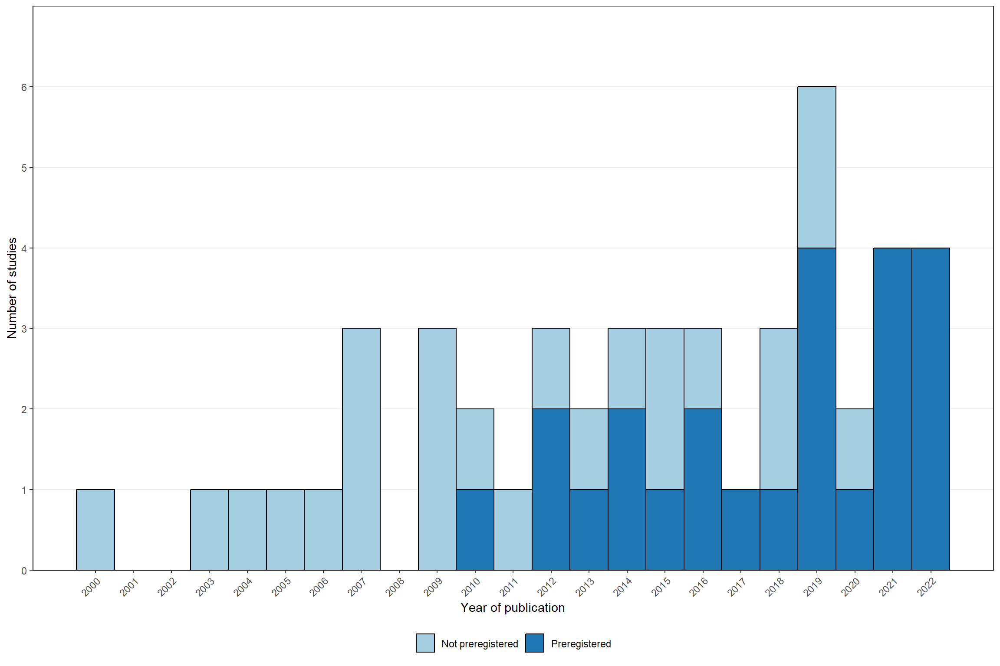{#fig-time-plot fig-pos='H' width=1152}
:::
:::


## Number effects across effect size metrics 


::: {.cell}

````{.cell-code}
```{{r}}
# Number of studies reporting OR
group_based_dat |> 
  summarise(
    n = n(), 
    .by = c(study, effect_size)
  ) |> 
  summarise(
    N_studies = length(effect_size), 
    N_es = sum(n),
    .by = effect_size
  )
```
````

::: {.cell-output .cell-output-stdout}

```
# A tibble: 2 × 3
  effect_size N_studies  N_es
  <chr>           <int> <int>
1 SMD                48   388
2 OR                  1     2
```


:::
:::


## Number of effect size estimates per study

### Overall per study


::: {.cell}

````{.cell-code}
```{{r es-plot}}
#| label: fig-es-hist-per-stud
#| fig-cap: "Distribution of number of effect size estimates per study"
#| fig.width: 6.5
#| fig.height: 7
#| message: false

es_plot_per_study <- 
  gb_dat |>
  arrange(desc(study)) |>
  mutate(study = factor(study, unique(study))) |> 
  ggplot(aes(x = study)) +
  geom_bar(aes(fill = outcome_construct)) +
  scale_y_continuous(breaks = seq(5, 40, by = 5)) + 
  theme_minimal() +
  theme(
    legend.position = "bottom"
  ) +
  coord_flip() +
  labs(
    x = paste0("Study (", n_distinct(gb_dat$study), " studies in total)"), 
    y = "Number of Effect Size Estimates",
    fill = "Outcome construct"
  ) +
  guides(fill = guide_legend(reverse=TRUE))

es_plot_per_study
```
````

::: {.cell-output-display}
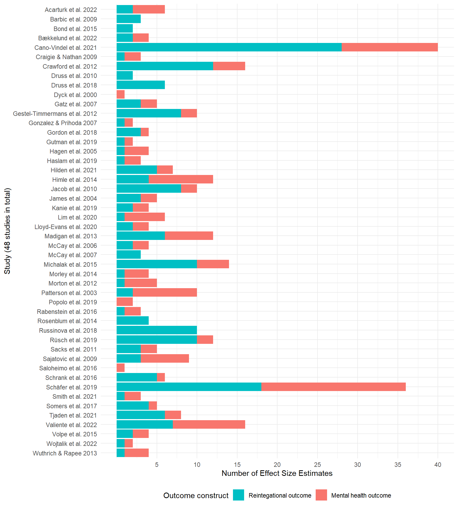{#fig-es-hist-per-stud fig-pos='H' width=624}
:::
:::


### Across outcome subgroups per study

::: {.columns}

::: {.column width="95%"}


::: {.cell}

````{.cell-code}
```{{r es-plot-reint}}
#| label: fig-es-hist-per-stud-reint
#| fig-cap: "Distribution of number of effects per study, by direction of the effects for reintegrational outcomes."
#| fig-width: 12
#| fig-height: 8
#| message: false

reintergation_dat |>
ggplot(aes(y = study, fill = gt_pop >= 0)) + 
geom_bar(data = subset(reintergation_dat, gt_pop >= 0), aes(x = after_stat(count)), stat = "count") + 
geom_bar(data = subset(reintergation_dat, gt_pop < 0), aes(x = -after_stat(count)), stat = "count") + 
theme_minimal() +
scale_x_continuous(labels = abs, breaks = scales::breaks_width(5), limits = c(-10, 30)) +
scale_y_discrete(limits=rev) +
scale_fill_manual(
  values = c(met.brewer("Navajo")[2], met.brewer("Navajo")[4]), 
  labels = c("Negative ES", "Non-negative ES"), 
  name = "Effect Size"
) +
labs(x = "Number of Effect Size Estimates", y = "", title = "Reintegration") +
theme(
    legend.position = "bottom",
    #legend.position.inside = c(0.95, 0.05),
    #legend.justification = c(1, 0),
    legend.background = element_blank(),
    plot.title = element_text(hjust = 0.5) 
  )
```
````

::: {.cell-output-display}
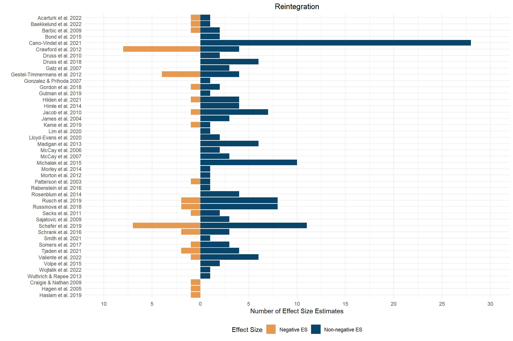{#fig-es-hist-per-stud-reint fig-pos='H' width=1152}
:::
:::


:::

::: {.column-margin}


::: {.cell}

````{.cell-code}
```{{r es-plot-mental}}
#| label: fig-es-hist-per-stud-mental
#| fig-cap: "Distribution of number of effects per study, by direction of the effects for mental health outcomes."
#| fig-height: 8.5
#| message: false

mental_health_dat |>
ggplot(aes(y = study, fill = gt_pop >= 0)) + 
geom_bar(data = subset(mental_health_dat, gt_pop >= 0), aes(x = after_stat(count)), stat = "count") + 
geom_bar(data = subset(mental_health_dat, gt_pop < 0), aes(x = -after_stat(count)), stat = "count") + 
theme_minimal() +
scale_x_continuous(labels = abs, breaks = scales::breaks_width(5), limits = c(-5, 15)) +
scale_y_discrete(limits=rev) +
scale_fill_manual(
  values = c(met.brewer("Navajo")[2], met.brewer("Navajo")[4]), 
  labels = c("Negative ES", "Non-negative ES"), 
  name = "Effect Size"
) +
labs(x = "Number of Effect Size Estimates", y = "", title = "Mental Health") +
theme(
    legend.position = "bottom",
    #legend.position.inside = c(0.95, 0.2),
    #legend.justification = c(1, 0),
    legend.background = element_blank(),
    plot.title = element_text(hjust = 0.5) 
  )
```
````

::: {.cell-output-display}
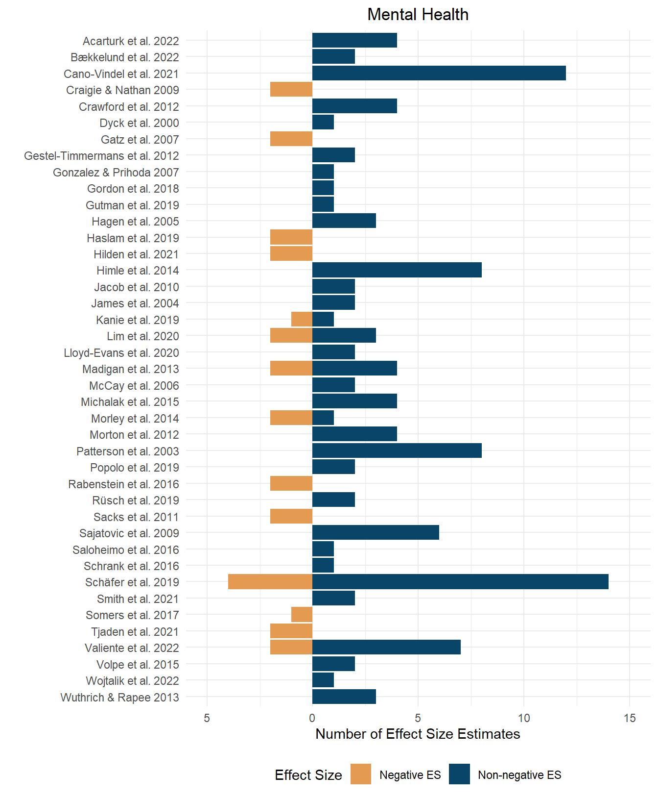{#fig-es-hist-per-stud-mental fig-pos='H' width=672}
:::
:::


:::

:::

### Overall across all studies and outcomes


::: {.cell}

````{.cell-code}
```{{r structure}}
# Multi-arms studies
multi_arm_studies <- 
  gb_dat |> 
  filter(trt_id > 1) |> 
  reframe(study = unique(study))
  

# Multi-time-points studies
follow_up_studies <- 
  gb_dat |>
  summarise(
    time_points = length(unique(time_after_end_intervention_weeks)),
    .by = c(study, trt_id, ctr_id)
  ) |>
  filter(time_points > 1)

# Preregistered studies
prereg_studies <- 
  gb_dat |> 
  summarise(
    prereg_chr = unique(prereg_chr),
    n_es = n(),
    .by = study
  ) |> 
  summarise(
    N_studies = n_distinct(study),
    N_es = sum(n_es),
    .by = prereg_chr
  )

study_sample_sizes <- 
  gb_dat |>
  group_by(study, trt_id, ctr_id) |>
  summarise(
    effects = n(),
    participants = max(N_total)
  ) |>
  summarise(
    effects = sum(effects),
    participants = mean(participants),
    ctl_comparisons = n(),
    ctl_arms = paste(ctr_id, collapse = "; ")
  ) |>
  group_by(study, ctl_arms) |>
  summarise(
    effects = sum(effects),
    participants = mean(participants * (1 + ctl_comparisons * (n() - 1) / 2)),
    trt_comparisons = n(),
    trt_arms = paste(trt_id, collapse = "; "),
    ctl_comparisons = mean(ctl_comparisons)
  ) |>
  summarise(
    effects = sum(effects),
    participants = sum(participants),
    trt_comparisons = mean(trt_comparisons),
    ctl_comparisons = sum(ctl_comparisons)
  )

sample_size_summary <-
  study_sample_sizes |>
  summarise(
    studies = n(),
    studies_multiple_tx = sum(trt_comparisons > 1),
    studies_multiple_ctl = sum(ctl_comparisons > 1),
    n_effects = sum(effects),
    mean_effects = mean(effects),
    min_effects = min(effects),
    median_effects = median(effects),
    max_effects = max(effects),
    participants = round(sum(participants))
  ) |> 
  mutate(prereg = prereg_studies$N_studies[1])

n_studies <- sample_size_summary$studies
```
````
:::

::: {.cell .tbl-cap-location-top}

````{.cell-code}
```{{r structure-table}}
#| tbl-cap-location: top
#| label: tab-es-structure

kable(
  sample_size_summary,
  caption = "Data structure for the all data",
  col.names = c(
    studies = "Studies",
    studies_multiple_tx = "Multi-treatment studies",
    studies_multiple_ctl = "Multi-control studies",
    n_effects = "Effects",
    mean_effects = "Mean",
    min_effects = "Minimum",
    median_effects = "Median",
    max_effects = "Maximum",
    participants = "Participants",
    prereg = "Preregistered studies"
  ),
  digits = 1
) |>
  kable_styling(bootstrap_options = c("striped", "condensed"),
                full_width = FALSE)
```
````

::: {.cell-output-display}

`````{=html}
<table class="table table-striped table-condensed" style="width: auto !important; margin-left: auto; margin-right: auto;">
<caption>Data structure for the all data</caption>
 <thead>
  <tr>
   <th style="text-align:right;"> Studies </th>
   <th style="text-align:right;"> Multi-treatment studies </th>
   <th style="text-align:right;"> Multi-control studies </th>
   <th style="text-align:right;"> Effects </th>
   <th style="text-align:right;"> Mean </th>
   <th style="text-align:right;"> Minimum </th>
   <th style="text-align:right;"> Median </th>
   <th style="text-align:right;"> Maximum </th>
   <th style="text-align:right;"> Participants </th>
   <th style="text-align:right;"> Preregistered studies </th>
  </tr>
 </thead>
<tbody>
  <tr>
   <td style="text-align:right;"> 48 </td>
   <td style="text-align:right;"> 3 </td>
   <td style="text-align:right;"> 0 </td>
   <td style="text-align:right;"> 343 </td>
   <td style="text-align:right;"> 7.1 </td>
   <td style="text-align:right;"> 1 </td>
   <td style="text-align:right;"> 4.5 </td>
   <td style="text-align:right;"> 40 </td>
   <td style="text-align:right;"> 5527 </td>
   <td style="text-align:right;"> 24 </td>
  </tr>
</tbody>
</table>

`````

:::
:::

::: {.cell}

````{.cell-code}
```{{r, sum-es-per-study-plot}}
#| label: fig-es-hist
#| fig-cap: "Distribution of number of effect size estimates per study"
#| fig.width: 9
#| fig.height: 7
#| message: false

gb_dat |> 
  summarise(
    es_count = n(),
    .by = study
  ) |>  
  arrange(es_count) |> 
  ggplot(aes(x = es_count)) +
  geom_histogram(binwidth = 0.5, fill = met.brewer("Navajo")[4]) +
  scale_x_continuous(breaks = seq(0, 40, by = 5)) +
  scale_y_continuous(breaks = seq(0, 10, 2)) +
  theme_minimal() +
  labs(x = "Effect Size Estimates per Study", y = "Number of Studies")
```
````

::: {.cell-output-display}
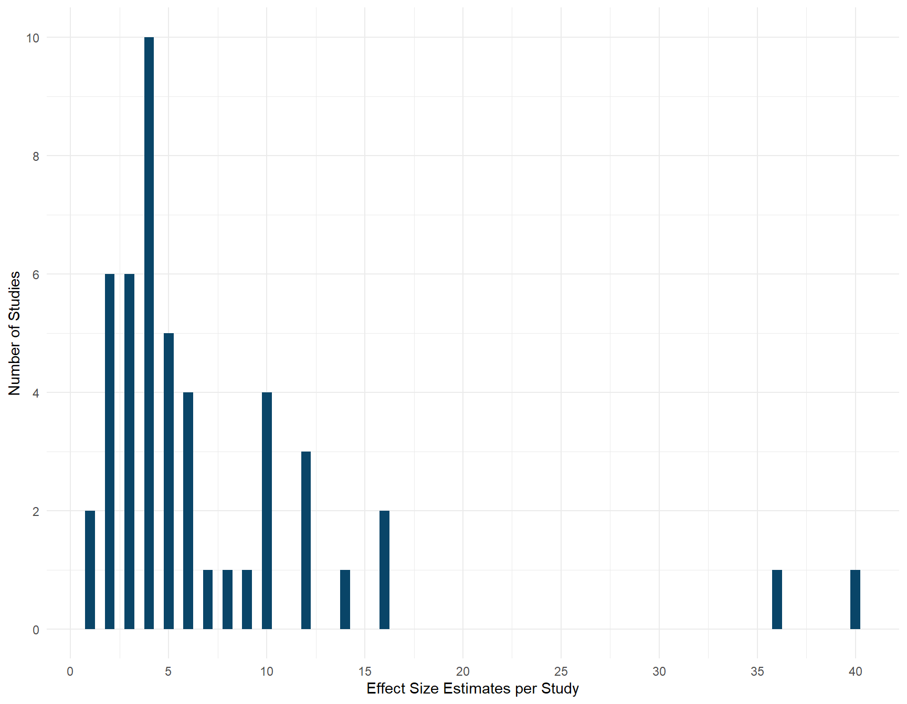{#fig-es-hist fig-pos='H' width=864}
:::
:::


### Across outcome subgroups 

::: {.columns}

::: {.column width="95%"}


::: {.cell}

````{.cell-code}
```{{r structure-reint}}
# Multi-arms studies
multi_arm_studies_reint <- 
  reintergation_dat |> 
  filter(trt_id > 1) |> 
  reframe(study = unique(study))
  

# Multi-time-points studies
follow_up_studies_reint <- 
  reintergation_dat |>
  summarise(
    time_points = length(unique(time_after_end_intervention_weeks)),
    .by = c(study, trt_id, ctr_id)
  ) |>
  filter(time_points > 1)

# Preregistered studies
prereg_studies_reint <- 
  reintergation_dat |> 
  summarise(
    prereg_chr = unique(prereg_chr),
    n_es = n(),
    .by = study
  ) |> 
  summarise(
    N_studies = n_distinct(study),
    N_es = sum(n_es),
    .by = prereg_chr
  )

study_sample_sizes_reint <- 
  reintergation_dat |>
  group_by(study, trt_id, ctr_id) |>
  summarise(
    effects = n(),
    participants = max(N_total)
  ) |>
  summarise(
    effects = sum(effects),
    participants = mean(participants),
    ctl_comparisons = n(),
    ctl_arms = paste(ctr_id, collapse = "; ")
  ) |>
  group_by(study, ctl_arms) |>
  summarise(
    effects = sum(effects),
    participants = mean(participants * (1 + ctl_comparisons * (n() - 1) / 2)),
    trt_comparisons = n(),
    trt_arms = paste(trt_id, collapse = "; "),
    ctl_comparisons = mean(ctl_comparisons)
  ) |>
  summarise(
    effects = sum(effects),
    participants = sum(participants),
    trt_comparisons = mean(trt_comparisons),
    ctl_comparisons = sum(ctl_comparisons)
  )

sample_size_summary_reint <-
  study_sample_sizes_reint |>
  summarise(
    studies = n(),
    studies_multiple_tx = sum(trt_comparisons > 1),
    studies_multiple_ctl = sum(ctl_comparisons > 1),
    n_effects = sum(effects),
    mean_effects = mean(effects),
    min_effects = min(effects),
    median_effects = median(effects),
    max_effects = max(effects),
    participants = round(sum(participants))
  ) |> 
  mutate(prereg = prereg_studies_reint$N_studies[1])

n_studies_reint <- sample_size_summary_reint$studies
```
````
:::

::: {.cell .tbl-cap-location-top}

````{.cell-code}
```{{r structure-table-reint}}
#| tbl-cap-location: top
#| label: tab-es-structure-reint

kable(
  sample_size_summary_reint,
  caption = "Data structure for the reintegrational data",
  col.names = c(
    studies = "Studies",
    studies_multiple_tx = "Multi-treatment studies",
    studies_multiple_ctl = "Multi-control studies",
    n_effects = "Effects",
    mean_effects = "Mean",
    min_effects = "Minimum",
    median_effects = "Median",
    max_effects = "Maximum",
    participants = "Participants",
    prereg = "Preregistered studies"
  ),
  digits = 1
) |>
  kable_styling(bootstrap_options = c("striped", "condensed"),
                full_width = FALSE)
```
````

::: {.cell-output-display}

`````{=html}
<table class="table table-striped table-condensed" style="width: auto !important; margin-left: auto; margin-right: auto;">
<caption>Data structure for the reintegrational data</caption>
 <thead>
  <tr>
   <th style="text-align:right;"> Studies </th>
   <th style="text-align:right;"> Multi-treatment studies </th>
   <th style="text-align:right;"> Multi-control studies </th>
   <th style="text-align:right;"> Effects </th>
   <th style="text-align:right;"> Mean </th>
   <th style="text-align:right;"> Minimum </th>
   <th style="text-align:right;"> Median </th>
   <th style="text-align:right;"> Maximum </th>
   <th style="text-align:right;"> Participants </th>
   <th style="text-align:right;"> Preregistered studies </th>
  </tr>
 </thead>
<tbody>
  <tr>
   <td style="text-align:right;"> 45 </td>
   <td style="text-align:right;"> 3 </td>
   <td style="text-align:right;"> 0 </td>
   <td style="text-align:right;"> 202 </td>
   <td style="text-align:right;"> 4.5 </td>
   <td style="text-align:right;"> 1 </td>
   <td style="text-align:right;"> 3 </td>
   <td style="text-align:right;"> 28 </td>
   <td style="text-align:right;"> 5390 </td>
   <td style="text-align:right;"> 23 </td>
  </tr>
</tbody>
</table>

`````

:::
:::


:::

::: {.column-margin}


::: {.cell}

````{.cell-code}
```{{r structure-mental}}
# Multi-arms studies
multi_arm_studies_mental <- 
  mental_health_dat |> 
  filter(trt_id > 1) |> 
  reframe(study = unique(study))
  

# Multi-time-points studies
follow_up_studies_mental <- 
  mental_health_dat |>
  summarise(
    time_points = length(unique(time_after_end_intervention_weeks)),
    .by = c(study, trt_id, ctr_id)
  ) |>
  filter(time_points > 1)

# Preregistered studies
prereg_studies_mental <- 
  mental_health_dat |> 
  summarise(
    prereg_chr = unique(prereg_chr),
    n_es = n(),
    .by = study
  ) |> 
  summarise(
    N_studies = n_distinct(study),
    N_es = sum(n_es),
    .by = prereg_chr
  )

study_sample_sizes_mental <- 
  mental_health_dat |>
  group_by(study, trt_id, ctr_id) |>
  summarise(
    effects = n(),
    participants = max(N_total)
  ) |>
  summarise(
    effects = sum(effects),
    participants = mean(participants),
    ctl_comparisons = n(),
    ctl_arms = paste(ctr_id, collapse = "; ")
  ) |>
  group_by(study, ctl_arms) |>
  summarise(
    effects = sum(effects),
    participants = mean(participants * (1 + ctl_comparisons * (n() - 1) / 2)),
    trt_comparisons = n(),
    trt_arms = paste(trt_id, collapse = "; "),
    ctl_comparisons = mean(ctl_comparisons)
  ) |>
  summarise(
    effects = sum(effects),
    participants = sum(participants),
    trt_comparisons = mean(trt_comparisons),
    ctl_comparisons = sum(ctl_comparisons)
  )

sample_size_summary_mental <-
  study_sample_sizes_mental |>
  summarise(
    studies = n(),
    studies_multiple_tx = sum(trt_comparisons > 1),
    studies_multiple_ctl = sum(ctl_comparisons > 1),
    n_effects = sum(effects),
    mean_effects = mean(effects),
    min_effects = min(effects),
    median_effects = median(effects),
    max_effects = max(effects),
    participants = round(sum(participants))
  ) |> 
  mutate(prereg = prereg_studies_mental$N_studies[1])

n_studies_mental <- sample_size_summary_mental$studies
```
````
:::

::: {.cell .tbl-cap-location-top}

````{.cell-code}
```{{r structure-table-mental}}
#| tbl-cap-location: top
#| label: tab-es-structure-mental

kable(
  sample_size_summary_mental,
  caption = "Data structure for the mental health data",
  col.names = c(
    studies = "J",
    studies_multiple_tx = "M-t",
    studies_multiple_ctl = "M-c",
    n_effects = "ES",
    mean_effects = "Mean",
    min_effects = "Min",
    median_effects = "Median",
    max_effects = "Max",
    participants = "N",
    prereg = "Prereg"
  ),
  digits = 1
) |>
  kable_styling(bootstrap_options = c("striped", "condensed"),
                full_width = FALSE)
```
````

::: {.cell-output-display}

`````{=html}
<table class="table table-striped table-condensed" style="width: auto !important; margin-left: auto; margin-right: auto;">
<caption>Data structure for the mental health data</caption>
 <thead>
  <tr>
   <th style="text-align:right;"> J </th>
   <th style="text-align:right;"> M-t </th>
   <th style="text-align:right;"> M-c </th>
   <th style="text-align:right;"> ES </th>
   <th style="text-align:right;"> Mean </th>
   <th style="text-align:right;"> Min </th>
   <th style="text-align:right;"> Median </th>
   <th style="text-align:right;"> Max </th>
   <th style="text-align:right;"> N </th>
   <th style="text-align:right;"> Prereg </th>
  </tr>
 </thead>
<tbody>
  <tr>
   <td style="text-align:right;"> 41 </td>
   <td style="text-align:right;"> 3 </td>
   <td style="text-align:right;"> 0 </td>
   <td style="text-align:right;"> 141 </td>
   <td style="text-align:right;"> 3.4 </td>
   <td style="text-align:right;"> 1 </td>
   <td style="text-align:right;"> 2 </td>
   <td style="text-align:right;"> 18 </td>
   <td style="text-align:right;"> 4663 </td>
   <td style="text-align:right;"> 21 </td>
  </tr>
</tbody>
</table>

`````

:::
:::


:::

:::

::: {.columns}

::: {.column width="95%"}


::: {.cell}

````{.cell-code}
```{{r sum-es-plot-reint}}
#| label: fig-es-hist-reint
#| fig-cap: "Distribution of number of effects per study for mental for reintegrational outcomes."
#| fig-width: 9
#| fig-height: 6
#| message: false

reintergation_dat |> 
  summarise(
    es_count = n(),
    .by = study
  ) |>  
  arrange(es_count) |> 
  ggplot(aes(x = es_count)) +
  geom_histogram(binwidth = 0.5, fill = "cornflowerblue") +
  scale_x_continuous(breaks = seq(0, 30, by = 5)) +
  scale_y_continuous(breaks = seq(0, 14, 2), limits = c(0, 14)) +
  theme_minimal() +
  theme(plot.title = element_text(hjust = 0.5)) +
  labs(x = "Effect Size Estimates per Study", y = "Number of Studies", title = "Reintegration") +
  expand_limits(x = 30)
```
````

::: {.cell-output-display}
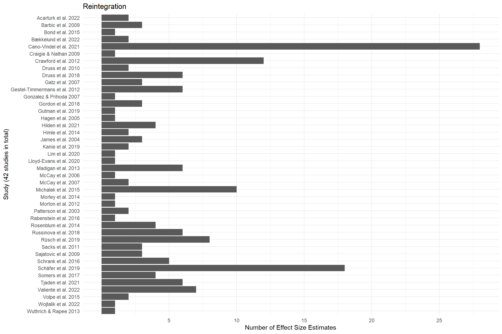{#fig-es-hist-reint fig-pos='H' width=864}
:::
:::


:::

::: {.column-margin}


::: {.cell}

````{.cell-code}
```{{r es-plot-mental}}
#| label: fig-es-hist-mental
#| fig-cap: "Distribution of number of effects per study for mental health outcomes."
#| fig-height: 8
#| message: false

mental_health_dat |> 
  summarise(
    es_count = n(),
    .by = study
  ) |>  
  arrange(es_count) |> 
  ggplot(aes(x = es_count)) +
  geom_histogram(binwidth = 0.5, fill = "gray") +
  scale_x_continuous(breaks = seq(0, 20, by = 5)) +
  scale_y_continuous(breaks = seq(0, 10, 2), limits = c(0, 11)) +
  theme_minimal() +
  theme(plot.title = element_text(hjust = 0.5)) +
  labs(x = "Effect Size Estimates per Study", y = "Number of Studies", title = "Mental Health") +
  expand_limits(x = 20)
```
````

::: {.cell-output-display}
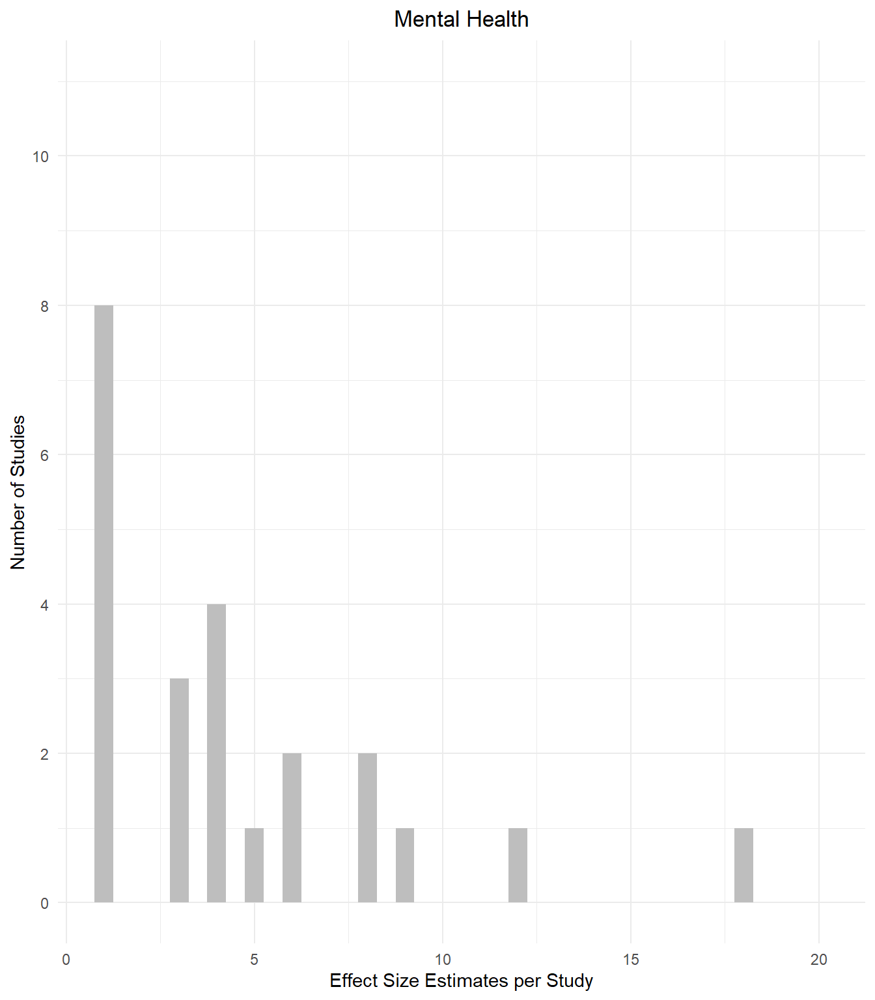{#fig-es-hist-mental fig-pos='H' width=672}
:::
:::


:::

:::

## Data structure by outcome constructs


::: {.cell}

````{.cell-code}
```{{r labeled-cat-hist-ridge-function}}
label_cat_hist_ridge <- function(data, n_es, variable, label_map, level_order) {
  require(dplyr)
  require(rlang)
  require(tidyr)
  require(ggplot2)
  require(forcats)
  
  n_es_exp <- enquo(n_es)
  var_exp <- enquo(variable)
  
  data <- data |> 
    mutate(
      !!var_exp := fct_recode(!!var_exp, !!!label_map),
      !!var_exp := fct_relevel(!!var_exp, !!!level_order),
      !!var_exp := fct_rev(!!var_exp)
    ) 
  
  ggplot(data, aes(
    x = !!n_es_exp,
    y = !!var_exp,
    fill = !!var_exp
  )) +
    geom_density_ridges(
      alpha = 1,
      stat = "binline",
      bins = 30,
      scale = 0.7,
      linewidth = 0.1,
      draw_baseline = FALSE
    ) +
    theme_minimal() +
    labs(y = "", x = "Effect Size Estimates per Study") +
    theme(legend.position = "none")
}
```
````
:::


The following plot shows the effect size estimates distribution within each outcome construct.

::: {.columns}

::: {.column width="95%"}


::: {.cell}

````{.cell-code}
```{{r outcome-construct-ridge-hist}}
#| label: fig-outcome-construct-ridge-hist
#| fig-cap: "Distribution of effect size estimates, by reintegrational outcome constructs."
#| fig.width: 9
#| fig.height: 6.5
#| fig.retina: 2
#| message: false

n_es_by_construct <- 
  gb_dat |> 
  filter(str_detect(outcome_construct, "Re")) |> 
  summarise(effects = n(), .by = c(study, analysis_plan)) |> 
  mutate(J = n(), .by = c(analysis_plan)) |> 
  arrange(desc(J)) 

# Used to construct out_label 
#label_dat <- 
#  n_es_by_construct |> 
#  summarise(J = n(), N_es = sum(effects), .by = analysis_plan)


out_label <- c(
  "Wellbeing and quality of life (J = 24, K = 67)" = "Wellbeing and quality of life",
  "Social functioning (degree of impairment) (J =16, K = 47)" = "Social functioning (degree of impairment)",
  "Hope, empowerment & self-efficacy (J = 12, K = 32)" = "Hope, empowerment & self-efficacy",
  "Alcohol and drug abuse/misuse (J = 7, K = 31)" = "Alcohol and drug abuse/misuse",
  "Self-esteem (J = 5, K = 14)" = "Self-esteem",
  "Loneliness (J = 4, K = 5)" = "Loneliness",
  "Physical health (J = 2, K = 3)" = "Physical health",
  "Psychiatric hospitalization (J = 1, K = 1)" = "Psychiatric hospitalization",
  "Employment (J = 1, K = 2)" = "Employment"
)

out_level <- c(
 "Wellbeing and quality of life (J = 24, K = 67)",
  "Social functioning (degree of impairment) (J =16, K = 47)",
  "Hope, empowerment & self-efficacy (J = 12, K = 32)",
  "Alcohol and drug abuse/misuse (J = 7, K = 31)",
  "Self-esteem (J = 5, K = 14)",
  "Loneliness (J = 4, K = 5)",
  "Physical health (J = 2, K = 3)",
  "Psychiatric hospitalization (J = 1, K = 1)",
  "Employment (J = 1, K = 2)"
)

label_cat_hist_ridge(
  data = n_es_by_construct, 
  n_es = effects, 
  variable = analysis_plan, 
  label_map = out_label, 
  level_order = out_level
) + 
  expand_limits(x = 20) + 
  labs(title = "Reintegrational outcomes") + 
  theme(plot.title = element_text(hjust = 0.5))
```
````

::: {.cell-output-display}
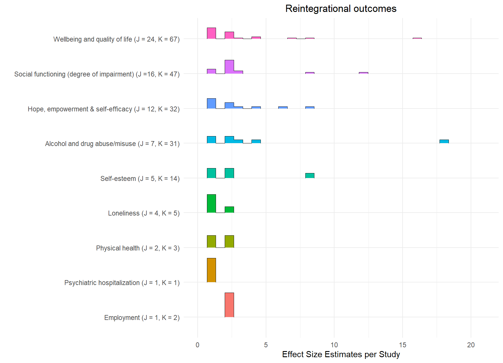{#fig-outcome-construct-ridge-hist fig-pos='H' width=864}
:::
:::


:::

::: {.column-margin}


::: {.cell}

````{.cell-code}
```{{r outcome-construct-ridge-hist-mental}}
#| label: fig-outcome-construct-ridge-hist-mental
#| fig-cap: "Distribution of effect size estimates, by mental health outcome constructs."
#| fig.height: 8.5
#| fig.retina: 2
#| message: false

n_es_by_construct_mental <- 
  gb_dat |> 
  filter(str_detect(outcome_construct, "Men")) |> 
  summarise(effects = n(), .by = c(study, analysis_plan)) |> 
  mutate(J = n(), .by = c(analysis_plan)) |> 
  arrange(desc(J)) 

# Used to construct out_label_mental 
#label_dat_mental <- 
#  n_es_by_construct_mental |> 
#  summarise(J = n(), N_es = sum(effects), .by = analysis_plan)

out_label_mental <- c(
  "General mental health (J = 28, K = 70)" = "General mental health",
  "Depression (J = 19, K = 36)" = "Depression",
  "Anxiety (J = 9, K = 14)" = "Anxiety",
  "Symptoms of psychosis (J = 7, K = 21)" = "Symptoms of psychosis"
)

out_level_mental <- c(
  "General mental health (J = 28, K = 70)",
  "Depression (J = 19, K = 36)",
  "Anxiety (J = 9, K = 14)",
  "Symptoms of psychosis (J = 7, K = 21)"
)

label_cat_hist_ridge(
  data = n_es_by_construct_mental, 
  n_es = effects, 
  variable = analysis_plan, 
  label_map = out_label_mental, 
  level_order = out_level_mental
) + 
  expand_limits(x = 15) + 
  labs(title = "Mental heath outcomes") + 
  theme(plot.title = element_text(hjust = 0.5))
```
````

::: {.cell-output-display}
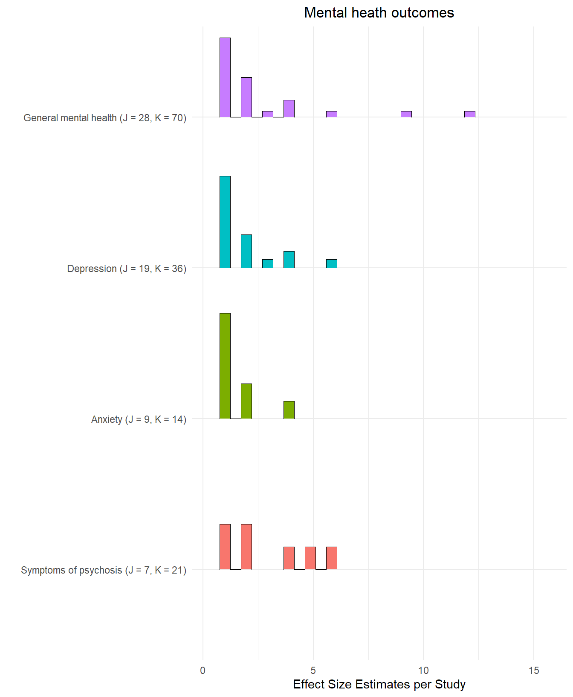{#fig-outcome-construct-ridge-hist-mental fig-pos='H' width=672}
:::
:::


:::

:::

## Primary study sample size


### Total sample sizes

::: {.columns}

::: {.column width="95%"}


::: {.cell .tbl-cap-location-top}

````{.cell-code}
```{{r sample-size-overall-reint}}
#| tbl-cap-location: top
#| label: tab-sample-size

# Used when describing the treatment group sample sizes
N_t_stud_trtid <- 
  reintergation_dat |> 
  reframe(N_treat = max(N_t), .by = c(study, trt_id)) 

N_t_total <- 
  N_t_stud_trtid |> 
  summarise(N_t_total = sum(N_treat), .by = study)

N_c_total <- 
  reintergation_dat |> 
  summarise(N_c_total = max(N_c), .by = study)

N_total_dat <- 
  left_join(N_t_total, N_c_total, by = join_by(study)) |> 
  mutate(N_total = N_t_total + N_c_total)


primary_sample_size_descriptive <- 
  N_total_dat$N_total |> 
  skim() |>
  select(-skim_type, -skim_variable, -n_missing, -complete_rate, -numeric.hist) |>
  rename_at(vars(starts_with("numeric.")), ~ str_remove(., "numeric\\.")) 

primary_sample_size_descriptive |>
  knitr::kable(
    digits = 2,
    caption = "Distribution of primary study sample sizes at post test for reintegrational outcomes",
    booktabs = TRUE
  ) |>
  kable_styling(bootstrap_options = c("striped","condensed"), full_width = FALSE)
```
````

::: {.cell-output-display}

`````{=html}
<table class="table table-striped table-condensed" style="width: auto !important; margin-left: auto; margin-right: auto;">
<caption>Distribution of primary study sample sizes at post test for reintegrational outcomes</caption>
 <thead>
  <tr>
   <th style="text-align:right;"> mean </th>
   <th style="text-align:right;"> sd </th>
   <th style="text-align:right;"> p0 </th>
   <th style="text-align:right;"> p25 </th>
   <th style="text-align:right;"> p50 </th>
   <th style="text-align:right;"> p75 </th>
   <th style="text-align:right;"> p100 </th>
  </tr>
 </thead>
<tbody>
  <tr>
   <td style="text-align:right;"> 119.78 </td>
   <td style="text-align:right;"> 127.69 </td>
   <td style="text-align:right;"> 17 </td>
   <td style="text-align:right;"> 41 </td>
   <td style="text-align:right;"> 61 </td>
   <td style="text-align:right;"> 137 </td>
   <td style="text-align:right;"> 631 </td>
  </tr>
</tbody>
</table>

`````

:::
:::


:::

::: {.column-margin} 


::: {.cell .tbl-cap-location-top}

````{.cell-code}
```{{r sample-size-overall-mental}}
#| tbl-cap-location: top
#| label: tab-sample-size-mental

# Used when describing the treatment group sample sizes
N_t_stud_trtid_mental <- 
  mental_health_dat |> 
  reframe(N_treat = max(N_t), .by = c(study, trt_id)) 

N_t_total_mental <- 
  N_t_stud_trtid_mental |> 
  summarise(N_t_total = sum(N_treat), .by = study)

N_c_total_mental <- 
  mental_health_dat |> 
  summarise(N_c_total = max(N_c), .by = study)

N_total_dat_mental <- 
  left_join(N_t_total_mental, N_c_total_mental, by = join_by(study)) |> 
  mutate(N_total = N_t_total + N_c_total)


primary_sample_size_descriptive_mental <- 
  N_total_dat_mental$N_total |> 
  skim() |>
  select(-skim_type, -skim_variable, -n_missing, -complete_rate, -numeric.hist) |>
  rename_at(vars(starts_with("numeric.")), ~ str_remove(., "numeric\\.")) 

primary_sample_size_descriptive_mental |>
  knitr::kable(
    digits = 2,
    caption = "Distribution of primary study sample sizes at post test for mental health outcomes",
    booktabs = TRUE
  ) |>
  kable_styling(bootstrap_options = c("striped","condensed"), full_width = FALSE)
```
````

::: {.cell-output-display}

`````{=html}
<table class="table table-striped table-condensed" style="width: auto !important; margin-left: auto; margin-right: auto;">
<caption>Distribution of primary study sample sizes at post test for mental health outcomes</caption>
 <thead>
  <tr>
   <th style="text-align:right;"> mean </th>
   <th style="text-align:right;"> sd </th>
   <th style="text-align:right;"> p0 </th>
   <th style="text-align:right;"> p25 </th>
   <th style="text-align:right;"> p50 </th>
   <th style="text-align:right;"> p75 </th>
   <th style="text-align:right;"> p100 </th>
  </tr>
 </thead>
<tbody>
  <tr>
   <td style="text-align:right;"> 113.73 </td>
   <td style="text-align:right;"> 125.6 </td>
   <td style="text-align:right;"> 17 </td>
   <td style="text-align:right;"> 40 </td>
   <td style="text-align:right;"> 61 </td>
   <td style="text-align:right;"> 128 </td>
   <td style="text-align:right;"> 631 </td>
  </tr>
</tbody>
</table>

`````

:::
:::


:::

:::

The following plot displays the distribution of study sample sizes at post-test.

::: {.columns}

::: {.column width="95%"}


::: {.cell}

````{.cell-code}
```{{r sample-size-plot-reint}}
#| label: fig-sample-size-reint
#| fig-cap: "Distribution of primary study sample sizes at post test for reintegrational outcomes."
#| fig.height: 2.5
#| fig.width: 8
#| fig.retina: 2
#| message: false
study_sizes_plot_reint <- 
  ggplot(N_total_dat, aes(N_total)) + 
  geom_density(fill = "cornflowerblue", alpha = 0.8) + 
  geom_blank(aes(x = 0, y = 0)) + 
  geom_rug(alpha = 0.8) +
  scale_y_continuous(NULL, breaks = NULL) + 
  theme_minimal() + 
  labs(x = "Total Sample Size", y = "")
study_sizes_plot_reint
```
````

::: {.cell-output-display}
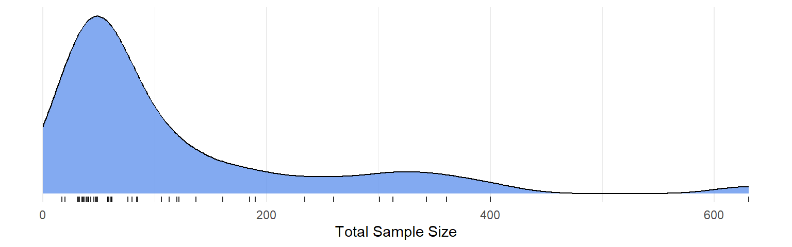{#fig-sample-size-reint fig-pos='H' width=768}
:::
:::


:::

::: {.column-margin}


::: {.cell}

````{.cell-code}
```{{r sample-size-plot-mental}}
#| label: fig-sample-size-mental
#| fig-cap: "Distribution of primary study sample sizes at post test for mental health outcomes."
#| fig.height: 4
#| fig.retina: 2
#| message: false
study_sizes_plot_mental <- 
  ggplot(N_total_dat_mental, aes(N_total)) + 
  geom_density(fill = "gray", alpha = 0.8) + 
  geom_blank(aes(x = 0, y = 0)) + 
  geom_rug(alpha = 0.8) +
  scale_y_continuous(NULL, breaks = NULL) + 
  theme_minimal() + 
  labs(x = "Total Sample Size", y = "")
study_sizes_plot_mental
```
````

::: {.cell-output-display}
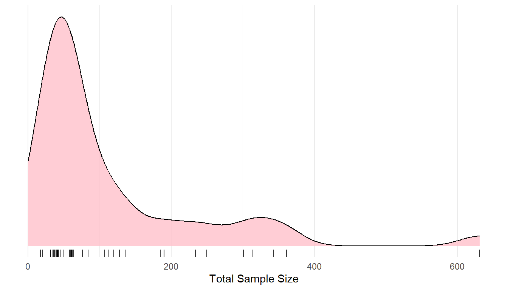{#fig-sample-size-mental fig-pos='H' width=672}
:::
:::


:::

:::

### Treatment group

::: {.columns}

::: {.column width="95%"}


::: {.cell .tbl-cap-location-top}

````{.cell-code}
```{{r sample-size-treatment-reint}}
#| tbl-cap-location: top
#| label: tab-sample-size-treatment

treatment_sample_size_descriptive <- 
  N_t_stud_trtid$N_treat |> 
  skim() |>
  select(-skim_type, -skim_variable, -n_missing, -complete_rate, -numeric.hist) |>
  rename_at(vars(starts_with("numeric.")), ~ str_remove(., "numeric\\.")) 

treatment_sample_size_descriptive |>
  knitr::kable(
    digits = 2,
    caption = "Distribution of treatment sample sizes at post test for reintegrational outcomes",
    booktabs = TRUE
  ) |>
  kable_styling(bootstrap_options = c("striped","condensed"), full_width = FALSE)
```
````

::: {.cell-output-display}

`````{=html}
<table class="table table-striped table-condensed" style="width: auto !important; margin-left: auto; margin-right: auto;">
<caption>Distribution of treatment sample sizes at post test for reintegrational outcomes</caption>
 <thead>
  <tr>
   <th style="text-align:right;"> mean </th>
   <th style="text-align:right;"> sd </th>
   <th style="text-align:right;"> p0 </th>
   <th style="text-align:right;"> p25 </th>
   <th style="text-align:right;"> p50 </th>
   <th style="text-align:right;"> p75 </th>
   <th style="text-align:right;"> p100 </th>
  </tr>
 </thead>
<tbody>
  <tr>
   <td style="text-align:right;"> 60.88 </td>
   <td style="text-align:right;"> 60.32 </td>
   <td style="text-align:right;"> 8 </td>
   <td style="text-align:right;"> 22.75 </td>
   <td style="text-align:right;"> 33.5 </td>
   <td style="text-align:right;"> 90.25 </td>
   <td style="text-align:right;"> 315 </td>
  </tr>
</tbody>
</table>

`````

:::
:::


:::

::: {.column-margin} 


::: {.cell .tbl-cap-location-top}

````{.cell-code}
```{{r sample-size-treatment-mental}}
#| tbl-cap-location: top
#| label: tab-sample-size-treatment-mental

treatment_sample_size_descriptive_mental <- 
  N_t_stud_trtid_mental$N_treat |> 
  skim() |>
  select(-skim_type, -skim_variable, -n_missing, -complete_rate, -numeric.hist) |>
  rename_at(vars(starts_with("numeric.")), ~ str_remove(., "numeric\\.")) 

treatment_sample_size_descriptive_mental |>
  knitr::kable(
    digits = 2,
    caption = "Distribution of treatment sample sizes at post test for mental health outcomes",
    booktabs = TRUE
  ) |>
  kable_styling(bootstrap_options = c("striped","condensed"), full_width = FALSE)
```
````

::: {.cell-output-display}

`````{=html}
<table class="table table-striped table-condensed" style="width: auto !important; margin-left: auto; margin-right: auto;">
<caption>Distribution of treatment sample sizes at post test for mental health outcomes</caption>
 <thead>
  <tr>
   <th style="text-align:right;"> mean </th>
   <th style="text-align:right;"> sd </th>
   <th style="text-align:right;"> p0 </th>
   <th style="text-align:right;"> p25 </th>
   <th style="text-align:right;"> p50 </th>
   <th style="text-align:right;"> p75 </th>
   <th style="text-align:right;"> p100 </th>
  </tr>
 </thead>
<tbody>
  <tr>
   <td style="text-align:right;"> 57.8 </td>
   <td style="text-align:right;"> 59.09 </td>
   <td style="text-align:right;"> 8 </td>
   <td style="text-align:right;"> 21 </td>
   <td style="text-align:right;"> 30 </td>
   <td style="text-align:right;"> 75 </td>
   <td style="text-align:right;"> 315 </td>
  </tr>
</tbody>
</table>

`````

:::
:::


:::

:::

The following plot displays the distribution of treatment sample sizes at post-test.

::: {.columns}

::: {.column width="95%"}


::: {.cell}

````{.cell-code}
```{{r sample-size-treatment-plot-reint}}
#| label: fig-sample-size-treatment-reint
#| fig-cap: "Distribution of treatment sample sizes at post test for reintegrational outcomes."
#| fig.height: 2.5
#| fig.width: 8
#| fig.retina: 2
#| message: false
treatment_sizes_plot_reint <- 
  ggplot(N_t_stud_trtid, aes(N_treat)) + 
  geom_density(fill = "cornflowerblue", alpha = 0.8) + 
  geom_blank(aes(x = 0, y = 0)) + 
  geom_rug(alpha = 0.8) +
  scale_y_continuous(NULL, breaks = NULL) + 
  theme_minimal() + 
  labs(x = "Total Treatment Sample Size", y = "")
treatment_sizes_plot_reint
```
````

::: {.cell-output-display}
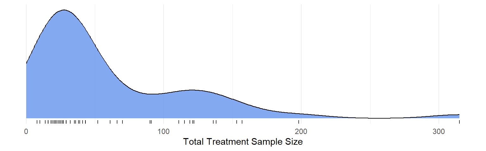{#fig-sample-size-treatment-reint fig-pos='H' width=768}
:::
:::


:::

::: {.column-margin}


::: {.cell}

````{.cell-code}
```{{r sample-size-treatment-plot-mental}}
#| label: fig-sample-size-treatment-mental
#| fig-cap: "Distribution of treatment sample sizes at post test for mental health outcomes."
#| fig.height: 4
#| fig.retina: 2
#| message: false
treatment_sizes_plot_mental <- 
  ggplot(N_t_stud_trtid_mental, aes(N_treat)) + 
  geom_density(fill = "gray", alpha = 0.8) + 
  geom_blank(aes(x = 0, y = 0)) + 
  geom_rug(alpha = 0.8) +
  scale_y_continuous(NULL, breaks = NULL) + 
  theme_minimal() + 
  labs(x = "Total Treatment Sample Size", y = "")
treatment_sizes_plot_mental
```
````

::: {.cell-output-display}
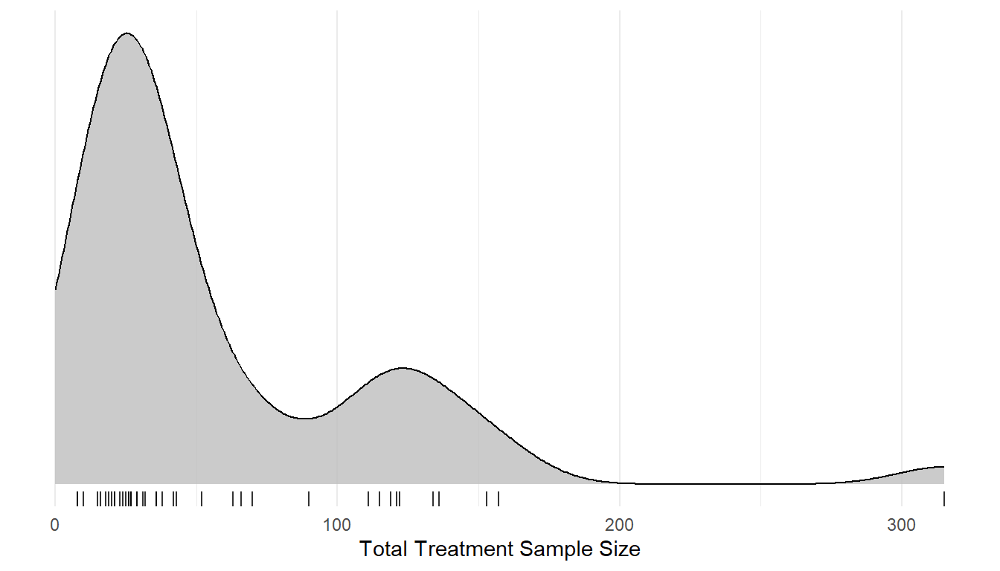{#fig-sample-size-treatment-mental fig-pos='H' width=672}
:::
:::


:::

:::

### Control group

::: {.columns}

::: {.column width="95%"}


::: {.cell .tbl-cap-location-top}

````{.cell-code}
```{{r sample-size-control-reint}}
#| tbl-cap-location: top
#| label: tab-sample-size-control

control_sample_size_descriptive <- 
  N_total_dat$N_c_total |> 
  skim() |>
  select(-skim_type, -skim_variable, -n_missing, -complete_rate, -numeric.hist) |>
  rename_at(vars(starts_with("numeric.")), ~ str_remove(., "numeric\\.")) 

control_sample_size_descriptive |>
  knitr::kable(
    digits = 2,
    caption = "Distribution of control group sample sizes at post test for reintegrational outcomes",
    booktabs = TRUE
  ) |>
  kable_styling(bootstrap_options = c("striped","condensed"), full_width = FALSE)
```
````

::: {.cell-output-display}

`````{=html}
<table class="table table-striped table-condensed" style="width: auto !important; margin-left: auto; margin-right: auto;">
<caption>Distribution of control group sample sizes at post test for reintegrational outcomes</caption>
 <thead>
  <tr>
   <th style="text-align:right;"> mean </th>
   <th style="text-align:right;"> sd </th>
   <th style="text-align:right;"> p0 </th>
   <th style="text-align:right;"> p25 </th>
   <th style="text-align:right;"> p50 </th>
   <th style="text-align:right;"> p75 </th>
   <th style="text-align:right;"> p100 </th>
  </tr>
 </thead>
<tbody>
  <tr>
   <td style="text-align:right;"> 54.84 </td>
   <td style="text-align:right;"> 60.5 </td>
   <td style="text-align:right;"> 9 </td>
   <td style="text-align:right;"> 19 </td>
   <td style="text-align:right;"> 30 </td>
   <td style="text-align:right;"> 63 </td>
   <td style="text-align:right;"> 316 </td>
  </tr>
</tbody>
</table>

`````

:::
:::


:::

::: {.column-margin} 


::: {.cell .tbl-cap-location-top}

````{.cell-code}
```{{r sample-size-control-mental}}
#| tbl-cap-location: top
#| label: tab-sample-size-control-mental

control_sample_size_descriptive_mental <- 
  N_total_dat_mental$N_c_total |> 
  skim() |>
  select(-skim_type, -skim_variable, -n_missing, -complete_rate, -numeric.hist) |>
  rename_at(vars(starts_with("numeric.")), ~ str_remove(., "numeric\\.")) 

control_sample_size_descriptive_mental |>
  knitr::kable(
    digits = 2,
    caption = "Distribution of control group sample sizes at post test for mental health outcomes",
    booktabs = TRUE
  ) |>
  kable_styling(bootstrap_options = c("striped","condensed"), full_width = FALSE)
```
````

::: {.cell-output-display}

`````{=html}
<table class="table table-striped table-condensed" style="width: auto !important; margin-left: auto; margin-right: auto;">
<caption>Distribution of control group sample sizes at post test for mental health outcomes</caption>
 <thead>
  <tr>
   <th style="text-align:right;"> mean </th>
   <th style="text-align:right;"> sd </th>
   <th style="text-align:right;"> p0 </th>
   <th style="text-align:right;"> p25 </th>
   <th style="text-align:right;"> p50 </th>
   <th style="text-align:right;"> p75 </th>
   <th style="text-align:right;"> p100 </th>
  </tr>
 </thead>
<tbody>
  <tr>
   <td style="text-align:right;"> 51.71 </td>
   <td style="text-align:right;"> 58.61 </td>
   <td style="text-align:right;"> 9 </td>
   <td style="text-align:right;"> 20 </td>
   <td style="text-align:right;"> 29 </td>
   <td style="text-align:right;"> 63 </td>
   <td style="text-align:right;"> 316 </td>
  </tr>
</tbody>
</table>

`````

:::
:::


:::

:::

The following plot displays the distribution of control sample sizes at post-test.

::: {.columns}

::: {.column width="95%"}


::: {.cell}

````{.cell-code}
```{{r sample-size-control-plot-reint}}
#| label: fig-sample-size-control-reint
#| fig-cap: "Distribution of control group sample sizes at post test for reintegrational outcomes."
#| fig.height: 2.5
#| fig.width: 8
#| fig.retina: 2
#| message: false
control_sizes_plot_reint <- 
  ggplot(N_total_dat, aes(N_c_total)) + 
  geom_density(fill = "cornflowerblue", alpha = 0.8) + 
  geom_blank(aes(x = 0, y = 0)) + 
  geom_rug(alpha = 0.8) +
  scale_y_continuous(NULL, breaks = NULL) + 
  theme_minimal() + 
  labs(x = "Total Control Group Sample Size", y = "")
control_sizes_plot_reint
```
````

::: {.cell-output-display}
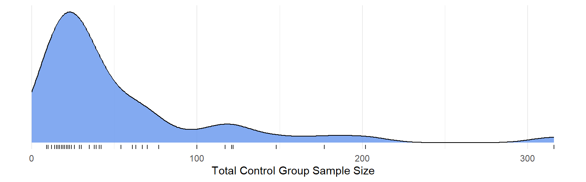{#fig-sample-size-control-reint fig-pos='H' width=768}
:::
:::


:::

::: {.column-margin}


::: {.cell}

````{.cell-code}
```{{r sample-size-control-plot-mental}}
#| label: fig-sample-size-control-mental
#| fig-cap: "Distribution of control group sample sizes at post test for mental health outcomes."
#| fig.height: 4
#| fig.retina: 2
#| message: false
control_sizes_plot_mental <- 
  ggplot(N_total_dat_mental, aes(N_c_total)) + 
  geom_density(fill = "gray", alpha = 0.8) + 
  geom_blank(aes(x = 0, y = 0)) + 
  geom_rug(alpha = 0.8) +
  scale_y_continuous(NULL, breaks = NULL) + 
  theme_minimal() + 
  labs(x = "Total Control Group Sample Size", y = "")
control_sizes_plot_mental
```
````

::: {.cell-output-display}
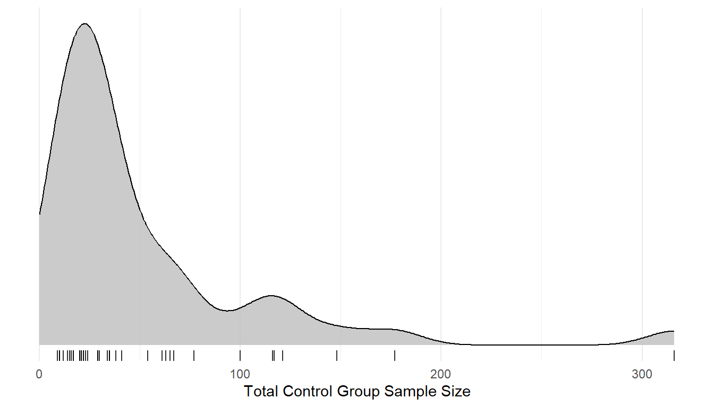{#fig-sample-size-control-mental fig-pos='H' width=672}
:::
:::


:::

:::

## Study sample sizes versus number of effect size estimates per study


::: {.cell}

````{.cell-code}
```{{r bivariate-es-plot}}
#| label: fig-es-distribution-bivariate
#| fig-cap: "Study sample sizes versus number of effect size estimates for reintegrational outcomes"
#| fig.width: 6
#| fig.height: 4
#| fig.retina: 2
#| message: false

plot <- 
  reintergation_dat |> 
  summarise(effects = n(), .by = study) |> 
  left_join(N_total_dat, by = join_by(study)) |> 
  relocate(effects, .after = N_total) |> 
  ggplot(aes(x = N_total, y = effects)) +
  geom_point(alpha = 0.5) +
  scale_x_continuous(breaks = seq(0, 650, by = 50)) +
  guides(size = "none") + 
  theme_minimal() +
  theme(
    legend.position = "inside",
    legend.position.inside = c(0.9, 0.05),
    legend.justification = c(1, 0),
    legend.background = element_blank()
  ) +
  labs(x = "Total sample size", y = "Number of effect size estimates per study", color = "") +
  expand_limits(y = 30)

ggMarginal(plot, type = "density")
```
````

::: {.cell-output-display}
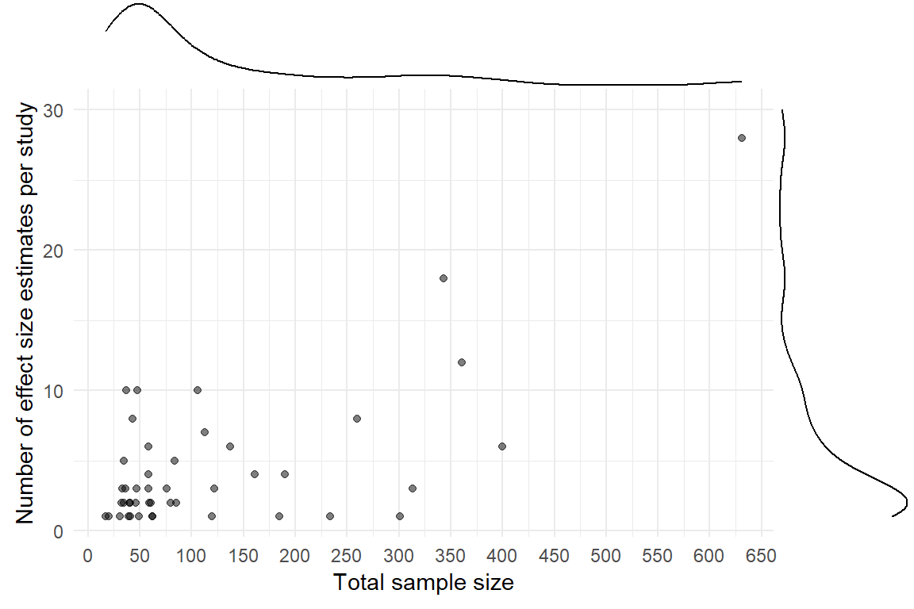{#fig-es-distribution-bivariate fig-pos='H' width=576}
:::
:::


# Moderators


::: {.cell}

````{.cell-code}
```{{r cross-tab-function}}
cat_dat_cross <- function(variable, study_id, data) {
  
  require(dplyr)
  require(rlang)
  require(tidyr)
  
  var_exp <- enquo(variable)
  study_id_exp <- enquo(study_id)
  study_id_name <- as_name(study_id_exp)
  
  
    res_dat <- data %>%
      group_by(!!study_id_exp) %>%
      reframe(var_exp_mirror = unique(!!var_exp))  %>%
      full_join(data,
                by = c(study_id_name),
                relationship = "many-to-many") %>%
      group_by(!!var_exp, var_exp_mirror) %>%
      reframe(
        m = n_distinct(!!study_id_exp),
        k = n()
      ) %>%
      mutate(size = paste0(m, " (", k, ")")) %>%
      select(-m, -k) |>
      pivot_wider(names_from = var_exp_mirror, values_from = "size")
  
  names(res_dat)[1] <- "level" 
  #res_dat <- res_dat[c("level", levels(res_dat$level)[res_dat$level])]

  return(res_dat)
}
```
````
:::


## Categorical moderators

### Substantial 

#### Outcome measure


::: {.cell}

````{.cell-code}
```{{r outcome-dependency-table-reint}}
outcome_dat_cross <- cat_dat_cross(
  data = reintergation_dat,
  variable = analysis_plan,
  study_id = study
)

#| tbl-cap-location: top
#| label: tab-outcome

outcome_dat_cross |>
  knitr::kable(
    "html",
    col.names = c(
      "Outcome",
      colnames(outcome_dat_cross)[-1]
    ),
    caption = "Dependency table for preregistration status (reintegration)"
  ) |>
  kableExtra::column_spec(1, bold = TRUE) |>
  kableExtra::footnote(
    "Values outside the parentheses are number of studies, with the number of samples and effect size estimates shown in the parentheses.",
    footnote_as_chunk = T
  ) |>
  kableExtra::kable_styling(bootstrap_options = c("striped", "condensed"), full_width = T)
```
````

::: {.cell-output-display}

`````{=html}
<table style="NAborder-bottom: 0; margin-left: auto; margin-right: auto;" class="table table-striped table-condensed">
<caption>Dependency table for preregistration status (reintegration)</caption>
 <thead>
  <tr>
   <th style="text-align:left;"> Outcome </th>
   <th style="text-align:left;"> Alcohol and drug abuse/misuse </th>
   <th style="text-align:left;"> Hope, empowerment &amp; self-efficacy </th>
   <th style="text-align:left;"> Physical health </th>
   <th style="text-align:left;"> Social functioning (degree of impairment) </th>
   <th style="text-align:left;"> Wellbeing and quality of life </th>
   <th style="text-align:left;"> Employment </th>
   <th style="text-align:left;"> Self-esteem </th>
   <th style="text-align:left;"> Loneliness </th>
   <th style="text-align:left;"> Psychiatric hospitalization </th>
  </tr>
 </thead>
<tbody>
  <tr>
   <td style="text-align:left;font-weight: bold;"> Alcohol and drug abuse/misuse </td>
   <td style="text-align:left;"> 7 (31) </td>
   <td style="text-align:left;"> 1 (2) </td>
   <td style="text-align:left;"> 1 (1) </td>
   <td style="text-align:left;"> 3 (4) </td>
   <td style="text-align:left;"> 2 (3) </td>
   <td style="text-align:left;"> - </td>
   <td style="text-align:left;"> - </td>
   <td style="text-align:left;"> - </td>
   <td style="text-align:left;"> - </td>
  </tr>
  <tr>
   <td style="text-align:left;font-weight: bold;"> Employment </td>
   <td style="text-align:left;"> - </td>
   <td style="text-align:left;"> 1 (2) </td>
   <td style="text-align:left;"> - </td>
   <td style="text-align:left;"> - </td>
   <td style="text-align:left;"> - </td>
   <td style="text-align:left;"> 1 (2) </td>
   <td style="text-align:left;"> 1 (2) </td>
   <td style="text-align:left;"> - </td>
   <td style="text-align:left;"> - </td>
  </tr>
  <tr>
   <td style="text-align:left;font-weight: bold;"> Hope, empowerment &amp; self-efficacy </td>
   <td style="text-align:left;"> 1 (1) </td>
   <td style="text-align:left;"> 12 (32) </td>
   <td style="text-align:left;"> - </td>
   <td style="text-align:left;"> 1 (2) </td>
   <td style="text-align:left;"> 6 (14) </td>
   <td style="text-align:left;"> 1 (6) </td>
   <td style="text-align:left;"> 3 (15) </td>
   <td style="text-align:left;"> 1 (4) </td>
   <td style="text-align:left;"> 1 (1) </td>
  </tr>
  <tr>
   <td style="text-align:left;font-weight: bold;"> Loneliness </td>
   <td style="text-align:left;"> - </td>
   <td style="text-align:left;"> 1 (2) </td>
   <td style="text-align:left;"> - </td>
   <td style="text-align:left;"> - </td>
   <td style="text-align:left;"> 2 (3) </td>
   <td style="text-align:left;"> - </td>
   <td style="text-align:left;"> - </td>
   <td style="text-align:left;"> 4 (5) </td>
   <td style="text-align:left;"> - </td>
  </tr>
  <tr>
   <td style="text-align:left;font-weight: bold;"> Physical health </td>
   <td style="text-align:left;"> 1 (1) </td>
   <td style="text-align:left;"> - </td>
   <td style="text-align:left;"> 2 (3) </td>
   <td style="text-align:left;"> 2 (3) </td>
   <td style="text-align:left;"> - </td>
   <td style="text-align:left;"> - </td>
   <td style="text-align:left;"> - </td>
   <td style="text-align:left;"> - </td>
   <td style="text-align:left;"> - </td>
  </tr>
  <tr>
   <td style="text-align:left;font-weight: bold;"> Psychiatric hospitalization </td>
   <td style="text-align:left;"> - </td>
   <td style="text-align:left;"> 1 (1) </td>
   <td style="text-align:left;"> - </td>
   <td style="text-align:left;"> - </td>
   <td style="text-align:left;"> - </td>
   <td style="text-align:left;"> - </td>
   <td style="text-align:left;"> - </td>
   <td style="text-align:left;"> - </td>
   <td style="text-align:left;"> 1 (1) </td>
  </tr>
  <tr>
   <td style="text-align:left;font-weight: bold;"> Self-esteem </td>
   <td style="text-align:left;"> - </td>
   <td style="text-align:left;"> 3 (5) </td>
   <td style="text-align:left;"> - </td>
   <td style="text-align:left;"> - </td>
   <td style="text-align:left;"> 2 (2) </td>
   <td style="text-align:left;"> 1 (2) </td>
   <td style="text-align:left;"> 5 (14) </td>
   <td style="text-align:left;"> - </td>
   <td style="text-align:left;"> - </td>
  </tr>
  <tr>
   <td style="text-align:left;font-weight: bold;"> Social functioning (degree of impairment) </td>
   <td style="text-align:left;"> 3 (7) </td>
   <td style="text-align:left;"> 1 (2) </td>
   <td style="text-align:left;"> 2 (5) </td>
   <td style="text-align:left;"> 16 (47) </td>
   <td style="text-align:left;"> 7 (30) </td>
   <td style="text-align:left;"> - </td>
   <td style="text-align:left;"> - </td>
   <td style="text-align:left;"> - </td>
   <td style="text-align:left;"> - </td>
  </tr>
  <tr>
   <td style="text-align:left;font-weight: bold;"> Wellbeing and quality of life </td>
   <td style="text-align:left;"> 2 (3) </td>
   <td style="text-align:left;"> 6 (12) </td>
   <td style="text-align:left;"> - </td>
   <td style="text-align:left;"> 7 (34) </td>
   <td style="text-align:left;"> 24 (67) </td>
   <td style="text-align:left;"> - </td>
   <td style="text-align:left;"> 2 (2) </td>
   <td style="text-align:left;"> 2 (3) </td>
   <td style="text-align:left;"> - </td>
  </tr>
</tbody>
<tfoot><tr><td style="padding: 0; " colspan="100%">
<span style="font-style: italic;">Note: </span> <sup></sup> Values outside the parentheses are number of studies, with the number of samples and effect size estimates shown in the parentheses.</td></tr></tfoot>
</table>

`````

:::
:::

::: {.cell}

````{.cell-code}
```{{r outcome-subgroup-dependency-table-reint}}
outcome_subgroup_dat_cross <- cat_dat_cross(
  data = filter(reintergation_dat, str_detect(analysis_plan, "Alco|Hope|Social|Well")),
  variable = analysis_plan,
  study_id = study
)

#| tbl-cap-location: top
#| label: tab-outcome-subgroup

outcome_subgroup_dat_cross |>
  knitr::kable(
    "html",
    col.names = c(
      "Outcome",
      colnames(outcome_subgroup_dat_cross)[-1]
    ),
    caption = "Dependency table for outcome used for subgroup analysis (reintegration)"
  ) |>
  kableExtra::column_spec(1, bold = TRUE) |>
  kableExtra::footnote(
    general = "Values outside the parentheses are number of studies, with the number of samples and effect size estimates shown in the parentheses.", 
    general_title = "Note: ",
    footnote_as_chunk = T
  ) |>
  kableExtra::kable_styling(bootstrap_options = c("striped", "condensed"), full_width = T)
```
````

::: {.cell-output-display}

`````{=html}
<table style="NAborder-bottom: 0; margin-left: auto; margin-right: auto;" class="table table-striped table-condensed">
<caption>Dependency table for outcome used for subgroup analysis (reintegration)</caption>
 <thead>
  <tr>
   <th style="text-align:left;"> Outcome </th>
   <th style="text-align:left;"> Alcohol and drug abuse/misuse </th>
   <th style="text-align:left;"> Hope, empowerment &amp; self-efficacy </th>
   <th style="text-align:left;"> Social functioning (degree of impairment) </th>
   <th style="text-align:left;"> Wellbeing and quality of life </th>
  </tr>
 </thead>
<tbody>
  <tr>
   <td style="text-align:left;font-weight: bold;"> Alcohol and drug abuse/misuse </td>
   <td style="text-align:left;"> 7 (31) </td>
   <td style="text-align:left;"> 1 (2) </td>
   <td style="text-align:left;"> 3 (4) </td>
   <td style="text-align:left;"> 2 (3) </td>
  </tr>
  <tr>
   <td style="text-align:left;font-weight: bold;"> Hope, empowerment &amp; self-efficacy </td>
   <td style="text-align:left;"> 1 (1) </td>
   <td style="text-align:left;"> 12 (32) </td>
   <td style="text-align:left;"> 1 (2) </td>
   <td style="text-align:left;"> 6 (14) </td>
  </tr>
  <tr>
   <td style="text-align:left;font-weight: bold;"> Social functioning (degree of impairment) </td>
   <td style="text-align:left;"> 3 (7) </td>
   <td style="text-align:left;"> 1 (2) </td>
   <td style="text-align:left;"> 16 (47) </td>
   <td style="text-align:left;"> 7 (30) </td>
  </tr>
  <tr>
   <td style="text-align:left;font-weight: bold;"> Wellbeing and quality of life </td>
   <td style="text-align:left;"> 2 (3) </td>
   <td style="text-align:left;"> 6 (12) </td>
   <td style="text-align:left;"> 7 (34) </td>
   <td style="text-align:left;"> 24 (67) </td>
  </tr>
</tbody>
<tfoot><tr><td style="padding: 0; " colspan="100%">
<span style="font-style: italic;">Note: </span> <sup></sup> Values outside the parentheses are number of studies, with the number of samples and effect size estimates shown in the parentheses.</td></tr></tfoot>
</table>

`````

:::
:::


##### Ridge plot of effect size estimates


::: {.cell}

````{.cell-code}
```{{r cat-ridge-function}}
cat_ridge <- function(data, es, v, variable) {
  require(dplyr)
  require(rlang)
  require(tidyr)
  require(ggplot2)
  
  es_exp <- enquo(es)
  var_exp <- enquo(variable)
  v_exp <- enquo(v)
  
  data |> 
    mutate(!!var_exp := fct_rev(!!var_exp)) |> 
  ggplot(aes(
    x = !!es_exp,
    y = !!var_exp,
    fill = !!var_exp
  )) +
    geom_density_ridges(
      aes(
        point_colour = !!var_exp,
        point_size = 1 / !!v_exp
      ),
      alpha = .2,
      point_alpha = 0.5,
      jittered_points = TRUE
    ) +
    theme_minimal() +
    labs(y = "", x = "Standardized Mean Difference (Hedges' g)") +
    theme(legend.position = "none")
}
```
````
:::


::: {.columns}

::: {.column width="95%"}

::: {.panel-tabset}
###### Subgroup analyzed


::: {.cell}

````{.cell-code}
```{{r type-ridge-reint-analyzed}}
#| label: fig-type-ridge-reint-analyzed
#| fig-cap: "Distribution of effect size estimates, by reintegrational outcomes"
#| fig.width: 6
#| fig.height: 4
#| fig.retina: 2
#| message: false

analyzed_outcomes <- 
  reintergation_dat |> 
  filter(str_detect(analysis_plan, "Alco|Hope|Social|Well"))

cat_ridge(data = analyzed_outcomes, es = gt_pop, variable = analysis_plan, v = vgt_pop)
```
````

::: {.cell-output-display}
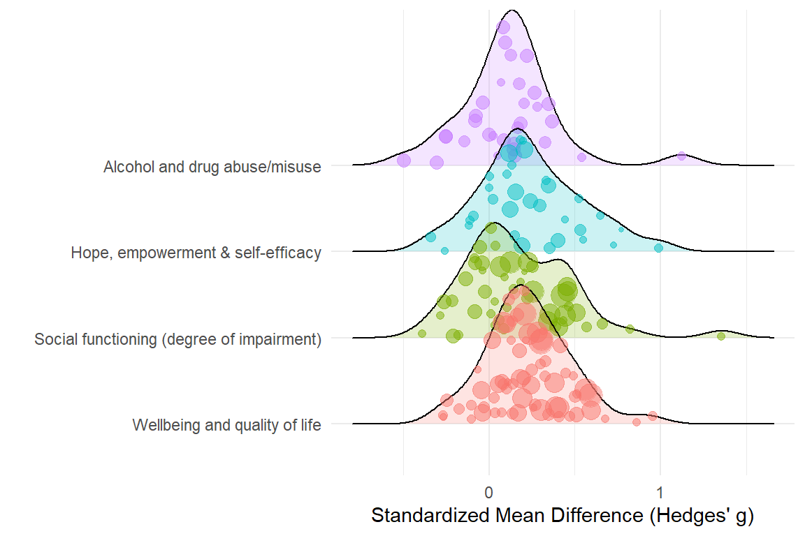{#fig-type-ridge-reint-analyzed fig-pos='H' width=576}
:::
:::


###### Not subgroup analyzed


::: {.cell}

````{.cell-code}
```{{r type-ridge-reint-not-analyzed}}
#| label: fig-type-ridge-reint-not-analyzed
#| fig-cap: "Distribution of effect size estimates, by reintegrational outcomes."
#| fig.width: 6
#| fig.height: 4
#| fig.retina: 2
#| message: false

not_analyzed_outcomes <- 
  reintergation_dat |> 
  filter(!str_detect(analysis_plan, "Alco|Hope|Social|Well"))

cat_ridge(data = not_analyzed_outcomes, es = gt_pop, variable = analysis_plan, v = vgt_pop)
```
````

::: {.cell-output-display}
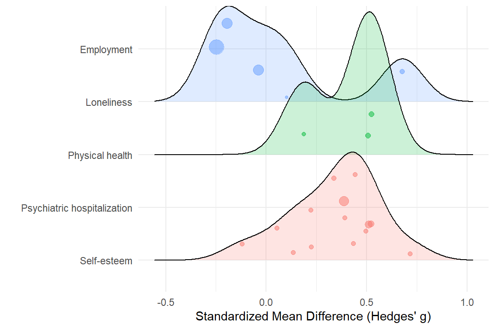{#fig-type-ridge-reint-not-analyzed fig-pos='H' width=576}
:::
:::


:::

:::

::: {.column-margin}


::: {.cell}

````{.cell-code}
```{{r type-ridge-mental-analyzed}}
#| label: fig-type-ridge-mental-analyzed
#| fig-cap: "Distribution of effect size estimates, by mental health outcomes."
#| fig.height: 7
#| fig.retina: 2
#| message: false

cat_ridge(data = mental_health_dat, es = gt_pop, variable = analysis_plan, v = vgt_pop)
```
````

::: {.cell-output-display}
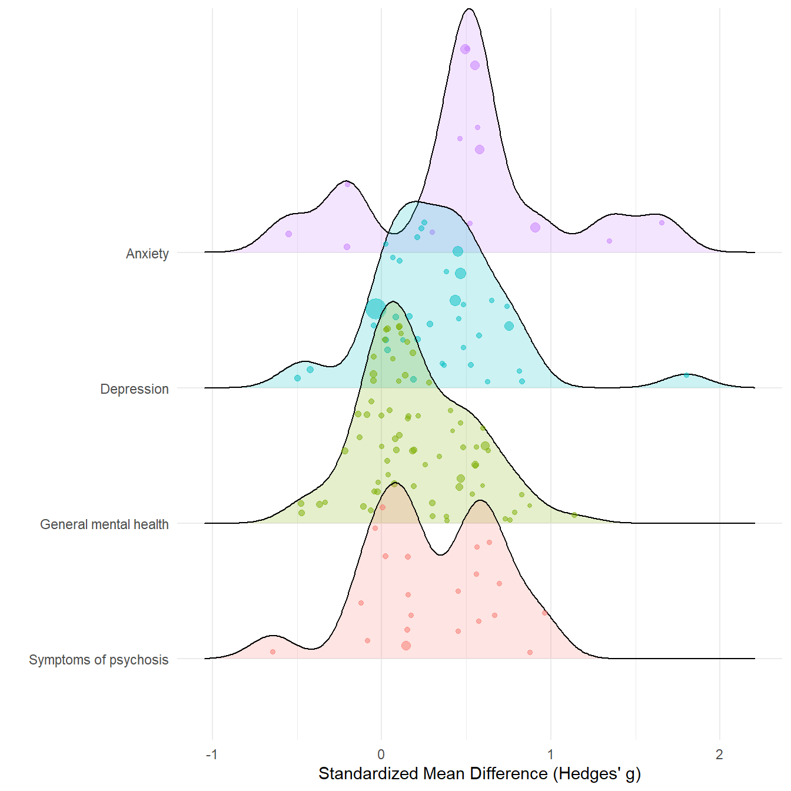{#fig-type-ridge-mental-analyzed fig-pos='H' width=672}
:::
:::


:::

:::

##### Network plot for outcome construct
The following plot shows the network structure of outcomes constructs. Each node represent an outcome construct, the edge between a pair of nodes indicates that there is at least one study that examined the contracts between that pair of constructs The width of the edges indicates the number of studies that compare that pair of constructs. The size of the node corresponds to the number of studies measure that construct.  


::: {.cell}

````{.cell-code}
```{{r incidents}}
incidents_matrix <- function(variable, study_id, data) {
  
  require(dplyr)
  require(rlang)
  require(tidyr)
  
  var_exp <- enquo(variable)
  study_id_exp <- enquo(study_id)
  study_id_name <- as_name(study_id_exp)
  
  
  res_dat <- data %>%
    group_by(!!study_id_exp) %>%
    reframe(var_exp_mirror = unique(!!var_exp))  %>%
    full_join(data,
              by = c(study_id_name),
              relationship = "many-to-many") %>%
    group_by(!!var_exp, var_exp_mirror) %>%
    reframe(
      m = n_distinct(!!study_id_exp),
      k = n()
    ) %>%
    mutate(size = m) %>%
    select(-m, -k) |>
    pivot_wider(names_from = var_exp_mirror, values_from = "size")
 
  
  names(res_dat)[1] <- "level" 
  
  return(res_dat)
}
```
````
:::

::: {.cell}

````{.cell-code}
```{{r}}
outcome_construct_incidents_matrix <- incidents_matrix(
  variable = analysis_plan,
  study_id = study,
  data = gb_dat
)  |> 
  as.data.frame() |> 
  relocate(Employment, .after = Depression) |> 
  relocate(Loneliness, .before = `Physical health`) |> 
  relocate(`Psychiatric hospitalization`, .after = `Physical health`) |> 
  relocate(`Self-esteem`, .after = `Psychiatric hospitalization`)

edges <- outcome_construct_incidents_matrix %>%
  rename(from = "level") |> 
  pivot_longer(-from, names_to = "to", values_to = "weight") %>%
  filter(from != to, !is.na(weight)) |> 
  mutate(
    from_chr = as.character(from),
    to_chr = as.character(to),
    tmp = paste0(pmin(from_chr, to_chr), "_", pmax(from_chr, to_chr))
  ) %>% 
  distinct(tmp, .keep_all = TRUE) %>%
  select(from, to, weight)

g <- graph_from_data_frame(edges, directed = FALSE)
```
````
:::

::: {.cell}

````{.cell-code}
```{{r network-plot}}
#| label: fig-network
#| fig-cap: "Network structure of contrasts between primary and secondary outcome constructs"
#| fig.width: 7
#| fig.height: 6
#| fig.retina: 2
#| message: false

network_plot <- 
  function(
    layout_g, incidents_matrix 
    ) {

  layout <- layout_in_circle(layout_g)

  # Adjust label position outward
  label_coords <- layout
  label_coords[, 1] <- c(
    label_coords[1, 1] * 1.35, #1.5,
    label_coords[2:6, 1] * 1.4, #1.63,
    label_coords[7, 1] * 1.35, #1.68,
    label_coords[8:13, 1] * 1.4 #1.63
  )

  label_coords[, 2] <- c(
    label_coords[c(1:3), 2],
    label_coords[4, 2] * 1.13,
    label_coords[5, 2] * 1.27,
    label_coords[6, 2] * 1.13,
    label_coords[c(7:10), 2] * 1.13,
    label_coords[11, 2] * 1.2,
    label_coords[12:13, 2] * 1.13
  )

  node_sizes <- diag(as.matrix(incidents_matrix[, -1]))

  plot(
    g,
    layout = layout,
    edge.width = E(layout_g)$weight,
    edge.color = met.brewer("Navajo")[5],
    vertex.size = node_sizes,
    vertex.label = NA,
    vertex.color = met.brewer("Navajo")[4],
    vertex.frame.width = 0
  )

  text(
    x = label_coords[, 1],
    y = label_coords[, 2],
    labels = paste0(str_wrap(V(layout_g)$name, width = 15), "\n(J = ", node_sizes, ")"),
    cex = 0.6,
    col = "black",
    xpd = NA
  )

}

network_plot(g, outcome_construct_incidents_matrix)
```
````

::: {.cell-output-display}
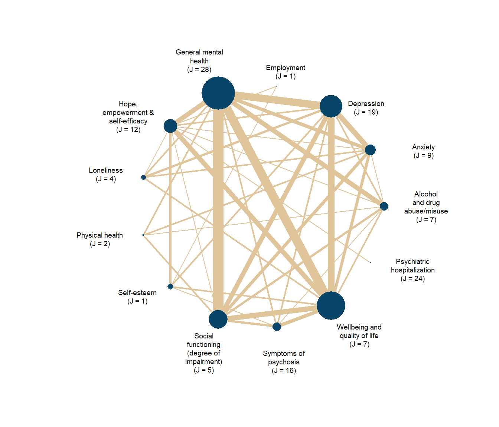{#fig-network fig-pos='H' width=672}
:::
:::


#### Diagnosis

#### Type of intervention


- Diagnosis 
- CBT vs. rest

### Methodological 
- ITT vs. TOT
- RCT vs. QES
- Type of control
- Low vs. high rob
- Preregistration vs. not preregistered

#### Preregistered vs. not preregistered studies {.tabset}


::: {.cell}

````{.cell-code}
```{{r prereg-status-dependency-table}}
prereg_dat_cross <- cat_dat_cross(
  data = reintergation_dat,
  variable = prereg_chr,
  study_id = study
)

#| tbl-cap-location: top
#| label: tab-published

prereg_dat_cross |>
  knitr::kable(
    "html",
    col.names = c(
      "Preregistration status",
      colnames(prereg_dat_cross)[-1]
    ),
    caption = "Dependency table for preregistration status (reintegration)"
  ) |>
  kableExtra::column_spec(1, bold = TRUE) |>
  kableExtra::footnote(
    "Values outside the parentheses are number of studies, with the number of samples and effect size estimates shown in the parentheses.",
    footnote_as_chunk = T
  ) |>
  kableExtra::kable_styling(bootstrap_options = c("striped", "condensed"), full_width = T)
```
````

::: {.cell-output-display}

`````{=html}
<table style="NAborder-bottom: 0; margin-left: auto; margin-right: auto;" class="table table-striped table-condensed">
<caption>Dependency table for preregistration status (reintegration)</caption>
 <thead>
  <tr>
   <th style="text-align:left;"> Preregistration status </th>
   <th style="text-align:left;"> Not preregistered </th>
   <th style="text-align:left;"> Preregistered </th>
  </tr>
 </thead>
<tbody>
  <tr>
   <td style="text-align:left;font-weight: bold;"> Not preregistered </td>
   <td style="text-align:left;"> 22 (61) </td>
   <td style="text-align:left;"> - </td>
  </tr>
  <tr>
   <td style="text-align:left;font-weight: bold;"> Preregistered </td>
   <td style="text-align:left;"> - </td>
   <td style="text-align:left;"> 23 (141) </td>
  </tr>
</tbody>
<tfoot><tr><td style="padding: 0; " colspan="100%">
<span style="font-style: italic;">Note: </span> <sup></sup> Values outside the parentheses are number of studies, with the number of samples and effect size estimates shown in the parentheses.</td></tr></tfoot>
</table>

`````

:::
:::

::: {.cell}

````{.cell-code}
```{{r}}
gb_dat |> 
  summarise(
    prereg_chr = unique(prereg_chr),
    n_es = n(),
    .by = study
  ) |> 
  summarise(
    N_studies = n_distinct(study),
    N_es = sum(n_es),
    .by = prereg_chr
  )
```
````

::: {.cell-output .cell-output-stdout}

```
# A tibble: 2 × 3
  prereg_chr        N_studies  N_es
  <chr>                 <int> <int>
1 Preregistered            24   225
2 Not preregistered        24   118
```


:::
:::


::: {.panel-tabset}
### Reintegration 


::: {.cell}

````{.cell-code}
```{{r}}
reintergation_dat |> 
  summarise(
    prereg_chr = unique(prereg_chr),
    n_es = n(),
    .by = study
  ) |> 
  summarise(
    N_studies = n_distinct(study),
    N_es = sum(n_es),
    .by = prereg_chr
  )
```
````

::: {.cell-output .cell-output-stdout}

```
# A tibble: 2 × 3
  prereg_chr        N_studies  N_es
  <chr>                 <int> <int>
1 Preregistered            23   141
2 Not preregistered        22    61
```


:::
:::


### Mental health


::: {.cell}

````{.cell-code}
```{{r}}
mental_health_dat |> 
  summarise(
    prereg_chr = unique(prereg_chr),
    n_es = n(),
    .by = study
  ) |> 
  summarise(
    N_studies = n_distinct(study),
    N_es = sum(n_es),
    .by = prereg_chr
  )
```
````

::: {.cell-output .cell-output-stdout}

```
# A tibble: 2 × 3
  prereg_chr        N_studies  N_es
  <chr>                 <int> <int>
1 Preregistered            21    84
2 Not preregistered        20    57
```


:::
:::


:::

## Continuous moderators

::: {.columns}

::: {.column width="95%"}


::: {.cell}

````{.cell-code}
```{{r, continuous-mod-reint}}
var_labels <- c(
  "Mean age" = "age",
  "Percent Male" = "male_pct",
  "Total Number of Sessions" = "sessions",
  "Sessions per Week" = "intensity",
  "Length of Intervention (in Weeks)" = "duration",
  "Weeks After End of Intervention" = "timing",
  "Weeks from Baseline" = "weeks_from_baseline"
)

continuous_descriptives <- 
 reintergation_dat |> 
  summarise(
    age = mean(age_mean),
    male_pct = mean(male_pct),
    sessions = mean(total_number_of_sessions),
    intensity = mean(sessions_per_week),
    duration = mean(duration_in_weeks),
    timing = mean(time_after_end_intervention_weeks),
    weeks_from_baseline = mean(time_from_baseline_weeks),
    .by = study
  ) 

continuous_descriptives_tab <- 
  continuous_descriptives |> 
  #pivot_longer(
  #  cols = age:male_pct,
  #  names_to = "var",
  #  values_to = "val"
  #) |> 
  #arrange(var)
  gather(var, val, age, male_pct, sessions, intensity, duration, timing, weeks_from_baseline) |>
  summarise(
    `% Missing` = 100 * mean(is.na(val)),
    Mean = mean(val, na.rm = TRUE),
    SD = sd(val, na.rm = TRUE),
    Min = min(val, na.rm = TRUE),
    LQ = quantile(val, na.rm = TRUE)[2],
    Median = median(val, na.rm = TRUE),
    UQ = quantile(val, na.rm = TRUE)[4],
    Max = max(val, na.rm = TRUE),
    .by = var
  ) |> 
  mutate(
    var = factor(var, levels = var_labels, labels = names(var_labels))
  )

#| tbl-cap-location: top
#| label: tab-continuous-characteristics-reint
knitr::kable(
  continuous_descriptives_tab, 
  caption = "Distribution of continuous moderators (reintegration)",
  col.names = c("Variable", colnames(continuous_descriptives_tab)[-1]),
  digits = 1,
  booktabs = TRUE
) |>
  kable_styling(bootstrap_options = c("striped", "condensed"), full_width = FALSE) |>
  collapse_rows(1, valign = "top")
```
````

::: {.cell-output-display}

`````{=html}
<table class="table table-striped table-condensed" style="width: auto !important; margin-left: auto; margin-right: auto;">
<caption>Distribution of continuous moderators (reintegration)</caption>
 <thead>
  <tr>
   <th style="text-align:left;"> Variable </th>
   <th style="text-align:right;"> % Missing </th>
   <th style="text-align:right;"> Mean </th>
   <th style="text-align:right;"> SD </th>
   <th style="text-align:right;"> Min </th>
   <th style="text-align:right;"> LQ </th>
   <th style="text-align:right;"> Median </th>
   <th style="text-align:right;"> UQ </th>
   <th style="text-align:right;"> Max </th>
  </tr>
 </thead>
<tbody>
  <tr>
   <td style="text-align:left;"> Mean age </td>
   <td style="text-align:right;"> 0.0 </td>
   <td style="text-align:right;"> 40.7 </td>
   <td style="text-align:right;"> 9.1 </td>
   <td style="text-align:right;"> 24.9 </td>
   <td style="text-align:right;"> 35.6 </td>
   <td style="text-align:right;"> 40.8 </td>
   <td style="text-align:right;"> 43.8 </td>
   <td style="text-align:right;"> 67.4 </td>
  </tr>
  <tr>
   <td style="text-align:left;"> Percent Male </td>
   <td style="text-align:right;"> 2.2 </td>
   <td style="text-align:right;"> 45.8 </td>
   <td style="text-align:right;"> 23.0 </td>
   <td style="text-align:right;"> 0.0 </td>
   <td style="text-align:right;"> 31.5 </td>
   <td style="text-align:right;"> 45.7 </td>
   <td style="text-align:right;"> 67.4 </td>
   <td style="text-align:right;"> 79.5 </td>
  </tr>
  <tr>
   <td style="text-align:left;"> Total Number of Sessions </td>
   <td style="text-align:right;"> 2.2 </td>
   <td style="text-align:right;"> 21.2 </td>
   <td style="text-align:right;"> 22.0 </td>
   <td style="text-align:right;"> 3.0 </td>
   <td style="text-align:right;"> 8.0 </td>
   <td style="text-align:right;"> 12.0 </td>
   <td style="text-align:right;"> 24.0 </td>
   <td style="text-align:right;"> 104.0 </td>
  </tr>
  <tr>
   <td style="text-align:left;"> Sessions per Week </td>
   <td style="text-align:right;"> 2.2 </td>
   <td style="text-align:right;"> 1.3 </td>
   <td style="text-align:right;"> 1.5 </td>
   <td style="text-align:right;"> 0.1 </td>
   <td style="text-align:right;"> 1.0 </td>
   <td style="text-align:right;"> 1.0 </td>
   <td style="text-align:right;"> 1.0 </td>
   <td style="text-align:right;"> 10.5 </td>
  </tr>
  <tr>
   <td style="text-align:left;"> Length of Intervention (in Weeks) </td>
   <td style="text-align:right;"> 0.0 </td>
   <td style="text-align:right;"> 18.6 </td>
   <td style="text-align:right;"> 17.0 </td>
   <td style="text-align:right;"> 4.0 </td>
   <td style="text-align:right;"> 8.0 </td>
   <td style="text-align:right;"> 12.0 </td>
   <td style="text-align:right;"> 24.0 </td>
   <td style="text-align:right;"> 78.0 </td>
  </tr>
  <tr>
   <td style="text-align:left;"> Weeks After End of Intervention </td>
   <td style="text-align:right;"> 0.0 </td>
   <td style="text-align:right;"> 6.0 </td>
   <td style="text-align:right;"> 10.2 </td>
   <td style="text-align:right;"> 0.0 </td>
   <td style="text-align:right;"> 0.0 </td>
   <td style="text-align:right;"> 1.0 </td>
   <td style="text-align:right;"> 6.5 </td>
   <td style="text-align:right;"> 52.0 </td>
  </tr>
  <tr>
   <td style="text-align:left;"> Weeks from Baseline </td>
   <td style="text-align:right;"> 0.0 </td>
   <td style="text-align:right;"> 24.6 </td>
   <td style="text-align:right;"> 22.8 </td>
   <td style="text-align:right;"> 6.0 </td>
   <td style="text-align:right;"> 12.0 </td>
   <td style="text-align:right;"> 18.0 </td>
   <td style="text-align:right;"> 26.0 </td>
   <td style="text-align:right;"> 130.0 </td>
  </tr>
</tbody>
</table>

`````

:::
:::


:::

::: {.column-margin}


::: {.cell}

````{.cell-code}
```{{r, continuous-mod-mental}}
var_labels_mental <- c(
  "Mean age" = "age",
  "Percent Male" = "male_pct",
  "N Sessions" = "sessions",
  "Sessions Week" = "intensity",
  "Length" = "duration",
  "Weeks After Intervention" = "timing",
  "Weeks Baseline" = "weeks_from_baseline"
)

continuous_descriptives_mental <- 
 mental_health_dat |> 
  summarise(
    age = mean(age_mean),
    male_pct = mean(male_pct),
    sessions = mean(total_number_of_sessions),
    intensity = mean(sessions_per_week),
    duration = mean(duration_in_weeks),
    timing = mean(time_after_end_intervention_weeks),
    weeks_from_baseline = mean(time_from_baseline_weeks),
    .by = study
  ) 

continuous_descriptives_tab_mental <- 
  continuous_descriptives_mental |> 
  #pivot_longer(
  #  cols = age:male_pct,
  #  names_to = "var",
  #  values_to = "val"
  #) |> 
  #arrange(var)
  gather(var, val, age, male_pct, sessions, intensity, duration, timing, weeks_from_baseline) |>
  summarise(
    `% Missing` = 100 * mean(is.na(val)),
    Mean = mean(val, na.rm = TRUE),
    SD = sd(val, na.rm = TRUE),
    Min = min(val, na.rm = TRUE),
    LQ = quantile(val, na.rm = TRUE)[2],
    Median = median(val, na.rm = TRUE),
    UQ = quantile(val, na.rm = TRUE)[4],
    Max = max(val, na.rm = TRUE),
    .by = var
  ) |> 
  mutate(
    var = factor(var, levels = var_labels_mental, labels = names(var_labels_mental))
  )

#| tbl-cap-location: top
#| label: tab-continuous-characteristics-mental
knitr::kable(
  continuous_descriptives_tab_mental, 
  caption = "Distribution of continuous moderators (mental health)",
  col.names = c("Variable", colnames(continuous_descriptives_tab)[-1]),
  digits = 1,
  booktabs = TRUE
) |>
  kable_styling(bootstrap_options = c("striped", "condensed"), full_width = FALSE) |>
  collapse_rows(1, valign = "top")
```
````

::: {.cell-output-display}

`````{=html}
<table class="table table-striped table-condensed" style="width: auto !important; margin-left: auto; margin-right: auto;">
<caption>Distribution of continuous moderators (mental health)</caption>
 <thead>
  <tr>
   <th style="text-align:left;"> Variable </th>
   <th style="text-align:right;"> % Missing </th>
   <th style="text-align:right;"> Mean </th>
   <th style="text-align:right;"> SD </th>
   <th style="text-align:right;"> Min </th>
   <th style="text-align:right;"> LQ </th>
   <th style="text-align:right;"> Median </th>
   <th style="text-align:right;"> UQ </th>
   <th style="text-align:right;"> Max </th>
  </tr>
 </thead>
<tbody>
  <tr>
   <td style="text-align:left;"> Mean age </td>
   <td style="text-align:right;"> 0.0 </td>
   <td style="text-align:right;"> 39.6 </td>
   <td style="text-align:right;"> 9.4 </td>
   <td style="text-align:right;"> 21.6 </td>
   <td style="text-align:right;"> 34.8 </td>
   <td style="text-align:right;"> 39.8 </td>
   <td style="text-align:right;"> 43.1 </td>
   <td style="text-align:right;"> 67.4 </td>
  </tr>
  <tr>
   <td style="text-align:left;"> Percent Male </td>
   <td style="text-align:right;"> 2.4 </td>
   <td style="text-align:right;"> 44.3 </td>
   <td style="text-align:right;"> 23.1 </td>
   <td style="text-align:right;"> 0.0 </td>
   <td style="text-align:right;"> 28.7 </td>
   <td style="text-align:right;"> 45.7 </td>
   <td style="text-align:right;"> 64.1 </td>
   <td style="text-align:right;"> 77.8 </td>
  </tr>
  <tr>
   <td style="text-align:left;"> N Sessions </td>
   <td style="text-align:right;"> 2.4 </td>
   <td style="text-align:right;"> 22.0 </td>
   <td style="text-align:right;"> 22.7 </td>
   <td style="text-align:right;"> 3.0 </td>
   <td style="text-align:right;"> 9.5 </td>
   <td style="text-align:right;"> 13.0 </td>
   <td style="text-align:right;"> 24.0 </td>
   <td style="text-align:right;"> 104.0 </td>
  </tr>
  <tr>
   <td style="text-align:left;"> Sessions Week </td>
   <td style="text-align:right;"> 2.4 </td>
   <td style="text-align:right;"> 1.3 </td>
   <td style="text-align:right;"> 1.6 </td>
   <td style="text-align:right;"> 0.1 </td>
   <td style="text-align:right;"> 1.0 </td>
   <td style="text-align:right;"> 1.0 </td>
   <td style="text-align:right;"> 1.0 </td>
   <td style="text-align:right;"> 10.5 </td>
  </tr>
  <tr>
   <td style="text-align:left;"> Length </td>
   <td style="text-align:right;"> 0.0 </td>
   <td style="text-align:right;"> 19.6 </td>
   <td style="text-align:right;"> 17.6 </td>
   <td style="text-align:right;"> 4.0 </td>
   <td style="text-align:right;"> 10.0 </td>
   <td style="text-align:right;"> 12.0 </td>
   <td style="text-align:right;"> 26.0 </td>
   <td style="text-align:right;"> 78.0 </td>
  </tr>
  <tr>
   <td style="text-align:left;"> Weeks After Intervention </td>
   <td style="text-align:right;"> 0.0 </td>
   <td style="text-align:right;"> 7.0 </td>
   <td style="text-align:right;"> 11.1 </td>
   <td style="text-align:right;"> 0.0 </td>
   <td style="text-align:right;"> 0.0 </td>
   <td style="text-align:right;"> 1.0 </td>
   <td style="text-align:right;"> 8.0 </td>
   <td style="text-align:right;"> 52.0 </td>
  </tr>
  <tr>
   <td style="text-align:left;"> Weeks Baseline </td>
   <td style="text-align:right;"> 0.0 </td>
   <td style="text-align:right;"> 26.6 </td>
   <td style="text-align:right;"> 24.3 </td>
   <td style="text-align:right;"> 6.0 </td>
   <td style="text-align:right;"> 12.0 </td>
   <td style="text-align:right;"> 18.0 </td>
   <td style="text-align:right;"> 29.0 </td>
   <td style="text-align:right;"> 130.0 </td>
  </tr>
</tbody>
</table>

`````

:::
:::


:::

:::

### Density Plots

#### Age distribution across studies


::: {.cell}

````{.cell-code}
```{{r density-plot-function}}
density_plot <- function(variable, x_title, data, color = "cornflowerblue") {
  require(dplyr)
  require(tidyr)
  require(ggplot2)
  require(rlang)
  require(MetBrewer)
  
  var_exp <- enquo(variable)
  var_str <- as_label(var_exp)
  
  data |>
    ggplot(aes(x = !!var_exp)) +
    geom_density(fill = color, alpha = 0.8) +
    geom_rug(alpha = 0.7, length = unit(0.04, "npc")) +
    scale_y_continuous(labels = scales::label_number(accuracy = 10^(-3))) +
    theme_minimal() +
    labs(x = x_title, y = "")
}
```
````
:::


::: {.columns}

::: {.column width="95%"}


::: {.cell}

````{.cell-code}
```{{r age-density-reint}}
#| label: fig-age-density-reint
#| fig-cap: "Distribution of average age in a study (reintegrational)."
#| fig.width: 6
#| fig.height: 4
#| fig.retina: 2
#| message: false

age_density <- density_plot(age, "Mean Age", continuous_descriptives)

age_density + expand_limits(x = 70)
```
````

::: {.cell-output-display}
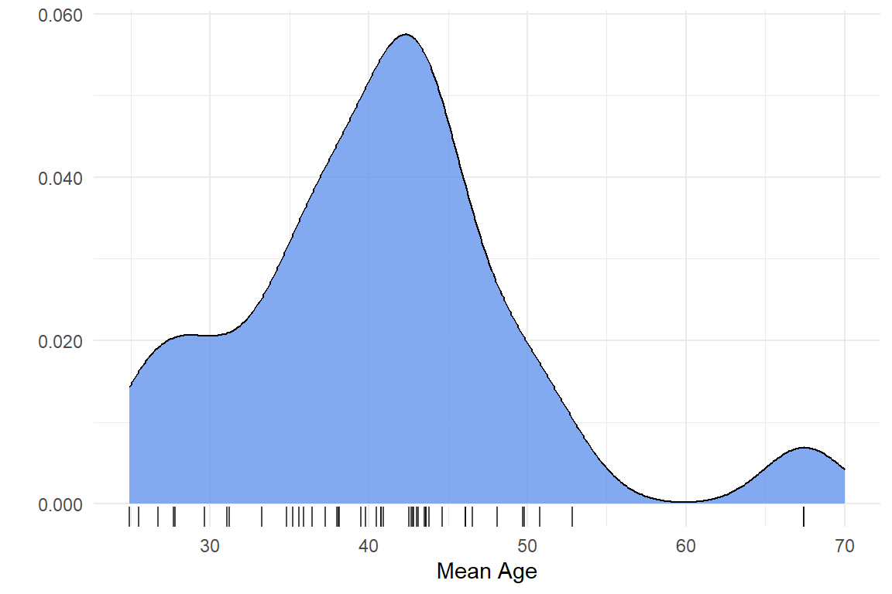{#fig-age-density-reint fig-pos='H' width=576}
:::
:::


:::

::: {.column-margin}


::: {.cell}

````{.cell-code}
```{{r age-density-mental}}
#| label: fig-age-density-mental
#| fig-cap: "Distribution of average age in a study (mental health)."
#| fig.height: 6.5
#| fig.retina: 2
#| message: false

age_density_mental <- density_plot(age, "Mean Age", continuous_descriptives_mental, color = "gray")

age_density_mental + expand_limits(x = 70)
```
````

::: {.cell-output-display}
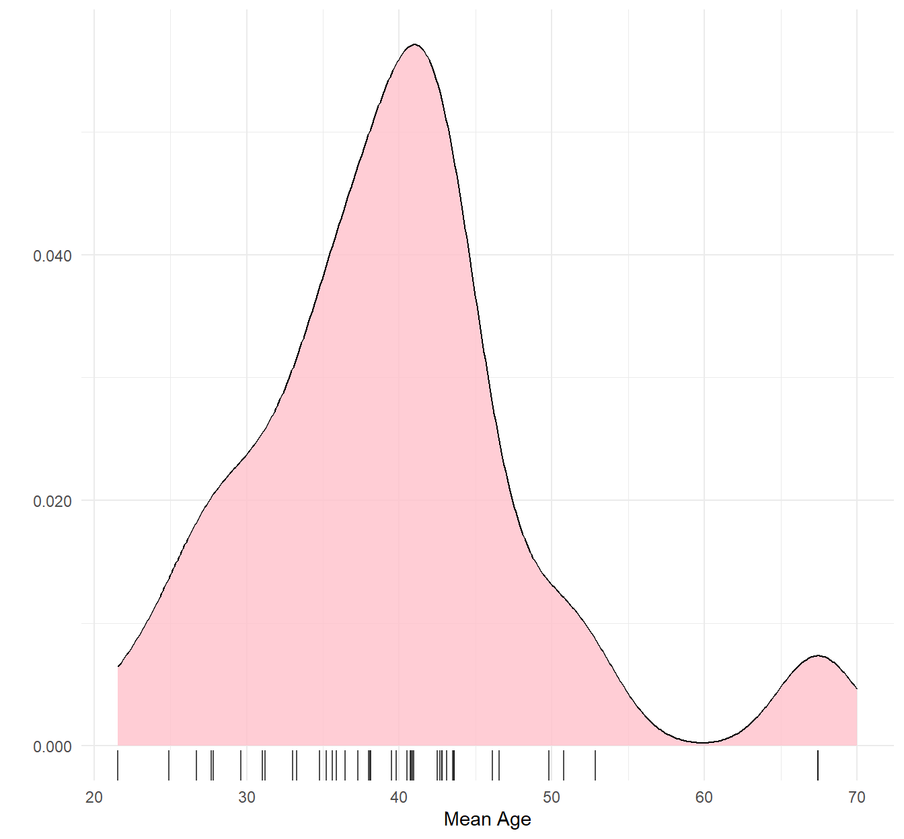{#fig-age-density-mental fig-pos='H' width=672}
:::
:::


:::

:::

#### Percent males in sample distribution across studies
::: {.columns}

::: {.column width="95%"}


::: {.cell}

````{.cell-code}
```{{r males-density-reint}}
#| label: fig-males-density-reint
#| fig-cap: "Distribution proportion of males in each study (reintegration)."
#| fig.width: 6
#| fig.height: 4
#| fig.retina: 2
#| message: false

male_density <- suppressWarnings(density_plot(male_pct, "Proportion Male", continuous_descriptives))
male_density 
```
````

::: {.cell-output-display}
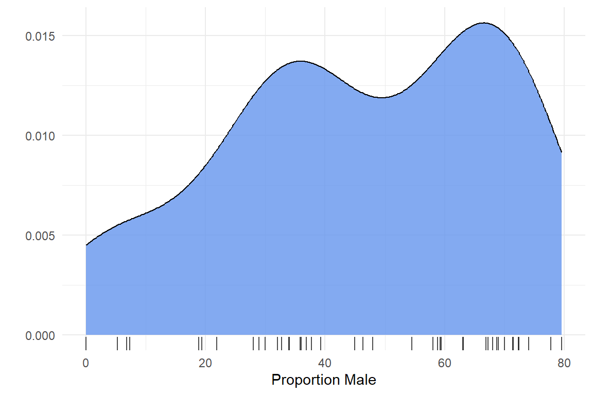{#fig-males-density-reint fig-pos='H' width=576}
:::
:::


:::

::: {.column-margin}


::: {.cell}

````{.cell-code}
```{{r males-density-mental}}
#| label: fig-males-density-mental
#| fig-cap: "Distribution proportion of males in each study (mental health)."
#| fig.height: 6.5
#| fig.retina: 2
#| message: false

male_density_mental <- suppressWarnings(density_plot(male_pct, "Proportion Male", continuous_descriptives_mental, color = "gray"))
male_density_mental 
```
````

::: {.cell-output-display}
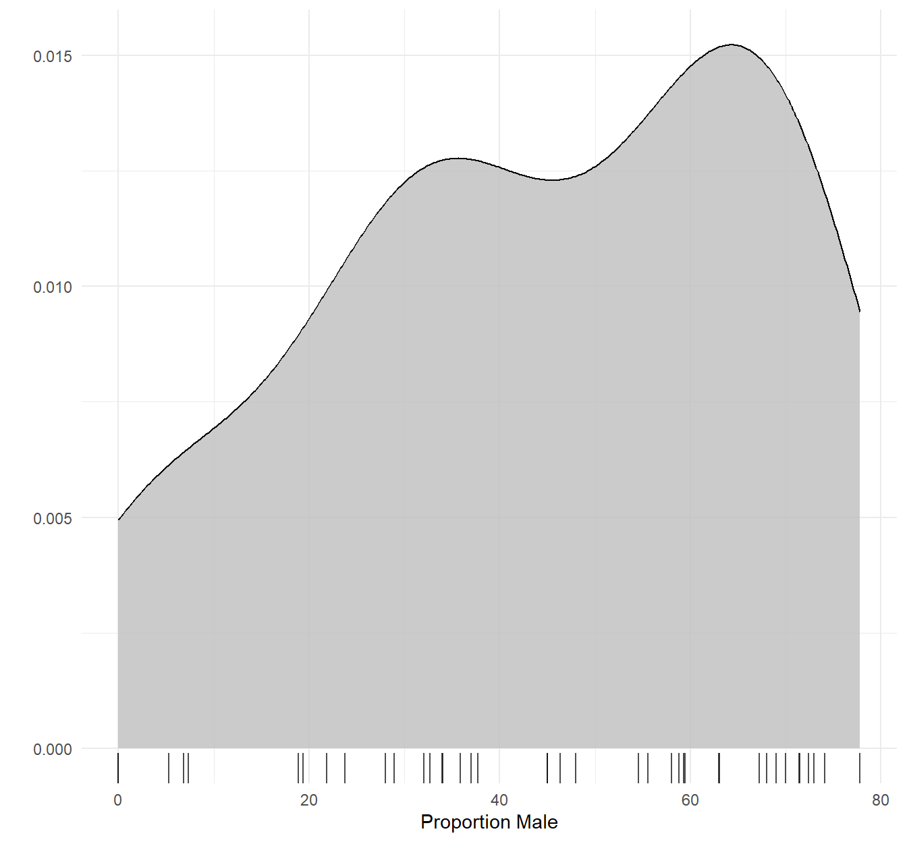{#fig-males-density-mental fig-pos='H' width=672}
:::
:::


:::

:::


### Histogram


::: {.cell}

````{.cell-code}
```{{r hist-plot-function}}
hist_plot <- function(variable, x_title, data, color = "cornflowerblue") {
  require(dplyr)
  require(tidyr)
  require(ggplot2)
  require(rlang)
  require(MetBrewer)
  
  var_exp <- enquo(variable)
  var_str <- as_label(var_exp)
  
  x_vals <- data[[var_str]]
  min_val <- floor(min(x_vals, na.rm = TRUE))
  max_val <- ceiling(max(x_vals, na.rm = TRUE))
  
  data |>
    ggplot(aes(x = !!var_exp)) +
    geom_histogram(binwidth = 1, boundary = 0, fill = color, alpha = 0.8) +
    scale_x_continuous(breaks = pretty(seq(min_val, max_val, by = 1), n = 5)) +
    scale_y_continuous(breaks = seq(0, 10, 2)) +
    theme_minimal() +
    labs(x = x_title, y = "")
}
```
````
:::


::: {.columns}

::: {.column width="95%"}


::: {.cell}

````{.cell-code}
```{{r sessions-hist-reint}}
#| label: fig-sessions-hist-reint
#| fig-cap: "Distribution of study sessions (reintegration)."
#| fig.width: 7
#| fig.height: 4
#| fig.retina: 2
#| message: false

sessions_hist <- hist_plot(sessions, "Total Number of Sessions in Intervention", continuous_descriptives)
sessions_hist + labs(title = "Reintegration") + theme(plot.title = element_text(hjust = 0.5))
```
````

::: {.cell-output-display}
{#fig-sessions-hist-reint fig-pos='H' width=672}
:::
:::


:::

::: {.column-margin}


::: {.cell}

````{.cell-code}
```{{r sessions-hist-mental}}
#| label: fig-sessions-hist-mental
#| fig-cap: "Distribution of study sessions (mental health)."
#| fig.height: 6.5
#| fig.retina: 2
#| message: false

sessions_hist_mental <- hist_plot(sessions, "Total Number of Sessions in Intervention", continuous_descriptives_mental, color = "gray")
sessions_hist_mental + labs(title = "Mental Health") + theme(plot.title = element_text(hjust = 0.5))
```
````

::: {.cell-output-display}
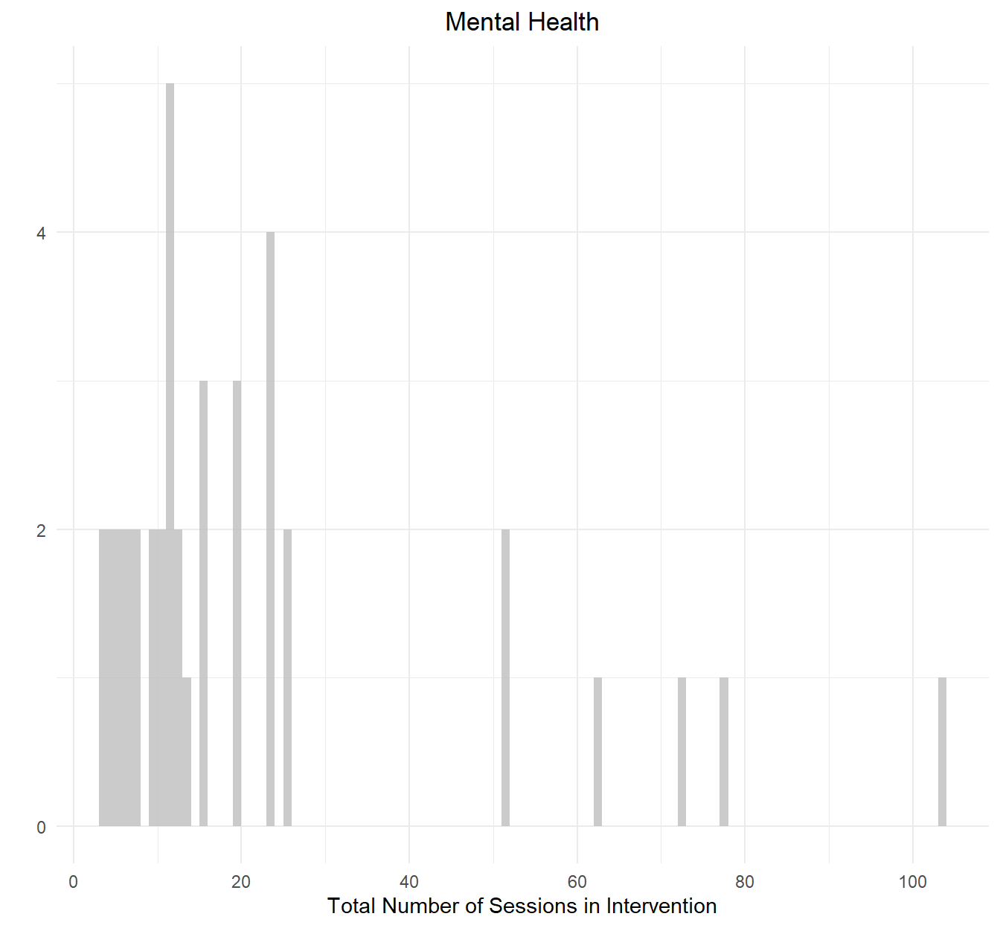{#fig-sessions-hist-mental fig-pos='H' width=672}
:::
:::


:::

:::

### Lollipop Plot

#### Duration and intensity (number of sessions per week)
::: {.columns}

::: {.column width="95%"}


::: {.cell fig.topcaption='true'}

````{.cell-code}
```{{r duration-plot-reint}}
#| label: fig-duration-reint
#| fig-cap: "Length of intervention in weeks (reintegration)"
#| fig.width: 6.8
#| fig.height: 7
#| fig.retina: 2
#| fig.topcaption: TRUE
#| message: false

reintergation_dat |>
  select(study, duration_in_weeks, sessions_per_week, N_total) |> 
  filter(!is.na(sessions_per_week)) |>  
  arrange(desc(duration_in_weeks)) |> 
  mutate(
    study = factor(study, levels = unique(study)),
    sessions = case_when(
      sessions_per_week < 1 ~ "1<",
      sessions_per_week == 1 ~ "1",
      sessions_per_week == 1.5 ~ "1.5",
      sessions_per_week == 2 ~ "2",
      sessions_per_week == 2.5 ~ "2.5",
      sessions_per_week > 2 ~ ">10"
    ),
    sessions = factor(sessions, levels = unique(sessions))
  ) |> 
  ggplot(aes(y = study, x = duration_in_weeks, color = study)) +
  geom_segment(aes(x = 0, xend = duration_in_weeks, y = study, yend = study)) +
  geom_vline(xintercept = c(13, 26, 52, 78), linetype = "dashed", alpha = 0.5) +
  geom_point(
    aes(size = N_total)
  ) +
  scale_x_continuous(breaks = seq(0, 80, 10)) +
  facet_grid(vars(sessions_per_week), scales = "free_y", space = "free_y", switch = "y") + 
  #scale_size(breaks = c(0.5, 1, 1.5, 2, 10.5), limits = c(0, 10.5)) +
  labs(
    x = "Lenght of intervention in weeks", 
    y = "", 
    caption = paste0(
      "The light gray facet grids indicate the average number of sessions per week.\n", 
      "The dashed lines indicate 3 months, 6 months, 1 year, and 1.5 years, respectively.\n",
      "The point sizes are weighted by the study sample sizes."
      )
  ) +
  theme_minimal() + 
  scale_colour_discrete(guide = "none") +
  theme(
    legend.position = "none", 
    strip.text = element_text(color = "black"),
    strip.background.y = element_rect(fill = "gray93", color = "white"),
    strip.text.y.left = element_text(angle = 0),
    plot.caption = element_text(hjust = 0)
  ) 
```
````

::: {.cell-output-display}
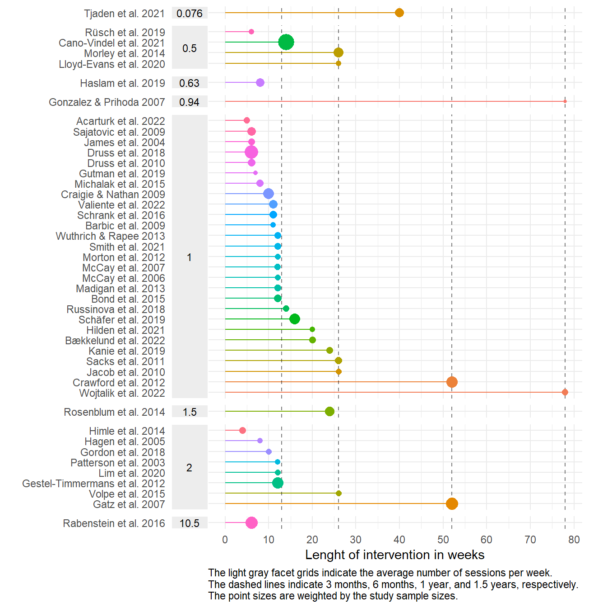{#fig-duration-reint fig-pos='H' width=652.8}
:::
:::


:::

::: {.column-margin}


::: {.cell fig.topcaption='true'}

````{.cell-code}
```{{r duration-plot-mental}}
#| label: fig-duration-mental
#| fig-cap: "Length of intervention in weeks (mental health)"
#| fig.height: 11
#| fig.retina: 2
#| fig.topcaption: TRUE
#| message: false

mental_health_dat |>
  select(study, duration_in_weeks, sessions_per_week, N_total) |> 
  filter(!is.na(sessions_per_week)) |>  
  arrange(desc(duration_in_weeks)) |> 
  mutate(
    study = factor(study, levels = unique(study)),
    sessions = case_when(
      sessions_per_week < 1 ~ "Less than 1",
      sessions_per_week == 1 ~ "1 per week",
      sessions_per_week == 2 ~ "2 per week",
      sessions_per_week > 2 ~ ">10"
    ),
    sessions = factor(sessions, levels = unique(sessions))
  ) |> 
  ggplot(aes(y = study, x = duration_in_weeks, color = study)) +
  geom_segment(aes(x = 0, xend = duration_in_weeks, y = study, yend = study)) +
  geom_vline(xintercept = c(13, 26, 52, 78), linetype = "dashed", alpha = 0.5) +
  geom_point(
    aes(size = N_total)
  ) +
  scale_x_continuous(breaks = seq(0, 80, 10)) +
  facet_grid(vars(sessions_per_week), scales = "free_y", space = "free_y", switch = "y") + 
  #scale_size(breaks = c(0.5, 1, 1.5, 2, 10.5), limits = c(0, 10.5)) +
  labs(
    x = "Lenght of intervention in weeks", 
    y = "", 
    caption = 
      paste0(
      "The light gray facet grids indicate the average number of sessions per week.\n", 
      "The dashed lines indicate 3 months, 6 months, 1 year, and 1.5 years, respectively.\n",
      "The point sizes are weighted by the study sample sizes."
      )
  ) +
  theme_minimal() + 
  scale_colour_discrete(guide = "none") +
  theme(
    legend.position = "none", 
    strip.text = element_text(color = "black"),
    strip.background.y = element_rect(fill = "gray93", color = "white"),
    strip.text.y.left = element_text(angle = 0),
    plot.caption = element_text(hjust = 0)
  )  
```
````

::: {.cell-output-display}
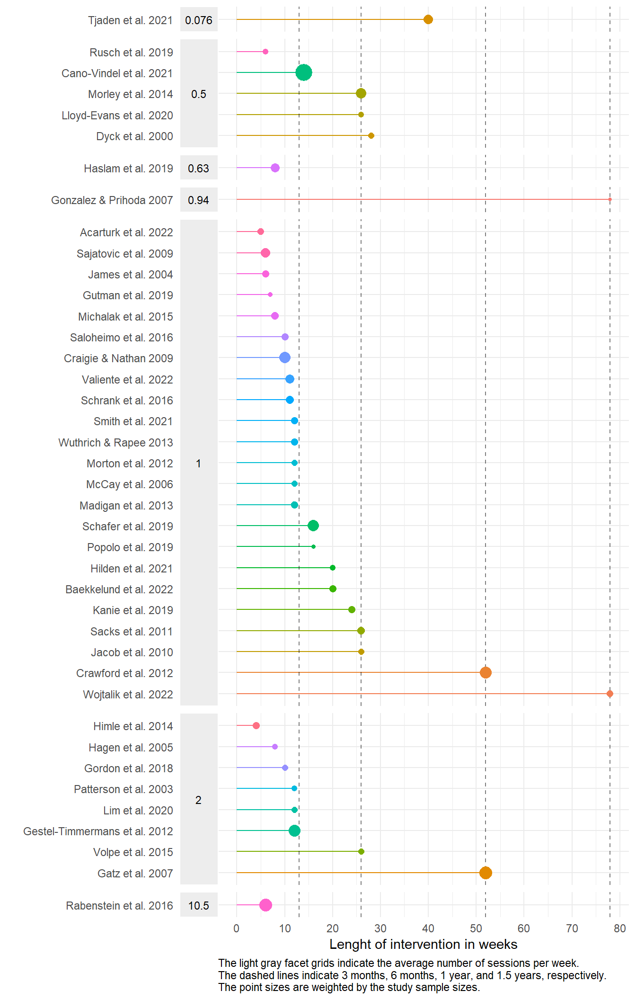{#fig-duration-mental fig-pos='H' width=672}
:::
:::


::: 

:::

### Buble Plot

#### Weeks after end of intervention

::: {.columns}

::: {.column width="95%"}


::: {.cell fig.topcaption='true'}

````{.cell-code}
```{{r follow-up-plot-connected-reint}}
#| label: fig-follow-up-connected-reint
#| fig-cap: "Weeks after end of interventions for all studies (reintegration)"
#| fig.width: 6.5
#| fig.height: 7
#| fig.retina: 2
#| fig.topcaption: TRUE
#| message: false

reintergation_dat |>
  select(study, time_after_end_intervention_weeks, N_total) |> 
  arrange(desc(study)) |> 
  mutate(study = factor(study, levels = unique(study))) |> 
  ggplot(aes(y = study, x = time_after_end_intervention_weeks, color = study)) +
  geom_point(aes(size = N_total),
             alpha = 0.5) +
  geom_line() +
  labs(x = "Weeks after end of intervention all studies", y = "")+
  theme_minimal() + 
  theme(legend.position = "none")
```
````

::: {.cell-output-display}
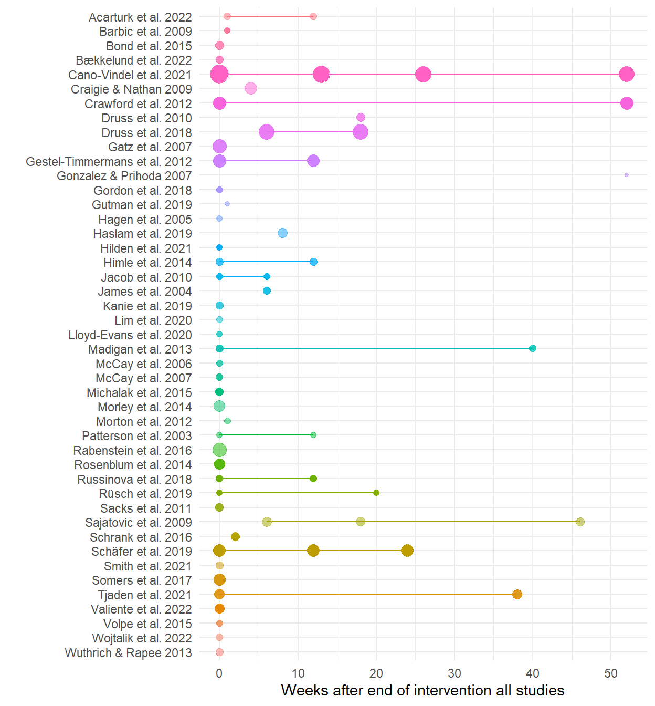{#fig-follow-up-connected-reint fig-pos='H' width=624}
:::
:::


:::

::: {.column-margin}


::: {.cell fig.topcaption='true'}

````{.cell-code}
```{{r follow-up-plot-connected-mental}}
#| label: fig-follow-up-connected-mental
#| fig-cap: "Weeks after end of interventions for all studies (mental health)"
#| fig.height: 11
#| fig.retina: 2
#| fig.topcaption: TRUE
#| message: false

mental_health_dat |>
  select(study, time_after_end_intervention_weeks, N_total) |> 
  arrange(desc(study)) |> 
  mutate(study = factor(study, levels = unique(study))) |> 
  ggplot(aes(y = study, x = time_after_end_intervention_weeks, color = study)) +
  geom_point(aes(size = N_total),
             alpha = 0.5) +
  geom_line() +
  labs(x = "Weeks after end of intervention all studies", y = "")+
  theme_minimal() + 
  theme(legend.position = "none")
```
````

::: {.cell-output-display}
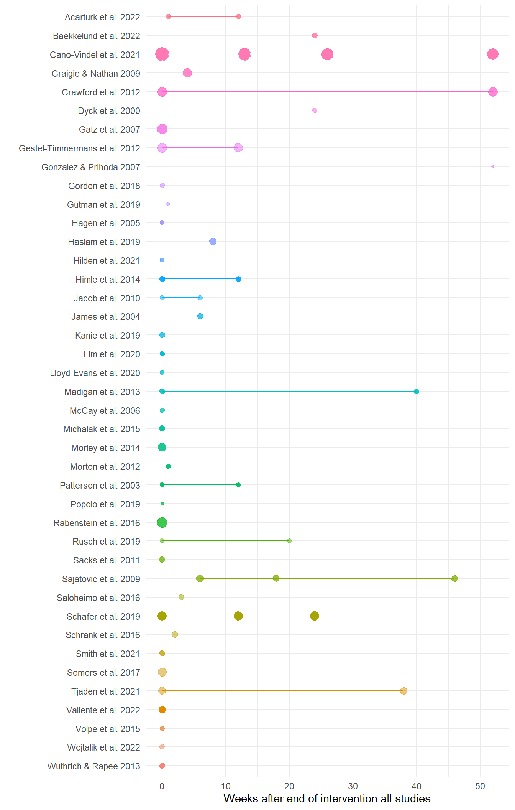{#fig-follow-up-connected-mental fig-pos='H' width=672}
:::
:::


::: 

:::

#### Correlation between effect size estimates and measurement timing
::: {.columns}

::: {.column width="95%"}


::: {.cell fig.topcaption='true'}

````{.cell-code}
```{{r es-time-plot-reint}}
#| label: fig-es-time-reint
#| fig-cap: "Length of intervention in weeks (reintegration)"
#| fig.width: 6
#| fig.height: 4
#| fig.retina: 2
#| fig.topcaption: TRUE
#| message: false

reintergation_dat |> 
  select(study, gt_pop, vgt_pop, time_after_end_intervention_weeks) |> 
  ggplot() +
  aes(x = time_after_end_intervention_weeks, y = gt_pop, color = study) +
  geom_vline(xintercept = 0) + 
  geom_hline(yintercept = 0) + 
  geom_point(aes(size = 1/vgt_pop), alpha = 0.30) + 
  geom_smooth(method = "lm", formula = y ~ x, color = "yellow") + 
  scale_x_continuous(breaks = seq(0, 55, 5)) +
  theme_minimal() + 
  theme(legend.position = "none") + 
  labs(x = "Follow-up duration (months)", y = "Hedges' g")
```
````

::: {.cell-output-display}
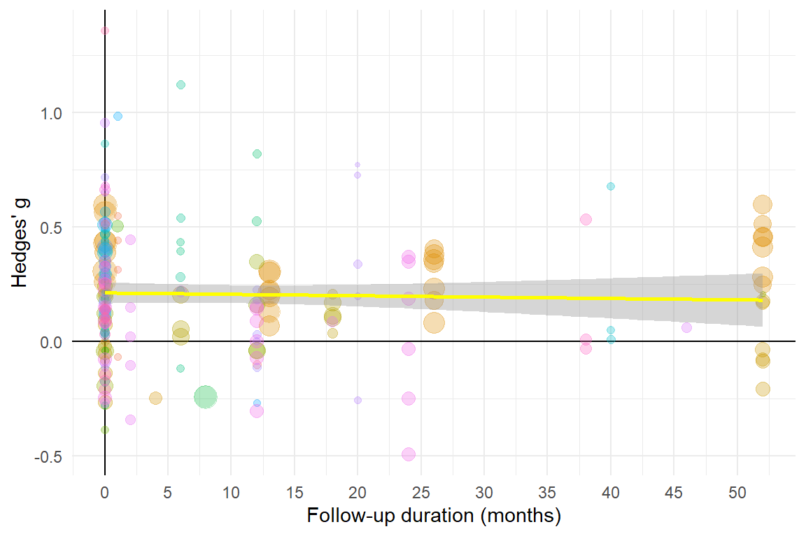{#fig-es-time-reint fig-pos='H' width=576}
:::
:::


:::

::: {.column-margin}


::: {.cell fig.topcaption='true'}

````{.cell-code}
```{{r es-time-plot-mental}}
#| label: fig-es-time-mental
#| fig-cap: "Length of intervention in weeks (mental health)"
#| fig.height: 6
#| fig.retina: 2
#| fig.topcaption: TRUE
#| message: false

mental_health_dat |> 
  select(study, gt_pop, vgt_pop, time_after_end_intervention_weeks) |> 
  ggplot() +
  aes(x = time_after_end_intervention_weeks, y = gt_pop, color = study) +
  geom_vline(xintercept = 0) + 
  geom_hline(yintercept = 0) + 
 geom_point(aes(size = 1/vgt_pop), alpha = 0.30) + 
  geom_smooth(method = "lm", formula = y ~ x, color = "yellow") + 
  scale_x_continuous(breaks = seq(0, 55, 5)) +
  theme_minimal() + 
  theme(legend.position = "none") + 
  labs(x = "Follow-up duration (months)", y = "Hedges' g")
```
````

::: {.cell-output-display}
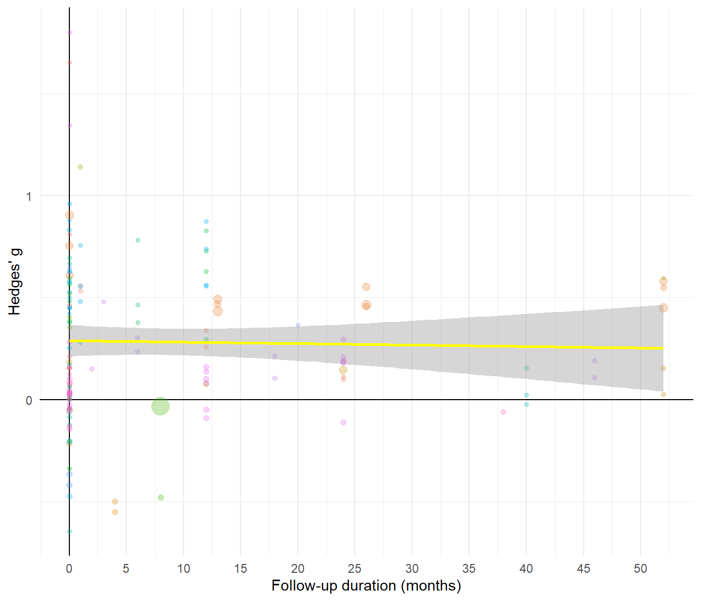{#fig-es-time-mental fig-pos='H' width=672}
:::
:::


:::

:::


## Multivariate structure

See spirtual study

# Step 3 - Standard Errors and Other Auxiliary Data

# Step 4 - Visualization of the Distribution of Effect Size Estimates

# Colophon

::: {.callout-note icon=false appearance="simple" title="Session Information" collapse=true #session-info}


::: {.cell}
::: {.cell-output .cell-output-stdout}

```
─ Session info ───────────────────────────────────────────────────────────────────────────────────
 setting  value
 version  R version 4.4.2 (2024-10-31 ucrt)
 os       Windows 11 x64 (build 22631)
 system   x86_64, mingw32
 ui       RTerm
 language (EN)
 collate  Danish_Denmark.utf8
 ctype    Danish_Denmark.utf8
 tz       Europe/Copenhagen
 date     2025-06-27
 pandoc   3.4 @ C:/RStudio-2025.05.0-496/resources/app/bin/quarto/bin/tools/ (via rmarkdown)

─ Packages ───────────────────────────────────────────────────────────────────────────────────────
 package      * version    date (UTC) lib source
 base64enc      0.1-3      2015-07-28 [1] CRAN (R 4.4.0)
 cli            3.6.3      2024-06-21 [1] CRAN (R 4.4.2)
 clubSandwich * 0.5.11     2024-06-20 [1] CRAN (R 4.4.2)
 colorspace     2.1-1      2024-07-26 [1] CRAN (R 4.4.2)
 digest         0.6.37     2024-08-19 [1] CRAN (R 4.4.2)
 dplyr        * 1.1.4      2023-11-17 [1] CRAN (R 4.4.2)
 evaluate       1.0.1      2024-10-10 [1] CRAN (R 4.4.2)
 fansi          1.0.6      2023-12-08 [1] CRAN (R 4.4.2)
 farver         2.1.2      2024-05-13 [1] CRAN (R 4.4.2)
 fastDummies  * 1.7.4      2024-08-16 [1] CRAN (R 4.4.2)
 fastmap        1.2.0      2024-05-15 [1] CRAN (R 4.4.2)
 forcats      * 1.0.0      2023-01-29 [1] CRAN (R 4.4.2)
 generics       0.1.3      2022-07-05 [1] CRAN (R 4.4.2)
 GGally       * 2.2.1      2024-02-14 [1] CRAN (R 4.4.3)
 ggExtra      * 0.10.1     2023-08-21 [1] CRAN (R 4.4.3)
 ggplot2      * 3.5.1      2024-04-23 [1] CRAN (R 4.4.2)
 ggrepel      * 0.9.6      2024-09-07 [1] CRAN (R 4.4.2)
 ggridges     * 0.5.6      2024-01-23 [1] CRAN (R 4.4.3)
 ggstats        0.9.0      2025-03-10 [1] CRAN (R 4.4.3)
 glue           1.8.0      2024-09-30 [1] CRAN (R 4.4.2)
 gtable         0.3.6      2024-10-25 [1] CRAN (R 4.4.2)
 hms            1.1.3      2023-03-21 [1] CRAN (R 4.4.2)
 htmltools      0.5.8.1    2024-04-04 [1] CRAN (R 4.4.2)
 htmlwidgets    1.6.4      2023-12-06 [1] CRAN (R 4.4.2)
 httpuv         1.6.15     2024-03-26 [1] CRAN (R 4.4.2)
 igraph       * 2.1.4      2025-01-23 [1] CRAN (R 4.4.3)
 janitor      * 2.2.1      2024-12-22 [1] CRAN (R 4.4.3)
 jsonlite       1.8.9      2024-09-20 [1] CRAN (R 4.4.2)
 kableExtra   * 1.4.0      2024-01-24 [1] CRAN (R 4.4.2)
 knitr        * 1.49       2024-11-08 [1] CRAN (R 4.4.2)
 labeling       0.4.3      2023-08-29 [1] CRAN (R 4.4.0)
 later          1.3.2      2023-12-06 [1] CRAN (R 4.4.2)
 lattice        0.22-6     2024-03-20 [1] CRAN (R 4.4.2)
 lifecycle      1.0.4      2023-11-07 [1] CRAN (R 4.4.2)
 lubridate    * 1.9.3      2023-09-27 [1] CRAN (R 4.4.2)
 magrittr       2.0.3      2022-03-30 [1] CRAN (R 4.4.2)
 mathjaxr       1.6-0      2022-02-28 [1] CRAN (R 4.4.2)
 Matrix       * 1.7-1      2024-10-18 [1] CRAN (R 4.4.2)
 metadat      * 1.2-0      2022-04-06 [1] CRAN (R 4.4.2)
 metafor      * 4.8-0      2025-01-28 [1] CRAN (R 4.4.2)
 MetBrewer    * 0.2.0      2022-03-21 [1] CRAN (R 4.4.3)
 mgcv           1.9-1      2023-12-21 [1] CRAN (R 4.4.2)
 mime           0.12       2021-09-28 [1] CRAN (R 4.4.0)
 miniUI         0.1.1.1    2018-05-18 [1] CRAN (R 4.4.2)
 munsell        0.5.1      2024-04-01 [1] CRAN (R 4.4.2)
 nlme           3.1-166    2024-08-14 [1] CRAN (R 4.4.2)
 numDeriv     * 2016.8-1.1 2019-06-06 [1] CRAN (R 4.4.0)
 pillar         1.9.0      2023-03-22 [1] CRAN (R 4.4.2)
 pkgconfig      2.0.3      2019-09-22 [1] CRAN (R 4.4.2)
 plyr           1.8.9      2023-10-02 [1] CRAN (R 4.4.2)
 promises       1.3.0      2024-04-05 [1] CRAN (R 4.4.2)
 purrr        * 1.0.2      2023-08-10 [1] CRAN (R 4.4.2)
 R6             2.5.1      2021-08-19 [1] CRAN (R 4.4.2)
 RColorBrewer   1.1-3      2022-04-03 [1] CRAN (R 4.4.0)
 Rcpp           1.0.13-1   2024-11-02 [1] CRAN (R 4.4.2)
 readr        * 2.1.5      2024-01-10 [1] CRAN (R 4.4.2)
 repr           1.1.7      2024-03-22 [1] CRAN (R 4.4.2)
 rlang        * 1.1.4      2024-06-04 [1] CRAN (R 4.4.2)
 rmarkdown      2.29       2024-11-04 [1] CRAN (R 4.4.2)
 rstudioapi     0.17.1     2024-10-22 [1] CRAN (R 4.4.2)
 sandwich       3.1-1      2024-09-15 [1] CRAN (R 4.4.2)
 scales         1.3.0      2023-11-28 [1] CRAN (R 4.4.2)
 sessioninfo    1.2.2      2021-12-06 [1] CRAN (R 4.4.2)
 shiny          1.9.1      2024-08-01 [1] CRAN (R 4.4.2)
 skimr        * 2.1.5      2022-12-23 [1] CRAN (R 4.4.2)
 snakecase      0.11.1     2023-08-27 [1] CRAN (R 4.4.3)
 stringi        1.8.4      2024-05-06 [1] CRAN (R 4.4.0)
 stringr      * 1.5.1      2023-11-14 [1] CRAN (R 4.4.2)
 svglite        2.1.3      2023-12-08 [1] CRAN (R 4.4.2)
 systemfonts    1.1.0      2024-05-15 [1] CRAN (R 4.4.2)
 tibble       * 3.2.1      2023-03-20 [1] CRAN (R 4.4.2)
 tidyr        * 1.3.1      2024-01-24 [1] CRAN (R 4.4.2)
 tidyselect     1.2.1      2024-03-11 [1] CRAN (R 4.4.2)
 tidyverse    * 2.0.0      2023-02-22 [1] CRAN (R 4.4.2)
 timechange     0.3.0      2024-01-18 [1] CRAN (R 4.4.2)
 tzdb           0.4.0      2023-05-12 [1] CRAN (R 4.4.2)
 utf8           1.2.4      2023-10-22 [1] CRAN (R 4.4.2)
 vctrs          0.6.5      2023-12-01 [1] CRAN (R 4.4.2)
 viridisLite    0.4.2      2023-05-02 [1] CRAN (R 4.4.2)
 withr          3.0.2      2024-10-28 [1] CRAN (R 4.4.2)
 xfun           0.49       2024-10-31 [1] CRAN (R 4.4.2)
 xml2           1.3.6      2023-12-04 [1] CRAN (R 4.4.2)
 xtable         1.8-4      2019-04-21 [1] CRAN (R 4.4.2)
 yaml           2.3.10     2024-07-26 [1] CRAN (R 4.4.1)
 zoo            1.8-12     2023-04-13 [1] CRAN (R 4.4.2)

 [1] C:/Users/B199526/AppData/Local/Programs/R/R-4.4.2/library

──────────────────────────────────────────────────────────────────────────────────────────────────
```


:::
:::


:::

