# Introduction 

This document contains the preliminary data analysis for the meta-analyses with dependent effects (PRIMED) in [@Dalgaard2025]. As we conduct separate analyses for reintegration (primary analysis) and mental health (secondary analysis) outcomes, we have divided the tabulation and visualization according to the two types of effect size estimates. In most cases, the main presentation of reintegration outcome data appears in the center column of the document, while the presentation of the mental health outcome data is shown in the right column. Where larger tables or visualizations are required, we have used tabsets to distinguish between reintegration and mental health analyses. To view the mental health presentation, select the 'Mental health' tab. To find the mental helath presentation, press on the 'Mental health' tab. In a few instances, reintegration and mental health outcomes are tabulated and visualized together to provide an overall view of the relationships between these two types of estimates. All packages that we have used to create this document, can be found in the next section. 


## R packages
Below, we present the R package we use in this document. For exact R package versions, see the [Session Information](#session-info) at the bottom of this document. 


::: {.cell}

```{.r .cell-code  code-fold="false"}
# Load packages -----------------------------------------------------------
library(knitr)
library(kableExtra)
library(skimr)
library(janitor)
library(tidyverse)
library(tidyr)
library(metafor)
library(clubSandwich)
library(fastDummies)  
library(ggrepel)
library(ggExtra)
library(ggridges)
library(MetBrewer)
library(GGally)
library(igraph)
library(fastDummies)
library(patchwork)
library(ggh4x)
```
:::


# Data manipulation - prepare data sets

In the following section, we create all the variables that are used in the main analyses of the review. Unfold the below code to see this exact manipulations. 

## Loading data

::: {.cell}

```{.r .cell-code}
# Loading the needed data for analysis
group_based_dat <- readRDS("Group-based interventions data.RDS") |> 
  # The post-measurement of Empowerment Scale seems flawed for the study by 
  # Barbic et al. 2009 we therefore we exclude it from the analysis
  filter(!(authors == "Barbic et al." & test_name == "The Empowerment Scale")) |> 
  mutate(
    author_year = paste(authors, year),
    study = paste(authors, year),
    study = stringi::stri_trans_general(study, "Latin-ASCII"),
    study = fct_relevel(study, sort)
  ) |> 
 # Remove unused outcomes
 filter(!str_detect(analysis_plan, "Unused"))
```
:::

## Main variable manipulation
Unfold the below code, to find the primary data manipulation for the overall data, including both all reintegrational as well as mental health outcomes. 


::: {.cell}

```{.r .cell-code}
gb_dat <- 
  group_based_dat |> 
  # Exclude the two binary outcomes
  filter(variable_type != "Binary") |>
  mutate(
    es_id = 1:n(),
    esid = es_id,
    
    # Main covariate adjusted effect cluster adjusted 
    gt_pop = if_else(!is.na(gt_post), gt_post, NA_real_),
    gt_pop = if_else(!is.na(gt_DD), gt_DD, gt_pop),
    gt_pop = if_else(!is.na(gt_adj), gt_adj, gt_pop),
    gt_pop = if_else(!is.na(gt_reg), gt_reg, gt_pop),
    gt_pop = if_else(!is.na(gt_DD_pop), gt_DD_pop, gt_pop),
    gt_pop = if_else(!is.na(gt_adj_pop), gt_adj_pop, gt_pop),
    
    vgt_pop = if_else(!is.na(vgt_post), vgt_post, NA_real_),
    vgt_pop = if_else(!is.na(vgt_DD), vgt_DD, vgt_pop),
    vgt_pop = if_else(!is.na(vgt_adj), vgt_adj, vgt_pop),
    vgt_pop = if_else(!is.na(vgt_reg), vgt_reg, vgt_pop),
    vgt_pop = if_else(!is.na(vgt_DD_pop), vgt_DD_pop, vgt_pop),
    vgt_pop = if_else(!is.na(vgt_adj_pop), vgt_adj_pop, vgt_pop),
    
    Wgt_pop = if_else(!is.na(Wgt_post), Wgt_post, NA_real_),
    Wgt_pop = if_else(!is.na(Wgt_DD), Wgt_DD, Wgt_pop),
    Wgt_pop = if_else(!is.na(Wgt_adj), Wgt_adj, Wgt_pop),
    Wgt_pop = if_else(!is.na(Wgt_reg), Wgt_reg, Wgt_pop),
    Wgt_pop = if_else(!is.na(Wgt_DD_pop), Wgt_DD_pop, Wgt_pop),
    Wgt_pop = if_else(!is.na(Wgt_adj_pop), Wgt_adj_pop, Wgt_pop),
    
    # Main covariate adjusted effect cluster adjusted 
    gt = if_else(!is.na(gt_post), gt_post, NA_real_),
    gt = if_else(!is.na(gt_DD), gt_DD, gt),
    gt = if_else(!is.na(gt_adj), gt_adj, gt),
    gt = if_else(!is.na(gt_reg), gt_reg, gt),
    
    vgt = if_else(!is.na(vgt_post), vgt_post, NA_real_),
    vgt = if_else(!is.na(vgt_DD), vgt_DD, vgt),
    vgt = if_else(!is.na(vgt_adj), vgt_adj, vgt),
    vgt = if_else(!is.na(vgt_reg), vgt_reg, vgt),
    
    Wgt = if_else(!is.na(Wgt_post), Wgt_post, NA_real_),
    Wgt = if_else(!is.na(Wgt_DD), Wgt_DD, Wgt),
    Wgt = if_else(!is.na(Wgt_adj), Wgt_adj, Wgt),
    Wgt = if_else(!is.na(Wgt_reg), Wgt_reg, Wgt),
    
    # Hedges g posttest only, adjusted for clustering
    # Imputing covariate-adjusted estimate when posttest calculation was not possible
    gt_post = if_else(is.na(gt_post) & !is.na(gt_reg), gt_reg, gt_post),
    gt_post = if_else(is.na(gt_post) & !is.na(gt_adj), gt_adj, gt_post),
    gt_post = if_else(is.na(gt_post) & !is.na(gt_DD), gt_DD, gt_post),
    
    vgt_post = if_else(is.na(vgt_post) & !is.na(vgt_reg), vgt_reg, vgt_post),
    vgt_post = if_else(is.na(vgt_post) & !is.na(vgt_adj), vgt_adj, vgt_post),
    vgt_post = if_else(is.na(vgt_post) & !is.na(vgt_DD), vgt_DD, vgt_post),
    
    Wgt_post = if_else(is.na(Wgt_post) & !is.na(Wgt_reg), Wgt_reg, Wgt_post),
    Wgt_post = if_else(is.na(Wgt_post) & !is.na(Wgt_adj), Wgt_adj, Wgt_post),
    Wgt_post = if_else(is.na(Wgt_post) & !is.na(Wgt_DD), Wgt_DD, Wgt_post),
    
    # Hedges' g posttest only, not-adjusted for clustering
    # Imputing covariate-adjusted estimate when posttest calculation was not possible
    g_post = if_else(is.na(g_post) & !is.na(g_reg), g_reg, g_post),
    g_post = if_else(is.na(g_post) & !is.na(g_adj), g_adj, g_post),
    g_post = if_else(is.na(g_post) & !is.na(g_DD), g_DD, g_post),
    
    vg_post = if_else(is.na(vg_post) & !is.na(vg_reg), vg_reg, vg_post),
    vg_post = if_else(is.na(vg_post) & !is.na(vg_adj), vg_adj, vg_post),
    vg_post = if_else(is.na(vg_post) & !is.na(vg_DD), vg_DD, vg_post),
    
    Wg_post = if_else(is.na(Wg_post) & !is.na(Wg_reg), Wg_reg, Wg_post),
    Wg_post = if_else(is.na(Wg_post) & !is.na(Wg_adj), Wg_adj, Wg_post),
    Wg_post = if_else(is.na(Wg_post) & !is.na(Wg_DD), Wg_DD, Wg_post),
    
    # Cohen's d posttest only, not-adjusted for clustering
    # Imputing covariate-adjusted estimate when posttest calculation was not possible
    d_post = if_else(is.na(d_post) & !is.na(d_reg), d_reg, d_post),
    d_post = if_else(is.na(d_post) & !is.na(d_adj), d_adj, d_post),
    d_post = if_else(is.na(d_post) & !is.na(d_DD), d_DD, d_post),
    
    vd_post = if_else(is.na(vd_post) & !is.na(vd_reg), vd_reg, vd_post),
    vd_post = if_else(is.na(vd_post) & !is.na(vd_adj), vd_adj, vd_post),
    vd_post = if_else(is.na(vd_post) & !is.na(vd_DD), vd_DD, vd_post),
    
    Wd_post = if_else(is.na(Wd_post) & !is.na(Wd_reg), Wd_reg, Wd_post),
    Wd_post = if_else(is.na(Wd_post) & !is.na(Wd_adj), Wd_adj, Wd_post),
    Wd_post = if_else(is.na(Wd_post) & !is.na(Wd_DD), Wd_DD, Wd_post),
    
    
    # Covariate adjusted Hedges' g, not cluster adjusted 
    g = if_else(!is.na(g_post), g_post, NA_real_),
    g = if_else(!is.na(g_DD), g_DD, g),
    g = if_else(!is.na(g_adj), g_adj, g),
    g = if_else(!is.na(g_reg), g_reg, g),
    
    vg = if_else(!is.na(vg_post), vg_post, NA_real_),
    vg = if_else(!is.na(vg_DD), vg_DD, vg),
    vg = if_else(!is.na(vg_adj), vg_adj, vg),
    vg = if_else(!is.na(vg_reg), vg_reg, vg),
    
    Wg = if_else(!is.na(Wg_post), Wg_post, NA_real_),
    Wg = if_else(!is.na(Wg_DD), Wg_DD, Wg),
    Wg = if_else(!is.na(Wg_adj), Wg_adj, Wg),
    Wg = if_else(!is.na(Wg_reg), Wg_reg, Wg),
    
    # Covariate-adjusted version of Cohen's d, neither cluster nor small sample adjusted
    d = if_else(!is.na(d_post), d_post, NA_real_),
    d = if_else(!is.na(d_DD), d_DD, d),
    d = if_else(!is.na(d_adj), d_adj, d),
    d = if_else(!is.na(d_reg), d_reg, d),
    
    vd = if_else(!is.na(vd_post), vd_post, NA_real_),
    vd = if_else(!is.na(vd_DD), vd_DD, vd),
    vd = if_else(!is.na(vd_adj), vd_adj, vd),
    vd = if_else(!is.na(vd_reg), vd_reg, vd),
    
    Wd = if_else(!is.na(Wd_post), Wd_post, NA_real_),
    Wd = if_else(!is.na(Wd_DD), Wd_DD, Wd),
    Wd = if_else(!is.na(Wd_adj), Wd_adj, Wd),
    Wd = if_else(!is.na(Wd_reg), Wd_reg, Wd),
    
    inv_sample_size = (1/N_t + 1/N_c),
    
    posttest_only = if_else(ppcor_method == "Posttest only", "Posttest only ES", "Pre-posttest adj. ES", missing = "Pre-posttest adj. ES"),
    
    # ESS = round(4/vgt), # Using cluster bias corrected sampling variance
    
    studyid = if_else(authors == "Gonzalez & Prihoda", 500, studyid), 
    
    trt_id = if_else(str_detect(study, "Schaf") & trt_name == "Relapse Prevention Training", 2, trt_id),
    
    cnt = if_else(cnt == "USA", "US", cnt),
    
    design = if_else(design  == "QES-pretest", "QES", design),
    
    # MHV: Jeg synes ikke det er en god ide at ændre CRCT til RCT. Jeg vil gerne kunne se forskel.  
    # design = ifelse(design  == "CRCT", "RCT", design), 
    
    assessment = if_else(assessment == "Self  assesment", "Self assesment", assessment),
    
    randomization = if_else(randomization == "Simple Block Randomization", "Block randomized",
                            randomization),
    randomization = if_else(randomization == "Simple with permuted blocks, stratified by site",
                            "Stratified randomization", randomization),
    
    randomization = if_else(randomization == "Stratified?",
                            "Stratified randomization", randomization),
    
    randomization = if_else(is.na(randomization) & studyid == 102, 
                            "Stratified randomization", randomization),
    
    randomization = if_else(randomization == "Ratio and block randomized",
                            "Block randomized", randomization),
    
    randomization = if_else(randomization == "Block randomized stratified by site",
                            "Block randomized", randomization),
    
    randomization = if_else(randomization == "Resticted and adapted randomization (i.e. minimization)",
                            "Stratified randomization", randomization),
    
    randomization = if_else(randomization == "Unequal simple randomization",
                            "Block randomized", randomization),
    
    randomization = if_else(randomization == "Within-site basis and unequal allocation ratio",
                            "Stratified randomization", randomization),
    
    trt_type = if_else(trt_type == "Group-based  Cognitive Behavioral Therapy", 
                       "Group based Cognitive Behavioural Therapy", trt_type),
    trt_type = if_else(trt_type == "Group-based Cognitive Behavioral Therapy", 
                       "Group based Cognitive Behavioural Therapy", trt_type),
    trt_type = if_else(trt_type =="Group psychoeducation & Social skill training", 
                       "Group psychoeducation & Social Skill Training", trt_type),
    trt_type = if_else(trt_type =="Group psychoeducation", 
                       "Group Psychoeducation", trt_type),
    trt_type = if_else(trt_type =="Group psychoeducation & Social Skill Training", 
                       "Group Psychoeducation & Social Skill Training", trt_type),
    trt_type = if_else(trt_type =="Education and Illness Management", 
                       "Group Psychoeducation & Social Skill Training", trt_type),
    trt_type = if_else(trt_type =="Illness management", 
                       "Illness Management", trt_type),
    
    sample_factors = if_else(sample_factors =="Older with depression and anxiety", 
                             "Mixed", sample_factors), 
    sample_factors = if_else(sample_factors =="All suffered from severe mental illness", 
                             "Shared Social problem(s)/challenge(s)", sample_factors),
    sample_factors = if_else(sample_factors =="Shared origin and psychological distress", 
                             "Mixed", sample_factors),
    sample_factors = if_else(sample_factors =="persons with major psychiatric problems", 
                             "Shared Social problem(s)/challenge(s)", sample_factors),
    
    analysis_plan = if_else(analysis_plan == "Unused", "Unused outcomes", analysis_plan), 
    analysis_plan = case_match(
      analysis_plan,
      "Hope, Empowerment & Self-efficacy" ~ "Hope, empowerment & self-efficacy",
      "Wellbeing and Quality of Life" ~ "Wellbeing and quality of life",
      "All mental health outcomes" ~ "General mental health",
      "All mental health outcomes/Anxiety" ~ "Anxiety",
      "All mental health outcomes/Depression" ~ "Depression",
      "All mental health outcomes/Symptoms of psychosis" ~ "Symptoms of psychosis",
      "All mental health outcomes/Negative symptoms" ~ "Symptoms of psychosis",
      .default = analysis_plan
    ),
    
    test_type = if_else(test_type == "Clinical administered", "Clinician-rated measure", test_type),
    test_type = if_else(test_type == "Clinical interviews", "Clinician-rated measure", test_type),
    test_type = if_else(test_type == "Self report", "Self-reported", test_type),
    test_type = if_else(test_type == "Self report through clinical interview", "Self-reported", test_type),
    test_type = if_else(test_type == "Self-reported via diagnostic interview", "Self-reported", test_type), 
    
    measure_type = if_else(measure_type == "Pre-post with controls", "Post-intervention", measure_type),
    
    cluster_treatment = if_else(cluster_treatment == "Hierarchical mixed models", "Mixed-model", cluster_treatment),
    
    cluster_treatment = if_else(cluster_treatment == "Multilevel analysis and clustered standard errors", 
                                "Multilevel analysis", cluster_treatment),
    
    rob_tool = if_else(rob_tool == "Rob2", "RoB2", rob_tool),
    rob_tool = if_else(rob_tool == "Rob2 CRCT", "RoB2", rob_tool),
    
    analysis_strategy = if_else(str_detect(study, "Michalak"), "ITT", analysis_strategy),
    
    conventional = if_else(protocol != "Yes", 1, 0),
    # Smith et al. 2021 drew on a retropective protocol
    conventional = if_else(study == "Smith et al. 2021", 1, conventional),
    prereg_chr = if_else(conventional == 0, "Preregistered", "Not preregistered"),
    
    # For publication/selection/small study bias testing
    Wse = sqrt(Wgt),
    t_i = gt/sqrt(Wgt),
    
    ESS_t = round(N_t/(1+(avg_cl_size - 1)*0.1)),
    ESS_c = round(N_c/(1+(avg_cl_size - 1)*0.1)),
    ESS_total = round(N_total/(1+(avg_cl_size - 1)*0.1)),
    
    outcome_construct = case_match(
      analysis_plan,
      # Mental health outcomes
      c("General mental health", "Anxiety",
        "Depression", "Symptoms of psychosis") ~ "Mental health outcome",
      .default = "Reintegrational outcome"
    ),
    
    # Changing to numeric vectors
    across(c(age_mean_sample:male_pct_t, sessions_per_week), ~as.numeric(.x)),
    
    # Make weighted mean weighted by the group sample size 
    age_mean = if_else(
      is.na(age_mean_sample), 
      (age_mean_t*N_t + age_mean_c*N_c)/(N_t + N_c), 
      age_mean_sample
    ),
    
    male_pct = if_else(
      is.na(male_pct_sample),
      (male_pct_t*N_t + male_pct_c*N_c)/(N_t + N_c),
      male_pct_sample
    ),
    
    # duration_weeks has extract errors
    duration_in_weeks = time_from_baseline_weeks - time_after_end_intervention_weeks,
    total_number_of_sessions = round(sessions_per_week * duration_in_weeks),
    
    CBT_int = if_else(trt_group == "group-based CBT", "CBT", "Other"), 
    
    QES_design = if_else(design == "QES", "QES", "RCT"),
    
    overall_rob = case_match(
      Overall, 
      c("Serious", "High") ~ "Serious/High",
      c("Some concerns", "Moderate") ~ "Some concerns/Moderate",
      .default = "Low"
    ),
    
    overall_rob = factor(overall_rob, levels = c("Low", "Some concerns/Moderate", "Serious/High")),
    
    across(schizophrenia_or_primary_psychotic_disorder:dissociative_identity_disorder, ~ replace_na(.x, 0)),
    handle_multilevel = as.numeric(if_any(adj_fct_DD:adj_fct_reg, ~ grepl("gamma", .))),
    handle_multilevel = if_else(handle_multilevel == 1, "Yes", "No")
    
 ) |> 
  rowwise() |> 
  mutate(
    diagnosis = {
      col_ones <- names(
        across(.cols = schizophrenia_or_primary_psychotic_disorder:dissociative_identity_disorder)
        )[unlist(
          c_across(schizophrenia_or_primary_psychotic_disorder:dissociative_identity_disorder)
          ) == 1]
      n_ones <- length(col_ones)
      if (n_ones == 1) col_ones
      else if (n_ones > 1) "mixed"
    }
  ) |> 
  ungroup() |> 
  mutate(
    schizophrenia = if_else(str_detect(diagnosis, "schizophrenia"), "Schizophrenia", "Other")
  ) |> 
  mutate(
    # Used to remove ITT outcomes from Cano-Vindel et al. 2021 and Craigie & Nathan 2009 
    n_analysis_strategies = n_distinct(analysis_strategy),
    .by = study
  ) |> 
  # Removing ITT analyses from Cano-Vindel et al. 2021 and Craigie & Nathan 2009 
  filter(!c(str_detect(study, "Cano|Craigie|Woj") & analysis_strategy == "ITT")) 
```
:::


::: {.cell}

```{.r .cell-code}
time_vcalc <- c(
  # Acarturk
  1,2,1,2,1,2,
  # Barbic
  1,1,1,
  # Bond
  1,1, 
  # Baekkelund, 
  1,1,2,2,
  # Cano-Vindel
  rep(c(1:4), each = 10),
  # Craigie & Nathan
  1,1,1,
  # Crawford (multi-treatment)
  rep(c(1,2), each = 2, 4),
  # Druss 2010
  1,1,
  #Druss 2018
  1,1,1,2,2,2,
  # Dyck
  1, 
  # Gestel-Timmermans
  rep(c(1,2), 5),
  # Gatz
  rep(1,5),
  # Gonzalaez
  rep(1,2),
  # Gordon 
  rep(1,4),
  # Gutman
  rep(1,2),
  # Hagen
  rep(1,4),
  # Halperin
  rep(1, 6),
  # Haslem
  rep(1,3),
  # Hilden
  rep(1,7),
  # Himle
  rep(c(1,2), each = 6),
  #Jacob
  rep(c(1,2), each = 5),
  #James
  rep(1,5),
  # Kanie
  rep(1,4),
  # Lim
  rep(1,6),
  # Llyod-Evans
  rep(1,4),
  # Madigan
  rep(c(1,2), each = 6),
  # McCay 2006
  rep(1,4),
  # McCay 2007
  rep(1,3),
  # Michalak (multi-treatment)
  rep(1,14),
  # Morley 
  rep(1,4),
  # Morton
  rep(1,5),
  # Patterson
  rep(c(1,2), each = 5),
  # Popolo
  rep(1,2),
  # Rabenstein
  rep(1,3),
  # Rosenblum 
  rep(1,4),
  # Russinova 
  rep(c(1,2), each = 5),
  # Rusch
  rep(c(1,2), each = 6),
  # Sacks
  rep(1,5),
  # Sajatovic
  rep(c(1:3), each = 3),
  # Saloheimo
  1, 
  # Schrank
  rep(1,6),
  # Schafer (multi-treatment)
  rep(c(2,3,1), each = 2, 6),
  # Somers
  rep(1,5),
  # Tjaden
  rep(c(1,2), each = 4),
  # Valiente 
  rep(1,16),
  # Volpe
  rep(1,4),
  # Wojtalik 
  rep(1,2),
  #Wuthrich
  rep(1,4),
  # Smith 
  rep(1,3)
) 

gb_dat$time <- time_vcalc

saveRDS(gb_dat, file = "Data/gb_dat.rds")
```
:::


## Creating primary and secondary data

Below, we separate the data by reintegrational (primary analysis) and mental health outcomes (secondary analyses)

::: {.panel-tabset}
## Reintegration data

A general overview of the main data, we use for analyses of reintegrational outcomes can be found in the scroll box below.


::: {#tbl-reint-dat .cell .tbl-cap-location-top tbl-cap='Data with reintegration outcomes.'}

```{.r .cell-code}
reintegration_dat <- 
  gb_dat |> 
  filter(outcome_construct == "Reintegrational outcome") 

saveRDS(reintegration_dat, file = "reintegration_dat.rds")

reint_overview <- 
  reintegration_dat |> 
  select(
    study, eppi_id, esid, N_t, N_c, N_total, inv_sample_size, gt_pop, vgt_pop, Wgt_pop, gt, vgt, Wgt, Wse, 
    prereg_chr, conventional, analysis_plan, Overall, D5, D7, timing
  )

reint_overview |> 
  mutate(
    p_val = 2 * ( 1 - pnorm( abs(gt_pop) / sqrt(vgt_pop) ) )
  ) |> 
  select(
    `Authors (year)` = study, N_t, N_c,
    `Outcome construct` = analysis_plan, gt_pop, vgt_pop, Wgt, Wse, p_val, 
    `No protocol` = conventional, `Overall RoB` = Overall
  ) |> 
  kable(digits=3)  |> 
  kable_styling(
    bootstrap_options = c("striped", "hover"),
    font_size = 10
  ) |> 
  scroll_box(width = "100%", height = "600px", fixed_thead = TRUE)
```

::: {.cell-output-display}
`````{=html}
<div style="border: 1px solid #ddd; padding: 0px; overflow-y: scroll; height:600px; overflow-x: scroll; width:100%; "><table class="table table-striped table-hover" style="font-size: 10px; margin-left: auto; margin-right: auto;">
 <thead>
  <tr>
   <th style="text-align:left;position: sticky; top:0; background-color: #FFFFFF;"> Authors (year) </th>
   <th style="text-align:right;position: sticky; top:0; background-color: #FFFFFF;"> N_t </th>
   <th style="text-align:right;position: sticky; top:0; background-color: #FFFFFF;"> N_c </th>
   <th style="text-align:left;position: sticky; top:0; background-color: #FFFFFF;"> Outcome construct </th>
   <th style="text-align:right;position: sticky; top:0; background-color: #FFFFFF;"> gt_pop </th>
   <th style="text-align:right;position: sticky; top:0; background-color: #FFFFFF;"> vgt_pop </th>
   <th style="text-align:right;position: sticky; top:0; background-color: #FFFFFF;"> Wgt </th>
   <th style="text-align:right;position: sticky; top:0; background-color: #FFFFFF;"> Wse </th>
   <th style="text-align:right;position: sticky; top:0; background-color: #FFFFFF;"> p_val </th>
   <th style="text-align:right;position: sticky; top:0; background-color: #FFFFFF;"> No protocol </th>
   <th style="text-align:left;position: sticky; top:0; background-color: #FFFFFF;"> Overall RoB </th>
  </tr>
 </thead>
<tbody>
  <tr>
   <td style="text-align:left;"> Acarturk et al. 2022 </td>
   <td style="text-align:right;"> 24 </td>
   <td style="text-align:right;"> 22 </td>
   <td style="text-align:left;"> Wellbeing and quality of life </td>
   <td style="text-align:right;"> 0.314 </td>
   <td style="text-align:right;"> 0.196 </td>
   <td style="text-align:right;"> 0.195 </td>
   <td style="text-align:right;"> 0.442 </td>
   <td style="text-align:right;"> 0.478 </td>
   <td style="text-align:right;"> 0 </td>
   <td style="text-align:left;"> Some concerns </td>
  </tr>
  <tr>
   <td style="text-align:left;"> Acarturk et al. 2022 </td>
   <td style="text-align:right;"> 24 </td>
   <td style="text-align:right;"> 22 </td>
   <td style="text-align:left;"> Wellbeing and quality of life </td>
   <td style="text-align:right;"> -0.103 </td>
   <td style="text-align:right;"> 0.091 </td>
   <td style="text-align:right;"> 0.091 </td>
   <td style="text-align:right;"> 0.301 </td>
   <td style="text-align:right;"> 0.733 </td>
   <td style="text-align:right;"> 0 </td>
   <td style="text-align:left;"> High </td>
  </tr>
  <tr>
   <td style="text-align:left;"> Barbic et al. 2009 </td>
   <td style="text-align:right;"> 16 </td>
   <td style="text-align:right;"> 17 </td>
   <td style="text-align:left;"> Hope, empowerment &amp; self-efficacy </td>
   <td style="text-align:right;"> 0.443 </td>
   <td style="text-align:right;"> 0.162 </td>
   <td style="text-align:right;"> 0.159 </td>
   <td style="text-align:right;"> 0.399 </td>
   <td style="text-align:right;"> 0.272 </td>
   <td style="text-align:right;"> 1 </td>
   <td style="text-align:left;"> Some concerns </td>
  </tr>
  <tr>
   <td style="text-align:left;"> Barbic et al. 2009 </td>
   <td style="text-align:right;"> 16 </td>
   <td style="text-align:right;"> 17 </td>
   <td style="text-align:left;"> Wellbeing and quality of life </td>
   <td style="text-align:right;"> -0.069 </td>
   <td style="text-align:right;"> 0.159 </td>
   <td style="text-align:right;"> 0.159 </td>
   <td style="text-align:right;"> 0.399 </td>
   <td style="text-align:right;"> 0.863 </td>
   <td style="text-align:right;"> 1 </td>
   <td style="text-align:left;"> Some concerns </td>
  </tr>
  <tr>
   <td style="text-align:left;"> Barbic et al. 2009 </td>
   <td style="text-align:right;"> 16 </td>
   <td style="text-align:right;"> 17 </td>
   <td style="text-align:left;"> Hope, empowerment &amp; self-efficacy </td>
   <td style="text-align:right;"> 0.548 </td>
   <td style="text-align:right;"> 0.164 </td>
   <td style="text-align:right;"> 0.159 </td>
   <td style="text-align:right;"> 0.399 </td>
   <td style="text-align:right;"> 0.176 </td>
   <td style="text-align:right;"> 1 </td>
   <td style="text-align:left;"> Some concerns </td>
  </tr>
  <tr>
   <td style="text-align:left;"> Bond et al. 2015 </td>
   <td style="text-align:right;"> 43 </td>
   <td style="text-align:right;"> 42 </td>
   <td style="text-align:left;"> Hope, empowerment &amp; self-efficacy </td>
   <td style="text-align:right;"> 0.000 </td>
   <td style="text-align:right;"> 0.094 </td>
   <td style="text-align:right;"> 0.094 </td>
   <td style="text-align:right;"> 0.306 </td>
   <td style="text-align:right;"> 1.000 </td>
   <td style="text-align:right;"> 1 </td>
   <td style="text-align:left;"> Some concerns </td>
  </tr>
  <tr>
   <td style="text-align:left;"> Bond et al. 2015 </td>
   <td style="text-align:right;"> 43 </td>
   <td style="text-align:right;"> 41 </td>
   <td style="text-align:left;"> Psychiatric hospitalization </td>
   <td style="text-align:right;"> 0.309 </td>
   <td style="text-align:right;"> 0.095 </td>
   <td style="text-align:right;"> 0.094 </td>
   <td style="text-align:right;"> 0.307 </td>
   <td style="text-align:right;"> 0.316 </td>
   <td style="text-align:right;"> 1 </td>
   <td style="text-align:left;"> Some concerns </td>
  </tr>
  <tr>
   <td style="text-align:left;"> Baekkelund et al. 2022 </td>
   <td style="text-align:right;"> 29 </td>
   <td style="text-align:right;"> 30 </td>
   <td style="text-align:left;"> Social functioning (degree of impairment) </td>
   <td style="text-align:right;"> -0.082 </td>
   <td style="text-align:right;"> 0.078 </td>
   <td style="text-align:right;"> 0.082 </td>
   <td style="text-align:right;"> 0.286 </td>
   <td style="text-align:right;"> 0.769 </td>
   <td style="text-align:right;"> 0 </td>
   <td style="text-align:left;"> Low </td>
  </tr>
  <tr>
   <td style="text-align:left;"> Baekkelund et al. 2022 </td>
   <td style="text-align:right;"> 29 </td>
   <td style="text-align:right;"> 30 </td>
   <td style="text-align:left;"> Social functioning (degree of impairment) </td>
   <td style="text-align:right;"> 0.142 </td>
   <td style="text-align:right;"> 0.084 </td>
   <td style="text-align:right;"> 0.088 </td>
   <td style="text-align:right;"> 0.297 </td>
   <td style="text-align:right;"> 0.624 </td>
   <td style="text-align:right;"> 0 </td>
   <td style="text-align:left;"> Low </td>
  </tr>
  <tr>
   <td style="text-align:left;"> Cano-Vindel et al. 2021 </td>
   <td style="text-align:right;"> 315 </td>
   <td style="text-align:right;"> 316 </td>
   <td style="text-align:left;"> Social functioning (degree of impairment) </td>
   <td style="text-align:right;"> 0.259 </td>
   <td style="text-align:right;"> 0.006 </td>
   <td style="text-align:right;"> 0.006 </td>
   <td style="text-align:right;"> 0.080 </td>
   <td style="text-align:right;"> 0.001 </td>
   <td style="text-align:right;"> 0 </td>
   <td style="text-align:left;"> Low </td>
  </tr>
  <tr>
   <td style="text-align:left;"> Cano-Vindel et al. 2021 </td>
   <td style="text-align:right;"> 315 </td>
   <td style="text-align:right;"> 316 </td>
   <td style="text-align:left;"> Social functioning (degree of impairment) </td>
   <td style="text-align:right;"> 0.428 </td>
   <td style="text-align:right;"> 0.005 </td>
   <td style="text-align:right;"> 0.005 </td>
   <td style="text-align:right;"> 0.072 </td>
   <td style="text-align:right;"> 0.000 </td>
   <td style="text-align:right;"> 0 </td>
   <td style="text-align:left;"> Low </td>
  </tr>
  <tr>
   <td style="text-align:left;"> Cano-Vindel et al. 2021 </td>
   <td style="text-align:right;"> 315 </td>
   <td style="text-align:right;"> 316 </td>
   <td style="text-align:left;"> Social functioning (degree of impairment) </td>
   <td style="text-align:right;"> 0.439 </td>
   <td style="text-align:right;"> 0.007 </td>
   <td style="text-align:right;"> 0.007 </td>
   <td style="text-align:right;"> 0.082 </td>
   <td style="text-align:right;"> 0.000 </td>
   <td style="text-align:right;"> 0 </td>
   <td style="text-align:left;"> Low </td>
  </tr>
  <tr>
   <td style="text-align:left;"> Cano-Vindel et al. 2021 </td>
   <td style="text-align:right;"> 315 </td>
   <td style="text-align:right;"> 316 </td>
   <td style="text-align:left;"> Wellbeing and quality of life </td>
   <td style="text-align:right;"> 0.565 </td>
   <td style="text-align:right;"> 0.006 </td>
   <td style="text-align:right;"> 0.006 </td>
   <td style="text-align:right;"> 0.076 </td>
   <td style="text-align:right;"> 0.000 </td>
   <td style="text-align:right;"> 0 </td>
   <td style="text-align:left;"> Low </td>
  </tr>
  <tr>
   <td style="text-align:left;"> Cano-Vindel et al. 2021 </td>
   <td style="text-align:right;"> 315 </td>
   <td style="text-align:right;"> 316 </td>
   <td style="text-align:left;"> Wellbeing and quality of life </td>
   <td style="text-align:right;"> 0.593 </td>
   <td style="text-align:right;"> 0.005 </td>
   <td style="text-align:right;"> 0.005 </td>
   <td style="text-align:right;"> 0.069 </td>
   <td style="text-align:right;"> 0.000 </td>
   <td style="text-align:right;"> 0 </td>
   <td style="text-align:left;"> Low </td>
  </tr>
  <tr>
   <td style="text-align:left;"> Cano-Vindel et al. 2021 </td>
   <td style="text-align:right;"> 315 </td>
   <td style="text-align:right;"> 316 </td>
   <td style="text-align:left;"> Wellbeing and quality of life </td>
   <td style="text-align:right;"> 0.305 </td>
   <td style="text-align:right;"> 0.005 </td>
   <td style="text-align:right;"> 0.005 </td>
   <td style="text-align:right;"> 0.069 </td>
   <td style="text-align:right;"> 0.000 </td>
   <td style="text-align:right;"> 0 </td>
   <td style="text-align:left;"> Low </td>
  </tr>
  <tr>
   <td style="text-align:left;"> Cano-Vindel et al. 2021 </td>
   <td style="text-align:right;"> 315 </td>
   <td style="text-align:right;"> 316 </td>
   <td style="text-align:left;"> Wellbeing and quality of life </td>
   <td style="text-align:right;"> 0.389 </td>
   <td style="text-align:right;"> 0.007 </td>
   <td style="text-align:right;"> 0.007 </td>
   <td style="text-align:right;"> 0.083 </td>
   <td style="text-align:right;"> 0.000 </td>
   <td style="text-align:right;"> 0 </td>
   <td style="text-align:left;"> Low </td>
  </tr>
  <tr>
   <td style="text-align:left;"> Cano-Vindel et al. 2021 </td>
   <td style="text-align:right;"> 273 </td>
   <td style="text-align:right;"> 238 </td>
   <td style="text-align:left;"> Social functioning (degree of impairment) </td>
   <td style="text-align:right;"> 0.066 </td>
   <td style="text-align:right;"> 0.008 </td>
   <td style="text-align:right;"> 0.008 </td>
   <td style="text-align:right;"> 0.088 </td>
   <td style="text-align:right;"> 0.450 </td>
   <td style="text-align:right;"> 0 </td>
   <td style="text-align:left;"> Low </td>
  </tr>
  <tr>
   <td style="text-align:left;"> Cano-Vindel et al. 2021 </td>
   <td style="text-align:right;"> 273 </td>
   <td style="text-align:right;"> 238 </td>
   <td style="text-align:left;"> Social functioning (degree of impairment) </td>
   <td style="text-align:right;"> 0.128 </td>
   <td style="text-align:right;"> 0.006 </td>
   <td style="text-align:right;"> 0.006 </td>
   <td style="text-align:right;"> 0.079 </td>
   <td style="text-align:right;"> 0.105 </td>
   <td style="text-align:right;"> 0 </td>
   <td style="text-align:left;"> Low </td>
  </tr>
  <tr>
   <td style="text-align:left;"> Cano-Vindel et al. 2021 </td>
   <td style="text-align:right;"> 273 </td>
   <td style="text-align:right;"> 238 </td>
   <td style="text-align:left;"> Social functioning (degree of impairment) </td>
   <td style="text-align:right;"> 0.224 </td>
   <td style="text-align:right;"> 0.008 </td>
   <td style="text-align:right;"> 0.008 </td>
   <td style="text-align:right;"> 0.090 </td>
   <td style="text-align:right;"> 0.013 </td>
   <td style="text-align:right;"> 0 </td>
   <td style="text-align:left;"> Low </td>
  </tr>
  <tr>
   <td style="text-align:left;"> Cano-Vindel et al. 2021 </td>
   <td style="text-align:right;"> 273 </td>
   <td style="text-align:right;"> 238 </td>
   <td style="text-align:left;"> Wellbeing and quality of life </td>
   <td style="text-align:right;"> 0.301 </td>
   <td style="text-align:right;"> 0.007 </td>
   <td style="text-align:right;"> 0.007 </td>
   <td style="text-align:right;"> 0.083 </td>
   <td style="text-align:right;"> 0.000 </td>
   <td style="text-align:right;"> 0 </td>
   <td style="text-align:left;"> Low </td>
  </tr>
  <tr>
   <td style="text-align:left;"> Cano-Vindel et al. 2021 </td>
   <td style="text-align:right;"> 273 </td>
   <td style="text-align:right;"> 238 </td>
   <td style="text-align:left;"> Wellbeing and quality of life </td>
   <td style="text-align:right;"> 0.308 </td>
   <td style="text-align:right;"> 0.006 </td>
   <td style="text-align:right;"> 0.006 </td>
   <td style="text-align:right;"> 0.076 </td>
   <td style="text-align:right;"> 0.000 </td>
   <td style="text-align:right;"> 0 </td>
   <td style="text-align:left;"> Low </td>
  </tr>
  <tr>
   <td style="text-align:left;"> Cano-Vindel et al. 2021 </td>
   <td style="text-align:right;"> 273 </td>
   <td style="text-align:right;"> 238 </td>
   <td style="text-align:left;"> Wellbeing and quality of life </td>
   <td style="text-align:right;"> 0.211 </td>
   <td style="text-align:right;"> 0.006 </td>
   <td style="text-align:right;"> 0.006 </td>
   <td style="text-align:right;"> 0.076 </td>
   <td style="text-align:right;"> 0.005 </td>
   <td style="text-align:right;"> 0 </td>
   <td style="text-align:left;"> Low </td>
  </tr>
  <tr>
   <td style="text-align:left;"> Cano-Vindel et al. 2021 </td>
   <td style="text-align:right;"> 273 </td>
   <td style="text-align:right;"> 238 </td>
   <td style="text-align:left;"> Wellbeing and quality of life </td>
   <td style="text-align:right;"> 0.194 </td>
   <td style="text-align:right;"> 0.008 </td>
   <td style="text-align:right;"> 0.008 </td>
   <td style="text-align:right;"> 0.091 </td>
   <td style="text-align:right;"> 0.033 </td>
   <td style="text-align:right;"> 0 </td>
   <td style="text-align:left;"> Low </td>
  </tr>
  <tr>
   <td style="text-align:left;"> Cano-Vindel et al. 2021 </td>
   <td style="text-align:right;"> 229 </td>
   <td style="text-align:right;"> 204 </td>
   <td style="text-align:left;"> Social functioning (degree of impairment) </td>
   <td style="text-align:right;"> 0.342 </td>
   <td style="text-align:right;"> 0.009 </td>
   <td style="text-align:right;"> 0.009 </td>
   <td style="text-align:right;"> 0.095 </td>
   <td style="text-align:right;"> 0.000 </td>
   <td style="text-align:right;"> 0 </td>
   <td style="text-align:left;"> Low </td>
  </tr>
  <tr>
   <td style="text-align:left;"> Cano-Vindel et al. 2021 </td>
   <td style="text-align:right;"> 229 </td>
   <td style="text-align:right;"> 204 </td>
   <td style="text-align:left;"> Social functioning (degree of impairment) </td>
   <td style="text-align:right;"> 0.357 </td>
   <td style="text-align:right;"> 0.008 </td>
   <td style="text-align:right;"> 0.007 </td>
   <td style="text-align:right;"> 0.086 </td>
   <td style="text-align:right;"> 0.000 </td>
   <td style="text-align:right;"> 0 </td>
   <td style="text-align:left;"> Low </td>
  </tr>
  <tr>
   <td style="text-align:left;"> Cano-Vindel et al. 2021 </td>
   <td style="text-align:right;"> 229 </td>
   <td style="text-align:right;"> 204 </td>
   <td style="text-align:left;"> Social functioning (degree of impairment) </td>
   <td style="text-align:right;"> 0.403 </td>
   <td style="text-align:right;"> 0.010 </td>
   <td style="text-align:right;"> 0.010 </td>
   <td style="text-align:right;"> 0.098 </td>
   <td style="text-align:right;"> 0.000 </td>
   <td style="text-align:right;"> 0 </td>
   <td style="text-align:left;"> Low </td>
  </tr>
  <tr>
   <td style="text-align:left;"> Cano-Vindel et al. 2021 </td>
   <td style="text-align:right;"> 229 </td>
   <td style="text-align:right;"> 204 </td>
   <td style="text-align:left;"> Wellbeing and quality of life </td>
   <td style="text-align:right;"> 0.381 </td>
   <td style="text-align:right;"> 0.008 </td>
   <td style="text-align:right;"> 0.008 </td>
   <td style="text-align:right;"> 0.091 </td>
   <td style="text-align:right;"> 0.000 </td>
   <td style="text-align:right;"> 0 </td>
   <td style="text-align:left;"> Low </td>
  </tr>
  <tr>
   <td style="text-align:left;"> Cano-Vindel et al. 2021 </td>
   <td style="text-align:right;"> 229 </td>
   <td style="text-align:right;"> 204 </td>
   <td style="text-align:left;"> Wellbeing and quality of life </td>
   <td style="text-align:right;"> 0.232 </td>
   <td style="text-align:right;"> 0.007 </td>
   <td style="text-align:right;"> 0.007 </td>
   <td style="text-align:right;"> 0.082 </td>
   <td style="text-align:right;"> 0.005 </td>
   <td style="text-align:right;"> 0 </td>
   <td style="text-align:left;"> Low </td>
  </tr>
  <tr>
   <td style="text-align:left;"> Cano-Vindel et al. 2021 </td>
   <td style="text-align:right;"> 229 </td>
   <td style="text-align:right;"> 204 </td>
   <td style="text-align:left;"> Wellbeing and quality of life </td>
   <td style="text-align:right;"> 0.083 </td>
   <td style="text-align:right;"> 0.007 </td>
   <td style="text-align:right;"> 0.007 </td>
   <td style="text-align:right;"> 0.082 </td>
   <td style="text-align:right;"> 0.313 </td>
   <td style="text-align:right;"> 0 </td>
   <td style="text-align:left;"> Low </td>
  </tr>
  <tr>
   <td style="text-align:left;"> Cano-Vindel et al. 2021 </td>
   <td style="text-align:right;"> 229 </td>
   <td style="text-align:right;"> 204 </td>
   <td style="text-align:left;"> Wellbeing and quality of life </td>
   <td style="text-align:right;"> 0.179 </td>
   <td style="text-align:right;"> 0.010 </td>
   <td style="text-align:right;"> 0.010 </td>
   <td style="text-align:right;"> 0.099 </td>
   <td style="text-align:right;"> 0.072 </td>
   <td style="text-align:right;"> 0 </td>
   <td style="text-align:left;"> Low </td>
  </tr>
  <tr>
   <td style="text-align:left;"> Cano-Vindel et al. 2021 </td>
   <td style="text-align:right;"> 208 </td>
   <td style="text-align:right;"> 180 </td>
   <td style="text-align:left;"> Social functioning (degree of impairment) </td>
   <td style="text-align:right;"> 0.455 </td>
   <td style="text-align:right;"> 0.010 </td>
   <td style="text-align:right;"> 0.010 </td>
   <td style="text-align:right;"> 0.101 </td>
   <td style="text-align:right;"> 0.000 </td>
   <td style="text-align:right;"> 0 </td>
   <td style="text-align:left;"> Low </td>
  </tr>
  <tr>
   <td style="text-align:left;"> Cano-Vindel et al. 2021 </td>
   <td style="text-align:right;"> 208 </td>
   <td style="text-align:right;"> 180 </td>
   <td style="text-align:left;"> Social functioning (degree of impairment) </td>
   <td style="text-align:right;"> 0.457 </td>
   <td style="text-align:right;"> 0.008 </td>
   <td style="text-align:right;"> 0.008 </td>
   <td style="text-align:right;"> 0.091 </td>
   <td style="text-align:right;"> 0.000 </td>
   <td style="text-align:right;"> 0 </td>
   <td style="text-align:left;"> Low </td>
  </tr>
  <tr>
   <td style="text-align:left;"> Cano-Vindel et al. 2021 </td>
   <td style="text-align:right;"> 208 </td>
   <td style="text-align:right;"> 180 </td>
   <td style="text-align:left;"> Social functioning (degree of impairment) </td>
   <td style="text-align:right;"> 0.512 </td>
   <td style="text-align:right;"> 0.011 </td>
   <td style="text-align:right;"> 0.011 </td>
   <td style="text-align:right;"> 0.103 </td>
   <td style="text-align:right;"> 0.000 </td>
   <td style="text-align:right;"> 0 </td>
   <td style="text-align:left;"> Low </td>
  </tr>
  <tr>
   <td style="text-align:left;"> Cano-Vindel et al. 2021 </td>
   <td style="text-align:right;"> 208 </td>
   <td style="text-align:right;"> 180 </td>
   <td style="text-align:left;"> Wellbeing and quality of life </td>
   <td style="text-align:right;"> 0.598 </td>
   <td style="text-align:right;"> 0.010 </td>
   <td style="text-align:right;"> 0.009 </td>
   <td style="text-align:right;"> 0.096 </td>
   <td style="text-align:right;"> 0.000 </td>
   <td style="text-align:right;"> 0 </td>
   <td style="text-align:left;"> Low </td>
  </tr>
  <tr>
   <td style="text-align:left;"> Cano-Vindel et al. 2021 </td>
   <td style="text-align:right;"> 208 </td>
   <td style="text-align:right;"> 180 </td>
   <td style="text-align:left;"> Wellbeing and quality of life </td>
   <td style="text-align:right;"> 0.410 </td>
   <td style="text-align:right;"> 0.008 </td>
   <td style="text-align:right;"> 0.008 </td>
   <td style="text-align:right;"> 0.087 </td>
   <td style="text-align:right;"> 0.000 </td>
   <td style="text-align:right;"> 0 </td>
   <td style="text-align:left;"> Low </td>
  </tr>
  <tr>
   <td style="text-align:left;"> Cano-Vindel et al. 2021 </td>
   <td style="text-align:right;"> 208 </td>
   <td style="text-align:right;"> 180 </td>
   <td style="text-align:left;"> Wellbeing and quality of life </td>
   <td style="text-align:right;"> 0.281 </td>
   <td style="text-align:right;"> 0.008 </td>
   <td style="text-align:right;"> 0.008 </td>
   <td style="text-align:right;"> 0.087 </td>
   <td style="text-align:right;"> 0.001 </td>
   <td style="text-align:right;"> 0 </td>
   <td style="text-align:left;"> Low </td>
  </tr>
  <tr>
   <td style="text-align:left;"> Cano-Vindel et al. 2021 </td>
   <td style="text-align:right;"> 208 </td>
   <td style="text-align:right;"> 180 </td>
   <td style="text-align:left;"> Wellbeing and quality of life </td>
   <td style="text-align:right;"> 0.245 </td>
   <td style="text-align:right;"> 0.011 </td>
   <td style="text-align:right;"> 0.011 </td>
   <td style="text-align:right;"> 0.105 </td>
   <td style="text-align:right;"> 0.020 </td>
   <td style="text-align:right;"> 0 </td>
   <td style="text-align:left;"> Low </td>
  </tr>
  <tr>
   <td style="text-align:left;"> Craigie &amp; Nathan 2009 </td>
   <td style="text-align:right;"> 157 </td>
   <td style="text-align:right;"> 77 </td>
   <td style="text-align:left;"> Wellbeing and quality of life </td>
   <td style="text-align:right;"> -0.247 </td>
   <td style="text-align:right;"> 0.026 </td>
   <td style="text-align:right;"> 0.026 </td>
   <td style="text-align:right;"> 0.162 </td>
   <td style="text-align:right;"> 0.129 </td>
   <td style="text-align:right;"> 1 </td>
   <td style="text-align:left;"> Serious </td>
  </tr>
  <tr>
   <td style="text-align:left;"> Crawford et al. 2012 </td>
   <td style="text-align:right;"> 121 </td>
   <td style="text-align:right;"> 121 </td>
   <td style="text-align:left;"> Social functioning (degree of impairment) </td>
   <td style="text-align:right;"> -0.022 </td>
   <td style="text-align:right;"> 0.024 </td>
   <td style="text-align:right;"> 0.025 </td>
   <td style="text-align:right;"> 0.159 </td>
   <td style="text-align:right;"> 0.885 </td>
   <td style="text-align:right;"> 0 </td>
   <td style="text-align:left;"> Low </td>
  </tr>
  <tr>
   <td style="text-align:left;"> Crawford et al. 2012 </td>
   <td style="text-align:right;"> 119 </td>
   <td style="text-align:right;"> 121 </td>
   <td style="text-align:left;"> Social functioning (degree of impairment) </td>
   <td style="text-align:right;"> -0.052 </td>
   <td style="text-align:right;"> 0.024 </td>
   <td style="text-align:right;"> 0.026 </td>
   <td style="text-align:right;"> 0.160 </td>
   <td style="text-align:right;"> 0.739 </td>
   <td style="text-align:right;"> 0 </td>
   <td style="text-align:left;"> Low </td>
  </tr>
  <tr>
   <td style="text-align:left;"> Crawford et al. 2012 </td>
   <td style="text-align:right;"> 121 </td>
   <td style="text-align:right;"> 117 </td>
   <td style="text-align:left;"> Social functioning (degree of impairment) </td>
   <td style="text-align:right;"> -0.039 </td>
   <td style="text-align:right;"> 0.019 </td>
   <td style="text-align:right;"> 0.020 </td>
   <td style="text-align:right;"> 0.141 </td>
   <td style="text-align:right;"> 0.779 </td>
   <td style="text-align:right;"> 0 </td>
   <td style="text-align:left;"> Low </td>
  </tr>
  <tr>
   <td style="text-align:left;"> Crawford et al. 2012 </td>
   <td style="text-align:right;"> 117 </td>
   <td style="text-align:right;"> 117 </td>
   <td style="text-align:left;"> Social functioning (degree of impairment) </td>
   <td style="text-align:right;"> -0.085 </td>
   <td style="text-align:right;"> 0.019 </td>
   <td style="text-align:right;"> 0.020 </td>
   <td style="text-align:right;"> 0.142 </td>
   <td style="text-align:right;"> 0.542 </td>
   <td style="text-align:right;"> 0 </td>
   <td style="text-align:left;"> Low </td>
  </tr>
  <tr>
   <td style="text-align:left;"> Crawford et al. 2012 </td>
   <td style="text-align:right;"> 121 </td>
   <td style="text-align:right;"> 121 </td>
   <td style="text-align:left;"> Social functioning (degree of impairment) </td>
   <td style="text-align:right;"> -0.265 </td>
   <td style="text-align:right;"> 0.022 </td>
   <td style="text-align:right;"> 0.021 </td>
   <td style="text-align:right;"> 0.147 </td>
   <td style="text-align:right;"> 0.071 </td>
   <td style="text-align:right;"> 0 </td>
   <td style="text-align:left;"> Low </td>
  </tr>
  <tr>
   <td style="text-align:left;"> Crawford et al. 2012 </td>
   <td style="text-align:right;"> 119 </td>
   <td style="text-align:right;"> 121 </td>
   <td style="text-align:left;"> Social functioning (degree of impairment) </td>
   <td style="text-align:right;"> -0.137 </td>
   <td style="text-align:right;"> 0.022 </td>
   <td style="text-align:right;"> 0.022 </td>
   <td style="text-align:right;"> 0.147 </td>
   <td style="text-align:right;"> 0.352 </td>
   <td style="text-align:right;"> 0 </td>
   <td style="text-align:left;"> Low </td>
  </tr>
  <tr>
   <td style="text-align:left;"> Crawford et al. 2012 </td>
   <td style="text-align:right;"> 121 </td>
   <td style="text-align:right;"> 117 </td>
   <td style="text-align:left;"> Social functioning (degree of impairment) </td>
   <td style="text-align:right;"> -0.209 </td>
   <td style="text-align:right;"> 0.022 </td>
   <td style="text-align:right;"> 0.022 </td>
   <td style="text-align:right;"> 0.147 </td>
   <td style="text-align:right;"> 0.158 </td>
   <td style="text-align:right;"> 0 </td>
   <td style="text-align:left;"> Low </td>
  </tr>
  <tr>
   <td style="text-align:left;"> Crawford et al. 2012 </td>
   <td style="text-align:right;"> 117 </td>
   <td style="text-align:right;"> 117 </td>
   <td style="text-align:left;"> Social functioning (degree of impairment) </td>
   <td style="text-align:right;"> -0.081 </td>
   <td style="text-align:right;"> 0.022 </td>
   <td style="text-align:right;"> 0.022 </td>
   <td style="text-align:right;"> 0.149 </td>
   <td style="text-align:right;"> 0.588 </td>
   <td style="text-align:right;"> 0 </td>
   <td style="text-align:left;"> Low </td>
  </tr>
  <tr>
   <td style="text-align:left;"> Crawford et al. 2012 </td>
   <td style="text-align:right;"> 121 </td>
   <td style="text-align:right;"> 121 </td>
   <td style="text-align:left;"> Wellbeing and quality of life </td>
   <td style="text-align:right;"> 0.203 </td>
   <td style="text-align:right;"> 0.022 </td>
   <td style="text-align:right;"> 0.021 </td>
   <td style="text-align:right;"> 0.147 </td>
   <td style="text-align:right;"> 0.168 </td>
   <td style="text-align:right;"> 0 </td>
   <td style="text-align:left;"> Low </td>
  </tr>
  <tr>
   <td style="text-align:left;"> Crawford et al. 2012 </td>
   <td style="text-align:right;"> 119 </td>
   <td style="text-align:right;"> 121 </td>
   <td style="text-align:left;"> Wellbeing and quality of life </td>
   <td style="text-align:right;"> 0.074 </td>
   <td style="text-align:right;"> 0.022 </td>
   <td style="text-align:right;"> 0.022 </td>
   <td style="text-align:right;"> 0.147 </td>
   <td style="text-align:right;"> 0.616 </td>
   <td style="text-align:right;"> 0 </td>
   <td style="text-align:left;"> Low </td>
  </tr>
  <tr>
   <td style="text-align:left;"> Crawford et al. 2012 </td>
   <td style="text-align:right;"> 121 </td>
   <td style="text-align:right;"> 117 </td>
   <td style="text-align:left;"> Wellbeing and quality of life </td>
   <td style="text-align:right;"> 0.177 </td>
   <td style="text-align:right;"> 0.022 </td>
   <td style="text-align:right;"> 0.022 </td>
   <td style="text-align:right;"> 0.147 </td>
   <td style="text-align:right;"> 0.229 </td>
   <td style="text-align:right;"> 0 </td>
   <td style="text-align:left;"> Low </td>
  </tr>
  <tr>
   <td style="text-align:left;"> Crawford et al. 2012 </td>
   <td style="text-align:right;"> 117 </td>
   <td style="text-align:right;"> 117 </td>
   <td style="text-align:left;"> Wellbeing and quality of life </td>
   <td style="text-align:right;"> 0.166 </td>
   <td style="text-align:right;"> 0.022 </td>
   <td style="text-align:right;"> 0.022 </td>
   <td style="text-align:right;"> 0.149 </td>
   <td style="text-align:right;"> 0.266 </td>
   <td style="text-align:right;"> 0 </td>
   <td style="text-align:left;"> Low </td>
  </tr>
  <tr>
   <td style="text-align:left;"> Druss et al. 2010 </td>
   <td style="text-align:right;"> 41 </td>
   <td style="text-align:right;"> 39 </td>
   <td style="text-align:left;"> Wellbeing and quality of life </td>
   <td style="text-align:right;"> 0.207 </td>
   <td style="text-align:right;"> 0.065 </td>
   <td style="text-align:right;"> 0.065 </td>
   <td style="text-align:right;"> 0.254 </td>
   <td style="text-align:right;"> 0.417 </td>
   <td style="text-align:right;"> 0 </td>
   <td style="text-align:left;"> High </td>
  </tr>
  <tr>
   <td style="text-align:left;"> Druss et al. 2010 </td>
   <td style="text-align:right;"> 41 </td>
   <td style="text-align:right;"> 39 </td>
   <td style="text-align:left;"> Wellbeing and quality of life </td>
   <td style="text-align:right;"> 0.035 </td>
   <td style="text-align:right;"> 0.065 </td>
   <td style="text-align:right;"> 0.065 </td>
   <td style="text-align:right;"> 0.254 </td>
   <td style="text-align:right;"> 0.890 </td>
   <td style="text-align:right;"> 0 </td>
   <td style="text-align:left;"> High </td>
  </tr>
  <tr>
   <td style="text-align:left;"> Druss et al. 2018 </td>
   <td style="text-align:right;"> 198 </td>
   <td style="text-align:right;"> 202 </td>
   <td style="text-align:left;"> Hope, empowerment &amp; self-efficacy </td>
   <td style="text-align:right;"> 0.204 </td>
   <td style="text-align:right;"> 0.013 </td>
   <td style="text-align:right;"> 0.013 </td>
   <td style="text-align:right;"> 0.114 </td>
   <td style="text-align:right;"> 0.074 </td>
   <td style="text-align:right;"> 0 </td>
   <td style="text-align:left;"> Some concerns </td>
  </tr>
  <tr>
   <td style="text-align:left;"> Druss et al. 2018 </td>
   <td style="text-align:right;"> 198 </td>
   <td style="text-align:right;"> 202 </td>
   <td style="text-align:left;"> Wellbeing and quality of life </td>
   <td style="text-align:right;"> 0.055 </td>
   <td style="text-align:right;"> 0.013 </td>
   <td style="text-align:right;"> 0.013 </td>
   <td style="text-align:right;"> 0.114 </td>
   <td style="text-align:right;"> 0.630 </td>
   <td style="text-align:right;"> 0 </td>
   <td style="text-align:left;"> Some concerns </td>
  </tr>
  <tr>
   <td style="text-align:left;"> Druss et al. 2018 </td>
   <td style="text-align:right;"> 198 </td>
   <td style="text-align:right;"> 202 </td>
   <td style="text-align:left;"> Wellbeing and quality of life </td>
   <td style="text-align:right;"> 0.019 </td>
   <td style="text-align:right;"> 0.013 </td>
   <td style="text-align:right;"> 0.013 </td>
   <td style="text-align:right;"> 0.114 </td>
   <td style="text-align:right;"> 0.866 </td>
   <td style="text-align:right;"> 0 </td>
   <td style="text-align:left;"> Some concerns </td>
  </tr>
  <tr>
   <td style="text-align:left;"> Druss et al. 2018 </td>
   <td style="text-align:right;"> 198 </td>
   <td style="text-align:right;"> 202 </td>
   <td style="text-align:left;"> Hope, empowerment &amp; self-efficacy </td>
   <td style="text-align:right;"> 0.113 </td>
   <td style="text-align:right;"> 0.013 </td>
   <td style="text-align:right;"> 0.013 </td>
   <td style="text-align:right;"> 0.114 </td>
   <td style="text-align:right;"> 0.321 </td>
   <td style="text-align:right;"> 0 </td>
   <td style="text-align:left;"> Some concerns </td>
  </tr>
  <tr>
   <td style="text-align:left;"> Druss et al. 2018 </td>
   <td style="text-align:right;"> 198 </td>
   <td style="text-align:right;"> 202 </td>
   <td style="text-align:left;"> Wellbeing and quality of life </td>
   <td style="text-align:right;"> 0.102 </td>
   <td style="text-align:right;"> 0.013 </td>
   <td style="text-align:right;"> 0.013 </td>
   <td style="text-align:right;"> 0.114 </td>
   <td style="text-align:right;"> 0.373 </td>
   <td style="text-align:right;"> 0 </td>
   <td style="text-align:left;"> Some concerns </td>
  </tr>
  <tr>
   <td style="text-align:left;"> Druss et al. 2018 </td>
   <td style="text-align:right;"> 198 </td>
   <td style="text-align:right;"> 202 </td>
   <td style="text-align:left;"> Wellbeing and quality of life </td>
   <td style="text-align:right;"> 0.169 </td>
   <td style="text-align:right;"> 0.013 </td>
   <td style="text-align:right;"> 0.013 </td>
   <td style="text-align:right;"> 0.114 </td>
   <td style="text-align:right;"> 0.140 </td>
   <td style="text-align:right;"> 0 </td>
   <td style="text-align:left;"> Some concerns </td>
  </tr>
  <tr>
   <td style="text-align:left;"> Gestel-Timmermans et al. 2012 </td>
   <td style="text-align:right;"> 136 </td>
   <td style="text-align:right;"> 117 </td>
   <td style="text-align:left;"> Hope, empowerment &amp; self-efficacy </td>
   <td style="text-align:right;"> 0.193 </td>
   <td style="text-align:right;"> 0.014 </td>
   <td style="text-align:right;"> 0.014 </td>
   <td style="text-align:right;"> 0.118 </td>
   <td style="text-align:right;"> 0.103 </td>
   <td style="text-align:right;"> 0 </td>
   <td style="text-align:left;"> High </td>
  </tr>
  <tr>
   <td style="text-align:left;"> Gestel-Timmermans et al. 2012 </td>
   <td style="text-align:right;"> 121 </td>
   <td style="text-align:right;"> 99 </td>
   <td style="text-align:left;"> Hope, empowerment &amp; self-efficacy </td>
   <td style="text-align:right;"> 0.156 </td>
   <td style="text-align:right;"> 0.014 </td>
   <td style="text-align:right;"> 0.014 </td>
   <td style="text-align:right;"> 0.120 </td>
   <td style="text-align:right;"> 0.192 </td>
   <td style="text-align:right;"> 0 </td>
   <td style="text-align:left;"> High </td>
  </tr>
  <tr>
   <td style="text-align:left;"> Gestel-Timmermans et al. 2012 </td>
   <td style="text-align:right;"> 132 </td>
   <td style="text-align:right;"> 118 </td>
   <td style="text-align:left;"> Hope, empowerment &amp; self-efficacy </td>
   <td style="text-align:right;"> 0.122 </td>
   <td style="text-align:right;"> 0.014 </td>
   <td style="text-align:right;"> 0.014 </td>
   <td style="text-align:right;"> 0.117 </td>
   <td style="text-align:right;"> 0.298 </td>
   <td style="text-align:right;"> 0 </td>
   <td style="text-align:left;"> High </td>
  </tr>
  <tr>
   <td style="text-align:left;"> Gestel-Timmermans et al. 2012 </td>
   <td style="text-align:right;"> 120 </td>
   <td style="text-align:right;"> 97 </td>
   <td style="text-align:left;"> Hope, empowerment &amp; self-efficacy </td>
   <td style="text-align:right;"> 0.348 </td>
   <td style="text-align:right;"> 0.017 </td>
   <td style="text-align:right;"> 0.017 </td>
   <td style="text-align:right;"> 0.129 </td>
   <td style="text-align:right;"> 0.008 </td>
   <td style="text-align:right;"> 0 </td>
   <td style="text-align:left;"> High </td>
  </tr>
  <tr>
   <td style="text-align:left;"> Gestel-Timmermans et al. 2012 </td>
   <td style="text-align:right;"> 138 </td>
   <td style="text-align:right;"> 122 </td>
   <td style="text-align:left;"> Loneliness </td>
   <td style="text-align:right;"> -0.196 </td>
   <td style="text-align:right;"> 0.014 </td>
   <td style="text-align:right;"> 0.014 </td>
   <td style="text-align:right;"> 0.116 </td>
   <td style="text-align:right;"> 0.093 </td>
   <td style="text-align:right;"> 0 </td>
   <td style="text-align:left;"> High </td>
  </tr>
  <tr>
   <td style="text-align:left;"> Gestel-Timmermans et al. 2012 </td>
   <td style="text-align:right;"> 125 </td>
   <td style="text-align:right;"> 102 </td>
   <td style="text-align:left;"> Loneliness </td>
   <td style="text-align:right;"> -0.039 </td>
   <td style="text-align:right;"> 0.014 </td>
   <td style="text-align:right;"> 0.014 </td>
   <td style="text-align:right;"> 0.117 </td>
   <td style="text-align:right;"> 0.740 </td>
   <td style="text-align:right;"> 0 </td>
   <td style="text-align:left;"> High </td>
  </tr>
  <tr>
   <td style="text-align:left;"> Gestel-Timmermans et al. 2012 </td>
   <td style="text-align:right;"> 124 </td>
   <td style="text-align:right;"> 114 </td>
   <td style="text-align:left;"> Wellbeing and quality of life </td>
   <td style="text-align:right;"> -0.045 </td>
   <td style="text-align:right;"> 0.011 </td>
   <td style="text-align:right;"> 0.011 </td>
   <td style="text-align:right;"> 0.106 </td>
   <td style="text-align:right;"> 0.675 </td>
   <td style="text-align:right;"> 0 </td>
   <td style="text-align:left;"> High </td>
  </tr>
  <tr>
   <td style="text-align:left;"> Gestel-Timmermans et al. 2012 </td>
   <td style="text-align:right;"> 111 </td>
   <td style="text-align:right;"> 97 </td>
   <td style="text-align:left;"> Wellbeing and quality of life </td>
   <td style="text-align:right;"> -0.039 </td>
   <td style="text-align:right;"> 0.012 </td>
   <td style="text-align:right;"> 0.012 </td>
   <td style="text-align:right;"> 0.111 </td>
   <td style="text-align:right;"> 0.727 </td>
   <td style="text-align:right;"> 0 </td>
   <td style="text-align:left;"> High </td>
  </tr>
  <tr>
   <td style="text-align:left;"> Gatz et al. 2007 </td>
   <td style="text-align:right;"> 136 </td>
   <td style="text-align:right;"> 177 </td>
   <td style="text-align:left;"> Alcohol and drug abuse/misuse </td>
   <td style="text-align:right;"> 0.094 </td>
   <td style="text-align:right;"> 0.023 </td>
   <td style="text-align:right;"> 0.022 </td>
   <td style="text-align:right;"> 0.150 </td>
   <td style="text-align:right;"> 0.531 </td>
   <td style="text-align:right;"> 1 </td>
   <td style="text-align:left;"> Serious </td>
  </tr>
  <tr>
   <td style="text-align:left;"> Gatz et al. 2007 </td>
   <td style="text-align:right;"> 135 </td>
   <td style="text-align:right;"> 176 </td>
   <td style="text-align:left;"> Alcohol and drug abuse/misuse </td>
   <td style="text-align:right;"> 0.204 </td>
   <td style="text-align:right;"> 0.046 </td>
   <td style="text-align:right;"> 0.046 </td>
   <td style="text-align:right;"> 0.214 </td>
   <td style="text-align:right;"> 0.341 </td>
   <td style="text-align:right;"> 1 </td>
   <td style="text-align:left;"> Serious </td>
  </tr>
  <tr>
   <td style="text-align:left;"> Gatz et al. 2007 </td>
   <td style="text-align:right;"> 134 </td>
   <td style="text-align:right;"> 173 </td>
   <td style="text-align:left;"> Hope, empowerment &amp; self-efficacy </td>
   <td style="text-align:right;"> 0.241 </td>
   <td style="text-align:right;"> 0.019 </td>
   <td style="text-align:right;"> 0.019 </td>
   <td style="text-align:right;"> 0.138 </td>
   <td style="text-align:right;"> 0.082 </td>
   <td style="text-align:right;"> 1 </td>
   <td style="text-align:left;"> Serious </td>
  </tr>
  <tr>
   <td style="text-align:left;"> Gonzalez &amp; Prihoda 2007 </td>
   <td style="text-align:right;"> 8 </td>
   <td style="text-align:right;"> 9 </td>
   <td style="text-align:left;"> Social functioning (degree of impairment) </td>
   <td style="text-align:right;"> 0.206 </td>
   <td style="text-align:right;"> 0.287 </td>
   <td style="text-align:right;"> 0.189 </td>
   <td style="text-align:right;"> 0.434 </td>
   <td style="text-align:right;"> 0.701 </td>
   <td style="text-align:right;"> 1 </td>
   <td style="text-align:left;"> Serious </td>
  </tr>
  <tr>
   <td style="text-align:left;"> Gordon et al. 2018 </td>
   <td style="text-align:right;"> 21 </td>
   <td style="text-align:right;"> 15 </td>
   <td style="text-align:left;"> Wellbeing and quality of life </td>
   <td style="text-align:right;"> 0.258 </td>
   <td style="text-align:right;"> 0.142 </td>
   <td style="text-align:right;"> 0.141 </td>
   <td style="text-align:right;"> 0.375 </td>
   <td style="text-align:right;"> 0.494 </td>
   <td style="text-align:right;"> 1 </td>
   <td style="text-align:left;"> Some concerns </td>
  </tr>
  <tr>
   <td style="text-align:left;"> Gordon et al. 2018 </td>
   <td style="text-align:right;"> 21 </td>
   <td style="text-align:right;"> 15 </td>
   <td style="text-align:left;"> Social functioning (degree of impairment) </td>
   <td style="text-align:right;"> -0.388 </td>
   <td style="text-align:right;"> 0.143 </td>
   <td style="text-align:right;"> 0.141 </td>
   <td style="text-align:right;"> 0.375 </td>
   <td style="text-align:right;"> 0.305 </td>
   <td style="text-align:right;"> 1 </td>
   <td style="text-align:left;"> Some concerns </td>
  </tr>
  <tr>
   <td style="text-align:left;"> Gordon et al. 2018 </td>
   <td style="text-align:right;"> 21 </td>
   <td style="text-align:right;"> 15 </td>
   <td style="text-align:left;"> Social functioning (degree of impairment) </td>
   <td style="text-align:right;"> 0.183 </td>
   <td style="text-align:right;"> 0.141 </td>
   <td style="text-align:right;"> 0.141 </td>
   <td style="text-align:right;"> 0.375 </td>
   <td style="text-align:right;"> 0.627 </td>
   <td style="text-align:right;"> 1 </td>
   <td style="text-align:left;"> Some concerns </td>
  </tr>
  <tr>
   <td style="text-align:left;"> Gutman et al. 2019 </td>
   <td style="text-align:right;"> 10 </td>
   <td style="text-align:right;"> 10 </td>
   <td style="text-align:left;"> Wellbeing and quality of life </td>
   <td style="text-align:right;"> 0.501 </td>
   <td style="text-align:right;"> 0.033 </td>
   <td style="text-align:right;"> 0.026 </td>
   <td style="text-align:right;"> 0.162 </td>
   <td style="text-align:right;"> 0.006 </td>
   <td style="text-align:right;"> 1 </td>
   <td style="text-align:left;"> Serious </td>
  </tr>
  <tr>
   <td style="text-align:left;"> Hagen et al. 2005 </td>
   <td style="text-align:right;"> 14 </td>
   <td style="text-align:right;"> 17 </td>
   <td style="text-align:left;"> Social functioning (degree of impairment) </td>
   <td style="text-align:right;"> -0.039 </td>
   <td style="text-align:right;"> 0.174 </td>
   <td style="text-align:right;"> 0.174 </td>
   <td style="text-align:right;"> 0.418 </td>
   <td style="text-align:right;"> 0.925 </td>
   <td style="text-align:right;"> 1 </td>
   <td style="text-align:left;"> High </td>
  </tr>
  <tr>
   <td style="text-align:left;"> Halperin et al. 2000 </td>
   <td style="text-align:right;"> 7 </td>
   <td style="text-align:right;"> 9 </td>
   <td style="text-align:left;"> Social functioning (degree of impairment) </td>
   <td style="text-align:right;"> 0.578 </td>
   <td style="text-align:right;"> 0.074 </td>
   <td style="text-align:right;"> 0.062 </td>
   <td style="text-align:right;"> 0.250 </td>
   <td style="text-align:right;"> 0.034 </td>
   <td style="text-align:right;"> 1 </td>
   <td style="text-align:left;"> High </td>
  </tr>
  <tr>
   <td style="text-align:left;"> Halperin et al. 2000 </td>
   <td style="text-align:right;"> 7 </td>
   <td style="text-align:right;"> 9 </td>
   <td style="text-align:left;"> Wellbeing and quality of life </td>
   <td style="text-align:right;"> 0.555 </td>
   <td style="text-align:right;"> 0.034 </td>
   <td style="text-align:right;"> 0.023 </td>
   <td style="text-align:right;"> 0.151 </td>
   <td style="text-align:right;"> 0.003 </td>
   <td style="text-align:right;"> 1 </td>
   <td style="text-align:left;"> High </td>
  </tr>
  <tr>
   <td style="text-align:left;"> Halperin et al. 2000 </td>
   <td style="text-align:right;"> 7 </td>
   <td style="text-align:right;"> 9 </td>
   <td style="text-align:left;"> Alcohol and drug abuse/misuse </td>
   <td style="text-align:right;"> 0.374 </td>
   <td style="text-align:right;"> 0.132 </td>
   <td style="text-align:right;"> 0.127 </td>
   <td style="text-align:right;"> 0.356 </td>
   <td style="text-align:right;"> 0.302 </td>
   <td style="text-align:right;"> 1 </td>
   <td style="text-align:left;"> High </td>
  </tr>
  <tr>
   <td style="text-align:left;"> Haslam et al. 2019 </td>
   <td style="text-align:right;"> 66 </td>
   <td style="text-align:right;"> 54 </td>
   <td style="text-align:left;"> Loneliness </td>
   <td style="text-align:right;"> -0.246 </td>
   <td style="text-align:right;"> 0.006 </td>
   <td style="text-align:right;"> 0.005 </td>
   <td style="text-align:right;"> 0.073 </td>
   <td style="text-align:right;"> 0.001 </td>
   <td style="text-align:right;"> 0 </td>
   <td style="text-align:left;"> High </td>
  </tr>
  <tr>
   <td style="text-align:left;"> Hilden et al. 2021 </td>
   <td style="text-align:right;"> 23 </td>
   <td style="text-align:right;"> 12 </td>
   <td style="text-align:left;"> Physical health </td>
   <td style="text-align:right;"> 0.189 </td>
   <td style="text-align:right;"> 0.138 </td>
   <td style="text-align:right;"> 0.140 </td>
   <td style="text-align:right;"> 0.375 </td>
   <td style="text-align:right;"> 0.612 </td>
   <td style="text-align:right;"> 0 </td>
   <td style="text-align:left;"> High </td>
  </tr>
  <tr>
   <td style="text-align:left;"> Hilden et al. 2021 </td>
   <td style="text-align:right;"> 23 </td>
   <td style="text-align:right;"> 12 </td>
   <td style="text-align:left;"> Alcohol and drug abuse/misuse </td>
   <td style="text-align:right;"> 0.070 </td>
   <td style="text-align:right;"> 0.140 </td>
   <td style="text-align:right;"> 0.140 </td>
   <td style="text-align:right;"> 0.375 </td>
   <td style="text-align:right;"> 0.852 </td>
   <td style="text-align:right;"> 0 </td>
   <td style="text-align:left;"> High </td>
  </tr>
  <tr>
   <td style="text-align:left;"> Hilden et al. 2021 </td>
   <td style="text-align:right;"> 23 </td>
   <td style="text-align:right;"> 12 </td>
   <td style="text-align:left;"> Social functioning (degree of impairment) </td>
   <td style="text-align:right;"> -0.283 </td>
   <td style="text-align:right;"> 0.142 </td>
   <td style="text-align:right;"> 0.140 </td>
   <td style="text-align:right;"> 0.375 </td>
   <td style="text-align:right;"> 0.452 </td>
   <td style="text-align:right;"> 0 </td>
   <td style="text-align:left;"> High </td>
  </tr>
  <tr>
   <td style="text-align:left;"> Hilden et al. 2021 </td>
   <td style="text-align:right;"> 23 </td>
   <td style="text-align:right;"> 12 </td>
   <td style="text-align:left;"> Social functioning (degree of impairment) </td>
   <td style="text-align:right;"> 0.434 </td>
   <td style="text-align:right;"> 0.143 </td>
   <td style="text-align:right;"> 0.140 </td>
   <td style="text-align:right;"> 0.375 </td>
   <td style="text-align:right;"> 0.252 </td>
   <td style="text-align:right;"> 0 </td>
   <td style="text-align:left;"> High </td>
  </tr>
  <tr>
   <td style="text-align:left;"> Hilden et al. 2021 </td>
   <td style="text-align:right;"> 23 </td>
   <td style="text-align:right;"> 12 </td>
   <td style="text-align:left;"> Social functioning (degree of impairment) </td>
   <td style="text-align:right;"> 0.036 </td>
   <td style="text-align:right;"> 0.140 </td>
   <td style="text-align:right;"> 0.140 </td>
   <td style="text-align:right;"> 0.375 </td>
   <td style="text-align:right;"> 0.924 </td>
   <td style="text-align:right;"> 0 </td>
   <td style="text-align:left;"> High </td>
  </tr>
  <tr>
   <td style="text-align:left;"> Himle et al. 2014 </td>
   <td style="text-align:right;"> 29 </td>
   <td style="text-align:right;"> 29 </td>
   <td style="text-align:left;"> Physical health </td>
   <td style="text-align:right;"> 0.507 </td>
   <td style="text-align:right;"> 0.083 </td>
   <td style="text-align:right;"> 0.083 </td>
   <td style="text-align:right;"> 0.288 </td>
   <td style="text-align:right;"> 0.079 </td>
   <td style="text-align:right;"> 0 </td>
   <td style="text-align:left;"> Some concerns </td>
  </tr>
  <tr>
   <td style="text-align:left;"> Himle et al. 2014 </td>
   <td style="text-align:right;"> 29 </td>
   <td style="text-align:right;"> 29 </td>
   <td style="text-align:left;"> Social functioning (degree of impairment) </td>
   <td style="text-align:right;"> 0.464 </td>
   <td style="text-align:right;"> 0.085 </td>
   <td style="text-align:right;"> 0.083 </td>
   <td style="text-align:right;"> 0.288 </td>
   <td style="text-align:right;"> 0.111 </td>
   <td style="text-align:right;"> 0 </td>
   <td style="text-align:left;"> Some concerns </td>
  </tr>
  <tr>
   <td style="text-align:left;"> Himle et al. 2014 </td>
   <td style="text-align:right;"> 29 </td>
   <td style="text-align:right;"> 29 </td>
   <td style="text-align:left;"> Physical health </td>
   <td style="text-align:right;"> 0.523 </td>
   <td style="text-align:right;"> 0.083 </td>
   <td style="text-align:right;"> 0.083 </td>
   <td style="text-align:right;"> 0.288 </td>
   <td style="text-align:right;"> 0.070 </td>
   <td style="text-align:right;"> 0 </td>
   <td style="text-align:left;"> Some concerns </td>
  </tr>
  <tr>
   <td style="text-align:left;"> Himle et al. 2014 </td>
   <td style="text-align:right;"> 29 </td>
   <td style="text-align:right;"> 29 </td>
   <td style="text-align:left;"> Social functioning (degree of impairment) </td>
   <td style="text-align:right;"> 0.819 </td>
   <td style="text-align:right;"> 0.089 </td>
   <td style="text-align:right;"> 0.083 </td>
   <td style="text-align:right;"> 0.288 </td>
   <td style="text-align:right;"> 0.006 </td>
   <td style="text-align:right;"> 0 </td>
   <td style="text-align:left;"> Some concerns </td>
  </tr>
  <tr>
   <td style="text-align:left;"> Jacob et al. 2010 </td>
   <td style="text-align:right;"> 19 </td>
   <td style="text-align:right;"> 24 </td>
   <td style="text-align:left;"> Self-esteem </td>
   <td style="text-align:right;"> 0.495 </td>
   <td style="text-align:right;"> 0.120 </td>
   <td style="text-align:right;"> 0.116 </td>
   <td style="text-align:right;"> 0.341 </td>
   <td style="text-align:right;"> 0.152 </td>
   <td style="text-align:right;"> 1 </td>
   <td style="text-align:left;"> Serious </td>
  </tr>
  <tr>
   <td style="text-align:left;"> Jacob et al. 2010 </td>
   <td style="text-align:right;"> 19 </td>
   <td style="text-align:right;"> 24 </td>
   <td style="text-align:left;"> Self-esteem </td>
   <td style="text-align:right;"> 0.442 </td>
   <td style="text-align:right;"> 0.119 </td>
   <td style="text-align:right;"> 0.116 </td>
   <td style="text-align:right;"> 0.341 </td>
   <td style="text-align:right;"> 0.200 </td>
   <td style="text-align:right;"> 1 </td>
   <td style="text-align:left;"> Serious </td>
  </tr>
  <tr>
   <td style="text-align:left;"> Jacob et al. 2010 </td>
   <td style="text-align:right;"> 19 </td>
   <td style="text-align:right;"> 24 </td>
   <td style="text-align:left;"> Self-esteem </td>
   <td style="text-align:right;"> 0.133 </td>
   <td style="text-align:right;"> 0.117 </td>
   <td style="text-align:right;"> 0.116 </td>
   <td style="text-align:right;"> 0.341 </td>
   <td style="text-align:right;"> 0.697 </td>
   <td style="text-align:right;"> 1 </td>
   <td style="text-align:left;"> Serious </td>
  </tr>
  <tr>
   <td style="text-align:left;"> Jacob et al. 2010 </td>
   <td style="text-align:right;"> 19 </td>
   <td style="text-align:right;"> 24 </td>
   <td style="text-align:left;"> Self-esteem </td>
   <td style="text-align:right;"> 0.053 </td>
   <td style="text-align:right;"> 0.116 </td>
   <td style="text-align:right;"> 0.116 </td>
   <td style="text-align:right;"> 0.341 </td>
   <td style="text-align:right;"> 0.876 </td>
   <td style="text-align:right;"> 1 </td>
   <td style="text-align:left;"> Serious </td>
  </tr>
  <tr>
   <td style="text-align:left;"> Jacob et al. 2010 </td>
   <td style="text-align:right;"> 19 </td>
   <td style="text-align:right;"> 24 </td>
   <td style="text-align:left;"> Self-esteem </td>
   <td style="text-align:right;"> 0.392 </td>
   <td style="text-align:right;"> 0.118 </td>
   <td style="text-align:right;"> 0.116 </td>
   <td style="text-align:right;"> 0.341 </td>
   <td style="text-align:right;"> 0.255 </td>
   <td style="text-align:right;"> 1 </td>
   <td style="text-align:left;"> Serious </td>
  </tr>
  <tr>
   <td style="text-align:left;"> Jacob et al. 2010 </td>
   <td style="text-align:right;"> 19 </td>
   <td style="text-align:right;"> 24 </td>
   <td style="text-align:left;"> Self-esteem </td>
   <td style="text-align:right;"> 0.433 </td>
   <td style="text-align:right;"> 0.119 </td>
   <td style="text-align:right;"> 0.116 </td>
   <td style="text-align:right;"> 0.341 </td>
   <td style="text-align:right;"> 0.209 </td>
   <td style="text-align:right;"> 1 </td>
   <td style="text-align:left;"> Serious </td>
  </tr>
  <tr>
   <td style="text-align:left;"> Jacob et al. 2010 </td>
   <td style="text-align:right;"> 19 </td>
   <td style="text-align:right;"> 24 </td>
   <td style="text-align:left;"> Self-esteem </td>
   <td style="text-align:right;"> 0.222 </td>
   <td style="text-align:right;"> 0.117 </td>
   <td style="text-align:right;"> 0.116 </td>
   <td style="text-align:right;"> 0.341 </td>
   <td style="text-align:right;"> 0.516 </td>
   <td style="text-align:right;"> 1 </td>
   <td style="text-align:left;"> Serious </td>
  </tr>
  <tr>
   <td style="text-align:left;"> Jacob et al. 2010 </td>
   <td style="text-align:right;"> 19 </td>
   <td style="text-align:right;"> 24 </td>
   <td style="text-align:left;"> Self-esteem </td>
   <td style="text-align:right;"> -0.121 </td>
   <td style="text-align:right;"> 0.117 </td>
   <td style="text-align:right;"> 0.116 </td>
   <td style="text-align:right;"> 0.341 </td>
   <td style="text-align:right;"> 0.724 </td>
   <td style="text-align:right;"> 1 </td>
   <td style="text-align:left;"> Serious </td>
  </tr>
  <tr>
   <td style="text-align:left;"> James et al. 2004 </td>
   <td style="text-align:right;"> 29 </td>
   <td style="text-align:right;"> 29 </td>
   <td style="text-align:left;"> Alcohol and drug abuse/misuse </td>
   <td style="text-align:right;"> 1.120 </td>
   <td style="text-align:right;"> 0.094 </td>
   <td style="text-align:right;"> 0.083 </td>
   <td style="text-align:right;"> 0.288 </td>
   <td style="text-align:right;"> 0.000 </td>
   <td style="text-align:right;"> 1 </td>
   <td style="text-align:left;"> Some concerns </td>
  </tr>
  <tr>
   <td style="text-align:left;"> James et al. 2004 </td>
   <td style="text-align:right;"> 29 </td>
   <td style="text-align:right;"> 29 </td>
   <td style="text-align:left;"> Alcohol and drug abuse/misuse </td>
   <td style="text-align:right;"> 0.281 </td>
   <td style="text-align:right;"> 0.083 </td>
   <td style="text-align:right;"> 0.083 </td>
   <td style="text-align:right;"> 0.288 </td>
   <td style="text-align:right;"> 0.331 </td>
   <td style="text-align:right;"> 1 </td>
   <td style="text-align:left;"> Some concerns </td>
  </tr>
  <tr>
   <td style="text-align:left;"> James et al. 2004 </td>
   <td style="text-align:right;"> 28 </td>
   <td style="text-align:right;"> 29 </td>
   <td style="text-align:left;"> Alcohol and drug abuse/misuse </td>
   <td style="text-align:right;"> 0.538 </td>
   <td style="text-align:right;"> 0.087 </td>
   <td style="text-align:right;"> 0.085 </td>
   <td style="text-align:right;"> 0.291 </td>
   <td style="text-align:right;"> 0.069 </td>
   <td style="text-align:right;"> 1 </td>
   <td style="text-align:left;"> Some concerns </td>
  </tr>
  <tr>
   <td style="text-align:left;"> Kanie et al. 2019 </td>
   <td style="text-align:right;"> 32 </td>
   <td style="text-align:right;"> 29 </td>
   <td style="text-align:left;"> Social functioning (degree of impairment) </td>
   <td style="text-align:right;"> -0.177 </td>
   <td style="text-align:right;"> 0.075 </td>
   <td style="text-align:right;"> 0.078 </td>
   <td style="text-align:right;"> 0.279 </td>
   <td style="text-align:right;"> 0.517 </td>
   <td style="text-align:right;"> 0 </td>
   <td style="text-align:left;"> Low </td>
  </tr>
  <tr>
   <td style="text-align:left;"> Kanie et al. 2019 </td>
   <td style="text-align:right;"> 32 </td>
   <td style="text-align:right;"> 29 </td>
   <td style="text-align:left;"> Social functioning (degree of impairment) </td>
   <td style="text-align:right;"> 0.037 </td>
   <td style="text-align:right;"> 0.078 </td>
   <td style="text-align:right;"> 0.078 </td>
   <td style="text-align:right;"> 0.279 </td>
   <td style="text-align:right;"> 0.896 </td>
   <td style="text-align:right;"> 0 </td>
   <td style="text-align:left;"> Low </td>
  </tr>
  <tr>
   <td style="text-align:left;"> Lim et al. 2020 </td>
   <td style="text-align:right;"> 18 </td>
   <td style="text-align:right;"> 21 </td>
   <td style="text-align:left;"> Wellbeing and quality of life </td>
   <td style="text-align:right;"> 0.862 </td>
   <td style="text-align:right;"> 0.148 </td>
   <td style="text-align:right;"> 0.137 </td>
   <td style="text-align:right;"> 0.371 </td>
   <td style="text-align:right;"> 0.025 </td>
   <td style="text-align:right;"> 1 </td>
   <td style="text-align:left;"> Serious </td>
  </tr>
  <tr>
   <td style="text-align:left;"> Lloyd-Evans et al. 2020 </td>
   <td style="text-align:right;"> 25 </td>
   <td style="text-align:right;"> 10 </td>
   <td style="text-align:left;"> Loneliness </td>
   <td style="text-align:right;"> 0.103 </td>
   <td style="text-align:right;"> 0.158 </td>
   <td style="text-align:right;"> 0.158 </td>
   <td style="text-align:right;"> 0.398 </td>
   <td style="text-align:right;"> 0.796 </td>
   <td style="text-align:right;"> 0 </td>
   <td style="text-align:left;"> Low </td>
  </tr>
  <tr>
   <td style="text-align:left;"> Lloyd-Evans et al. 2020 </td>
   <td style="text-align:right;"> 25 </td>
   <td style="text-align:right;"> 10 </td>
   <td style="text-align:left;"> Wellbeing and quality of life </td>
   <td style="text-align:right;"> 0.214 </td>
   <td style="text-align:right;"> 0.159 </td>
   <td style="text-align:right;"> 0.158 </td>
   <td style="text-align:right;"> 0.398 </td>
   <td style="text-align:right;"> 0.591 </td>
   <td style="text-align:right;"> 0 </td>
   <td style="text-align:left;"> Low </td>
  </tr>
  <tr>
   <td style="text-align:left;"> Madigan et al. 2013 </td>
   <td style="text-align:right;"> 36 </td>
   <td style="text-align:right;"> 18 </td>
   <td style="text-align:left;"> Alcohol and drug abuse/misuse </td>
   <td style="text-align:right;"> 0.024 </td>
   <td style="text-align:right;"> 0.097 </td>
   <td style="text-align:right;"> 0.097 </td>
   <td style="text-align:right;"> 0.312 </td>
   <td style="text-align:right;"> 0.940 </td>
   <td style="text-align:right;"> 1 </td>
   <td style="text-align:left;"> Some concerns </td>
  </tr>
  <tr>
   <td style="text-align:left;"> Madigan et al. 2013 </td>
   <td style="text-align:right;"> 39 </td>
   <td style="text-align:right;"> 19 </td>
   <td style="text-align:left;"> Social functioning (degree of impairment) </td>
   <td style="text-align:right;"> 0.038 </td>
   <td style="text-align:right;"> 0.087 </td>
   <td style="text-align:right;"> 0.091 </td>
   <td style="text-align:right;"> 0.302 </td>
   <td style="text-align:right;"> 0.898 </td>
   <td style="text-align:right;"> 1 </td>
   <td style="text-align:left;"> Some concerns </td>
  </tr>
  <tr>
   <td style="text-align:left;"> Madigan et al. 2013 </td>
   <td style="text-align:right;"> 34 </td>
   <td style="text-align:right;"> 15 </td>
   <td style="text-align:left;"> Wellbeing and quality of life </td>
   <td style="text-align:right;"> 0.490 </td>
   <td style="text-align:right;"> 0.113 </td>
   <td style="text-align:right;"> 0.110 </td>
   <td style="text-align:right;"> 0.332 </td>
   <td style="text-align:right;"> 0.144 </td>
   <td style="text-align:right;"> 1 </td>
   <td style="text-align:left;"> Some concerns </td>
  </tr>
  <tr>
   <td style="text-align:left;"> Madigan et al. 2013 </td>
   <td style="text-align:right;"> 28 </td>
   <td style="text-align:right;"> 14 </td>
   <td style="text-align:left;"> Alcohol and drug abuse/misuse </td>
   <td style="text-align:right;"> 0.049 </td>
   <td style="text-align:right;"> 0.125 </td>
   <td style="text-align:right;"> 0.125 </td>
   <td style="text-align:right;"> 0.354 </td>
   <td style="text-align:right;"> 0.891 </td>
   <td style="text-align:right;"> 1 </td>
   <td style="text-align:left;"> Some concerns </td>
  </tr>
  <tr>
   <td style="text-align:left;"> Madigan et al. 2013 </td>
   <td style="text-align:right;"> 31 </td>
   <td style="text-align:right;"> 16 </td>
   <td style="text-align:left;"> Social functioning (degree of impairment) </td>
   <td style="text-align:right;"> 0.008 </td>
   <td style="text-align:right;"> 0.106 </td>
   <td style="text-align:right;"> 0.111 </td>
   <td style="text-align:right;"> 0.333 </td>
   <td style="text-align:right;"> 0.982 </td>
   <td style="text-align:right;"> 1 </td>
   <td style="text-align:left;"> Some concerns </td>
  </tr>
  <tr>
   <td style="text-align:left;"> Madigan et al. 2013 </td>
   <td style="text-align:right;"> 34 </td>
   <td style="text-align:right;"> 14 </td>
   <td style="text-align:left;"> Wellbeing and quality of life </td>
   <td style="text-align:right;"> 0.677 </td>
   <td style="text-align:right;"> 0.119 </td>
   <td style="text-align:right;"> 0.114 </td>
   <td style="text-align:right;"> 0.338 </td>
   <td style="text-align:right;"> 0.050 </td>
   <td style="text-align:right;"> 1 </td>
   <td style="text-align:left;"> Some concerns </td>
  </tr>
  <tr>
   <td style="text-align:left;"> McCay et al. 2006 </td>
   <td style="text-align:right;"> 26 </td>
   <td style="text-align:right;"> 14 </td>
   <td style="text-align:left;"> Self-esteem </td>
   <td style="text-align:right;"> 0.521 </td>
   <td style="text-align:right;"> 0.052 </td>
   <td style="text-align:right;"> 0.048 </td>
   <td style="text-align:right;"> 0.219 </td>
   <td style="text-align:right;"> 0.022 </td>
   <td style="text-align:right;"> 1 </td>
   <td style="text-align:left;"> Serious </td>
  </tr>
  <tr>
   <td style="text-align:left;"> McCay et al. 2006 </td>
   <td style="text-align:right;"> 26 </td>
   <td style="text-align:right;"> 14 </td>
   <td style="text-align:left;"> Wellbeing and quality of life </td>
   <td style="text-align:right;"> 0.129 </td>
   <td style="text-align:right;"> 0.109 </td>
   <td style="text-align:right;"> 0.108 </td>
   <td style="text-align:right;"> 0.329 </td>
   <td style="text-align:right;"> 0.694 </td>
   <td style="text-align:right;"> 1 </td>
   <td style="text-align:left;"> Serious </td>
  </tr>
  <tr>
   <td style="text-align:left;"> McCay et al. 2007 </td>
   <td style="text-align:right;"> 29 </td>
   <td style="text-align:right;"> 18 </td>
   <td style="text-align:left;"> Self-esteem </td>
   <td style="text-align:right;"> 0.386 </td>
   <td style="text-align:right;"> 0.018 </td>
   <td style="text-align:right;"> 0.016 </td>
   <td style="text-align:right;"> 0.128 </td>
   <td style="text-align:right;"> 0.004 </td>
   <td style="text-align:right;"> 1 </td>
   <td style="text-align:left;"> High </td>
  </tr>
  <tr>
   <td style="text-align:left;"> McCay et al. 2007 </td>
   <td style="text-align:right;"> 29 </td>
   <td style="text-align:right;"> 18 </td>
   <td style="text-align:left;"> Wellbeing and quality of life </td>
   <td style="text-align:right;"> 0.509 </td>
   <td style="text-align:right;"> 0.019 </td>
   <td style="text-align:right;"> 0.016 </td>
   <td style="text-align:right;"> 0.126 </td>
   <td style="text-align:right;"> 0.000 </td>
   <td style="text-align:right;"> 1 </td>
   <td style="text-align:left;"> High </td>
  </tr>
  <tr>
   <td style="text-align:left;"> McCay et al. 2007 </td>
   <td style="text-align:right;"> 29 </td>
   <td style="text-align:right;"> 18 </td>
   <td style="text-align:left;"> Hope, empowerment &amp; self-efficacy </td>
   <td style="text-align:right;"> 0.400 </td>
   <td style="text-align:right;"> 0.021 </td>
   <td style="text-align:right;"> 0.019 </td>
   <td style="text-align:right;"> 0.137 </td>
   <td style="text-align:right;"> 0.005 </td>
   <td style="text-align:right;"> 1 </td>
   <td style="text-align:left;"> High </td>
  </tr>
  <tr>
   <td style="text-align:left;"> Michalak et al. 2015 </td>
   <td style="text-align:right;"> 36 </td>
   <td style="text-align:right;"> 35 </td>
   <td style="text-align:left;"> Wellbeing and quality of life </td>
   <td style="text-align:right;"> 0.299 </td>
   <td style="text-align:right;"> 0.055 </td>
   <td style="text-align:right;"> 0.054 </td>
   <td style="text-align:right;"> 0.233 </td>
   <td style="text-align:right;"> 0.203 </td>
   <td style="text-align:right;"> 0 </td>
   <td style="text-align:left;"> Some concerns </td>
  </tr>
  <tr>
   <td style="text-align:left;"> Michalak et al. 2015 </td>
   <td style="text-align:right;"> 35 </td>
   <td style="text-align:right;"> 35 </td>
   <td style="text-align:left;"> Wellbeing and quality of life </td>
   <td style="text-align:right;"> 0.349 </td>
   <td style="text-align:right;"> 0.033 </td>
   <td style="text-align:right;"> 0.032 </td>
   <td style="text-align:right;"> 0.180 </td>
   <td style="text-align:right;"> 0.056 </td>
   <td style="text-align:right;"> 0 </td>
   <td style="text-align:left;"> Some concerns </td>
  </tr>
  <tr>
   <td style="text-align:left;"> Michalak et al. 2015 </td>
   <td style="text-align:right;"> 36 </td>
   <td style="text-align:right;"> 35 </td>
   <td style="text-align:left;"> Wellbeing and quality of life </td>
   <td style="text-align:right;"> 0.115 </td>
   <td style="text-align:right;"> 0.032 </td>
   <td style="text-align:right;"> 0.031 </td>
   <td style="text-align:right;"> 0.177 </td>
   <td style="text-align:right;"> 0.519 </td>
   <td style="text-align:right;"> 0 </td>
   <td style="text-align:left;"> Some concerns </td>
  </tr>
  <tr>
   <td style="text-align:left;"> Michalak et al. 2015 </td>
   <td style="text-align:right;"> 35 </td>
   <td style="text-align:right;"> 35 </td>
   <td style="text-align:left;"> Wellbeing and quality of life </td>
   <td style="text-align:right;"> 0.329 </td>
   <td style="text-align:right;"> 0.037 </td>
   <td style="text-align:right;"> 0.036 </td>
   <td style="text-align:right;"> 0.190 </td>
   <td style="text-align:right;"> 0.087 </td>
   <td style="text-align:right;"> 0 </td>
   <td style="text-align:left;"> Some concerns </td>
  </tr>
  <tr>
   <td style="text-align:left;"> Michalak et al. 2015 </td>
   <td style="text-align:right;"> 36 </td>
   <td style="text-align:right;"> 35 </td>
   <td style="text-align:left;"> Wellbeing and quality of life </td>
   <td style="text-align:right;"> 0.472 </td>
   <td style="text-align:right;"> 0.054 </td>
   <td style="text-align:right;"> 0.052 </td>
   <td style="text-align:right;"> 0.229 </td>
   <td style="text-align:right;"> 0.043 </td>
   <td style="text-align:right;"> 0 </td>
   <td style="text-align:left;"> Some concerns </td>
  </tr>
  <tr>
   <td style="text-align:left;"> Michalak et al. 2015 </td>
   <td style="text-align:right;"> 35 </td>
   <td style="text-align:right;"> 35 </td>
   <td style="text-align:left;"> Wellbeing and quality of life </td>
   <td style="text-align:right;"> 0.410 </td>
   <td style="text-align:right;"> 0.044 </td>
   <td style="text-align:right;"> 0.043 </td>
   <td style="text-align:right;"> 0.207 </td>
   <td style="text-align:right;"> 0.052 </td>
   <td style="text-align:right;"> 0 </td>
   <td style="text-align:left;"> Some concerns </td>
  </tr>
  <tr>
   <td style="text-align:left;"> Michalak et al. 2015 </td>
   <td style="text-align:right;"> 36 </td>
   <td style="text-align:right;"> 35 </td>
   <td style="text-align:left;"> Wellbeing and quality of life </td>
   <td style="text-align:right;"> 0.134 </td>
   <td style="text-align:right;"> 0.039 </td>
   <td style="text-align:right;"> 0.038 </td>
   <td style="text-align:right;"> 0.196 </td>
   <td style="text-align:right;"> 0.495 </td>
   <td style="text-align:right;"> 0 </td>
   <td style="text-align:left;"> Some concerns </td>
  </tr>
  <tr>
   <td style="text-align:left;"> Michalak et al. 2015 </td>
   <td style="text-align:right;"> 35 </td>
   <td style="text-align:right;"> 35 </td>
   <td style="text-align:left;"> Wellbeing and quality of life </td>
   <td style="text-align:right;"> 0.270 </td>
   <td style="text-align:right;"> 0.035 </td>
   <td style="text-align:right;"> 0.035 </td>
   <td style="text-align:right;"> 0.186 </td>
   <td style="text-align:right;"> 0.151 </td>
   <td style="text-align:right;"> 0 </td>
   <td style="text-align:left;"> Some concerns </td>
  </tr>
  <tr>
   <td style="text-align:left;"> Michalak et al. 2015 </td>
   <td style="text-align:right;"> 36 </td>
   <td style="text-align:right;"> 35 </td>
   <td style="text-align:left;"> Social functioning (degree of impairment) </td>
   <td style="text-align:right;"> 0.567 </td>
   <td style="text-align:right;"> 0.055 </td>
   <td style="text-align:right;"> 0.052 </td>
   <td style="text-align:right;"> 0.229 </td>
   <td style="text-align:right;"> 0.015 </td>
   <td style="text-align:right;"> 0 </td>
   <td style="text-align:left;"> Some concerns </td>
  </tr>
  <tr>
   <td style="text-align:left;"> Michalak et al. 2015 </td>
   <td style="text-align:right;"> 35 </td>
   <td style="text-align:right;"> 35 </td>
   <td style="text-align:left;"> Social functioning (degree of impairment) </td>
   <td style="text-align:right;"> 0.389 </td>
   <td style="text-align:right;"> 0.045 </td>
   <td style="text-align:right;"> 0.044 </td>
   <td style="text-align:right;"> 0.209 </td>
   <td style="text-align:right;"> 0.066 </td>
   <td style="text-align:right;"> 0 </td>
   <td style="text-align:left;"> Some concerns </td>
  </tr>
  <tr>
   <td style="text-align:left;"> Morley et al. 2014 </td>
   <td style="text-align:right;"> 122 </td>
   <td style="text-align:right;"> 63 </td>
   <td style="text-align:left;"> Hope, empowerment &amp; self-efficacy </td>
   <td style="text-align:right;"> 0.296 </td>
   <td style="text-align:right;"> 0.028 </td>
   <td style="text-align:right;"> 0.027 </td>
   <td style="text-align:right;"> 0.166 </td>
   <td style="text-align:right;"> 0.075 </td>
   <td style="text-align:right;"> 1 </td>
   <td style="text-align:left;"> Some concerns </td>
  </tr>
  <tr>
   <td style="text-align:left;"> Morton et al. 2012 </td>
   <td style="text-align:right;"> 21 </td>
   <td style="text-align:right;"> 20 </td>
   <td style="text-align:left;"> Hope, empowerment &amp; self-efficacy </td>
   <td style="text-align:right;"> 0.985 </td>
   <td style="text-align:right;"> 0.091 </td>
   <td style="text-align:right;"> 0.078 </td>
   <td style="text-align:right;"> 0.279 </td>
   <td style="text-align:right;"> 0.001 </td>
   <td style="text-align:right;"> 1 </td>
   <td style="text-align:left;"> Some concerns </td>
  </tr>
  <tr>
   <td style="text-align:left;"> Patterson et al. 2003 </td>
   <td style="text-align:right;"> 16 </td>
   <td style="text-align:right;"> 16 </td>
   <td style="text-align:left;"> Wellbeing and quality of life </td>
   <td style="text-align:right;"> 0.109 </td>
   <td style="text-align:right;"> 0.163 </td>
   <td style="text-align:right;"> 0.162 </td>
   <td style="text-align:right;"> 0.403 </td>
   <td style="text-align:right;"> 0.788 </td>
   <td style="text-align:right;"> 1 </td>
   <td style="text-align:left;"> Some concerns </td>
  </tr>
  <tr>
   <td style="text-align:left;"> Patterson et al. 2003 </td>
   <td style="text-align:right;"> 16 </td>
   <td style="text-align:right;"> 16 </td>
   <td style="text-align:left;"> Wellbeing and quality of life </td>
   <td style="text-align:right;"> -0.268 </td>
   <td style="text-align:right;"> 0.164 </td>
   <td style="text-align:right;"> 0.162 </td>
   <td style="text-align:right;"> 0.403 </td>
   <td style="text-align:right;"> 0.508 </td>
   <td style="text-align:right;"> 1 </td>
   <td style="text-align:left;"> Some concerns </td>
  </tr>
  <tr>
   <td style="text-align:left;"> Rabenstein et al. 2016 </td>
   <td style="text-align:right;"> 153 </td>
   <td style="text-align:right;"> 148 </td>
   <td style="text-align:left;"> Wellbeing and quality of life </td>
   <td style="text-align:right;"> 0.415 </td>
   <td style="text-align:right;"> 0.018 </td>
   <td style="text-align:right;"> 0.018 </td>
   <td style="text-align:right;"> 0.133 </td>
   <td style="text-align:right;"> 0.002 </td>
   <td style="text-align:right;"> 1 </td>
   <td style="text-align:left;"> Moderate </td>
  </tr>
  <tr>
   <td style="text-align:left;"> Rosenblum et al. 2014 </td>
   <td style="text-align:right;"> 91 </td>
   <td style="text-align:right;"> 70 </td>
   <td style="text-align:left;"> Alcohol and drug abuse/misuse </td>
   <td style="text-align:right;"> 0.129 </td>
   <td style="text-align:right;"> 0.032 </td>
   <td style="text-align:right;"> 0.032 </td>
   <td style="text-align:right;"> 0.178 </td>
   <td style="text-align:right;"> 0.468 </td>
   <td style="text-align:right;"> 0 </td>
   <td style="text-align:left;"> Some concerns </td>
  </tr>
  <tr>
   <td style="text-align:left;"> Rosenblum et al. 2014 </td>
   <td style="text-align:right;"> 91 </td>
   <td style="text-align:right;"> 70 </td>
   <td style="text-align:left;"> Alcohol and drug abuse/misuse </td>
   <td style="text-align:right;"> 0.325 </td>
   <td style="text-align:right;"> 0.032 </td>
   <td style="text-align:right;"> 0.032 </td>
   <td style="text-align:right;"> 0.178 </td>
   <td style="text-align:right;"> 0.069 </td>
   <td style="text-align:right;"> 0 </td>
   <td style="text-align:left;"> Some concerns </td>
  </tr>
  <tr>
   <td style="text-align:left;"> Rosenblum et al. 2014 </td>
   <td style="text-align:right;"> 91 </td>
   <td style="text-align:right;"> 70 </td>
   <td style="text-align:left;"> Alcohol and drug abuse/misuse </td>
   <td style="text-align:right;"> 0.168 </td>
   <td style="text-align:right;"> 0.032 </td>
   <td style="text-align:right;"> 0.032 </td>
   <td style="text-align:right;"> 0.178 </td>
   <td style="text-align:right;"> 0.345 </td>
   <td style="text-align:right;"> 0 </td>
   <td style="text-align:left;"> Some concerns </td>
  </tr>
  <tr>
   <td style="text-align:left;"> Rosenblum et al. 2014 </td>
   <td style="text-align:right;"> 91 </td>
   <td style="text-align:right;"> 70 </td>
   <td style="text-align:left;"> Alcohol and drug abuse/misuse </td>
   <td style="text-align:right;"> 0.178 </td>
   <td style="text-align:right;"> 0.032 </td>
   <td style="text-align:right;"> 0.032 </td>
   <td style="text-align:right;"> 0.178 </td>
   <td style="text-align:right;"> 0.318 </td>
   <td style="text-align:right;"> 0 </td>
   <td style="text-align:left;"> Some concerns </td>
  </tr>
  <tr>
   <td style="text-align:left;"> Russinova et al. 2018 </td>
   <td style="text-align:right;"> 22 </td>
   <td style="text-align:right;"> 26 </td>
   <td style="text-align:left;"> Hope, empowerment &amp; self-efficacy </td>
   <td style="text-align:right;"> 0.131 </td>
   <td style="text-align:right;"> 0.112 </td>
   <td style="text-align:right;"> 0.112 </td>
   <td style="text-align:right;"> 0.334 </td>
   <td style="text-align:right;"> 0.696 </td>
   <td style="text-align:right;"> 1 </td>
   <td style="text-align:left;"> Some concerns </td>
  </tr>
  <tr>
   <td style="text-align:left;"> Russinova et al. 2018 </td>
   <td style="text-align:right;"> 22 </td>
   <td style="text-align:right;"> 26 </td>
   <td style="text-align:left;"> Self-esteem </td>
   <td style="text-align:right;"> 0.716 </td>
   <td style="text-align:right;"> 0.118 </td>
   <td style="text-align:right;"> 0.112 </td>
   <td style="text-align:right;"> 0.334 </td>
   <td style="text-align:right;"> 0.037 </td>
   <td style="text-align:right;"> 1 </td>
   <td style="text-align:left;"> Some concerns </td>
  </tr>
  <tr>
   <td style="text-align:left;"> Russinova et al. 2018 </td>
   <td style="text-align:right;"> 22 </td>
   <td style="text-align:right;"> 26 </td>
   <td style="text-align:left;"> Hope, empowerment &amp; self-efficacy </td>
   <td style="text-align:right;"> 0.101 </td>
   <td style="text-align:right;"> 0.112 </td>
   <td style="text-align:right;"> 0.112 </td>
   <td style="text-align:right;"> 0.334 </td>
   <td style="text-align:right;"> 0.762 </td>
   <td style="text-align:right;"> 1 </td>
   <td style="text-align:left;"> Some concerns </td>
  </tr>
  <tr>
   <td style="text-align:left;"> Russinova et al. 2018 </td>
   <td style="text-align:right;"> 22 </td>
   <td style="text-align:right;"> 26 </td>
   <td style="text-align:left;"> Employment </td>
   <td style="text-align:right;"> 0.296 </td>
   <td style="text-align:right;"> 0.113 </td>
   <td style="text-align:right;"> 0.112 </td>
   <td style="text-align:right;"> 0.334 </td>
   <td style="text-align:right;"> 0.378 </td>
   <td style="text-align:right;"> 1 </td>
   <td style="text-align:left;"> Some concerns </td>
  </tr>
  <tr>
   <td style="text-align:left;"> Russinova et al. 2018 </td>
   <td style="text-align:right;"> 21 </td>
   <td style="text-align:right;"> 24 </td>
   <td style="text-align:left;"> Hope, empowerment &amp; self-efficacy </td>
   <td style="text-align:right;"> -0.117 </td>
   <td style="text-align:right;"> 0.119 </td>
   <td style="text-align:right;"> 0.118 </td>
   <td style="text-align:right;"> 0.344 </td>
   <td style="text-align:right;"> 0.733 </td>
   <td style="text-align:right;"> 1 </td>
   <td style="text-align:left;"> Some concerns </td>
  </tr>
  <tr>
   <td style="text-align:left;"> Russinova et al. 2018 </td>
   <td style="text-align:right;"> 22 </td>
   <td style="text-align:right;"> 25 </td>
   <td style="text-align:left;"> Hope, empowerment &amp; self-efficacy </td>
   <td style="text-align:right;"> 0.181 </td>
   <td style="text-align:right;"> 0.114 </td>
   <td style="text-align:right;"> 0.113 </td>
   <td style="text-align:right;"> 0.337 </td>
   <td style="text-align:right;"> 0.591 </td>
   <td style="text-align:right;"> 1 </td>
   <td style="text-align:left;"> Some concerns </td>
  </tr>
  <tr>
   <td style="text-align:left;"> Russinova et al. 2018 </td>
   <td style="text-align:right;"> 22 </td>
   <td style="text-align:right;"> 25 </td>
   <td style="text-align:left;"> Self-esteem </td>
   <td style="text-align:right;"> 0.225 </td>
   <td style="text-align:right;"> 0.114 </td>
   <td style="text-align:right;"> 0.113 </td>
   <td style="text-align:right;"> 0.337 </td>
   <td style="text-align:right;"> 0.505 </td>
   <td style="text-align:right;"> 1 </td>
   <td style="text-align:left;"> Some concerns </td>
  </tr>
  <tr>
   <td style="text-align:left;"> Russinova et al. 2018 </td>
   <td style="text-align:right;"> 22 </td>
   <td style="text-align:right;"> 25 </td>
   <td style="text-align:left;"> Hope, empowerment &amp; self-efficacy </td>
   <td style="text-align:right;"> -0.113 </td>
   <td style="text-align:right;"> 0.113 </td>
   <td style="text-align:right;"> 0.113 </td>
   <td style="text-align:right;"> 0.337 </td>
   <td style="text-align:right;"> 0.737 </td>
   <td style="text-align:right;"> 1 </td>
   <td style="text-align:left;"> Some concerns </td>
  </tr>
  <tr>
   <td style="text-align:left;"> Russinova et al. 2018 </td>
   <td style="text-align:right;"> 22 </td>
   <td style="text-align:right;"> 25 </td>
   <td style="text-align:left;"> Employment </td>
   <td style="text-align:right;"> 0.030 </td>
   <td style="text-align:right;"> 0.113 </td>
   <td style="text-align:right;"> 0.113 </td>
   <td style="text-align:right;"> 0.337 </td>
   <td style="text-align:right;"> 0.930 </td>
   <td style="text-align:right;"> 1 </td>
   <td style="text-align:left;"> Some concerns </td>
  </tr>
  <tr>
   <td style="text-align:left;"> Russinova et al. 2018 </td>
   <td style="text-align:right;"> 21 </td>
   <td style="text-align:right;"> 24 </td>
   <td style="text-align:left;"> Hope, empowerment &amp; self-efficacy </td>
   <td style="text-align:right;"> 0.000 </td>
   <td style="text-align:right;"> 0.118 </td>
   <td style="text-align:right;"> 0.118 </td>
   <td style="text-align:right;"> 0.344 </td>
   <td style="text-align:right;"> 1.000 </td>
   <td style="text-align:right;"> 1 </td>
   <td style="text-align:left;"> Some concerns </td>
  </tr>
  <tr>
   <td style="text-align:left;"> Rusch et al. 2019 </td>
   <td style="text-align:right;"> 18 </td>
   <td style="text-align:right;"> 17 </td>
   <td style="text-align:left;"> Hope, empowerment &amp; self-efficacy </td>
   <td style="text-align:right;"> 0.333 </td>
   <td style="text-align:right;"> 0.104 </td>
   <td style="text-align:right;"> 0.102 </td>
   <td style="text-align:right;"> 0.319 </td>
   <td style="text-align:right;"> 0.301 </td>
   <td style="text-align:right;"> 0 </td>
   <td style="text-align:left;"> Some concerns </td>
  </tr>
  <tr>
   <td style="text-align:left;"> Rusch et al. 2019 </td>
   <td style="text-align:right;"> 18 </td>
   <td style="text-align:right;"> 17 </td>
   <td style="text-align:left;"> Hope, empowerment &amp; self-efficacy </td>
   <td style="text-align:right;"> -0.094 </td>
   <td style="text-align:right;"> 0.057 </td>
   <td style="text-align:right;"> 0.057 </td>
   <td style="text-align:right;"> 0.239 </td>
   <td style="text-align:right;"> 0.694 </td>
   <td style="text-align:right;"> 0 </td>
   <td style="text-align:left;"> Some concerns </td>
  </tr>
  <tr>
   <td style="text-align:left;"> Rusch et al. 2019 </td>
   <td style="text-align:right;"> 18 </td>
   <td style="text-align:right;"> 17 </td>
   <td style="text-align:left;"> Hope, empowerment &amp; self-efficacy </td>
   <td style="text-align:right;"> 0.650 </td>
   <td style="text-align:right;"> 0.125 </td>
   <td style="text-align:right;"> 0.118 </td>
   <td style="text-align:right;"> 0.344 </td>
   <td style="text-align:right;"> 0.066 </td>
   <td style="text-align:right;"> 0 </td>
   <td style="text-align:left;"> Some concerns </td>
  </tr>
  <tr>
   <td style="text-align:left;"> Rusch et al. 2019 </td>
   <td style="text-align:right;"> 18 </td>
   <td style="text-align:right;"> 17 </td>
   <td style="text-align:left;"> Self-esteem </td>
   <td style="text-align:right;"> 0.511 </td>
   <td style="text-align:right;"> 0.035 </td>
   <td style="text-align:right;"> 0.031 </td>
   <td style="text-align:right;"> 0.177 </td>
   <td style="text-align:right;"> 0.006 </td>
   <td style="text-align:right;"> 0 </td>
   <td style="text-align:left;"> Some concerns </td>
  </tr>
  <tr>
   <td style="text-align:left;"> Rusch et al. 2019 </td>
   <td style="text-align:right;"> 18 </td>
   <td style="text-align:right;"> 17 </td>
   <td style="text-align:left;"> Hope, empowerment &amp; self-efficacy </td>
   <td style="text-align:right;"> 0.522 </td>
   <td style="text-align:right;"> 0.107 </td>
   <td style="text-align:right;"> 0.103 </td>
   <td style="text-align:right;"> 0.321 </td>
   <td style="text-align:right;"> 0.111 </td>
   <td style="text-align:right;"> 0 </td>
   <td style="text-align:left;"> Some concerns </td>
  </tr>
  <tr>
   <td style="text-align:left;"> Rusch et al. 2019 </td>
   <td style="text-align:right;"> 20 </td>
   <td style="text-align:right;"> 13 </td>
   <td style="text-align:left;"> Hope, empowerment &amp; self-efficacy </td>
   <td style="text-align:right;"> 0.196 </td>
   <td style="text-align:right;"> 0.155 </td>
   <td style="text-align:right;"> 0.154 </td>
   <td style="text-align:right;"> 0.393 </td>
   <td style="text-align:right;"> 0.618 </td>
   <td style="text-align:right;"> 0 </td>
   <td style="text-align:left;"> Some concerns </td>
  </tr>
  <tr>
   <td style="text-align:left;"> Rusch et al. 2019 </td>
   <td style="text-align:right;"> 20 </td>
   <td style="text-align:right;"> 13 </td>
   <td style="text-align:left;"> Hope, empowerment &amp; self-efficacy </td>
   <td style="text-align:right;"> -0.258 </td>
   <td style="text-align:right;"> 0.155 </td>
   <td style="text-align:right;"> 0.154 </td>
   <td style="text-align:right;"> 0.393 </td>
   <td style="text-align:right;"> 0.512 </td>
   <td style="text-align:right;"> 0 </td>
   <td style="text-align:left;"> Some concerns </td>
  </tr>
  <tr>
   <td style="text-align:left;"> Rusch et al. 2019 </td>
   <td style="text-align:right;"> 20 </td>
   <td style="text-align:right;"> 13 </td>
   <td style="text-align:left;"> Hope, empowerment &amp; self-efficacy </td>
   <td style="text-align:right;"> 0.772 </td>
   <td style="text-align:right;"> 0.391 </td>
   <td style="text-align:right;"> 0.381 </td>
   <td style="text-align:right;"> 0.617 </td>
   <td style="text-align:right;"> 0.217 </td>
   <td style="text-align:right;"> 0 </td>
   <td style="text-align:left;"> Some concerns </td>
  </tr>
  <tr>
   <td style="text-align:left;"> Rusch et al. 2019 </td>
   <td style="text-align:right;"> 20 </td>
   <td style="text-align:right;"> 13 </td>
   <td style="text-align:left;"> Self-esteem </td>
   <td style="text-align:right;"> 0.338 </td>
   <td style="text-align:right;"> 0.094 </td>
   <td style="text-align:right;"> 0.092 </td>
   <td style="text-align:right;"> 0.304 </td>
   <td style="text-align:right;"> 0.271 </td>
   <td style="text-align:right;"> 0 </td>
   <td style="text-align:left;"> Some concerns </td>
  </tr>
  <tr>
   <td style="text-align:left;"> Rusch et al. 2019 </td>
   <td style="text-align:right;"> 20 </td>
   <td style="text-align:right;"> 13 </td>
   <td style="text-align:left;"> Hope, empowerment &amp; self-efficacy </td>
   <td style="text-align:right;"> 0.724 </td>
   <td style="text-align:right;"> 0.274 </td>
   <td style="text-align:right;"> 0.266 </td>
   <td style="text-align:right;"> 0.515 </td>
   <td style="text-align:right;"> 0.167 </td>
   <td style="text-align:right;"> 0 </td>
   <td style="text-align:left;"> Some concerns </td>
  </tr>
  <tr>
   <td style="text-align:left;"> Sacks et al. 2011 </td>
   <td style="text-align:right;"> 38 </td>
   <td style="text-align:right;"> 38 </td>
   <td style="text-align:left;"> Wellbeing and quality of life </td>
   <td style="text-align:right;"> 0.074 </td>
   <td style="text-align:right;"> 0.068 </td>
   <td style="text-align:right;"> 0.068 </td>
   <td style="text-align:right;"> 0.262 </td>
   <td style="text-align:right;"> 0.779 </td>
   <td style="text-align:right;"> 1 </td>
   <td style="text-align:left;"> Some concerns </td>
  </tr>
  <tr>
   <td style="text-align:left;"> Sacks et al. 2011 </td>
   <td style="text-align:right;"> 38 </td>
   <td style="text-align:right;"> 38 </td>
   <td style="text-align:left;"> Wellbeing and quality of life </td>
   <td style="text-align:right;"> -0.269 </td>
   <td style="text-align:right;"> 0.069 </td>
   <td style="text-align:right;"> 0.068 </td>
   <td style="text-align:right;"> 0.262 </td>
   <td style="text-align:right;"> 0.305 </td>
   <td style="text-align:right;"> 1 </td>
   <td style="text-align:left;"> Some concerns </td>
  </tr>
  <tr>
   <td style="text-align:left;"> Sacks et al. 2011 </td>
   <td style="text-align:right;"> 38 </td>
   <td style="text-align:right;"> 38 </td>
   <td style="text-align:left;"> Wellbeing and quality of life </td>
   <td style="text-align:right;"> 0.953 </td>
   <td style="text-align:right;"> 0.075 </td>
   <td style="text-align:right;"> 0.068 </td>
   <td style="text-align:right;"> 0.262 </td>
   <td style="text-align:right;"> 0.000 </td>
   <td style="text-align:right;"> 1 </td>
   <td style="text-align:left;"> Some concerns </td>
  </tr>
  <tr>
   <td style="text-align:left;"> Sajatovic et al. 2009 </td>
   <td style="text-align:right;"> 61 </td>
   <td style="text-align:right;"> 61 </td>
   <td style="text-align:left;"> Social functioning (degree of impairment) </td>
   <td style="text-align:right;"> 0.220 </td>
   <td style="text-align:right;"> 0.041 </td>
   <td style="text-align:right;"> 0.041 </td>
   <td style="text-align:right;"> 0.202 </td>
   <td style="text-align:right;"> 0.279 </td>
   <td style="text-align:right;"> 1 </td>
   <td style="text-align:left;"> Some concerns </td>
  </tr>
  <tr>
   <td style="text-align:left;"> Sajatovic et al. 2009 </td>
   <td style="text-align:right;"> 46 </td>
   <td style="text-align:right;"> 53 </td>
   <td style="text-align:left;"> Social functioning (degree of impairment) </td>
   <td style="text-align:right;"> 0.086 </td>
   <td style="text-align:right;"> 0.052 </td>
   <td style="text-align:right;"> 0.052 </td>
   <td style="text-align:right;"> 0.228 </td>
   <td style="text-align:right;"> 0.706 </td>
   <td style="text-align:right;"> 1 </td>
   <td style="text-align:left;"> Some concerns </td>
  </tr>
  <tr>
   <td style="text-align:left;"> Sajatovic et al. 2009 </td>
   <td style="text-align:right;"> 40 </td>
   <td style="text-align:right;"> 39 </td>
   <td style="text-align:left;"> Social functioning (degree of impairment) </td>
   <td style="text-align:right;"> 0.059 </td>
   <td style="text-align:right;"> 0.063 </td>
   <td style="text-align:right;"> 0.063 </td>
   <td style="text-align:right;"> 0.251 </td>
   <td style="text-align:right;"> 0.815 </td>
   <td style="text-align:right;"> 1 </td>
   <td style="text-align:left;"> Some concerns </td>
  </tr>
  <tr>
   <td style="text-align:left;"> Schrank et al. 2016 </td>
   <td style="text-align:right;"> 43 </td>
   <td style="text-align:right;"> 41 </td>
   <td style="text-align:left;"> Wellbeing and quality of life </td>
   <td style="text-align:right;"> -0.104 </td>
   <td style="text-align:right;"> 0.062 </td>
   <td style="text-align:right;"> 0.061 </td>
   <td style="text-align:right;"> 0.248 </td>
   <td style="text-align:right;"> 0.675 </td>
   <td style="text-align:right;"> 0 </td>
   <td style="text-align:left;"> Low </td>
  </tr>
  <tr>
   <td style="text-align:left;"> Schrank et al. 2016 </td>
   <td style="text-align:right;"> 43 </td>
   <td style="text-align:right;"> 41 </td>
   <td style="text-align:left;"> Wellbeing and quality of life </td>
   <td style="text-align:right;"> 0.445 </td>
   <td style="text-align:right;"> 0.063 </td>
   <td style="text-align:right;"> 0.061 </td>
   <td style="text-align:right;"> 0.248 </td>
   <td style="text-align:right;"> 0.076 </td>
   <td style="text-align:right;"> 0 </td>
   <td style="text-align:left;"> Low </td>
  </tr>
  <tr>
   <td style="text-align:left;"> Schrank et al. 2016 </td>
   <td style="text-align:right;"> 43 </td>
   <td style="text-align:right;"> 41 </td>
   <td style="text-align:left;"> Hope, empowerment &amp; self-efficacy </td>
   <td style="text-align:right;"> -0.341 </td>
   <td style="text-align:right;"> 0.062 </td>
   <td style="text-align:right;"> 0.061 </td>
   <td style="text-align:right;"> 0.248 </td>
   <td style="text-align:right;"> 0.171 </td>
   <td style="text-align:right;"> 0 </td>
   <td style="text-align:left;"> Low </td>
  </tr>
  <tr>
   <td style="text-align:left;"> Schrank et al. 2016 </td>
   <td style="text-align:right;"> 43 </td>
   <td style="text-align:right;"> 41 </td>
   <td style="text-align:left;"> Hope, empowerment &amp; self-efficacy </td>
   <td style="text-align:right;"> 0.021 </td>
   <td style="text-align:right;"> 0.061 </td>
   <td style="text-align:right;"> 0.061 </td>
   <td style="text-align:right;"> 0.248 </td>
   <td style="text-align:right;"> 0.932 </td>
   <td style="text-align:right;"> 0 </td>
   <td style="text-align:left;"> Low </td>
  </tr>
  <tr>
   <td style="text-align:left;"> Schrank et al. 2016 </td>
   <td style="text-align:right;"> 43 </td>
   <td style="text-align:right;"> 41 </td>
   <td style="text-align:left;"> Hope, empowerment &amp; self-efficacy </td>
   <td style="text-align:right;"> 0.148 </td>
   <td style="text-align:right;"> 0.062 </td>
   <td style="text-align:right;"> 0.061 </td>
   <td style="text-align:right;"> 0.248 </td>
   <td style="text-align:right;"> 0.550 </td>
   <td style="text-align:right;"> 0 </td>
   <td style="text-align:left;"> Low </td>
  </tr>
  <tr>
   <td style="text-align:left;"> Schafer et al. 2019 </td>
   <td style="text-align:right;"> 115 </td>
   <td style="text-align:right;"> 117 </td>
   <td style="text-align:left;"> Alcohol and drug abuse/misuse </td>
   <td style="text-align:right;"> 0.144 </td>
   <td style="text-align:right;"> 0.023 </td>
   <td style="text-align:right;"> 0.022 </td>
   <td style="text-align:right;"> 0.150 </td>
   <td style="text-align:right;"> 0.339 </td>
   <td style="text-align:right;"> 0 </td>
   <td style="text-align:left;"> Some concerns </td>
  </tr>
  <tr>
   <td style="text-align:left;"> Schafer et al. 2019 </td>
   <td style="text-align:right;"> 111 </td>
   <td style="text-align:right;"> 117 </td>
   <td style="text-align:left;"> Alcohol and drug abuse/misuse </td>
   <td style="text-align:right;"> 0.151 </td>
   <td style="text-align:right;"> 0.023 </td>
   <td style="text-align:right;"> 0.023 </td>
   <td style="text-align:right;"> 0.152 </td>
   <td style="text-align:right;"> 0.321 </td>
   <td style="text-align:right;"> 0 </td>
   <td style="text-align:left;"> Some concerns </td>
  </tr>
  <tr>
   <td style="text-align:left;"> Schafer et al. 2019 </td>
   <td style="text-align:right;"> 115 </td>
   <td style="text-align:right;"> 117 </td>
   <td style="text-align:left;"> Alcohol and drug abuse/misuse </td>
   <td style="text-align:right;"> 0.346 </td>
   <td style="text-align:right;"> 0.023 </td>
   <td style="text-align:right;"> 0.022 </td>
   <td style="text-align:right;"> 0.150 </td>
   <td style="text-align:right;"> 0.022 </td>
   <td style="text-align:right;"> 0 </td>
   <td style="text-align:left;"> Some concerns </td>
  </tr>
  <tr>
   <td style="text-align:left;"> Schafer et al. 2019 </td>
   <td style="text-align:right;"> 111 </td>
   <td style="text-align:right;"> 117 </td>
   <td style="text-align:left;"> Alcohol and drug abuse/misuse </td>
   <td style="text-align:right;"> -0.036 </td>
   <td style="text-align:right;"> 0.023 </td>
   <td style="text-align:right;"> 0.023 </td>
   <td style="text-align:right;"> 0.152 </td>
   <td style="text-align:right;"> 0.813 </td>
   <td style="text-align:right;"> 0 </td>
   <td style="text-align:left;"> Some concerns </td>
  </tr>
  <tr>
   <td style="text-align:left;"> Schafer et al. 2019 </td>
   <td style="text-align:right;"> 115 </td>
   <td style="text-align:right;"> 117 </td>
   <td style="text-align:left;"> Alcohol and drug abuse/misuse </td>
   <td style="text-align:right;"> 0.223 </td>
   <td style="text-align:right;"> 0.023 </td>
   <td style="text-align:right;"> 0.022 </td>
   <td style="text-align:right;"> 0.150 </td>
   <td style="text-align:right;"> 0.138 </td>
   <td style="text-align:right;"> 0 </td>
   <td style="text-align:left;"> Some concerns </td>
  </tr>
  <tr>
   <td style="text-align:left;"> Schafer et al. 2019 </td>
   <td style="text-align:right;"> 111 </td>
   <td style="text-align:right;"> 117 </td>
   <td style="text-align:left;"> Alcohol and drug abuse/misuse </td>
   <td style="text-align:right;"> 0.148 </td>
   <td style="text-align:right;"> 0.023 </td>
   <td style="text-align:right;"> 0.023 </td>
   <td style="text-align:right;"> 0.152 </td>
   <td style="text-align:right;"> 0.329 </td>
   <td style="text-align:right;"> 0 </td>
   <td style="text-align:left;"> Some concerns </td>
  </tr>
  <tr>
   <td style="text-align:left;"> Schafer et al. 2019 </td>
   <td style="text-align:right;"> 115 </td>
   <td style="text-align:right;"> 117 </td>
   <td style="text-align:left;"> Alcohol and drug abuse/misuse </td>
   <td style="text-align:right;"> 0.088 </td>
   <td style="text-align:right;"> 0.022 </td>
   <td style="text-align:right;"> 0.022 </td>
   <td style="text-align:right;"> 0.150 </td>
   <td style="text-align:right;"> 0.558 </td>
   <td style="text-align:right;"> 0 </td>
   <td style="text-align:left;"> Some concerns </td>
  </tr>
  <tr>
   <td style="text-align:left;"> Schafer et al. 2019 </td>
   <td style="text-align:right;"> 111 </td>
   <td style="text-align:right;"> 117 </td>
   <td style="text-align:left;"> Alcohol and drug abuse/misuse </td>
   <td style="text-align:right;"> 0.000 </td>
   <td style="text-align:right;"> 0.023 </td>
   <td style="text-align:right;"> 0.023 </td>
   <td style="text-align:right;"> 0.152 </td>
   <td style="text-align:right;"> 1.000 </td>
   <td style="text-align:right;"> 0 </td>
   <td style="text-align:left;"> Some concerns </td>
  </tr>
  <tr>
   <td style="text-align:left;"> Schafer et al. 2019 </td>
   <td style="text-align:right;"> 115 </td>
   <td style="text-align:right;"> 117 </td>
   <td style="text-align:left;"> Alcohol and drug abuse/misuse </td>
   <td style="text-align:right;"> 0.369 </td>
   <td style="text-align:right;"> 0.023 </td>
   <td style="text-align:right;"> 0.022 </td>
   <td style="text-align:right;"> 0.150 </td>
   <td style="text-align:right;"> 0.015 </td>
   <td style="text-align:right;"> 0 </td>
   <td style="text-align:left;"> Some concerns </td>
  </tr>
  <tr>
   <td style="text-align:left;"> Schafer et al. 2019 </td>
   <td style="text-align:right;"> 111 </td>
   <td style="text-align:right;"> 117 </td>
   <td style="text-align:left;"> Alcohol and drug abuse/misuse </td>
   <td style="text-align:right;"> 0.184 </td>
   <td style="text-align:right;"> 0.023 </td>
   <td style="text-align:right;"> 0.023 </td>
   <td style="text-align:right;"> 0.152 </td>
   <td style="text-align:right;"> 0.226 </td>
   <td style="text-align:right;"> 0 </td>
   <td style="text-align:left;"> Some concerns </td>
  </tr>
  <tr>
   <td style="text-align:left;"> Schafer et al. 2019 </td>
   <td style="text-align:right;"> 115 </td>
   <td style="text-align:right;"> 117 </td>
   <td style="text-align:left;"> Alcohol and drug abuse/misuse </td>
   <td style="text-align:right;"> 0.264 </td>
   <td style="text-align:right;"> 0.023 </td>
   <td style="text-align:right;"> 0.022 </td>
   <td style="text-align:right;"> 0.150 </td>
   <td style="text-align:right;"> 0.079 </td>
   <td style="text-align:right;"> 0 </td>
   <td style="text-align:left;"> Some concerns </td>
  </tr>
  <tr>
   <td style="text-align:left;"> Schafer et al. 2019 </td>
   <td style="text-align:right;"> 111 </td>
   <td style="text-align:right;"> 117 </td>
   <td style="text-align:left;"> Alcohol and drug abuse/misuse </td>
   <td style="text-align:right;"> 0.084 </td>
   <td style="text-align:right;"> 0.023 </td>
   <td style="text-align:right;"> 0.023 </td>
   <td style="text-align:right;"> 0.152 </td>
   <td style="text-align:right;"> 0.579 </td>
   <td style="text-align:right;"> 0 </td>
   <td style="text-align:left;"> Some concerns </td>
  </tr>
  <tr>
   <td style="text-align:left;"> Schafer et al. 2019 </td>
   <td style="text-align:right;"> 115 </td>
   <td style="text-align:right;"> 117 </td>
   <td style="text-align:left;"> Alcohol and drug abuse/misuse </td>
   <td style="text-align:right;"> -0.306 </td>
   <td style="text-align:right;"> 0.023 </td>
   <td style="text-align:right;"> 0.022 </td>
   <td style="text-align:right;"> 0.150 </td>
   <td style="text-align:right;"> 0.042 </td>
   <td style="text-align:right;"> 0 </td>
   <td style="text-align:left;"> Some concerns </td>
  </tr>
  <tr>
   <td style="text-align:left;"> Schafer et al. 2019 </td>
   <td style="text-align:right;"> 111 </td>
   <td style="text-align:right;"> 117 </td>
   <td style="text-align:left;"> Alcohol and drug abuse/misuse </td>
   <td style="text-align:right;"> -0.074 </td>
   <td style="text-align:right;"> 0.023 </td>
   <td style="text-align:right;"> 0.023 </td>
   <td style="text-align:right;"> 0.152 </td>
   <td style="text-align:right;"> 0.625 </td>
   <td style="text-align:right;"> 0 </td>
   <td style="text-align:left;"> Some concerns </td>
  </tr>
  <tr>
   <td style="text-align:left;"> Schafer et al. 2019 </td>
   <td style="text-align:right;"> 115 </td>
   <td style="text-align:right;"> 117 </td>
   <td style="text-align:left;"> Alcohol and drug abuse/misuse </td>
   <td style="text-align:right;"> -0.495 </td>
   <td style="text-align:right;"> 0.023 </td>
   <td style="text-align:right;"> 0.022 </td>
   <td style="text-align:right;"> 0.150 </td>
   <td style="text-align:right;"> 0.001 </td>
   <td style="text-align:right;"> 0 </td>
   <td style="text-align:left;"> Some concerns </td>
  </tr>
  <tr>
   <td style="text-align:left;"> Schafer et al. 2019 </td>
   <td style="text-align:right;"> 111 </td>
   <td style="text-align:right;"> 117 </td>
   <td style="text-align:left;"> Alcohol and drug abuse/misuse </td>
   <td style="text-align:right;"> -0.249 </td>
   <td style="text-align:right;"> 0.023 </td>
   <td style="text-align:right;"> 0.023 </td>
   <td style="text-align:right;"> 0.152 </td>
   <td style="text-align:right;"> 0.101 </td>
   <td style="text-align:right;"> 0 </td>
   <td style="text-align:left;"> Some concerns </td>
  </tr>
  <tr>
   <td style="text-align:left;"> Schafer et al. 2019 </td>
   <td style="text-align:right;"> 115 </td>
   <td style="text-align:right;"> 117 </td>
   <td style="text-align:left;"> Alcohol and drug abuse/misuse </td>
   <td style="text-align:right;"> -0.249 </td>
   <td style="text-align:right;"> 0.023 </td>
   <td style="text-align:right;"> 0.022 </td>
   <td style="text-align:right;"> 0.150 </td>
   <td style="text-align:right;"> 0.097 </td>
   <td style="text-align:right;"> 0 </td>
   <td style="text-align:left;"> Some concerns </td>
  </tr>
  <tr>
   <td style="text-align:left;"> Schafer et al. 2019 </td>
   <td style="text-align:right;"> 111 </td>
   <td style="text-align:right;"> 117 </td>
   <td style="text-align:left;"> Alcohol and drug abuse/misuse </td>
   <td style="text-align:right;"> -0.080 </td>
   <td style="text-align:right;"> 0.023 </td>
   <td style="text-align:right;"> 0.023 </td>
   <td style="text-align:right;"> 0.152 </td>
   <td style="text-align:right;"> 0.600 </td>
   <td style="text-align:right;"> 0 </td>
   <td style="text-align:left;"> Some concerns </td>
  </tr>
  <tr>
   <td style="text-align:left;"> Somers et al. 2017 </td>
   <td style="text-align:right;"> 90 </td>
   <td style="text-align:right;"> 100 </td>
   <td style="text-align:left;"> Social functioning (degree of impairment) </td>
   <td style="text-align:right;"> 0.252 </td>
   <td style="text-align:right;"> 0.034 </td>
   <td style="text-align:right;"> 0.034 </td>
   <td style="text-align:right;"> 0.184 </td>
   <td style="text-align:right;"> 0.172 </td>
   <td style="text-align:right;"> 0 </td>
   <td style="text-align:left;"> Low </td>
  </tr>
  <tr>
   <td style="text-align:left;"> Somers et al. 2017 </td>
   <td style="text-align:right;"> 90 </td>
   <td style="text-align:right;"> 100 </td>
   <td style="text-align:left;"> Social functioning (degree of impairment) </td>
   <td style="text-align:right;"> 0.661 </td>
   <td style="text-align:right;"> 0.044 </td>
   <td style="text-align:right;"> 0.043 </td>
   <td style="text-align:right;"> 0.208 </td>
   <td style="text-align:right;"> 0.002 </td>
   <td style="text-align:right;"> 0 </td>
   <td style="text-align:left;"> Low </td>
  </tr>
  <tr>
   <td style="text-align:left;"> Somers et al. 2017 </td>
   <td style="text-align:right;"> 90 </td>
   <td style="text-align:right;"> 100 </td>
   <td style="text-align:left;"> Alcohol and drug abuse/misuse </td>
   <td style="text-align:right;"> -0.143 </td>
   <td style="text-align:right;"> 0.041 </td>
   <td style="text-align:right;"> 0.041 </td>
   <td style="text-align:right;"> 0.203 </td>
   <td style="text-align:right;"> 0.480 </td>
   <td style="text-align:right;"> 0 </td>
   <td style="text-align:left;"> Low </td>
  </tr>
  <tr>
   <td style="text-align:left;"> Somers et al. 2017 </td>
   <td style="text-align:right;"> 90 </td>
   <td style="text-align:right;"> 100 </td>
   <td style="text-align:left;"> Wellbeing and quality of life </td>
   <td style="text-align:right;"> 0.250 </td>
   <td style="text-align:right;"> 0.034 </td>
   <td style="text-align:right;"> 0.033 </td>
   <td style="text-align:right;"> 0.183 </td>
   <td style="text-align:right;"> 0.172 </td>
   <td style="text-align:right;"> 0 </td>
   <td style="text-align:left;"> Low </td>
  </tr>
  <tr>
   <td style="text-align:left;"> Tjaden et al. 2021 </td>
   <td style="text-align:right;"> 70 </td>
   <td style="text-align:right;"> 67 </td>
   <td style="text-align:left;"> Hope, empowerment &amp; self-efficacy </td>
   <td style="text-align:right;"> 0.353 </td>
   <td style="text-align:right;"> 0.038 </td>
   <td style="text-align:right;"> 0.038 </td>
   <td style="text-align:right;"> 0.194 </td>
   <td style="text-align:right;"> 0.071 </td>
   <td style="text-align:right;"> 0 </td>
   <td style="text-align:left;"> Low </td>
  </tr>
  <tr>
   <td style="text-align:left;"> Tjaden et al. 2021 </td>
   <td style="text-align:right;"> 70 </td>
   <td style="text-align:right;"> 67 </td>
   <td style="text-align:left;"> Wellbeing and quality of life </td>
   <td style="text-align:right;"> 0.082 </td>
   <td style="text-align:right;"> 0.038 </td>
   <td style="text-align:right;"> 0.038 </td>
   <td style="text-align:right;"> 0.194 </td>
   <td style="text-align:right;"> 0.672 </td>
   <td style="text-align:right;"> 0 </td>
   <td style="text-align:left;"> Low </td>
  </tr>
  <tr>
   <td style="text-align:left;"> Tjaden et al. 2021 </td>
   <td style="text-align:right;"> 70 </td>
   <td style="text-align:right;"> 67 </td>
   <td style="text-align:left;"> Social functioning (degree of impairment) </td>
   <td style="text-align:right;"> -0.213 </td>
   <td style="text-align:right;"> 0.036 </td>
   <td style="text-align:right;"> 0.038 </td>
   <td style="text-align:right;"> 0.194 </td>
   <td style="text-align:right;"> 0.262 </td>
   <td style="text-align:right;"> 0 </td>
   <td style="text-align:left;"> Low </td>
  </tr>
  <tr>
   <td style="text-align:left;"> Tjaden et al. 2021 </td>
   <td style="text-align:right;"> 63 </td>
   <td style="text-align:right;"> 58 </td>
   <td style="text-align:left;"> Hope, empowerment &amp; self-efficacy </td>
   <td style="text-align:right;"> 0.532 </td>
   <td style="text-align:right;"> 0.044 </td>
   <td style="text-align:right;"> 0.042 </td>
   <td style="text-align:right;"> 0.206 </td>
   <td style="text-align:right;"> 0.011 </td>
   <td style="text-align:right;"> 0 </td>
   <td style="text-align:left;"> Low </td>
  </tr>
  <tr>
   <td style="text-align:left;"> Tjaden et al. 2021 </td>
   <td style="text-align:right;"> 63 </td>
   <td style="text-align:right;"> 58 </td>
   <td style="text-align:left;"> Wellbeing and quality of life </td>
   <td style="text-align:right;"> -0.032 </td>
   <td style="text-align:right;"> 0.042 </td>
   <td style="text-align:right;"> 0.042 </td>
   <td style="text-align:right;"> 0.206 </td>
   <td style="text-align:right;"> 0.875 </td>
   <td style="text-align:right;"> 0 </td>
   <td style="text-align:left;"> Low </td>
  </tr>
  <tr>
   <td style="text-align:left;"> Tjaden et al. 2021 </td>
   <td style="text-align:right;"> 63 </td>
   <td style="text-align:right;"> 58 </td>
   <td style="text-align:left;"> Social functioning (degree of impairment) </td>
   <td style="text-align:right;"> 0.008 </td>
   <td style="text-align:right;"> 0.041 </td>
   <td style="text-align:right;"> 0.042 </td>
   <td style="text-align:right;"> 0.206 </td>
   <td style="text-align:right;"> 0.970 </td>
   <td style="text-align:right;"> 0 </td>
   <td style="text-align:left;"> Low </td>
  </tr>
  <tr>
   <td style="text-align:left;"> Valiente et al. 2022 </td>
   <td style="text-align:right;"> 52 </td>
   <td style="text-align:right;"> 61 </td>
   <td style="text-align:left;"> Wellbeing and quality of life </td>
   <td style="text-align:right;"> 0.150 </td>
   <td style="text-align:right;"> 0.048 </td>
   <td style="text-align:right;"> 0.047 </td>
   <td style="text-align:right;"> 0.218 </td>
   <td style="text-align:right;"> 0.492 </td>
   <td style="text-align:right;"> 0 </td>
   <td style="text-align:left;"> Low </td>
  </tr>
  <tr>
   <td style="text-align:left;"> Valiente et al. 2022 </td>
   <td style="text-align:right;"> 52 </td>
   <td style="text-align:right;"> 61 </td>
   <td style="text-align:left;"> Wellbeing and quality of life </td>
   <td style="text-align:right;"> 0.104 </td>
   <td style="text-align:right;"> 0.048 </td>
   <td style="text-align:right;"> 0.047 </td>
   <td style="text-align:right;"> 0.218 </td>
   <td style="text-align:right;"> 0.632 </td>
   <td style="text-align:right;"> 0 </td>
   <td style="text-align:left;"> Low </td>
  </tr>
  <tr>
   <td style="text-align:left;"> Valiente et al. 2022 </td>
   <td style="text-align:right;"> 52 </td>
   <td style="text-align:right;"> 61 </td>
   <td style="text-align:left;"> Wellbeing and quality of life </td>
   <td style="text-align:right;"> 0.138 </td>
   <td style="text-align:right;"> 0.048 </td>
   <td style="text-align:right;"> 0.047 </td>
   <td style="text-align:right;"> 0.218 </td>
   <td style="text-align:right;"> 0.526 </td>
   <td style="text-align:right;"> 0 </td>
   <td style="text-align:left;"> Low </td>
  </tr>
  <tr>
   <td style="text-align:left;"> Valiente et al. 2022 </td>
   <td style="text-align:right;"> 52 </td>
   <td style="text-align:right;"> 61 </td>
   <td style="text-align:left;"> Wellbeing and quality of life </td>
   <td style="text-align:right;"> 0.325 </td>
   <td style="text-align:right;"> 0.048 </td>
   <td style="text-align:right;"> 0.047 </td>
   <td style="text-align:right;"> 0.218 </td>
   <td style="text-align:right;"> 0.137 </td>
   <td style="text-align:right;"> 0 </td>
   <td style="text-align:left;"> Low </td>
  </tr>
  <tr>
   <td style="text-align:left;"> Valiente et al. 2022 </td>
   <td style="text-align:right;"> 52 </td>
   <td style="text-align:right;"> 61 </td>
   <td style="text-align:left;"> Wellbeing and quality of life </td>
   <td style="text-align:right;"> 0.136 </td>
   <td style="text-align:right;"> 0.048 </td>
   <td style="text-align:right;"> 0.047 </td>
   <td style="text-align:right;"> 0.218 </td>
   <td style="text-align:right;"> 0.534 </td>
   <td style="text-align:right;"> 0 </td>
   <td style="text-align:left;"> Low </td>
  </tr>
  <tr>
   <td style="text-align:left;"> Valiente et al. 2022 </td>
   <td style="text-align:right;"> 52 </td>
   <td style="text-align:right;"> 61 </td>
   <td style="text-align:left;"> Wellbeing and quality of life </td>
   <td style="text-align:right;"> 0.028 </td>
   <td style="text-align:right;"> 0.047 </td>
   <td style="text-align:right;"> 0.047 </td>
   <td style="text-align:right;"> 0.218 </td>
   <td style="text-align:right;"> 0.897 </td>
   <td style="text-align:right;"> 0 </td>
   <td style="text-align:left;"> Low </td>
  </tr>
  <tr>
   <td style="text-align:left;"> Valiente et al. 2022 </td>
   <td style="text-align:right;"> 52 </td>
   <td style="text-align:right;"> 61 </td>
   <td style="text-align:left;"> Wellbeing and quality of life </td>
   <td style="text-align:right;"> -0.172 </td>
   <td style="text-align:right;"> 0.048 </td>
   <td style="text-align:right;"> 0.047 </td>
   <td style="text-align:right;"> 0.218 </td>
   <td style="text-align:right;"> 0.430 </td>
   <td style="text-align:right;"> 0 </td>
   <td style="text-align:left;"> Low </td>
  </tr>
  <tr>
   <td style="text-align:left;"> Volpe et al. 2015 </td>
   <td style="text-align:right;"> 21 </td>
   <td style="text-align:right;"> 20 </td>
   <td style="text-align:left;"> Social functioning (degree of impairment) </td>
   <td style="text-align:right;"> 0.092 </td>
   <td style="text-align:right;"> 0.126 </td>
   <td style="text-align:right;"> 0.126 </td>
   <td style="text-align:right;"> 0.355 </td>
   <td style="text-align:right;"> 0.795 </td>
   <td style="text-align:right;"> 1 </td>
   <td style="text-align:left;"> Some concerns </td>
  </tr>
  <tr>
   <td style="text-align:left;"> Volpe et al. 2015 </td>
   <td style="text-align:right;"> 21 </td>
   <td style="text-align:right;"> 20 </td>
   <td style="text-align:left;"> Social functioning (degree of impairment) </td>
   <td style="text-align:right;"> 1.355 </td>
   <td style="text-align:right;"> 0.150 </td>
   <td style="text-align:right;"> 0.126 </td>
   <td style="text-align:right;"> 0.355 </td>
   <td style="text-align:right;"> 0.000 </td>
   <td style="text-align:right;"> 1 </td>
   <td style="text-align:left;"> Some concerns </td>
  </tr>
  <tr>
   <td style="text-align:left;"> Wojtalik et al. 2022 </td>
   <td style="text-align:right;"> 26 </td>
   <td style="text-align:right;"> 23 </td>
   <td style="text-align:left;"> Social functioning (degree of impairment) </td>
   <td style="text-align:right;"> 0.105 </td>
   <td style="text-align:right;"> 0.089 </td>
   <td style="text-align:right;"> 0.089 </td>
   <td style="text-align:right;"> 0.299 </td>
   <td style="text-align:right;"> 0.725 </td>
   <td style="text-align:right;"> 0 </td>
   <td style="text-align:left;"> Low </td>
  </tr>
  <tr>
   <td style="text-align:left;"> Smith et al. 2021 </td>
   <td style="text-align:right;"> 27 </td>
   <td style="text-align:right;"> 35 </td>
   <td style="text-align:left;"> Loneliness </td>
   <td style="text-align:right;"> 0.679 </td>
   <td style="text-align:right;"> 0.093 </td>
   <td style="text-align:right;"> 0.089 </td>
   <td style="text-align:right;"> 0.298 </td>
   <td style="text-align:right;"> 0.026 </td>
   <td style="text-align:right;"> 1 </td>
   <td style="text-align:left;"> High </td>
  </tr>
  <tr>
   <td style="text-align:left;"> Wuthrich &amp; Rapee 2013 </td>
   <td style="text-align:right;"> 27 </td>
   <td style="text-align:right;"> 35 </td>
   <td style="text-align:left;"> Wellbeing and quality of life </td>
   <td style="text-align:right;"> 0.511 </td>
   <td style="text-align:right;"> 0.091 </td>
   <td style="text-align:right;"> 0.089 </td>
   <td style="text-align:right;"> 0.298 </td>
   <td style="text-align:right;"> 0.090 </td>
   <td style="text-align:right;"> 0 </td>
   <td style="text-align:left;"> Some concerns </td>
  </tr>
</tbody>
</table></div>

`````
:::
:::


## Mental health data

A general overview of the main data, we use for analyses of mental health outcomes can be found the scroll box  below.


::: {#tbl-mental-dat .cell .tbl-cap-location-top tbl-cap='Data with mental health outcomes.'}

```{.r .cell-code}
mental_health_dat <- 
  gb_dat |> 
  filter(outcome_construct == "Mental health outcome") 

saveRDS(mental_health_dat, file = "mental_health_dat.rds")

mental_overview_dat <- 
  mental_health_dat |> 
  select(
    study, eppi_id, esid, N_t, N_c, N_total, inv_sample_size, gt_pop, vgt_pop, Wgt_pop, gt, vgt, Wgt, Wse, 
    prereg_chr, conventional, analysis_plan, Overall, D5, D7, timing
  )

mental_overview_dat |> 
  mutate(
    p_val = 2 * ( 1 - pnorm( abs(gt_pop) / sqrt(vgt_pop) ) )
  ) |> 
  select(
    `Authors (year)` = study, N_t, N_c,
    `Outcome construct` = analysis_plan, gt_pop, vgt_pop, Wgt, Wse, p_val, 
    `No protocol` = conventional, `Overall RoB` = Overall
  ) |> 
  kable(digits=3)  |> 
  kable_styling(
    bootstrap_options = c("striped", "hover"),
    font_size = 10
  ) |> 
  scroll_box(width = "100%", height = "300px", fixed_thead = TRUE)
```

::: {.cell-output-display}
`````{=html}
<div style="border: 1px solid #ddd; padding: 0px; overflow-y: scroll; height:300px; overflow-x: scroll; width:100%; "><table class="table table-striped table-hover" style="font-size: 10px; margin-left: auto; margin-right: auto;">
 <thead>
  <tr>
   <th style="text-align:left;position: sticky; top:0; background-color: #FFFFFF;"> Authors (year) </th>
   <th style="text-align:right;position: sticky; top:0; background-color: #FFFFFF;"> N_t </th>
   <th style="text-align:right;position: sticky; top:0; background-color: #FFFFFF;"> N_c </th>
   <th style="text-align:left;position: sticky; top:0; background-color: #FFFFFF;"> Outcome construct </th>
   <th style="text-align:right;position: sticky; top:0; background-color: #FFFFFF;"> gt_pop </th>
   <th style="text-align:right;position: sticky; top:0; background-color: #FFFFFF;"> vgt_pop </th>
   <th style="text-align:right;position: sticky; top:0; background-color: #FFFFFF;"> Wgt </th>
   <th style="text-align:right;position: sticky; top:0; background-color: #FFFFFF;"> Wse </th>
   <th style="text-align:right;position: sticky; top:0; background-color: #FFFFFF;"> p_val </th>
   <th style="text-align:right;position: sticky; top:0; background-color: #FFFFFF;"> No protocol </th>
   <th style="text-align:left;position: sticky; top:0; background-color: #FFFFFF;"> Overall RoB </th>
  </tr>
 </thead>
<tbody>
  <tr>
   <td style="text-align:left;"> Acarturk et al. 2022 </td>
   <td style="text-align:right;"> 24 </td>
   <td style="text-align:right;"> 22 </td>
   <td style="text-align:left;"> General mental health </td>
   <td style="text-align:right;"> 0.534 </td>
   <td style="text-align:right;"> 0.087 </td>
   <td style="text-align:right;"> 0.084 </td>
   <td style="text-align:right;"> 0.289 </td>
   <td style="text-align:right;"> 0.070 </td>
   <td style="text-align:right;"> 0 </td>
   <td style="text-align:left;"> Some concerns </td>
  </tr>
  <tr>
   <td style="text-align:left;"> Acarturk et al. 2022 </td>
   <td style="text-align:right;"> 24 </td>
   <td style="text-align:right;"> 22 </td>
   <td style="text-align:left;"> General mental health </td>
   <td style="text-align:right;"> 0.257 </td>
   <td style="text-align:right;"> 0.093 </td>
   <td style="text-align:right;"> 0.092 </td>
   <td style="text-align:right;"> 0.303 </td>
   <td style="text-align:right;"> 0.398 </td>
   <td style="text-align:right;"> 0 </td>
   <td style="text-align:left;"> High </td>
  </tr>
  <tr>
   <td style="text-align:left;"> Acarturk et al. 2022 </td>
   <td style="text-align:right;"> 24 </td>
   <td style="text-align:right;"> 22 </td>
   <td style="text-align:left;"> General mental health </td>
   <td style="text-align:right;"> 0.559 </td>
   <td style="text-align:right;"> 0.135 </td>
   <td style="text-align:right;"> 0.131 </td>
   <td style="text-align:right;"> 0.362 </td>
   <td style="text-align:right;"> 0.128 </td>
   <td style="text-align:right;"> 0 </td>
   <td style="text-align:left;"> Some concerns </td>
  </tr>
  <tr>
   <td style="text-align:left;"> Acarturk et al. 2022 </td>
   <td style="text-align:right;"> 24 </td>
   <td style="text-align:right;"> 22 </td>
   <td style="text-align:left;"> General mental health </td>
   <td style="text-align:right;"> 0.339 </td>
   <td style="text-align:right;"> 0.134 </td>
   <td style="text-align:right;"> 0.133 </td>
   <td style="text-align:right;"> 0.364 </td>
   <td style="text-align:right;"> 0.354 </td>
   <td style="text-align:right;"> 0 </td>
   <td style="text-align:left;"> High </td>
  </tr>
  <tr>
   <td style="text-align:left;"> Baekkelund et al. 2022 </td>
   <td style="text-align:right;"> 29 </td>
   <td style="text-align:right;"> 30 </td>
   <td style="text-align:left;"> General mental health </td>
   <td style="text-align:right;"> 0.112 </td>
   <td style="text-align:right;"> 0.163 </td>
   <td style="text-align:right;"> 0.163 </td>
   <td style="text-align:right;"> 0.403 </td>
   <td style="text-align:right;"> 0.782 </td>
   <td style="text-align:right;"> 0 </td>
   <td style="text-align:left;"> Low </td>
  </tr>
  <tr>
   <td style="text-align:left;"> Baekkelund et al. 2022 </td>
   <td style="text-align:right;"> 29 </td>
   <td style="text-align:right;"> 30 </td>
   <td style="text-align:left;"> General mental health </td>
   <td style="text-align:right;"> 0.100 </td>
   <td style="text-align:right;"> 0.140 </td>
   <td style="text-align:right;"> 0.140 </td>
   <td style="text-align:right;"> 0.375 </td>
   <td style="text-align:right;"> 0.789 </td>
   <td style="text-align:right;"> 0 </td>
   <td style="text-align:left;"> Low </td>
  </tr>
  <tr>
   <td style="text-align:left;"> Cano-Vindel et al. 2021 </td>
   <td style="text-align:right;"> 315 </td>
   <td style="text-align:right;"> 316 </td>
   <td style="text-align:left;"> Anxiety </td>
   <td style="text-align:right;"> 0.906 </td>
   <td style="text-align:right;"> 0.004 </td>
   <td style="text-align:right;"> 0.003 </td>
   <td style="text-align:right;"> 0.054 </td>
   <td style="text-align:right;"> 0.000 </td>
   <td style="text-align:right;"> 0 </td>
   <td style="text-align:left;"> Low </td>
  </tr>
  <tr>
   <td style="text-align:left;"> Cano-Vindel et al. 2021 </td>
   <td style="text-align:right;"> 315 </td>
   <td style="text-align:right;"> 316 </td>
   <td style="text-align:left;"> Depression </td>
   <td style="text-align:right;"> 0.755 </td>
   <td style="text-align:right;"> 0.005 </td>
   <td style="text-align:right;"> 0.001 </td>
   <td style="text-align:right;"> 0.032 </td>
   <td style="text-align:right;"> 0.000 </td>
   <td style="text-align:right;"> 0 </td>
   <td style="text-align:left;"> Low </td>
  </tr>
  <tr>
   <td style="text-align:left;"> Cano-Vindel et al. 2021 </td>
   <td style="text-align:right;"> 315 </td>
   <td style="text-align:right;"> 316 </td>
   <td style="text-align:left;"> General mental health </td>
   <td style="text-align:right;"> 0.611 </td>
   <td style="text-align:right;"> 0.007 </td>
   <td style="text-align:right;"> 0.007 </td>
   <td style="text-align:right;"> 0.083 </td>
   <td style="text-align:right;"> 0.000 </td>
   <td style="text-align:right;"> 0 </td>
   <td style="text-align:left;"> Low </td>
  </tr>
  <tr>
   <td style="text-align:left;"> Cano-Vindel et al. 2021 </td>
   <td style="text-align:right;"> 273 </td>
   <td style="text-align:right;"> 238 </td>
   <td style="text-align:left;"> Anxiety </td>
   <td style="text-align:right;"> 0.493 </td>
   <td style="text-align:right;"> 0.004 </td>
   <td style="text-align:right;"> 0.004 </td>
   <td style="text-align:right;"> 0.059 </td>
   <td style="text-align:right;"> 0.000 </td>
   <td style="text-align:right;"> 0 </td>
   <td style="text-align:left;"> Low </td>
  </tr>
  <tr>
   <td style="text-align:left;"> Cano-Vindel et al. 2021 </td>
   <td style="text-align:right;"> 273 </td>
   <td style="text-align:right;"> 238 </td>
   <td style="text-align:left;"> Depression </td>
   <td style="text-align:right;"> 0.434 </td>
   <td style="text-align:right;"> 0.002 </td>
   <td style="text-align:right;"> 0.001 </td>
   <td style="text-align:right;"> 0.035 </td>
   <td style="text-align:right;"> 0.000 </td>
   <td style="text-align:right;"> 0 </td>
   <td style="text-align:left;"> Low </td>
  </tr>
  <tr>
   <td style="text-align:left;"> Cano-Vindel et al. 2021 </td>
   <td style="text-align:right;"> 273 </td>
   <td style="text-align:right;"> 238 </td>
   <td style="text-align:left;"> General mental health </td>
   <td style="text-align:right;"> 0.467 </td>
   <td style="text-align:right;"> 0.009 </td>
   <td style="text-align:right;"> 0.008 </td>
   <td style="text-align:right;"> 0.091 </td>
   <td style="text-align:right;"> 0.000 </td>
   <td style="text-align:right;"> 0 </td>
   <td style="text-align:left;"> Low </td>
  </tr>
  <tr>
   <td style="text-align:left;"> Cano-Vindel et al. 2021 </td>
   <td style="text-align:right;"> 229 </td>
   <td style="text-align:right;"> 204 </td>
   <td style="text-align:left;"> Anxiety </td>
   <td style="text-align:right;"> 0.552 </td>
   <td style="text-align:right;"> 0.005 </td>
   <td style="text-align:right;"> 0.004 </td>
   <td style="text-align:right;"> 0.065 </td>
   <td style="text-align:right;"> 0.000 </td>
   <td style="text-align:right;"> 0 </td>
   <td style="text-align:left;"> Low </td>
  </tr>
  <tr>
   <td style="text-align:left;"> Cano-Vindel et al. 2021 </td>
   <td style="text-align:right;"> 229 </td>
   <td style="text-align:right;"> 204 </td>
   <td style="text-align:left;"> Depression </td>
   <td style="text-align:right;"> 0.466 </td>
   <td style="text-align:right;"> 0.003 </td>
   <td style="text-align:right;"> 0.001 </td>
   <td style="text-align:right;"> 0.038 </td>
   <td style="text-align:right;"> 0.000 </td>
   <td style="text-align:right;"> 0 </td>
   <td style="text-align:left;"> Low </td>
  </tr>
  <tr>
   <td style="text-align:left;"> Cano-Vindel et al. 2021 </td>
   <td style="text-align:right;"> 229 </td>
   <td style="text-align:right;"> 204 </td>
   <td style="text-align:left;"> General mental health </td>
   <td style="text-align:right;"> 0.459 </td>
   <td style="text-align:right;"> 0.010 </td>
   <td style="text-align:right;"> 0.010 </td>
   <td style="text-align:right;"> 0.099 </td>
   <td style="text-align:right;"> 0.000 </td>
   <td style="text-align:right;"> 0 </td>
   <td style="text-align:left;"> Low </td>
  </tr>
  <tr>
   <td style="text-align:left;"> Cano-Vindel et al. 2021 </td>
   <td style="text-align:right;"> 208 </td>
   <td style="text-align:right;"> 180 </td>
   <td style="text-align:left;"> Anxiety </td>
   <td style="text-align:right;"> 0.580 </td>
   <td style="text-align:right;"> 0.005 </td>
   <td style="text-align:right;"> 0.005 </td>
   <td style="text-align:right;"> 0.068 </td>
   <td style="text-align:right;"> 0.000 </td>
   <td style="text-align:right;"> 0 </td>
   <td style="text-align:left;"> Low </td>
  </tr>
  <tr>
   <td style="text-align:left;"> Cano-Vindel et al. 2021 </td>
   <td style="text-align:right;"> 208 </td>
   <td style="text-align:right;"> 180 </td>
   <td style="text-align:left;"> Depression </td>
   <td style="text-align:right;"> 0.450 </td>
   <td style="text-align:right;"> 0.003 </td>
   <td style="text-align:right;"> 0.002 </td>
   <td style="text-align:right;"> 0.040 </td>
   <td style="text-align:right;"> 0.000 </td>
   <td style="text-align:right;"> 0 </td>
   <td style="text-align:left;"> Low </td>
  </tr>
  <tr>
   <td style="text-align:left;"> Cano-Vindel et al. 2021 </td>
   <td style="text-align:right;"> 208 </td>
   <td style="text-align:right;"> 180 </td>
   <td style="text-align:left;"> General mental health </td>
   <td style="text-align:right;"> 0.551 </td>
   <td style="text-align:right;"> 0.011 </td>
   <td style="text-align:right;"> 0.011 </td>
   <td style="text-align:right;"> 0.105 </td>
   <td style="text-align:right;"> 0.000 </td>
   <td style="text-align:right;"> 0 </td>
   <td style="text-align:left;"> Low </td>
  </tr>
  <tr>
   <td style="text-align:left;"> Craigie &amp; Nathan 2009 </td>
   <td style="text-align:right;"> 157 </td>
   <td style="text-align:right;"> 77 </td>
   <td style="text-align:left;"> Depression </td>
   <td style="text-align:right;"> -0.498 </td>
   <td style="text-align:right;"> 0.025 </td>
   <td style="text-align:right;"> 0.022 </td>
   <td style="text-align:right;"> 0.150 </td>
   <td style="text-align:right;"> 0.002 </td>
   <td style="text-align:right;"> 1 </td>
   <td style="text-align:left;"> Serious </td>
  </tr>
  <tr>
   <td style="text-align:left;"> Craigie &amp; Nathan 2009 </td>
   <td style="text-align:right;"> 157 </td>
   <td style="text-align:right;"> 77 </td>
   <td style="text-align:left;"> Anxiety </td>
   <td style="text-align:right;"> -0.549 </td>
   <td style="text-align:right;"> 0.022 </td>
   <td style="text-align:right;"> 0.021 </td>
   <td style="text-align:right;"> 0.145 </td>
   <td style="text-align:right;"> 0.000 </td>
   <td style="text-align:right;"> 1 </td>
   <td style="text-align:left;"> Serious </td>
  </tr>
  <tr>
   <td style="text-align:left;"> Crawford et al. 2012 </td>
   <td style="text-align:right;"> 121 </td>
   <td style="text-align:right;"> 121 </td>
   <td style="text-align:left;"> Symptoms of psychosis </td>
   <td style="text-align:right;"> 0.155 </td>
   <td style="text-align:right;"> 0.040 </td>
   <td style="text-align:right;"> 0.040 </td>
   <td style="text-align:right;"> 0.200 </td>
   <td style="text-align:right;"> 0.439 </td>
   <td style="text-align:right;"> 0 </td>
   <td style="text-align:left;"> Low </td>
  </tr>
  <tr>
   <td style="text-align:left;"> Crawford et al. 2012 </td>
   <td style="text-align:right;"> 119 </td>
   <td style="text-align:right;"> 121 </td>
   <td style="text-align:left;"> Symptoms of psychosis </td>
   <td style="text-align:right;"> 0.007 </td>
   <td style="text-align:right;"> 0.040 </td>
   <td style="text-align:right;"> 0.040 </td>
   <td style="text-align:right;"> 0.201 </td>
   <td style="text-align:right;"> 0.974 </td>
   <td style="text-align:right;"> 0 </td>
   <td style="text-align:left;"> Low </td>
  </tr>
  <tr>
   <td style="text-align:left;"> Crawford et al. 2012 </td>
   <td style="text-align:right;"> 121 </td>
   <td style="text-align:right;"> 117 </td>
   <td style="text-align:left;"> Symptoms of psychosis </td>
   <td style="text-align:right;"> 0.152 </td>
   <td style="text-align:right;"> 0.040 </td>
   <td style="text-align:right;"> 0.040 </td>
   <td style="text-align:right;"> 0.200 </td>
   <td style="text-align:right;"> 0.446 </td>
   <td style="text-align:right;"> 0 </td>
   <td style="text-align:left;"> Low </td>
  </tr>
  <tr>
   <td style="text-align:left;"> Crawford et al. 2012 </td>
   <td style="text-align:right;"> 117 </td>
   <td style="text-align:right;"> 117 </td>
   <td style="text-align:left;"> Symptoms of psychosis </td>
   <td style="text-align:right;"> 0.024 </td>
   <td style="text-align:right;"> 0.041 </td>
   <td style="text-align:right;"> 0.041 </td>
   <td style="text-align:right;"> 0.203 </td>
   <td style="text-align:right;"> 0.905 </td>
   <td style="text-align:right;"> 0 </td>
   <td style="text-align:left;"> Low </td>
  </tr>
  <tr>
   <td style="text-align:left;"> Dyck et al. 2000 </td>
   <td style="text-align:right;"> 21 </td>
   <td style="text-align:right;"> 21 </td>
   <td style="text-align:left;"> Symptoms of psychosis </td>
   <td style="text-align:right;"> 0.145 </td>
   <td style="text-align:right;"> 0.005 </td>
   <td style="text-align:right;"> 0.004 </td>
   <td style="text-align:right;"> 0.066 </td>
   <td style="text-align:right;"> 0.032 </td>
   <td style="text-align:right;"> 1 </td>
   <td style="text-align:left;"> Some concerns </td>
  </tr>
  <tr>
   <td style="text-align:left;"> Gestel-Timmermans et al. 2012 </td>
   <td style="text-align:right;"> 134 </td>
   <td style="text-align:right;"> 116 </td>
   <td style="text-align:left;"> General mental health </td>
   <td style="text-align:right;"> 0.184 </td>
   <td style="text-align:right;"> 0.014 </td>
   <td style="text-align:right;"> 0.014 </td>
   <td style="text-align:right;"> 0.120 </td>
   <td style="text-align:right;"> 0.127 </td>
   <td style="text-align:right;"> 0 </td>
   <td style="text-align:left;"> High </td>
  </tr>
  <tr>
   <td style="text-align:left;"> Gestel-Timmermans et al. 2012 </td>
   <td style="text-align:right;"> 121 </td>
   <td style="text-align:right;"> 100 </td>
   <td style="text-align:left;"> General mental health </td>
   <td style="text-align:right;"> 0.076 </td>
   <td style="text-align:right;"> 0.016 </td>
   <td style="text-align:right;"> 0.016 </td>
   <td style="text-align:right;"> 0.125 </td>
   <td style="text-align:right;"> 0.545 </td>
   <td style="text-align:right;"> 0 </td>
   <td style="text-align:left;"> High </td>
  </tr>
  <tr>
   <td style="text-align:left;"> Gatz et al. 2007 </td>
   <td style="text-align:right;"> 136 </td>
   <td style="text-align:right;"> 177 </td>
   <td style="text-align:left;"> General mental health </td>
   <td style="text-align:right;"> -0.052 </td>
   <td style="text-align:right;"> 0.011 </td>
   <td style="text-align:right;"> 0.011 </td>
   <td style="text-align:right;"> 0.103 </td>
   <td style="text-align:right;"> 0.616 </td>
   <td style="text-align:right;"> 1 </td>
   <td style="text-align:left;"> Serious </td>
  </tr>
  <tr>
   <td style="text-align:left;"> Gatz et al. 2007 </td>
   <td style="text-align:right;"> 136 </td>
   <td style="text-align:right;"> 177 </td>
   <td style="text-align:left;"> General mental health </td>
   <td style="text-align:right;"> -0.216 </td>
   <td style="text-align:right;"> 0.016 </td>
   <td style="text-align:right;"> 0.016 </td>
   <td style="text-align:right;"> 0.126 </td>
   <td style="text-align:right;"> 0.087 </td>
   <td style="text-align:right;"> 1 </td>
   <td style="text-align:left;"> Serious </td>
  </tr>
  <tr>
   <td style="text-align:left;"> Gonzalez &amp; Prihoda 2007 </td>
   <td style="text-align:right;"> 8 </td>
   <td style="text-align:right;"> 9 </td>
   <td style="text-align:left;"> General mental health </td>
   <td style="text-align:right;"> 0.596 </td>
   <td style="text-align:right;"> 0.205 </td>
   <td style="text-align:right;"> 0.193 </td>
   <td style="text-align:right;"> 0.439 </td>
   <td style="text-align:right;"> 0.188 </td>
   <td style="text-align:right;"> 1 </td>
   <td style="text-align:left;"> Serious </td>
  </tr>
  <tr>
   <td style="text-align:left;"> Gordon et al. 2018 </td>
   <td style="text-align:right;"> 21 </td>
   <td style="text-align:right;"> 15 </td>
   <td style="text-align:left;"> General mental health </td>
   <td style="text-align:right;"> 0.066 </td>
   <td style="text-align:right;"> 0.141 </td>
   <td style="text-align:right;"> 0.141 </td>
   <td style="text-align:right;"> 0.375 </td>
   <td style="text-align:right;"> 0.861 </td>
   <td style="text-align:right;"> 1 </td>
   <td style="text-align:left;"> Some concerns </td>
  </tr>
  <tr>
   <td style="text-align:left;"> Gutman et al. 2019 </td>
   <td style="text-align:right;"> 10 </td>
   <td style="text-align:right;"> 10 </td>
   <td style="text-align:left;"> General mental health </td>
   <td style="text-align:right;"> 1.140 </td>
   <td style="text-align:right;"> 0.070 </td>
   <td style="text-align:right;"> 0.034 </td>
   <td style="text-align:right;"> 0.184 </td>
   <td style="text-align:right;"> 0.000 </td>
   <td style="text-align:right;"> 1 </td>
   <td style="text-align:left;"> Serious </td>
  </tr>
  <tr>
   <td style="text-align:left;"> Hagen et al. 2005 </td>
   <td style="text-align:right;"> 15 </td>
   <td style="text-align:right;"> 17 </td>
   <td style="text-align:left;"> General mental health </td>
   <td style="text-align:right;"> 0.407 </td>
   <td style="text-align:right;"> 0.169 </td>
   <td style="text-align:right;"> 0.166 </td>
   <td style="text-align:right;"> 0.408 </td>
   <td style="text-align:right;"> 0.323 </td>
   <td style="text-align:right;"> 1 </td>
   <td style="text-align:left;"> High </td>
  </tr>
  <tr>
   <td style="text-align:left;"> Hagen et al. 2005 </td>
   <td style="text-align:right;"> 15 </td>
   <td style="text-align:right;"> 17 </td>
   <td style="text-align:left;"> Anxiety </td>
   <td style="text-align:right;"> 0.521 </td>
   <td style="text-align:right;"> 0.171 </td>
   <td style="text-align:right;"> 0.166 </td>
   <td style="text-align:right;"> 0.408 </td>
   <td style="text-align:right;"> 0.208 </td>
   <td style="text-align:right;"> 1 </td>
   <td style="text-align:left;"> High </td>
  </tr>
  <tr>
   <td style="text-align:left;"> Hagen et al. 2005 </td>
   <td style="text-align:right;"> 15 </td>
   <td style="text-align:right;"> 15 </td>
   <td style="text-align:left;"> Depression </td>
   <td style="text-align:right;"> 0.355 </td>
   <td style="text-align:right;"> 0.169 </td>
   <td style="text-align:right;"> 0.173 </td>
   <td style="text-align:right;"> 0.416 </td>
   <td style="text-align:right;"> 0.387 </td>
   <td style="text-align:right;"> 1 </td>
   <td style="text-align:left;"> High </td>
  </tr>
  <tr>
   <td style="text-align:left;"> Halperin et al. 2000 </td>
   <td style="text-align:right;"> 7 </td>
   <td style="text-align:right;"> 9 </td>
   <td style="text-align:left;"> General mental health </td>
   <td style="text-align:right;"> 0.716 </td>
   <td style="text-align:right;"> 0.120 </td>
   <td style="text-align:right;"> 0.101 </td>
   <td style="text-align:right;"> 0.319 </td>
   <td style="text-align:right;"> 0.039 </td>
   <td style="text-align:right;"> 1 </td>
   <td style="text-align:left;"> High </td>
  </tr>
  <tr>
   <td style="text-align:left;"> Halperin et al. 2000 </td>
   <td style="text-align:right;"> 7 </td>
   <td style="text-align:right;"> 9 </td>
   <td style="text-align:left;"> Depression </td>
   <td style="text-align:right;"> 2.100 </td>
   <td style="text-align:right;"> 0.301 </td>
   <td style="text-align:right;"> 0.144 </td>
   <td style="text-align:right;"> 0.379 </td>
   <td style="text-align:right;"> 0.000 </td>
   <td style="text-align:right;"> 1 </td>
   <td style="text-align:left;"> High </td>
  </tr>
  <tr>
   <td style="text-align:left;"> Halperin et al. 2000 </td>
   <td style="text-align:right;"> 7 </td>
   <td style="text-align:right;"> 9 </td>
   <td style="text-align:left;"> General mental health </td>
   <td style="text-align:right;"> 0.846 </td>
   <td style="text-align:right;"> 0.126 </td>
   <td style="text-align:right;"> 0.100 </td>
   <td style="text-align:right;"> 0.316 </td>
   <td style="text-align:right;"> 0.017 </td>
   <td style="text-align:right;"> 1 </td>
   <td style="text-align:left;"> High </td>
  </tr>
  <tr>
   <td style="text-align:left;"> Haslam et al. 2019 </td>
   <td style="text-align:right;"> 66 </td>
   <td style="text-align:right;"> 54 </td>
   <td style="text-align:left;"> Depression </td>
   <td style="text-align:right;"> -0.033 </td>
   <td style="text-align:right;"> 0.000 </td>
   <td style="text-align:right;"> 0.000 </td>
   <td style="text-align:right;"> 0.021 </td>
   <td style="text-align:right;"> 0.109 </td>
   <td style="text-align:right;"> 0 </td>
   <td style="text-align:left;"> High </td>
  </tr>
  <tr>
   <td style="text-align:left;"> Haslam et al. 2019 </td>
   <td style="text-align:right;"> 66 </td>
   <td style="text-align:right;"> 54 </td>
   <td style="text-align:left;"> General mental health </td>
   <td style="text-align:right;"> -0.478 </td>
   <td style="text-align:right;"> 0.025 </td>
   <td style="text-align:right;"> 0.024 </td>
   <td style="text-align:right;"> 0.155 </td>
   <td style="text-align:right;"> 0.002 </td>
   <td style="text-align:right;"> 0 </td>
   <td style="text-align:left;"> High </td>
  </tr>
  <tr>
   <td style="text-align:left;"> Hilden et al. 2021 </td>
   <td style="text-align:right;"> 23 </td>
   <td style="text-align:right;"> 12 </td>
   <td style="text-align:left;"> General mental health </td>
   <td style="text-align:right;"> -0.337 </td>
   <td style="text-align:right;"> 0.142 </td>
   <td style="text-align:right;"> 0.140 </td>
   <td style="text-align:right;"> 0.375 </td>
   <td style="text-align:right;"> 0.371 </td>
   <td style="text-align:right;"> 0 </td>
   <td style="text-align:left;"> High </td>
  </tr>
  <tr>
   <td style="text-align:left;"> Hilden et al. 2021 </td>
   <td style="text-align:right;"> 23 </td>
   <td style="text-align:right;"> 12 </td>
   <td style="text-align:left;"> Anxiety </td>
   <td style="text-align:right;"> -0.202 </td>
   <td style="text-align:right;"> 0.141 </td>
   <td style="text-align:right;"> 0.140 </td>
   <td style="text-align:right;"> 0.375 </td>
   <td style="text-align:right;"> 0.591 </td>
   <td style="text-align:right;"> 0 </td>
   <td style="text-align:left;"> High </td>
  </tr>
  <tr>
   <td style="text-align:left;"> Himle et al. 2014 </td>
   <td style="text-align:right;"> 29 </td>
   <td style="text-align:right;"> 29 </td>
   <td style="text-align:left;"> General mental health </td>
   <td style="text-align:right;"> 0.597 </td>
   <td style="text-align:right;"> 0.086 </td>
   <td style="text-align:right;"> 0.083 </td>
   <td style="text-align:right;"> 0.288 </td>
   <td style="text-align:right;"> 0.042 </td>
   <td style="text-align:right;"> 0 </td>
   <td style="text-align:left;"> Some concerns </td>
  </tr>
  <tr>
   <td style="text-align:left;"> Himle et al. 2014 </td>
   <td style="text-align:right;"> 29 </td>
   <td style="text-align:right;"> 29 </td>
   <td style="text-align:left;"> General mental health </td>
   <td style="text-align:right;"> 0.385 </td>
   <td style="text-align:right;"> 0.084 </td>
   <td style="text-align:right;"> 0.083 </td>
   <td style="text-align:right;"> 0.288 </td>
   <td style="text-align:right;"> 0.184 </td>
   <td style="text-align:right;"> 0 </td>
   <td style="text-align:left;"> Some concerns </td>
  </tr>
  <tr>
   <td style="text-align:left;"> Himle et al. 2014 </td>
   <td style="text-align:right;"> 29 </td>
   <td style="text-align:right;"> 29 </td>
   <td style="text-align:left;"> General mental health </td>
   <td style="text-align:right;"> 0.379 </td>
   <td style="text-align:right;"> 0.084 </td>
   <td style="text-align:right;"> 0.083 </td>
   <td style="text-align:right;"> 0.288 </td>
   <td style="text-align:right;"> 0.191 </td>
   <td style="text-align:right;"> 0 </td>
   <td style="text-align:left;"> Some concerns </td>
  </tr>
  <tr>
   <td style="text-align:left;"> Himle et al. 2014 </td>
   <td style="text-align:right;"> 29 </td>
   <td style="text-align:right;"> 29 </td>
   <td style="text-align:left;"> Anxiety </td>
   <td style="text-align:right;"> 0.564 </td>
   <td style="text-align:right;"> 0.086 </td>
   <td style="text-align:right;"> 0.083 </td>
   <td style="text-align:right;"> 0.288 </td>
   <td style="text-align:right;"> 0.054 </td>
   <td style="text-align:right;"> 0 </td>
   <td style="text-align:left;"> Some concerns </td>
  </tr>
  <tr>
   <td style="text-align:left;"> Himle et al. 2014 </td>
   <td style="text-align:right;"> 29 </td>
   <td style="text-align:right;"> 29 </td>
   <td style="text-align:left;"> General mental health </td>
   <td style="text-align:right;"> 0.628 </td>
   <td style="text-align:right;"> 0.086 </td>
   <td style="text-align:right;"> 0.083 </td>
   <td style="text-align:right;"> 0.288 </td>
   <td style="text-align:right;"> 0.033 </td>
   <td style="text-align:right;"> 0 </td>
   <td style="text-align:left;"> Some concerns </td>
  </tr>
  <tr>
   <td style="text-align:left;"> Himle et al. 2014 </td>
   <td style="text-align:right;"> 29 </td>
   <td style="text-align:right;"> 29 </td>
   <td style="text-align:left;"> General mental health </td>
   <td style="text-align:right;"> 0.729 </td>
   <td style="text-align:right;"> 0.088 </td>
   <td style="text-align:right;"> 0.083 </td>
   <td style="text-align:right;"> 0.288 </td>
   <td style="text-align:right;"> 0.014 </td>
   <td style="text-align:right;"> 0 </td>
   <td style="text-align:left;"> Some concerns </td>
  </tr>
  <tr>
   <td style="text-align:left;"> Himle et al. 2014 </td>
   <td style="text-align:right;"> 29 </td>
   <td style="text-align:right;"> 29 </td>
   <td style="text-align:left;"> General mental health </td>
   <td style="text-align:right;"> 0.827 </td>
   <td style="text-align:right;"> 0.089 </td>
   <td style="text-align:right;"> 0.083 </td>
   <td style="text-align:right;"> 0.288 </td>
   <td style="text-align:right;"> 0.006 </td>
   <td style="text-align:right;"> 0 </td>
   <td style="text-align:left;"> Some concerns </td>
  </tr>
  <tr>
   <td style="text-align:left;"> Himle et al. 2014 </td>
   <td style="text-align:right;"> 29 </td>
   <td style="text-align:right;"> 29 </td>
   <td style="text-align:left;"> Anxiety </td>
   <td style="text-align:right;"> 0.297 </td>
   <td style="text-align:right;"> 0.084 </td>
   <td style="text-align:right;"> 0.083 </td>
   <td style="text-align:right;"> 0.288 </td>
   <td style="text-align:right;"> 0.304 </td>
   <td style="text-align:right;"> 0 </td>
   <td style="text-align:left;"> Some concerns </td>
  </tr>
  <tr>
   <td style="text-align:left;"> Jacob et al. 2010 </td>
   <td style="text-align:right;"> 19 </td>
   <td style="text-align:right;"> 24 </td>
   <td style="text-align:left;"> Depression </td>
   <td style="text-align:right;"> 0.482 </td>
   <td style="text-align:right;"> 0.114 </td>
   <td style="text-align:right;"> 0.116 </td>
   <td style="text-align:right;"> 0.341 </td>
   <td style="text-align:right;"> 0.152 </td>
   <td style="text-align:right;"> 1 </td>
   <td style="text-align:left;"> Serious </td>
  </tr>
  <tr>
   <td style="text-align:left;"> Jacob et al. 2010 </td>
   <td style="text-align:right;"> 19 </td>
   <td style="text-align:right;"> 24 </td>
   <td style="text-align:left;"> Depression </td>
   <td style="text-align:right;"> 0.379 </td>
   <td style="text-align:right;"> 0.113 </td>
   <td style="text-align:right;"> 0.116 </td>
   <td style="text-align:right;"> 0.341 </td>
   <td style="text-align:right;"> 0.260 </td>
   <td style="text-align:right;"> 1 </td>
   <td style="text-align:left;"> Serious </td>
  </tr>
  <tr>
   <td style="text-align:left;"> James et al. 2004 </td>
   <td style="text-align:right;"> 29 </td>
   <td style="text-align:right;"> 29 </td>
   <td style="text-align:left;"> General mental health </td>
   <td style="text-align:right;"> 0.783 </td>
   <td style="text-align:right;"> 0.088 </td>
   <td style="text-align:right;"> 0.083 </td>
   <td style="text-align:right;"> 0.288 </td>
   <td style="text-align:right;"> 0.008 </td>
   <td style="text-align:right;"> 1 </td>
   <td style="text-align:left;"> Some concerns </td>
  </tr>
  <tr>
   <td style="text-align:left;"> James et al. 2004 </td>
   <td style="text-align:right;"> 31 </td>
   <td style="text-align:right;"> 29 </td>
   <td style="text-align:left;"> General mental health </td>
   <td style="text-align:right;"> 0.465 </td>
   <td style="text-align:right;"> 0.081 </td>
   <td style="text-align:right;"> 0.079 </td>
   <td style="text-align:right;"> 0.282 </td>
   <td style="text-align:right;"> 0.103 </td>
   <td style="text-align:right;"> 1 </td>
   <td style="text-align:left;"> Some concerns </td>
  </tr>
  <tr>
   <td style="text-align:left;"> Kanie et al. 2019 </td>
   <td style="text-align:right;"> 32 </td>
   <td style="text-align:right;"> 29 </td>
   <td style="text-align:left;"> General mental health </td>
   <td style="text-align:right;"> 0.037 </td>
   <td style="text-align:right;"> 0.078 </td>
   <td style="text-align:right;"> 0.078 </td>
   <td style="text-align:right;"> 0.279 </td>
   <td style="text-align:right;"> 0.893 </td>
   <td style="text-align:right;"> 0 </td>
   <td style="text-align:left;"> Low </td>
  </tr>
  <tr>
   <td style="text-align:left;"> Kanie et al. 2019 </td>
   <td style="text-align:right;"> 32 </td>
   <td style="text-align:right;"> 29 </td>
   <td style="text-align:left;"> Symptoms of psychosis </td>
   <td style="text-align:right;"> -0.041 </td>
   <td style="text-align:right;"> 0.078 </td>
   <td style="text-align:right;"> 0.078 </td>
   <td style="text-align:right;"> 0.279 </td>
   <td style="text-align:right;"> 0.882 </td>
   <td style="text-align:right;"> 0 </td>
   <td style="text-align:left;"> Low </td>
  </tr>
  <tr>
   <td style="text-align:left;"> Lim et al. 2020 </td>
   <td style="text-align:right;"> 18 </td>
   <td style="text-align:right;"> 21 </td>
   <td style="text-align:left;"> Symptoms of psychosis </td>
   <td style="text-align:right;"> 0.667 </td>
   <td style="text-align:right;"> 0.143 </td>
   <td style="text-align:right;"> 0.137 </td>
   <td style="text-align:right;"> 0.371 </td>
   <td style="text-align:right;"> 0.078 </td>
   <td style="text-align:right;"> 1 </td>
   <td style="text-align:left;"> Serious </td>
  </tr>
  <tr>
   <td style="text-align:left;"> Lim et al. 2020 </td>
   <td style="text-align:right;"> 18 </td>
   <td style="text-align:right;"> 21 </td>
   <td style="text-align:left;"> Symptoms of psychosis </td>
   <td style="text-align:right;"> -0.084 </td>
   <td style="text-align:right;"> 0.137 </td>
   <td style="text-align:right;"> 0.137 </td>
   <td style="text-align:right;"> 0.371 </td>
   <td style="text-align:right;"> 0.821 </td>
   <td style="text-align:right;"> 1 </td>
   <td style="text-align:left;"> Serious </td>
  </tr>
  <tr>
   <td style="text-align:left;"> Lim et al. 2020 </td>
   <td style="text-align:right;"> 18 </td>
   <td style="text-align:right;"> 21 </td>
   <td style="text-align:left;"> Symptoms of psychosis </td>
   <td style="text-align:right;"> 0.695 </td>
   <td style="text-align:right;"> 0.144 </td>
   <td style="text-align:right;"> 0.137 </td>
   <td style="text-align:right;"> 0.371 </td>
   <td style="text-align:right;"> 0.067 </td>
   <td style="text-align:right;"> 1 </td>
   <td style="text-align:left;"> Serious </td>
  </tr>
  <tr>
   <td style="text-align:left;"> Lim et al. 2020 </td>
   <td style="text-align:right;"> 18 </td>
   <td style="text-align:right;"> 21 </td>
   <td style="text-align:left;"> Symptoms of psychosis </td>
   <td style="text-align:right;"> -0.644 </td>
   <td style="text-align:right;"> 0.143 </td>
   <td style="text-align:right;"> 0.137 </td>
   <td style="text-align:right;"> 0.371 </td>
   <td style="text-align:right;"> 0.089 </td>
   <td style="text-align:right;"> 1 </td>
   <td style="text-align:left;"> Serious </td>
  </tr>
  <tr>
   <td style="text-align:left;"> Lim et al. 2020 </td>
   <td style="text-align:right;"> 18 </td>
   <td style="text-align:right;"> 21 </td>
   <td style="text-align:left;"> Symptoms of psychosis </td>
   <td style="text-align:right;"> 0.574 </td>
   <td style="text-align:right;"> 0.142 </td>
   <td style="text-align:right;"> 0.137 </td>
   <td style="text-align:right;"> 0.371 </td>
   <td style="text-align:right;"> 0.128 </td>
   <td style="text-align:right;"> 1 </td>
   <td style="text-align:left;"> Serious </td>
  </tr>
  <tr>
   <td style="text-align:left;"> Lloyd-Evans et al. 2020 </td>
   <td style="text-align:right;"> 25 </td>
   <td style="text-align:right;"> 10 </td>
   <td style="text-align:left;"> Anxiety </td>
   <td style="text-align:right;"> 0.501 </td>
   <td style="text-align:right;"> 0.162 </td>
   <td style="text-align:right;"> 0.158 </td>
   <td style="text-align:right;"> 0.398 </td>
   <td style="text-align:right;"> 0.213 </td>
   <td style="text-align:right;"> 0 </td>
   <td style="text-align:left;"> Low </td>
  </tr>
  <tr>
   <td style="text-align:left;"> Lloyd-Evans et al. 2020 </td>
   <td style="text-align:right;"> 25 </td>
   <td style="text-align:right;"> 10 </td>
   <td style="text-align:left;"> Depression </td>
   <td style="text-align:right;"> 0.456 </td>
   <td style="text-align:right;"> 0.157 </td>
   <td style="text-align:right;"> 0.158 </td>
   <td style="text-align:right;"> 0.398 </td>
   <td style="text-align:right;"> 0.250 </td>
   <td style="text-align:right;"> 0 </td>
   <td style="text-align:left;"> Low </td>
  </tr>
  <tr>
   <td style="text-align:left;"> Madigan et al. 2013 </td>
   <td style="text-align:right;"> 42 </td>
   <td style="text-align:right;"> 22 </td>
   <td style="text-align:left;"> General mental health </td>
   <td style="text-align:right;"> 0.000 </td>
   <td style="text-align:right;"> 0.081 </td>
   <td style="text-align:right;"> 0.081 </td>
   <td style="text-align:right;"> 0.285 </td>
   <td style="text-align:right;"> 1.000 </td>
   <td style="text-align:right;"> 1 </td>
   <td style="text-align:left;"> Some concerns </td>
  </tr>
  <tr>
   <td style="text-align:left;"> Madigan et al. 2013 </td>
   <td style="text-align:right;"> 40 </td>
   <td style="text-align:right;"> 20 </td>
   <td style="text-align:left;"> Symptoms of psychosis </td>
   <td style="text-align:right;"> -0.122 </td>
   <td style="text-align:right;"> 0.088 </td>
   <td style="text-align:right;"> 0.088 </td>
   <td style="text-align:right;"> 0.296 </td>
   <td style="text-align:right;"> 0.680 </td>
   <td style="text-align:right;"> 1 </td>
   <td style="text-align:left;"> Some concerns </td>
  </tr>
  <tr>
   <td style="text-align:left;"> Madigan et al. 2013 </td>
   <td style="text-align:right;"> 40 </td>
   <td style="text-align:right;"> 20 </td>
   <td style="text-align:left;"> Depression </td>
   <td style="text-align:right;"> 0.065 </td>
   <td style="text-align:right;"> 0.088 </td>
   <td style="text-align:right;"> 0.088 </td>
   <td style="text-align:right;"> 0.296 </td>
   <td style="text-align:right;"> 0.827 </td>
   <td style="text-align:right;"> 1 </td>
   <td style="text-align:left;"> Some concerns </td>
  </tr>
  <tr>
   <td style="text-align:left;"> Madigan et al. 2013 </td>
   <td style="text-align:right;"> 32 </td>
   <td style="text-align:right;"> 17 </td>
   <td style="text-align:left;"> General mental health </td>
   <td style="text-align:right;"> -0.024 </td>
   <td style="text-align:right;"> 0.106 </td>
   <td style="text-align:right;"> 0.106 </td>
   <td style="text-align:right;"> 0.326 </td>
   <td style="text-align:right;"> 0.942 </td>
   <td style="text-align:right;"> 1 </td>
   <td style="text-align:left;"> Some concerns </td>
  </tr>
  <tr>
   <td style="text-align:left;"> Madigan et al. 2013 </td>
   <td style="text-align:right;"> 32 </td>
   <td style="text-align:right;"> 19 </td>
   <td style="text-align:left;"> Symptoms of psychosis </td>
   <td style="text-align:right;"> 0.156 </td>
   <td style="text-align:right;"> 0.101 </td>
   <td style="text-align:right;"> 0.100 </td>
   <td style="text-align:right;"> 0.317 </td>
   <td style="text-align:right;"> 0.623 </td>
   <td style="text-align:right;"> 1 </td>
   <td style="text-align:left;"> Some concerns </td>
  </tr>
  <tr>
   <td style="text-align:left;"> Madigan et al. 2013 </td>
   <td style="text-align:right;"> 33 </td>
   <td style="text-align:right;"> 11 </td>
   <td style="text-align:left;"> Depression </td>
   <td style="text-align:right;"> 0.022 </td>
   <td style="text-align:right;"> 0.133 </td>
   <td style="text-align:right;"> 0.133 </td>
   <td style="text-align:right;"> 0.365 </td>
   <td style="text-align:right;"> 0.952 </td>
   <td style="text-align:right;"> 1 </td>
   <td style="text-align:left;"> Some concerns </td>
  </tr>
  <tr>
   <td style="text-align:left;"> McCay et al. 2006 </td>
   <td style="text-align:right;"> 26 </td>
   <td style="text-align:right;"> 14 </td>
   <td style="text-align:left;"> Symptoms of psychosis </td>
   <td style="text-align:right;"> 0.171 </td>
   <td style="text-align:right;"> 0.115 </td>
   <td style="text-align:right;"> 0.114 </td>
   <td style="text-align:right;"> 0.338 </td>
   <td style="text-align:right;"> 0.613 </td>
   <td style="text-align:right;"> 1 </td>
   <td style="text-align:left;"> Serious </td>
  </tr>
  <tr>
   <td style="text-align:left;"> McCay et al. 2006 </td>
   <td style="text-align:right;"> 26 </td>
   <td style="text-align:right;"> 14 </td>
   <td style="text-align:left;"> Symptoms of psychosis </td>
   <td style="text-align:right;"> 0.633 </td>
   <td style="text-align:right;"> 0.169 </td>
   <td style="text-align:right;"> 0.164 </td>
   <td style="text-align:right;"> 0.405 </td>
   <td style="text-align:right;"> 0.124 </td>
   <td style="text-align:right;"> 1 </td>
   <td style="text-align:left;"> Serious </td>
  </tr>
  <tr>
   <td style="text-align:left;"> Michalak et al. 2015 </td>
   <td style="text-align:right;"> 36 </td>
   <td style="text-align:right;"> 35 </td>
   <td style="text-align:left;"> Depression </td>
   <td style="text-align:right;"> 0.253 </td>
   <td style="text-align:right;"> 0.068 </td>
   <td style="text-align:right;"> 0.067 </td>
   <td style="text-align:right;"> 0.260 </td>
   <td style="text-align:right;"> 0.332 </td>
   <td style="text-align:right;"> 0 </td>
   <td style="text-align:left;"> Some concerns </td>
  </tr>
  <tr>
   <td style="text-align:left;"> Michalak et al. 2015 </td>
   <td style="text-align:right;"> 36 </td>
   <td style="text-align:right;"> 35 </td>
   <td style="text-align:left;"> Depression </td>
   <td style="text-align:right;"> 0.577 </td>
   <td style="text-align:right;"> 0.066 </td>
   <td style="text-align:right;"> 0.067 </td>
   <td style="text-align:right;"> 0.260 </td>
   <td style="text-align:right;"> 0.025 </td>
   <td style="text-align:right;"> 0 </td>
   <td style="text-align:left;"> Some concerns </td>
  </tr>
  <tr>
   <td style="text-align:left;"> Michalak et al. 2015 </td>
   <td style="text-align:right;"> 35 </td>
   <td style="text-align:right;"> 35 </td>
   <td style="text-align:left;"> Depression </td>
   <td style="text-align:right;"> 0.830 </td>
   <td style="text-align:right;"> 0.074 </td>
   <td style="text-align:right;"> 0.069 </td>
   <td style="text-align:right;"> 0.262 </td>
   <td style="text-align:right;"> 0.002 </td>
   <td style="text-align:right;"> 0 </td>
   <td style="text-align:left;"> Some concerns </td>
  </tr>
  <tr>
   <td style="text-align:left;"> Michalak et al. 2015 </td>
   <td style="text-align:right;"> 35 </td>
   <td style="text-align:right;"> 35 </td>
   <td style="text-align:left;"> Depression </td>
   <td style="text-align:right;"> 0.526 </td>
   <td style="text-align:right;"> 0.067 </td>
   <td style="text-align:right;"> 0.069 </td>
   <td style="text-align:right;"> 0.262 </td>
   <td style="text-align:right;"> 0.042 </td>
   <td style="text-align:right;"> 0 </td>
   <td style="text-align:left;"> Some concerns </td>
  </tr>
  <tr>
   <td style="text-align:left;"> Morley et al. 2014 </td>
   <td style="text-align:right;"> 122 </td>
   <td style="text-align:right;"> 63 </td>
   <td style="text-align:left;"> General mental health </td>
   <td style="text-align:right;"> -0.475 </td>
   <td style="text-align:right;"> 0.028 </td>
   <td style="text-align:right;"> 0.027 </td>
   <td style="text-align:right;"> 0.166 </td>
   <td style="text-align:right;"> 0.005 </td>
   <td style="text-align:right;"> 1 </td>
   <td style="text-align:left;"> Some concerns </td>
  </tr>
  <tr>
   <td style="text-align:left;"> Morley et al. 2014 </td>
   <td style="text-align:right;"> 122 </td>
   <td style="text-align:right;"> 63 </td>
   <td style="text-align:left;"> Depression </td>
   <td style="text-align:right;"> 0.021 </td>
   <td style="text-align:right;"> 0.027 </td>
   <td style="text-align:right;"> 0.027 </td>
   <td style="text-align:right;"> 0.166 </td>
   <td style="text-align:right;"> 0.898 </td>
   <td style="text-align:right;"> 1 </td>
   <td style="text-align:left;"> Some concerns </td>
  </tr>
  <tr>
   <td style="text-align:left;"> Morley et al. 2014 </td>
   <td style="text-align:right;"> 122 </td>
   <td style="text-align:right;"> 63 </td>
   <td style="text-align:left;"> Anxiety </td>
   <td style="text-align:right;"> -0.205 </td>
   <td style="text-align:right;"> 0.028 </td>
   <td style="text-align:right;"> 0.027 </td>
   <td style="text-align:right;"> 0.166 </td>
   <td style="text-align:right;"> 0.216 </td>
   <td style="text-align:right;"> 1 </td>
   <td style="text-align:left;"> Some concerns </td>
  </tr>
  <tr>
   <td style="text-align:left;"> Morton et al. 2012 </td>
   <td style="text-align:right;"> 21 </td>
   <td style="text-align:right;"> 20 </td>
   <td style="text-align:left;"> General mental health </td>
   <td style="text-align:right;"> 0.758 </td>
   <td style="text-align:right;"> 0.103 </td>
   <td style="text-align:right;"> 0.096 </td>
   <td style="text-align:right;"> 0.309 </td>
   <td style="text-align:right;"> 0.018 </td>
   <td style="text-align:right;"> 1 </td>
   <td style="text-align:left;"> Some concerns </td>
  </tr>
  <tr>
   <td style="text-align:left;"> Morton et al. 2012 </td>
   <td style="text-align:right;"> 21 </td>
   <td style="text-align:right;"> 20 </td>
   <td style="text-align:left;"> General mental health </td>
   <td style="text-align:right;"> 0.554 </td>
   <td style="text-align:right;"> 0.052 </td>
   <td style="text-align:right;"> 0.048 </td>
   <td style="text-align:right;"> 0.219 </td>
   <td style="text-align:right;"> 0.015 </td>
   <td style="text-align:right;"> 1 </td>
   <td style="text-align:left;"> Some concerns </td>
  </tr>
  <tr>
   <td style="text-align:left;"> Morton et al. 2012 </td>
   <td style="text-align:right;"> 21 </td>
   <td style="text-align:right;"> 20 </td>
   <td style="text-align:left;"> General mental health </td>
   <td style="text-align:right;"> 0.280 </td>
   <td style="text-align:right;"> 0.049 </td>
   <td style="text-align:right;"> 0.048 </td>
   <td style="text-align:right;"> 0.219 </td>
   <td style="text-align:right;"> 0.205 </td>
   <td style="text-align:right;"> 1 </td>
   <td style="text-align:left;"> Some concerns </td>
  </tr>
  <tr>
   <td style="text-align:left;"> Morton et al. 2012 </td>
   <td style="text-align:right;"> 21 </td>
   <td style="text-align:right;"> 20 </td>
   <td style="text-align:left;"> General mental health </td>
   <td style="text-align:right;"> 0.481 </td>
   <td style="text-align:right;"> 0.051 </td>
   <td style="text-align:right;"> 0.048 </td>
   <td style="text-align:right;"> 0.219 </td>
   <td style="text-align:right;"> 0.033 </td>
   <td style="text-align:right;"> 1 </td>
   <td style="text-align:left;"> Some concerns </td>
  </tr>
  <tr>
   <td style="text-align:left;"> Patterson et al. 2003 </td>
   <td style="text-align:right;"> 16 </td>
   <td style="text-align:right;"> 16 </td>
   <td style="text-align:left;"> Symptoms of psychosis </td>
   <td style="text-align:right;"> 0.451 </td>
   <td style="text-align:right;"> 0.166 </td>
   <td style="text-align:right;"> 0.162 </td>
   <td style="text-align:right;"> 0.403 </td>
   <td style="text-align:right;"> 0.269 </td>
   <td style="text-align:right;"> 1 </td>
   <td style="text-align:left;"> Some concerns </td>
  </tr>
  <tr>
   <td style="text-align:left;"> Patterson et al. 2003 </td>
   <td style="text-align:right;"> 16 </td>
   <td style="text-align:right;"> 16 </td>
   <td style="text-align:left;"> Symptoms of psychosis </td>
   <td style="text-align:right;"> 0.962 </td>
   <td style="text-align:right;"> 0.178 </td>
   <td style="text-align:right;"> 0.162 </td>
   <td style="text-align:right;"> 0.403 </td>
   <td style="text-align:right;"> 0.023 </td>
   <td style="text-align:right;"> 1 </td>
   <td style="text-align:left;"> Some concerns </td>
  </tr>
  <tr>
   <td style="text-align:left;"> Patterson et al. 2003 </td>
   <td style="text-align:right;"> 16 </td>
   <td style="text-align:right;"> 16 </td>
   <td style="text-align:left;"> Symptoms of psychosis </td>
   <td style="text-align:right;"> 0.449 </td>
   <td style="text-align:right;"> 0.166 </td>
   <td style="text-align:right;"> 0.162 </td>
   <td style="text-align:right;"> 0.403 </td>
   <td style="text-align:right;"> 0.270 </td>
   <td style="text-align:right;"> 1 </td>
   <td style="text-align:left;"> Some concerns </td>
  </tr>
  <tr>
   <td style="text-align:left;"> Patterson et al. 2003 </td>
   <td style="text-align:right;"> 16 </td>
   <td style="text-align:right;"> 16 </td>
   <td style="text-align:left;"> Depression </td>
   <td style="text-align:right;"> 0.625 </td>
   <td style="text-align:right;"> 0.169 </td>
   <td style="text-align:right;"> 0.162 </td>
   <td style="text-align:right;"> 0.403 </td>
   <td style="text-align:right;"> 0.128 </td>
   <td style="text-align:right;"> 1 </td>
   <td style="text-align:left;"> Some concerns </td>
  </tr>
  <tr>
   <td style="text-align:left;"> Patterson et al. 2003 </td>
   <td style="text-align:right;"> 16 </td>
   <td style="text-align:right;"> 16 </td>
   <td style="text-align:left;"> Symptoms of psychosis </td>
   <td style="text-align:right;"> 0.558 </td>
   <td style="text-align:right;"> 0.168 </td>
   <td style="text-align:right;"> 0.162 </td>
   <td style="text-align:right;"> 0.403 </td>
   <td style="text-align:right;"> 0.173 </td>
   <td style="text-align:right;"> 1 </td>
   <td style="text-align:left;"> Some concerns </td>
  </tr>
  <tr>
   <td style="text-align:left;"> Patterson et al. 2003 </td>
   <td style="text-align:right;"> 16 </td>
   <td style="text-align:right;"> 16 </td>
   <td style="text-align:left;"> Symptoms of psychosis </td>
   <td style="text-align:right;"> 0.874 </td>
   <td style="text-align:right;"> 0.176 </td>
   <td style="text-align:right;"> 0.162 </td>
   <td style="text-align:right;"> 0.403 </td>
   <td style="text-align:right;"> 0.037 </td>
   <td style="text-align:right;"> 1 </td>
   <td style="text-align:left;"> Some concerns </td>
  </tr>
  <tr>
   <td style="text-align:left;"> Patterson et al. 2003 </td>
   <td style="text-align:right;"> 16 </td>
   <td style="text-align:right;"> 16 </td>
   <td style="text-align:left;"> Symptoms of psychosis </td>
   <td style="text-align:right;"> 0.563 </td>
   <td style="text-align:right;"> 0.168 </td>
   <td style="text-align:right;"> 0.162 </td>
   <td style="text-align:right;"> 0.403 </td>
   <td style="text-align:right;"> 0.170 </td>
   <td style="text-align:right;"> 1 </td>
   <td style="text-align:left;"> Some concerns </td>
  </tr>
  <tr>
   <td style="text-align:left;"> Patterson et al. 2003 </td>
   <td style="text-align:right;"> 16 </td>
   <td style="text-align:right;"> 16 </td>
   <td style="text-align:left;"> Depression </td>
   <td style="text-align:right;"> 0.739 </td>
   <td style="text-align:right;"> 0.172 </td>
   <td style="text-align:right;"> 0.162 </td>
   <td style="text-align:right;"> 0.403 </td>
   <td style="text-align:right;"> 0.075 </td>
   <td style="text-align:right;"> 1 </td>
   <td style="text-align:left;"> Some concerns </td>
  </tr>
  <tr>
   <td style="text-align:left;"> Popolo et al. 2019 </td>
   <td style="text-align:right;"> 8 </td>
   <td style="text-align:right;"> 10 </td>
   <td style="text-align:left;"> General mental health </td>
   <td style="text-align:right;"> 0.421 </td>
   <td style="text-align:right;"> 0.329 </td>
   <td style="text-align:right;"> 0.324 </td>
   <td style="text-align:right;"> 0.569 </td>
   <td style="text-align:right;"> 0.464 </td>
   <td style="text-align:right;"> 1 </td>
   <td style="text-align:left;"> Some concerns </td>
  </tr>
  <tr>
   <td style="text-align:left;"> Popolo et al. 2019 </td>
   <td style="text-align:right;"> 8 </td>
   <td style="text-align:right;"> 10 </td>
   <td style="text-align:left;"> General mental health </td>
   <td style="text-align:right;"> 0.876 </td>
   <td style="text-align:right;"> 0.269 </td>
   <td style="text-align:right;"> 0.245 </td>
   <td style="text-align:right;"> 0.495 </td>
   <td style="text-align:right;"> 0.091 </td>
   <td style="text-align:right;"> 1 </td>
   <td style="text-align:left;"> Some concerns </td>
  </tr>
  <tr>
   <td style="text-align:left;"> Rabenstein et al. 2016 </td>
   <td style="text-align:right;"> 153 </td>
   <td style="text-align:right;"> 148 </td>
   <td style="text-align:left;"> General mental health </td>
   <td style="text-align:right;"> -0.367 </td>
   <td style="text-align:right;"> 0.018 </td>
   <td style="text-align:right;"> 0.018 </td>
   <td style="text-align:right;"> 0.135 </td>
   <td style="text-align:right;"> 0.007 </td>
   <td style="text-align:right;"> 1 </td>
   <td style="text-align:left;"> Moderate </td>
  </tr>
  <tr>
   <td style="text-align:left;"> Rabenstein et al. 2016 </td>
   <td style="text-align:right;"> 153 </td>
   <td style="text-align:right;"> 148 </td>
   <td style="text-align:left;"> Depression </td>
   <td style="text-align:right;"> -0.421 </td>
   <td style="text-align:right;"> 0.017 </td>
   <td style="text-align:right;"> 0.017 </td>
   <td style="text-align:right;"> 0.132 </td>
   <td style="text-align:right;"> 0.001 </td>
   <td style="text-align:right;"> 1 </td>
   <td style="text-align:left;"> Moderate </td>
  </tr>
  <tr>
   <td style="text-align:left;"> Rusch et al. 2019 </td>
   <td style="text-align:right;"> 18 </td>
   <td style="text-align:right;"> 17 </td>
   <td style="text-align:left;"> Depression </td>
   <td style="text-align:right;"> 0.648 </td>
   <td style="text-align:right;"> 0.092 </td>
   <td style="text-align:right;"> 0.086 </td>
   <td style="text-align:right;"> 0.293 </td>
   <td style="text-align:right;"> 0.033 </td>
   <td style="text-align:right;"> 0 </td>
   <td style="text-align:left;"> Some concerns </td>
  </tr>
  <tr>
   <td style="text-align:left;"> Rusch et al. 2019 </td>
   <td style="text-align:right;"> 20 </td>
   <td style="text-align:right;"> 13 </td>
   <td style="text-align:left;"> Depression </td>
   <td style="text-align:right;"> 0.366 </td>
   <td style="text-align:right;"> 0.183 </td>
   <td style="text-align:right;"> 0.181 </td>
   <td style="text-align:right;"> 0.425 </td>
   <td style="text-align:right;"> 0.392 </td>
   <td style="text-align:right;"> 0 </td>
   <td style="text-align:left;"> Some concerns </td>
  </tr>
  <tr>
   <td style="text-align:left;"> Sacks et al. 2011 </td>
   <td style="text-align:right;"> 38 </td>
   <td style="text-align:right;"> 38 </td>
   <td style="text-align:left;"> Depression </td>
   <td style="text-align:right;"> -0.048 </td>
   <td style="text-align:right;"> 0.066 </td>
   <td style="text-align:right;"> 0.068 </td>
   <td style="text-align:right;"> 0.262 </td>
   <td style="text-align:right;"> 0.852 </td>
   <td style="text-align:right;"> 1 </td>
   <td style="text-align:left;"> Some concerns </td>
  </tr>
  <tr>
   <td style="text-align:left;"> Sacks et al. 2011 </td>
   <td style="text-align:right;"> 38 </td>
   <td style="text-align:right;"> 38 </td>
   <td style="text-align:left;"> General mental health </td>
   <td style="text-align:right;"> -0.064 </td>
   <td style="text-align:right;"> 0.068 </td>
   <td style="text-align:right;"> 0.068 </td>
   <td style="text-align:right;"> 0.262 </td>
   <td style="text-align:right;"> 0.806 </td>
   <td style="text-align:right;"> 1 </td>
   <td style="text-align:left;"> Some concerns </td>
  </tr>
  <tr>
   <td style="text-align:left;"> Sajatovic et al. 2009 </td>
   <td style="text-align:right;"> 63 </td>
   <td style="text-align:right;"> 65 </td>
   <td style="text-align:left;"> Depression </td>
   <td style="text-align:right;"> 0.234 </td>
   <td style="text-align:right;"> 0.039 </td>
   <td style="text-align:right;"> 0.039 </td>
   <td style="text-align:right;"> 0.198 </td>
   <td style="text-align:right;"> 0.239 </td>
   <td style="text-align:right;"> 1 </td>
   <td style="text-align:left;"> Some concerns </td>
  </tr>
  <tr>
   <td style="text-align:left;"> Sajatovic et al. 2009 </td>
   <td style="text-align:right;"> 63 </td>
   <td style="text-align:right;"> 65 </td>
   <td style="text-align:left;"> General mental health </td>
   <td style="text-align:right;"> 0.302 </td>
   <td style="text-align:right;"> 0.040 </td>
   <td style="text-align:right;"> 0.039 </td>
   <td style="text-align:right;"> 0.198 </td>
   <td style="text-align:right;"> 0.130 </td>
   <td style="text-align:right;"> 1 </td>
   <td style="text-align:left;"> Some concerns </td>
  </tr>
  <tr>
   <td style="text-align:left;"> Sajatovic et al. 2009 </td>
   <td style="text-align:right;"> 51 </td>
   <td style="text-align:right;"> 55 </td>
   <td style="text-align:left;"> Depression </td>
   <td style="text-align:right;"> 0.212 </td>
   <td style="text-align:right;"> 0.048 </td>
   <td style="text-align:right;"> 0.048 </td>
   <td style="text-align:right;"> 0.218 </td>
   <td style="text-align:right;"> 0.334 </td>
   <td style="text-align:right;"> 1 </td>
   <td style="text-align:left;"> Some concerns </td>
  </tr>
  <tr>
   <td style="text-align:left;"> Sajatovic et al. 2009 </td>
   <td style="text-align:right;"> 51 </td>
   <td style="text-align:right;"> 55 </td>
   <td style="text-align:left;"> General mental health </td>
   <td style="text-align:right;"> 0.104 </td>
   <td style="text-align:right;"> 0.048 </td>
   <td style="text-align:right;"> 0.048 </td>
   <td style="text-align:right;"> 0.218 </td>
   <td style="text-align:right;"> 0.635 </td>
   <td style="text-align:right;"> 1 </td>
   <td style="text-align:left;"> Some concerns </td>
  </tr>
  <tr>
   <td style="text-align:left;"> Sajatovic et al. 2009 </td>
   <td style="text-align:right;"> 41 </td>
   <td style="text-align:right;"> 39 </td>
   <td style="text-align:left;"> Depression </td>
   <td style="text-align:right;"> 0.108 </td>
   <td style="text-align:right;"> 0.062 </td>
   <td style="text-align:right;"> 0.062 </td>
   <td style="text-align:right;"> 0.249 </td>
   <td style="text-align:right;"> 0.665 </td>
   <td style="text-align:right;"> 1 </td>
   <td style="text-align:left;"> Some concerns </td>
  </tr>
  <tr>
   <td style="text-align:left;"> Sajatovic et al. 2009 </td>
   <td style="text-align:right;"> 41 </td>
   <td style="text-align:right;"> 39 </td>
   <td style="text-align:left;"> General mental health </td>
   <td style="text-align:right;"> 0.189 </td>
   <td style="text-align:right;"> 0.062 </td>
   <td style="text-align:right;"> 0.062 </td>
   <td style="text-align:right;"> 0.249 </td>
   <td style="text-align:right;"> 0.448 </td>
   <td style="text-align:right;"> 1 </td>
   <td style="text-align:left;"> Some concerns </td>
  </tr>
  <tr>
   <td style="text-align:left;"> Saloheimo et al. 2016 </td>
   <td style="text-align:right;"> 27 </td>
   <td style="text-align:right;"> 34 </td>
   <td style="text-align:left;"> Depression </td>
   <td style="text-align:right;"> 0.482 </td>
   <td style="text-align:right;"> 0.075 </td>
   <td style="text-align:right;"> 0.073 </td>
   <td style="text-align:right;"> 0.269 </td>
   <td style="text-align:right;"> 0.078 </td>
   <td style="text-align:right;"> 0 </td>
   <td style="text-align:left;"> Some concerns </td>
  </tr>
  <tr>
   <td style="text-align:left;"> Schrank et al. 2016 </td>
   <td style="text-align:right;"> 43 </td>
   <td style="text-align:right;"> 41 </td>
   <td style="text-align:left;"> General mental health </td>
   <td style="text-align:right;"> 0.151 </td>
   <td style="text-align:right;"> 0.062 </td>
   <td style="text-align:right;"> 0.061 </td>
   <td style="text-align:right;"> 0.248 </td>
   <td style="text-align:right;"> 0.542 </td>
   <td style="text-align:right;"> 0 </td>
   <td style="text-align:left;"> Low </td>
  </tr>
  <tr>
   <td style="text-align:left;"> Schafer et al. 2019 </td>
   <td style="text-align:right;"> 115 </td>
   <td style="text-align:right;"> 117 </td>
   <td style="text-align:left;"> Depression </td>
   <td style="text-align:right;"> 0.081 </td>
   <td style="text-align:right;"> 0.022 </td>
   <td style="text-align:right;"> 0.022 </td>
   <td style="text-align:right;"> 0.150 </td>
   <td style="text-align:right;"> 0.584 </td>
   <td style="text-align:right;"> 0 </td>
   <td style="text-align:left;"> Some concerns </td>
  </tr>
  <tr>
   <td style="text-align:left;"> Schafer et al. 2019 </td>
   <td style="text-align:right;"> 111 </td>
   <td style="text-align:right;"> 117 </td>
   <td style="text-align:left;"> Depression </td>
   <td style="text-align:right;"> 0.162 </td>
   <td style="text-align:right;"> 0.022 </td>
   <td style="text-align:right;"> 0.023 </td>
   <td style="text-align:right;"> 0.152 </td>
   <td style="text-align:right;"> 0.280 </td>
   <td style="text-align:right;"> 0 </td>
   <td style="text-align:left;"> Some concerns </td>
  </tr>
  <tr>
   <td style="text-align:left;"> Schafer et al. 2019 </td>
   <td style="text-align:right;"> 115 </td>
   <td style="text-align:right;"> 117 </td>
   <td style="text-align:left;"> Depression </td>
   <td style="text-align:right;"> 0.210 </td>
   <td style="text-align:right;"> 0.022 </td>
   <td style="text-align:right;"> 0.022 </td>
   <td style="text-align:right;"> 0.150 </td>
   <td style="text-align:right;"> 0.155 </td>
   <td style="text-align:right;"> 0 </td>
   <td style="text-align:left;"> Some concerns </td>
  </tr>
  <tr>
   <td style="text-align:left;"> Schafer et al. 2019 </td>
   <td style="text-align:right;"> 111 </td>
   <td style="text-align:right;"> 117 </td>
   <td style="text-align:left;"> Depression </td>
   <td style="text-align:right;"> 0.186 </td>
   <td style="text-align:right;"> 0.022 </td>
   <td style="text-align:right;"> 0.023 </td>
   <td style="text-align:right;"> 0.152 </td>
   <td style="text-align:right;"> 0.214 </td>
   <td style="text-align:right;"> 0 </td>
   <td style="text-align:left;"> Some concerns </td>
  </tr>
  <tr>
   <td style="text-align:left;"> Schafer et al. 2019 </td>
   <td style="text-align:right;"> 115 </td>
   <td style="text-align:right;"> 117 </td>
   <td style="text-align:left;"> Depression </td>
   <td style="text-align:right;"> 0.032 </td>
   <td style="text-align:right;"> 0.022 </td>
   <td style="text-align:right;"> 0.022 </td>
   <td style="text-align:right;"> 0.150 </td>
   <td style="text-align:right;"> 0.827 </td>
   <td style="text-align:right;"> 0 </td>
   <td style="text-align:left;"> Some concerns </td>
  </tr>
  <tr>
   <td style="text-align:left;"> Schafer et al. 2019 </td>
   <td style="text-align:right;"> 111 </td>
   <td style="text-align:right;"> 117 </td>
   <td style="text-align:left;"> Depression </td>
   <td style="text-align:right;"> 0.283 </td>
   <td style="text-align:right;"> 0.022 </td>
   <td style="text-align:right;"> 0.023 </td>
   <td style="text-align:right;"> 0.152 </td>
   <td style="text-align:right;"> 0.059 </td>
   <td style="text-align:right;"> 0 </td>
   <td style="text-align:left;"> Some concerns </td>
  </tr>
  <tr>
   <td style="text-align:left;"> Schafer et al. 2019 </td>
   <td style="text-align:right;"> 115 </td>
   <td style="text-align:right;"> 117 </td>
   <td style="text-align:left;"> General mental health </td>
   <td style="text-align:right;"> 0.137 </td>
   <td style="text-align:right;"> 0.023 </td>
   <td style="text-align:right;"> 0.022 </td>
   <td style="text-align:right;"> 0.150 </td>
   <td style="text-align:right;"> 0.360 </td>
   <td style="text-align:right;"> 0 </td>
   <td style="text-align:left;"> Some concerns </td>
  </tr>
  <tr>
   <td style="text-align:left;"> Schafer et al. 2019 </td>
   <td style="text-align:right;"> 111 </td>
   <td style="text-align:right;"> 117 </td>
   <td style="text-align:left;"> General mental health </td>
   <td style="text-align:right;"> 0.103 </td>
   <td style="text-align:right;"> 0.023 </td>
   <td style="text-align:right;"> 0.023 </td>
   <td style="text-align:right;"> 0.152 </td>
   <td style="text-align:right;"> 0.497 </td>
   <td style="text-align:right;"> 0 </td>
   <td style="text-align:left;"> Some concerns </td>
  </tr>
  <tr>
   <td style="text-align:left;"> Schafer et al. 2019 </td>
   <td style="text-align:right;"> 115 </td>
   <td style="text-align:right;"> 117 </td>
   <td style="text-align:left;"> General mental health </td>
   <td style="text-align:right;"> 0.296 </td>
   <td style="text-align:right;"> 0.023 </td>
   <td style="text-align:right;"> 0.022 </td>
   <td style="text-align:right;"> 0.150 </td>
   <td style="text-align:right;"> 0.049 </td>
   <td style="text-align:right;"> 0 </td>
   <td style="text-align:left;"> Some concerns </td>
  </tr>
  <tr>
   <td style="text-align:left;"> Schafer et al. 2019 </td>
   <td style="text-align:right;"> 111 </td>
   <td style="text-align:right;"> 117 </td>
   <td style="text-align:left;"> General mental health </td>
   <td style="text-align:right;"> 0.182 </td>
   <td style="text-align:right;"> 0.023 </td>
   <td style="text-align:right;"> 0.023 </td>
   <td style="text-align:right;"> 0.152 </td>
   <td style="text-align:right;"> 0.230 </td>
   <td style="text-align:right;"> 0 </td>
   <td style="text-align:left;"> Some concerns </td>
  </tr>
  <tr>
   <td style="text-align:left;"> Schafer et al. 2019 </td>
   <td style="text-align:right;"> 115 </td>
   <td style="text-align:right;"> 117 </td>
   <td style="text-align:left;"> General mental health </td>
   <td style="text-align:right;"> 0.080 </td>
   <td style="text-align:right;"> 0.022 </td>
   <td style="text-align:right;"> 0.022 </td>
   <td style="text-align:right;"> 0.150 </td>
   <td style="text-align:right;"> 0.595 </td>
   <td style="text-align:right;"> 0 </td>
   <td style="text-align:left;"> Some concerns </td>
  </tr>
  <tr>
   <td style="text-align:left;"> Schafer et al. 2019 </td>
   <td style="text-align:right;"> 111 </td>
   <td style="text-align:right;"> 117 </td>
   <td style="text-align:left;"> General mental health </td>
   <td style="text-align:right;"> 0.102 </td>
   <td style="text-align:right;"> 0.023 </td>
   <td style="text-align:right;"> 0.023 </td>
   <td style="text-align:right;"> 0.152 </td>
   <td style="text-align:right;"> 0.500 </td>
   <td style="text-align:right;"> 0 </td>
   <td style="text-align:left;"> Some concerns </td>
  </tr>
  <tr>
   <td style="text-align:left;"> Schafer et al. 2019 </td>
   <td style="text-align:right;"> 115 </td>
   <td style="text-align:right;"> 117 </td>
   <td style="text-align:left;"> General mental health </td>
   <td style="text-align:right;"> -0.050 </td>
   <td style="text-align:right;"> 0.022 </td>
   <td style="text-align:right;"> 0.022 </td>
   <td style="text-align:right;"> 0.150 </td>
   <td style="text-align:right;"> 0.739 </td>
   <td style="text-align:right;"> 0 </td>
   <td style="text-align:left;"> Some concerns </td>
  </tr>
  <tr>
   <td style="text-align:left;"> Schafer et al. 2019 </td>
   <td style="text-align:right;"> 111 </td>
   <td style="text-align:right;"> 117 </td>
   <td style="text-align:left;"> General mental health </td>
   <td style="text-align:right;"> -0.089 </td>
   <td style="text-align:right;"> 0.023 </td>
   <td style="text-align:right;"> 0.023 </td>
   <td style="text-align:right;"> 0.152 </td>
   <td style="text-align:right;"> 0.558 </td>
   <td style="text-align:right;"> 0 </td>
   <td style="text-align:left;"> Some concerns </td>
  </tr>
  <tr>
   <td style="text-align:left;"> Schafer et al. 2019 </td>
   <td style="text-align:right;"> 115 </td>
   <td style="text-align:right;"> 117 </td>
   <td style="text-align:left;"> General mental health </td>
   <td style="text-align:right;"> 0.190 </td>
   <td style="text-align:right;"> 0.023 </td>
   <td style="text-align:right;"> 0.022 </td>
   <td style="text-align:right;"> 0.150 </td>
   <td style="text-align:right;"> 0.205 </td>
   <td style="text-align:right;"> 0 </td>
   <td style="text-align:left;"> Some concerns </td>
  </tr>
  <tr>
   <td style="text-align:left;"> Schafer et al. 2019 </td>
   <td style="text-align:right;"> 111 </td>
   <td style="text-align:right;"> 117 </td>
   <td style="text-align:left;"> General mental health </td>
   <td style="text-align:right;"> -0.110 </td>
   <td style="text-align:right;"> 0.023 </td>
   <td style="text-align:right;"> 0.023 </td>
   <td style="text-align:right;"> 0.152 </td>
   <td style="text-align:right;"> 0.469 </td>
   <td style="text-align:right;"> 0 </td>
   <td style="text-align:left;"> Some concerns </td>
  </tr>
  <tr>
   <td style="text-align:left;"> Schafer et al. 2019 </td>
   <td style="text-align:right;"> 115 </td>
   <td style="text-align:right;"> 117 </td>
   <td style="text-align:left;"> General mental health </td>
   <td style="text-align:right;"> 0.035 </td>
   <td style="text-align:right;"> 0.022 </td>
   <td style="text-align:right;"> 0.022 </td>
   <td style="text-align:right;"> 0.150 </td>
   <td style="text-align:right;"> 0.816 </td>
   <td style="text-align:right;"> 0 </td>
   <td style="text-align:left;"> Some concerns </td>
  </tr>
  <tr>
   <td style="text-align:left;"> Schafer et al. 2019 </td>
   <td style="text-align:right;"> 111 </td>
   <td style="text-align:right;"> 117 </td>
   <td style="text-align:left;"> General mental health </td>
   <td style="text-align:right;"> -0.026 </td>
   <td style="text-align:right;"> 0.023 </td>
   <td style="text-align:right;"> 0.023 </td>
   <td style="text-align:right;"> 0.152 </td>
   <td style="text-align:right;"> 0.866 </td>
   <td style="text-align:right;"> 0 </td>
   <td style="text-align:left;"> Some concerns </td>
  </tr>
  <tr>
   <td style="text-align:left;"> Somers et al. 2017 </td>
   <td style="text-align:right;"> 90 </td>
   <td style="text-align:right;"> 100 </td>
   <td style="text-align:left;"> General mental health </td>
   <td style="text-align:right;"> -0.142 </td>
   <td style="text-align:right;"> 0.034 </td>
   <td style="text-align:right;"> 0.033 </td>
   <td style="text-align:right;"> 0.183 </td>
   <td style="text-align:right;"> 0.437 </td>
   <td style="text-align:right;"> 0 </td>
   <td style="text-align:left;"> Low </td>
  </tr>
  <tr>
   <td style="text-align:left;"> Tjaden et al. 2021 </td>
   <td style="text-align:right;"> 70 </td>
   <td style="text-align:right;"> 67 </td>
   <td style="text-align:left;"> General mental health </td>
   <td style="text-align:right;"> -0.046 </td>
   <td style="text-align:right;"> 0.038 </td>
   <td style="text-align:right;"> 0.038 </td>
   <td style="text-align:right;"> 0.194 </td>
   <td style="text-align:right;"> 0.812 </td>
   <td style="text-align:right;"> 0 </td>
   <td style="text-align:left;"> Low </td>
  </tr>
  <tr>
   <td style="text-align:left;"> Tjaden et al. 2021 </td>
   <td style="text-align:right;"> 63 </td>
   <td style="text-align:right;"> 58 </td>
   <td style="text-align:left;"> General mental health </td>
   <td style="text-align:right;"> -0.061 </td>
   <td style="text-align:right;"> 0.043 </td>
   <td style="text-align:right;"> 0.042 </td>
   <td style="text-align:right;"> 0.206 </td>
   <td style="text-align:right;"> 0.767 </td>
   <td style="text-align:right;"> 0 </td>
   <td style="text-align:left;"> Low </td>
  </tr>
  <tr>
   <td style="text-align:left;"> Valiente et al. 2022 </td>
   <td style="text-align:right;"> 52 </td>
   <td style="text-align:right;"> 61 </td>
   <td style="text-align:left;"> General mental health </td>
   <td style="text-align:right;"> 0.046 </td>
   <td style="text-align:right;"> 0.047 </td>
   <td style="text-align:right;"> 0.047 </td>
   <td style="text-align:right;"> 0.218 </td>
   <td style="text-align:right;"> 0.832 </td>
   <td style="text-align:right;"> 0 </td>
   <td style="text-align:left;"> Low </td>
  </tr>
  <tr>
   <td style="text-align:left;"> Valiente et al. 2022 </td>
   <td style="text-align:right;"> 52 </td>
   <td style="text-align:right;"> 61 </td>
   <td style="text-align:left;"> General mental health </td>
   <td style="text-align:right;"> 0.021 </td>
   <td style="text-align:right;"> 0.047 </td>
   <td style="text-align:right;"> 0.047 </td>
   <td style="text-align:right;"> 0.218 </td>
   <td style="text-align:right;"> 0.923 </td>
   <td style="text-align:right;"> 0 </td>
   <td style="text-align:left;"> Low </td>
  </tr>
  <tr>
   <td style="text-align:left;"> Valiente et al. 2022 </td>
   <td style="text-align:right;"> 52 </td>
   <td style="text-align:right;"> 61 </td>
   <td style="text-align:left;"> General mental health </td>
   <td style="text-align:right;"> 0.000 </td>
   <td style="text-align:right;"> 0.047 </td>
   <td style="text-align:right;"> 0.047 </td>
   <td style="text-align:right;"> 0.218 </td>
   <td style="text-align:right;"> 1.000 </td>
   <td style="text-align:right;"> 0 </td>
   <td style="text-align:left;"> Low </td>
  </tr>
  <tr>
   <td style="text-align:left;"> Valiente et al. 2022 </td>
   <td style="text-align:right;"> 52 </td>
   <td style="text-align:right;"> 61 </td>
   <td style="text-align:left;"> General mental health </td>
   <td style="text-align:right;"> 0.153 </td>
   <td style="text-align:right;"> 0.048 </td>
   <td style="text-align:right;"> 0.047 </td>
   <td style="text-align:right;"> 0.218 </td>
   <td style="text-align:right;"> 0.482 </td>
   <td style="text-align:right;"> 0 </td>
   <td style="text-align:left;"> Low </td>
  </tr>
  <tr>
   <td style="text-align:left;"> Valiente et al. 2022 </td>
   <td style="text-align:right;"> 52 </td>
   <td style="text-align:right;"> 61 </td>
   <td style="text-align:left;"> General mental health </td>
   <td style="text-align:right;"> -0.131 </td>
   <td style="text-align:right;"> 0.048 </td>
   <td style="text-align:right;"> 0.047 </td>
   <td style="text-align:right;"> 0.218 </td>
   <td style="text-align:right;"> 0.547 </td>
   <td style="text-align:right;"> 0 </td>
   <td style="text-align:left;"> Low </td>
  </tr>
  <tr>
   <td style="text-align:left;"> Valiente et al. 2022 </td>
   <td style="text-align:right;"> 52 </td>
   <td style="text-align:right;"> 61 </td>
   <td style="text-align:left;"> General mental health </td>
   <td style="text-align:right;"> 0.025 </td>
   <td style="text-align:right;"> 0.047 </td>
   <td style="text-align:right;"> 0.047 </td>
   <td style="text-align:right;"> 0.218 </td>
   <td style="text-align:right;"> 0.909 </td>
   <td style="text-align:right;"> 0 </td>
   <td style="text-align:left;"> Low </td>
  </tr>
  <tr>
   <td style="text-align:left;"> Valiente et al. 2022 </td>
   <td style="text-align:right;"> 52 </td>
   <td style="text-align:right;"> 61 </td>
   <td style="text-align:left;"> General mental health </td>
   <td style="text-align:right;"> -0.043 </td>
   <td style="text-align:right;"> 0.047 </td>
   <td style="text-align:right;"> 0.047 </td>
   <td style="text-align:right;"> 0.218 </td>
   <td style="text-align:right;"> 0.844 </td>
   <td style="text-align:right;"> 0 </td>
   <td style="text-align:left;"> Low </td>
  </tr>
  <tr>
   <td style="text-align:left;"> Valiente et al. 2022 </td>
   <td style="text-align:right;"> 52 </td>
   <td style="text-align:right;"> 61 </td>
   <td style="text-align:left;"> General mental health </td>
   <td style="text-align:right;"> 0.033 </td>
   <td style="text-align:right;"> 0.047 </td>
   <td style="text-align:right;"> 0.047 </td>
   <td style="text-align:right;"> 0.218 </td>
   <td style="text-align:right;"> 0.881 </td>
   <td style="text-align:right;"> 0 </td>
   <td style="text-align:left;"> Low </td>
  </tr>
  <tr>
   <td style="text-align:left;"> Valiente et al. 2022 </td>
   <td style="text-align:right;"> 52 </td>
   <td style="text-align:right;"> 61 </td>
   <td style="text-align:left;"> General mental health </td>
   <td style="text-align:right;"> 0.157 </td>
   <td style="text-align:right;"> 0.048 </td>
   <td style="text-align:right;"> 0.047 </td>
   <td style="text-align:right;"> 0.218 </td>
   <td style="text-align:right;"> 0.470 </td>
   <td style="text-align:right;"> 0 </td>
   <td style="text-align:left;"> Low </td>
  </tr>
  <tr>
   <td style="text-align:left;"> Volpe et al. 2015 </td>
   <td style="text-align:right;"> 21 </td>
   <td style="text-align:right;"> 20 </td>
   <td style="text-align:left;"> General mental health </td>
   <td style="text-align:right;"> 0.213 </td>
   <td style="text-align:right;"> 0.127 </td>
   <td style="text-align:right;"> 0.126 </td>
   <td style="text-align:right;"> 0.355 </td>
   <td style="text-align:right;"> 0.549 </td>
   <td style="text-align:right;"> 1 </td>
   <td style="text-align:left;"> Some concerns </td>
  </tr>
  <tr>
   <td style="text-align:left;"> Volpe et al. 2015 </td>
   <td style="text-align:right;"> 21 </td>
   <td style="text-align:right;"> 20 </td>
   <td style="text-align:left;"> Depression </td>
   <td style="text-align:right;"> 0.125 </td>
   <td style="text-align:right;"> 0.124 </td>
   <td style="text-align:right;"> 0.126 </td>
   <td style="text-align:right;"> 0.355 </td>
   <td style="text-align:right;"> 0.723 </td>
   <td style="text-align:right;"> 1 </td>
   <td style="text-align:left;"> Some concerns </td>
  </tr>
  <tr>
   <td style="text-align:left;"> Wojtalik et al. 2022 </td>
   <td style="text-align:right;"> 26 </td>
   <td style="text-align:right;"> 23 </td>
   <td style="text-align:left;"> General mental health </td>
   <td style="text-align:right;"> 0.084 </td>
   <td style="text-align:right;"> 0.022 </td>
   <td style="text-align:right;"> 0.021 </td>
   <td style="text-align:right;"> 0.147 </td>
   <td style="text-align:right;"> 0.566 </td>
   <td style="text-align:right;"> 0 </td>
   <td style="text-align:left;"> Low </td>
  </tr>
  <tr>
   <td style="text-align:left;"> Wuthrich &amp; Rapee 2013 </td>
   <td style="text-align:right;"> 27 </td>
   <td style="text-align:right;"> 35 </td>
   <td style="text-align:left;"> Anxiety </td>
   <td style="text-align:right;"> 1.654 </td>
   <td style="text-align:right;"> 0.113 </td>
   <td style="text-align:right;"> 0.089 </td>
   <td style="text-align:right;"> 0.298 </td>
   <td style="text-align:right;"> 0.000 </td>
   <td style="text-align:right;"> 0 </td>
   <td style="text-align:left;"> Some concerns </td>
  </tr>
  <tr>
   <td style="text-align:left;"> Smith et al. 2021 </td>
   <td style="text-align:right;"> 27 </td>
   <td style="text-align:right;"> 35 </td>
   <td style="text-align:left;"> Anxiety </td>
   <td style="text-align:right;"> 1.346 </td>
   <td style="text-align:right;"> 0.105 </td>
   <td style="text-align:right;"> 0.089 </td>
   <td style="text-align:right;"> 0.298 </td>
   <td style="text-align:right;"> 0.000 </td>
   <td style="text-align:right;"> 1 </td>
   <td style="text-align:left;"> Some concerns </td>
  </tr>
  <tr>
   <td style="text-align:left;"> Smith et al. 2021 </td>
   <td style="text-align:right;"> 27 </td>
   <td style="text-align:right;"> 35 </td>
   <td style="text-align:left;"> Depression </td>
   <td style="text-align:right;"> 1.801 </td>
   <td style="text-align:right;"> 0.119 </td>
   <td style="text-align:right;"> 0.089 </td>
   <td style="text-align:right;"> 0.298 </td>
   <td style="text-align:right;"> 0.000 </td>
   <td style="text-align:right;"> 1 </td>
   <td style="text-align:left;"> Some concerns </td>
  </tr>
  <tr>
   <td style="text-align:left;"> Wuthrich &amp; Rapee 2013 </td>
   <td style="text-align:right;"> 27 </td>
   <td style="text-align:right;"> 35 </td>
   <td style="text-align:left;"> Depression </td>
   <td style="text-align:right;"> 0.811 </td>
   <td style="text-align:right;"> 0.095 </td>
   <td style="text-align:right;"> 0.089 </td>
   <td style="text-align:right;"> 0.298 </td>
   <td style="text-align:right;"> 0.008 </td>
   <td style="text-align:right;"> 0 </td>
   <td style="text-align:left;"> Some concerns </td>
  </tr>
  <tr>
   <td style="text-align:left;"> Wuthrich &amp; Rapee 2013 </td>
   <td style="text-align:right;"> 27 </td>
   <td style="text-align:right;"> 35 </td>
   <td style="text-align:left;"> Anxiety </td>
   <td style="text-align:right;"> 0.462 </td>
   <td style="text-align:right;"> 0.091 </td>
   <td style="text-align:right;"> 0.089 </td>
   <td style="text-align:right;"> 0.298 </td>
   <td style="text-align:right;"> 0.125 </td>
   <td style="text-align:right;"> 0 </td>
   <td style="text-align:left;"> Some concerns </td>
  </tr>
</tbody>
</table></div>

`````
:::
:::


:::

# Risk of bias

In this section, we present the main risk og bias (RoB) visualizations. 

::: {.callout-note}
Note that in plots where the number of studies appears on the x-axis, some bars differ in length. This occurs because a single study contribute multiple effect size estimates that received different RoB assessments.
:::

## RoB2

::: {.cell}

```{.r .cell-code}
rho <- 0.8

V_mat <- metafor::vcalc(vi = vgt_pop, cluster = study, obs = esid, data = reintegration_dat, rho = rho) 

rma_res <- 
  metafor::rma.mv(
    gt_pop, 
    V = V_mat,
    random = ~ 1 | study / esid,
    data = reintegration_dat
  )

tau2 <- rma_res$sigma2[1]
omega2<- rma_res$sigma2[2]

reint_rob2_dat <- 
  reintegration_dat |> 
  mutate(
    kj = n(),
    sigma2j = mean(vgt_pop),
    weight = 1 / (kj*tau2 + omega2 + (kj-1)*rho*sigma2j + sigma2j),
    .by = study
  ) |> 
  filter(rob_tool == "RoB2") |> 
  select(
    prereg = prereg_chr, study, D1:D5, Overall, weight
  ) 


rob_sum <-  
  reint_rob2_dat |> 
  pivot_longer(D1:Overall, names_to = "Category", values_to = "Rating") |> 
  mutate(
    Category = factor(
      Category, levels = c(paste0("D", 1:5), "Overall"), 
      labels = c(
        "Bias arising from the randomization process",
        "Bias due to deviations from intended interventions",
        "Bias due to missing outcome data",
        "Bias in measurement of the outcome",
        "Bias in selection of the reported result",
        "Overall risk of bias"
        )
      ),
    
    Rating = case_when(str_detect(Rating, "Some") ~ "Some concerns", .default = Rating),
    
    Rating = factor(Rating, levels = c("Low", "Some concerns", "High"))
    
  ) |> 
  group_by(prereg, Category, Rating, study) |> 
  summarize(
    effects = n(),
    weight = sum(weight),
    .groups = "drop_last"
  ) |> 
  summarise(
    studies = length(unique(study)),
    effects = sum(effects),
    weight = sum(weight),
    .groups = "drop_last"
  ) |> 
  mutate(
    effects_pct = 100 * effects / sum(effects),
    studies_pct = 100 * studies / sum(studies),
    effects_pct_w = weight/sum(weight) * 100,
    studies_w = studies * weight,
    studies_pct_w = studies_w / sum(studies_w) * 100
  ) |> 
  ungroup() 

# Mental health
V_mat_mental <- metafor::vcalc(vi = vgt_pop, cluster = study, obs = esid, data = mental_health_dat, rho = rho) 

rma_res_mental <- 
  metafor::rma.mv(
    gt_pop, 
    V = V_mat_mental,
    random = ~ 1 | study / esid,
    data = mental_health_dat
  )

tau2_mental <- rma_res_mental$sigma2[1]
omega2_mental <- rma_res_mental$sigma2[2]

mental_rob2_dat <- 
  mental_health_dat |> 
  mutate(
    kj = n(),
    sigma2j = mean(vgt_pop),
    weight = 1 / (kj*tau2_mental + omega2_mental + (kj-1)*rho*sigma2j + sigma2j),
    .by = study
  ) |> 
  filter(rob_tool == "RoB2") |> 
  select(
    prereg = prereg_chr, study, D1:D5, Overall, weight
  ) 


rob_sum_mental <-  
  mental_rob2_dat |> 
  pivot_longer(D1:Overall, names_to = "Category", values_to = "Rating") |> 
  mutate(
    Category = factor(
      Category, levels = c(paste0("D", 1:5), "Overall"), 
      labels = c(
        "Bias arising from the randomization process",
        "Bias due to deviations from intended interventions",
        "Bias due to missing outcome data",
        "Bias in measurement of the outcome",
        "Bias in selection of the reported result",
        "Overall risk of bias"
        )
      ),
    
    Rating = case_when(str_detect(Rating, "Some") ~ "Some concerns", .default = Rating),
    
    Rating = factor(Rating, levels = c("Low", "Some concerns", "High"))
    
  ) |> 
  group_by(prereg, Category, Rating, study) |> 
  summarize(
    effects = n(),
    weight = sum(weight),
    .groups = "drop_last"
  ) |> 
  summarise(
    studies = length(unique(study)),
    effects = sum(effects),
    weight = sum(weight),
    .groups = "drop_last"
  ) |> 
  mutate(
    effects_pct = 100 * effects / sum(effects),
    studies_pct = 100 * studies / sum(studies),
    effects_pct_w = weight/sum(weight) * 100,
    studies_w = studies * weight,
    studies_pct_w = studies_w / sum(studies_w) * 100
  ) |> 
  ungroup() 
```
:::

### Overall (Not preregistered vs. preregistered)
::: {.column width="130%"}

::: {.panel-tabset}
### Reintegration

::: {.panel-tabset}
#### Number of studies/effects

::: {.cell}

```{.r .cell-code}
rob_pct_studies <- 
  rob_sum |> 
  mutate(
    Rating = fct_rev(Rating),
    level = "Study-level"
    ) |> 
  ggplot(aes(x = studies, y = Category, fill = Rating)) + 
  geom_col(alpha = 0.9) +
  facet_grid(level ~ prereg, scales = "free_x") + 
  scale_fill_manual(
    values = c("Low" = "mediumaquamarine", "Some concerns" = "lightgoldenrodyellow", "High" = "lightcoral")
  ) +
  scale_y_discrete(
    limits = rev,
    labels = c( 
      expression(bold("Overall risk of bias")),
      "Bias in selection of the reported result",
      "Bias in measurement of the outcome",
      "Bias due to missing outcome data",
      "Bias due to deviations from intended interventions",
      "Bias arising from the randomization process"
    )
  ) +
  labs(
    y = "",
    x = "Number of studies",
    fill = "Risk of Bias"
  ) + 
  guides(fill = guide_legend(reverse = TRUE)) + 
  theme_bw() + 
  theme(
    legend.position = "none",
    strip.text.x = element_text(size = 14),
    strip.text.y = element_text(size = 14),
    axis.title = element_text(size = 14),
    axis.text = element_text(size = 14),
    legend.text = element_text(size = 14),
    legend.title = element_text(size = 14)
  )  + 
  facetted_pos_scales(
    x = list(
      prereg == "Not preregistered" ~ scale_x_continuous(breaks = seq(0, 16, 2)
      )
    )
  )

rob_pct_effects <- 
  rob_sum |> 
  mutate(
    Rating = fct_rev(Rating),
    level = "Outcome-level"
    ) |> 
  ggplot(aes(x = effects, y = Category, fill = Rating)) + 
  geom_col(alpha = 0.9) +
  facet_grid(level ~ prereg, scales = "free_x") + 
  scale_fill_manual(
    values = c("Low" = "mediumaquamarine", "Some concerns" = "lightgoldenrodyellow", "High" = "lightcoral")
  ) +
  scale_y_discrete(
    limits = rev,
    labels = c( 
      expression(bold("Overall risk of bias")),
      "Bias in selection of the reported result",
      "Bias in measurement of the outcome",
      "Bias due to missing outcome data",
      "Bias due to deviations from intended interventions",
      "Bias arising from the randomization process"
    )
  ) +
  labs(
    x = "Number of effects",
    y = "",
    fill = "Risk of Bias"
  ) + 
  guides(fill = guide_legend(reverse = TRUE)) + 
  theme_bw() + 
  theme(
    legend.position = "bottom",
    strip.text.x = element_blank(),
    strip.text.y = element_text(size = 14),
    axis.title = element_text(size = 14),
    axis.text = element_text(size = 14),
    legend.text = element_text(size = 14),
    legend.title = element_text(size = 14)
  ) + 
  facetted_pos_scales(
    x = list(
      prereg == "Preregistered" ~ scale_x_continuous(breaks = seq(0, 150, 25)
      )
    )
  )

#png(filename = "Figures/rob2_reint.png", width = 12, height = 7, units = "in", res = 600)
rob_pct_studies / rob_pct_effects
#dev.off()
```

::: {.cell-output-display}
{#fig-rob2-reint-raw-number fig-pos='H' width=864}
:::
:::


#### Weighted percentage

::: {.cell}

```{.r .cell-code}
rob_pct_studies_weight <- 
  rob_sum |> 
  mutate(
    Rating = fct_rev(Rating),
    level = "Studies"
    ) |> 
  ggplot(aes(x = studies_pct_w, y = Category, fill = Rating)) + 
  geom_col(alpha = 0.9) +
  facet_grid(level ~ prereg, scales = "free_x") + 
  scale_fill_manual(
    values = c("Low" = "mediumaquamarine", "Some concerns" = "lightgoldenrodyellow", "High" = "lightcoral")
  ) +
  scale_y_discrete(
    limits = rev,
    labels = c( 
      expression(bold("Overall risk of bias")),
      "Bias in selection of the reported result",
      "Bias in measurement of the outcome",
      "Bias due to missing outcome data",
      "Bias due to deviations from intended interventions",
      "Bias arising from the randomization process"
    )
  ) +
  labs(
    y = "",
    fill = "Risk of Bias"
  ) + 
  guides(fill = guide_legend(reverse = TRUE)) + 
  theme_bw() + 
  theme(
    legend.position = "none",
    axis.title.x=element_blank()
  ) 

rob_pct_effects_weight <- 
  rob_sum |> 
  mutate(
    Rating = fct_rev(Rating),
    level = "Effects"
    ) |> 
  ggplot(aes(x = effects_pct_w, y = Category, fill = Rating)) + 
  geom_col(alpha = 0.9) +
  facet_grid(level ~ prereg, scales = "free_x") + 
  scale_fill_manual(
    values = c("Low" = "mediumaquamarine", "Some concerns" = "lightgoldenrodyellow", "High" = "lightcoral")
  ) +
  scale_y_discrete(
    limits = rev,
    labels = c( 
      expression(bold("Overall risk of bias")),
      "Bias in selection of the reported result",
      "Bias in measurement of the outcome",
      "Bias due to missing outcome data",
      "Bias due to deviations from intended interventions",
      "Bias arising from the randomization process"
    )
  ) +
  labs(
    x = "Weighted percentage",
    y = "",
    fill = "Risk of Bias"
  ) + 
  guides(fill = guide_legend(reverse = TRUE)) + 
  theme_bw() + 
  theme(
    legend.position = "bottom",
    strip.text.x = element_blank()
  ) 


rob_pct_studies_weight / rob_pct_effects_weight
```

::: {.cell-output-display}
{#fig-rob2-reint-weigthed fig-pos='H' width=864}
:::
:::


#### Raw percentage

::: {.cell}

```{.r .cell-code}
rob_pct_studies_unweight <- 
  rob_sum |> 
  mutate(
    Rating = fct_rev(Rating),
    level = "Studies"
    ) |> 
  ggplot(aes(x = studies_pct, y = Category, fill = Rating)) + 
  geom_col(alpha = 0.9) +
  facet_grid(level ~ prereg, scales = "free_x") + 
  scale_fill_manual(
    values = c("Low" = "mediumaquamarine", "Some concerns" = "lightgoldenrodyellow", "High" = "lightcoral")
  ) +
  scale_y_discrete(
    limits = rev,
    labels = c( 
      expression(bold("Overall risk of bias")),
      "Bias in selection of the reported result",
      "Bias in measurement of the outcome",
      "Bias due to missing outcome data",
      "Bias due to deviations from intended interventions",
      "Bias arising from the randomization process"
    )
  ) +
  labs(
    y = "",
    fill = "Risk of Bias"
  ) + 
  guides(fill = guide_legend(reverse = TRUE)) + 
  theme_bw() + 
  theme(
    legend.position = "none",
    axis.title.x=element_blank()
  ) 

rob_pct_effects_unweight <- 
  rob_sum |> 
  mutate(
    Rating = fct_rev(Rating),
    level = "Effects"
    ) |> 
  ggplot(aes(x = effects_pct, y = Category, fill = Rating)) + 
  geom_col(alpha = 0.9) +
  facet_grid(level ~ prereg, scales = "free_x") + 
  scale_fill_manual(
    values = c("Low" = "mediumaquamarine", "Some concerns" = "lightgoldenrodyellow", "High" = "lightcoral")
  ) +
  scale_y_discrete(
    limits = rev,
    labels = c( 
      expression(bold("Overall risk of bias")),
      "Bias in selection of the reported result",
      "Bias in measurement of the outcome",
      "Bias due to missing outcome data",
      "Bias due to deviations from intended interventions",
      "Bias arising from the randomization process"
    )
  ) +
  labs(
    x = "Percentage",
    y = "",
    fill = "Risk of Bias"
  ) + 
  guides(fill = guide_legend(reverse = TRUE)) + 
  theme_bw() + 
  theme(
    legend.position = "bottom",
    strip.text.x = element_blank()
  ) 


rob_pct_studies_unweight / rob_pct_effects_unweight
```

::: {.cell-output-display}
{#fig-rob2-reint-unweigthed fig-pos='H' width=864}
:::
:::


:::

### Mental health
::: {.panel-tabset}
#### Number of studies/effects

::: {.cell}

```{.r .cell-code}
rob_pct_studies_mental <- 
  rob_sum_mental |> 
  mutate(
    Rating = fct_rev(Rating),
    level = "Study-level"
    ) |> 
  ggplot(aes(x = studies, y = Category, fill = Rating)) + 
  geom_col(alpha = 0.9) +
  facet_grid(level ~ prereg, scales = "free_x") + 
  scale_fill_manual(
    values = c("Low" = "mediumaquamarine", "Some concerns" = "lightgoldenrodyellow", "High" = "lightcoral")
  ) +
  scale_y_discrete(
    limits = rev,
    labels = c( 
      expression(bold("Overall risk of bias")),
      "Bias in selection of the reported result",
      "Bias in measurement of the outcome",
      "Bias due to missing outcome data",
      "Bias due to deviations from intended interventions",
      "Bias arising from the randomization process"
    )
  ) +
  labs(
    y = "",
    x = "Number of studies",
    fill = "Risk of Bias"
  ) + 
  guides(fill = guide_legend(reverse = TRUE)) + 
  theme_bw() + 
  theme(
    legend.position = "none",
    strip.text.x = element_text(size = 14),
    strip.text.y = element_text(size = 14),
    axis.title = element_text(size = 14),
    axis.text = element_text(size = 14),
    legend.text = element_text(size = 14),
    legend.title = element_text(size = 14)
  )  + 
  facetted_pos_scales(
    x = list(
      prereg == "Not preregistered" ~ scale_x_continuous(breaks = seq(0, 16, 2)
      )
    )
  )

rob_pct_effects_mental <- 
  rob_sum_mental |> 
  mutate(
    Rating = fct_rev(Rating),
    level = "Outcome-level"
    ) |> 
  ggplot(aes(x = effects, y = Category, fill = Rating)) + 
  geom_col(alpha = 0.9) +
  facet_grid(level ~ prereg, scales = "free_x") + 
  scale_fill_manual(
    values = c("Low" = "mediumaquamarine", "Some concerns" = "lightgoldenrodyellow", "High" = "lightcoral")
  ) +
  scale_y_discrete(
    limits = rev,
    labels = c( 
      expression(bold("Overall risk of bias")),
      "Bias in selection of the reported result",
      "Bias in measurement of the outcome",
      "Bias due to missing outcome data",
      "Bias due to deviations from intended interventions",
      "Bias arising from the randomization process"
    )
  ) +
  labs(
    x = "Number of effects",
    y = "",
    fill = "Risk of Bias"
  ) + 
  guides(fill = guide_legend(reverse = TRUE)) + 
  theme_bw() + 
  theme(
    legend.position = "bottom",
    strip.text.x = element_blank(),
    strip.text.y = element_text(size = 14),
    axis.title = element_text(size = 14),
    axis.text = element_text(size = 14),
    legend.text = element_text(size = 14),
    legend.title = element_text(size = 14)
  ) 

#png(filename = "Figures/rob2_mental.png", width = 12, height = 7, units = "in", res = 600)
rob_pct_studies_mental / rob_pct_effects_mental
#dev.off()
```

::: {.cell-output-display}
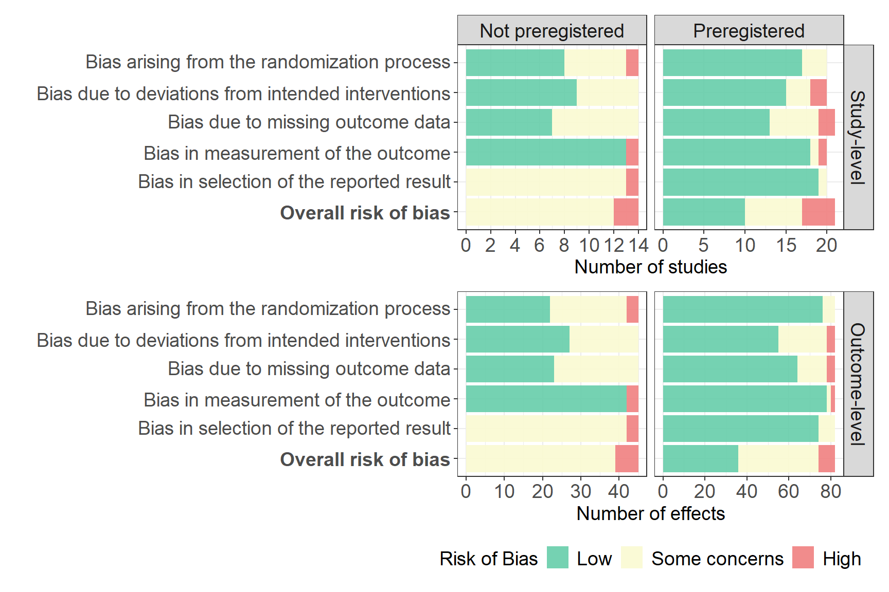{#fig-rob2-mental-raw-number fig-pos='H' width=864}
:::
:::


#### Weighted percentage

::: {.cell}

```{.r .cell-code}
rob_pct_studies_weight_mental <- 
  rob_sum_mental |> 
  mutate(
    Rating = fct_rev(Rating),
    level = "Studies"
    ) |> 
  ggplot(aes(x = studies_pct_w, y = Category, fill = Rating)) + 
  geom_col(alpha = 0.9) +
  facet_grid(level ~ prereg, scales = "free_x") + 
  scale_fill_manual(
    values = c("Low" = "mediumaquamarine", "Some concerns" = "lightgoldenrodyellow", "High" = "lightcoral")
  ) +
  scale_y_discrete(
    limits = rev,
    labels = c( 
      expression(bold("Overall risk of bias")),
      "Bias in selection of the reported result",
      "Bias in measurement of the outcome",
      "Bias due to missing outcome data",
      "Bias due to deviations from intended interventions",
      "Bias arising from the randomization process"
    )
  ) +
  labs(
    y = "",
    fill = "Risk of Bias"
  ) + 
  guides(fill = guide_legend(reverse = TRUE)) + 
  theme_bw() + 
  theme(
    legend.position = "none",
    axis.title.x=element_blank()
  ) 

rob_pct_effects_weight_mental <- 
  rob_sum_mental |> 
  mutate(
    Rating = fct_rev(Rating),
    level = "Effects"
    ) |> 
  ggplot(aes(x = effects_pct_w, y = Category, fill = Rating)) + 
  geom_col(alpha = 0.9) +
  facet_grid(level ~ prereg, scales = "free_x") + 
  scale_fill_manual(
    values = c("Low" = "mediumaquamarine", "Some concerns" = "lightgoldenrodyellow", "High" = "lightcoral")
  ) +
  scale_y_discrete(
    limits = rev,
    labels = c( 
      expression(bold("Overall risk of bias")),
      "Bias in selection of the reported result",
      "Bias in measurement of the outcome",
      "Bias due to missing outcome data",
      "Bias due to deviations from intended interventions",
      "Bias arising from the randomization process"
    )
  ) +
  labs(
    x = "Weighted percentage",
    y = "",
    fill = "Risk of Bias"
  ) + 
  guides(fill = guide_legend(reverse = TRUE)) + 
  theme_bw() + 
  theme(
    legend.position = "bottom",
    strip.text.x = element_blank()
  ) 


rob_pct_studies_weight_mental / rob_pct_effects_weight_mental
```

::: {.cell-output-display}
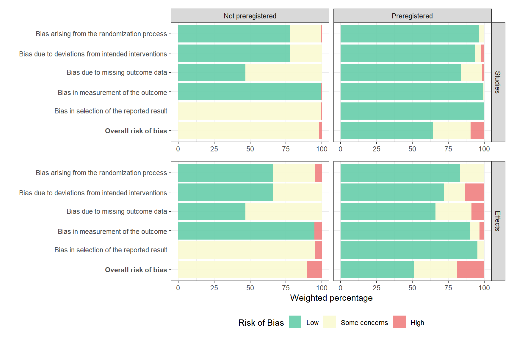{#fig-rob2-mental-weigthed fig-pos='H' width=864}
:::
:::


#### Raw percentage

::: {.cell}

```{.r .cell-code}
rob_pct_studies_unweight_mental <- 
  rob_sum_mental |> 
  mutate(
    Rating = fct_rev(Rating),
    level = "Studies"
    ) |> 
  ggplot(aes(x = studies_pct, y = Category, fill = Rating)) + 
  geom_col(alpha = 0.9) +
  facet_grid(level ~ prereg, scales = "free_x") + 
  scale_fill_manual(
    values = c("Low" = "mediumaquamarine", "Some concerns" = "lightgoldenrodyellow", "High" = "lightcoral")
  ) +
  scale_y_discrete(
    limits = rev,
    labels = c( 
      expression(bold("Overall risk of bias")),
      "Bias in selection of the reported result",
      "Bias in measurement of the outcome",
      "Bias due to missing outcome data",
      "Bias due to deviations from intended interventions",
      "Bias arising from the randomization process"
    )
  ) +
  labs(
    y = "",
    fill = "Risk of Bias"
  ) + 
  guides(fill = guide_legend(reverse = TRUE)) + 
  theme_bw() + 
  theme(
    legend.position = "none",
    axis.title.x=element_blank()
  ) 

rob_pct_effects_unweight <- 
  rob_sum_mental |> 
  mutate(
    Rating = fct_rev(Rating),
    level = "Effects"
    ) |> 
  ggplot(aes(x = effects_pct, y = Category, fill = Rating)) + 
  geom_col(alpha = 0.9) +
  facet_grid(level ~ prereg, scales = "free_x") + 
  scale_fill_manual(
    values = c("Low" = "mediumaquamarine", "Some concerns" = "lightgoldenrodyellow", "High" = "lightcoral")
  ) +
  scale_y_discrete(
    limits = rev,
    labels = c( 
      expression(bold("Overall risk of bias")),
      "Bias in selection of the reported result",
      "Bias in measurement of the outcome",
      "Bias due to missing outcome data",
      "Bias due to deviations from intended interventions",
      "Bias arising from the randomization process"
    )
  ) +
  labs(
    x = "Percentage",
    y = "",
    fill = "Risk of Bias"
  ) + 
  guides(fill = guide_legend(reverse = TRUE)) + 
  theme_bw() + 
  theme(
    legend.position = "bottom",
    strip.text.x = element_blank()
  ) 


rob_pct_studies_unweight / rob_pct_effects_unweight
```

::: {.cell-output-display}
{#fig-rob2-mental-unweigthed fig-pos='H' width=864}
:::
:::


:::

:::

:::


### Subgrouped risk of bias plots 

::: {.cell}

```{.r .cell-code}
reint_rob2_subgrp_dat <- 
  reintegration_dat |> 
  mutate(
    kj = n(),
    sigma2j = mean(vgt_pop),
    weight = 1 / (kj*tau2 + omega2 + (kj-1)*rho*sigma2j + sigma2j),
    .by = study
  ) |> 
  filter(rob_tool == "RoB2" & str_detect(analysis_plan, "Alco|Well|Hope|Social")) |> 
  select(
    outcome = analysis_plan, prereg = prereg_chr, study, D1:D5, Overall, weight
  ) |> 
  mutate(
    outcome = case_match(
      outcome,
      "Alcohol and drug abuse/misuse" ~ "Alcohol/drugs",
      "Hope, empowerment & self-efficacy" ~ "Hope/empower",
      "Social functioning (degree of impairment)" ~ "Social function",
      "Wellbeing and quality of life" ~ "Wellbeing/QoL"
    )
  )


rob_sum_subgrp <-  
  reint_rob2_subgrp_dat |> 
  pivot_longer(D1:Overall, names_to = "Category", values_to = "Rating") |> 
  mutate(
    Category = factor(
      Category, levels = c(paste0("D", 1:5), "Overall"), 
      labels = c(
        "Bias arising from the randomization process",
        "Bias due to deviations from intended interventions",
        "Bias due to missing outcome data",
        "Bias in measurement of the outcome",
        "Bias in selection of the reported result",
        "Overall risk of bias"
        )
      ),
    
    Rating = case_when(str_detect(Rating, "Some") ~ "Some concerns", .default = Rating),
    
    Rating = factor(Rating, levels = c("Low", "Some concerns", "High"))
    
  ) |> 
  group_by(prereg, outcome, Category, Rating, study) |> 
  summarize(
    effects = n(),
    weight = sum(weight),
    .groups = "drop_last"
  ) |> 
  summarise(
    studies = length(unique(study)),
    effects = sum(effects),
    weight = sum(weight),
    .groups = "drop_last"
  ) |> 
  mutate(
    effects_pct = 100 * effects / sum(effects),
    studies_pct = 100 * studies / sum(studies),
    effects_pct_w = weight/sum(weight) * 100,
    studies_w = studies * weight,
    studies_pct_w = studies_w / sum(studies_w) * 100
  ) |> 
  ungroup() 

# Mental health
mental_rob2_subgrp_dat <- 
  mental_health_dat |> 
  mutate(
    kj = n(),
    sigma2j = mean(vgt_pop),
    weight = 1 / (kj*tau2 + omega2 + (kj-1)*rho*sigma2j + sigma2j),
    .by = study
  ) |> 
  filter(rob_tool == "RoB2") |> 
  select(
    outcome = analysis_plan, prereg = prereg_chr, study, D1:D5, Overall, weight
  ) |> 
  mutate(
    outcome = factor(
      outcome, 
      levels = c("Anxiety", "Depression", "General mental health", "Symptoms of psychosis")
    )
  )


rob_sum_subgrp_mental <-  
  mental_rob2_subgrp_dat |> 
  pivot_longer(D1:Overall, names_to = "Category", values_to = "Rating") |> 
  mutate(
    Category = factor(
      Category, levels = c(paste0("D", 1:5), "Overall"), 
      labels = c(
        "Bias arising from the randomization process",
        "Bias due to deviations from intended interventions",
        "Bias due to missing outcome data",
        "Bias in measurement of the outcome",
        "Bias in selection of the reported result",
        "Overall risk of bias"
        )
      ),
    
    Rating = case_when(str_detect(Rating, "Some") ~ "Some concerns", .default = Rating),
    
    Rating = factor(Rating, levels = c("Low", "Some concerns", "High"))
    
  ) |> 
  group_by(prereg, outcome, Category, Rating, study) |> 
  summarize(
    effects = n(),
    weight = sum(weight),
    .groups = "drop_last"
  ) |> 
  summarise(
    studies = length(unique(study)),
    effects = sum(effects),
    weight = sum(weight),
    .groups = "drop_last"
  ) |> 
  mutate(
    effects_pct = 100 * effects / sum(effects),
    studies_pct = 100 * studies / sum(studies),
    effects_pct_w = weight/sum(weight) * 100,
    studies_w = studies * weight,
    studies_pct_w = studies_w / sum(studies_w) * 100
  ) |> 
  ungroup() 
```
:::


::: {.columns}

::: {.column width="130%"}

::: {.panel-tabset}
### Reintegration

::: {.panel-tabset}
#### Study-level

::: {.panel-tabset}
#### Number of studies

::: {.cell}

```{.r .cell-code}
rob_studies_subgrp <- 
  rob_sum_subgrp |> 
  mutate(
    Rating = fct_rev(Rating),
    level = "Studies"
    ) |> 
  ggplot(aes(x = studies, y = Category, fill = Rating)) + 
  geom_col(alpha = 0.9) +
  facet_nested_wrap(outcome ~ prereg, scales = "free_x", ncol = 2) + 
  scale_fill_manual(
    values = c("Low" = "mediumaquamarine", "Some concerns" = "lightgoldenrodyellow", "High" = "lightcoral")
  ) +
  scale_y_discrete(
    limits = rev,
    labels = c( 
      expression(bold("Overall risk of bias")),
      "Bias in selection of the reported result",
      "Bias in measurement of the outcome",
      "Bias due to missing outcome data",
      "Bias due to deviations from intended interventions",
      "Bias arising from the randomization process"
    )
  ) +
  labs(
    y = "",
    x = "Number of studies",
    fill = "Risk of Bias"
  ) + 
  guides(fill = guide_legend(reverse = TRUE)) + 
  theme_bw() + 
  theme(
    legend.position = "bottom"
  )  + 
  facetted_pos_scales(
    x = list(
      prereg == "Not preregistered" & outcome == "Alcohol/drugs" ~ scale_x_continuous(breaks = seq(0, 2, 1)),
      prereg == "Preregistered" & outcome == "Wellbeing/QoL" ~ scale_x_continuous(breaks = seq(0, 14, 2)),
      prereg == "Preregistered" & outcome == "Social function" ~ scale_x_continuous(breaks = seq(0, 10, 2))
    )
  )

rob_studies_subgrp
```

::: {.cell-output-display}
{#fig-rob2-reint-n-studies-subgroup fig-pos='H' width=864}
:::
:::

#### Weighted percentage of studies

::: {.cell}

```{.r .cell-code}
# Weigthed percent
rob_weight_pct_studies_subgrp <- 
  rob_sum_subgrp |> 
  mutate(
    Rating = fct_rev(Rating),
    level = "Studies"
    ) |> 
  ggplot(aes(x = studies_pct_w, y = Category, fill = Rating)) + 
  geom_col(alpha = 0.9) +
  facet_grid2(outcome ~ prereg, scales = "free_x") + 
  scale_fill_manual(
    values = c("Low" = "mediumaquamarine", "Some concerns" = "lightgoldenrodyellow", "High" = "lightcoral")
  ) +
  scale_y_discrete(
    limits = rev,
    labels = c( 
      expression(bold("Overall risk of bias")),
      "Bias in selection of the reported result",
      "Bias in measurement of the outcome",
      "Bias due to missing outcome data",
      "Bias due to deviations from intended interventions",
      "Bias arising from the randomization process"
    )
  ) +
  labs(
    y = "",
    x = "Weighted percentage of studies",
    fill = "Risk of Bias"
  ) + 
  guides(fill = guide_legend(reverse = TRUE)) + 
  theme_bw() + 
  theme(
    legend.position = "bottom"
  ) 

rob_weight_pct_studies_subgrp
```

::: {.cell-output-display}
{#fig-rob2-reint-weigthed-subgroup fig-pos='H' width=864}
:::
:::


#### Unweighted percentage of studies

::: {.cell}

```{.r .cell-code}
# unweigthed percent
rob_unweight_pct_studies_subgrp <- 
  rob_sum_subgrp |> 
  mutate(
    Rating = fct_rev(Rating),
    level = "Studies"
    ) |> 
  ggplot(aes(x = studies_pct, y = Category, fill = Rating)) + 
  geom_col(alpha = 0.9) +
  facet_grid2(outcome ~ prereg, scales = "free_x") + 
  scale_fill_manual(
    values = c("Low" = "mediumaquamarine", "Some concerns" = "lightgoldenrodyellow", "High" = "lightcoral")
  ) +
  scale_y_discrete(
    limits = rev,
    labels = c( 
      expression(bold("Overall risk of bias")),
      "Bias in selection of the reported result",
      "Bias in measurement of the outcome",
      "Bias due to missing outcome data",
      "Bias due to deviations from intended interventions",
      "Bias arising from the randomization process"
    )
  ) +
  labs(
    y = "",
    x = "Percentage of studies",
    fill = "Risk of Bias"
  ) + 
  guides(fill = guide_legend(reverse = TRUE)) + 
  theme_bw() + 
  theme(
    legend.position = "bottom"
  ) 

rob_unweight_pct_studies_subgrp
```

::: {.cell-output-display}
{#fig-rob2-reint-unweigthed-subgroup fig-pos='H' width=864}
:::
:::

:::

#### Outcome-level
::: {.panel-tabset}
#### Number of effects

::: {.cell}

```{.r .cell-code}
rob_effects_subgrp <- 
  rob_sum_subgrp |> 
  mutate(
    Rating = fct_rev(Rating),
    level = "Effects"
    ) |> 
  ggplot(aes(x = effects, y = Category, fill = Rating)) + 
  geom_col(alpha = 0.9) +
  facet_nested_wrap(outcome ~ prereg, scales = "free_x", ncol = 2) + 
  scale_fill_manual(
    values = c("Low" = "mediumaquamarine", "Some concerns" = "lightgoldenrodyellow", "High" = "lightcoral")
  ) +
  scale_y_discrete(
    limits = rev,
    labels = c( 
      expression(bold("Overall risk of bias")),
      "Bias in selection of the reported result",
      "Bias in measurement of the outcome",
      "Bias due to missing outcome data",
      "Bias due to deviations from intended interventions",
      "Bias arising from the randomization process"
    )
  ) +
  labs(
    y = "",
    x = "Number of effects",
    fill = "Risk of Bias"
  ) + 
  guides(fill = guide_legend(reverse = TRUE)) + 
  theme_bw() + 
  theme(
    legend.position = "bottom"
  )  + 
  facetted_pos_scales(
    x = list(
      prereg == "Not preregistered" & outcome == "Hope/empower" ~ scale_x_continuous(breaks = seq(0, 12, 2)),
      prereg == "Preregistered" & outcome == "Hope/empower" ~ scale_x_continuous(breaks = seq(0, 20, 5)),
      prereg == "Not preregistered" & outcome == "Social function" ~ scale_x_continuous(breaks = seq(0, 10, 2)),
      prereg == "Preregistered" & outcome == "Social function" ~ scale_x_continuous(breaks = seq(0, 40, 10)),
      prereg == "Not preregistered" & outcome == "Wellbeing/QoL" ~ scale_x_continuous(breaks = seq(0, 10, 2))
    )
  )

rob_effects_subgrp
```

::: {.cell-output-display}
{#fig-rob2-reint-n-effects-subgroup fig-pos='H' width=864}
:::
:::

#### Weighted percentage of effects

::: {.cell}

```{.r .cell-code}
# Weigthed percent
rob_weight_pct_effects_subgrp <- 
  rob_sum_subgrp |> 
  mutate(
    Rating = fct_rev(Rating),
    level = "Effects"
    ) |> 
  ggplot(aes(x = effects_pct_w, y = Category, fill = Rating)) + 
  geom_col(alpha = 0.9) +
  facet_grid2(outcome ~ prereg, scales = "free_x") + 
  scale_fill_manual(
    values = c("Low" = "mediumaquamarine", "Some concerns" = "lightgoldenrodyellow", "High" = "lightcoral")
  ) +
  scale_y_discrete(
    limits = rev,
    labels = c( 
      expression(bold("Overall risk of bias")),
      "Bias in selection of the reported result",
      "Bias in measurement of the outcome",
      "Bias due to missing outcome data",
      "Bias due to deviations from intended interventions",
      "Bias arising from the randomization process"
    )
  ) +
  labs(
    y = "",
    x = "Weighted percentage of effects",
    fill = "Risk of Bias"
  ) + 
  guides(fill = guide_legend(reverse = TRUE)) + 
  theme_bw() + 
  theme(
    legend.position = "bottom"
  ) 

rob_weight_pct_effects_subgrp
```

::: {.cell-output-display}
{#fig-rob2-reint-weigthed-effects-subgroup fig-pos='H' width=864}
:::
:::


#### Unweighted percentage of effects

::: {.cell}

```{.r .cell-code}
# unweigthed percent
rob_unweight_pct_effects_subgrp <- 
  rob_sum_subgrp |> 
  mutate(
    Rating = fct_rev(Rating),
    level = "Studies"
    ) |> 
  ggplot(aes(x = effects_pct, y = Category, fill = Rating)) + 
  geom_col(alpha = 0.9) +
  facet_grid2(outcome ~ prereg, scales = "free_x") + 
  scale_fill_manual(
    values = c("Low" = "mediumaquamarine", "Some concerns" = "lightgoldenrodyellow", "High" = "lightcoral")
  ) +
  scale_y_discrete(
    limits = rev,
    labels = c( 
      expression(bold("Overall risk of bias")),
      "Bias in selection of the reported result",
      "Bias in measurement of the outcome",
      "Bias due to missing outcome data",
      "Bias due to deviations from intended interventions",
      "Bias arising from the randomization process"
    )
  ) +
  labs(
    y = "",
    x = "Percentage of effects",
    fill = "Risk of Bias"
  ) + 
  guides(fill = guide_legend(reverse = TRUE)) + 
  theme_bw() + 
  theme(
    legend.position = "bottom"
  ) 

rob_unweight_pct_effects_subgrp
```

::: {.cell-output-display}
{#fig-rob2-reint-unweigthed-effects-subgroup fig-pos='H' width=864}
:::
:::

:::

:::

### Mental health

::: {.panel-tabset}
#### Study-level

::: {.panel-tabset}
#### Number of studies

::: {.cell}

```{.r .cell-code}
rob_studies_subgrp_mental <- 
  rob_sum_subgrp_mental |> 
  mutate(
    Rating = fct_rev(Rating),
    level = "Studies"
    ) |> 
  ggplot(aes(x = studies, y = Category, fill = Rating)) + 
  geom_col(alpha = 0.9) +
  facet_nested_wrap(outcome ~ prereg, scales = "free_x", ncol = 2) + 
  scale_fill_manual(
    values = c("Low" = "mediumaquamarine", "Some concerns" = "lightgoldenrodyellow", "High" = "lightcoral")
  ) +
  scale_y_discrete(
    limits = rev,
    labels = c( 
      expression(bold("Overall risk of bias")),
      "Bias in selection of the reported result",
      "Bias in measurement of the outcome",
      "Bias due to missing outcome data",
      "Bias due to deviations from intended interventions",
      "Bias arising from the randomization process"
    )
  ) +
  labs(
    y = "",
    x = "Number of studies",
    fill = "Risk of Bias"
  ) + 
  guides(fill = guide_legend(reverse = TRUE)) + 
  theme_bw() + 
  theme(
    legend.position = "bottom"
  )  + 
  facetted_pos_scales(
    x = list(
      prereg == "Not preregistered" & outcome == "Anxiety" ~ scale_x_continuous(breaks = seq(0, 2, 1)),
      prereg == "Preregistered" & outcome == "Depression" ~ scale_x_continuous(breaks = seq(0, 10, 2)),
      prereg == "Not preregistered" & outcome == "General mental health" ~ scale_x_continuous(breaks = seq(0, 10, 2)),
      prereg == "Preregistered" & outcome == "Symptoms of psychosis" ~ scale_x_continuous(breaks = seq(0, 2, 1))
    )
  )

rob_studies_subgrp_mental
```

::: {.cell-output-display}
{#fig-rob2-mental-n-studies-subgroup fig-pos='H' width=864}
:::
:::

#### Weighted percentage of studies

::: {.cell}

```{.r .cell-code}
# Weigthed percent
rob_weight_pct_studies_subgrp_mental <- 
  rob_sum_subgrp_mental |> 
  mutate(
    Rating = fct_rev(Rating),
    level = "Studies"
    ) |> 
  ggplot(aes(x = studies_pct_w, y = Category, fill = Rating)) + 
  geom_col(alpha = 0.9) +
  facet_grid2(outcome ~ prereg, scales = "free_x") + 
  scale_fill_manual(
    values = c("Low" = "mediumaquamarine", "Some concerns" = "lightgoldenrodyellow", "High" = "lightcoral")
  ) +
  scale_y_discrete(
    limits = rev,
    labels = c( 
      expression(bold("Overall risk of bias")),
      "Bias in selection of the reported result",
      "Bias in measurement of the outcome",
      "Bias due to missing outcome data",
      "Bias due to deviations from intended interventions",
      "Bias arising from the randomization process"
    )
  ) +
  labs(
    y = "",
    x = "Weighted percentage of studies",
    fill = "Risk of Bias"
  ) + 
  guides(fill = guide_legend(reverse = TRUE)) + 
  theme_bw() + 
  theme(
    legend.position = "bottom"
  ) 

rob_weight_pct_studies_subgrp_mental
```

::: {.cell-output-display}
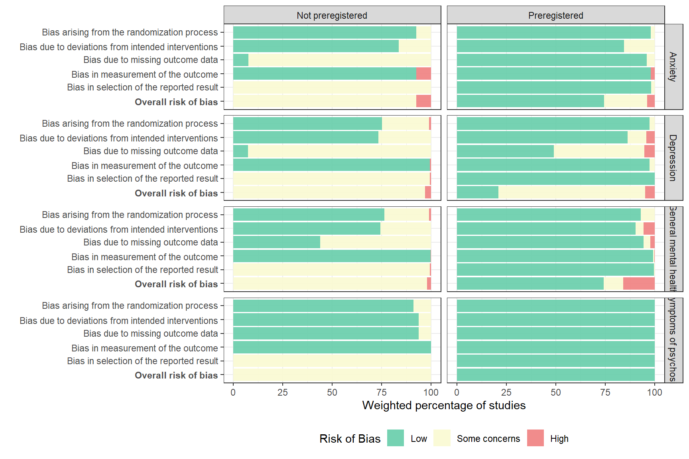{#fig-rob2-mental-weigthed-subgroup fig-pos='H' width=864}
:::
:::


#### Unweighted percentage of studies

::: {.cell}

```{.r .cell-code}
# unweigthed percent
rob_unweight_pct_studies_subgrp_mental <- 
  rob_sum_subgrp_mental |> 
  mutate(
    Rating = fct_rev(Rating),
    level = "Studies"
    ) |> 
  ggplot(aes(x = studies_pct, y = Category, fill = Rating)) + 
  geom_col(alpha = 0.9) +
  facet_grid2(outcome ~ prereg, scales = "free_x") + 
  scale_fill_manual(
    values = c("Low" = "mediumaquamarine", "Some concerns" = "lightgoldenrodyellow", "High" = "lightcoral")
  ) +
  scale_y_discrete(
    limits = rev,
    labels = c( 
      expression(bold("Overall risk of bias")),
      "Bias in selection of the reported result",
      "Bias in measurement of the outcome",
      "Bias due to missing outcome data",
      "Bias due to deviations from intended interventions",
      "Bias arising from the randomization process"
    )
  ) +
  labs(
    y = "",
    x = "Percentage of studies",
    fill = "Risk of Bias"
  ) + 
  guides(fill = guide_legend(reverse = TRUE)) + 
  theme_bw() + 
  theme(
    legend.position = "bottom"
  ) 

rob_unweight_pct_studies_subgrp_mental
```

::: {.cell-output-display}
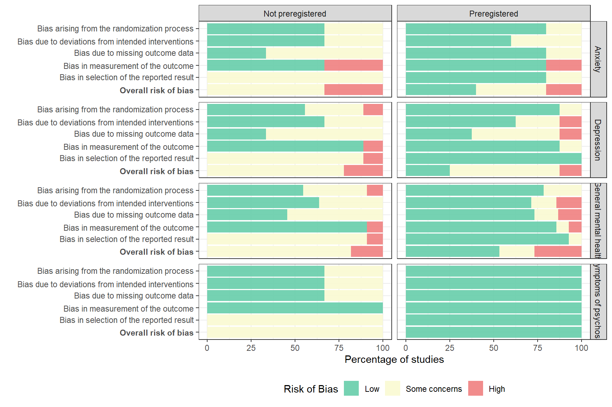{#fig-rob2-mental-unweigthed-subgroup fig-pos='H' width=864}
:::
:::

:::

#### Outcome-level
::: {.panel-tabset}
#### Number of effects

::: {.cell}

```{.r .cell-code}
rob_effects_subgrp_mental <- 
  rob_sum_subgrp_mental |> 
  mutate(
    Rating = fct_rev(Rating),
    level = "Effects"
    ) |> 
  ggplot(aes(x = effects, y = Category, fill = Rating)) + 
  geom_col(alpha = 0.9) +
  facet_nested_wrap(outcome ~ prereg, scales = "free_x", ncol = 2) + 
  scale_fill_manual(
    values = c("Low" = "mediumaquamarine", "Some concerns" = "lightgoldenrodyellow", "High" = "lightcoral")
  ) +
  scale_y_discrete(
    limits = rev,
    labels = c( 
      expression(bold("Overall risk of bias")),
      "Bias in selection of the reported result",
      "Bias in measurement of the outcome",
      "Bias due to missing outcome data",
      "Bias due to deviations from intended interventions",
      "Bias arising from the randomization process"
    )
  ) +
  labs(
    y = "",
    x = "Number of effects",
    fill = "Risk of Bias"
  ) + 
  guides(fill = guide_legend(reverse = TRUE)) + 
  theme_bw() + 
  theme(
    legend.position = "bottom"
  )  + 
  facetted_pos_scales(
    x = list(
      prereg == "Not preregistered" & outcome == "Anxiety" ~ scale_x_continuous(breaks = seq(0, 2, 1)),
      prereg == "Preregistered" & outcome == "Anxiety" ~ scale_x_continuous(breaks = seq(0, 10, 2)),
      prereg == "Not preregistered" & outcome == "Depression" ~ scale_x_continuous(breaks = seq(0, 10, 2)),
      prereg == "Not preregistered" & outcome == "Symptoms of psychosis" ~ scale_x_continuous(breaks = seq(0, 10, 2))
    )
  )

rob_effects_subgrp_mental
```

::: {.cell-output-display}
{#fig-rob2-mental-n-effects-subgroup fig-pos='H' width=864}
:::
:::

#### Weighted percentage of effects

::: {.cell}

```{.r .cell-code}
# Weigthed percent
rob_weight_pct_effects_subgrp_mental <- 
  rob_sum_subgrp_mental |> 
  mutate(
    Rating = fct_rev(Rating),
    level = "Effects"
    ) |> 
  ggplot(aes(x = effects_pct_w, y = Category, fill = Rating)) + 
  geom_col(alpha = 0.9) +
  facet_grid2(outcome ~ prereg, scales = "free_x") + 
  scale_fill_manual(
    values = c("Low" = "mediumaquamarine", "Some concerns" = "lightgoldenrodyellow", "High" = "lightcoral")
  ) +
  scale_y_discrete(
    limits = rev,
    labels = c( 
      expression(bold("Overall risk of bias")),
      "Bias in selection of the reported result",
      "Bias in measurement of the outcome",
      "Bias due to missing outcome data",
      "Bias due to deviations from intended interventions",
      "Bias arising from the randomization process"
    )
  ) +
  labs(
    y = "",
    x = "Weighted percentage of effects",
    fill = "Risk of Bias"
  ) + 
  guides(fill = guide_legend(reverse = TRUE)) + 
  theme_bw() + 
  theme(
    legend.position = "bottom"
  ) 

rob_weight_pct_effects_subgrp_mental
```

::: {.cell-output-display}
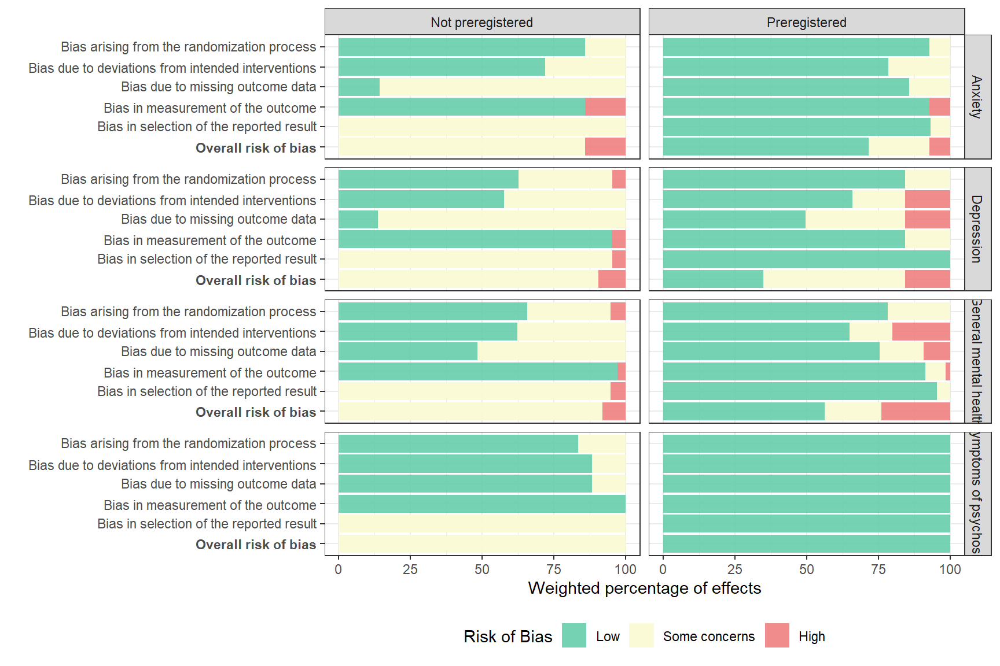{#fig-rob2-mental-weigthed-effects-subgroup fig-pos='H' width=864}
:::
:::


#### Unweighted percentage of effects

::: {.cell}

```{.r .cell-code}
# unweigthed percent
rob_unweight_pct_effects_subgrp_mental <- 
  rob_sum_subgrp_mental |> 
  mutate(
    Rating = fct_rev(Rating),
    level = "Studies"
    ) |> 
  ggplot(aes(x = effects_pct, y = Category, fill = Rating)) + 
  geom_col(alpha = 0.9) +
  facet_grid2(outcome ~ prereg, scales = "free_x") + 
  scale_fill_manual(
    values = c("Low" = "mediumaquamarine", "Some concerns" = "lightgoldenrodyellow", "High" = "lightcoral")
  ) +
  scale_y_discrete(
    limits = rev,
    labels = c( 
      expression(bold("Overall risk of bias")),
      "Bias in selection of the reported result",
      "Bias in measurement of the outcome",
      "Bias due to missing outcome data",
      "Bias due to deviations from intended interventions",
      "Bias arising from the randomization process"
    )
  ) +
  labs(
    y = "",
    x = "Percentage of effects",
    fill = "Risk of Bias"
  ) + 
  guides(fill = guide_legend(reverse = TRUE)) + 
  theme_bw() + 
  theme(
    legend.position = "bottom"
  ) 

rob_unweight_pct_effects_subgrp_mental
```

::: {.cell-output-display}
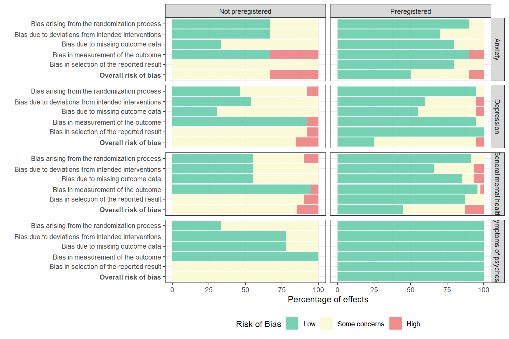{#fig-rob2-mental-unweigthed-effects-subgroup fig-pos='H' width=864}
:::
:::

:::

:::

:::

:::

:::

## ROBINS-I


::: {.cell}

```{.r .cell-code}
reint_robinsi_dat <- 
  reintegration_dat |> 
  mutate(
    kj = n(),
    sigma2j = mean(vgt_pop),
    weight = 1 / (kj*tau2 + omega2 + (kj-1)*rho*sigma2j + sigma2j),
    .by = study
  ) |> 
  filter(rob_tool == "ROBINS-I") |> 
  select(
    prereg = prereg_chr, study, D1:Overall, weight
  ) 


robinsi_sum <-  
  reint_robinsi_dat |> 
  pivot_longer(D1:Overall, names_to = "Category", values_to = "Rating") |> 
  mutate(
    Category = factor(
      Category, levels = c(paste0("D", 1:7), "Overall"), 
      labels = c(
        "Bias due to confounding",
        "Bias due to selection of participants",
        "Bias in classification of interventions",
        "Bias due to deviations from intended interventions",
        "Bias due to missing data",
        "Bias in measurement of outcomes",
        "Bias in selection of the reported result",
        "Overall risk of bias"
        )
      ),
    
    Rating = factor(Rating, levels = c("Low", "Moderate", "Serious"))
    
  ) |> 
  group_by(Category, Rating, study) |> 
  summarize(
    effects = n(),
    weight = sum(weight),
    .groups = "drop_last"
  ) |> 
  summarise(
    studies = length(unique(study)),
    effects = sum(effects),
    weight = sum(weight),
    .groups = "drop_last"
  ) |> 
  mutate(
    effects_pct = 100 * effects / sum(effects),
    studies_pct = 100 * studies / sum(studies),
    effects_pct_w = weight/sum(weight) * 100,
    studies_w = studies * weight,
    studies_pct_w = studies_w / sum(studies_w) * 100
  ) |> 
  ungroup() 

# Mental health
mental_robinsi_dat <- 
  mental_health_dat |> 
  mutate(
    kj = n(),
    sigma2j = mean(vgt_pop),
    weight = 1 / (kj*tau2 + omega2 + (kj-1)*rho*sigma2j + sigma2j),
    .by = study
  ) |> 
  filter(rob_tool == "ROBINS-I") |> 
  select(
    prereg = prereg_chr, study, D1:Overall, weight
  ) 


robinsi_sum_mental <-  
  mental_robinsi_dat |> 
  pivot_longer(D1:Overall, names_to = "Category", values_to = "Rating") |> 
  mutate(
    Category = factor(
      Category, levels = c(paste0("D", 1:7), "Overall"), 
      labels = c(
        "Bias due to confounding",
        "Bias due to selection of participants",
        "Bias in classification of interventions",
        "Bias due to deviations from intended interventions",
        "Bias due to missing data",
        "Bias in measurement of outcomes",
        "Bias in selection of the reported result",
        "Overall risk of bias"
        )
      ),
    
    Rating = factor(Rating, levels = c("Low", "Moderate", "Serious"))
    
  ) |> 
  group_by(Category, Rating, study) |> 
  summarize(
    effects = n(),
    weight = sum(weight),
    .groups = "drop_last"
  ) |> 
  summarise(
    studies = length(unique(study)),
    effects = sum(effects),
    weight = sum(weight),
    .groups = "drop_last"
  ) |> 
  mutate(
    effects_pct = 100 * effects / sum(effects),
    studies_pct = 100 * studies / sum(studies),
    effects_pct_w = weight/sum(weight) * 100,
    studies_w = studies * weight,
    studies_pct_w = studies_w / sum(studies_w) * 100
  ) |> 
  ungroup() 
```
:::


::: {.column width="130%"}

::: {.panel-tabset}
### Reintegration

::: {.panel-tabset}
### Raw numbers

::: {.cell}

```{.r .cell-code}
robin_studies <- 
  robinsi_sum |> 
  mutate(
    Rating = fct_rev(Rating),
    level = "Studies"
    ) |> 
  ggplot(aes(x = studies, y = Category, fill = Rating)) + 
  geom_col(alpha = 0.9) +
  facet_grid(~ level, scales = "free_x") + 
  scale_fill_manual(
    values = c("Low" = "mediumaquamarine", "Moderate" = "lightgoldenrodyellow", "Serious" = "lightcoral")
  ) +
  scale_y_discrete(
    limits = rev,
    labels = c( 
      expression(bold("Overall risk of bias")),
      "Bias in selection of the reported result",
      "Bias in measurement of outcomes",
      "Bias due to missing data",
      "Bias due to deviations from intended interventions",
      "Bias in classification of interventions",
      "Bias due to selection of participants",
      "Bias due to confounding"
    )
  ) +
  labs(
    y = "",
    x = "Raw number",
    fill = "Risk of Bias"
  ) + 
  guides(fill = guide_legend(reverse = TRUE)) + 
  theme_bw() + 
  theme(
    legend.position = "bottom",
    strip.text.x = element_text(size = 14),
    strip.text.y = element_text(size = 14),
    axis.title = element_text(size = 14),
    axis.text = element_text(size = 14),
    legend.text = element_text(size = 14),
    legend.title = element_text(size = 14)
  ) 

robin_effects <- 
  robinsi_sum  |> 
  mutate(
    Rating = fct_rev(Rating),
    level = "Effects"
    ) |> 
  ggplot(aes(x = effects, y = Category, fill = Rating)) + 
  geom_col(alpha = 0.9) +
  facet_grid(~ level, scales = "free_x") + 
  scale_fill_manual(
    values = c("Low" = "mediumaquamarine", "Moderate" = "lightgoldenrodyellow", "Serious" = "lightcoral")
  ) +
  scale_y_discrete(
    limits = rev,
    labels = c( 
      expression(bold("Overall risk of bias")),
      "Bias in selection of the reported result",
      "Bias in measurement of outcomes",
      "Bias due to missing data",
      "Bias due to deviations from intended interventions",
      "Bias in classification of interventions",
      "Bias due to selection of participants",
      "Bias due to confounding"
    )
  ) +
  labs(
    y = "",
    x = "Raw number",
    fill = "Risk of Bias"
  ) + 
  guides(fill = guide_legend(reverse = TRUE)) + 
  theme_bw() + 
  theme(
    legend.position = "bottom",
    axis.ticks.y = element_blank(),
    axis.text.y = element_blank(),
    strip.text.x = element_text(size = 14),
    axis.title = element_text(size = 14),
    axis.text = element_text(size = 14),
    legend.text = element_text(size = 14),
    legend.title = element_text(size = 14)
  ) 


#png(filename = "Figures/ROBINSI_reint.png", width = 12, height = 5, units = "in", res = 600)
(robin_studies + robin_effects) +
  plot_layout(guides = "collect", axis_titles = "collect") & theme(legend.position = 'bottom') 
#dev.off()
```

::: {.cell-output-display}
{#fig-rob2-robins-i-raw fig-pos='H' width=1152}
:::
:::

### Weighted percentage

::: {.cell}

```{.r .cell-code}
robin_pct_studies_weight <- 
  robinsi_sum |> 
  mutate(
    Rating = fct_rev(Rating),
    level = "Studies"
    ) |> 
  ggplot(aes(x = studies_pct_w, y = Category, fill = Rating)) + 
  geom_col(alpha = 0.9) +
  facet_grid(~ level, scales = "free_x") + 
  scale_fill_manual(
    values = c("Low" = "mediumaquamarine", "Moderate" = "lightgoldenrodyellow", "Serious" = "lightcoral")
  ) +
  scale_y_discrete(
    limits = rev,
    labels = c( 
      expression(bold("Overall risk of bias")),
      "Bias in selection of the reported result",
      "Bias in measurement of outcomes",
      "Bias due to missing data",
      "Bias due to deviations from intended interventions",
      "Bias in classification of interventions",
      "Bias due to selection of participants",
      "Bias due to confounding"
    )
  ) +
  labs(
    y = "",
    x = "Weighted percentage",
    fill = "Risk of Bias"
  ) + 
  guides(fill = guide_legend(reverse = TRUE)) + 
  theme_bw() + 
  theme(
    legend.position = "bottom"
  ) 

robin_pct_effects_weight <- 
  robinsi_sum  |> 
  mutate(
    Rating = fct_rev(Rating),
    level = "% Effects"
    ) |> 
  ggplot(aes(x = effects_pct_w, y = Category, fill = Rating)) + 
  geom_col(alpha = 0.9) +
  facet_grid(~ level, scales = "free_x") + 
  scale_fill_manual(
    values = c("Low" = "mediumaquamarine", "Moderate" = "lightgoldenrodyellow", "Serious" = "lightcoral")
  ) +
  scale_y_discrete(
    limits = rev,
    labels = c( 
      expression(bold("Overall risk of bias")),
      "Bias in selection of the reported result",
      "Bias in measurement of outcomes",
      "Bias due to missing data",
      "Bias due to deviations from intended interventions",
      "Bias in classification of interventions",
      "Bias due to selection of participants",
      "Bias due to confounding"
    )
  ) +
  labs(
    y = "",
    x = "Weighted percentage",
    fill = "Risk of Bias"
  ) + 
  guides(fill = guide_legend(reverse = TRUE)) + 
  theme_bw() + 
  theme(
    legend.position = "bottom",
    axis.ticks.y = element_blank(),
    axis.text.y = element_blank()
  ) 


(robin_pct_studies_weight + robin_pct_effects_weight) +
  plot_layout(guides = "collect", axis_titles = "collect") & theme(legend.position = 'bottom') 
```

::: {.cell-output-display}
{#fig-rob2-robins-i-weigthed fig-pos='H' width=1152}
:::
:::


### Unweighted percentage

::: {.cell}

```{.r .cell-code}
robin_pct_studies_unweight <- 
  robinsi_sum |> 
  mutate(
    Rating = fct_rev(Rating),
    level = "Studies"
    ) |> 
  ggplot(aes(x = studies_pct, y = Category, fill = Rating)) + 
  geom_col(alpha = 0.9) +
  facet_grid(~ level, scales = "free_x") + 
  scale_fill_manual(
    values = c("Low" = "mediumaquamarine", "Moderate" = "lightgoldenrodyellow", "Serious" = "lightcoral")
  ) +
  scale_y_discrete(
    limits = rev,
    labels = c( 
      expression(bold("Overall risk of bias")),
      "Bias in selection of the reported result",
      "Bias in measurement of outcomes",
      "Bias due to missing data",
      "Bias due to deviations from intended interventions",
      "Bias in classification of interventions",
      "Bias due to selection of participants",
      "Bias due to confounding"
    )
  ) +
  labs(
    y = "",
    x = "Percentage",
    fill = "Risk of Bias"
  ) + 
  guides(fill = guide_legend(reverse = TRUE)) + 
  theme_bw() + 
  theme(
    legend.position = "bottom"
  ) 

robin_pct_effects_unweight <- 
  robinsi_sum  |> 
  mutate(
    Rating = fct_rev(Rating),
    level = "Effects"
    ) |> 
  ggplot(aes(x = effects_pct, y = Category, fill = Rating)) + 
  geom_col(alpha = 0.9) +
  facet_grid(~ level, scales = "free_x") + 
  scale_fill_manual(
    values = c("Low" = "mediumaquamarine", "Moderate" = "lightgoldenrodyellow", "Serious" = "lightcoral")
  ) +
  scale_y_discrete(
    limits = rev,
    labels = c( 
      expression(bold("Overall risk of bias")),
      "Bias in selection of the reported result",
      "Bias in measurement of outcomes",
      "Bias due to missing data",
      "Bias due to deviations from intended interventions",
      "Bias in classification of interventions",
      "Bias due to selection of participants",
      "Bias due to confounding"
    )
  ) +
  labs(
    y = "",
    x = "Percentage",
    fill = "Risk of Bias"
  ) + 
  guides(fill = guide_legend(reverse = TRUE)) + 
  theme_bw() + 
  theme(
    legend.position = "bottom",
    axis.ticks.y = element_blank(),
    axis.text.y = element_blank()
  ) 


(robin_pct_studies_unweight + robin_pct_effects_unweight) +
  plot_layout(guides = "collect", axis_titles = "collect") & theme(legend.position = 'bottom') 
```

::: {.cell-output-display}
{#fig-rob2-robins-i-unweigthed fig-pos='H' width=1152}
:::
:::

:::

### Mental health

::: {.panel-tabset}
### Raw numbers

::: {.cell}

```{.r .cell-code}
robin_studies_mental <- 
  robinsi_sum_mental |> 
  mutate(
    Rating = fct_rev(Rating),
    level = "Studies"
    ) |> 
  ggplot(aes(x = studies, y = Category, fill = Rating)) + 
  geom_col(alpha = 0.9) +
  facet_grid(~ level, scales = "free_x") + 
  scale_fill_manual(
    values = c("Low" = "mediumaquamarine", "Moderate" = "lightgoldenrodyellow", "Serious" = "lightcoral")
  ) +
  scale_y_discrete(
    limits = rev,
    labels = c( 
      expression(bold("Overall risk of bias")),
      "Bias in selection of the reported result",
      "Bias in measurement of outcomes",
      "Bias due to missing data",
      "Bias due to deviations from intended interventions",
      "Bias in classification of interventions",
      "Bias due to selection of participants",
      "Bias due to confounding"
    )
  ) +
  labs(
    y = "",
    x = "Raw number",
    fill = "Risk of Bias"
  ) + 
  guides(fill = guide_legend(reverse = TRUE)) + 
  theme_bw() + 
  theme(
    legend.position = "bottom",
    strip.text.y = element_blank(),
    strip.text.x = element_text(size = 14),
    axis.title = element_text(size = 14),
    axis.text = element_text(size = 14),
    legend.text = element_text(size = 14),
    legend.title = element_text(size = 14)
  ) 

robin_effects_mental <- 
  robinsi_sum_mental  |> 
  mutate(
    Rating = fct_rev(Rating),
    level = "Effects"
    ) |> 
  ggplot(aes(x = effects, y = Category, fill = Rating)) + 
  geom_col(alpha = 0.9) +
  facet_grid(~ level, scales = "free_x") + 
  scale_fill_manual(
    values = c("Low" = "mediumaquamarine", "Moderate" = "lightgoldenrodyellow", "Serious" = "lightcoral")
  ) +
  scale_y_discrete(
    limits = rev,
    labels = c( 
      expression(bold("Overall risk of bias")),
      "Bias in selection of the reported result",
      "Bias in measurement of outcomes",
      "Bias due to missing data",
      "Bias due to deviations from intended interventions",
      "Bias in classification of interventions",
      "Bias due to selection of participants",
      "Bias due to confounding"
    )
  ) +
  labs(
    y = "",
    x = "Raw number",
    fill = "Risk of Bias"
  ) + 
  guides(fill = guide_legend(reverse = TRUE)) + 
  theme_bw() + 
  theme(
    legend.position = "bottom",
    axis.ticks.y = element_blank(),
    axis.text.y = element_blank(),
    strip.text.x = element_text(size = 14),
    axis.title = element_text(size = 14),
    axis.text = element_text(size = 14),
    legend.text = element_text(size = 14),
    legend.title = element_text(size = 14)
  ) 

#png(filename = "Figures/RONINSI_mental.png", width = 12, height = 5, units = "in", res = 600)
(robin_studies_mental + robin_effects_mental) +
  plot_layout(guides = "collect", axis_titles = "collect") & theme(legend.position = 'bottom') 
#dev.off()
```

::: {.cell-output-display}
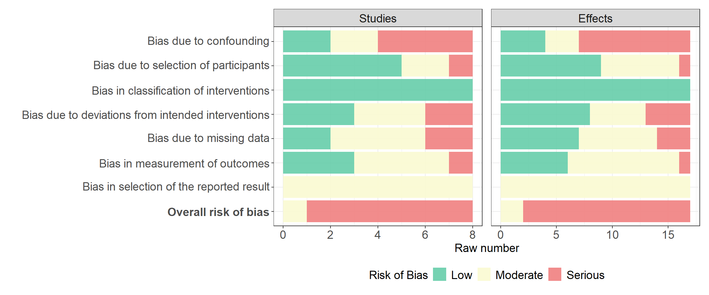{#fig-rob2-robins-i-raw-mental fig-pos='H' width=1152}
:::
:::


### Weighted percentage

::: {.cell}

```{.r .cell-code}
robin_pct_studies_weight_mental <- 
  robinsi_sum_mental |> 
  mutate(
    Rating = fct_rev(Rating),
    level = "Studies"
    ) |> 
  ggplot(aes(x = studies_pct_w, y = Category, fill = Rating)) + 
  geom_col(alpha = 0.9) +
  facet_grid(~ level, scales = "free_x") + 
  scale_fill_manual(
    values = c("Low" = "mediumaquamarine", "Moderate" = "lightgoldenrodyellow", "Serious" = "lightcoral")
  ) +
  scale_y_discrete(
    limits = rev,
    labels = c( 
      expression(bold("Overall risk of bias")),
      "Bias in selection of the reported result",
      "Bias in measurement of outcomes",
      "Bias due to missing data",
      "Bias due to deviations from intended interventions",
      "Bias in classification of interventions",
      "Bias due to selection of participants",
      "Bias due to confounding"
    )
  ) +
  labs(
    y = "",
    x = "Weighted percentage",
    fill = "Risk of Bias"
  ) + 
  guides(fill = guide_legend(reverse = TRUE)) + 
  theme_bw() + 
  theme(
    legend.position = "bottom"
  ) 

robin_pct_effects_weight_mental <- 
  robinsi_sum_mental  |> 
  mutate(
    Rating = fct_rev(Rating),
    level = "Effects"
    ) |> 
  ggplot(aes(x = effects_pct_w, y = Category, fill = Rating)) + 
  geom_col(alpha = 0.9) +
  facet_grid(~ level, scales = "free_x") + 
  scale_fill_manual(
    values = c("Low" = "mediumaquamarine", "Moderate" = "lightgoldenrodyellow", "Serious" = "lightcoral")
  ) +
  scale_y_discrete(
    limits = rev,
    labels = c( 
      expression(bold("Overall risk of bias")),
      "Bias in selection of the reported result",
      "Bias in measurement of outcomes",
      "Bias due to missing data",
      "Bias due to deviations from intended interventions",
      "Bias in classification of interventions",
      "Bias due to selection of participants",
      "Bias due to confounding"
    )
  ) +
  labs(
    y = "",
    x = "Weighted percentage",
    fill = "Risk of Bias"
  ) + 
  guides(fill = guide_legend(reverse = TRUE)) + 
  theme_bw() + 
  theme(
    legend.position = "bottom",
    axis.ticks.y = element_blank(),
    axis.text.y = element_blank()
  ) 


(robin_pct_studies_weight_mental + robin_pct_effects_weight_mental) +
  plot_layout(guides = "collect", axis_titles = "collect") & theme(legend.position = 'bottom') 
```

::: {.cell-output-display}
{#fig-rob2-robins-i-weigthed-mental fig-pos='H' width=1152}
:::
:::


### Unweighted percentage

::: {.cell}

```{.r .cell-code}
robin_pct_studies_unweight_mental <- 
  robinsi_sum_mental |> 
  mutate(
    Rating = fct_rev(Rating),
    level = "Studies"
    ) |> 
  ggplot(aes(x = studies_pct, y = Category, fill = Rating)) + 
  geom_col(alpha = 0.9) +
  facet_grid(~ level, scales = "free_x") + 
  scale_fill_manual(
    values = c("Low" = "mediumaquamarine", "Moderate" = "lightgoldenrodyellow", "Serious" = "lightcoral")
  ) +
  scale_y_discrete(
    limits = rev,
    labels = c( 
      expression(bold("Overall risk of bias")),
      "Bias in selection of the reported result",
      "Bias in measurement of outcomes",
      "Bias due to missing data",
      "Bias due to deviations from intended interventions",
      "Bias in classification of interventions",
      "Bias due to selection of participants",
      "Bias due to confounding"
    )
  ) +
  labs(
    y = "",
    x = "Percentage",
    fill = "Risk of Bias"
  ) + 
  guides(fill = guide_legend(reverse = TRUE)) + 
  theme_bw() + 
  theme(
    legend.position = "bottom"
  ) 

robin_pct_effects_unweight_mental <- 
  robinsi_sum_mental  |> 
  mutate(
    Rating = fct_rev(Rating),
    level = "Effects"
    ) |> 
  ggplot(aes(x = effects_pct, y = Category, fill = Rating)) + 
  geom_col(alpha = 0.9) +
  facet_grid(~ level, scales = "free_x") + 
  scale_fill_manual(
    values = c("Low" = "mediumaquamarine", "Moderate" = "lightgoldenrodyellow", "Serious" = "lightcoral")
  ) +
  scale_y_discrete(
    limits = rev,
    labels = c( 
      expression(bold("Overall risk of bias")),
      "Bias in selection of the reported result",
      "Bias in measurement of outcomes",
      "Bias due to missing data",
      "Bias due to deviations from intended interventions",
      "Bias in classification of interventions",
      "Bias due to selection of participants",
      "Bias due to confounding"
    )
  ) +
  labs(
    y = "",
    x = "Percentage",
    fill = "Risk of Bias"
  ) + 
  guides(fill = guide_legend(reverse = TRUE)) + 
  theme_bw() + 
  theme(
    legend.position = "bottom",
    axis.ticks.y = element_blank(),
    axis.text.y = element_blank()
  ) 


(robin_pct_studies_unweight_mental + robin_pct_effects_unweight_mental) +
  plot_layout(guides = "collect", axis_titles = "collect") & theme(legend.position = 'bottom') 
```

::: {.cell-output-display}
{#fig-rob2-robins-i-unweigthed-mental fig-pos='H' width=1152}
:::
:::

:::

:::

:::

# Descriptives and Dependence Structures

## Timeline


::: {.cell}

```{.r .cell-code}
# Figure 1: Number of included studies in the meta-analysis by year
G_timeplot <- 
  group_based_dat |> 
  mutate(
    prereg = if_else(
      str_detect(protocol, regex("yes", ignore_case = TRUE)), 
      "Preregistered", "Not preregistered"
    )
  ) |> 
  reframe(year = unique(year), prereg = unique(prereg), .by =  study)

# DONE
timeline_plot <-  ggplot(G_timeplot, aes(x = year, fill = prereg)) + 
  geom_bar(col = "black", alpha = 1, width = 1) +
  scale_x_continuous(breaks = seq(2000, 2022, 1)) + 
  scale_y_continuous(breaks = seq(0, 6.5, 1), limits = c(0, 7), expand = c(0,0)) + 
  theme_bw() + 
  scale_fill_brewer(palette="Paired")+
  theme(
    axis.text.x = element_text(angle = 45, vjust = 1, hjust = 1),
    #panel.border = element_blank(),
    legend.position = "bottom",
    legend.title = element_blank(),
    panel.grid.minor = element_blank(),
    panel.grid.major.x = element_blank(),
    axis.line = element_line(colour = "black")
  ) +
  labs(
    x = "Year of publication",
    y = "Number of studies",
  )

timeline_plot
```

::: {.cell-output-display}
{#fig-time-plot fig-pos='H' width=1152}
:::
:::


## Number effects across effect size metrics 


::: {.cell}

```{.r .cell-code}
# Number of studies reporting OR
group_based_dat |> 
  summarise(
    n = n(), 
    .by = c(study, effect_size)
  ) |> 
  summarise(
    N_studies = length(effect_size), 
    N_es = sum(n),
    .by = effect_size
  )
```

::: {.cell-output .cell-output-stdout}

```
# A tibble: 2 × 3
  effect_size N_studies  N_es
  <chr>           <int> <int>
1 SMD                49   394
2 OR                  1     2
```


:::
:::


## Average pre-posttest correlation

::: {.columns}

::: {.column width="95%"}
### Reintegrational outcome

::: {.cell}

```{.r .cell-code}
reintegration_dat |> 
  filter(
    str_detect(
      ppcor_method, regex("Cal", ignore_case = TRUE), 
    ) |
    str_detect(
      ppcor_method, regex("From study", ignore_case = TRUE), 
    ) 
  ) |> 
  select(contains("ppcor")) |> 
  pull(ppcor) |> 
  mean()
```

::: {.cell-output .cell-output-stdout}

```
[1] 0.6229602
```


:::
:::

:::

::: {.column-margin}
### Mental health

::: {.cell}

```{.r .cell-code}
mental_health_dat|> 
  filter(
    str_detect(
      ppcor_method, regex("Cal", ignore_case = TRUE), 
    ) |
    str_detect(
      ppcor_method, regex("From study", ignore_case = TRUE), 
    ) 
  ) |> 
  select(contains("ppcor")) |> 
  pull(ppcor) |> 
  mean()
```

::: {.cell-output .cell-output-stdout}

```
[1] 0.5071045
```


:::
:::

:::

:::

## Number of effect size estimates per study

### Overall per study


::: {.cell}

```{.r .cell-code}
es_plot_per_study <- 
  gb_dat |>
  mutate(
    outcome_label = if_else(str_detect(outcome_construct, "Reint"), "Reintegration", "Mental health")
  ) |> 
  arrange(desc(study)) |>
  mutate(study = factor(study, unique(study))) |> 
  ggplot(aes(x = study)) +
  geom_bar(aes(fill = outcome_label)) +
  scale_y_continuous(breaks = seq(5, 40, by = 5)) + 
  theme_minimal() +
  theme(
    legend.position = "bottom"
  ) +
  coord_flip() +
  labs(
    x = paste0("Study (", n_distinct(gb_dat$study), " studies in total)"), 
    y = "Number of effect size estimates",
    fill = "Outcome measure"
  ) +
  guides(fill = guide_legend(reverse=TRUE))

#png(filename = "Figures/Number_es_by_type_of_outcome.png", height = 10, width = 9, res = 600, units = "in")
es_plot_per_study
#dev.off()
```

::: {.cell-output-display}
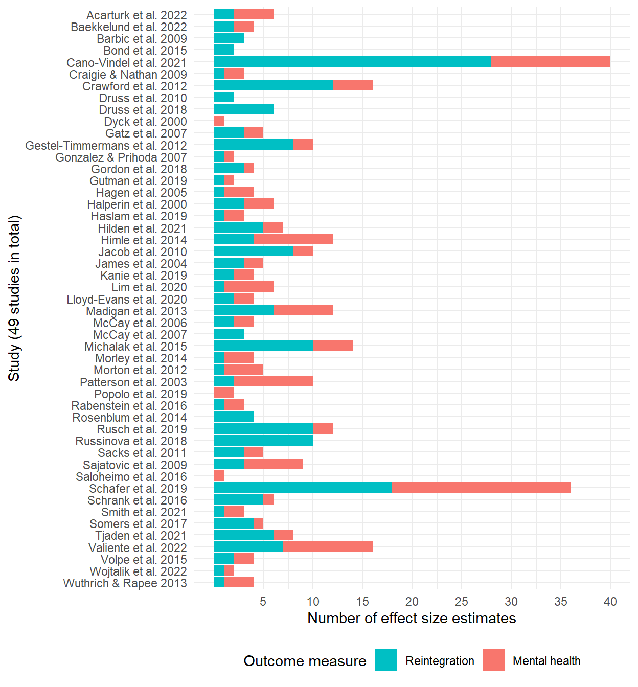{#fig-es-hist-per-stud fig-pos='H' width=624}
:::
:::


### Across outcome subgroups per study

::: {.columns}

::: {.column width="95%"}


::: {.cell}

```{.r .cell-code}
reintegration_dat |>
ggplot(aes(y = study, fill = gt_pop >= 0)) + 
geom_bar(data = subset(reintegration_dat, gt_pop >= 0), aes(x = after_stat(count)), stat = "count") + 
geom_bar(data = subset(reintegration_dat, gt_pop < 0), aes(x = -after_stat(count)), stat = "count") + 
theme_minimal() +
scale_x_continuous(labels = abs, breaks = scales::breaks_width(5), limits = c(-10, 30)) +
scale_y_discrete(limits=rev) +
scale_fill_manual(
  values = c(met.brewer("Navajo")[2], met.brewer("Navajo")[4]), 
  labels = c("Negative ES", "Non-negative ES"), 
  name = "Effect Size"
) +
labs(x = "Number of Effect Size Estimates", y = "", title = "Reintegration") +
theme(
    legend.position = "bottom",
    #legend.position.inside = c(0.95, 0.05),
    #legend.justification = c(1, 0),
    legend.background = element_blank(),
    plot.title = element_text(hjust = 0.5) 
  )
```

::: {.cell-output-display}
{#fig-es-hist-per-stud-reint fig-pos='H' width=1152}
:::
:::

:::

::: {.column-margin}

::: {.cell}

```{.r .cell-code}
mental_health_dat |>
ggplot(aes(y = study, fill = gt_pop >= 0)) + 
geom_bar(data = subset(mental_health_dat, gt_pop >= 0), aes(x = after_stat(count)), stat = "count") + 
geom_bar(data = subset(mental_health_dat, gt_pop < 0), aes(x = -after_stat(count)), stat = "count") + 
theme_minimal() +
scale_x_continuous(labels = abs, breaks = scales::breaks_width(5), limits = c(-5, 15)) +
scale_y_discrete(limits=rev) +
scale_fill_manual(
  values = c(met.brewer("Navajo")[2], met.brewer("Navajo")[4]), 
  labels = c("Negative ES", "Non-negative ES"), 
  name = "Effect Size"
) +
labs(x = "Number of Effect Size Estimates", y = "", title = "Mental Health") +
theme(
    legend.position = "bottom",
    #legend.position.inside = c(0.95, 0.2),
    #legend.justification = c(1, 0),
    legend.background = element_blank(),
    plot.title = element_text(hjust = 0.5) 
  )
```

::: {.cell-output-display}
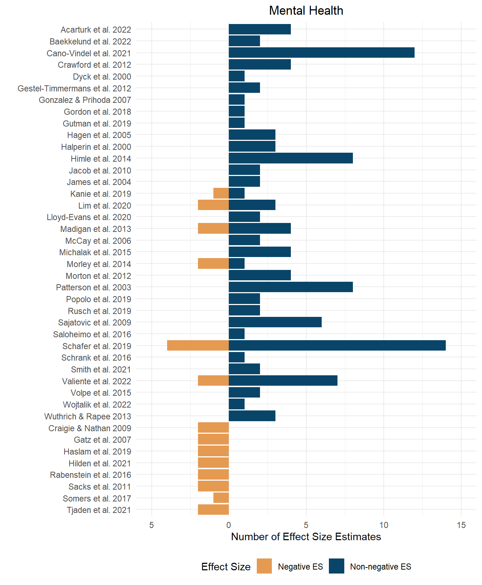{#fig-es-hist-per-stud-mental fig-pos='H' width=672}
:::
:::

:::

:::

### Overall across all studies and outcomes


::: {.cell}

```{.r .cell-code}
# Multi-arms studies
multi_arm_studies <- 
  gb_dat |> 
  filter(trt_id > 1) |> 
  reframe(study = unique(study))
  

# Multi-time-points studies
follow_up_studies <- 
  gb_dat |>
  summarise(
    time_points = length(unique(time_after_end_intervention_weeks)),
    .by = c(study, trt_id, ctr_id)
  ) |>
  filter(time_points > 1)

# Preregistered studies
prereg_studies <- 
  gb_dat |> 
  summarise(
    prereg_chr = unique(prereg_chr),
    n_es = n(),
    .by = study
  ) |> 
  summarise(
    N_studies = n_distinct(study),
    N_es = sum(n_es),
    .by = prereg_chr
  )

study_sample_sizes <- 
  gb_dat |>
  group_by(study, trt_id, ctr_id) |>
  summarise(
    effects = n(),
    participants = max(N_total)
  ) |>
  summarise(
    effects = sum(effects),
    participants = mean(participants),
    ctl_comparisons = n(),
    ctl_arms = paste(ctr_id, collapse = "; ")
  ) |>
  group_by(study, ctl_arms) |>
  summarise(
    effects = sum(effects),
    participants = mean(participants * (1 + ctl_comparisons * (n() - 1) / 2)),
    trt_comparisons = n(),
    trt_arms = paste(trt_id, collapse = "; "),
    ctl_comparisons = mean(ctl_comparisons)
  ) |>
  summarise(
    effects = sum(effects),
    participants = sum(participants),
    trt_comparisons = mean(trt_comparisons),
    ctl_comparisons = sum(ctl_comparisons)
  )

sample_size_summary <-
  study_sample_sizes |>
  summarise(
    studies = n(),
    studies_multiple_tx = sum(trt_comparisons > 1),
    studies_multiple_ctl = sum(ctl_comparisons > 1),
    n_effects = sum(effects),
    mean_effects = mean(effects),
    min_effects = min(effects),
    median_effects = median(effects),
    max_effects = max(effects),
    participants = round(sum(participants))
  ) |> 
  mutate(prereg = prereg_studies$N_studies[1])

n_studies <- sample_size_summary$studies
```
:::


::: {#tbl-es-structure .cell .tbl-cap-location-top tbl-cap='Data structure for the all data.'}

```{.r .cell-code}
kable(
  sample_size_summary,
  col.names = c(
    studies = "Studies",
    studies_multiple_tx = "Multi-treatment studies",
    studies_multiple_ctl = "Multi-control studies",
    n_effects = "Effects",
    mean_effects = "Mean",
    min_effects = "Minimum",
    median_effects = "Median",
    max_effects = "Maximum",
    participants = "Participants",
    prereg = "Preregistered studies"
  ),
  digits = 1
) |>
  kable_styling(bootstrap_options = c("striped", "condensed"),
                full_width = FALSE)
```

::: {.cell-output-display}
`````{=html}
<table class="table table-striped table-condensed" style="width: auto !important; margin-left: auto; margin-right: auto;">
 <thead>
  <tr>
   <th style="text-align:right;"> Studies </th>
   <th style="text-align:right;"> Multi-treatment studies </th>
   <th style="text-align:right;"> Multi-control studies </th>
   <th style="text-align:right;"> Effects </th>
   <th style="text-align:right;"> Mean </th>
   <th style="text-align:right;"> Minimum </th>
   <th style="text-align:right;"> Median </th>
   <th style="text-align:right;"> Maximum </th>
   <th style="text-align:right;"> Participants </th>
   <th style="text-align:right;"> Preregistered studies </th>
  </tr>
 </thead>
<tbody>
  <tr>
   <td style="text-align:right;"> 49 </td>
   <td style="text-align:right;"> 3 </td>
   <td style="text-align:right;"> 0 </td>
   <td style="text-align:right;"> 349 </td>
   <td style="text-align:right;"> 7.1 </td>
   <td style="text-align:right;"> 1 </td>
   <td style="text-align:right;"> 5 </td>
   <td style="text-align:right;"> 40 </td>
   <td style="text-align:right;"> 5543 </td>
   <td style="text-align:right;"> 23 </td>
  </tr>
</tbody>
</table>

`````
:::
:::


::: {.cell}

```{.r .cell-code}
gb_dat |> 
  summarise(
    es_count = n(),
    .by = study
  ) |>  
  arrange(es_count) |> 
  ggplot(aes(x = es_count)) +
  geom_histogram(binwidth = 0.5, fill = met.brewer("Navajo")[4]) +
  scale_x_continuous(breaks = seq(0, 40, by = 5)) +
  scale_y_continuous(breaks = seq(0, 10, 2)) +
  theme_minimal() +
  labs(x = "Effect Size Estimates per Study", y = "Number of Studies")
```

::: {.cell-output-display}
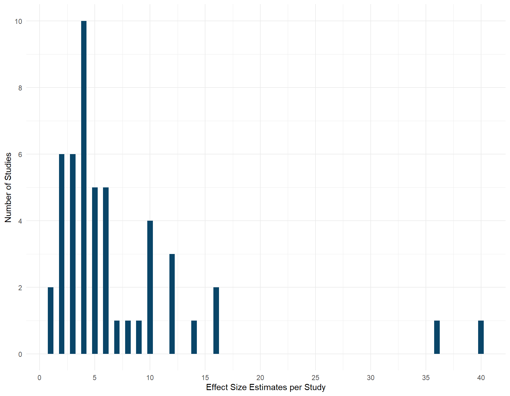{#fig-es-hist fig-pos='H' width=864}
:::
:::


### Across outcome subgroups 

::: {.columns}

::: {.column width="95%"}


::: {.cell}

```{.r .cell-code}
# Multi-arms studies
multi_arm_studies_reint <- 
  reintegration_dat |> 
  filter(trt_id > 1) |> 
  reframe(study = unique(study))
  

# Multi-time-points studies
follow_up_studies_reint <- 
  reintegration_dat |>
  summarise(
    time_points = length(unique(time_after_end_intervention_weeks)),
    .by = c(study, trt_id, ctr_id)
  ) |>
  filter(time_points > 1)

# Preregistered studies
prereg_studies_reint <- 
  reintegration_dat |> 
  summarise(
    prereg_chr = unique(prereg_chr),
    n_es = n(),
    .by = study
  ) |> 
  summarise(
    N_studies = n_distinct(study),
    N_es = sum(n_es),
    .by = prereg_chr
  )

study_sample_sizes_reint <- 
  reintegration_dat |>
  group_by(study, trt_id, ctr_id) |>
  summarise(
    effects = n(),
    participants = max(N_total)
  ) |>
  summarise(
    effects = sum(effects),
    participants = mean(participants),
    ctl_comparisons = n(),
    ctl_arms = paste(ctr_id, collapse = "; ")
  ) |>
  group_by(study, ctl_arms) |>
  summarise(
    effects = sum(effects),
    participants = mean(participants * (1 + ctl_comparisons * (n() - 1) / 2)),
    trt_comparisons = n(),
    trt_arms = paste(trt_id, collapse = "; "),
    ctl_comparisons = mean(ctl_comparisons)
  ) |>
  summarise(
    effects = sum(effects),
    participants = sum(participants),
    trt_comparisons = mean(trt_comparisons),
    ctl_comparisons = sum(ctl_comparisons)
  )

sample_size_summary_reint <-
  study_sample_sizes_reint |>
  summarise(
    studies = n(),
    studies_multiple_tx = sum(trt_comparisons > 1),
    studies_multiple_ctl = sum(ctl_comparisons > 1),
    n_effects = sum(effects),
    mean_effects = mean(effects),
    min_effects = min(effects),
    median_effects = median(effects),
    max_effects = max(effects),
    participants = round(sum(participants))
  ) |> 
  mutate(prereg = prereg_studies_reint$N_studies[1])

n_studies_reint <- sample_size_summary_reint$studies
```
:::


::: {#tbl-es-structure-reint .cell .tbl-cap-location-top tbl-cap='Data structure for the reintegrational data.'}

```{.r .cell-code}
kable(
  sample_size_summary_reint,
  col.names = c(
    studies = "Studies",
    studies_multiple_tx = "Multi-treatment studies",
    studies_multiple_ctl = "Multi-control studies",
    n_effects = "Effects",
    mean_effects = "Mean",
    min_effects = "Minimum",
    median_effects = "Median",
    max_effects = "Maximum",
    participants = "Participants",
    prereg = "Preregistered studies"
  ),
  digits = 1
) |>
  kable_styling(bootstrap_options = c("striped", "condensed"),
                full_width = FALSE)
```

::: {.cell-output-display}
`````{=html}
<table class="table table-striped table-condensed" style="width: auto !important; margin-left: auto; margin-right: auto;">
 <thead>
  <tr>
   <th style="text-align:right;"> Studies </th>
   <th style="text-align:right;"> Multi-treatment studies </th>
   <th style="text-align:right;"> Multi-control studies </th>
   <th style="text-align:right;"> Effects </th>
   <th style="text-align:right;"> Mean </th>
   <th style="text-align:right;"> Minimum </th>
   <th style="text-align:right;"> Median </th>
   <th style="text-align:right;"> Maximum </th>
   <th style="text-align:right;"> Participants </th>
   <th style="text-align:right;"> Preregistered studies </th>
  </tr>
 </thead>
<tbody>
  <tr>
   <td style="text-align:right;"> 46 </td>
   <td style="text-align:right;"> 3 </td>
   <td style="text-align:right;"> 0 </td>
   <td style="text-align:right;"> 205 </td>
   <td style="text-align:right;"> 4.5 </td>
   <td style="text-align:right;"> 1 </td>
   <td style="text-align:right;"> 3 </td>
   <td style="text-align:right;"> 28 </td>
   <td style="text-align:right;"> 5406 </td>
   <td style="text-align:right;"> 22 </td>
  </tr>
</tbody>
</table>

`````
:::
:::

:::

::: {.column-margin}

::: {.cell}

```{.r .cell-code}
# Multi-arms studies
multi_arm_studies_mental <- 
  mental_health_dat |> 
  filter(trt_id > 1) |> 
  reframe(study = unique(study))
  

# Multi-time-points studies
follow_up_studies_mental <- 
  mental_health_dat |>
  summarise(
    time_points = length(unique(time_after_end_intervention_weeks)),
    .by = c(study, trt_id, ctr_id)
  ) |>
  filter(time_points > 1)

# Preregistered studies
prereg_studies_mental <- 
  mental_health_dat |> 
  summarise(
    prereg_chr = unique(prereg_chr),
    n_es = n(),
    .by = study
  ) |> 
  summarise(
    N_studies = n_distinct(study),
    N_es = sum(n_es),
    .by = prereg_chr
  )

study_sample_sizes_mental <- 
  mental_health_dat |>
  group_by(study, trt_id, ctr_id) |>
  summarise(
    effects = n(),
    participants = max(N_total)
  ) |>
  summarise(
    effects = sum(effects),
    participants = mean(participants),
    ctl_comparisons = n(),
    ctl_arms = paste(ctr_id, collapse = "; ")
  ) |>
  group_by(study, ctl_arms) |>
  summarise(
    effects = sum(effects),
    participants = mean(participants * (1 + ctl_comparisons * (n() - 1) / 2)),
    trt_comparisons = n(),
    trt_arms = paste(trt_id, collapse = "; "),
    ctl_comparisons = mean(ctl_comparisons)
  ) |>
  summarise(
    effects = sum(effects),
    participants = sum(participants),
    trt_comparisons = mean(trt_comparisons),
    ctl_comparisons = sum(ctl_comparisons)
  )

sample_size_summary_mental <-
  study_sample_sizes_mental |>
  summarise(
    studies = n(),
    studies_multiple_tx = sum(trt_comparisons > 1),
    studies_multiple_ctl = sum(ctl_comparisons > 1),
    n_effects = sum(effects),
    mean_effects = mean(effects),
    min_effects = min(effects),
    median_effects = median(effects),
    max_effects = max(effects),
    participants = round(sum(participants))
  ) |> 
  mutate(prereg = prereg_studies_mental$N_studies[1])

n_studies_mental <- sample_size_summary_mental$studies
```
:::


::: {#tbl-es-structure-mental .cell .tbl-cap-location-top tbl-cap='Data structure for the mental health data.'}

```{.r .cell-code}
kable(
  sample_size_summary_mental,
  col.names = c(
    studies = "Studies",
    studies_multiple_tx = "Multi-treatment studies",
    studies_multiple_ctl = "Multi-control studies",
    n_effects = "Effects",
    mean_effects = "Mean",
    min_effects = "Minimum",
    median_effects = "Median",
    max_effects = "Maximum",
    participants = "Participants",
    prereg = "Preregistered studies"
  ),
  digits = 1
) |>
  kable_styling(bootstrap_options = c("striped", "condensed"),
                full_width = FALSE)
```

::: {.cell-output-display}
`````{=html}
<table class="table table-striped table-condensed" style="width: auto !important; margin-left: auto; margin-right: auto;">
 <thead>
  <tr>
   <th style="text-align:right;"> Studies </th>
   <th style="text-align:right;"> Multi-treatment studies </th>
   <th style="text-align:right;"> Multi-control studies </th>
   <th style="text-align:right;"> Effects </th>
   <th style="text-align:right;"> Mean </th>
   <th style="text-align:right;"> Minimum </th>
   <th style="text-align:right;"> Median </th>
   <th style="text-align:right;"> Maximum </th>
   <th style="text-align:right;"> Participants </th>
   <th style="text-align:right;"> Preregistered studies </th>
  </tr>
 </thead>
<tbody>
  <tr>
   <td style="text-align:right;"> 42 </td>
   <td style="text-align:right;"> 3 </td>
   <td style="text-align:right;"> 0 </td>
   <td style="text-align:right;"> 144 </td>
   <td style="text-align:right;"> 3.4 </td>
   <td style="text-align:right;"> 1 </td>
   <td style="text-align:right;"> 2 </td>
   <td style="text-align:right;"> 18 </td>
   <td style="text-align:right;"> 4679 </td>
   <td style="text-align:right;"> 20 </td>
  </tr>
</tbody>
</table>

`````
:::
:::

:::

:::

::: {.columns}

::: {.column width="95%"}

::: {.cell}

```{.r .cell-code}
reintegration_dat |> 
  summarise(
    es_count = n(),
    .by = study
  ) |>  
  arrange(es_count) |> 
  ggplot(aes(x = es_count)) +
  geom_histogram(binwidth = 0.5, fill = "cornflowerblue") +
  scale_x_continuous(breaks = seq(0, 30, by = 5)) +
  scale_y_continuous(breaks = seq(0, 14, 2), limits = c(0, 14)) +
  theme_minimal() +
  theme(plot.title = element_text(hjust = 0.5)) +
  labs(x = "Effect Size Estimates per Study", y = "Number of Studies", title = "Reintegration") +
  expand_limits(x = 30)
```

::: {.cell-output-display}
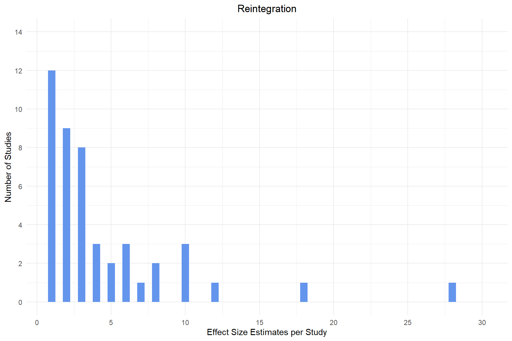{#fig-es-hist-reint fig-pos='H' width=864}
:::
:::

:::

::: {.column-margin}

::: {.cell}

```{.r .cell-code}
mental_health_dat |> 
  summarise(
    es_count = n(),
    .by = study
  ) |>  
  arrange(es_count) |> 
  ggplot(aes(x = es_count)) +
  geom_histogram(binwidth = 0.5, fill = "gray") +
  scale_x_continuous(breaks = seq(0, 20, by = 5)) +
  scale_y_continuous(breaks = seq(0, 10, 2), limits = c(0, 11)) +
  theme_minimal() +
  theme(plot.title = element_text(hjust = 0.5)) +
  labs(x = "Effect Size Estimates per Study", y = "Number of Studies", title = "Mental Health") +
  expand_limits(x = 20)
```

::: {.cell-output-display}
{#fig-es-hist-mental fig-pos='H' width=672}
:::
:::

:::

:::

## Data structure by outcome constructs


::: {.cell}

```{.r .cell-code}
label_cat_hist_ridge <- function(data, n_es, variable, label_map, level_order) {
  require(dplyr)
  require(rlang)
  require(tidyr)
  require(ggplot2)
  require(forcats)
  
  n_es_exp <- enquo(n_es)
  var_exp <- enquo(variable)
  
  data <- data |> 
    mutate(
      !!var_exp := fct_recode(!!var_exp, !!!label_map),
      !!var_exp := fct_relevel(!!var_exp, !!!level_order),
      !!var_exp := fct_rev(!!var_exp)
    ) 
  
  ggplot(data, aes(
    x = !!n_es_exp,
    y = !!var_exp,
    fill = !!var_exp
  )) +
    geom_density_ridges(
      alpha = 1,
      stat = "binline",
      bins = 30,
      scale = 0.7,
      linewidth = 0.1,
      draw_baseline = FALSE
    ) +
    theme_minimal() +
    labs(y = "", x = "Effect Size Estimates per Study") +
    theme(legend.position = "none")
}
```
:::


The following plot shows the effect size estimates distribution within each outcome construct.

::: {.columns}

::: {.column width="95%"}

::: {.cell}

```{.r .cell-code}
n_es_by_construct <- 
  gb_dat |> 
  filter(str_detect(outcome_construct, "Re")) |> 
  summarise(effects = n(), .by = c(study, analysis_plan)) |> 
  mutate(J = n(), .by = c(analysis_plan)) |> 
  arrange(desc(J)) 

# Used to construct out_label 
#label_dat <- 
#  n_es_by_construct |> 
#  summarise(J = n(), N_es = sum(effects), .by = analysis_plan)


out_label <- c(
  "Wellbeing and quality of life (J = 24, K = 67)" = "Wellbeing and quality of life",
  "Social functioning (degree of impairment) (J =16, K = 47)" = "Social functioning (degree of impairment)",
  "Hope, empowerment & self-efficacy (J = 12, K = 32)" = "Hope, empowerment & self-efficacy",
  "Alcohol and drug abuse/misuse (J = 7, K = 31)" = "Alcohol and drug abuse/misuse",
  "Self-esteem (J = 5, K = 14)" = "Self-esteem",
  "Loneliness (J = 4, K = 5)" = "Loneliness",
  "Physical health (J = 2, K = 3)" = "Physical health",
  "Psychiatric hospitalization (J = 1, K = 1)" = "Psychiatric hospitalization",
  "Employment (J = 1, K = 2)" = "Employment"
)

out_level <- c(
 "Wellbeing and quality of life (J = 24, K = 67)",
  "Social functioning (degree of impairment) (J =16, K = 47)",
  "Hope, empowerment & self-efficacy (J = 12, K = 32)",
  "Alcohol and drug abuse/misuse (J = 7, K = 31)",
  "Self-esteem (J = 5, K = 14)",
  "Loneliness (J = 4, K = 5)",
  "Physical health (J = 2, K = 3)",
  "Psychiatric hospitalization (J = 1, K = 1)",
  "Employment (J = 1, K = 2)"
)

label_cat_hist_ridge(
  data = n_es_by_construct, 
  n_es = effects, 
  variable = analysis_plan, 
  label_map = out_label, 
  level_order = out_level
) + 
  expand_limits(x = 20) + 
  labs(title = "Reintegrational outcomes") + 
  theme(plot.title = element_text(hjust = 0.5))
```

::: {.cell-output-display}
{#fig-outcome-construct-ridge-hist fig-pos='H' width=864}
:::
:::

:::

::: {.column-margin}

::: {.cell}

```{.r .cell-code}
n_es_by_construct_mental <- 
  gb_dat |> 
  filter(str_detect(outcome_construct, "Men")) |> 
  summarise(effects = n(), .by = c(study, analysis_plan)) |> 
  mutate(J = n(), .by = c(analysis_plan)) |> 
  arrange(desc(J)) 

# Used to construct out_label_mental 
#label_dat_mental <- 
#  n_es_by_construct_mental |> 
#  summarise(J = n(), N_es = sum(effects), .by = analysis_plan)

out_label_mental <- c(
  "General mental health (J = 28, K = 70)" = "General mental health",
  "Depression (J = 19, K = 36)" = "Depression",
  "Anxiety (J = 9, K = 14)" = "Anxiety",
  "Symptoms of psychosis (J = 7, K = 21)" = "Symptoms of psychosis"
)

out_level_mental <- c(
  "General mental health (J = 28, K = 70)",
  "Depression (J = 19, K = 36)",
  "Anxiety (J = 9, K = 14)",
  "Symptoms of psychosis (J = 7, K = 21)"
)

label_cat_hist_ridge(
  data = n_es_by_construct_mental, 
  n_es = effects, 
  variable = analysis_plan, 
  label_map = out_label_mental, 
  level_order = out_level_mental
) + 
  expand_limits(x = 15) + 
  labs(title = "Mental heath outcomes") + 
  theme(plot.title = element_text(hjust = 0.5))
```

::: {.cell-output-display}
{#fig-outcome-construct-ridge-hist-mental fig-pos='H' width=672}
:::
:::

:::

:::

## Primary study sample size


### Total sample sizes

::: {.columns}

::: {.column width="95%"}

::: {#tbl-sample-size .cell .tbl-cap-location-top tbl-cap='Distribution of primary study sample sizes at post test for reintegrational outcomes'}

```{.r .cell-code}
# Used when describing the treatment group sample sizes
N_t_stud_trtid <- 
  reintegration_dat |> 
  reframe(N_treat = max(N_t), .by = c(study, trt_id)) 

N_t_total <- 
  N_t_stud_trtid |> 
  summarise(N_t_total = sum(N_treat), .by = study)

N_c_total <- 
  reintegration_dat |> 
  summarise(N_c_total = max(N_c), .by = study)

N_total_dat <- 
  left_join(N_t_total, N_c_total, by = join_by(study)) |> 
  mutate(N_total = N_t_total + N_c_total)


primary_sample_size_descriptive <- 
  N_total_dat$N_total |> 
  skim() |>
  select(-skim_type, -skim_variable, -n_missing, -complete_rate, -numeric.hist) |>
  rename_at(vars(starts_with("numeric.")), ~ str_remove(., "numeric\\.")) 

primary_sample_size_descriptive |>
  knitr::kable(
    digits = 2,
    booktabs = TRUE
  ) |>
  kable_styling(bootstrap_options = c("striped","condensed"), full_width = FALSE)
```

::: {.cell-output-display}
`````{=html}
<table class="table table-striped table-condensed" style="width: auto !important; margin-left: auto; margin-right: auto;">
 <thead>
  <tr>
   <th style="text-align:right;"> mean </th>
   <th style="text-align:right;"> sd </th>
   <th style="text-align:right;"> p0 </th>
   <th style="text-align:right;"> p25 </th>
   <th style="text-align:right;"> p50 </th>
   <th style="text-align:right;"> p75 </th>
   <th style="text-align:right;"> p100 </th>
  </tr>
 </thead>
<tbody>
  <tr>
   <td style="text-align:right;"> 117.52 </td>
   <td style="text-align:right;"> 127.19 </td>
   <td style="text-align:right;"> 16 </td>
   <td style="text-align:right;"> 40.25 </td>
   <td style="text-align:right;"> 60 </td>
   <td style="text-align:right;"> 133.25 </td>
   <td style="text-align:right;"> 631 </td>
  </tr>
</tbody>
</table>

`````
:::
:::

:::

::: {.column-margin} 

::: {#tbl-sample-size-mental .cell .tbl-cap-location-top tbl-cap='Distribution of primary study sample sizes at post test for mental health outcomes'}

```{.r .cell-code}
# Used when describing the treatment group sample sizes
N_t_stud_trtid_mental <- 
  mental_health_dat |> 
  reframe(N_treat = max(N_t), .by = c(study, trt_id)) 

N_t_total_mental <- 
  N_t_stud_trtid_mental |> 
  summarise(N_t_total = sum(N_treat), .by = study)

N_c_total_mental <- 
  mental_health_dat |> 
  summarise(N_c_total = max(N_c), .by = study)

N_total_dat_mental <- 
  left_join(N_t_total_mental, N_c_total_mental, by = join_by(study)) |> 
  mutate(N_total = N_t_total + N_c_total)


primary_sample_size_descriptive_mental <- 
  N_total_dat_mental$N_total |> 
  skim() |>
  select(-skim_type, -skim_variable, -n_missing, -complete_rate, -numeric.hist) |>
  rename_at(vars(starts_with("numeric.")), ~ str_remove(., "numeric\\.")) 

primary_sample_size_descriptive_mental |>
  knitr::kable(
    digits = 2,
    booktabs = TRUE
  ) |>
  kable_styling(bootstrap_options = c("striped","condensed"), full_width = FALSE)
```

::: {.cell-output-display}
`````{=html}
<table class="table table-striped table-condensed" style="width: auto !important; margin-left: auto; margin-right: auto;">
 <thead>
  <tr>
   <th style="text-align:right;"> mean </th>
   <th style="text-align:right;"> sd </th>
   <th style="text-align:right;"> p0 </th>
   <th style="text-align:right;"> p25 </th>
   <th style="text-align:right;"> p50 </th>
   <th style="text-align:right;"> p75 </th>
   <th style="text-align:right;"> p100 </th>
  </tr>
 </thead>
<tbody>
  <tr>
   <td style="text-align:right;"> 111.4 </td>
   <td style="text-align:right;"> 124.97 </td>
   <td style="text-align:right;"> 16 </td>
   <td style="text-align:right;"> 39.25 </td>
   <td style="text-align:right;"> 60.5 </td>
   <td style="text-align:right;"> 126 </td>
   <td style="text-align:right;"> 631 </td>
  </tr>
</tbody>
</table>

`````
:::
:::

:::

:::

The following plot displays the distribution of study sample sizes at post-test.

::: {.columns}

::: {.column width="95%"}

::: {.cell}

```{.r .cell-code}
study_sizes_plot_reint <- 
  ggplot(N_total_dat, aes(N_total)) + 
  geom_density(fill = "cornflowerblue", alpha = 0.8) + 
  geom_blank(aes(x = 0, y = 0)) + 
  geom_rug(alpha = 0.8) +
  scale_y_continuous(NULL, breaks = NULL) + 
  theme_minimal() + 
  labs(x = "Total Sample Size", y = "")
study_sizes_plot_reint
```

::: {.cell-output-display}
{#fig-sample-size-reint fig-pos='H' width=768}
:::
:::

:::

::: {.column-margin}

::: {.cell}

```{.r .cell-code}
study_sizes_plot_mental <- 
  ggplot(N_total_dat_mental, aes(N_total)) + 
  geom_density(fill = "gray", alpha = 0.8) + 
  geom_blank(aes(x = 0, y = 0)) + 
  geom_rug(alpha = 0.8) +
  scale_y_continuous(NULL, breaks = NULL) + 
  theme_minimal() + 
  labs(x = "Total Sample Size", y = "")
study_sizes_plot_mental
```

::: {.cell-output-display}
{#fig-sample-size-mental fig-pos='H' width=672}
:::
:::

:::

:::

### Treatment group

::: {.columns}

::: {.column width="95%"}

::: {#tbl-sample-size-treatment .cell .tbl-cap-location-top tbl-cap='Distribution of treatment sample sizes at post test for reintegrational outcomes'}

```{.r .cell-code}
treatment_sample_size_descriptive <- 
  N_t_stud_trtid$N_treat |> 
  skim() |>
  select(-skim_type, -skim_variable, -n_missing, -complete_rate, -numeric.hist) |>
  rename_at(vars(starts_with("numeric.")), ~ str_remove(., "numeric\\.")) 

treatment_sample_size_descriptive |>
  knitr::kable(
    digits = 2,
    booktabs = TRUE
  ) |>
  kable_styling(bootstrap_options = c("striped","condensed"), full_width = FALSE)
```

::: {.cell-output-display}
`````{=html}
<table class="table table-striped table-condensed" style="width: auto !important; margin-left: auto; margin-right: auto;">
 <thead>
  <tr>
   <th style="text-align:right;"> mean </th>
   <th style="text-align:right;"> sd </th>
   <th style="text-align:right;"> p0 </th>
   <th style="text-align:right;"> p25 </th>
   <th style="text-align:right;"> p50 </th>
   <th style="text-align:right;"> p75 </th>
   <th style="text-align:right;"> p100 </th>
  </tr>
 </thead>
<tbody>
  <tr>
   <td style="text-align:right;"> 59.78 </td>
   <td style="text-align:right;"> 60.18 </td>
   <td style="text-align:right;"> 7 </td>
   <td style="text-align:right;"> 22 </td>
   <td style="text-align:right;"> 32 </td>
   <td style="text-align:right;"> 90 </td>
   <td style="text-align:right;"> 315 </td>
  </tr>
</tbody>
</table>

`````
:::
:::

:::

::: {.column-margin} 

::: {#tbl-sample-size-treatment-mental .cell .tbl-cap-location-top tbl-cap='Distribution of treatment sample sizes at post test for mental health outcomes'}

```{.r .cell-code}
treatment_sample_size_descriptive_mental <- 
  N_t_stud_trtid_mental$N_treat |> 
  skim() |>
  select(-skim_type, -skim_variable, -n_missing, -complete_rate, -numeric.hist) |>
  rename_at(vars(starts_with("numeric.")), ~ str_remove(., "numeric\\.")) 

treatment_sample_size_descriptive_mental |>
  knitr::kable(
    digits = 2,
    booktabs = TRUE
  ) |>
  kable_styling(bootstrap_options = c("striped","condensed"), full_width = FALSE)
```

::: {.cell-output-display}
`````{=html}
<table class="table table-striped table-condensed" style="width: auto !important; margin-left: auto; margin-right: auto;">
 <thead>
  <tr>
   <th style="text-align:right;"> mean </th>
   <th style="text-align:right;"> sd </th>
   <th style="text-align:right;"> p0 </th>
   <th style="text-align:right;"> p25 </th>
   <th style="text-align:right;"> p50 </th>
   <th style="text-align:right;"> p75 </th>
   <th style="text-align:right;"> p100 </th>
  </tr>
 </thead>
<tbody>
  <tr>
   <td style="text-align:right;"> 56.67 </td>
   <td style="text-align:right;"> 58.91 </td>
   <td style="text-align:right;"> 7 </td>
   <td style="text-align:right;"> 21 </td>
   <td style="text-align:right;"> 29 </td>
   <td style="text-align:right;"> 70 </td>
   <td style="text-align:right;"> 315 </td>
  </tr>
</tbody>
</table>

`````
:::
:::

:::

:::

The following plot displays the distribution of treatment sample sizes at post-test.

::: {.columns}

::: {.column width="95%"}

::: {.cell}

```{.r .cell-code}
treatment_sizes_plot_reint <- 
  ggplot(N_t_stud_trtid, aes(N_treat)) + 
  geom_density(fill = "cornflowerblue", alpha = 0.8) + 
  geom_blank(aes(x = 0, y = 0)) + 
  geom_rug(alpha = 0.8) +
  scale_y_continuous(NULL, breaks = NULL) + 
  theme_minimal() + 
  labs(x = "Total Treatment Sample Size", y = "")
treatment_sizes_plot_reint
```

::: {.cell-output-display}
{#fig-sample-size-treatment-reint fig-pos='H' width=768}
:::
:::

:::

::: {.column-margin}

::: {.cell}

```{.r .cell-code}
treatment_sizes_plot_mental <- 
  ggplot(N_t_stud_trtid_mental, aes(N_treat)) + 
  geom_density(fill = "gray", alpha = 0.8) + 
  geom_blank(aes(x = 0, y = 0)) + 
  geom_rug(alpha = 0.8) +
  scale_y_continuous(NULL, breaks = NULL) + 
  theme_minimal() + 
  labs(x = "Total Treatment Sample Size", y = "")
treatment_sizes_plot_mental
```

::: {.cell-output-display}
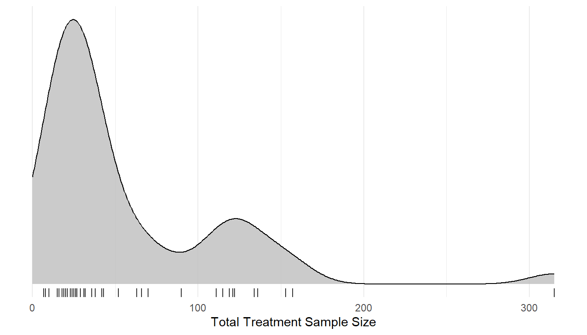{#fig-sample-size-treatment-mental fig-pos='H' width=672}
:::
:::

:::

:::

### Control group

::: {.columns}

::: {.column width="95%"}

::: {#tbl-sample-size-control .cell .tbl-cap-location-top tbl-cap='Distribution of control group sample sizes at post test for reintegrational outcomes'}

```{.r .cell-code}
control_sample_size_descriptive <- 
  N_total_dat$N_c_total |> 
  skim() |>
  select(-skim_type, -skim_variable, -n_missing, -complete_rate, -numeric.hist) |>
  rename_at(vars(starts_with("numeric.")), ~ str_remove(., "numeric\\.")) 

control_sample_size_descriptive |>
  knitr::kable(
    digits = 2,
    booktabs = TRUE
  ) |>
  kable_styling(bootstrap_options = c("striped","condensed"), full_width = FALSE)
```

::: {.cell-output-display}
`````{=html}
<table class="table table-striped table-condensed" style="width: auto !important; margin-left: auto; margin-right: auto;">
 <thead>
  <tr>
   <th style="text-align:right;"> mean </th>
   <th style="text-align:right;"> sd </th>
   <th style="text-align:right;"> p0 </th>
   <th style="text-align:right;"> p25 </th>
   <th style="text-align:right;"> p50 </th>
   <th style="text-align:right;"> p75 </th>
   <th style="text-align:right;"> p100 </th>
  </tr>
 </thead>
<tbody>
  <tr>
   <td style="text-align:right;"> 53.85 </td>
   <td style="text-align:right;"> 60.21 </td>
   <td style="text-align:right;"> 9 </td>
   <td style="text-align:right;"> 18.25 </td>
   <td style="text-align:right;"> 29.5 </td>
   <td style="text-align:right;"> 62.5 </td>
   <td style="text-align:right;"> 316 </td>
  </tr>
</tbody>
</table>

`````
:::
:::

:::

::: {.column-margin} 

::: {#tbl-sample-size-control-mental .cell .tbl-cap-location-top tbl-cap='Distribution of control group sample sizes at post test for mental health outcomes'}

```{.r .cell-code}
control_sample_size_descriptive_mental <- 
  N_total_dat_mental$N_c_total |> 
  skim() |>
  select(-skim_type, -skim_variable, -n_missing, -complete_rate, -numeric.hist) |>
  rename_at(vars(starts_with("numeric.")), ~ str_remove(., "numeric\\.")) 

control_sample_size_descriptive_mental |>
  knitr::kable(
    digits = 2,
    booktabs = TRUE
  ) |>
  kable_styling(bootstrap_options = c("striped","condensed"), full_width = FALSE)
```

::: {.cell-output-display}
`````{=html}
<table class="table table-striped table-condensed" style="width: auto !important; margin-left: auto; margin-right: auto;">
 <thead>
  <tr>
   <th style="text-align:right;"> mean </th>
   <th style="text-align:right;"> sd </th>
   <th style="text-align:right;"> p0 </th>
   <th style="text-align:right;"> p25 </th>
   <th style="text-align:right;"> p50 </th>
   <th style="text-align:right;"> p75 </th>
   <th style="text-align:right;"> p100 </th>
  </tr>
 </thead>
<tbody>
  <tr>
   <td style="text-align:right;"> 50.69 </td>
   <td style="text-align:right;"> 58.27 </td>
   <td style="text-align:right;"> 9 </td>
   <td style="text-align:right;"> 17.75 </td>
   <td style="text-align:right;"> 29 </td>
   <td style="text-align:right;"> 62.5 </td>
   <td style="text-align:right;"> 316 </td>
  </tr>
</tbody>
</table>

`````
:::
:::

:::

:::

The following plot displays the distribution of control sample sizes at post-test.

::: {.columns}

::: {.column width="95%"}

::: {.cell}

```{.r .cell-code}
control_sizes_plot_reint <- 
  ggplot(N_total_dat, aes(N_c_total)) + 
  geom_density(fill = "cornflowerblue", alpha = 0.8) + 
  geom_blank(aes(x = 0, y = 0)) + 
  geom_rug(alpha = 0.8) +
  scale_y_continuous(NULL, breaks = NULL) + 
  theme_minimal() + 
  labs(x = "Total Control Group Sample Size", y = "")
control_sizes_plot_reint
```

::: {.cell-output-display}
{#fig-sample-size-control-reint fig-pos='H' width=768}
:::
:::

:::

::: {.column-margin}

::: {.cell}

```{.r .cell-code}
control_sizes_plot_mental <- 
  ggplot(N_total_dat_mental, aes(N_c_total)) + 
  geom_density(fill = "gray", alpha = 0.8) + 
  geom_blank(aes(x = 0, y = 0)) + 
  geom_rug(alpha = 0.8) +
  scale_y_continuous(NULL, breaks = NULL) + 
  theme_minimal() + 
  labs(x = "Total Control Group Sample Size", y = "")
control_sizes_plot_mental
```

::: {.cell-output-display}
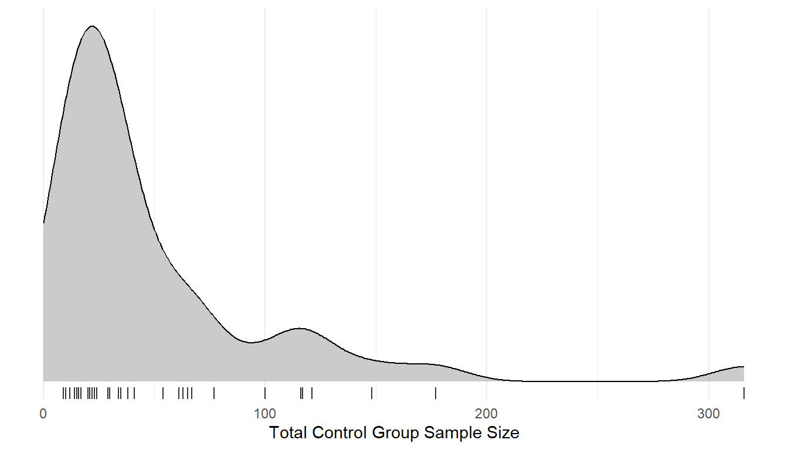{#fig-sample-size-control-mental fig-pos='H' width=672}
:::
:::

:::

:::

## Study sample sizes versus number of effect size estimates per study


::: {.cell}

```{.r .cell-code}
plot <- 
  reintegration_dat |> 
  summarise(effects = n(), .by = study) |> 
  left_join(N_total_dat, by = join_by(study)) |> 
  relocate(effects, .after = N_total) |> 
  ggplot(aes(x = N_total, y = effects)) +
  geom_point(alpha = 0.5) +
  scale_x_continuous(breaks = seq(0, 650, by = 50)) +
  guides(size = "none") + 
  theme_minimal() +
  theme(
    legend.position = "inside",
    legend.position.inside = c(0.9, 0.05),
    legend.justification = c(1, 0),
    legend.background = element_blank()
  ) +
  labs(x = "Total sample size", y = "Number of effect size estimates per study", color = "") +
  expand_limits(y = 30)

ggMarginal(plot, type = "density")
```

::: {.cell-output-display}
{#fig-es-distribution-bivariate fig-pos='H' width=576}
:::
:::


# Moderators

::: {.cell}

```{.r .cell-code}
cat_dat_cross <- function(variable, study_id, data) {
  
  require(dplyr)
  require(rlang)
  require(tidyr)
  
  var_exp <- enquo(variable)
  study_id_exp <- enquo(study_id)
  study_id_name <- as_name(study_id_exp)
  
  
    res_dat <- data %>%
      group_by(!!study_id_exp) %>%
      reframe(var_exp_mirror = unique(!!var_exp))  %>%
      full_join(data,
                by = c(study_id_name),
                relationship = "many-to-many") %>%
      group_by(!!var_exp, var_exp_mirror) %>%
      reframe(
        m = n_distinct(!!study_id_exp),
        k = n()
      ) %>%
      mutate(size = paste0(m, " (", k, ")")) %>%
      select(-m, -k) |>
      pivot_wider(names_from = var_exp_mirror, values_from = "size")
  
  names(res_dat)[1] <- "level" 
  
  res_dat <- 
    res_dat |> 
    mutate(
      level = factor(level, levels = unique(names(res_dat[-1])))
    ) |> 
    arrange(level)

  return(res_dat)
}
```
:::


## Categorical moderators

### Outcome measure


::: {#tbl-outcome-all .cell .tbl-cap-location-top tbl-cap='Dependency table across primary and secondary outcomes'}

```{.r .cell-code}
outcome_dat_all <- 
  cat_dat_cross(
    data = gb_dat,
    variable = outcome_construct,
    study_id = study
  )

outcome_dat_all |>
  knitr::kable(
    "html",
    col.names = c(
      "Outcome",
      colnames(outcome_dat_all)[-1]
    )
  ) |>
  kableExtra::column_spec(1, bold = TRUE) |>
  kableExtra::footnote(
    general = "Values outside the parentheses are number of studies, with the number of samples and effect size estimates shown in the parentheses.",
    general_title = "Note: ",
    footnote_as_chunk = T
  ) |>
  kableExtra::kable_styling(bootstrap_options = c("striped", "condensed"), full_width = T)
```

::: {.cell-output-display}
`````{=html}
<table style="NAborder-bottom: 0; margin-left: auto; margin-right: auto;" class="table table-striped table-condensed">
 <thead>
  <tr>
   <th style="text-align:left;"> Outcome </th>
   <th style="text-align:left;"> Mental health outcome </th>
   <th style="text-align:left;"> Reintegrational outcome </th>
  </tr>
 </thead>
<tbody>
  <tr>
   <td style="text-align:left;font-weight: bold;"> Mental health outcome </td>
   <td style="text-align:left;"> 42 (144) </td>
   <td style="text-align:left;"> 39 (140) </td>
  </tr>
  <tr>
   <td style="text-align:left;font-weight: bold;"> Reintegrational outcome </td>
   <td style="text-align:left;"> 39 (175) </td>
   <td style="text-align:left;"> 46 (205) </td>
  </tr>
</tbody>
<tfoot><tr><td style="padding: 0; " colspan="100%">
<span style="font-style: italic;">Note: </span> <sup></sup> Values outside the parentheses are number of studies, with the number of samples and effect size estimates shown in the parentheses.</td></tr></tfoot>
</table>

`````
:::
:::


::: {#tbl-outcome .cell .tbl-cap-location-top tbl-cap='Dependency table for reintegrational outcomes'}

```{.r .cell-code}
outcome_dat_cross <- cat_dat_cross(
  data = reintegration_dat,
  variable = analysis_plan,
  study_id = study
)


outcome_dat_cross |>
  knitr::kable(
    "html",
    col.names = c(
      "Outcome",
      colnames(outcome_dat_cross)[-1]
    )
  ) |>
  kableExtra::column_spec(1, bold = TRUE) |>
  kableExtra::footnote(
    general = "Values outside the parentheses are number of studies, with the number of samples and effect size estimates shown in the parentheses.",
    general_title = "Note: ",
    footnote_as_chunk = T
  ) |>
  kableExtra::kable_styling(bootstrap_options = c("striped", "condensed"), full_width = T)
```

::: {.cell-output-display}
`````{=html}
<table style="NAborder-bottom: 0; margin-left: auto; margin-right: auto;" class="table table-striped table-condensed">
 <thead>
  <tr>
   <th style="text-align:left;"> Outcome </th>
   <th style="text-align:left;"> Alcohol and drug abuse/misuse </th>
   <th style="text-align:left;"> Hope, empowerment &amp; self-efficacy </th>
   <th style="text-align:left;"> Physical health </th>
   <th style="text-align:left;"> Social functioning (degree of impairment) </th>
   <th style="text-align:left;"> Wellbeing and quality of life </th>
   <th style="text-align:left;"> Employment </th>
   <th style="text-align:left;"> Self-esteem </th>
   <th style="text-align:left;"> Loneliness </th>
   <th style="text-align:left;"> Psychiatric hospitalization </th>
  </tr>
 </thead>
<tbody>
  <tr>
   <td style="text-align:left;font-weight: bold;"> Alcohol and drug abuse/misuse </td>
   <td style="text-align:left;"> 8 (32) </td>
   <td style="text-align:left;"> 1 (2) </td>
   <td style="text-align:left;"> 1 (1) </td>
   <td style="text-align:left;"> 4 (5) </td>
   <td style="text-align:left;"> 3 (4) </td>
   <td style="text-align:left;"> - </td>
   <td style="text-align:left;"> - </td>
   <td style="text-align:left;"> - </td>
   <td style="text-align:left;"> - </td>
  </tr>
  <tr>
   <td style="text-align:left;font-weight: bold;"> Hope, empowerment &amp; self-efficacy </td>
   <td style="text-align:left;"> 1 (1) </td>
   <td style="text-align:left;"> 12 (32) </td>
   <td style="text-align:left;"> - </td>
   <td style="text-align:left;"> 1 (2) </td>
   <td style="text-align:left;"> 6 (14) </td>
   <td style="text-align:left;"> 1 (6) </td>
   <td style="text-align:left;"> 3 (15) </td>
   <td style="text-align:left;"> 1 (4) </td>
   <td style="text-align:left;"> 1 (1) </td>
  </tr>
  <tr>
   <td style="text-align:left;font-weight: bold;"> Physical health </td>
   <td style="text-align:left;"> 1 (1) </td>
   <td style="text-align:left;"> - </td>
   <td style="text-align:left;"> 2 (3) </td>
   <td style="text-align:left;"> 2 (3) </td>
   <td style="text-align:left;"> - </td>
   <td style="text-align:left;"> - </td>
   <td style="text-align:left;"> - </td>
   <td style="text-align:left;"> - </td>
   <td style="text-align:left;"> - </td>
  </tr>
  <tr>
   <td style="text-align:left;font-weight: bold;"> Social functioning (degree of impairment) </td>
   <td style="text-align:left;"> 4 (8) </td>
   <td style="text-align:left;"> 1 (2) </td>
   <td style="text-align:left;"> 2 (5) </td>
   <td style="text-align:left;"> 17 (48) </td>
   <td style="text-align:left;"> 8 (31) </td>
   <td style="text-align:left;"> - </td>
   <td style="text-align:left;"> - </td>
   <td style="text-align:left;"> - </td>
   <td style="text-align:left;"> - </td>
  </tr>
  <tr>
   <td style="text-align:left;font-weight: bold;"> Wellbeing and quality of life </td>
   <td style="text-align:left;"> 3 (4) </td>
   <td style="text-align:left;"> 6 (12) </td>
   <td style="text-align:left;"> - </td>
   <td style="text-align:left;"> 8 (35) </td>
   <td style="text-align:left;"> 25 (68) </td>
   <td style="text-align:left;"> - </td>
   <td style="text-align:left;"> 2 (2) </td>
   <td style="text-align:left;"> 2 (3) </td>
   <td style="text-align:left;"> - </td>
  </tr>
  <tr>
   <td style="text-align:left;font-weight: bold;"> Employment </td>
   <td style="text-align:left;"> - </td>
   <td style="text-align:left;"> 1 (2) </td>
   <td style="text-align:left;"> - </td>
   <td style="text-align:left;"> - </td>
   <td style="text-align:left;"> - </td>
   <td style="text-align:left;"> 1 (2) </td>
   <td style="text-align:left;"> 1 (2) </td>
   <td style="text-align:left;"> - </td>
   <td style="text-align:left;"> - </td>
  </tr>
  <tr>
   <td style="text-align:left;font-weight: bold;"> Self-esteem </td>
   <td style="text-align:left;"> - </td>
   <td style="text-align:left;"> 3 (5) </td>
   <td style="text-align:left;"> - </td>
   <td style="text-align:left;"> - </td>
   <td style="text-align:left;"> 2 (2) </td>
   <td style="text-align:left;"> 1 (2) </td>
   <td style="text-align:left;"> 5 (14) </td>
   <td style="text-align:left;"> - </td>
   <td style="text-align:left;"> - </td>
  </tr>
  <tr>
   <td style="text-align:left;font-weight: bold;"> Loneliness </td>
   <td style="text-align:left;"> - </td>
   <td style="text-align:left;"> 1 (2) </td>
   <td style="text-align:left;"> - </td>
   <td style="text-align:left;"> - </td>
   <td style="text-align:left;"> 2 (3) </td>
   <td style="text-align:left;"> - </td>
   <td style="text-align:left;"> - </td>
   <td style="text-align:left;"> 4 (5) </td>
   <td style="text-align:left;"> - </td>
  </tr>
  <tr>
   <td style="text-align:left;font-weight: bold;"> Psychiatric hospitalization </td>
   <td style="text-align:left;"> - </td>
   <td style="text-align:left;"> 1 (1) </td>
   <td style="text-align:left;"> - </td>
   <td style="text-align:left;"> - </td>
   <td style="text-align:left;"> - </td>
   <td style="text-align:left;"> - </td>
   <td style="text-align:left;"> - </td>
   <td style="text-align:left;"> - </td>
   <td style="text-align:left;"> 1 (1) </td>
  </tr>
</tbody>
<tfoot><tr><td style="padding: 0; " colspan="100%">
<span style="font-style: italic;">Note: </span> <sup></sup> Values outside the parentheses are number of studies, with the number of samples and effect size estimates shown in the parentheses.</td></tr></tfoot>
</table>

`````
:::
:::


::: {.columns}

::: {.column width="95%"}

::: {#tbl-outcome-subgroup .cell .tbl-cap-location-top tbl-cap='Dependency table for outcome used for subgroup analysis (reintegration)'}

```{.r .cell-code}
outcome_subgroup_dat_cross <- cat_dat_cross(
  data = filter(reintegration_dat, str_detect(analysis_plan, "Alco|Hope|Social|Well")),
  variable = analysis_plan,
  study_id = study
)


outcome_subgroup_dat_cross |>
  knitr::kable(
    "html",
    col.names = c(
      "Outcome",
      colnames(outcome_subgroup_dat_cross)[-1]
    )
  ) |>
  kableExtra::column_spec(1, bold = TRUE) |>
  kableExtra::footnote(
    general = "Values outside the parentheses are number of studies, with the number of samples and effect size estimates shown in the parentheses.", 
    general_title = "Note: ",
    footnote_as_chunk = T
  ) |>
  kableExtra::kable_styling(bootstrap_options = c("striped", "condensed"), full_width = T)
```

::: {.cell-output-display}
`````{=html}
<table style="NAborder-bottom: 0; margin-left: auto; margin-right: auto;" class="table table-striped table-condensed">
 <thead>
  <tr>
   <th style="text-align:left;"> Outcome </th>
   <th style="text-align:left;"> Alcohol and drug abuse/misuse </th>
   <th style="text-align:left;"> Hope, empowerment &amp; self-efficacy </th>
   <th style="text-align:left;"> Social functioning (degree of impairment) </th>
   <th style="text-align:left;"> Wellbeing and quality of life </th>
  </tr>
 </thead>
<tbody>
  <tr>
   <td style="text-align:left;font-weight: bold;"> Alcohol and drug abuse/misuse </td>
   <td style="text-align:left;"> 8 (32) </td>
   <td style="text-align:left;"> 1 (2) </td>
   <td style="text-align:left;"> 4 (5) </td>
   <td style="text-align:left;"> 3 (4) </td>
  </tr>
  <tr>
   <td style="text-align:left;font-weight: bold;"> Hope, empowerment &amp; self-efficacy </td>
   <td style="text-align:left;"> 1 (1) </td>
   <td style="text-align:left;"> 12 (32) </td>
   <td style="text-align:left;"> 1 (2) </td>
   <td style="text-align:left;"> 6 (14) </td>
  </tr>
  <tr>
   <td style="text-align:left;font-weight: bold;"> Social functioning (degree of impairment) </td>
   <td style="text-align:left;"> 4 (8) </td>
   <td style="text-align:left;"> 1 (2) </td>
   <td style="text-align:left;"> 17 (48) </td>
   <td style="text-align:left;"> 8 (31) </td>
  </tr>
  <tr>
   <td style="text-align:left;font-weight: bold;"> Wellbeing and quality of life </td>
   <td style="text-align:left;"> 3 (4) </td>
   <td style="text-align:left;"> 6 (12) </td>
   <td style="text-align:left;"> 8 (35) </td>
   <td style="text-align:left;"> 25 (68) </td>
  </tr>
</tbody>
<tfoot><tr><td style="padding: 0; " colspan="100%">
<span style="font-style: italic;">Note: </span> <sup></sup> Values outside the parentheses are number of studies, with the number of samples and effect size estimates shown in the parentheses.</td></tr></tfoot>
</table>

`````
:::
:::

:::

::: {.column-margin}

::: {#tbl-outcome-subgroup-mental .cell .tbl-cap-location-top tbl-cap='Dependency table for outcome used for subgroup analysis (mental health)'}

```{.r .cell-code}
outcome_subgroup_dat_cross_mental <- cat_dat_cross(
  data = mental_health_dat,
  variable = analysis_plan,
  study_id = study
)


outcome_subgroup_dat_cross_mental |>
  knitr::kable(
    "html",
    col.names = c(
      "Outcome",
      colnames(outcome_subgroup_dat_cross_mental)[-1]
    )
  ) |>
  kableExtra::column_spec(1, bold = TRUE) |>
  kableExtra::footnote(
    general = "Values outside the parentheses are number of studies, with the number of samples and effect size estimates shown in the parentheses.", 
    general_title = "Note: ",
    footnote_as_chunk = T
  ) |>
  kableExtra::kable_styling(bootstrap_options = c("striped", "condensed"), full_width = T)
```

::: {.cell-output-display}
`````{=html}
<table style="NAborder-bottom: 0; margin-left: auto; margin-right: auto;" class="table table-striped table-condensed">
 <thead>
  <tr>
   <th style="text-align:left;"> Outcome </th>
   <th style="text-align:left;"> Anxiety </th>
   <th style="text-align:left;"> Depression </th>
   <th style="text-align:left;"> General mental health </th>
   <th style="text-align:left;"> Symptoms of psychosis </th>
  </tr>
 </thead>
<tbody>
  <tr>
   <td style="text-align:left;font-weight: bold;"> Anxiety </td>
   <td style="text-align:left;"> 9 (14) </td>
   <td style="text-align:left;"> 7 (11) </td>
   <td style="text-align:left;"> 5 (9) </td>
   <td style="text-align:left;"> - </td>
  </tr>
  <tr>
   <td style="text-align:left;font-weight: bold;"> Depression </td>
   <td style="text-align:left;"> 7 (10) </td>
   <td style="text-align:left;"> 20 (37) </td>
   <td style="text-align:left;"> 11 (22) </td>
   <td style="text-align:left;"> 2 (4) </td>
  </tr>
  <tr>
   <td style="text-align:left;font-weight: bold;"> General mental health </td>
   <td style="text-align:left;"> 5 (13) </td>
   <td style="text-align:left;"> 11 (29) </td>
   <td style="text-align:left;"> 29 (72) </td>
   <td style="text-align:left;"> 2 (3) </td>
  </tr>
  <tr>
   <td style="text-align:left;font-weight: bold;"> Symptoms of psychosis </td>
   <td style="text-align:left;"> - </td>
   <td style="text-align:left;"> 2 (8) </td>
   <td style="text-align:left;"> 2 (3) </td>
   <td style="text-align:left;"> 7 (21) </td>
  </tr>
</tbody>
<tfoot><tr><td style="padding: 0; " colspan="100%">
<span style="font-style: italic;">Note: </span> <sup></sup> Values outside the parentheses are number of studies, with the number of samples and effect size estimates shown in the parentheses.</td></tr></tfoot>
</table>

`````
:::
:::

:::

:::


##### Ridge plot of effect size estimates


::: {.cell}

```{.r .cell-code}
cat_ridge <- function(data, es, v, variable) {
  require(dplyr)
  require(rlang)
  require(tidyr)
  require(ggplot2)
  
  es_exp <- enquo(es)
  var_exp <- enquo(variable)
  v_exp <- enquo(v)
  
  data |> 
    mutate(!!var_exp := fct_rev(!!var_exp)) |> 
  ggplot(aes(
    x = !!es_exp,
    y = !!var_exp,
    fill = !!var_exp
  )) +
    geom_density_ridges(
      aes(
        point_colour = !!var_exp,
        point_size = 1 / !!v_exp
      ),
      alpha = .2,
      point_alpha = 0.5,
      jittered_points = TRUE
    ) +
    theme_minimal() +
    labs(y = "", x = "Standardized Mean Difference (Hedges' g)") +
    theme(legend.position = "none")
}
```
:::


::: {.columns}

::: {.column width="95%"}

::: {.panel-tabset}
###### Subgroup analyzed

::: {.cell}

```{.r .cell-code}
analyzed_outcomes <- 
  reintegration_dat |> 
  filter(str_detect(analysis_plan, "Alco|Hope|Social|Well"))

cat_ridge(data = analyzed_outcomes, es = gt_pop, variable = analysis_plan, v = vgt_pop)
```

::: {.cell-output-display}
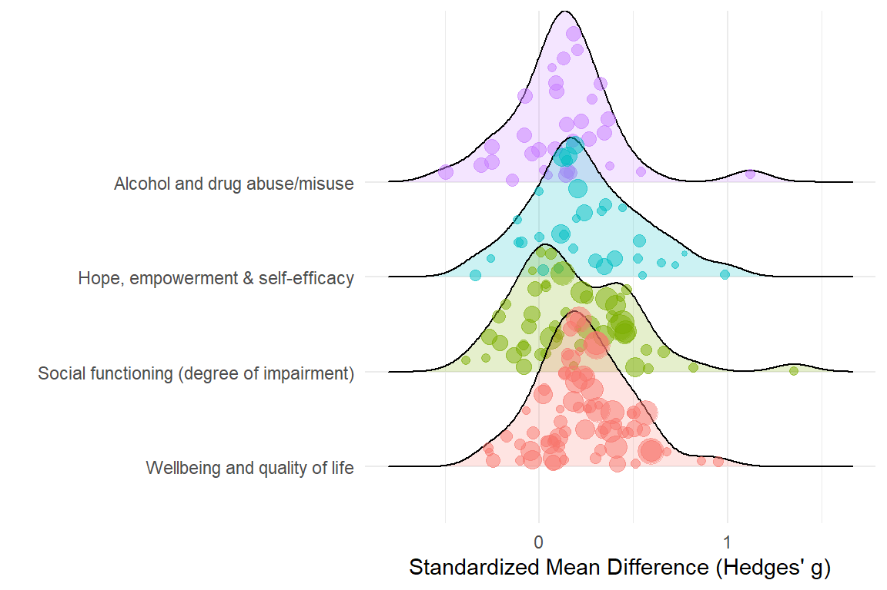{#fig-type-ridge-reint-analyzed fig-pos='H' width=576}
:::
:::


###### Not subgroup analyzed

::: {.cell}

```{.r .cell-code}
not_analyzed_outcomes <- 
  reintegration_dat |> 
  filter(!str_detect(analysis_plan, "Alco|Hope|Social|Well"))

cat_ridge(data = not_analyzed_outcomes, es = gt_pop, variable = analysis_plan, v = vgt_pop)
```

::: {.cell-output-display}
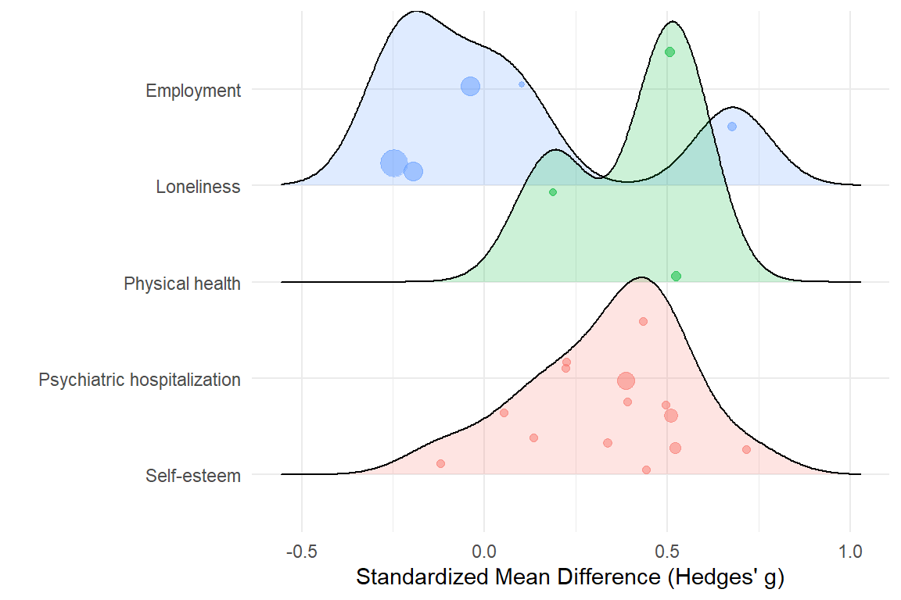{#fig-type-ridge-reint-not-analyzed fig-pos='H' width=576}
:::
:::

:::

:::

::: {.column-margin}

::: {.cell}

```{.r .cell-code}
cat_ridge(data = mental_health_dat, es = gt_pop, variable = analysis_plan, v = vgt_pop)
```

::: {.cell-output-display}
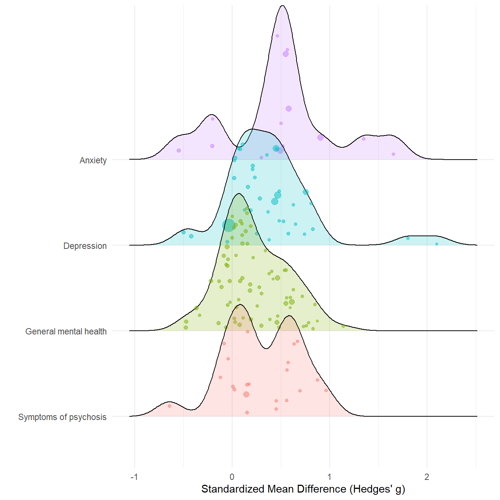{#fig-type-ridge-mental-analyzed fig-pos='H' width=672}
:::
:::

:::

:::

##### Network plot for outcome construct
The following plot shows the network structure of outcomes constructs. Each node represent an outcome construct, the edge between a pair of nodes indicates that there is at least one study that examined the contracts between that pair of constructs The width of the edges indicates the number of studies that compare that pair of constructs. The size of the node corresponds to the number of studies measure that construct.  


::: {.cell}

```{.r .cell-code}
gb_dat_reduced <- gb_dat |> select(study, analysis_plan)

res_dat <- gb_dat_reduced |> 
  group_by(study) |>
  reframe(var_exp_mirror = unique(analysis_plan))  |>
  full_join(gb_dat_reduced ,
            by = join_by(study),
            relationship = "many-to-many") |>
  group_by(analysis_plan, var_exp_mirror) |>
  reframe(
    m = n_distinct(study),
    k = n()
  ) |>
  mutate(size = m) |> 
  select(-m, -k) |>
  arrange(var_exp_mirror) |> 
  pivot_wider(names_from = var_exp_mirror, values_from = "size") |> 
  arrange(analysis_plan) |> 
  as.data.frame()


names(res_dat)[1] <- "level"


edges <- res_dat  |>
  rename(from = "level") |> 
  pivot_longer(-from, names_to = "to", values_to = "weight") |>
  filter(from != to, !is.na(weight)) |> 
  mutate(
    from_chr = as.character(from),
    to_chr = as.character(to),
    grp_str = paste0(pmin(from_chr, to_chr, na.rm = TRUE), "_", pmax(from_chr, to_chr, na.rm = TRUE))
  ) |> 
  distinct(grp_str, .keep_all = TRUE) |>
  select(from, to, weight)

g <- graph_from_data_frame(edges, directed = FALSE)
layout <- layout_in_circle(g)

# Adjust label position outward
label_coords <- layout
label_coords[, 1] <- c(
  label_coords[1, 1] * 1.35, #1.5,
  label_coords[2:6, 1] * 1.5, #1.63,
  label_coords[7, 1] * 1.35, #1.68,
  label_coords[8:13, 1] * 1.4 #1.63
)

label_coords[, 2] <- c(
  label_coords[c(1:3), 2],
  label_coords[4, 2] * 1.13,
  label_coords[5, 2] * 1.3,
  label_coords[6, 2] * 1.13,
  label_coords[c(7:9), 2] * 1.13,
  label_coords[10, 2] * 1.3,
  label_coords[11, 2] * 1.3,
  label_coords[12, 2] * 1.3,
  label_coords[13, 2] * 1.13
)

node_sizes <- diag(as.matrix(res_dat[, -1]))

#png(filename = "Figures/outcome_network.png", height = 6, width = 6, res = 600, units = "in")
plot(
  g,
  layout = layout,
  edge.width = E(g)$weight,
  edge.color = met.brewer("Navajo")[5],
  vertex.size = node_sizes[c(1:8, 10:13, 9)],
  vertex.label = NA,
  vertex.color = met.brewer("Navajo")[4],
  vertex.frame.width = 0
)

text(
  x = label_coords[, 1],
  y = label_coords[, 2],
  labels = paste0(str_wrap(names(res_dat[c(2:9, 11:14, 10)]), width = 15), "\n(J = ", node_sizes, ")"),
  cex = 0.6,
  col = "black",
  xpd = NA
)
#dev.off()
```

::: {.cell-output-display}
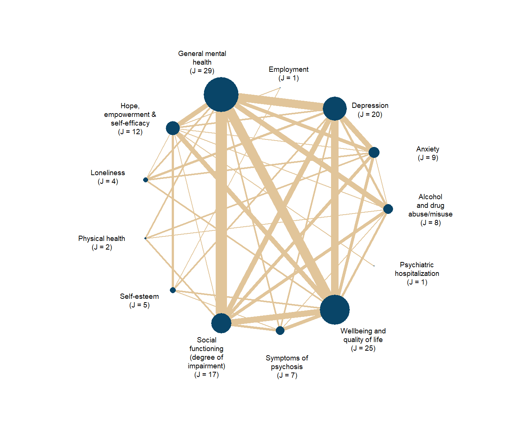{#fig-network fig-pos='H' width=672}
:::
:::


### Diagnosis (schizophrenia vs. rest of the effects)

::: {.columns}

::: {.column width="95%"}

::: {#tbl-diagnosis-subgroup-reint .cell .tbl-cap-location-top tbl-cap='Dependency table for diagnosis (reintegration)'}

```{.r .cell-code}
diagnosis_subgroup_dat_cross <- cat_dat_cross(
  data = reintegration_dat,
  variable = schizophrenia,
  study_id = study
)

diagnosis_subgroup_dat_cross |>
  knitr::kable(
    "html",
    col.names = c(
      "Diagnosis",
      colnames(diagnosis_subgroup_dat_cross)[-1]
    )
  ) |>
  kableExtra::column_spec(1, bold = TRUE) |>
  kableExtra::footnote(
    general = "Values outside the parentheses are number of studies, with the number of samples and effect size estimates shown in the parentheses.", 
    general_title = "Note: ",
    footnote_as_chunk = T
  ) |>
  kableExtra::kable_styling(bootstrap_options = c("striped", "condensed"), full_width = T)
```

::: {.cell-output-display}
`````{=html}
<table style="NAborder-bottom: 0; margin-left: auto; margin-right: auto;" class="table table-striped table-condensed">
 <thead>
  <tr>
   <th style="text-align:left;"> Diagnosis </th>
   <th style="text-align:left;"> Other </th>
   <th style="text-align:left;"> Schizophrenia </th>
  </tr>
 </thead>
<tbody>
  <tr>
   <td style="text-align:left;font-weight: bold;"> Other </td>
   <td style="text-align:left;"> 37 (172) </td>
   <td style="text-align:left;"> - </td>
  </tr>
  <tr>
   <td style="text-align:left;font-weight: bold;"> Schizophrenia </td>
   <td style="text-align:left;"> - </td>
   <td style="text-align:left;"> 9 (33) </td>
  </tr>
</tbody>
<tfoot><tr><td style="padding: 0; " colspan="100%">
<span style="font-style: italic;">Note: </span> <sup></sup> Values outside the parentheses are number of studies, with the number of samples and effect size estimates shown in the parentheses.</td></tr></tfoot>
</table>

`````
:::
:::

:::

::: {.column-margin}

::: {#tbl-diagnosis-subgroup-mental .cell .tbl-cap-location-top tbl-cap='Dependency table for diagnosis (mental health)'}

```{.r .cell-code}
diagnosis_subgroup_dat_cross_mental <- cat_dat_cross(
  data = mental_health_dat,
  variable = schizophrenia,
  study_id = study
)

diagnosis_subgroup_dat_cross_mental |>
  knitr::kable(
    "html",
    col.names = c(
      "Diagnosis",
      colnames(diagnosis_subgroup_dat_cross_mental)[-1]
    )
  ) |>
  kableExtra::column_spec(1, bold = TRUE) |>
  kableExtra::footnote(
    general = "Values outside the parentheses are number of studies, with the number of samples and effect size estimates shown in the parentheses.", 
    general_title = "Note: ",
    footnote_as_chunk = T
  ) |>
  kableExtra::kable_styling(bootstrap_options = c("striped", "condensed"), full_width = T)
```

::: {.cell-output-display}
`````{=html}
<table style="NAborder-bottom: 0; margin-left: auto; margin-right: auto;" class="table table-striped table-condensed">
 <thead>
  <tr>
   <th style="text-align:left;"> Diagnosis </th>
   <th style="text-align:left;"> Other </th>
   <th style="text-align:left;"> Schizophrenia </th>
  </tr>
 </thead>
<tbody>
  <tr>
   <td style="text-align:left;font-weight: bold;"> Other </td>
   <td style="text-align:left;"> 35 (130) </td>
   <td style="text-align:left;"> - </td>
  </tr>
  <tr>
   <td style="text-align:left;font-weight: bold;"> Schizophrenia </td>
   <td style="text-align:left;"> - </td>
   <td style="text-align:left;"> 7 (14) </td>
  </tr>
</tbody>
<tfoot><tr><td style="padding: 0; " colspan="100%">
<span style="font-style: italic;">Note: </span> <sup></sup> Values outside the parentheses are number of studies, with the number of samples and effect size estimates shown in the parentheses.</td></tr></tfoot>
</table>

`````
:::
:::

:::

:::


::: {.columns}

::: {.column width="95%"}

::: {.cell}

```{.r .cell-code}
cat_ridge(data = reintegration_dat, es = gt_pop, variable = schizophrenia, v = vgt_pop)
```

::: {.cell-output-display}
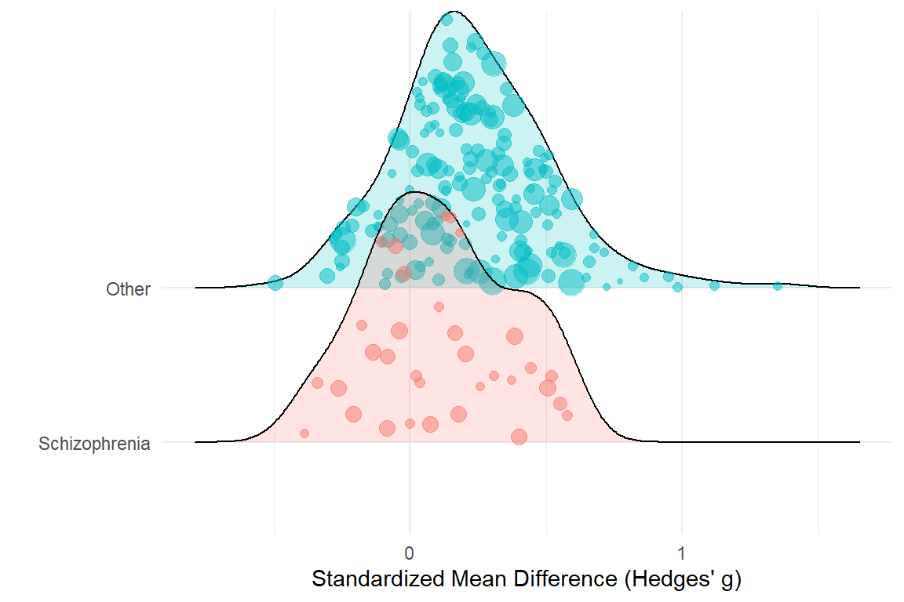{#fig-diagnosis-ridge-reint fig-pos='H' width=576}
:::
:::

:::

::: {.column-margin}

::: {.cell}

```{.r .cell-code}
cat_ridge(data = mental_health_dat, es = gt_pop, variable = schizophrenia, v = vgt_pop)
```

::: {.cell-output-display}
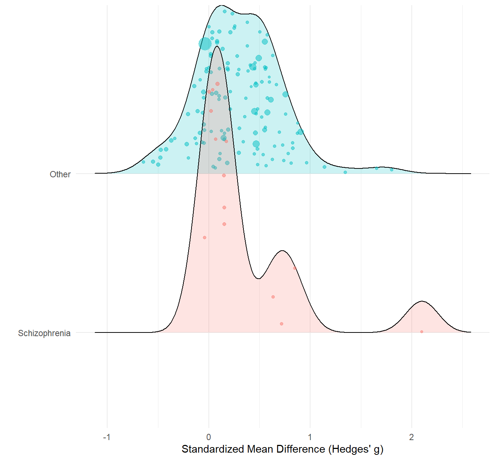{#fig-type-ridge-mental fig-pos='H' width=672}
:::
:::

:::

:::

### Type of intervention

::: {.columns}

::: {.column width="95%"}

::: {#tbl-cbt-subgroup .cell .tbl-cap-location-top tbl-cap='Dependency table for type of intervention (reintegration)'}

```{.r .cell-code}
cbt_subgroup_dat_cross <- cat_dat_cross(
  data = reintegration_dat,
  variable = CBT_int,
  study_id = study
)

cbt_subgroup_dat_cross |>
  knitr::kable(
    "html",
    col.names = c(
      "Intervention",
      colnames(cbt_subgroup_dat_cross)[-1]
    )
  ) |>
  kableExtra::column_spec(1, bold = TRUE) |>
  kableExtra::footnote(
    general = "Values outside the parentheses are number of studies, with the number of samples and effect size estimates shown in the parentheses.", 
    general_title = "Note: ",
    footnote_as_chunk = T
  ) |>
  kableExtra::kable_styling(bootstrap_options = c("striped", "condensed"), full_width = T)
```

::: {.cell-output-display}
`````{=html}
<table style="NAborder-bottom: 0; margin-left: auto; margin-right: auto;" class="table table-striped table-condensed">
 <thead>
  <tr>
   <th style="text-align:left;"> Intervention </th>
   <th style="text-align:left;"> CBT </th>
   <th style="text-align:left;"> Other </th>
  </tr>
 </thead>
<tbody>
  <tr>
   <td style="text-align:left;font-weight: bold;"> CBT </td>
   <td style="text-align:left;"> 12 (55) </td>
   <td style="text-align:left;"> 1 (5) </td>
  </tr>
  <tr>
   <td style="text-align:left;font-weight: bold;"> Other </td>
   <td style="text-align:left;"> 1 (5) </td>
   <td style="text-align:left;"> 35 (150) </td>
  </tr>
</tbody>
<tfoot><tr><td style="padding: 0; " colspan="100%">
<span style="font-style: italic;">Note: </span> <sup></sup> Values outside the parentheses are number of studies, with the number of samples and effect size estimates shown in the parentheses.</td></tr></tfoot>
</table>

`````
:::
:::

:::

::: {.column-margin}

::: {#tbl-cbt-subgroup-mental .cell .tbl-cap-location-top tbl-cap='Dependency table for type of intervention (mental health)'}

```{.r .cell-code}
cbt_subgroup_dat_cross_mental <- cat_dat_cross(
  data = mental_health_dat,
  variable = CBT_int,
  study_id = study
)

cbt_subgroup_dat_cross_mental |>
  knitr::kable(
    "html",
    col.names = c(
      "Intervention",
      colnames(cbt_subgroup_dat_cross_mental)[-1]
    )
  ) |>
  kableExtra::column_spec(1, bold = TRUE) |>
  kableExtra::footnote(
    general = "Values outside the parentheses are number of studies, with the number of samples and effect size estimates shown in the parentheses.", 
    general_title = "Note: ",
    footnote_as_chunk = T
  ) |>
  kableExtra::kable_styling(bootstrap_options = c("striped", "condensed"), full_width = T)
```

::: {.cell-output-display}
`````{=html}
<table style="NAborder-bottom: 0; margin-left: auto; margin-right: auto;" class="table table-striped table-condensed">
 <thead>
  <tr>
   <th style="text-align:left;"> Intervention </th>
   <th style="text-align:left;"> CBT </th>
   <th style="text-align:left;"> Other </th>
  </tr>
 </thead>
<tbody>
  <tr>
   <td style="text-align:left;font-weight: bold;"> CBT </td>
   <td style="text-align:left;"> 12 (49) </td>
   <td style="text-align:left;"> 1 (2) </td>
  </tr>
  <tr>
   <td style="text-align:left;font-weight: bold;"> Other </td>
   <td style="text-align:left;"> 1 (2) </td>
   <td style="text-align:left;"> 31 (95) </td>
  </tr>
</tbody>
<tfoot><tr><td style="padding: 0; " colspan="100%">
<span style="font-style: italic;">Note: </span> <sup></sup> Values outside the parentheses are number of studies, with the number of samples and effect size estimates shown in the parentheses.</td></tr></tfoot>
</table>

`````
:::
:::

:::

:::

::: {.columns}

::: {.column width="95%"}

::: {.cell}

```{.r .cell-code}
cat_ridge(data = reintegration_dat, es = gt_pop, variable = CBT_int, v = vgt_pop)
```

::: {.cell-output-display}
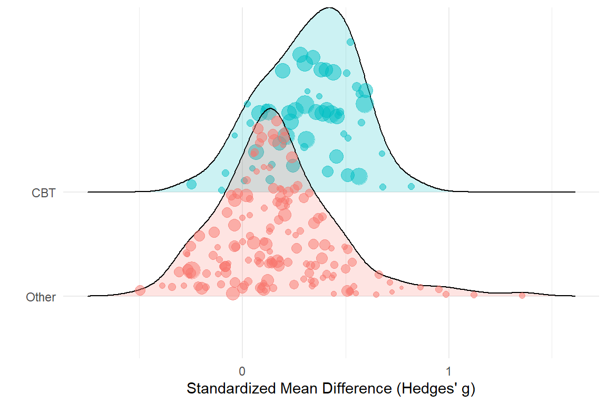{#fig-cbt-ridge-reint fig-pos='H' width=576}
:::
:::

:::

::: {.column-margin}

::: {.cell}

```{.r .cell-code}
cat_ridge(data = mental_health_dat, es = gt_pop, variable = CBT_int, v = vgt_pop)
```

::: {.cell-output-display}
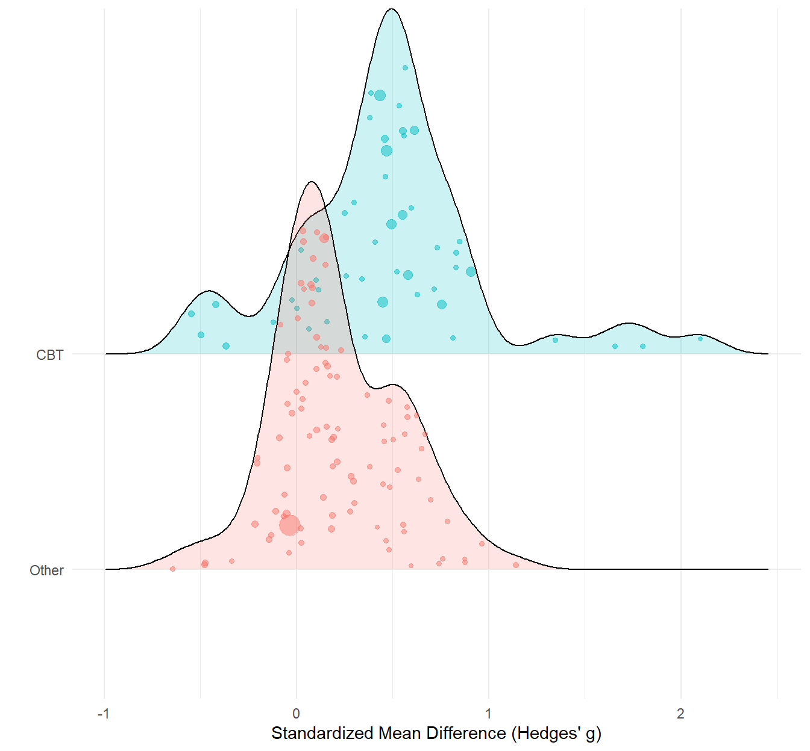{#fig-cbt-ridge-mental fig-pos='H' width=672}
:::
:::

:::

:::

#### EGM-like plot

::: {.columns}

::: {.column width="160%"}

::: {.panel-tabset}
##### Reintegrational outcomes

::: {.cell}

```{.r .cell-code}
egm_dat_reint <- 
  reintegration_dat |> 
  summarise(
    n = n(),
    n_studies = factor(n_distinct(study), levels = c(1:4)),
    .by = c(trt_group, analysis_plan, prereg_chr)
  ) |> 
  mutate(
    n_prereg = case_match(
      prereg_chr,
      "Preregistered" ~ 0.5,
      "Not preregistered" ~ 0
    ),
    
    constant = "Intervention",
    
    outcome = case_match(
      analysis_plan,
      "Alcohol and drug abuse/misuse" ~ "Alcohol/drugs",
      "Hope, empowerment & self-efficacy" ~ "Hope",
      "Psychiatric hospitalization" ~ "Psych hospital",
      "Social functioning (degree of impairment)" ~ "Social func",
      "Wellbeing and quality of life" ~ "Wellbeing/QoL",
      .default = analysis_plan
    ),
    
    intervention = case_match(
      trt_group,
      "group-based CBT" ~ "GrpCBT",
      "stress management" ~ "StressMan",
      "vocational training" ~ "JobTrain",
      "group psychotherapy"  ~ "GrpPsychT",
      "art therapy" ~ "ArtT",
      "illness management" ~ "IllMan",
      "group psychoeducation" ~ "GrpPsychEdu",
      "seeking safety" ~ "SeekSafe",
      "social cognition and interaction training" ~ "SCIT",
      "illness and addiction management" ~ "Ill&AddMan",
      "social network training" ~ "NetworkTrain",
      "cognitive-behavioral social skills training" ~ "CBSST",
      "residential treatment" ~ "ResidentTreat",
      "positive psychology group intervention" ~ "PosiPsychGrp",
      "addiction management" ~ "AddMan",
      "reading group intervention" ~ "ReadGrp"
    )
    
    
    #intervention_name = case_match(
    #  intervention,
    #  "Sanctions and economic incentives" ~ "Econ incentives",
    #  "Introduction programmes" ~ "Intro program",
    #  "Combination programmes" ~ "Combi program",
    #  "Language training" ~ "Lang train",
    #  "Labour market training" ~ "Lab market train",
    #  "Job search assistance" ~" Job search ass",
    #  "Subsidized public sector employment" ~ "Sub public emp"
    #),
    #
    #outcome = if_else(outcome == "Duration of social assistance spells", "Dur. social ass spells", outcome)
    
  ) 

egm_dat_reint |> 
  ggplot(aes(x = n_prereg, y =  constant, size = n, color = n_studies)) + 
  geom_point() +
  scale_size(range = c(6, 14)) +
  geom_text(aes(label = n), color = "black", size = 3.5) +
  scale_x_continuous(breaks = seq(0,0.5,0.5), limits = c(0, 1), labels = c("Conventional", "Preregistered")) +
  scale_y_discrete("Interventions") +
  facet_grid(intervention~outcome, scales = "free_y", space = "free_y") +
  theme_bw() + 
  theme(
    legend.position = "bottom",
    axis.text.x = element_text(angle = 45, hjust = 1),
    #panel.grid.major = element_blank(),
    #panel.grid.minor = element_blank(),
    #panel.background = element_blank(),
    axis.text.y = element_blank(),   
    axis.ticks.y = element_blank(),  
    axis.title.y = element_blank(),
    plot.caption = element_text(hjust = 0, size = 14)
  ) +
  coord_cartesian(xlim = c(-0.25, 0.75), ylim = NULL) +
  guides(size = "none") + 
  xlab("Type of registration") +
  labs(
    color = "Number of studies",
    caption = paste0(
      "Note: GrpCBT = Group-based CBT, StressMan = Stress mangement, JobTrain = Vocational training, ",
      "GrpPsychT = Group psychotherapy, ArtT = Art Therapy, IllMan = Ill management,\n",
      "GrpPsychEdu = Group Psychoeducation, SeekSafe = Seeking safety, ",
      "SCIT = cognitive-behavioral social skills training, ResidentTreat = Residential treatment,\n",
      "PosiPsychGrp = Positive Psychology group therapy, AddMan = Addiction mangement, ",
      "ReadGrp = Reading group."
    )
  )
```

::: {.cell-output-display}
{#fig-egm-reint fig-pos='H' width=1728}
:::
:::


##### Mental health outcomes

::: {.cell}

```{.r .cell-code}
egm_dat_mental <- 
  mental_health_dat |> 
  summarise(
    n = n(),
    n_studies = factor(n_distinct(study), levels = c(1:4)),
    .by = c(trt_group, analysis_plan, prereg_chr)
  ) |> 
  mutate(
    n_prereg = case_match(
      prereg_chr,
      "Preregistered" ~ 0.5,
      "Not preregistered" ~ 0
    ),
    
    constant = "Intervention",
    
    outcome = analysis_plan,
    
    intervention = case_match(
      trt_group,
      "group-based CBT" ~ "GrpCBT",
      "stress management" ~ "StressMan",
      "vocational training" ~ "JobTrain",
      "group psychotherapy"  ~ "GrpPsychT",
      "art therapy" ~ "ArtT",
      "illness management" ~ "IllMan",
      "group psychoeducation" ~ "GrpPsychEdu",
      "seeking safety" ~ "SeekSafe",
      "social cognition and interaction training" ~ "SCIT",
      "illness and addiction management" ~ "Ill&AddMan",
      "social network training" ~ "NetworkTrain",
      "cognitive-behavioral social skills training" ~ "CBSST",
      "residential treatment" ~ "ResidentTreat",
      "positive psychology group intervention" ~ "PosiPsychGrp",
      "addiction management" ~ "AddMan",
      "reading group intervention" ~ "ReadGrp",
      "group psychoeducation & social skill training" ~ "GrpPsyEdu&SS"
    )
    
    
    #intervention_name = case_match(
    #  intervention,
    #  "Sanctions and economic incentives" ~ "Econ incentives",
    #  "Introduction programmes" ~ "Intro program",
    #  "Combination programmes" ~ "Combi program",
    #  "Language training" ~ "Lang train",
    #  "Labour market training" ~ "Lab market train",
    #  "Job search assistance" ~" Job search ass",
    #  "Subsidized public sector employment" ~ "Sub public emp"
    #),
    #
    #outcome = if_else(outcome == "Duration of social assistance spells", "Dur. social ass spells", outcome)
    
  ) 

egm_dat_mental |> 
  ggplot(aes(x = n_prereg, y =  constant, size = n, color = n_studies)) + 
  geom_point() +
  scale_size(range = c(6, 14)) +
  geom_text(aes(label = n), color = "black", size = 3.5) +
  scale_x_continuous(breaks = seq(0,0.5,0.5), limits = c(0, 1), labels = c("Conventional", "Preregistered")) +
  scale_y_discrete("Interventions") +
  facet_grid(intervention~outcome, scales = "free_y", space = "free_y") +
  theme_bw() + 
  theme(
    legend.position = "bottom",
    axis.text.x = element_text(angle = 45, hjust = 1),
    #panel.grid.major = element_blank(),
    #panel.grid.minor = element_blank(),
    #panel.background = element_blank(),
    axis.text.y = element_blank(),   
    axis.ticks.y = element_blank(),  
    axis.title.y = element_blank(),
    plot.caption = element_text(hjust = 0, size = 12)
  ) +
  coord_cartesian(xlim = c(-0.25, 0.75), ylim = NULL) +
  guides(size = "none") + 
  xlab("Type of registration") +
  labs(
    color = "Number of studies",
    caption = paste0(
      "Note: GrpCBT = Group-based CBT, StressMan = Stress mangement, JobTrain = Vocational training,",
      "GrpPsychT = Group psychotherapy, ArtT = Art Therapy,\nIllMan = Ill management,",
      "GrpPsychEdu = Group Psychoeducation, SeekSafe = Seeking safety,",
      "SCIT = cognitive-behavioral social skills training,\nResidentTreat = Residential treatment,",
      "PosiPsychGrp = Positive Psychology group therapy, AddMan = Addiction mangement, ",
      "ReadGrp = Reading group,\nGrpPsyEdu&SS = Group psychoeducation & social skill training."
    )
  )
```

::: {.cell-output-display}
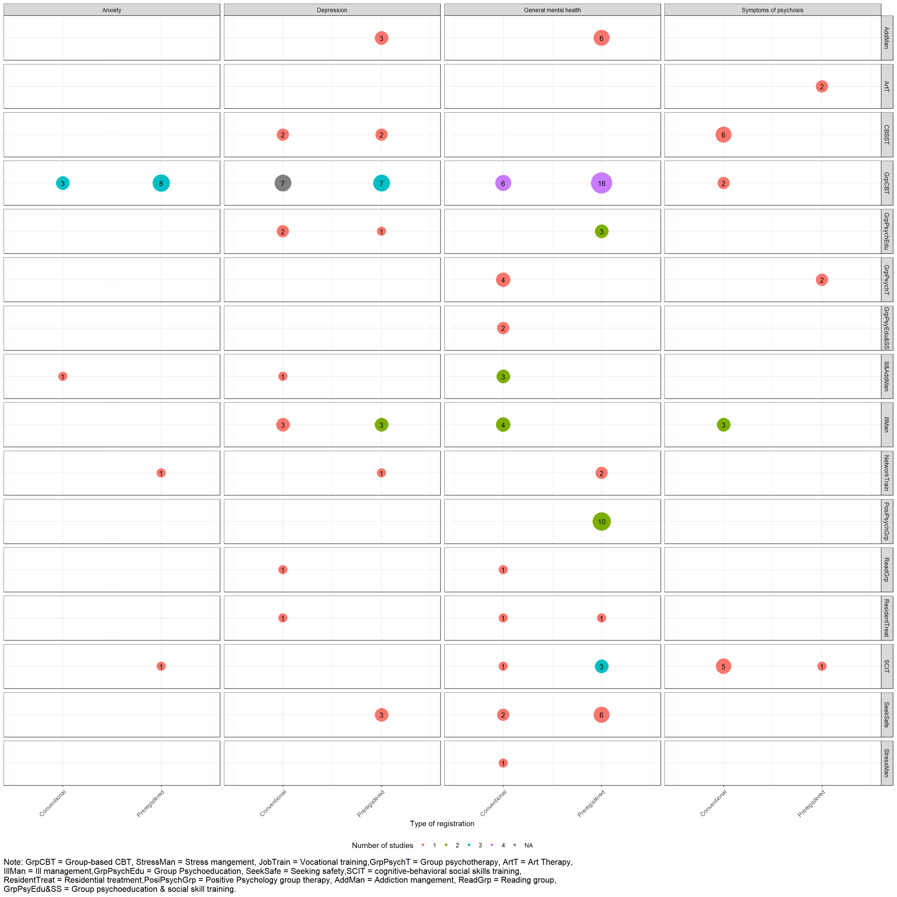{#fig-egm-mental fig-pos='H' width=1728}
:::
:::


:::

:::

:::


### Type of test

::: {.columns}

::: {.column width="95%"}

::: {#tbl-test-type-subgroup .cell .tbl-cap-location-top tbl-cap='Dependency table for type of test (reintegration)'}

```{.r .cell-code}
test_type_dat <- 
  reintegration_dat |> 
  filter(test_type != "Raw events")

test_type_dat_cross <- cat_dat_cross(
  data = test_type_dat,
  variable = test_type,
  study_id = study
)

test_type_dat_cross |>
  knitr::kable(
    "html",
    col.names = c(
      "Type of test",
      colnames(test_type_dat_cross)[-1]
    )
  ) |>
  kableExtra::column_spec(1, bold = TRUE) |>
  kableExtra::footnote(
    general = "Values outside the parentheses are number of studies, with the number of samples and effect size estimates shown in the parentheses.", 
    general_title = "Note: ",
    footnote_as_chunk = T
  ) |>
  kableExtra::kable_styling(bootstrap_options = c("striped", "condensed"), full_width = T)
```

::: {.cell-output-display}
`````{=html}
<table style="NAborder-bottom: 0; margin-left: auto; margin-right: auto;" class="table table-striped table-condensed">
 <thead>
  <tr>
   <th style="text-align:left;"> Type of test </th>
   <th style="text-align:left;"> Clinician-rated measure </th>
   <th style="text-align:left;"> Self-reported </th>
  </tr>
 </thead>
<tbody>
  <tr>
   <td style="text-align:left;font-weight: bold;"> Clinician-rated measure </td>
   <td style="text-align:left;"> 12 (36) </td>
   <td style="text-align:left;"> 5 (8) </td>
  </tr>
  <tr>
   <td style="text-align:left;font-weight: bold;"> Self-reported </td>
   <td style="text-align:left;"> 5 (8) </td>
   <td style="text-align:left;"> 39 (168) </td>
  </tr>
</tbody>
<tfoot><tr><td style="padding: 0; " colspan="100%">
<span style="font-style: italic;">Note: </span> <sup></sup> Values outside the parentheses are number of studies, with the number of samples and effect size estimates shown in the parentheses.</td></tr></tfoot>
</table>

`````
:::
:::

:::

::: {.column-margin}

::: {#tbl-test-type-subgroup-mental .cell .tbl-cap-location-top tbl-cap='Dependency table for type of test (mental health)'}

```{.r .cell-code}
test_type_dat_mental <- 
  mental_health_dat |> 
  filter(test_type != "Raw events")


test_type_dat_cross_mental <- cat_dat_cross(
  data = test_type_dat_mental,
  variable = test_type,
  study_id = study
)

test_type_dat_cross_mental |>
  knitr::kable(
    "html",
    col.names = c(
      "Type of test",
      colnames(test_type_dat_cross_mental)[-1]
    )
  ) |>
  kableExtra::column_spec(1, bold = TRUE) |>
  kableExtra::footnote(
    general = "Values outside the parentheses are number of studies, with the number of samples and effect size estimates shown in the parentheses.", 
    general_title = "Note: ",
    footnote_as_chunk = T
  ) |>
  kableExtra::kable_styling(bootstrap_options = c("striped", "condensed"), full_width = T)
```

::: {.cell-output-display}
`````{=html}
<table style="NAborder-bottom: 0; margin-left: auto; margin-right: auto;" class="table table-striped table-condensed">
 <thead>
  <tr>
   <th style="text-align:left;"> Type of test </th>
   <th style="text-align:left;"> Clinician-rated measure </th>
   <th style="text-align:left;"> Self-reported </th>
  </tr>
 </thead>
<tbody>
  <tr>
   <td style="text-align:left;font-weight: bold;"> Clinician-rated measure </td>
   <td style="text-align:left;"> 14 (41) </td>
   <td style="text-align:left;"> 5 (11) </td>
  </tr>
  <tr>
   <td style="text-align:left;font-weight: bold;"> Self-reported </td>
   <td style="text-align:left;"> 5 (18) </td>
   <td style="text-align:left;"> 33 (103) </td>
  </tr>
</tbody>
<tfoot><tr><td style="padding: 0; " colspan="100%">
<span style="font-style: italic;">Note: </span> <sup></sup> Values outside the parentheses are number of studies, with the number of samples and effect size estimates shown in the parentheses.</td></tr></tfoot>
</table>

`````
:::
:::

:::

:::

::: {.columns}

::: {.column width="95%"}

::: {.cell}

```{.r .cell-code}
cat_ridge(data = test_type_dat, es = gt_pop, variable = test_type, v = vgt_pop)
```

::: {.cell-output-display}
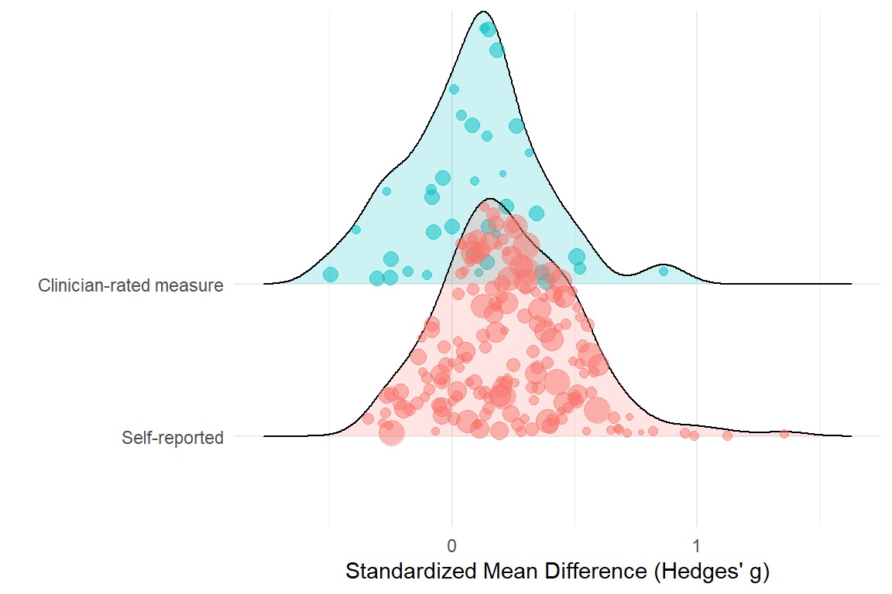{#fig-test-type-ridge-reint fig-pos='H' width=576}
:::
:::

:::

::: {.column-margin}

::: {.cell}

```{.r .cell-code}
cat_ridge(data = test_type_dat_mental, es = gt_pop, variable = test_type, v = vgt_pop)
```

::: {.cell-output-display}
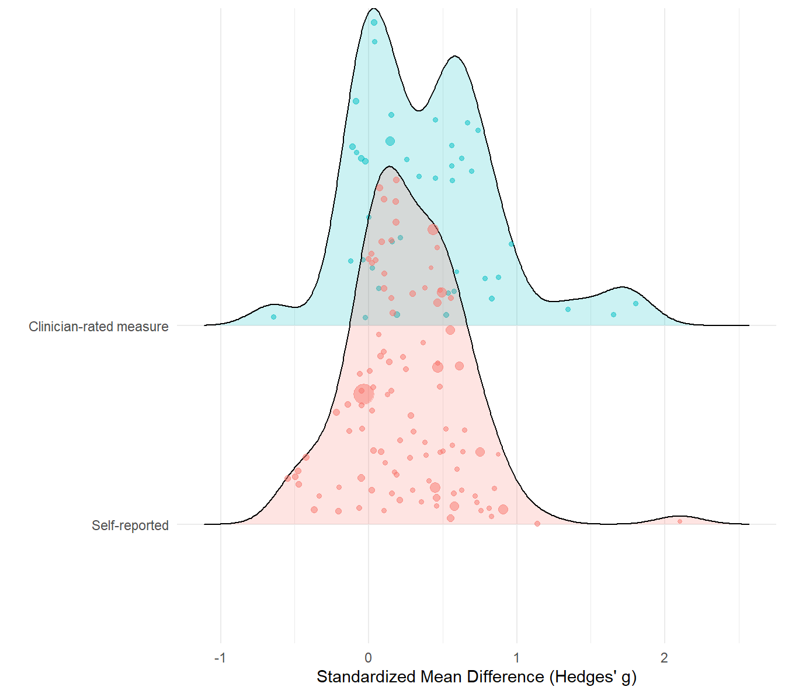{#fig-test-type-ridge-mental fig-pos='H' width=672}
:::
:::

:::

:::

::: {.columns}

::: {.column width="130%"}

::: {.cell}

```{.r .cell-code}
test_type_dat_all <- 
  gb_dat |> 
  filter(test_type != "Raw events") |> 
  mutate(
    p_val = 2 * ( 1 - pnorm( abs(gt_pop) / sqrt(vgt_pop) ) ),
  )


ggplot(test_type_dat_all, aes(y = gt_pop, x = p_val, color = test_type)) +
geom_point() + 
geom_hline(yintercept = 0) + 
geom_vline(xintercept = .05, color = "gray") +
facet_grid(outcome_construct~test_type) +
theme_bw() +
theme(legend.position="none") +
labs(x = "p values", y = "Effect sizes (Hedges' g)")
```

::: {.cell-output-display}
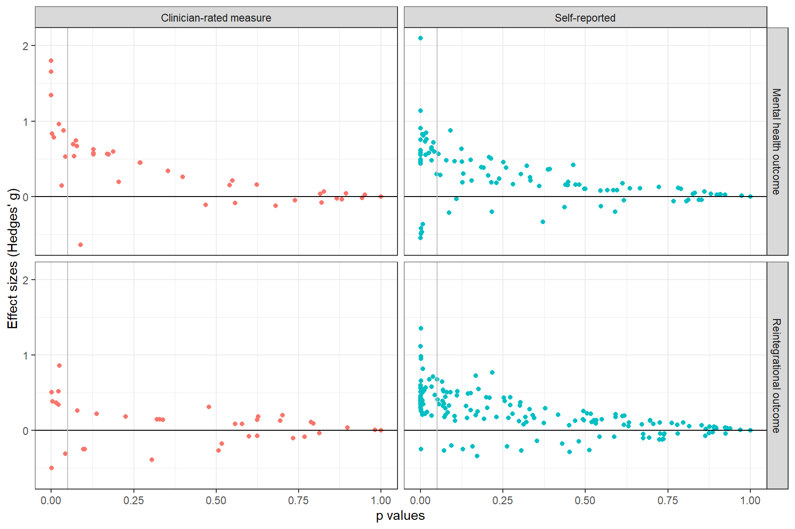{#fig-es-pval-reint fig-pos='H' width=864}
:::
:::

:::

:::

### ITT vs. TOT
::: {.columns}

::: {.column width="95%"}

::: {#tbl-strategy-subgroup .cell .tbl-cap-location-top tbl-cap='Dependency table for estimation strategy (reintegration)'}

```{.r .cell-code}
strategy_subgroup_dat_cross <- cat_dat_cross(
  data = reintegration_dat,
  variable = analysis_strategy,
  study_id = study
)

strategy_subgroup_dat_cross |>
  knitr::kable(
    "html",
    col.names = c(
      "Strategy",
      colnames(strategy_subgroup_dat_cross)[-1]
    )
  ) |>
  kableExtra::column_spec(1, bold = TRUE) |>
  kableExtra::footnote(
    general = paste0("Values outside the parentheses are number of studies,", "
                     with the number of samples and effect size estimates shown in the parentheses. ",
                     "TOT = treatment on the treated, ITT = Intention to treat."
                     ), 
    general_title = "Note: ",
    footnote_as_chunk = T
  ) |>
  kableExtra::kable_styling(bootstrap_options = c("striped", "condensed"), full_width = T)
```

::: {.cell-output-display}
`````{=html}
<table style="NAborder-bottom: 0; margin-left: auto; margin-right: auto;" class="table table-striped table-condensed">
 <thead>
  <tr>
   <th style="text-align:left;"> Strategy </th>
   <th style="text-align:left;"> ITT </th>
   <th style="text-align:left;"> TOT </th>
  </tr>
 </thead>
<tbody>
  <tr>
   <td style="text-align:left;font-weight: bold;"> ITT </td>
   <td style="text-align:left;"> 22 (108) </td>
   <td style="text-align:left;"> - </td>
  </tr>
  <tr>
   <td style="text-align:left;font-weight: bold;"> TOT </td>
   <td style="text-align:left;"> - </td>
   <td style="text-align:left;"> 24 (97) </td>
  </tr>
</tbody>
<tfoot><tr><td style="padding: 0; " colspan="100%">
<span style="font-style: italic;">Note: </span> <sup></sup> Values outside the parentheses are number of studies,<br>                     with the number of samples and effect size estimates shown in the parentheses. TOT = treatment on the treated, ITT = Intention to treat.</td></tr></tfoot>
</table>

`````
:::
:::

:::

::: {.column-margin}

::: {#tbl-strategy-subgroup-mental .cell .tbl-cap-location-top tbl-cap='Dependency table for estimation strategy (mental health)'}

```{.r .cell-code}
strategy_subgroup_dat_cross_mental <- cat_dat_cross(
  data = mental_health_dat,
  variable = analysis_strategy,
  study_id = study
)

strategy_subgroup_dat_cross_mental |>
  knitr::kable(
    "html",
    col.names = c(
      "Strategy",
      colnames(strategy_subgroup_dat_cross_mental)[-1]
    ) 
  ) |>
  kableExtra::column_spec(1, bold = TRUE) |>
  kableExtra::footnote(
    general = paste0("Values outside the parentheses are number of studies,", "
                     with the number of samples and effect size estimates shown in the parentheses. ",
                     "TOT = treatment on the treated, ITT = Intention to treat."
                     ), 
    general_title = "Note: ",
    footnote_as_chunk = T
  )  |>
  kableExtra::kable_styling(bootstrap_options = c("striped", "condensed"), full_width = T)
```

::: {.cell-output-display}
`````{=html}
<table style="NAborder-bottom: 0; margin-left: auto; margin-right: auto;" class="table table-striped table-condensed">
 <thead>
  <tr>
   <th style="text-align:left;"> Strategy </th>
   <th style="text-align:left;"> ITT </th>
   <th style="text-align:left;"> TOT </th>
  </tr>
 </thead>
<tbody>
  <tr>
   <td style="text-align:left;font-weight: bold;"> ITT </td>
   <td style="text-align:left;"> 18 (69) </td>
   <td style="text-align:left;"> - </td>
  </tr>
  <tr>
   <td style="text-align:left;font-weight: bold;"> TOT </td>
   <td style="text-align:left;"> - </td>
   <td style="text-align:left;"> 24 (75) </td>
  </tr>
</tbody>
<tfoot><tr><td style="padding: 0; " colspan="100%">
<span style="font-style: italic;">Note: </span> <sup></sup> Values outside the parentheses are number of studies,<br>                     with the number of samples and effect size estimates shown in the parentheses. TOT = treatment on the treated, ITT = Intention to treat.</td></tr></tfoot>
</table>

`````
:::
:::

:::

:::

::: {.columns}

::: {.column width="95%"}

::: {.cell}

```{.r .cell-code}
cat_ridge(data = reintegration_dat, es = gt_pop, variable = analysis_strategy, v = vgt_pop)
```

::: {.cell-output-display}
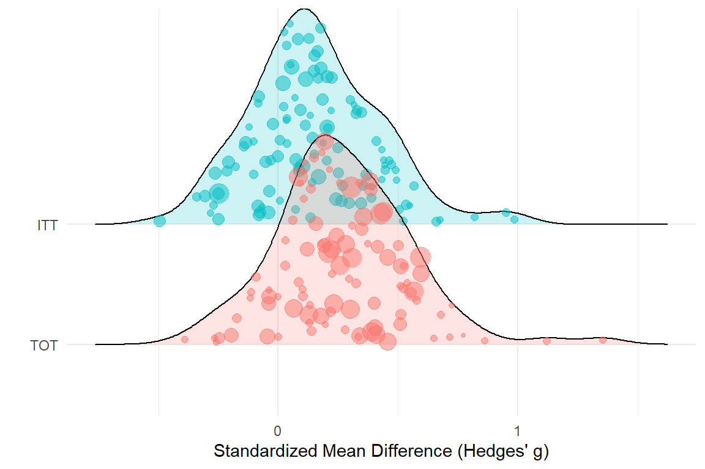{#fig-strategy-ridge-reint fig-pos='H' width=576}
:::
:::

:::

::: {.column-margin}

::: {.cell}

```{.r .cell-code}
cat_ridge(data = mental_health_dat, es = gt_pop, variable = analysis_strategy, v = vgt_pop)
```

::: {.cell-output-display}
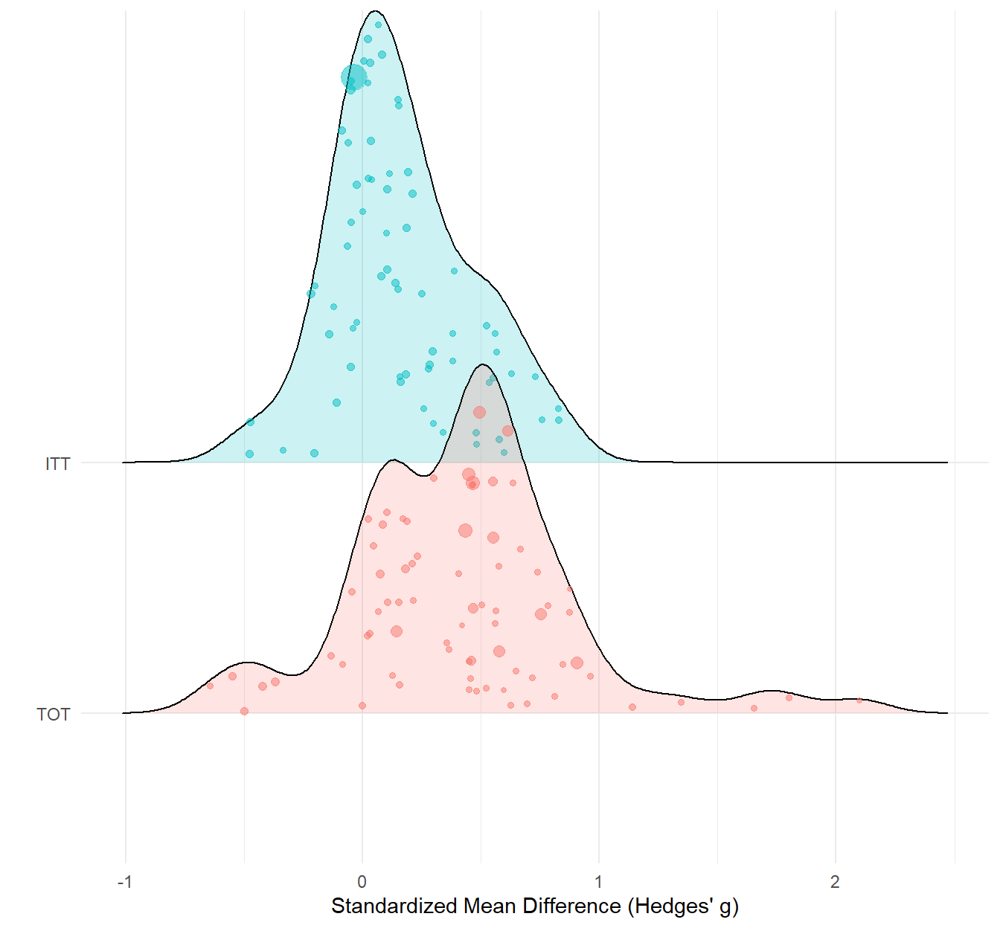{#fig-strategy-ridge-mental fig-pos='H' width=672}
:::
:::

:::

:::

### RCT vs. QES
::: {.columns}

::: {.column width="95%"}

::: {#tbl-design-subgroup .cell .tbl-cap-location-top tbl-cap='Dependency table for type of research design (reintegration)'}

```{.r .cell-code}
design_subgroup_dat_cross <- cat_dat_cross(
  data = reintegration_dat,
  variable = QES_design,
  study_id = study
)

design_subgroup_dat_cross |>
  knitr::kable(
    "html",
    col.names = c(
      "Design",
      colnames(design_subgroup_dat_cross)[-1]
    )
  ) |>
  kableExtra::column_spec(1, bold = TRUE) |>
  kableExtra::footnote(
    general = paste0("Values outside the parentheses are number of studies,", "
                     with the number of samples and effect size estimates shown in the parentheses."
                     ), 
    general_title = "Note: ",
    footnote_as_chunk = T
  ) |>
  kableExtra::kable_styling(bootstrap_options = c("striped", "condensed"), full_width = T)
```

::: {.cell-output-display}
`````{=html}
<table style="NAborder-bottom: 0; margin-left: auto; margin-right: auto;" class="table table-striped table-condensed">
 <thead>
  <tr>
   <th style="text-align:left;"> Design </th>
   <th style="text-align:left;"> QES </th>
   <th style="text-align:left;"> RCT </th>
  </tr>
 </thead>
<tbody>
  <tr>
   <td style="text-align:left;font-weight: bold;"> QES </td>
   <td style="text-align:left;"> 8 (18) </td>
   <td style="text-align:left;"> - </td>
  </tr>
  <tr>
   <td style="text-align:left;font-weight: bold;"> RCT </td>
   <td style="text-align:left;"> - </td>
   <td style="text-align:left;"> 38 (187) </td>
  </tr>
</tbody>
<tfoot><tr><td style="padding: 0; " colspan="100%">
<span style="font-style: italic;">Note: </span> <sup></sup> Values outside the parentheses are number of studies,<br>                     with the number of samples and effect size estimates shown in the parentheses.</td></tr></tfoot>
</table>

`````
:::
:::

:::

::: {.column-margin}

::: {#tbl-design-subgroup-mental .cell .tbl-cap-location-top tbl-cap='Dependency table for type of research design (mental health)'}

```{.r .cell-code}
design_subgroup_dat_cross_mental <- cat_dat_cross(
  data = mental_health_dat,
  variable = QES_design,
  study_id = study
)

design_subgroup_dat_cross_mental |>
  knitr::kable(
    "html",
    col.names = c(
      "Design",
      colnames(design_subgroup_dat_cross_mental)[-1]
    )
  ) |>
  kableExtra::column_spec(1, bold = TRUE) |>
  kableExtra::footnote(
    general = paste0("Values outside the parentheses are number of studies,", "
                     with the number of samples and effect size estimates shown in the parentheses."
                     ), 
    general_title = "Note: ",
    footnote_as_chunk = T
  )  |>
  kableExtra::kable_styling(bootstrap_options = c("striped", "condensed"), full_width = T)
```

::: {.cell-output-display}
`````{=html}
<table style="NAborder-bottom: 0; margin-left: auto; margin-right: auto;" class="table table-striped table-condensed">
 <thead>
  <tr>
   <th style="text-align:left;"> Design </th>
   <th style="text-align:left;"> QES </th>
   <th style="text-align:left;"> RCT </th>
  </tr>
 </thead>
<tbody>
  <tr>
   <td style="text-align:left;font-weight: bold;"> QES </td>
   <td style="text-align:left;"> 8 (17) </td>
   <td style="text-align:left;"> - </td>
  </tr>
  <tr>
   <td style="text-align:left;font-weight: bold;"> RCT </td>
   <td style="text-align:left;"> - </td>
   <td style="text-align:left;"> 34 (127) </td>
  </tr>
</tbody>
<tfoot><tr><td style="padding: 0; " colspan="100%">
<span style="font-style: italic;">Note: </span> <sup></sup> Values outside the parentheses are number of studies,<br>                     with the number of samples and effect size estimates shown in the parentheses.</td></tr></tfoot>
</table>

`````
:::
:::

:::

:::

::: {.columns}

::: {.column width="95%"}

::: {.cell}

```{.r .cell-code}
cat_ridge(data = reintegration_dat, es = gt_pop, variable = QES_design, v = vgt_pop)
```

::: {.cell-output-display}
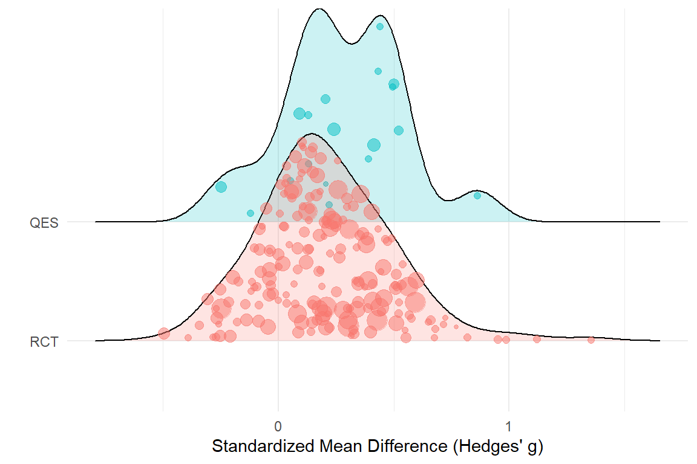{#fig-design-ridge-reint fig-pos='H' width=576}
:::
:::

:::

::: {.column-margin}

::: {.cell}

```{.r .cell-code}
cat_ridge(data = mental_health_dat, es = gt_pop, variable = QES_design, v = vgt_pop)
```

::: {.cell-output-display}
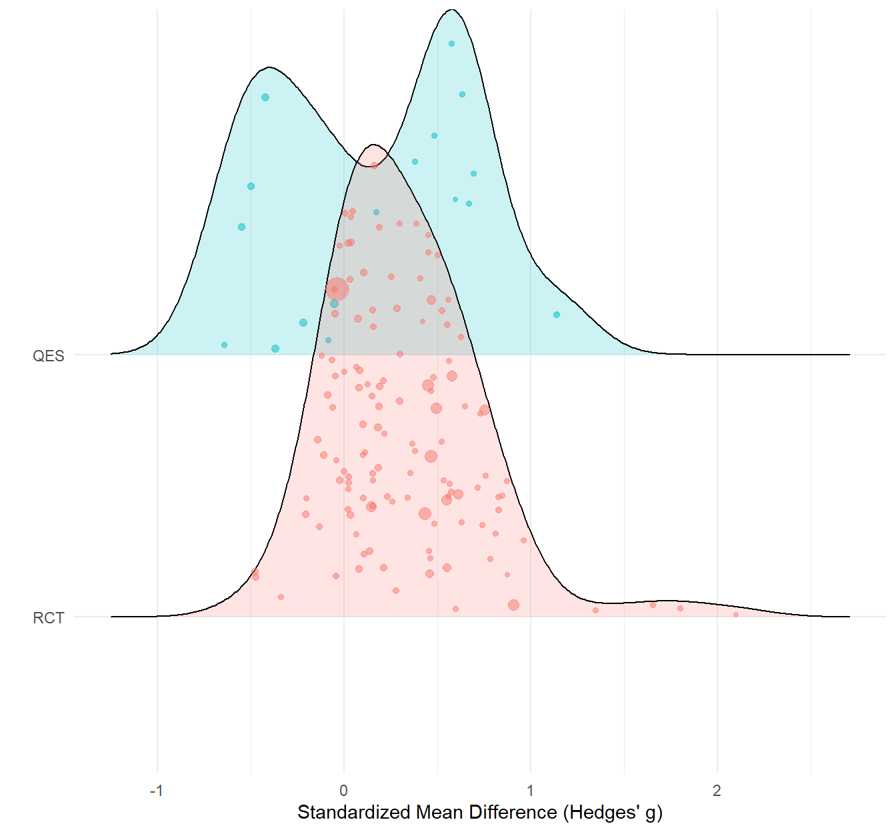{#fig-design-ridge-mental fig-pos='H' width=672}
:::
:::

:::

:::

### Type of control
::: {.columns}

::: {.column width="95%"}

::: {#tbl-control-subgroup .cell .tbl-cap-location-top tbl-cap='Dependency table for type of control group (reintegration)'}

```{.r .cell-code}
control_subgroup_dat_cross <- cat_dat_cross(
  data = reintegration_dat,
  variable = control,
  study_id = study
)

control_subgroup_dat_cross |>
  knitr::kable(
    "html",
    col.names = c(
      "Control",
      colnames(control_subgroup_dat_cross)[-1]
    ) 
  ) |>
  kableExtra::column_spec(1, bold = TRUE) |>
  kableExtra::footnote(
    paste0(
      "Values outside the parentheses are number of studies,", "
       with the number of samples and effect size estimates shown in the parentheses."
    ), 
    general_title = "Note: ",
    footnote_as_chunk = T
  ) |>
  kableExtra::kable_styling(bootstrap_options = c("striped", "condensed"), full_width = T)
```

::: {.cell-output-display}
`````{=html}
<table style="NAborder-bottom: 0; margin-left: auto; margin-right: auto;" class="table table-striped table-condensed">
 <thead>
  <tr>
   <th style="text-align:left;"> Control </th>
   <th style="text-align:left;"> Individual treatment </th>
   <th style="text-align:left;"> TAU </th>
   <th style="text-align:left;"> TAU with Waiting-list </th>
   <th style="text-align:left;"> Waiting-list only </th>
  </tr>
 </thead>
<tbody>
  <tr>
   <td style="text-align:left;font-weight: bold;"> Individual treatment </td>
   <td style="text-align:left;"> 3 (4) </td>
   <td style="text-align:left;"> - </td>
   <td style="text-align:left;"> - </td>
   <td style="text-align:left;"> - </td>
  </tr>
  <tr>
   <td style="text-align:left;font-weight: bold;"> TAU </td>
   <td style="text-align:left;"> - </td>
   <td style="text-align:left;"> 30 (154) </td>
   <td style="text-align:left;"> - </td>
   <td style="text-align:left;"> - </td>
  </tr>
  <tr>
   <td style="text-align:left;font-weight: bold;"> TAU with Waiting-list </td>
   <td style="text-align:left;"> - </td>
   <td style="text-align:left;"> - </td>
   <td style="text-align:left;"> 9 (34) </td>
   <td style="text-align:left;"> - </td>
  </tr>
  <tr>
   <td style="text-align:left;font-weight: bold;"> Waiting-list only </td>
   <td style="text-align:left;"> - </td>
   <td style="text-align:left;"> - </td>
   <td style="text-align:left;"> - </td>
   <td style="text-align:left;"> 4 (13) </td>
  </tr>
</tbody>
<tfoot><tr><td style="padding: 0; " colspan="100%">
<span style="font-style: italic;">Note: </span> <sup></sup> Values outside the parentheses are number of studies,<br>       with the number of samples and effect size estimates shown in the parentheses.</td></tr></tfoot>
</table>

`````
:::
:::

:::

::: {.column-margin}

::: {#tbl-control-subgroup-mental .cell .tbl-cap-location-top tbl-cap='Dependency table for type of control group (mental health)'}

```{.r .cell-code}
control_subgroup_dat_cross_mental <- cat_dat_cross(
  data = mental_health_dat,
  variable = control,
  study_id = study
)

control_subgroup_dat_cross_mental |>
  knitr::kable(
    "html",
    col.names = c(
      "Control",
      colnames(control_subgroup_dat_cross_mental)[-1]
    )
  ) |>
  kableExtra::column_spec(1, bold = TRUE) |>
  kableExtra::footnote(
    general = "See note in the reintegration table to the left.", 
    general_title = "Note: ",
    footnote_as_chunk = T
  )  |>
  kableExtra::kable_styling(bootstrap_options = c("striped", "condensed"), full_width = T)
```

::: {.cell-output-display}
`````{=html}
<table style="NAborder-bottom: 0; margin-left: auto; margin-right: auto;" class="table table-striped table-condensed">
 <thead>
  <tr>
   <th style="text-align:left;"> Control </th>
   <th style="text-align:left;"> Individual treatment </th>
   <th style="text-align:left;"> TAU </th>
   <th style="text-align:left;"> TAU with Waiting-list </th>
   <th style="text-align:left;"> Waiting-list only </th>
  </tr>
 </thead>
<tbody>
  <tr>
   <td style="text-align:left;font-weight: bold;"> Individual treatment </td>
   <td style="text-align:left;"> 2 (3) </td>
   <td style="text-align:left;"> - </td>
   <td style="text-align:left;"> - </td>
   <td style="text-align:left;"> - </td>
  </tr>
  <tr>
   <td style="text-align:left;font-weight: bold;"> TAU </td>
   <td style="text-align:left;"> - </td>
   <td style="text-align:left;"> 28 (108) </td>
   <td style="text-align:left;"> - </td>
   <td style="text-align:left;"> - </td>
  </tr>
  <tr>
   <td style="text-align:left;font-weight: bold;"> TAU with Waiting-list </td>
   <td style="text-align:left;"> - </td>
   <td style="text-align:left;"> - </td>
   <td style="text-align:left;"> 9 (26) </td>
   <td style="text-align:left;"> - </td>
  </tr>
  <tr>
   <td style="text-align:left;font-weight: bold;"> Waiting-list only </td>
   <td style="text-align:left;"> - </td>
   <td style="text-align:left;"> - </td>
   <td style="text-align:left;"> - </td>
   <td style="text-align:left;"> 3 (7) </td>
  </tr>
</tbody>
<tfoot><tr><td style="padding: 0; " colspan="100%">
<span style="font-style: italic;">Note: </span> <sup></sup> See note in the reintegration table to the left.</td></tr></tfoot>
</table>

`````
:::
:::

:::

:::

::: {.columns}

::: {.column width="95%"}

::: {.cell}

```{.r .cell-code}
cat_ridge(data = reintegration_dat, es = gt_pop, variable = control, v = vgt_pop)
```

::: {.cell-output-display}
{#fig-control-ridge-reint fig-pos='H' width=576}
:::
:::

:::

::: {.column-margin}

::: {.cell}

```{.r .cell-code}
cat_ridge(data = mental_health_dat, es = gt_pop, variable = control, v = vgt_pop)
```

::: {.cell-output-display}
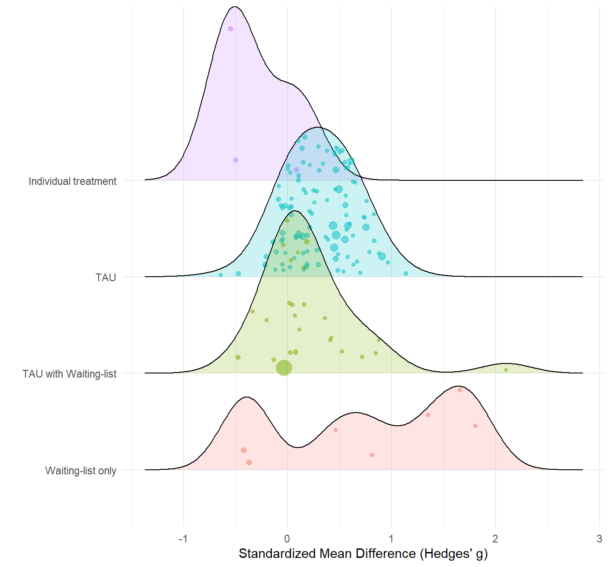{#fig-control-ridge-mental fig-pos='H' width=672}
:::
:::

:::

:::


### Risk of bias (RoB)
::: {.columns}

::: {.column width="95%"}

::: {#tbl-rob-subgroup .cell .tbl-cap-location-top tbl-cap='Dependency table across overall risk of bias assessments (reintegration)'}

```{.r .cell-code}
rob_subgroup_dat_cross <- cat_dat_cross(
  data = reintegration_dat,
  variable = overall_rob,
  study_id = study
)

rob_subgroup_dat_cross |>
  knitr::kable(
    "html",
    col.names = c(
      "Risk of bias judgment",
      colnames(rob_subgroup_dat_cross)[-1]
    ) 
  ) |>
  kableExtra::column_spec(1, bold = TRUE) |>
  kableExtra::footnote(
    general = paste0("Values outside the parentheses are number of studies,", "
                     with the number of samples and effect size estimates shown in the parentheses."
                     ), 
    general_title = "Note: ",
    footnote_as_chunk = T
  ) |>
  kableExtra::kable_styling(bootstrap_options = c("striped", "condensed"), full_width = T)
```

::: {.cell-output-display}
`````{=html}
<table style="NAborder-bottom: 0; margin-left: auto; margin-right: auto;" class="table table-striped table-condensed">
 <thead>
  <tr>
   <th style="text-align:left;"> Risk of bias judgment </th>
   <th style="text-align:left;"> Low </th>
   <th style="text-align:left;"> Some concerns/Moderate </th>
   <th style="text-align:left;"> Serious/High </th>
  </tr>
 </thead>
<tbody>
  <tr>
   <td style="text-align:left;font-weight: bold;"> Low </td>
   <td style="text-align:left;"> 10 (69) </td>
   <td style="text-align:left;"> - </td>
   <td style="text-align:left;"> - </td>
  </tr>
  <tr>
   <td style="text-align:left;font-weight: bold;"> Some concerns/Moderate </td>
   <td style="text-align:left;"> - </td>
   <td style="text-align:left;"> 21 (94) </td>
   <td style="text-align:left;"> 1 (1) </td>
  </tr>
  <tr>
   <td style="text-align:left;font-weight: bold;"> Serious/High </td>
   <td style="text-align:left;"> - </td>
   <td style="text-align:left;"> 1 (1) </td>
   <td style="text-align:left;"> 16 (42) </td>
  </tr>
</tbody>
<tfoot><tr><td style="padding: 0; " colspan="100%">
<span style="font-style: italic;">Note: </span> <sup></sup> Values outside the parentheses are number of studies,<br>                     with the number of samples and effect size estimates shown in the parentheses.</td></tr></tfoot>
</table>

`````
:::
:::

:::

::: {.column-margin}

::: {#tbl-rob-subgroup-mental .cell .tbl-cap-location-top tbl-cap='Dependency table across overall risk of bias assessments (mental health)'}

```{.r .cell-code}
rob_subgroup_dat_cross_mental <- cat_dat_cross(
  data = mental_health_dat,
  variable = overall_rob,
  study_id = study
)

rob_subgroup_dat_cross_mental |>
  knitr::kable(
    "html",
    col.names = c(
      "Risk of bias judgment",
      colnames(rob_subgroup_dat_cross_mental)[-1]
    ) 
  ) |>
  kableExtra::column_spec(1, bold = TRUE) |>
  kableExtra::footnote(
    general = paste0("Values outside the parentheses are number of studies,", "
                     with the number of samples and effect size estimates shown in the parentheses."
                     ), 
    general_title = "Note: ",
    footnote_as_chunk = T
  )  |>
  kableExtra::kable_styling(bootstrap_options = c("striped", "condensed"), full_width = T)
```

::: {.cell-output-display}
`````{=html}
<table style="NAborder-bottom: 0; margin-left: auto; margin-right: auto;" class="table table-striped table-condensed">
 <thead>
  <tr>
   <th style="text-align:left;"> Risk of bias judgment </th>
   <th style="text-align:left;"> Low </th>
   <th style="text-align:left;"> Some concerns/Moderate </th>
   <th style="text-align:left;"> Serious/High </th>
  </tr>
 </thead>
<tbody>
  <tr>
   <td style="text-align:left;font-weight: bold;"> Low </td>
   <td style="text-align:left;"> 10 (36) </td>
   <td style="text-align:left;"> - </td>
   <td style="text-align:left;"> - </td>
  </tr>
  <tr>
   <td style="text-align:left;font-weight: bold;"> Some concerns/Moderate </td>
   <td style="text-align:left;"> - </td>
   <td style="text-align:left;"> 20 (79) </td>
   <td style="text-align:left;"> 1 (2) </td>
  </tr>
  <tr>
   <td style="text-align:left;font-weight: bold;"> Serious/High </td>
   <td style="text-align:left;"> - </td>
   <td style="text-align:left;"> 1 (2) </td>
   <td style="text-align:left;"> 13 (29) </td>
  </tr>
</tbody>
<tfoot><tr><td style="padding: 0; " colspan="100%">
<span style="font-style: italic;">Note: </span> <sup></sup> Values outside the parentheses are number of studies,<br>                     with the number of samples and effect size estimates shown in the parentheses.</td></tr></tfoot>
</table>

`````
:::
:::

:::

:::

::: {.columns}

::: {.column width="95%"}

::: {.cell}

```{.r .cell-code}
cat_ridge(data = reintegration_dat, es = gt_pop, variable = overall_rob, v = vgt_pop)
```

::: {.cell-output-display}
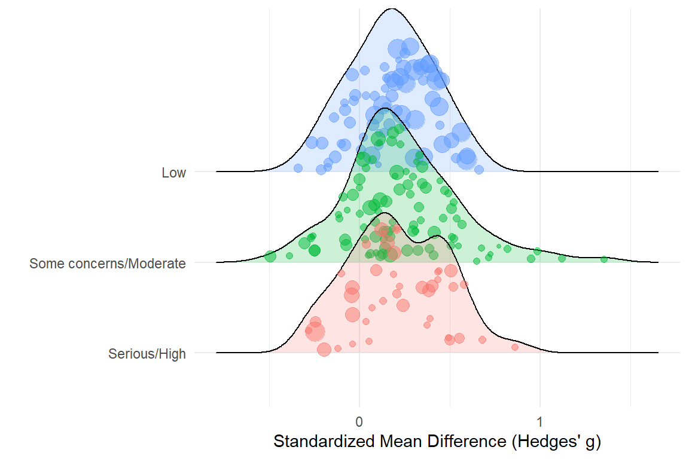{#fig-rob-ridge-reint fig-pos='H' width=576}
:::
:::

:::

::: {.column-margin}

::: {.cell}

```{.r .cell-code}
cat_ridge(data = gb_dat, es = gt_pop, variable = overall_rob, v = vgt_pop) 
```

::: {.cell-output-display}
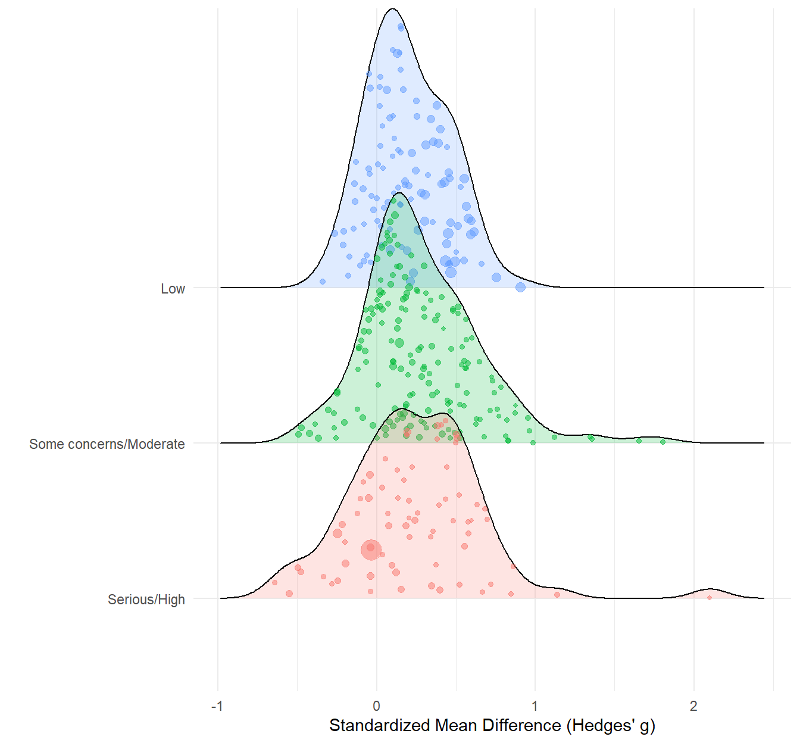{#fig-rob-ridge-mental fig-pos='H' width=672}
:::
:::

:::

:::

### Preregistered vs. not preregistered studies {.tabset}
::: {.columns}

::: {.column width="95%"}

::: {#tbl-prereg-subgroup .cell .tbl-cap-location-top tbl-cap='Dependency table by type of registration (reintegration)'}

```{.r .cell-code}
prereg_subgroup_dat_cross <- cat_dat_cross(
  data = reintegration_dat,
  variable = prereg_chr,
  study_id = study
)

prereg_subgroup_dat_cross |>
  knitr::kable(
    "html",
    col.names = c(
      "Registration",
      colnames(prereg_subgroup_dat_cross)[-1]
    )
  ) |>
  kableExtra::column_spec(1, bold = TRUE) |>
  kableExtra::footnote(
    general = paste0("Values outside the parentheses are number of studies,", "
                     with the number of samples and effect size estimates shown in the parentheses."
                     ), 
    general_title = "Note: ",
    footnote_as_chunk = T
  ) |>
  kableExtra::kable_styling(bootstrap_options = c("striped", "condensed"), full_width = T)
```

::: {.cell-output-display}
`````{=html}
<table style="NAborder-bottom: 0; margin-left: auto; margin-right: auto;" class="table table-striped table-condensed">
 <thead>
  <tr>
   <th style="text-align:left;"> Registration </th>
   <th style="text-align:left;"> Not preregistered </th>
   <th style="text-align:left;"> Preregistered </th>
  </tr>
 </thead>
<tbody>
  <tr>
   <td style="text-align:left;font-weight: bold;"> Not preregistered </td>
   <td style="text-align:left;"> 24 (65) </td>
   <td style="text-align:left;"> - </td>
  </tr>
  <tr>
   <td style="text-align:left;font-weight: bold;"> Preregistered </td>
   <td style="text-align:left;"> - </td>
   <td style="text-align:left;"> 22 (140) </td>
  </tr>
</tbody>
<tfoot><tr><td style="padding: 0; " colspan="100%">
<span style="font-style: italic;">Note: </span> <sup></sup> Values outside the parentheses are number of studies,<br>                     with the number of samples and effect size estimates shown in the parentheses.</td></tr></tfoot>
</table>

`````
:::
:::

:::

::: {.column-margin}

::: {#tbl-prereg-subgroup-mental .cell .tbl-cap-location-top tbl-cap='Dependency table by type of registration (mental health)'}

```{.r .cell-code}
prereg_subgroup_dat_cross_mental <- cat_dat_cross(
  data = mental_health_dat,
  variable = prereg_chr,
  study_id = study
)

prereg_subgroup_dat_cross_mental |>
  knitr::kable(
    "html",
    col.names = c(
      "Risk of bias judgment",
      colnames(prereg_subgroup_dat_cross_mental)[-1]
    ) 
  ) |>
  kableExtra::column_spec(1, bold = TRUE) |>
  kableExtra::footnote(
    general = paste0("Values outside the parentheses are number of studies,", "
                     with the number of samples and effect size estimates shown in the parentheses."
                     ), 
    general_title = "Note: ",
    footnote_as_chunk = T
  )  |>
  kableExtra::kable_styling(bootstrap_options = c("striped", "condensed"), full_width = T)
```

::: {.cell-output-display}
`````{=html}
<table style="NAborder-bottom: 0; margin-left: auto; margin-right: auto;" class="table table-striped table-condensed">
 <thead>
  <tr>
   <th style="text-align:left;"> Risk of bias judgment </th>
   <th style="text-align:left;"> Not preregistered </th>
   <th style="text-align:left;"> Preregistered </th>
  </tr>
 </thead>
<tbody>
  <tr>
   <td style="text-align:left;font-weight: bold;"> Not preregistered </td>
   <td style="text-align:left;"> 22 (62) </td>
   <td style="text-align:left;"> - </td>
  </tr>
  <tr>
   <td style="text-align:left;font-weight: bold;"> Preregistered </td>
   <td style="text-align:left;"> - </td>
   <td style="text-align:left;"> 20 (82) </td>
  </tr>
</tbody>
<tfoot><tr><td style="padding: 0; " colspan="100%">
<span style="font-style: italic;">Note: </span> <sup></sup> Values outside the parentheses are number of studies,<br>                     with the number of samples and effect size estimates shown in the parentheses.</td></tr></tfoot>
</table>

`````
:::
:::

:::

:::

::: {.columns}

::: {.column width="95%"}

::: {.cell}

```{.r .cell-code}
cat_ridge(data = reintegration_dat, es = gt_pop, variable = prereg_chr, v = vgt_pop)
```

::: {.cell-output-display}
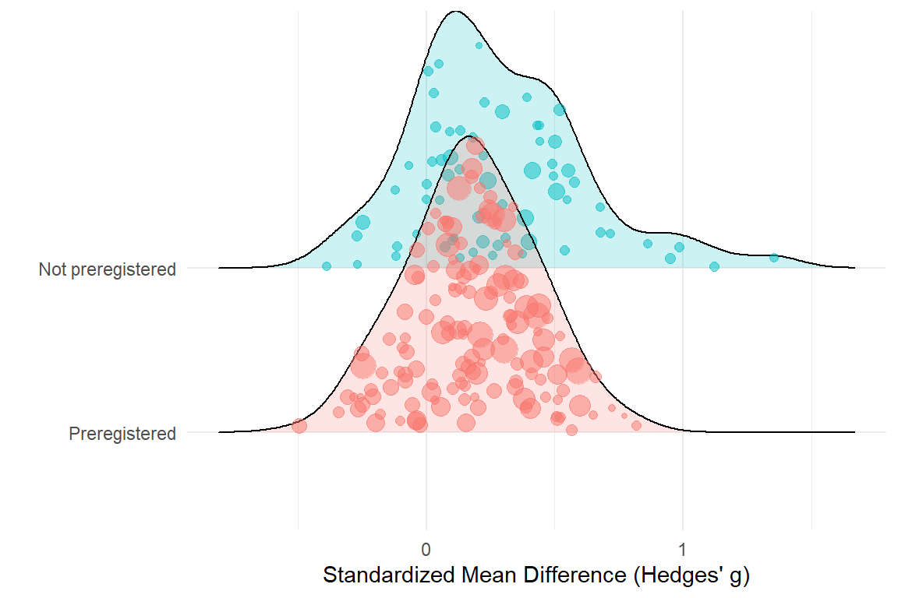{#fig-prereg-ridge-reint fig-pos='H' width=576}
:::
:::

:::

::: {.column-margin}

::: {.cell}

```{.r .cell-code}
cat_ridge(data = gb_dat, es = gt_pop, variable = prereg_chr, v = vgt_pop) 
```

::: {.cell-output-display}
{#fig-prereg-ridge-mental fig-pos='H' width=672}
:::
:::

:::

:::

::: {.columns}

::: {.column width="130%"}

::: {.cell}

```{.r .cell-code}
cat_ridge(data = gb_dat, es = gt_pop, variable = overall_rob, v = vgt_pop) + 
  facet_grid(outcome_construct~prereg_chr) + 
  theme(
    strip.background = element_rect(color = "black", fill = "gray92")
  )
```

::: {.cell-output-display}
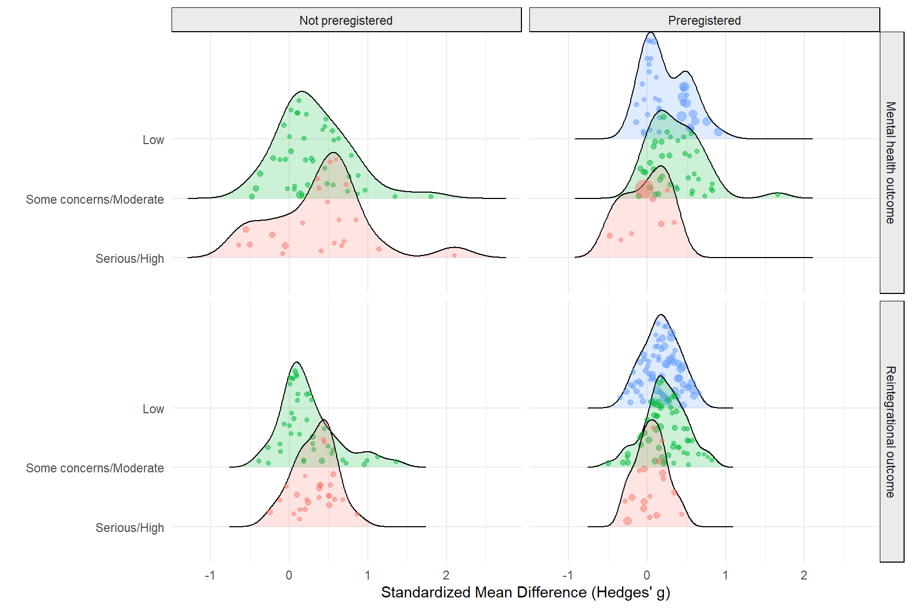{#fig-prereg-rob-ridge-mental fig-pos='H' width=864}
:::
:::

:::

:::
## Continuous moderators

::: {.columns}

::: {.column width="95%"}

::: {#tbl-continuous-characteristics-reint .cell .tbl-cap-location-top tbl-cap='Distribution of continuous moderators (reintegration)'}

```{.r .cell-code}
var_labels <- c(
  "Mean age" = "age",
  "Percent Male" = "male_pct",
  "Total Number of Sessions" = "sessions",
  "Sessions per Week" = "intensity",
  "Length of Intervention (in Weeks)" = "duration",
  "Weeks After End of Intervention" = "timing",
  "Weeks from Baseline" = "weeks_from_baseline"
)

continuous_descriptives <- 
 reintegration_dat |> 
  summarise(
    age = mean(age_mean),
    male_pct = mean(male_pct),
    sessions = mean(total_number_of_sessions),
    intensity = mean(sessions_per_week),
    duration = mean(duration_in_weeks),
    timing = mean(time_after_end_intervention_weeks),
    weeks_from_baseline = mean(time_from_baseline_weeks),
    .by = study
  ) 

continuous_descriptives_tab <- 
  continuous_descriptives |> 
  #pivot_longer(
  #  cols = age:male_pct,
  #  names_to = "var",
  #  values_to = "val"
  #) |> 
  #arrange(var)
  gather(var, val, age, male_pct, sessions, intensity, duration, timing, weeks_from_baseline) |>
  summarise(
    `% Missing` = 100 * mean(is.na(val)),
    Mean = mean(val, na.rm = TRUE),
    SD = sd(val, na.rm = TRUE),
    Min = min(val, na.rm = TRUE),
    LQ = quantile(val, na.rm = TRUE)[2],
    Median = median(val, na.rm = TRUE),
    UQ = quantile(val, na.rm = TRUE)[4],
    Max = max(val, na.rm = TRUE),
    .by = var
  ) |> 
  mutate(
    var = factor(var, levels = var_labels, labels = names(var_labels))
  )

knitr::kable(
  continuous_descriptives_tab, 
  col.names = c("Variable", colnames(continuous_descriptives_tab)[-1]),
  digits = 1,
  booktabs = TRUE
) |>
  kable_styling(bootstrap_options = c("striped", "condensed"), full_width = FALSE) |>
  collapse_rows(1, valign = "top")
```

::: {.cell-output-display}
`````{=html}
<table class="table table-striped table-condensed" style="width: auto !important; margin-left: auto; margin-right: auto;">
 <thead>
  <tr>
   <th style="text-align:left;"> Variable </th>
   <th style="text-align:right;"> % Missing </th>
   <th style="text-align:right;"> Mean </th>
   <th style="text-align:right;"> SD </th>
   <th style="text-align:right;"> Min </th>
   <th style="text-align:right;"> LQ </th>
   <th style="text-align:right;"> Median </th>
   <th style="text-align:right;"> UQ </th>
   <th style="text-align:right;"> Max </th>
  </tr>
 </thead>
<tbody>
  <tr>
   <td style="text-align:left;"> Mean age </td>
   <td style="text-align:right;"> 0.0 </td>
   <td style="text-align:right;"> 40.6 </td>
   <td style="text-align:right;"> 9.0 </td>
   <td style="text-align:right;"> 24.9 </td>
   <td style="text-align:right;"> 35.7 </td>
   <td style="text-align:right;"> 40.8 </td>
   <td style="text-align:right;"> 43.8 </td>
   <td style="text-align:right;"> 67.4 </td>
  </tr>
  <tr>
   <td style="text-align:left;"> Percent Male </td>
   <td style="text-align:right;"> 2.2 </td>
   <td style="text-align:right;"> 46.6 </td>
   <td style="text-align:right;"> 23.4 </td>
   <td style="text-align:right;"> 0.0 </td>
   <td style="text-align:right;"> 32.0 </td>
   <td style="text-align:right;"> 46.3 </td>
   <td style="text-align:right;"> 68.0 </td>
   <td style="text-align:right;"> 81.2 </td>
  </tr>
  <tr>
   <td style="text-align:left;"> Total Number of Sessions </td>
   <td style="text-align:right;"> 2.2 </td>
   <td style="text-align:right;"> 21.0 </td>
   <td style="text-align:right;"> 21.9 </td>
   <td style="text-align:right;"> 3.0 </td>
   <td style="text-align:right;"> 8.0 </td>
   <td style="text-align:right;"> 12.0 </td>
   <td style="text-align:right;"> 24.0 </td>
   <td style="text-align:right;"> 104.0 </td>
  </tr>
  <tr>
   <td style="text-align:left;"> Sessions per Week </td>
   <td style="text-align:right;"> 2.2 </td>
   <td style="text-align:right;"> 1.3 </td>
   <td style="text-align:right;"> 1.5 </td>
   <td style="text-align:right;"> 0.1 </td>
   <td style="text-align:right;"> 1.0 </td>
   <td style="text-align:right;"> 1.0 </td>
   <td style="text-align:right;"> 1.0 </td>
   <td style="text-align:right;"> 10.5 </td>
  </tr>
  <tr>
   <td style="text-align:left;"> Length of Intervention (in Weeks) </td>
   <td style="text-align:right;"> 0.0 </td>
   <td style="text-align:right;"> 18.3 </td>
   <td style="text-align:right;"> 16.9 </td>
   <td style="text-align:right;"> 4.0 </td>
   <td style="text-align:right;"> 8.0 </td>
   <td style="text-align:right;"> 12.0 </td>
   <td style="text-align:right;"> 24.0 </td>
   <td style="text-align:right;"> 78.0 </td>
  </tr>
  <tr>
   <td style="text-align:left;"> Weeks After End of Intervention </td>
   <td style="text-align:right;"> 0.0 </td>
   <td style="text-align:right;"> 5.9 </td>
   <td style="text-align:right;"> 10.1 </td>
   <td style="text-align:right;"> 0.0 </td>
   <td style="text-align:right;"> 0.0 </td>
   <td style="text-align:right;"> 0.5 </td>
   <td style="text-align:right;"> 6.4 </td>
   <td style="text-align:right;"> 52.0 </td>
  </tr>
  <tr>
   <td style="text-align:left;"> Weeks from Baseline </td>
   <td style="text-align:right;"> 0.0 </td>
   <td style="text-align:right;"> 24.2 </td>
   <td style="text-align:right;"> 22.7 </td>
   <td style="text-align:right;"> 6.0 </td>
   <td style="text-align:right;"> 12.0 </td>
   <td style="text-align:right;"> 18.0 </td>
   <td style="text-align:right;"> 26.0 </td>
   <td style="text-align:right;"> 130.0 </td>
  </tr>
</tbody>
</table>

`````
:::
:::

:::

::: {.column-margin}

::: {#tbl-continuous-characteristics-mental .cell .tbl-cap-location-top tbl-cap='Distribution of continuous moderators (mental health)'}

```{.r .cell-code}
var_labels_mental <- c(
  "Mean age" = "age",
  "Percent Male" = "male_pct",
  "N Sessions" = "sessions",
  "Sessions Week" = "intensity",
  "Length" = "duration",
  "Weeks After Intervention" = "timing",
  "Weeks Baseline" = "weeks_from_baseline"
)

continuous_descriptives_mental <- 
 mental_health_dat |> 
  summarise(
    age = mean(age_mean),
    male_pct = mean(male_pct),
    sessions = mean(total_number_of_sessions),
    intensity = mean(sessions_per_week),
    duration = mean(duration_in_weeks),
    timing = mean(time_after_end_intervention_weeks),
    weeks_from_baseline = mean(time_from_baseline_weeks),
    .by = study
  ) 

continuous_descriptives_tab_mental <- 
  continuous_descriptives_mental |> 
  #pivot_longer(
  #  cols = age:male_pct,
  #  names_to = "var",
  #  values_to = "val"
  #) |> 
  #arrange(var)
  gather(var, val, age, male_pct, sessions, intensity, duration, timing, weeks_from_baseline) |>
  summarise(
    `% Missing` = 100 * mean(is.na(val)),
    Mean = mean(val, na.rm = TRUE),
    SD = sd(val, na.rm = TRUE),
    Min = min(val, na.rm = TRUE),
    LQ = quantile(val, na.rm = TRUE)[2],
    Median = median(val, na.rm = TRUE),
    UQ = quantile(val, na.rm = TRUE)[4],
    Max = max(val, na.rm = TRUE),
    .by = var
  ) |> 
  mutate(
    var = factor(var, levels = var_labels_mental, labels = names(var_labels_mental))
  )

knitr::kable(
  continuous_descriptives_tab_mental, 
  col.names = c("Variable", colnames(continuous_descriptives_tab)[-1]),
  digits = 1,
  booktabs = TRUE
) |>
  kable_styling(bootstrap_options = c("striped", "condensed"), full_width = FALSE) |>
  collapse_rows(1, valign = "top")
```

::: {.cell-output-display}
`````{=html}
<table class="table table-striped table-condensed" style="width: auto !important; margin-left: auto; margin-right: auto;">
 <thead>
  <tr>
   <th style="text-align:left;"> Variable </th>
   <th style="text-align:right;"> % Missing </th>
   <th style="text-align:right;"> Mean </th>
   <th style="text-align:right;"> SD </th>
   <th style="text-align:right;"> Min </th>
   <th style="text-align:right;"> LQ </th>
   <th style="text-align:right;"> Median </th>
   <th style="text-align:right;"> UQ </th>
   <th style="text-align:right;"> Max </th>
  </tr>
 </thead>
<tbody>
  <tr>
   <td style="text-align:left;"> Mean age </td>
   <td style="text-align:right;"> 0.0 </td>
   <td style="text-align:right;"> 39.6 </td>
   <td style="text-align:right;"> 9.3 </td>
   <td style="text-align:right;"> 21.6 </td>
   <td style="text-align:right;"> 34.9 </td>
   <td style="text-align:right;"> 39.7 </td>
   <td style="text-align:right;"> 43.0 </td>
   <td style="text-align:right;"> 67.4 </td>
  </tr>
  <tr>
   <td style="text-align:left;"> Percent Male </td>
   <td style="text-align:right;"> 2.4 </td>
   <td style="text-align:right;"> 45.2 </td>
   <td style="text-align:right;"> 23.5 </td>
   <td style="text-align:right;"> 0.0 </td>
   <td style="text-align:right;"> 28.9 </td>
   <td style="text-align:right;"> 46.3 </td>
   <td style="text-align:right;"> 67.2 </td>
   <td style="text-align:right;"> 81.2 </td>
  </tr>
  <tr>
   <td style="text-align:left;"> N Sessions </td>
   <td style="text-align:right;"> 2.4 </td>
   <td style="text-align:right;"> 21.6 </td>
   <td style="text-align:right;"> 22.5 </td>
   <td style="text-align:right;"> 3.0 </td>
   <td style="text-align:right;"> 8.0 </td>
   <td style="text-align:right;"> 13.0 </td>
   <td style="text-align:right;"> 24.0 </td>
   <td style="text-align:right;"> 104.0 </td>
  </tr>
  <tr>
   <td style="text-align:left;"> Sessions Week </td>
   <td style="text-align:right;"> 2.4 </td>
   <td style="text-align:right;"> 1.3 </td>
   <td style="text-align:right;"> 1.5 </td>
   <td style="text-align:right;"> 0.1 </td>
   <td style="text-align:right;"> 1.0 </td>
   <td style="text-align:right;"> 1.0 </td>
   <td style="text-align:right;"> 1.0 </td>
   <td style="text-align:right;"> 10.5 </td>
  </tr>
  <tr>
   <td style="text-align:left;"> Length </td>
   <td style="text-align:right;"> 0.0 </td>
   <td style="text-align:right;"> 19.3 </td>
   <td style="text-align:right;"> 17.5 </td>
   <td style="text-align:right;"> 4.0 </td>
   <td style="text-align:right;"> 8.5 </td>
   <td style="text-align:right;"> 12.0 </td>
   <td style="text-align:right;"> 25.5 </td>
   <td style="text-align:right;"> 78.0 </td>
  </tr>
  <tr>
   <td style="text-align:left;"> Weeks After Intervention </td>
   <td style="text-align:right;"> 0.0 </td>
   <td style="text-align:right;"> 6.8 </td>
   <td style="text-align:right;"> 11.0 </td>
   <td style="text-align:right;"> 0.0 </td>
   <td style="text-align:right;"> 0.0 </td>
   <td style="text-align:right;"> 1.0 </td>
   <td style="text-align:right;"> 7.6 </td>
   <td style="text-align:right;"> 52.0 </td>
  </tr>
  <tr>
   <td style="text-align:left;"> Weeks Baseline </td>
   <td style="text-align:right;"> 0.0 </td>
   <td style="text-align:right;"> 26.1 </td>
   <td style="text-align:right;"> 24.1 </td>
   <td style="text-align:right;"> 6.0 </td>
   <td style="text-align:right;"> 12.0 </td>
   <td style="text-align:right;"> 17.0 </td>
   <td style="text-align:right;"> 28.8 </td>
   <td style="text-align:right;"> 130.0 </td>
  </tr>
</tbody>
</table>

`````
:::
:::

:::

:::

### Age distribution across studies

::: {.cell}

```{.r .cell-code}
density_plot <- function(variable, x_title, data, color = "cornflowerblue") {
  require(dplyr)
  require(tidyr)
  require(ggplot2)
  require(rlang)
  require(MetBrewer)
  
  var_exp <- enquo(variable)
  var_str <- as_label(var_exp)
  
  data |>
    ggplot(aes(x = !!var_exp)) +
    geom_density(fill = color, alpha = 0.8) +
    geom_rug(alpha = 0.7, length = unit(0.04, "npc")) +
    scale_y_continuous(labels = scales::label_number(accuracy = 10^(-3))) +
    theme_minimal() +
    labs(x = x_title, y = "")
}
```
:::


::: {.columns}

::: {.column width="95%"}

::: {.cell}

```{.r .cell-code}
age_density <- density_plot(age, "Mean Age", continuous_descriptives)

age_density + expand_limits(x = 70)
```

::: {.cell-output-display}
{#fig-age-density-reint fig-pos='H' width=576}
:::
:::

:::

::: {.column-margin}

::: {.cell}

```{.r .cell-code}
age_density_mental <- density_plot(age, "Mean Age", continuous_descriptives_mental, color = "gray")

age_density_mental + expand_limits(x = 70)
```

::: {.cell-output-display}
{#fig-age-density-mental fig-pos='H' width=672}
:::
:::

:::

:::

### Percent males in sample distribution across studies
::: {.columns}

::: {.column width="95%"}

::: {.cell}

```{.r .cell-code}
male_density <- suppressWarnings(density_plot(male_pct, "Proportion Male", continuous_descriptives))
male_density 
```

::: {.cell-output-display}
{#fig-males-density-reint fig-pos='H' width=576}
:::
:::

:::

::: {.column-margin}

::: {.cell}

```{.r .cell-code}
male_density_mental <- suppressWarnings(density_plot(male_pct, "Proportion Male", continuous_descriptives_mental, color = "gray"))
male_density_mental 
```

::: {.cell-output-display}
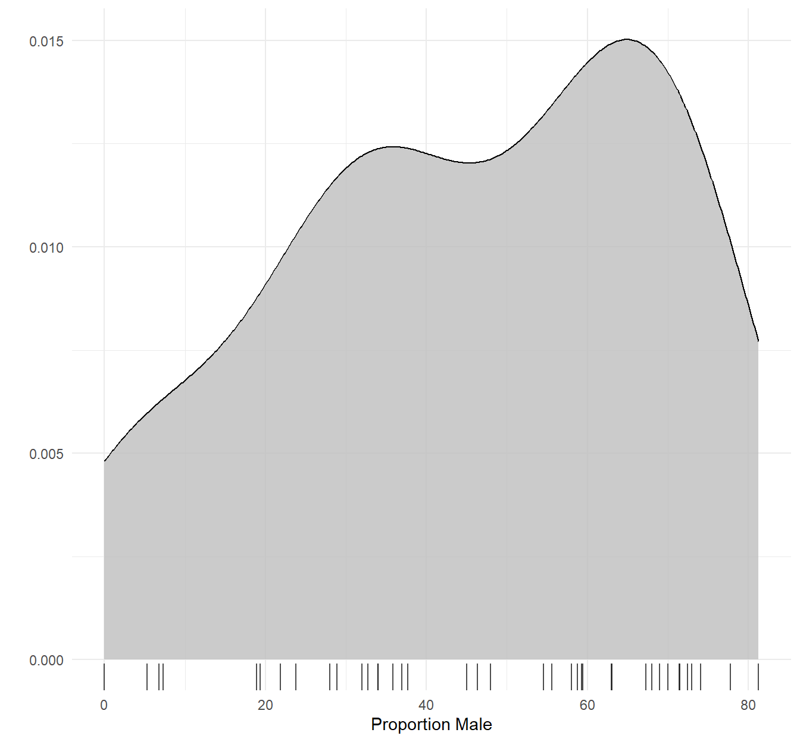{#fig-males-density-mental fig-pos='H' width=672}
:::
:::

:::

:::

### Total number of sessions


::: {.cell}

```{.r .cell-code}
hist_plot <- function(variable, x_title, data, color = "cornflowerblue") {
  require(dplyr)
  require(tidyr)
  require(ggplot2)
  require(rlang)
  require(MetBrewer)
  
  var_exp <- enquo(variable)
  var_str <- as_label(var_exp)
  
  x_vals <- data[[var_str]]
  min_val <- floor(min(x_vals, na.rm = TRUE))
  max_val <- ceiling(max(x_vals, na.rm = TRUE))
  
  data |>
    ggplot(aes(x = !!var_exp)) +
    geom_histogram(binwidth = 1, boundary = 0, fill = color, alpha = 0.8) +
    scale_x_continuous(breaks = pretty(seq(min_val, max_val, by = 1), n = 5)) +
    scale_y_continuous(breaks = seq(0, 10, 2)) +
    theme_minimal() +
    labs(x = x_title, y = "")
}
```
:::


::: {.columns}

::: {.column width="95%"}

::: {.cell}

```{.r .cell-code}
sessions_hist <- hist_plot(sessions, "Total Number of Sessions in Intervention", continuous_descriptives)
sessions_hist + labs(title = "Reintegration") + theme(plot.title = element_text(hjust = 0.5))
```

::: {.cell-output-display}
{#fig-sessions-hist-reint fig-pos='H' width=672}
:::
:::

:::

::: {.column-margin}

::: {.cell}

```{.r .cell-code}
sessions_hist_mental <- hist_plot(sessions, "Total Number of Sessions in Intervention", continuous_descriptives_mental, color = "gray")
sessions_hist_mental + labs(title = "Mental Health") + theme(plot.title = element_text(hjust = 0.5))
```

::: {.cell-output-display}
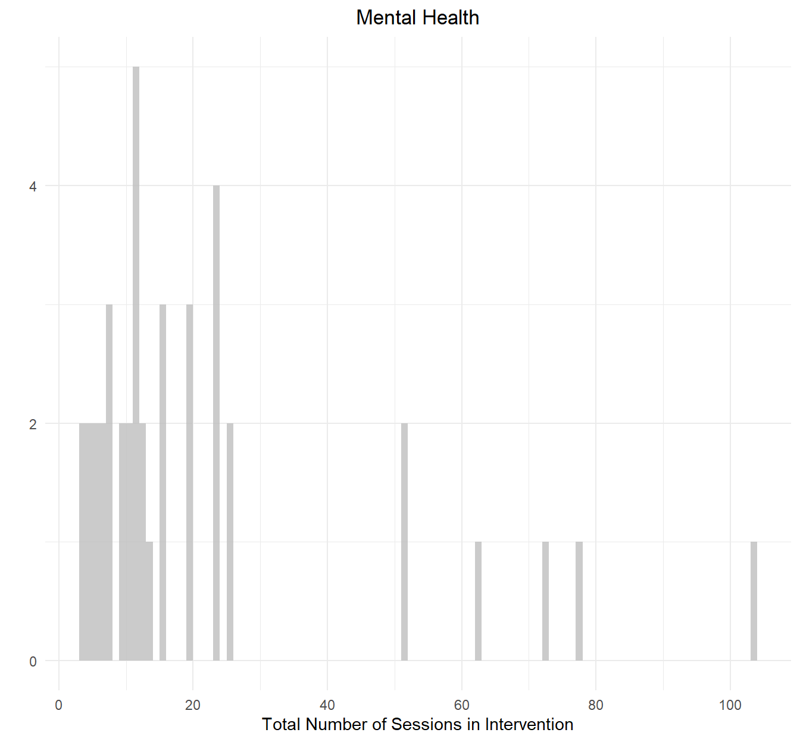{#fig-sessions-hist-mental fig-pos='H' width=672}
:::
:::

:::

:::

### Duration and intensity (number of sessions per week)
::: {.columns}

::: {.column width="95%"}

::: {.cell fig.topcaption='true'}

```{.r .cell-code}
#png(filename = "Figures/duration_length_plot.png", height = 11, width = 10, res = 600, units = "in")
reintegration_dat |>
  select(study, duration_in_weeks, sessions_per_week, N_total) |> 
  filter(!is.na(sessions_per_week)) |>  
  arrange(desc(duration_in_weeks)) |> 
  mutate(
    study = factor(study, levels = unique(study)),
    sessions = case_when(
      sessions_per_week < 1 ~ "1<",
      sessions_per_week == 1 ~ "1",
      sessions_per_week == 1.5 ~ "1.5",
      sessions_per_week == 2 ~ "2",
      sessions_per_week == 2.5 ~ "2.5",
      sessions_per_week > 2 ~ ">10"
    ),
    sessions = factor(sessions, levels = unique(sessions))
  ) |> 
  ggplot(aes(y = study, x = duration_in_weeks, color = study)) +
  geom_segment(aes(x = 0, xend = duration_in_weeks, y = study, yend = study)) +
  geom_vline(xintercept = c(13, 26, 52, 78), linetype = "dashed", alpha = 0.5) +
  geom_point(
    aes(size = N_total)
  ) +
  scale_x_continuous(breaks = seq(0, 80, 10)) +
  facet_grid(vars(sessions_per_week), scales = "free_y", space = "free_y", switch = "y") + 
  #scale_size(breaks = c(0.5, 1, 1.5, 2, 10.5), limits = c(0, 10.5)) +
  labs(
    x = "Lenght of intervention in weeks", 
    y = "",
    caption = paste0(
      "The light gray facet grids indicate the average number of sessions per week.\n", 
      "The dashed lines indicate 3 months, 6 months, 1 year, and 1.5 years, respectively.\n",
      "The point sizes are weighted by the study sample sizes."
      )
  ) +
  theme_minimal() + 
  scale_colour_discrete(guide = "none") +
  theme(
    legend.position = "none", 
    strip.text = element_text(color = "black"),
    strip.background.y = element_rect(fill = "gray93", color = "white"),
    strip.text.y.left = element_text(angle = 0),
    plot.caption = element_text(hjust = 0)
  ) 
#dev.off()
```

::: {.cell-output-display}
{#fig-duration-reint fig-pos='H' width=652.8}
:::
:::

:::

::: {.column-margin}

::: {.cell fig.topcaption='true'}

```{.r .cell-code}
mental_health_dat |>
  select(study, duration_in_weeks, sessions_per_week, N_total) |> 
  filter(!is.na(sessions_per_week)) |>  
  arrange(desc(duration_in_weeks)) |> 
  mutate(
    study = factor(study, levels = unique(study)),
    sessions = case_when(
      sessions_per_week < 1 ~ "Less than 1",
      sessions_per_week == 1 ~ "1 per week",
      sessions_per_week == 2 ~ "2 per week",
      sessions_per_week > 2 ~ ">10"
    ),
    sessions = factor(sessions, levels = unique(sessions))
  ) |> 
  ggplot(aes(y = study, x = duration_in_weeks, color = study)) +
  geom_segment(aes(x = 0, xend = duration_in_weeks, y = study, yend = study)) +
  geom_vline(xintercept = c(13, 26, 52, 78), linetype = "dashed", alpha = 0.5) +
  geom_point(
    aes(size = N_total)
  ) +
  scale_x_continuous(breaks = seq(0, 80, 10)) +
  facet_grid(vars(sessions_per_week), scales = "free_y", space = "free_y", switch = "y") + 
  #scale_size(breaks = c(0.5, 1, 1.5, 2, 10.5), limits = c(0, 10.5)) +
  labs(
    x = "Lenght of intervention in weeks", 
    y = "", 
    caption = 
      paste0(
      "The light gray facet grids indicate the average number of sessions per week.\n", 
      "The dashed lines indicate 3 months, 6 months, 1 year, and 1.5 years, respectively.\n",
      "The point sizes are weighted by the study sample sizes."
      )
  ) +
  theme_minimal() + 
  scale_colour_discrete(guide = "none") +
  theme(
    legend.position = "none", 
    strip.text = element_text(color = "black"),
    strip.background.y = element_rect(fill = "gray93", color = "white"),
    strip.text.y.left = element_text(angle = 0),
    plot.caption = element_text(hjust = 0)
  )  
```

::: {.cell-output-display}
{#fig-duration-mental fig-pos='H' width=672}
:::
:::

::: 

:::

### Weeks after end of intervention

::: {.columns}

::: {.column width="95%"}

::: {.cell fig.topcaption='true'}

```{.r .cell-code}
reintegration_dat |>
  select(study, time_after_end_intervention_weeks, N_total) |> 
  arrange(desc(study)) |> 
  mutate(study = factor(study, levels = unique(study))) |> 
  ggplot(aes(y = study, x = time_after_end_intervention_weeks, color = study)) +
  geom_point(aes(size = N_total),
             alpha = 0.5) +
  geom_line() +
  labs(x = "Weeks after end of intervention all studies", y = "")+
  theme_minimal() + 
  theme(legend.position = "none")
```

::: {.cell-output-display}
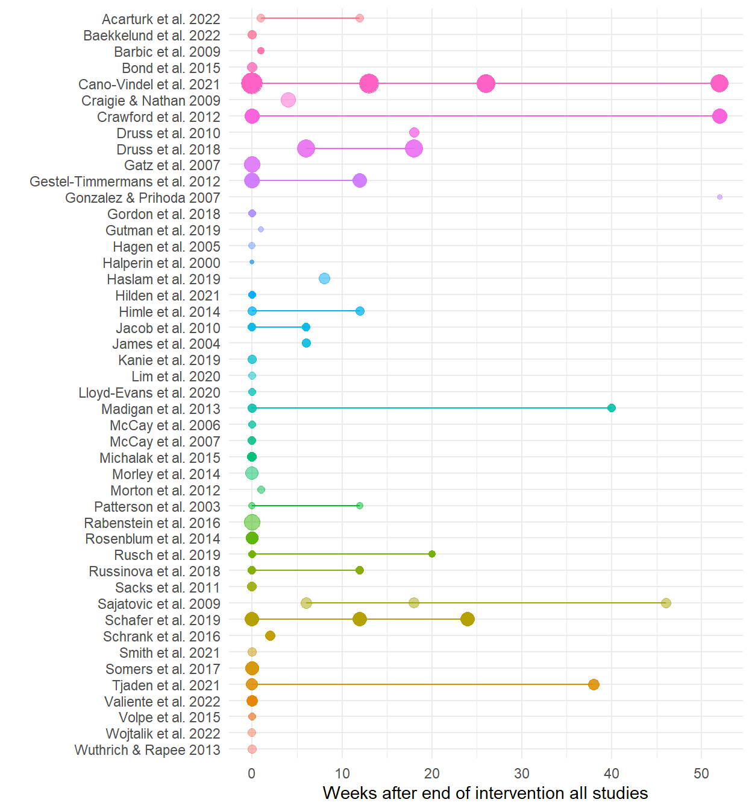{#fig-follow-up-connected-reint fig-pos='H' width=624}
:::
:::

:::

::: {.column-margin}

::: {.cell fig.topcaption='true'}

```{.r .cell-code}
mental_health_dat |>
  select(study, time_after_end_intervention_weeks, N_total) |> 
  arrange(desc(study)) |> 
  mutate(study = factor(study, levels = unique(study))) |> 
  ggplot(aes(y = study, x = time_after_end_intervention_weeks, color = study)) +
  geom_point(aes(size = N_total),
             alpha = 0.5) +
  geom_line() +
  labs(x = "Weeks after end of intervention all studies", y = "")+
  theme_minimal() + 
  theme(legend.position = "none")
```

::: {.cell-output-display}
{#fig-follow-up-connected-mental fig-pos='H' width=672}
:::
:::

::: 

:::

#### Correlation between effect size estimates and measurement timing
::: {.columns}

::: {.column width="95%"}

::: {.cell fig.topcaption='true'}

```{.r .cell-code}
reintegration_dat |> 
  select(study, gt_pop, vgt_pop, time_after_end_intervention_weeks) |> 
  ggplot() +
  aes(x = time_after_end_intervention_weeks, y = gt_pop, color = study) +
  geom_vline(xintercept = 0) + 
  geom_hline(yintercept = 0) + 
  geom_point(aes(size = 1/vgt_pop), alpha = 0.30) + 
  geom_smooth(method = "lm", formula = y ~ x, color = "yellow") + 
  scale_x_continuous(breaks = seq(0, 55, 5)) +
  theme_minimal() + 
  theme(legend.position = "none") + 
  labs(x = "Follow-up duration (months)", y = "Hedges' g")
```

::: {.cell-output-display}
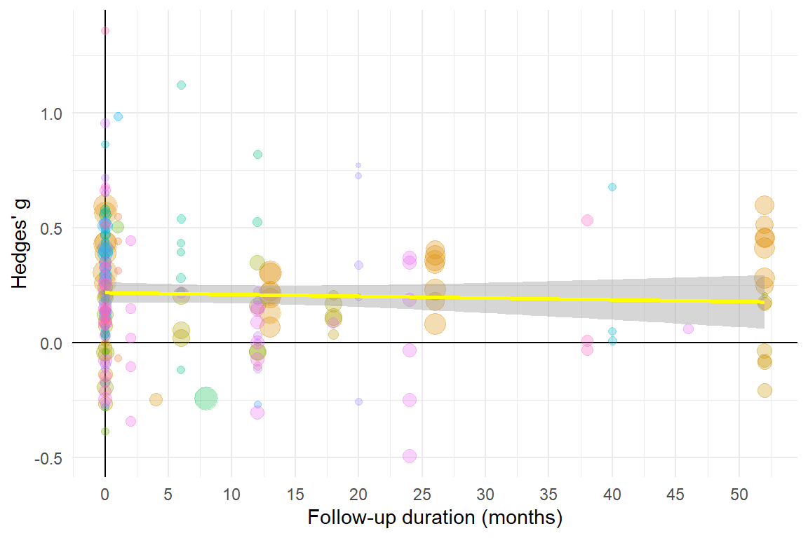{#fig-es-time-reint fig-pos='H' width=576}
:::
:::

:::

::: {.column-margin}

::: {.cell fig.topcaption='true'}

```{.r .cell-code}
mental_health_dat |> 
  select(study, gt_pop, vgt_pop, time_after_end_intervention_weeks) |> 
  ggplot() +
  aes(x = time_after_end_intervention_weeks, y = gt_pop, color = study) +
  geom_vline(xintercept = 0) + 
  geom_hline(yintercept = 0) + 
 geom_point(aes(size = 1/vgt_pop), alpha = 0.30) + 
  geom_smooth(method = "lm", formula = y ~ x, color = "yellow") + 
  scale_x_continuous(breaks = seq(0, 55, 5)) +
  theme_minimal() + 
  theme(legend.position = "none") + 
  labs(x = "Follow-up duration (months)", y = "Hedges' g")
```

::: {.cell-output-display}
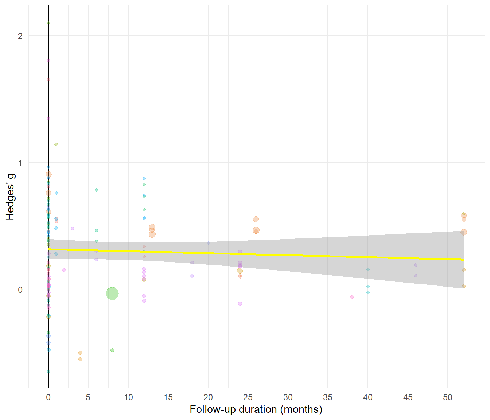{#fig-es-time-mental fig-pos='H' width=672}
:::
:::

:::

:::


## Multivariate structure

### Covariance plots

::: {.columns}

::: {.column width="160%"}

::: {.panel-tabset}
### Substantial categorical and continuous moderators

::: {.panel-tabset}
#### Reintegration (across subgroup analyzed outcomes)


::: {.cell}

```{.r .cell-code}
multivariate_dat_reint <- 
  reintegration_dat |>
  filter(str_detect(analysis_plan, "Alco|Hope|Social|Well")) |> 
  select(
    `Outcome` = analysis_plan,
    `Sample diagnosis` = schizophrenia,
    `Intervention` = CBT_int,
    `Type of test` = test_type,
    `Mean age` = age_mean,
    `% male` = male_pct,
    `Duration` = duration_in_weeks,
    `Intensity` = sessions_per_week,
    `Follow-up` = time_after_end_intervention_weeks
  )

multivariate_pairs_reint <- ggpairs(multivariate_dat_reint) + theme(
    text = element_text(size = 18),
    axis.text.x = element_text(size = 10, angle = 45, vjust = 1, hjust=1),  
    axis.text.y = element_text(size = 10) 
  ) 

multivariate_pairs_reint
```

::: {.cell-output-display}
{#fig-multivariate-plot-reint fig-pos='H' width=2304}
:::
:::


#### Mental health

::: {.cell}

```{.r .cell-code}
multivariate_dat_mental <- 
  mental_health_dat |> 
  select(
    `Outcome` = analysis_plan,
    `Sample diagnosis` = schizophrenia,
    `Intervention` = CBT_int,
    `Type of test` = test_type,
    `Mean age` = age_mean,
    `% male` = male_pct,
    `Duration` = duration_in_weeks,
    `Intensity` = sessions_per_week,
    `Follow-up` = time_after_end_intervention_weeks
  )

multivariate_pairs_mental <- ggpairs(multivariate_dat_mental) + theme(
    text = element_text(size = 18),
    axis.text.x = element_text(size = 10, angle = 45, vjust = 1, hjust=1),  
    axis.text.y = element_text(size = 10) 
  )

multivariate_pairs_mental
```

::: {.cell-output-display}
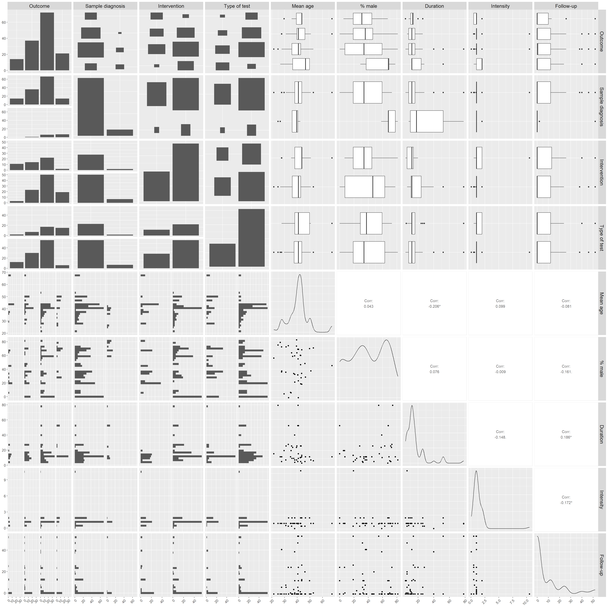{#fig-multivariate-plot-mental fig-pos='H' width=2304}
:::
:::


:::


### Methodological categorical and continuous moderators

::: {.panel-tabset}
#### Reintegration (across subgroup analyzed outcomes)


::: {.cell}

```{.r .cell-code}
multivariate_dat_reint_method <- 
  reintegration_dat |>
  filter(str_detect(analysis_plan, "Alco|Hope|Social|Well")) |> 
  select(
    `Strategy` = analysis_strategy,
    `Design` = QES_design,
    `Control grp` = control,
    `RoB` = overall_rob,
    `Preregistration` = prereg_chr,
    `Mean age` = age_mean,
    `% male` = male_pct,
    `Duration` = duration_in_weeks,
    `Intensity` = sessions_per_week,
    `Follow-up` = time_after_end_intervention_weeks
  )

multivariate_pairs_reint_method <- ggpairs(multivariate_dat_reint_method) + theme(
    text = element_text(size = 18),
    axis.text.x = element_text(size = 9, angle = 45, vjust = 1, hjust=1),  
    axis.text.y = element_text(size = 9) 
  ) 

multivariate_pairs_reint_method
```

::: {.cell-output-display}
{#fig-multivariate-plot-reint-method fig-pos='H' width=2304}
:::
:::


#### Mental health

::: {.cell}

```{.r .cell-code}
multivariate_dat_mental_method <- 
  mental_health_dat |> 
  select(
    `Strategy` = analysis_strategy,
    `Design` = QES_design,
    `Control grp` = control,
    `RoB` = overall_rob,
    `Preregistration` = prereg_chr,
    `Mean age` = age_mean,
    `% male` = male_pct,
    `Duration` = duration_in_weeks,
    `Intensity` = sessions_per_week,
    `Follow-up` = time_after_end_intervention_weeks
  )

multivariate_pairs_mental_method <- ggpairs(multivariate_dat_mental_method) + theme(
    text = element_text(size = 18),
    axis.text.x = element_text(size = 9, angle = 45, vjust = 1, hjust=1),  
    axis.text.y = element_text(size = 9) 
  )

multivariate_pairs_mental_method 
```

::: {.cell-output-display}
{#fig-multivariate-plot-mental-method fig-pos='H' width=2304}
:::
:::


:::


### Substantial and methodological categorical moderators

::: {.panel-tabset}
#### Reintegration (across subgroup analyzed outcomes)


::: {.cell}

```{.r .cell-code}
multivariate_dat_reint_method_theo <- 
  reintegration_dat |>
  filter(str_detect(analysis_plan, "Alco|Hope|Social|Well")) |> 
  select(
    `Outcome` = analysis_plan,
    `Sample diagnosis` = schizophrenia,
    `Intervention` = CBT_int,
    `Type of test` = test_type,
    `Strategy` = analysis_strategy,
    `Design` = QES_design,
    `Control grp` = control,
    `RoB` = overall_rob,
    `Preregistration` = prereg_chr
  )

multivariate_pairs_reint_method_theo <- ggpairs(multivariate_dat_reint_method_theo) + theme(
    text = element_text(size = 18),
    axis.text.x = element_text(size = 9, angle = 45, vjust = 1, hjust=1),  
    axis.text.y = element_text(size = 9) 
  ) 

multivariate_pairs_reint_method_theo
```

::: {.cell-output-display}
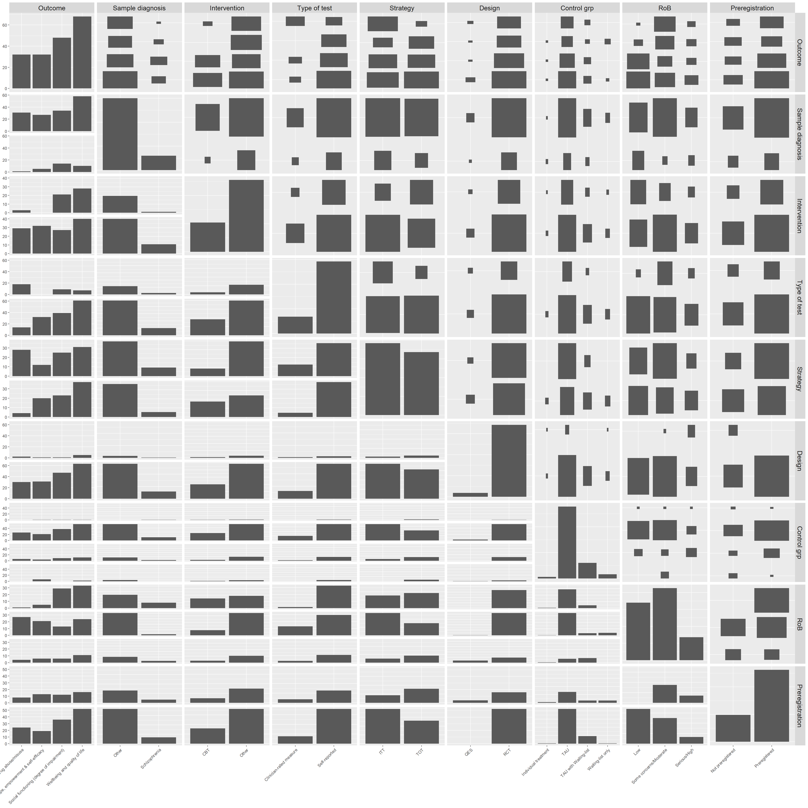{#fig-multivariate-plot-reint-method-theoretical fig-pos='H' width=2304}
:::
:::


#### Mental health

::: {.cell}

```{.r .cell-code}
multivariate_dat_mental_method_theo <- 
  mental_health_dat |> 
  select(
    `Outcome` = analysis_plan,
    `Sample diagnosis` = schizophrenia,
    `Intervention` = CBT_int,
    `Type of test` = test_type,
    `Strategy` = analysis_strategy,
    `Design` = QES_design,
    `Control grp` = control,
    `RoB` = overall_rob,
    `Preregistration` = prereg_chr,
    `Mean age` = age_mean,
    `% male` = male_pct,
    `Duration` = duration_in_weeks,
    `Intensity` = sessions_per_week,
    `Follow-up` = time_after_end_intervention_weeks
  )

multivariate_pairs_mental_method_theo <- ggpairs(multivariate_dat_mental_method_theo) + theme(
    text = element_text(size = 18),
    axis.text.x = element_text(size = 9, angle = 45, vjust = 1, hjust=1),  
    axis.text.y = element_text(size = 9) 
  )

multivariate_pairs_mental_method_theo
```

::: {.cell-output-display}
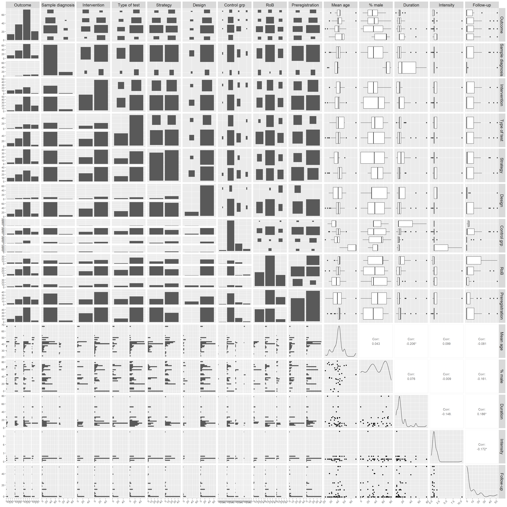{#fig-multivariate-plot-mental-method-theoretical fig-pos='H' width=2304}
:::
:::


:::

:::

:::

:::

### Covariance matrices
::: {.columns}

::: {.column width="160%"}

::: {.panel-tabset}
### Reintegrational outcomes

::: {.panel-tabset}
#### Across all outcomes

::: {#tbl-cor-matix-reint .cell .tbl-cap-location-top tbl-cap='Correlation matrix across all reintegration outcomes.'}

```{.r .cell-code}
cor_mat_dat_cat <- 
  reintegration_dat |> 
  filter(str_detect(analysis_plan, "Alco|Hope|Social|Well") & test_type != "Raw events") |> 
  select(
    plan = analysis_plan,
    samp = schizophrenia,
    treat = CBT_int,
    test = test_type,
    str = analysis_strategy,
    des = QES_design,
    ctr = control,
    rob = overall_rob,
    pre = prereg_chr
  )

cat_dummy_dat <- 
  fastDummies::dummy_cols(cor_mat_dat_cat) %>% 
  select(where(is.numeric))


cor_mat_dat_con <- 
  reintegration_dat |> 
  filter(str_detect(analysis_plan, "Alco|Hope|Social|Well") & test_type != "Raw events") |> 
  select(
    age = age_mean,
    male = male_pct,
    dur = duration_in_weeks,
    int = sessions_per_week,
    FU = time_after_end_intervention_weeks,
    sess = total_number_of_sessions
  )

cor_mat_dat <- 
  bind_cols(cat_dummy_dat, cor_mat_dat_con) |> 
  select(
    alcho = `plan_Alcohol and drug abuse/misuse`,
    hope = `plan_Hope, empowerment & self-efficacy`,
    sfunc = `plan_Social functioning (degree of impairment)`,
    wellb = `plan_Wellbeing and quality of life`,
    s_schizo = samp_Schizophrenia,
    s_oth = samp_Other,
    cbt_trt = treat_CBT, 
    oth_trt = treat_Other,
    test_clin = `test_Clinician-rated measure`,
    test_self = `test_Self-reported`,
    itt = str_ITT,
    tot = str_TOT,
    qes = des_QES,
    rct = des_RCT,
    tau = ctr_TAU,
    tau_wait = `ctr_TAU with Waiting-list`,
    wait = `ctr_Waiting-list only`,
    ind_trt = `ctr_Individual treatment` ,
    rob_low = rob_Low,
    rob_mod = `rob_Some concerns/Moderate`,
    rob_high = `rob_Serious/High`,
    prereg = pre_Preregistered, 
    conventional = `pre_Not preregistered`,
    everything()
  ) |> 
  na.omit()

cor_mat <- 
  cor(
  model.matrix(
    reformulate(names(cor_mat_dat[,1:ncol(cor_mat_dat)])), 
    data = cor_mat_dat
    )
  ) |>  
  as.data.frame() |> 
  select(-c(`(Intercept)`)) |>  
  na.omit() |> 
  mutate(
    
    across(.cols = everything(), ~ round(.x, 2))
  )

cor_mat_formatted <- 
  cor_mat |> 
  mutate(
    across(.cols = everything(), ~ cell_spec(.x, bold = ifelse(abs(.x) > 0.5, T, F)))
  )

kbl(
  cor_mat_formatted, 
  escape = F,
  col.names = c("Category", colnames(cor_mat))
  ) |> 
  kable_styling(
    bootstrap_options = c("striped", "hover"),
    font_size = 10
  ) |> 
  scroll_box(width = "100%", height = "100%", fixed_thead = TRUE)
```

::: {.cell-output-display}
`````{=html}
<div style="border: 1px solid #ddd; padding: 0px; overflow-y: scroll; height:100%; overflow-x: scroll; width:100%; "><table class="table table-striped table-hover" style="font-size: 10px; margin-left: auto; margin-right: auto;">
 <thead>
  <tr>
   <th style="text-align:left;position: sticky; top:0; background-color: #FFFFFF;"> Category </th>
   <th style="text-align:left;position: sticky; top:0; background-color: #FFFFFF;"> alcho </th>
   <th style="text-align:left;position: sticky; top:0; background-color: #FFFFFF;"> hope </th>
   <th style="text-align:left;position: sticky; top:0; background-color: #FFFFFF;"> sfunc </th>
   <th style="text-align:left;position: sticky; top:0; background-color: #FFFFFF;"> wellb </th>
   <th style="text-align:left;position: sticky; top:0; background-color: #FFFFFF;"> s_schizo </th>
   <th style="text-align:left;position: sticky; top:0; background-color: #FFFFFF;"> s_oth </th>
   <th style="text-align:left;position: sticky; top:0; background-color: #FFFFFF;"> cbt_trt </th>
   <th style="text-align:left;position: sticky; top:0; background-color: #FFFFFF;"> oth_trt </th>
   <th style="text-align:left;position: sticky; top:0; background-color: #FFFFFF;"> test_clin </th>
   <th style="text-align:left;position: sticky; top:0; background-color: #FFFFFF;"> test_self </th>
   <th style="text-align:left;position: sticky; top:0; background-color: #FFFFFF;"> itt </th>
   <th style="text-align:left;position: sticky; top:0; background-color: #FFFFFF;"> tot </th>
   <th style="text-align:left;position: sticky; top:0; background-color: #FFFFFF;"> qes </th>
   <th style="text-align:left;position: sticky; top:0; background-color: #FFFFFF;"> rct </th>
   <th style="text-align:left;position: sticky; top:0; background-color: #FFFFFF;"> tau </th>
   <th style="text-align:left;position: sticky; top:0; background-color: #FFFFFF;"> tau_wait </th>
   <th style="text-align:left;position: sticky; top:0; background-color: #FFFFFF;"> wait </th>
   <th style="text-align:left;position: sticky; top:0; background-color: #FFFFFF;"> ind_trt </th>
   <th style="text-align:left;position: sticky; top:0; background-color: #FFFFFF;"> rob_low </th>
   <th style="text-align:left;position: sticky; top:0; background-color: #FFFFFF;"> rob_mod </th>
   <th style="text-align:left;position: sticky; top:0; background-color: #FFFFFF;"> rob_high </th>
   <th style="text-align:left;position: sticky; top:0; background-color: #FFFFFF;"> prereg </th>
   <th style="text-align:left;position: sticky; top:0; background-color: #FFFFFF;"> conventional </th>
   <th style="text-align:left;position: sticky; top:0; background-color: #FFFFFF;"> age </th>
   <th style="text-align:left;position: sticky; top:0; background-color: #FFFFFF;"> male </th>
   <th style="text-align:left;position: sticky; top:0; background-color: #FFFFFF;"> dur </th>
   <th style="text-align:left;position: sticky; top:0; background-color: #FFFFFF;"> int </th>
   <th style="text-align:left;position: sticky; top:0; background-color: #FFFFFF;"> FU </th>
   <th style="text-align:left;position: sticky; top:0; background-color: #FFFFFF;"> sess </th>
  </tr>
 </thead>
<tbody>
  <tr>
   <td style="text-align:left;"> alcho </td>
   <td style="text-align:left;"> <span style=" font-weight: bold;    ">1</span> </td>
   <td style="text-align:left;"> <span style="     ">-0.22</span> </td>
   <td style="text-align:left;"> <span style="     ">-0.27</span> </td>
   <td style="text-align:left;"> <span style="     ">-0.37</span> </td>
   <td style="text-align:left;"> <span style="     ">-0.16</span> </td>
   <td style="text-align:left;"> <span style="     ">0.16</span> </td>
   <td style="text-align:left;"> <span style="     ">-0.21</span> </td>
   <td style="text-align:left;"> <span style="     ">0.21</span> </td>
   <td style="text-align:left;"> <span style="     ">0.48</span> </td>
   <td style="text-align:left;"> <span style="     ">-0.48</span> </td>
   <td style="text-align:left;"> <span style="     ">0.32</span> </td>
   <td style="text-align:left;"> <span style="     ">-0.32</span> </td>
   <td style="text-align:left;"> <span style="     ">0.03</span> </td>
   <td style="text-align:left;"> <span style="     ">-0.03</span> </td>
   <td style="text-align:left;"> <span style="     ">0.03</span> </td>
   <td style="text-align:left;"> <span style="     ">0.05</span> </td>
   <td style="text-align:left;"> <span style="     ">-0.1</span> </td>
   <td style="text-align:left;"> <span style="     ">-0.06</span> </td>
   <td style="text-align:left;"> <span style="     ">-0.36</span> </td>
   <td style="text-align:left;"> <span style="     ">0.37</span> </td>
   <td style="text-align:left;"> <span style="     ">-0.03</span> </td>
   <td style="text-align:left;"> <span style="     ">0.01</span> </td>
   <td style="text-align:left;"> <span style="     ">-0.01</span> </td>
   <td style="text-align:left;"> <span style="     ">-0.26</span> </td>
   <td style="text-align:left;"> <span style="     ">-0.34</span> </td>
   <td style="text-align:left;"> <span style="     ">0</span> </td>
   <td style="text-align:left;"> <span style="     ">0.06</span> </td>
   <td style="text-align:left;"> <span style="     ">-0.05</span> </td>
   <td style="text-align:left;"> <span style="     ">0.13</span> </td>
  </tr>
  <tr>
   <td style="text-align:left;"> hope </td>
   <td style="text-align:left;"> <span style="     ">-0.22</span> </td>
   <td style="text-align:left;"> <span style=" font-weight: bold;    ">1</span> </td>
   <td style="text-align:left;"> <span style="     ">-0.28</span> </td>
   <td style="text-align:left;"> <span style="     ">-0.37</span> </td>
   <td style="text-align:left;"> <span style="     ">0</span> </td>
   <td style="text-align:left;"> <span style="     ">0</span> </td>
   <td style="text-align:left;"> <span style="     ">-0.31</span> </td>
   <td style="text-align:left;"> <span style="     ">0.31</span> </td>
   <td style="text-align:left;"> <span style="     ">-0.23</span> </td>
   <td style="text-align:left;"> <span style="     ">0.23</span> </td>
   <td style="text-align:left;"> <span style="     ">-0.15</span> </td>
   <td style="text-align:left;"> <span style="     ">0.15</span> </td>
   <td style="text-align:left;"> <span style="     ">-0.04</span> </td>
   <td style="text-align:left;"> <span style="     ">0.04</span> </td>
   <td style="text-align:left;"> <span style="     ">-0.14</span> </td>
   <td style="text-align:left;"> <span style="     ">-0.04</span> </td>
   <td style="text-align:left;"> <span style="     ">0.32</span> </td>
   <td style="text-align:left;"> <span style="     ">0.05</span> </td>
   <td style="text-align:left;"> <span style="     ">-0.21</span> </td>
   <td style="text-align:left;"> <span style="     ">0.17</span> </td>
   <td style="text-align:left;"> <span style="     ">0.04</span> </td>
   <td style="text-align:left;"> <span style="     ">-0.15</span> </td>
   <td style="text-align:left;"> <span style="     ">0.15</span> </td>
   <td style="text-align:left;"> <span style="     ">0.12</span> </td>
   <td style="text-align:left;"> <span style="     ">0.15</span> </td>
   <td style="text-align:left;"> <span style="     ">-0.13</span> </td>
   <td style="text-align:left;"> <span style="     ">-0.04</span> </td>
   <td style="text-align:left;"> <span style="     ">-0.12</span> </td>
   <td style="text-align:left;"> <span style="     ">-0.11</span> </td>
  </tr>
  <tr>
   <td style="text-align:left;"> sfunc </td>
   <td style="text-align:left;"> <span style="     ">-0.27</span> </td>
   <td style="text-align:left;"> <span style="     ">-0.28</span> </td>
   <td style="text-align:left;"> <span style=" font-weight: bold;    ">1</span> </td>
   <td style="text-align:left;"> <span style="     ">-0.46</span> </td>
   <td style="text-align:left;"> <span style="     ">0.19</span> </td>
   <td style="text-align:left;"> <span style="     ">-0.19</span> </td>
   <td style="text-align:left;"> <span style="     ">0.23</span> </td>
   <td style="text-align:left;"> <span style="     ">-0.23</span> </td>
   <td style="text-align:left;"> <span style="     ">-0.04</span> </td>
   <td style="text-align:left;"> <span style="     ">0.04</span> </td>
   <td style="text-align:left;"> <span style="     ">-0.01</span> </td>
   <td style="text-align:left;"> <span style="     ">0.01</span> </td>
   <td style="text-align:left;"> <span style="     ">-0.08</span> </td>
   <td style="text-align:left;"> <span style="     ">0.08</span> </td>
   <td style="text-align:left;"> <span style="     ">0.05</span> </td>
   <td style="text-align:left;"> <span style="     ">0</span> </td>
   <td style="text-align:left;"> <span style="     ">-0.13</span> </td>
   <td style="text-align:left;"> <span style="     ">0.02</span> </td>
   <td style="text-align:left;"> <span style="     ">0.29</span> </td>
   <td style="text-align:left;"> <span style="     ">-0.26</span> </td>
   <td style="text-align:left;"> <span style="     ">-0.03</span> </td>
   <td style="text-align:left;"> <span style="     ">0.05</span> </td>
   <td style="text-align:left;"> <span style="     ">-0.05</span> </td>
   <td style="text-align:left;"> <span style="     ">-0.17</span> </td>
   <td style="text-align:left;"> <span style="     ">0.03</span> </td>
   <td style="text-align:left;"> <span style="     ">0.29</span> </td>
   <td style="text-align:left;"> <span style="     ">-0.06</span> </td>
   <td style="text-align:left;"> <span style="     ">0.18</span> </td>
   <td style="text-align:left;"> <span style="     ">0.16</span> </td>
  </tr>
  <tr>
   <td style="text-align:left;"> wellb </td>
   <td style="text-align:left;"> <span style="     ">-0.37</span> </td>
   <td style="text-align:left;"> <span style="     ">-0.37</span> </td>
   <td style="text-align:left;"> <span style="     ">-0.46</span> </td>
   <td style="text-align:left;"> <span style=" font-weight: bold;    ">1</span> </td>
   <td style="text-align:left;"> <span style="     ">-0.04</span> </td>
   <td style="text-align:left;"> <span style="     ">0.04</span> </td>
   <td style="text-align:left;"> <span style="     ">0.21</span> </td>
   <td style="text-align:left;"> <span style="     ">-0.21</span> </td>
   <td style="text-align:left;"> <span style="     ">-0.16</span> </td>
   <td style="text-align:left;"> <span style="     ">0.16</span> </td>
   <td style="text-align:left;"> <span style="     ">-0.12</span> </td>
   <td style="text-align:left;"> <span style="     ">0.12</span> </td>
   <td style="text-align:left;"> <span style="     ">0.08</span> </td>
   <td style="text-align:left;"> <span style="     ">-0.08</span> </td>
   <td style="text-align:left;"> <span style="     ">0.04</span> </td>
   <td style="text-align:left;"> <span style="     ">-0.01</span> </td>
   <td style="text-align:left;"> <span style="     ">-0.06</span> </td>
   <td style="text-align:left;"> <span style="     ">-0.01</span> </td>
   <td style="text-align:left;"> <span style="     ">0.19</span> </td>
   <td style="text-align:left;"> <span style="     ">-0.2</span> </td>
   <td style="text-align:left;"> <span style="     ">0.02</span> </td>
   <td style="text-align:left;"> <span style="     ">0.07</span> </td>
   <td style="text-align:left;"> <span style="     ">-0.07</span> </td>
   <td style="text-align:left;"> <span style="     ">0.26</span> </td>
   <td style="text-align:left;"> <span style="     ">0.12</span> </td>
   <td style="text-align:left;"> <span style="     ">-0.16</span> </td>
   <td style="text-align:left;"> <span style="     ">0.04</span> </td>
   <td style="text-align:left;"> <span style="     ">-0.02</span> </td>
   <td style="text-align:left;"> <span style="     ">-0.16</span> </td>
  </tr>
  <tr>
   <td style="text-align:left;"> s_schizo </td>
   <td style="text-align:left;"> <span style="     ">-0.16</span> </td>
   <td style="text-align:left;"> <span style="     ">0</span> </td>
   <td style="text-align:left;"> <span style="     ">0.19</span> </td>
   <td style="text-align:left;"> <span style="     ">-0.04</span> </td>
   <td style="text-align:left;"> <span style=" font-weight: bold;    ">1</span> </td>
   <td style="text-align:left;"> <span style=" font-weight: bold;    ">-1</span> </td>
   <td style="text-align:left;"> <span style="     ">-0.18</span> </td>
   <td style="text-align:left;"> <span style="     ">0.18</span> </td>
   <td style="text-align:left;"> <span style="     ">-0.08</span> </td>
   <td style="text-align:left;"> <span style="     ">0.08</span> </td>
   <td style="text-align:left;"> <span style="     ">0.15</span> </td>
   <td style="text-align:left;"> <span style="     ">-0.15</span> </td>
   <td style="text-align:left;"> <span style="     ">-0.03</span> </td>
   <td style="text-align:left;"> <span style="     ">0.03</span> </td>
   <td style="text-align:left;"> <span style="     ">0.04</span> </td>
   <td style="text-align:left;"> <span style="     ">-0.05</span> </td>
   <td style="text-align:left;"> <span style="     ">-0.09</span> </td>
   <td style="text-align:left;"> <span style="     ">0.19</span> </td>
   <td style="text-align:left;"> <span style="     ">0.33</span> </td>
   <td style="text-align:left;"> <span style="     ">-0.38</span> </td>
   <td style="text-align:left;"> <span style="     ">0.08</span> </td>
   <td style="text-align:left;"> <span style="     ">0.01</span> </td>
   <td style="text-align:left;"> <span style="     ">-0.01</span> </td>
   <td style="text-align:left;"> <span style="     ">-0.22</span> </td>
   <td style="text-align:left;"> <span style=" font-weight: bold;    ">0.54</span> </td>
   <td style="text-align:left;"> <span style="     ">0.44</span> </td>
   <td style="text-align:left;"> <span style="     ">-0.01</span> </td>
   <td style="text-align:left;"> <span style="     ">0.03</span> </td>
   <td style="text-align:left;"> <span style="     ">0.34</span> </td>
  </tr>
  <tr>
   <td style="text-align:left;"> s_oth </td>
   <td style="text-align:left;"> <span style="     ">0.16</span> </td>
   <td style="text-align:left;"> <span style="     ">0</span> </td>
   <td style="text-align:left;"> <span style="     ">-0.19</span> </td>
   <td style="text-align:left;"> <span style="     ">0.04</span> </td>
   <td style="text-align:left;"> <span style=" font-weight: bold;    ">-1</span> </td>
   <td style="text-align:left;"> <span style=" font-weight: bold;    ">1</span> </td>
   <td style="text-align:left;"> <span style="     ">0.18</span> </td>
   <td style="text-align:left;"> <span style="     ">-0.18</span> </td>
   <td style="text-align:left;"> <span style="     ">0.08</span> </td>
   <td style="text-align:left;"> <span style="     ">-0.08</span> </td>
   <td style="text-align:left;"> <span style="     ">-0.15</span> </td>
   <td style="text-align:left;"> <span style="     ">0.15</span> </td>
   <td style="text-align:left;"> <span style="     ">0.03</span> </td>
   <td style="text-align:left;"> <span style="     ">-0.03</span> </td>
   <td style="text-align:left;"> <span style="     ">-0.04</span> </td>
   <td style="text-align:left;"> <span style="     ">0.05</span> </td>
   <td style="text-align:left;"> <span style="     ">0.09</span> </td>
   <td style="text-align:left;"> <span style="     ">-0.19</span> </td>
   <td style="text-align:left;"> <span style="     ">-0.33</span> </td>
   <td style="text-align:left;"> <span style="     ">0.38</span> </td>
   <td style="text-align:left;"> <span style="     ">-0.08</span> </td>
   <td style="text-align:left;"> <span style="     ">-0.01</span> </td>
   <td style="text-align:left;"> <span style="     ">0.01</span> </td>
   <td style="text-align:left;"> <span style="     ">0.22</span> </td>
   <td style="text-align:left;"> <span style=" font-weight: bold;    ">-0.54</span> </td>
   <td style="text-align:left;"> <span style="     ">-0.44</span> </td>
   <td style="text-align:left;"> <span style="     ">0.01</span> </td>
   <td style="text-align:left;"> <span style="     ">-0.03</span> </td>
   <td style="text-align:left;"> <span style="     ">-0.34</span> </td>
  </tr>
  <tr>
   <td style="text-align:left;"> cbt_trt </td>
   <td style="text-align:left;"> <span style="     ">-0.21</span> </td>
   <td style="text-align:left;"> <span style="     ">-0.31</span> </td>
   <td style="text-align:left;"> <span style="     ">0.23</span> </td>
   <td style="text-align:left;"> <span style="     ">0.21</span> </td>
   <td style="text-align:left;"> <span style="     ">-0.18</span> </td>
   <td style="text-align:left;"> <span style="     ">0.18</span> </td>
   <td style="text-align:left;"> <span style=" font-weight: bold;    ">1</span> </td>
   <td style="text-align:left;"> <span style=" font-weight: bold;    ">-1</span> </td>
   <td style="text-align:left;"> <span style="     ">-0.12</span> </td>
   <td style="text-align:left;"> <span style="     ">0.12</span> </td>
   <td style="text-align:left;"> <span style="     ">-0.27</span> </td>
   <td style="text-align:left;"> <span style="     ">0.27</span> </td>
   <td style="text-align:left;"> <span style="     ">-0.04</span> </td>
   <td style="text-align:left;"> <span style="     ">0.04</span> </td>
   <td style="text-align:left;"> <span style="     ">0.07</span> </td>
   <td style="text-align:left;"> <span style="     ">-0.07</span> </td>
   <td style="text-align:left;"> <span style="     ">-0.02</span> </td>
   <td style="text-align:left;"> <span style="     ">0.01</span> </td>
   <td style="text-align:left;"> <span style="     ">0.28</span> </td>
   <td style="text-align:left;"> <span style="     ">-0.22</span> </td>
   <td style="text-align:left;"> <span style="     ">-0.07</span> </td>
   <td style="text-align:left;"> <span style="     ">0.05</span> </td>
   <td style="text-align:left;"> <span style="     ">-0.05</span> </td>
   <td style="text-align:left;"> <span style="     ">0.03</span> </td>
   <td style="text-align:left;"> <span style="     ">-0.26</span> </td>
   <td style="text-align:left;"> <span style="     ">-0.27</span> </td>
   <td style="text-align:left;"> <span style="     ">-0.04</span> </td>
   <td style="text-align:left;"> <span style="     ">0.18</span> </td>
   <td style="text-align:left;"> <span style="     ">-0.28</span> </td>
  </tr>
  <tr>
   <td style="text-align:left;"> oth_trt </td>
   <td style="text-align:left;"> <span style="     ">0.21</span> </td>
   <td style="text-align:left;"> <span style="     ">0.31</span> </td>
   <td style="text-align:left;"> <span style="     ">-0.23</span> </td>
   <td style="text-align:left;"> <span style="     ">-0.21</span> </td>
   <td style="text-align:left;"> <span style="     ">0.18</span> </td>
   <td style="text-align:left;"> <span style="     ">-0.18</span> </td>
   <td style="text-align:left;"> <span style=" font-weight: bold;    ">-1</span> </td>
   <td style="text-align:left;"> <span style=" font-weight: bold;    ">1</span> </td>
   <td style="text-align:left;"> <span style="     ">0.12</span> </td>
   <td style="text-align:left;"> <span style="     ">-0.12</span> </td>
   <td style="text-align:left;"> <span style="     ">0.27</span> </td>
   <td style="text-align:left;"> <span style="     ">-0.27</span> </td>
   <td style="text-align:left;"> <span style="     ">0.04</span> </td>
   <td style="text-align:left;"> <span style="     ">-0.04</span> </td>
   <td style="text-align:left;"> <span style="     ">-0.07</span> </td>
   <td style="text-align:left;"> <span style="     ">0.07</span> </td>
   <td style="text-align:left;"> <span style="     ">0.02</span> </td>
   <td style="text-align:left;"> <span style="     ">-0.01</span> </td>
   <td style="text-align:left;"> <span style="     ">-0.28</span> </td>
   <td style="text-align:left;"> <span style="     ">0.22</span> </td>
   <td style="text-align:left;"> <span style="     ">0.07</span> </td>
   <td style="text-align:left;"> <span style="     ">-0.05</span> </td>
   <td style="text-align:left;"> <span style="     ">0.05</span> </td>
   <td style="text-align:left;"> <span style="     ">-0.03</span> </td>
   <td style="text-align:left;"> <span style="     ">0.26</span> </td>
   <td style="text-align:left;"> <span style="     ">0.27</span> </td>
   <td style="text-align:left;"> <span style="     ">0.04</span> </td>
   <td style="text-align:left;"> <span style="     ">-0.18</span> </td>
   <td style="text-align:left;"> <span style="     ">0.28</span> </td>
  </tr>
  <tr>
   <td style="text-align:left;"> test_clin </td>
   <td style="text-align:left;"> <span style="     ">0.48</span> </td>
   <td style="text-align:left;"> <span style="     ">-0.23</span> </td>
   <td style="text-align:left;"> <span style="     ">-0.04</span> </td>
   <td style="text-align:left;"> <span style="     ">-0.16</span> </td>
   <td style="text-align:left;"> <span style="     ">-0.08</span> </td>
   <td style="text-align:left;"> <span style="     ">0.08</span> </td>
   <td style="text-align:left;"> <span style="     ">-0.12</span> </td>
   <td style="text-align:left;"> <span style="     ">0.12</span> </td>
   <td style="text-align:left;"> <span style=" font-weight: bold;    ">1</span> </td>
   <td style="text-align:left;"> <span style=" font-weight: bold;    ">-1</span> </td>
   <td style="text-align:left;"> <span style="     ">0.24</span> </td>
   <td style="text-align:left;"> <span style="     ">-0.24</span> </td>
   <td style="text-align:left;"> <span style="     ">0.09</span> </td>
   <td style="text-align:left;"> <span style="     ">-0.09</span> </td>
   <td style="text-align:left;"> <span style="     ">0.18</span> </td>
   <td style="text-align:left;"> <span style="     ">-0.12</span> </td>
   <td style="text-align:left;"> <span style="     ">-0.1</span> </td>
   <td style="text-align:left;"> <span style="     ">-0.06</span> </td>
   <td style="text-align:left;"> <span style="     ">-0.27</span> </td>
   <td style="text-align:left;"> <span style="     ">0.26</span> </td>
   <td style="text-align:left;"> <span style="     ">0</span> </td>
   <td style="text-align:left;"> <span style="     ">-0.02</span> </td>
   <td style="text-align:left;"> <span style="     ">0.02</span> </td>
   <td style="text-align:left;"> <span style="     ">-0.18</span> </td>
   <td style="text-align:left;"> <span style="     ">-0.37</span> </td>
   <td style="text-align:left;"> <span style="     ">-0.02</span> </td>
   <td style="text-align:left;"> <span style="     ">0.06</span> </td>
   <td style="text-align:left;"> <span style="     ">-0.01</span> </td>
   <td style="text-align:left;"> <span style="     ">0.03</span> </td>
  </tr>
  <tr>
   <td style="text-align:left;"> test_self </td>
   <td style="text-align:left;"> <span style="     ">-0.48</span> </td>
   <td style="text-align:left;"> <span style="     ">0.23</span> </td>
   <td style="text-align:left;"> <span style="     ">0.04</span> </td>
   <td style="text-align:left;"> <span style="     ">0.16</span> </td>
   <td style="text-align:left;"> <span style="     ">0.08</span> </td>
   <td style="text-align:left;"> <span style="     ">-0.08</span> </td>
   <td style="text-align:left;"> <span style="     ">0.12</span> </td>
   <td style="text-align:left;"> <span style="     ">-0.12</span> </td>
   <td style="text-align:left;"> <span style=" font-weight: bold;    ">-1</span> </td>
   <td style="text-align:left;"> <span style=" font-weight: bold;    ">1</span> </td>
   <td style="text-align:left;"> <span style="     ">-0.24</span> </td>
   <td style="text-align:left;"> <span style="     ">0.24</span> </td>
   <td style="text-align:left;"> <span style="     ">-0.09</span> </td>
   <td style="text-align:left;"> <span style="     ">0.09</span> </td>
   <td style="text-align:left;"> <span style="     ">-0.18</span> </td>
   <td style="text-align:left;"> <span style="     ">0.12</span> </td>
   <td style="text-align:left;"> <span style="     ">0.1</span> </td>
   <td style="text-align:left;"> <span style="     ">0.06</span> </td>
   <td style="text-align:left;"> <span style="     ">0.27</span> </td>
   <td style="text-align:left;"> <span style="     ">-0.26</span> </td>
   <td style="text-align:left;"> <span style="     ">0</span> </td>
   <td style="text-align:left;"> <span style="     ">0.02</span> </td>
   <td style="text-align:left;"> <span style="     ">-0.02</span> </td>
   <td style="text-align:left;"> <span style="     ">0.18</span> </td>
   <td style="text-align:left;"> <span style="     ">0.37</span> </td>
   <td style="text-align:left;"> <span style="     ">0.02</span> </td>
   <td style="text-align:left;"> <span style="     ">-0.06</span> </td>
   <td style="text-align:left;"> <span style="     ">0.01</span> </td>
   <td style="text-align:left;"> <span style="     ">-0.03</span> </td>
  </tr>
  <tr>
   <td style="text-align:left;"> itt </td>
   <td style="text-align:left;"> <span style="     ">0.32</span> </td>
   <td style="text-align:left;"> <span style="     ">-0.15</span> </td>
   <td style="text-align:left;"> <span style="     ">-0.01</span> </td>
   <td style="text-align:left;"> <span style="     ">-0.12</span> </td>
   <td style="text-align:left;"> <span style="     ">0.15</span> </td>
   <td style="text-align:left;"> <span style="     ">-0.15</span> </td>
   <td style="text-align:left;"> <span style="     ">-0.27</span> </td>
   <td style="text-align:left;"> <span style="     ">0.27</span> </td>
   <td style="text-align:left;"> <span style="     ">0.24</span> </td>
   <td style="text-align:left;"> <span style="     ">-0.24</span> </td>
   <td style="text-align:left;"> <span style=" font-weight: bold;    ">1</span> </td>
   <td style="text-align:left;"> <span style=" font-weight: bold;    ">-1</span> </td>
   <td style="text-align:left;"> <span style="     ">-0.09</span> </td>
   <td style="text-align:left;"> <span style="     ">0.09</span> </td>
   <td style="text-align:left;"> <span style="     ">0.29</span> </td>
   <td style="text-align:left;"> <span style="     ">-0.14</span> </td>
   <td style="text-align:left;"> <span style="     ">-0.23</span> </td>
   <td style="text-align:left;"> <span style="     ">-0.14</span> </td>
   <td style="text-align:left;"> <span style="     ">-0.17</span> </td>
   <td style="text-align:left;"> <span style="     ">0.26</span> </td>
   <td style="text-align:left;"> <span style="     ">-0.14</span> </td>
   <td style="text-align:left;"> <span style="     ">0.2</span> </td>
   <td style="text-align:left;"> <span style="     ">-0.2</span> </td>
   <td style="text-align:left;"> <span style="     ">-0.14</span> </td>
   <td style="text-align:left;"> <span style="     ">-0.05</span> </td>
   <td style="text-align:left;"> <span style="     ">0.28</span> </td>
   <td style="text-align:left;"> <span style="     ">-0.02</span> </td>
   <td style="text-align:left;"> <span style="     ">-0.06</span> </td>
   <td style="text-align:left;"> <span style="     ">0.21</span> </td>
  </tr>
  <tr>
   <td style="text-align:left;"> tot </td>
   <td style="text-align:left;"> <span style="     ">-0.32</span> </td>
   <td style="text-align:left;"> <span style="     ">0.15</span> </td>
   <td style="text-align:left;"> <span style="     ">0.01</span> </td>
   <td style="text-align:left;"> <span style="     ">0.12</span> </td>
   <td style="text-align:left;"> <span style="     ">-0.15</span> </td>
   <td style="text-align:left;"> <span style="     ">0.15</span> </td>
   <td style="text-align:left;"> <span style="     ">0.27</span> </td>
   <td style="text-align:left;"> <span style="     ">-0.27</span> </td>
   <td style="text-align:left;"> <span style="     ">-0.24</span> </td>
   <td style="text-align:left;"> <span style="     ">0.24</span> </td>
   <td style="text-align:left;"> <span style=" font-weight: bold;    ">-1</span> </td>
   <td style="text-align:left;"> <span style=" font-weight: bold;    ">1</span> </td>
   <td style="text-align:left;"> <span style="     ">0.09</span> </td>
   <td style="text-align:left;"> <span style="     ">-0.09</span> </td>
   <td style="text-align:left;"> <span style="     ">-0.29</span> </td>
   <td style="text-align:left;"> <span style="     ">0.14</span> </td>
   <td style="text-align:left;"> <span style="     ">0.23</span> </td>
   <td style="text-align:left;"> <span style="     ">0.14</span> </td>
   <td style="text-align:left;"> <span style="     ">0.17</span> </td>
   <td style="text-align:left;"> <span style="     ">-0.26</span> </td>
   <td style="text-align:left;"> <span style="     ">0.14</span> </td>
   <td style="text-align:left;"> <span style="     ">-0.2</span> </td>
   <td style="text-align:left;"> <span style="     ">0.2</span> </td>
   <td style="text-align:left;"> <span style="     ">0.14</span> </td>
   <td style="text-align:left;"> <span style="     ">0.05</span> </td>
   <td style="text-align:left;"> <span style="     ">-0.28</span> </td>
   <td style="text-align:left;"> <span style="     ">0.02</span> </td>
   <td style="text-align:left;"> <span style="     ">0.06</span> </td>
   <td style="text-align:left;"> <span style="     ">-0.21</span> </td>
  </tr>
  <tr>
   <td style="text-align:left;"> qes </td>
   <td style="text-align:left;"> <span style="     ">0.03</span> </td>
   <td style="text-align:left;"> <span style="     ">-0.04</span> </td>
   <td style="text-align:left;"> <span style="     ">-0.08</span> </td>
   <td style="text-align:left;"> <span style="     ">0.08</span> </td>
   <td style="text-align:left;"> <span style="     ">-0.03</span> </td>
   <td style="text-align:left;"> <span style="     ">0.03</span> </td>
   <td style="text-align:left;"> <span style="     ">-0.04</span> </td>
   <td style="text-align:left;"> <span style="     ">0.04</span> </td>
   <td style="text-align:left;"> <span style="     ">0.09</span> </td>
   <td style="text-align:left;"> <span style="     ">-0.09</span> </td>
   <td style="text-align:left;"> <span style="     ">-0.09</span> </td>
   <td style="text-align:left;"> <span style="     ">0.09</span> </td>
   <td style="text-align:left;"> <span style=" font-weight: bold;    ">1</span> </td>
   <td style="text-align:left;"> <span style=" font-weight: bold;    ">-1</span> </td>
   <td style="text-align:left;"> <span style="     ">0</span> </td>
   <td style="text-align:left;"> <span style="     ">-0.1</span> </td>
   <td style="text-align:left;"> <span style="     ">0.07</span> </td>
   <td style="text-align:left;"> <span style="     ">0.17</span> </td>
   <td style="text-align:left;"> <span style="     ">-0.18</span> </td>
   <td style="text-align:left;"> <span style="     ">-0.17</span> </td>
   <td style="text-align:left;"> <span style="     ">0.47</span> </td>
   <td style="text-align:left;"> <span style="     ">-0.39</span> </td>
   <td style="text-align:left;"> <span style="     ">0.39</span> </td>
   <td style="text-align:left;"> <span style="     ">-0.12</span> </td>
   <td style="text-align:left;"> <span style="     ">-0.07</span> </td>
   <td style="text-align:left;"> <span style="     ">0.22</span> </td>
   <td style="text-align:left;"> <span style="     ">0.41</span> </td>
   <td style="text-align:left;"> <span style="     ">-0.06</span> </td>
   <td style="text-align:left;"> <span style="     ">0.47</span> </td>
  </tr>
  <tr>
   <td style="text-align:left;"> rct </td>
   <td style="text-align:left;"> <span style="     ">-0.03</span> </td>
   <td style="text-align:left;"> <span style="     ">0.04</span> </td>
   <td style="text-align:left;"> <span style="     ">0.08</span> </td>
   <td style="text-align:left;"> <span style="     ">-0.08</span> </td>
   <td style="text-align:left;"> <span style="     ">0.03</span> </td>
   <td style="text-align:left;"> <span style="     ">-0.03</span> </td>
   <td style="text-align:left;"> <span style="     ">0.04</span> </td>
   <td style="text-align:left;"> <span style="     ">-0.04</span> </td>
   <td style="text-align:left;"> <span style="     ">-0.09</span> </td>
   <td style="text-align:left;"> <span style="     ">0.09</span> </td>
   <td style="text-align:left;"> <span style="     ">0.09</span> </td>
   <td style="text-align:left;"> <span style="     ">-0.09</span> </td>
   <td style="text-align:left;"> <span style=" font-weight: bold;    ">-1</span> </td>
   <td style="text-align:left;"> <span style=" font-weight: bold;    ">1</span> </td>
   <td style="text-align:left;"> <span style="     ">0</span> </td>
   <td style="text-align:left;"> <span style="     ">0.1</span> </td>
   <td style="text-align:left;"> <span style="     ">-0.07</span> </td>
   <td style="text-align:left;"> <span style="     ">-0.17</span> </td>
   <td style="text-align:left;"> <span style="     ">0.18</span> </td>
   <td style="text-align:left;"> <span style="     ">0.17</span> </td>
   <td style="text-align:left;"> <span style="     ">-0.47</span> </td>
   <td style="text-align:left;"> <span style="     ">0.39</span> </td>
   <td style="text-align:left;"> <span style="     ">-0.39</span> </td>
   <td style="text-align:left;"> <span style="     ">0.12</span> </td>
   <td style="text-align:left;"> <span style="     ">0.07</span> </td>
   <td style="text-align:left;"> <span style="     ">-0.22</span> </td>
   <td style="text-align:left;"> <span style="     ">-0.41</span> </td>
   <td style="text-align:left;"> <span style="     ">0.06</span> </td>
   <td style="text-align:left;"> <span style="     ">-0.47</span> </td>
  </tr>
  <tr>
   <td style="text-align:left;"> tau </td>
   <td style="text-align:left;"> <span style="     ">0.03</span> </td>
   <td style="text-align:left;"> <span style="     ">-0.14</span> </td>
   <td style="text-align:left;"> <span style="     ">0.05</span> </td>
   <td style="text-align:left;"> <span style="     ">0.04</span> </td>
   <td style="text-align:left;"> <span style="     ">0.04</span> </td>
   <td style="text-align:left;"> <span style="     ">-0.04</span> </td>
   <td style="text-align:left;"> <span style="     ">0.07</span> </td>
   <td style="text-align:left;"> <span style="     ">-0.07</span> </td>
   <td style="text-align:left;"> <span style="     ">0.18</span> </td>
   <td style="text-align:left;"> <span style="     ">-0.18</span> </td>
   <td style="text-align:left;"> <span style="     ">0.29</span> </td>
   <td style="text-align:left;"> <span style="     ">-0.29</span> </td>
   <td style="text-align:left;"> <span style="     ">0</span> </td>
   <td style="text-align:left;"> <span style="     ">0</span> </td>
   <td style="text-align:left;"> <span style=" font-weight: bold;    ">1</span> </td>
   <td style="text-align:left;"> <span style=" font-weight: bold;    ">-0.81</span> </td>
   <td style="text-align:left;"> <span style="     ">-0.42</span> </td>
   <td style="text-align:left;"> <span style="     ">-0.25</span> </td>
   <td style="text-align:left;"> <span style="     ">0.12</span> </td>
   <td style="text-align:left;"> <span style="     ">0.14</span> </td>
   <td style="text-align:left;"> <span style="     ">-0.35</span> </td>
   <td style="text-align:left;"> <span style="     ">0.09</span> </td>
   <td style="text-align:left;"> <span style="     ">-0.09</span> </td>
   <td style="text-align:left;"> <span style="     ">0.03</span> </td>
   <td style="text-align:left;"> <span style="     ">-0.13</span> </td>
   <td style="text-align:left;"> <span style="     ">0.08</span> </td>
   <td style="text-align:left;"> <span style="     ">-0.29</span> </td>
   <td style="text-align:left;"> <span style="     ">0.29</span> </td>
   <td style="text-align:left;"> <span style="     ">-0.08</span> </td>
  </tr>
  <tr>
   <td style="text-align:left;"> tau_wait </td>
   <td style="text-align:left;"> <span style="     ">0.05</span> </td>
   <td style="text-align:left;"> <span style="     ">-0.04</span> </td>
   <td style="text-align:left;"> <span style="     ">0</span> </td>
   <td style="text-align:left;"> <span style="     ">-0.01</span> </td>
   <td style="text-align:left;"> <span style="     ">-0.05</span> </td>
   <td style="text-align:left;"> <span style="     ">0.05</span> </td>
   <td style="text-align:left;"> <span style="     ">-0.07</span> </td>
   <td style="text-align:left;"> <span style="     ">0.07</span> </td>
   <td style="text-align:left;"> <span style="     ">-0.12</span> </td>
   <td style="text-align:left;"> <span style="     ">0.12</span> </td>
   <td style="text-align:left;"> <span style="     ">-0.14</span> </td>
   <td style="text-align:left;"> <span style="     ">0.14</span> </td>
   <td style="text-align:left;"> <span style="     ">-0.1</span> </td>
   <td style="text-align:left;"> <span style="     ">0.1</span> </td>
   <td style="text-align:left;"> <span style=" font-weight: bold;    ">-0.81</span> </td>
   <td style="text-align:left;"> <span style=" font-weight: bold;    ">1</span> </td>
   <td style="text-align:left;"> <span style="     ">-0.09</span> </td>
   <td style="text-align:left;"> <span style="     ">-0.06</span> </td>
   <td style="text-align:left;"> <span style="     ">-0.03</span> </td>
   <td style="text-align:left;"> <span style="     ">-0.28</span> </td>
   <td style="text-align:left;"> <span style="     ">0.43</span> </td>
   <td style="text-align:left;"> <span style="     ">0.11</span> </td>
   <td style="text-align:left;"> <span style="     ">-0.11</span> </td>
   <td style="text-align:left;"> <span style="     ">-0.12</span> </td>
   <td style="text-align:left;"> <span style="     ">0.1</span> </td>
   <td style="text-align:left;"> <span style="     ">-0.09</span> </td>
   <td style="text-align:left;"> <span style="     ">0.16</span> </td>
   <td style="text-align:left;"> <span style="     ">-0.25</span> </td>
   <td style="text-align:left;"> <span style="     ">0.04</span> </td>
  </tr>
  <tr>
   <td style="text-align:left;"> wait </td>
   <td style="text-align:left;"> <span style="     ">-0.1</span> </td>
   <td style="text-align:left;"> <span style="     ">0.32</span> </td>
   <td style="text-align:left;"> <span style="     ">-0.13</span> </td>
   <td style="text-align:left;"> <span style="     ">-0.06</span> </td>
   <td style="text-align:left;"> <span style="     ">-0.09</span> </td>
   <td style="text-align:left;"> <span style="     ">0.09</span> </td>
   <td style="text-align:left;"> <span style="     ">-0.02</span> </td>
   <td style="text-align:left;"> <span style="     ">0.02</span> </td>
   <td style="text-align:left;"> <span style="     ">-0.1</span> </td>
   <td style="text-align:left;"> <span style="     ">0.1</span> </td>
   <td style="text-align:left;"> <span style="     ">-0.23</span> </td>
   <td style="text-align:left;"> <span style="     ">0.23</span> </td>
   <td style="text-align:left;"> <span style="     ">0.07</span> </td>
   <td style="text-align:left;"> <span style="     ">-0.07</span> </td>
   <td style="text-align:left;"> <span style="     ">-0.42</span> </td>
   <td style="text-align:left;"> <span style="     ">-0.09</span> </td>
   <td style="text-align:left;"> <span style=" font-weight: bold;    ">1</span> </td>
   <td style="text-align:left;"> <span style="     ">-0.03</span> </td>
   <td style="text-align:left;"> <span style="     ">-0.17</span> </td>
   <td style="text-align:left;"> <span style="     ">0.23</span> </td>
   <td style="text-align:left;"> <span style="     ">-0.09</span> </td>
   <td style="text-align:left;"> <span style="     ">-0.3</span> </td>
   <td style="text-align:left;"> <span style="     ">0.3</span> </td>
   <td style="text-align:left;"> <span style="     ">0.24</span> </td>
   <td style="text-align:left;"> <span style="     ">-0.01</span> </td>
   <td style="text-align:left;"> <span style="     ">-0.08</span> </td>
   <td style="text-align:left;"> <span style="     ">0.3</span> </td>
   <td style="text-align:left;"> <span style="     ">-0.09</span> </td>
   <td style="text-align:left;"> <span style="     ">0.03</span> </td>
  </tr>
  <tr>
   <td style="text-align:left;"> ind_trt </td>
   <td style="text-align:left;"> <span style="     ">-0.06</span> </td>
   <td style="text-align:left;"> <span style="     ">0.05</span> </td>
   <td style="text-align:left;"> <span style="     ">0.02</span> </td>
   <td style="text-align:left;"> <span style="     ">-0.01</span> </td>
   <td style="text-align:left;"> <span style="     ">0.19</span> </td>
   <td style="text-align:left;"> <span style="     ">-0.19</span> </td>
   <td style="text-align:left;"> <span style="     ">0.01</span> </td>
   <td style="text-align:left;"> <span style="     ">-0.01</span> </td>
   <td style="text-align:left;"> <span style="     ">-0.06</span> </td>
   <td style="text-align:left;"> <span style="     ">0.06</span> </td>
   <td style="text-align:left;"> <span style="     ">-0.14</span> </td>
   <td style="text-align:left;"> <span style="     ">0.14</span> </td>
   <td style="text-align:left;"> <span style="     ">0.17</span> </td>
   <td style="text-align:left;"> <span style="     ">-0.17</span> </td>
   <td style="text-align:left;"> <span style="     ">-0.25</span> </td>
   <td style="text-align:left;"> <span style="     ">-0.06</span> </td>
   <td style="text-align:left;"> <span style="     ">-0.03</span> </td>
   <td style="text-align:left;"> <span style=" font-weight: bold;    ">1</span> </td>
   <td style="text-align:left;"> <span style="     ">-0.01</span> </td>
   <td style="text-align:left;"> <span style="     ">-0.04</span> </td>
   <td style="text-align:left;"> <span style="     ">0.06</span> </td>
   <td style="text-align:left;"> <span style="     ">-0.12</span> </td>
   <td style="text-align:left;"> <span style="     ">0.12</span> </td>
   <td style="text-align:left;"> <span style="     ">-0.14</span> </td>
   <td style="text-align:left;"> <span style="     ">0.13</span> </td>
   <td style="text-align:left;"> <span style="     ">0.14</span> </td>
   <td style="text-align:left;"> <span style="     ">0</span> </td>
   <td style="text-align:left;"> <span style="     ">-0.08</span> </td>
   <td style="text-align:left;"> <span style="     ">0.11</span> </td>
  </tr>
  <tr>
   <td style="text-align:left;"> rob_low </td>
   <td style="text-align:left;"> <span style="     ">-0.36</span> </td>
   <td style="text-align:left;"> <span style="     ">-0.21</span> </td>
   <td style="text-align:left;"> <span style="     ">0.29</span> </td>
   <td style="text-align:left;"> <span style="     ">0.19</span> </td>
   <td style="text-align:left;"> <span style="     ">0.33</span> </td>
   <td style="text-align:left;"> <span style="     ">-0.33</span> </td>
   <td style="text-align:left;"> <span style="     ">0.28</span> </td>
   <td style="text-align:left;"> <span style="     ">-0.28</span> </td>
   <td style="text-align:left;"> <span style="     ">-0.27</span> </td>
   <td style="text-align:left;"> <span style="     ">0.27</span> </td>
   <td style="text-align:left;"> <span style="     ">-0.17</span> </td>
   <td style="text-align:left;"> <span style="     ">0.17</span> </td>
   <td style="text-align:left;"> <span style="     ">-0.18</span> </td>
   <td style="text-align:left;"> <span style="     ">0.18</span> </td>
   <td style="text-align:left;"> <span style="     ">0.12</span> </td>
   <td style="text-align:left;"> <span style="     ">-0.03</span> </td>
   <td style="text-align:left;"> <span style="     ">-0.17</span> </td>
   <td style="text-align:left;"> <span style="     ">-0.01</span> </td>
   <td style="text-align:left;"> <span style=" font-weight: bold;    ">1</span> </td>
   <td style="text-align:left;"> <span style=" font-weight: bold;    ">-0.73</span> </td>
   <td style="text-align:left;"> <span style="     ">-0.33</span> </td>
   <td style="text-align:left;"> <span style="     ">0.46</span> </td>
   <td style="text-align:left;"> <span style="     ">-0.46</span> </td>
   <td style="text-align:left;"> <span style="     ">-0.01</span> </td>
   <td style="text-align:left;"> <span style="     ">0.09</span> </td>
   <td style="text-align:left;"> <span style="     ">0.36</span> </td>
   <td style="text-align:left;"> <span style="     ">-0.31</span> </td>
   <td style="text-align:left;"> <span style="     ">0.29</span> </td>
   <td style="text-align:left;"> <span style="     ">0.01</span> </td>
  </tr>
  <tr>
   <td style="text-align:left;"> rob_mod </td>
   <td style="text-align:left;"> <span style="     ">0.37</span> </td>
   <td style="text-align:left;"> <span style="     ">0.17</span> </td>
   <td style="text-align:left;"> <span style="     ">-0.26</span> </td>
   <td style="text-align:left;"> <span style="     ">-0.2</span> </td>
   <td style="text-align:left;"> <span style="     ">-0.38</span> </td>
   <td style="text-align:left;"> <span style="     ">0.38</span> </td>
   <td style="text-align:left;"> <span style="     ">-0.22</span> </td>
   <td style="text-align:left;"> <span style="     ">0.22</span> </td>
   <td style="text-align:left;"> <span style="     ">0.26</span> </td>
   <td style="text-align:left;"> <span style="     ">-0.26</span> </td>
   <td style="text-align:left;"> <span style="     ">0.26</span> </td>
   <td style="text-align:left;"> <span style="     ">-0.26</span> </td>
   <td style="text-align:left;"> <span style="     ">-0.17</span> </td>
   <td style="text-align:left;"> <span style="     ">0.17</span> </td>
   <td style="text-align:left;"> <span style="     ">0.14</span> </td>
   <td style="text-align:left;"> <span style="     ">-0.28</span> </td>
   <td style="text-align:left;"> <span style="     ">0.23</span> </td>
   <td style="text-align:left;"> <span style="     ">-0.04</span> </td>
   <td style="text-align:left;"> <span style=" font-weight: bold;    ">-0.73</span> </td>
   <td style="text-align:left;"> <span style=" font-weight: bold;    ">1</span> </td>
   <td style="text-align:left;"> <span style="     ">-0.41</span> </td>
   <td style="text-align:left;"> <span style="     ">-0.27</span> </td>
   <td style="text-align:left;"> <span style="     ">0.27</span> </td>
   <td style="text-align:left;"> <span style="     ">0.19</span> </td>
   <td style="text-align:left;"> <span style="     ">-0.06</span> </td>
   <td style="text-align:left;"> <span style="     ">-0.37</span> </td>
   <td style="text-align:left;"> <span style="     ">0.15</span> </td>
   <td style="text-align:left;"> <span style="     ">-0.17</span> </td>
   <td style="text-align:left;"> <span style="     ">-0.18</span> </td>
  </tr>
  <tr>
   <td style="text-align:left;"> rob_high </td>
   <td style="text-align:left;"> <span style="     ">-0.03</span> </td>
   <td style="text-align:left;"> <span style="     ">0.04</span> </td>
   <td style="text-align:left;"> <span style="     ">-0.03</span> </td>
   <td style="text-align:left;"> <span style="     ">0.02</span> </td>
   <td style="text-align:left;"> <span style="     ">0.08</span> </td>
   <td style="text-align:left;"> <span style="     ">-0.08</span> </td>
   <td style="text-align:left;"> <span style="     ">-0.07</span> </td>
   <td style="text-align:left;"> <span style="     ">0.07</span> </td>
   <td style="text-align:left;"> <span style="     ">0</span> </td>
   <td style="text-align:left;"> <span style="     ">0</span> </td>
   <td style="text-align:left;"> <span style="     ">-0.14</span> </td>
   <td style="text-align:left;"> <span style="     ">0.14</span> </td>
   <td style="text-align:left;"> <span style="     ">0.47</span> </td>
   <td style="text-align:left;"> <span style="     ">-0.47</span> </td>
   <td style="text-align:left;"> <span style="     ">-0.35</span> </td>
   <td style="text-align:left;"> <span style="     ">0.43</span> </td>
   <td style="text-align:left;"> <span style="     ">-0.09</span> </td>
   <td style="text-align:left;"> <span style="     ">0.06</span> </td>
   <td style="text-align:left;"> <span style="     ">-0.33</span> </td>
   <td style="text-align:left;"> <span style="     ">-0.41</span> </td>
   <td style="text-align:left;"> <span style=" font-weight: bold;    ">1</span> </td>
   <td style="text-align:left;"> <span style="     ">-0.25</span> </td>
   <td style="text-align:left;"> <span style="     ">0.25</span> </td>
   <td style="text-align:left;"> <span style="     ">-0.25</span> </td>
   <td style="text-align:left;"> <span style="     ">-0.03</span> </td>
   <td style="text-align:left;"> <span style="     ">0.02</span> </td>
   <td style="text-align:left;"> <span style="     ">0.2</span> </td>
   <td style="text-align:left;"> <span style="     ">-0.15</span> </td>
   <td style="text-align:left;"> <span style="     ">0.23</span> </td>
  </tr>
  <tr>
   <td style="text-align:left;"> prereg </td>
   <td style="text-align:left;"> <span style="     ">0.01</span> </td>
   <td style="text-align:left;"> <span style="     ">-0.15</span> </td>
   <td style="text-align:left;"> <span style="     ">0.05</span> </td>
   <td style="text-align:left;"> <span style="     ">0.07</span> </td>
   <td style="text-align:left;"> <span style="     ">0.01</span> </td>
   <td style="text-align:left;"> <span style="     ">-0.01</span> </td>
   <td style="text-align:left;"> <span style="     ">0.05</span> </td>
   <td style="text-align:left;"> <span style="     ">-0.05</span> </td>
   <td style="text-align:left;"> <span style="     ">-0.02</span> </td>
   <td style="text-align:left;"> <span style="     ">0.02</span> </td>
   <td style="text-align:left;"> <span style="     ">0.2</span> </td>
   <td style="text-align:left;"> <span style="     ">-0.2</span> </td>
   <td style="text-align:left;"> <span style="     ">-0.39</span> </td>
   <td style="text-align:left;"> <span style="     ">0.39</span> </td>
   <td style="text-align:left;"> <span style="     ">0.09</span> </td>
   <td style="text-align:left;"> <span style="     ">0.11</span> </td>
   <td style="text-align:left;"> <span style="     ">-0.3</span> </td>
   <td style="text-align:left;"> <span style="     ">-0.12</span> </td>
   <td style="text-align:left;"> <span style="     ">0.46</span> </td>
   <td style="text-align:left;"> <span style="     ">-0.27</span> </td>
   <td style="text-align:left;"> <span style="     ">-0.25</span> </td>
   <td style="text-align:left;"> <span style=" font-weight: bold;    ">1</span> </td>
   <td style="text-align:left;"> <span style=" font-weight: bold;    ">-1</span> </td>
   <td style="text-align:left;"> <span style="     ">0.34</span> </td>
   <td style="text-align:left;"> <span style="     ">-0.25</span> </td>
   <td style="text-align:left;"> <span style="     ">0.05</span> </td>
   <td style="text-align:left;"> <span style="     ">-0.26</span> </td>
   <td style="text-align:left;"> <span style="     ">0.14</span> </td>
   <td style="text-align:left;"> <span style="     ">-0.17</span> </td>
  </tr>
  <tr>
   <td style="text-align:left;"> conventional </td>
   <td style="text-align:left;"> <span style="     ">-0.01</span> </td>
   <td style="text-align:left;"> <span style="     ">0.15</span> </td>
   <td style="text-align:left;"> <span style="     ">-0.05</span> </td>
   <td style="text-align:left;"> <span style="     ">-0.07</span> </td>
   <td style="text-align:left;"> <span style="     ">-0.01</span> </td>
   <td style="text-align:left;"> <span style="     ">0.01</span> </td>
   <td style="text-align:left;"> <span style="     ">-0.05</span> </td>
   <td style="text-align:left;"> <span style="     ">0.05</span> </td>
   <td style="text-align:left;"> <span style="     ">0.02</span> </td>
   <td style="text-align:left;"> <span style="     ">-0.02</span> </td>
   <td style="text-align:left;"> <span style="     ">-0.2</span> </td>
   <td style="text-align:left;"> <span style="     ">0.2</span> </td>
   <td style="text-align:left;"> <span style="     ">0.39</span> </td>
   <td style="text-align:left;"> <span style="     ">-0.39</span> </td>
   <td style="text-align:left;"> <span style="     ">-0.09</span> </td>
   <td style="text-align:left;"> <span style="     ">-0.11</span> </td>
   <td style="text-align:left;"> <span style="     ">0.3</span> </td>
   <td style="text-align:left;"> <span style="     ">0.12</span> </td>
   <td style="text-align:left;"> <span style="     ">-0.46</span> </td>
   <td style="text-align:left;"> <span style="     ">0.27</span> </td>
   <td style="text-align:left;"> <span style="     ">0.25</span> </td>
   <td style="text-align:left;"> <span style=" font-weight: bold;    ">-1</span> </td>
   <td style="text-align:left;"> <span style=" font-weight: bold;    ">1</span> </td>
   <td style="text-align:left;"> <span style="     ">-0.34</span> </td>
   <td style="text-align:left;"> <span style="     ">0.25</span> </td>
   <td style="text-align:left;"> <span style="     ">-0.05</span> </td>
   <td style="text-align:left;"> <span style="     ">0.26</span> </td>
   <td style="text-align:left;"> <span style="     ">-0.14</span> </td>
   <td style="text-align:left;"> <span style="     ">0.17</span> </td>
  </tr>
  <tr>
   <td style="text-align:left;"> age </td>
   <td style="text-align:left;"> <span style="     ">-0.26</span> </td>
   <td style="text-align:left;"> <span style="     ">0.12</span> </td>
   <td style="text-align:left;"> <span style="     ">-0.17</span> </td>
   <td style="text-align:left;"> <span style="     ">0.26</span> </td>
   <td style="text-align:left;"> <span style="     ">-0.22</span> </td>
   <td style="text-align:left;"> <span style="     ">0.22</span> </td>
   <td style="text-align:left;"> <span style="     ">0.03</span> </td>
   <td style="text-align:left;"> <span style="     ">-0.03</span> </td>
   <td style="text-align:left;"> <span style="     ">-0.18</span> </td>
   <td style="text-align:left;"> <span style="     ">0.18</span> </td>
   <td style="text-align:left;"> <span style="     ">-0.14</span> </td>
   <td style="text-align:left;"> <span style="     ">0.14</span> </td>
   <td style="text-align:left;"> <span style="     ">-0.12</span> </td>
   <td style="text-align:left;"> <span style="     ">0.12</span> </td>
   <td style="text-align:left;"> <span style="     ">0.03</span> </td>
   <td style="text-align:left;"> <span style="     ">-0.12</span> </td>
   <td style="text-align:left;"> <span style="     ">0.24</span> </td>
   <td style="text-align:left;"> <span style="     ">-0.14</span> </td>
   <td style="text-align:left;"> <span style="     ">-0.01</span> </td>
   <td style="text-align:left;"> <span style="     ">0.19</span> </td>
   <td style="text-align:left;"> <span style="     ">-0.25</span> </td>
   <td style="text-align:left;"> <span style="     ">0.34</span> </td>
   <td style="text-align:left;"> <span style="     ">-0.34</span> </td>
   <td style="text-align:left;"> <span style=" font-weight: bold;    ">1</span> </td>
   <td style="text-align:left;"> <span style="     ">-0.02</span> </td>
   <td style="text-align:left;"> <span style="     ">-0.29</span> </td>
   <td style="text-align:left;"> <span style="     ">0</span> </td>
   <td style="text-align:left;"> <span style="     ">-0.01</span> </td>
   <td style="text-align:left;"> <span style="     ">-0.24</span> </td>
  </tr>
  <tr>
   <td style="text-align:left;"> male </td>
   <td style="text-align:left;"> <span style="     ">-0.34</span> </td>
   <td style="text-align:left;"> <span style="     ">0.15</span> </td>
   <td style="text-align:left;"> <span style="     ">0.03</span> </td>
   <td style="text-align:left;"> <span style="     ">0.12</span> </td>
   <td style="text-align:left;"> <span style=" font-weight: bold;    ">0.54</span> </td>
   <td style="text-align:left;"> <span style=" font-weight: bold;    ">-0.54</span> </td>
   <td style="text-align:left;"> <span style="     ">-0.26</span> </td>
   <td style="text-align:left;"> <span style="     ">0.26</span> </td>
   <td style="text-align:left;"> <span style="     ">-0.37</span> </td>
   <td style="text-align:left;"> <span style="     ">0.37</span> </td>
   <td style="text-align:left;"> <span style="     ">-0.05</span> </td>
   <td style="text-align:left;"> <span style="     ">0.05</span> </td>
   <td style="text-align:left;"> <span style="     ">-0.07</span> </td>
   <td style="text-align:left;"> <span style="     ">0.07</span> </td>
   <td style="text-align:left;"> <span style="     ">-0.13</span> </td>
   <td style="text-align:left;"> <span style="     ">0.1</span> </td>
   <td style="text-align:left;"> <span style="     ">-0.01</span> </td>
   <td style="text-align:left;"> <span style="     ">0.13</span> </td>
   <td style="text-align:left;"> <span style="     ">0.09</span> </td>
   <td style="text-align:left;"> <span style="     ">-0.06</span> </td>
   <td style="text-align:left;"> <span style="     ">-0.03</span> </td>
   <td style="text-align:left;"> <span style="     ">-0.25</span> </td>
   <td style="text-align:left;"> <span style="     ">0.25</span> </td>
   <td style="text-align:left;"> <span style="     ">-0.02</span> </td>
   <td style="text-align:left;"> <span style=" font-weight: bold;    ">1</span> </td>
   <td style="text-align:left;"> <span style="     ">0.21</span> </td>
   <td style="text-align:left;"> <span style="     ">-0.01</span> </td>
   <td style="text-align:left;"> <span style="     ">-0.11</span> </td>
   <td style="text-align:left;"> <span style="     ">0.08</span> </td>
  </tr>
  <tr>
   <td style="text-align:left;"> dur </td>
   <td style="text-align:left;"> <span style="     ">0</span> </td>
   <td style="text-align:left;"> <span style="     ">-0.13</span> </td>
   <td style="text-align:left;"> <span style="     ">0.29</span> </td>
   <td style="text-align:left;"> <span style="     ">-0.16</span> </td>
   <td style="text-align:left;"> <span style="     ">0.44</span> </td>
   <td style="text-align:left;"> <span style="     ">-0.44</span> </td>
   <td style="text-align:left;"> <span style="     ">-0.27</span> </td>
   <td style="text-align:left;"> <span style="     ">0.27</span> </td>
   <td style="text-align:left;"> <span style="     ">-0.02</span> </td>
   <td style="text-align:left;"> <span style="     ">0.02</span> </td>
   <td style="text-align:left;"> <span style="     ">0.28</span> </td>
   <td style="text-align:left;"> <span style="     ">-0.28</span> </td>
   <td style="text-align:left;"> <span style="     ">0.22</span> </td>
   <td style="text-align:left;"> <span style="     ">-0.22</span> </td>
   <td style="text-align:left;"> <span style="     ">0.08</span> </td>
   <td style="text-align:left;"> <span style="     ">-0.09</span> </td>
   <td style="text-align:left;"> <span style="     ">-0.08</span> </td>
   <td style="text-align:left;"> <span style="     ">0.14</span> </td>
   <td style="text-align:left;"> <span style="     ">0.36</span> </td>
   <td style="text-align:left;"> <span style="     ">-0.37</span> </td>
   <td style="text-align:left;"> <span style="     ">0.02</span> </td>
   <td style="text-align:left;"> <span style="     ">0.05</span> </td>
   <td style="text-align:left;"> <span style="     ">-0.05</span> </td>
   <td style="text-align:left;"> <span style="     ">-0.29</span> </td>
   <td style="text-align:left;"> <span style="     ">0.21</span> </td>
   <td style="text-align:left;"> <span style=" font-weight: bold;    ">1</span> </td>
   <td style="text-align:left;"> <span style="     ">-0.05</span> </td>
   <td style="text-align:left;"> <span style="     ">0.21</span> </td>
   <td style="text-align:left;"> <span style=" font-weight: bold;    ">0.77</span> </td>
  </tr>
  <tr>
   <td style="text-align:left;"> int </td>
   <td style="text-align:left;"> <span style="     ">0.06</span> </td>
   <td style="text-align:left;"> <span style="     ">-0.04</span> </td>
   <td style="text-align:left;"> <span style="     ">-0.06</span> </td>
   <td style="text-align:left;"> <span style="     ">0.04</span> </td>
   <td style="text-align:left;"> <span style="     ">-0.01</span> </td>
   <td style="text-align:left;"> <span style="     ">0.01</span> </td>
   <td style="text-align:left;"> <span style="     ">-0.04</span> </td>
   <td style="text-align:left;"> <span style="     ">0.04</span> </td>
   <td style="text-align:left;"> <span style="     ">0.06</span> </td>
   <td style="text-align:left;"> <span style="     ">-0.06</span> </td>
   <td style="text-align:left;"> <span style="     ">-0.02</span> </td>
   <td style="text-align:left;"> <span style="     ">0.02</span> </td>
   <td style="text-align:left;"> <span style="     ">0.41</span> </td>
   <td style="text-align:left;"> <span style="     ">-0.41</span> </td>
   <td style="text-align:left;"> <span style="     ">-0.29</span> </td>
   <td style="text-align:left;"> <span style="     ">0.16</span> </td>
   <td style="text-align:left;"> <span style="     ">0.3</span> </td>
   <td style="text-align:left;"> <span style="     ">0</span> </td>
   <td style="text-align:left;"> <span style="     ">-0.31</span> </td>
   <td style="text-align:left;"> <span style="     ">0.15</span> </td>
   <td style="text-align:left;"> <span style="     ">0.2</span> </td>
   <td style="text-align:left;"> <span style="     ">-0.26</span> </td>
   <td style="text-align:left;"> <span style="     ">0.26</span> </td>
   <td style="text-align:left;"> <span style="     ">0</span> </td>
   <td style="text-align:left;"> <span style="     ">-0.01</span> </td>
   <td style="text-align:left;"> <span style="     ">-0.05</span> </td>
   <td style="text-align:left;"> <span style=" font-weight: bold;    ">1</span> </td>
   <td style="text-align:left;"> <span style="     ">-0.19</span> </td>
   <td style="text-align:left;"> <span style="     ">0.41</span> </td>
  </tr>
  <tr>
   <td style="text-align:left;"> FU </td>
   <td style="text-align:left;"> <span style="     ">-0.05</span> </td>
   <td style="text-align:left;"> <span style="     ">-0.12</span> </td>
   <td style="text-align:left;"> <span style="     ">0.18</span> </td>
   <td style="text-align:left;"> <span style="     ">-0.02</span> </td>
   <td style="text-align:left;"> <span style="     ">0.03</span> </td>
   <td style="text-align:left;"> <span style="     ">-0.03</span> </td>
   <td style="text-align:left;"> <span style="     ">0.18</span> </td>
   <td style="text-align:left;"> <span style="     ">-0.18</span> </td>
   <td style="text-align:left;"> <span style="     ">-0.01</span> </td>
   <td style="text-align:left;"> <span style="     ">0.01</span> </td>
   <td style="text-align:left;"> <span style="     ">-0.06</span> </td>
   <td style="text-align:left;"> <span style="     ">0.06</span> </td>
   <td style="text-align:left;"> <span style="     ">-0.06</span> </td>
   <td style="text-align:left;"> <span style="     ">0.06</span> </td>
   <td style="text-align:left;"> <span style="     ">0.29</span> </td>
   <td style="text-align:left;"> <span style="     ">-0.25</span> </td>
   <td style="text-align:left;"> <span style="     ">-0.09</span> </td>
   <td style="text-align:left;"> <span style="     ">-0.08</span> </td>
   <td style="text-align:left;"> <span style="     ">0.29</span> </td>
   <td style="text-align:left;"> <span style="     ">-0.17</span> </td>
   <td style="text-align:left;"> <span style="     ">-0.15</span> </td>
   <td style="text-align:left;"> <span style="     ">0.14</span> </td>
   <td style="text-align:left;"> <span style="     ">-0.14</span> </td>
   <td style="text-align:left;"> <span style="     ">-0.01</span> </td>
   <td style="text-align:left;"> <span style="     ">-0.11</span> </td>
   <td style="text-align:left;"> <span style="     ">0.21</span> </td>
   <td style="text-align:left;"> <span style="     ">-0.19</span> </td>
   <td style="text-align:left;"> <span style=" font-weight: bold;    ">1</span> </td>
   <td style="text-align:left;"> <span style="     ">0.01</span> </td>
  </tr>
  <tr>
   <td style="text-align:left;"> sess </td>
   <td style="text-align:left;"> <span style="     ">0.13</span> </td>
   <td style="text-align:left;"> <span style="     ">-0.11</span> </td>
   <td style="text-align:left;"> <span style="     ">0.16</span> </td>
   <td style="text-align:left;"> <span style="     ">-0.16</span> </td>
   <td style="text-align:left;"> <span style="     ">0.34</span> </td>
   <td style="text-align:left;"> <span style="     ">-0.34</span> </td>
   <td style="text-align:left;"> <span style="     ">-0.28</span> </td>
   <td style="text-align:left;"> <span style="     ">0.28</span> </td>
   <td style="text-align:left;"> <span style="     ">0.03</span> </td>
   <td style="text-align:left;"> <span style="     ">-0.03</span> </td>
   <td style="text-align:left;"> <span style="     ">0.21</span> </td>
   <td style="text-align:left;"> <span style="     ">-0.21</span> </td>
   <td style="text-align:left;"> <span style="     ">0.47</span> </td>
   <td style="text-align:left;"> <span style="     ">-0.47</span> </td>
   <td style="text-align:left;"> <span style="     ">-0.08</span> </td>
   <td style="text-align:left;"> <span style="     ">0.04</span> </td>
   <td style="text-align:left;"> <span style="     ">0.03</span> </td>
   <td style="text-align:left;"> <span style="     ">0.11</span> </td>
   <td style="text-align:left;"> <span style="     ">0.01</span> </td>
   <td style="text-align:left;"> <span style="     ">-0.18</span> </td>
   <td style="text-align:left;"> <span style="     ">0.23</span> </td>
   <td style="text-align:left;"> <span style="     ">-0.17</span> </td>
   <td style="text-align:left;"> <span style="     ">0.17</span> </td>
   <td style="text-align:left;"> <span style="     ">-0.24</span> </td>
   <td style="text-align:left;"> <span style="     ">0.08</span> </td>
   <td style="text-align:left;"> <span style=" font-weight: bold;    ">0.77</span> </td>
   <td style="text-align:left;"> <span style="     ">0.41</span> </td>
   <td style="text-align:left;"> <span style="     ">0.01</span> </td>
   <td style="text-align:left;"> <span style=" font-weight: bold;    ">1</span> </td>
  </tr>
</tbody>
</table></div>

`````
:::
:::


#### Alcohol and drug abuse/misuse
Excluded factors due to no variation: type of sample (schizophania vs. rest), low risk of bias.

::: {#tbl-cor-matix-alcohol .cell .tbl-cap-location-top tbl-cap='Correlation matrix based on alcohol outcome only.'}

```{.r .cell-code}
cor_mat_dat_cat_alcohol <- 
  reintegration_dat |> 
  filter(str_detect(analysis_plan, "Alco") & test_type != "Raw events") |> 
  select(
    treat = CBT_int,
    test = test_type,
    str = analysis_strategy,
    des = QES_design,
    ctr = control,
    rob = overall_rob,
    pre = prereg_chr
  )

cat_dummy_dat_alcohol <- 
  fastDummies::dummy_cols(cor_mat_dat_cat_alcohol) %>% 
  select(where(is.numeric))


cor_mat_dat_con_alcohol <- 
  reintegration_dat |> 
  filter(str_detect(analysis_plan, "Alco") & test_type != "Raw events") |> 
  select(
    age = age_mean,
    male = male_pct,
    dur = duration_in_weeks,
    int = sessions_per_week,
    FU = time_after_end_intervention_weeks,
    sess = total_number_of_sessions
  )

cor_mat_dat_alcohol <- 
  bind_cols(cat_dummy_dat_alcohol, cor_mat_dat_con_alcohol) |> 
  select(
    cbt_trt = treat_CBT, 
    oth_trt = treat_Other,
    test_clin = `test_Clinician-rated measure`,
    test_self = `test_Self-reported`,
    itt = str_ITT,
    tot = str_TOT,
    qes = des_QES,
    rct = des_RCT,
    tau = ctr_TAU,
    tau_wait = `ctr_TAU with Waiting-list`,
    rob_mod = `rob_Some concerns/Moderate`,
    rob_high = `rob_Serious/High`,
    prereg = pre_Preregistered, 
    conventional = `pre_Not preregistered`,
    age:sess
  ) |> 
  na.omit()

cor_mat_alcohol <- 
  cor(
    model.matrix(
      reformulate(names(cor_mat_dat_alcohol[,1:ncol(cor_mat_dat_alcohol)])), 
      data = cor_mat_dat_alcohol
    )
  ) |> 
  as.data.frame() |> 
  select(-c(`(Intercept)`)) |>   
  na.omit() |> 
  mutate(
    
    across(.cols = everything(), ~ round(.x, 2))
  )

cor_mat_formatted_alcohol <- 
  cor_mat_alcohol |> 
  mutate(
    across(.cols = everything(), ~ cell_spec(.x, bold = ifelse(abs(.x) > 0.5, T, F)))
  )


kbl(
  cor_mat_formatted_alcohol, 
  escape = F,
  col.names = c("Category", colnames(cor_mat_alcohol))
  ) |> 
  kable_styling(
    bootstrap_options = c("striped", "hover"),
    font_size = 10
  ) |> 
  scroll_box(width = "100%", height = "100%", fixed_thead = TRUE)
```

::: {.cell-output-display}
`````{=html}
<div style="border: 1px solid #ddd; padding: 0px; overflow-y: scroll; height:100%; overflow-x: scroll; width:100%; "><table class="table table-striped table-hover" style="font-size: 10px; margin-left: auto; margin-right: auto;">
 <thead>
  <tr>
   <th style="text-align:left;position: sticky; top:0; background-color: #FFFFFF;"> Category </th>
   <th style="text-align:left;position: sticky; top:0; background-color: #FFFFFF;"> cbt_trt </th>
   <th style="text-align:left;position: sticky; top:0; background-color: #FFFFFF;"> oth_trt </th>
   <th style="text-align:left;position: sticky; top:0; background-color: #FFFFFF;"> test_clin </th>
   <th style="text-align:left;position: sticky; top:0; background-color: #FFFFFF;"> test_self </th>
   <th style="text-align:left;position: sticky; top:0; background-color: #FFFFFF;"> itt </th>
   <th style="text-align:left;position: sticky; top:0; background-color: #FFFFFF;"> tot </th>
   <th style="text-align:left;position: sticky; top:0; background-color: #FFFFFF;"> qes </th>
   <th style="text-align:left;position: sticky; top:0; background-color: #FFFFFF;"> rct </th>
   <th style="text-align:left;position: sticky; top:0; background-color: #FFFFFF;"> tau </th>
   <th style="text-align:left;position: sticky; top:0; background-color: #FFFFFF;"> tau_wait </th>
   <th style="text-align:left;position: sticky; top:0; background-color: #FFFFFF;"> rob_mod </th>
   <th style="text-align:left;position: sticky; top:0; background-color: #FFFFFF;"> rob_high </th>
   <th style="text-align:left;position: sticky; top:0; background-color: #FFFFFF;"> prereg </th>
   <th style="text-align:left;position: sticky; top:0; background-color: #FFFFFF;"> conventional </th>
   <th style="text-align:left;position: sticky; top:0; background-color: #FFFFFF;"> age </th>
   <th style="text-align:left;position: sticky; top:0; background-color: #FFFFFF;"> male </th>
   <th style="text-align:left;position: sticky; top:0; background-color: #FFFFFF;"> dur </th>
   <th style="text-align:left;position: sticky; top:0; background-color: #FFFFFF;"> int </th>
   <th style="text-align:left;position: sticky; top:0; background-color: #FFFFFF;"> FU </th>
   <th style="text-align:left;position: sticky; top:0; background-color: #FFFFFF;"> sess </th>
  </tr>
 </thead>
<tbody>
  <tr>
   <td style="text-align:left;"> cbt_trt </td>
   <td style="text-align:left;"> <span style=" font-weight: bold;    ">1</span> </td>
   <td style="text-align:left;"> <span style=" font-weight: bold;    ">-1</span> </td>
   <td style="text-align:left;"> <span style="     ">-0.39</span> </td>
   <td style="text-align:left;"> <span style="     ">0.39</span> </td>
   <td style="text-align:left;"> <span style="     ">-0.2</span> </td>
   <td style="text-align:left;"> <span style="     ">0.2</span> </td>
   <td style="text-align:left;"> <span style="     ">-0.09</span> </td>
   <td style="text-align:left;"> <span style="     ">0.09</span> </td>
   <td style="text-align:left;"> <span style="     ">-0.12</span> </td>
   <td style="text-align:left;"> <span style="     ">0.12</span> </td>
   <td style="text-align:left;"> <span style="     ">-0.2</span> </td>
   <td style="text-align:left;"> <span style="     ">0.2</span> </td>
   <td style="text-align:left;"> <span style=" font-weight: bold;    ">-0.56</span> </td>
   <td style="text-align:left;"> <span style=" font-weight: bold;    ">0.56</span> </td>
   <td style="text-align:left;"> <span style="     ">-0.39</span> </td>
   <td style="text-align:left;"> <span style="     ">0.32</span> </td>
   <td style="text-align:left;"> <span style="     ">-0.24</span> </td>
   <td style="text-align:left;"> <span style="     ">-0.15</span> </td>
   <td style="text-align:left;"> <span style="     ">0.14</span> </td>
   <td style="text-align:left;"> <span style="     ">-0.18</span> </td>
  </tr>
  <tr>
   <td style="text-align:left;"> oth_trt </td>
   <td style="text-align:left;"> <span style=" font-weight: bold;    ">-1</span> </td>
   <td style="text-align:left;"> <span style=" font-weight: bold;    ">1</span> </td>
   <td style="text-align:left;"> <span style="     ">0.39</span> </td>
   <td style="text-align:left;"> <span style="     ">-0.39</span> </td>
   <td style="text-align:left;"> <span style="     ">0.2</span> </td>
   <td style="text-align:left;"> <span style="     ">-0.2</span> </td>
   <td style="text-align:left;"> <span style="     ">0.09</span> </td>
   <td style="text-align:left;"> <span style="     ">-0.09</span> </td>
   <td style="text-align:left;"> <span style="     ">0.12</span> </td>
   <td style="text-align:left;"> <span style="     ">-0.12</span> </td>
   <td style="text-align:left;"> <span style="     ">0.2</span> </td>
   <td style="text-align:left;"> <span style="     ">-0.2</span> </td>
   <td style="text-align:left;"> <span style=" font-weight: bold;    ">0.56</span> </td>
   <td style="text-align:left;"> <span style=" font-weight: bold;    ">-0.56</span> </td>
   <td style="text-align:left;"> <span style="     ">0.39</span> </td>
   <td style="text-align:left;"> <span style="     ">-0.32</span> </td>
   <td style="text-align:left;"> <span style="     ">0.24</span> </td>
   <td style="text-align:left;"> <span style="     ">0.15</span> </td>
   <td style="text-align:left;"> <span style="     ">-0.14</span> </td>
   <td style="text-align:left;"> <span style="     ">0.18</span> </td>
  </tr>
  <tr>
   <td style="text-align:left;"> test_clin </td>
   <td style="text-align:left;"> <span style="     ">-0.39</span> </td>
   <td style="text-align:left;"> <span style="     ">0.39</span> </td>
   <td style="text-align:left;"> <span style=" font-weight: bold;    ">1</span> </td>
   <td style="text-align:left;"> <span style=" font-weight: bold;    ">-1</span> </td>
   <td style="text-align:left;"> <span style="     ">0.45</span> </td>
   <td style="text-align:left;"> <span style="     ">-0.45</span> </td>
   <td style="text-align:left;"> <span style="     ">-0.31</span> </td>
   <td style="text-align:left;"> <span style="     ">0.31</span> </td>
   <td style="text-align:left;"> <span style=" font-weight: bold;    ">0.58</span> </td>
   <td style="text-align:left;"> <span style=" font-weight: bold;    ">-0.58</span> </td>
   <td style="text-align:left;"> <span style="     ">0.45</span> </td>
   <td style="text-align:left;"> <span style="     ">-0.45</span> </td>
   <td style="text-align:left;"> <span style=" font-weight: bold;    ">0.69</span> </td>
   <td style="text-align:left;"> <span style=" font-weight: bold;    ">-0.69</span> </td>
   <td style="text-align:left;"> <span style=" font-weight: bold;    ">0.6</span> </td>
   <td style="text-align:left;"> <span style=" font-weight: bold;    ">-0.79</span> </td>
   <td style="text-align:left;"> <span style="     ">-0.23</span> </td>
   <td style="text-align:left;"> <span style=" font-weight: bold;    ">-0.54</span> </td>
   <td style="text-align:left;"> <span style="     ">0.34</span> </td>
   <td style="text-align:left;"> <span style="     ">-0.36</span> </td>
  </tr>
  <tr>
   <td style="text-align:left;"> test_self </td>
   <td style="text-align:left;"> <span style="     ">0.39</span> </td>
   <td style="text-align:left;"> <span style="     ">-0.39</span> </td>
   <td style="text-align:left;"> <span style=" font-weight: bold;    ">-1</span> </td>
   <td style="text-align:left;"> <span style=" font-weight: bold;    ">1</span> </td>
   <td style="text-align:left;"> <span style="     ">-0.45</span> </td>
   <td style="text-align:left;"> <span style="     ">0.45</span> </td>
   <td style="text-align:left;"> <span style="     ">0.31</span> </td>
   <td style="text-align:left;"> <span style="     ">-0.31</span> </td>
   <td style="text-align:left;"> <span style=" font-weight: bold;    ">-0.58</span> </td>
   <td style="text-align:left;"> <span style=" font-weight: bold;    ">0.58</span> </td>
   <td style="text-align:left;"> <span style="     ">-0.45</span> </td>
   <td style="text-align:left;"> <span style="     ">0.45</span> </td>
   <td style="text-align:left;"> <span style=" font-weight: bold;    ">-0.69</span> </td>
   <td style="text-align:left;"> <span style=" font-weight: bold;    ">0.69</span> </td>
   <td style="text-align:left;"> <span style=" font-weight: bold;    ">-0.6</span> </td>
   <td style="text-align:left;"> <span style=" font-weight: bold;    ">0.79</span> </td>
   <td style="text-align:left;"> <span style="     ">0.23</span> </td>
   <td style="text-align:left;"> <span style=" font-weight: bold;    ">0.54</span> </td>
   <td style="text-align:left;"> <span style="     ">-0.34</span> </td>
   <td style="text-align:left;"> <span style="     ">0.36</span> </td>
  </tr>
  <tr>
   <td style="text-align:left;"> itt </td>
   <td style="text-align:left;"> <span style="     ">-0.2</span> </td>
   <td style="text-align:left;"> <span style="     ">0.2</span> </td>
   <td style="text-align:left;"> <span style="     ">0.45</span> </td>
   <td style="text-align:left;"> <span style="     ">-0.45</span> </td>
   <td style="text-align:left;"> <span style=" font-weight: bold;    ">1</span> </td>
   <td style="text-align:left;"> <span style=" font-weight: bold;    ">-1</span> </td>
   <td style="text-align:left;"> <span style="     ">0.1</span> </td>
   <td style="text-align:left;"> <span style="     ">-0.1</span> </td>
   <td style="text-align:left;"> <span style="     ">0.05</span> </td>
   <td style="text-align:left;"> <span style="     ">-0.05</span> </td>
   <td style="text-align:left;"> <span style="     ">0.14</span> </td>
   <td style="text-align:left;"> <span style="     ">-0.14</span> </td>
   <td style="text-align:left;"> <span style=" font-weight: bold;    ">0.65</span> </td>
   <td style="text-align:left;"> <span style=" font-weight: bold;    ">-0.65</span> </td>
   <td style="text-align:left;"> <span style=" font-weight: bold;    ">0.54</span> </td>
   <td style="text-align:left;"> <span style=" font-weight: bold;    ">-0.66</span> </td>
   <td style="text-align:left;"> <span style="     ">0.44</span> </td>
   <td style="text-align:left;"> <span style="     ">0.18</span> </td>
   <td style="text-align:left;"> <span style="     ">0.15</span> </td>
   <td style="text-align:left;"> <span style="     ">0.28</span> </td>
  </tr>
  <tr>
   <td style="text-align:left;"> tot </td>
   <td style="text-align:left;"> <span style="     ">0.2</span> </td>
   <td style="text-align:left;"> <span style="     ">-0.2</span> </td>
   <td style="text-align:left;"> <span style="     ">-0.45</span> </td>
   <td style="text-align:left;"> <span style="     ">0.45</span> </td>
   <td style="text-align:left;"> <span style=" font-weight: bold;    ">-1</span> </td>
   <td style="text-align:left;"> <span style=" font-weight: bold;    ">1</span> </td>
   <td style="text-align:left;"> <span style="     ">-0.1</span> </td>
   <td style="text-align:left;"> <span style="     ">0.1</span> </td>
   <td style="text-align:left;"> <span style="     ">-0.05</span> </td>
   <td style="text-align:left;"> <span style="     ">0.05</span> </td>
   <td style="text-align:left;"> <span style="     ">-0.14</span> </td>
   <td style="text-align:left;"> <span style="     ">0.14</span> </td>
   <td style="text-align:left;"> <span style=" font-weight: bold;    ">-0.65</span> </td>
   <td style="text-align:left;"> <span style=" font-weight: bold;    ">0.65</span> </td>
   <td style="text-align:left;"> <span style=" font-weight: bold;    ">-0.54</span> </td>
   <td style="text-align:left;"> <span style=" font-weight: bold;    ">0.66</span> </td>
   <td style="text-align:left;"> <span style="     ">-0.44</span> </td>
   <td style="text-align:left;"> <span style="     ">-0.18</span> </td>
   <td style="text-align:left;"> <span style="     ">-0.15</span> </td>
   <td style="text-align:left;"> <span style="     ">-0.28</span> </td>
  </tr>
  <tr>
   <td style="text-align:left;"> qes </td>
   <td style="text-align:left;"> <span style="     ">-0.09</span> </td>
   <td style="text-align:left;"> <span style="     ">0.09</span> </td>
   <td style="text-align:left;"> <span style="     ">-0.31</span> </td>
   <td style="text-align:left;"> <span style="     ">0.31</span> </td>
   <td style="text-align:left;"> <span style="     ">0.1</span> </td>
   <td style="text-align:left;"> <span style="     ">-0.1</span> </td>
   <td style="text-align:left;"> <span style=" font-weight: bold;    ">1</span> </td>
   <td style="text-align:left;"> <span style=" font-weight: bold;    ">-1</span> </td>
   <td style="text-align:left;"> <span style="     ">0.13</span> </td>
   <td style="text-align:left;"> <span style="     ">-0.13</span> </td>
   <td style="text-align:left;"> <span style=" font-weight: bold;    ">-0.68</span> </td>
   <td style="text-align:left;"> <span style=" font-weight: bold;    ">0.68</span> </td>
   <td style="text-align:left;"> <span style="     ">-0.45</span> </td>
   <td style="text-align:left;"> <span style="     ">0.45</span> </td>
   <td style="text-align:left;"> <span style="     ">-0.24</span> </td>
   <td style="text-align:left;"> <span style="     ">-0.18</span> </td>
   <td style="text-align:left;"> <span style=" font-weight: bold;    ">0.89</span> </td>
   <td style="text-align:left;"> <span style=" font-weight: bold;    ">0.81</span> </td>
   <td style="text-align:left;"> <span style="     ">-0.22</span> </td>
   <td style="text-align:left;"> <span style=" font-weight: bold;    ">0.94</span> </td>
  </tr>
  <tr>
   <td style="text-align:left;"> rct </td>
   <td style="text-align:left;"> <span style="     ">0.09</span> </td>
   <td style="text-align:left;"> <span style="     ">-0.09</span> </td>
   <td style="text-align:left;"> <span style="     ">0.31</span> </td>
   <td style="text-align:left;"> <span style="     ">-0.31</span> </td>
   <td style="text-align:left;"> <span style="     ">-0.1</span> </td>
   <td style="text-align:left;"> <span style="     ">0.1</span> </td>
   <td style="text-align:left;"> <span style=" font-weight: bold;    ">-1</span> </td>
   <td style="text-align:left;"> <span style=" font-weight: bold;    ">1</span> </td>
   <td style="text-align:left;"> <span style="     ">-0.13</span> </td>
   <td style="text-align:left;"> <span style="     ">0.13</span> </td>
   <td style="text-align:left;"> <span style=" font-weight: bold;    ">0.68</span> </td>
   <td style="text-align:left;"> <span style=" font-weight: bold;    ">-0.68</span> </td>
   <td style="text-align:left;"> <span style="     ">0.45</span> </td>
   <td style="text-align:left;"> <span style="     ">-0.45</span> </td>
   <td style="text-align:left;"> <span style="     ">0.24</span> </td>
   <td style="text-align:left;"> <span style="     ">0.18</span> </td>
   <td style="text-align:left;"> <span style=" font-weight: bold;    ">-0.89</span> </td>
   <td style="text-align:left;"> <span style=" font-weight: bold;    ">-0.81</span> </td>
   <td style="text-align:left;"> <span style="     ">0.22</span> </td>
   <td style="text-align:left;"> <span style=" font-weight: bold;    ">-0.94</span> </td>
  </tr>
  <tr>
   <td style="text-align:left;"> tau </td>
   <td style="text-align:left;"> <span style="     ">-0.12</span> </td>
   <td style="text-align:left;"> <span style="     ">0.12</span> </td>
   <td style="text-align:left;"> <span style=" font-weight: bold;    ">0.58</span> </td>
   <td style="text-align:left;"> <span style=" font-weight: bold;    ">-0.58</span> </td>
   <td style="text-align:left;"> <span style="     ">0.05</span> </td>
   <td style="text-align:left;"> <span style="     ">-0.05</span> </td>
   <td style="text-align:left;"> <span style="     ">0.13</span> </td>
   <td style="text-align:left;"> <span style="     ">-0.13</span> </td>
   <td style="text-align:left;"> <span style=" font-weight: bold;    ">1</span> </td>
   <td style="text-align:left;"> <span style=" font-weight: bold;    ">-1</span> </td>
   <td style="text-align:left;"> <span style="     ">0.3</span> </td>
   <td style="text-align:left;"> <span style="     ">-0.3</span> </td>
   <td style="text-align:left;"> <span style="     ">-0.1</span> </td>
   <td style="text-align:left;"> <span style="     ">0.1</span> </td>
   <td style="text-align:left;"> <span style="     ">-0.19</span> </td>
   <td style="text-align:left;"> <span style=" font-weight: bold;    ">-0.62</span> </td>
   <td style="text-align:left;"> <span style="     ">-0.13</span> </td>
   <td style="text-align:left;"> <span style="     ">-0.35</span> </td>
   <td style="text-align:left;"> <span style="     ">0.4</span> </td>
   <td style="text-align:left;"> <span style="     ">-0.12</span> </td>
  </tr>
  <tr>
   <td style="text-align:left;"> tau_wait </td>
   <td style="text-align:left;"> <span style="     ">0.12</span> </td>
   <td style="text-align:left;"> <span style="     ">-0.12</span> </td>
   <td style="text-align:left;"> <span style=" font-weight: bold;    ">-0.58</span> </td>
   <td style="text-align:left;"> <span style=" font-weight: bold;    ">0.58</span> </td>
   <td style="text-align:left;"> <span style="     ">-0.05</span> </td>
   <td style="text-align:left;"> <span style="     ">0.05</span> </td>
   <td style="text-align:left;"> <span style="     ">-0.13</span> </td>
   <td style="text-align:left;"> <span style="     ">0.13</span> </td>
   <td style="text-align:left;"> <span style=" font-weight: bold;    ">-1</span> </td>
   <td style="text-align:left;"> <span style=" font-weight: bold;    ">1</span> </td>
   <td style="text-align:left;"> <span style="     ">-0.3</span> </td>
   <td style="text-align:left;"> <span style="     ">0.3</span> </td>
   <td style="text-align:left;"> <span style="     ">0.1</span> </td>
   <td style="text-align:left;"> <span style="     ">-0.1</span> </td>
   <td style="text-align:left;"> <span style="     ">0.19</span> </td>
   <td style="text-align:left;"> <span style=" font-weight: bold;    ">0.62</span> </td>
   <td style="text-align:left;"> <span style="     ">0.13</span> </td>
   <td style="text-align:left;"> <span style="     ">0.35</span> </td>
   <td style="text-align:left;"> <span style="     ">-0.4</span> </td>
   <td style="text-align:left;"> <span style="     ">0.12</span> </td>
  </tr>
  <tr>
   <td style="text-align:left;"> rob_mod </td>
   <td style="text-align:left;"> <span style="     ">-0.2</span> </td>
   <td style="text-align:left;"> <span style="     ">0.2</span> </td>
   <td style="text-align:left;"> <span style="     ">0.45</span> </td>
   <td style="text-align:left;"> <span style="     ">-0.45</span> </td>
   <td style="text-align:left;"> <span style="     ">0.14</span> </td>
   <td style="text-align:left;"> <span style="     ">-0.14</span> </td>
   <td style="text-align:left;"> <span style=" font-weight: bold;    ">-0.68</span> </td>
   <td style="text-align:left;"> <span style=" font-weight: bold;    ">0.68</span> </td>
   <td style="text-align:left;"> <span style="     ">0.3</span> </td>
   <td style="text-align:left;"> <span style="     ">-0.3</span> </td>
   <td style="text-align:left;"> <span style=" font-weight: bold;    ">1</span> </td>
   <td style="text-align:left;"> <span style=" font-weight: bold;    ">-1</span> </td>
   <td style="text-align:left;"> <span style="     ">0.43</span> </td>
   <td style="text-align:left;"> <span style="     ">-0.43</span> </td>
   <td style="text-align:left;"> <span style="     ">0.3</span> </td>
   <td style="text-align:left;"> <span style="     ">-0.01</span> </td>
   <td style="text-align:left;"> <span style=" font-weight: bold;    ">-0.57</span> </td>
   <td style="text-align:left;"> <span style="     ">-0.5</span> </td>
   <td style="text-align:left;"> <span style="     ">0.32</span> </td>
   <td style="text-align:left;"> <span style=" font-weight: bold;    ">-0.61</span> </td>
  </tr>
  <tr>
   <td style="text-align:left;"> rob_high </td>
   <td style="text-align:left;"> <span style="     ">0.2</span> </td>
   <td style="text-align:left;"> <span style="     ">-0.2</span> </td>
   <td style="text-align:left;"> <span style="     ">-0.45</span> </td>
   <td style="text-align:left;"> <span style="     ">0.45</span> </td>
   <td style="text-align:left;"> <span style="     ">-0.14</span> </td>
   <td style="text-align:left;"> <span style="     ">0.14</span> </td>
   <td style="text-align:left;"> <span style=" font-weight: bold;    ">0.68</span> </td>
   <td style="text-align:left;"> <span style=" font-weight: bold;    ">-0.68</span> </td>
   <td style="text-align:left;"> <span style="     ">-0.3</span> </td>
   <td style="text-align:left;"> <span style="     ">0.3</span> </td>
   <td style="text-align:left;"> <span style=" font-weight: bold;    ">-1</span> </td>
   <td style="text-align:left;"> <span style=" font-weight: bold;    ">1</span> </td>
   <td style="text-align:left;"> <span style="     ">-0.43</span> </td>
   <td style="text-align:left;"> <span style="     ">0.43</span> </td>
   <td style="text-align:left;"> <span style="     ">-0.3</span> </td>
   <td style="text-align:left;"> <span style="     ">0.01</span> </td>
   <td style="text-align:left;"> <span style=" font-weight: bold;    ">0.57</span> </td>
   <td style="text-align:left;"> <span style="     ">0.5</span> </td>
   <td style="text-align:left;"> <span style="     ">-0.32</span> </td>
   <td style="text-align:left;"> <span style=" font-weight: bold;    ">0.61</span> </td>
  </tr>
  <tr>
   <td style="text-align:left;"> prereg </td>
   <td style="text-align:left;"> <span style=" font-weight: bold;    ">-0.56</span> </td>
   <td style="text-align:left;"> <span style=" font-weight: bold;    ">0.56</span> </td>
   <td style="text-align:left;"> <span style=" font-weight: bold;    ">0.69</span> </td>
   <td style="text-align:left;"> <span style=" font-weight: bold;    ">-0.69</span> </td>
   <td style="text-align:left;"> <span style=" font-weight: bold;    ">0.65</span> </td>
   <td style="text-align:left;"> <span style=" font-weight: bold;    ">-0.65</span> </td>
   <td style="text-align:left;"> <span style="     ">-0.45</span> </td>
   <td style="text-align:left;"> <span style="     ">0.45</span> </td>
   <td style="text-align:left;"> <span style="     ">-0.1</span> </td>
   <td style="text-align:left;"> <span style="     ">0.1</span> </td>
   <td style="text-align:left;"> <span style="     ">0.43</span> </td>
   <td style="text-align:left;"> <span style="     ">-0.43</span> </td>
   <td style="text-align:left;"> <span style=" font-weight: bold;    ">1</span> </td>
   <td style="text-align:left;"> <span style=" font-weight: bold;    ">-1</span> </td>
   <td style="text-align:left;"> <span style=" font-weight: bold;    ">0.83</span> </td>
   <td style="text-align:left;"> <span style="     ">-0.48</span> </td>
   <td style="text-align:left;"> <span style="     ">-0.07</span> </td>
   <td style="text-align:left;"> <span style="     ">-0.25</span> </td>
   <td style="text-align:left;"> <span style="     ">0.09</span> </td>
   <td style="text-align:left;"> <span style="     ">-0.24</span> </td>
  </tr>
  <tr>
   <td style="text-align:left;"> conventional </td>
   <td style="text-align:left;"> <span style=" font-weight: bold;    ">0.56</span> </td>
   <td style="text-align:left;"> <span style=" font-weight: bold;    ">-0.56</span> </td>
   <td style="text-align:left;"> <span style=" font-weight: bold;    ">-0.69</span> </td>
   <td style="text-align:left;"> <span style=" font-weight: bold;    ">0.69</span> </td>
   <td style="text-align:left;"> <span style=" font-weight: bold;    ">-0.65</span> </td>
   <td style="text-align:left;"> <span style=" font-weight: bold;    ">0.65</span> </td>
   <td style="text-align:left;"> <span style="     ">0.45</span> </td>
   <td style="text-align:left;"> <span style="     ">-0.45</span> </td>
   <td style="text-align:left;"> <span style="     ">0.1</span> </td>
   <td style="text-align:left;"> <span style="     ">-0.1</span> </td>
   <td style="text-align:left;"> <span style="     ">-0.43</span> </td>
   <td style="text-align:left;"> <span style="     ">0.43</span> </td>
   <td style="text-align:left;"> <span style=" font-weight: bold;    ">-1</span> </td>
   <td style="text-align:left;"> <span style=" font-weight: bold;    ">1</span> </td>
   <td style="text-align:left;"> <span style=" font-weight: bold;    ">-0.83</span> </td>
   <td style="text-align:left;"> <span style="     ">0.48</span> </td>
   <td style="text-align:left;"> <span style="     ">0.07</span> </td>
   <td style="text-align:left;"> <span style="     ">0.25</span> </td>
   <td style="text-align:left;"> <span style="     ">-0.09</span> </td>
   <td style="text-align:left;"> <span style="     ">0.24</span> </td>
  </tr>
  <tr>
   <td style="text-align:left;"> age </td>
   <td style="text-align:left;"> <span style="     ">-0.39</span> </td>
   <td style="text-align:left;"> <span style="     ">0.39</span> </td>
   <td style="text-align:left;"> <span style=" font-weight: bold;    ">0.6</span> </td>
   <td style="text-align:left;"> <span style=" font-weight: bold;    ">-0.6</span> </td>
   <td style="text-align:left;"> <span style=" font-weight: bold;    ">0.54</span> </td>
   <td style="text-align:left;"> <span style=" font-weight: bold;    ">-0.54</span> </td>
   <td style="text-align:left;"> <span style="     ">-0.24</span> </td>
   <td style="text-align:left;"> <span style="     ">0.24</span> </td>
   <td style="text-align:left;"> <span style="     ">-0.19</span> </td>
   <td style="text-align:left;"> <span style="     ">0.19</span> </td>
   <td style="text-align:left;"> <span style="     ">0.3</span> </td>
   <td style="text-align:left;"> <span style="     ">-0.3</span> </td>
   <td style="text-align:left;"> <span style=" font-weight: bold;    ">0.83</span> </td>
   <td style="text-align:left;"> <span style=" font-weight: bold;    ">-0.83</span> </td>
   <td style="text-align:left;"> <span style=" font-weight: bold;    ">1</span> </td>
   <td style="text-align:left;"> <span style="     ">-0.31</span> </td>
   <td style="text-align:left;"> <span style="     ">0.09</span> </td>
   <td style="text-align:left;"> <span style="     ">0</span> </td>
   <td style="text-align:left;"> <span style="     ">0</span> </td>
   <td style="text-align:left;"> <span style="     ">-0.03</span> </td>
  </tr>
  <tr>
   <td style="text-align:left;"> male </td>
   <td style="text-align:left;"> <span style="     ">0.32</span> </td>
   <td style="text-align:left;"> <span style="     ">-0.32</span> </td>
   <td style="text-align:left;"> <span style=" font-weight: bold;    ">-0.79</span> </td>
   <td style="text-align:left;"> <span style=" font-weight: bold;    ">0.79</span> </td>
   <td style="text-align:left;"> <span style=" font-weight: bold;    ">-0.66</span> </td>
   <td style="text-align:left;"> <span style=" font-weight: bold;    ">0.66</span> </td>
   <td style="text-align:left;"> <span style="     ">-0.18</span> </td>
   <td style="text-align:left;"> <span style="     ">0.18</span> </td>
   <td style="text-align:left;"> <span style=" font-weight: bold;    ">-0.62</span> </td>
   <td style="text-align:left;"> <span style=" font-weight: bold;    ">0.62</span> </td>
   <td style="text-align:left;"> <span style="     ">-0.01</span> </td>
   <td style="text-align:left;"> <span style="     ">0.01</span> </td>
   <td style="text-align:left;"> <span style="     ">-0.48</span> </td>
   <td style="text-align:left;"> <span style="     ">0.48</span> </td>
   <td style="text-align:left;"> <span style="     ">-0.31</span> </td>
   <td style="text-align:left;"> <span style=" font-weight: bold;    ">1</span> </td>
   <td style="text-align:left;"> <span style="     ">-0.22</span> </td>
   <td style="text-align:left;"> <span style="     ">0.2</span> </td>
   <td style="text-align:left;"> <span style="     ">-0.29</span> </td>
   <td style="text-align:left;"> <span style="     ">-0.09</span> </td>
  </tr>
  <tr>
   <td style="text-align:left;"> dur </td>
   <td style="text-align:left;"> <span style="     ">-0.24</span> </td>
   <td style="text-align:left;"> <span style="     ">0.24</span> </td>
   <td style="text-align:left;"> <span style="     ">-0.23</span> </td>
   <td style="text-align:left;"> <span style="     ">0.23</span> </td>
   <td style="text-align:left;"> <span style="     ">0.44</span> </td>
   <td style="text-align:left;"> <span style="     ">-0.44</span> </td>
   <td style="text-align:left;"> <span style=" font-weight: bold;    ">0.89</span> </td>
   <td style="text-align:left;"> <span style=" font-weight: bold;    ">-0.89</span> </td>
   <td style="text-align:left;"> <span style="     ">-0.13</span> </td>
   <td style="text-align:left;"> <span style="     ">0.13</span> </td>
   <td style="text-align:left;"> <span style=" font-weight: bold;    ">-0.57</span> </td>
   <td style="text-align:left;"> <span style=" font-weight: bold;    ">0.57</span> </td>
   <td style="text-align:left;"> <span style="     ">-0.07</span> </td>
   <td style="text-align:left;"> <span style="     ">0.07</span> </td>
   <td style="text-align:left;"> <span style="     ">0.09</span> </td>
   <td style="text-align:left;"> <span style="     ">-0.22</span> </td>
   <td style="text-align:left;"> <span style=" font-weight: bold;    ">1</span> </td>
   <td style="text-align:left;"> <span style=" font-weight: bold;    ">0.91</span> </td>
   <td style="text-align:left;"> <span style="     ">-0.26</span> </td>
   <td style="text-align:left;"> <span style=" font-weight: bold;    ">0.98</span> </td>
  </tr>
  <tr>
   <td style="text-align:left;"> int </td>
   <td style="text-align:left;"> <span style="     ">-0.15</span> </td>
   <td style="text-align:left;"> <span style="     ">0.15</span> </td>
   <td style="text-align:left;"> <span style=" font-weight: bold;    ">-0.54</span> </td>
   <td style="text-align:left;"> <span style=" font-weight: bold;    ">0.54</span> </td>
   <td style="text-align:left;"> <span style="     ">0.18</span> </td>
   <td style="text-align:left;"> <span style="     ">-0.18</span> </td>
   <td style="text-align:left;"> <span style=" font-weight: bold;    ">0.81</span> </td>
   <td style="text-align:left;"> <span style=" font-weight: bold;    ">-0.81</span> </td>
   <td style="text-align:left;"> <span style="     ">-0.35</span> </td>
   <td style="text-align:left;"> <span style="     ">0.35</span> </td>
   <td style="text-align:left;"> <span style="     ">-0.5</span> </td>
   <td style="text-align:left;"> <span style="     ">0.5</span> </td>
   <td style="text-align:left;"> <span style="     ">-0.25</span> </td>
   <td style="text-align:left;"> <span style="     ">0.25</span> </td>
   <td style="text-align:left;"> <span style="     ">0</span> </td>
   <td style="text-align:left;"> <span style="     ">0.2</span> </td>
   <td style="text-align:left;"> <span style=" font-weight: bold;    ">0.91</span> </td>
   <td style="text-align:left;"> <span style=" font-weight: bold;    ">1</span> </td>
   <td style="text-align:left;"> <span style="     ">-0.37</span> </td>
   <td style="text-align:left;"> <span style=" font-weight: bold;    ">0.94</span> </td>
  </tr>
  <tr>
   <td style="text-align:left;"> FU </td>
   <td style="text-align:left;"> <span style="     ">0.14</span> </td>
   <td style="text-align:left;"> <span style="     ">-0.14</span> </td>
   <td style="text-align:left;"> <span style="     ">0.34</span> </td>
   <td style="text-align:left;"> <span style="     ">-0.34</span> </td>
   <td style="text-align:left;"> <span style="     ">0.15</span> </td>
   <td style="text-align:left;"> <span style="     ">-0.15</span> </td>
   <td style="text-align:left;"> <span style="     ">-0.22</span> </td>
   <td style="text-align:left;"> <span style="     ">0.22</span> </td>
   <td style="text-align:left;"> <span style="     ">0.4</span> </td>
   <td style="text-align:left;"> <span style="     ">-0.4</span> </td>
   <td style="text-align:left;"> <span style="     ">0.32</span> </td>
   <td style="text-align:left;"> <span style="     ">-0.32</span> </td>
   <td style="text-align:left;"> <span style="     ">0.09</span> </td>
   <td style="text-align:left;"> <span style="     ">-0.09</span> </td>
   <td style="text-align:left;"> <span style="     ">0</span> </td>
   <td style="text-align:left;"> <span style="     ">-0.29</span> </td>
   <td style="text-align:left;"> <span style="     ">-0.26</span> </td>
   <td style="text-align:left;"> <span style="     ">-0.37</span> </td>
   <td style="text-align:left;"> <span style=" font-weight: bold;    ">1</span> </td>
   <td style="text-align:left;"> <span style="     ">-0.29</span> </td>
  </tr>
  <tr>
   <td style="text-align:left;"> sess </td>
   <td style="text-align:left;"> <span style="     ">-0.18</span> </td>
   <td style="text-align:left;"> <span style="     ">0.18</span> </td>
   <td style="text-align:left;"> <span style="     ">-0.36</span> </td>
   <td style="text-align:left;"> <span style="     ">0.36</span> </td>
   <td style="text-align:left;"> <span style="     ">0.28</span> </td>
   <td style="text-align:left;"> <span style="     ">-0.28</span> </td>
   <td style="text-align:left;"> <span style=" font-weight: bold;    ">0.94</span> </td>
   <td style="text-align:left;"> <span style=" font-weight: bold;    ">-0.94</span> </td>
   <td style="text-align:left;"> <span style="     ">-0.12</span> </td>
   <td style="text-align:left;"> <span style="     ">0.12</span> </td>
   <td style="text-align:left;"> <span style=" font-weight: bold;    ">-0.61</span> </td>
   <td style="text-align:left;"> <span style=" font-weight: bold;    ">0.61</span> </td>
   <td style="text-align:left;"> <span style="     ">-0.24</span> </td>
   <td style="text-align:left;"> <span style="     ">0.24</span> </td>
   <td style="text-align:left;"> <span style="     ">-0.03</span> </td>
   <td style="text-align:left;"> <span style="     ">-0.09</span> </td>
   <td style="text-align:left;"> <span style=" font-weight: bold;    ">0.98</span> </td>
   <td style="text-align:left;"> <span style=" font-weight: bold;    ">0.94</span> </td>
   <td style="text-align:left;"> <span style="     ">-0.29</span> </td>
   <td style="text-align:left;"> <span style=" font-weight: bold;    ">1</span> </td>
  </tr>
</tbody>
</table></div>

`````
:::
:::


#### Hope, empowerment & self-efficacy
Excluded factors due to no variation: type of intervention (CBT vs. rest) and type of test.

::: {#tbl-cor-matix-hope .cell .tbl-cap-location-top tbl-cap='Correlation matrix based on hope, empowerment & self-efficacy outcomes only.'}

```{.r .cell-code}
cor_mat_dat_cat_hope <- 
  reintegration_dat |> 
  filter(str_detect(analysis_plan, "Hope") & test_type != "Raw events") |> 
  select(
    samp = schizophrenia,
    treat = CBT_int,
    test = test_type,
    str = analysis_strategy,
    des = QES_design,
    ctr = control,
    rob = overall_rob,
    pre = prereg_chr
  )

cat_dummy_dat_hope <- 
  fastDummies::dummy_cols(cor_mat_dat_cat_hope) %>% 
  select(where(is.numeric))


cor_mat_dat_con_hope <- 
  reintegration_dat |> 
  filter(str_detect(analysis_plan, "Hope") & test_type != "Raw events") |> 
  select(
    age = age_mean,
    male = male_pct,
    dur = duration_in_weeks,
    int = sessions_per_week,
    FU = time_after_end_intervention_weeks,
    sess = total_number_of_sessions
  )

cor_mat_dat_hope <- 
  bind_cols(cat_dummy_dat_hope, cor_mat_dat_con_hope) |> 
  select(
    s_schizo = samp_Schizophrenia,
    s_oth = samp_Other,
    itt = str_ITT,
    tot = str_TOT,
    qes = des_QES,
    rct = des_RCT,
    tau = ctr_TAU,
    tau_wait = `ctr_TAU with Waiting-list`,
    wait = `ctr_Waiting-list only`,
    ind_trt = `ctr_Individual treatment` ,
    rob_low = rob_Low,
    rob_mod = `rob_Some concerns/Moderate`,
    rob_high = `rob_Serious/High`,
    prereg = pre_Preregistered, 
    conventional = `pre_Not preregistered`,
    age:sess
  ) |> 
  na.omit()

cor_mat_hope <- 
  cor(
    model.matrix(
      reformulate(names(cor_mat_dat_hope[,1:ncol(cor_mat_dat_hope)])), 
      data = cor_mat_dat_hope
    )
  ) |>  
  as.data.frame() |>  
  select(-c(`(Intercept)`)) |>  
  na.omit() |> 
  mutate(
    across(.cols = everything(), ~ round(.x, 2))
  )

cor_mat_formatted_hope <- 
  cor_mat_hope |> 
  mutate(
    across(.cols = everything(), ~ cell_spec(.x, bold = ifelse(abs(.x) > 0.5, T, F)))
  )

kbl(
  cor_mat_formatted_hope, 
  escape = F,
  col.names = c("Category", colnames(cor_mat_hope))
  ) |> 
  kable_styling(
    bootstrap_options = c("striped", "hover"),
    font_size = 10
  ) |> 
  scroll_box(width = "100%", height = "100%", fixed_thead = TRUE)
```

::: {.cell-output-display}
`````{=html}
<div style="border: 1px solid #ddd; padding: 0px; overflow-y: scroll; height:100%; overflow-x: scroll; width:100%; "><table class="table table-striped table-hover" style="font-size: 10px; margin-left: auto; margin-right: auto;">
 <thead>
  <tr>
   <th style="text-align:left;position: sticky; top:0; background-color: #FFFFFF;"> Category </th>
   <th style="text-align:left;position: sticky; top:0; background-color: #FFFFFF;"> s_schizo </th>
   <th style="text-align:left;position: sticky; top:0; background-color: #FFFFFF;"> s_oth </th>
   <th style="text-align:left;position: sticky; top:0; background-color: #FFFFFF;"> itt </th>
   <th style="text-align:left;position: sticky; top:0; background-color: #FFFFFF;"> tot </th>
   <th style="text-align:left;position: sticky; top:0; background-color: #FFFFFF;"> qes </th>
   <th style="text-align:left;position: sticky; top:0; background-color: #FFFFFF;"> rct </th>
   <th style="text-align:left;position: sticky; top:0; background-color: #FFFFFF;"> tau </th>
   <th style="text-align:left;position: sticky; top:0; background-color: #FFFFFF;"> tau_wait </th>
   <th style="text-align:left;position: sticky; top:0; background-color: #FFFFFF;"> wait </th>
   <th style="text-align:left;position: sticky; top:0; background-color: #FFFFFF;"> ind_trt </th>
   <th style="text-align:left;position: sticky; top:0; background-color: #FFFFFF;"> rob_low </th>
   <th style="text-align:left;position: sticky; top:0; background-color: #FFFFFF;"> rob_mod </th>
   <th style="text-align:left;position: sticky; top:0; background-color: #FFFFFF;"> rob_high </th>
   <th style="text-align:left;position: sticky; top:0; background-color: #FFFFFF;"> prereg </th>
   <th style="text-align:left;position: sticky; top:0; background-color: #FFFFFF;"> conventional </th>
   <th style="text-align:left;position: sticky; top:0; background-color: #FFFFFF;"> age </th>
   <th style="text-align:left;position: sticky; top:0; background-color: #FFFFFF;"> male </th>
   <th style="text-align:left;position: sticky; top:0; background-color: #FFFFFF;"> dur </th>
   <th style="text-align:left;position: sticky; top:0; background-color: #FFFFFF;"> int </th>
   <th style="text-align:left;position: sticky; top:0; background-color: #FFFFFF;"> FU </th>
   <th style="text-align:left;position: sticky; top:0; background-color: #FFFFFF;"> sess </th>
  </tr>
 </thead>
<tbody>
  <tr>
   <td style="text-align:left;"> s_schizo </td>
   <td style="text-align:left;"> <span style=" font-weight: bold;    ">1</span> </td>
   <td style="text-align:left;"> <span style=" font-weight: bold;    ">-1</span> </td>
   <td style="text-align:left;"> <span style="     ">0.2</span> </td>
   <td style="text-align:left;"> <span style="     ">-0.2</span> </td>
   <td style="text-align:left;"> <span style="     ">-0.08</span> </td>
   <td style="text-align:left;"> <span style="     ">0.08</span> </td>
   <td style="text-align:left;"> <span style="     ">0.13</span> </td>
   <td style="text-align:left;"> <span style="     ">-0.16</span> </td>
   <td style="text-align:left;"> <span style="     ">-0.21</span> </td>
   <td style="text-align:left;"> <span style="     ">0.42</span> </td>
   <td style="text-align:left;"> <span style=" font-weight: bold;    ">0.53</span> </td>
   <td style="text-align:left;"> <span style="     ">-0.41</span> </td>
   <td style="text-align:left;"> <span style="     ">0.01</span> </td>
   <td style="text-align:left;"> <span style="     ">0.01</span> </td>
   <td style="text-align:left;"> <span style="     ">-0.01</span> </td>
   <td style="text-align:left;"> <span style="     ">-0.33</span> </td>
   <td style="text-align:left;"> <span style=" font-weight: bold;    ">0.52</span> </td>
   <td style="text-align:left;"> <span style="     ">-0.1</span> </td>
   <td style="text-align:left;"> <span style="     ">0.03</span> </td>
   <td style="text-align:left;"> <span style="     ">-0.25</span> </td>
   <td style="text-align:left;"> <span style="     ">-0.05</span> </td>
  </tr>
  <tr>
   <td style="text-align:left;"> s_oth </td>
   <td style="text-align:left;"> <span style=" font-weight: bold;    ">-1</span> </td>
   <td style="text-align:left;"> <span style=" font-weight: bold;    ">1</span> </td>
   <td style="text-align:left;"> <span style="     ">-0.2</span> </td>
   <td style="text-align:left;"> <span style="     ">0.2</span> </td>
   <td style="text-align:left;"> <span style="     ">0.08</span> </td>
   <td style="text-align:left;"> <span style="     ">-0.08</span> </td>
   <td style="text-align:left;"> <span style="     ">-0.13</span> </td>
   <td style="text-align:left;"> <span style="     ">0.16</span> </td>
   <td style="text-align:left;"> <span style="     ">0.21</span> </td>
   <td style="text-align:left;"> <span style="     ">-0.42</span> </td>
   <td style="text-align:left;"> <span style=" font-weight: bold;    ">-0.53</span> </td>
   <td style="text-align:left;"> <span style="     ">0.41</span> </td>
   <td style="text-align:left;"> <span style="     ">-0.01</span> </td>
   <td style="text-align:left;"> <span style="     ">-0.01</span> </td>
   <td style="text-align:left;"> <span style="     ">0.01</span> </td>
   <td style="text-align:left;"> <span style="     ">0.33</span> </td>
   <td style="text-align:left;"> <span style=" font-weight: bold;    ">-0.52</span> </td>
   <td style="text-align:left;"> <span style="     ">0.1</span> </td>
   <td style="text-align:left;"> <span style="     ">-0.03</span> </td>
   <td style="text-align:left;"> <span style="     ">0.25</span> </td>
   <td style="text-align:left;"> <span style="     ">0.05</span> </td>
  </tr>
  <tr>
   <td style="text-align:left;"> itt </td>
   <td style="text-align:left;"> <span style="     ">0.2</span> </td>
   <td style="text-align:left;"> <span style="     ">-0.2</span> </td>
   <td style="text-align:left;"> <span style=" font-weight: bold;    ">1</span> </td>
   <td style="text-align:left;"> <span style=" font-weight: bold;    ">-1</span> </td>
   <td style="text-align:left;"> <span style="     ">0.23</span> </td>
   <td style="text-align:left;"> <span style="     ">-0.23</span> </td>
   <td style="text-align:left;"> <span style=" font-weight: bold;    ">0.56</span> </td>
   <td style="text-align:left;"> <span style="     ">-0.29</span> </td>
   <td style="text-align:left;"> <span style="     ">-0.37</span> </td>
   <td style="text-align:left;"> <span style="     ">-0.14</span> </td>
   <td style="text-align:left;"> <span style=" font-weight: bold;    ">0.56</span> </td>
   <td style="text-align:left;"> <span style="     ">-0.25</span> </td>
   <td style="text-align:left;"> <span style="     ">-0.21</span> </td>
   <td style="text-align:left;"> <span style="     ">-0.02</span> </td>
   <td style="text-align:left;"> <span style="     ">0.02</span> </td>
   <td style="text-align:left;"> <span style="     ">-0.3</span> </td>
   <td style="text-align:left;"> <span style="     ">0.07</span> </td>
   <td style="text-align:left;"> <span style="     ">0.43</span> </td>
   <td style="text-align:left;"> <span style="     ">-0.1</span> </td>
   <td style="text-align:left;"> <span style="     ">-0.06</span> </td>
   <td style="text-align:left;"> <span style="     ">0.15</span> </td>
  </tr>
  <tr>
   <td style="text-align:left;"> tot </td>
   <td style="text-align:left;"> <span style="     ">-0.2</span> </td>
   <td style="text-align:left;"> <span style="     ">0.2</span> </td>
   <td style="text-align:left;"> <span style=" font-weight: bold;    ">-1</span> </td>
   <td style="text-align:left;"> <span style=" font-weight: bold;    ">1</span> </td>
   <td style="text-align:left;"> <span style="     ">-0.23</span> </td>
   <td style="text-align:left;"> <span style="     ">0.23</span> </td>
   <td style="text-align:left;"> <span style=" font-weight: bold;    ">-0.56</span> </td>
   <td style="text-align:left;"> <span style="     ">0.29</span> </td>
   <td style="text-align:left;"> <span style="     ">0.37</span> </td>
   <td style="text-align:left;"> <span style="     ">0.14</span> </td>
   <td style="text-align:left;"> <span style=" font-weight: bold;    ">-0.56</span> </td>
   <td style="text-align:left;"> <span style="     ">0.25</span> </td>
   <td style="text-align:left;"> <span style="     ">0.21</span> </td>
   <td style="text-align:left;"> <span style="     ">0.02</span> </td>
   <td style="text-align:left;"> <span style="     ">-0.02</span> </td>
   <td style="text-align:left;"> <span style="     ">0.3</span> </td>
   <td style="text-align:left;"> <span style="     ">-0.07</span> </td>
   <td style="text-align:left;"> <span style="     ">-0.43</span> </td>
   <td style="text-align:left;"> <span style="     ">0.1</span> </td>
   <td style="text-align:left;"> <span style="     ">0.06</span> </td>
   <td style="text-align:left;"> <span style="     ">-0.15</span> </td>
  </tr>
  <tr>
   <td style="text-align:left;"> qes </td>
   <td style="text-align:left;"> <span style="     ">-0.08</span> </td>
   <td style="text-align:left;"> <span style="     ">0.08</span> </td>
   <td style="text-align:left;"> <span style="     ">0.23</span> </td>
   <td style="text-align:left;"> <span style="     ">-0.23</span> </td>
   <td style="text-align:left;"> <span style=" font-weight: bold;    ">1</span> </td>
   <td style="text-align:left;"> <span style=" font-weight: bold;    ">-1</span> </td>
   <td style="text-align:left;"> <span style="     ">0.13</span> </td>
   <td style="text-align:left;"> <span style="     ">-0.07</span> </td>
   <td style="text-align:left;"> <span style="     ">-0.09</span> </td>
   <td style="text-align:left;"> <span style="     ">-0.03</span> </td>
   <td style="text-align:left;"> <span style="     ">-0.08</span> </td>
   <td style="text-align:left;"> <span style="     ">-0.25</span> </td>
   <td style="text-align:left;"> <span style="     ">0.37</span> </td>
   <td style="text-align:left;"> <span style="     ">-0.22</span> </td>
   <td style="text-align:left;"> <span style="     ">0.22</span> </td>
   <td style="text-align:left;"> <span style="     ">-0.36</span> </td>
   <td style="text-align:left;"> <span style=" font-weight: bold;    ">-0.51</span> </td>
   <td style="text-align:left;"> <span style=" font-weight: bold;    ">0.64</span> </td>
   <td style="text-align:left;"> <span style="     ">0.35</span> </td>
   <td style="text-align:left;"> <span style="     ">-0.13</span> </td>
   <td style="text-align:left;"> <span style=" font-weight: bold;    ">0.93</span> </td>
  </tr>
  <tr>
   <td style="text-align:left;"> rct </td>
   <td style="text-align:left;"> <span style="     ">0.08</span> </td>
   <td style="text-align:left;"> <span style="     ">-0.08</span> </td>
   <td style="text-align:left;"> <span style="     ">-0.23</span> </td>
   <td style="text-align:left;"> <span style="     ">0.23</span> </td>
   <td style="text-align:left;"> <span style=" font-weight: bold;    ">-1</span> </td>
   <td style="text-align:left;"> <span style=" font-weight: bold;    ">1</span> </td>
   <td style="text-align:left;"> <span style="     ">-0.13</span> </td>
   <td style="text-align:left;"> <span style="     ">0.07</span> </td>
   <td style="text-align:left;"> <span style="     ">0.09</span> </td>
   <td style="text-align:left;"> <span style="     ">0.03</span> </td>
   <td style="text-align:left;"> <span style="     ">0.08</span> </td>
   <td style="text-align:left;"> <span style="     ">0.25</span> </td>
   <td style="text-align:left;"> <span style="     ">-0.37</span> </td>
   <td style="text-align:left;"> <span style="     ">0.22</span> </td>
   <td style="text-align:left;"> <span style="     ">-0.22</span> </td>
   <td style="text-align:left;"> <span style="     ">0.36</span> </td>
   <td style="text-align:left;"> <span style=" font-weight: bold;    ">0.51</span> </td>
   <td style="text-align:left;"> <span style=" font-weight: bold;    ">-0.64</span> </td>
   <td style="text-align:left;"> <span style="     ">-0.35</span> </td>
   <td style="text-align:left;"> <span style="     ">0.13</span> </td>
   <td style="text-align:left;"> <span style=" font-weight: bold;    ">-0.93</span> </td>
  </tr>
  <tr>
   <td style="text-align:left;"> tau </td>
   <td style="text-align:left;"> <span style="     ">0.13</span> </td>
   <td style="text-align:left;"> <span style="     ">-0.13</span> </td>
   <td style="text-align:left;"> <span style=" font-weight: bold;    ">0.56</span> </td>
   <td style="text-align:left;"> <span style=" font-weight: bold;    ">-0.56</span> </td>
   <td style="text-align:left;"> <span style="     ">0.13</span> </td>
   <td style="text-align:left;"> <span style="     ">-0.13</span> </td>
   <td style="text-align:left;"> <span style=" font-weight: bold;    ">1</span> </td>
   <td style="text-align:left;"> <span style=" font-weight: bold;    ">-0.52</span> </td>
   <td style="text-align:left;"> <span style=" font-weight: bold;    ">-0.66</span> </td>
   <td style="text-align:left;"> <span style="     ">-0.25</span> </td>
   <td style="text-align:left;"> <span style="     ">0.31</span> </td>
   <td style="text-align:left;"> <span style="     ">0.03</span> </td>
   <td style="text-align:left;"> <span style="     ">-0.33</span> </td>
   <td style="text-align:left;"> <span style="     ">0.34</span> </td>
   <td style="text-align:left;"> <span style="     ">-0.34</span> </td>
   <td style="text-align:left;"> <span style="     ">-0.24</span> </td>
   <td style="text-align:left;"> <span style="     ">0.23</span> </td>
   <td style="text-align:left;"> <span style="     ">0.05</span> </td>
   <td style="text-align:left;"> <span style=" font-weight: bold;    ">-0.56</span> </td>
   <td style="text-align:left;"> <span style="     ">0.09</span> </td>
   <td style="text-align:left;"> <span style="     ">-0.17</span> </td>
  </tr>
  <tr>
   <td style="text-align:left;"> tau_wait </td>
   <td style="text-align:left;"> <span style="     ">-0.16</span> </td>
   <td style="text-align:left;"> <span style="     ">0.16</span> </td>
   <td style="text-align:left;"> <span style="     ">-0.29</span> </td>
   <td style="text-align:left;"> <span style="     ">0.29</span> </td>
   <td style="text-align:left;"> <span style="     ">-0.07</span> </td>
   <td style="text-align:left;"> <span style="     ">0.07</span> </td>
   <td style="text-align:left;"> <span style=" font-weight: bold;    ">-0.52</span> </td>
   <td style="text-align:left;"> <span style=" font-weight: bold;    ">1</span> </td>
   <td style="text-align:left;"> <span style="     ">-0.18</span> </td>
   <td style="text-align:left;"> <span style="     ">-0.07</span> </td>
   <td style="text-align:left;"> <span style="     ">-0.16</span> </td>
   <td style="text-align:left;"> <span style=" font-weight: bold;    ">-0.52</span> </td>
   <td style="text-align:left;"> <span style=" font-weight: bold;    ">0.79</span> </td>
   <td style="text-align:left;"> <span style="     ">0.31</span> </td>
   <td style="text-align:left;"> <span style="     ">-0.31</span> </td>
   <td style="text-align:left;"> <span style="     ">0.02</span> </td>
   <td style="text-align:left;"> <span style="     ">-0.28</span> </td>
   <td style="text-align:left;"> <span style="     ">-0.06</span> </td>
   <td style="text-align:left;"> <span style=" font-weight: bold;    ">0.75</span> </td>
   <td style="text-align:left;"> <span style="     ">-0.02</span> </td>
   <td style="text-align:left;"> <span style="     ">0.23</span> </td>
  </tr>
  <tr>
   <td style="text-align:left;"> wait </td>
   <td style="text-align:left;"> <span style="     ">-0.21</span> </td>
   <td style="text-align:left;"> <span style="     ">0.21</span> </td>
   <td style="text-align:left;"> <span style="     ">-0.37</span> </td>
   <td style="text-align:left;"> <span style="     ">0.37</span> </td>
   <td style="text-align:left;"> <span style="     ">-0.09</span> </td>
   <td style="text-align:left;"> <span style="     ">0.09</span> </td>
   <td style="text-align:left;"> <span style=" font-weight: bold;    ">-0.66</span> </td>
   <td style="text-align:left;"> <span style="     ">-0.18</span> </td>
   <td style="text-align:left;"> <span style=" font-weight: bold;    ">1</span> </td>
   <td style="text-align:left;"> <span style="     ">-0.09</span> </td>
   <td style="text-align:left;"> <span style="     ">-0.21</span> </td>
   <td style="text-align:left;"> <span style="     ">0.35</span> </td>
   <td style="text-align:left;"> <span style="     ">-0.23</span> </td>
   <td style="text-align:left;"> <span style=" font-weight: bold;    ">-0.58</span> </td>
   <td style="text-align:left;"> <span style=" font-weight: bold;    ">0.58</span> </td>
   <td style="text-align:left;"> <span style="     ">0.27</span> </td>
   <td style="text-align:left;"> <span style="     ">-0.21</span> </td>
   <td style="text-align:left;"> <span style="     ">0.01</span> </td>
   <td style="text-align:left;"> <span style="     ">0.04</span> </td>
   <td style="text-align:left;"> <span style="     ">-0.03</span> </td>
   <td style="text-align:left;"> <span style="     ">0.02</span> </td>
  </tr>
  <tr>
   <td style="text-align:left;"> ind_trt </td>
   <td style="text-align:left;"> <span style="     ">0.42</span> </td>
   <td style="text-align:left;"> <span style="     ">-0.42</span> </td>
   <td style="text-align:left;"> <span style="     ">-0.14</span> </td>
   <td style="text-align:left;"> <span style="     ">0.14</span> </td>
   <td style="text-align:left;"> <span style="     ">-0.03</span> </td>
   <td style="text-align:left;"> <span style="     ">0.03</span> </td>
   <td style="text-align:left;"> <span style="     ">-0.25</span> </td>
   <td style="text-align:left;"> <span style="     ">-0.07</span> </td>
   <td style="text-align:left;"> <span style="     ">-0.09</span> </td>
   <td style="text-align:left;"> <span style=" font-weight: bold;    ">1</span> </td>
   <td style="text-align:left;"> <span style="     ">-0.08</span> </td>
   <td style="text-align:left;"> <span style="     ">0.13</span> </td>
   <td style="text-align:left;"> <span style="     ">-0.09</span> </td>
   <td style="text-align:left;"> <span style="     ">-0.22</span> </td>
   <td style="text-align:left;"> <span style="     ">0.22</span> </td>
   <td style="text-align:left;"> <span style="     ">0.02</span> </td>
   <td style="text-align:left;"> <span style="     ">0.37</span> </td>
   <td style="text-align:left;"> <span style="     ">-0.03</span> </td>
   <td style="text-align:left;"> <span style="     ">0.01</span> </td>
   <td style="text-align:left;"> <span style="     ">-0.13</span> </td>
   <td style="text-align:left;"> <span style="     ">-0.01</span> </td>
  </tr>
  <tr>
   <td style="text-align:left;"> rob_low </td>
   <td style="text-align:left;"> <span style=" font-weight: bold;    ">0.53</span> </td>
   <td style="text-align:left;"> <span style=" font-weight: bold;    ">-0.53</span> </td>
   <td style="text-align:left;"> <span style=" font-weight: bold;    ">0.56</span> </td>
   <td style="text-align:left;"> <span style=" font-weight: bold;    ">-0.56</span> </td>
   <td style="text-align:left;"> <span style="     ">-0.08</span> </td>
   <td style="text-align:left;"> <span style="     ">0.08</span> </td>
   <td style="text-align:left;"> <span style="     ">0.31</span> </td>
   <td style="text-align:left;"> <span style="     ">-0.16</span> </td>
   <td style="text-align:left;"> <span style="     ">-0.21</span> </td>
   <td style="text-align:left;"> <span style="     ">-0.08</span> </td>
   <td style="text-align:left;"> <span style=" font-weight: bold;    ">1</span> </td>
   <td style="text-align:left;"> <span style=" font-weight: bold;    ">-0.59</span> </td>
   <td style="text-align:left;"> <span style="     ">-0.21</span> </td>
   <td style="text-align:left;"> <span style="     ">0.36</span> </td>
   <td style="text-align:left;"> <span style="     ">-0.36</span> </td>
   <td style="text-align:left;"> <span style="     ">-0.22</span> </td>
   <td style="text-align:left;"> <span style="     ">0.34</span> </td>
   <td style="text-align:left;"> <span style="     ">0.36</span> </td>
   <td style="text-align:left;"> <span style="     ">-0.27</span> </td>
   <td style="text-align:left;"> <span style="     ">0.1</span> </td>
   <td style="text-align:left;"> <span style="     ">-0.14</span> </td>
  </tr>
  <tr>
   <td style="text-align:left;"> rob_mod </td>
   <td style="text-align:left;"> <span style="     ">-0.41</span> </td>
   <td style="text-align:left;"> <span style="     ">0.41</span> </td>
   <td style="text-align:left;"> <span style="     ">-0.25</span> </td>
   <td style="text-align:left;"> <span style="     ">0.25</span> </td>
   <td style="text-align:left;"> <span style="     ">-0.25</span> </td>
   <td style="text-align:left;"> <span style="     ">0.25</span> </td>
   <td style="text-align:left;"> <span style="     ">0.03</span> </td>
   <td style="text-align:left;"> <span style=" font-weight: bold;    ">-0.52</span> </td>
   <td style="text-align:left;"> <span style="     ">0.35</span> </td>
   <td style="text-align:left;"> <span style="     ">0.13</span> </td>
   <td style="text-align:left;"> <span style=" font-weight: bold;    ">-0.59</span> </td>
   <td style="text-align:left;"> <span style=" font-weight: bold;    ">1</span> </td>
   <td style="text-align:left;"> <span style=" font-weight: bold;    ">-0.66</span> </td>
   <td style="text-align:left;"> <span style="     ">-0.33</span> </td>
   <td style="text-align:left;"> <span style="     ">0.33</span> </td>
   <td style="text-align:left;"> <span style=" font-weight: bold;    ">0.52</span> </td>
   <td style="text-align:left;"> <span style="     ">0.02</span> </td>
   <td style="text-align:left;"> <span style="     ">-0.45</span> </td>
   <td style="text-align:left;"> <span style="     ">-0.45</span> </td>
   <td style="text-align:left;"> <span style="     ">0.03</span> </td>
   <td style="text-align:left;"> <span style="     ">-0.39</span> </td>
  </tr>
  <tr>
   <td style="text-align:left;"> rob_high </td>
   <td style="text-align:left;"> <span style="     ">0.01</span> </td>
   <td style="text-align:left;"> <span style="     ">-0.01</span> </td>
   <td style="text-align:left;"> <span style="     ">-0.21</span> </td>
   <td style="text-align:left;"> <span style="     ">0.21</span> </td>
   <td style="text-align:left;"> <span style="     ">0.37</span> </td>
   <td style="text-align:left;"> <span style="     ">-0.37</span> </td>
   <td style="text-align:left;"> <span style="     ">-0.33</span> </td>
   <td style="text-align:left;"> <span style=" font-weight: bold;    ">0.79</span> </td>
   <td style="text-align:left;"> <span style="     ">-0.23</span> </td>
   <td style="text-align:left;"> <span style="     ">-0.09</span> </td>
   <td style="text-align:left;"> <span style="     ">-0.21</span> </td>
   <td style="text-align:left;"> <span style=" font-weight: bold;    ">-0.66</span> </td>
   <td style="text-align:left;"> <span style=" font-weight: bold;    ">1</span> </td>
   <td style="text-align:left;"> <span style="     ">0.07</span> </td>
   <td style="text-align:left;"> <span style="     ">-0.07</span> </td>
   <td style="text-align:left;"> <span style="     ">-0.43</span> </td>
   <td style="text-align:left;"> <span style="     ">-0.34</span> </td>
   <td style="text-align:left;"> <span style="     ">0.22</span> </td>
   <td style="text-align:left;"> <span style=" font-weight: bold;    ">0.8</span> </td>
   <td style="text-align:left;"> <span style="     ">-0.13</span> </td>
   <td style="text-align:left;"> <span style=" font-weight: bold;    ">0.6</span> </td>
  </tr>
  <tr>
   <td style="text-align:left;"> prereg </td>
   <td style="text-align:left;"> <span style="     ">0.01</span> </td>
   <td style="text-align:left;"> <span style="     ">-0.01</span> </td>
   <td style="text-align:left;"> <span style="     ">-0.02</span> </td>
   <td style="text-align:left;"> <span style="     ">0.02</span> </td>
   <td style="text-align:left;"> <span style="     ">-0.22</span> </td>
   <td style="text-align:left;"> <span style="     ">0.22</span> </td>
   <td style="text-align:left;"> <span style="     ">0.34</span> </td>
   <td style="text-align:left;"> <span style="     ">0.31</span> </td>
   <td style="text-align:left;"> <span style=" font-weight: bold;    ">-0.58</span> </td>
   <td style="text-align:left;"> <span style="     ">-0.22</span> </td>
   <td style="text-align:left;"> <span style="     ">0.36</span> </td>
   <td style="text-align:left;"> <span style="     ">-0.33</span> </td>
   <td style="text-align:left;"> <span style="     ">0.07</span> </td>
   <td style="text-align:left;"> <span style=" font-weight: bold;    ">1</span> </td>
   <td style="text-align:left;"> <span style=" font-weight: bold;    ">-1</span> </td>
   <td style="text-align:left;"> <span style="     ">0.3</span> </td>
   <td style="text-align:left;"> <span style="     ">0.04</span> </td>
   <td style="text-align:left;"> <span style="     ">-0.24</span> </td>
   <td style="text-align:left;"> <span style="     ">-0.13</span> </td>
   <td style="text-align:left;"> <span style="     ">0.32</span> </td>
   <td style="text-align:left;"> <span style="     ">-0.31</span> </td>
  </tr>
  <tr>
   <td style="text-align:left;"> conventional </td>
   <td style="text-align:left;"> <span style="     ">-0.01</span> </td>
   <td style="text-align:left;"> <span style="     ">0.01</span> </td>
   <td style="text-align:left;"> <span style="     ">0.02</span> </td>
   <td style="text-align:left;"> <span style="     ">-0.02</span> </td>
   <td style="text-align:left;"> <span style="     ">0.22</span> </td>
   <td style="text-align:left;"> <span style="     ">-0.22</span> </td>
   <td style="text-align:left;"> <span style="     ">-0.34</span> </td>
   <td style="text-align:left;"> <span style="     ">-0.31</span> </td>
   <td style="text-align:left;"> <span style=" font-weight: bold;    ">0.58</span> </td>
   <td style="text-align:left;"> <span style="     ">0.22</span> </td>
   <td style="text-align:left;"> <span style="     ">-0.36</span> </td>
   <td style="text-align:left;"> <span style="     ">0.33</span> </td>
   <td style="text-align:left;"> <span style="     ">-0.07</span> </td>
   <td style="text-align:left;"> <span style=" font-weight: bold;    ">-1</span> </td>
   <td style="text-align:left;"> <span style=" font-weight: bold;    ">1</span> </td>
   <td style="text-align:left;"> <span style="     ">-0.3</span> </td>
   <td style="text-align:left;"> <span style="     ">-0.04</span> </td>
   <td style="text-align:left;"> <span style="     ">0.24</span> </td>
   <td style="text-align:left;"> <span style="     ">0.13</span> </td>
   <td style="text-align:left;"> <span style="     ">-0.32</span> </td>
   <td style="text-align:left;"> <span style="     ">0.31</span> </td>
  </tr>
  <tr>
   <td style="text-align:left;"> age </td>
   <td style="text-align:left;"> <span style="     ">-0.33</span> </td>
   <td style="text-align:left;"> <span style="     ">0.33</span> </td>
   <td style="text-align:left;"> <span style="     ">-0.3</span> </td>
   <td style="text-align:left;"> <span style="     ">0.3</span> </td>
   <td style="text-align:left;"> <span style="     ">-0.36</span> </td>
   <td style="text-align:left;"> <span style="     ">0.36</span> </td>
   <td style="text-align:left;"> <span style="     ">-0.24</span> </td>
   <td style="text-align:left;"> <span style="     ">0.02</span> </td>
   <td style="text-align:left;"> <span style="     ">0.27</span> </td>
   <td style="text-align:left;"> <span style="     ">0.02</span> </td>
   <td style="text-align:left;"> <span style="     ">-0.22</span> </td>
   <td style="text-align:left;"> <span style=" font-weight: bold;    ">0.52</span> </td>
   <td style="text-align:left;"> <span style="     ">-0.43</span> </td>
   <td style="text-align:left;"> <span style="     ">0.3</span> </td>
   <td style="text-align:left;"> <span style="     ">-0.3</span> </td>
   <td style="text-align:left;"> <span style=" font-weight: bold;    ">1</span> </td>
   <td style="text-align:left;"> <span style="     ">-0.04</span> </td>
   <td style="text-align:left;"> <span style=" font-weight: bold;    ">-0.57</span> </td>
   <td style="text-align:left;"> <span style="     ">-0.08</span> </td>
   <td style="text-align:left;"> <span style="     ">0.19</span> </td>
   <td style="text-align:left;"> <span style="     ">-0.38</span> </td>
  </tr>
  <tr>
   <td style="text-align:left;"> male </td>
   <td style="text-align:left;"> <span style=" font-weight: bold;    ">0.52</span> </td>
   <td style="text-align:left;"> <span style=" font-weight: bold;    ">-0.52</span> </td>
   <td style="text-align:left;"> <span style="     ">0.07</span> </td>
   <td style="text-align:left;"> <span style="     ">-0.07</span> </td>
   <td style="text-align:left;"> <span style=" font-weight: bold;    ">-0.51</span> </td>
   <td style="text-align:left;"> <span style=" font-weight: bold;    ">0.51</span> </td>
   <td style="text-align:left;"> <span style="     ">0.23</span> </td>
   <td style="text-align:left;"> <span style="     ">-0.28</span> </td>
   <td style="text-align:left;"> <span style="     ">-0.21</span> </td>
   <td style="text-align:left;"> <span style="     ">0.37</span> </td>
   <td style="text-align:left;"> <span style="     ">0.34</span> </td>
   <td style="text-align:left;"> <span style="     ">0.02</span> </td>
   <td style="text-align:left;"> <span style="     ">-0.34</span> </td>
   <td style="text-align:left;"> <span style="     ">0.04</span> </td>
   <td style="text-align:left;"> <span style="     ">-0.04</span> </td>
   <td style="text-align:left;"> <span style="     ">-0.04</span> </td>
   <td style="text-align:left;"> <span style=" font-weight: bold;    ">1</span> </td>
   <td style="text-align:left;"> <span style="     ">-0.19</span> </td>
   <td style="text-align:left;"> <span style="     ">-0.49</span> </td>
   <td style="text-align:left;"> <span style="     ">-0.02</span> </td>
   <td style="text-align:left;"> <span style=" font-weight: bold;    ">-0.57</span> </td>
  </tr>
  <tr>
   <td style="text-align:left;"> dur </td>
   <td style="text-align:left;"> <span style="     ">-0.1</span> </td>
   <td style="text-align:left;"> <span style="     ">0.1</span> </td>
   <td style="text-align:left;"> <span style="     ">0.43</span> </td>
   <td style="text-align:left;"> <span style="     ">-0.43</span> </td>
   <td style="text-align:left;"> <span style=" font-weight: bold;    ">0.64</span> </td>
   <td style="text-align:left;"> <span style=" font-weight: bold;    ">-0.64</span> </td>
   <td style="text-align:left;"> <span style="     ">0.05</span> </td>
   <td style="text-align:left;"> <span style="     ">-0.06</span> </td>
   <td style="text-align:left;"> <span style="     ">0.01</span> </td>
   <td style="text-align:left;"> <span style="     ">-0.03</span> </td>
   <td style="text-align:left;"> <span style="     ">0.36</span> </td>
   <td style="text-align:left;"> <span style="     ">-0.45</span> </td>
   <td style="text-align:left;"> <span style="     ">0.22</span> </td>
   <td style="text-align:left;"> <span style="     ">-0.24</span> </td>
   <td style="text-align:left;"> <span style="     ">0.24</span> </td>
   <td style="text-align:left;"> <span style=" font-weight: bold;    ">-0.57</span> </td>
   <td style="text-align:left;"> <span style="     ">-0.19</span> </td>
   <td style="text-align:left;"> <span style=" font-weight: bold;    ">1</span> </td>
   <td style="text-align:left;"> <span style="     ">0.04</span> </td>
   <td style="text-align:left;"> <span style="     ">0.04</span> </td>
   <td style="text-align:left;"> <span style=" font-weight: bold;    ">0.61</span> </td>
  </tr>
  <tr>
   <td style="text-align:left;"> int </td>
   <td style="text-align:left;"> <span style="     ">0.03</span> </td>
   <td style="text-align:left;"> <span style="     ">-0.03</span> </td>
   <td style="text-align:left;"> <span style="     ">-0.1</span> </td>
   <td style="text-align:left;"> <span style="     ">0.1</span> </td>
   <td style="text-align:left;"> <span style="     ">0.35</span> </td>
   <td style="text-align:left;"> <span style="     ">-0.35</span> </td>
   <td style="text-align:left;"> <span style=" font-weight: bold;    ">-0.56</span> </td>
   <td style="text-align:left;"> <span style=" font-weight: bold;    ">0.75</span> </td>
   <td style="text-align:left;"> <span style="     ">0.04</span> </td>
   <td style="text-align:left;"> <span style="     ">0.01</span> </td>
   <td style="text-align:left;"> <span style="     ">-0.27</span> </td>
   <td style="text-align:left;"> <span style="     ">-0.45</span> </td>
   <td style="text-align:left;"> <span style=" font-weight: bold;    ">0.8</span> </td>
   <td style="text-align:left;"> <span style="     ">-0.13</span> </td>
   <td style="text-align:left;"> <span style="     ">0.13</span> </td>
   <td style="text-align:left;"> <span style="     ">-0.08</span> </td>
   <td style="text-align:left;"> <span style="     ">-0.49</span> </td>
   <td style="text-align:left;"> <span style="     ">0.04</span> </td>
   <td style="text-align:left;"> <span style=" font-weight: bold;    ">1</span> </td>
   <td style="text-align:left;"> <span style="     ">-0.27</span> </td>
   <td style="text-align:left;"> <span style=" font-weight: bold;    ">0.65</span> </td>
  </tr>
  <tr>
   <td style="text-align:left;"> FU </td>
   <td style="text-align:left;"> <span style="     ">-0.25</span> </td>
   <td style="text-align:left;"> <span style="     ">0.25</span> </td>
   <td style="text-align:left;"> <span style="     ">-0.06</span> </td>
   <td style="text-align:left;"> <span style="     ">0.06</span> </td>
   <td style="text-align:left;"> <span style="     ">-0.13</span> </td>
   <td style="text-align:left;"> <span style="     ">0.13</span> </td>
   <td style="text-align:left;"> <span style="     ">0.09</span> </td>
   <td style="text-align:left;"> <span style="     ">-0.02</span> </td>
   <td style="text-align:left;"> <span style="     ">-0.03</span> </td>
   <td style="text-align:left;"> <span style="     ">-0.13</span> </td>
   <td style="text-align:left;"> <span style="     ">0.1</span> </td>
   <td style="text-align:left;"> <span style="     ">0.03</span> </td>
   <td style="text-align:left;"> <span style="     ">-0.13</span> </td>
   <td style="text-align:left;"> <span style="     ">0.32</span> </td>
   <td style="text-align:left;"> <span style="     ">-0.32</span> </td>
   <td style="text-align:left;"> <span style="     ">0.19</span> </td>
   <td style="text-align:left;"> <span style="     ">-0.02</span> </td>
   <td style="text-align:left;"> <span style="     ">0.04</span> </td>
   <td style="text-align:left;"> <span style="     ">-0.27</span> </td>
   <td style="text-align:left;"> <span style=" font-weight: bold;    ">1</span> </td>
   <td style="text-align:left;"> <span style="     ">-0.22</span> </td>
  </tr>
  <tr>
   <td style="text-align:left;"> sess </td>
   <td style="text-align:left;"> <span style="     ">-0.05</span> </td>
   <td style="text-align:left;"> <span style="     ">0.05</span> </td>
   <td style="text-align:left;"> <span style="     ">0.15</span> </td>
   <td style="text-align:left;"> <span style="     ">-0.15</span> </td>
   <td style="text-align:left;"> <span style=" font-weight: bold;    ">0.93</span> </td>
   <td style="text-align:left;"> <span style=" font-weight: bold;    ">-0.93</span> </td>
   <td style="text-align:left;"> <span style="     ">-0.17</span> </td>
   <td style="text-align:left;"> <span style="     ">0.23</span> </td>
   <td style="text-align:left;"> <span style="     ">0.02</span> </td>
   <td style="text-align:left;"> <span style="     ">-0.01</span> </td>
   <td style="text-align:left;"> <span style="     ">-0.14</span> </td>
   <td style="text-align:left;"> <span style="     ">-0.39</span> </td>
   <td style="text-align:left;"> <span style=" font-weight: bold;    ">0.6</span> </td>
   <td style="text-align:left;"> <span style="     ">-0.31</span> </td>
   <td style="text-align:left;"> <span style="     ">0.31</span> </td>
   <td style="text-align:left;"> <span style="     ">-0.38</span> </td>
   <td style="text-align:left;"> <span style=" font-weight: bold;    ">-0.57</span> </td>
   <td style="text-align:left;"> <span style=" font-weight: bold;    ">0.61</span> </td>
   <td style="text-align:left;"> <span style=" font-weight: bold;    ">0.65</span> </td>
   <td style="text-align:left;"> <span style="     ">-0.22</span> </td>
   <td style="text-align:left;"> <span style=" font-weight: bold;    ">1</span> </td>
  </tr>
</tbody>
</table></div>

`````
:::
:::


#### Social functioning (degree of impairment)
Excluded factors due to no appearance: waitlist-only

::: {#tbl-cor-matix-social .cell .tbl-cap-location-top tbl-cap='Correlation matrix based on social functioning outcomes only.'}

```{.r .cell-code}
cor_mat_dat_cat_social <- 
  reintegration_dat |> 
  filter(str_detect(analysis_plan, "Social") & test_type != "Raw events") |> 
  select(
    samp = schizophrenia,
    treat = CBT_int,
    test = test_type,
    str = analysis_strategy,
    des = QES_design,
    ctr = control,
    rob = overall_rob,
    pre = prereg_chr
  )

cat_dummy_dat_social <- 
  fastDummies::dummy_cols(cor_mat_dat_cat_social) %>% 
  select(where(is.numeric))


cor_mat_dat_con_social <- 
  reintegration_dat |> 
  filter(str_detect(analysis_plan, "Social") & test_type != "Raw events") |> 
  select(
    age = age_mean,
    male = male_pct,
    dur = duration_in_weeks,
    int = sessions_per_week,
    FU = time_after_end_intervention_weeks,
    sess = total_number_of_sessions
  )

cor_mat_dat_social <- 
  bind_cols(cat_dummy_dat_social, cor_mat_dat_con_social) |> 
  select(
    s_schizo = samp_Schizophrenia,
    s_oth = samp_Other,
    cbt_trt = treat_CBT, 
    oth_trt = treat_Other,
    test_clin = `test_Clinician-rated measure`,
    test_self = `test_Self-reported`,
    itt = str_ITT,
    tot = str_TOT,
    qes = des_QES,
    rct = des_RCT,
    tau = ctr_TAU,
    tau_wait = `ctr_TAU with Waiting-list`,
    ind_trt = `ctr_Individual treatment` ,
    rob_low = rob_Low,
    rob_mod = `rob_Some concerns/Moderate`,
    rob_high = `rob_Serious/High`,
    prereg = pre_Preregistered, 
    conventional = `pre_Not preregistered`,
    everything()
  ) |> 
  na.omit()

cor_mat_social <- 
  cor(
    model.matrix(
      reformulate(names(cor_mat_dat_social[,1:ncol(cor_mat_dat_social)])), 
      data = cor_mat_dat_social
      )
  ) |> 
  as.data.frame() |>  
  select(-c(`(Intercept)`)) |> 
  na.omit() |> 
  mutate(
    across(.cols = everything(), ~ round(.x, 2))
  )

cor_mat_formatted_social <- 
  cor_mat_social |> 
  mutate(
    across(.cols = everything(), ~ cell_spec(.x, bold = ifelse(abs(.x) > 0.5, T, F)))
  )

kbl(
  cor_mat_formatted_social, 
  escape = F,
  col.names = c("Category", colnames(cor_mat_social))
  ) |> 
  kable_styling(
    bootstrap_options = c("striped", "hover"),
    font_size = 10
  ) |> 
  scroll_box(width = "100%", height = "100%", fixed_thead = TRUE)
```

::: {.cell-output-display}
`````{=html}
<div style="border: 1px solid #ddd; padding: 0px; overflow-y: scroll; height:100%; overflow-x: scroll; width:100%; "><table class="table table-striped table-hover" style="font-size: 10px; margin-left: auto; margin-right: auto;">
 <thead>
  <tr>
   <th style="text-align:left;position: sticky; top:0; background-color: #FFFFFF;"> Category </th>
   <th style="text-align:left;position: sticky; top:0; background-color: #FFFFFF;"> s_schizo </th>
   <th style="text-align:left;position: sticky; top:0; background-color: #FFFFFF;"> s_oth </th>
   <th style="text-align:left;position: sticky; top:0; background-color: #FFFFFF;"> cbt_trt </th>
   <th style="text-align:left;position: sticky; top:0; background-color: #FFFFFF;"> oth_trt </th>
   <th style="text-align:left;position: sticky; top:0; background-color: #FFFFFF;"> test_clin </th>
   <th style="text-align:left;position: sticky; top:0; background-color: #FFFFFF;"> test_self </th>
   <th style="text-align:left;position: sticky; top:0; background-color: #FFFFFF;"> itt </th>
   <th style="text-align:left;position: sticky; top:0; background-color: #FFFFFF;"> tot </th>
   <th style="text-align:left;position: sticky; top:0; background-color: #FFFFFF;"> qes </th>
   <th style="text-align:left;position: sticky; top:0; background-color: #FFFFFF;"> rct </th>
   <th style="text-align:left;position: sticky; top:0; background-color: #FFFFFF;"> tau </th>
   <th style="text-align:left;position: sticky; top:0; background-color: #FFFFFF;"> tau_wait </th>
   <th style="text-align:left;position: sticky; top:0; background-color: #FFFFFF;"> ind_trt </th>
   <th style="text-align:left;position: sticky; top:0; background-color: #FFFFFF;"> rob_low </th>
   <th style="text-align:left;position: sticky; top:0; background-color: #FFFFFF;"> rob_mod </th>
   <th style="text-align:left;position: sticky; top:0; background-color: #FFFFFF;"> rob_high </th>
   <th style="text-align:left;position: sticky; top:0; background-color: #FFFFFF;"> prereg </th>
   <th style="text-align:left;position: sticky; top:0; background-color: #FFFFFF;"> conventional </th>
   <th style="text-align:left;position: sticky; top:0; background-color: #FFFFFF;"> age </th>
   <th style="text-align:left;position: sticky; top:0; background-color: #FFFFFF;"> male </th>
   <th style="text-align:left;position: sticky; top:0; background-color: #FFFFFF;"> dur </th>
   <th style="text-align:left;position: sticky; top:0; background-color: #FFFFFF;"> int </th>
   <th style="text-align:left;position: sticky; top:0; background-color: #FFFFFF;"> FU </th>
   <th style="text-align:left;position: sticky; top:0; background-color: #FFFFFF;"> sess </th>
  </tr>
 </thead>
<tbody>
  <tr>
   <td style="text-align:left;"> s_schizo </td>
   <td style="text-align:left;"> <span style=" font-weight: bold;    ">1</span> </td>
   <td style="text-align:left;"> <span style=" font-weight: bold;    ">-1</span> </td>
   <td style="text-align:left;"> <span style="     ">-0.48</span> </td>
   <td style="text-align:left;"> <span style="     ">0.48</span> </td>
   <td style="text-align:left;"> <span style="     ">-0.13</span> </td>
   <td style="text-align:left;"> <span style="     ">0.13</span> </td>
   <td style="text-align:left;"> <span style="     ">0.38</span> </td>
   <td style="text-align:left;"> <span style="     ">-0.38</span> </td>
   <td style="text-align:left;"> <span style="     ">-0.09</span> </td>
   <td style="text-align:left;"> <span style="     ">0.09</span> </td>
   <td style="text-align:left;"> <span style="     ">0.02</span> </td>
   <td style="text-align:left;"> <span style="     ">-0.13</span> </td>
   <td style="text-align:left;"> <span style="     ">0.25</span> </td>
   <td style="text-align:left;"> <span style="     ">0.38</span> </td>
   <td style="text-align:left;"> <span style="     ">-0.35</span> </td>
   <td style="text-align:left;"> <span style="     ">-0.09</span> </td>
   <td style="text-align:left;"> <span style="     ">0.21</span> </td>
   <td style="text-align:left;"> <span style="     ">-0.21</span> </td>
   <td style="text-align:left;"> <span style="     ">-0.13</span> </td>
   <td style="text-align:left;"> <span style=" font-weight: bold;    ">0.75</span> </td>
   <td style="text-align:left;"> <span style=" font-weight: bold;    ">0.65</span> </td>
   <td style="text-align:left;"> <span style="     ">0.09</span> </td>
   <td style="text-align:left;"> <span style="     ">0.05</span> </td>
   <td style="text-align:left;"> <span style=" font-weight: bold;    ">0.66</span> </td>
  </tr>
  <tr>
   <td style="text-align:left;"> s_oth </td>
   <td style="text-align:left;"> <span style=" font-weight: bold;    ">-1</span> </td>
   <td style="text-align:left;"> <span style=" font-weight: bold;    ">1</span> </td>
   <td style="text-align:left;"> <span style="     ">0.48</span> </td>
   <td style="text-align:left;"> <span style="     ">-0.48</span> </td>
   <td style="text-align:left;"> <span style="     ">0.13</span> </td>
   <td style="text-align:left;"> <span style="     ">-0.13</span> </td>
   <td style="text-align:left;"> <span style="     ">-0.38</span> </td>
   <td style="text-align:left;"> <span style="     ">0.38</span> </td>
   <td style="text-align:left;"> <span style="     ">0.09</span> </td>
   <td style="text-align:left;"> <span style="     ">-0.09</span> </td>
   <td style="text-align:left;"> <span style="     ">-0.02</span> </td>
   <td style="text-align:left;"> <span style="     ">0.13</span> </td>
   <td style="text-align:left;"> <span style="     ">-0.25</span> </td>
   <td style="text-align:left;"> <span style="     ">-0.38</span> </td>
   <td style="text-align:left;"> <span style="     ">0.35</span> </td>
   <td style="text-align:left;"> <span style="     ">0.09</span> </td>
   <td style="text-align:left;"> <span style="     ">-0.21</span> </td>
   <td style="text-align:left;"> <span style="     ">0.21</span> </td>
   <td style="text-align:left;"> <span style="     ">0.13</span> </td>
   <td style="text-align:left;"> <span style=" font-weight: bold;    ">-0.75</span> </td>
   <td style="text-align:left;"> <span style=" font-weight: bold;    ">-0.65</span> </td>
   <td style="text-align:left;"> <span style="     ">-0.09</span> </td>
   <td style="text-align:left;"> <span style="     ">-0.05</span> </td>
   <td style="text-align:left;"> <span style=" font-weight: bold;    ">-0.66</span> </td>
  </tr>
  <tr>
   <td style="text-align:left;"> cbt_trt </td>
   <td style="text-align:left;"> <span style="     ">-0.48</span> </td>
   <td style="text-align:left;"> <span style="     ">0.48</span> </td>
   <td style="text-align:left;"> <span style=" font-weight: bold;    ">1</span> </td>
   <td style="text-align:left;"> <span style=" font-weight: bold;    ">-1</span> </td>
   <td style="text-align:left;"> <span style="     ">0.08</span> </td>
   <td style="text-align:left;"> <span style="     ">-0.08</span> </td>
   <td style="text-align:left;"> <span style="     ">-0.36</span> </td>
   <td style="text-align:left;"> <span style="     ">0.36</span> </td>
   <td style="text-align:left;"> <span style="     ">-0.15</span> </td>
   <td style="text-align:left;"> <span style="     ">0.15</span> </td>
   <td style="text-align:left;"> <span style="     ">-0.02</span> </td>
   <td style="text-align:left;"> <span style="     ">0.08</span> </td>
   <td style="text-align:left;"> <span style="     ">-0.15</span> </td>
   <td style="text-align:left;"> <span style="     ">0.1</span> </td>
   <td style="text-align:left;"> <span style="     ">-0.03</span> </td>
   <td style="text-align:left;"> <span style="     ">-0.11</span> </td>
   <td style="text-align:left;"> <span style="     ">0.08</span> </td>
   <td style="text-align:left;"> <span style="     ">-0.08</span> </td>
   <td style="text-align:left;"> <span style="     ">0.23</span> </td>
   <td style="text-align:left;"> <span style="     ">-0.47</span> </td>
   <td style="text-align:left;"> <span style=" font-weight: bold;    ">-0.61</span> </td>
   <td style="text-align:left;"> <span style="     ">-0.16</span> </td>
   <td style="text-align:left;"> <span style="     ">-0.01</span> </td>
   <td style="text-align:left;"> <span style=" font-weight: bold;    ">-0.61</span> </td>
  </tr>
  <tr>
   <td style="text-align:left;"> oth_trt </td>
   <td style="text-align:left;"> <span style="     ">0.48</span> </td>
   <td style="text-align:left;"> <span style="     ">-0.48</span> </td>
   <td style="text-align:left;"> <span style=" font-weight: bold;    ">-1</span> </td>
   <td style="text-align:left;"> <span style=" font-weight: bold;    ">1</span> </td>
   <td style="text-align:left;"> <span style="     ">-0.08</span> </td>
   <td style="text-align:left;"> <span style="     ">0.08</span> </td>
   <td style="text-align:left;"> <span style="     ">0.36</span> </td>
   <td style="text-align:left;"> <span style="     ">-0.36</span> </td>
   <td style="text-align:left;"> <span style="     ">0.15</span> </td>
   <td style="text-align:left;"> <span style="     ">-0.15</span> </td>
   <td style="text-align:left;"> <span style="     ">0.02</span> </td>
   <td style="text-align:left;"> <span style="     ">-0.08</span> </td>
   <td style="text-align:left;"> <span style="     ">0.15</span> </td>
   <td style="text-align:left;"> <span style="     ">-0.1</span> </td>
   <td style="text-align:left;"> <span style="     ">0.03</span> </td>
   <td style="text-align:left;"> <span style="     ">0.11</span> </td>
   <td style="text-align:left;"> <span style="     ">-0.08</span> </td>
   <td style="text-align:left;"> <span style="     ">0.08</span> </td>
   <td style="text-align:left;"> <span style="     ">-0.23</span> </td>
   <td style="text-align:left;"> <span style="     ">0.47</span> </td>
   <td style="text-align:left;"> <span style=" font-weight: bold;    ">0.61</span> </td>
   <td style="text-align:left;"> <span style="     ">0.16</span> </td>
   <td style="text-align:left;"> <span style="     ">0.01</span> </td>
   <td style="text-align:left;"> <span style=" font-weight: bold;    ">0.61</span> </td>
  </tr>
  <tr>
   <td style="text-align:left;"> test_clin </td>
   <td style="text-align:left;"> <span style="     ">-0.13</span> </td>
   <td style="text-align:left;"> <span style="     ">0.13</span> </td>
   <td style="text-align:left;"> <span style="     ">0.08</span> </td>
   <td style="text-align:left;"> <span style="     ">-0.08</span> </td>
   <td style="text-align:left;"> <span style=" font-weight: bold;    ">1</span> </td>
   <td style="text-align:left;"> <span style=" font-weight: bold;    ">-1</span> </td>
   <td style="text-align:left;"> <span style="     ">0.17</span> </td>
   <td style="text-align:left;"> <span style="     ">-0.17</span> </td>
   <td style="text-align:left;"> <span style="     ">0.35</span> </td>
   <td style="text-align:left;"> <span style="     ">-0.35</span> </td>
   <td style="text-align:left;"> <span style="     ">-0.12</span> </td>
   <td style="text-align:left;"> <span style="     ">0.15</span> </td>
   <td style="text-align:left;"> <span style="     ">-0.07</span> </td>
   <td style="text-align:left;"> <span style="     ">-0.17</span> </td>
   <td style="text-align:left;"> <span style="     ">0.18</span> </td>
   <td style="text-align:left;"> <span style="     ">0.01</span> </td>
   <td style="text-align:left;"> <span style="     ">-0.36</span> </td>
   <td style="text-align:left;"> <span style="     ">0.36</span> </td>
   <td style="text-align:left;"> <span style="     ">-0.37</span> </td>
   <td style="text-align:left;"> <span style="     ">-0.08</span> </td>
   <td style="text-align:left;"> <span style="     ">0.05</span> </td>
   <td style="text-align:left;"> <span style="     ">0.19</span> </td>
   <td style="text-align:left;"> <span style="     ">-0.05</span> </td>
   <td style="text-align:left;"> <span style="     ">0.15</span> </td>
  </tr>
  <tr>
   <td style="text-align:left;"> test_self </td>
   <td style="text-align:left;"> <span style="     ">0.13</span> </td>
   <td style="text-align:left;"> <span style="     ">-0.13</span> </td>
   <td style="text-align:left;"> <span style="     ">-0.08</span> </td>
   <td style="text-align:left;"> <span style="     ">0.08</span> </td>
   <td style="text-align:left;"> <span style=" font-weight: bold;    ">-1</span> </td>
   <td style="text-align:left;"> <span style=" font-weight: bold;    ">1</span> </td>
   <td style="text-align:left;"> <span style="     ">-0.17</span> </td>
   <td style="text-align:left;"> <span style="     ">0.17</span> </td>
   <td style="text-align:left;"> <span style="     ">-0.35</span> </td>
   <td style="text-align:left;"> <span style="     ">0.35</span> </td>
   <td style="text-align:left;"> <span style="     ">0.12</span> </td>
   <td style="text-align:left;"> <span style="     ">-0.15</span> </td>
   <td style="text-align:left;"> <span style="     ">0.07</span> </td>
   <td style="text-align:left;"> <span style="     ">0.17</span> </td>
   <td style="text-align:left;"> <span style="     ">-0.18</span> </td>
   <td style="text-align:left;"> <span style="     ">-0.01</span> </td>
   <td style="text-align:left;"> <span style="     ">0.36</span> </td>
   <td style="text-align:left;"> <span style="     ">-0.36</span> </td>
   <td style="text-align:left;"> <span style="     ">0.37</span> </td>
   <td style="text-align:left;"> <span style="     ">0.08</span> </td>
   <td style="text-align:left;"> <span style="     ">-0.05</span> </td>
   <td style="text-align:left;"> <span style="     ">-0.19</span> </td>
   <td style="text-align:left;"> <span style="     ">0.05</span> </td>
   <td style="text-align:left;"> <span style="     ">-0.15</span> </td>
  </tr>
  <tr>
   <td style="text-align:left;"> itt </td>
   <td style="text-align:left;"> <span style="     ">0.38</span> </td>
   <td style="text-align:left;"> <span style="     ">-0.38</span> </td>
   <td style="text-align:left;"> <span style="     ">-0.36</span> </td>
   <td style="text-align:left;"> <span style="     ">0.36</span> </td>
   <td style="text-align:left;"> <span style="     ">0.17</span> </td>
   <td style="text-align:left;"> <span style="     ">-0.17</span> </td>
   <td style="text-align:left;"> <span style=" font-weight: bold;    ">1</span> </td>
   <td style="text-align:left;"> <span style=" font-weight: bold;    ">-1</span> </td>
   <td style="text-align:left;"> <span style="     ">-0.16</span> </td>
   <td style="text-align:left;"> <span style="     ">0.16</span> </td>
   <td style="text-align:left;"> <span style="     ">-0.1</span> </td>
   <td style="text-align:left;"> <span style="     ">0.17</span> </td>
   <td style="text-align:left;"> <span style="     ">-0.16</span> </td>
   <td style="text-align:left;"> <span style="     ">-0.01</span> </td>
   <td style="text-align:left;"> <span style="     ">0.03</span> </td>
   <td style="text-align:left;"> <span style="     ">-0.02</span> </td>
   <td style="text-align:left;"> <span style="     ">0.35</span> </td>
   <td style="text-align:left;"> <span style="     ">-0.35</span> </td>
   <td style="text-align:left;"> <span style="     ">-0.3</span> </td>
   <td style="text-align:left;"> <span style="     ">0.36</span> </td>
   <td style="text-align:left;"> <span style="     ">0.27</span> </td>
   <td style="text-align:left;"> <span style="     ">0.16</span> </td>
   <td style="text-align:left;"> <span style="     ">-0.14</span> </td>
   <td style="text-align:left;"> <span style="     ">0.21</span> </td>
  </tr>
  <tr>
   <td style="text-align:left;"> tot </td>
   <td style="text-align:left;"> <span style="     ">-0.38</span> </td>
   <td style="text-align:left;"> <span style="     ">0.38</span> </td>
   <td style="text-align:left;"> <span style="     ">0.36</span> </td>
   <td style="text-align:left;"> <span style="     ">-0.36</span> </td>
   <td style="text-align:left;"> <span style="     ">-0.17</span> </td>
   <td style="text-align:left;"> <span style="     ">0.17</span> </td>
   <td style="text-align:left;"> <span style=" font-weight: bold;    ">-1</span> </td>
   <td style="text-align:left;"> <span style=" font-weight: bold;    ">1</span> </td>
   <td style="text-align:left;"> <span style="     ">0.16</span> </td>
   <td style="text-align:left;"> <span style="     ">-0.16</span> </td>
   <td style="text-align:left;"> <span style="     ">0.1</span> </td>
   <td style="text-align:left;"> <span style="     ">-0.17</span> </td>
   <td style="text-align:left;"> <span style="     ">0.16</span> </td>
   <td style="text-align:left;"> <span style="     ">0.01</span> </td>
   <td style="text-align:left;"> <span style="     ">-0.03</span> </td>
   <td style="text-align:left;"> <span style="     ">0.02</span> </td>
   <td style="text-align:left;"> <span style="     ">-0.35</span> </td>
   <td style="text-align:left;"> <span style="     ">0.35</span> </td>
   <td style="text-align:left;"> <span style="     ">0.3</span> </td>
   <td style="text-align:left;"> <span style="     ">-0.36</span> </td>
   <td style="text-align:left;"> <span style="     ">-0.27</span> </td>
   <td style="text-align:left;"> <span style="     ">-0.16</span> </td>
   <td style="text-align:left;"> <span style="     ">0.14</span> </td>
   <td style="text-align:left;"> <span style="     ">-0.21</span> </td>
  </tr>
  <tr>
   <td style="text-align:left;"> qes </td>
   <td style="text-align:left;"> <span style="     ">-0.09</span> </td>
   <td style="text-align:left;"> <span style="     ">0.09</span> </td>
   <td style="text-align:left;"> <span style="     ">-0.15</span> </td>
   <td style="text-align:left;"> <span style="     ">0.15</span> </td>
   <td style="text-align:left;"> <span style="     ">0.35</span> </td>
   <td style="text-align:left;"> <span style="     ">-0.35</span> </td>
   <td style="text-align:left;"> <span style="     ">-0.16</span> </td>
   <td style="text-align:left;"> <span style="     ">0.16</span> </td>
   <td style="text-align:left;"> <span style=" font-weight: bold;    ">1</span> </td>
   <td style="text-align:left;"> <span style=" font-weight: bold;    ">-1</span> </td>
   <td style="text-align:left;"> <span style="     ">0.07</span> </td>
   <td style="text-align:left;"> <span style="     ">-0.07</span> </td>
   <td style="text-align:left;"> <span style="     ">-0.02</span> </td>
   <td style="text-align:left;"> <span style="     ">-0.19</span> </td>
   <td style="text-align:left;"> <span style="     ">-0.09</span> </td>
   <td style="text-align:left;"> <span style="     ">0.38</span> </td>
   <td style="text-align:left;"> <span style="     ">-0.28</span> </td>
   <td style="text-align:left;"> <span style="     ">0.28</span> </td>
   <td style="text-align:left;"> <span style="     ">0.03</span> </td>
   <td style="text-align:left;"> <span style="     ">0.1</span> </td>
   <td style="text-align:left;"> <span style="     ">0.41</span> </td>
   <td style="text-align:left;"> <span style="     ">0</span> </td>
   <td style="text-align:left;"> <span style="     ">0.27</span> </td>
   <td style="text-align:left;"> <span style="     ">0.36</span> </td>
  </tr>
  <tr>
   <td style="text-align:left;"> rct </td>
   <td style="text-align:left;"> <span style="     ">0.09</span> </td>
   <td style="text-align:left;"> <span style="     ">-0.09</span> </td>
   <td style="text-align:left;"> <span style="     ">0.15</span> </td>
   <td style="text-align:left;"> <span style="     ">-0.15</span> </td>
   <td style="text-align:left;"> <span style="     ">-0.35</span> </td>
   <td style="text-align:left;"> <span style="     ">0.35</span> </td>
   <td style="text-align:left;"> <span style="     ">0.16</span> </td>
   <td style="text-align:left;"> <span style="     ">-0.16</span> </td>
   <td style="text-align:left;"> <span style=" font-weight: bold;    ">-1</span> </td>
   <td style="text-align:left;"> <span style=" font-weight: bold;    ">1</span> </td>
   <td style="text-align:left;"> <span style="     ">-0.07</span> </td>
   <td style="text-align:left;"> <span style="     ">0.07</span> </td>
   <td style="text-align:left;"> <span style="     ">0.02</span> </td>
   <td style="text-align:left;"> <span style="     ">0.19</span> </td>
   <td style="text-align:left;"> <span style="     ">0.09</span> </td>
   <td style="text-align:left;"> <span style="     ">-0.38</span> </td>
   <td style="text-align:left;"> <span style="     ">0.28</span> </td>
   <td style="text-align:left;"> <span style="     ">-0.28</span> </td>
   <td style="text-align:left;"> <span style="     ">-0.03</span> </td>
   <td style="text-align:left;"> <span style="     ">-0.1</span> </td>
   <td style="text-align:left;"> <span style="     ">-0.41</span> </td>
   <td style="text-align:left;"> <span style="     ">0</span> </td>
   <td style="text-align:left;"> <span style="     ">-0.27</span> </td>
   <td style="text-align:left;"> <span style="     ">-0.36</span> </td>
  </tr>
  <tr>
   <td style="text-align:left;"> tau </td>
   <td style="text-align:left;"> <span style="     ">0.02</span> </td>
   <td style="text-align:left;"> <span style="     ">-0.02</span> </td>
   <td style="text-align:left;"> <span style="     ">-0.02</span> </td>
   <td style="text-align:left;"> <span style="     ">0.02</span> </td>
   <td style="text-align:left;"> <span style="     ">-0.12</span> </td>
   <td style="text-align:left;"> <span style="     ">0.12</span> </td>
   <td style="text-align:left;"> <span style="     ">-0.1</span> </td>
   <td style="text-align:left;"> <span style="     ">0.1</span> </td>
   <td style="text-align:left;"> <span style="     ">0.07</span> </td>
   <td style="text-align:left;"> <span style="     ">-0.07</span> </td>
   <td style="text-align:left;"> <span style=" font-weight: bold;    ">1</span> </td>
   <td style="text-align:left;"> <span style=" font-weight: bold;    ">-0.92</span> </td>
   <td style="text-align:left;"> <span style="     ">-0.32</span> </td>
   <td style="text-align:left;"> <span style="     ">0.23</span> </td>
   <td style="text-align:left;"> <span style="     ">0.27</span> </td>
   <td style="text-align:left;"> <span style=" font-weight: bold;    ">-0.67</span> </td>
   <td style="text-align:left;"> <span style="     ">0.03</span> </td>
   <td style="text-align:left;"> <span style="     ">-0.03</span> </td>
   <td style="text-align:left;"> <span style=" font-weight: bold;    ">0.6</span> </td>
   <td style="text-align:left;"> <span style="     ">0.28</span> </td>
   <td style="text-align:left;"> <span style="     ">0.02</span> </td>
   <td style="text-align:left;"> <span style="     ">-0.19</span> </td>
   <td style="text-align:left;"> <span style="     ">0.36</span> </td>
   <td style="text-align:left;"> <span style="     ">-0.05</span> </td>
  </tr>
  <tr>
   <td style="text-align:left;"> tau_wait </td>
   <td style="text-align:left;"> <span style="     ">-0.13</span> </td>
   <td style="text-align:left;"> <span style="     ">0.13</span> </td>
   <td style="text-align:left;"> <span style="     ">0.08</span> </td>
   <td style="text-align:left;"> <span style="     ">-0.08</span> </td>
   <td style="text-align:left;"> <span style="     ">0.15</span> </td>
   <td style="text-align:left;"> <span style="     ">-0.15</span> </td>
   <td style="text-align:left;"> <span style="     ">0.17</span> </td>
   <td style="text-align:left;"> <span style="     ">-0.17</span> </td>
   <td style="text-align:left;"> <span style="     ">-0.07</span> </td>
   <td style="text-align:left;"> <span style="     ">0.07</span> </td>
   <td style="text-align:left;"> <span style=" font-weight: bold;    ">-0.92</span> </td>
   <td style="text-align:left;"> <span style=" font-weight: bold;    ">1</span> </td>
   <td style="text-align:left;"> <span style="     ">-0.07</span> </td>
   <td style="text-align:left;"> <span style="     ">-0.29</span> </td>
   <td style="text-align:left;"> <span style="     ">-0.25</span> </td>
   <td style="text-align:left;"> <span style=" font-weight: bold;    ">0.73</span> </td>
   <td style="text-align:left;"> <span style="     ">-0.06</span> </td>
   <td style="text-align:left;"> <span style="     ">0.06</span> </td>
   <td style="text-align:left;"> <span style="     ">-0.47</span> </td>
   <td style="text-align:left;"> <span style="     ">-0.38</span> </td>
   <td style="text-align:left;"> <span style="     ">-0.19</span> </td>
   <td style="text-align:left;"> <span style="     ">0.2</span> </td>
   <td style="text-align:left;"> <span style="     ">-0.33</span> </td>
   <td style="text-align:left;"> <span style="     ">-0.11</span> </td>
  </tr>
  <tr>
   <td style="text-align:left;"> ind_trt </td>
   <td style="text-align:left;"> <span style="     ">0.25</span> </td>
   <td style="text-align:left;"> <span style="     ">-0.25</span> </td>
   <td style="text-align:left;"> <span style="     ">-0.15</span> </td>
   <td style="text-align:left;"> <span style="     ">0.15</span> </td>
   <td style="text-align:left;"> <span style="     ">-0.07</span> </td>
   <td style="text-align:left;"> <span style="     ">0.07</span> </td>
   <td style="text-align:left;"> <span style="     ">-0.16</span> </td>
   <td style="text-align:left;"> <span style="     ">0.16</span> </td>
   <td style="text-align:left;"> <span style="     ">-0.02</span> </td>
   <td style="text-align:left;"> <span style="     ">0.02</span> </td>
   <td style="text-align:left;"> <span style="     ">-0.32</span> </td>
   <td style="text-align:left;"> <span style="     ">-0.07</span> </td>
   <td style="text-align:left;"> <span style=" font-weight: bold;    ">1</span> </td>
   <td style="text-align:left;"> <span style="     ">0.12</span> </td>
   <td style="text-align:left;"> <span style="     ">-0.09</span> </td>
   <td style="text-align:left;"> <span style="     ">-0.06</span> </td>
   <td style="text-align:left;"> <span style="     ">0.08</span> </td>
   <td style="text-align:left;"> <span style="     ">-0.08</span> </td>
   <td style="text-align:left;"> <span style="     ">-0.41</span> </td>
   <td style="text-align:left;"> <span style="     ">0.23</span> </td>
   <td style="text-align:left;"> <span style="     ">0.41</span> </td>
   <td style="text-align:left;"> <span style="     ">0.02</span> </td>
   <td style="text-align:left;"> <span style="     ">-0.12</span> </td>
   <td style="text-align:left;"> <span style="     ">0.39</span> </td>
  </tr>
  <tr>
   <td style="text-align:left;"> rob_low </td>
   <td style="text-align:left;"> <span style="     ">0.38</span> </td>
   <td style="text-align:left;"> <span style="     ">-0.38</span> </td>
   <td style="text-align:left;"> <span style="     ">0.1</span> </td>
   <td style="text-align:left;"> <span style="     ">-0.1</span> </td>
   <td style="text-align:left;"> <span style="     ">-0.17</span> </td>
   <td style="text-align:left;"> <span style="     ">0.17</span> </td>
   <td style="text-align:left;"> <span style="     ">-0.01</span> </td>
   <td style="text-align:left;"> <span style="     ">0.01</span> </td>
   <td style="text-align:left;"> <span style="     ">-0.19</span> </td>
   <td style="text-align:left;"> <span style="     ">0.19</span> </td>
   <td style="text-align:left;"> <span style="     ">0.23</span> </td>
   <td style="text-align:left;"> <span style="     ">-0.29</span> </td>
   <td style="text-align:left;"> <span style="     ">0.12</span> </td>
   <td style="text-align:left;"> <span style=" font-weight: bold;    ">1</span> </td>
   <td style="text-align:left;"> <span style=" font-weight: bold;    ">-0.73</span> </td>
   <td style="text-align:left;"> <span style="     ">-0.5</span> </td>
   <td style="text-align:left;"> <span style=" font-weight: bold;    ">0.68</span> </td>
   <td style="text-align:left;"> <span style=" font-weight: bold;    ">-0.68</span> </td>
   <td style="text-align:left;"> <span style="     ">0.15</span> </td>
   <td style="text-align:left;"> <span style="     ">0.05</span> </td>
   <td style="text-align:left;"> <span style="     ">0.37</span> </td>
   <td style="text-align:left;"> <span style=" font-weight: bold;    ">-0.61</span> </td>
   <td style="text-align:left;"> <span style="     ">0.21</span> </td>
   <td style="text-align:left;"> <span style="     ">0.12</span> </td>
  </tr>
  <tr>
   <td style="text-align:left;"> rob_mod </td>
   <td style="text-align:left;"> <span style="     ">-0.35</span> </td>
   <td style="text-align:left;"> <span style="     ">0.35</span> </td>
   <td style="text-align:left;"> <span style="     ">-0.03</span> </td>
   <td style="text-align:left;"> <span style="     ">0.03</span> </td>
   <td style="text-align:left;"> <span style="     ">0.18</span> </td>
   <td style="text-align:left;"> <span style="     ">-0.18</span> </td>
   <td style="text-align:left;"> <span style="     ">0.03</span> </td>
   <td style="text-align:left;"> <span style="     ">-0.03</span> </td>
   <td style="text-align:left;"> <span style="     ">-0.09</span> </td>
   <td style="text-align:left;"> <span style="     ">0.09</span> </td>
   <td style="text-align:left;"> <span style="     ">0.27</span> </td>
   <td style="text-align:left;"> <span style="     ">-0.25</span> </td>
   <td style="text-align:left;"> <span style="     ">-0.09</span> </td>
   <td style="text-align:left;"> <span style=" font-weight: bold;    ">-0.73</span> </td>
   <td style="text-align:left;"> <span style=" font-weight: bold;    ">1</span> </td>
   <td style="text-align:left;"> <span style="     ">-0.23</span> </td>
   <td style="text-align:left;"> <span style=" font-weight: bold;    ">-0.56</span> </td>
   <td style="text-align:left;"> <span style=" font-weight: bold;    ">0.56</span> </td>
   <td style="text-align:left;"> <span style="     ">0.12</span> </td>
   <td style="text-align:left;"> <span style="     ">0.09</span> </td>
   <td style="text-align:left;"> <span style="     ">-0.42</span> </td>
   <td style="text-align:left;"> <span style=" font-weight: bold;    ">0.53</span> </td>
   <td style="text-align:left;"> <span style="     ">-0.13</span> </td>
   <td style="text-align:left;"> <span style="     ">-0.18</span> </td>
  </tr>
  <tr>
   <td style="text-align:left;"> rob_high </td>
   <td style="text-align:left;"> <span style="     ">-0.09</span> </td>
   <td style="text-align:left;"> <span style="     ">0.09</span> </td>
   <td style="text-align:left;"> <span style="     ">-0.11</span> </td>
   <td style="text-align:left;"> <span style="     ">0.11</span> </td>
   <td style="text-align:left;"> <span style="     ">0.01</span> </td>
   <td style="text-align:left;"> <span style="     ">-0.01</span> </td>
   <td style="text-align:left;"> <span style="     ">-0.02</span> </td>
   <td style="text-align:left;"> <span style="     ">0.02</span> </td>
   <td style="text-align:left;"> <span style="     ">0.38</span> </td>
   <td style="text-align:left;"> <span style="     ">-0.38</span> </td>
   <td style="text-align:left;"> <span style=" font-weight: bold;    ">-0.67</span> </td>
   <td style="text-align:left;"> <span style=" font-weight: bold;    ">0.73</span> </td>
   <td style="text-align:left;"> <span style="     ">-0.06</span> </td>
   <td style="text-align:left;"> <span style="     ">-0.5</span> </td>
   <td style="text-align:left;"> <span style="     ">-0.23</span> </td>
   <td style="text-align:left;"> <span style=" font-weight: bold;    ">1</span> </td>
   <td style="text-align:left;"> <span style="     ">-0.26</span> </td>
   <td style="text-align:left;"> <span style="     ">0.26</span> </td>
   <td style="text-align:left;"> <span style="     ">-0.37</span> </td>
   <td style="text-align:left;"> <span style="     ">-0.18</span> </td>
   <td style="text-align:left;"> <span style="     ">0.01</span> </td>
   <td style="text-align:left;"> <span style="     ">0.19</span> </td>
   <td style="text-align:left;"> <span style="     ">-0.14</span> </td>
   <td style="text-align:left;"> <span style="     ">0.06</span> </td>
  </tr>
  <tr>
   <td style="text-align:left;"> prereg </td>
   <td style="text-align:left;"> <span style="     ">0.21</span> </td>
   <td style="text-align:left;"> <span style="     ">-0.21</span> </td>
   <td style="text-align:left;"> <span style="     ">0.08</span> </td>
   <td style="text-align:left;"> <span style="     ">-0.08</span> </td>
   <td style="text-align:left;"> <span style="     ">-0.36</span> </td>
   <td style="text-align:left;"> <span style="     ">0.36</span> </td>
   <td style="text-align:left;"> <span style="     ">0.35</span> </td>
   <td style="text-align:left;"> <span style="     ">-0.35</span> </td>
   <td style="text-align:left;"> <span style="     ">-0.28</span> </td>
   <td style="text-align:left;"> <span style="     ">0.28</span> </td>
   <td style="text-align:left;"> <span style="     ">0.03</span> </td>
   <td style="text-align:left;"> <span style="     ">-0.06</span> </td>
   <td style="text-align:left;"> <span style="     ">0.08</span> </td>
   <td style="text-align:left;"> <span style=" font-weight: bold;    ">0.68</span> </td>
   <td style="text-align:left;"> <span style=" font-weight: bold;    ">-0.56</span> </td>
   <td style="text-align:left;"> <span style="     ">-0.26</span> </td>
   <td style="text-align:left;"> <span style=" font-weight: bold;    ">1</span> </td>
   <td style="text-align:left;"> <span style=" font-weight: bold;    ">-1</span> </td>
   <td style="text-align:left;"> <span style="     ">0.17</span> </td>
   <td style="text-align:left;"> <span style="     ">-0.06</span> </td>
   <td style="text-align:left;"> <span style="     ">0.17</span> </td>
   <td style="text-align:left;"> <span style="     ">-0.42</span> </td>
   <td style="text-align:left;"> <span style="     ">-0.01</span> </td>
   <td style="text-align:left;"> <span style="     ">-0.04</span> </td>
  </tr>
  <tr>
   <td style="text-align:left;"> conventional </td>
   <td style="text-align:left;"> <span style="     ">-0.21</span> </td>
   <td style="text-align:left;"> <span style="     ">0.21</span> </td>
   <td style="text-align:left;"> <span style="     ">-0.08</span> </td>
   <td style="text-align:left;"> <span style="     ">0.08</span> </td>
   <td style="text-align:left;"> <span style="     ">0.36</span> </td>
   <td style="text-align:left;"> <span style="     ">-0.36</span> </td>
   <td style="text-align:left;"> <span style="     ">-0.35</span> </td>
   <td style="text-align:left;"> <span style="     ">0.35</span> </td>
   <td style="text-align:left;"> <span style="     ">0.28</span> </td>
   <td style="text-align:left;"> <span style="     ">-0.28</span> </td>
   <td style="text-align:left;"> <span style="     ">-0.03</span> </td>
   <td style="text-align:left;"> <span style="     ">0.06</span> </td>
   <td style="text-align:left;"> <span style="     ">-0.08</span> </td>
   <td style="text-align:left;"> <span style=" font-weight: bold;    ">-0.68</span> </td>
   <td style="text-align:left;"> <span style=" font-weight: bold;    ">0.56</span> </td>
   <td style="text-align:left;"> <span style="     ">0.26</span> </td>
   <td style="text-align:left;"> <span style=" font-weight: bold;    ">-1</span> </td>
   <td style="text-align:left;"> <span style=" font-weight: bold;    ">1</span> </td>
   <td style="text-align:left;"> <span style="     ">-0.17</span> </td>
   <td style="text-align:left;"> <span style="     ">0.06</span> </td>
   <td style="text-align:left;"> <span style="     ">-0.17</span> </td>
   <td style="text-align:left;"> <span style="     ">0.42</span> </td>
   <td style="text-align:left;"> <span style="     ">0.01</span> </td>
   <td style="text-align:left;"> <span style="     ">0.04</span> </td>
  </tr>
  <tr>
   <td style="text-align:left;"> age </td>
   <td style="text-align:left;"> <span style="     ">-0.13</span> </td>
   <td style="text-align:left;"> <span style="     ">0.13</span> </td>
   <td style="text-align:left;"> <span style="     ">0.23</span> </td>
   <td style="text-align:left;"> <span style="     ">-0.23</span> </td>
   <td style="text-align:left;"> <span style="     ">-0.37</span> </td>
   <td style="text-align:left;"> <span style="     ">0.37</span> </td>
   <td style="text-align:left;"> <span style="     ">-0.3</span> </td>
   <td style="text-align:left;"> <span style="     ">0.3</span> </td>
   <td style="text-align:left;"> <span style="     ">0.03</span> </td>
   <td style="text-align:left;"> <span style="     ">-0.03</span> </td>
   <td style="text-align:left;"> <span style=" font-weight: bold;    ">0.6</span> </td>
   <td style="text-align:left;"> <span style="     ">-0.47</span> </td>
   <td style="text-align:left;"> <span style="     ">-0.41</span> </td>
   <td style="text-align:left;"> <span style="     ">0.15</span> </td>
   <td style="text-align:left;"> <span style="     ">0.12</span> </td>
   <td style="text-align:left;"> <span style="     ">-0.37</span> </td>
   <td style="text-align:left;"> <span style="     ">0.17</span> </td>
   <td style="text-align:left;"> <span style="     ">-0.17</span> </td>
   <td style="text-align:left;"> <span style=" font-weight: bold;    ">1</span> </td>
   <td style="text-align:left;"> <span style="     ">0.04</span> </td>
   <td style="text-align:left;"> <span style="     ">-0.23</span> </td>
   <td style="text-align:left;"> <span style="     ">-0.07</span> </td>
   <td style="text-align:left;"> <span style="     ">0.16</span> </td>
   <td style="text-align:left;"> <span style="     ">-0.22</span> </td>
  </tr>
  <tr>
   <td style="text-align:left;"> male </td>
   <td style="text-align:left;"> <span style=" font-weight: bold;    ">0.75</span> </td>
   <td style="text-align:left;"> <span style=" font-weight: bold;    ">-0.75</span> </td>
   <td style="text-align:left;"> <span style="     ">-0.47</span> </td>
   <td style="text-align:left;"> <span style="     ">0.47</span> </td>
   <td style="text-align:left;"> <span style="     ">-0.08</span> </td>
   <td style="text-align:left;"> <span style="     ">0.08</span> </td>
   <td style="text-align:left;"> <span style="     ">0.36</span> </td>
   <td style="text-align:left;"> <span style="     ">-0.36</span> </td>
   <td style="text-align:left;"> <span style="     ">0.1</span> </td>
   <td style="text-align:left;"> <span style="     ">-0.1</span> </td>
   <td style="text-align:left;"> <span style="     ">0.28</span> </td>
   <td style="text-align:left;"> <span style="     ">-0.38</span> </td>
   <td style="text-align:left;"> <span style="     ">0.23</span> </td>
   <td style="text-align:left;"> <span style="     ">0.05</span> </td>
   <td style="text-align:left;"> <span style="     ">0.09</span> </td>
   <td style="text-align:left;"> <span style="     ">-0.18</span> </td>
   <td style="text-align:left;"> <span style="     ">-0.06</span> </td>
   <td style="text-align:left;"> <span style="     ">0.06</span> </td>
   <td style="text-align:left;"> <span style="     ">0.04</span> </td>
   <td style="text-align:left;"> <span style=" font-weight: bold;    ">1</span> </td>
   <td style="text-align:left;"> <span style=" font-weight: bold;    ">0.59</span> </td>
   <td style="text-align:left;"> <span style="     ">0.29</span> </td>
   <td style="text-align:left;"> <span style="     ">0.07</span> </td>
   <td style="text-align:left;"> <span style=" font-weight: bold;    ">0.57</span> </td>
  </tr>
  <tr>
   <td style="text-align:left;"> dur </td>
   <td style="text-align:left;"> <span style=" font-weight: bold;    ">0.65</span> </td>
   <td style="text-align:left;"> <span style=" font-weight: bold;    ">-0.65</span> </td>
   <td style="text-align:left;"> <span style=" font-weight: bold;    ">-0.61</span> </td>
   <td style="text-align:left;"> <span style=" font-weight: bold;    ">0.61</span> </td>
   <td style="text-align:left;"> <span style="     ">0.05</span> </td>
   <td style="text-align:left;"> <span style="     ">-0.05</span> </td>
   <td style="text-align:left;"> <span style="     ">0.27</span> </td>
   <td style="text-align:left;"> <span style="     ">-0.27</span> </td>
   <td style="text-align:left;"> <span style="     ">0.41</span> </td>
   <td style="text-align:left;"> <span style="     ">-0.41</span> </td>
   <td style="text-align:left;"> <span style="     ">0.02</span> </td>
   <td style="text-align:left;"> <span style="     ">-0.19</span> </td>
   <td style="text-align:left;"> <span style="     ">0.41</span> </td>
   <td style="text-align:left;"> <span style="     ">0.37</span> </td>
   <td style="text-align:left;"> <span style="     ">-0.42</span> </td>
   <td style="text-align:left;"> <span style="     ">0.01</span> </td>
   <td style="text-align:left;"> <span style="     ">0.17</span> </td>
   <td style="text-align:left;"> <span style="     ">-0.17</span> </td>
   <td style="text-align:left;"> <span style="     ">-0.23</span> </td>
   <td style="text-align:left;"> <span style=" font-weight: bold;    ">0.59</span> </td>
   <td style="text-align:left;"> <span style=" font-weight: bold;    ">1</span> </td>
   <td style="text-align:left;"> <span style="     ">-0.05</span> </td>
   <td style="text-align:left;"> <span style="     ">0.21</span> </td>
   <td style="text-align:left;"> <span style=" font-weight: bold;    ">0.88</span> </td>
  </tr>
  <tr>
   <td style="text-align:left;"> int </td>
   <td style="text-align:left;"> <span style="     ">0.09</span> </td>
   <td style="text-align:left;"> <span style="     ">-0.09</span> </td>
   <td style="text-align:left;"> <span style="     ">-0.16</span> </td>
   <td style="text-align:left;"> <span style="     ">0.16</span> </td>
   <td style="text-align:left;"> <span style="     ">0.19</span> </td>
   <td style="text-align:left;"> <span style="     ">-0.19</span> </td>
   <td style="text-align:left;"> <span style="     ">0.16</span> </td>
   <td style="text-align:left;"> <span style="     ">-0.16</span> </td>
   <td style="text-align:left;"> <span style="     ">0</span> </td>
   <td style="text-align:left;"> <span style="     ">0</span> </td>
   <td style="text-align:left;"> <span style="     ">-0.19</span> </td>
   <td style="text-align:left;"> <span style="     ">0.2</span> </td>
   <td style="text-align:left;"> <span style="     ">0.02</span> </td>
   <td style="text-align:left;"> <span style=" font-weight: bold;    ">-0.61</span> </td>
   <td style="text-align:left;"> <span style=" font-weight: bold;    ">0.53</span> </td>
   <td style="text-align:left;"> <span style="     ">0.19</span> </td>
   <td style="text-align:left;"> <span style="     ">-0.42</span> </td>
   <td style="text-align:left;"> <span style="     ">0.42</span> </td>
   <td style="text-align:left;"> <span style="     ">-0.07</span> </td>
   <td style="text-align:left;"> <span style="     ">0.29</span> </td>
   <td style="text-align:left;"> <span style="     ">-0.05</span> </td>
   <td style="text-align:left;"> <span style=" font-weight: bold;    ">1</span> </td>
   <td style="text-align:left;"> <span style="     ">-0.28</span> </td>
   <td style="text-align:left;"> <span style="     ">0.34</span> </td>
  </tr>
  <tr>
   <td style="text-align:left;"> FU </td>
   <td style="text-align:left;"> <span style="     ">0.05</span> </td>
   <td style="text-align:left;"> <span style="     ">-0.05</span> </td>
   <td style="text-align:left;"> <span style="     ">-0.01</span> </td>
   <td style="text-align:left;"> <span style="     ">0.01</span> </td>
   <td style="text-align:left;"> <span style="     ">-0.05</span> </td>
   <td style="text-align:left;"> <span style="     ">0.05</span> </td>
   <td style="text-align:left;"> <span style="     ">-0.14</span> </td>
   <td style="text-align:left;"> <span style="     ">0.14</span> </td>
   <td style="text-align:left;"> <span style="     ">0.27</span> </td>
   <td style="text-align:left;"> <span style="     ">-0.27</span> </td>
   <td style="text-align:left;"> <span style="     ">0.36</span> </td>
   <td style="text-align:left;"> <span style="     ">-0.33</span> </td>
   <td style="text-align:left;"> <span style="     ">-0.12</span> </td>
   <td style="text-align:left;"> <span style="     ">0.21</span> </td>
   <td style="text-align:left;"> <span style="     ">-0.13</span> </td>
   <td style="text-align:left;"> <span style="     ">-0.14</span> </td>
   <td style="text-align:left;"> <span style="     ">-0.01</span> </td>
   <td style="text-align:left;"> <span style="     ">0.01</span> </td>
   <td style="text-align:left;"> <span style="     ">0.16</span> </td>
   <td style="text-align:left;"> <span style="     ">0.07</span> </td>
   <td style="text-align:left;"> <span style="     ">0.21</span> </td>
   <td style="text-align:left;"> <span style="     ">-0.28</span> </td>
   <td style="text-align:left;"> <span style=" font-weight: bold;    ">1</span> </td>
   <td style="text-align:left;"> <span style="     ">0.09</span> </td>
  </tr>
  <tr>
   <td style="text-align:left;"> sess </td>
   <td style="text-align:left;"> <span style=" font-weight: bold;    ">0.66</span> </td>
   <td style="text-align:left;"> <span style=" font-weight: bold;    ">-0.66</span> </td>
   <td style="text-align:left;"> <span style=" font-weight: bold;    ">-0.61</span> </td>
   <td style="text-align:left;"> <span style=" font-weight: bold;    ">0.61</span> </td>
   <td style="text-align:left;"> <span style="     ">0.15</span> </td>
   <td style="text-align:left;"> <span style="     ">-0.15</span> </td>
   <td style="text-align:left;"> <span style="     ">0.21</span> </td>
   <td style="text-align:left;"> <span style="     ">-0.21</span> </td>
   <td style="text-align:left;"> <span style="     ">0.36</span> </td>
   <td style="text-align:left;"> <span style="     ">-0.36</span> </td>
   <td style="text-align:left;"> <span style="     ">-0.05</span> </td>
   <td style="text-align:left;"> <span style="     ">-0.11</span> </td>
   <td style="text-align:left;"> <span style="     ">0.39</span> </td>
   <td style="text-align:left;"> <span style="     ">0.12</span> </td>
   <td style="text-align:left;"> <span style="     ">-0.18</span> </td>
   <td style="text-align:left;"> <span style="     ">0.06</span> </td>
   <td style="text-align:left;"> <span style="     ">-0.04</span> </td>
   <td style="text-align:left;"> <span style="     ">0.04</span> </td>
   <td style="text-align:left;"> <span style="     ">-0.22</span> </td>
   <td style="text-align:left;"> <span style=" font-weight: bold;    ">0.57</span> </td>
   <td style="text-align:left;"> <span style=" font-weight: bold;    ">0.88</span> </td>
   <td style="text-align:left;"> <span style="     ">0.34</span> </td>
   <td style="text-align:left;"> <span style="     ">0.09</span> </td>
   <td style="text-align:left;"> <span style=" font-weight: bold;    ">1</span> </td>
  </tr>
</tbody>
</table></div>

`````
:::
:::


#### Wellbeing and quality of life
Excluded factors due to no appearance: waitlist-only

::: {#tbl-cor-matix-wellbeing .cell .tbl-cap-location-top tbl-cap='Correlation matrix based on wellbeing and quality of life outcomes only.'}

```{.r .cell-code}
cor_mat_dat_cat_well <- 
  reintegration_dat |> 
  filter(str_detect(analysis_plan, "Well") & test_type != "Raw events") |> 
  select(
    samp = schizophrenia,
    treat = CBT_int,
    test = test_type,
    str = analysis_strategy,
    des = QES_design,
    ctr = control,
    rob = overall_rob,
    pre = prereg_chr
  )

cat_dummy_dat_well <- 
  fastDummies::dummy_cols(cor_mat_dat_cat_well) %>% 
  select(where(is.numeric))


cor_mat_dat_con_well <- 
  reintegration_dat |> 
  filter(str_detect(analysis_plan, "Well") & test_type != "Raw events") |> 
  select(
    age = age_mean,
    male = male_pct,
    dur = duration_in_weeks,
    int = sessions_per_week,
    FU = time_after_end_intervention_weeks,
    sess = total_number_of_sessions
  )

cor_mat_dat_well <- 
  bind_cols(cat_dummy_dat_well, cor_mat_dat_con_well) |> 
  select(
    s_schizo = samp_Schizophrenia,
    s_oth = samp_Other,
    cbt_trt = treat_CBT, 
    oth_trt = treat_Other,
    test_clin = `test_Clinician-rated measure`,
    test_self = `test_Self-reported`,
    itt = str_ITT,
    tot = str_TOT,
    qes = des_QES,
    rct = des_RCT,
    tau = ctr_TAU,
    tau_wait = `ctr_TAU with Waiting-list`,
    wait = `ctr_Waiting-list only`,
    ind_trt = `ctr_Individual treatment` ,
    rob_low = rob_Low,
    rob_mod = `rob_Some concerns/Moderate`,
    rob_high = `rob_Serious/High`,
    prereg = pre_Preregistered, 
    conventional = `pre_Not preregistered`,
    everything()
  ) |> 
  na.omit()

cor_mat_well <- 
  cor(
    model.matrix(
      reformulate(names(cor_mat_dat_well[,1:ncol(cor_mat_dat_well)])), 
      data = cor_mat_dat_well
      )
  ) |> 
  as.data.frame() |>  
  select(-c(`(Intercept)`)) |> 
  na.omit() |> 
  mutate(
    across(.cols = everything(), ~ round(.x, 2))
  )

cor_mat_formatted_well <- 
  cor_mat_well |> 
  mutate(
    across(.cols = everything(), ~ cell_spec(.x, bold = ifelse(abs(.x) > 0.5, T, F)))
  )

kbl(
  cor_mat_formatted_well, 
  escape = F,
  col.names = c("Category", colnames(cor_mat_well))
  ) |> 
  kable_styling(
    bootstrap_options = c("striped", "hover"),
    font_size = 10
  ) |> 
  scroll_box(width = "100%", height = "100%", fixed_thead = TRUE)
```

::: {.cell-output-display}
`````{=html}
<div style="border: 1px solid #ddd; padding: 0px; overflow-y: scroll; height:100%; overflow-x: scroll; width:100%; "><table class="table table-striped table-hover" style="font-size: 10px; margin-left: auto; margin-right: auto;">
 <thead>
  <tr>
   <th style="text-align:left;position: sticky; top:0; background-color: #FFFFFF;"> Category </th>
   <th style="text-align:left;position: sticky; top:0; background-color: #FFFFFF;"> s_schizo </th>
   <th style="text-align:left;position: sticky; top:0; background-color: #FFFFFF;"> s_oth </th>
   <th style="text-align:left;position: sticky; top:0; background-color: #FFFFFF;"> cbt_trt </th>
   <th style="text-align:left;position: sticky; top:0; background-color: #FFFFFF;"> oth_trt </th>
   <th style="text-align:left;position: sticky; top:0; background-color: #FFFFFF;"> test_clin </th>
   <th style="text-align:left;position: sticky; top:0; background-color: #FFFFFF;"> test_self </th>
   <th style="text-align:left;position: sticky; top:0; background-color: #FFFFFF;"> itt </th>
   <th style="text-align:left;position: sticky; top:0; background-color: #FFFFFF;"> tot </th>
   <th style="text-align:left;position: sticky; top:0; background-color: #FFFFFF;"> qes </th>
   <th style="text-align:left;position: sticky; top:0; background-color: #FFFFFF;"> rct </th>
   <th style="text-align:left;position: sticky; top:0; background-color: #FFFFFF;"> tau </th>
   <th style="text-align:left;position: sticky; top:0; background-color: #FFFFFF;"> tau_wait </th>
   <th style="text-align:left;position: sticky; top:0; background-color: #FFFFFF;"> wait </th>
   <th style="text-align:left;position: sticky; top:0; background-color: #FFFFFF;"> ind_trt </th>
   <th style="text-align:left;position: sticky; top:0; background-color: #FFFFFF;"> rob_low </th>
   <th style="text-align:left;position: sticky; top:0; background-color: #FFFFFF;"> rob_mod </th>
   <th style="text-align:left;position: sticky; top:0; background-color: #FFFFFF;"> rob_high </th>
   <th style="text-align:left;position: sticky; top:0; background-color: #FFFFFF;"> prereg </th>
   <th style="text-align:left;position: sticky; top:0; background-color: #FFFFFF;"> conventional </th>
   <th style="text-align:left;position: sticky; top:0; background-color: #FFFFFF;"> age </th>
   <th style="text-align:left;position: sticky; top:0; background-color: #FFFFFF;"> male </th>
   <th style="text-align:left;position: sticky; top:0; background-color: #FFFFFF;"> dur </th>
   <th style="text-align:left;position: sticky; top:0; background-color: #FFFFFF;"> int </th>
   <th style="text-align:left;position: sticky; top:0; background-color: #FFFFFF;"> FU </th>
   <th style="text-align:left;position: sticky; top:0; background-color: #FFFFFF;"> sess </th>
  </tr>
 </thead>
<tbody>
  <tr>
   <td style="text-align:left;"> s_schizo </td>
   <td style="text-align:left;"> <span style=" font-weight: bold;    ">1</span> </td>
   <td style="text-align:left;"> <span style=" font-weight: bold;    ">-1</span> </td>
   <td style="text-align:left;"> <span style="     ">-0.25</span> </td>
   <td style="text-align:left;"> <span style="     ">0.25</span> </td>
   <td style="text-align:left;"> <span style="     ">0.15</span> </td>
   <td style="text-align:left;"> <span style="     ">-0.15</span> </td>
   <td style="text-align:left;"> <span style="     ">0.17</span> </td>
   <td style="text-align:left;"> <span style="     ">-0.17</span> </td>
   <td style="text-align:left;"> <span style="     ">0.05</span> </td>
   <td style="text-align:left;"> <span style="     ">-0.05</span> </td>
   <td style="text-align:left;"> <span style="     ">0.09</span> </td>
   <td style="text-align:left;"> <span style="     ">-0.04</span> </td>
   <td style="text-align:left;"> <span style="     ">-0.07</span> </td>
   <td style="text-align:left;"> <span style="     ">-0.05</span> </td>
   <td style="text-align:left;"> <span style="     ">0.14</span> </td>
   <td style="text-align:left;"> <span style="     ">-0.29</span> </td>
   <td style="text-align:left;"> <span style="     ">0.18</span> </td>
   <td style="text-align:left;"> <span style="     ">-0.1</span> </td>
   <td style="text-align:left;"> <span style="     ">0.1</span> </td>
   <td style="text-align:left;"> <span style="     ">-0.37</span> </td>
   <td style="text-align:left;"> <span style=" font-weight: bold;    ">0.56</span> </td>
   <td style="text-align:left;"> <span style="     ">0.49</span> </td>
   <td style="text-align:left;"> <span style="     ">-0.02</span> </td>
   <td style="text-align:left;"> <span style="     ">0.04</span> </td>
   <td style="text-align:left;"> <span style="     ">0.47</span> </td>
  </tr>
  <tr>
   <td style="text-align:left;"> s_oth </td>
   <td style="text-align:left;"> <span style=" font-weight: bold;    ">-1</span> </td>
   <td style="text-align:left;"> <span style=" font-weight: bold;    ">1</span> </td>
   <td style="text-align:left;"> <span style="     ">0.25</span> </td>
   <td style="text-align:left;"> <span style="     ">-0.25</span> </td>
   <td style="text-align:left;"> <span style="     ">-0.15</span> </td>
   <td style="text-align:left;"> <span style="     ">0.15</span> </td>
   <td style="text-align:left;"> <span style="     ">-0.17</span> </td>
   <td style="text-align:left;"> <span style="     ">0.17</span> </td>
   <td style="text-align:left;"> <span style="     ">-0.05</span> </td>
   <td style="text-align:left;"> <span style="     ">0.05</span> </td>
   <td style="text-align:left;"> <span style="     ">-0.09</span> </td>
   <td style="text-align:left;"> <span style="     ">0.04</span> </td>
   <td style="text-align:left;"> <span style="     ">0.07</span> </td>
   <td style="text-align:left;"> <span style="     ">0.05</span> </td>
   <td style="text-align:left;"> <span style="     ">-0.14</span> </td>
   <td style="text-align:left;"> <span style="     ">0.29</span> </td>
   <td style="text-align:left;"> <span style="     ">-0.18</span> </td>
   <td style="text-align:left;"> <span style="     ">0.1</span> </td>
   <td style="text-align:left;"> <span style="     ">-0.1</span> </td>
   <td style="text-align:left;"> <span style="     ">0.37</span> </td>
   <td style="text-align:left;"> <span style=" font-weight: bold;    ">-0.56</span> </td>
   <td style="text-align:left;"> <span style="     ">-0.49</span> </td>
   <td style="text-align:left;"> <span style="     ">0.02</span> </td>
   <td style="text-align:left;"> <span style="     ">-0.04</span> </td>
   <td style="text-align:left;"> <span style="     ">-0.47</span> </td>
  </tr>
  <tr>
   <td style="text-align:left;"> cbt_trt </td>
   <td style="text-align:left;"> <span style="     ">-0.25</span> </td>
   <td style="text-align:left;"> <span style="     ">0.25</span> </td>
   <td style="text-align:left;"> <span style=" font-weight: bold;    ">1</span> </td>
   <td style="text-align:left;"> <span style=" font-weight: bold;    ">-1</span> </td>
   <td style="text-align:left;"> <span style="     ">-0.1</span> </td>
   <td style="text-align:left;"> <span style="     ">0.1</span> </td>
   <td style="text-align:left;"> <span style="     ">-0.29</span> </td>
   <td style="text-align:left;"> <span style="     ">0.29</span> </td>
   <td style="text-align:left;"> <span style="     ">-0.01</span> </td>
   <td style="text-align:left;"> <span style="     ">0.01</span> </td>
   <td style="text-align:left;"> <span style="     ">0.12</span> </td>
   <td style="text-align:left;"> <span style="     ">-0.28</span> </td>
   <td style="text-align:left;"> <span style="     ">0.21</span> </td>
   <td style="text-align:left;"> <span style="     ">0.14</span> </td>
   <td style="text-align:left;"> <span style="     ">0.15</span> </td>
   <td style="text-align:left;"> <span style="     ">-0.05</span> </td>
   <td style="text-align:left;"> <span style="     ">-0.14</span> </td>
   <td style="text-align:left;"> <span style="     ">0.1</span> </td>
   <td style="text-align:left;"> <span style="     ">-0.1</span> </td>
   <td style="text-align:left;"> <span style="     ">-0.02</span> </td>
   <td style="text-align:left;"> <span style=" font-weight: bold;    ">-0.66</span> </td>
   <td style="text-align:left;"> <span style="     ">-0.25</span> </td>
   <td style="text-align:left;"> <span style="     ">-0.01</span> </td>
   <td style="text-align:left;"> <span style="     ">0.25</span> </td>
   <td style="text-align:left;"> <span style="     ">-0.27</span> </td>
  </tr>
  <tr>
   <td style="text-align:left;"> oth_trt </td>
   <td style="text-align:left;"> <span style="     ">0.25</span> </td>
   <td style="text-align:left;"> <span style="     ">-0.25</span> </td>
   <td style="text-align:left;"> <span style=" font-weight: bold;    ">-1</span> </td>
   <td style="text-align:left;"> <span style=" font-weight: bold;    ">1</span> </td>
   <td style="text-align:left;"> <span style="     ">0.1</span> </td>
   <td style="text-align:left;"> <span style="     ">-0.1</span> </td>
   <td style="text-align:left;"> <span style="     ">0.29</span> </td>
   <td style="text-align:left;"> <span style="     ">-0.29</span> </td>
   <td style="text-align:left;"> <span style="     ">0.01</span> </td>
   <td style="text-align:left;"> <span style="     ">-0.01</span> </td>
   <td style="text-align:left;"> <span style="     ">-0.12</span> </td>
   <td style="text-align:left;"> <span style="     ">0.28</span> </td>
   <td style="text-align:left;"> <span style="     ">-0.21</span> </td>
   <td style="text-align:left;"> <span style="     ">-0.14</span> </td>
   <td style="text-align:left;"> <span style="     ">-0.15</span> </td>
   <td style="text-align:left;"> <span style="     ">0.05</span> </td>
   <td style="text-align:left;"> <span style="     ">0.14</span> </td>
   <td style="text-align:left;"> <span style="     ">-0.1</span> </td>
   <td style="text-align:left;"> <span style="     ">0.1</span> </td>
   <td style="text-align:left;"> <span style="     ">0.02</span> </td>
   <td style="text-align:left;"> <span style=" font-weight: bold;    ">0.66</span> </td>
   <td style="text-align:left;"> <span style="     ">0.25</span> </td>
   <td style="text-align:left;"> <span style="     ">0.01</span> </td>
   <td style="text-align:left;"> <span style="     ">-0.25</span> </td>
   <td style="text-align:left;"> <span style="     ">0.27</span> </td>
  </tr>
  <tr>
   <td style="text-align:left;"> test_clin </td>
   <td style="text-align:left;"> <span style="     ">0.15</span> </td>
   <td style="text-align:left;"> <span style="     ">-0.15</span> </td>
   <td style="text-align:left;"> <span style="     ">-0.1</span> </td>
   <td style="text-align:left;"> <span style="     ">0.1</span> </td>
   <td style="text-align:left;"> <span style=" font-weight: bold;    ">1</span> </td>
   <td style="text-align:left;"> <span style=" font-weight: bold;    ">-1</span> </td>
   <td style="text-align:left;"> <span style="     ">-0.12</span> </td>
   <td style="text-align:left;"> <span style="     ">0.12</span> </td>
   <td style="text-align:left;"> <span style="     ">0.27</span> </td>
   <td style="text-align:left;"> <span style="     ">-0.27</span> </td>
   <td style="text-align:left;"> <span style="     ">0.17</span> </td>
   <td style="text-align:left;"> <span style="     ">-0.15</span> </td>
   <td style="text-align:left;"> <span style="     ">-0.06</span> </td>
   <td style="text-align:left;"> <span style="     ">-0.04</span> </td>
   <td style="text-align:left;"> <span style="     ">-0.33</span> </td>
   <td style="text-align:left;"> <span style="     ">0.06</span> </td>
   <td style="text-align:left;"> <span style="     ">0.37</span> </td>
   <td style="text-align:left;"> <span style="     ">-0.4</span> </td>
   <td style="text-align:left;"> <span style="     ">0.4</span> </td>
   <td style="text-align:left;"> <span style="     ">-0.24</span> </td>
   <td style="text-align:left;"> <span style="     ">0.22</span> </td>
   <td style="text-align:left;"> <span style="     ">-0.15</span> </td>
   <td style="text-align:left;"> <span style="     ">0.1</span> </td>
   <td style="text-align:left;"> <span style="     ">-0.14</span> </td>
   <td style="text-align:left;"> <span style="     ">0.04</span> </td>
  </tr>
  <tr>
   <td style="text-align:left;"> test_self </td>
   <td style="text-align:left;"> <span style="     ">-0.15</span> </td>
   <td style="text-align:left;"> <span style="     ">0.15</span> </td>
   <td style="text-align:left;"> <span style="     ">0.1</span> </td>
   <td style="text-align:left;"> <span style="     ">-0.1</span> </td>
   <td style="text-align:left;"> <span style=" font-weight: bold;    ">-1</span> </td>
   <td style="text-align:left;"> <span style=" font-weight: bold;    ">1</span> </td>
   <td style="text-align:left;"> <span style="     ">0.12</span> </td>
   <td style="text-align:left;"> <span style="     ">-0.12</span> </td>
   <td style="text-align:left;"> <span style="     ">-0.27</span> </td>
   <td style="text-align:left;"> <span style="     ">0.27</span> </td>
   <td style="text-align:left;"> <span style="     ">-0.17</span> </td>
   <td style="text-align:left;"> <span style="     ">0.15</span> </td>
   <td style="text-align:left;"> <span style="     ">0.06</span> </td>
   <td style="text-align:left;"> <span style="     ">0.04</span> </td>
   <td style="text-align:left;"> <span style="     ">0.33</span> </td>
   <td style="text-align:left;"> <span style="     ">-0.06</span> </td>
   <td style="text-align:left;"> <span style="     ">-0.37</span> </td>
   <td style="text-align:left;"> <span style="     ">0.4</span> </td>
   <td style="text-align:left;"> <span style="     ">-0.4</span> </td>
   <td style="text-align:left;"> <span style="     ">0.24</span> </td>
   <td style="text-align:left;"> <span style="     ">-0.22</span> </td>
   <td style="text-align:left;"> <span style="     ">0.15</span> </td>
   <td style="text-align:left;"> <span style="     ">-0.1</span> </td>
   <td style="text-align:left;"> <span style="     ">0.14</span> </td>
   <td style="text-align:left;"> <span style="     ">-0.04</span> </td>
  </tr>
  <tr>
   <td style="text-align:left;"> itt </td>
   <td style="text-align:left;"> <span style="     ">0.17</span> </td>
   <td style="text-align:left;"> <span style="     ">-0.17</span> </td>
   <td style="text-align:left;"> <span style="     ">-0.29</span> </td>
   <td style="text-align:left;"> <span style="     ">0.29</span> </td>
   <td style="text-align:left;"> <span style="     ">-0.12</span> </td>
   <td style="text-align:left;"> <span style="     ">0.12</span> </td>
   <td style="text-align:left;"> <span style=" font-weight: bold;    ">1</span> </td>
   <td style="text-align:left;"> <span style=" font-weight: bold;    ">-1</span> </td>
   <td style="text-align:left;"> <span style="     ">-0.26</span> </td>
   <td style="text-align:left;"> <span style="     ">0.26</span> </td>
   <td style="text-align:left;"> <span style="     ">0.45</span> </td>
   <td style="text-align:left;"> <span style="     ">-0.39</span> </td>
   <td style="text-align:left;"> <span style="     ">-0.16</span> </td>
   <td style="text-align:left;"> <span style="     ">-0.11</span> </td>
   <td style="text-align:left;"> <span style="     ">-0.4</span> </td>
   <td style="text-align:left;"> <span style=" font-weight: bold;    ">0.55</span> </td>
   <td style="text-align:left;"> <span style="     ">-0.16</span> </td>
   <td style="text-align:left;"> <span style="     ">0.06</span> </td>
   <td style="text-align:left;"> <span style="     ">-0.06</span> </td>
   <td style="text-align:left;"> <span style="     ">0.04</span> </td>
   <td style="text-align:left;"> <span style="     ">0.22</span> </td>
   <td style="text-align:left;"> <span style="     ">0.22</span> </td>
   <td style="text-align:left;"> <span style="     ">-0.09</span> </td>
   <td style="text-align:left;"> <span style="     ">-0.04</span> </td>
   <td style="text-align:left;"> <span style="     ">0.11</span> </td>
  </tr>
  <tr>
   <td style="text-align:left;"> tot </td>
   <td style="text-align:left;"> <span style="     ">-0.17</span> </td>
   <td style="text-align:left;"> <span style="     ">0.17</span> </td>
   <td style="text-align:left;"> <span style="     ">0.29</span> </td>
   <td style="text-align:left;"> <span style="     ">-0.29</span> </td>
   <td style="text-align:left;"> <span style="     ">0.12</span> </td>
   <td style="text-align:left;"> <span style="     ">-0.12</span> </td>
   <td style="text-align:left;"> <span style=" font-weight: bold;    ">-1</span> </td>
   <td style="text-align:left;"> <span style=" font-weight: bold;    ">1</span> </td>
   <td style="text-align:left;"> <span style="     ">0.26</span> </td>
   <td style="text-align:left;"> <span style="     ">-0.26</span> </td>
   <td style="text-align:left;"> <span style="     ">-0.45</span> </td>
   <td style="text-align:left;"> <span style="     ">0.39</span> </td>
   <td style="text-align:left;"> <span style="     ">0.16</span> </td>
   <td style="text-align:left;"> <span style="     ">0.11</span> </td>
   <td style="text-align:left;"> <span style="     ">0.4</span> </td>
   <td style="text-align:left;"> <span style=" font-weight: bold;    ">-0.55</span> </td>
   <td style="text-align:left;"> <span style="     ">0.16</span> </td>
   <td style="text-align:left;"> <span style="     ">-0.06</span> </td>
   <td style="text-align:left;"> <span style="     ">0.06</span> </td>
   <td style="text-align:left;"> <span style="     ">-0.04</span> </td>
   <td style="text-align:left;"> <span style="     ">-0.22</span> </td>
   <td style="text-align:left;"> <span style="     ">-0.22</span> </td>
   <td style="text-align:left;"> <span style="     ">0.09</span> </td>
   <td style="text-align:left;"> <span style="     ">0.04</span> </td>
   <td style="text-align:left;"> <span style="     ">-0.11</span> </td>
  </tr>
  <tr>
   <td style="text-align:left;"> qes </td>
   <td style="text-align:left;"> <span style="     ">0.05</span> </td>
   <td style="text-align:left;"> <span style="     ">-0.05</span> </td>
   <td style="text-align:left;"> <span style="     ">-0.01</span> </td>
   <td style="text-align:left;"> <span style="     ">0.01</span> </td>
   <td style="text-align:left;"> <span style="     ">0.27</span> </td>
   <td style="text-align:left;"> <span style="     ">-0.27</span> </td>
   <td style="text-align:left;"> <span style="     ">-0.26</span> </td>
   <td style="text-align:left;"> <span style="     ">0.26</span> </td>
   <td style="text-align:left;"> <span style=" font-weight: bold;    ">1</span> </td>
   <td style="text-align:left;"> <span style=" font-weight: bold;    ">-1</span> </td>
   <td style="text-align:left;"> <span style="     ">-0.15</span> </td>
   <td style="text-align:left;"> <span style="     ">-0.12</span> </td>
   <td style="text-align:left;"> <span style="     ">0.28</span> </td>
   <td style="text-align:left;"> <span style="     ">0.43</span> </td>
   <td style="text-align:left;"> <span style="     ">-0.28</span> </td>
   <td style="text-align:left;"> <span style="     ">-0.09</span> </td>
   <td style="text-align:left;"> <span style="     ">0.49</span> </td>
   <td style="text-align:left;"> <span style=" font-weight: bold;    ">-0.53</span> </td>
   <td style="text-align:left;"> <span style=" font-weight: bold;    ">0.53</span> </td>
   <td style="text-align:left;"> <span style="     ">-0.11</span> </td>
   <td style="text-align:left;"> <span style="     ">0.06</span> </td>
   <td style="text-align:left;"> <span style="     ">-0.14</span> </td>
   <td style="text-align:left;"> <span style="     ">0.47</span> </td>
   <td style="text-align:left;"> <span style="     ">-0.16</span> </td>
   <td style="text-align:left;"> <span style="     ">0.21</span> </td>
  </tr>
  <tr>
   <td style="text-align:left;"> rct </td>
   <td style="text-align:left;"> <span style="     ">-0.05</span> </td>
   <td style="text-align:left;"> <span style="     ">0.05</span> </td>
   <td style="text-align:left;"> <span style="     ">0.01</span> </td>
   <td style="text-align:left;"> <span style="     ">-0.01</span> </td>
   <td style="text-align:left;"> <span style="     ">-0.27</span> </td>
   <td style="text-align:left;"> <span style="     ">0.27</span> </td>
   <td style="text-align:left;"> <span style="     ">0.26</span> </td>
   <td style="text-align:left;"> <span style="     ">-0.26</span> </td>
   <td style="text-align:left;"> <span style=" font-weight: bold;    ">-1</span> </td>
   <td style="text-align:left;"> <span style=" font-weight: bold;    ">1</span> </td>
   <td style="text-align:left;"> <span style="     ">0.15</span> </td>
   <td style="text-align:left;"> <span style="     ">0.12</span> </td>
   <td style="text-align:left;"> <span style="     ">-0.28</span> </td>
   <td style="text-align:left;"> <span style="     ">-0.43</span> </td>
   <td style="text-align:left;"> <span style="     ">0.28</span> </td>
   <td style="text-align:left;"> <span style="     ">0.09</span> </td>
   <td style="text-align:left;"> <span style="     ">-0.49</span> </td>
   <td style="text-align:left;"> <span style=" font-weight: bold;    ">0.53</span> </td>
   <td style="text-align:left;"> <span style=" font-weight: bold;    ">-0.53</span> </td>
   <td style="text-align:left;"> <span style="     ">0.11</span> </td>
   <td style="text-align:left;"> <span style="     ">-0.06</span> </td>
   <td style="text-align:left;"> <span style="     ">0.14</span> </td>
   <td style="text-align:left;"> <span style="     ">-0.47</span> </td>
   <td style="text-align:left;"> <span style="     ">0.16</span> </td>
   <td style="text-align:left;"> <span style="     ">-0.21</span> </td>
  </tr>
  <tr>
   <td style="text-align:left;"> tau </td>
   <td style="text-align:left;"> <span style="     ">0.09</span> </td>
   <td style="text-align:left;"> <span style="     ">-0.09</span> </td>
   <td style="text-align:left;"> <span style="     ">0.12</span> </td>
   <td style="text-align:left;"> <span style="     ">-0.12</span> </td>
   <td style="text-align:left;"> <span style="     ">0.17</span> </td>
   <td style="text-align:left;"> <span style="     ">-0.17</span> </td>
   <td style="text-align:left;"> <span style="     ">0.45</span> </td>
   <td style="text-align:left;"> <span style="     ">-0.45</span> </td>
   <td style="text-align:left;"> <span style="     ">-0.15</span> </td>
   <td style="text-align:left;"> <span style="     ">0.15</span> </td>
   <td style="text-align:left;"> <span style=" font-weight: bold;    ">1</span> </td>
   <td style="text-align:left;"> <span style=" font-weight: bold;    ">-0.85</span> </td>
   <td style="text-align:left;"> <span style="     ">-0.36</span> </td>
   <td style="text-align:left;"> <span style="     ">-0.25</span> </td>
   <td style="text-align:left;"> <span style="     ">-0.05</span> </td>
   <td style="text-align:left;"> <span style="     ">0.2</span> </td>
   <td style="text-align:left;"> <span style="     ">-0.19</span> </td>
   <td style="text-align:left;"> <span style="     ">0</span> </td>
   <td style="text-align:left;"> <span style="     ">0</span> </td>
   <td style="text-align:left;"> <span style="     ">-0.03</span> </td>
   <td style="text-align:left;"> <span style="     ">-0.22</span> </td>
   <td style="text-align:left;"> <span style="     ">0.19</span> </td>
   <td style="text-align:left;"> <span style="     ">-0.33</span> </td>
   <td style="text-align:left;"> <span style="     ">0.27</span> </td>
   <td style="text-align:left;"> <span style="     ">-0.12</span> </td>
  </tr>
  <tr>
   <td style="text-align:left;"> tau_wait </td>
   <td style="text-align:left;"> <span style="     ">-0.04</span> </td>
   <td style="text-align:left;"> <span style="     ">0.04</span> </td>
   <td style="text-align:left;"> <span style="     ">-0.28</span> </td>
   <td style="text-align:left;"> <span style="     ">0.28</span> </td>
   <td style="text-align:left;"> <span style="     ">-0.15</span> </td>
   <td style="text-align:left;"> <span style="     ">0.15</span> </td>
   <td style="text-align:left;"> <span style="     ">-0.39</span> </td>
   <td style="text-align:left;"> <span style="     ">0.39</span> </td>
   <td style="text-align:left;"> <span style="     ">-0.12</span> </td>
   <td style="text-align:left;"> <span style="     ">0.12</span> </td>
   <td style="text-align:left;"> <span style=" font-weight: bold;    ">-0.85</span> </td>
   <td style="text-align:left;"> <span style=" font-weight: bold;    ">1</span> </td>
   <td style="text-align:left;"> <span style="     ">-0.07</span> </td>
   <td style="text-align:left;"> <span style="     ">-0.05</span> </td>
   <td style="text-align:left;"> <span style="     ">0.18</span> </td>
   <td style="text-align:left;"> <span style="     ">-0.31</span> </td>
   <td style="text-align:left;"> <span style="     ">0.15</span> </td>
   <td style="text-align:left;"> <span style="     ">0.13</span> </td>
   <td style="text-align:left;"> <span style="     ">-0.13</span> </td>
   <td style="text-align:left;"> <span style="     ">-0.07</span> </td>
   <td style="text-align:left;"> <span style="     ">0.31</span> </td>
   <td style="text-align:left;"> <span style="     ">-0.15</span> </td>
   <td style="text-align:left;"> <span style="     ">0.05</span> </td>
   <td style="text-align:left;"> <span style="     ">-0.23</span> </td>
   <td style="text-align:left;"> <span style="     ">-0.01</span> </td>
  </tr>
  <tr>
   <td style="text-align:left;"> wait </td>
   <td style="text-align:left;"> <span style="     ">-0.07</span> </td>
   <td style="text-align:left;"> <span style="     ">0.07</span> </td>
   <td style="text-align:left;"> <span style="     ">0.21</span> </td>
   <td style="text-align:left;"> <span style="     ">-0.21</span> </td>
   <td style="text-align:left;"> <span style="     ">-0.06</span> </td>
   <td style="text-align:left;"> <span style="     ">0.06</span> </td>
   <td style="text-align:left;"> <span style="     ">-0.16</span> </td>
   <td style="text-align:left;"> <span style="     ">0.16</span> </td>
   <td style="text-align:left;"> <span style="     ">0.28</span> </td>
   <td style="text-align:left;"> <span style="     ">-0.28</span> </td>
   <td style="text-align:left;"> <span style="     ">-0.36</span> </td>
   <td style="text-align:left;"> <span style="     ">-0.07</span> </td>
   <td style="text-align:left;"> <span style=" font-weight: bold;    ">1</span> </td>
   <td style="text-align:left;"> <span style="     ">-0.02</span> </td>
   <td style="text-align:left;"> <span style="     ">-0.17</span> </td>
   <td style="text-align:left;"> <span style="     ">0.24</span> </td>
   <td style="text-align:left;"> <span style="     ">-0.08</span> </td>
   <td style="text-align:left;"> <span style="     ">-0.12</span> </td>
   <td style="text-align:left;"> <span style="     ">0.12</span> </td>
   <td style="text-align:left;"> <span style="     ">0.31</span> </td>
   <td style="text-align:left;"> <span style="     ">-0.09</span> </td>
   <td style="text-align:left;"> <span style="     ">-0.09</span> </td>
   <td style="text-align:left;"> <span style=" font-weight: bold;    ">0.67</span> </td>
   <td style="text-align:left;"> <span style="     ">-0.11</span> </td>
   <td style="text-align:left;"> <span style="     ">0.32</span> </td>
  </tr>
  <tr>
   <td style="text-align:left;"> ind_trt </td>
   <td style="text-align:left;"> <span style="     ">-0.05</span> </td>
   <td style="text-align:left;"> <span style="     ">0.05</span> </td>
   <td style="text-align:left;"> <span style="     ">0.14</span> </td>
   <td style="text-align:left;"> <span style="     ">-0.14</span> </td>
   <td style="text-align:left;"> <span style="     ">-0.04</span> </td>
   <td style="text-align:left;"> <span style="     ">0.04</span> </td>
   <td style="text-align:left;"> <span style="     ">-0.11</span> </td>
   <td style="text-align:left;"> <span style="     ">0.11</span> </td>
   <td style="text-align:left;"> <span style="     ">0.43</span> </td>
   <td style="text-align:left;"> <span style="     ">-0.43</span> </td>
   <td style="text-align:left;"> <span style="     ">-0.25</span> </td>
   <td style="text-align:left;"> <span style="     ">-0.05</span> </td>
   <td style="text-align:left;"> <span style="     ">-0.02</span> </td>
   <td style="text-align:left;"> <span style=" font-weight: bold;    ">1</span> </td>
   <td style="text-align:left;"> <span style="     ">-0.12</span> </td>
   <td style="text-align:left;"> <span style="     ">-0.09</span> </td>
   <td style="text-align:left;"> <span style="     ">0.28</span> </td>
   <td style="text-align:left;"> <span style="     ">-0.23</span> </td>
   <td style="text-align:left;"> <span style="     ">0.23</span> </td>
   <td style="text-align:left;"> <span style="     ">-0.12</span> </td>
   <td style="text-align:left;"> <span style="     ">-0.05</span> </td>
   <td style="text-align:left;"> <span style="     ">-0.05</span> </td>
   <td style="text-align:left;"> <span style="     ">-0.01</span> </td>
   <td style="text-align:left;"> <span style="     ">-0.05</span> </td>
   <td style="text-align:left;"> <span style="     ">-0.04</span> </td>
  </tr>
  <tr>
   <td style="text-align:left;"> rob_low </td>
   <td style="text-align:left;"> <span style="     ">0.14</span> </td>
   <td style="text-align:left;"> <span style="     ">-0.14</span> </td>
   <td style="text-align:left;"> <span style="     ">0.15</span> </td>
   <td style="text-align:left;"> <span style="     ">-0.15</span> </td>
   <td style="text-align:left;"> <span style="     ">-0.33</span> </td>
   <td style="text-align:left;"> <span style="     ">0.33</span> </td>
   <td style="text-align:left;"> <span style="     ">-0.4</span> </td>
   <td style="text-align:left;"> <span style="     ">0.4</span> </td>
   <td style="text-align:left;"> <span style="     ">-0.28</span> </td>
   <td style="text-align:left;"> <span style="     ">0.28</span> </td>
   <td style="text-align:left;"> <span style="     ">-0.05</span> </td>
   <td style="text-align:left;"> <span style="     ">0.18</span> </td>
   <td style="text-align:left;"> <span style="     ">-0.17</span> </td>
   <td style="text-align:left;"> <span style="     ">-0.12</span> </td>
   <td style="text-align:left;"> <span style=" font-weight: bold;    ">1</span> </td>
   <td style="text-align:left;"> <span style=" font-weight: bold;    ">-0.71</span> </td>
   <td style="text-align:left;"> <span style="     ">-0.43</span> </td>
   <td style="text-align:left;"> <span style=" font-weight: bold;    ">0.53</span> </td>
   <td style="text-align:left;"> <span style=" font-weight: bold;    ">-0.53</span> </td>
   <td style="text-align:left;"> <span style="     ">-0.17</span> </td>
   <td style="text-align:left;"> <span style="     ">-0.16</span> </td>
   <td style="text-align:left;"> <span style="     ">0.42</span> </td>
   <td style="text-align:left;"> <span style="     ">-0.3</span> </td>
   <td style="text-align:left;"> <span style="     ">0.34</span> </td>
   <td style="text-align:left;"> <span style="     ">0</span> </td>
  </tr>
  <tr>
   <td style="text-align:left;"> rob_mod </td>
   <td style="text-align:left;"> <span style="     ">-0.29</span> </td>
   <td style="text-align:left;"> <span style="     ">0.29</span> </td>
   <td style="text-align:left;"> <span style="     ">-0.05</span> </td>
   <td style="text-align:left;"> <span style="     ">0.05</span> </td>
   <td style="text-align:left;"> <span style="     ">0.06</span> </td>
   <td style="text-align:left;"> <span style="     ">-0.06</span> </td>
   <td style="text-align:left;"> <span style=" font-weight: bold;    ">0.55</span> </td>
   <td style="text-align:left;"> <span style=" font-weight: bold;    ">-0.55</span> </td>
   <td style="text-align:left;"> <span style="     ">-0.09</span> </td>
   <td style="text-align:left;"> <span style="     ">0.09</span> </td>
   <td style="text-align:left;"> <span style="     ">0.2</span> </td>
   <td style="text-align:left;"> <span style="     ">-0.31</span> </td>
   <td style="text-align:left;"> <span style="     ">0.24</span> </td>
   <td style="text-align:left;"> <span style="     ">-0.09</span> </td>
   <td style="text-align:left;"> <span style=" font-weight: bold;    ">-0.71</span> </td>
   <td style="text-align:left;"> <span style=" font-weight: bold;    ">1</span> </td>
   <td style="text-align:left;"> <span style="     ">-0.33</span> </td>
   <td style="text-align:left;"> <span style="     ">-0.29</span> </td>
   <td style="text-align:left;"> <span style="     ">0.29</span> </td>
   <td style="text-align:left;"> <span style="     ">0.33</span> </td>
   <td style="text-align:left;"> <span style="     ">0.06</span> </td>
   <td style="text-align:left;"> <span style="     ">-0.26</span> </td>
   <td style="text-align:left;"> <span style="     ">0.26</span> </td>
   <td style="text-align:left;"> <span style="     ">-0.26</span> </td>
   <td style="text-align:left;"> <span style="     ">0.03</span> </td>
  </tr>
  <tr>
   <td style="text-align:left;"> rob_high </td>
   <td style="text-align:left;"> <span style="     ">0.18</span> </td>
   <td style="text-align:left;"> <span style="     ">-0.18</span> </td>
   <td style="text-align:left;"> <span style="     ">-0.14</span> </td>
   <td style="text-align:left;"> <span style="     ">0.14</span> </td>
   <td style="text-align:left;"> <span style="     ">0.37</span> </td>
   <td style="text-align:left;"> <span style="     ">-0.37</span> </td>
   <td style="text-align:left;"> <span style="     ">-0.16</span> </td>
   <td style="text-align:left;"> <span style="     ">0.16</span> </td>
   <td style="text-align:left;"> <span style="     ">0.49</span> </td>
   <td style="text-align:left;"> <span style="     ">-0.49</span> </td>
   <td style="text-align:left;"> <span style="     ">-0.19</span> </td>
   <td style="text-align:left;"> <span style="     ">0.15</span> </td>
   <td style="text-align:left;"> <span style="     ">-0.08</span> </td>
   <td style="text-align:left;"> <span style="     ">0.28</span> </td>
   <td style="text-align:left;"> <span style="     ">-0.43</span> </td>
   <td style="text-align:left;"> <span style="     ">-0.33</span> </td>
   <td style="text-align:left;"> <span style=" font-weight: bold;    ">1</span> </td>
   <td style="text-align:left;"> <span style="     ">-0.34</span> </td>
   <td style="text-align:left;"> <span style="     ">0.34</span> </td>
   <td style="text-align:left;"> <span style="     ">-0.2</span> </td>
   <td style="text-align:left;"> <span style="     ">0.13</span> </td>
   <td style="text-align:left;"> <span style="     ">-0.22</span> </td>
   <td style="text-align:left;"> <span style="     ">0.08</span> </td>
   <td style="text-align:left;"> <span style="     ">-0.12</span> </td>
   <td style="text-align:left;"> <span style="     ">-0.04</span> </td>
  </tr>
  <tr>
   <td style="text-align:left;"> prereg </td>
   <td style="text-align:left;"> <span style="     ">-0.1</span> </td>
   <td style="text-align:left;"> <span style="     ">0.1</span> </td>
   <td style="text-align:left;"> <span style="     ">0.1</span> </td>
   <td style="text-align:left;"> <span style="     ">-0.1</span> </td>
   <td style="text-align:left;"> <span style="     ">-0.4</span> </td>
   <td style="text-align:left;"> <span style="     ">0.4</span> </td>
   <td style="text-align:left;"> <span style="     ">0.06</span> </td>
   <td style="text-align:left;"> <span style="     ">-0.06</span> </td>
   <td style="text-align:left;"> <span style=" font-weight: bold;    ">-0.53</span> </td>
   <td style="text-align:left;"> <span style=" font-weight: bold;    ">0.53</span> </td>
   <td style="text-align:left;"> <span style="     ">0</span> </td>
   <td style="text-align:left;"> <span style="     ">0.13</span> </td>
   <td style="text-align:left;"> <span style="     ">-0.12</span> </td>
   <td style="text-align:left;"> <span style="     ">-0.23</span> </td>
   <td style="text-align:left;"> <span style=" font-weight: bold;    ">0.53</span> </td>
   <td style="text-align:left;"> <span style="     ">-0.29</span> </td>
   <td style="text-align:left;"> <span style="     ">-0.34</span> </td>
   <td style="text-align:left;"> <span style=" font-weight: bold;    ">1</span> </td>
   <td style="text-align:left;"> <span style=" font-weight: bold;    ">-1</span> </td>
   <td style="text-align:left;"> <span style="     ">0.37</span> </td>
   <td style="text-align:left;"> <span style="     ">-0.41</span> </td>
   <td style="text-align:left;"> <span style="     ">0.06</span> </td>
   <td style="text-align:left;"> <span style="     ">-0.34</span> </td>
   <td style="text-align:left;"> <span style="     ">0.21</span> </td>
   <td style="text-align:left;"> <span style="     ">-0.25</span> </td>
  </tr>
  <tr>
   <td style="text-align:left;"> conventional </td>
   <td style="text-align:left;"> <span style="     ">0.1</span> </td>
   <td style="text-align:left;"> <span style="     ">-0.1</span> </td>
   <td style="text-align:left;"> <span style="     ">-0.1</span> </td>
   <td style="text-align:left;"> <span style="     ">0.1</span> </td>
   <td style="text-align:left;"> <span style="     ">0.4</span> </td>
   <td style="text-align:left;"> <span style="     ">-0.4</span> </td>
   <td style="text-align:left;"> <span style="     ">-0.06</span> </td>
   <td style="text-align:left;"> <span style="     ">0.06</span> </td>
   <td style="text-align:left;"> <span style=" font-weight: bold;    ">0.53</span> </td>
   <td style="text-align:left;"> <span style=" font-weight: bold;    ">-0.53</span> </td>
   <td style="text-align:left;"> <span style="     ">0</span> </td>
   <td style="text-align:left;"> <span style="     ">-0.13</span> </td>
   <td style="text-align:left;"> <span style="     ">0.12</span> </td>
   <td style="text-align:left;"> <span style="     ">0.23</span> </td>
   <td style="text-align:left;"> <span style=" font-weight: bold;    ">-0.53</span> </td>
   <td style="text-align:left;"> <span style="     ">0.29</span> </td>
   <td style="text-align:left;"> <span style="     ">0.34</span> </td>
   <td style="text-align:left;"> <span style=" font-weight: bold;    ">-1</span> </td>
   <td style="text-align:left;"> <span style=" font-weight: bold;    ">1</span> </td>
   <td style="text-align:left;"> <span style="     ">-0.37</span> </td>
   <td style="text-align:left;"> <span style="     ">0.41</span> </td>
   <td style="text-align:left;"> <span style="     ">-0.06</span> </td>
   <td style="text-align:left;"> <span style="     ">0.34</span> </td>
   <td style="text-align:left;"> <span style="     ">-0.21</span> </td>
   <td style="text-align:left;"> <span style="     ">0.25</span> </td>
  </tr>
  <tr>
   <td style="text-align:left;"> age </td>
   <td style="text-align:left;"> <span style="     ">-0.37</span> </td>
   <td style="text-align:left;"> <span style="     ">0.37</span> </td>
   <td style="text-align:left;"> <span style="     ">-0.02</span> </td>
   <td style="text-align:left;"> <span style="     ">0.02</span> </td>
   <td style="text-align:left;"> <span style="     ">-0.24</span> </td>
   <td style="text-align:left;"> <span style="     ">0.24</span> </td>
   <td style="text-align:left;"> <span style="     ">0.04</span> </td>
   <td style="text-align:left;"> <span style="     ">-0.04</span> </td>
   <td style="text-align:left;"> <span style="     ">-0.11</span> </td>
   <td style="text-align:left;"> <span style="     ">0.11</span> </td>
   <td style="text-align:left;"> <span style="     ">-0.03</span> </td>
   <td style="text-align:left;"> <span style="     ">-0.07</span> </td>
   <td style="text-align:left;"> <span style="     ">0.31</span> </td>
   <td style="text-align:left;"> <span style="     ">-0.12</span> </td>
   <td style="text-align:left;"> <span style="     ">-0.17</span> </td>
   <td style="text-align:left;"> <span style="     ">0.33</span> </td>
   <td style="text-align:left;"> <span style="     ">-0.2</span> </td>
   <td style="text-align:left;"> <span style="     ">0.37</span> </td>
   <td style="text-align:left;"> <span style="     ">-0.37</span> </td>
   <td style="text-align:left;"> <span style=" font-weight: bold;    ">1</span> </td>
   <td style="text-align:left;"> <span style="     ">-0.21</span> </td>
   <td style="text-align:left;"> <span style="     ">-0.27</span> </td>
   <td style="text-align:left;"> <span style="     ">0.03</span> </td>
   <td style="text-align:left;"> <span style="     ">-0.12</span> </td>
   <td style="text-align:left;"> <span style="     ">-0.14</span> </td>
  </tr>
  <tr>
   <td style="text-align:left;"> male </td>
   <td style="text-align:left;"> <span style=" font-weight: bold;    ">0.56</span> </td>
   <td style="text-align:left;"> <span style=" font-weight: bold;    ">-0.56</span> </td>
   <td style="text-align:left;"> <span style=" font-weight: bold;    ">-0.66</span> </td>
   <td style="text-align:left;"> <span style=" font-weight: bold;    ">0.66</span> </td>
   <td style="text-align:left;"> <span style="     ">0.22</span> </td>
   <td style="text-align:left;"> <span style="     ">-0.22</span> </td>
   <td style="text-align:left;"> <span style="     ">0.22</span> </td>
   <td style="text-align:left;"> <span style="     ">-0.22</span> </td>
   <td style="text-align:left;"> <span style="     ">0.06</span> </td>
   <td style="text-align:left;"> <span style="     ">-0.06</span> </td>
   <td style="text-align:left;"> <span style="     ">-0.22</span> </td>
   <td style="text-align:left;"> <span style="     ">0.31</span> </td>
   <td style="text-align:left;"> <span style="     ">-0.09</span> </td>
   <td style="text-align:left;"> <span style="     ">-0.05</span> </td>
   <td style="text-align:left;"> <span style="     ">-0.16</span> </td>
   <td style="text-align:left;"> <span style="     ">0.06</span> </td>
   <td style="text-align:left;"> <span style="     ">0.13</span> </td>
   <td style="text-align:left;"> <span style="     ">-0.41</span> </td>
   <td style="text-align:left;"> <span style="     ">0.41</span> </td>
   <td style="text-align:left;"> <span style="     ">-0.21</span> </td>
   <td style="text-align:left;"> <span style=" font-weight: bold;    ">1</span> </td>
   <td style="text-align:left;"> <span style="     ">0.36</span> </td>
   <td style="text-align:left;"> <span style="     ">-0.02</span> </td>
   <td style="text-align:left;"> <span style="     ">-0.29</span> </td>
   <td style="text-align:left;"> <span style="     ">0.35</span> </td>
  </tr>
  <tr>
   <td style="text-align:left;"> dur </td>
   <td style="text-align:left;"> <span style="     ">0.49</span> </td>
   <td style="text-align:left;"> <span style="     ">-0.49</span> </td>
   <td style="text-align:left;"> <span style="     ">-0.25</span> </td>
   <td style="text-align:left;"> <span style="     ">0.25</span> </td>
   <td style="text-align:left;"> <span style="     ">-0.15</span> </td>
   <td style="text-align:left;"> <span style="     ">0.15</span> </td>
   <td style="text-align:left;"> <span style="     ">0.22</span> </td>
   <td style="text-align:left;"> <span style="     ">-0.22</span> </td>
   <td style="text-align:left;"> <span style="     ">-0.14</span> </td>
   <td style="text-align:left;"> <span style="     ">0.14</span> </td>
   <td style="text-align:left;"> <span style="     ">0.19</span> </td>
   <td style="text-align:left;"> <span style="     ">-0.15</span> </td>
   <td style="text-align:left;"> <span style="     ">-0.09</span> </td>
   <td style="text-align:left;"> <span style="     ">-0.05</span> </td>
   <td style="text-align:left;"> <span style="     ">0.42</span> </td>
   <td style="text-align:left;"> <span style="     ">-0.26</span> </td>
   <td style="text-align:left;"> <span style="     ">-0.22</span> </td>
   <td style="text-align:left;"> <span style="     ">0.06</span> </td>
   <td style="text-align:left;"> <span style="     ">-0.06</span> </td>
   <td style="text-align:left;"> <span style="     ">-0.27</span> </td>
   <td style="text-align:left;"> <span style="     ">0.36</span> </td>
   <td style="text-align:left;"> <span style=" font-weight: bold;    ">1</span> </td>
   <td style="text-align:left;"> <span style="     ">-0.15</span> </td>
   <td style="text-align:left;"> <span style="     ">0.27</span> </td>
   <td style="text-align:left;"> <span style=" font-weight: bold;    ">0.63</span> </td>
  </tr>
  <tr>
   <td style="text-align:left;"> int </td>
   <td style="text-align:left;"> <span style="     ">-0.02</span> </td>
   <td style="text-align:left;"> <span style="     ">0.02</span> </td>
   <td style="text-align:left;"> <span style="     ">-0.01</span> </td>
   <td style="text-align:left;"> <span style="     ">0.01</span> </td>
   <td style="text-align:left;"> <span style="     ">0.1</span> </td>
   <td style="text-align:left;"> <span style="     ">-0.1</span> </td>
   <td style="text-align:left;"> <span style="     ">-0.09</span> </td>
   <td style="text-align:left;"> <span style="     ">0.09</span> </td>
   <td style="text-align:left;"> <span style="     ">0.47</span> </td>
   <td style="text-align:left;"> <span style="     ">-0.47</span> </td>
   <td style="text-align:left;"> <span style="     ">-0.33</span> </td>
   <td style="text-align:left;"> <span style="     ">0.05</span> </td>
   <td style="text-align:left;"> <span style=" font-weight: bold;    ">0.67</span> </td>
   <td style="text-align:left;"> <span style="     ">-0.01</span> </td>
   <td style="text-align:left;"> <span style="     ">-0.3</span> </td>
   <td style="text-align:left;"> <span style="     ">0.26</span> </td>
   <td style="text-align:left;"> <span style="     ">0.08</span> </td>
   <td style="text-align:left;"> <span style="     ">-0.34</span> </td>
   <td style="text-align:left;"> <span style="     ">0.34</span> </td>
   <td style="text-align:left;"> <span style="     ">0.03</span> </td>
   <td style="text-align:left;"> <span style="     ">-0.02</span> </td>
   <td style="text-align:left;"> <span style="     ">-0.15</span> </td>
   <td style="text-align:left;"> <span style=" font-weight: bold;    ">1</span> </td>
   <td style="text-align:left;"> <span style="     ">-0.18</span> </td>
   <td style="text-align:left;"> <span style=" font-weight: bold;    ">0.56</span> </td>
  </tr>
  <tr>
   <td style="text-align:left;"> FU </td>
   <td style="text-align:left;"> <span style="     ">0.04</span> </td>
   <td style="text-align:left;"> <span style="     ">-0.04</span> </td>
   <td style="text-align:left;"> <span style="     ">0.25</span> </td>
   <td style="text-align:left;"> <span style="     ">-0.25</span> </td>
   <td style="text-align:left;"> <span style="     ">-0.14</span> </td>
   <td style="text-align:left;"> <span style="     ">0.14</span> </td>
   <td style="text-align:left;"> <span style="     ">-0.04</span> </td>
   <td style="text-align:left;"> <span style="     ">0.04</span> </td>
   <td style="text-align:left;"> <span style="     ">-0.16</span> </td>
   <td style="text-align:left;"> <span style="     ">0.16</span> </td>
   <td style="text-align:left;"> <span style="     ">0.27</span> </td>
   <td style="text-align:left;"> <span style="     ">-0.23</span> </td>
   <td style="text-align:left;"> <span style="     ">-0.11</span> </td>
   <td style="text-align:left;"> <span style="     ">-0.05</span> </td>
   <td style="text-align:left;"> <span style="     ">0.34</span> </td>
   <td style="text-align:left;"> <span style="     ">-0.26</span> </td>
   <td style="text-align:left;"> <span style="     ">-0.12</span> </td>
   <td style="text-align:left;"> <span style="     ">0.21</span> </td>
   <td style="text-align:left;"> <span style="     ">-0.21</span> </td>
   <td style="text-align:left;"> <span style="     ">-0.12</span> </td>
   <td style="text-align:left;"> <span style="     ">-0.29</span> </td>
   <td style="text-align:left;"> <span style="     ">0.27</span> </td>
   <td style="text-align:left;"> <span style="     ">-0.18</span> </td>
   <td style="text-align:left;"> <span style=" font-weight: bold;    ">1</span> </td>
   <td style="text-align:left;"> <span style="     ">0.04</span> </td>
  </tr>
  <tr>
   <td style="text-align:left;"> sess </td>
   <td style="text-align:left;"> <span style="     ">0.47</span> </td>
   <td style="text-align:left;"> <span style="     ">-0.47</span> </td>
   <td style="text-align:left;"> <span style="     ">-0.27</span> </td>
   <td style="text-align:left;"> <span style="     ">0.27</span> </td>
   <td style="text-align:left;"> <span style="     ">0.04</span> </td>
   <td style="text-align:left;"> <span style="     ">-0.04</span> </td>
   <td style="text-align:left;"> <span style="     ">0.11</span> </td>
   <td style="text-align:left;"> <span style="     ">-0.11</span> </td>
   <td style="text-align:left;"> <span style="     ">0.21</span> </td>
   <td style="text-align:left;"> <span style="     ">-0.21</span> </td>
   <td style="text-align:left;"> <span style="     ">-0.12</span> </td>
   <td style="text-align:left;"> <span style="     ">-0.01</span> </td>
   <td style="text-align:left;"> <span style="     ">0.32</span> </td>
   <td style="text-align:left;"> <span style="     ">-0.04</span> </td>
   <td style="text-align:left;"> <span style="     ">0</span> </td>
   <td style="text-align:left;"> <span style="     ">0.03</span> </td>
   <td style="text-align:left;"> <span style="     ">-0.04</span> </td>
   <td style="text-align:left;"> <span style="     ">-0.25</span> </td>
   <td style="text-align:left;"> <span style="     ">0.25</span> </td>
   <td style="text-align:left;"> <span style="     ">-0.14</span> </td>
   <td style="text-align:left;"> <span style="     ">0.35</span> </td>
   <td style="text-align:left;"> <span style=" font-weight: bold;    ">0.63</span> </td>
   <td style="text-align:left;"> <span style=" font-weight: bold;    ">0.56</span> </td>
   <td style="text-align:left;"> <span style="     ">0.04</span> </td>
   <td style="text-align:left;"> <span style=" font-weight: bold;    ">1</span> </td>
  </tr>
</tbody>
</table></div>

`````
:::
:::


:::

### Mental health outcomes


::: {#tbl-cor-matix-mental .cell .tbl-cap-location-top tbl-cap='Correlation matrix across all mental health outcomes.'}

```{.r .cell-code}
cor_mat_dat_cat_mental <- 
  mental_health_dat |> 
  filter(test_type != "Raw events") |> 
  select(
    plan = analysis_plan,
    samp = schizophrenia,
    treat = CBT_int,
    test = test_type,
    str = analysis_strategy,
    des = QES_design,
    ctr = control,
    rob = overall_rob,
    pre = prereg_chr
  )

cat_dummy_dat_mental <- 
  fastDummies::dummy_cols(cor_mat_dat_cat_mental) %>% 
  select(where(is.numeric))


cor_mat_dat_con_mental <- 
  mental_health_dat |>  
  filter(test_type != "Raw events") |> 
  select(
    age = age_mean,
    male = male_pct,
    dur = duration_in_weeks,
    int = sessions_per_week,
    FU = time_after_end_intervention_weeks,
    sess = total_number_of_sessions
  )

cor_mat_dat_mental <- 
  bind_cols(cat_dummy_dat_mental, cor_mat_dat_con_mental) |> 
  select(
    anxiety = plan_Anxiety,
    depress = plan_Depression,
    g_mental = `plan_General mental health`,
    symptoms = `plan_Symptoms of psychosis`,
    s_schizo = samp_Schizophrenia,
    s_oth = samp_Other,
    cbt_trt = treat_CBT, 
    oth_trt = treat_Other,
    test_clin = `test_Clinician-rated measure`,
    test_self = `test_Self-reported`,
    itt = str_ITT,
    tot = str_TOT,
    qes = des_QES,
    rct = des_RCT,
    tau = ctr_TAU,
    tau_wait = `ctr_TAU with Waiting-list`,
    wait = `ctr_Waiting-list only`,
    ind_trt = `ctr_Individual treatment` ,
    rob_low = rob_Low,
    rob_mod = `rob_Some concerns/Moderate`,
    rob_high = `rob_Serious/High`,
    prereg = pre_Preregistered, 
    conventional = `pre_Not preregistered`,
    everything()
  ) |> 
  na.omit()

cor_mat_mental <- 
  cor(
    model.matrix(
      reformulate(names(cor_mat_dat_mental[,1:ncol(cor_mat_dat_mental)])), 
      data = cor_mat_dat_mental
      )
  ) %>% 
  as.data.frame() %>% 
  select(-c(`(Intercept)`)) %>% 
  na.omit() |> 
  mutate(
    
    across(.cols = everything(), ~ round(.x, 2))
  )

cor_mat_formatted_mental <- 
  cor_mat_mental |> 
  mutate(
    across(.cols = everything(), ~ cell_spec(.x, bold = ifelse(abs(.x) > 0.5, T, F)))
  )


kbl(
  cor_mat_formatted_mental, 
  escape = F,
  col.names = c("Category", colnames(cor_mat_mental))
  ) |> 
  kable_styling(
    bootstrap_options = c("striped", "hover"),
    font_size = 10
  ) |> 
  scroll_box(width = "100%", height = "100%", fixed_thead = TRUE)
```

::: {.cell-output-display}
`````{=html}
<div style="border: 1px solid #ddd; padding: 0px; overflow-y: scroll; height:100%; overflow-x: scroll; width:100%; "><table class="table table-striped table-hover" style="font-size: 10px; margin-left: auto; margin-right: auto;">
 <thead>
  <tr>
   <th style="text-align:left;position: sticky; top:0; background-color: #FFFFFF;"> Category </th>
   <th style="text-align:left;position: sticky; top:0; background-color: #FFFFFF;"> anxiety </th>
   <th style="text-align:left;position: sticky; top:0; background-color: #FFFFFF;"> depress </th>
   <th style="text-align:left;position: sticky; top:0; background-color: #FFFFFF;"> g_mental </th>
   <th style="text-align:left;position: sticky; top:0; background-color: #FFFFFF;"> symptoms </th>
   <th style="text-align:left;position: sticky; top:0; background-color: #FFFFFF;"> s_schizo </th>
   <th style="text-align:left;position: sticky; top:0; background-color: #FFFFFF;"> s_oth </th>
   <th style="text-align:left;position: sticky; top:0; background-color: #FFFFFF;"> cbt_trt </th>
   <th style="text-align:left;position: sticky; top:0; background-color: #FFFFFF;"> oth_trt </th>
   <th style="text-align:left;position: sticky; top:0; background-color: #FFFFFF;"> test_clin </th>
   <th style="text-align:left;position: sticky; top:0; background-color: #FFFFFF;"> test_self </th>
   <th style="text-align:left;position: sticky; top:0; background-color: #FFFFFF;"> itt </th>
   <th style="text-align:left;position: sticky; top:0; background-color: #FFFFFF;"> tot </th>
   <th style="text-align:left;position: sticky; top:0; background-color: #FFFFFF;"> qes </th>
   <th style="text-align:left;position: sticky; top:0; background-color: #FFFFFF;"> rct </th>
   <th style="text-align:left;position: sticky; top:0; background-color: #FFFFFF;"> tau </th>
   <th style="text-align:left;position: sticky; top:0; background-color: #FFFFFF;"> tau_wait </th>
   <th style="text-align:left;position: sticky; top:0; background-color: #FFFFFF;"> wait </th>
   <th style="text-align:left;position: sticky; top:0; background-color: #FFFFFF;"> ind_trt </th>
   <th style="text-align:left;position: sticky; top:0; background-color: #FFFFFF;"> rob_low </th>
   <th style="text-align:left;position: sticky; top:0; background-color: #FFFFFF;"> rob_mod </th>
   <th style="text-align:left;position: sticky; top:0; background-color: #FFFFFF;"> rob_high </th>
   <th style="text-align:left;position: sticky; top:0; background-color: #FFFFFF;"> prereg </th>
   <th style="text-align:left;position: sticky; top:0; background-color: #FFFFFF;"> conventional </th>
   <th style="text-align:left;position: sticky; top:0; background-color: #FFFFFF;"> age </th>
   <th style="text-align:left;position: sticky; top:0; background-color: #FFFFFF;"> male </th>
   <th style="text-align:left;position: sticky; top:0; background-color: #FFFFFF;"> dur </th>
   <th style="text-align:left;position: sticky; top:0; background-color: #FFFFFF;"> int </th>
   <th style="text-align:left;position: sticky; top:0; background-color: #FFFFFF;"> FU </th>
   <th style="text-align:left;position: sticky; top:0; background-color: #FFFFFF;"> sess </th>
  </tr>
 </thead>
<tbody>
  <tr>
   <td style="text-align:left;"> anxiety </td>
   <td style="text-align:left;"> <span style=" font-weight: bold;    ">1</span> </td>
   <td style="text-align:left;"> <span style="     ">-0.2</span> </td>
   <td style="text-align:left;"> <span style="     ">-0.33</span> </td>
   <td style="text-align:left;"> <span style="     ">-0.14</span> </td>
   <td style="text-align:left;"> <span style="     ">-0.1</span> </td>
   <td style="text-align:left;"> <span style="     ">0.1</span> </td>
   <td style="text-align:left;"> <span style="     ">0.31</span> </td>
   <td style="text-align:left;"> <span style="     ">-0.31</span> </td>
   <td style="text-align:left;"> <span style="     ">-0.11</span> </td>
   <td style="text-align:left;"> <span style="     ">0.11</span> </td>
   <td style="text-align:left;"> <span style="     ">-0.13</span> </td>
   <td style="text-align:left;"> <span style="     ">0.13</span> </td>
   <td style="text-align:left;"> <span style="     ">-0.05</span> </td>
   <td style="text-align:left;"> <span style="     ">0.05</span> </td>
   <td style="text-align:left;"> <span style="     ">-0.14</span> </td>
   <td style="text-align:left;"> <span style="     ">-0.03</span> </td>
   <td style="text-align:left;"> <span style="     ">0.25</span> </td>
   <td style="text-align:left;"> <span style="     ">0.12</span> </td>
   <td style="text-align:left;"> <span style="     ">0.08</span> </td>
   <td style="text-align:left;"> <span style="     ">-0.08</span> </td>
   <td style="text-align:left;"> <span style="     ">0.01</span> </td>
   <td style="text-align:left;"> <span style="     ">0.1</span> </td>
   <td style="text-align:left;"> <span style="     ">-0.1</span> </td>
   <td style="text-align:left;"> <span style="     ">0.22</span> </td>
   <td style="text-align:left;"> <span style="     ">-0.04</span> </td>
   <td style="text-align:left;"> <span style="     ">-0.06</span> </td>
   <td style="text-align:left;"> <span style="     ">-0.07</span> </td>
   <td style="text-align:left;"> <span style="     ">-0.02</span> </td>
   <td style="text-align:left;"> <span style="     ">-0.13</span> </td>
  </tr>
  <tr>
   <td style="text-align:left;"> depress </td>
   <td style="text-align:left;"> <span style="     ">-0.2</span> </td>
   <td style="text-align:left;"> <span style=" font-weight: bold;    ">1</span> </td>
   <td style="text-align:left;"> <span style=" font-weight: bold;    ">-0.59</span> </td>
   <td style="text-align:left;"> <span style="     ">-0.25</span> </td>
   <td style="text-align:left;"> <span style="     ">-0.13</span> </td>
   <td style="text-align:left;"> <span style="     ">0.13</span> </td>
   <td style="text-align:left;"> <span style="     ">0.04</span> </td>
   <td style="text-align:left;"> <span style="     ">-0.04</span> </td>
   <td style="text-align:left;"> <span style="     ">-0.13</span> </td>
   <td style="text-align:left;"> <span style="     ">0.13</span> </td>
   <td style="text-align:left;"> <span style="     ">-0.02</span> </td>
   <td style="text-align:left;"> <span style="     ">0.02</span> </td>
   <td style="text-align:left;"> <span style="     ">-0.02</span> </td>
   <td style="text-align:left;"> <span style="     ">0.02</span> </td>
   <td style="text-align:left;"> <span style="     ">0.08</span> </td>
   <td style="text-align:left;"> <span style="     ">-0.15</span> </td>
   <td style="text-align:left;"> <span style="     ">0.09</span> </td>
   <td style="text-align:left;"> <span style="     ">0.02</span> </td>
   <td style="text-align:left;"> <span style="     ">-0.15</span> </td>
   <td style="text-align:left;"> <span style="     ">0.18</span> </td>
   <td style="text-align:left;"> <span style="     ">-0.06</span> </td>
   <td style="text-align:left;"> <span style="     ">-0.04</span> </td>
   <td style="text-align:left;"> <span style="     ">0.04</span> </td>
   <td style="text-align:left;"> <span style="     ">0.13</span> </td>
   <td style="text-align:left;"> <span style="     ">-0.1</span> </td>
   <td style="text-align:left;"> <span style="     ">-0.11</span> </td>
   <td style="text-align:left;"> <span style="     ">0</span> </td>
   <td style="text-align:left;"> <span style="     ">0.01</span> </td>
   <td style="text-align:left;"> <span style="     ">-0.1</span> </td>
  </tr>
  <tr>
   <td style="text-align:left;"> g_mental </td>
   <td style="text-align:left;"> <span style="     ">-0.33</span> </td>
   <td style="text-align:left;"> <span style=" font-weight: bold;    ">-0.59</span> </td>
   <td style="text-align:left;"> <span style=" font-weight: bold;    ">1</span> </td>
   <td style="text-align:left;"> <span style="     ">-0.41</span> </td>
   <td style="text-align:left;"> <span style="     ">-0.07</span> </td>
   <td style="text-align:left;"> <span style="     ">0.07</span> </td>
   <td style="text-align:left;"> <span style="     ">-0.06</span> </td>
   <td style="text-align:left;"> <span style="     ">0.06</span> </td>
   <td style="text-align:left;"> <span style="     ">-0.1</span> </td>
   <td style="text-align:left;"> <span style="     ">0.1</span> </td>
   <td style="text-align:left;"> <span style="     ">0.18</span> </td>
   <td style="text-align:left;"> <span style="     ">-0.18</span> </td>
   <td style="text-align:left;"> <span style="     ">-0.15</span> </td>
   <td style="text-align:left;"> <span style="     ">0.15</span> </td>
   <td style="text-align:left;"> <span style="     ">-0.16</span> </td>
   <td style="text-align:left;"> <span style="     ">0.28</span> </td>
   <td style="text-align:left;"> <span style="     ">-0.16</span> </td>
   <td style="text-align:left;"> <span style="     ">-0.05</span> </td>
   <td style="text-align:left;"> <span style="     ">0.09</span> </td>
   <td style="text-align:left;"> <span style="     ">-0.04</span> </td>
   <td style="text-align:left;"> <span style="     ">-0.05</span> </td>
   <td style="text-align:left;"> <span style="     ">0.17</span> </td>
   <td style="text-align:left;"> <span style="     ">-0.17</span> </td>
   <td style="text-align:left;"> <span style="     ">-0.27</span> </td>
   <td style="text-align:left;"> <span style="     ">-0.1</span> </td>
   <td style="text-align:left;"> <span style="     ">0.01</span> </td>
   <td style="text-align:left;"> <span style="     ">-0.01</span> </td>
   <td style="text-align:left;"> <span style="     ">-0.02</span> </td>
   <td style="text-align:left;"> <span style="     ">0</span> </td>
  </tr>
  <tr>
   <td style="text-align:left;"> symptoms </td>
   <td style="text-align:left;"> <span style="     ">-0.14</span> </td>
   <td style="text-align:left;"> <span style="     ">-0.25</span> </td>
   <td style="text-align:left;"> <span style="     ">-0.41</span> </td>
   <td style="text-align:left;"> <span style=" font-weight: bold;    ">1</span> </td>
   <td style="text-align:left;"> <span style="     ">0.35</span> </td>
   <td style="text-align:left;"> <span style="     ">-0.35</span> </td>
   <td style="text-align:left;"> <span style="     ">-0.22</span> </td>
   <td style="text-align:left;"> <span style="     ">0.22</span> </td>
   <td style="text-align:left;"> <span style="     ">0.39</span> </td>
   <td style="text-align:left;"> <span style="     ">-0.39</span> </td>
   <td style="text-align:left;"> <span style="     ">-0.12</span> </td>
   <td style="text-align:left;"> <span style="     ">0.12</span> </td>
   <td style="text-align:left;"> <span style="     ">0.27</span> </td>
   <td style="text-align:left;"> <span style="     ">-0.27</span> </td>
   <td style="text-align:left;"> <span style="     ">0.24</span> </td>
   <td style="text-align:left;"> <span style="     ">-0.19</span> </td>
   <td style="text-align:left;"> <span style="     ">-0.09</span> </td>
   <td style="text-align:left;"> <span style="     ">-0.06</span> </td>
   <td style="text-align:left;"> <span style="     ">-0.01</span> </td>
   <td style="text-align:left;"> <span style="     ">-0.1</span> </td>
   <td style="text-align:left;"> <span style="     ">0.13</span> </td>
   <td style="text-align:left;"> <span style="     ">-0.28</span> </td>
   <td style="text-align:left;"> <span style="     ">0.28</span> </td>
   <td style="text-align:left;"> <span style="     ">0.03</span> </td>
   <td style="text-align:left;"> <span style="     ">0.3</span> </td>
   <td style="text-align:left;"> <span style="     ">0.17</span> </td>
   <td style="text-align:left;"> <span style="     ">0.08</span> </td>
   <td style="text-align:left;"> <span style="     ">0.03</span> </td>
   <td style="text-align:left;"> <span style="     ">0.22</span> </td>
  </tr>
  <tr>
   <td style="text-align:left;"> s_schizo </td>
   <td style="text-align:left;"> <span style="     ">-0.1</span> </td>
   <td style="text-align:left;"> <span style="     ">-0.13</span> </td>
   <td style="text-align:left;"> <span style="     ">-0.07</span> </td>
   <td style="text-align:left;"> <span style="     ">0.35</span> </td>
   <td style="text-align:left;"> <span style=" font-weight: bold;    ">1</span> </td>
   <td style="text-align:left;"> <span style=" font-weight: bold;    ">-1</span> </td>
   <td style="text-align:left;"> <span style="     ">-0.08</span> </td>
   <td style="text-align:left;"> <span style="     ">0.08</span> </td>
   <td style="text-align:left;"> <span style="     ">-0.04</span> </td>
   <td style="text-align:left;"> <span style="     ">0.04</span> </td>
   <td style="text-align:left;"> <span style="     ">0.04</span> </td>
   <td style="text-align:left;"> <span style="     ">-0.04</span> </td>
   <td style="text-align:left;"> <span style="     ">0.03</span> </td>
   <td style="text-align:left;"> <span style="     ">-0.03</span> </td>
   <td style="text-align:left;"> <span style="     ">-0.05</span> </td>
   <td style="text-align:left;"> <span style="     ">0.05</span> </td>
   <td style="text-align:left;"> <span style="     ">-0.07</span> </td>
   <td style="text-align:left;"> <span style="     ">0.12</span> </td>
   <td style="text-align:left;"> <span style="     ">0.27</span> </td>
   <td style="text-align:left;"> <span style="     ">-0.35</span> </td>
   <td style="text-align:left;"> <span style="     ">0.14</span> </td>
   <td style="text-align:left;"> <span style="     ">0.03</span> </td>
   <td style="text-align:left;"> <span style="     ">-0.03</span> </td>
   <td style="text-align:left;"> <span style="     ">-0.17</span> </td>
   <td style="text-align:left;"> <span style="     ">0.41</span> </td>
   <td style="text-align:left;"> <span style="     ">0.37</span> </td>
   <td style="text-align:left;"> <span style="     ">-0.07</span> </td>
   <td style="text-align:left;"> <span style="     ">-0.01</span> </td>
   <td style="text-align:left;"> <span style="     ">0.24</span> </td>
  </tr>
  <tr>
   <td style="text-align:left;"> s_oth </td>
   <td style="text-align:left;"> <span style="     ">0.1</span> </td>
   <td style="text-align:left;"> <span style="     ">0.13</span> </td>
   <td style="text-align:left;"> <span style="     ">0.07</span> </td>
   <td style="text-align:left;"> <span style="     ">-0.35</span> </td>
   <td style="text-align:left;"> <span style=" font-weight: bold;    ">-1</span> </td>
   <td style="text-align:left;"> <span style=" font-weight: bold;    ">1</span> </td>
   <td style="text-align:left;"> <span style="     ">0.08</span> </td>
   <td style="text-align:left;"> <span style="     ">-0.08</span> </td>
   <td style="text-align:left;"> <span style="     ">0.04</span> </td>
   <td style="text-align:left;"> <span style="     ">-0.04</span> </td>
   <td style="text-align:left;"> <span style="     ">-0.04</span> </td>
   <td style="text-align:left;"> <span style="     ">0.04</span> </td>
   <td style="text-align:left;"> <span style="     ">-0.03</span> </td>
   <td style="text-align:left;"> <span style="     ">0.03</span> </td>
   <td style="text-align:left;"> <span style="     ">0.05</span> </td>
   <td style="text-align:left;"> <span style="     ">-0.05</span> </td>
   <td style="text-align:left;"> <span style="     ">0.07</span> </td>
   <td style="text-align:left;"> <span style="     ">-0.12</span> </td>
   <td style="text-align:left;"> <span style="     ">-0.27</span> </td>
   <td style="text-align:left;"> <span style="     ">0.35</span> </td>
   <td style="text-align:left;"> <span style="     ">-0.14</span> </td>
   <td style="text-align:left;"> <span style="     ">-0.03</span> </td>
   <td style="text-align:left;"> <span style="     ">0.03</span> </td>
   <td style="text-align:left;"> <span style="     ">0.17</span> </td>
   <td style="text-align:left;"> <span style="     ">-0.41</span> </td>
   <td style="text-align:left;"> <span style="     ">-0.37</span> </td>
   <td style="text-align:left;"> <span style="     ">0.07</span> </td>
   <td style="text-align:left;"> <span style="     ">0.01</span> </td>
   <td style="text-align:left;"> <span style="     ">-0.24</span> </td>
  </tr>
  <tr>
   <td style="text-align:left;"> cbt_trt </td>
   <td style="text-align:left;"> <span style="     ">0.31</span> </td>
   <td style="text-align:left;"> <span style="     ">0.04</span> </td>
   <td style="text-align:left;"> <span style="     ">-0.06</span> </td>
   <td style="text-align:left;"> <span style="     ">-0.22</span> </td>
   <td style="text-align:left;"> <span style="     ">-0.08</span> </td>
   <td style="text-align:left;"> <span style="     ">0.08</span> </td>
   <td style="text-align:left;"> <span style=" font-weight: bold;    ">1</span> </td>
   <td style="text-align:left;"> <span style=" font-weight: bold;    ">-1</span> </td>
   <td style="text-align:left;"> <span style="     ">0</span> </td>
   <td style="text-align:left;"> <span style="     ">0</span> </td>
   <td style="text-align:left;"> <span style="     ">-0.04</span> </td>
   <td style="text-align:left;"> <span style="     ">0.04</span> </td>
   <td style="text-align:left;"> <span style="     ">-0.09</span> </td>
   <td style="text-align:left;"> <span style="     ">0.09</span> </td>
   <td style="text-align:left;"> <span style="     ">-0.17</span> </td>
   <td style="text-align:left;"> <span style="     ">-0.02</span> </td>
   <td style="text-align:left;"> <span style="     ">0.31</span> </td>
   <td style="text-align:left;"> <span style="     ">0.1</span> </td>
   <td style="text-align:left;"> <span style="     ">0.07</span> </td>
   <td style="text-align:left;"> <span style="     ">-0.06</span> </td>
   <td style="text-align:left;"> <span style="     ">0</span> </td>
   <td style="text-align:left;"> <span style="     ">0.09</span> </td>
   <td style="text-align:left;"> <span style="     ">-0.09</span> </td>
   <td style="text-align:left;"> <span style="     ">0.16</span> </td>
   <td style="text-align:left;"> <span style="     ">-0.03</span> </td>
   <td style="text-align:left;"> <span style="     ">-0.33</span> </td>
   <td style="text-align:left;"> <span style="     ">0.14</span> </td>
   <td style="text-align:left;"> <span style="     ">0.11</span> </td>
   <td style="text-align:left;"> <span style="     ">-0.25</span> </td>
  </tr>
  <tr>
   <td style="text-align:left;"> oth_trt </td>
   <td style="text-align:left;"> <span style="     ">-0.31</span> </td>
   <td style="text-align:left;"> <span style="     ">-0.04</span> </td>
   <td style="text-align:left;"> <span style="     ">0.06</span> </td>
   <td style="text-align:left;"> <span style="     ">0.22</span> </td>
   <td style="text-align:left;"> <span style="     ">0.08</span> </td>
   <td style="text-align:left;"> <span style="     ">-0.08</span> </td>
   <td style="text-align:left;"> <span style=" font-weight: bold;    ">-1</span> </td>
   <td style="text-align:left;"> <span style=" font-weight: bold;    ">1</span> </td>
   <td style="text-align:left;"> <span style="     ">0</span> </td>
   <td style="text-align:left;"> <span style="     ">0</span> </td>
   <td style="text-align:left;"> <span style="     ">0.04</span> </td>
   <td style="text-align:left;"> <span style="     ">-0.04</span> </td>
   <td style="text-align:left;"> <span style="     ">0.09</span> </td>
   <td style="text-align:left;"> <span style="     ">-0.09</span> </td>
   <td style="text-align:left;"> <span style="     ">0.17</span> </td>
   <td style="text-align:left;"> <span style="     ">0.02</span> </td>
   <td style="text-align:left;"> <span style="     ">-0.31</span> </td>
   <td style="text-align:left;"> <span style="     ">-0.1</span> </td>
   <td style="text-align:left;"> <span style="     ">-0.07</span> </td>
   <td style="text-align:left;"> <span style="     ">0.06</span> </td>
   <td style="text-align:left;"> <span style="     ">0</span> </td>
   <td style="text-align:left;"> <span style="     ">-0.09</span> </td>
   <td style="text-align:left;"> <span style="     ">0.09</span> </td>
   <td style="text-align:left;"> <span style="     ">-0.16</span> </td>
   <td style="text-align:left;"> <span style="     ">0.03</span> </td>
   <td style="text-align:left;"> <span style="     ">0.33</span> </td>
   <td style="text-align:left;"> <span style="     ">-0.14</span> </td>
   <td style="text-align:left;"> <span style="     ">-0.11</span> </td>
   <td style="text-align:left;"> <span style="     ">0.25</span> </td>
  </tr>
  <tr>
   <td style="text-align:left;"> test_clin </td>
   <td style="text-align:left;"> <span style="     ">-0.11</span> </td>
   <td style="text-align:left;"> <span style="     ">-0.13</span> </td>
   <td style="text-align:left;"> <span style="     ">-0.1</span> </td>
   <td style="text-align:left;"> <span style="     ">0.39</span> </td>
   <td style="text-align:left;"> <span style="     ">-0.04</span> </td>
   <td style="text-align:left;"> <span style="     ">0.04</span> </td>
   <td style="text-align:left;"> <span style="     ">0</span> </td>
   <td style="text-align:left;"> <span style="     ">0</span> </td>
   <td style="text-align:left;"> <span style=" font-weight: bold;    ">1</span> </td>
   <td style="text-align:left;"> <span style=" font-weight: bold;    ">-1</span> </td>
   <td style="text-align:left;"> <span style="     ">0.04</span> </td>
   <td style="text-align:left;"> <span style="     ">-0.04</span> </td>
   <td style="text-align:left;"> <span style="     ">0.05</span> </td>
   <td style="text-align:left;"> <span style="     ">-0.05</span> </td>
   <td style="text-align:left;"> <span style="     ">0.26</span> </td>
   <td style="text-align:left;"> <span style="     ">-0.29</span> </td>
   <td style="text-align:left;"> <span style="     ">0.07</span> </td>
   <td style="text-align:left;"> <span style="     ">-0.09</span> </td>
   <td style="text-align:left;"> <span style="     ">-0.26</span> </td>
   <td style="text-align:left;"> <span style="     ">0.23</span> </td>
   <td style="text-align:left;"> <span style="     ">-0.01</span> </td>
   <td style="text-align:left;"> <span style="     ">-0.23</span> </td>
   <td style="text-align:left;"> <span style="     ">0.23</span> </td>
   <td style="text-align:left;"> <span style="     ">0.15</span> </td>
   <td style="text-align:left;"> <span style="     ">0.06</span> </td>
   <td style="text-align:left;"> <span style="     ">-0.06</span> </td>
   <td style="text-align:left;"> <span style="     ">0.04</span> </td>
   <td style="text-align:left;"> <span style="     ">0</span> </td>
   <td style="text-align:left;"> <span style="     ">0.04</span> </td>
  </tr>
  <tr>
   <td style="text-align:left;"> test_self </td>
   <td style="text-align:left;"> <span style="     ">0.11</span> </td>
   <td style="text-align:left;"> <span style="     ">0.13</span> </td>
   <td style="text-align:left;"> <span style="     ">0.1</span> </td>
   <td style="text-align:left;"> <span style="     ">-0.39</span> </td>
   <td style="text-align:left;"> <span style="     ">0.04</span> </td>
   <td style="text-align:left;"> <span style="     ">-0.04</span> </td>
   <td style="text-align:left;"> <span style="     ">0</span> </td>
   <td style="text-align:left;"> <span style="     ">0</span> </td>
   <td style="text-align:left;"> <span style=" font-weight: bold;    ">-1</span> </td>
   <td style="text-align:left;"> <span style=" font-weight: bold;    ">1</span> </td>
   <td style="text-align:left;"> <span style="     ">-0.04</span> </td>
   <td style="text-align:left;"> <span style="     ">0.04</span> </td>
   <td style="text-align:left;"> <span style="     ">-0.05</span> </td>
   <td style="text-align:left;"> <span style="     ">0.05</span> </td>
   <td style="text-align:left;"> <span style="     ">-0.26</span> </td>
   <td style="text-align:left;"> <span style="     ">0.29</span> </td>
   <td style="text-align:left;"> <span style="     ">-0.07</span> </td>
   <td style="text-align:left;"> <span style="     ">0.09</span> </td>
   <td style="text-align:left;"> <span style="     ">0.26</span> </td>
   <td style="text-align:left;"> <span style="     ">-0.23</span> </td>
   <td style="text-align:left;"> <span style="     ">0.01</span> </td>
   <td style="text-align:left;"> <span style="     ">0.23</span> </td>
   <td style="text-align:left;"> <span style="     ">-0.23</span> </td>
   <td style="text-align:left;"> <span style="     ">-0.15</span> </td>
   <td style="text-align:left;"> <span style="     ">-0.06</span> </td>
   <td style="text-align:left;"> <span style="     ">0.06</span> </td>
   <td style="text-align:left;"> <span style="     ">-0.04</span> </td>
   <td style="text-align:left;"> <span style="     ">0</span> </td>
   <td style="text-align:left;"> <span style="     ">-0.04</span> </td>
  </tr>
  <tr>
   <td style="text-align:left;"> itt </td>
   <td style="text-align:left;"> <span style="     ">-0.13</span> </td>
   <td style="text-align:left;"> <span style="     ">-0.02</span> </td>
   <td style="text-align:left;"> <span style="     ">0.18</span> </td>
   <td style="text-align:left;"> <span style="     ">-0.12</span> </td>
   <td style="text-align:left;"> <span style="     ">0.04</span> </td>
   <td style="text-align:left;"> <span style="     ">-0.04</span> </td>
   <td style="text-align:left;"> <span style="     ">-0.04</span> </td>
   <td style="text-align:left;"> <span style="     ">0.04</span> </td>
   <td style="text-align:left;"> <span style="     ">0.04</span> </td>
   <td style="text-align:left;"> <span style="     ">-0.04</span> </td>
   <td style="text-align:left;"> <span style=" font-weight: bold;    ">1</span> </td>
   <td style="text-align:left;"> <span style=" font-weight: bold;    ">-1</span> </td>
   <td style="text-align:left;"> <span style="     ">-0.18</span> </td>
   <td style="text-align:left;"> <span style="     ">0.18</span> </td>
   <td style="text-align:left;"> <span style="     ">0.35</span> </td>
   <td style="text-align:left;"> <span style="     ">-0.22</span> </td>
   <td style="text-align:left;"> <span style="     ">-0.22</span> </td>
   <td style="text-align:left;"> <span style="     ">-0.14</span> </td>
   <td style="text-align:left;"> <span style="     ">-0.19</span> </td>
   <td style="text-align:left;"> <span style="     ">0.27</span> </td>
   <td style="text-align:left;"> <span style="     ">-0.14</span> </td>
   <td style="text-align:left;"> <span style="     ">0.29</span> </td>
   <td style="text-align:left;"> <span style="     ">-0.29</span> </td>
   <td style="text-align:left;"> <span style="     ">-0.31</span> </td>
   <td style="text-align:left;"> <span style="     ">-0.25</span> </td>
   <td style="text-align:left;"> <span style="     ">0.17</span> </td>
   <td style="text-align:left;"> <span style="     ">-0.13</span> </td>
   <td style="text-align:left;"> <span style="     ">0.04</span> </td>
   <td style="text-align:left;"> <span style="     ">0.04</span> </td>
  </tr>
  <tr>
   <td style="text-align:left;"> tot </td>
   <td style="text-align:left;"> <span style="     ">0.13</span> </td>
   <td style="text-align:left;"> <span style="     ">0.02</span> </td>
   <td style="text-align:left;"> <span style="     ">-0.18</span> </td>
   <td style="text-align:left;"> <span style="     ">0.12</span> </td>
   <td style="text-align:left;"> <span style="     ">-0.04</span> </td>
   <td style="text-align:left;"> <span style="     ">0.04</span> </td>
   <td style="text-align:left;"> <span style="     ">0.04</span> </td>
   <td style="text-align:left;"> <span style="     ">-0.04</span> </td>
   <td style="text-align:left;"> <span style="     ">-0.04</span> </td>
   <td style="text-align:left;"> <span style="     ">0.04</span> </td>
   <td style="text-align:left;"> <span style=" font-weight: bold;    ">-1</span> </td>
   <td style="text-align:left;"> <span style=" font-weight: bold;    ">1</span> </td>
   <td style="text-align:left;"> <span style="     ">0.18</span> </td>
   <td style="text-align:left;"> <span style="     ">-0.18</span> </td>
   <td style="text-align:left;"> <span style="     ">-0.35</span> </td>
   <td style="text-align:left;"> <span style="     ">0.22</span> </td>
   <td style="text-align:left;"> <span style="     ">0.22</span> </td>
   <td style="text-align:left;"> <span style="     ">0.14</span> </td>
   <td style="text-align:left;"> <span style="     ">0.19</span> </td>
   <td style="text-align:left;"> <span style="     ">-0.27</span> </td>
   <td style="text-align:left;"> <span style="     ">0.14</span> </td>
   <td style="text-align:left;"> <span style="     ">-0.29</span> </td>
   <td style="text-align:left;"> <span style="     ">0.29</span> </td>
   <td style="text-align:left;"> <span style="     ">0.31</span> </td>
   <td style="text-align:left;"> <span style="     ">0.25</span> </td>
   <td style="text-align:left;"> <span style="     ">-0.17</span> </td>
   <td style="text-align:left;"> <span style="     ">0.13</span> </td>
   <td style="text-align:left;"> <span style="     ">-0.04</span> </td>
   <td style="text-align:left;"> <span style="     ">-0.04</span> </td>
  </tr>
  <tr>
   <td style="text-align:left;"> qes </td>
   <td style="text-align:left;"> <span style="     ">-0.05</span> </td>
   <td style="text-align:left;"> <span style="     ">-0.02</span> </td>
   <td style="text-align:left;"> <span style="     ">-0.15</span> </td>
   <td style="text-align:left;"> <span style="     ">0.27</span> </td>
   <td style="text-align:left;"> <span style="     ">0.03</span> </td>
   <td style="text-align:left;"> <span style="     ">-0.03</span> </td>
   <td style="text-align:left;"> <span style="     ">-0.09</span> </td>
   <td style="text-align:left;"> <span style="     ">0.09</span> </td>
   <td style="text-align:left;"> <span style="     ">0.05</span> </td>
   <td style="text-align:left;"> <span style="     ">-0.05</span> </td>
   <td style="text-align:left;"> <span style="     ">-0.18</span> </td>
   <td style="text-align:left;"> <span style="     ">0.18</span> </td>
   <td style="text-align:left;"> <span style=" font-weight: bold;    ">1</span> </td>
   <td style="text-align:left;"> <span style=" font-weight: bold;    ">-1</span> </td>
   <td style="text-align:left;"> <span style="     ">0.01</span> </td>
   <td style="text-align:left;"> <span style="     ">-0.17</span> </td>
   <td style="text-align:left;"> <span style="     ">0.12</span> </td>
   <td style="text-align:left;"> <span style="     ">0.25</span> </td>
   <td style="text-align:left;"> <span style="     ">-0.21</span> </td>
   <td style="text-align:left;"> <span style="     ">-0.32</span> </td>
   <td style="text-align:left;"> <span style=" font-weight: bold;    ">0.62</span> </td>
   <td style="text-align:left;"> <span style="     ">-0.42</span> </td>
   <td style="text-align:left;"> <span style="     ">0.42</span> </td>
   <td style="text-align:left;"> <span style="     ">-0.07</span> </td>
   <td style="text-align:left;"> <span style="     ">0.01</span> </td>
   <td style="text-align:left;"> <span style="     ">0.15</span> </td>
   <td style="text-align:left;"> <span style="     ">0.39</span> </td>
   <td style="text-align:left;"> <span style="     ">-0.12</span> </td>
   <td style="text-align:left;"> <span style="     ">0.43</span> </td>
  </tr>
  <tr>
   <td style="text-align:left;"> rct </td>
   <td style="text-align:left;"> <span style="     ">0.05</span> </td>
   <td style="text-align:left;"> <span style="     ">0.02</span> </td>
   <td style="text-align:left;"> <span style="     ">0.15</span> </td>
   <td style="text-align:left;"> <span style="     ">-0.27</span> </td>
   <td style="text-align:left;"> <span style="     ">-0.03</span> </td>
   <td style="text-align:left;"> <span style="     ">0.03</span> </td>
   <td style="text-align:left;"> <span style="     ">0.09</span> </td>
   <td style="text-align:left;"> <span style="     ">-0.09</span> </td>
   <td style="text-align:left;"> <span style="     ">-0.05</span> </td>
   <td style="text-align:left;"> <span style="     ">0.05</span> </td>
   <td style="text-align:left;"> <span style="     ">0.18</span> </td>
   <td style="text-align:left;"> <span style="     ">-0.18</span> </td>
   <td style="text-align:left;"> <span style=" font-weight: bold;    ">-1</span> </td>
   <td style="text-align:left;"> <span style=" font-weight: bold;    ">1</span> </td>
   <td style="text-align:left;"> <span style="     ">-0.01</span> </td>
   <td style="text-align:left;"> <span style="     ">0.17</span> </td>
   <td style="text-align:left;"> <span style="     ">-0.12</span> </td>
   <td style="text-align:left;"> <span style="     ">-0.25</span> </td>
   <td style="text-align:left;"> <span style="     ">0.21</span> </td>
   <td style="text-align:left;"> <span style="     ">0.32</span> </td>
   <td style="text-align:left;"> <span style=" font-weight: bold;    ">-0.62</span> </td>
   <td style="text-align:left;"> <span style="     ">0.42</span> </td>
   <td style="text-align:left;"> <span style="     ">-0.42</span> </td>
   <td style="text-align:left;"> <span style="     ">0.07</span> </td>
   <td style="text-align:left;"> <span style="     ">-0.01</span> </td>
   <td style="text-align:left;"> <span style="     ">-0.15</span> </td>
   <td style="text-align:left;"> <span style="     ">-0.39</span> </td>
   <td style="text-align:left;"> <span style="     ">0.12</span> </td>
   <td style="text-align:left;"> <span style="     ">-0.43</span> </td>
  </tr>
  <tr>
   <td style="text-align:left;"> tau </td>
   <td style="text-align:left;"> <span style="     ">-0.14</span> </td>
   <td style="text-align:left;"> <span style="     ">0.08</span> </td>
   <td style="text-align:left;"> <span style="     ">-0.16</span> </td>
   <td style="text-align:left;"> <span style="     ">0.24</span> </td>
   <td style="text-align:left;"> <span style="     ">-0.05</span> </td>
   <td style="text-align:left;"> <span style="     ">0.05</span> </td>
   <td style="text-align:left;"> <span style="     ">-0.17</span> </td>
   <td style="text-align:left;"> <span style="     ">0.17</span> </td>
   <td style="text-align:left;"> <span style="     ">0.26</span> </td>
   <td style="text-align:left;"> <span style="     ">-0.26</span> </td>
   <td style="text-align:left;"> <span style="     ">0.35</span> </td>
   <td style="text-align:left;"> <span style="     ">-0.35</span> </td>
   <td style="text-align:left;"> <span style="     ">0.01</span> </td>
   <td style="text-align:left;"> <span style="     ">-0.01</span> </td>
   <td style="text-align:left;"> <span style=" font-weight: bold;    ">1</span> </td>
   <td style="text-align:left;"> <span style=" font-weight: bold;    ">-0.81</span> </td>
   <td style="text-align:left;"> <span style="     ">-0.4</span> </td>
   <td style="text-align:left;"> <span style="     ">-0.26</span> </td>
   <td style="text-align:left;"> <span style="     ">-0.13</span> </td>
   <td style="text-align:left;"> <span style="     ">0.34</span> </td>
   <td style="text-align:left;"> <span style="     ">-0.28</span> </td>
   <td style="text-align:left;"> <span style="     ">-0.03</span> </td>
   <td style="text-align:left;"> <span style="     ">0.03</span> </td>
   <td style="text-align:left;"> <span style="     ">-0.06</span> </td>
   <td style="text-align:left;"> <span style="     ">-0.11</span> </td>
   <td style="text-align:left;"> <span style="     ">0.1</span> </td>
   <td style="text-align:left;"> <span style="     ">-0.19</span> </td>
   <td style="text-align:left;"> <span style="     ">0.25</span> </td>
   <td style="text-align:left;"> <span style="     ">-0.01</span> </td>
  </tr>
  <tr>
   <td style="text-align:left;"> tau_wait </td>
   <td style="text-align:left;"> <span style="     ">-0.03</span> </td>
   <td style="text-align:left;"> <span style="     ">-0.15</span> </td>
   <td style="text-align:left;"> <span style="     ">0.28</span> </td>
   <td style="text-align:left;"> <span style="     ">-0.19</span> </td>
   <td style="text-align:left;"> <span style="     ">0.05</span> </td>
   <td style="text-align:left;"> <span style="     ">-0.05</span> </td>
   <td style="text-align:left;"> <span style="     ">-0.02</span> </td>
   <td style="text-align:left;"> <span style="     ">0.02</span> </td>
   <td style="text-align:left;"> <span style="     ">-0.29</span> </td>
   <td style="text-align:left;"> <span style="     ">0.29</span> </td>
   <td style="text-align:left;"> <span style="     ">-0.22</span> </td>
   <td style="text-align:left;"> <span style="     ">0.22</span> </td>
   <td style="text-align:left;"> <span style="     ">-0.17</span> </td>
   <td style="text-align:left;"> <span style="     ">0.17</span> </td>
   <td style="text-align:left;"> <span style=" font-weight: bold;    ">-0.81</span> </td>
   <td style="text-align:left;"> <span style=" font-weight: bold;    ">1</span> </td>
   <td style="text-align:left;"> <span style="     ">-0.11</span> </td>
   <td style="text-align:left;"> <span style="     ">-0.07</span> </td>
   <td style="text-align:left;"> <span style="     ">0.21</span> </td>
   <td style="text-align:left;"> <span style="     ">-0.44</span> </td>
   <td style="text-align:left;"> <span style="     ">0.32</span> </td>
   <td style="text-align:left;"> <span style="     ">0.1</span> </td>
   <td style="text-align:left;"> <span style="     ">-0.1</span> </td>
   <td style="text-align:left;"> <span style="     ">-0.19</span> </td>
   <td style="text-align:left;"> <span style="     ">0.11</span> </td>
   <td style="text-align:left;"> <span style="     ">-0.14</span> </td>
   <td style="text-align:left;"> <span style="     ">-0.03</span> </td>
   <td style="text-align:left;"> <span style="     ">-0.18</span> </td>
   <td style="text-align:left;"> <span style="     ">-0.1</span> </td>
  </tr>
  <tr>
   <td style="text-align:left;"> wait </td>
   <td style="text-align:left;"> <span style="     ">0.25</span> </td>
   <td style="text-align:left;"> <span style="     ">0.09</span> </td>
   <td style="text-align:left;"> <span style="     ">-0.16</span> </td>
   <td style="text-align:left;"> <span style="     ">-0.09</span> </td>
   <td style="text-align:left;"> <span style="     ">-0.07</span> </td>
   <td style="text-align:left;"> <span style="     ">0.07</span> </td>
   <td style="text-align:left;"> <span style="     ">0.31</span> </td>
   <td style="text-align:left;"> <span style="     ">-0.31</span> </td>
   <td style="text-align:left;"> <span style="     ">0.07</span> </td>
   <td style="text-align:left;"> <span style="     ">-0.07</span> </td>
   <td style="text-align:left;"> <span style="     ">-0.22</span> </td>
   <td style="text-align:left;"> <span style="     ">0.22</span> </td>
   <td style="text-align:left;"> <span style="     ">0.12</span> </td>
   <td style="text-align:left;"> <span style="     ">-0.12</span> </td>
   <td style="text-align:left;"> <span style="     ">-0.4</span> </td>
   <td style="text-align:left;"> <span style="     ">-0.11</span> </td>
   <td style="text-align:left;"> <span style=" font-weight: bold;    ">1</span> </td>
   <td style="text-align:left;"> <span style="     ">-0.03</span> </td>
   <td style="text-align:left;"> <span style="     ">-0.13</span> </td>
   <td style="text-align:left;"> <span style="     ">0.21</span> </td>
   <td style="text-align:left;"> <span style="     ">-0.12</span> </td>
   <td style="text-align:left;"> <span style="     ">-0.07</span> </td>
   <td style="text-align:left;"> <span style="     ">0.07</span> </td>
   <td style="text-align:left;"> <span style=" font-weight: bold;    ">0.55</span> </td>
   <td style="text-align:left;"> <span style="     ">-0.01</span> </td>
   <td style="text-align:left;"> <span style="     ">-0.1</span> </td>
   <td style="text-align:left;"> <span style="     ">0.46</span> </td>
   <td style="text-align:left;"> <span style="     ">-0.14</span> </td>
   <td style="text-align:left;"> <span style="     ">0.12</span> </td>
  </tr>
  <tr>
   <td style="text-align:left;"> ind_trt </td>
   <td style="text-align:left;"> <span style="     ">0.12</span> </td>
   <td style="text-align:left;"> <span style="     ">0.02</span> </td>
   <td style="text-align:left;"> <span style="     ">-0.05</span> </td>
   <td style="text-align:left;"> <span style="     ">-0.06</span> </td>
   <td style="text-align:left;"> <span style="     ">0.12</span> </td>
   <td style="text-align:left;"> <span style="     ">-0.12</span> </td>
   <td style="text-align:left;"> <span style="     ">0.1</span> </td>
   <td style="text-align:left;"> <span style="     ">-0.1</span> </td>
   <td style="text-align:left;"> <span style="     ">-0.09</span> </td>
   <td style="text-align:left;"> <span style="     ">0.09</span> </td>
   <td style="text-align:left;"> <span style="     ">-0.14</span> </td>
   <td style="text-align:left;"> <span style="     ">0.14</span> </td>
   <td style="text-align:left;"> <span style="     ">0.25</span> </td>
   <td style="text-align:left;"> <span style="     ">-0.25</span> </td>
   <td style="text-align:left;"> <span style="     ">-0.26</span> </td>
   <td style="text-align:left;"> <span style="     ">-0.07</span> </td>
   <td style="text-align:left;"> <span style="     ">-0.03</span> </td>
   <td style="text-align:left;"> <span style=" font-weight: bold;    ">1</span> </td>
   <td style="text-align:left;"> <span style="     ">0.03</span> </td>
   <td style="text-align:left;"> <span style="     ">-0.16</span> </td>
   <td style="text-align:left;"> <span style="     ">0.17</span> </td>
   <td style="text-align:left;"> <span style="     ">-0.07</span> </td>
   <td style="text-align:left;"> <span style="     ">0.07</span> </td>
   <td style="text-align:left;"> <span style="     ">-0.14</span> </td>
   <td style="text-align:left;"> <span style="     ">0.05</span> </td>
   <td style="text-align:left;"> <span style="     ">0.2</span> </td>
   <td style="text-align:left;"> <span style="     ">-0.03</span> </td>
   <td style="text-align:left;"> <span style="     ">-0.06</span> </td>
   <td style="text-align:left;"> <span style="     ">0.13</span> </td>
  </tr>
  <tr>
   <td style="text-align:left;"> rob_low </td>
   <td style="text-align:left;"> <span style="     ">0.08</span> </td>
   <td style="text-align:left;"> <span style="     ">-0.15</span> </td>
   <td style="text-align:left;"> <span style="     ">0.09</span> </td>
   <td style="text-align:left;"> <span style="     ">-0.01</span> </td>
   <td style="text-align:left;"> <span style="     ">0.27</span> </td>
   <td style="text-align:left;"> <span style="     ">-0.27</span> </td>
   <td style="text-align:left;"> <span style="     ">0.07</span> </td>
   <td style="text-align:left;"> <span style="     ">-0.07</span> </td>
   <td style="text-align:left;"> <span style="     ">-0.26</span> </td>
   <td style="text-align:left;"> <span style="     ">0.26</span> </td>
   <td style="text-align:left;"> <span style="     ">-0.19</span> </td>
   <td style="text-align:left;"> <span style="     ">0.19</span> </td>
   <td style="text-align:left;"> <span style="     ">-0.21</span> </td>
   <td style="text-align:left;"> <span style="     ">0.21</span> </td>
   <td style="text-align:left;"> <span style="     ">-0.13</span> </td>
   <td style="text-align:left;"> <span style="     ">0.21</span> </td>
   <td style="text-align:left;"> <span style="     ">-0.13</span> </td>
   <td style="text-align:left;"> <span style="     ">0.03</span> </td>
   <td style="text-align:left;"> <span style=" font-weight: bold;    ">1</span> </td>
   <td style="text-align:left;"> <span style=" font-weight: bold;    ">-0.63</span> </td>
   <td style="text-align:left;"> <span style="     ">-0.29</span> </td>
   <td style="text-align:left;"> <span style="     ">0.5</span> </td>
   <td style="text-align:left;"> <span style="     ">-0.5</span> </td>
   <td style="text-align:left;"> <span style="     ">0.02</span> </td>
   <td style="text-align:left;"> <span style="     ">0.07</span> </td>
   <td style="text-align:left;"> <span style="     ">0.3</span> </td>
   <td style="text-align:left;"> <span style="     ">-0.24</span> </td>
   <td style="text-align:left;"> <span style="     ">0.19</span> </td>
   <td style="text-align:left;"> <span style="     ">-0.01</span> </td>
  </tr>
  <tr>
   <td style="text-align:left;"> rob_mod </td>
   <td style="text-align:left;"> <span style="     ">-0.08</span> </td>
   <td style="text-align:left;"> <span style="     ">0.18</span> </td>
   <td style="text-align:left;"> <span style="     ">-0.04</span> </td>
   <td style="text-align:left;"> <span style="     ">-0.1</span> </td>
   <td style="text-align:left;"> <span style="     ">-0.35</span> </td>
   <td style="text-align:left;"> <span style="     ">0.35</span> </td>
   <td style="text-align:left;"> <span style="     ">-0.06</span> </td>
   <td style="text-align:left;"> <span style="     ">0.06</span> </td>
   <td style="text-align:left;"> <span style="     ">0.23</span> </td>
   <td style="text-align:left;"> <span style="     ">-0.23</span> </td>
   <td style="text-align:left;"> <span style="     ">0.27</span> </td>
   <td style="text-align:left;"> <span style="     ">-0.27</span> </td>
   <td style="text-align:left;"> <span style="     ">-0.32</span> </td>
   <td style="text-align:left;"> <span style="     ">0.32</span> </td>
   <td style="text-align:left;"> <span style="     ">0.34</span> </td>
   <td style="text-align:left;"> <span style="     ">-0.44</span> </td>
   <td style="text-align:left;"> <span style="     ">0.21</span> </td>
   <td style="text-align:left;"> <span style="     ">-0.16</span> </td>
   <td style="text-align:left;"> <span style=" font-weight: bold;    ">-0.63</span> </td>
   <td style="text-align:left;"> <span style=" font-weight: bold;    ">1</span> </td>
   <td style="text-align:left;"> <span style=" font-weight: bold;    ">-0.56</span> </td>
   <td style="text-align:left;"> <span style="     ">-0.19</span> </td>
   <td style="text-align:left;"> <span style="     ">0.19</span> </td>
   <td style="text-align:left;"> <span style="     ">0.13</span> </td>
   <td style="text-align:left;"> <span style="     ">-0.09</span> </td>
   <td style="text-align:left;"> <span style="     ">-0.29</span> </td>
   <td style="text-align:left;"> <span style="     ">0.16</span> </td>
   <td style="text-align:left;"> <span style="     ">-0.03</span> </td>
   <td style="text-align:left;"> <span style="     ">-0.14</span> </td>
  </tr>
  <tr>
   <td style="text-align:left;"> rob_high </td>
   <td style="text-align:left;"> <span style="     ">0.01</span> </td>
   <td style="text-align:left;"> <span style="     ">-0.06</span> </td>
   <td style="text-align:left;"> <span style="     ">-0.05</span> </td>
   <td style="text-align:left;"> <span style="     ">0.13</span> </td>
   <td style="text-align:left;"> <span style="     ">0.14</span> </td>
   <td style="text-align:left;"> <span style="     ">-0.14</span> </td>
   <td style="text-align:left;"> <span style="     ">0</span> </td>
   <td style="text-align:left;"> <span style="     ">0</span> </td>
   <td style="text-align:left;"> <span style="     ">-0.01</span> </td>
   <td style="text-align:left;"> <span style="     ">0.01</span> </td>
   <td style="text-align:left;"> <span style="     ">-0.14</span> </td>
   <td style="text-align:left;"> <span style="     ">0.14</span> </td>
   <td style="text-align:left;"> <span style=" font-weight: bold;    ">0.62</span> </td>
   <td style="text-align:left;"> <span style=" font-weight: bold;    ">-0.62</span> </td>
   <td style="text-align:left;"> <span style="     ">-0.28</span> </td>
   <td style="text-align:left;"> <span style="     ">0.32</span> </td>
   <td style="text-align:left;"> <span style="     ">-0.12</span> </td>
   <td style="text-align:left;"> <span style="     ">0.17</span> </td>
   <td style="text-align:left;"> <span style="     ">-0.29</span> </td>
   <td style="text-align:left;"> <span style=" font-weight: bold;    ">-0.56</span> </td>
   <td style="text-align:left;"> <span style=" font-weight: bold;    ">1</span> </td>
   <td style="text-align:left;"> <span style="     ">-0.3</span> </td>
   <td style="text-align:left;"> <span style="     ">0.3</span> </td>
   <td style="text-align:left;"> <span style="     ">-0.19</span> </td>
   <td style="text-align:left;"> <span style="     ">0.03</span> </td>
   <td style="text-align:left;"> <span style="     ">0.04</span> </td>
   <td style="text-align:left;"> <span style="     ">0.05</span> </td>
   <td style="text-align:left;"> <span style="     ">-0.16</span> </td>
   <td style="text-align:left;"> <span style="     ">0.18</span> </td>
  </tr>
  <tr>
   <td style="text-align:left;"> prereg </td>
   <td style="text-align:left;"> <span style="     ">0.1</span> </td>
   <td style="text-align:left;"> <span style="     ">-0.04</span> </td>
   <td style="text-align:left;"> <span style="     ">0.17</span> </td>
   <td style="text-align:left;"> <span style="     ">-0.28</span> </td>
   <td style="text-align:left;"> <span style="     ">0.03</span> </td>
   <td style="text-align:left;"> <span style="     ">-0.03</span> </td>
   <td style="text-align:left;"> <span style="     ">0.09</span> </td>
   <td style="text-align:left;"> <span style="     ">-0.09</span> </td>
   <td style="text-align:left;"> <span style="     ">-0.23</span> </td>
   <td style="text-align:left;"> <span style="     ">0.23</span> </td>
   <td style="text-align:left;"> <span style="     ">0.29</span> </td>
   <td style="text-align:left;"> <span style="     ">-0.29</span> </td>
   <td style="text-align:left;"> <span style="     ">-0.42</span> </td>
   <td style="text-align:left;"> <span style="     ">0.42</span> </td>
   <td style="text-align:left;"> <span style="     ">-0.03</span> </td>
   <td style="text-align:left;"> <span style="     ">0.1</span> </td>
   <td style="text-align:left;"> <span style="     ">-0.07</span> </td>
   <td style="text-align:left;"> <span style="     ">-0.07</span> </td>
   <td style="text-align:left;"> <span style="     ">0.5</span> </td>
   <td style="text-align:left;"> <span style="     ">-0.19</span> </td>
   <td style="text-align:left;"> <span style="     ">-0.3</span> </td>
   <td style="text-align:left;"> <span style=" font-weight: bold;    ">1</span> </td>
   <td style="text-align:left;"> <span style=" font-weight: bold;    ">-1</span> </td>
   <td style="text-align:left;"> <span style="     ">0.2</span> </td>
   <td style="text-align:left;"> <span style="     ">-0.25</span> </td>
   <td style="text-align:left;"> <span style="     ">0.03</span> </td>
   <td style="text-align:left;"> <span style="     ">-0.25</span> </td>
   <td style="text-align:left;"> <span style="     ">0.11</span> </td>
   <td style="text-align:left;"> <span style="     ">-0.22</span> </td>
  </tr>
  <tr>
   <td style="text-align:left;"> conventional </td>
   <td style="text-align:left;"> <span style="     ">-0.1</span> </td>
   <td style="text-align:left;"> <span style="     ">0.04</span> </td>
   <td style="text-align:left;"> <span style="     ">-0.17</span> </td>
   <td style="text-align:left;"> <span style="     ">0.28</span> </td>
   <td style="text-align:left;"> <span style="     ">-0.03</span> </td>
   <td style="text-align:left;"> <span style="     ">0.03</span> </td>
   <td style="text-align:left;"> <span style="     ">-0.09</span> </td>
   <td style="text-align:left;"> <span style="     ">0.09</span> </td>
   <td style="text-align:left;"> <span style="     ">0.23</span> </td>
   <td style="text-align:left;"> <span style="     ">-0.23</span> </td>
   <td style="text-align:left;"> <span style="     ">-0.29</span> </td>
   <td style="text-align:left;"> <span style="     ">0.29</span> </td>
   <td style="text-align:left;"> <span style="     ">0.42</span> </td>
   <td style="text-align:left;"> <span style="     ">-0.42</span> </td>
   <td style="text-align:left;"> <span style="     ">0.03</span> </td>
   <td style="text-align:left;"> <span style="     ">-0.1</span> </td>
   <td style="text-align:left;"> <span style="     ">0.07</span> </td>
   <td style="text-align:left;"> <span style="     ">0.07</span> </td>
   <td style="text-align:left;"> <span style="     ">-0.5</span> </td>
   <td style="text-align:left;"> <span style="     ">0.19</span> </td>
   <td style="text-align:left;"> <span style="     ">0.3</span> </td>
   <td style="text-align:left;"> <span style=" font-weight: bold;    ">-1</span> </td>
   <td style="text-align:left;"> <span style=" font-weight: bold;    ">1</span> </td>
   <td style="text-align:left;"> <span style="     ">-0.2</span> </td>
   <td style="text-align:left;"> <span style="     ">0.25</span> </td>
   <td style="text-align:left;"> <span style="     ">-0.03</span> </td>
   <td style="text-align:left;"> <span style="     ">0.25</span> </td>
   <td style="text-align:left;"> <span style="     ">-0.11</span> </td>
   <td style="text-align:left;"> <span style="     ">0.22</span> </td>
  </tr>
  <tr>
   <td style="text-align:left;"> age </td>
   <td style="text-align:left;"> <span style="     ">0.22</span> </td>
   <td style="text-align:left;"> <span style="     ">0.13</span> </td>
   <td style="text-align:left;"> <span style="     ">-0.27</span> </td>
   <td style="text-align:left;"> <span style="     ">0.03</span> </td>
   <td style="text-align:left;"> <span style="     ">-0.17</span> </td>
   <td style="text-align:left;"> <span style="     ">0.17</span> </td>
   <td style="text-align:left;"> <span style="     ">0.16</span> </td>
   <td style="text-align:left;"> <span style="     ">-0.16</span> </td>
   <td style="text-align:left;"> <span style="     ">0.15</span> </td>
   <td style="text-align:left;"> <span style="     ">-0.15</span> </td>
   <td style="text-align:left;"> <span style="     ">-0.31</span> </td>
   <td style="text-align:left;"> <span style="     ">0.31</span> </td>
   <td style="text-align:left;"> <span style="     ">-0.07</span> </td>
   <td style="text-align:left;"> <span style="     ">0.07</span> </td>
   <td style="text-align:left;"> <span style="     ">-0.06</span> </td>
   <td style="text-align:left;"> <span style="     ">-0.19</span> </td>
   <td style="text-align:left;"> <span style=" font-weight: bold;    ">0.55</span> </td>
   <td style="text-align:left;"> <span style="     ">-0.14</span> </td>
   <td style="text-align:left;"> <span style="     ">0.02</span> </td>
   <td style="text-align:left;"> <span style="     ">0.13</span> </td>
   <td style="text-align:left;"> <span style="     ">-0.19</span> </td>
   <td style="text-align:left;"> <span style="     ">0.2</span> </td>
   <td style="text-align:left;"> <span style="     ">-0.2</span> </td>
   <td style="text-align:left;"> <span style=" font-weight: bold;    ">1</span> </td>
   <td style="text-align:left;"> <span style="     ">0.04</span> </td>
   <td style="text-align:left;"> <span style="     ">-0.21</span> </td>
   <td style="text-align:left;"> <span style="     ">0.1</span> </td>
   <td style="text-align:left;"> <span style="     ">-0.08</span> </td>
   <td style="text-align:left;"> <span style="     ">-0.1</span> </td>
  </tr>
  <tr>
   <td style="text-align:left;"> male </td>
   <td style="text-align:left;"> <span style="     ">-0.04</span> </td>
   <td style="text-align:left;"> <span style="     ">-0.1</span> </td>
   <td style="text-align:left;"> <span style="     ">-0.1</span> </td>
   <td style="text-align:left;"> <span style="     ">0.3</span> </td>
   <td style="text-align:left;"> <span style="     ">0.41</span> </td>
   <td style="text-align:left;"> <span style="     ">-0.41</span> </td>
   <td style="text-align:left;"> <span style="     ">-0.03</span> </td>
   <td style="text-align:left;"> <span style="     ">0.03</span> </td>
   <td style="text-align:left;"> <span style="     ">0.06</span> </td>
   <td style="text-align:left;"> <span style="     ">-0.06</span> </td>
   <td style="text-align:left;"> <span style="     ">-0.25</span> </td>
   <td style="text-align:left;"> <span style="     ">0.25</span> </td>
   <td style="text-align:left;"> <span style="     ">0.01</span> </td>
   <td style="text-align:left;"> <span style="     ">-0.01</span> </td>
   <td style="text-align:left;"> <span style="     ">-0.11</span> </td>
   <td style="text-align:left;"> <span style="     ">0.11</span> </td>
   <td style="text-align:left;"> <span style="     ">-0.01</span> </td>
   <td style="text-align:left;"> <span style="     ">0.05</span> </td>
   <td style="text-align:left;"> <span style="     ">0.07</span> </td>
   <td style="text-align:left;"> <span style="     ">-0.09</span> </td>
   <td style="text-align:left;"> <span style="     ">0.03</span> </td>
   <td style="text-align:left;"> <span style="     ">-0.25</span> </td>
   <td style="text-align:left;"> <span style="     ">0.25</span> </td>
   <td style="text-align:left;"> <span style="     ">0.04</span> </td>
   <td style="text-align:left;"> <span style=" font-weight: bold;    ">1</span> </td>
   <td style="text-align:left;"> <span style="     ">0.07</span> </td>
   <td style="text-align:left;"> <span style="     ">-0.01</span> </td>
   <td style="text-align:left;"> <span style="     ">-0.16</span> </td>
   <td style="text-align:left;"> <span style="     ">-0.02</span> </td>
  </tr>
  <tr>
   <td style="text-align:left;"> dur </td>
   <td style="text-align:left;"> <span style="     ">-0.06</span> </td>
   <td style="text-align:left;"> <span style="     ">-0.11</span> </td>
   <td style="text-align:left;"> <span style="     ">0.01</span> </td>
   <td style="text-align:left;"> <span style="     ">0.17</span> </td>
   <td style="text-align:left;"> <span style="     ">0.37</span> </td>
   <td style="text-align:left;"> <span style="     ">-0.37</span> </td>
   <td style="text-align:left;"> <span style="     ">-0.33</span> </td>
   <td style="text-align:left;"> <span style="     ">0.33</span> </td>
   <td style="text-align:left;"> <span style="     ">-0.06</span> </td>
   <td style="text-align:left;"> <span style="     ">0.06</span> </td>
   <td style="text-align:left;"> <span style="     ">0.17</span> </td>
   <td style="text-align:left;"> <span style="     ">-0.17</span> </td>
   <td style="text-align:left;"> <span style="     ">0.15</span> </td>
   <td style="text-align:left;"> <span style="     ">-0.15</span> </td>
   <td style="text-align:left;"> <span style="     ">0.1</span> </td>
   <td style="text-align:left;"> <span style="     ">-0.14</span> </td>
   <td style="text-align:left;"> <span style="     ">-0.1</span> </td>
   <td style="text-align:left;"> <span style="     ">0.2</span> </td>
   <td style="text-align:left;"> <span style="     ">0.3</span> </td>
   <td style="text-align:left;"> <span style="     ">-0.29</span> </td>
   <td style="text-align:left;"> <span style="     ">0.04</span> </td>
   <td style="text-align:left;"> <span style="     ">0.03</span> </td>
   <td style="text-align:left;"> <span style="     ">-0.03</span> </td>
   <td style="text-align:left;"> <span style="     ">-0.21</span> </td>
   <td style="text-align:left;"> <span style="     ">0.07</span> </td>
   <td style="text-align:left;"> <span style=" font-weight: bold;    ">1</span> </td>
   <td style="text-align:left;"> <span style="     ">-0.15</span> </td>
   <td style="text-align:left;"> <span style="     ">0.19</span> </td>
   <td style="text-align:left;"> <span style=" font-weight: bold;    ">0.72</span> </td>
  </tr>
  <tr>
   <td style="text-align:left;"> int </td>
   <td style="text-align:left;"> <span style="     ">-0.07</span> </td>
   <td style="text-align:left;"> <span style="     ">0</span> </td>
   <td style="text-align:left;"> <span style="     ">-0.01</span> </td>
   <td style="text-align:left;"> <span style="     ">0.08</span> </td>
   <td style="text-align:left;"> <span style="     ">-0.07</span> </td>
   <td style="text-align:left;"> <span style="     ">0.07</span> </td>
   <td style="text-align:left;"> <span style="     ">0.14</span> </td>
   <td style="text-align:left;"> <span style="     ">-0.14</span> </td>
   <td style="text-align:left;"> <span style="     ">0.04</span> </td>
   <td style="text-align:left;"> <span style="     ">-0.04</span> </td>
   <td style="text-align:left;"> <span style="     ">-0.13</span> </td>
   <td style="text-align:left;"> <span style="     ">0.13</span> </td>
   <td style="text-align:left;"> <span style="     ">0.39</span> </td>
   <td style="text-align:left;"> <span style="     ">-0.39</span> </td>
   <td style="text-align:left;"> <span style="     ">-0.19</span> </td>
   <td style="text-align:left;"> <span style="     ">-0.03</span> </td>
   <td style="text-align:left;"> <span style="     ">0.46</span> </td>
   <td style="text-align:left;"> <span style="     ">-0.03</span> </td>
   <td style="text-align:left;"> <span style="     ">-0.24</span> </td>
   <td style="text-align:left;"> <span style="     ">0.16</span> </td>
   <td style="text-align:left;"> <span style="     ">0.05</span> </td>
   <td style="text-align:left;"> <span style="     ">-0.25</span> </td>
   <td style="text-align:left;"> <span style="     ">0.25</span> </td>
   <td style="text-align:left;"> <span style="     ">0.1</span> </td>
   <td style="text-align:left;"> <span style="     ">-0.01</span> </td>
   <td style="text-align:left;"> <span style="     ">-0.15</span> </td>
   <td style="text-align:left;"> <span style=" font-weight: bold;    ">1</span> </td>
   <td style="text-align:left;"> <span style="     ">-0.17</span> </td>
   <td style="text-align:left;"> <span style="     ">0.43</span> </td>
  </tr>
  <tr>
   <td style="text-align:left;"> FU </td>
   <td style="text-align:left;"> <span style="     ">-0.02</span> </td>
   <td style="text-align:left;"> <span style="     ">0.01</span> </td>
   <td style="text-align:left;"> <span style="     ">-0.02</span> </td>
   <td style="text-align:left;"> <span style="     ">0.03</span> </td>
   <td style="text-align:left;"> <span style="     ">-0.01</span> </td>
   <td style="text-align:left;"> <span style="     ">0.01</span> </td>
   <td style="text-align:left;"> <span style="     ">0.11</span> </td>
   <td style="text-align:left;"> <span style="     ">-0.11</span> </td>
   <td style="text-align:left;"> <span style="     ">0</span> </td>
   <td style="text-align:left;"> <span style="     ">0</span> </td>
   <td style="text-align:left;"> <span style="     ">0.04</span> </td>
   <td style="text-align:left;"> <span style="     ">-0.04</span> </td>
   <td style="text-align:left;"> <span style="     ">-0.12</span> </td>
   <td style="text-align:left;"> <span style="     ">0.12</span> </td>
   <td style="text-align:left;"> <span style="     ">0.25</span> </td>
   <td style="text-align:left;"> <span style="     ">-0.18</span> </td>
   <td style="text-align:left;"> <span style="     ">-0.14</span> </td>
   <td style="text-align:left;"> <span style="     ">-0.06</span> </td>
   <td style="text-align:left;"> <span style="     ">0.19</span> </td>
   <td style="text-align:left;"> <span style="     ">-0.03</span> </td>
   <td style="text-align:left;"> <span style="     ">-0.16</span> </td>
   <td style="text-align:left;"> <span style="     ">0.11</span> </td>
   <td style="text-align:left;"> <span style="     ">-0.11</span> </td>
   <td style="text-align:left;"> <span style="     ">-0.08</span> </td>
   <td style="text-align:left;"> <span style="     ">-0.16</span> </td>
   <td style="text-align:left;"> <span style="     ">0.19</span> </td>
   <td style="text-align:left;"> <span style="     ">-0.17</span> </td>
   <td style="text-align:left;"> <span style=" font-weight: bold;    ">1</span> </td>
   <td style="text-align:left;"> <span style="     ">-0.02</span> </td>
  </tr>
  <tr>
   <td style="text-align:left;"> sess </td>
   <td style="text-align:left;"> <span style="     ">-0.13</span> </td>
   <td style="text-align:left;"> <span style="     ">-0.1</span> </td>
   <td style="text-align:left;"> <span style="     ">0</span> </td>
   <td style="text-align:left;"> <span style="     ">0.22</span> </td>
   <td style="text-align:left;"> <span style="     ">0.24</span> </td>
   <td style="text-align:left;"> <span style="     ">-0.24</span> </td>
   <td style="text-align:left;"> <span style="     ">-0.25</span> </td>
   <td style="text-align:left;"> <span style="     ">0.25</span> </td>
   <td style="text-align:left;"> <span style="     ">0.04</span> </td>
   <td style="text-align:left;"> <span style="     ">-0.04</span> </td>
   <td style="text-align:left;"> <span style="     ">0.04</span> </td>
   <td style="text-align:left;"> <span style="     ">-0.04</span> </td>
   <td style="text-align:left;"> <span style="     ">0.43</span> </td>
   <td style="text-align:left;"> <span style="     ">-0.43</span> </td>
   <td style="text-align:left;"> <span style="     ">-0.01</span> </td>
   <td style="text-align:left;"> <span style="     ">-0.1</span> </td>
   <td style="text-align:left;"> <span style="     ">0.12</span> </td>
   <td style="text-align:left;"> <span style="     ">0.13</span> </td>
   <td style="text-align:left;"> <span style="     ">-0.01</span> </td>
   <td style="text-align:left;"> <span style="     ">-0.14</span> </td>
   <td style="text-align:left;"> <span style="     ">0.18</span> </td>
   <td style="text-align:left;"> <span style="     ">-0.22</span> </td>
   <td style="text-align:left;"> <span style="     ">0.22</span> </td>
   <td style="text-align:left;"> <span style="     ">-0.1</span> </td>
   <td style="text-align:left;"> <span style="     ">-0.02</span> </td>
   <td style="text-align:left;"> <span style=" font-weight: bold;    ">0.72</span> </td>
   <td style="text-align:left;"> <span style="     ">0.43</span> </td>
   <td style="text-align:left;"> <span style="     ">-0.02</span> </td>
   <td style="text-align:left;"> <span style=" font-weight: bold;    ">1</span> </td>
  </tr>
</tbody>
</table></div>

`````
:::
:::


:::

:::

:::


# Standard Errors and Other Auxiliary Data

## SE forest plot

This forest plot shows the within- and between study variation of standard error of effect size estimates for reintegrational outcomes.

::: {.columns}

::: {.column width="95%"}

::: {.cell fig.topcaption='true'}

```{.r .cell-code}
reintegration_dat |> 
  arrange(desc(study)) |>
  mutate(
    study = factor(study, unique(study)),
    segt_pop = sqrt(vgt_pop)
    ) |> 
  ggplot(aes(x = segt_pop, y = study, color = study)) +
  geom_point(aes(size = N_total), alpha = 0.5) +
  scale_y_discrete() +
  theme_minimal() +
  labs(y = "", x = "SE") +
  theme(legend.position = "none", axis.text.y = element_text(size = 10))
```

::: {.cell-output-display}
{#fig-forset-plot-se fig-pos='H' width=652.8}
:::
:::

:::

::: {.column-margin}

::: {.cell fig.topcaption='true'}

```{.r .cell-code}
mental_health_dat |> 
  arrange(desc(study)) |>
  mutate(
    study = factor(study, unique(study)),
    segt_pop = sqrt(vgt_pop)
    ) |> 
  ggplot(aes(x = segt_pop, y = study, color = study)) +
  geom_point(aes(size = N_total), alpha = 0.5) +
  scale_y_discrete() +
  theme_minimal() +
  labs(y = "", x = "SE") +
  theme(legend.position = "none", axis.text.y = element_text(size = 10))
```

::: {.cell-output-display}
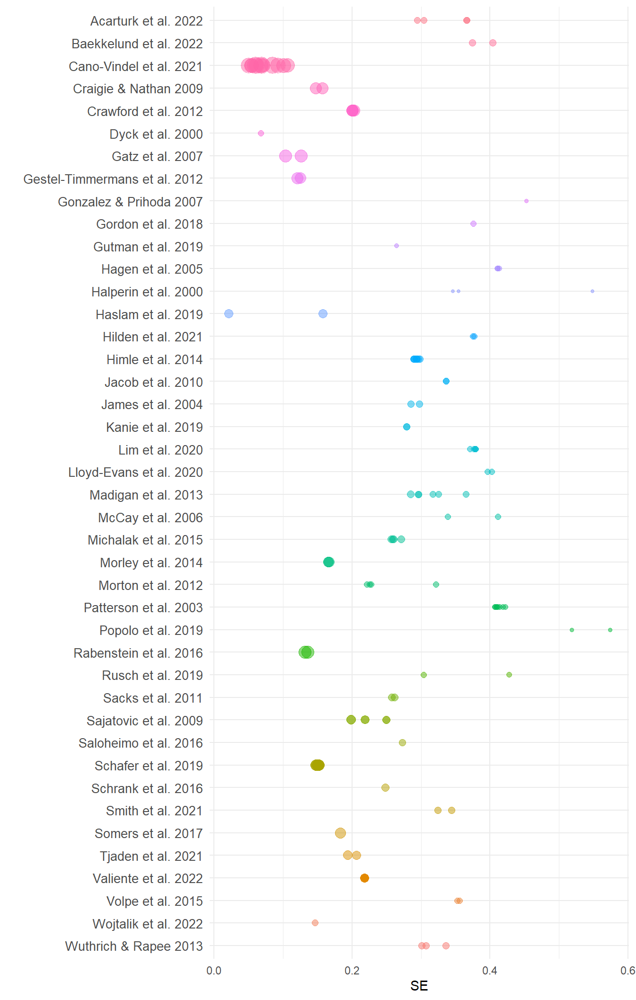{#fig-forset-plot-se-mental fig-pos='H' width=672}
:::
:::

:::

:::

## Modified SE forest plot
::: {.columns}

::: {.column width="95%"}

::: {.cell fig.topcaption='true'}

```{.r .cell-code}
reintegration_dat |> 
  arrange(desc(study)) |>
  mutate(
    study = factor(study, unique(study)),
    Wse_pop = sqrt(Wgt_pop)
    ) |> 
  ggplot(aes(x = Wse_pop, y = study, color = study)) +
  geom_point(aes(size = N_total), alpha = 0.5, position = position_jitter(height = 0.4)) +
  scale_y_discrete() +
  theme_minimal() +
  labs(y = "", x = "Modified SE") +
  theme(legend.position = "none", axis.text.y = element_text(size = 10))
```

::: {.cell-output-display}
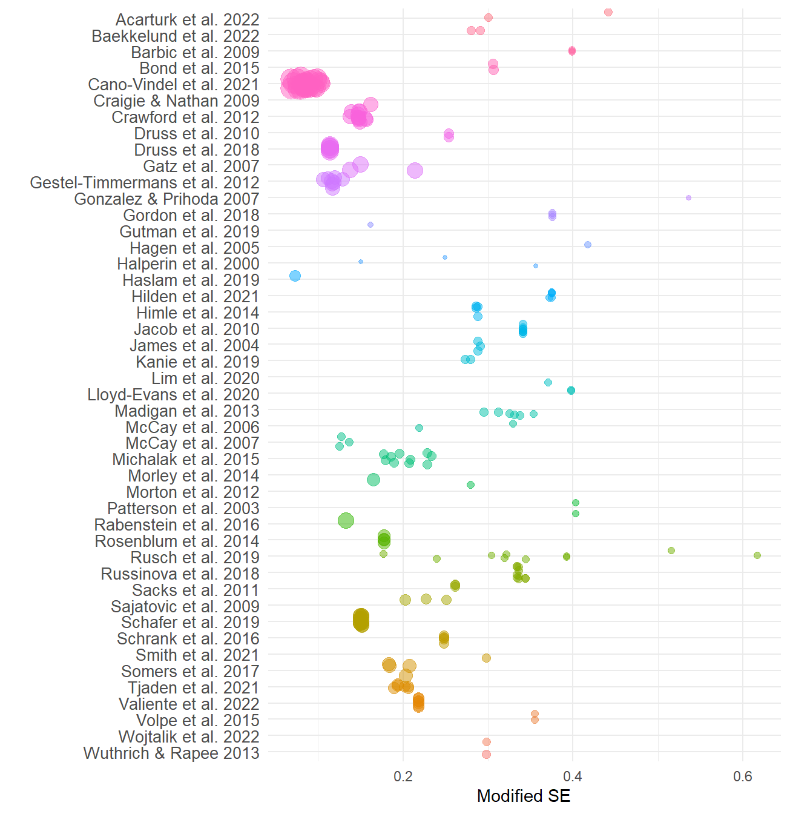{#fig-forset-plot-se-modified fig-pos='H' width=652.8}
:::
:::

:::

::: {.column-margin}

::: {.cell fig.topcaption='true'}

```{.r .cell-code}
mental_health_dat |> 
  arrange(desc(study)) |>
  mutate(
    study = factor(study, unique(study)),
    Wse_pop = sqrt(Wgt_pop)
    ) |> 
  ggplot(aes(x = Wse_pop, y = study, color = study)) +
  geom_point(aes(size = N_total), alpha = 0.5, position = position_jitter(height = 0.4)) +
  scale_y_discrete() +
  theme_minimal() +
  labs(y = "", x = "Modified SE") +
  theme(legend.position = "none", axis.text.y = element_text(size = 10))
```

::: {.cell-output-display}
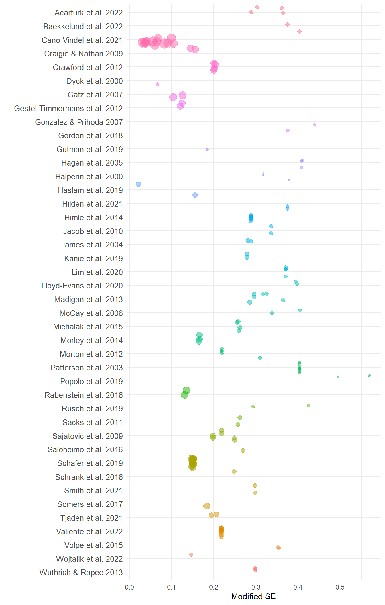{#fig-forset-plot-se-mental-modified fig-pos='H' width=672}
:::
:::

:::

:::

## Inverse sampling covariance weights plot
::: {.columns}

::: {.column width="95%"}

::: {.cell fig.topcaption='true'}

```{.r .cell-code}
iscw <-
  function(k, rho, v) {
    iscw_weights <-  k / (((k - 1) * rho + 1) * v)
    return(iscw_weights)
  }

rho_val <- round(seq(0, 0.8, 0.2), 1)

ISCW_plot <- 
  reintegration_dat |> 
  expand_grid(rho = rho_val) |> 
  group_by(study, rho) |> 
  summarise(
    k = n(),
    v_bar = mean(vgt_pop)
  ) |> 
  ungroup() |> 
  mutate(iscw_w = iscw(k, rho, v_bar),
         depd = ifelse(k > 1, 1, 0)) |> 
  group_by(rho) |> 
  mutate(iscw_w_norm = iscw_w / sum(iscw_w)) |> 
  ungroup() |> 
  distinct(study, rho, iscw_w_norm, depd) |> 
  mutate(study = factor(study, levels = study[rho == 0.8][order(iscw_w_norm[rho == 0.8])])) |> 
  ggplot(aes(y = iscw_w_norm, x = study, group = factor(rho), colour = factor(rho))) +
  geom_point() +
  geom_line() + 
  theme_minimal() +
  coord_flip() +
  theme(
    legend.position = "inside",
    legend.position.inside = c(0.8, 0.2)
  ) +
  labs(x = "", y = "Normalized Weight", colour = "Assumed Correlation") 

ISCW_plot
```

::: {.cell-output-display}
{#fig-iscw fig-pos='H' width=652.8}
:::
:::

:::

::: {.column-margin}

::: {.cell fig.topcaption='true'}

```{.r .cell-code}
ISCW_plot_mental <- 
  mental_health_dat |> 
  expand_grid(rho = rho_val) |> 
  group_by(study, rho) |> 
  summarise(
    k = n(),
    v_bar = mean(vgt_pop)
  ) |> 
  ungroup() |> 
  mutate(iscw_w = iscw(k, rho, v_bar),
         depd = ifelse(k > 1, 1, 0)) |> 
  group_by(rho) |> 
  mutate(iscw_w_norm = iscw_w / sum(iscw_w)) |> 
  ungroup() |> 
  distinct(study, rho, iscw_w_norm, depd) |> 
  mutate(study = factor(study, levels = study[rho == 0.8][order(iscw_w_norm[rho == 0.8])])) |> 
  ggplot(aes(y = iscw_w_norm, x = study, group = factor(rho), colour = factor(rho))) +
  geom_point() +
  geom_line() + 
  theme_minimal() +
  coord_flip() +
  theme(
    legend.position = "inside",
    legend.position.inside = c(0.85, 0.2)
  ) +
  labs(x = "", y = "Normalized Weight", colour = "Assumed Correlation") 

ISCW_plot_mental
```

::: {.cell-output-display}
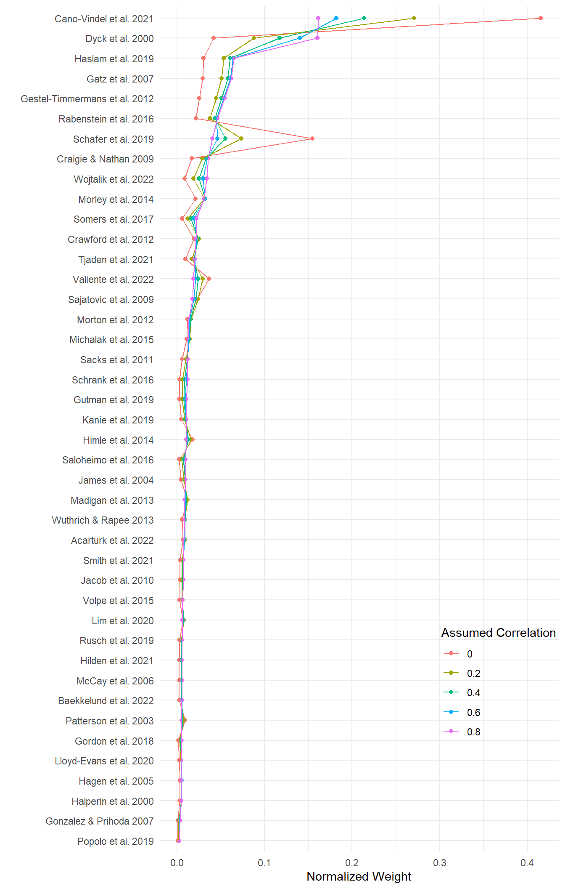{#fig-iscw-mental fig-pos='H' width=672}
:::
:::

:::

:::

## Study sample sizes versus standard error estimates

::: {.columns}

::: {.column width="95%"}

::: {.cell}

```{.r .cell-code}
reintegration_dat |> 
  mutate(segt_pop = sqrt(vgt_pop)) |> 
  ggplot(aes(N_total, segt_pop)) + 
  geom_point() +
  geom_smooth() +
  theme_bw() +
  labs(x = "Total sample size", y = "Modified standard error")
```

::: {.cell-output-display}
{#fig-sample-vs-se fig-pos='H' width=576}
:::
:::

:::

::: {.column-margin}

::: {.cell}

```{.r .cell-code}
mental_health_dat |> 
  mutate(segt_pop = sqrt(vgt_pop)) |> 
  ggplot(aes(N_total, segt_pop)) + 
  geom_point() +
  geom_smooth() +
  theme_bw() +
  labs(x = "Total sample size", y = "Modified standard error")
```

::: {.cell-output-display}
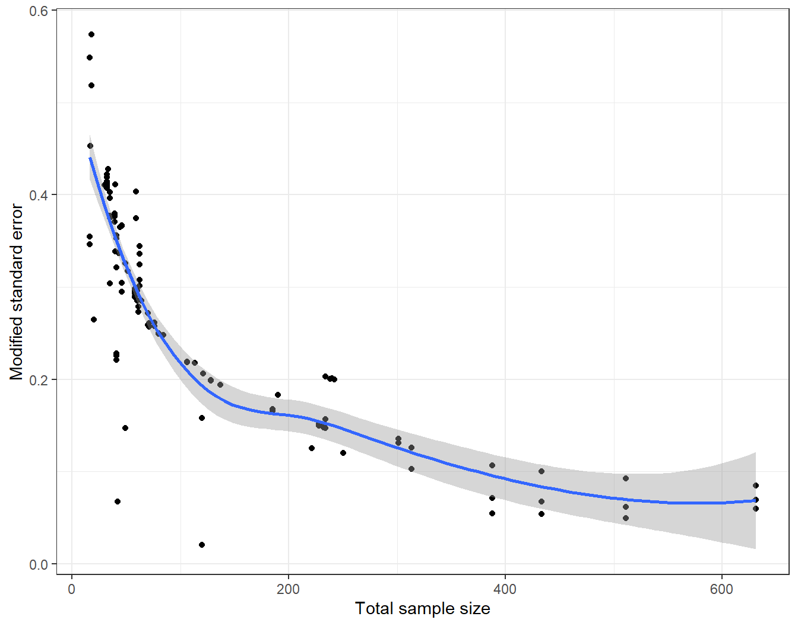{#fig-sample-vs-se-mental fig-pos='H' width=672}
:::
:::

:::

:::

## Standard error vs. scaled standrad error
::: {.columns}

::: {.column width="95%"}

::: {.cell}

```{.r .cell-code}
reintegration_dat |> 
  mutate(
    sample_above_100 = if_else(N_total >100, "Sample > 100", "Sample < 100"),
    sample_above_100 = factor(sample_above_100, levels = c( "Sample > 100", "Sample < 100")),
    segt_pop = sqrt(vgt_pop),
    diff_se = sqrt(Wgt_pop) - sqrt(vgt_pop)
  ) |> 
  ggplot(aes(gt_pop, diff_se, color = sample_above_100)) + 
  geom_point() +
  geom_hline(yintercept = 0, linetype = "dashed") +
  theme_bw() +
  theme(
    plot.caption=element_text(hjust = 0, size = 10),
    legend.position= "bottom",
    legend.title = element_blank(),
    panel.spacing.x = unit(5, "mm"), 
    panel.spacing.y = unit(5, "mm"),
    #panel.grid.major = element_blank(),
    #panel.grid.minor = element_blank()
  ) +
  scale_x_continuous(expand=c(0,0), breaks = seq(-1L, 1.5, 0.2)) + 
  scale_y_continuous(expand=c(0,0), breaks = seq(-0.1, 0.1, 0.01)) + 
  expand_limits(x = c(-0.6, 1.5), y = c(-0.041, 0.01)) +
  labs(y = "Modified SE - SE (used in main analysis)", x = "Effect size estimate")
```

::: {.cell-output-display}
{#fig-se-vs-scaled fig-pos='H' width=576}
:::
:::

:::

::: {.column-margin}

::: {.cell}

```{.r .cell-code}
mental_health_dat |> 
  mutate(
    sample_above_100 = if_else(N_total >100, "Sample > 100", "Sample < 100"),
    sample_above_100 = factor(sample_above_100, levels = c( "Sample > 100", "Sample < 100")),
    segt_pop = sqrt(vgt_pop),
    diff_se = sqrt(Wgt_pop) - sqrt(vgt_pop)
  ) |> 
  ggplot(aes(gt_pop, diff_se, color = sample_above_100)) + 
  geom_point() +
  geom_hline(yintercept = 0, linetype = "dashed") +
  theme_bw() +
  theme(
    plot.caption=element_text(hjust = 0, size = 10),
    legend.position= "bottom",
    legend.title = element_blank(),
    panel.spacing.x = unit(5, "mm"), 
    panel.spacing.y = unit(5, "mm"),
    #panel.grid.major = element_blank(),
    #panel.grid.minor = element_blank()
  ) +
  scale_x_continuous(expand=c(0,0), breaks = seq(-1L, 2.2, 0.2)) + 
  scale_y_continuous(expand=c(0,0), breaks = seq(-0.2, 0.012, 0.01)) + 
  expand_limits(x = c(-1, 2.2), y = c(-0.2, 0.01)) +
  labs(y = "Modified SE - SE (used in main analysis)", x = "Effect size estimate")
```

::: {.cell-output-display}
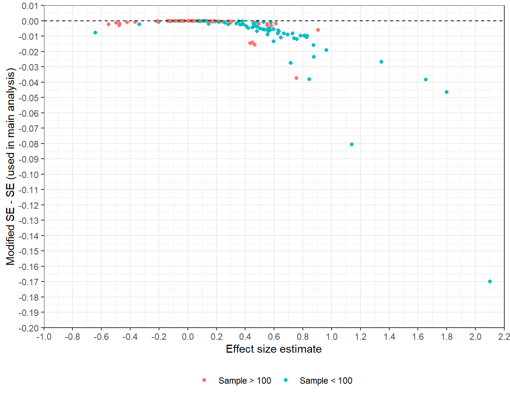{#fig-se-vs-scaled-mental fig-pos='H' width=672}
:::
:::


:::

:::

# Effect size estimates distributions and outliers

## Marginal distributions 
::: {.columns}

::: {.column width="95%"}

::: {.cell .tbl-cap-location-top}

```{.r .cell-code}
reintegration_dat$gt_pop |> 
  skim() |>
  select(-skim_type, -skim_variable, -n_missing, -complete_rate, -numeric.hist) |>
  rename_at(vars(starts_with("numeric.")), ~ str_remove(., "numeric\\.")) |>
  knitr::kable(
    digits = 2,
    caption = "Marginal distribution of effect size estimates",
    booktabs = TRUE
  )  |> 
  kable_styling(bootstrap_options = c("striped","condensed"), full_width = FALSE)
```

::: {.cell-output-display}
`````{=html}
<table class="table table-striped table-condensed" style="width: auto !important; margin-left: auto; margin-right: auto;">
<caption>Marginal distribution of effect size estimates</caption>
 <thead>
  <tr>
   <th style="text-align:right;"> mean </th>
   <th style="text-align:right;"> sd </th>
   <th style="text-align:right;"> p0 </th>
   <th style="text-align:right;"> p25 </th>
   <th style="text-align:right;"> p50 </th>
   <th style="text-align:right;"> p75 </th>
   <th style="text-align:right;"> p100 </th>
  </tr>
 </thead>
<tbody>
  <tr>
   <td style="text-align:right;"> 0.21 </td>
   <td style="text-align:right;"> 0.28 </td>
   <td style="text-align:right;"> -0.5 </td>
   <td style="text-align:right;"> 0.04 </td>
   <td style="text-align:right;"> 0.18 </td>
   <td style="text-align:right;"> 0.39 </td>
   <td style="text-align:right;"> 1.35 </td>
  </tr>
</tbody>
</table>

`````
:::
:::

:::

::: {.column-margin} 

::: {.cell .tbl-cap-location-top}

```{.r .cell-code}
mental_health_dat$gt_pop |> 
  skim() |>
  select(-skim_type, -skim_variable, -n_missing, -complete_rate, -numeric.hist) |>
  rename_at(vars(starts_with("numeric.")), ~ str_remove(., "numeric\\.")) |>
  knitr::kable(
    digits = 2,
    caption = "Marginal distribution of effect size estimates",
    booktabs = TRUE
  )  |> 
  kable_styling(bootstrap_options = c("striped","condensed"), full_width = FALSE)
```

::: {.cell-output-display}
`````{=html}
<table class="table table-striped table-condensed" style="width: auto !important; margin-left: auto; margin-right: auto;">
<caption>Marginal distribution of effect size estimates</caption>
 <thead>
  <tr>
   <th style="text-align:right;"> mean </th>
   <th style="text-align:right;"> sd </th>
   <th style="text-align:right;"> p0 </th>
   <th style="text-align:right;"> p25 </th>
   <th style="text-align:right;"> p50 </th>
   <th style="text-align:right;"> p75 </th>
   <th style="text-align:right;"> p100 </th>
  </tr>
 </thead>
<tbody>
  <tr>
   <td style="text-align:right;"> 0.3 </td>
   <td style="text-align:right;"> 0.42 </td>
   <td style="text-align:right;"> -0.64 </td>
   <td style="text-align:right;"> 0.03 </td>
   <td style="text-align:right;"> 0.22 </td>
   <td style="text-align:right;"> 0.55 </td>
   <td style="text-align:right;"> 2.1 </td>
  </tr>
</tbody>
</table>

`````
:::
:::

:::

:::

## Marginal distribution plots

::: {.columns}

::: {.column width="95%"}

::: {.cell}

```{.r .cell-code}
qrtls <- quantile(reintegration_dat$gt_pop, c(.25, .75), na.rm = TRUE)
fences <-  qrtls + 3 * diff(qrtls) * c(-1, 1)
fence_dat <- data.frame(qrtl = qrtls, fence = fences)

es_dist_plot <- 
  ggplot(reintegration_dat, aes(gt_pop)) + 
  geom_density(fill = "cornflowerblue", alpha = 0.8) + 
  geom_vline(data = fence_dat, aes(xintercept = qrtl), linetype = "solid") + 
  geom_vline(data = fence_dat, aes(xintercept = fence), linetype = "dashed") + 
  geom_rug(alpha = 0.25) + 
  theme_minimal() + 
  theme(axis.title.y = element_blank()) +
  labs(x = "Effect size estimate")

es_dist_plot
```

::: {.cell-output-display}
{#fig-es-distribution fig-pos='H' width=768}
:::
:::

:::

::: {.column-margin} 

::: {.cell}

```{.r .cell-code}
qrtls_mental <- quantile(mental_health_dat$gt_pop, c(.25, .75), na.rm = TRUE)
fences_mental <-  qrtls_mental + 3 * diff(qrtls_mental) * c(-1, 1)
fence_dat_mental <- data.frame(qrtl = qrtls_mental, fence = fences_mental)

es_dist_plot_mental <- 
  ggplot(mental_health_dat, aes(gt_pop)) + 
  geom_density(fill = "gray", alpha = 0.8) + 
  geom_vline(data = fence_dat_mental, aes(xintercept = qrtl), linetype = "solid") + 
  geom_vline(data = fence_dat_mental, aes(xintercept = fence), linetype = "dashed") + 
  geom_rug(alpha = 0.25) + 
  theme_minimal() + 
  theme(axis.title.y = element_blank()) +
  labs(x = "Effect size estimate")

#png(filename = "Figures/margin_dist_plot_mental.png", width = 10, height = 3.1, units = "in", res = 600)
es_dist_plot_mental
#dev.off()
```

::: {.cell-output-display}
{#fig-es-distribution-mental fig-pos='H' width=672}
:::
:::

:::

:::

## Effect size distribution across type of outcomes

::: {.panel-tabset}
## Reintegrational outcomes

::: {.cell}

```{.r .cell-code}
outcomes_reint_dat <- 
  reintegration_dat |> 
  filter(!str_detect(analysis_plan, "Psychiatric")) |> 
  group_by(analysis_plan) |> 
  reframe(
    qrtl = quantile(gt,  c(.25, .75)),
    fence = qrtl + 3 * diff(qrtl) * c(-1,1),
    .groups = "drop"
  )


reintegration_outcome_plot <- 
  reintegration_dat |> 
  #Has only one data point
  filter(!str_detect(analysis_plan, "Psychiatric")) |> 
  ggplot(aes(x = gt_pop, fill = analysis_plan)) + 
  geom_density(alpha = 0.7) +
  geom_vline(data = outcomes_reint_dat, aes(xintercept = qrtl), linetype = "solid")+
  geom_vline(data = outcomes_reint_dat, aes(xintercept = fence), linetype = "dashed")+
  geom_rug(alpha = 0.25) +
  facet_wrap(~analysis_plan, ncol = 2) +
  theme_minimal() +
  theme(legend.position = "none", axis.title.y = element_blank(), axis.text.y = element_blank()) +
  labs(x = "Effect size estimate", ); reintegration_outcome_plot
```

::: {.cell-output-display}
{#fig-es-distribution-reint-subgroup fig-pos='H' width=672}
:::
:::


## Mental health outcomes

::: {.cell}

```{.r .cell-code}
outcome_mental_health_dat <- 
  mental_health_dat |> 
  group_by(analysis_plan) |> 
  reframe(
    qrtl = quantile(gt,  c(.25, .75)),
    fence = qrtl + 3 * diff(qrtl) * c(-1,1),
    
    .groups = "drop"
  )

mental_health_outcomes_plot <- 
  mental_health_dat |> 
  ggplot(aes(x = gt_pop, fill = analysis_plan)) + 
  geom_density(alpha = 0.7) +
  geom_vline(data = outcome_mental_health_dat, aes(xintercept = qrtl), linetype = "solid")+
  geom_vline(data = outcome_mental_health_dat, aes(xintercept = fence), linetype = "dashed")+
  geom_rug(alpha = 0.25) +
  facet_wrap(~analysis_plan, scales = "free") +
  theme_minimal() +
  theme(legend.position = "none", axis.title.y = element_blank(), axis.text = element_blank()) +
  labs(x = "Effect size estimate"); mental_health_outcomes_plot
```

::: {.cell-output-display}
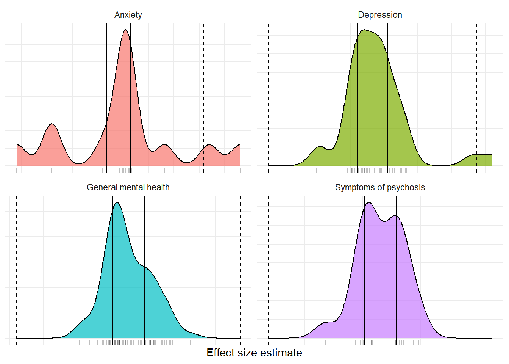{#fig-es-distribution-mental-subgroup fig-pos='H' width=672}
:::
:::


:::


# Colophon

::: {.callout-note icon=false appearance="simple" title="Session Information" collapse=false #session-info}


::: {.cell}
::: {.cell-output .cell-output-stdout}

```
─ Session info ───────────────────────────────────────────────────────────────────────────────────
 setting  value
 version  R version 4.5.1 (2025-06-13 ucrt)
 os       Windows 11 x64 (build 22631)
 system   x86_64, mingw32
 ui       RTerm
 language (EN)
 collate  Danish_Denmark.utf8
 ctype    Danish_Denmark.utf8
 tz       Europe/Copenhagen
 date     2025-10-22
 pandoc   3.6.3 @ C:/RStudio-2025.09.1-401/resources/app/bin/quarto/bin/tools/ (via rmarkdown)
 quarto   NA @ C:\\RSTUDI~1.1-4\\RESOUR~1\\app\\bin\\quarto\\bin\\quarto.exe

─ Packages ───────────────────────────────────────────────────────────────────────────────────────
 package      * version    date (UTC) lib source
 base64enc      0.1-3      2015-07-28 [1] CRAN (R 4.5.0)
 cli            3.6.5      2025-04-23 [1] CRAN (R 4.5.1)
 clubSandwich * 0.6.1      2025-07-30 [1] CRAN (R 4.5.1)
 data.table     1.17.8     2025-07-10 [1] CRAN (R 4.5.1)
 digest         0.6.37     2024-08-19 [1] CRAN (R 4.5.1)
 dplyr        * 1.1.4      2023-11-17 [1] CRAN (R 4.5.1)
 evaluate       1.0.5      2025-08-27 [1] CRAN (R 4.5.1)
 farver         2.1.2      2024-05-13 [1] CRAN (R 4.5.1)
 fastDummies  * 1.7.5      2025-01-20 [1] CRAN (R 4.5.1)
 fastmap        1.2.0      2024-05-15 [1] CRAN (R 4.5.1)
 forcats      * 1.0.0      2023-01-29 [1] CRAN (R 4.5.1)
 generics       0.1.4      2025-05-09 [1] CRAN (R 4.5.1)
 GGally       * 2.4.0      2025-08-23 [1] CRAN (R 4.5.1)
 ggExtra      * 0.11.0     2025-09-01 [1] CRAN (R 4.5.1)
 ggh4x        * 0.3.1      2025-05-30 [1] CRAN (R 4.5.1)
 ggplot2      * 4.0.0      2025-09-11 [1] CRAN (R 4.5.1)
 ggrepel      * 0.9.6      2024-09-07 [1] CRAN (R 4.5.1)
 ggridges     * 0.5.7      2025-08-27 [1] CRAN (R 4.5.1)
 ggstats        0.11.0     2025-09-15 [1] CRAN (R 4.5.1)
 glue           1.8.0      2024-09-30 [1] CRAN (R 4.5.1)
 gtable         0.3.6      2024-10-25 [1] CRAN (R 4.5.1)
 hms            1.1.3      2023-03-21 [1] CRAN (R 4.5.1)
 htmltools      0.5.8.1    2024-04-04 [1] CRAN (R 4.5.1)
 htmlwidgets    1.6.4      2023-12-06 [1] CRAN (R 4.5.1)
 httpuv         1.6.16     2025-04-16 [1] CRAN (R 4.5.1)
 igraph       * 2.1.4      2025-01-23 [1] CRAN (R 4.5.1)
 janitor      * 2.2.1      2024-12-22 [1] CRAN (R 4.5.1)
 jsonlite       2.0.0      2025-03-27 [1] CRAN (R 4.5.1)
 kableExtra   * 1.4.0      2024-01-24 [1] CRAN (R 4.5.1)
 knitr        * 1.50       2025-03-16 [1] CRAN (R 4.5.1)
 labeling       0.4.3      2023-08-29 [1] CRAN (R 4.5.0)
 later          1.4.4      2025-08-27 [1] CRAN (R 4.5.1)
 lattice        0.22-7     2025-04-02 [1] CRAN (R 4.5.1)
 lifecycle      1.0.4      2023-11-07 [1] CRAN (R 4.5.1)
 lubridate    * 1.9.4      2024-12-08 [1] CRAN (R 4.5.1)
 magrittr       2.0.4      2025-09-12 [1] CRAN (R 4.5.1)
 mathjaxr       1.8-0      2025-04-30 [1] CRAN (R 4.5.1)
 Matrix       * 1.7-3      2025-03-11 [1] CRAN (R 4.5.1)
 metadat      * 1.4-0      2025-02-04 [1] CRAN (R 4.5.1)
 metafor      * 4.9-18     2025-09-22 [1] Github (wviechtb/metafor@6cc5a0a)
 MetBrewer    * 0.2.0      2022-03-21 [1] CRAN (R 4.5.1)
 mgcv           1.9-3      2025-04-04 [1] CRAN (R 4.5.1)
 mime           0.13       2025-03-17 [1] CRAN (R 4.5.0)
 miniUI         0.1.2      2025-04-17 [1] CRAN (R 4.5.1)
 nlme           3.1-168    2025-03-31 [1] CRAN (R 4.5.1)
 numDeriv     * 2016.8-1.1 2019-06-06 [1] CRAN (R 4.5.0)
 patchwork    * 1.3.2      2025-08-25 [1] CRAN (R 4.5.1)
 pillar         1.11.1     2025-09-17 [1] CRAN (R 4.5.1)
 pkgconfig      2.0.3      2019-09-22 [1] CRAN (R 4.5.1)
 promises       1.3.3      2025-05-29 [1] CRAN (R 4.5.1)
 purrr        * 1.1.0      2025-07-10 [1] CRAN (R 4.5.1)
 R6             2.6.1      2025-02-15 [1] CRAN (R 4.5.1)
 RColorBrewer   1.1-3      2022-04-03 [1] CRAN (R 4.5.0)
 Rcpp           1.1.0      2025-07-02 [1] CRAN (R 4.5.1)
 readr        * 2.1.5      2024-01-10 [1] CRAN (R 4.5.1)
 repr           1.1.7      2024-03-22 [1] CRAN (R 4.5.1)
 rlang        * 1.1.6      2025-04-11 [1] CRAN (R 4.5.1)
 rmarkdown      2.29       2024-11-04 [1] CRAN (R 4.5.1)
 rstudioapi     0.17.1     2024-10-22 [1] CRAN (R 4.5.1)
 S7             0.2.0      2024-11-07 [1] CRAN (R 4.5.1)
 sandwich       3.1-1      2024-09-15 [1] CRAN (R 4.5.1)
 scales         1.4.0      2025-04-24 [1] CRAN (R 4.5.1)
 sessioninfo    1.2.3      2025-02-05 [1] CRAN (R 4.5.1)
 shiny          1.11.1     2025-07-03 [1] CRAN (R 4.5.1)
 skimr        * 2.2.1      2025-07-26 [1] CRAN (R 4.5.1)
 snakecase      0.11.1     2023-08-27 [1] CRAN (R 4.5.1)
 stringi        1.8.7      2025-03-27 [1] CRAN (R 4.5.0)
 stringr      * 1.5.2      2025-09-08 [1] CRAN (R 4.5.1)
 svglite        2.2.1      2025-05-12 [1] CRAN (R 4.5.1)
 systemfonts    1.2.3      2025-04-30 [1] CRAN (R 4.5.1)
 textshaping    1.0.3      2025-09-02 [1] CRAN (R 4.5.1)
 tibble       * 3.3.0      2025-06-08 [1] CRAN (R 4.5.1)
 tidyr        * 1.3.1      2024-01-24 [1] CRAN (R 4.5.1)
 tidyselect     1.2.1      2024-03-11 [1] CRAN (R 4.5.1)
 tidyverse    * 2.0.0      2023-02-22 [1] CRAN (R 4.5.1)
 timechange     0.3.0      2024-01-18 [1] CRAN (R 4.5.1)
 tzdb           0.5.0      2025-03-15 [1] CRAN (R 4.5.1)
 utf8           1.2.6      2025-06-08 [1] CRAN (R 4.5.1)
 vctrs          0.6.5      2023-12-01 [1] CRAN (R 4.5.1)
 viridisLite    0.4.2      2023-05-02 [1] CRAN (R 4.5.1)
 withr          3.0.2      2024-10-28 [1] CRAN (R 4.5.1)
 xfun           0.53       2025-08-19 [1] CRAN (R 4.5.1)
 xml2           1.4.0      2025-08-20 [1] CRAN (R 4.5.1)
 xtable         1.8-4      2019-04-21 [1] CRAN (R 4.5.1)
 yaml           2.3.10     2024-07-26 [1] CRAN (R 4.5.0)
 zoo            1.8-14     2025-04-10 [1] CRAN (R 4.5.1)

 [1] C:/Users/B199526/AppData/Local/Programs/R/R-4.5.1/library
 * ── Packages attached to the search path.

──────────────────────────────────────────────────────────────────────────────────────────────────
```


:::
:::


:::

