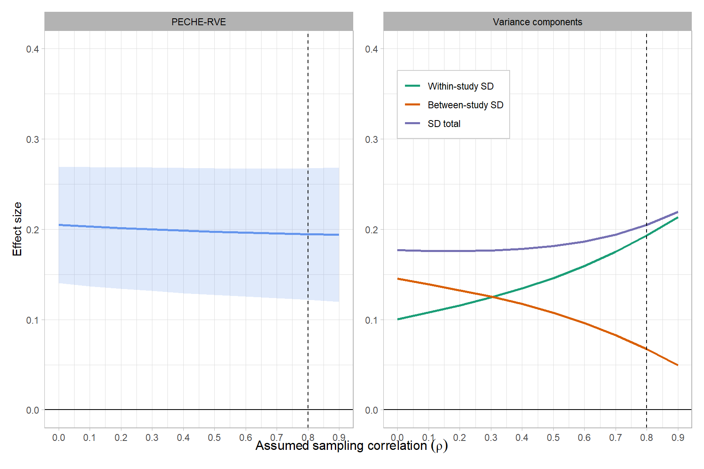
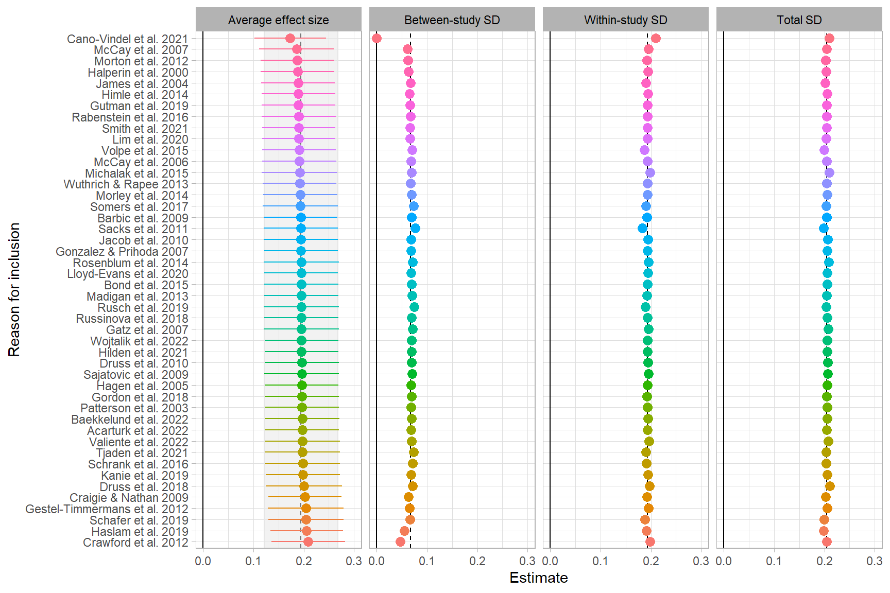
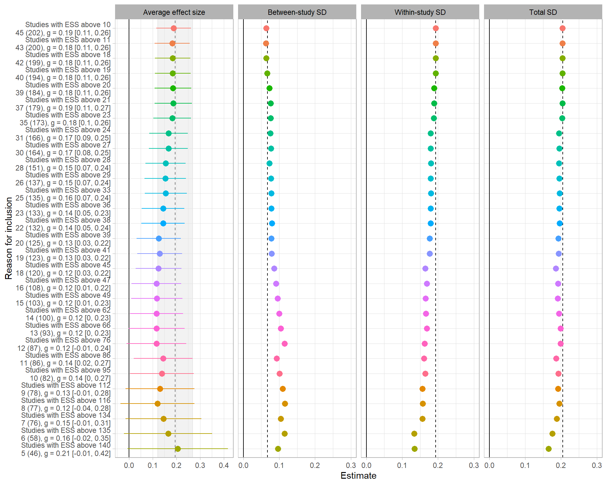
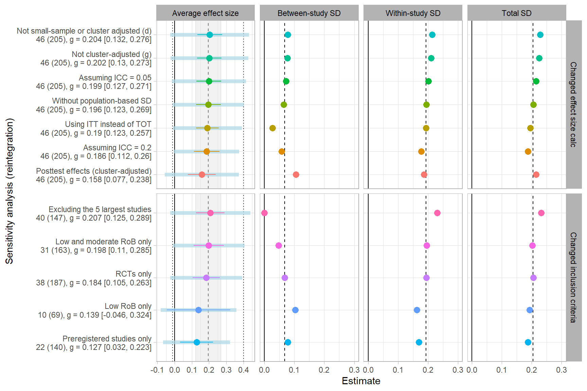
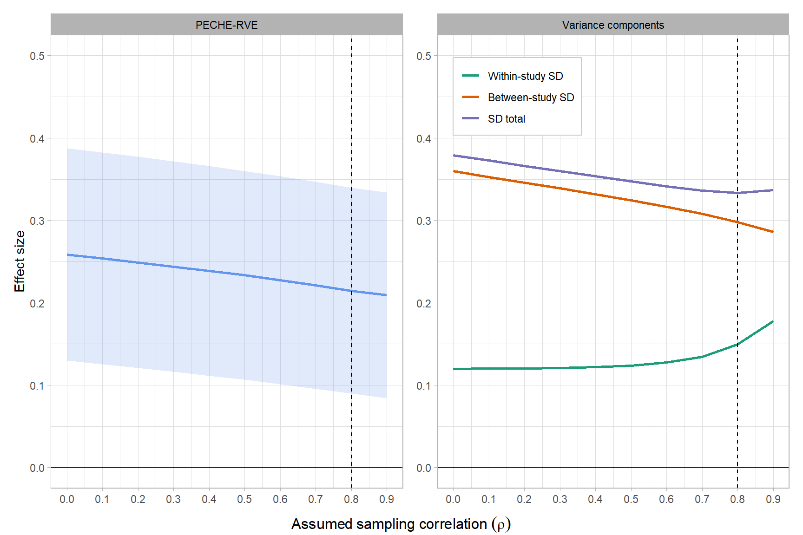
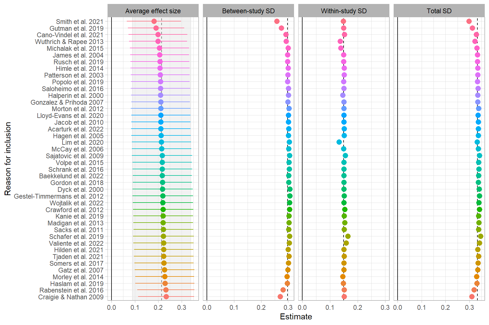
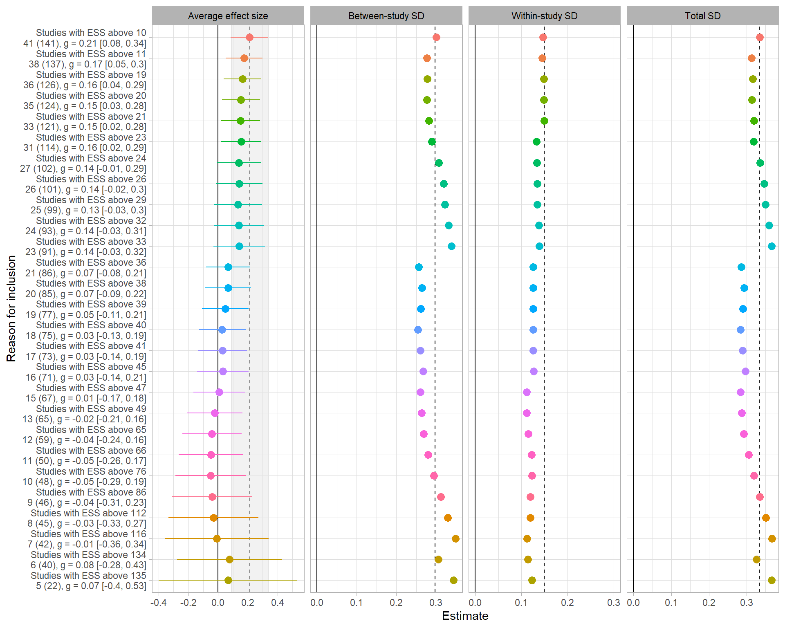
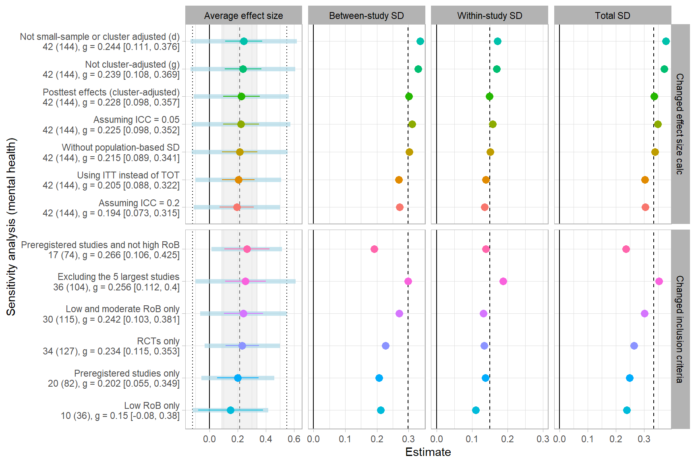

[@Dalgaard2025]


::: {.cell}

```{.r .cell-code}
library(metafor)
library(clubSandwich)
library(tidyverse)
library(patchwork)

source("Helpers.R")

reint_ma_dat <- readRDS("reint_ma_dat.rds")
mental_ma_dat <- readRDS("mental_ma_dat.rds")
gb_dat <- readRDS("Data/gb_dat.rds")
```
:::


# Reintegration

## Impact of $\rho$

::: {.cell}

```{.r .cell-code}
rho_seq <- 0:9/10

rho_dat <- 
  map(rho_seq, ~ .PECHE_RVE(data = reint_ma_dat, rho = .x)) |> 
  list_rbind()

rho_beta_plot <- 
  rho_dat |> 
  mutate(param = "PECHE-RVE") |> 
  ggplot(aes(x = rho, y = avg_effect)) +
  geom_line(aes(color = param), linewidth = 1) +
  #geom_ribbon(aes(ymin = pi_lb, ymax = pi_ub), fill = "grey", alpha = 0.5) +
  geom_ribbon(aes(ymin = LL, ymax = UL, fill = param), alpha = .2) +
  geom_hline(yintercept = 0) +
  geom_vline(xintercept = 0.8, linetype = "dashed") +
  scale_x_continuous(breaks = 0:9/10) + 
  scale_y_continuous(breaks = seq(-1, 1, .1), limits = c(0, 0.4)) +
  theme_light() +
  theme(
    strip.text = element_text(color = "black"),
    legend.position = "none"
  ) + 
  facet_grid(~param) +
  scale_fill_manual(values = "cornflowerblue", name = "fill") +
  scale_color_manual(values = "cornflowerblue") + 
  labs(y = "Effect size", 
       x = expression(Assumed~sampling~correlation~(rho))
  )


rho_var_plot <- 
  rho_dat |> 
  pivot_longer(
    cols = tau:sd_total,
    names_to = "var"
  ) |>  
  arrange(var, rho) |> 
  mutate(
    Variance = case_when(
      var == "omega" ~ "Within-study SD",
      var == "tau" ~ "Between-study SD",
      var == "sd_total" ~ "SD total",
      .default = NA_character_
    ),
    
    Variance = factor(Variance, levels = c("Within-study SD", "Between-study SD", "SD total")),
    
    param = "Variance components"
    
  ) |> 
  ggplot(aes(x = rho, y = value, color = Variance)) +
  geom_line(linewidth = 1) +
  scale_x_continuous(breaks = seq(0,0.9,0.1)) +
  scale_y_continuous(breaks = seq(-1, 1, .1), limits = c(0, 0.4)) +
  scale_color_brewer(type = "qual", palette = 2) +
  geom_hline(yintercept = 0) +
  geom_vline(xintercept = 0.8, linetype = "dashed") +
  facet_grid(~param) +
  theme_light() +
  theme(
    strip.text = element_text(color = "black"),
    legend.title=element_blank(),
    axis.title.y =element_blank(),
    legend.position = c(0.045, 0.9),   # (x, y) in relative coordinates (0–1)
    legend.justification = c(0, 1),    # align legend box to top-left corner
    legend.background = element_rect(fill = "white", color = "grey80"),
    legend.box.background = element_rect(color = "grey60", linewidth = 0.3)
    
  ) + 
  labs(
    x = expression(Assumed~sampling~correlation~(rho)),
    color = "Component"
  )

xlab <- rho_var_plot$labels$x

rho_beta_plot$labels$x <- rho_var_plot$labels$x <- "" 


rho_beta_plot + rho_var_plot
grid::grid.draw(grid::textGrob(xlab, y = 0.02, x = 0.5, rot = 0))
```

::: {.cell-output-display}
{#fig-rho-impact-reint fig-pos='H' width=864}
:::
:::


## Leave one study out


::: {.cell}

```{.r .cell-code}
studies <- c("None", unique(reint_ma_dat$study))

omitted_study_dat <- 
  map(.x = studies, .f = .PECHE_RVE, data = reint_ma_dat) |> 
  list_rbind() 

omitted_study_dat |> 
  filter(avg_effect == min(avg_effect) | avg_effect == max(avg_effect)) |> 
  select(omitted_study, avg_effect:pi_ub_67) |> 
  mutate(
    size = c("Smallest effect", "Largest effect")
  ) |> 
  relocate(size)
```

::: {.cell-output .cell-output-stdout}

```
# A tibble: 2 × 8
  size            omitted_study           avg_effect     se    LL    UL pi_lb_67 pi_ub_67
  <chr>           <chr>                        <dbl>  <dbl> <dbl> <dbl>    <dbl>    <dbl>
1 Smallest effect Cano-Vindel et al. 2021      0.173 0.0346 0.102 0.244 -0.0379     0.384
2 Largest effect  Crawford et al. 2012         0.209 0.0354 0.136 0.282  0.00233    0.416
```


:::

```{.r .cell-code}
omitted_study_dat_long <- 
  omitted_study_dat |>
  arrange(desc(avg_effect)) |> 
  pivot_longer(
    cols = c(avg_effect, tau:sd_total),
    names_to = "parameter",
    values_to = "est"
  ) |> 
  mutate(
    facet_label = case_match(
      parameter,
      "avg_effect" ~ "Average effect size",
      "tau" ~ "Between-study SD",
      "omega" ~ "Within-study SD",
      "sd_total" ~ "Total SD"
    ),
    
    facet_label = factor(
      facet_label,
      levels = c("Average effect size", "Between-study SD", "Within-study SD", "Total SD")
      ),
    
   omitted_study = factor(omitted_study, levels = unique(omitted_study)),
    max = 0.3
  ) 
  

facet_beta_l1out <- 
  omitted_study_dat_long |> 
  filter(omitted_study == "None" & facet_label == "Average effect size") |> 
  pivot_wider(
    names_from = "parameter",
    values_from = "est"
  ) |> 
  rename(est = avg_effect) |> 
  mutate(
    parameter = "avg_effect",
    omitted_study = "Acarturk et al. 2022"
  ) 

facet_sds_l1out  <- 
  omitted_study_dat_long |> 
  filter(omitted_study == "None" & facet_label != "Average effect size") 

facet_errorbar_l1out  <- 
  omitted_study_dat_long |> 
  filter(omitted_study != "None" & parameter == "avg_effect")

l1out_facet_plot <-
  omitted_study_dat_long |> 
  filter(omitted_study != "None") |> 
  ggplot(aes(x = est, y = omitted_study, color = omitted_study)) +
  geom_vline(xintercept = 0) + 
  geom_vline(data = facet_beta_l1out, aes(xintercept = est), linetype = "dashed") + 
  geom_rect(data = facet_beta_l1out, aes(xmin = LL, xmax = UL, ymin = -Inf, ymax = Inf),
            fill = "gray90", alpha = 0.5, color = "gray90") +
  geom_vline(data = facet_sds_l1out, aes(xintercept = est), linetype = "dashed") + 
  geom_blank(aes(x = max)) + 
  geom_point(size = 3) +
  geom_errorbarh(data = facet_errorbar_l1out, aes(xmin = LL, xmax = UL), width=0) + 
  facet_grid(~facet_label, scale = "free") + 
  theme_light() +
  theme(legend.position = "none", strip.text = element_text(color = "black")) + 
  labs(x = "Estimate", y = "Reason for inclusion", color = "") 
  
#png(filename = "Figures/Sensitivity analysis/ess_facet_plot.png", height = 8, width = 10, res = 600, units = "in")
l1out_facet_plot 
#dev.off()  
```

::: {.cell-output-display}
{#fig-leaveoneout-reint fig-pos='H' width=864}
:::
:::


## Impact of effective sample size on total variance


::: {.cell}

```{.r .cell-code}
ess_dat <- 
  reint_ma_dat |> 
  mutate(
    mean_ess = round(mean(ESS_total)),
    .by = study
  ) |> 
  arrange(mean_ess)


data <- ess_dat

sample_seq <- c(0, unique(ess_dat$mean_ess))
studies <- dplyr::n_distinct(data$study)
i <- 1L
filtered_list <- list()

while (i<=35L && studies > 5L){
  
  data <- data |> dplyr::filter(mean_ess > sample_seq[i])
  
  res <- .PECHE_RVE(data = data)
  
  filtered_list[[i]] <- 
    res |> 
    dplyr::select(studies, effects, avg_effect, LL, UL, tau:sd_total) |> 
    dplyr::mutate(
      excl_studies = paste("Studies with ESS above", sample_seq[i]),
      excl_below_ess = sample_seq[i]
    )
  
  studies <- dplyr::n_distinct(data$study)
  i <- i + 1
  
}

ess_res_dat <- 
  filtered_list |> 
  list_rbind() |> 
  mutate(
    study_es_label = paste0(
      studies, " (", effects, "), g = ", round(avg_effect, 2), 
      " [", round(LL, 2), ", ", round(UL, 2), "]"
      
    ),
    
    y_label = paste0(excl_studies, "\n", study_es_label)
    
  )

ess_res_dat_long <- 
  ess_res_dat |> 
  pivot_longer(
    cols = c(avg_effect, tau:sd_total),
    names_to = "parameter",
    values_to = "est"
  ) |> 
  mutate(
    facet_label = case_match(
      parameter,
      "avg_effect" ~ "Average effect size",
      "tau" ~ "Between-study SD",
      "omega" ~ "Within-study SD",
      "sd_total" ~ "Total SD"
    ),
    
    facet_label = factor(
      facet_label,
      levels = c("Average effect size", "Between-study SD", "Within-study SD", "Total SD")
      )
    
    
  ) |> 
  arrange(desc(excl_below_ess)) |> 
  mutate(
    y_label = factor(y_label, levels = unique(y_label)),
    max = 0.3
  )

facet_beta <- 
  ess_res_dat_long |> 
  filter(studies == 46 & facet_label == "Average effect size") |> 
  pivot_wider(
    names_from = "parameter",
    values_from = "est"
  ) |> 
  rename(est = avg_effect) |> 
  mutate(
    parameter = "avg_effect",
    y_label = ess_res_dat$y_label[2]
  ) 
  
facet_sds <- 
  ess_res_dat_long |> 
  filter(studies == 46 & facet_label != "Average effect size") 

facet_errorbar <- 
  ess_res_dat_long |> 
  filter(studies != 46 & parameter == "avg_effect")

ess_facet_plot <- 
  ggplot(filter(ess_res_dat_long, studies != 46), aes(x = est, y = y_label, color = excl_studies)) +
  geom_vline(xintercept = 0) + 
  geom_vline(data = facet_beta, aes(xintercept = est), linetype = "dashed") + 
  geom_rect(data = facet_beta, aes(xmin = LL, xmax = UL, ymin = -Inf, ymax = Inf),
            fill = "gray90", alpha = 0.5, color = "gray90") +
  geom_vline(data = facet_sds, aes(xintercept = est), linetype = "dashed") + 
  geom_blank(aes(x = max)) + 
  geom_point(size = 3) +
  geom_errorbarh(data = facet_errorbar, aes(xmin = LL, xmax = UL), width=0) + 
  facet_grid(~facet_label, scale = "free") + 
  theme_light() +
  theme(legend.position = "none", strip.text = element_text(color = "black")) + 
  labs(x = "Estimate", y = "Reason for inclusion", color = "") 
  
#png(filename = "Figures/Sensitivity analysis/ess_facet_plot.png", height = 8, width = 10, res = 600, units = "in")
ess_facet_plot 
#dev.off()  
```

::: {.cell-output-display}
{#fig-ess-impact-reint fig-pos='H' width=960}
:::
:::


## Sensitivity analysis plot

### Data construction


::: {.cell}

```{.r .cell-code}
# The dat_icc_005 and dat_icc_02 were generated by hand by changing the ICC_01 value 
# in the effect size calculation script. After the change, we reran all effect size calculations. 

dat_icc_005 <- readRDS("Data/Group-based interventions data 005.RDS") |> 
  # The post-measurement of Empowerment Scale seems flawed for the study by 
  # Barbic et al. 2009 we therefore we exclude it from the analysis
  filter(!(authors == "Barbic et al." & test_name == "The Empowerment Scale")) |> 
  filter(!c(str_detect(study, "Cano|Craigie|Woj") & analysis_strategy == "ITT")) |> 
  filter(variable_type != "Binary") |>
  mutate(
    author_year = paste(authors, year),
    study = paste(authors, year),
    study = stringi::stri_trans_general(study, "Latin-ASCII"),
    study = fct_relevel(study, sort),
       es_id = 1:n(),
    esid = es_id,
    
    # Main covariate adjusted effect cluster adjusted 
    gt_pop = if_else(!is.na(gt_post), gt_post, NA_real_),
    gt_pop = if_else(!is.na(gt_DD), gt_DD, gt_pop),
    gt_pop = if_else(!is.na(gt_adj), gt_adj, gt_pop),
    gt_pop = if_else(!is.na(gt_reg), gt_reg, gt_pop),
    gt_pop = if_else(!is.na(gt_DD_pop), gt_DD_pop, gt_pop),
    gt_pop = if_else(!is.na(gt_adj_pop), gt_adj_pop, gt_pop),
    
    vgt_pop = if_else(!is.na(vgt_post), vgt_post, NA_real_),
    vgt_pop = if_else(!is.na(vgt_DD), vgt_DD, vgt_pop),
    vgt_pop = if_else(!is.na(vgt_adj), vgt_adj, vgt_pop),
    vgt_pop = if_else(!is.na(vgt_reg), vgt_reg, vgt_pop),
    vgt_pop = if_else(!is.na(vgt_DD_pop), vgt_DD_pop, vgt_pop),
    vgt_pop = if_else(!is.na(vgt_adj_pop), vgt_adj_pop, vgt_pop),
    
    Wgt_pop = if_else(!is.na(Wgt_post), Wgt_post, NA_real_),
    Wgt_pop = if_else(!is.na(Wgt_DD), Wgt_DD, Wgt_pop),
    Wgt_pop = if_else(!is.na(Wgt_adj), Wgt_adj, Wgt_pop),
    Wgt_pop = if_else(!is.na(Wgt_reg), Wgt_reg, Wgt_pop),
    Wgt_pop = if_else(!is.na(Wgt_DD_pop), Wgt_DD_pop, Wgt_pop),
    Wgt_pop = if_else(!is.na(Wgt_adj_pop), Wgt_adj_pop, Wgt_pop),
    
    analysis_plan = if_else(analysis_plan == "Unused", "Unused outcomes", analysis_plan), 
    analysis_plan = case_match(
      analysis_plan,
      "Hope, Empowerment & Self-efficacy" ~ "Hope, empowerment & self-efficacy",
      "Wellbeing and Quality of Life" ~ "Wellbeing and quality of life",
      "All mental health outcomes" ~ "General mental health",
      "All mental health outcomes/Anxiety" ~ "Anxiety",
      "All mental health outcomes/Depression" ~ "Depression",
      "All mental health outcomes/Symptoms of psychosis" ~ "Symptoms of psychosis",
      "All mental health outcomes/Negative symptoms" ~ "Symptoms of psychosis",
      .default = analysis_plan
    ),
    
    outcome_construct = case_match(
      analysis_plan,
      # Mental health outcomes
      c("General mental health", "Anxiety",
        "Depression", "Symptoms of psychosis") ~ "Mental health outcome",
      .default = "Reintegrational outcome"
    )
    
  ) |> 
 # Remove unused outcomes
 filter(!str_detect(analysis_plan, "Unused"))

time_vcalc <- c(
  # Acarturk
  1,2,1,2,1,2,
  # Barbic
  1,1,1,
  # Bond
  1,1, 
  # Baekkelund, 
  1,1,2,2,
  # Cano-Vindel
  rep(c(1:4), each = 10),
  # Craigie & Nathan
  1,1,1,
  # Crawford (multi-treatment)
  rep(c(1,2), each = 2, 4),
  # Druss 2010
  1,1,
  #Druss 2018
  1,1,1,2,2,2,
  # Dyck
  1, 
  # Gestel-Timmermans
  rep(c(1,2), 5),
  # Gatz
  rep(1,5),
  # Gonzalaez
  rep(1,2),
  # Gordon 
  rep(1,4),
  # Gutman
  rep(1,2),
  # Hagen
  rep(1,4),
  # Halperin
  rep(1, 6),
  # Haslem
  rep(1,3),
  # Hilden
  rep(1,7),
  # Himle
  rep(c(1,2), each = 6),
  #Jacob
  rep(c(1,2), each = 5),
  #James
  rep(1,5),
  # Kanie
  rep(1,4),
  # Lim
  rep(1,6),
  # Llyod-Evans
  rep(1,4),
  # Madigan
  rep(c(1,2), each = 6),
  # McCay 2006
  rep(1,4),
  # McCay 2007
  rep(1,3),
  # Michalak (multi-treatment)
  rep(1,14),
  # Morley 
  rep(1,4),
  # Morton
  rep(1,5),
  # Patterson
  rep(c(1,2), each = 5),
  # Popolo
  rep(1,2),
  # Rabenstein
  rep(1,3),
  # Rosenblum 
  rep(1,4),
  # Russinova 
  rep(c(1,2), each = 5),
  # Rusch
  rep(c(1,2), each = 6),
  # Sacks
  rep(1,5),
  # Sajatovic
  rep(c(1:3), each = 3),
  # Saloheimo
  1, 
  # Schrank
  rep(1,6),
  # Schafer (multi-treatment)
  rep(c(2,3,1), each = 2, 6),
  # Somers
  rep(1,5),
  # Tjaden
  rep(c(1,2), each = 4),
  # Valiente 
  rep(1,16),
  # Volpe
  rep(1,4),
  # Wojtalik 
  rep(1,2),
  #Wuthrich
  rep(1,4),
  # Smith 
  rep(1,3)
) 

dat_icc_005 <- 
  dat_icc_005 |> 
  mutate(
    time = time_vcalc,
    outcome_time = paste(outcome, time, sep = "_")
  )


dat_icc_02 <- readRDS("Data/Group-based interventions data 02.RDS") |> 
  # The post-measurement of Empowerment Scale seems flawed for the study by 
  # Barbic et al. 2009 we therefore we exclude it from the analysis
  filter(!(authors == "Barbic et al." & test_name == "The Empowerment Scale")) |> 
  filter(variable_type != "Binary") |>
  filter(!c(str_detect(study, "Cano|Craigie|Woj") & analysis_strategy == "ITT")) |>  
  mutate(
    author_year = paste(authors, year),
    study = paste(authors, year),
    study = stringi::stri_trans_general(study, "Latin-ASCII"),
    study = fct_relevel(study, sort),
    
    es_id = 1:n(),
    esid = es_id,
    
    # Main covariate adjusted effect cluster adjusted 
    gt_pop = if_else(!is.na(gt_post), gt_post, NA_real_),
    gt_pop = if_else(!is.na(gt_DD), gt_DD, gt_pop),
    gt_pop = if_else(!is.na(gt_adj), gt_adj, gt_pop),
    gt_pop = if_else(!is.na(gt_reg), gt_reg, gt_pop),
    gt_pop = if_else(!is.na(gt_DD_pop), gt_DD_pop, gt_pop),
    gt_pop = if_else(!is.na(gt_adj_pop), gt_adj_pop, gt_pop),
    
    vgt_pop = if_else(!is.na(vgt_post), vgt_post, NA_real_),
    vgt_pop = if_else(!is.na(vgt_DD), vgt_DD, vgt_pop),
    vgt_pop = if_else(!is.na(vgt_adj), vgt_adj, vgt_pop),
    vgt_pop = if_else(!is.na(vgt_reg), vgt_reg, vgt_pop),
    vgt_pop = if_else(!is.na(vgt_DD_pop), vgt_DD_pop, vgt_pop),
    vgt_pop = if_else(!is.na(vgt_adj_pop), vgt_adj_pop, vgt_pop),
    
    Wgt_pop = if_else(!is.na(Wgt_post), Wgt_post, NA_real_),
    Wgt_pop = if_else(!is.na(Wgt_DD), Wgt_DD, Wgt_pop),
    Wgt_pop = if_else(!is.na(Wgt_adj), Wgt_adj, Wgt_pop),
    Wgt_pop = if_else(!is.na(Wgt_reg), Wgt_reg, Wgt_pop),
    Wgt_pop = if_else(!is.na(Wgt_DD_pop), Wgt_DD_pop, Wgt_pop),
    Wgt_pop = if_else(!is.na(Wgt_adj_pop), Wgt_adj_pop, Wgt_pop),
    
    analysis_plan = if_else(analysis_plan == "Unused", "Unused outcomes", analysis_plan), 
    analysis_plan = case_match(
      analysis_plan,
      "Hope, Empowerment & Self-efficacy" ~ "Hope, empowerment & self-efficacy",
      "Wellbeing and Quality of Life" ~ "Wellbeing and quality of life",
      "All mental health outcomes" ~ "General mental health",
      "All mental health outcomes/Anxiety" ~ "Anxiety",
      "All mental health outcomes/Depression" ~ "Depression",
      "All mental health outcomes/Symptoms of psychosis" ~ "Symptoms of psychosis",
      "All mental health outcomes/Negative symptoms" ~ "Symptoms of psychosis",
      .default = analysis_plan
    ),
    
    outcome_construct = case_match(
      analysis_plan,
      # Mental health outcomes
      c("General mental health", "Anxiety",
        "Depression", "Symptoms of psychosis") ~ "Mental health outcome",
      .default = "Reintegrational outcome"
    )
    
  ) |> 
 # Remove unused outcomes
 filter(!str_detect(analysis_plan, "Unused"))

dat_icc_02 <- 
  dat_icc_02 |> 
  mutate(
    time = time_vcalc,
    outcome_time = paste(outcome, time, sep = "_")
  )
```
:::


### Analysis


::: {.cell}

```{.r .cell-code}
# Reintegration 
dat_icc_005_reint <- filter(dat_icc_005, outcome_construct == "Reintegrational outcome")
dat_icc_02_reint <- filter(dat_icc_02, outcome_construct == "Reintegrational outcome")

dat_itt_reint <- 
  # This data was constructed by hand by changing ITT to TOT in line 401 in the PRIMED workflow script. 
  readRDS("Data/gb_dat_ITT.rds") |> 
  filter(outcome_construct == "Reintegrational outcome") |> 
  mutate(
    outcome_time = paste(outcome, time, sep = "_")
  )

# Changed inclusion criteria results

dat_rct_reint <- reint_ma_dat |> filter(QES_design == "RCT")
dat_rob_low_reint <- reint_ma_dat |> filter(overall_rob == "Low")
dat_rob_low_moderate_reint <- reint_ma_dat |> filter(str_detect(overall_rob, "Low|Some"))

dat_ess_less_140_reint <- 
  reint_ma_dat |> 
  mutate(
    mean_ess = round(mean(ESS_total)),
    .by = study
  ) |> 
  filter(mean_ess < 140)

dat_prereg_reint <- reint_ma_dat |> filter(prereg_chr == "Preregistered")

argument_list <- 
  tibble(
    data = list(
      
      # Overall mean reported in paper
      reint_ma_dat,
      
      # ES calc
      dat_icc_005_reint, 
      dat_icc_02_reint, 
      dat_itt_reint,
      reint_ma_dat, 
      reint_ma_dat, 
      reint_ma_dat, 
      reint_ma_dat,
      
      # Inclusion criteria
      dat_rct_reint,
      dat_rob_low_reint,
      dat_rob_low_moderate_reint, 
      dat_ess_less_140_reint,
      dat_prereg_reint
    ),
    
    es = c(
      rep("gt_pop", 4), 
      "gt", "gt_post", "g", "d",
      rep("gt_pop", 5)
      ),
    var = c(
      rep("vgt_pop", 4), 
      "vgt", "vgt_post", "vg", "vd",
      rep("vgt_pop", 5)
      )
  )

sensi_res <- 
  pmap(.l = argument_list, .f = .PECHE_RVE) |> 
  list_rbind() |> 
  mutate(
    sensi_type_overall = 
      rep(
        c("Changed effect size calc", "Changed inclusion criteria"), 
        c(8,5)
      ),
    
    sensi_type_overall = factor(
      sensi_type_overall, 
      levels = c("Changed effect size calc", "Changed inclusion criteria")
      ),
    
    sensi_type = c(
      "Reported mean",
      "Assuming ICC = 0.05",
      "Assuming ICC = 0.2",
      "Using ITT instead of TOT",
      "Without population-based SD",
      "Posttest effects (cluster-adjusted)",
      "Not cluster-adjusted (g)",
      "Not small-sample or cluster adjusted (d)",
      "RCTs only",
      "Low RoB only",
      "Low and moderate RoB only",
      "Excluding the 5 largest studies",
      "Preregistered studies only"
    ),
    
    study_es_label = paste0(
      studies, " (", effects, "), g = ", round(avg_effect, 3), 
      " [", round(LL, 3), ", ", round(UL, 3), "]"
      
    ),
    
    y_label = paste0(sensi_type, "\n", study_es_label)
    
  ) |> 
  arrange(sensi_type_overall, avg_effect) |> 
  mutate(
    y_label = factor(y_label, levels = unique(y_label))
  )


sensi_plot_dat <- 
  sensi_res |> 
  relocate(sd_total, .after = avg_effect) |> 
  pivot_longer(
    cols = c(avg_effect, tau, omega, sd_total),
    names_to = "parameter",
    values_to = "est"
  ) |> 
  mutate(
    
    facet_label = case_match(
      parameter,
      "avg_effect" ~ "Average effect size",
      "tau" ~ "Between-study SD",
      "omega" ~ "Within-study SD",
      "sd_total" ~ "Total SD"
    ),
    
    facet_label = factor(
      facet_label,
      levels = c("Average effect size", "Between-study SD", "Within-study SD", "Total SD")
    ),
    
    max = 0.3
    
  )


facet_beta_sensi1 <- 
  sensi_plot_dat |> 
  select(-facet_label) |> 
  filter(sensi_type =="Reported mean") |> 
  pivot_wider(
    names_from = "parameter",
    values_from = "est"
  ) |> 
  rename(est = avg_effect) 

facet_beta_sensi <- 
  bind_rows(replicate(2, facet_beta_sensi1, simplify = FALSE)) |> 
  mutate(
    parameter = "avg_effect",
    y_label = c(sensi_res$y_label[1], sensi_res$y_label[9]),
    facet_label = factor("Average effect size"),
    sensi_type_overall = c("Changed effect size calc", "Changed inclusion criteria")
  )
  
facet_sd_pi1 <- 
  sensi_plot_dat |> 
  filter(facet_label != "Average effect size", sensi_type == "Reported mean") 

facet_sd_pi <- 
  bind_rows(replicate(2, facet_sd_pi1, simplify = FALSE)) |> 
  mutate(
    sensi_type_overall = 
      rep(c("Changed effect size calc", "Changed inclusion criteria"), each = 3)
  )
  

facet_errorbar_sensi <- 
  sensi_plot_dat |> 
  filter(sensi_type != "Reported mean", facet_label == "Average effect size")
```
:::


::: {.cell}

```{.r .cell-code}
sensi_facet_plot <- 
  sensi_plot_dat |> 
  filter(sensi_type != "Reported mean") |> 
  ggplot(aes(x = est, y = y_label, color = y_label)) +
  geom_vline(xintercept = 0) + 
  geom_vline(data = facet_beta_sensi, aes(xintercept = est), linetype = "dashed") + 
  geom_rect(data = facet_beta_sensi, aes(xmin = LL, xmax = UL, ymin = -Inf, ymax = Inf),
            fill = "gray90", alpha = 0.5, color = "gray90") +
  geom_vline(data = facet_beta_sensi, aes(xintercept = pi_lb_67), linetype = "dotted") +
  geom_vline(data = facet_beta_sensi, aes(xintercept = pi_ub_67), linetype = "dotted") +
  geom_vline(data = facet_sd_pi, aes(xintercept = est), linetype = "dashed") + 
  geom_blank(aes(x = max)) + 
  geom_errorbar(
    data = facet_errorbar_sensi,
    aes(xmin = pi_lb_67, xmax = pi_ub_67),
    color = "lightblue",
    #size = 1,
    linewidth = 2,
    alpha = 0.7,
    width=0
  ) +
  geom_point(size = 3) +
  geom_errorbar(data = facet_errorbar_sensi, aes(xmin = LL, xmax = UL), width=0) + 
  facet_grid(sensi_type_overall~facet_label, scale = "free") + 
  theme_light() +
  theme(
    legend.position = "none", 
    strip.text = element_text(color = "black")
    ) + 
  labs(x = "Estimate", y = "Sensitivity analysis (reintegration)", color = "") 

#png(filename = "Figures/sensi plot reint.png", width = 9, height = 6, res = 600, units = "in")
sensi_facet_plot
#dev.off()
```

::: {.cell-output-display}
{#fig-sensitivity-analyses-reint fig-pos='H' width=864}
:::
:::


# Mental health
## Impact of $\rho$

::: {.cell}

```{.r .cell-code}
rho_seq <- 0:9/10

rho_dat_mental <- 
  map(rho_seq, ~ .PECHE_RVE(data = mental_ma_dat, rho = .x)) |> 
  list_rbind()

rho_beta_plot_mental <- 
  rho_dat_mental |> 
  mutate(param = "PECHE-RVE") |> 
  ggplot(aes(x = rho, y = avg_effect)) +
  geom_line(aes(color = param), linewidth = 1) +
  #geom_ribbon(aes(ymin = pi_lb, ymax = pi_ub), fill = "grey", alpha = 0.5) +
  geom_ribbon(aes(ymin = LL, ymax = UL, fill = param), alpha = .2) +
  geom_hline(yintercept = 0) +
  geom_vline(xintercept = 0.8, linetype = "dashed") +
  scale_x_continuous(breaks = 0:9/10) + 
  scale_y_continuous(breaks = seq(-1, 1, .1), limits = c(0, 0.5)) +
  theme_light() +
  theme(
    strip.text = element_text(color = "black"),
    legend.position = "none"
  ) + 
  facet_grid(~param) +
  scale_fill_manual(values = "cornflowerblue", name = "fill") +
  scale_color_manual(values = "cornflowerblue") + 
  labs(y = "Effect size", 
       x = expression(Assumed~sampling~correlation~(rho))
  )


rho_var_plot_mental <- 
  rho_dat_mental |> 
  pivot_longer(
    cols = tau:sd_total,
    names_to = "var"
  ) |>  
  arrange(var, rho) |> 
  mutate(
    Variance = case_when(
      var == "omega" ~ "Within-study SD",
      var == "tau" ~ "Between-study SD",
      var == "sd_total" ~ "SD total",
      .default = NA_character_
    ),
    
    Variance = factor(Variance, levels = c("Within-study SD", "Between-study SD", "SD total")),
    
    param = "Variance components"
    
  ) |> 
  ggplot(aes(x = rho, y = value, color = Variance)) +
  geom_line(linewidth = 1) +
  scale_x_continuous(breaks = seq(0,0.9,0.1)) +
  scale_y_continuous(breaks = seq(-1, 1, .1), limits = c(0, 0.5)) +
  scale_color_brewer(type = "qual", palette = 2) +
  geom_hline(yintercept = 0) +
  geom_vline(xintercept = 0.8, linetype = "dashed") +
  facet_grid(~param) +
  theme_light() +
  theme(
    strip.text = element_text(color = "black"),
    legend.title=element_blank(),
    axis.title.y =element_blank(),
    legend.position = c(0.045, 0.95),   # (x, y) in relative coordinates (0–1)
    legend.justification = c(0, 1),    # align legend box to top-left corner
    legend.background = element_rect(fill = "white", color = "grey80"),
    legend.box.background = element_rect(color = "grey60", linewidth = 0.3)
    
  ) + 
  labs(
    x = expression(Assumed~sampling~correlation~(rho)),
    color = "Component"
  )

xlab <- rho_var_plot_mental$labels$x

rho_beta_plot_mental$labels$x <- rho_var_plot_mental$labels$x <- "" 


rho_beta_plot_mental + rho_var_plot_mental
grid::grid.draw(grid::textGrob(xlab, y = 0.02, x = 0.5, rot = 0))
```

::: {.cell-output-display}
{#fig-rho-impact-mental fig-pos='H' width=864}
:::
:::


## Leave one study out


::: {.cell}

```{.r .cell-code}
studies_mental <- c("None", unique(mental_ma_dat$study))

omitted_study_dat_mental <- 
  map(.x = studies_mental, .f = .PECHE_RVE, data = mental_ma_dat) |> 
  list_rbind() 

omitted_study_dat_mental |> 
  filter(avg_effect == min(avg_effect) | avg_effect == max(avg_effect)) |> 
  select(omitted_study, avg_effect:pi_ub_67) |> 
  arrange(desc(omitted_study)) |> 
  mutate(
    size = c("Smallest effect", "Largest effect")
  ) |> 
  relocate(size)
```

::: {.cell-output .cell-output-stdout}

```
# A tibble: 2 × 8
  size            omitted_study         avg_effect     se     LL    UL pi_lb_67 pi_ub_67
  <chr>           <chr>                      <dbl>  <dbl>  <dbl> <dbl>    <dbl>    <dbl>
1 Smallest effect Smith et al. 2021          0.182 0.0573 0.0657 0.298  -0.118     0.481
2 Largest effect  Craigie & Nathan 2009      0.234 0.0593 0.114  0.354  -0.0776    0.545
```


:::

```{.r .cell-code}
omitted_study_dat_long_mental <- 
  omitted_study_dat_mental |>
  arrange(desc(avg_effect)) |> 
  pivot_longer(
    cols = c(avg_effect, tau:sd_total),
    names_to = "parameter",
    values_to = "est"
  ) |> 
  mutate(
    facet_label = case_match(
      parameter,
      "avg_effect" ~ "Average effect size",
      "tau" ~ "Between-study SD",
      "omega" ~ "Within-study SD",
      "sd_total" ~ "Total SD"
    ),
    
    facet_label = factor(
      facet_label,
      levels = c("Average effect size", "Between-study SD", "Within-study SD", "Total SD")
      ),
    
   omitted_study = factor(omitted_study, levels = unique(omitted_study)),
    max = 0.3
  ) 
  

facet_beta_l1out_mental <- 
  omitted_study_dat_long_mental |> 
  filter(omitted_study == "None" & facet_label == "Average effect size") |> 
  pivot_wider(
    names_from = "parameter",
    values_from = "est"
  ) |> 
  rename(est = avg_effect) |> 
  mutate(
    parameter = "avg_effect",
    omitted_study = "Acarturk et al. 2022"
  ) 

facet_sds_l1out_mental  <- 
  omitted_study_dat_long_mental |> 
  filter(omitted_study == "None" & facet_label != "Average effect size") 

facet_errorbar_l1out_mental  <- 
  omitted_study_dat_long_mental |> 
  filter(omitted_study != "None" & parameter == "avg_effect")

l1out_facet_plot_mental <-
  omitted_study_dat_long_mental |> 
  filter(omitted_study != "None") |> 
  ggplot(aes(x = est, y = omitted_study, color = omitted_study)) +
  geom_vline(xintercept = 0) + 
  geom_vline(data = facet_beta_l1out_mental, aes(xintercept = est), linetype = "dashed") + 
  geom_rect(data = facet_beta_l1out_mental, aes(xmin = LL, xmax = UL, ymin = -Inf, ymax = Inf),
            fill = "gray90", alpha = 0.5, color = "gray90") +
  geom_vline(data = facet_sds_l1out_mental, aes(xintercept = est), linetype = "dashed") + 
  geom_blank(aes(x = max)) + 
  geom_point(size = 3) +
  geom_errorbarh(data = facet_errorbar_l1out_mental, aes(xmin = LL, xmax = UL), width=0) + 
  facet_grid(~facet_label, scale = "free") + 
  theme_light() +
  theme(legend.position = "none", strip.text = element_text(color = "black")) + 
  labs(x = "Estimate", y = "Reason for inclusion", color = "") 
  
#png(filename = "Figures/Sensitivity analysis/ess_facet_plot.png", height = 8, width = 10, res = 600, units = "in")
l1out_facet_plot_mental
#dev.off()  
```

::: {.cell-output-display}
{#fig-leaveoneout-mental fig-pos='H' width=864}
:::
:::


## Impact of effective sample size on total variance


::: {.cell}

```{.r .cell-code}
ess_dat <- 
  mental_ma_dat |> 
  mutate(
    mean_ess = round(mean(ESS_total)),
    .by = study
  ) |> 
  arrange(mean_ess)


data <- ess_dat

sample_seq <- c(0, unique(ess_dat$mean_ess))
studies <- dplyr::n_distinct(data$study)
i <- 1L
filtered_list <- list()

while (i<=35L && studies > 5L){
  
  data <- data |> dplyr::filter(mean_ess > sample_seq[i])
  
  res <- .PECHE_RVE(data = data)
  
  filtered_list[[i]] <- 
    res |> 
    dplyr::select(studies, effects, avg_effect, LL, UL, tau:sd_total) |> 
    dplyr::mutate(
      excl_studies = paste("Studies with ESS above", sample_seq[i]),
      excl_below_ess = sample_seq[i]
    )
  
  studies <- dplyr::n_distinct(data$study)
  i <- i + 1
  
}

ess_res_dat <- 
  filtered_list |> 
  list_rbind() |> 
  mutate(
    study_es_label = paste0(
      studies, " (", effects, "), g = ", round(avg_effect, 2), 
      " [", round(LL, 2), ", ", round(UL, 2), "]"
      
    ),
    
    y_label = paste0(excl_studies, "\n", study_es_label)
    
  )

ess_res_dat_long <- 
  ess_res_dat |> 
  pivot_longer(
    cols = c(avg_effect, tau:sd_total),
    names_to = "parameter",
    values_to = "est"
  ) |> 
  mutate(
    facet_label = case_match(
      parameter,
      "avg_effect" ~ "Average effect size",
      "tau" ~ "Between-study SD",
      "omega" ~ "Within-study SD",
      "sd_total" ~ "Total SD"
    ),
    
    facet_label = factor(
      facet_label,
      levels = c("Average effect size", "Between-study SD", "Within-study SD", "Total SD")
      )
    
    
  ) |> 
  arrange(desc(excl_below_ess)) |> 
  mutate(
    y_label = factor(y_label, levels = unique(y_label)),
    max = 0.3
  )

facet_beta <- 
  ess_res_dat_long |> 
  filter(studies == 42 & facet_label == "Average effect size") |> 
  pivot_wider(
    names_from = "parameter",
    values_from = "est"
  ) |> 
  rename(est = avg_effect) |> 
  mutate(
    parameter = "avg_effect",
    y_label = ess_res_dat$y_label[2]
  ) 
  
facet_sds <- 
  ess_res_dat_long |> 
  filter(studies == 42 & facet_label != "Average effect size") 

facet_errorbar <- 
  ess_res_dat_long |> 
  filter(studies != 42 & parameter == "avg_effect")

ess_facet_plot_mental <- 
  ggplot(filter(ess_res_dat_long, studies != 42), aes(x = est, y = y_label, color = excl_studies)) +
  geom_vline(xintercept = 0) + 
  geom_vline(data = facet_beta, aes(xintercept = est), linetype = "dashed") + 
  geom_rect(data = facet_beta, aes(xmin = LL, xmax = UL, ymin = -Inf, ymax = Inf),
            fill = "gray90", alpha = 0.5, color = "gray90") +
  geom_vline(data = facet_sds, aes(xintercept = est), linetype = "dashed") + 
  geom_blank(aes(x = max)) + 
  geom_point(size = 3) +
  geom_errorbarh(data = facet_errorbar, aes(xmin = LL, xmax = UL), width=0) + 
  facet_grid(~facet_label, scale = "free") + 
  theme_light() +
  theme(legend.position = "none", strip.text = element_text(color = "black")) + 
  labs(x = "Estimate", y = "Reason for inclusion", color = "") 
  
#png(filename = "Figures/Sensitivity analysis/ess_facet_plot.png", height = 8, width = 10, res = 600, units = "in")
ess_facet_plot_mental
#dev.off()  
```

::: {.cell-output-display}
{#fig-ess-impact-mental fig-pos='H' width=960}
:::
:::


## Sensitivity analysis plot 

### Analysis


::: {.cell}

```{.r .cell-code}
# Mental health 
dat_icc_005_mental <- filter(dat_icc_005, outcome_construct == "Mental health outcome")
dat_icc_02_mental <- filter(dat_icc_02, outcome_construct == "Mental health outcome")

dat_itt_mental <- 
  # This data was constructed by hand by changing ITT to TOT in line 401 in the PRIMED workflow script. 
  readRDS("Data/gb_dat_ITT.rds") |> 
  filter(outcome_construct == "Mental health outcome") |> 
  mutate(
    outcome_time = paste(outcome, time, sep = "_")
  )

# Changed inclusion criteria results

dat_rct_mental <- mental_ma_dat |> filter(QES_design == "RCT")
dat_rob_low_mental <- mental_ma_dat |> filter(overall_rob == "Low")
dat_rob_low_moderate_mental <- mental_ma_dat |> filter(str_detect(overall_rob, "Low|Some"))

dat_ess_less_135_mental <- 
  mental_ma_dat |> 
  mutate(
    mean_ess = round(mean(ESS_total)),
    .by = study
  ) |> 
  filter(mean_ess < 135)

dat_prereg_mental<- mental_ma_dat |> filter(prereg_chr == "Preregistered")

argument_list <- 
  tibble(
    data = list(
      
      # Overall mean reported in paper
      mental_ma_dat,
      
      # ES calc
      dat_icc_005_mental, 
      dat_icc_02_mental, 
      dat_itt_mental,
      mental_ma_dat, 
      mental_ma_dat, 
      mental_ma_dat, 
      mental_ma_dat,
      
      # Inclusion criteria
      dat_rct_mental,
      dat_rob_low_mental,
      dat_rob_low_moderate_mental, 
      dat_ess_less_135_mental,
      dat_prereg_mental
    ),
    
    es = c(
      rep("gt_pop", 4), 
      "gt", "gt_post", "g", "d",
      rep("gt_pop", 5)
      ),
    var = c(
      rep("vgt_pop", 4), 
      "vgt", "vgt_post", "vg", "vd",
      rep("vgt_pop", 5)
      )
  )

sensi_res <- 
  pmap(.l = argument_list, .f = .PECHE_RVE) |> 
  list_rbind() |> 
  mutate(
    sensi_type_overall = 
      rep(
        c("Changed effect size calc", "Changed inclusion criteria"), 
        c(8,5)
      ),
    
    sensi_type_overall = factor(
      sensi_type_overall, 
      levels = c("Changed effect size calc", "Changed inclusion criteria")
      ),
    
    sensi_type = c(
      "Reported mean",
      "Assuming ICC = 0.05",
      "Assuming ICC = 0.2",
      "Using ITT instead of TOT",
      "Without population-based SD",
      "Posttest effects (cluster-adjusted)",
      "Not cluster-adjusted (g)",
      "Not small-sample or cluster adjusted (d)",
      "RCTs only",
      "Low RoB only",
      "Low and moderate RoB only",
      "Excluding the 5 largest studies",
      "Preregistered studies only"
    ),
    
    study_es_label = paste0(
      studies, " (", effects, "), g = ", round(avg_effect, 3), 
      " [", round(LL, 3), ", ", round(UL, 3), "]"
      
    ),
    
    y_label = paste0(sensi_type, "\n", study_es_label)
    
  ) |> 
  arrange(sensi_type_overall, avg_effect) |> 
  mutate(
    y_label = factor(y_label, levels = unique(y_label))
  )


sensi_plot_dat <- 
  sensi_res |> 
  relocate(sd_total, .after = avg_effect) |> 
  pivot_longer(
    cols = c(avg_effect, tau, omega, sd_total),
    names_to = "parameter",
    values_to = "est"
  ) |> 
  mutate(
    
    facet_label = case_match(
      parameter,
      "avg_effect" ~ "Average effect size",
      "tau" ~ "Between-study SD",
      "omega" ~ "Within-study SD",
      "sd_total" ~ "Total SD"
    ),
    
    facet_label = factor(
      facet_label,
      levels = c("Average effect size", "Between-study SD", "Within-study SD", "Total SD")
    ),
    
    max = 0.3
    
  )


facet_beta_sensi1 <- 
  sensi_plot_dat |> 
  select(-facet_label) |> 
  filter(sensi_type =="Reported mean") |> 
  pivot_wider(
    names_from = "parameter",
    values_from = "est"
  ) |> 
  rename(est = avg_effect) 

facet_beta_sensi <- 
  bind_rows(replicate(2, facet_beta_sensi1, simplify = FALSE)) |> 
  mutate(
    parameter = "avg_effect",
    y_label = c(sensi_res$y_label[1], sensi_res$y_label[9]),
    facet_label = factor("Average effect size"),
    sensi_type_overall = c("Changed effect size calc", "Changed inclusion criteria")
  )
  
facet_sd_pi1 <- 
  sensi_plot_dat |> 
  filter(facet_label != "Average effect size", sensi_type == "Reported mean") 

facet_sd_pi <- 
  bind_rows(replicate(2, facet_sd_pi1, simplify = FALSE)) |> 
  mutate(
    sensi_type_overall = 
      rep(c("Changed effect size calc", "Changed inclusion criteria"), each = 3)
  )
  

facet_errorbar_sensi <- 
  sensi_plot_dat |> 
  filter(sensi_type != "Reported mean", facet_label == "Average effect size")
```
:::


::: {.cell}

```{.r .cell-code}
sensi_facet_plot_mental <- 
  sensi_plot_dat |> 
  filter(sensi_type != "Reported mean") |> 
  ggplot(aes(x = est, y = y_label, color = y_label)) +
  geom_vline(xintercept = 0) + 
  geom_vline(data = facet_beta_sensi, aes(xintercept = est), linetype = "dashed") + 
  geom_rect(data = facet_beta_sensi, aes(xmin = LL, xmax = UL, ymin = -Inf, ymax = Inf),
            fill = "gray90", alpha = 0.5, color = "gray90") +
  geom_vline(data = facet_beta_sensi, aes(xintercept = pi_lb_67), linetype = "dotted") +
  geom_vline(data = facet_beta_sensi, aes(xintercept = pi_ub_67), linetype = "dotted") +
  geom_vline(data = facet_sd_pi, aes(xintercept = est), linetype = "dashed") + 
  geom_blank(aes(x = max)) + 
  geom_errorbar(
    data = facet_errorbar_sensi,
    aes(xmin = pi_lb_67, xmax = pi_ub_67),
    color = "lightblue",
    #size = 1,
    linewidth = 2,
    alpha = 0.7,
    width=0
  ) +
  geom_point(size = 3) +
  geom_errorbar(data = facet_errorbar_sensi, aes(xmin = LL, xmax = UL), width=0) + 
  facet_grid(sensi_type_overall~facet_label, scale = "free") + 
  theme_light() +
  theme(
    legend.position = "none", 
    strip.text = element_text(color = "black")
    ) + 
  labs(x = "Estimate", y = "Sensitivity analysis (mental health)", color = "") 

#png(filename = "Figures/sensi plot mental.png", width = 9, height = 6, res = 600, units = "in")
sensi_facet_plot_mental
#dev.off()
```

::: {.cell-output-display}
{#fig-sensitivity-analyses-mental fig-pos='H' width=864}
:::
:::


# Colophon

::: {.callout-note icon=false appearance="simple" title="Session Information" collapse=false #session-info}


::: {.cell}
::: {.cell-output .cell-output-stdout}

```
─ Session info ───────────────────────────────────────────────────────────────────────────────────
 setting  value
 version  R version 4.5.1 (2025-06-13 ucrt)
 os       Windows 11 x64 (build 22631)
 system   x86_64, mingw32
 ui       RTerm
 language (EN)
 collate  Danish_Denmark.utf8
 ctype    Danish_Denmark.utf8
 tz       Europe/Copenhagen
 date     2025-10-29
 pandoc   3.6.3 @ C:/RStudio-2025.09.1-401/resources/app/bin/quarto/bin/tools/ (via rmarkdown)
 quarto   NA @ C:\\RSTUDI~1.1-4\\RESOUR~1\\app\\bin\\quarto\\bin\\quarto.exe

─ Packages ───────────────────────────────────────────────────────────────────────────────────────
 package      * version    date (UTC) lib source
 cli            3.6.5      2025-04-23 [1] CRAN (R 4.5.1)
 clubSandwich * 0.6.1      2025-07-30 [1] CRAN (R 4.5.1)
 digest         0.6.37     2024-08-19 [1] CRAN (R 4.5.1)
 dplyr        * 1.1.4      2023-11-17 [1] CRAN (R 4.5.1)
 evaluate       1.0.5      2025-08-27 [1] CRAN (R 4.5.1)
 farver         2.1.2      2024-05-13 [1] CRAN (R 4.5.1)
 fastmap        1.2.0      2024-05-15 [1] CRAN (R 4.5.1)
 forcats      * 1.0.0      2023-01-29 [1] CRAN (R 4.5.1)
 generics       0.1.4      2025-05-09 [1] CRAN (R 4.5.1)
 ggplot2      * 4.0.0      2025-09-11 [1] CRAN (R 4.5.1)
 glue           1.8.0      2024-09-30 [1] CRAN (R 4.5.1)
 gtable         0.3.6      2024-10-25 [1] CRAN (R 4.5.1)
 hms            1.1.3      2023-03-21 [1] CRAN (R 4.5.1)
 htmltools      0.5.8.1    2024-04-04 [1] CRAN (R 4.5.1)
 htmlwidgets    1.6.4      2023-12-06 [1] CRAN (R 4.5.1)
 jsonlite       2.0.0      2025-03-27 [1] CRAN (R 4.5.1)
 knitr          1.50       2025-03-16 [1] CRAN (R 4.5.1)
 labeling       0.4.3      2023-08-29 [1] CRAN (R 4.5.0)
 lattice        0.22-7     2025-04-02 [1] CRAN (R 4.5.1)
 lifecycle      1.0.4      2023-11-07 [1] CRAN (R 4.5.1)
 lubridate    * 1.9.4      2024-12-08 [1] CRAN (R 4.5.1)
 magrittr       2.0.4      2025-09-12 [1] CRAN (R 4.5.1)
 mathjaxr       1.8-0      2025-04-30 [1] CRAN (R 4.5.1)
 Matrix       * 1.7-3      2025-03-11 [1] CRAN (R 4.5.1)
 metadat      * 1.4-0      2025-02-04 [1] CRAN (R 4.5.1)
 metafor      * 4.9-18     2025-09-22 [1] Github (wviechtb/metafor@6cc5a0a)
 nlme           3.1-168    2025-03-31 [1] CRAN (R 4.5.1)
 numDeriv     * 2016.8-1.1 2019-06-06 [1] CRAN (R 4.5.0)
 patchwork    * 1.3.2      2025-08-25 [1] CRAN (R 4.5.1)
 pillar         1.11.1     2025-09-17 [1] CRAN (R 4.5.1)
 pkgconfig      2.0.3      2019-09-22 [1] CRAN (R 4.5.1)
 purrr        * 1.1.0      2025-07-10 [1] CRAN (R 4.5.1)
 R6             2.6.1      2025-02-15 [1] CRAN (R 4.5.1)
 RColorBrewer   1.1-3      2022-04-03 [1] CRAN (R 4.5.0)
 readr        * 2.1.5      2024-01-10 [1] CRAN (R 4.5.1)
 rlang          1.1.6      2025-04-11 [1] CRAN (R 4.5.1)
 rmarkdown      2.29       2024-11-04 [1] CRAN (R 4.5.1)
 rstudioapi     0.17.1     2024-10-22 [1] CRAN (R 4.5.1)
 S7             0.2.0      2024-11-07 [1] CRAN (R 4.5.1)
 sandwich       3.1-1      2024-09-15 [1] CRAN (R 4.5.1)
 scales         1.4.0      2025-04-24 [1] CRAN (R 4.5.1)
 sessioninfo    1.2.3      2025-02-05 [1] CRAN (R 4.5.1)
 stringi        1.8.7      2025-03-27 [1] CRAN (R 4.5.0)
 stringr      * 1.5.2      2025-09-08 [1] CRAN (R 4.5.1)
 tibble       * 3.3.0      2025-06-08 [1] CRAN (R 4.5.1)
 tidyr        * 1.3.1      2024-01-24 [1] CRAN (R 4.5.1)
 tidyselect     1.2.1      2024-03-11 [1] CRAN (R 4.5.1)
 tidyverse    * 2.0.0      2023-02-22 [1] CRAN (R 4.5.1)
 timechange     0.3.0      2024-01-18 [1] CRAN (R 4.5.1)
 tzdb           0.5.0      2025-03-15 [1] CRAN (R 4.5.1)
 utf8           1.2.6      2025-06-08 [1] CRAN (R 4.5.1)
 vctrs          0.6.5      2023-12-01 [1] CRAN (R 4.5.1)
 withr          3.0.2      2024-10-28 [1] CRAN (R 4.5.1)
 xfun           0.53       2025-08-19 [1] CRAN (R 4.5.1)
 yaml           2.3.10     2024-07-26 [1] CRAN (R 4.5.0)
 zoo            1.8-14     2025-04-10 [1] CRAN (R 4.5.1)

 [1] C:/Users/B199526/AppData/Local/Programs/R/R-4.5.1/library
 * ── Packages attached to the search path.

──────────────────────────────────────────────────────────────────────────────────────────────────
```


:::
:::


:::

