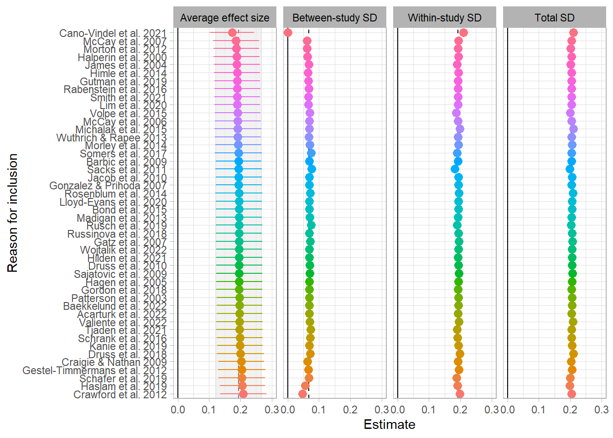

[@Dalgaard2025]


::: {.cell}

```{.r .cell-code}
library(metafor)
library(clubSandwich)
library(tidyverse)
library(patchwork)

source("Helpers.R")

reint_ma_dat <- readRDS("reint_ma_dat.rds")
mental_ma_dat <- readRDS("mental_ma_dat.rds")
gb_dat <- readRDS("Data/gb_dat.rds")
```
:::


# Forest plot for studies reporting both


::: {.cell}

```{.r .cell-code}
rho <- 0.8

reint_mental_studies <- 
  gb_dat |> 
  mutate(
    n_outcomes = n_distinct(outcome_construct),
    .by = study
  ) |> 
  filter(n_outcomes > 1)

reframed_dat <-   
  escalc(yi = gt_pop, vi = vgt_pop, data = reint_mental_studies) |> 
  mutate(n = n(), .by = study) |> 
  aggregate(cluster = study, rho = rho) |> 
  reframe(
    yi = rep(yi, n),
    vi = rep(vi, n),
    .by = study
  ) |> 
  select(-study)


forest_dat <-
  reint_mental_studies |> 
  bind_cols(reframed_dat) |> 
  mutate(
    Est = gt_pop,
    SE = sqrt(vgt_pop),
    
    CI_L = Est - SE * qnorm(.975),
    CI_U = Est + SE * qnorm(.975),
    
    #rma_mean = as.numeric(rma(gt, vgt, data = pick(dplyr::everything()))$b)
    rma_mean = round(yi, 2)
    
  ) |> 
  arrange(rma_mean, study) |> 
  mutate(
    study = factor(study, levels = rev(unique(study)))
  )


total_forest <- 
  forest_dat |>
  ggplot(
    aes(x = Est, y = study, xmin = CI_L, xmax = CI_U,
        color = outcome_construct, alpha = 0.5)
  ) + 
  geom_pointrange(position = position_dodge2(width = 0.5, padding = 0.5)) +
  geom_vline(xintercept = 0, linetype = "solid", color = "black", alpha = 0.5) +
  theme_light() + 
  theme(
    legend.position = "bottom",
    strip.text = element_text(color = "black"),
    axis.title.y=element_blank(),
    plot.caption = element_text(hjust = 0)
  ) + 
  scale_x_continuous(breaks = seq(-3, 3, 0.5)) +
  labs(
    x = "Hedges' g (95% CI)",
    color = "Type of outcome"
  ) +
  guides(
    alpha = "none",
    color = guide_legend(nrow = 1, byrow = TRUE)
    ) 


#png(filename = "Figures/forest plot reint.png", height = 11, width = 10, res = 600, units = "in")
total_forest
```

::: {.cell-output-display}
{fig-pos='H' width=672}
:::

```{.r .cell-code}
#dev.off()
```
:::


# Reintegration

## Impact of $\rho$

::: {.cell}

```{.r .cell-code}
rho_seq <- 0:9/10

rho_dat <- 
  map(rho_seq, ~ .PECHE_RVE(data = reint_ma_dat, rho = .x)) |> 
  list_rbind()

rho_beta_plot <- 
  rho_dat |> 
  mutate(param = "PECHE-RVE") |> 
  ggplot(aes(x = rho, y = avg_effect)) +
  geom_line(aes(color = param), linewidth = 1) +
  #geom_ribbon(aes(ymin = pi_lb, ymax = pi_ub), fill = "grey", alpha = 0.5) +
  geom_ribbon(aes(ymin = LL, ymax = UL, fill = param), alpha = .2) +
  geom_hline(yintercept = 0) +
  geom_vline(xintercept = 0.8, linetype = "dashed") +
  scale_x_continuous(breaks = 0:9/10) + 
  scale_y_continuous(breaks = seq(-1, 1, .1), limits = c(0, 0.4)) +
  theme_light() +
  theme(
    strip.text = element_text(color = "black"),
    legend.position = "none"
  ) + 
  facet_grid(~param) +
  scale_fill_manual(values = "cornflowerblue", name = "fill") +
  scale_color_manual(values = "cornflowerblue") + 
  labs(y = "Effect size", 
       x = expression(Assumed~sampling~correlation~(rho))
  )


rho_var_plot <- 
  rho_dat |> 
  pivot_longer(
    cols = tau:sd_total,
    names_to = "var"
  ) |>  
  arrange(var, rho) |> 
  mutate(
    Variance = case_when(
      var == "omega" ~ "Within-study SD",
      var == "tau" ~ "Between-study SD",
      var == "sd_total" ~ "SD total",
      .default = NA_character_
    ),
    
    Variance = factor(Variance, levels = c("Within-study SD", "Between-study SD", "SD total")),
    
    param = "Variance components"
    
  ) |> 
  ggplot(aes(x = rho, y = value, color = Variance)) +
  geom_line(linewidth = 1) +
  scale_x_continuous(breaks = seq(0,0.9,0.1)) +
  scale_y_continuous(breaks = seq(-1, 1, .1), limits = c(0, 0.4)) +
  scale_color_brewer(type = "qual", palette = 2) +
  geom_hline(yintercept = 0) +
  geom_vline(xintercept = 0.8, linetype = "dashed") +
  facet_grid(~param) +
  theme_light() +
  theme(
    strip.text = element_text(color = "black"),
    legend.title=element_blank(),
    axis.title.y =element_blank(),
    legend.position = c(0.045, 0.9),   # (x, y) in relative coordinates (0–1)
    legend.justification = c(0, 1),    # align legend box to top-left corner
    legend.background = element_rect(fill = "white", color = "grey80"),
    legend.box.background = element_rect(color = "grey60", linewidth = 0.3)
    
  ) + 
  labs(
    x = expression(Assumed~sampling~correlation~(rho)),
    color = "Component"
  )

xlab <- rho_var_plot$labels$x

rho_beta_plot$labels$x <- rho_var_plot$labels$x <- "" 


rho_beta_plot + rho_var_plot
grid::grid.draw(grid::textGrob(xlab, y = 0.05, x = 0.5, rot = 0))
```

::: {.cell-output-display}
{#fig-rho-impact-reint fig-pos='H' width=864}
:::
:::


## Leave one study out

## Impact of effective sample size on total variance


::: {.cell}

```{.r .cell-code}
ess_dat <- 
  reint_ma_dat |> 
  mutate(
    mean_ess = round(mean(ESS_total)),
    .by = study
  ) |> 
  arrange(mean_ess)


data <- ess_dat

sample_seq <- c(0, unique(ess_dat$mean_ess))
studies <- dplyr::n_distinct(data$study)
i <- 1L
filtered_list <- list()

while (i<=35L && studies > 5L){
  
  data <- data |> dplyr::filter(mean_ess > sample_seq[i])
  
  res <- .PECHE_RVE(data = data)
  
  filtered_list[[i]] <- 
    res |> 
    dplyr::select(studies, effects, avg_effect, LL, UL, tau:sd_total) |> 
    dplyr::mutate(
      excl_studies = paste("Studies with ESS above", sample_seq[i]),
      excl_below_ess = sample_seq[i]
    )
  
  studies <- dplyr::n_distinct(data$study)
  i <- i + 1
  
}

ess_res_dat <- 
  filtered_list |> 
  list_rbind() |> 
  mutate(
    study_es_label = paste0(
      studies, " (", effects, "), g = ", round(avg_effect, 2), 
      " [", round(LL, 2), ", ", round(UL, 2), "]"
      
    ),
    
    y_label = paste0(excl_studies, "\n", study_es_label)
    
  )

ess_res_dat_long <- 
  ess_res_dat |> 
  pivot_longer(
    cols = c(avg_effect, tau:sd_total),
    names_to = "parameter",
    values_to = "est"
  ) |> 
  mutate(
    facet_label = case_match(
      parameter,
      "avg_effect" ~ "Average effect size",
      "tau" ~ "Between-study SD",
      "omega" ~ "Within-study SD",
      "sd_total" ~ "Total SD"
    ),
    
    facet_label = factor(
      facet_label,
      levels = c("Average effect size", "Between-study SD", "Within-study SD", "Total SD")
      )
    
    
  ) |> 
  arrange(desc(excl_below_ess)) |> 
  mutate(
    y_label = factor(y_label, levels = unique(y_label)),
    max = 0.3
  )

facet_beta <- 
  ess_res_dat_long |> 
  filter(studies == 46 & facet_label == "Average effect size") |> 
  pivot_wider(
    names_from = "parameter",
    values_from = "est"
  ) |> 
  rename(est = avg_effect) |> 
  mutate(
    parameter = "avg_effect",
    y_label = ess_res_dat$y_label[2]
  ) 
  
facet_sds <- 
  ess_res_dat_long |> 
  filter(studies == 46 & facet_label != "Average effect size") 

facet_errorbar <- 
  ess_res_dat_long |> 
  filter(studies != 46 & parameter == "avg_effect")

ess_facet_plot <- 
  ggplot(filter(ess_res_dat_long, studies != 46), aes(x = est, y = y_label, color = excl_studies)) +
  geom_vline(xintercept = 0) + 
  geom_vline(data = facet_beta, aes(xintercept = est), linetype = "dashed") + 
  geom_rect(data = facet_beta, aes(xmin = LL, xmax = UL, ymin = -Inf, ymax = Inf),
            fill = "gray90", alpha = 0.5, color = "gray90") +
  geom_vline(data = facet_sds, aes(xintercept = est), linetype = "dashed") + 
  geom_blank(aes(x = max)) + 
  geom_point(size = 3) +
  geom_errorbarh(data = facet_errorbar, aes(xmin = LL, xmax = UL), width=0) + 
  facet_grid(~facet_label, scale = "free") + 
  theme_light() +
  theme(legend.position = "none", strip.text = element_text(color = "black")) + 
  labs(x = "Estimate", y = "Reason for inclusion", color = "") 
  
#png(filename = "Figures/Sensitivity analysis/ess_facet_plot.png", height = 8, width = 10, res = 600, units = "in")
ess_facet_plot 
#dev.off()  
```

::: {.cell-output-display}
{#fig-ess-impact-reint fig-pos='H' width=960}
:::
:::


# Mental health


# Colophon

::: {.callout-note icon=false appearance="simple" title="Session Information" collapse=false #session-info}


::: {.cell}
::: {.cell-output .cell-output-stdout}

```
─ Session info ───────────────────────────────────────────────────────────────────────────────────
 setting  value
 version  R version 4.5.1 (2025-06-13 ucrt)
 os       Windows 11 x64 (build 22631)
 system   x86_64, mingw32
 ui       RTerm
 language (EN)
 collate  Danish_Denmark.utf8
 ctype    Danish_Denmark.utf8
 tz       Europe/Copenhagen
 date     2025-10-27
 pandoc   3.6.3 @ C:/RStudio-2025.09.1-401/resources/app/bin/quarto/bin/tools/ (via rmarkdown)
 quarto   NA @ C:\\RSTUDI~1.1-4\\RESOUR~1\\app\\bin\\quarto\\bin\\quarto.exe

─ Packages ───────────────────────────────────────────────────────────────────────────────────────
 package      * version    date (UTC) lib source
 cli            3.6.5      2025-04-23 [1] CRAN (R 4.5.1)
 clubSandwich * 0.6.1      2025-07-30 [1] CRAN (R 4.5.1)
 digest         0.6.37     2024-08-19 [1] CRAN (R 4.5.1)
 dplyr        * 1.1.4      2023-11-17 [1] CRAN (R 4.5.1)
 evaluate       1.0.5      2025-08-27 [1] CRAN (R 4.5.1)
 farver         2.1.2      2024-05-13 [1] CRAN (R 4.5.1)
 fastmap        1.2.0      2024-05-15 [1] CRAN (R 4.5.1)
 forcats      * 1.0.0      2023-01-29 [1] CRAN (R 4.5.1)
 generics       0.1.4      2025-05-09 [1] CRAN (R 4.5.1)
 ggplot2      * 4.0.0      2025-09-11 [1] CRAN (R 4.5.1)
 glue           1.8.0      2024-09-30 [1] CRAN (R 4.5.1)
 gtable         0.3.6      2024-10-25 [1] CRAN (R 4.5.1)
 hms            1.1.3      2023-03-21 [1] CRAN (R 4.5.1)
 htmltools      0.5.8.1    2024-04-04 [1] CRAN (R 4.5.1)
 htmlwidgets    1.6.4      2023-12-06 [1] CRAN (R 4.5.1)
 jsonlite       2.0.0      2025-03-27 [1] CRAN (R 4.5.1)
 knitr          1.50       2025-03-16 [1] CRAN (R 4.5.1)
 labeling       0.4.3      2023-08-29 [1] CRAN (R 4.5.0)
 lattice        0.22-7     2025-04-02 [1] CRAN (R 4.5.1)
 lifecycle      1.0.4      2023-11-07 [1] CRAN (R 4.5.1)
 lubridate    * 1.9.4      2024-12-08 [1] CRAN (R 4.5.1)
 magrittr       2.0.4      2025-09-12 [1] CRAN (R 4.5.1)
 mathjaxr       1.8-0      2025-04-30 [1] CRAN (R 4.5.1)
 Matrix       * 1.7-3      2025-03-11 [1] CRAN (R 4.5.1)
 metadat      * 1.4-0      2025-02-04 [1] CRAN (R 4.5.1)
 metafor      * 4.9-18     2025-09-22 [1] Github (wviechtb/metafor@6cc5a0a)
 nlme           3.1-168    2025-03-31 [1] CRAN (R 4.5.1)
 numDeriv     * 2016.8-1.1 2019-06-06 [1] CRAN (R 4.5.0)
 patchwork    * 1.3.2      2025-08-25 [1] CRAN (R 4.5.1)
 pillar         1.11.1     2025-09-17 [1] CRAN (R 4.5.1)
 pkgconfig      2.0.3      2019-09-22 [1] CRAN (R 4.5.1)
 purrr        * 1.1.0      2025-07-10 [1] CRAN (R 4.5.1)
 R6             2.6.1      2025-02-15 [1] CRAN (R 4.5.1)
 RColorBrewer   1.1-3      2022-04-03 [1] CRAN (R 4.5.0)
 readr        * 2.1.5      2024-01-10 [1] CRAN (R 4.5.1)
 rlang          1.1.6      2025-04-11 [1] CRAN (R 4.5.1)
 rmarkdown      2.29       2024-11-04 [1] CRAN (R 4.5.1)
 rstudioapi     0.17.1     2024-10-22 [1] CRAN (R 4.5.1)
 S7             0.2.0      2024-11-07 [1] CRAN (R 4.5.1)
 sandwich       3.1-1      2024-09-15 [1] CRAN (R 4.5.1)
 scales         1.4.0      2025-04-24 [1] CRAN (R 4.5.1)
 sessioninfo    1.2.3      2025-02-05 [1] CRAN (R 4.5.1)
 stringi        1.8.7      2025-03-27 [1] CRAN (R 4.5.0)
 stringr      * 1.5.2      2025-09-08 [1] CRAN (R 4.5.1)
 tibble       * 3.3.0      2025-06-08 [1] CRAN (R 4.5.1)
 tidyr        * 1.3.1      2024-01-24 [1] CRAN (R 4.5.1)
 tidyselect     1.2.1      2024-03-11 [1] CRAN (R 4.5.1)
 tidyverse    * 2.0.0      2023-02-22 [1] CRAN (R 4.5.1)
 timechange     0.3.0      2024-01-18 [1] CRAN (R 4.5.1)
 tzdb           0.5.0      2025-03-15 [1] CRAN (R 4.5.1)
 vctrs          0.6.5      2023-12-01 [1] CRAN (R 4.5.1)
 withr          3.0.2      2024-10-28 [1] CRAN (R 4.5.1)
 xfun           0.53       2025-08-19 [1] CRAN (R 4.5.1)
 yaml           2.3.10     2024-07-26 [1] CRAN (R 4.5.0)
 zoo            1.8-14     2025-04-10 [1] CRAN (R 4.5.1)

 [1] C:/Users/B199526/AppData/Local/Programs/R/R-4.5.1/library
 * ── Packages attached to the search path.

──────────────────────────────────────────────────────────────────────────────────────────────────
```


:::
:::


:::

