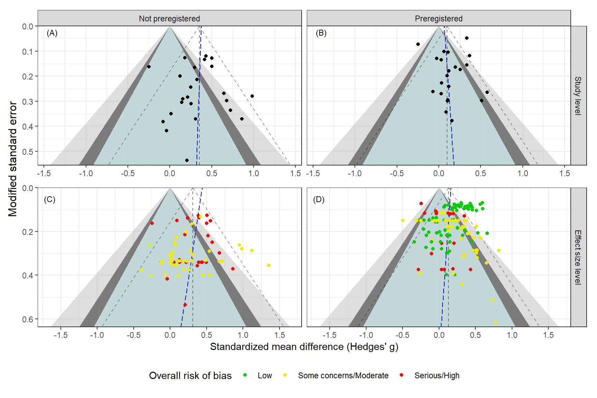
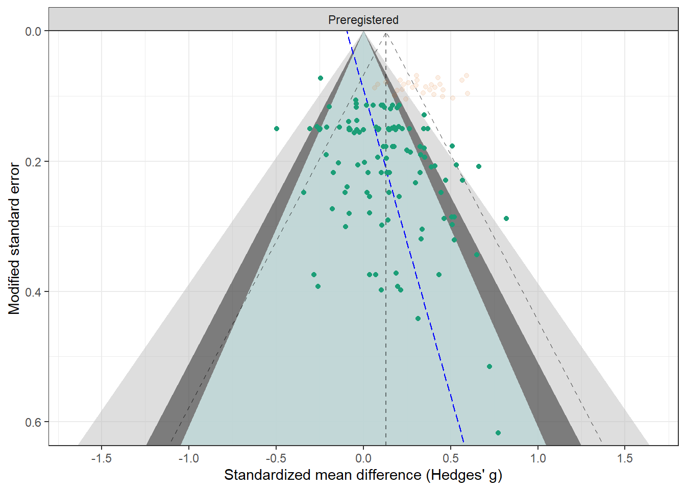
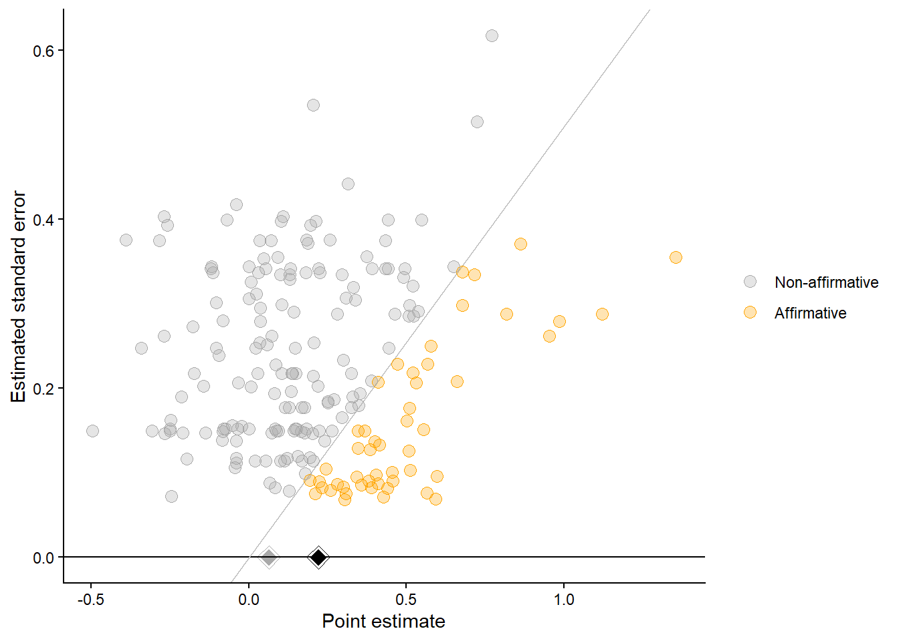
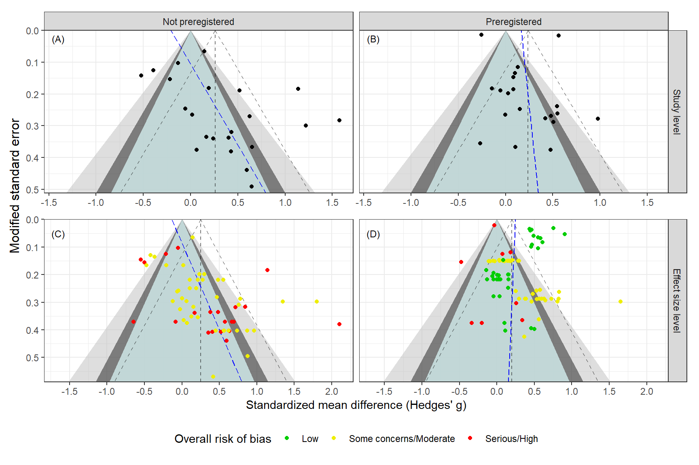
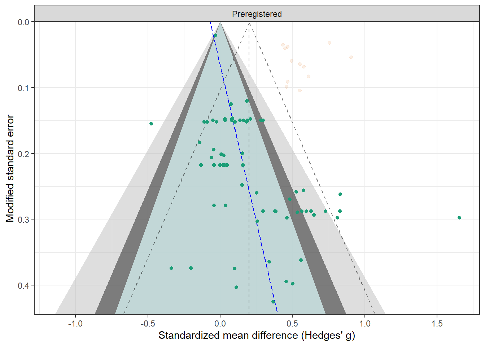
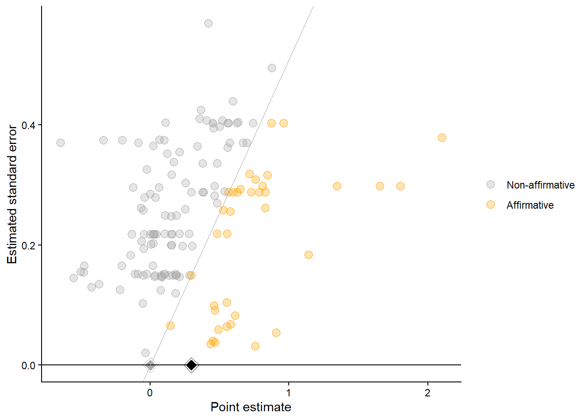
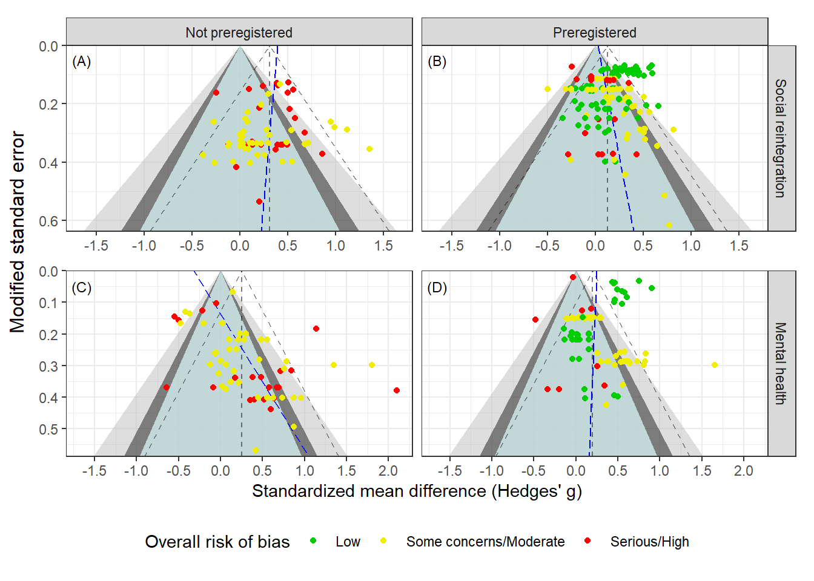

This document contains the publication bias analyses and codes for Dalgaard et al. [-@Dalgaard2026].

# Used package


::: {.cell}

```{.r .cell-code  code-fold="false"}
library(tidyverse)
library(robvis)
library(purrr)
library(metafor)
library(patchwork)
library(clubSandwich)
library(wildmeta)
library(gt)
library(metaselection)
library(DT)
library(kableExtra)
library(ggh4x)
library(future)

library(puniform)
library(PublicationBias)
library(tidyverse) # for tidying
library(janitor)   # for tidying variable names
library(boot)      # for bootstrapping
library(tictoc) 

# Loading in helper function used to calculate effect size and conduct the analysis
source("Helpers.R")
source("pub-bias-test-helpers.R")
```
:::


# **Reintegration**

## Data

::: {.cell}

```{.r .cell-code  code-fold="false"}
reint_ma_dat <- 
  readRDS("reint_ma_dat.rds") |> 
  mutate(
    esid = 1:n(),
    se_gt_pop = sqrt(vgt_pop), 
    Wse_pop = sqrt(Wgt_pop),
    t_i = gt_pop/sqrt(Wgt),
  )

reint_ma_dat$notprereg_I <- as.integer(reint_ma_dat$prereg_chr == "Not preregistered")


#Secondary analysis
#mental_health_dat <- 
#  readRDS("mental_health_dat.rds") |> 
#  mutate(
#    esid = 1:n(),
#    se_gt_pop = sqrt(vgt_pop), 
#    Wse_pop = sqrt(Wgt_pop)
#    )
```
:::


## Funnel plots

::: {.cell}

```{.r .cell-code}
rho <- 0.8

V_mat <- 
  metafor::vcalc(
    data = reint_ma_dat,
    vi = vgt_pop, 
    cluster = study,
    type = outcome_time, 
    grp1 = trt_name,
    w1 = N_t, 
    grp2 = control,
    w2 = N_c, 
    rho = rho
  )

overall_res <- 
  rma.mv(
    gt_pop,
    V = V_mat, 
    random = ~ 1 | study / esid,
    data = reint_ma_dat,
    sparse = TRUE
  ) |> 
  robust(cluster = study, clubSandwich = TRUE)

overall_res

V_mat_outcome <- 
  metafor::vcalc(
    data = reint_ma_dat,
    vi = vgt_pop, 
    cluster = study,
    subgroup = outcome_type,
    type = outcome_time, 
    grp1 = trt_name,
    w1 = N_t, 
    grp2 = control,
    w2 = N_c, 
    rho = rho
  )


sub_res <- 
  rma.mv(
    gt_pop ~ outcome_type - 1,
    V = V_mat_outcome, 
    random = list(~ outcome_type | study, ~ outcome_type | esid),
    struct = c("DIAG", "DIAG"),
    data = reint_ma_dat,
    sparse = TRUE
  ) |> 
  robust(cluster = study, clubSandwich = TRUE)

sub_res

# Mental health
# MHV: Conduct these tests, when the main analyses has been made

#V_mat_mental <- metafor::vcalc(
#    data = mental_health_dat,
#    vi = vgt_pop, 
#    cluster = study,
#    type = outcome_time, 
#    grp1 = trt_name,
#    w1 = N_t, 
#    grp2 = control,
#    w2 = N_c, 
#    rho = rho
#  )
#
#overall_res_mental <- 
#  rma.mv(
#    gt_pop ~ + 1,
#    V = V_mat_mental, 
#    random = ~ 1 | study / esid,
#    data = mental_health_dat,
#    sparse = TRUE
#  ) |> 
#  robust(cluster = study, clubSandwich = TRUE)
#
#overall_res_mental
#
#sub_res_mental <- 
#  rma.mv(
#    gt_pop ~ -1 + analysis_plan,
#    V = V_mat_mental, 
#    random = list(~ analysis_plan | study, ~ analysis_plan | esid),
#    struct = c("DIAG", "DIAG"),
#    data = mental_health_dat,
#    sparse = TRUE
#  )
#
#sub_res_mental
```
:::


### Overall 


::: {.cell}

```{.r .cell-code}
## Overall average effect

rho <- 0.8

# CHE-ISCW
V_mat_mod <- metafor::vcalc(
  data = reint_ma_dat,
  vi = Wgt_pop, 
  cluster = study,
  type = outcome_time, 
  grp1 = trt_name,
  w1 = N_t, 
  grp2 = control,
  w2 = N_c, 
  rho = rho
)

W <- solve(V_mat_mod)

# CHE
che <- 
  rma.mv(
    yi = gt_pop,
    V = V_mat_mod,
    random = ~ 1 | study / esid,
    data = reint_ma_dat,
    sparse = TRUE
  ) |> 
  robust(cluster = study, clubSandwich = TRUE)

# ISCW

# CHE-ISCW-RVE - Not used as we have few large studies (c.f., Chen & Pustejovsky, 2026)
#che_iscw <- 
#  rma.mv(
#    yi = gt_pop,
#    V = V_mat_mod,
#    W = W, 
#    mods = ~ prereg_chr + Wse_pop - 1,
#    random = ~ 1 | study / esid,
#    data = reint_ma_dat,
#    sparse = TRUE
#  ) |> 
#  robust(cluster = study, clubSandwich = TRUE)


## Preregistered vs. not preregistered 

prereg_dat <-  
  reint_ma_dat |> 
  filter(conventional == 0)

V_mat_prereg <- 
  metafor::vcalc(
    data = prereg_dat,
    vi = Wgt_pop, 
    cluster = study,
    type = outcome_time, 
    grp1 = trt_name,
    w1 = N_t, 
    grp2 = control,
    w2 = N_c, 
    rho = rho
  )

#W_prereg <- solve(V_mat_prereg)

egg_prereg <-
  rma.mv(
    yi = gt_pop,
    V = V_mat_prereg,
    #W = W_prereg, Not used as we have few large studies (c.f., Chen & Pustejovsky, 2026)
    mods = ~ Wse_pop,
    random = ~ 1 | study / esid,
    data = prereg_dat,
    sparse = TRUE
  ) |> 
  robust(cluster = study, clubSandwich = TRUE)

egg_prereg_res <- 
  tibble(
    subgroup = "Preregistered",
    egg_intercept = as.numeric(egg_prereg$b[1]),
    egg_slope = as.numeric(egg_prereg$b[2])
  )

notprereg_dat <-  
  reint_ma_dat |> 
  filter(conventional == 1)


V_mat_notprereg <-  
  metafor::vcalc(
    data = notprereg_dat,
    vi = Wgt_pop, 
    cluster = study,
    type = outcome_time, 
    grp1 = trt_name,
    w1 = N_t, 
    grp2 = control,
    w2 = N_c, 
    rho = rho
  )

#W_notprereg <- solve(V_mat_notprereg)

egg_notprereg <-
  rma.mv(
    yi = gt_pop,
    V = V_mat_notprereg,
    #W = W_notprereg, Not used as we have few large studies (c.f., Chen & Pustejovsky, 2026)
    mods = ~ Wse_pop,
    random = ~ 1 | study / esid,
    data = notprereg_dat,
    sparse = TRUE
  ) |> 
  robust(cluster = study, clubSandwich = TRUE)


egg_notprereg_res <- 
  tibble(
    subgroup = "Not preregistered",
    egg_intercept = as.numeric(egg_notprereg$b[1]),
    egg_slope = as.numeric(egg_notprereg$b[2])
  )

egg_res_subgrouped <- bind_rows(egg_prereg_res, egg_notprereg_res)
egg_res_subgrouped
```

::: {.cell-output .cell-output-stdout}

```
# A tibble: 2 × 3
  subgroup          egg_intercept egg_slope
  <chr>                     <dbl>     <dbl>
1 Preregistered            0.0295     0.584
2 Not preregistered        0.392     -0.268
```


:::

```{.r .cell-code}
# PESCE+ model

prereg_arg <- 
  .rma_arg_tbl(
    yi = "gt_pop", 
    vi = "vgt_pop", 
    covars = "prereg_chr",
    model = "SCEp",
    r = 0.8, 
    data = reint_ma_dat,
    type = "categorical"
  ); prereg_arg
```

::: {.cell-output .cell-output-stdout}

```
# A tibble: 1 × 10
  formula   es     var     subgrp     rand       structure   rho data                 model table   
  <list>    <chr>  <chr>   <chr>      <list>     <list>    <dbl> <list>               <chr> <chr>   
1 <formula> gt_pop vgt_pop prereg_chr <list [2]> <chr [2]>   0.8 <tibble [205 × 107]> SCEp  categor…
```


:::

```{.r .cell-code}
# PESCEp+ 
subgroup_means <- pmap(.l = prereg_arg, .f = .PESCE_RVE) |> list_rbind()

#subgroup_means <- .SCEp(mod = prereg_chr, data = reint_ma_dat)

subgroup_dat <- 
  reint_ma_dat |> 
  summarise(
    gt_pop = mean(gt_pop),
    Wse_pop = mean(Wse_pop),
    outcome_type = outcome_type[1],
    .by = prereg_chr
  ) |> 
  bind_cols(subgroup_means[c(3,2), c(2, 14:18)], egg_res_subgrouped) |> 
  mutate(slope_low = qnorm(0.025), slope_high = qnorm(0.975), level = "Effect size level") 


y_lim_exp1 <- max(reint_ma_dat$Wse_pop) + 0.02 

funnel_exp1 <-  tribble(
  ~ x90, ~ x95, ~ x99, ~ y,
  0,     0,     0,     0,
  qnorm(0.05) * y_lim_exp1, qnorm(0.025) * y_lim_exp1, qnorm(0.005) * y_lim_exp1, y_lim_exp1,
  qnorm(0.95) * y_lim_exp1, qnorm(0.975) * y_lim_exp1, qnorm(0.995) * y_lim_exp1, y_lim_exp1,
  0,     0,     0,     0
) 


df_text_es <- 
  reint_ma_dat |> 
  summarise(
    Wse_pop = mean(Wse_pop),
    gt_pop = mean(gt_pop),
    level = "Effect size level",
    .by = prereg_chr
  ) |> 
  mutate(
  label = paste0("(",LETTERS[c(4,3)],")"),
  report_bias = "Low"
)


alpha_line <- 0.5
polygon_fill <- c("grey", "grey10", "lightcyan")
mean_line <- "dashed"
reg_test <- TRUE
reg_line <- "longdash"
reg_color <- "blue"
breaks_y <- seq(-3, 3, 0.5)


es_level_fp <- 
  reint_ma_dat |> 
  mutate(
    level = "Effect size level",
    report_bias = case_when(
      rob_tool == "RoB2" & D5 == "Low" ~ "Low",
      rob_tool == "RoB2" & str_detect(D5, "Some") ~ "Moderate",
      rob_tool == "RoB2" & str_detect(D5, "High") ~ "Serious",
      .default = D7
    ),
    
    report_bias = factor(report_bias, levels =  c("Low", "Moderate", "Serious"))
    
  ) |> 
  ggplot() + 
  geom_polygon(data = funnel_exp1, aes(x = y, y = x99), fill = polygon_fill[1], alpha = 0.5) + 
  geom_polygon(data = funnel_exp1, aes(x = y, y = x95), fill = polygon_fill[2], alpha = 0.5) + 
  geom_polygon(data = funnel_exp1, aes(x = y, y = x90), fill = polygon_fill[3], alpha = 0.7) + 
  geom_abline(data = subgroup_dat, aes(slope = slope_high, intercept = avg_effect), linetype = mean_line, alpha = alpha_line) + 
  geom_hline(data = subgroup_dat, aes(yintercept = avg_effect), linetype = mean_line, alpha = alpha_line) +  
  geom_abline(data = subgroup_dat, aes(slope = slope_low, intercept = avg_effect), linetype = mean_line, alpha = alpha_line) + 
  geom_abline(data = subgroup_dat, aes(slope = -egg_slope, intercept = egg_intercept), linetype = reg_line, color = reg_color) +
  geom_text(
    data = df_text_es, 
    aes(x = 0.05, y = -1.65, label = label, shape = NULL, color = NULL), 
    size = 3, 
    color = "black"
  ) +
  geom_point(aes(Wse_pop, gt_pop, color = overall_rob), alpha = 1, size = 1.5) +
  coord_flip() +
  facet_grid(level~prereg_chr) +
  scale_x_reverse(limits = c(y_lim_exp1, 0.0), expand = c(0,0)) + 
  scale_y_continuous(breaks = breaks_y) + 
  scale_color_manual(
    values = c("Low" = "green3", "Some concerns/Moderate" = "yellow2", "Serious/High" = "red")
  ) + 
  theme_bw() + 
  labs(x = "Modified standard error", 
       y = "Standardized mean difference (Hedges' g)", 
       color = "", shape = "") +
  theme(
    legend.position = "bottom",
    strip.text.x = element_blank()
  ) +
  labs(color = "Overall risk of bias") +
  guides(col = guide_legend(nrow = 1))


# Make aggregate plot

reint_dat_agg <- 
  reint_ma_dat |> 
  escalc(measure = "SMD", yi = gt_pop, vi = Wgt_pop, data = _) |> 
  aggregate.escalc(cluster = study, rho = 0.8) |> 
  mutate(
    Wse_pop = sqrt(vi)
  )

prereg_dat_agg <-  
  reint_dat_agg |> 
  as_tibble() |> 
  dplyr::filter(conventional == 0)

egg_prereg_agg <- 
  rma(yi = yi, vi = vi, data = prereg_dat_agg, control=list(stepadj=0.5, maxiter=1000)) |> 
  regtest()

egg_prereg_agg_res <- 
  tibble(
    subgroup = "Preregistered",
    egg_intercept = as.numeric(egg_prereg_agg$fit$b[1]),
    egg_slope = as.numeric(egg_prereg_agg$fit$b[2])
  )

notprereg_dat_agg <-  
  reint_dat_agg |> 
  as_tibble() |> 
  dplyr::filter(conventional == 1)

egg_notprereg_agg <- 
  rma(yi = yi, vi = vi, data = notprereg_dat_agg) |> 
  regtest()

egg_notprereg_agg_res <- 
  tibble(
    subgroup = "Not preregistered",
    egg_intercept = as.numeric(egg_notprereg_agg$fit$b[1]),
    egg_slope = as.numeric(egg_notprereg_agg$fit$b[2])
  )

egg_res_agg_subgrouped <- bind_rows(egg_notprereg_agg_res, egg_prereg_agg_res)


means_agg <- 
  rma(yi, vi, mods = ~ prereg_chr - 1, data = reint_dat_agg) |> 
  robust(cluster = study, clubSandwich = TRUE)

subgroup_means_agg <- 
  tibble(
    Moderator = c("Not preregistered", "Preregistered"),
    avg_effect = as.numeric(means_agg$b), 
    LL = as.numeric(means_agg$ci.lb), 
    UL = as.numeric(means_agg$ci.ub)
  )

subgroup_dat_agg <- 
  reint_dat_agg |> 
  summarise(
    gt_pop = mean(gt_pop),
    Wse_pop = mean(Wse_pop),
    outcome_type = outcome_type[1],
    .by = prereg_chr
  ) |> 
  arrange(prereg_chr) |> 
  bind_cols(subgroup_means_agg, egg_res_agg_subgrouped) |> 
  mutate(slope_low = qnorm(0.025), slope_high = qnorm(0.975), level = "Study level") 


#subgroup_dat <- 
#  reintergation_dat |> 
#  summarise(
#    gt = mean(gt),
#    Wse = mean(Wse),
#    analysis_plan = analysis_plan[1],
#    .by = prereg_chr
#  ) |> 
#  bind_cols(subgroup_means[2:3,], egg_res_subgrouped) |> 
#  mutate(slope_low = qnorm(0.025), slope_high = qnorm(0.975), level = "Effect size level") 


y_lim_exp2 <- max(reint_dat_agg$Wse_pop) + 0.02 
y_lim_exp2  
```

::: {.cell-output .cell-output-stdout}

```
[1] 0.5555445
```


:::

```{.r .cell-code}
funnel_exp2 <-  tribble(
  ~ x90, ~ x95, ~ x99, ~ y,
  0,     0,     0,     0,
  qnorm(0.05) * y_lim_exp2, qnorm(0.025) * y_lim_exp2, qnorm(0.005) * y_lim_exp2, y_lim_exp2,
  qnorm(0.95) * y_lim_exp2, qnorm(0.975) * y_lim_exp2, qnorm(0.995) * y_lim_exp2, y_lim_exp2,
  0,     0,     0,     0
) 

df_text <- 
  reint_dat_agg |> 
  summarise(
    Wse_pop = mean(Wse_pop),
    gt_pop = mean(gt_pop),
    level = "Study level",
    .by = prereg_chr
  ) |> 
  mutate(
  label = paste0("(",LETTERS[c(2,1)],")")
)


study_level_fp <- 
  reint_dat_agg |> 
  mutate(level = "Study level") |> 
  ggplot() + 
  geom_polygon(data = funnel_exp2, aes(x = y, y = x99), fill = polygon_fill[1], alpha = 0.5) + 
  geom_polygon(data = funnel_exp2, aes(x = y, y = x95), fill = polygon_fill[2], alpha = 0.5) + 
  geom_polygon(data = funnel_exp2, aes(x = y, y = x90), fill = polygon_fill[3], alpha = 0.7) + 
  geom_abline(data = subgroup_dat_agg, aes(slope = slope_high, intercept = avg_effect), linetype = mean_line, alpha = alpha_line) + 
  geom_hline(data = subgroup_dat_agg, aes(yintercept = avg_effect), linetype = mean_line, alpha = alpha_line) +  
  geom_abline(data = subgroup_dat_agg, aes(slope = slope_low, intercept = avg_effect), linetype = mean_line, alpha = alpha_line) + 
  geom_abline(data = subgroup_dat_agg, aes(slope = -egg_slope, intercept = egg_intercept), linetype = reg_line, color = reg_color) +
  geom_text(
    data = df_text, 
    aes(x = 0.025, y = -1.4, label = label, shape = NULL, color = NULL), 
    size = 3, 
    color = "black"
  ) +
  geom_point(aes(Wse_pop, gt_pop), alpha = 1, size = 1.5) +
  scale_color_brewer(type = "qual", palette = 2) + 
  coord_flip() +
  facet_grid(level~prereg_chr) +
  scale_x_reverse(limits = c(y_lim_exp2, 0.0), expand = c(0,0)) + 
  scale_y_continuous(breaks = breaks_y) + 
  theme_bw() +
  theme(
    axis.title = element_blank()
  )

ylab <- es_level_fp$labels$x

study_level_fp$labels$x <- es_level_fp$labels$x <- "" 

#png("Figures/funnel plots (overall effect) across type of registration.png", width = 6.5, height = 5, res = 300, unit = "in")
study_level_fp / es_level_fp
grid::grid.draw(grid::textGrob(ylab, y = 0.6, x = 0.02, rot = 90))
#dev.off()
```

::: {.cell-output-display}
{#fig-reint-overall-fp fig-pos='H' width=864}
:::
:::


### Investigating the impact of Cano-Vindel et al.


::: {.cell}

```{.r .cell-code}
prereg_dat_cano <-  
  reint_ma_dat |> 
  filter(conventional == 0) |>
  mutate(
    cano_vindel = if_else(str_detect(study, "Cano"), 1, 0),
    cano_vindel = factor(cano_vindel)
  )

V_mat_prereg_cano <- 
  metafor::vcalc(
    data = prereg_dat_cano,
    vi = Wgt_pop, 
    cluster = study,
    type = outcome_time, 
    grp1 = trt_name,
    w1 = N_t, 
    grp2 = control,
    w2 = N_c, 
    rho = rho
  )

#W_prereg_cano <- solve(V_mat_prereg_cano)

egg_prereg_cano <-
  rma.mv(
    yi = gt_pop,
    V = V_mat_prereg_cano,
    #W = W_prereg_cano, Not used as we have few large studies (c.f., Chen & Pustejovsky, 2026)
    mods = ~ Wse_pop + cano_vindel,
    random = ~ 1 | study / esid,
    data = prereg_dat_cano,
    sparse = TRUE
  ) |> 
  robust(cluster = study, clubSandwich = TRUE)

egg_prereg_res_cano <- 
  tibble(
    subgroup = "Preregistered",
    egg_intercept = as.numeric(egg_prereg_cano $b[1]),
    egg_slope = as.numeric(egg_prereg_cano$b[2])
  )


subgroup_dat_cano <- 
  prereg_dat_cano |> 
  summarise(
    gt_pop = mean(gt_pop),
    Wse = mean(Wse_pop),
    outcome_type = outcome_type[1],
    .by = prereg_chr
  ) |> 
  bind_cols(subgroup_means[3, c(2, 14:18)], egg_prereg_res_cano) |> 
  mutate(slope_low = qnorm(0.025), slope_high = qnorm(0.975)) 


y_lim_exp_cano <- max(prereg_dat_cano$Wse_pop) + 0.02 
y_lim_exp_cano  
```

::: {.cell-output .cell-output-stdout}

```
[1] 0.6371993
```


:::

```{.r .cell-code}
funnel_exp_cano <-  tribble(
  ~ x90, ~ x95, ~ x99, ~ y,
  0,     0,     0,     0,
  qnorm(0.05) * y_lim_exp_cano, qnorm(0.025) * y_lim_exp_cano, qnorm(0.005) * y_lim_exp_cano, y_lim_exp_cano,
  qnorm(0.95) * y_lim_exp_cano, qnorm(0.975) * y_lim_exp_cano, qnorm(0.995) * y_lim_exp_cano, y_lim_exp_cano,
  0,     0,     0,     0
) 


alpha_line <- 0.5
polygon_fill <- c("grey", "grey10", "lightcyan")
mean_line <- "dashed"
reg_test <- TRUE
reg_line <- "longdash"
reg_color <- "blue"
breaks_y <- seq(-3, 3, 0.5)


cano_fp <- 
  prereg_dat_cano |> 
  mutate(alpha_val = if_else(cano_vindel == 1, 0.9, 1)) |>
  ggplot() + 
  geom_polygon(data = funnel_exp_cano, aes(x = y, y = x99), fill = polygon_fill[1], alpha = 0.5) + 
  geom_polygon(data = funnel_exp_cano, aes(x = y, y = x95), fill = polygon_fill[2], alpha = 0.5) + 
  geom_polygon(data = funnel_exp_cano, aes(x = y, y = x90), fill = polygon_fill[3], alpha = 0.7) + 
  geom_abline(data = subgroup_dat_cano, aes(slope = slope_high, intercept = avg_effect), linetype = mean_line, alpha = alpha_line) + 
  geom_hline(data = subgroup_dat_cano, aes(yintercept = avg_effect), linetype = mean_line, alpha = alpha_line) +  
  geom_abline(data = subgroup_dat_cano, aes(slope = slope_low, intercept = avg_effect), linetype = mean_line, alpha = alpha_line) + 
  geom_abline(data = subgroup_dat_cano, aes(slope = -egg_slope, intercept = egg_intercept), linetype = reg_line, color = reg_color) +
  geom_point(aes(Wse_pop, gt_pop, col = cano_vindel, alpha = alpha_val), size = 1.5) +
  scale_color_brewer(type = "qual", palette = 2) + 
  coord_flip() +
  facet_grid(~prereg_chr) +
  scale_x_reverse(limits = c(y_lim_exp_cano, 0.0), expand = c(0,0)) + 
  scale_y_continuous(breaks = breaks_y) + 
  theme_bw() + 
  labs(x = "Modified standard error", 
       y = "Standardized mean difference (Hedges' g)", 
       color = "", shape = "") +
  theme(
    legend.position = "bottom"
  ) +
  labs(color = "Cano-vindel") +
  guides(col = "none", alpha = "none")

#png("plots/funnel plots (overall effect) without Cano-Vindel.png", width = 8, height = 5.5, res = 300, unit = "in")
cano_fp
```

::: {.cell-output-display}
{fig-pos='H' width=672}
:::

```{.r .cell-code}
#dev.off()
```
:::


### Funnel plot across outcomes


## Publication bias tests

::: {.cell}

```{.r .cell-code}
.pubbias_overall_tab <- 
  function(
    rma_obj, 
    test,
    studies = n_distinct(reint_ma_dat$study), 
    effects = nrow(reint_ma_dat),
    lambda = NA_real_
  ){
    
    tibble(
    test = test,
    J = studies,
    K = effects,
    est_ci = paste0(
      round(as.numeric(rma_obj$b[1]), 3), 
      " [", 
      round(rma_obj$ci.lb[1], 3),
      ", ",
      round(rma_obj$ci.ub[1], 3),
      "]"
    ),
    pval = rma_obj$pval[1],
    tau = round(sqrt(rma_obj$sigma2[1]), 3),
    omega = round(sqrt(rma_obj$sigma2[2]), 3),
    total_SD = round(sqrt(sum(rma_obj$sigma2)), 3),
    lambda1 = lambda,
    lambda2 = lambda
  )

}
```
:::


### HYEMA


::: {.cell}

```{.r .cell-code}
hyema_overall <- readRDS("Bootstrap results/hyema_overall_reint.rds")

# Overall res (Robust HYEMA)
hyema_tab_res <- 
  tibble(
    test = "Robust HYEMA",
    J = n_distinct(reint_ma_dat$study),
    K = nrow(reint_ma_dat),
    est_ci = paste0(
      round(as.numeric(hyema_overall$Est[1]), 3), 
      " [", 
      round(hyema_overall$CIL_bootstrap[1], 3),
      ", ",
      round(hyema_overall$CIU_bootstrap[2], 3),
      "]"
    ),
    pval = NA_real_,
    tau = round(hyema_overall$Est[2], 3),
    omega = NA_real_,
    total_SD = hyema_overall$Est[2],
    lambda1 = NA_real_,
    lambda2 = NA_real_
  )

# HYEMA across outcome
hyema_outcome <- readRDS("Bootstrap results/hyema_overcome.rds")
hyema_outcome_f_stat <- readRDS("Bootstrap results/F_boot_pval_outcome.rds")

# To temporarily get tau
hyema_obj <- 
  puniform::hybrid(
    yi = reint_ma_dat$gt_pop, 
    vi = reint_ma_dat$Wgt_pop, 
    conventional = reint_ma_dat$conventional, 
    side = "right",
    mods = ~ reint_ma_dat$outcome_type -1
  ) |> 
  suppressWarnings()

hyema_outcome_tab <- 
  tibble(
    coefficient = c(
      hyema_outcome$Parameter, 
      "Wald test p value", "lambda1", "lambda2", "tau", "omega", "Total SD", "Studies", "Effects"),
    est_ci = c(
      paste0(
        round(as.numeric(hyema_outcome$Est), 3), 
        " [", 
        round(hyema_outcome$CIL_bootstrap, 3),
        ", ",
        round(hyema_outcome$CIU_bootstrap, 3),
        "]"
      ),
      as.character(round(hyema_outcome_f_stat, 3)),
      NA_character_,
      NA_character_,
      as.character(round(sqrt(hyema_obj$tau2), 3)),
      NA_character_,
      as.character(round(sqrt(hyema_obj$tau2), 3)),
      as.character(n_distinct(reint_ma_dat$study)),
      as.character(nrow(reint_ma_dat))
    ),
    
    method = "hyema"
    
  )
```
:::


### Puniform*


::: {.cell}

```{.r .cell-code}
# Not corrected for clustering as it has showed acceptable performance in
# dependent effect size data
puniform_star_res <- 
  puniform::puni_star(
    tobs = reint_ma_dat$t_i, 
    n1i = reint_ma_dat$N_t, 
    n2i = reint_ma_dat$N_c, 
    side = "right"
  )

puniform_tab_res <- 
  tibble(
    test = "puniform star",
    J = n_distinct(reint_ma_dat$study),
    K = nrow(reint_ma_dat),
    est_ci = paste0(
      round(as.numeric(puniform_star_res$est), 3), 
      " [", 
      round(puniform_star_res$ci.lb, 3),
      ", ",
      round(puniform_star_res$ci.ub, 3),
      "]"
    ),
    pval = puniform_star_res$pval.0,
    tau = round(sqrt(puniform_star_res$tau2), 3),
    omega = NA_real_,
    total_SD = tau,
    lambda1 = NA_real_,
    lambda2 = NA_real_
  )
```
:::


### Worst-case meta-analysis


::: {.cell}

```{.r .cell-code}
worst_dat_reint <- 
  reint_ma_dat |>  
  mutate(
    pval = 2 * ( 1 - pnorm( abs(gt_pop) / sqrt(vgt_pop) ) ),
    affirmativity = if_else(pval < .05 & gt_pop > 0, "affirmative", "nonaffirmative")
    
  ) %>% 
  filter(affirmativity == "nonaffirmative")

#saveRDS(worst_dat_reint, file = "Data/worst_dat_reint.RDS")

wc_prereg_studies <- 
  worst_dat_reint |> 
  summarise(
    n = n(), 
    .by = c(prereg_chr, study)
  ) |> 
  summarise(
    n_studies = n(),
    .by = prereg_chr
  ) |> 
  arrange(prereg_chr)

wc_prereg_es <- 
  worst_dat_reint |> 
  summarise(n_effects = n(), .by = prereg_chr) |> 
  arrange(prereg_chr) 

# Outcome
wc_outcome_studies <- 
  worst_dat_reint |> 
  summarise(
    n = n(), 
    .by = c(outcome_type, study)
  ) |> 
  summarise(
    n_studies = n(),
    .by = outcome_type
  ) |> 
  arrange(outcome_type)

wc_outcome_es <- 
  worst_dat_reint |> 
  summarise(n_effects = n(), .by = outcome_type) |> 
  arrange(outcome_type) 
```
:::


::: {.cell}

```{.r .cell-code}
res_PubBias <- 
  pubbias_svalue(
  yi = reint_ma_dat$gt_pop,
  vi = reint_ma_dat$Wgt_pop,
  cluster = reint_ma_dat$study,
  q = 0,
  model_type = "robust",
  favor_positive = TRUE,
  return_worst_meta = TRUE
)

res_PubBias$stats
```

::: {.cell-output .cell-output-stdout}

```
# A tibble: 1 × 2
  sval_est     sval_ci     
  <chr>        <chr>       
1 Not possible Not possible
```


:::

```{.r .cell-code}
rho <- 0.8

pubbias_plot <- 
  PublicationBias::significance_funnel(
  yi = reint_ma_dat$gt_pop,
  vi = reint_ma_dat$Wgt_pop,
  favor_positive = TRUE,
  alpha_select = 0.05
)

pubbias_plot
```

::: {.cell-output-display}
{fig-pos='H' width=672}
:::
:::


::: {.cell}

```{.r .cell-code}
#wc = worst_case
V_mat_wc <- 
  metafor::vcalc(
    data = worst_dat_reint,
    vi = vgt_pop, 
    cluster = study,
    type = outcome_time, 
    grp1 = trt_name,
    w1 = N_t, 
    grp2 = control,
    w2 = N_c, 
    rho = rho
  )

#############
# Overall res
#############

wc_overall <- 
  rma.mv(
    gt_pop,
    V = V_mat_wc, 
    random = ~ 1 | study / esid,
    data = worst_dat_reint,
    sparse = TRUE
  ) |> 
  robust(cluster = study, clubSandwich = TRUE)

wc_overall
```

::: {.cell-output .cell-output-stdout}

```

Multivariate Meta-Analysis Model (k = 157; method: REML)

Variance Components:

            estim    sqrt  nlvls  fixed      factor 
sigma^2.1  0.0000  0.0000     40     no       study 
sigma^2.2  0.0223  0.1492    157     no  study/esid 

Test for Heterogeneity:
Q(df = 156) = 472.3043, p-val < .0001

Number of estimates:   157
Number of clusters:    40
Estimates per cluster: 1-16 (mean: 3.92, median: 3)

Model Results:

estimate      se¹    tval¹     df¹    pval¹   ci.lb¹   ci.ub¹     
  0.0775  0.0252   3.0705   20.36   0.0059   0.0249   0.1301   ** 

---
Signif. codes:  0 '***' 0.001 '**' 0.01 '*' 0.05 '.' 0.1 ' ' 1

1) results based on cluster-robust inference (var-cov estimator: CR2,
   approx t-test and confidence interval, df: Satterthwaite approx)
```


:::

```{.r .cell-code}
wc_tab_res <- 
  .pubbias_overall_tab(rma_obj = wc_overall, test = "Worst case") |> 
  mutate(
    J = n_distinct(worst_dat_reint$study),
    K = nrow(worst_dat_reint)
  )

###########
# Pregreg
###########

wc_prereg_raw <- 
  rma.mv(
    gt_pop ~ prereg_chr - 1,
    V = V_mat_wc, 
    random = ~ 1 | study / esid,
    data = worst_dat_reint,
    sparse = TRUE
  ) 

wc_prereg <- 
  wc_prereg_raw |> 
  robust(cluster = study, clubSandwich = TRUE)

#tic()
#plan(multisession)
#wc_prereg_cwb <- 
#  wildmeta::Wald_test_cwb(
#    full_model = wc_prereg_raw,
#    constraints = constrain_equal(1:2),
#    R = 1999
#  )
#plan(sequential)
#toc()
#
#saveRDS(wc_prereg_cwb, "Bootstrap results/wc_prereg_cwb.rds")
wc_prereg_cwb <- readRDS("Bootstrap results/wc_prereg_cwb.rds")

wc_prereg_tab <- 
   tibble(
    coefficient = c(
      "Not preregistered", "Preregistered", 
      "Wald test p value", "lambda1", "lambda2", "tau", "omega", "Total SD", "Studies", "Effects"
      ),
    est_ci = c(
      paste0(
        round(as.numeric(wc_prereg$b[1:2]), 3), 
        " [", 
        round(wc_prereg$ci.lb[1:2], 3),
        ", ",
        round(wc_prereg$ci.ub[1:2], 3),
        "]"
      ),
      as.character(round(wc_prereg_cwb$p_val, 3)),
      NA_character_,
      NA_character_,
      as.character(round(sqrt(wc_prereg$sigma2[1]), 3)),
      as.character(round(sqrt(wc_prereg$sigma2[2]), 3)),
      as.character(round(sqrt(sum(wc_prereg$sigma2)), 3)),
      as.character(n_distinct(worst_dat_reint$study)),
      as.character(nrow(worst_dat_reint))
    ),
    
    method = "worstcase"
    
  )

# Sensitivity analysis of prereg using the PESCE+ model. 
V_mat_wc_prereg <- 
  metafor::vcalc(
    data = worst_dat_reint,
    vi = vgt_pop, 
    cluster = study,
    subgroup = prereg_chr,
    type = outcome_time, 
    grp1 = trt_name,
    w1 = N_t, 
    grp2 = control,
    w2 = N_c, 
    rho = rho
  )

wc_prereg_raw_sensi <- 
  rma.mv(
    gt_pop ~ prereg_chr - 1,
    V = V_mat_wc_prereg, 
    random = list(~ prereg_chr | study, ~ prereg_chr | esid),
    struct = c("DIAG", "DIAG"),
    data = worst_dat_reint,
    sparse = TRUE
  ) 

wc_prereg_sensi <- 
  wc_prereg_raw_sensi |> 
  robust(cluster = study, clubSandwich = TRUE)

############
# wc outcome
############
wc_outcome_raw <- 
  rma.mv(
    gt_pop ~ outcome_type + prereg_c - 1,
    V = V_mat_wc, 
    random = ~ 1 | study / esid,
    data = worst_dat_reint,
    sparse = TRUE
  ) 

wc_outcome <- 
  wc_outcome_raw |> 
  robust(cluster = study, clubSandwich = TRUE)

# CWB
#tic()
#plan(multisession, workers = 7L)
#wc_outcome_cwb <- 
#  wildmeta::Wald_test_cwb(
#    full_model = wc_outcome_raw,
#    constraints = constrain_equal(1:7),
#    R = 1999
#  )
#plan(sequential)
#toc()
#
#saveRDS(wc_outcome_cwb, "Bootstrap results/wc_outcome_cwb.rds")
wc_outcome_cwb <- readRDS("Bootstrap results/wc_outcome_cwb.rds")

wc_outcome_tab <- 
  tibble(
    coefficient = c(
      hyema_outcome$Parameter, 
      "Wald test p value", "lambda1", "lambda2", "tau", "omega", "Total SD", "Studies", "Effects"
      ),
    est_ci = c(
      paste0(
        round(as.numeric(wc_outcome$b[-8]), 3), 
        " [", 
        round(wc_outcome$ci.lb[-8], 3),
        ", ",
        round(wc_outcome$ci.ub[-8], 3),
        "]"
      ),
      as.character(round(wc_outcome_cwb$p_val, 3)),
      NA_character_,
      NA_character_,
      as.character(round(sqrt(wc_outcome$sigma2[1]), 3)),
      as.character(round(sqrt(wc_outcome$sigma2[2]), 3)),
      as.character(round(sqrt(sum(wc_outcome$sigma2)), 3)),
      as.character(n_distinct(worst_dat_reint$study)),
      as.character(nrow(worst_dat_reint))
    ),
    
    method = "worstcase"
    
  )

# Sensitivity analyses using the PESCE+ model
V_mat_wc_outcome <- 
  metafor::vcalc(
    data = worst_dat_reint,
    vi = vgt_pop, 
    cluster = study,
    subgroup = outcome_type,
    type = outcome_time, 
    grp1 = trt_name,
    w1 = N_t, 
    grp2 = control,
    w2 = N_c, 
    rho = rho
  )

wc_outcome_raw_sensi <- 
  rma.mv(
    gt_pop ~ outcome_type + prereg_c - 1,
    V = V_mat_wc, 
    random = list(~ outcome_type | study, ~ outcome_type | esid),
    struct = c("DIAG", "DIAG"),
    data = worst_dat_reint,
    sparse = TRUE
  ) 

wc_outcome_sensi <- 
  wc_outcome_raw_sensi |> 
  robust(cluster = study, clubSandwich = TRUE)
```
:::


### CHE-ISCW 


::: {.cell}

```{.r .cell-code}
rho <- 0.8

V_mat_mod <- metafor::vcalc(
  data = reint_ma_dat,
  vi = Wgt_pop, 
  cluster = study,
  type = outcome_time, 
  grp1 = trt_name,
  w1 = N_t, 
  grp2 = control,
  w2 = N_c, 
  rho = rho
)

#W <- solve(V_mat_mod)

# CHE-ISCW
## Overall
che_iscw <- 
  rma.mv(
    yi = gt_pop,
    V = V_mat_mod,
    W = W,
    random = ~ 1 | study / esid,
    data = reint_ma_dat,
    sparse = TRUE
  ) |> 
  robust(cluster = study, clubSandwich = TRUE)

iscw_tab_res <- .pubbias_overall_tab(rma_obj = che_iscw, test = "CHE-ISCW")

## Preregistration
che_iscw_prereg_raw <- 
  rma.mv(
    yi = gt_pop,
    V = V_mat_mod,
    W = W,
    mods = ~ prereg_chr - 1,
    random = ~ 1 | study / esid,
    data = reint_ma_dat,
    sparse = TRUE
  ) 

che_iscw_prereg <- 
  che_iscw_prereg_raw |> 
  robust(cluster = study, clubSandwich = TRUE)

#tic()
#plan(multisession, workers = 7L)
#che_iscw_prereg_cwb <- 
#  wildmeta::Wald_test_cwb(
#    full_model = che_iscw_prereg_raw,
#    constraints = constrain_equal(1:2),
#    R = 1999
#  )
#plan(sequential)
#toc()
#
#saveRDS(che_iscw_prereg_cwb, "Bootstrap results/che_iscw_prereg_cwb.rds")
che_iscw_prereg_cwb <- readRDS("Bootstrap results/che_iscw_prereg_cwb.rds")

che_iscw_prereg_tab <- 
  tibble(
    coefficient = c(
      "Not preregistered", "Preregistered", 
      "Wald test p value", "lambda1", "lambda2", "tau", "omega", "Total SD", "Studies", "Effects"
      ),
    est_ci = c(
      paste0(
        round(as.numeric(che_iscw_prereg$b[1:2]), 3), 
        " [", 
        round(che_iscw_prereg$ci.lb[1:2], 3),
        ", ",
        round(che_iscw_prereg$ci.ub[1:2], 3),
        "]"
      ),
      as.character(round(che_iscw_prereg_cwb$p_val, 3)),
      NA_character_,
      NA_character_,
      as.character(round(sqrt(che_iscw_prereg$sigma2[1]), 3)),
      as.character(round(sqrt(che_iscw_prereg$sigma2[2]), 3)),
      as.character(round(sqrt(sum(che_iscw_prereg$sigma2)), 3)),
      as.character(n_distinct(reint_ma_dat$study)),
      as.character(nrow(reint_ma_dat))
    ),
    
    method = "iscw"
    
  )


## Outcome
che_iscw_outcome_raw <- 
  rma.mv(
    yi = gt_pop,
    V = V_mat_mod,
    W = W,
    mods = ~ outcome_type + prereg_c - 1,
    random = ~ 1 | study / esid,
    data = reint_ma_dat,
    sparse = TRUE
  ) 

che_iscw_outcome <- 
  che_iscw_outcome_raw |> 
  robust(cluster = study, clubSandwich = TRUE)

#tic()
#plan(multisession, workers = 7L)
#che_iscw_outcome_cwb <- 
#  wildmeta::Wald_test_cwb(
#    full_model = che_iscw_outcome_raw,
#    constraints = constrain_equal(1:7),
#    R = 1999
#  )
#plan(sequential)
#toc()
#
#saveRDS(che_iscw_outcome_cwb, "Bootstrap results/che_iscw_outcome_cwb.rds")
che_iscw_outcome_cwb <- readRDS("Bootstrap results/che_iscw_outcome_cwb.rds")


che_iscw_outcome_tab <- 
  tibble(
    coefficient = c(
      hyema_outcome$Parameter, 
      "Wald test p value", "lambda1", "lambda2", "tau", "omega", "Total SD", "Studies", "Effects"
      ),
    est_ci = c(
      paste0(
        round(as.numeric(che_iscw_outcome$b[-8]), 3), 
        " [", 
        round(che_iscw_outcome$ci.lb[-8], 3),
        ", ",
        round(che_iscw_outcome$ci.ub[-8], 3),
        "]"
      ),
      as.character(round(che_iscw_outcome_cwb$p_val, 3)), 
      NA_character_,
      NA_character_,
      as.character(round(sqrt(che_iscw_outcome$sigma2[1]), 3)),
      as.character(round(sqrt(che_iscw_outcome$sigma2[2]), 3)),
      as.character(round(sqrt(sum(che_iscw_outcome$sigma2)), 3)),
      as.character(n_distinct(reint_ma_dat$study)),
      as.character(nrow(reint_ma_dat))
    ),
    
    method = "iscw"
    
  )
```
:::


### PET/PEESE


::: {.cell}

```{.r .cell-code}
rho <- 0.8

V_mat_mod <- metafor::vcalc(
  data = reint_ma_dat,
  vi = Wgt_pop, 
  cluster = study,
  type = outcome_time, 
  grp1 = trt_name,
  w1 = N_t, 
  grp2 = control,
  w2 = N_c, 
  rho = rho
)

## PET/PEESE overall
che_pet <- 
  rma.mv(
    yi = gt_pop,
    V = V_mat_mod,
    #W = W, Not used as we have few large studies (c.f., Chen & Pustejovsky, 2026)
    mods = ~ Wse_pop + prereg_c,
    random = ~ 1 | study / esid,
    data = reint_ma_dat,
    sparse = TRUE
  ) |> 
  robust(cluster = study, clubSandwich = TRUE)

che_peese <- 
  rma.mv(
    yi = gt_pop,
    V = V_mat_mod,
    # W = W,
    mods = ~ Wgt_pop + prereg_c,
    random = ~ 1 | study / esid,
    data = reint_ma_dat,
    sparse = TRUE
  ) |> 
  robust(cluster = study, clubSandwich = TRUE)

pet_peese <- if (che_pet$pval[1] < 0.1 & as.numeric(che_pet$b[1]) > 0) che_peese else che_pet

pet_peese_tab_res <- .pubbias_overall_tab(rma_obj = pet_peese, test = "PET/PEESE")

## PET/PEESE preregistration
che_pet_prereg_raw <- 
  rma.mv(
    yi = gt_pop,
    V = V_mat_mod,
    # W = W,
    mods = ~ prereg_chr + Wse_pop - 1,
    random = ~ 1 | study / esid,
    data = reint_ma_dat,
    sparse = TRUE
  ) 

che_pet_prereg <- 
  che_pet_prereg_raw |> 
  robust(cluster = study, clubSandwich = TRUE)

#tic()
#plan(multisession, workers = 7L)
#che_pet_prereg_cwb <- 
#  wildmeta::Wald_test_cwb(
#    full_model = che_pet_prereg_raw,
#    constraints = constrain_equal(1:2),
#    R  = 1999
#  )
#plan(sequential)
#toc()
#
#saveRDS(che_pet_prereg_cwb, "Bootstrap results/che_pet_prereg_cwb.rds")
che_pet_prereg_cwb <- readRDS("Bootstrap results/che_pet_prereg_cwb.rds")

che_pet_prereg_tab <- 
  tibble(
    coefficient = c(
      "Not preregistered", "Preregistered",
      "Wald test p value", "lambda1", "lambda2", "tau", "omega", "Total SD", "Studies", "Effects"
      ),
    est_ci = c(
      paste0(
        round(as.numeric(che_pet_prereg$b[1:2]), 3), 
        " [", 
        round(che_pet_prereg$ci.lb[1:2], 3),
        ", ",
        round(che_pet_prereg$ci.ub[1:2], 3),
        "]"
      ),
      as.character(round(che_pet_prereg_cwb$p_val,3)),
      NA_character_,
      NA_character_,
      as.character(round(sqrt(che_pet_prereg$sigma2[1]), 3)),
      as.character(round(sqrt(che_pet_prereg$sigma2[2]), 3)),
      as.character(round(sqrt(sum(che_pet_prereg$sigma2)), 3)),
      as.character(n_distinct(reint_ma_dat$study)),
      as.character(nrow(reint_ma_dat))
    ),
    
    method = "petpesse"
    
  )


## PET/PEESE outcome
che_pet_outcome_raw <- 
  rma.mv(
    yi = gt_pop,
    V = V_mat_mod,
    # W = W,
    mods = ~ outcome_type + Wse_pop + prereg_c - 1,
    random = ~ 1 | study / esid,
    data = reint_ma_dat,
    sparse = TRUE
  ) 

che_pet_outcome <- 
  che_pet_outcome_raw |> 
  robust(cluster = study, clubSandwich = TRUE)


#tic()
#plan(multisession, workers = 7L)
#che_pet_outcome_cwb <- 
#  wildmeta::Wald_test_cwb(
#    full_model = che_pet_outcome_raw,
#    constraints = constrain_equal(1:7),
#    R  = 1999
#  )
#plan(sequential)
#toc()

#saveRDS(che_pet_outcome_cwb, "Bootstrap results/che_pet_outcome_cwb.rds")
che_pet_outcome_cwb <- readRDS("Bootstrap results/che_pet_outcome_cwb.rds")

che_pet_outcome_tab <- 
  tibble(
    coefficient = c(
      hyema_outcome$Parameter, 
      "Wald test p value", "lambda1", "lambda2", "tau", "omega", "Total SD", "Studies", "Effects"
      ),
    est_ci = c(
      paste0(
        round(as.numeric(che_pet_outcome$b[-c(8:9)]), 3), 
        " [", 
        round(che_pet_outcome$ci.lb[-c(8:9)], 3),
        ", ",
        round(che_pet_outcome$ci.ub[-c(8:9)], 3),
        "]"
      ),
      as.character(round(che_pet_outcome_cwb$p_val, 3)),
      NA_character_,
      NA_character_,
      as.character(round(sqrt(che_pet_outcome$sigma2[1]), 3)),
      as.character(round(sqrt(che_pet_outcome$sigma2[2]), 3)),
      as.character(round(sqrt(sum(che_pet_outcome$sigma2)), 3)),
      as.character(n_distinct(reint_ma_dat$study)),
      as.character(nrow(reint_ma_dat))
    ),
    
    method = "petpesse"
    
  )
```
:::


### Selection models


::: {.cell}

```{.r .cell-code}
# set up progress bar
#progressr::handlers(global = TRUE)

#set.seed(29092025)
#
#library(future)
#
#cores <- parallel::detectCores() - 1
#
## Overall reintegration - taking selective reporting into account acroos all types of studies.
#plan(multisession, workers = cores)
#
#mod_3PSM_overall <- 
#  metaselection::selection_model(
#    data = reint_ma_dat, 
#    yi = gt_pop,
#    sei = Wse_pop,
#    cluster = study,
#    selection_type = "step",
#    steps = 0.025,
#    estimator = "CML",
#    vcov_type = "robust",
#    CI_type = c("large-sample", "percentile"),
#    bootstrap = "two-stage",
#    R = 1999
#  )
#plan(sequential)
#
#saveRDS(mod_3PSM_overall, "Bootstrap results/mod_3PSM_overall.rds")
mod_3PSM_overall <- readRDS("Bootstrap results/mod_3PSM_overall.rds")

#set.seed(29092025)
#
#library(future)
#
#cores <- parallel::detectCores() - 1
#
## Overall reintegration taking selective reporting into account only for non-preregistered study outcomes. 
#plan(multisession, workers = cores)
#
#mod_3PSM_overall_nonreg_only <- 
#  metaselection::selection_model(
#    data = reint_ma_dat, 
#    yi = gt_pop,
#    sei = Wse_pop,
#    cluster = study,
#    selection_type = "step",
#    steps = 0.025,
#    sel_mods = ~ 0 + notprereg_I,
#    priors = NULL, 
#    estimator = "CML",
#    vcov_type = "robust",
#    CI_type = c("large-sample", "percentile"),
#    bootstrap = "two-stage",
#    R = 1999
#  )
#plan(sequential)
#
#saveRDS(mod_3PSM_overall_nonreg_only, "Bootstrap results/mod_3PSM_overall_nonreg_only.rds")
mod_3PSM_overall_nonreg_only <- readRDS("Bootstrap results/mod_3PSM_overall_nonreg_only.rds")


#plan(multisession, workers = cores)
#
#mod_4PSM_overall <- 
#  metaselection::selection_model(
#    data = reint_ma_dat, 
#    yi = gt_pop,
#    sei = Wse_pop,
#    cluster = study,
#    selection_type = "step",
#    steps = c(0.025, 0.500),
#    estimator = "CML",
#    vcov_type = "robust",
#    CI_type = c("large-sample", "percentile"),
#    bootstrap = "two-stage",
#    R = 1999
#  )
#plan(sequential)
#
#saveRDS(mod_4PSM_overall, "Bootstrap results/mod_4PSM_overall.rds")
mod_4PSM_overall <- readRDS("Bootstrap results/mod_4PSM_overall.rds")

#plan(multisession, workers = cores)
#
#mod_4PSM_overall_nonreg_only <- 
#  metaselection::selection_model(
#    data = reint_ma_dat, 
#    yi = gt_pop,
#    sei = Wse_pop,
#    cluster = study,
#    selection_type = "step",
#    steps = c(0.025, 0.500),
#    sel_mods = ~ 0 + notprereg_I,
#    priors = NULL, 
#    estimator = "CML",
#    vcov_type = "robust",
#    CI_type = c("large-sample", "percentile"),
#    bootstrap = "two-stage",
#    R = 1999
#  )
#plan(sequential)
#
#saveRDS(mod_4PSM_overall_nonreg_only, "Bootstrap results/mod_4PSM_overall_nonreg_only.rds")
mod_4PSM_overall_nonreg_only <- readRDS("Bootstrap results/mod_4PSM_overall_nonreg_only.rds")


#save(
#  mod_3PSM_overall,
#  mod_3PSM_overall_nonreg_only
#  mod_4PSM_overall,
#  mod_4PSM_overall_nonreg_only
#  file = "selmodel_res_reint.RData"
#)

##############################
# Across type of registration
##############################

## Prereg_chr as subgroup factor
  
#plan(multisession, workers = cores)
#
#mod_3PSM_prereg <- 
#  metaselection::selection_model(
#    data = reint_ma_dat, 
#    yi = gt_pop,
#    sei = Wse_pop,
#    cluster = study,
#    selection_type = "step",
#    steps = 0.025,
#    estimator = "CML",
#    vcov_type = "robust",
#    CI_type = c("large-sample", "percentile"),
#    bootstrap = "two-stage",
#    mean_mods = ~ prereg_chr - 1,
#    R = 1999
#  )
#plan(sequential)
#
#saveRDS(mod_3PSM_prereg, "Bootstrap results/mod_3PSM_prereg.rds")
mod_3PSM_prereg <- readRDS("Bootstrap results/mod_3PSM_prereg.rds")
  
  
#plan(multisession, workers = cores)
#
#mod_4PSM_prereg <- 
#  metaselection::selection_model(
#    data = reint_ma_dat, 
#    yi = gt_pop,
#    sei = Wse_pop,
#    cluster = study,
#    selection_type = "step",
#    steps = c(0.025, 0.500),
#    estimator = "CML",
#    vcov_type = "robust",
#    CI_type = c("large-sample", "percentile"),
#    bootstrap = "two-stage",
#    mean_mods = ~ prereg_chr - 1,
#    R = 1999
#  )
#plan(sequential)
#
#saveRDS(mod_4PSM_prereg, "Bootstrap results/mod_4PSM_prereg.rds")
mod_4PSM_prereg <- readRDS("Bootstrap results/mod_4PSM_prereg.rds")

###################
# Across outcomes
###################

#plan(multisession, workers = cores)
#
#mod_3PSM_outcome <- 
#    metaselection::selection_model(
#      data = reint_ma_dat, 
#      yi = gt_pop,
#      sei = Wse_pop,
#      cluster = study,
#      selection_type = "step",
#      steps = 0.025,
#      priors = NULL, 
#      estimator = "CML",
#      vcov_type = "robust",
#      CI_type = c("large-sample", "percentile"),
#      bootstrap = "two-stage",
#      mean_mods = ~ outcome_type + prereg_c - 1,
#      sel_mods = ~ 0 + notprereg_I, 
#      R = 1999
#  )
#plan(sequential)
#
#saveRDS(mod_3PSM_outcome, "Bootstrap results/mod_3PSM_outcome.rds")
mod_3PSM_outcome <- readRDS("Bootstrap results/mod_3PSM_outcome.rds")

#selection_plot(mod_3PSM_overall)

#plan(multisession, workers = cores)
#
#mod_4PSM_outcome <-
#    metaselection::selection_model(
#      data = reint_ma_dat, 
#      yi = gt_pop,
#      sei = Wse_pop,
#      cluster = study,
#      selection_type = "step",
#      steps = c(0.025, 0.500),
#      priors = NULL, 
#      estimator = "CML",
#      vcov_type = "robust",
#      CI_type = c("large-sample", "percentile"),
#      bootstrap = "two-stage",
#      mean_mods = ~ outcome_type + prereg_c - 1,
#      sel_mods = ~ 0 + notprereg_I, 
#      R = 1999
#  )
#
#plan(sequential)
#
#saveRDS(mod_4PSM_outcome, "Bootstrap results/mod_4PSM_outcome.rds")
mod_4PSM_outcome <- readRDS("Bootstrap results/mod_4PSM_outcome.rds")
```
:::


::: {.cell}

```{.r .cell-code}
PSM3_tab_res <- 
  tibble(
    test = "Cluster selmodel (3PSM - all)",
    J = n_distinct(reint_ma_dat$study),
    K = nrow(reint_ma_dat),
    est_ci = paste0(
      round(as.numeric(mod_3PSM_overall$est$Est[1]), 3), 
      " [", 
      round(mod_3PSM_overall$est$percentile_lower[1], 3),
      ", ",
      round(mod_3PSM_overall$est$percentile_upper[1], 3),
      "]"
    ),
    pval = round(mod_3PSM_overall$est$p_value[1], 4),
    lambda1 = round(unique(mod_3PSM_overall$predictions$lambda_full[,2]), 3),
    lambda2 = NA_real_,
    tau = sqrt(mod_3PSM_overall$predictions$tausq),
    omega = NA_real_,
    total_SD = tau
  )


PSM3_nonreg_only_tab_res <- 
  tibble(
    test = "Cluster selmodel (3PSM - non-preregistered only)",
    J = n_distinct(reint_ma_dat$study),
    K = nrow(reint_ma_dat),
    est_ci = paste0(
      round(as.numeric(mod_3PSM_overall_nonreg_only$est$Est[1]), 3), 
      " [", 
      round(mod_3PSM_overall_nonreg_only$est$percentile_lower[1], 3),
      ", ",
      round(mod_3PSM_overall_nonreg_only$est$percentile_upper[1], 3),
      "]"
    ),
    pval = round(mod_3PSM_overall_nonreg_only$est$p_value[1], 4),
    lambda1 = round(unique(mod_3PSM_overall_nonreg_only$predictions$lambda_full[,2])[2], 3),
    lambda2 = NA_real_,
    tau = sqrt(mod_3PSM_overall_nonreg_only$predictions$tausq),
    omega = NA_real_,
    total_SD = tau
  )


PSM4_tab_res <- 
  tibble(
    test = "Cluster selmodel (4PSM- all)",
    J = n_distinct(reint_ma_dat$study),
    K = nrow(reint_ma_dat),
    est_ci = paste0(
      round(as.numeric(mod_4PSM_overall$est$Est[1]), 3), 
      " [", 
      round(mod_4PSM_overall$est$percentile_lower[1], 3),
      ", ",
      round(mod_4PSM_overall$est$percentile_upper[1], 3),
      "]"
    ),
    pval = round(mod_4PSM_overall$est$p_value[1], 4),
    lambda1 = round(unique(mod_4PSM_overall$predictions$lambda_full[,2]), 3),
    lambda2 = round(unique(mod_4PSM_overall$predictions$lambda_full[,3]), 3),
    tau = sqrt(mod_4PSM_overall$predictions$tausq),
    omega = NA_real_,
    total_SD = tau
  )

PSM4_nonreg_only_tab_res <- 
  tibble(
    test = "Cluster selmodel (4PSM - non-preregistered only)",
    J = n_distinct(reint_ma_dat$study),
    K = nrow(reint_ma_dat),
    est_ci = paste0(
      round(as.numeric(mod_4PSM_overall_nonreg_only$est$Est[1]), 3), 
      " [", 
      round(mod_4PSM_overall_nonreg_only$est$percentile_lower[1], 3),
      ", ",
      round(mod_4PSM_overall_nonreg_only$est$percentile_upper[1], 3),
      "]"
    ),
    pval = round(mod_4PSM_overall_nonreg_only$est$p_value[1], 4),
    lambda1 = round(unique(mod_4PSM_overall_nonreg_only$predictions$lambda_full[,2])[2], 3),
    lambda2 = round(unique(mod_4PSM_overall_nonreg_only$predictions$lambda_full[,3])[2], 3),
    tau = sqrt(mod_4PSM_overall_nonreg_only$predictions$tausq),
    omega = NA_real_,
    total_SD = tau
  )

# Prereg
PSM3_prereg_tab <- 
  tibble(
    coefficient = c(
      "Not preregistered", "Preregistered", 
      "Wald test p value", "lambda1", "lambda2", "tau", "omega", "Total SD", "Studies", "Effects"
      ),
    est_ci = c(
      paste0(
        round(mod_3PSM_prereg$est$Est[1:2], 3), 
        " [", 
        round(mod_3PSM_prereg$est$percentile_lower[1:2], 3),
        ", ",
        round(mod_3PSM_prereg$est$percentile_upper[1:2], 3),
        "]"
      ),
      NA_character_,
      as.character(round(unique(mod_3PSM_prereg$predictions$lambda_full[,2]), 3)),
      NA_character_,
      as.character(round(sqrt(mod_3PSM_prereg$predictions$tausq), 3)),
      NA_character_,
      as.character(round(sqrt(mod_3PSM_prereg$predictions$tausq), 3)),
      as.character(n_distinct(reint_ma_dat$study)),
      as.character(nrow(reint_ma_dat))
    ),
    
    method = "PSM3"
    
  )

PSM4_prereg_tab <- 
  tibble(
    coefficient = c(
      "Not preregistered", "Preregistered", 
      "Wald test p value", "lambda1", "lambda2", "tau", "omega", "Total SD", "Studies", "Effects"
      ),
    est_ci = c(
      paste0(
        round(mod_4PSM_prereg$est$Est[1:2], 3), 
        " [", 
        round(mod_4PSM_prereg$est$percentile_lower[1:2], 3),
        ", ",
        round(mod_4PSM_prereg$est$percentile_upper[1:2], 3),
        "]"
      ),
      NA_character_,
      as.character(round(unique(mod_4PSM_prereg$predictions$lambda_full[,2]), 3)),
      as.character(round(unique(mod_4PSM_prereg$predictions$lambda_full[,3]), 3)),
      as.character(round(sqrt(mod_4PSM_prereg$predictions$tausq), 3)),
      NA_character_,
      as.character(round(sqrt(mod_4PSM_prereg$predictions$tausq), 3)),
      as.character(n_distinct(reint_ma_dat$study)),
      as.character(nrow(reint_ma_dat))
    ),
    
    method = "PSM4"
    
  )


# Outcome
PSM3_outcome_tab <- 
  tibble(
    coefficient = c(
      hyema_outcome$Parameter, 
      "Wald test p value", "lambda1", "lambda2", "tau", "omega", "Total SD", "Studies", "Effects"
      ),
    est_ci = c(
      paste0(
        round(mod_3PSM_outcome$est$Est[1:7], 3), 
        " [", 
        round(mod_3PSM_outcome$est$percentile_lower[1:7], 3),
        ", ",
        round(mod_3PSM_outcome$est$percentile_upper[1:7], 3),
        "]"
      ),
      NA_character_,
      as.character(round(unique(mod_3PSM_outcome$predictions$lambda_full[,2])[2], 3)),
      NA_character_,
      as.character(round(sqrt(mod_3PSM_outcome$predictions$tausq), 3)),
      NA_character_,
      as.character(round(sqrt(mod_3PSM_outcome$predictions$tausq), 3)),
      as.character(n_distinct(reint_ma_dat$study)),
      as.character(nrow(reint_ma_dat))
    ),
    
    method = "PSM3"
    
  )

PSM4_outcome_tab <- 
  tibble(
    coefficient = c(
      hyema_outcome$Parameter, 
      "Wald test p value", "lambda1", "lambda2", "tau", "omega", "Total SD", "Studies", "Effects"
      ),
    est_ci = c(
      paste0(
        round(mod_4PSM_outcome$est$Est[1:7], 3), 
        " [", 
        round(mod_4PSM_outcome$est$percentile_lower[1:7], 3),
        ", ",
        round(mod_4PSM_outcome$est$percentile_upper[1:7], 3),
        "]"
      ),
      NA_character_,
      as.character(round(unique(mod_4PSM_outcome$predictions$lambda_full[,2])[2], 3)),
      as.character(round(unique(mod_4PSM_outcome$predictions$lambda_full[,3])[2], 3)),
      as.character(round(sqrt(mod_4PSM_outcome$predictions$tausq), 3)),
      NA_character_,
      as.character(round(sqrt(mod_4PSM_outcome$predictions$tausq), 3)),
      as.character(n_distinct(reint_ma_dat$study)),
      as.character(nrow(reint_ma_dat))
    ),
    
    method = "PSM4"
    
  )
```
:::


# **Mental health**
## Data

::: {.cell}

```{.r .cell-code  code-fold="false"}
mental_ma_dat <- 
  readRDS("mental_ma_dat.rds") |> 
  mutate(
    esid = 1:n(),
    se_gt_pop = sqrt(vgt_pop), 
    Wse_pop = sqrt(Wgt_pop),
    t_i = gt_pop/sqrt(Wgt) # Following Chen and Pustejovsky (2025)
  )

mental_ma_dat$notprereg_I <- as.integer(mental_ma_dat$prereg_chr == "Not preregistered")
```
:::


## Funnel plots

::: {.cell}

```{.r .cell-code}
rho <- 0.8

V_mat_mental <- 
  metafor::vcalc(
    data = mental_ma_dat,
    vi = vgt_pop, 
    cluster = study,
    type = outcome_time, 
    grp1 = trt_name,
    w1 = N_t, 
    grp2 = control,
    w2 = N_c, 
    rho = rho
  )

overall_res_mental <- 
  metafor::rma.mv(
    gt_pop,
    V = V_mat_mental, 
    random = ~ 1 | study / esid,
    data = mental_ma_dat,
    sparse = TRUE
  ) |> 
  robust(cluster = study, clubSandwich = TRUE)

overall_res_mental

V_mat_outcome_mental <- 
  metafor::vcalc(
    data = mental_ma_dat,
    vi = vgt_pop, 
    cluster = study,
    subgroup = outcome_type,
    type = outcome_time, 
    grp1 = trt_name,
    w1 = N_t, 
    grp2 = control,
    w2 = N_c, 
    rho = rho
  )


sub_res_mental <- 
  rma.mv(
    gt_pop ~ outcome_type - 1,
    V = V_mat_outcome_mental, 
    random = list(~ outcome_type | study, ~ outcome_type | esid),
    struct = c("DIAG", "DIAG"),
    data = mental_ma_dat,
    sparse = TRUE
  ) |> 
  robust(cluster = study, clubSandwich = TRUE)

sub_res_mental

# Mental health
# MHV: Conduct these tests, when the main analyses has been made

#V_mat_mental <- metafor::vcalc(
#    data = mental_health_dat,
#    vi = vgt_pop, 
#    cluster = study,
#    type = outcome_time, 
#    grp1 = trt_name,
#    w1 = N_t, 
#    grp2 = control,
#    w2 = N_c, 
#    rho = rho
#  )
#
#overall_res_mental <- 
#  rma.mv(
#    gt_pop ~ + 1,
#    V = V_mat_mental, 
#    random = ~ 1 | study / esid,
#    data = mental_health_dat,
#    sparse = TRUE
#  ) |> 
#  robust(cluster = study, clubSandwich = TRUE)
#
#overall_res_mental
#
#sub_res_mental <- 
#  rma.mv(
#    gt_pop ~ -1 + analysis_plan,
#    V = V_mat_mental, 
#    random = list(~ analysis_plan | study, ~ analysis_plan | esid),
#    struct = c("DIAG", "DIAG"),
#    data = mental_health_dat,
#    sparse = TRUE
#  )
#
#sub_res_mental
```
:::


### Overall 


::: {.cell}

```{.r .cell-code}
## Overall average effect

rho <- 0.8

# CHE-ISCW
V_mat_mental <- 
  metafor::vcalc(
    data = mental_ma_dat,
    vi = Wgt_pop, 
    cluster = study,
    type = outcome_time, 
    grp1 = trt_name,
    w1 = N_t, 
    grp2 = control,
    w2 = N_c, 
    rho = rho
  )

#blsplit(V_mat_mental, mental_ma_dat$study) |> 
#  lapply(cov2cor) |> 
#  map(~ round(.x, 2))


#W_mental <- solve(V_mat_mental) |> round(3)

# CHE
che_mental <- 
  rma.mv(
    yi = gt_pop,
    V = V_mat_mental,
    random = ~ 1 | study / esid,
    data = mental_ma_dat,
    sparse = TRUE
  ) |> 
  robust(cluster = study, clubSandwich = TRUE)

# ISCW

# CHE-ISCW-RVE
che_iscw_mental <- 
  rma.mv(
    yi = gt_pop,
    V = V_mat_mental,
    #W = W_mental, Not used as we have few large studies (c.f., Chen & Pustejovsky, 2026)
    random = ~ 1 | study / esid,
    data = mental_ma_dat,
    sparse = TRUE
  ) |> 
  robust(cluster = study, clubSandwich = TRUE)


## Preregistered vs. not preregistered 

prereg_dat_mental <-  
  mental_ma_dat |> 
  filter(conventional == 0)

V_mat_prereg_mental <- 
  metafor::vcalc(
    data = prereg_dat_mental,
    vi = Wgt_pop, 
    cluster = study,
    type = outcome_time, 
    grp1 = trt_name,
    w1 = N_t, 
    grp2 = control,
    w2 = N_c, 
    rho = rho
  ) 

#W_prereg_mental <- solve(V_mat_prereg_mental) |> round(3)

egg_prereg_mental <-
  rma.mv(
    yi = gt_pop,
    V = V_mat_prereg_mental,
    #W = W_prereg_mental,
    mods = ~ Wse_pop,
    random = ~ 1 | study / esid,
    data = prereg_dat_mental,
    sparse = TRUE
  ) |> 
  robust(cluster = study, clubSandwich = TRUE)

egg_prereg_res_mental <- 
  tibble(
    subgroup = "Preregistered",
    egg_intercept = as.numeric(egg_prereg_mental$b[1]),
    egg_slope = as.numeric(egg_prereg_mental$b[2])
  )

notprereg_dat_mental <-  
  mental_ma_dat |> 
  filter(conventional == 1)


V_mat_notprereg_mental <-  
  metafor::vcalc(
    data = notprereg_dat_mental,
    vi = Wgt_pop, 
    cluster = study,
    type = outcome_time, 
    grp1 = trt_name,
    w1 = N_t, 
    grp2 = control,
    w2 = N_c, 
    rho = rho
  )

#W_notprereg_mental <- solve(V_mat_notprereg_mental) |> round(3)

egg_notprereg_mental <-
  rma.mv(
    yi = gt_pop,
    V = V_mat_notprereg_mental,
    #W = W_notprereg_mental, Not used as we have few large studies (c.f., Chen & Pustejovsky, 2026)
    mods = ~ Wse_pop,
    random = ~ 1 | study / esid,
    data = notprereg_dat_mental,
    sparse = TRUE
  ) |> 
  robust(cluster = study, clubSandwich = TRUE)


egg_notprereg_res_mental <- 
  tibble(
    subgroup = "Not preregistered",
    egg_intercept = as.numeric(egg_notprereg_mental$b[1]),
    egg_slope = as.numeric(egg_notprereg_mental$b[2])
  )

egg_res_subgrouped_mental <- bind_rows(egg_prereg_res_mental, egg_notprereg_res_mental)
egg_res_subgrouped_mental
```

::: {.cell-output .cell-output-stdout}

```
# A tibble: 2 × 3
  subgroup          egg_intercept egg_slope
  <chr>                     <dbl>     <dbl>
1 Preregistered             0.248    -0.155
2 Not preregistered        -0.320     2.32 
```


:::

```{.r .cell-code}
# PESCE+ model

prereg_arg_mental <- 
  .rma_arg_tbl(
    yi = "gt_pop", 
    vi = "vgt_pop", 
    covars = "prereg_chr",
    model = "SCEp",
    r = 0.8, 
    data = mental_ma_dat,
    type = "categorical"
  ); prereg_arg_mental
```

::: {.cell-output .cell-output-stdout}

```
# A tibble: 1 × 10
  formula   es     var     subgrp     rand       structure   rho data                 model table   
  <list>    <chr>  <chr>   <chr>      <list>     <list>    <dbl> <list>               <chr> <chr>   
1 <formula> gt_pop vgt_pop prereg_chr <list [2]> <chr [2]>   0.8 <tibble [144 × 101]> SCEp  categor…
```


:::

```{.r .cell-code}
# PESCEp+ 
subgroup_means_mental <- pmap(.l = prereg_arg_mental, .f = .PESCE_RVE) |> list_rbind()

#subgroup_means <- .SCEp(mod = prereg_chr, data = reint_ma_dat)

subgroup_dat_mental <- 
  mental_ma_dat |> 
  summarise(
    gt_pop = mean(gt_pop),
    Wse_pop = mean(Wse_pop),
    outcome_type = outcome_type[1],
    .by = prereg_chr
  ) |> 
  bind_cols(subgroup_means_mental[c(3,2), c(2, 14:18)], egg_res_subgrouped_mental) |> 
  mutate(
    slope_low = qnorm(0.025), 
    slope_high = qnorm(0.975), 
    level = "Effect size level"
  ) 


y_lim_exp1_mental <- max(mental_ma_dat$Wse_pop) + 0.02 

funnel_exp1_mental <-  
  tribble(
    ~ x90, ~ x95, ~ x99, ~ y,
    0,     0,     0,     0,
    qnorm(0.05) * y_lim_exp1_mental, qnorm(0.025) * y_lim_exp1_mental, qnorm(0.005) * y_lim_exp1_mental, y_lim_exp1_mental,
    qnorm(0.95) * y_lim_exp1_mental, qnorm(0.975) * y_lim_exp1_mental, qnorm(0.995) * y_lim_exp1_mental, y_lim_exp1_mental,
    0,     0,     0,     0
  ) 


alpha_line <- 0.5
polygon_fill <- c("grey", "grey10", "lightcyan")
mean_line <- "dashed"
reg_test <- TRUE
reg_line <- "longdash"
reg_color <- "blue"
breaks_y <- seq(-3, 3, 0.5)

df_text_es_mental <- 
  mental_ma_dat |> 
  summarise(
    Wse_pop = mean(Wse_pop),
    gt_pop = mean(gt_pop),
    level = "Effect size level",
    .by = prereg_chr
  ) |> 
  mutate(
  label = paste0("(",LETTERS[c(4,3)],")"),
  report_bias = "Low"
)


es_level_fp_mental <- 
  mental_ma_dat |> 
  mutate(
    level = "Effect size level",
    report_bias = case_when(
      rob_tool == "RoB2" & D5 == "Low" ~ "Low",
      rob_tool == "RoB2" & str_detect(D5, "Some") ~ "Moderate",
      rob_tool == "RoB2" & str_detect(D5, "High") ~ "Serious",
      .default = D7
    ),
    
    report_bias = factor(report_bias, levels =  c("Low", "Moderate", "Serious")),
    
    large_sample = if_else(N_total > 100, "Sample above 100", "Sample below 100")
    
  ) |> 
  ggplot() + 
  geom_polygon(data = funnel_exp1_mental, aes(x = y, y = x99), fill = polygon_fill[1], alpha = 0.5) + 
  geom_polygon(data = funnel_exp1_mental, aes(x = y, y = x95), fill = polygon_fill[2], alpha = 0.5) + 
  geom_polygon(data = funnel_exp1_mental, aes(x = y, y = x90), fill = polygon_fill[3], alpha = 0.7) + 
  geom_abline(data = subgroup_dat_mental, aes(slope = slope_high, intercept = avg_effect), linetype = mean_line, alpha = alpha_line) + 
  geom_hline(data = subgroup_dat_mental, aes(yintercept = avg_effect), linetype = mean_line, alpha = alpha_line) +  
  geom_abline(data = subgroup_dat_mental, aes(slope = slope_low, intercept = avg_effect), linetype = mean_line, alpha = alpha_line) + 
  geom_abline(data = subgroup_dat_mental, aes(slope = -egg_slope, intercept = egg_intercept), linetype = reg_line, color = reg_color) +
  geom_text(
    data = df_text_es_mental, 
    aes(x = 0.05, y = -1.65, label = label, shape = NULL, color = NULL), 
    size = 3, 
    color = "black"
  ) +
  geom_point(aes(Wse_pop, gt_pop, color = overall_rob), alpha = 1, size = 1.5) +
  coord_flip() +
  facet_grid(level~prereg_chr) +
  scale_x_reverse(limits = c(y_lim_exp1_mental, 0.0), expand = c(0,0)) + 
  scale_y_continuous(breaks = breaks_y) + 
  scale_color_manual(
    values = c("Low" = "green3", "Some concerns/Moderate" = "yellow2", "Serious/High" = "red")
  ) + 
  theme_bw() + 
  labs(x = "Modified standard error", 
       y = "Standardized mean difference (Hedges' g)", 
       color = "") +
  theme(
    legend.position = "bottom",
    strip.text.x = element_blank()
  ) +
  labs(color = "Overall risk of bias") +
  guides(col = guide_legend(nrow = 1))


# Make aggregate plot

mental_dat_agg <- 
  mental_ma_dat |> 
  escalc(measure = "SMD", yi = gt_pop, vi = Wgt_pop, data = _) |> 
  aggregate.escalc(cluster = study, rho = 0.8) |> 
  mutate(
    Wse_pop = sqrt(vi)
  )

prereg_dat_agg_mental <-  
  mental_dat_agg |> 
  as_tibble() |> 
  dplyr::filter(conventional == 0)

egg_prereg_agg_mental <- 
  rma(yi = yi, vi = vi, data = prereg_dat_agg_mental, control=list(stepadj=0.5, maxiter=1000)) |> 
  regtest()

egg_prereg_agg_res_mental <- 
  tibble(
    subgroup = "Preregistered",
    egg_intercept = as.numeric(egg_prereg_agg_mental$fit$b[1]),
    egg_slope = as.numeric(egg_prereg_agg_mental$fit$b[2])
  )

notprereg_dat_agg_mental <-  
  mental_dat_agg |> 
  as_tibble() |> 
  dplyr::filter(conventional == 1)

egg_notprereg_agg_mental <- 
  rma(yi = yi, vi = vi, data = notprereg_dat_agg_mental) |> 
  regtest()

egg_notprereg_agg_res_mental <- 
  tibble(
    subgroup = "Not preregistered",
    egg_intercept = as.numeric(egg_notprereg_agg_mental$fit$b[1]),
    egg_slope = as.numeric(egg_notprereg_agg_mental$fit$b[2])
  )

egg_res_agg_subgrouped_mental <- 
  bind_rows(
    egg_notprereg_agg_res_mental, 
    egg_prereg_agg_res_mental
  )


means_agg_mental <- 
  rma(yi, vi, mods = ~ prereg_chr - 1, data = mental_dat_agg) |> 
  robust(cluster = study, clubSandwich = TRUE)

subgroup_means_agg_mental <- 
  tibble(
    Moderator = c("Not preregistered", "Preregistered"),
    avg_effect = as.numeric(means_agg_mental$b), 
    LL = as.numeric(means_agg_mental$ci.lb), 
    UL = as.numeric(means_agg_mental$ci.ub)
  )

subgroup_dat_agg_mental <- 
  mental_dat_agg |> 
  summarise(
    gt_pop = mean(gt_pop),
    Wse_pop = mean(Wse_pop),
    outcome_type = outcome_type[1],
    .by = prereg_chr
  ) |> 
  arrange(prereg_chr) |> 
  bind_cols(subgroup_means_agg_mental, egg_res_agg_subgrouped_mental) |> 
  mutate(slope_low = qnorm(0.025), slope_high = qnorm(0.975), level = "Study level") 


#subgroup_dat <- 
#  reintergation_dat |> 
#  summarise(
#    gt = mean(gt),
#    Wse = mean(Wse),
#    analysis_plan = analysis_plan[1],
#    .by = prereg_chr
#  ) |> 
#  bind_cols(subgroup_means[2:3,], egg_res_subgrouped) |> 
#  mutate(slope_low = qnorm(0.025), slope_high = qnorm(0.975), level = "Effect size level") 


y_lim_exp2_mental <- max(mental_dat_agg$Wse_pop) + 0.02 
y_lim_exp2_mental  
```

::: {.cell-output .cell-output-stdout}

```
[1] 0.5114389
```


:::

```{.r .cell-code}
funnel_exp2_mental <-  tribble(
  ~ x90, ~ x95, ~ x99, ~ y,
  0,     0,     0,     0,
  qnorm(0.05) * y_lim_exp2_mental, qnorm(0.025) * y_lim_exp2_mental, qnorm(0.005) * y_lim_exp2_mental, y_lim_exp2_mental,
  qnorm(0.95) * y_lim_exp2_mental, qnorm(0.975) * y_lim_exp2_mental, qnorm(0.995) * y_lim_exp2_mental, y_lim_exp2_mental,
  0,     0,     0,     0
) 

df_text_mental <- 
  reint_dat_agg |> 
  summarise(
    Wse_pop = mean(Wse_pop),
    gt_pop = mean(gt_pop),
    level = "Study level",
    .by = prereg_chr
  ) |> 
  mutate(
  label = paste0("(",LETTERS[c(2,1)],")")
)

study_level_fp_mental <- 
  mental_dat_agg |> 
  mutate(level = "Study level") |> 
  ggplot() + 
  geom_polygon(data = funnel_exp2_mental, aes(x = y, y = x99), fill = polygon_fill[1], alpha = 0.5) + 
  geom_polygon(data = funnel_exp2_mental, aes(x = y, y = x95), fill = polygon_fill[2], alpha = 0.5) + 
  geom_polygon(data = funnel_exp2_mental, aes(x = y, y = x90), fill = polygon_fill[3], alpha = 0.7) + 
  geom_abline(data = subgroup_dat_agg_mental, aes(slope = slope_high, intercept = avg_effect), linetype = mean_line, alpha = alpha_line) + 
  geom_hline(data = subgroup_dat_agg_mental, aes(yintercept = avg_effect), linetype = mean_line, alpha = alpha_line) +  
  geom_abline(data = subgroup_dat_agg_mental, aes(slope = slope_low, intercept = avg_effect), linetype = mean_line, alpha = alpha_line) + 
  geom_abline(data = subgroup_dat_agg_mental, aes(slope = -egg_slope, intercept = egg_intercept), linetype = reg_line, color = reg_color) +
  geom_text(
    data = df_text_mental, 
    aes(x = 0.025, y = -1.4, label = label, shape = NULL, color = NULL), 
    size = 3, 
    color = "black"
  ) +
  geom_point(aes(Wse_pop, gt_pop), alpha = 1, size = 1.5) +
  scale_color_brewer(type = "qual", palette = 2) + 
  coord_flip() +
  facet_grid(level~prereg_chr) +
  scale_x_reverse(limits = c(y_lim_exp2_mental, 0.0), expand = c(0,0)) + 
  scale_y_continuous(breaks = breaks_y) + 
  theme_bw() +
  theme(
    axis.title = element_blank()
  )

ylab_mental <- es_level_fp_mental$labels$x

study_level_fp_mental$labels$x <- es_level_fp_mental$labels$x <- "" 

#png("Figures/funnel plots (overall effect) across type of mental health.png", width = 6.5, height = 5, res = 300, unit = "in")
study_level_fp_mental / es_level_fp_mental
grid::grid.draw(grid::textGrob(ylab_mental, y = 0.6, x = 0.02, rot = 90))
#dev.off()
```

::: {.cell-output-display}
{#fig-mental-overall-fp fig-pos='H' width=864}
:::
:::


### Investigating the impact of Cano-Vindel et al.


::: {.cell}

```{.r .cell-code}
prereg_dat_cano_mental <-  
  mental_ma_dat |> 
  filter(conventional == 0) |>
  mutate(
    cano_vindel = if_else(str_detect(study, "Cano"), 1, 0),
    cano_vindel = factor(cano_vindel)
  )

V_mat_prereg_cano_mental <- 
  metafor::vcalc(
    data = prereg_dat_cano_mental,
    vi = Wgt_pop, 
    cluster = study,
    type = outcome_time, 
    grp1 = trt_name,
    w1 = N_t, 
    grp2 = control,
    w2 = N_c, 
    rho = rho
  )

W_prereg_cano_mental <- solve(V_mat_prereg_cano_mental) |> round(3)

egg_prereg_cano_mental <-
  rma.mv(
    yi = gt_pop,
    V = V_mat_prereg_cano_mental,
    #W = W_prereg_cano_mental,
    mods = ~ Wse_pop + cano_vindel,
    random = ~ 1 | study / esid,
    data = prereg_dat_cano_mental,
    sparse = TRUE
  ) |> 
  robust(cluster = study, clubSandwich = TRUE)

egg_prereg_res_cano_mental <- 
  tibble(
    subgroup = "Preregistered",
    egg_intercept = as.numeric(egg_prereg_cano_mental$b[1]),
    egg_slope = as.numeric(egg_prereg_cano_mental$b[2])
  )


subgroup_dat_cano_mental <- 
  prereg_dat_cano_mental |> 
  summarise(
    gt_pop = mean(gt_pop),
    Wse = mean(Wse_pop),
    outcome_type = outcome_type[1],
    .by = prereg_chr
  ) |> 
  bind_cols(subgroup_means_mental[3, c(2, 14:18)], egg_prereg_res_cano_mental) |> 
  mutate(slope_low = qnorm(0.025), slope_high = qnorm(0.975)) 


y_lim_exp_cano_mental <- max(prereg_dat_cano_mental$Wse_pop) + 0.02 
y_lim_exp_cano_mental  
```

::: {.cell-output .cell-output-stdout}

```
[1] 0.4451214
```


:::

```{.r .cell-code}
funnel_exp_cano_mental <-  tribble(
  ~ x90, ~ x95, ~ x99, ~ y,
  0,     0,     0,     0,
  qnorm(0.05) * y_lim_exp_cano_mental, qnorm(0.025) * y_lim_exp_cano_mental, qnorm(0.005) * y_lim_exp_cano_mental, y_lim_exp_cano_mental,
  qnorm(0.95) * y_lim_exp_cano_mental, qnorm(0.975) * y_lim_exp_cano_mental, qnorm(0.995) * y_lim_exp_cano_mental, y_lim_exp_cano_mental,
  0,     0,     0,     0
) 


alpha_line <- 0.5
polygon_fill <- c("grey", "grey10", "lightcyan")
mean_line <- "dashed"
reg_test <- TRUE
reg_line <- "longdash"
reg_color <- "blue"
breaks_y <- seq(-3, 3, 0.5)


cano_fp_mental <- 
  prereg_dat_cano_mental |> 
  mutate(alpha_val = if_else(cano_vindel == 1, 0.9, 1)) |>
  ggplot() + 
  geom_polygon(data = funnel_exp_cano_mental, aes(x = y, y = x99), fill = polygon_fill[1], alpha = 0.5) + 
  geom_polygon(data = funnel_exp_cano_mental, aes(x = y, y = x95), fill = polygon_fill[2], alpha = 0.5) + 
  geom_polygon(data = funnel_exp_cano_mental, aes(x = y, y = x90), fill = polygon_fill[3], alpha = 0.7) + 
  geom_abline(data = subgroup_dat_cano_mental, aes(slope = slope_high, intercept = avg_effect), linetype = mean_line, alpha = alpha_line) + 
  geom_hline(data = subgroup_dat_cano_mental, aes(yintercept = avg_effect), linetype = mean_line, alpha = alpha_line) +  
  geom_abline(data = subgroup_dat_cano_mental, aes(slope = slope_low, intercept = avg_effect), linetype = mean_line, alpha = alpha_line) + 
  geom_abline(data = subgroup_dat_cano_mental, aes(slope = -egg_slope, intercept = egg_intercept), linetype = reg_line, color = reg_color) +
  geom_point(aes(Wse_pop, gt_pop, col = cano_vindel, alpha = alpha_val), size = 1.5) +
  scale_color_brewer(type = "qual", palette = 2) + 
  coord_flip() +
  facet_grid(~prereg_chr) +
  scale_x_reverse(limits = c(y_lim_exp_cano_mental, 0.0), expand = c(0,0)) + 
  scale_y_continuous(breaks = breaks_y) + 
  theme_bw() + 
  labs(x = "Modified standard error", 
       y = "Standardized mean difference (Hedges' g)", 
       color = "", shape = "") +
  theme(
    legend.position = "bottom"
  ) +
  labs(color = "Cano-vindel") +
  guides(col = "none", alpha = "none")

#png("plots/funnel plots (overall effect) without Cano-Vindel.png", width = 8, height = 5.5, res = 300, unit = "in")
cano_fp_mental
```

::: {.cell-output-display}
{fig-pos='H' width=672}
:::

```{.r .cell-code}
#dev.off()
```
:::


## Publication bias tests (mental health)

### HYEMA


::: {.cell}

```{.r .cell-code}
hyema_overall_mental <- readRDS("Bootstrap results/hyema_overall_mental.rds")

# Overall res mental health (Robust HYEMA)
hyema_tab_res_mental <- 
  tibble(
    test = "Robust HYEMA",
    J = n_distinct(mental_ma_dat$study),
    K = nrow(mental_ma_dat),
    est_ci = paste0(
      round(as.numeric(hyema_overall_mental$Est[1]), 3), 
      " [", 
      round(hyema_overall_mental$CIL_bootstrap[1], 3),
      ", ",
      round(hyema_overall_mental$CIU_bootstrap[2], 3),
      "]"
    ),
    pval = NA_real_,
    tau = round(hyema_overall_mental$Est[2], 3),
    omega = NA_real_,
    total_SD = hyema_overall_mental$Est[2],
    lambda1 = NA_real_,
    lambda2 = NA_real_
  )

# HYEMA across outcome
hyema_outcome_mental <- readRDS("Bootstrap results/hyema_overcome_mental.rds")
hyema_outcome_f_stat_mental <- readRDS("Bootstrap results/F_boot_pval_outcome_mental.rds")

# To temporarily get tau
#hyema_obj_mental <- 
#  puniform::hybrid(
#    yi = mental_ma_dat$gt_pop, 
#    vi = mental_ma_dat$Wgt_pop, 
#    conventional = mental_ma_dat$conventional, 
#    side = "right",
#    mods = ~ mental_ma_dat$outcome_type - 1
#  ) |> 
#  suppressWarnings()

hyema_outcome_tab_mental <- 
  tibble(
    coefficient = c(
      hyema_outcome_mental$Parameter[-5], 
      "Wald test p value", "lambda1", "lambda2", "tau", "omega", "Total SD", "Studies", "Effects"),
    est_ci = c(
      paste0(
        round(as.numeric(hyema_outcome_mental$Est[-5]), 3), 
        " [", 
        round(hyema_outcome_mental$CIL_bootstrap[-5], 3),
        ", ",
        round(hyema_outcome_mental$CIU_bootstrap[-5], 3),
        "]"
      ),
      as.character(round(hyema_outcome_f_stat_mental, 3)),
      NA_character_,
      NA_character_,
      as.character(round(hyema_outcome_mental$Est[5], 3)),
      NA_character_,
      as.character(round( hyema_outcome_mental$Est[5], 3)),
      as.character(n_distinct(mental_ma_dat$study)),
      as.character(nrow(mental_ma_dat))
    ),
    
    method = "hyema"
    
  )
```
:::


### Puniform*


::: {.cell}

```{.r .cell-code}
# Not corrected for clustering as it has showed acceptable performance in
# dependent effect size data
puniform_star_res_mental <- 
  puniform::puni_star(
    tobs = mental_ma_dat$t_i, 
    n1i = mental_ma_dat$N_t, 
    n2i = mental_ma_dat$N_c, 
    side = "right"
  )

puniform_tab_res_mental <- 
  tibble(
    test = "puniform star",
    J = n_distinct(mental_ma_dat$study),
    K = nrow(mental_ma_dat),
    est_ci = paste0(
      round(as.numeric(puniform_star_res_mental$est), 3), 
      " [", 
      round(puniform_star_res_mental$ci.lb, 3),
      ", ",
      round(puniform_star_res_mental$ci.ub, 3),
      "]"
    ),
    pval = puniform_star_res_mental$pval.0,
    tau = round(sqrt(puniform_star_res_mental$tau2), 3),
    omega = NA_real_,
    total_SD = tau,
    lambda1 = NA_real_,
    lambda2 = NA_real_
  )
```
:::


### Worst-case meta-analysis


::: {.cell}

```{.r .cell-code}
worst_dat_mental <- 
  mental_ma_dat |>  
  mutate(
    pval = 2 * ( 1 - pnorm( abs(gt_pop) / sqrt(vgt_pop) ) ),
    affirmativity = if_else(pval < .05 & gt_pop > 0, "affirmative", "nonaffirmative")
    
  ) %>% 
  filter(affirmativity == "nonaffirmative")

#saveRDS(worst_dat_mental, file = "Data/worst_dat_mental.RDS")

wc_prereg_studies_mental <- 
  worst_dat_mental |> 
  summarise(
    prereg_chr = unique(prereg_chr),
    .by = study
  ) |> 
  summarise(
    n_studies = n(),
    .by = prereg_chr
  ) |> 
  arrange(prereg_chr)

wc_prereg_es_mental <- 
  worst_dat_mental |> 
  summarise(n_effects = n(), .by = prereg_chr) |> 
  arrange(prereg_chr) 

# Outcome
wc_outcome_studies_mental <- 
  worst_dat_mental |> 
  summarise(
    n = n(), 
    .by = c(outcome_type, study)
  ) |> 
  summarise(
    n_studies = n(),
    .by = outcome_type
  ) |> 
  arrange(outcome_type)

wc_outcome_es_mental <- 
  worst_dat_mental |> 
  summarise(n_effects = n(), .by = outcome_type) |> 
  arrange(outcome_type) 
```
:::


::: {.cell}

```{.r .cell-code}
res_PubBias_mental <- 
  pubbias_svalue(
  yi = mental_ma_dat$gt_pop,
  vi = mental_ma_dat$Wgt_pop,
  cluster = mental_ma_dat$study,
  q = 0,
  model_type = "robust",
  favor_positive = TRUE,
  return_worst_meta = TRUE
)

res_PubBias_mental$stats
```

::: {.cell-output .cell-output-stdout}

```
# A tibble: 1 × 2
  sval_est     sval_ci     
  <chr>        <chr>       
1 Not possible Not possible
```


:::

```{.r .cell-code}
rho <- 0.8

pubbias_plot_mental <- 
  PublicationBias::significance_funnel(
  yi = mental_ma_dat$gt_pop,
  vi = mental_ma_dat$Wgt_pop,
  favor_positive = TRUE,
  alpha_select = 0.05
)

pubbias_plot_mental
```

::: {.cell-output-display}
{fig-pos='H' width=672}
:::
:::


::: {.cell}

```{.r .cell-code}
#wc = worst_case
V_mat_wc_mental <- 
  metafor::vcalc(
    data = worst_dat_mental,
    vi = vgt_pop, 
    cluster = study,
    type = outcome_time, 
    grp1 = trt_name,
    w1 = N_t, 
    grp2 = control,
    w2 = N_c, 
    rho = rho
  )

#############
# Overall res
#############

wc_overall_mental <- 
  rma.mv(
    gt_pop,
    V = V_mat_wc_mental, 
    random = ~ 1 | study / esid,
    data = worst_dat_mental,
    sparse = TRUE
  ) |> 
  robust(cluster = study, clubSandwich = TRUE)

wc_overall_mental
```

::: {.cell-output .cell-output-stdout}

```

Multivariate Meta-Analysis Model (k = 108; method: REML)

Variance Components:

            estim    sqrt  nlvls  fixed      factor 
sigma^2.1  0.0286  0.1690     37     no       study 
sigma^2.2  0.0100  0.1001    108     no  study/esid 

Test for Heterogeneity:
Q(df = 107) = 227.2909, p-val < .0001

Number of estimates:   108
Number of clusters:    37
Estimates per cluster: 1-17 (mean: 2.92, median: 2)

Model Results:

estimate      se¹    tval¹     df¹    pval¹    ci.lb¹   ci.ub¹    
  0.0694  0.0490   1.4165   27.89   0.1677   -0.0310   0.1698     

---
Signif. codes:  0 '***' 0.001 '**' 0.01 '*' 0.05 '.' 0.1 ' ' 1

1) results based on cluster-robust inference (var-cov estimator: CR2,
   approx t-test and confidence interval, df: Satterthwaite approx)
```


:::

```{.r .cell-code}
wc_tab_res_mental <- 
  .pubbias_overall_tab(
    rma_obj = wc_overall_mental, 
    test = "Worst case",
    studies = n_distinct(worst_dat_mental$study),
    effects = nrow(worst_dat_mental)
    ) 

###########
# Pregreg
###########

wc_prereg_raw_mental <- 
  rma.mv(
    gt_pop ~ prereg_chr - 1,
    V = V_mat_wc_mental, 
    random = ~ 1 | study / esid,
    data = worst_dat_mental,
    sparse = TRUE
  ) 

wc_prereg_mental <- 
  wc_prereg_raw_mental |> 
  robust(cluster = study, clubSandwich = TRUE)

#tic()
#plan(multisession)
#wc_prereg_cwb_mental <- 
#  wildmeta::Wald_test_cwb(
#    full_model = wc_prereg_raw_mental,
#    constraints = constrain_equal(1:2),
#    R = 1999
#  )
#plan(sequential)
#toc()
#
#saveRDS(wc_prereg_cwb_mental, "Bootstrap results/wc_prereg_cwb_mental.rds")
wc_prereg_cwb_mental <- readRDS("Bootstrap results/wc_prereg_cwb_mental.rds")

wc_prereg_tab_mental <- 
   tibble(
    coefficient = c(
      "Not preregistered", "Preregistered", 
      "Wald test p value", "lambda1", "lambda2", "tau", "omega", "Total SD", "Studies", "Effects"
      ),
    est_ci = c(
      paste0(
        round(as.numeric(wc_prereg_mental$b[1:2]), 3), 
        " [", 
        round(wc_prereg_mental$ci.lb[1:2], 3),
        ", ",
        round(wc_prereg_mental$ci.ub[1:2], 3),
        "]"
      ),
      as.character(round(wc_prereg_cwb_mental$p_val, 3)),
      NA_character_,
      NA_character_,
      as.character(round(sqrt(wc_prereg_mental$sigma2[1]), 3)),
      as.character(round(sqrt(wc_prereg_mental$sigma2[2]), 3)),
      as.character(round(sqrt(sum(wc_prereg_mental$sigma2)), 3)),
      as.character(n_distinct(worst_dat_mental$study)),
      as.character(nrow(worst_dat_mental))
    ),
    
    method = "worstcase"
    
  )

# Sensitivity analysis of prereg using the PESCE+ model. 
V_mat_wc_prereg_mental <- 
  metafor::vcalc(
    data = worst_dat_mental,
    vi = vgt_pop, 
    cluster = study,
    subgroup = prereg_chr,
    type = outcome_time, 
    grp1 = trt_name,
    w1 = N_t, 
    grp2 = control,
    w2 = N_c, 
    rho = rho
  )

wc_prereg_raw_sensi_mental <- 
  rma.mv(
    gt_pop ~ prereg_chr - 1,
    V = V_mat_wc_prereg_mental, 
    random = list(~ prereg_chr | study, ~ prereg_chr | esid),
    struct = c("DIAG", "DIAG"),
    data = worst_dat_mental,
    sparse = TRUE
  ) 

wc_prereg_sensi_mental <- 
  wc_prereg_raw_sensi_mental |> 
  robust(cluster = study, clubSandwich = TRUE)

############
# wc outcome
############
wc_outcome_raw_mental <- 
  rma.mv(
    gt_pop ~ outcome_type + prereg_c - 1,
    V = V_mat_wc_mental, 
    random = ~ 1 | study / esid,
    data = worst_dat_mental,
    sparse = TRUE
  ) 

wc_outcome_mental <- 
  wc_outcome_raw_mental |> 
  robust(cluster = study, clubSandwich = TRUE)

# CWB
#tic()
#plan(multisession, workers = 7L)
#wc_outcome_cwb_mental <- 
#  wildmeta::Wald_test_cwb(
#    full_model = wc_outcome_raw_mental,
#    constraints = constrain_equal(1:4),
#    R = 1999
#  )
#plan(sequential)
#toc()
#
#saveRDS(wc_outcome_cwb_mental, "Bootstrap results/wc_outcome_cwb_mental.rds")
wc_outcome_cwb_mental <- readRDS("Bootstrap results/wc_outcome_cwb_mental.rds")

wc_outcome_tab_mental <- 
  tibble(
    coefficient = c(
      hyema_outcome_mental$Parameter[-5], 
      "Wald test p value", "lambda1", "lambda2", "tau", "omega", "Total SD", "Studies", "Effects"
      ),
    est_ci = c(
      paste0(
        round(as.numeric(wc_outcome_mental$b[-c(5:6)]), 3), 
        " [", 
        round(wc_outcome_mental$ci.lb[-c(5:6)], 3),
        ", ",
        round(wc_outcome_mental$ci.ub[-c(5:6)], 3),
        "]"
      ),
      as.character(round(wc_outcome_cwb_mental$p_val, 3)),
      NA_character_,
      NA_character_,
      as.character(round(sqrt(wc_outcome_mental$sigma2[1]), 3)),
      as.character(round(sqrt(wc_outcome_mental$sigma2[2]), 3)),
      as.character(round(sqrt(sum(wc_outcome_mental$sigma2)), 3)),
      as.character(n_distinct(worst_dat_mental$study)),
      as.character(nrow(worst_dat_mental))
    ),
    
    method = "worstcase"
    
  )

# Sensitivity analyses using the PESCE+ model
V_mat_wc_outcome_mental <- 
  metafor::vcalc(
    data = worst_dat_mental,
    vi = vgt_pop, 
    cluster = study,
    subgroup = outcome_type,
    type = outcome_time, 
    grp1 = trt_name,
    w1 = N_t, 
    grp2 = control,
    w2 = N_c, 
    rho = rho
  )

wc_outcome_raw_sensi_mental <- 
  rma.mv(
    gt_pop ~ outcome_type + prereg_c - 1,
    V = V_mat_wc_mental, 
    random = list(~ outcome_type | study, ~ outcome_type | esid),
    struct = c("DIAG", "DIAG"),
    data = worst_dat_mental,
    sparse = TRUE
  ) 

wc_outcome_sensi_mental <- 
  wc_outcome_raw_sensi_mental |> 
  robust(cluster = study, clubSandwich = TRUE)

clubSandwich::Wald_test(
  wc_outcome_sensi_mental, 
  constraints = constrain_equal(1:4), 
  vcov = "CR2"
)
```

::: {.cell-output .cell-output-stdout}

```
 test Fstat df_num df_denom p_val sig
  HTZ 0.635      3     8.33 0.612    
```


:::
:::


### CHE-ISCW 


::: {.cell}

```{.r .cell-code}
# Not used as we have few large size studies that can distort the weighting in the ISCW model, 
# see PRIMED Figure 37-40
rho <- 0.8

V_mat_mod_mental <- metafor::vcalc(
  data = mental_ma_dat,
  vi = Wgt_pop, 
  cluster = study,
  type = outcome_time, 
  grp1 = trt_name,
  w1 = N_t, 
  grp2 = control,
  w2 = N_c, 
  rho = rho
)

W_mental <- solve(V_mat_mod_mental) |> round(3)

# CHE-ISCW
## Overall
che_iscw_mental <- 
  rma.mv(
    yi = gt_pop,
    V = V_mat_mod_mental,
    W = W_mental,
    random = ~ 1 | study / esid,
    data = mental_ma_dat,
    sparse = TRUE
  ) |> 
  robust(cluster = study, clubSandwich = TRUE)

iscw_tab_res_mental <- .pubbias_overall_tab(
  rma_obj = che_iscw_mental, 
  test = "CHE-ISCW",
  studies = n_distinct(mental_ma_dat$study),
  effects = nrow(mental_ma_dat)
  )

## Preregistration
che_iscw_prereg_raw_mental <- 
  rma.mv(
    yi = gt_pop,
    V = V_mat_mod_mental,
    W = W_mental,
    mods = ~ prereg_chr - 1,
    random = ~ 1 | study / esid,
    data = mental_ma_dat,
    sparse = TRUE
  ) 

che_iscw_prereg_mental <- 
  che_iscw_prereg_raw_mental |> 
  robust(cluster = study, clubSandwich = TRUE)

#tic()
#plan(multisession, workers = 7L)
#che_iscw_prereg_cwb_mental <- 
#  wildmeta::Wald_test_cwb(
#    full_model = che_iscw_prereg_raw_mental,
#    constraints = constrain_equal(1:2),
#    R = 1999
#  )
#plan(sequential)
#toc()
#
#saveRDS(che_iscw_prereg_cwb_mental, "Bootstrap results/che_iscw_prereg_cwb_mental.rds")
che_iscw_prereg_cwb_mental <- readRDS("Bootstrap results/che_iscw_prereg_cwb_mental.rds")

che_iscw_prereg_tab_mental <- 
  tibble(
    coefficient = c(
      "Not preregistered", "Preregistered", 
      "Wald test p value", "lambda1", "lambda2", "tau", "omega", "Total SD", "Studies", "Effects"
      ),
    est_ci = c(
      paste0(
        round(as.numeric(che_iscw_prereg_mental$b[1:2]), 3), 
        " [", 
        round(che_iscw_prereg_mental$ci.lb[1:2], 3),
        ", ",
        round(che_iscw_prereg_mental$ci.ub[1:2], 3),
        "]"
      ),
      as.character(round(che_iscw_prereg_cwb_mental$p_val, 3)),
      NA_character_,
      NA_character_,
      as.character(round(sqrt(che_iscw_prereg_mental$sigma2[1]), 3)),
      as.character(round(sqrt(che_iscw_prereg_mental$sigma2[2]), 3)),
      as.character(round(sqrt(sum(che_iscw_prereg_mental$sigma2)), 3)),
      as.character(n_distinct(mental_ma_dat$study)),
      as.character(nrow(mental_ma_dat))
    ),
    
    method = "iscw"
    
  )


## Outcome
che_iscw_outcome_raw_mental <- 
  rma.mv(
    yi = gt_pop,
    V = V_mat_mod_mental,
    W = W_mental,
    mods = ~ outcome_type + prereg_c - 1,
    random = ~ 1 | study / esid,
    data = mental_ma_dat,
    sparse = TRUE
  ) 

che_iscw_outcome_mental <- 
  che_iscw_outcome_raw_mental |> 
  robust(cluster = study, clubSandwich = TRUE)

#tic()
#plan(multisession, workers = 7L)
#che_iscw_outcome_cwb_mental <- 
#  wildmeta::Wald_test_cwb(
#    full_model = che_iscw_outcome_raw_mental,
#    constraints = constrain_equal(1:4),
#    R = 1999
#  )
#plan(sequential)
#toc()
#
#saveRDS(che_iscw_outcome_cwb_mental, "Bootstrap results/che_iscw_outcome_cwb_mental.rds")
che_iscw_outcome_cwb_mental <- readRDS("Bootstrap results/che_iscw_outcome_cwb_mental.rds")

che_iscw_outcome_tab_mental <- 
  tibble(
    coefficient = c(
      hyema_outcome_mental$Parameter[-5], 
      "Wald test p value", "lambda1", "lambda2", "tau", "omega", "Total SD", "Studies", "Effects"
      ),
    est_ci = c(
      paste0(
        round(as.numeric(che_iscw_outcome_mental$b[-5]), 3), 
        " [", 
        round(che_iscw_outcome_mental$ci.lb[-5], 3),
        ", ",
        round(che_iscw_outcome_mental$ci.ub[-5], 3),
        "]"
      ),
      as.character(round(che_iscw_outcome_cwb_mental$p_val, 3)), 
      NA_character_,
      NA_character_,
      as.character(round(sqrt(che_iscw_outcome_mental$sigma2[1]), 3)),
      as.character(round(sqrt(che_iscw_outcome_mental$sigma2[2]), 3)),
      as.character(round(sqrt(sum(che_iscw_outcome_mental$sigma2)), 3)),
      as.character(n_distinct(mental_ma_dat$study)),
      as.character(nrow(mental_ma_dat))
    ),
    
    method = "iscw"
    
  )
```
:::


### PET/PEESE


::: {.cell}

```{.r .cell-code}
rho <- 0.8

V_mat_mod_mental <- metafor::vcalc(
  data = mental_ma_dat,
  vi = Wgt_pop, 
  cluster = study,
  type = outcome_time, 
  grp1 = trt_name,
  w1 = N_t, 
  grp2 = control,
  w2 = N_c, 
  rho = rho
)

## PET/PEESE overall
che_pet_mental <- 
  rma.mv(
    yi = gt_pop,
    V = V_mat_mod_mental,
    #W = W_mental,
    mods = ~ Wse_pop + prereg_c,
    random = ~ 1 | study / esid,
    data = mental_ma_dat,
    sparse = TRUE
  ) |> 
  robust(cluster = study, clubSandwich = TRUE)

che_peese_mental <- 
  rma.mv(
    yi = gt_pop,
    V = V_mat_mod_mental,
    #W = W_mental,
    mods = ~ Wgt_pop + prereg_c,
    random = ~ 1 | study / esid,
    data = mental_ma_dat,
    sparse = TRUE
  ) |> 
  robust(cluster = study, clubSandwich = TRUE)

pet_peese_mental <- 
  if (che_pet_mental$pval[1] < 0.1 & as.numeric(che_pet_mental$b[1]) > 0) che_peese_mental else che_pet_mental

pet_peese_tab_res_mental <- 
  .pubbias_overall_tab(
    rma_obj = pet_peese_mental, 
    test = "PET/PEESE",
    studies = n_distinct(mental_ma_dat$study),
    effects = nrow(mental_ma_dat)
    )

## PET/PEESE preregistration
che_pet_prereg_raw_mental <- 
  rma.mv(
    yi = gt_pop,
    V = V_mat_mod_mental,
    #W = W_mental,
    mods = ~ prereg_chr + Wse_pop - 1,
    random = ~ 1 | study / esid,
    data = mental_ma_dat,
    sparse = TRUE
  ) 

che_pet_prereg_mental <- 
  che_pet_prereg_raw_mental |> 
  robust(cluster = study, clubSandwich = TRUE)


#tic()
#plan(multisession, workers = 7L)
#che_pet_prereg_cwb_mental <- 
#  wildmeta::Wald_test_cwb(
#    full_model = che_pet_prereg_raw_mental,
#    constraints = constrain_equal(1:2),
#    R  = 1999
#  )
#plan(sequential)
#toc()
#
#saveRDS(che_pet_prereg_cwb_mental, "Bootstrap results/che_pet_prereg_cwb_mental.rds")
che_pet_prereg_cwb_mental <- readRDS("Bootstrap results/che_pet_prereg_cwb_mental.rds")

che_pet_prereg_tab_mental <- 
  tibble(
    coefficient = c(
      "Not preregistered", "Preregistered",
      "Wald test p value", "lambda1", "lambda2", "tau", "omega", "Total SD", "Studies", "Effects"
      ),
    est_ci = c(
      paste0(
        round(as.numeric(che_pet_prereg_mental$b[1:2]), 3), 
        " [", 
        round(che_pet_prereg_mental$ci.lb[1:2], 3),
        ", ",
        round(che_pet_prereg_mental$ci.ub[1:2], 3),
        "]"
      ),
      as.character(round(che_pet_prereg_cwb_mental$p_val,3)),
      NA_character_,
      NA_character_,
      as.character(round(sqrt(che_pet_prereg_mental$sigma2[1]), 3)),
      as.character(round(sqrt(che_pet_prereg_mental$sigma2[2]), 3)),
      as.character(round(sqrt(sum(che_pet_prereg_mental$sigma2)), 3)),
      as.character(n_distinct(mental_ma_dat$study)),
      as.character(nrow(mental_ma_dat))
    ),
    
    method = "petpesse"
    
  )


## PET/PEESE outcome
che_pet_outcome_raw_mental <- 
  rma.mv(
    yi = gt_pop,
    V = V_mat_mod_mental,
    #W = W_mental,
    mods = ~ outcome_type + Wse_pop + prereg_c - 1,
    random = ~ 1 | study / esid,
    data = mental_ma_dat,
    sparse = TRUE
  ) 

che_pet_outcome_mental <- 
  che_pet_outcome_raw_mental |> 
  robust(cluster = study, clubSandwich = TRUE)


#tic()
#plan(multisession)
#che_pet_outcome_cwb_mental <- 
#  wildmeta::Wald_test_cwb(
#    full_model = che_pet_outcome_raw_mental,
#    constraints = constrain_equal(1:4),
#    R  = 1999
#  )
#plan(sequential)
#toc()
#
#saveRDS(che_pet_outcome_cwb_mental, "Bootstrap results/che_pet_outcome_cwb_mental.rds")
che_pet_outcome_cwb_mental <- readRDS("Bootstrap results/che_pet_outcome_cwb_mental.rds")

che_pet_outcome_tab_mental <- 
  tibble(
    coefficient = c(
      hyema_outcome_mental$Parameter[-5], 
      "Wald test p value", "lambda1", "lambda2", "tau", "omega", "Total SD", "Studies", "Effects"
      ),
    est_ci = c(
      paste0(
        round(as.numeric(che_pet_outcome_mental$b[-c(5:6)]), 3), 
        " [", 
        round(che_pet_outcome_mental$ci.lb[-c(5:6)], 3),
        ", ",
        round(che_pet_outcome_mental$ci.ub[-c(5:6)], 3),
        "]"
      ),
      as.character(round(che_pet_outcome_cwb_mental$p_val, 3)),
      NA_character_,
      NA_character_,
      as.character(round(sqrt(che_pet_outcome_mental$sigma2[1]), 3)),
      as.character(round(sqrt(che_pet_outcome_mental$sigma2[2]), 3)),
      as.character(round(sqrt(sum(che_pet_outcome_mental$sigma2)), 3)),
      as.character(n_distinct(mental_ma_dat$study)),
      as.character(nrow(mental_ma_dat))
    ),
    
    method = "petpesse"
    
  )
```
:::


### Selection models


::: {.cell}

```{.r .cell-code}
# set up progress bar
#progressr::handlers(global = TRUE)

#set.seed(29092025)
#
#library(future)
#
#cores <- parallel::detectCores() - 1

# Overall mental health - taking selection into account across all studies, regardless of preregistration status
#plan(multisession, workers = cores)
#
#mod_3PSM_overall_mental <- 
#  metaselection::selection_model(
#    data = mental_ma_dat, 
#    yi = gt_pop,
#    sei = Wse_pop,
#    cluster = study,
#    selection_type = "step",
#    steps = 0.025,
#    priors = NULL,  
#    estimator = "CML",
#    vcov_type = "robust",
#    CI_type = c("large-sample", "percentile"),
#    bootstrap = "two-stage",
#    R = 1999
#  )
#plan(sequential)
#
#saveRDS(mod_3PSM_overall_mental, "Bootstrap results/mod_3PSM_overall_mental.rds")
mod_3PSM_overall_mental <- readRDS("Bootstrap results/mod_3PSM_overall_mental.rds")

# Overall mental health - only taking selection into account for non-preregistered studies
#plan(multisession, workers = cores)
#
#mod_3PSM_overall_nonreg_only_mental <- 
#  metaselection::selection_model(
#    data = mental_ma_dat, 
#    yi = gt_pop,
#    sei = Wse_pop,
#    cluster = study,
#    selection_type = "step",
#    steps = 0.025,
#    sel_mods = ~ 0 + notprereg_I,
#    priors = NULL,  
#    estimator = "CML",
#    vcov_type = "robust",
#    CI_type = c("large-sample", "percentile"),
#    bootstrap = "two-stage",
#    R = 1999
#  )
#plan(sequential)
#
#saveRDS(mod_3PSM_overall_nonreg_only_mental, "Bootstrap results/mod_3PSM_overall_nonreg_only_mental.rds")
mod_3PSM_overall_nonreg_only_mental <- readRDS("Bootstrap results/mod_3PSM_overall_nonreg_only_mental.rds")


# Overall mental health (4PSM) - taking selection into account across all studies, regardless of preregistration status
#plan(multisession, workers = cores)
#
#mod_4PSM_overall_mental <- 
#  metaselection::selection_model(
#    data = mental_ma_dat, 
#    yi = gt_pop,
#    sei = Wse_pop,
#    cluster = study,
#    selection_type = "step",
#    steps = c(0.025, 0.500),
#    priors = NULL,  
#    estimator = "CML",
#    vcov_type = "robust",
#    CI_type = c("large-sample", "percentile"),
#    bootstrap = "two-stage",
#    R = 1999
#  )
#plan(sequential)
#
#saveRDS(mod_4PSM_overall_mental, "Bootstrap results/mod_4PSM_overall_mental.rds")
mod_4PSM_overall_mental <- readRDS("Bootstrap results/mod_4PSM_overall_mental.rds")

# Overall mental health (4PSM) - only taking selection into account for non-preregistered studies
#plan(multisession, workers = cores)
#
#mod_4PSM_overall_nonreg_only_mental <- 
#  metaselection::selection_model(
#    data = mental_ma_dat, 
#    yi = gt_pop,
#    sei = Wse_pop,
#    cluster = study,
#    selection_type = "step",
#    steps = c(0.025, 0.500),
#    sel_mods = ~ 0 + notprereg_I,
#    priors = NULL,  
#    estimator = "CML",
#    vcov_type = "robust",
#    CI_type = c("large-sample", "percentile"),
#    bootstrap = "two-stage",
#    R = 1999
#  )
#plan(sequential)
#
#saveRDS(mod_4PSM_overall_nonreg_only_mental, "Bootstrap results/mod_4PSM_overall_nonreg_only_mental.rds")
mod_4PSM_overall_nonreg_only_mental <- readRDS("Bootstrap results/mod_4PSM_overall_nonreg_only_mental.rds")

##############################
# Across type of registration
##############################

## Prereg_chr as subgroup factor
  
#plan(multisession, workers = cores)
#
#mod_3PSM_prereg_mental <- 
#  metaselection::selection_model(
#    data = mental_ma_dat, 
#    yi = gt_pop,
#    sei = Wse_pop,
#    cluster = study,
#    selection_type = "step",
#    steps = 0.025,
#    estimator = "CML",
#    vcov_type = "robust",
#    CI_type = "percentile",
#    bootstrap = "two-stage",
#    mean_mods = ~ prereg_chr - 1,
#    R = 1999
#  )
#plan(sequential)
#
#saveRDS(mod_3PSM_prereg_mental, "Bootstrap results/mod_3PSM_prereg_mental.rds")
mod_3PSM_prereg_mental <- readRDS("Bootstrap results/mod_3PSM_prereg_mental.rds")
  
  
#plan(multisession, workers = cores)
#
#mod_4PSM_prereg_mental <- 
#  metaselection::selection_model(
#    data = mental_ma_dat, 
#    yi = gt_pop,
#    sei = Wse_pop,
#    cluster = study,
#    selection_type = "step",
#    steps = c(0.025, 0.500),
#    estimator = "CML",
#    vcov_type = "robust",
#    CI_type = "percentile",
#    bootstrap = "two-stage",
#    mean_mods = ~ prereg_chr - 1,
#    R = 1999
#  )
#plan(sequential)
#
#saveRDS(mod_4PSM_prereg_mental, "Bootstrap results/mod_4PSM_prereg_mental.rds")
mod_4PSM_prereg_mental <- readRDS("Bootstrap results/mod_4PSM_prereg_mental.rds")

###################
# Across outcomes
###################

#plan(multisession, workers = cores)
#
#mod_3PSM_outcome_mental <- 
#    metaselection::selection_model(
#      data = mental_ma_dat, 
#      yi = gt_pop,
#      sei = Wse_pop,
#      cluster = study,
#      selection_type = "step",
#      steps = 0.025,
#      priors = NULL, 
#      estimator = "CML",
#      vcov_type = "robust",
#      CI_type = c("large-sample", "percentile"),
#      bootstrap = "two-stage",
#      mean_mods = ~ outcome_type + prereg_c - 1,
#      sel_mods = ~ 0 + notprereg_I, 
#      R = 1999
#  )
#plan(sequential)
#
#saveRDS(mod_3PSM_outcome_mental, "Bootstrap results/mod_3PSM_outcome_mental.rds")
mod_3PSM_outcome_mental <- readRDS("Bootstrap results/mod_3PSM_outcome_mental.rds")

#selection_plot(mod_3PSM_overall)

#plan(multisession, workers = cores)
#
#mod_4PSM_outcome_mental <-
#    metaselection::selection_model(
#      data = mental_ma_dat, 
#      yi = gt_pop,
#      sei = Wse_pop,
#      cluster = study,
#      selection_type = "step",
#      steps = c(0.025, 0.500),
#      priors = NULL, 
#      estimator = "CML",
#      vcov_type = "robust",
#      CI_type = c("large-sample", "percentile"),
#      bootstrap = "two-stage",
#      mean_mods = ~ outcome_type + prereg_c - 1,
#      sel_mods = ~ 0 + notprereg_I, 
#      R = 1999
#  )
#
#plan(sequential)
#
#saveRDS(mod_4PSM_outcome_mental, "Bootstrap results/mod_4PSM_outcome_mental.rds")
mod_4PSM_outcome_mental <- readRDS("Bootstrap results/mod_4PSM_outcome_mental.rds")
```
:::


::: {.cell}

```{.r .cell-code}
PSM3_tab_res_mental <- 
  tibble(
    test = "Cluster selmodel (3PSM - all studies)",
    J = n_distinct(mental_ma_dat$study),
    K = nrow(mental_ma_dat),
    est_ci = paste0(
      round(as.numeric(mod_3PSM_overall_mental$est$Est[1]), 3), 
      " [", 
      round(mod_3PSM_overall_mental$est$percentile_lower[1], 3),
      ", ",
      round(mod_3PSM_overall_mental$est$percentile_upper[1], 3),
      "]"
    ),
    pval = round(mod_3PSM_overall_mental$est$p_value[1], 3),
    tau = sqrt(mod_3PSM_overall_mental$predictions$tausq),
    omega = NA_real_,
    total_SD = tau,
    lambda1 = round(unique(mod_3PSM_overall_mental$predictions$lambda_full[,2]), 3),
    lambda2 = NA_real_
  )

PSM3_nonreg_only_tab_res_mental <- 
  tibble(
    test = "Cluster selmodel (3PSM - non-preregistered only)",
    J = n_distinct(mental_ma_dat$study),
    K = nrow(mental_ma_dat),
    est_ci = paste0(
      round(as.numeric(mod_3PSM_overall_nonreg_only_mental$est$Est[1]), 3), 
      " [", 
      round(mod_3PSM_overall_nonreg_only_mental$est$percentile_lower[1], 3),
      ", ",
      round(mod_3PSM_overall_nonreg_only_mental$est$percentile_upper[1], 3),
      "]"
    ),
    pval = round(mod_3PSM_overall_nonreg_only_mental$est$p_value[1], 3),
    tau = sqrt(mod_3PSM_overall_nonreg_only_mental$predictions$tausq),
    omega = NA_real_,
    total_SD = tau,
    lambda1 = round(unique(mod_3PSM_overall_nonreg_only_mental$predictions$lambda_full[,2])[2], 3),
    lambda2 = NA_real_
  )

PSM4_tab_res_mental <- 
  tibble(
    test = "Cluster selmodel (4PSM - all studies)",
    J = n_distinct(mental_ma_dat$study),
    K = nrow(mental_ma_dat),
    est_ci = paste0(
      round(as.numeric(mod_4PSM_overall_mental$est$Est[1]), 3), 
      " [", 
      round(mod_4PSM_overall_mental$est$percentile_lower[1], 3),
      ", ",
      round(mod_4PSM_overall_mental$est$percentile_upper[1], 3),
      "]"
    ),
    pval = round(mod_4PSM_overall_mental$est$p_value[1], 3),
    tau = sqrt(mod_4PSM_overall_mental$predictions$tausq),
    omega = NA_real_,
    total_SD = tau,
    lambda1 = round(unique(mod_4PSM_overall_mental$predictions$lambda_full[,2]), 3),
    lambda2 = round(unique(mod_4PSM_overall_mental$predictions$lambda_full[,3]), 3)
  )

PSM4_nonreg_only_tab_res_mental <- 
  tibble(
    test = "Cluster selmodel (4PSM - non-preregistered only)",
    J = n_distinct(mental_ma_dat$study),
    K = nrow(mental_ma_dat),
    est_ci = paste0(
      round(as.numeric(mod_4PSM_overall_nonreg_only_mental$est$Est[1]), 3), 
      " [", 
      round(mod_4PSM_overall_nonreg_only_mental$est$percentile_lower[1], 3),
      ", ",
      round(mod_4PSM_overall_nonreg_only_mental$est$percentile_upper[1], 3),
      "]"
    ),
    pval = round(mod_4PSM_overall_nonreg_only_mental$est$p_value[1], 3),
    tau = sqrt(mod_4PSM_overall_nonreg_only_mental$predictions$tausq),
    omega = NA_real_,
    total_SD = tau,
    lambda1 = round(unique(mod_4PSM_overall_nonreg_only_mental$predictions$lambda_full[,2])[2], 3),
    lambda2 = round(unique(mod_4PSM_overall_nonreg_only_mental$predictions$lambda_full[,3])[2], 3)
  )

# Prereg
PSM3_prereg_tab_mental <- 
  tibble(
    coefficient = c(
      "Not preregistered", "Preregistered", 
      "Wald test p value", "lambda1", "lambda2", "tau", "omega", "Total SD", "Studies", "Effects"
      ),
    est_ci = c(
      paste0(
        round(mod_3PSM_prereg_mental$est$Est[1:2], 3), 
        " [", 
        round(mod_3PSM_prereg_mental$est$percentile_lower[1:2], 3),
        ", ",
        round(mod_3PSM_prereg_mental$est$percentile_upper[1:2], 3),
        "]"
      ),
      NA_character_,
      as.character(round(unique(mod_3PSM_prereg_mental$predictions$lambda_full[,2]), 3)),
      NA_character_,
      as.character(round(sqrt(mod_3PSM_prereg_mental$predictions$tausq), 3)),
      NA_character_,
      as.character(round(sqrt(mod_3PSM_prereg_mental$predictions$tausq), 3)),
      as.character(n_distinct(mental_ma_dat$study)),
      as.character(nrow(mental_ma_dat))
    ),
    
    method = "PSM3"
    
  )

PSM4_prereg_tab_mental <- 
  tibble(
    coefficient = c(
      "Not preregistered", "Preregistered", 
      "Wald test p value", "lambda1", "lambda2", "tau", "omega", "Total SD", "Studies", "Effects"
      ),
    est_ci = c(
      paste0(
        round(mod_4PSM_prereg_mental$est$Est[1:2], 3), 
        " [", 
        round(mod_4PSM_prereg_mental$est$percentile_lower[1:2], 3),
        ", ",
        round(mod_4PSM_prereg_mental$est$percentile_upper[1:2], 3),
        "]"
      ),
      NA_character_,
      as.character(round(unique(mod_4PSM_prereg_mental$predictions$lambda_full[,2]), 3)),
      as.character(round(unique(mod_4PSM_prereg_mental$predictions$lambda_full[,3]), 3)),
      as.character(round(sqrt(mod_4PSM_prereg_mental$predictions$tausq), 3)),
      NA_character_,
      as.character(round(sqrt(mod_4PSM_prereg_mental$predictions$tausq), 3)),
      as.character(n_distinct(mental_ma_dat$study)),
      as.character(nrow(mental_ma_dat))
    ),
    
    method = "PSM4"
    
  )


# Outcome
PSM3_outcome_tab_mental <- 
  tibble(
    coefficient = c(
      hyema_outcome_mental$Parameter[-5], 
      "Wald test p value", "lambda1", "lambda2", "tau", "omega", "Total SD", "Studies", "Effects"
      ),
    est_ci = c(
      paste0(
        round(mod_3PSM_outcome_mental$est$Est[1:4], 3), 
        " [", 
        round(mod_3PSM_outcome_mental$est$percentile_lower[1:4], 3),
        ", ",
        round(mod_3PSM_outcome_mental$est$percentile_upper[1:4], 3),
        "]"
      ),
      NA_character_,
      as.character(round(unique(mod_3PSM_outcome_mental$predictions$lambda_full[,2])[2], 3)),
      NA_character_,
      as.character(round(sqrt(mod_3PSM_outcome_mental$predictions$tausq), 3)),
      NA_character_,
      as.character(round(sqrt(mod_3PSM_outcome_mental$predictions$tausq), 3)),
      as.character(n_distinct(mental_ma_dat$study)),
      as.character(nrow(mental_ma_dat))
    ),
    
    method = "PSM3"
    
  )

PSM4_outcome_tab_mental <- 
  tibble(
    coefficient = c(
      hyema_outcome_mental$Parameter[-5], 
      "Wald test p value", "lambda1", "lambda2", "tau", "omega", "Total SD", "Studies", "Effects"
      ),
    est_ci = c(
      paste0(
        round(mod_4PSM_outcome_mental$est$Est[1:4], 3), 
        " [", 
        round(mod_4PSM_outcome_mental$est$percentile_lower[1:4], 3),
        ", ",
        round(mod_4PSM_outcome_mental$est$percentile_upper[1:4], 3),
        "]"
      ),
      NA_character_,
      as.character(round(unique(mod_4PSM_outcome_mental$predictions$lambda_full[,2])[2], 3)),
      as.character(round(unique(mod_4PSM_outcome_mental$predictions$lambda_full[,3])[2], 3)),
      as.character(round(sqrt(mod_4PSM_outcome_mental$predictions$tausq), 3)),
      NA_character_,
      as.character(round(sqrt(mod_4PSM_outcome_mental$predictions$tausq), 3)),
      as.character(n_distinct(mental_ma_dat$study)),
      as.character(nrow(mental_ma_dat))
    ),
    
    method = "PSM4"
    
  )
```
:::


# **Publication and small study bias tests for overall average effects**

## Reintegration

::: {.cell}

```{.r .cell-code}
overall_pub_bias_tab <- 
  list(
    hyema_tab_res,
    puniform_tab_res,
    wc_tab_res,
    #iscw_tab_res,
    pet_peese_tab_res,
    PSM3_tab_res,
    PSM3_nonreg_only_tab_res,
    PSM4_tab_res,
    PSM4_nonreg_only_tab_res
  ) |> 
  list_rbind() |> 
  mutate(
    across(pval:total_SD, ~ round(.x, 3))
  )

gt_tab_overall <- 
  overall_pub_bias_tab |> 
  gt() |> 
  sub_missing(
    columns = everything(),   
    missing_text = ""         
  )

gt_tab_overall
```

::: {.cell-output-display}

```{=html}
<div id="auuesfrweh" style="padding-left:0px;padding-right:0px;padding-top:10px;padding-bottom:10px;overflow-x:auto;overflow-y:auto;width:auto;height:auto;">
<style>#auuesfrweh table {
  font-family: system-ui, 'Segoe UI', Roboto, Helvetica, Arial, sans-serif, 'Apple Color Emoji', 'Segoe UI Emoji', 'Segoe UI Symbol', 'Noto Color Emoji';
  -webkit-font-smoothing: antialiased;
  -moz-osx-font-smoothing: grayscale;
}

#auuesfrweh thead, #auuesfrweh tbody, #auuesfrweh tfoot, #auuesfrweh tr, #auuesfrweh td, #auuesfrweh th {
  border-style: none;
}

#auuesfrweh p {
  margin: 0;
  padding: 0;
}

#auuesfrweh .gt_table {
  display: table;
  border-collapse: collapse;
  line-height: normal;
  margin-left: auto;
  margin-right: auto;
  color: #333333;
  font-size: 16px;
  font-weight: normal;
  font-style: normal;
  background-color: #FFFFFF;
  width: auto;
  border-top-style: solid;
  border-top-width: 2px;
  border-top-color: #A8A8A8;
  border-right-style: none;
  border-right-width: 2px;
  border-right-color: #D3D3D3;
  border-bottom-style: solid;
  border-bottom-width: 2px;
  border-bottom-color: #A8A8A8;
  border-left-style: none;
  border-left-width: 2px;
  border-left-color: #D3D3D3;
}

#auuesfrweh .gt_caption {
  padding-top: 4px;
  padding-bottom: 4px;
}

#auuesfrweh .gt_title {
  color: #333333;
  font-size: 125%;
  font-weight: initial;
  padding-top: 4px;
  padding-bottom: 4px;
  padding-left: 5px;
  padding-right: 5px;
  border-bottom-color: #FFFFFF;
  border-bottom-width: 0;
}

#auuesfrweh .gt_subtitle {
  color: #333333;
  font-size: 85%;
  font-weight: initial;
  padding-top: 3px;
  padding-bottom: 5px;
  padding-left: 5px;
  padding-right: 5px;
  border-top-color: #FFFFFF;
  border-top-width: 0;
}

#auuesfrweh .gt_heading {
  background-color: #FFFFFF;
  text-align: center;
  border-bottom-color: #FFFFFF;
  border-left-style: none;
  border-left-width: 1px;
  border-left-color: #D3D3D3;
  border-right-style: none;
  border-right-width: 1px;
  border-right-color: #D3D3D3;
}

#auuesfrweh .gt_bottom_border {
  border-bottom-style: solid;
  border-bottom-width: 2px;
  border-bottom-color: #D3D3D3;
}

#auuesfrweh .gt_col_headings {
  border-top-style: solid;
  border-top-width: 2px;
  border-top-color: #D3D3D3;
  border-bottom-style: solid;
  border-bottom-width: 2px;
  border-bottom-color: #D3D3D3;
  border-left-style: none;
  border-left-width: 1px;
  border-left-color: #D3D3D3;
  border-right-style: none;
  border-right-width: 1px;
  border-right-color: #D3D3D3;
}

#auuesfrweh .gt_col_heading {
  color: #333333;
  background-color: #FFFFFF;
  font-size: 100%;
  font-weight: normal;
  text-transform: inherit;
  border-left-style: none;
  border-left-width: 1px;
  border-left-color: #D3D3D3;
  border-right-style: none;
  border-right-width: 1px;
  border-right-color: #D3D3D3;
  vertical-align: bottom;
  padding-top: 5px;
  padding-bottom: 6px;
  padding-left: 5px;
  padding-right: 5px;
  overflow-x: hidden;
}

#auuesfrweh .gt_column_spanner_outer {
  color: #333333;
  background-color: #FFFFFF;
  font-size: 100%;
  font-weight: normal;
  text-transform: inherit;
  padding-top: 0;
  padding-bottom: 0;
  padding-left: 4px;
  padding-right: 4px;
}

#auuesfrweh .gt_column_spanner_outer:first-child {
  padding-left: 0;
}

#auuesfrweh .gt_column_spanner_outer:last-child {
  padding-right: 0;
}

#auuesfrweh .gt_column_spanner {
  border-bottom-style: solid;
  border-bottom-width: 2px;
  border-bottom-color: #D3D3D3;
  vertical-align: bottom;
  padding-top: 5px;
  padding-bottom: 5px;
  overflow-x: hidden;
  display: inline-block;
  width: 100%;
}

#auuesfrweh .gt_spanner_row {
  border-bottom-style: hidden;
}

#auuesfrweh .gt_group_heading {
  padding-top: 8px;
  padding-bottom: 8px;
  padding-left: 5px;
  padding-right: 5px;
  color: #333333;
  background-color: #FFFFFF;
  font-size: 100%;
  font-weight: initial;
  text-transform: inherit;
  border-top-style: solid;
  border-top-width: 2px;
  border-top-color: #D3D3D3;
  border-bottom-style: solid;
  border-bottom-width: 2px;
  border-bottom-color: #D3D3D3;
  border-left-style: none;
  border-left-width: 1px;
  border-left-color: #D3D3D3;
  border-right-style: none;
  border-right-width: 1px;
  border-right-color: #D3D3D3;
  vertical-align: middle;
  text-align: left;
}

#auuesfrweh .gt_empty_group_heading {
  padding: 0.5px;
  color: #333333;
  background-color: #FFFFFF;
  font-size: 100%;
  font-weight: initial;
  border-top-style: solid;
  border-top-width: 2px;
  border-top-color: #D3D3D3;
  border-bottom-style: solid;
  border-bottom-width: 2px;
  border-bottom-color: #D3D3D3;
  vertical-align: middle;
}

#auuesfrweh .gt_from_md > :first-child {
  margin-top: 0;
}

#auuesfrweh .gt_from_md > :last-child {
  margin-bottom: 0;
}

#auuesfrweh .gt_row {
  padding-top: 8px;
  padding-bottom: 8px;
  padding-left: 5px;
  padding-right: 5px;
  margin: 10px;
  border-top-style: solid;
  border-top-width: 1px;
  border-top-color: #D3D3D3;
  border-left-style: none;
  border-left-width: 1px;
  border-left-color: #D3D3D3;
  border-right-style: none;
  border-right-width: 1px;
  border-right-color: #D3D3D3;
  vertical-align: middle;
  overflow-x: hidden;
}

#auuesfrweh .gt_stub {
  color: #333333;
  background-color: #FFFFFF;
  font-size: 100%;
  font-weight: initial;
  text-transform: inherit;
  border-right-style: solid;
  border-right-width: 2px;
  border-right-color: #D3D3D3;
  padding-left: 5px;
  padding-right: 5px;
}

#auuesfrweh .gt_stub_row_group {
  color: #333333;
  background-color: #FFFFFF;
  font-size: 100%;
  font-weight: initial;
  text-transform: inherit;
  border-right-style: solid;
  border-right-width: 2px;
  border-right-color: #D3D3D3;
  padding-left: 5px;
  padding-right: 5px;
  vertical-align: top;
}

#auuesfrweh .gt_row_group_first td {
  border-top-width: 2px;
}

#auuesfrweh .gt_row_group_first th {
  border-top-width: 2px;
}

#auuesfrweh .gt_summary_row {
  color: #333333;
  background-color: #FFFFFF;
  text-transform: inherit;
  padding-top: 8px;
  padding-bottom: 8px;
  padding-left: 5px;
  padding-right: 5px;
}

#auuesfrweh .gt_first_summary_row {
  border-top-style: solid;
  border-top-color: #D3D3D3;
}

#auuesfrweh .gt_first_summary_row.thick {
  border-top-width: 2px;
}

#auuesfrweh .gt_last_summary_row {
  padding-top: 8px;
  padding-bottom: 8px;
  padding-left: 5px;
  padding-right: 5px;
  border-bottom-style: solid;
  border-bottom-width: 2px;
  border-bottom-color: #D3D3D3;
}

#auuesfrweh .gt_grand_summary_row {
  color: #333333;
  background-color: #FFFFFF;
  text-transform: inherit;
  padding-top: 8px;
  padding-bottom: 8px;
  padding-left: 5px;
  padding-right: 5px;
}

#auuesfrweh .gt_first_grand_summary_row {
  padding-top: 8px;
  padding-bottom: 8px;
  padding-left: 5px;
  padding-right: 5px;
  border-top-style: double;
  border-top-width: 6px;
  border-top-color: #D3D3D3;
}

#auuesfrweh .gt_last_grand_summary_row_top {
  padding-top: 8px;
  padding-bottom: 8px;
  padding-left: 5px;
  padding-right: 5px;
  border-bottom-style: double;
  border-bottom-width: 6px;
  border-bottom-color: #D3D3D3;
}

#auuesfrweh .gt_striped {
  background-color: rgba(128, 128, 128, 0.05);
}

#auuesfrweh .gt_table_body {
  border-top-style: solid;
  border-top-width: 2px;
  border-top-color: #D3D3D3;
  border-bottom-style: solid;
  border-bottom-width: 2px;
  border-bottom-color: #D3D3D3;
}

#auuesfrweh .gt_footnotes {
  color: #333333;
  background-color: #FFFFFF;
  border-bottom-style: none;
  border-bottom-width: 2px;
  border-bottom-color: #D3D3D3;
  border-left-style: none;
  border-left-width: 2px;
  border-left-color: #D3D3D3;
  border-right-style: none;
  border-right-width: 2px;
  border-right-color: #D3D3D3;
}

#auuesfrweh .gt_footnote {
  margin: 0px;
  font-size: 90%;
  padding-top: 4px;
  padding-bottom: 4px;
  padding-left: 5px;
  padding-right: 5px;
}

#auuesfrweh .gt_sourcenotes {
  color: #333333;
  background-color: #FFFFFF;
  border-bottom-style: none;
  border-bottom-width: 2px;
  border-bottom-color: #D3D3D3;
  border-left-style: none;
  border-left-width: 2px;
  border-left-color: #D3D3D3;
  border-right-style: none;
  border-right-width: 2px;
  border-right-color: #D3D3D3;
}

#auuesfrweh .gt_sourcenote {
  font-size: 90%;
  padding-top: 4px;
  padding-bottom: 4px;
  padding-left: 5px;
  padding-right: 5px;
}

#auuesfrweh .gt_left {
  text-align: left;
}

#auuesfrweh .gt_center {
  text-align: center;
}

#auuesfrweh .gt_right {
  text-align: right;
  font-variant-numeric: tabular-nums;
}

#auuesfrweh .gt_font_normal {
  font-weight: normal;
}

#auuesfrweh .gt_font_bold {
  font-weight: bold;
}

#auuesfrweh .gt_font_italic {
  font-style: italic;
}

#auuesfrweh .gt_super {
  font-size: 65%;
}

#auuesfrweh .gt_footnote_marks {
  font-size: 75%;
  vertical-align: 0.4em;
  position: initial;
}

#auuesfrweh .gt_asterisk {
  font-size: 100%;
  vertical-align: 0;
}

#auuesfrweh .gt_indent_1 {
  text-indent: 5px;
}

#auuesfrweh .gt_indent_2 {
  text-indent: 10px;
}

#auuesfrweh .gt_indent_3 {
  text-indent: 15px;
}

#auuesfrweh .gt_indent_4 {
  text-indent: 20px;
}

#auuesfrweh .gt_indent_5 {
  text-indent: 25px;
}

#auuesfrweh .katex-display {
  display: inline-flex !important;
  margin-bottom: 0.75em !important;
}

#auuesfrweh div.Reactable > div.rt-table > div.rt-thead > div.rt-tr.rt-tr-group-header > div.rt-th-group:after {
  height: 0px !important;
}
</style>
<table class="gt_table" data-quarto-disable-processing="false" data-quarto-bootstrap="false">
  <thead>
    <tr class="gt_col_headings">
      <th class="gt_col_heading gt_columns_bottom_border gt_left" rowspan="1" colspan="1" scope="col" id="test">test</th>
      <th class="gt_col_heading gt_columns_bottom_border gt_right" rowspan="1" colspan="1" scope="col" id="J">J</th>
      <th class="gt_col_heading gt_columns_bottom_border gt_right" rowspan="1" colspan="1" scope="col" id="K">K</th>
      <th class="gt_col_heading gt_columns_bottom_border gt_left" rowspan="1" colspan="1" scope="col" id="est_ci">est_ci</th>
      <th class="gt_col_heading gt_columns_bottom_border gt_right" rowspan="1" colspan="1" scope="col" id="pval">pval</th>
      <th class="gt_col_heading gt_columns_bottom_border gt_right" rowspan="1" colspan="1" scope="col" id="tau">tau</th>
      <th class="gt_col_heading gt_columns_bottom_border gt_right" rowspan="1" colspan="1" scope="col" id="omega">omega</th>
      <th class="gt_col_heading gt_columns_bottom_border gt_right" rowspan="1" colspan="1" scope="col" id="total_SD">total_SD</th>
      <th class="gt_col_heading gt_columns_bottom_border gt_right" rowspan="1" colspan="1" scope="col" id="lambda1">lambda1</th>
      <th class="gt_col_heading gt_columns_bottom_border gt_right" rowspan="1" colspan="1" scope="col" id="lambda2">lambda2</th>
    </tr>
  </thead>
  <tbody class="gt_table_body">
    <tr><td headers="test" class="gt_row gt_left">Robust HYEMA</td>
<td headers="J" class="gt_row gt_right">46</td>
<td headers="K" class="gt_row gt_right">205</td>
<td headers="est_ci" class="gt_row gt_left">0.187 [0.089, 0.195]</td>
<td headers="pval" class="gt_row gt_right"><br /></td>
<td headers="tau" class="gt_row gt_right">0.176</td>
<td headers="omega" class="gt_row gt_right"><br /></td>
<td headers="total_SD" class="gt_row gt_right">0.176</td>
<td headers="lambda1" class="gt_row gt_right"><br /></td>
<td headers="lambda2" class="gt_row gt_right"><br /></td></tr>
    <tr><td headers="test" class="gt_row gt_left">puniform star</td>
<td headers="J" class="gt_row gt_right">46</td>
<td headers="K" class="gt_row gt_right">205</td>
<td headers="est_ci" class="gt_row gt_left">0.245 [0.185, 0.312]</td>
<td headers="pval" class="gt_row gt_right">0.000</td>
<td headers="tau" class="gt_row gt_right">0.203</td>
<td headers="omega" class="gt_row gt_right"><br /></td>
<td headers="total_SD" class="gt_row gt_right">0.203</td>
<td headers="lambda1" class="gt_row gt_right"><br /></td>
<td headers="lambda2" class="gt_row gt_right"><br /></td></tr>
    <tr><td headers="test" class="gt_row gt_left">Worst case</td>
<td headers="J" class="gt_row gt_right">40</td>
<td headers="K" class="gt_row gt_right">157</td>
<td headers="est_ci" class="gt_row gt_left">0.078 [0.025, 0.13]</td>
<td headers="pval" class="gt_row gt_right">0.006</td>
<td headers="tau" class="gt_row gt_right">0.000</td>
<td headers="omega" class="gt_row gt_right">0.149</td>
<td headers="total_SD" class="gt_row gt_right">0.149</td>
<td headers="lambda1" class="gt_row gt_right"><br /></td>
<td headers="lambda2" class="gt_row gt_right"><br /></td></tr>
    <tr><td headers="test" class="gt_row gt_left">PET/PEESE</td>
<td headers="J" class="gt_row gt_right">46</td>
<td headers="K" class="gt_row gt_right">205</td>
<td headers="est_ci" class="gt_row gt_left">0.181 [0.074, 0.289]</td>
<td headers="pval" class="gt_row gt_right">0.003</td>
<td headers="tau" class="gt_row gt_right">0.072</td>
<td headers="omega" class="gt_row gt_right">0.194</td>
<td headers="total_SD" class="gt_row gt_right">0.207</td>
<td headers="lambda1" class="gt_row gt_right"><br /></td>
<td headers="lambda2" class="gt_row gt_right"><br /></td></tr>
    <tr><td headers="test" class="gt_row gt_left">Cluster selmodel (3PSM - all)</td>
<td headers="J" class="gt_row gt_right">46</td>
<td headers="K" class="gt_row gt_right">205</td>
<td headers="est_ci" class="gt_row gt_left">0.232 [0.135, 0.324]</td>
<td headers="pval" class="gt_row gt_right">0.000</td>
<td headers="tau" class="gt_row gt_right">0.186</td>
<td headers="omega" class="gt_row gt_right"><br /></td>
<td headers="total_SD" class="gt_row gt_right">0.186</td>
<td headers="lambda1" class="gt_row gt_right">1.469</td>
<td headers="lambda2" class="gt_row gt_right"><br /></td></tr>
    <tr><td headers="test" class="gt_row gt_left">Cluster selmodel (3PSM - non-preregistered only)</td>
<td headers="J" class="gt_row gt_right">46</td>
<td headers="K" class="gt_row gt_right">205</td>
<td headers="est_ci" class="gt_row gt_left">0.189 [0.082, 0.278]</td>
<td headers="pval" class="gt_row gt_right">0.000</td>
<td headers="tau" class="gt_row gt_right">0.176</td>
<td headers="omega" class="gt_row gt_right"><br /></td>
<td headers="total_SD" class="gt_row gt_right">0.176</td>
<td headers="lambda1" class="gt_row gt_right">0.524</td>
<td headers="lambda2" class="gt_row gt_right"><br /></td></tr>
    <tr><td headers="test" class="gt_row gt_left">Cluster selmodel (4PSM- all)</td>
<td headers="J" class="gt_row gt_right">46</td>
<td headers="K" class="gt_row gt_right">205</td>
<td headers="est_ci" class="gt_row gt_left">0.189 [0.025, 0.319]</td>
<td headers="pval" class="gt_row gt_right">0.003</td>
<td headers="tau" class="gt_row gt_right">0.200</td>
<td headers="omega" class="gt_row gt_right"><br /></td>
<td headers="total_SD" class="gt_row gt_right">0.200</td>
<td headers="lambda1" class="gt_row gt_right">1.297</td>
<td headers="lambda2" class="gt_row gt_right">0.847</td></tr>
    <tr><td headers="test" class="gt_row gt_left">Cluster selmodel (4PSM - non-preregistered only)</td>
<td headers="J" class="gt_row gt_right">46</td>
<td headers="K" class="gt_row gt_right">205</td>
<td headers="est_ci" class="gt_row gt_left">0.176 [0.062, 0.273]</td>
<td headers="pval" class="gt_row gt_right">0.002</td>
<td headers="tau" class="gt_row gt_right">0.181</td>
<td headers="omega" class="gt_row gt_right"><br /></td>
<td headers="total_SD" class="gt_row gt_right">0.181</td>
<td headers="lambda1" class="gt_row gt_right">0.625</td>
<td headers="lambda2" class="gt_row gt_right">0.255</td></tr>
  </tbody>
  
</table>
</div>
```


Overall average effect size estimates corrected for publication bias
:::

```{.r .cell-code}
#gt_tab_overall |> gtsave("Tables/overall publication bias table.docx")
```
:::


## Mental health

::: {.cell}

```{.r .cell-code}
overall_pub_bias_tab_mental <- 
  list(
    hyema_tab_res_mental,
    puniform_tab_res_mental,
    wc_tab_res_mental,
    #iscw_tab_res_mental,
    pet_peese_tab_res_mental,
    PSM3_tab_res_mental,
    PSM3_nonreg_only_tab_res_mental,
    PSM4_tab_res_mental,
    PSM4_nonreg_only_tab_res_mental
  ) |> 
  list_rbind() |> 
  mutate(
    across(pval:total_SD, ~ round(.x, 3))
  )

gt_tab_overall_mental <- 
  overall_pub_bias_tab_mental |> 
  gt() |> 
  sub_missing(
    columns = everything(),   
    missing_text = ""         
  )

gt_tab_overall_mental
```

::: {.cell-output-display}

```{=html}
<div id="vdkxkfhbzh" style="padding-left:0px;padding-right:0px;padding-top:10px;padding-bottom:10px;overflow-x:auto;overflow-y:auto;width:auto;height:auto;">
<style>#vdkxkfhbzh table {
  font-family: system-ui, 'Segoe UI', Roboto, Helvetica, Arial, sans-serif, 'Apple Color Emoji', 'Segoe UI Emoji', 'Segoe UI Symbol', 'Noto Color Emoji';
  -webkit-font-smoothing: antialiased;
  -moz-osx-font-smoothing: grayscale;
}

#vdkxkfhbzh thead, #vdkxkfhbzh tbody, #vdkxkfhbzh tfoot, #vdkxkfhbzh tr, #vdkxkfhbzh td, #vdkxkfhbzh th {
  border-style: none;
}

#vdkxkfhbzh p {
  margin: 0;
  padding: 0;
}

#vdkxkfhbzh .gt_table {
  display: table;
  border-collapse: collapse;
  line-height: normal;
  margin-left: auto;
  margin-right: auto;
  color: #333333;
  font-size: 16px;
  font-weight: normal;
  font-style: normal;
  background-color: #FFFFFF;
  width: auto;
  border-top-style: solid;
  border-top-width: 2px;
  border-top-color: #A8A8A8;
  border-right-style: none;
  border-right-width: 2px;
  border-right-color: #D3D3D3;
  border-bottom-style: solid;
  border-bottom-width: 2px;
  border-bottom-color: #A8A8A8;
  border-left-style: none;
  border-left-width: 2px;
  border-left-color: #D3D3D3;
}

#vdkxkfhbzh .gt_caption {
  padding-top: 4px;
  padding-bottom: 4px;
}

#vdkxkfhbzh .gt_title {
  color: #333333;
  font-size: 125%;
  font-weight: initial;
  padding-top: 4px;
  padding-bottom: 4px;
  padding-left: 5px;
  padding-right: 5px;
  border-bottom-color: #FFFFFF;
  border-bottom-width: 0;
}

#vdkxkfhbzh .gt_subtitle {
  color: #333333;
  font-size: 85%;
  font-weight: initial;
  padding-top: 3px;
  padding-bottom: 5px;
  padding-left: 5px;
  padding-right: 5px;
  border-top-color: #FFFFFF;
  border-top-width: 0;
}

#vdkxkfhbzh .gt_heading {
  background-color: #FFFFFF;
  text-align: center;
  border-bottom-color: #FFFFFF;
  border-left-style: none;
  border-left-width: 1px;
  border-left-color: #D3D3D3;
  border-right-style: none;
  border-right-width: 1px;
  border-right-color: #D3D3D3;
}

#vdkxkfhbzh .gt_bottom_border {
  border-bottom-style: solid;
  border-bottom-width: 2px;
  border-bottom-color: #D3D3D3;
}

#vdkxkfhbzh .gt_col_headings {
  border-top-style: solid;
  border-top-width: 2px;
  border-top-color: #D3D3D3;
  border-bottom-style: solid;
  border-bottom-width: 2px;
  border-bottom-color: #D3D3D3;
  border-left-style: none;
  border-left-width: 1px;
  border-left-color: #D3D3D3;
  border-right-style: none;
  border-right-width: 1px;
  border-right-color: #D3D3D3;
}

#vdkxkfhbzh .gt_col_heading {
  color: #333333;
  background-color: #FFFFFF;
  font-size: 100%;
  font-weight: normal;
  text-transform: inherit;
  border-left-style: none;
  border-left-width: 1px;
  border-left-color: #D3D3D3;
  border-right-style: none;
  border-right-width: 1px;
  border-right-color: #D3D3D3;
  vertical-align: bottom;
  padding-top: 5px;
  padding-bottom: 6px;
  padding-left: 5px;
  padding-right: 5px;
  overflow-x: hidden;
}

#vdkxkfhbzh .gt_column_spanner_outer {
  color: #333333;
  background-color: #FFFFFF;
  font-size: 100%;
  font-weight: normal;
  text-transform: inherit;
  padding-top: 0;
  padding-bottom: 0;
  padding-left: 4px;
  padding-right: 4px;
}

#vdkxkfhbzh .gt_column_spanner_outer:first-child {
  padding-left: 0;
}

#vdkxkfhbzh .gt_column_spanner_outer:last-child {
  padding-right: 0;
}

#vdkxkfhbzh .gt_column_spanner {
  border-bottom-style: solid;
  border-bottom-width: 2px;
  border-bottom-color: #D3D3D3;
  vertical-align: bottom;
  padding-top: 5px;
  padding-bottom: 5px;
  overflow-x: hidden;
  display: inline-block;
  width: 100%;
}

#vdkxkfhbzh .gt_spanner_row {
  border-bottom-style: hidden;
}

#vdkxkfhbzh .gt_group_heading {
  padding-top: 8px;
  padding-bottom: 8px;
  padding-left: 5px;
  padding-right: 5px;
  color: #333333;
  background-color: #FFFFFF;
  font-size: 100%;
  font-weight: initial;
  text-transform: inherit;
  border-top-style: solid;
  border-top-width: 2px;
  border-top-color: #D3D3D3;
  border-bottom-style: solid;
  border-bottom-width: 2px;
  border-bottom-color: #D3D3D3;
  border-left-style: none;
  border-left-width: 1px;
  border-left-color: #D3D3D3;
  border-right-style: none;
  border-right-width: 1px;
  border-right-color: #D3D3D3;
  vertical-align: middle;
  text-align: left;
}

#vdkxkfhbzh .gt_empty_group_heading {
  padding: 0.5px;
  color: #333333;
  background-color: #FFFFFF;
  font-size: 100%;
  font-weight: initial;
  border-top-style: solid;
  border-top-width: 2px;
  border-top-color: #D3D3D3;
  border-bottom-style: solid;
  border-bottom-width: 2px;
  border-bottom-color: #D3D3D3;
  vertical-align: middle;
}

#vdkxkfhbzh .gt_from_md > :first-child {
  margin-top: 0;
}

#vdkxkfhbzh .gt_from_md > :last-child {
  margin-bottom: 0;
}

#vdkxkfhbzh .gt_row {
  padding-top: 8px;
  padding-bottom: 8px;
  padding-left: 5px;
  padding-right: 5px;
  margin: 10px;
  border-top-style: solid;
  border-top-width: 1px;
  border-top-color: #D3D3D3;
  border-left-style: none;
  border-left-width: 1px;
  border-left-color: #D3D3D3;
  border-right-style: none;
  border-right-width: 1px;
  border-right-color: #D3D3D3;
  vertical-align: middle;
  overflow-x: hidden;
}

#vdkxkfhbzh .gt_stub {
  color: #333333;
  background-color: #FFFFFF;
  font-size: 100%;
  font-weight: initial;
  text-transform: inherit;
  border-right-style: solid;
  border-right-width: 2px;
  border-right-color: #D3D3D3;
  padding-left: 5px;
  padding-right: 5px;
}

#vdkxkfhbzh .gt_stub_row_group {
  color: #333333;
  background-color: #FFFFFF;
  font-size: 100%;
  font-weight: initial;
  text-transform: inherit;
  border-right-style: solid;
  border-right-width: 2px;
  border-right-color: #D3D3D3;
  padding-left: 5px;
  padding-right: 5px;
  vertical-align: top;
}

#vdkxkfhbzh .gt_row_group_first td {
  border-top-width: 2px;
}

#vdkxkfhbzh .gt_row_group_first th {
  border-top-width: 2px;
}

#vdkxkfhbzh .gt_summary_row {
  color: #333333;
  background-color: #FFFFFF;
  text-transform: inherit;
  padding-top: 8px;
  padding-bottom: 8px;
  padding-left: 5px;
  padding-right: 5px;
}

#vdkxkfhbzh .gt_first_summary_row {
  border-top-style: solid;
  border-top-color: #D3D3D3;
}

#vdkxkfhbzh .gt_first_summary_row.thick {
  border-top-width: 2px;
}

#vdkxkfhbzh .gt_last_summary_row {
  padding-top: 8px;
  padding-bottom: 8px;
  padding-left: 5px;
  padding-right: 5px;
  border-bottom-style: solid;
  border-bottom-width: 2px;
  border-bottom-color: #D3D3D3;
}

#vdkxkfhbzh .gt_grand_summary_row {
  color: #333333;
  background-color: #FFFFFF;
  text-transform: inherit;
  padding-top: 8px;
  padding-bottom: 8px;
  padding-left: 5px;
  padding-right: 5px;
}

#vdkxkfhbzh .gt_first_grand_summary_row {
  padding-top: 8px;
  padding-bottom: 8px;
  padding-left: 5px;
  padding-right: 5px;
  border-top-style: double;
  border-top-width: 6px;
  border-top-color: #D3D3D3;
}

#vdkxkfhbzh .gt_last_grand_summary_row_top {
  padding-top: 8px;
  padding-bottom: 8px;
  padding-left: 5px;
  padding-right: 5px;
  border-bottom-style: double;
  border-bottom-width: 6px;
  border-bottom-color: #D3D3D3;
}

#vdkxkfhbzh .gt_striped {
  background-color: rgba(128, 128, 128, 0.05);
}

#vdkxkfhbzh .gt_table_body {
  border-top-style: solid;
  border-top-width: 2px;
  border-top-color: #D3D3D3;
  border-bottom-style: solid;
  border-bottom-width: 2px;
  border-bottom-color: #D3D3D3;
}

#vdkxkfhbzh .gt_footnotes {
  color: #333333;
  background-color: #FFFFFF;
  border-bottom-style: none;
  border-bottom-width: 2px;
  border-bottom-color: #D3D3D3;
  border-left-style: none;
  border-left-width: 2px;
  border-left-color: #D3D3D3;
  border-right-style: none;
  border-right-width: 2px;
  border-right-color: #D3D3D3;
}

#vdkxkfhbzh .gt_footnote {
  margin: 0px;
  font-size: 90%;
  padding-top: 4px;
  padding-bottom: 4px;
  padding-left: 5px;
  padding-right: 5px;
}

#vdkxkfhbzh .gt_sourcenotes {
  color: #333333;
  background-color: #FFFFFF;
  border-bottom-style: none;
  border-bottom-width: 2px;
  border-bottom-color: #D3D3D3;
  border-left-style: none;
  border-left-width: 2px;
  border-left-color: #D3D3D3;
  border-right-style: none;
  border-right-width: 2px;
  border-right-color: #D3D3D3;
}

#vdkxkfhbzh .gt_sourcenote {
  font-size: 90%;
  padding-top: 4px;
  padding-bottom: 4px;
  padding-left: 5px;
  padding-right: 5px;
}

#vdkxkfhbzh .gt_left {
  text-align: left;
}

#vdkxkfhbzh .gt_center {
  text-align: center;
}

#vdkxkfhbzh .gt_right {
  text-align: right;
  font-variant-numeric: tabular-nums;
}

#vdkxkfhbzh .gt_font_normal {
  font-weight: normal;
}

#vdkxkfhbzh .gt_font_bold {
  font-weight: bold;
}

#vdkxkfhbzh .gt_font_italic {
  font-style: italic;
}

#vdkxkfhbzh .gt_super {
  font-size: 65%;
}

#vdkxkfhbzh .gt_footnote_marks {
  font-size: 75%;
  vertical-align: 0.4em;
  position: initial;
}

#vdkxkfhbzh .gt_asterisk {
  font-size: 100%;
  vertical-align: 0;
}

#vdkxkfhbzh .gt_indent_1 {
  text-indent: 5px;
}

#vdkxkfhbzh .gt_indent_2 {
  text-indent: 10px;
}

#vdkxkfhbzh .gt_indent_3 {
  text-indent: 15px;
}

#vdkxkfhbzh .gt_indent_4 {
  text-indent: 20px;
}

#vdkxkfhbzh .gt_indent_5 {
  text-indent: 25px;
}

#vdkxkfhbzh .katex-display {
  display: inline-flex !important;
  margin-bottom: 0.75em !important;
}

#vdkxkfhbzh div.Reactable > div.rt-table > div.rt-thead > div.rt-tr.rt-tr-group-header > div.rt-th-group:after {
  height: 0px !important;
}
</style>
<table class="gt_table" data-quarto-disable-processing="false" data-quarto-bootstrap="false">
  <thead>
    <tr class="gt_col_headings">
      <th class="gt_col_heading gt_columns_bottom_border gt_left" rowspan="1" colspan="1" scope="col" id="test">test</th>
      <th class="gt_col_heading gt_columns_bottom_border gt_right" rowspan="1" colspan="1" scope="col" id="J">J</th>
      <th class="gt_col_heading gt_columns_bottom_border gt_right" rowspan="1" colspan="1" scope="col" id="K">K</th>
      <th class="gt_col_heading gt_columns_bottom_border gt_left" rowspan="1" colspan="1" scope="col" id="est_ci">est_ci</th>
      <th class="gt_col_heading gt_columns_bottom_border gt_right" rowspan="1" colspan="1" scope="col" id="pval">pval</th>
      <th class="gt_col_heading gt_columns_bottom_border gt_right" rowspan="1" colspan="1" scope="col" id="tau">tau</th>
      <th class="gt_col_heading gt_columns_bottom_border gt_right" rowspan="1" colspan="1" scope="col" id="omega">omega</th>
      <th class="gt_col_heading gt_columns_bottom_border gt_right" rowspan="1" colspan="1" scope="col" id="total_SD">total_SD</th>
      <th class="gt_col_heading gt_columns_bottom_border gt_right" rowspan="1" colspan="1" scope="col" id="lambda1">lambda1</th>
      <th class="gt_col_heading gt_columns_bottom_border gt_right" rowspan="1" colspan="1" scope="col" id="lambda2">lambda2</th>
    </tr>
  </thead>
  <tbody class="gt_table_body">
    <tr><td headers="test" class="gt_row gt_left">Robust HYEMA</td>
<td headers="J" class="gt_row gt_right">42</td>
<td headers="K" class="gt_row gt_right">144</td>
<td headers="est_ci" class="gt_row gt_left">0.29 [0.131, 0.436]</td>
<td headers="pval" class="gt_row gt_right"><br /></td>
<td headers="tau" class="gt_row gt_right">0.325</td>
<td headers="omega" class="gt_row gt_right"><br /></td>
<td headers="total_SD" class="gt_row gt_right">0.325</td>
<td headers="lambda1" class="gt_row gt_right"><br /></td>
<td headers="lambda2" class="gt_row gt_right"><br /></td></tr>
    <tr><td headers="test" class="gt_row gt_left">puniform star</td>
<td headers="J" class="gt_row gt_right">42</td>
<td headers="K" class="gt_row gt_right">144</td>
<td headers="est_ci" class="gt_row gt_left">0.598 [0.454, 0.763]</td>
<td headers="pval" class="gt_row gt_right">0.000</td>
<td headers="tau" class="gt_row gt_right">0.421</td>
<td headers="omega" class="gt_row gt_right"><br /></td>
<td headers="total_SD" class="gt_row gt_right">0.421</td>
<td headers="lambda1" class="gt_row gt_right"><br /></td>
<td headers="lambda2" class="gt_row gt_right"><br /></td></tr>
    <tr><td headers="test" class="gt_row gt_left">Worst case</td>
<td headers="J" class="gt_row gt_right">37</td>
<td headers="K" class="gt_row gt_right">108</td>
<td headers="est_ci" class="gt_row gt_left">0.069 [-0.031, 0.17]</td>
<td headers="pval" class="gt_row gt_right">0.168</td>
<td headers="tau" class="gt_row gt_right">0.169</td>
<td headers="omega" class="gt_row gt_right">0.100</td>
<td headers="total_SD" class="gt_row gt_right">0.196</td>
<td headers="lambda1" class="gt_row gt_right"><br /></td>
<td headers="lambda2" class="gt_row gt_right"><br /></td></tr>
    <tr><td headers="test" class="gt_row gt_left">PET/PEESE</td>
<td headers="J" class="gt_row gt_right">42</td>
<td headers="K" class="gt_row gt_right">144</td>
<td headers="est_ci" class="gt_row gt_left">-0.014 [-0.371, 0.343]</td>
<td headers="pval" class="gt_row gt_right">0.934</td>
<td headers="tau" class="gt_row gt_right">0.315</td>
<td headers="omega" class="gt_row gt_right">0.172</td>
<td headers="total_SD" class="gt_row gt_right">0.359</td>
<td headers="lambda1" class="gt_row gt_right"><br /></td>
<td headers="lambda2" class="gt_row gt_right"><br /></td></tr>
    <tr><td headers="test" class="gt_row gt_left">Cluster selmodel (3PSM - all studies)</td>
<td headers="J" class="gt_row gt_right">42</td>
<td headers="K" class="gt_row gt_right">144</td>
<td headers="est_ci" class="gt_row gt_left">0.426 [0.23, 0.737]</td>
<td headers="pval" class="gt_row gt_right">0.000</td>
<td headers="tau" class="gt_row gt_right">0.359</td>
<td headers="omega" class="gt_row gt_right"><br /></td>
<td headers="total_SD" class="gt_row gt_right">0.359</td>
<td headers="lambda1" class="gt_row gt_right">2.927</td>
<td headers="lambda2" class="gt_row gt_right"><br /></td></tr>
    <tr><td headers="test" class="gt_row gt_left">Cluster selmodel (3PSM - non-preregistered only)</td>
<td headers="J" class="gt_row gt_right">42</td>
<td headers="K" class="gt_row gt_right">144</td>
<td headers="est_ci" class="gt_row gt_left">0.289 [0.122, 0.456]</td>
<td headers="pval" class="gt_row gt_right">0.000</td>
<td headers="tau" class="gt_row gt_right">0.330</td>
<td headers="omega" class="gt_row gt_right"><br /></td>
<td headers="total_SD" class="gt_row gt_right">0.330</td>
<td headers="lambda1" class="gt_row gt_right">1.527</td>
<td headers="lambda2" class="gt_row gt_right"><br /></td></tr>
    <tr><td headers="test" class="gt_row gt_left">Cluster selmodel (4PSM - all studies)</td>
<td headers="J" class="gt_row gt_right">42</td>
<td headers="K" class="gt_row gt_right">144</td>
<td headers="est_ci" class="gt_row gt_left">0.324 [0.026, 0.624]</td>
<td headers="pval" class="gt_row gt_right">0.001</td>
<td headers="tau" class="gt_row gt_right">0.393</td>
<td headers="omega" class="gt_row gt_right"><br /></td>
<td headers="total_SD" class="gt_row gt_right">0.393</td>
<td headers="lambda1" class="gt_row gt_right">2.565</td>
<td headers="lambda2" class="gt_row gt_right">1.296</td></tr>
    <tr><td headers="test" class="gt_row gt_left">Cluster selmodel (4PSM - non-preregistered only)</td>
<td headers="J" class="gt_row gt_right">42</td>
<td headers="K" class="gt_row gt_right">144</td>
<td headers="est_ci" class="gt_row gt_left">0.273 [0.102, 0.447]</td>
<td headers="pval" class="gt_row gt_right">0.001</td>
<td headers="tau" class="gt_row gt_right">0.338</td>
<td headers="omega" class="gt_row gt_right"><br /></td>
<td headers="total_SD" class="gt_row gt_right">0.338</td>
<td headers="lambda1" class="gt_row gt_right">1.677</td>
<td headers="lambda2" class="gt_row gt_right">1.108</td></tr>
  </tbody>
  
</table>
</div>
```


Overall average mental health effect size estimates corrected for publication bias
:::

```{.r .cell-code}
#gt_tab_overall_mental |> gtsave("Tables/overall publication bias table mental.docx")
```
:::


 
# **Publication and small study bias tests across type of registration**

## Reintegration

::: {.cell}

```{.r .cell-code}
prereg_tab_pub_bias <- 
  list(
  wc_prereg_tab,
  #che_iscw_prereg_tab,
  che_pet_prereg_tab,
  PSM3_prereg_tab,
  PSM4_prereg_tab
) |> 
list_rbind() |> 
pivot_wider(names_from = method, values_from = est_ci)

prereg_tab_pub_bias_gt <- 
  prereg_tab_pub_bias  |> 
  gt() |> 
  sub_missing(
    columns = everything(),   
    missing_text = ""         
  )

prereg_tab_pub_bias_gt
```

::: {.cell-output-display}

```{=html}
<div id="hprhnldrbm" style="padding-left:0px;padding-right:0px;padding-top:10px;padding-bottom:10px;overflow-x:auto;overflow-y:auto;width:auto;height:auto;">
<style>#hprhnldrbm table {
  font-family: system-ui, 'Segoe UI', Roboto, Helvetica, Arial, sans-serif, 'Apple Color Emoji', 'Segoe UI Emoji', 'Segoe UI Symbol', 'Noto Color Emoji';
  -webkit-font-smoothing: antialiased;
  -moz-osx-font-smoothing: grayscale;
}

#hprhnldrbm thead, #hprhnldrbm tbody, #hprhnldrbm tfoot, #hprhnldrbm tr, #hprhnldrbm td, #hprhnldrbm th {
  border-style: none;
}

#hprhnldrbm p {
  margin: 0;
  padding: 0;
}

#hprhnldrbm .gt_table {
  display: table;
  border-collapse: collapse;
  line-height: normal;
  margin-left: auto;
  margin-right: auto;
  color: #333333;
  font-size: 16px;
  font-weight: normal;
  font-style: normal;
  background-color: #FFFFFF;
  width: auto;
  border-top-style: solid;
  border-top-width: 2px;
  border-top-color: #A8A8A8;
  border-right-style: none;
  border-right-width: 2px;
  border-right-color: #D3D3D3;
  border-bottom-style: solid;
  border-bottom-width: 2px;
  border-bottom-color: #A8A8A8;
  border-left-style: none;
  border-left-width: 2px;
  border-left-color: #D3D3D3;
}

#hprhnldrbm .gt_caption {
  padding-top: 4px;
  padding-bottom: 4px;
}

#hprhnldrbm .gt_title {
  color: #333333;
  font-size: 125%;
  font-weight: initial;
  padding-top: 4px;
  padding-bottom: 4px;
  padding-left: 5px;
  padding-right: 5px;
  border-bottom-color: #FFFFFF;
  border-bottom-width: 0;
}

#hprhnldrbm .gt_subtitle {
  color: #333333;
  font-size: 85%;
  font-weight: initial;
  padding-top: 3px;
  padding-bottom: 5px;
  padding-left: 5px;
  padding-right: 5px;
  border-top-color: #FFFFFF;
  border-top-width: 0;
}

#hprhnldrbm .gt_heading {
  background-color: #FFFFFF;
  text-align: center;
  border-bottom-color: #FFFFFF;
  border-left-style: none;
  border-left-width: 1px;
  border-left-color: #D3D3D3;
  border-right-style: none;
  border-right-width: 1px;
  border-right-color: #D3D3D3;
}

#hprhnldrbm .gt_bottom_border {
  border-bottom-style: solid;
  border-bottom-width: 2px;
  border-bottom-color: #D3D3D3;
}

#hprhnldrbm .gt_col_headings {
  border-top-style: solid;
  border-top-width: 2px;
  border-top-color: #D3D3D3;
  border-bottom-style: solid;
  border-bottom-width: 2px;
  border-bottom-color: #D3D3D3;
  border-left-style: none;
  border-left-width: 1px;
  border-left-color: #D3D3D3;
  border-right-style: none;
  border-right-width: 1px;
  border-right-color: #D3D3D3;
}

#hprhnldrbm .gt_col_heading {
  color: #333333;
  background-color: #FFFFFF;
  font-size: 100%;
  font-weight: normal;
  text-transform: inherit;
  border-left-style: none;
  border-left-width: 1px;
  border-left-color: #D3D3D3;
  border-right-style: none;
  border-right-width: 1px;
  border-right-color: #D3D3D3;
  vertical-align: bottom;
  padding-top: 5px;
  padding-bottom: 6px;
  padding-left: 5px;
  padding-right: 5px;
  overflow-x: hidden;
}

#hprhnldrbm .gt_column_spanner_outer {
  color: #333333;
  background-color: #FFFFFF;
  font-size: 100%;
  font-weight: normal;
  text-transform: inherit;
  padding-top: 0;
  padding-bottom: 0;
  padding-left: 4px;
  padding-right: 4px;
}

#hprhnldrbm .gt_column_spanner_outer:first-child {
  padding-left: 0;
}

#hprhnldrbm .gt_column_spanner_outer:last-child {
  padding-right: 0;
}

#hprhnldrbm .gt_column_spanner {
  border-bottom-style: solid;
  border-bottom-width: 2px;
  border-bottom-color: #D3D3D3;
  vertical-align: bottom;
  padding-top: 5px;
  padding-bottom: 5px;
  overflow-x: hidden;
  display: inline-block;
  width: 100%;
}

#hprhnldrbm .gt_spanner_row {
  border-bottom-style: hidden;
}

#hprhnldrbm .gt_group_heading {
  padding-top: 8px;
  padding-bottom: 8px;
  padding-left: 5px;
  padding-right: 5px;
  color: #333333;
  background-color: #FFFFFF;
  font-size: 100%;
  font-weight: initial;
  text-transform: inherit;
  border-top-style: solid;
  border-top-width: 2px;
  border-top-color: #D3D3D3;
  border-bottom-style: solid;
  border-bottom-width: 2px;
  border-bottom-color: #D3D3D3;
  border-left-style: none;
  border-left-width: 1px;
  border-left-color: #D3D3D3;
  border-right-style: none;
  border-right-width: 1px;
  border-right-color: #D3D3D3;
  vertical-align: middle;
  text-align: left;
}

#hprhnldrbm .gt_empty_group_heading {
  padding: 0.5px;
  color: #333333;
  background-color: #FFFFFF;
  font-size: 100%;
  font-weight: initial;
  border-top-style: solid;
  border-top-width: 2px;
  border-top-color: #D3D3D3;
  border-bottom-style: solid;
  border-bottom-width: 2px;
  border-bottom-color: #D3D3D3;
  vertical-align: middle;
}

#hprhnldrbm .gt_from_md > :first-child {
  margin-top: 0;
}

#hprhnldrbm .gt_from_md > :last-child {
  margin-bottom: 0;
}

#hprhnldrbm .gt_row {
  padding-top: 8px;
  padding-bottom: 8px;
  padding-left: 5px;
  padding-right: 5px;
  margin: 10px;
  border-top-style: solid;
  border-top-width: 1px;
  border-top-color: #D3D3D3;
  border-left-style: none;
  border-left-width: 1px;
  border-left-color: #D3D3D3;
  border-right-style: none;
  border-right-width: 1px;
  border-right-color: #D3D3D3;
  vertical-align: middle;
  overflow-x: hidden;
}

#hprhnldrbm .gt_stub {
  color: #333333;
  background-color: #FFFFFF;
  font-size: 100%;
  font-weight: initial;
  text-transform: inherit;
  border-right-style: solid;
  border-right-width: 2px;
  border-right-color: #D3D3D3;
  padding-left: 5px;
  padding-right: 5px;
}

#hprhnldrbm .gt_stub_row_group {
  color: #333333;
  background-color: #FFFFFF;
  font-size: 100%;
  font-weight: initial;
  text-transform: inherit;
  border-right-style: solid;
  border-right-width: 2px;
  border-right-color: #D3D3D3;
  padding-left: 5px;
  padding-right: 5px;
  vertical-align: top;
}

#hprhnldrbm .gt_row_group_first td {
  border-top-width: 2px;
}

#hprhnldrbm .gt_row_group_first th {
  border-top-width: 2px;
}

#hprhnldrbm .gt_summary_row {
  color: #333333;
  background-color: #FFFFFF;
  text-transform: inherit;
  padding-top: 8px;
  padding-bottom: 8px;
  padding-left: 5px;
  padding-right: 5px;
}

#hprhnldrbm .gt_first_summary_row {
  border-top-style: solid;
  border-top-color: #D3D3D3;
}

#hprhnldrbm .gt_first_summary_row.thick {
  border-top-width: 2px;
}

#hprhnldrbm .gt_last_summary_row {
  padding-top: 8px;
  padding-bottom: 8px;
  padding-left: 5px;
  padding-right: 5px;
  border-bottom-style: solid;
  border-bottom-width: 2px;
  border-bottom-color: #D3D3D3;
}

#hprhnldrbm .gt_grand_summary_row {
  color: #333333;
  background-color: #FFFFFF;
  text-transform: inherit;
  padding-top: 8px;
  padding-bottom: 8px;
  padding-left: 5px;
  padding-right: 5px;
}

#hprhnldrbm .gt_first_grand_summary_row {
  padding-top: 8px;
  padding-bottom: 8px;
  padding-left: 5px;
  padding-right: 5px;
  border-top-style: double;
  border-top-width: 6px;
  border-top-color: #D3D3D3;
}

#hprhnldrbm .gt_last_grand_summary_row_top {
  padding-top: 8px;
  padding-bottom: 8px;
  padding-left: 5px;
  padding-right: 5px;
  border-bottom-style: double;
  border-bottom-width: 6px;
  border-bottom-color: #D3D3D3;
}

#hprhnldrbm .gt_striped {
  background-color: rgba(128, 128, 128, 0.05);
}

#hprhnldrbm .gt_table_body {
  border-top-style: solid;
  border-top-width: 2px;
  border-top-color: #D3D3D3;
  border-bottom-style: solid;
  border-bottom-width: 2px;
  border-bottom-color: #D3D3D3;
}

#hprhnldrbm .gt_footnotes {
  color: #333333;
  background-color: #FFFFFF;
  border-bottom-style: none;
  border-bottom-width: 2px;
  border-bottom-color: #D3D3D3;
  border-left-style: none;
  border-left-width: 2px;
  border-left-color: #D3D3D3;
  border-right-style: none;
  border-right-width: 2px;
  border-right-color: #D3D3D3;
}

#hprhnldrbm .gt_footnote {
  margin: 0px;
  font-size: 90%;
  padding-top: 4px;
  padding-bottom: 4px;
  padding-left: 5px;
  padding-right: 5px;
}

#hprhnldrbm .gt_sourcenotes {
  color: #333333;
  background-color: #FFFFFF;
  border-bottom-style: none;
  border-bottom-width: 2px;
  border-bottom-color: #D3D3D3;
  border-left-style: none;
  border-left-width: 2px;
  border-left-color: #D3D3D3;
  border-right-style: none;
  border-right-width: 2px;
  border-right-color: #D3D3D3;
}

#hprhnldrbm .gt_sourcenote {
  font-size: 90%;
  padding-top: 4px;
  padding-bottom: 4px;
  padding-left: 5px;
  padding-right: 5px;
}

#hprhnldrbm .gt_left {
  text-align: left;
}

#hprhnldrbm .gt_center {
  text-align: center;
}

#hprhnldrbm .gt_right {
  text-align: right;
  font-variant-numeric: tabular-nums;
}

#hprhnldrbm .gt_font_normal {
  font-weight: normal;
}

#hprhnldrbm .gt_font_bold {
  font-weight: bold;
}

#hprhnldrbm .gt_font_italic {
  font-style: italic;
}

#hprhnldrbm .gt_super {
  font-size: 65%;
}

#hprhnldrbm .gt_footnote_marks {
  font-size: 75%;
  vertical-align: 0.4em;
  position: initial;
}

#hprhnldrbm .gt_asterisk {
  font-size: 100%;
  vertical-align: 0;
}

#hprhnldrbm .gt_indent_1 {
  text-indent: 5px;
}

#hprhnldrbm .gt_indent_2 {
  text-indent: 10px;
}

#hprhnldrbm .gt_indent_3 {
  text-indent: 15px;
}

#hprhnldrbm .gt_indent_4 {
  text-indent: 20px;
}

#hprhnldrbm .gt_indent_5 {
  text-indent: 25px;
}

#hprhnldrbm .katex-display {
  display: inline-flex !important;
  margin-bottom: 0.75em !important;
}

#hprhnldrbm div.Reactable > div.rt-table > div.rt-thead > div.rt-tr.rt-tr-group-header > div.rt-th-group:after {
  height: 0px !important;
}
</style>
<table class="gt_table" data-quarto-disable-processing="false" data-quarto-bootstrap="false">
  <thead>
    <tr class="gt_col_headings">
      <th class="gt_col_heading gt_columns_bottom_border gt_left" rowspan="1" colspan="1" scope="col" id="coefficient">coefficient</th>
      <th class="gt_col_heading gt_columns_bottom_border gt_left" rowspan="1" colspan="1" scope="col" id="worstcase">worstcase</th>
      <th class="gt_col_heading gt_columns_bottom_border gt_left" rowspan="1" colspan="1" scope="col" id="petpesse">petpesse</th>
      <th class="gt_col_heading gt_columns_bottom_border gt_left" rowspan="1" colspan="1" scope="col" id="PSM3">PSM3</th>
      <th class="gt_col_heading gt_columns_bottom_border gt_left" rowspan="1" colspan="1" scope="col" id="PSM4">PSM4</th>
    </tr>
  </thead>
  <tbody class="gt_table_body">
    <tr><td headers="coefficient" class="gt_row gt_left">Not preregistered</td>
<td headers="worstcase" class="gt_row gt_left">0.12 [0.012, 0.229]</td>
<td headers="petpesse" class="gt_row gt_left">0.298 [0.067, 0.53]</td>
<td headers="PSM3" class="gt_row gt_left">0.331 [0.218, 0.459]</td>
<td headers="PSM4" class="gt_row gt_left">0.297 [0.11, 0.452]</td></tr>
    <tr><td headers="coefficient" class="gt_row gt_left">Preregistered</td>
<td headers="worstcase" class="gt_row gt_left">0.064 [0.001, 0.126]</td>
<td headers="petpesse" class="gt_row gt_left">0.112 [-0.098, 0.322]</td>
<td headers="PSM3" class="gt_row gt_left">0.206 [0.059, 0.309]</td>
<td headers="PSM4" class="gt_row gt_left">0.176 [-0.01, 0.31]</td></tr>
    <tr><td headers="coefficient" class="gt_row gt_left">Wald test p value</td>
<td headers="worstcase" class="gt_row gt_left">0.35</td>
<td headers="petpesse" class="gt_row gt_left">0.022</td>
<td headers="PSM3" class="gt_row gt_left"><br /></td>
<td headers="PSM4" class="gt_row gt_left"><br /></td></tr>
    <tr><td headers="coefficient" class="gt_row gt_left">lambda1</td>
<td headers="worstcase" class="gt_row gt_left"><br /></td>
<td headers="petpesse" class="gt_row gt_left"><br /></td>
<td headers="PSM3" class="gt_row gt_left">1.464</td>
<td headers="PSM4" class="gt_row gt_left">1.336</td></tr>
    <tr><td headers="coefficient" class="gt_row gt_left">lambda2</td>
<td headers="worstcase" class="gt_row gt_left"><br /></td>
<td headers="petpesse" class="gt_row gt_left"><br /></td>
<td headers="PSM3" class="gt_row gt_left"><br /></td>
<td headers="PSM4" class="gt_row gt_left">0.986</td></tr>
    <tr><td headers="coefficient" class="gt_row gt_left">tau</td>
<td headers="worstcase" class="gt_row gt_left">0</td>
<td headers="petpesse" class="gt_row gt_left">0.073</td>
<td headers="PSM3" class="gt_row gt_left">0.181</td>
<td headers="PSM4" class="gt_row gt_left">0.192</td></tr>
    <tr><td headers="coefficient" class="gt_row gt_left">omega</td>
<td headers="worstcase" class="gt_row gt_left">0.149</td>
<td headers="petpesse" class="gt_row gt_left">0.194</td>
<td headers="PSM3" class="gt_row gt_left"><br /></td>
<td headers="PSM4" class="gt_row gt_left"><br /></td></tr>
    <tr><td headers="coefficient" class="gt_row gt_left">Total SD</td>
<td headers="worstcase" class="gt_row gt_left">0.149</td>
<td headers="petpesse" class="gt_row gt_left">0.207</td>
<td headers="PSM3" class="gt_row gt_left">0.181</td>
<td headers="PSM4" class="gt_row gt_left">0.192</td></tr>
    <tr><td headers="coefficient" class="gt_row gt_left">Studies</td>
<td headers="worstcase" class="gt_row gt_left">40</td>
<td headers="petpesse" class="gt_row gt_left">46</td>
<td headers="PSM3" class="gt_row gt_left">46</td>
<td headers="PSM4" class="gt_row gt_left">46</td></tr>
    <tr><td headers="coefficient" class="gt_row gt_left">Effects</td>
<td headers="worstcase" class="gt_row gt_left">157</td>
<td headers="petpesse" class="gt_row gt_left">205</td>
<td headers="PSM3" class="gt_row gt_left">205</td>
<td headers="PSM4" class="gt_row gt_left">205</td></tr>
  </tbody>
  
</table>
</div>
```


Preregistration subgroup estimates corrected for publication bias
:::

```{.r .cell-code}
#prereg_tab_pub_bias_gt |> 
#gtsave(file = "Tables/Publication bias table across preregistration status.docx")
```
:::


## Mental health

::: {.cell}

```{.r .cell-code}
prereg_tab_pub_bias_mental <- 
  list(
  wc_prereg_tab_mental,
  #che_iscw_prereg_tab_mental,
  che_pet_prereg_tab_mental,
  PSM3_prereg_tab_mental,
  PSM4_prereg_tab_mental
) |> 
list_rbind() |> 
pivot_wider(names_from = method, values_from = est_ci)

prereg_tab_pub_bias_gt_mental <- 
  prereg_tab_pub_bias_mental  |> 
  gt() |> 
  sub_missing(
    columns = everything(),   
    missing_text = ""         
  )

prereg_tab_pub_bias_gt_mental
```

::: {.cell-output-display}

```{=html}
<div id="dsuohbfrqe" style="padding-left:0px;padding-right:0px;padding-top:10px;padding-bottom:10px;overflow-x:auto;overflow-y:auto;width:auto;height:auto;">
<style>#dsuohbfrqe table {
  font-family: system-ui, 'Segoe UI', Roboto, Helvetica, Arial, sans-serif, 'Apple Color Emoji', 'Segoe UI Emoji', 'Segoe UI Symbol', 'Noto Color Emoji';
  -webkit-font-smoothing: antialiased;
  -moz-osx-font-smoothing: grayscale;
}

#dsuohbfrqe thead, #dsuohbfrqe tbody, #dsuohbfrqe tfoot, #dsuohbfrqe tr, #dsuohbfrqe td, #dsuohbfrqe th {
  border-style: none;
}

#dsuohbfrqe p {
  margin: 0;
  padding: 0;
}

#dsuohbfrqe .gt_table {
  display: table;
  border-collapse: collapse;
  line-height: normal;
  margin-left: auto;
  margin-right: auto;
  color: #333333;
  font-size: 16px;
  font-weight: normal;
  font-style: normal;
  background-color: #FFFFFF;
  width: auto;
  border-top-style: solid;
  border-top-width: 2px;
  border-top-color: #A8A8A8;
  border-right-style: none;
  border-right-width: 2px;
  border-right-color: #D3D3D3;
  border-bottom-style: solid;
  border-bottom-width: 2px;
  border-bottom-color: #A8A8A8;
  border-left-style: none;
  border-left-width: 2px;
  border-left-color: #D3D3D3;
}

#dsuohbfrqe .gt_caption {
  padding-top: 4px;
  padding-bottom: 4px;
}

#dsuohbfrqe .gt_title {
  color: #333333;
  font-size: 125%;
  font-weight: initial;
  padding-top: 4px;
  padding-bottom: 4px;
  padding-left: 5px;
  padding-right: 5px;
  border-bottom-color: #FFFFFF;
  border-bottom-width: 0;
}

#dsuohbfrqe .gt_subtitle {
  color: #333333;
  font-size: 85%;
  font-weight: initial;
  padding-top: 3px;
  padding-bottom: 5px;
  padding-left: 5px;
  padding-right: 5px;
  border-top-color: #FFFFFF;
  border-top-width: 0;
}

#dsuohbfrqe .gt_heading {
  background-color: #FFFFFF;
  text-align: center;
  border-bottom-color: #FFFFFF;
  border-left-style: none;
  border-left-width: 1px;
  border-left-color: #D3D3D3;
  border-right-style: none;
  border-right-width: 1px;
  border-right-color: #D3D3D3;
}

#dsuohbfrqe .gt_bottom_border {
  border-bottom-style: solid;
  border-bottom-width: 2px;
  border-bottom-color: #D3D3D3;
}

#dsuohbfrqe .gt_col_headings {
  border-top-style: solid;
  border-top-width: 2px;
  border-top-color: #D3D3D3;
  border-bottom-style: solid;
  border-bottom-width: 2px;
  border-bottom-color: #D3D3D3;
  border-left-style: none;
  border-left-width: 1px;
  border-left-color: #D3D3D3;
  border-right-style: none;
  border-right-width: 1px;
  border-right-color: #D3D3D3;
}

#dsuohbfrqe .gt_col_heading {
  color: #333333;
  background-color: #FFFFFF;
  font-size: 100%;
  font-weight: normal;
  text-transform: inherit;
  border-left-style: none;
  border-left-width: 1px;
  border-left-color: #D3D3D3;
  border-right-style: none;
  border-right-width: 1px;
  border-right-color: #D3D3D3;
  vertical-align: bottom;
  padding-top: 5px;
  padding-bottom: 6px;
  padding-left: 5px;
  padding-right: 5px;
  overflow-x: hidden;
}

#dsuohbfrqe .gt_column_spanner_outer {
  color: #333333;
  background-color: #FFFFFF;
  font-size: 100%;
  font-weight: normal;
  text-transform: inherit;
  padding-top: 0;
  padding-bottom: 0;
  padding-left: 4px;
  padding-right: 4px;
}

#dsuohbfrqe .gt_column_spanner_outer:first-child {
  padding-left: 0;
}

#dsuohbfrqe .gt_column_spanner_outer:last-child {
  padding-right: 0;
}

#dsuohbfrqe .gt_column_spanner {
  border-bottom-style: solid;
  border-bottom-width: 2px;
  border-bottom-color: #D3D3D3;
  vertical-align: bottom;
  padding-top: 5px;
  padding-bottom: 5px;
  overflow-x: hidden;
  display: inline-block;
  width: 100%;
}

#dsuohbfrqe .gt_spanner_row {
  border-bottom-style: hidden;
}

#dsuohbfrqe .gt_group_heading {
  padding-top: 8px;
  padding-bottom: 8px;
  padding-left: 5px;
  padding-right: 5px;
  color: #333333;
  background-color: #FFFFFF;
  font-size: 100%;
  font-weight: initial;
  text-transform: inherit;
  border-top-style: solid;
  border-top-width: 2px;
  border-top-color: #D3D3D3;
  border-bottom-style: solid;
  border-bottom-width: 2px;
  border-bottom-color: #D3D3D3;
  border-left-style: none;
  border-left-width: 1px;
  border-left-color: #D3D3D3;
  border-right-style: none;
  border-right-width: 1px;
  border-right-color: #D3D3D3;
  vertical-align: middle;
  text-align: left;
}

#dsuohbfrqe .gt_empty_group_heading {
  padding: 0.5px;
  color: #333333;
  background-color: #FFFFFF;
  font-size: 100%;
  font-weight: initial;
  border-top-style: solid;
  border-top-width: 2px;
  border-top-color: #D3D3D3;
  border-bottom-style: solid;
  border-bottom-width: 2px;
  border-bottom-color: #D3D3D3;
  vertical-align: middle;
}

#dsuohbfrqe .gt_from_md > :first-child {
  margin-top: 0;
}

#dsuohbfrqe .gt_from_md > :last-child {
  margin-bottom: 0;
}

#dsuohbfrqe .gt_row {
  padding-top: 8px;
  padding-bottom: 8px;
  padding-left: 5px;
  padding-right: 5px;
  margin: 10px;
  border-top-style: solid;
  border-top-width: 1px;
  border-top-color: #D3D3D3;
  border-left-style: none;
  border-left-width: 1px;
  border-left-color: #D3D3D3;
  border-right-style: none;
  border-right-width: 1px;
  border-right-color: #D3D3D3;
  vertical-align: middle;
  overflow-x: hidden;
}

#dsuohbfrqe .gt_stub {
  color: #333333;
  background-color: #FFFFFF;
  font-size: 100%;
  font-weight: initial;
  text-transform: inherit;
  border-right-style: solid;
  border-right-width: 2px;
  border-right-color: #D3D3D3;
  padding-left: 5px;
  padding-right: 5px;
}

#dsuohbfrqe .gt_stub_row_group {
  color: #333333;
  background-color: #FFFFFF;
  font-size: 100%;
  font-weight: initial;
  text-transform: inherit;
  border-right-style: solid;
  border-right-width: 2px;
  border-right-color: #D3D3D3;
  padding-left: 5px;
  padding-right: 5px;
  vertical-align: top;
}

#dsuohbfrqe .gt_row_group_first td {
  border-top-width: 2px;
}

#dsuohbfrqe .gt_row_group_first th {
  border-top-width: 2px;
}

#dsuohbfrqe .gt_summary_row {
  color: #333333;
  background-color: #FFFFFF;
  text-transform: inherit;
  padding-top: 8px;
  padding-bottom: 8px;
  padding-left: 5px;
  padding-right: 5px;
}

#dsuohbfrqe .gt_first_summary_row {
  border-top-style: solid;
  border-top-color: #D3D3D3;
}

#dsuohbfrqe .gt_first_summary_row.thick {
  border-top-width: 2px;
}

#dsuohbfrqe .gt_last_summary_row {
  padding-top: 8px;
  padding-bottom: 8px;
  padding-left: 5px;
  padding-right: 5px;
  border-bottom-style: solid;
  border-bottom-width: 2px;
  border-bottom-color: #D3D3D3;
}

#dsuohbfrqe .gt_grand_summary_row {
  color: #333333;
  background-color: #FFFFFF;
  text-transform: inherit;
  padding-top: 8px;
  padding-bottom: 8px;
  padding-left: 5px;
  padding-right: 5px;
}

#dsuohbfrqe .gt_first_grand_summary_row {
  padding-top: 8px;
  padding-bottom: 8px;
  padding-left: 5px;
  padding-right: 5px;
  border-top-style: double;
  border-top-width: 6px;
  border-top-color: #D3D3D3;
}

#dsuohbfrqe .gt_last_grand_summary_row_top {
  padding-top: 8px;
  padding-bottom: 8px;
  padding-left: 5px;
  padding-right: 5px;
  border-bottom-style: double;
  border-bottom-width: 6px;
  border-bottom-color: #D3D3D3;
}

#dsuohbfrqe .gt_striped {
  background-color: rgba(128, 128, 128, 0.05);
}

#dsuohbfrqe .gt_table_body {
  border-top-style: solid;
  border-top-width: 2px;
  border-top-color: #D3D3D3;
  border-bottom-style: solid;
  border-bottom-width: 2px;
  border-bottom-color: #D3D3D3;
}

#dsuohbfrqe .gt_footnotes {
  color: #333333;
  background-color: #FFFFFF;
  border-bottom-style: none;
  border-bottom-width: 2px;
  border-bottom-color: #D3D3D3;
  border-left-style: none;
  border-left-width: 2px;
  border-left-color: #D3D3D3;
  border-right-style: none;
  border-right-width: 2px;
  border-right-color: #D3D3D3;
}

#dsuohbfrqe .gt_footnote {
  margin: 0px;
  font-size: 90%;
  padding-top: 4px;
  padding-bottom: 4px;
  padding-left: 5px;
  padding-right: 5px;
}

#dsuohbfrqe .gt_sourcenotes {
  color: #333333;
  background-color: #FFFFFF;
  border-bottom-style: none;
  border-bottom-width: 2px;
  border-bottom-color: #D3D3D3;
  border-left-style: none;
  border-left-width: 2px;
  border-left-color: #D3D3D3;
  border-right-style: none;
  border-right-width: 2px;
  border-right-color: #D3D3D3;
}

#dsuohbfrqe .gt_sourcenote {
  font-size: 90%;
  padding-top: 4px;
  padding-bottom: 4px;
  padding-left: 5px;
  padding-right: 5px;
}

#dsuohbfrqe .gt_left {
  text-align: left;
}

#dsuohbfrqe .gt_center {
  text-align: center;
}

#dsuohbfrqe .gt_right {
  text-align: right;
  font-variant-numeric: tabular-nums;
}

#dsuohbfrqe .gt_font_normal {
  font-weight: normal;
}

#dsuohbfrqe .gt_font_bold {
  font-weight: bold;
}

#dsuohbfrqe .gt_font_italic {
  font-style: italic;
}

#dsuohbfrqe .gt_super {
  font-size: 65%;
}

#dsuohbfrqe .gt_footnote_marks {
  font-size: 75%;
  vertical-align: 0.4em;
  position: initial;
}

#dsuohbfrqe .gt_asterisk {
  font-size: 100%;
  vertical-align: 0;
}

#dsuohbfrqe .gt_indent_1 {
  text-indent: 5px;
}

#dsuohbfrqe .gt_indent_2 {
  text-indent: 10px;
}

#dsuohbfrqe .gt_indent_3 {
  text-indent: 15px;
}

#dsuohbfrqe .gt_indent_4 {
  text-indent: 20px;
}

#dsuohbfrqe .gt_indent_5 {
  text-indent: 25px;
}

#dsuohbfrqe .katex-display {
  display: inline-flex !important;
  margin-bottom: 0.75em !important;
}

#dsuohbfrqe div.Reactable > div.rt-table > div.rt-thead > div.rt-tr.rt-tr-group-header > div.rt-th-group:after {
  height: 0px !important;
}
</style>
<table class="gt_table" data-quarto-disable-processing="false" data-quarto-bootstrap="false">
  <thead>
    <tr class="gt_col_headings">
      <th class="gt_col_heading gt_columns_bottom_border gt_left" rowspan="1" colspan="1" scope="col" id="coefficient">coefficient</th>
      <th class="gt_col_heading gt_columns_bottom_border gt_left" rowspan="1" colspan="1" scope="col" id="worstcase">worstcase</th>
      <th class="gt_col_heading gt_columns_bottom_border gt_left" rowspan="1" colspan="1" scope="col" id="petpesse">petpesse</th>
      <th class="gt_col_heading gt_columns_bottom_border gt_left" rowspan="1" colspan="1" scope="col" id="PSM3">PSM3</th>
      <th class="gt_col_heading gt_columns_bottom_border gt_left" rowspan="1" colspan="1" scope="col" id="PSM4">PSM4</th>
    </tr>
  </thead>
  <tbody class="gt_table_body">
    <tr><td headers="coefficient" class="gt_row gt_left">Not preregistered</td>
<td headers="worstcase" class="gt_row gt_left">0.02 [-0.184, 0.223]</td>
<td headers="petpesse" class="gt_row gt_left">-0.011 [-0.434, 0.413]</td>
<td headers="PSM3" class="gt_row gt_left">0.437 [0.112, 0.813]</td>
<td headers="PSM4" class="gt_row gt_left">0.333 [-0.063, 0.762]</td></tr>
    <tr><td headers="coefficient" class="gt_row gt_left">Preregistered</td>
<td headers="worstcase" class="gt_row gt_left">0.105 [0.007, 0.202]</td>
<td headers="petpesse" class="gt_row gt_left">-0.017 [-0.366, 0.333]</td>
<td headers="PSM3" class="gt_row gt_left">0.42 [0.199, 0.657]</td>
<td headers="PSM4" class="gt_row gt_left">0.32 [-0.012, 0.573]</td></tr>
    <tr><td headers="coefficient" class="gt_row gt_left">Wald test p value</td>
<td headers="worstcase" class="gt_row gt_left">0.454</td>
<td headers="petpesse" class="gt_row gt_left">0.965</td>
<td headers="PSM3" class="gt_row gt_left"><br /></td>
<td headers="PSM4" class="gt_row gt_left"><br /></td></tr>
    <tr><td headers="coefficient" class="gt_row gt_left">lambda1</td>
<td headers="worstcase" class="gt_row gt_left"><br /></td>
<td headers="petpesse" class="gt_row gt_left"><br /></td>
<td headers="PSM3" class="gt_row gt_left">2.928</td>
<td headers="PSM4" class="gt_row gt_left">2.566</td></tr>
    <tr><td headers="coefficient" class="gt_row gt_left">lambda2</td>
<td headers="worstcase" class="gt_row gt_left"><br /></td>
<td headers="petpesse" class="gt_row gt_left"><br /></td>
<td headers="PSM3" class="gt_row gt_left"><br /></td>
<td headers="PSM4" class="gt_row gt_left">1.298</td></tr>
    <tr><td headers="coefficient" class="gt_row gt_left">tau</td>
<td headers="worstcase" class="gt_row gt_left">0.163</td>
<td headers="petpesse" class="gt_row gt_left">0.315</td>
<td headers="PSM3" class="gt_row gt_left">0.359</td>
<td headers="PSM4" class="gt_row gt_left">0.394</td></tr>
    <tr><td headers="coefficient" class="gt_row gt_left">omega</td>
<td headers="worstcase" class="gt_row gt_left">0.1</td>
<td headers="petpesse" class="gt_row gt_left">0.172</td>
<td headers="PSM3" class="gt_row gt_left"><br /></td>
<td headers="PSM4" class="gt_row gt_left"><br /></td></tr>
    <tr><td headers="coefficient" class="gt_row gt_left">Total SD</td>
<td headers="worstcase" class="gt_row gt_left">0.191</td>
<td headers="petpesse" class="gt_row gt_left">0.359</td>
<td headers="PSM3" class="gt_row gt_left">0.359</td>
<td headers="PSM4" class="gt_row gt_left">0.394</td></tr>
    <tr><td headers="coefficient" class="gt_row gt_left">Studies</td>
<td headers="worstcase" class="gt_row gt_left">37</td>
<td headers="petpesse" class="gt_row gt_left">42</td>
<td headers="PSM3" class="gt_row gt_left">42</td>
<td headers="PSM4" class="gt_row gt_left">42</td></tr>
    <tr><td headers="coefficient" class="gt_row gt_left">Effects</td>
<td headers="worstcase" class="gt_row gt_left">108</td>
<td headers="petpesse" class="gt_row gt_left">144</td>
<td headers="PSM3" class="gt_row gt_left">144</td>
<td headers="PSM4" class="gt_row gt_left">144</td></tr>
  </tbody>
  
</table>
</div>
```


Preregistration subgroup estimates corrected for publication bias (mental health outcomes)
:::

```{.r .cell-code}
#prereg_tab_pub_bias_gt_mental |> 
#gtsave(file = "Tables/Publication bias table across preregistration status mental.docx")
```
:::


# **Publication and small study bias tests across types of outcomes**

## Reintegration

::: {.cell}

```{.r .cell-code}
outcome_tab_pub_bias <- 
  list(
  hyema_outcome_tab,
  wc_outcome_tab,
  #che_iscw_outcome_tab,
  che_pet_outcome_tab,
  PSM3_outcome_tab,
  PSM4_outcome_tab
) |> 
list_rbind() |> 
pivot_wider(names_from = method, values_from = est_ci)

outcome_tab_pub_bias_gt <- 
  outcome_tab_pub_bias |> 
  gt() |> 
  sub_missing(
    columns = everything(),   
    missing_text = ""         
  )
  
outcome_tab_pub_bias_gt
```

::: {.cell-output-display}

```{=html}
<div id="vajrbhluqv" style="padding-left:0px;padding-right:0px;padding-top:10px;padding-bottom:10px;overflow-x:auto;overflow-y:auto;width:auto;height:auto;">
<style>#vajrbhluqv table {
  font-family: system-ui, 'Segoe UI', Roboto, Helvetica, Arial, sans-serif, 'Apple Color Emoji', 'Segoe UI Emoji', 'Segoe UI Symbol', 'Noto Color Emoji';
  -webkit-font-smoothing: antialiased;
  -moz-osx-font-smoothing: grayscale;
}

#vajrbhluqv thead, #vajrbhluqv tbody, #vajrbhluqv tfoot, #vajrbhluqv tr, #vajrbhluqv td, #vajrbhluqv th {
  border-style: none;
}

#vajrbhluqv p {
  margin: 0;
  padding: 0;
}

#vajrbhluqv .gt_table {
  display: table;
  border-collapse: collapse;
  line-height: normal;
  margin-left: auto;
  margin-right: auto;
  color: #333333;
  font-size: 16px;
  font-weight: normal;
  font-style: normal;
  background-color: #FFFFFF;
  width: auto;
  border-top-style: solid;
  border-top-width: 2px;
  border-top-color: #A8A8A8;
  border-right-style: none;
  border-right-width: 2px;
  border-right-color: #D3D3D3;
  border-bottom-style: solid;
  border-bottom-width: 2px;
  border-bottom-color: #A8A8A8;
  border-left-style: none;
  border-left-width: 2px;
  border-left-color: #D3D3D3;
}

#vajrbhluqv .gt_caption {
  padding-top: 4px;
  padding-bottom: 4px;
}

#vajrbhluqv .gt_title {
  color: #333333;
  font-size: 125%;
  font-weight: initial;
  padding-top: 4px;
  padding-bottom: 4px;
  padding-left: 5px;
  padding-right: 5px;
  border-bottom-color: #FFFFFF;
  border-bottom-width: 0;
}

#vajrbhluqv .gt_subtitle {
  color: #333333;
  font-size: 85%;
  font-weight: initial;
  padding-top: 3px;
  padding-bottom: 5px;
  padding-left: 5px;
  padding-right: 5px;
  border-top-color: #FFFFFF;
  border-top-width: 0;
}

#vajrbhluqv .gt_heading {
  background-color: #FFFFFF;
  text-align: center;
  border-bottom-color: #FFFFFF;
  border-left-style: none;
  border-left-width: 1px;
  border-left-color: #D3D3D3;
  border-right-style: none;
  border-right-width: 1px;
  border-right-color: #D3D3D3;
}

#vajrbhluqv .gt_bottom_border {
  border-bottom-style: solid;
  border-bottom-width: 2px;
  border-bottom-color: #D3D3D3;
}

#vajrbhluqv .gt_col_headings {
  border-top-style: solid;
  border-top-width: 2px;
  border-top-color: #D3D3D3;
  border-bottom-style: solid;
  border-bottom-width: 2px;
  border-bottom-color: #D3D3D3;
  border-left-style: none;
  border-left-width: 1px;
  border-left-color: #D3D3D3;
  border-right-style: none;
  border-right-width: 1px;
  border-right-color: #D3D3D3;
}

#vajrbhluqv .gt_col_heading {
  color: #333333;
  background-color: #FFFFFF;
  font-size: 100%;
  font-weight: normal;
  text-transform: inherit;
  border-left-style: none;
  border-left-width: 1px;
  border-left-color: #D3D3D3;
  border-right-style: none;
  border-right-width: 1px;
  border-right-color: #D3D3D3;
  vertical-align: bottom;
  padding-top: 5px;
  padding-bottom: 6px;
  padding-left: 5px;
  padding-right: 5px;
  overflow-x: hidden;
}

#vajrbhluqv .gt_column_spanner_outer {
  color: #333333;
  background-color: #FFFFFF;
  font-size: 100%;
  font-weight: normal;
  text-transform: inherit;
  padding-top: 0;
  padding-bottom: 0;
  padding-left: 4px;
  padding-right: 4px;
}

#vajrbhluqv .gt_column_spanner_outer:first-child {
  padding-left: 0;
}

#vajrbhluqv .gt_column_spanner_outer:last-child {
  padding-right: 0;
}

#vajrbhluqv .gt_column_spanner {
  border-bottom-style: solid;
  border-bottom-width: 2px;
  border-bottom-color: #D3D3D3;
  vertical-align: bottom;
  padding-top: 5px;
  padding-bottom: 5px;
  overflow-x: hidden;
  display: inline-block;
  width: 100%;
}

#vajrbhluqv .gt_spanner_row {
  border-bottom-style: hidden;
}

#vajrbhluqv .gt_group_heading {
  padding-top: 8px;
  padding-bottom: 8px;
  padding-left: 5px;
  padding-right: 5px;
  color: #333333;
  background-color: #FFFFFF;
  font-size: 100%;
  font-weight: initial;
  text-transform: inherit;
  border-top-style: solid;
  border-top-width: 2px;
  border-top-color: #D3D3D3;
  border-bottom-style: solid;
  border-bottom-width: 2px;
  border-bottom-color: #D3D3D3;
  border-left-style: none;
  border-left-width: 1px;
  border-left-color: #D3D3D3;
  border-right-style: none;
  border-right-width: 1px;
  border-right-color: #D3D3D3;
  vertical-align: middle;
  text-align: left;
}

#vajrbhluqv .gt_empty_group_heading {
  padding: 0.5px;
  color: #333333;
  background-color: #FFFFFF;
  font-size: 100%;
  font-weight: initial;
  border-top-style: solid;
  border-top-width: 2px;
  border-top-color: #D3D3D3;
  border-bottom-style: solid;
  border-bottom-width: 2px;
  border-bottom-color: #D3D3D3;
  vertical-align: middle;
}

#vajrbhluqv .gt_from_md > :first-child {
  margin-top: 0;
}

#vajrbhluqv .gt_from_md > :last-child {
  margin-bottom: 0;
}

#vajrbhluqv .gt_row {
  padding-top: 8px;
  padding-bottom: 8px;
  padding-left: 5px;
  padding-right: 5px;
  margin: 10px;
  border-top-style: solid;
  border-top-width: 1px;
  border-top-color: #D3D3D3;
  border-left-style: none;
  border-left-width: 1px;
  border-left-color: #D3D3D3;
  border-right-style: none;
  border-right-width: 1px;
  border-right-color: #D3D3D3;
  vertical-align: middle;
  overflow-x: hidden;
}

#vajrbhluqv .gt_stub {
  color: #333333;
  background-color: #FFFFFF;
  font-size: 100%;
  font-weight: initial;
  text-transform: inherit;
  border-right-style: solid;
  border-right-width: 2px;
  border-right-color: #D3D3D3;
  padding-left: 5px;
  padding-right: 5px;
}

#vajrbhluqv .gt_stub_row_group {
  color: #333333;
  background-color: #FFFFFF;
  font-size: 100%;
  font-weight: initial;
  text-transform: inherit;
  border-right-style: solid;
  border-right-width: 2px;
  border-right-color: #D3D3D3;
  padding-left: 5px;
  padding-right: 5px;
  vertical-align: top;
}

#vajrbhluqv .gt_row_group_first td {
  border-top-width: 2px;
}

#vajrbhluqv .gt_row_group_first th {
  border-top-width: 2px;
}

#vajrbhluqv .gt_summary_row {
  color: #333333;
  background-color: #FFFFFF;
  text-transform: inherit;
  padding-top: 8px;
  padding-bottom: 8px;
  padding-left: 5px;
  padding-right: 5px;
}

#vajrbhluqv .gt_first_summary_row {
  border-top-style: solid;
  border-top-color: #D3D3D3;
}

#vajrbhluqv .gt_first_summary_row.thick {
  border-top-width: 2px;
}

#vajrbhluqv .gt_last_summary_row {
  padding-top: 8px;
  padding-bottom: 8px;
  padding-left: 5px;
  padding-right: 5px;
  border-bottom-style: solid;
  border-bottom-width: 2px;
  border-bottom-color: #D3D3D3;
}

#vajrbhluqv .gt_grand_summary_row {
  color: #333333;
  background-color: #FFFFFF;
  text-transform: inherit;
  padding-top: 8px;
  padding-bottom: 8px;
  padding-left: 5px;
  padding-right: 5px;
}

#vajrbhluqv .gt_first_grand_summary_row {
  padding-top: 8px;
  padding-bottom: 8px;
  padding-left: 5px;
  padding-right: 5px;
  border-top-style: double;
  border-top-width: 6px;
  border-top-color: #D3D3D3;
}

#vajrbhluqv .gt_last_grand_summary_row_top {
  padding-top: 8px;
  padding-bottom: 8px;
  padding-left: 5px;
  padding-right: 5px;
  border-bottom-style: double;
  border-bottom-width: 6px;
  border-bottom-color: #D3D3D3;
}

#vajrbhluqv .gt_striped {
  background-color: rgba(128, 128, 128, 0.05);
}

#vajrbhluqv .gt_table_body {
  border-top-style: solid;
  border-top-width: 2px;
  border-top-color: #D3D3D3;
  border-bottom-style: solid;
  border-bottom-width: 2px;
  border-bottom-color: #D3D3D3;
}

#vajrbhluqv .gt_footnotes {
  color: #333333;
  background-color: #FFFFFF;
  border-bottom-style: none;
  border-bottom-width: 2px;
  border-bottom-color: #D3D3D3;
  border-left-style: none;
  border-left-width: 2px;
  border-left-color: #D3D3D3;
  border-right-style: none;
  border-right-width: 2px;
  border-right-color: #D3D3D3;
}

#vajrbhluqv .gt_footnote {
  margin: 0px;
  font-size: 90%;
  padding-top: 4px;
  padding-bottom: 4px;
  padding-left: 5px;
  padding-right: 5px;
}

#vajrbhluqv .gt_sourcenotes {
  color: #333333;
  background-color: #FFFFFF;
  border-bottom-style: none;
  border-bottom-width: 2px;
  border-bottom-color: #D3D3D3;
  border-left-style: none;
  border-left-width: 2px;
  border-left-color: #D3D3D3;
  border-right-style: none;
  border-right-width: 2px;
  border-right-color: #D3D3D3;
}

#vajrbhluqv .gt_sourcenote {
  font-size: 90%;
  padding-top: 4px;
  padding-bottom: 4px;
  padding-left: 5px;
  padding-right: 5px;
}

#vajrbhluqv .gt_left {
  text-align: left;
}

#vajrbhluqv .gt_center {
  text-align: center;
}

#vajrbhluqv .gt_right {
  text-align: right;
  font-variant-numeric: tabular-nums;
}

#vajrbhluqv .gt_font_normal {
  font-weight: normal;
}

#vajrbhluqv .gt_font_bold {
  font-weight: bold;
}

#vajrbhluqv .gt_font_italic {
  font-style: italic;
}

#vajrbhluqv .gt_super {
  font-size: 65%;
}

#vajrbhluqv .gt_footnote_marks {
  font-size: 75%;
  vertical-align: 0.4em;
  position: initial;
}

#vajrbhluqv .gt_asterisk {
  font-size: 100%;
  vertical-align: 0;
}

#vajrbhluqv .gt_indent_1 {
  text-indent: 5px;
}

#vajrbhluqv .gt_indent_2 {
  text-indent: 10px;
}

#vajrbhluqv .gt_indent_3 {
  text-indent: 15px;
}

#vajrbhluqv .gt_indent_4 {
  text-indent: 20px;
}

#vajrbhluqv .gt_indent_5 {
  text-indent: 25px;
}

#vajrbhluqv .katex-display {
  display: inline-flex !important;
  margin-bottom: 0.75em !important;
}

#vajrbhluqv div.Reactable > div.rt-table > div.rt-thead > div.rt-tr.rt-tr-group-header > div.rt-th-group:after {
  height: 0px !important;
}
</style>
<table class="gt_table" data-quarto-disable-processing="false" data-quarto-bootstrap="false">
  <thead>
    <tr class="gt_col_headings">
      <th class="gt_col_heading gt_columns_bottom_border gt_left" rowspan="1" colspan="1" scope="col" id="coefficient">coefficient</th>
      <th class="gt_col_heading gt_columns_bottom_border gt_left" rowspan="1" colspan="1" scope="col" id="hyema">hyema</th>
      <th class="gt_col_heading gt_columns_bottom_border gt_left" rowspan="1" colspan="1" scope="col" id="worstcase">worstcase</th>
      <th class="gt_col_heading gt_columns_bottom_border gt_left" rowspan="1" colspan="1" scope="col" id="petpesse">petpesse</th>
      <th class="gt_col_heading gt_columns_bottom_border gt_left" rowspan="1" colspan="1" scope="col" id="PSM3">PSM3</th>
      <th class="gt_col_heading gt_columns_bottom_border gt_left" rowspan="1" colspan="1" scope="col" id="PSM4">PSM4</th>
    </tr>
  </thead>
  <tbody class="gt_table_body">
    <tr><td headers="coefficient" class="gt_row gt_left">Alchohol</td>
<td headers="hyema" class="gt_row gt_left">0.126 [0.013, 0.653]</td>
<td headers="worstcase" class="gt_row gt_left">0.015 [-0.141, 0.171]</td>
<td headers="petpesse" class="gt_row gt_left">0.013 [-0.236, 0.261]</td>
<td headers="PSM3" class="gt_row gt_left">0.101 [-0.012, 0.367]</td>
<td headers="PSM4" class="gt_row gt_left">0.072 [-0.06, 0.351]</td></tr>
    <tr><td headers="coefficient" class="gt_row gt_left">Hope</td>
<td headers="hyema" class="gt_row gt_left">0.353 [0.115, 0.432]</td>
<td headers="worstcase" class="gt_row gt_left">0.173 [0.062, 0.284]</td>
<td headers="petpesse" class="gt_row gt_left">0.21 [-0.009, 0.428]</td>
<td headers="PSM3" class="gt_row gt_left">0.219 [0.102, 0.344]</td>
<td headers="PSM4" class="gt_row gt_left">0.192 [0.049, 0.328]</td></tr>
    <tr><td headers="coefficient" class="gt_row gt_left">Lone</td>
<td headers="hyema" class="gt_row gt_left">0.126 [-0.394, 0.848]</td>
<td headers="worstcase" class="gt_row gt_left">-0.11 [-0.51, 0.29]</td>
<td headers="petpesse" class="gt_row gt_left">-0.043 [-0.394, 0.308]</td>
<td headers="PSM3" class="gt_row gt_left">-0.062 [-0.231, 0.607]</td>
<td headers="PSM4" class="gt_row gt_left">-0.089 [-0.267, 0.617]</td></tr>
    <tr><td headers="coefficient" class="gt_row gt_left">Selfest</td>
<td headers="hyema" class="gt_row gt_left">0.573 [0.063, 0.902]</td>
<td headers="worstcase" class="gt_row gt_left">0.268 [-0.004, 0.54]</td>
<td headers="petpesse" class="gt_row gt_left">0.383 [0.116, 0.651]</td>
<td headers="PSM3" class="gt_row gt_left">0.319 [0.129, 0.514]</td>
<td headers="PSM4" class="gt_row gt_left">0.296 [0.085, 0.504]</td></tr>
    <tr><td headers="coefficient" class="gt_row gt_left">Social</td>
<td headers="hyema" class="gt_row gt_left">0.166 [-0.037, 0.353]</td>
<td headers="worstcase" class="gt_row gt_left">0.001 [-0.121, 0.123]</td>
<td headers="petpesse" class="gt_row gt_left">0.108 [-0.211, 0.426]</td>
<td headers="PSM3" class="gt_row gt_left">0.215 [0.002, 0.376]</td>
<td headers="PSM4" class="gt_row gt_left">0.185 [-0.036, 0.358]</td></tr>
    <tr><td headers="coefficient" class="gt_row gt_left">Wellbeing</td>
<td headers="hyema" class="gt_row gt_left">0.223 [0.082, 0.302]</td>
<td headers="worstcase" class="gt_row gt_left">0.129 [0.038, 0.219]</td>
<td headers="petpesse" class="gt_row gt_left">0.164 [-0.048, 0.376]</td>
<td headers="PSM3" class="gt_row gt_left">0.257 [0.126, 0.342]</td>
<td headers="PSM4" class="gt_row gt_left">0.232 [0.088, 0.324]</td></tr>
    <tr><td headers="coefficient" class="gt_row gt_left">Other</td>
<td headers="hyema" class="gt_row gt_left">0.496 [-0.055, 1.53]</td>
<td headers="worstcase" class="gt_row gt_left">0.261 [0.12, 0.402]</td>
<td headers="petpesse" class="gt_row gt_left">0.219 [-0.078, 0.515]</td>
<td headers="PSM3" class="gt_row gt_left">0.311 [0.034, 0.552]</td>
<td headers="PSM4" class="gt_row gt_left">0.279 [-0.036, 0.535]</td></tr>
    <tr><td headers="coefficient" class="gt_row gt_left">Wald test p value</td>
<td headers="hyema" class="gt_row gt_left">0.157</td>
<td headers="worstcase" class="gt_row gt_left">0.242</td>
<td headers="petpesse" class="gt_row gt_left">0.306</td>
<td headers="PSM3" class="gt_row gt_left"><br /></td>
<td headers="PSM4" class="gt_row gt_left"><br /></td></tr>
    <tr><td headers="coefficient" class="gt_row gt_left">lambda1</td>
<td headers="hyema" class="gt_row gt_left"><br /></td>
<td headers="worstcase" class="gt_row gt_left"><br /></td>
<td headers="petpesse" class="gt_row gt_left"><br /></td>
<td headers="PSM3" class="gt_row gt_left">0.894</td>
<td headers="PSM4" class="gt_row gt_left">0.667</td></tr>
    <tr><td headers="coefficient" class="gt_row gt_left">lambda2</td>
<td headers="hyema" class="gt_row gt_left"><br /></td>
<td headers="worstcase" class="gt_row gt_left"><br /></td>
<td headers="petpesse" class="gt_row gt_left"><br /></td>
<td headers="PSM3" class="gt_row gt_left"><br /></td>
<td headers="PSM4" class="gt_row gt_left">0.301</td></tr>
    <tr><td headers="coefficient" class="gt_row gt_left">tau</td>
<td headers="hyema" class="gt_row gt_left">0.198</td>
<td headers="worstcase" class="gt_row gt_left">0</td>
<td headers="petpesse" class="gt_row gt_left">0.075</td>
<td headers="PSM3" class="gt_row gt_left">0.152</td>
<td headers="PSM4" class="gt_row gt_left">0.157</td></tr>
    <tr><td headers="coefficient" class="gt_row gt_left">omega</td>
<td headers="hyema" class="gt_row gt_left"><br /></td>
<td headers="worstcase" class="gt_row gt_left">0.136</td>
<td headers="petpesse" class="gt_row gt_left">0.185</td>
<td headers="PSM3" class="gt_row gt_left"><br /></td>
<td headers="PSM4" class="gt_row gt_left"><br /></td></tr>
    <tr><td headers="coefficient" class="gt_row gt_left">Total SD</td>
<td headers="hyema" class="gt_row gt_left">0.198</td>
<td headers="worstcase" class="gt_row gt_left">0.136</td>
<td headers="petpesse" class="gt_row gt_left">0.2</td>
<td headers="PSM3" class="gt_row gt_left">0.152</td>
<td headers="PSM4" class="gt_row gt_left">0.157</td></tr>
    <tr><td headers="coefficient" class="gt_row gt_left">Studies</td>
<td headers="hyema" class="gt_row gt_left">46</td>
<td headers="worstcase" class="gt_row gt_left">40</td>
<td headers="petpesse" class="gt_row gt_left">46</td>
<td headers="PSM3" class="gt_row gt_left">46</td>
<td headers="PSM4" class="gt_row gt_left">46</td></tr>
    <tr><td headers="coefficient" class="gt_row gt_left">Effects</td>
<td headers="hyema" class="gt_row gt_left">205</td>
<td headers="worstcase" class="gt_row gt_left">157</td>
<td headers="petpesse" class="gt_row gt_left">205</td>
<td headers="PSM3" class="gt_row gt_left">205</td>
<td headers="PSM4" class="gt_row gt_left">205</td></tr>
  </tbody>
  
</table>
</div>
```


Outcome subgroup estimates corrected for publication bias
:::

```{.r .cell-code}
#outcome_tab_pub_bias_gt |> gtsave(file = "Tables/Publication bias table across outcomes.docx")
```
:::


## Mental health

::: {.cell}

```{.r .cell-code}
outcome_tab_pub_bias_mental <- 
  list(
  hyema_outcome_tab_mental,
  wc_outcome_tab_mental,
  #che_iscw_outcome_tab_mental,
  che_pet_outcome_tab_mental,
  PSM3_outcome_tab_mental,
  PSM4_outcome_tab_mental
) |> 
list_rbind() |> 
pivot_wider(names_from = method, values_from = est_ci)

outcome_tab_pub_bias_gt_mental <- 
  outcome_tab_pub_bias_mental |> 
  gt() |> 
  sub_missing(
    columns = everything(),   
    missing_text = ""         
  )
  
outcome_tab_pub_bias_gt_mental
```

::: {.cell-output-display}

```{=html}
<div id="lpvzqtqxfu" style="padding-left:0px;padding-right:0px;padding-top:10px;padding-bottom:10px;overflow-x:auto;overflow-y:auto;width:auto;height:auto;">
<style>#lpvzqtqxfu table {
  font-family: system-ui, 'Segoe UI', Roboto, Helvetica, Arial, sans-serif, 'Apple Color Emoji', 'Segoe UI Emoji', 'Segoe UI Symbol', 'Noto Color Emoji';
  -webkit-font-smoothing: antialiased;
  -moz-osx-font-smoothing: grayscale;
}

#lpvzqtqxfu thead, #lpvzqtqxfu tbody, #lpvzqtqxfu tfoot, #lpvzqtqxfu tr, #lpvzqtqxfu td, #lpvzqtqxfu th {
  border-style: none;
}

#lpvzqtqxfu p {
  margin: 0;
  padding: 0;
}

#lpvzqtqxfu .gt_table {
  display: table;
  border-collapse: collapse;
  line-height: normal;
  margin-left: auto;
  margin-right: auto;
  color: #333333;
  font-size: 16px;
  font-weight: normal;
  font-style: normal;
  background-color: #FFFFFF;
  width: auto;
  border-top-style: solid;
  border-top-width: 2px;
  border-top-color: #A8A8A8;
  border-right-style: none;
  border-right-width: 2px;
  border-right-color: #D3D3D3;
  border-bottom-style: solid;
  border-bottom-width: 2px;
  border-bottom-color: #A8A8A8;
  border-left-style: none;
  border-left-width: 2px;
  border-left-color: #D3D3D3;
}

#lpvzqtqxfu .gt_caption {
  padding-top: 4px;
  padding-bottom: 4px;
}

#lpvzqtqxfu .gt_title {
  color: #333333;
  font-size: 125%;
  font-weight: initial;
  padding-top: 4px;
  padding-bottom: 4px;
  padding-left: 5px;
  padding-right: 5px;
  border-bottom-color: #FFFFFF;
  border-bottom-width: 0;
}

#lpvzqtqxfu .gt_subtitle {
  color: #333333;
  font-size: 85%;
  font-weight: initial;
  padding-top: 3px;
  padding-bottom: 5px;
  padding-left: 5px;
  padding-right: 5px;
  border-top-color: #FFFFFF;
  border-top-width: 0;
}

#lpvzqtqxfu .gt_heading {
  background-color: #FFFFFF;
  text-align: center;
  border-bottom-color: #FFFFFF;
  border-left-style: none;
  border-left-width: 1px;
  border-left-color: #D3D3D3;
  border-right-style: none;
  border-right-width: 1px;
  border-right-color: #D3D3D3;
}

#lpvzqtqxfu .gt_bottom_border {
  border-bottom-style: solid;
  border-bottom-width: 2px;
  border-bottom-color: #D3D3D3;
}

#lpvzqtqxfu .gt_col_headings {
  border-top-style: solid;
  border-top-width: 2px;
  border-top-color: #D3D3D3;
  border-bottom-style: solid;
  border-bottom-width: 2px;
  border-bottom-color: #D3D3D3;
  border-left-style: none;
  border-left-width: 1px;
  border-left-color: #D3D3D3;
  border-right-style: none;
  border-right-width: 1px;
  border-right-color: #D3D3D3;
}

#lpvzqtqxfu .gt_col_heading {
  color: #333333;
  background-color: #FFFFFF;
  font-size: 100%;
  font-weight: normal;
  text-transform: inherit;
  border-left-style: none;
  border-left-width: 1px;
  border-left-color: #D3D3D3;
  border-right-style: none;
  border-right-width: 1px;
  border-right-color: #D3D3D3;
  vertical-align: bottom;
  padding-top: 5px;
  padding-bottom: 6px;
  padding-left: 5px;
  padding-right: 5px;
  overflow-x: hidden;
}

#lpvzqtqxfu .gt_column_spanner_outer {
  color: #333333;
  background-color: #FFFFFF;
  font-size: 100%;
  font-weight: normal;
  text-transform: inherit;
  padding-top: 0;
  padding-bottom: 0;
  padding-left: 4px;
  padding-right: 4px;
}

#lpvzqtqxfu .gt_column_spanner_outer:first-child {
  padding-left: 0;
}

#lpvzqtqxfu .gt_column_spanner_outer:last-child {
  padding-right: 0;
}

#lpvzqtqxfu .gt_column_spanner {
  border-bottom-style: solid;
  border-bottom-width: 2px;
  border-bottom-color: #D3D3D3;
  vertical-align: bottom;
  padding-top: 5px;
  padding-bottom: 5px;
  overflow-x: hidden;
  display: inline-block;
  width: 100%;
}

#lpvzqtqxfu .gt_spanner_row {
  border-bottom-style: hidden;
}

#lpvzqtqxfu .gt_group_heading {
  padding-top: 8px;
  padding-bottom: 8px;
  padding-left: 5px;
  padding-right: 5px;
  color: #333333;
  background-color: #FFFFFF;
  font-size: 100%;
  font-weight: initial;
  text-transform: inherit;
  border-top-style: solid;
  border-top-width: 2px;
  border-top-color: #D3D3D3;
  border-bottom-style: solid;
  border-bottom-width: 2px;
  border-bottom-color: #D3D3D3;
  border-left-style: none;
  border-left-width: 1px;
  border-left-color: #D3D3D3;
  border-right-style: none;
  border-right-width: 1px;
  border-right-color: #D3D3D3;
  vertical-align: middle;
  text-align: left;
}

#lpvzqtqxfu .gt_empty_group_heading {
  padding: 0.5px;
  color: #333333;
  background-color: #FFFFFF;
  font-size: 100%;
  font-weight: initial;
  border-top-style: solid;
  border-top-width: 2px;
  border-top-color: #D3D3D3;
  border-bottom-style: solid;
  border-bottom-width: 2px;
  border-bottom-color: #D3D3D3;
  vertical-align: middle;
}

#lpvzqtqxfu .gt_from_md > :first-child {
  margin-top: 0;
}

#lpvzqtqxfu .gt_from_md > :last-child {
  margin-bottom: 0;
}

#lpvzqtqxfu .gt_row {
  padding-top: 8px;
  padding-bottom: 8px;
  padding-left: 5px;
  padding-right: 5px;
  margin: 10px;
  border-top-style: solid;
  border-top-width: 1px;
  border-top-color: #D3D3D3;
  border-left-style: none;
  border-left-width: 1px;
  border-left-color: #D3D3D3;
  border-right-style: none;
  border-right-width: 1px;
  border-right-color: #D3D3D3;
  vertical-align: middle;
  overflow-x: hidden;
}

#lpvzqtqxfu .gt_stub {
  color: #333333;
  background-color: #FFFFFF;
  font-size: 100%;
  font-weight: initial;
  text-transform: inherit;
  border-right-style: solid;
  border-right-width: 2px;
  border-right-color: #D3D3D3;
  padding-left: 5px;
  padding-right: 5px;
}

#lpvzqtqxfu .gt_stub_row_group {
  color: #333333;
  background-color: #FFFFFF;
  font-size: 100%;
  font-weight: initial;
  text-transform: inherit;
  border-right-style: solid;
  border-right-width: 2px;
  border-right-color: #D3D3D3;
  padding-left: 5px;
  padding-right: 5px;
  vertical-align: top;
}

#lpvzqtqxfu .gt_row_group_first td {
  border-top-width: 2px;
}

#lpvzqtqxfu .gt_row_group_first th {
  border-top-width: 2px;
}

#lpvzqtqxfu .gt_summary_row {
  color: #333333;
  background-color: #FFFFFF;
  text-transform: inherit;
  padding-top: 8px;
  padding-bottom: 8px;
  padding-left: 5px;
  padding-right: 5px;
}

#lpvzqtqxfu .gt_first_summary_row {
  border-top-style: solid;
  border-top-color: #D3D3D3;
}

#lpvzqtqxfu .gt_first_summary_row.thick {
  border-top-width: 2px;
}

#lpvzqtqxfu .gt_last_summary_row {
  padding-top: 8px;
  padding-bottom: 8px;
  padding-left: 5px;
  padding-right: 5px;
  border-bottom-style: solid;
  border-bottom-width: 2px;
  border-bottom-color: #D3D3D3;
}

#lpvzqtqxfu .gt_grand_summary_row {
  color: #333333;
  background-color: #FFFFFF;
  text-transform: inherit;
  padding-top: 8px;
  padding-bottom: 8px;
  padding-left: 5px;
  padding-right: 5px;
}

#lpvzqtqxfu .gt_first_grand_summary_row {
  padding-top: 8px;
  padding-bottom: 8px;
  padding-left: 5px;
  padding-right: 5px;
  border-top-style: double;
  border-top-width: 6px;
  border-top-color: #D3D3D3;
}

#lpvzqtqxfu .gt_last_grand_summary_row_top {
  padding-top: 8px;
  padding-bottom: 8px;
  padding-left: 5px;
  padding-right: 5px;
  border-bottom-style: double;
  border-bottom-width: 6px;
  border-bottom-color: #D3D3D3;
}

#lpvzqtqxfu .gt_striped {
  background-color: rgba(128, 128, 128, 0.05);
}

#lpvzqtqxfu .gt_table_body {
  border-top-style: solid;
  border-top-width: 2px;
  border-top-color: #D3D3D3;
  border-bottom-style: solid;
  border-bottom-width: 2px;
  border-bottom-color: #D3D3D3;
}

#lpvzqtqxfu .gt_footnotes {
  color: #333333;
  background-color: #FFFFFF;
  border-bottom-style: none;
  border-bottom-width: 2px;
  border-bottom-color: #D3D3D3;
  border-left-style: none;
  border-left-width: 2px;
  border-left-color: #D3D3D3;
  border-right-style: none;
  border-right-width: 2px;
  border-right-color: #D3D3D3;
}

#lpvzqtqxfu .gt_footnote {
  margin: 0px;
  font-size: 90%;
  padding-top: 4px;
  padding-bottom: 4px;
  padding-left: 5px;
  padding-right: 5px;
}

#lpvzqtqxfu .gt_sourcenotes {
  color: #333333;
  background-color: #FFFFFF;
  border-bottom-style: none;
  border-bottom-width: 2px;
  border-bottom-color: #D3D3D3;
  border-left-style: none;
  border-left-width: 2px;
  border-left-color: #D3D3D3;
  border-right-style: none;
  border-right-width: 2px;
  border-right-color: #D3D3D3;
}

#lpvzqtqxfu .gt_sourcenote {
  font-size: 90%;
  padding-top: 4px;
  padding-bottom: 4px;
  padding-left: 5px;
  padding-right: 5px;
}

#lpvzqtqxfu .gt_left {
  text-align: left;
}

#lpvzqtqxfu .gt_center {
  text-align: center;
}

#lpvzqtqxfu .gt_right {
  text-align: right;
  font-variant-numeric: tabular-nums;
}

#lpvzqtqxfu .gt_font_normal {
  font-weight: normal;
}

#lpvzqtqxfu .gt_font_bold {
  font-weight: bold;
}

#lpvzqtqxfu .gt_font_italic {
  font-style: italic;
}

#lpvzqtqxfu .gt_super {
  font-size: 65%;
}

#lpvzqtqxfu .gt_footnote_marks {
  font-size: 75%;
  vertical-align: 0.4em;
  position: initial;
}

#lpvzqtqxfu .gt_asterisk {
  font-size: 100%;
  vertical-align: 0;
}

#lpvzqtqxfu .gt_indent_1 {
  text-indent: 5px;
}

#lpvzqtqxfu .gt_indent_2 {
  text-indent: 10px;
}

#lpvzqtqxfu .gt_indent_3 {
  text-indent: 15px;
}

#lpvzqtqxfu .gt_indent_4 {
  text-indent: 20px;
}

#lpvzqtqxfu .gt_indent_5 {
  text-indent: 25px;
}

#lpvzqtqxfu .katex-display {
  display: inline-flex !important;
  margin-bottom: 0.75em !important;
}

#lpvzqtqxfu div.Reactable > div.rt-table > div.rt-thead > div.rt-tr.rt-tr-group-header > div.rt-th-group:after {
  height: 0px !important;
}
</style>
<table class="gt_table" data-quarto-disable-processing="false" data-quarto-bootstrap="false">
  <thead>
    <tr class="gt_col_headings">
      <th class="gt_col_heading gt_columns_bottom_border gt_left" rowspan="1" colspan="1" scope="col" id="coefficient">coefficient</th>
      <th class="gt_col_heading gt_columns_bottom_border gt_left" rowspan="1" colspan="1" scope="col" id="hyema">hyema</th>
      <th class="gt_col_heading gt_columns_bottom_border gt_left" rowspan="1" colspan="1" scope="col" id="worstcase">worstcase</th>
      <th class="gt_col_heading gt_columns_bottom_border gt_left" rowspan="1" colspan="1" scope="col" id="petpesse">petpesse</th>
      <th class="gt_col_heading gt_columns_bottom_border gt_left" rowspan="1" colspan="1" scope="col" id="PSM3">PSM3</th>
      <th class="gt_col_heading gt_columns_bottom_border gt_left" rowspan="1" colspan="1" scope="col" id="PSM4">PSM4</th>
    </tr>
  </thead>
  <tbody class="gt_table_body">
    <tr><td headers="coefficient" class="gt_row gt_left">Anxiety</td>
<td headers="hyema" class="gt_row gt_left">0.541 [-0.025, 0.803]</td>
<td headers="worstcase" class="gt_row gt_left">0.103 [-0.081, 0.287]</td>
<td headers="petpesse" class="gt_row gt_left">0.013 [-0.396, 0.422]</td>
<td headers="PSM3" class="gt_row gt_left">0.526 [-0.106, 0.97]</td>
<td headers="PSM4" class="gt_row gt_left">0.508 [-0.153, 0.956]</td></tr>
    <tr><td headers="coefficient" class="gt_row gt_left">Depression</td>
<td headers="hyema" class="gt_row gt_left">0.409 [0.198, 0.676]</td>
<td headers="worstcase" class="gt_row gt_left">0.137 [0.028, 0.245]</td>
<td headers="petpesse" class="gt_row gt_left">0.032 [-0.274, 0.338]</td>
<td headers="PSM3" class="gt_row gt_left">0.387 [0.113, 0.677]</td>
<td headers="PSM4" class="gt_row gt_left">0.366 [0.04, 0.694]</td></tr>
    <tr><td headers="coefficient" class="gt_row gt_left">Gen_mental</td>
<td headers="hyema" class="gt_row gt_left">0.182 [0.06, 0.344]</td>
<td headers="worstcase" class="gt_row gt_left">0.042 [-0.066, 0.151]</td>
<td headers="petpesse" class="gt_row gt_left">-0.088 [-0.427, 0.252]</td>
<td headers="PSM3" class="gt_row gt_left">0.241 [0.062, 0.427]</td>
<td headers="PSM4" class="gt_row gt_left">0.218 [-0.018, 0.427]</td></tr>
    <tr><td headers="coefficient" class="gt_row gt_left">Symtoms</td>
<td headers="hyema" class="gt_row gt_left">0.248 [0.027, 0.582]</td>
<td headers="worstcase" class="gt_row gt_left">0.061 [-0.05, 0.172]</td>
<td headers="petpesse" class="gt_row gt_left">-0.067 [-0.376, 0.243]</td>
<td headers="PSM3" class="gt_row gt_left">0.288 [0.032, 0.632]</td>
<td headers="PSM4" class="gt_row gt_left">0.262 [-0.033, 0.63]</td></tr>
    <tr><td headers="coefficient" class="gt_row gt_left">Wald test p value</td>
<td headers="hyema" class="gt_row gt_left">0.532</td>
<td headers="worstcase" class="gt_row gt_left">0.242</td>
<td headers="petpesse" class="gt_row gt_left">0.299</td>
<td headers="PSM3" class="gt_row gt_left"><br /></td>
<td headers="PSM4" class="gt_row gt_left"><br /></td></tr>
    <tr><td headers="coefficient" class="gt_row gt_left">lambda1</td>
<td headers="hyema" class="gt_row gt_left"><br /></td>
<td headers="worstcase" class="gt_row gt_left"><br /></td>
<td headers="petpesse" class="gt_row gt_left"><br /></td>
<td headers="PSM3" class="gt_row gt_left">2.237</td>
<td headers="PSM4" class="gt_row gt_left">1.988</td></tr>
    <tr><td headers="coefficient" class="gt_row gt_left">lambda2</td>
<td headers="hyema" class="gt_row gt_left"><br /></td>
<td headers="worstcase" class="gt_row gt_left"><br /></td>
<td headers="petpesse" class="gt_row gt_left"><br /></td>
<td headers="PSM3" class="gt_row gt_left"><br /></td>
<td headers="PSM4" class="gt_row gt_left">1.516</td></tr>
    <tr><td headers="coefficient" class="gt_row gt_left">tau</td>
<td headers="hyema" class="gt_row gt_left">0.307</td>
<td headers="worstcase" class="gt_row gt_left">0.18</td>
<td headers="petpesse" class="gt_row gt_left">0.313</td>
<td headers="PSM3" class="gt_row gt_left">0.328</td>
<td headers="PSM4" class="gt_row gt_left">0.327</td></tr>
    <tr><td headers="coefficient" class="gt_row gt_left">omega</td>
<td headers="hyema" class="gt_row gt_left"><br /></td>
<td headers="worstcase" class="gt_row gt_left">0.093</td>
<td headers="petpesse" class="gt_row gt_left">0.169</td>
<td headers="PSM3" class="gt_row gt_left"><br /></td>
<td headers="PSM4" class="gt_row gt_left"><br /></td></tr>
    <tr><td headers="coefficient" class="gt_row gt_left">Total SD</td>
<td headers="hyema" class="gt_row gt_left">0.307</td>
<td headers="worstcase" class="gt_row gt_left">0.202</td>
<td headers="petpesse" class="gt_row gt_left">0.355</td>
<td headers="PSM3" class="gt_row gt_left">0.328</td>
<td headers="PSM4" class="gt_row gt_left">0.327</td></tr>
    <tr><td headers="coefficient" class="gt_row gt_left">Studies</td>
<td headers="hyema" class="gt_row gt_left">42</td>
<td headers="worstcase" class="gt_row gt_left">37</td>
<td headers="petpesse" class="gt_row gt_left">42</td>
<td headers="PSM3" class="gt_row gt_left">42</td>
<td headers="PSM4" class="gt_row gt_left">42</td></tr>
    <tr><td headers="coefficient" class="gt_row gt_left">Effects</td>
<td headers="hyema" class="gt_row gt_left">144</td>
<td headers="worstcase" class="gt_row gt_left">108</td>
<td headers="petpesse" class="gt_row gt_left">144</td>
<td headers="PSM3" class="gt_row gt_left">144</td>
<td headers="PSM4" class="gt_row gt_left">144</td></tr>
  </tbody>
  
</table>
</div>
```


Mental health outcome subgroup estimates corrected for publication bias
:::

```{.r .cell-code}
#outcome_tab_pub_bias_gt_mental |> gtsave(file = "Tables/Publication bias table across outcomes mental.docx")
```
:::


::: {.cell}

```{.r .cell-code}
# For PNAS paper Figure 6

prereg_arg <- 
  .rma_arg_tbl(
    yi = "gt_pop", 
    vi = "vgt_pop", 
    covars = "prereg_chr",
    model = "SCEp",
    r = 0.8, 
    data = reint_ma_dat,
    type = "categorical"
  ); prereg_arg
```

::: {.cell-output .cell-output-stdout}

```
# A tibble: 1 × 10
  formula   es     var     subgrp     rand       structure   rho data                 model table   
  <list>    <chr>  <chr>   <chr>      <list>     <list>    <dbl> <list>               <chr> <chr>   
1 <formula> gt_pop vgt_pop prereg_chr <list [2]> <chr [2]>   0.8 <tibble [205 × 107]> SCEp  categor…
```


:::

```{.r .cell-code}
# PESCEp+ 
subgroup_means <- pmap(.l = prereg_arg, .f = .PESCE_RVE) |> list_rbind()

#subgroup_means <- .SCEp(mod = prereg_chr, data = reint_ma_dat)

subgroup_dat <- 
  reint_ma_dat |> 
  summarise(
    gt_pop = mean(gt_pop),
    Wse_pop = mean(Wse_pop),
    outcome_type = outcome_type[1],
    .by = prereg_chr
  ) |> 
  bind_cols(subgroup_means[c(3,2), c(2, 14:18)], egg_res_subgrouped) |> 
  mutate(slope_low = qnorm(0.025), slope_high = qnorm(0.975), level = "Social reintegration") 


y_lim_exp1 <- max(reint_ma_dat$Wse_pop) + 0.02 

funnel_exp1 <-  tribble(
  ~ x90, ~ x95, ~ x99, ~ y,
  0,     0,     0,     0,
  qnorm(0.05) * y_lim_exp1, qnorm(0.025) * y_lim_exp1, qnorm(0.005) * y_lim_exp1, y_lim_exp1,
  qnorm(0.95) * y_lim_exp1, qnorm(0.975) * y_lim_exp1, qnorm(0.995) * y_lim_exp1, y_lim_exp1,
  0,     0,     0,     0
) 

df_text_es_pnas <- 
  reint_ma_dat |> 
  summarise(
    Wse_pop = mean(Wse_pop),
    gt_pop = mean(gt_pop),
    level = "Social reintegration",
    .by = prereg_chr
  ) |> 
  mutate(
  label = paste0("(",LETTERS[c(2,1)],")"),
  report_bias = "Low"
)

es_level_fp_pnas <- 
  reint_ma_dat |> 
  mutate(
    level = "Social reintegration",
    report_bias = case_when(
      rob_tool == "RoB2" & D5 == "Low" ~ "Low",
      rob_tool == "RoB2" & str_detect(D5, "Some") ~ "Moderate",
      rob_tool == "RoB2" & str_detect(D5, "High") ~ "Serious",
      .default = D7
    ),
    
    report_bias = factor(report_bias, levels =  c("Low", "Moderate", "Serious"))
    
  ) |> 
  ggplot() + 
  geom_polygon(data = funnel_exp1, aes(x = y, y = x99), fill = polygon_fill[1], alpha = 0.5) + 
  geom_polygon(data = funnel_exp1, aes(x = y, y = x95), fill = polygon_fill[2], alpha = 0.5) + 
  geom_polygon(data = funnel_exp1, aes(x = y, y = x90), fill = polygon_fill[3], alpha = 0.7) + 
  geom_abline(data = subgroup_dat, aes(slope = slope_high, intercept = avg_effect), linetype = mean_line, alpha = alpha_line) + 
  geom_hline(data = subgroup_dat, aes(yintercept = avg_effect), linetype = mean_line, alpha = alpha_line) +  
  geom_abline(data = subgroup_dat, aes(slope = slope_low, intercept = avg_effect), linetype = mean_line, alpha = alpha_line) + 
  geom_abline(data = subgroup_dat, aes(slope = -egg_slope, intercept = egg_intercept), linetype = reg_line, color = reg_color) +
  geom_text(
    data = df_text_es_pnas, 
    aes(x = 0.05, y = -1.65, label = label, shape = NULL, color = NULL), 
    size = 3, 
    color = "black"
  ) +
  geom_point(aes(Wse_pop, gt_pop, color = overall_rob), alpha = 1, size = 1.5) +
  coord_flip() +
  facet_grid(level~prereg_chr) +
  scale_x_reverse(limits = c(y_lim_exp1, 0.0), expand = c(0,0)) + 
  scale_y_continuous(breaks = breaks_y) + 
  scale_color_manual(
    values = c("Low" = "green3", "Some concerns/Moderate" = "yellow2", "Serious/High" = "red")
  ) + 
  theme_bw() + 
  labs(x = "Modified standard error", 
       y = "", 
       color = "", shape = "") +
  theme(
    legend.position = "none",
    axis.title = element_blank()
  ) +
  labs(color = "Overall risk of bias") +
  guides(col = guide_legend(nrow = 1))


# Mental health plot

prereg_arg_mental <- 
  .rma_arg_tbl(
    yi = "gt_pop", 
    vi = "vgt_pop", 
    covars = "prereg_chr",
    model = "SCEp",
    r = 0.8, 
    data = mental_ma_dat,
    type = "categorical"
  ); prereg_arg_mental
```

::: {.cell-output .cell-output-stdout}

```
# A tibble: 1 × 10
  formula   es     var     subgrp     rand       structure   rho data                 model table   
  <list>    <chr>  <chr>   <chr>      <list>     <list>    <dbl> <list>               <chr> <chr>   
1 <formula> gt_pop vgt_pop prereg_chr <list [2]> <chr [2]>   0.8 <tibble [144 × 101]> SCEp  categor…
```


:::

```{.r .cell-code}
# PESCEp+ 
subgroup_means_mental <- pmap(.l = prereg_arg_mental, .f = .PESCE_RVE) |> list_rbind()

#subgroup_means <- .SCEp(mod = prereg_chr, data = reint_ma_dat)

subgroup_dat_mental <- 
  mental_ma_dat |> 
  summarise(
    gt_pop = mean(gt_pop),
    Wse_pop = mean(Wse_pop),
    outcome_type = outcome_type[1],
    .by = prereg_chr
  ) |> 
  bind_cols(subgroup_means_mental[c(3,2), c(2, 14:18)], egg_res_subgrouped_mental) |> 
  mutate(
    slope_low = qnorm(0.025), 
    slope_high = qnorm(0.975), 
    level = "Mental health"
  ) 


y_lim_exp1_mental <- max(mental_ma_dat$Wse_pop) + 0.02 

funnel_exp1_mental <-  
  tribble(
    ~ x90, ~ x95, ~ x99, ~ y,
    0,     0,     0,     0,
    qnorm(0.05) * y_lim_exp1_mental, qnorm(0.025) * y_lim_exp1_mental, qnorm(0.005) * y_lim_exp1_mental, y_lim_exp1_mental,
    qnorm(0.95) * y_lim_exp1_mental, qnorm(0.975) * y_lim_exp1_mental, qnorm(0.995) * y_lim_exp1_mental, y_lim_exp1_mental,
    0,     0,     0,     0
  ) 


alpha_line <- 0.5
polygon_fill <- c("grey", "grey10", "lightcyan")
mean_line <- "dashed"
reg_test <- TRUE
reg_line <- "longdash"
reg_color <- "blue"
breaks_y <- seq(-3, 3, 0.5)

df_text_es_mental <- 
  mental_ma_dat |> 
  summarise(
    Wse_pop = mean(Wse_pop),
    gt_pop = mean(gt_pop),
    level = "Mental health",
    .by = prereg_chr
  ) |> 
  mutate(
  label = paste0("(",LETTERS[c(4,3)],")"),
  report_bias = "Low"
)


es_level_fp_mental_pnas <- 
  mental_ma_dat |> 
  mutate(
    level = "Mental health",
    report_bias = case_when(
      rob_tool == "RoB2" & D5 == "Low" ~ "Low",
      rob_tool == "RoB2" & str_detect(D5, "Some") ~ "Moderate",
      rob_tool == "RoB2" & str_detect(D5, "High") ~ "Serious",
      .default = D7
    ),
    
    report_bias = factor(report_bias, levels =  c("Low", "Moderate", "Serious")),
    
    large_sample = if_else(N_total > 100, "Sample above 100", "Sample below 100")
    
  ) |> 
  ggplot() + 
  geom_polygon(data = funnel_exp1_mental, aes(x = y, y = x99), fill = polygon_fill[1], alpha = 0.5) + 
  geom_polygon(data = funnel_exp1_mental, aes(x = y, y = x95), fill = polygon_fill[2], alpha = 0.5) + 
  geom_polygon(data = funnel_exp1_mental, aes(x = y, y = x90), fill = polygon_fill[3], alpha = 0.7) + 
  geom_abline(data = subgroup_dat_mental, aes(slope = slope_high, intercept = avg_effect), linetype = mean_line, alpha = alpha_line) + 
  geom_hline(data = subgroup_dat_mental, aes(yintercept = avg_effect), linetype = mean_line, alpha = alpha_line) +  
  geom_abline(data = subgroup_dat_mental, aes(slope = slope_low, intercept = avg_effect), linetype = mean_line, alpha = alpha_line) + 
  geom_abline(data = subgroup_dat_mental, aes(slope = -egg_slope, intercept = egg_intercept), linetype = reg_line, color = reg_color) +
  geom_text(
    data = df_text_es_mental, 
    aes(x = 0.05, y = -1.65, label = label, shape = NULL, color = NULL), 
    size = 3, 
    color = "black"
  ) +
  geom_point(aes(Wse_pop, gt_pop, color = overall_rob), alpha = 1, size = 1.5) +
  coord_flip() +
  facet_grid(level~prereg_chr) +
  scale_x_reverse(limits = c(y_lim_exp1_mental, 0.0), expand = c(0,0)) + 
  scale_y_continuous(breaks = breaks_y) + 
  scale_color_manual(
    values = c("Low" = "green3", "Some concerns/Moderate" = "yellow2", "Serious/High" = "red")
  ) + 
  theme_bw() + 
  labs(x = "Modified standard error", 
       y = "Standardized mean difference (Hedges' g)", 
       color = "") +
  theme(
    legend.position = "bottom",
    strip.text.x = element_blank()
  ) +
  labs(color = "Overall risk of bias") +
  guides(col = guide_legend(nrow = 1))

ylab <- es_level_fp_mental_pnas$labels$x

es_level_fp_pnas$labels$x <- es_level_fp_mental_pnas$labels$x <- "" 

#png("Figures/funnel plots (overall effect) across type of registration pnas.png", width = 6.5, height = 5, res = 300, unit = "in")
es_level_fp_pnas  / es_level_fp_mental_pnas
grid::grid.draw(grid::textGrob(ylab, y = 0.6, x = 0.02, rot = 90))
```

::: {.cell-output-display}
{fig-pos='H' width=672}
:::

```{.r .cell-code}
#dev.off()
```
:::


 
# **References**
Dalgaard, N. T., Flensborg Jensen, M. C., Bengtsen, E., Krassel, K. F., Vembye, M. H., & Tipton, E. (2026) Group‐based community interventions can improve social reintegration of marginalised adults with mental illness. A Systematic Review and meta-analysis. *Open Science Framework* https://doi.org/10.31234/osf.io/kpvam_v1 

::: {.callout-note icon=false appearance="simple" title="Session Information" collapse=true}

## Session Information


::: {.cell}

```{.r .cell-code  code-fold="false"}
sessioninfo::session_info()
```

::: {.cell-output .cell-output-stdout}

```
─ Session info ───────────────────────────────────────────────────────────────────────────────────
 setting  value
 version  R version 4.6.0 (2026-04-24 ucrt)
 os       Windows 11 x64 (build 26200)
 system   x86_64, mingw32
 ui       RTerm
 language (EN)
 collate  Danish_Denmark.utf8
 ctype    Danish_Denmark.utf8
 tz       Europe/Copenhagen
 date     2026-07-07
 pandoc   3.8.3 @ c:\\Users\\B199526\\AppData\\Local\\Programs\\Positron\\resources\\app\\quarto\\bin\\tools/ (via rmarkdown)
 quarto   NA @ c:\\Users\\B199526\\AppData\\Local\\Programs\\Positron\\RESOUR~1\\app\\quarto\\bin\\quarto.exe

─ Packages ───────────────────────────────────────────────────────────────────────────────────────
 package         * version    date (UTC) lib source
 boot            * 1.3-32     2025-08-29 [1] CRAN (R 4.6.0)
 cli               3.6.6      2026-04-09 [1] CRAN (R 4.6.0)
 clubSandwich    * 0.7.0      2026-05-04 [1] CRAN (R 4.6.0)
 codetools         0.2-20     2024-03-31 [1] CRAN (R 4.6.0)
 digest            0.6.39     2025-11-19 [1] CRAN (R 4.6.0)
 dplyr           * 1.2.1      2026-04-03 [1] CRAN (R 4.6.0)
 DT              * 0.34.0     2025-09-02 [1] CRAN (R 4.6.0)
 evaluate          1.0.5      2025-08-27 [1] CRAN (R 4.6.0)
 farver            2.1.2      2024-05-13 [1] CRAN (R 4.6.0)
 fastmap           1.2.0      2024-05-15 [1] CRAN (R 4.6.0)
 forcats         * 1.0.1      2025-09-25 [1] CRAN (R 4.6.0)
 Formula           1.2-5      2023-02-24 [1] CRAN (R 4.6.0)
 fs                2.1.0      2026-04-18 [1] CRAN (R 4.6.0)
 future          * 1.70.0     2026-03-14 [1] CRAN (R 4.6.0)
 generics          0.1.4      2025-05-09 [1] CRAN (R 4.6.0)
 ggh4x           * 0.3.1      2025-05-30 [1] CRAN (R 4.6.0)
 ggplot2         * 4.0.3      2026-04-22 [1] CRAN (R 4.6.0)
 globals           0.19.1     2026-03-13 [1] CRAN (R 4.6.0)
 glue              1.8.1      2026-04-17 [1] CRAN (R 4.6.0)
 gt              * 1.3.0      2026-01-22 [1] CRAN (R 4.6.0)
 gtable            0.3.6      2024-10-25 [1] CRAN (R 4.6.0)
 hms               1.1.4      2025-10-17 [1] CRAN (R 4.6.0)
 htmltools         0.5.9      2025-12-04 [1] CRAN (R 4.6.0)
 htmlwidgets       1.6.4      2023-12-06 [1] CRAN (R 4.6.0)
 janitor         * 2.2.1      2024-12-22 [1] CRAN (R 4.6.0)
 jsonlite          2.0.0      2025-03-27 [1] CRAN (R 4.6.0)
 kableExtra      * 1.4.0      2024-01-24 [1] CRAN (R 4.6.0)
 knitr             1.51       2025-12-20 [1] CRAN (R 4.6.0)
 labeling          0.4.3      2023-08-29 [1] CRAN (R 4.6.0)
 lattice           0.22-9     2026-02-09 [1] CRAN (R 4.6.0)
 lifecycle         1.0.5      2026-01-08 [1] CRAN (R 4.6.0)
 listenv           1.0.0      2026-06-22 [1] CRAN (R 4.6.1)
 lubridate       * 1.9.5      2026-02-04 [1] CRAN (R 4.6.0)
 magrittr          2.0.5      2026-04-04 [1] CRAN (R 4.6.0)
 mathjaxr          2.0-0      2025-12-01 [1] CRAN (R 4.6.0)
 Matrix          * 1.7-5      2026-03-21 [1] CRAN (R 4.6.0)
 metabias          0.1.1      2023-08-18 [1] CRAN (R 4.6.0)
 metadat         * 1.6-0      2026-04-29 [1] CRAN (R 4.6.0)
 metafor         * 5.1-6      2026-06-16 [1] Github (wviechtb/metafor@c6b8072)
 metaselection   * 0.1.5      2026-06-29 [1] Github (jepusto/metaselection@385fd15)
 nlme              3.1-169    2026-03-27 [1] CRAN (R 4.6.0)
 numDeriv        * 2016.8-1.1 2019-06-06 [1] CRAN (R 4.6.0)
 otel              0.2.0      2025-08-29 [1] CRAN (R 4.6.0)
 parallelly        1.48.0     2026-06-29 [1] CRAN (R 4.6.1)
 patchwork       * 1.3.2      2025-08-25 [1] CRAN (R 4.6.0)
 pillar            1.11.1     2025-09-17 [1] CRAN (R 4.6.0)
 pkgconfig         2.0.3      2019-09-22 [1] CRAN (R 4.6.0)
 PublicationBias * 2.4.0      2023-08-18 [1] CRAN (R 4.6.0)
 puniform        * 0.2.8      2025-09-02 [1] CRAN (R 4.6.0)
 purrr           * 1.2.2      2026-04-10 [1] CRAN (R 4.6.0)
 R6                2.6.1      2025-02-15 [1] CRAN (R 4.6.0)
 rbibutils         2.4.1      2026-01-21 [1] CRAN (R 4.6.0)
 RColorBrewer      1.1-3      2022-04-03 [1] CRAN (R 4.6.0)
 Rcpp              1.1.1-1.1  2026-04-24 [1] CRAN (R 4.6.0)
 Rdpack            2.6.6      2026-02-08 [1] CRAN (R 4.6.0)
 readr           * 2.2.0      2026-02-19 [1] CRAN (R 4.6.0)
 rlang             1.2.0      2026-04-06 [1] CRAN (R 4.6.0)
 rmarkdown         2.31       2026-03-26 [1] CRAN (R 4.6.0)
 robumeta          2.1        2023-03-28 [1] CRAN (R 4.6.0)
 robvis          * 0.3.0.900  2026-05-29 [1] Github (mcguinlu/robvis@70d69ae)
 rstudioapi        0.19.0     2026-06-11 [1] CRAN (R 4.6.1)
 S7                0.2.2      2026-04-22 [1] CRAN (R 4.6.0)
 sandwich          3.1-1      2024-09-15 [1] CRAN (R 4.6.0)
 sass              0.4.10     2025-04-11 [1] CRAN (R 4.6.0)
 scales            1.4.0      2025-04-24 [1] CRAN (R 4.6.0)
 sessioninfo       1.2.3      2025-02-05 [1] CRAN (R 4.6.0)
 snakecase         0.11.1     2023-08-27 [1] CRAN (R 4.6.0)
 stringi           1.8.7      2025-03-27 [1] CRAN (R 4.6.0)
 stringr         * 1.6.0      2025-11-04 [1] CRAN (R 4.6.0)
 svglite           2.2.2      2025-10-21 [1] CRAN (R 4.6.0)
 systemfonts       1.3.2      2026-03-05 [1] CRAN (R 4.6.0)
 textshaping       1.0.5      2026-03-06 [1] CRAN (R 4.6.0)
 tibble          * 3.3.1      2026-01-11 [1] CRAN (R 4.6.0)
 tictoc          * 1.2.1      2024-03-18 [1] CRAN (R 4.6.0)
 tidyr           * 1.3.2      2025-12-19 [1] CRAN (R 4.6.0)
 tidyselect        1.2.1      2024-03-11 [1] CRAN (R 4.6.0)
 tidyverse       * 2.0.0      2023-02-22 [1] CRAN (R 4.6.0)
 timechange        0.4.0      2026-01-29 [1] CRAN (R 4.6.0)
 tzdb              0.5.0      2025-03-15 [1] CRAN (R 4.6.0)
 utf8              1.2.6      2025-06-08 [1] CRAN (R 4.6.0)
 vctrs             0.7.3      2026-04-11 [1] CRAN (R 4.6.0)
 viridisLite       0.4.3      2026-02-04 [1] CRAN (R 4.6.0)
 wildmeta        * 0.3.2      2023-03-08 [1] CRAN (R 4.6.0)
 withr             3.0.3      2026-06-19 [1] CRAN (R 4.6.1)
 xfun              0.59       2026-06-19 [1] CRAN (R 4.6.1)
 xml2              1.6.0      2026-06-22 [1] CRAN (R 4.6.1)
 yaml              2.3.12     2025-12-10 [1] CRAN (R 4.6.0)
 zoo               1.8-15     2025-12-15 [1] CRAN (R 4.6.0)

 [1] C:/Users/B199526/AppData/Local/Programs/R/R-4.6.0/library
 * ── Packages attached to the search path.

──────────────────────────────────────────────────────────────────────────────────────────────────
```


:::
:::


:::